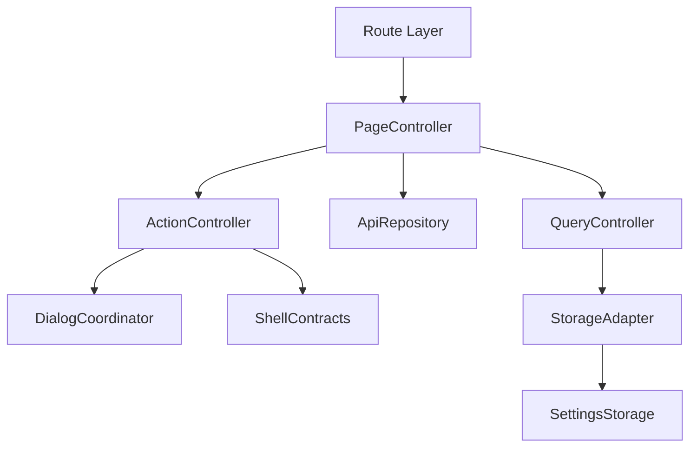
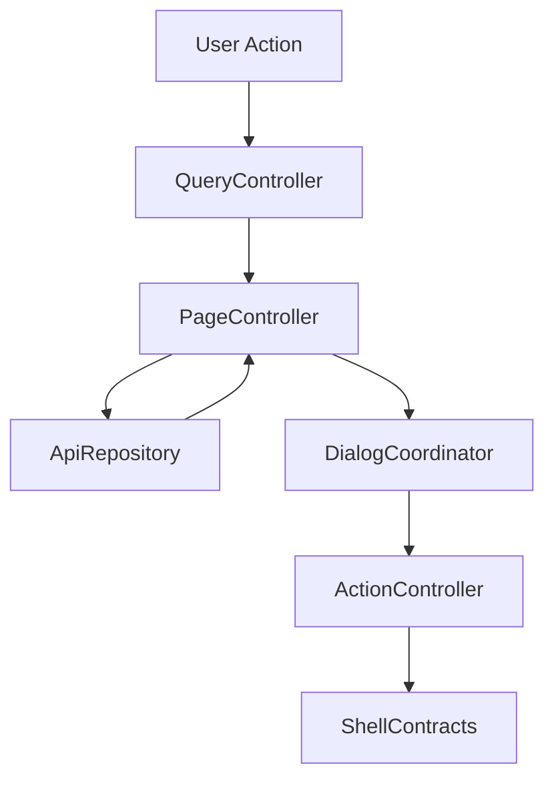

# 設計書: アプリケーションシェルとナビゲーション

## 概要

この仕様は 共通 shell、title bar、navigation
drawer、selected 判定、snackbar、version/reconnect の technical design を定める。

**ユーザー**: EPGStation の通常ユーザー、operator、関連 routed screen の実装者。

**影響**: requirements を component、route/query/API/localStorage contract、test
strategy に接続し、実装境界を曖昧にしない。

### 目標

- requirements の全受け入れ条件を design component と test に追跡可能にする。
- 決定済み React 技術選定を `client/` の file 構成として示す。
- `unittest/spec`、`unittest/imp`、E2E の最小 gate を明記する。

### 非目標

- 隣接 spec が所有する workflow、player lifecycle、settings default/backfill の取り込み。

## 境界の合意

### この仕様が所有するもの

- 共通 app shell、TitleBar / EditTitleBar の共通部品契約、navigation item 生成、selected item 判定、drawer
  responsive 挙動、navigation item click 挙動、version 表示、theme 反映、接続切断/再接続のユーザー可視挙動。
- App Shell が所有する route move、selected navigation、version refresh、snackbar host、reconnect
  behavior。screen-specific action、dialog、menu、bulk edit behavior は所有しない。
- 本 spec 配下の PageController、QueryController、ApiRepository、ActionController、DialogCoordinator、StorageAdapter の責務境界。ただし ActionController
  / DialogCoordinator は App Shell 固有の navigation、version、reconnect、snackbar host に限定する。

### 境界外

- Dashboard 以降の各 routed screen 本体、個別画面の list/dialog/form/player behavior、server path routing への移行。
- 実 URL、実番組名、認証情報、Mirakurun URL、ffmpeg/ffprobe 実 path、環境固有値の tracked docs への記録。

### 許可する依存

- 各 routed screen はこの App Shell の main content 領域に表示される。画面ごとの title、edit
  mode への遷移条件、snackbar 文言、API 詳細は該当 screen spec または後続 design で扱う。App Shell は
  `frontend-settings-storage` が定義する保存済み settings contract を読む consumer であり、settings の default
  value や migration/backfill を所有しない。
- `frontend-settings-storage` の保存済み settings contract と adjacent storage key registry。
- 既存 EPGStation REST API、version API、realtime connection event。
- hash route compatible router。

### 再検証トリガー

- requirements の受け入れ条件、route/query/API endpoint、snackbar 文言、dialog/menu action が変わる。
- `frontend-settings-storage` の field/default/validation/adjacent key default が変わる。
- `frontend-app-shell` の title/snackbar/navigation/edit title bar contract が変わる。

## アーキテクチャ

### アーキテクチャ前提

frontend は React と hash route を前提にし、hash route
compatibility、既存 API、localStorage contract、observed responsive behavior、snackbar/dialog/menu の表示条件を
本書の requirements に定義された通りに維持する。

formal design の正本は、この design と同一 spec の requirements、visual-cases、mock-data、ならびに `.kiro/steering/`
の project
memory とする。矛盾がある場合は同一 spec の requirements と requirements 横断レビューの反映済み判断を優先する。

### Shared text field clear action

全 routed owner の user-editable text-like input は shared `ClearableTextField` または owner 内の同等 clear
button を通す。非 select の MUI `TextField` を直接置く場合は静的検査で failure とし、raw `<input type="text">`
相当は同一 label/control 内に `...をクリア ` accessible name を持つ button を隣接させる。対象外は file input、range
slider、switch/checkbox、select/combobox、Autocomplete が生成する内部 input に限定する。shared clear adornment は MUI
`InputAdornment position="end"` の中央揃えを使い、negative margin で右端へ押し込まない。Settings の URL
Scheme など owner 固有 clear button も input
underline の縦中央に揃え、入力中に X が下端や右端からずれないことを regression test の対象にする。

### アーキテクチャパターンと境界マップ



**アーキテクチャ統合**:

- 選択したパターン: feature boundary + shared typed contracts。
- ドメイン/機能境界:
  route/query/API/action/dialog/storage を feature 内で分離し、settings と shell は consumer として参照する。
- 固定するパターン: hash route、API endpoint、dialog close cleanup、snackbar result、responsive
  breakpoint。
- Steering 準拠: 設計書は日本語。

### 技術スタック

| レイヤー                  | 選択 / バージョン                                                                                                                            | 機能内の役割                                                      | 備考                                                                                                                                                                                                                                                                                                                                                                                                                                                                                                                                                                                                                                                                 |
| ------------------------- | -------------------------------------------------------------------------------------------------------------------------------------------- | ----------------------------------------------------------------- | -------------------------------------------------------------------------------------------------------------------------------------------------------------------------------------------------------------------------------------------------------------------------------------------------------------------------------------------------------------------------------------------------------------------------------------------------------------------------------------------------------------------------------------------------------------------------------------------------------------------------------------------------------------------- |
| フロントエンド            | React / TypeScript / Vite                                                                                                                    | UI と typed contract                                              | package root は `client/`、package name は `epgstation-client`。                                                                                                                                                                                                                                                                                                                                                                                                                                                                                                   |
| ルーティング              | React Router hash route 対応 router                                                                                                          | route/query contract                                              | route contract は `/#/...`（hash route）とする。                                                                                                                                                                                                                                                                                                                                                                                                                                                                                                                                                                |
| Server state              | TanStack Query                                                                                                                               | API response cache、loading/error/refetch、Socket.IO invalidation | query key は route/query/API option から導出し、Socket.IO `updateStatus` などの event は該当 query invalidation/refetch に接続する。                                                                                                                                                                                                                                                                                                                                                                                                                                                                                                                                 |
| Local state               | React local state/reducer                                                                                               | screen/dialog/edit/bulk state と App Shell 横断 state             | Zustand は使わない。server state は TanStack Query が持ち、Snackbar・connection・server config など横断 state は App Shell の hook が持つ。                                                                                                                                                                                                                                                                                                                                                                                                                                                                                                                                   |
| UI / CSS                  | MUI Core + `@mdi/font` + theme token + `*.module.css`                                                                                          | MUI ベースの UI 実装、responsive、visual contract                | global CSS は `src/index.css`（Roboto の font-face、root の文書背景と `font-synthesis`、iOS 固定 shell の補正）に限定し、visual-cases の geometry/screenshot contract を theme/shared component に接続する。                                                                                                                                                                                                                                                                                                                                                                                                                                                                                                                                     |
| Form / validation         | React Hook Form + Zod                                                                                                                        | form state、submit validation、typed payload validation           | App Shell は form を所有しないが、consumer spec の form はこの境界に従う。                                                                                                                                                                                                                                                                                                                                                                                                                                                                                                                                                                                           |
| API client                | native `fetch` wrapper + typed request/response validation                                                                                   | backend integration                                               | repository base `./api` と endpoint path を二重結合しない。endpoint/query/body contract はこの design と requirements を正とする。                                                                                                                                                                                                                                                                                                                                                                                                                                                                                                                                   |
| Socket.IO                 | `socket.io-client`                                                                                                                           | realtime update trigger                                           | `socket.io-client` URL は `/api/config.socketIOPort` を指定した `${protocol}//${hostname}:${socketIOPort}` とし、path は subDirectory を含む `${subDirectory}/socket.io` とする。React dev server 経由で別端末からアクセスする場合、Vite proxy が `/api/config` response の `socketIOPort` を browser-facing dev server port へ書き換え、同じ origin の `/socket.io` websocket proxy へ到達させる。client connector は current origin fallback を持たず、config に含まれる port をそのまま使う。event handler は feature repository / TanStack Query invalidation 境界へ接続し、failure snackbar の有無は各 design の契約に従う。 |
| Lint / format / alias     | ESLint flat config + typescript-eslint + React Hooks plugin / Prettier / `@/`                                                                | static gate と import 解決                                        | `@/` は Vite / TypeScript / Vitest / ESLint で同一解決規則にする。                                                                                                                                                                                                                                                                                                                                                                                                                                                                                                                                                                                                   |
| Script gate               | `build` = `npm run bundle`（Vite production build のみ）、`build:verify` = lint + typecheck + unit test + build、`check` = lint + format:check + typecheck + `test:dev-server` + `unittest/spec` + `unittest/imp` | `client/package.json` の scripts                               | `build` は lint・test を含めず、`build:verify` が lint・typecheck・unit test・build をまとめる。format check は `check` が持つ。                                                                                                                                                                                                                                                                                                                                                                                                                                                                                                                                                                                                  |
| Test / coverage / browser | Vitest + V8 coverage / React Testing Library / Playwright / MSW                                                                              | `unittest/spec`、`unittest/imp`、E2E、visual regression           | 正式検証対象は Desktop Chromium、Desktop Firefox、Android Chrome、iOS Safari。visual は Playwright screenshot assertion と geometry assertion を併用する。                                                                                                                                                                                                                                                                                                                                                                                                                                                                                                           |

## ファイル構成

`client/src/App.tsx` は `app/AppRoot` を描画するだけの entry であり、shell の責務はすべて `client/src/app/` にある。

```text
client/src/
├── App.tsx                        # AppRoot を描画する entry。AppProps と MOBILE_NAVIGATION_CLICK_DELAY_MS を再 export
├── main.tsx                       # createRoot。fetch repository と Socket.IO connector を App へ渡す
├── app/
│   ├── AppRoot.tsx                # HashRouter / QueryClient / MUI theme provider と shell state の配線
│   ├── AppShellContent.tsx        # navigation item、選択判定、shell 用 hook の合成と AppShell の描画
│   ├── AppShell.tsx               # shell layout（drawer host、main、切断 overlay、snackbar host）
│   ├── AppShell.module.css
│   ├── appProps.ts                # AppProps、RoutedApiRepositories、MOBILE_NAVIGATION_CLICK_DELAY_MS
│   ├── components/
│   │   ├── DrawerHost.tsx         # navigation drawer と item button
│   │   └── ShellSnackbarHost.tsx  # snackbar 表示と ShellSnackbarState
│   ├── hooks/
│   │   ├── useServerConfigState.ts      # GET /config、GET /version、bootstrap channels の取得と version 状態
│   │   ├── useShellSnackbar.ts          # snackbar 状態と route 変更時の close 抑制
│   │   ├── useRealtimeConnection.ts     # Socket.IO 接続、切断 overlay、再接続 route 復元、query 無効化
│   │   ├── useRouteScrollRestoration.ts # route 変更時の scroll 保存 / 復元
│   │   ├── useNavigationItemClick.ts    # drawer item click と mobile drawer close 後の遅延遷移
│   │   ├── useIOSAddressBarFix.ts       # iOS 向け fix-address-bar2 class の付与
│   │   ├── useFixedShellViewport.ts     # 固定 shell の viewport 高さ、title bar 高さ、touch scroll bridge
│   │   ├── useDrawerUserState.ts        # drawer の user state と desktop breakpoint 跨ぎの reset
│   │   ├── useIsDesktopViewport.ts      # desktop/mobile drawer breakpoint の判定（matchMedia 購読）
│   │   ├── useShellSettings.ts          # theme / navigation / dashboard settings の保存値と preview
│   │   ├── useDefaultRepositories.ts    # 各 feature の fetch repository と session scroll history の既定生成
│   │   └── useResolvedViewportWidth.ts  # 数値の viewport 幅の購読（feature layout 用、drawer breakpoint には使わない）
│   ├── lib/
│   │   ├── routePath.ts               # hash route path、timestamp 正規化、navigation path 生成
│   │   ├── routeScroll.ts             # 固定 shell / window の scroll 位置の読み書き
│   │   ├── serverConfigSelectors.ts   # loaded config から encode mode、directory、url scheme 等を取り出す
│   │   └── shellSettingsSnapshots.ts  # localStorage からの settings snapshot と PWA 起動設定
│   ├── routes/
│   │   ├── AppRoutes.tsx          # Routes 本体と unknown route の placeholder
│   │   ├── routeProps.ts          # route table が受け取る props
│   │   ├── broadcastRoutes.tsx    # `/`、`/guide`、`/guide/setting`、`/onair`、`/onair/watch`
│   │   ├── recordedRoutes.tsx     # `/recorded`、`/recorded/detail/:id`、`/recorded/watch`、`/recorded/streaming/:videoFileId`
│   │   └── managementRoutes.tsx   # `/recorded/upload`、`/recording`、`/encode`、`/reserves`、`/reserves/manual`、`/search`、`/rule`、`/storages`、`/settings`
│   ├── navigation/
│   │   ├── index.ts               # barrel
│   │   ├── types.ts               # NavigationItem、NavigationConfigState、BROADCAST_WAVE_ORDER
│   │   ├── items.ts               # navigation item 生成
│   │   ├── routeMatching.ts       # 選択判定、遷移先生成、push 判定、location からの route 生成
│   │   └── regenerationRequest.ts # settings 保存後の再生成要求
│   ├── scroll/
│   │   ├── scrollHistoryTypes.ts  # ScrollHistoryState、done-get-data signal
│   │   ├── memoryScrollHistory.ts # test / synthetic shell 用の in-memory 実装
│   │   ├── sessionScrollHistory.ts# sessionStorage 実装
│   │   └── scrollHistoryContext.ts# provider、useScrollHistory、page-ready、restore helper
│   ├── scrollHistory.ts           # scroll/ の barrel
│   ├── api/
│   │   ├── serverApiTypes.ts          # FeatureResult、ServerApiRepository、config 型、失敗 message
│   │   ├── fetchServerApiRepository.ts# `./api` base の fetch wrapper（/version、/config、/channels）
│   │   ├── serverConfigAdapters.ts    # GET /config 応答の adapter
│   │   └── streamConfigAdapters.ts    # stream config の adapter と iOS filter
│   ├── serverApi.ts               # api/ の barrel
│   ├── titleBar/                  # TitleBar / EditTitleBar と contract
│   ├── theme.ts、drawerLayout.ts、realtime.ts、realtimeInvalidation.ts、pwa.ts、settingsStorageAdapter.ts、browserAdapters.ts
├── features/                      # routed screen。screen 固有の menu / dialog / action は各 feature が所有する
└── shared/                        # settings、AppSelect、ClearableTextField、AppPagination、LegacyPagination、ExtendedPagination
```

test:

- `client/unittest/spec/appShell.{bootstrap,theme,drawerLayout,version,realtime,scrollHistory}.spec.test.tsx`（共通 helper は `unittest/spec/support/appShellSpecSupport.tsx`）、`navigation.{items,routeMove}.spec.test.tsx`、`titleBar.spec.test.tsx`、`uiProblem2Static.{select,inputs}.spec.test.ts`（`unittest/spec/support/staticSourceListing.ts`）。
- `client/unittest/imp/appShell.{themeDocument,drawerPwa,apiRepository,configAdapters,scrollHistory,realtime}.imp.test.ts`、`navigation.imp.test.ts`、`titleBar.imp.test.ts`、`viteConfig.imp.test.ts`。
- e2e: `client/e2e/app-shell-{navigation,scroll,drawer}-workflow.spec.ts`（`e2e/support/appShellWorkflow.ts`）、`app-smoke.spec.ts`、`dark-ui-{controls,cards,guide,recorded,reserves}.spec.ts`（`e2e/support/darkUiExpectations.ts`、`uiAudit.ts`、`uiAuditColor.ts`）、`realtime-refresh-workflow.spec.ts` と `realtime-refresh-broadcast-workflow.spec.ts`（`e2e/support/realtimeHarness.ts`）。
- visual: `client/visual/app-geometry.spec.ts`。
- 本物の v3 server に繋ぐ e2e: `client/e2e/real-server/app.real.ts`（設定 `e2e/real-server/playwright.config.ts`、`e2e/real-server/support/{globalSetup,realServer}.ts`）。compile した server が配る client の build を、本物の API・Socket.IO・sqlite と手作りの tuner server で動かし、dashboard・番組表からの予約・別の client が足した予約の Socket.IO による一覧の更新・放映中・録画済み・録画中・エンコード・ルール・ストレージの画面、`subDirectory` の下での API と Socket.IO の path、service worker の登録と PWA を切ったときの manifest の除去を確かめる。通常の e2e の `page.route` + msw の合成の応答と対になる。`e2e/real-server/mock-contract.real.ts` は、通常の e2e の偽 API が返す JSON と本物の server の応答を、server が公開する API の定義（`/api/docs`）の応答の schema で検証し、偽 API が持たない field を記録する。

## システムフロー



Flow は route/query/API/localStorage 境界で validation し、UI component が endpoint 文字列や localStorage
schema を直接所有しない構造にする。

## 要件トレーサビリティ

| 要件                                        | 概要                                  | コンポーネント                                                                                      | インターフェース      | フロー                                                |
| ------------------------------------------- | ------------------------------------- | --------------------------------------------------------------------------------------------------- | --------------------- | ----------------------------------------------------- |
| 1.1, 1.2, 1.3, 1.4, 1.5, 1.6, 1.7           | 共通 Shell と画面表示                 | PageController, QueryController, ApiRepository, ActionController, DialogCoordinator, StorageAdapter | State / Service / API | route/query/action flow                               |
| 2.1-2.12                                    | Title Bar と Edit Title Bar           | PageController, QueryController, ApiRepository, ActionController, DialogCoordinator, StorageAdapter | State / Service / API | route/query/action flow                               |
| 3.1-3.16                                    | Navigation Item 生成                  | QueryController, ActionController, StorageAdapter, ApiRepository                                    | State / Service / API | config/settings から navigation model を生成          |
| 4.1, 4.2, 4.3, 4.4, 4.5, 4.6, 4.7, 4.8      | Selected Navigation 判定              | PageController, QueryController, ApiRepository, ActionController, DialogCoordinator, StorageAdapter | State / Service / API | route/query/action flow                               |
| 5.1-5.22                                    | Drawer Responsive と Navigation Click | PageController, QueryController, ApiRepository, ActionController, DialogCoordinator, StorageAdapter | State / Service / API | route/query/action flow                               |
| 6.1-6.23                                    | Version 更新と接続状態                | PageController, ApiRepository, ActionController, DialogCoordinator                                  | State / Service / API | version/socket/snackbar/reconnect/scroll history flow |
| 7.1-7.13                                    | dark theme shell coverage             | StorageAdapter, PageController                                                                      | State                 | theme 反映と dark theme の静的 regression             |
| 8.1-8.49                                    | 共有 form control と静的 guard        | 共有 form control（AppSelect、ClearableTextField、AppPagination、LegacyPagination、ExtendedPagination）                              | UI contract           | 共有 control の描画と静的検査                         |

## コンポーネントとインターフェース

| コンポーネント    | ドメイン/レイヤー | 意図                                                                                                                                                                                                                                                                      | 要件カバレッジ                      | 主な依存                                                        | 契約        |
| ----------------- | ----------------- | ------------------------------------------------------------------------------------------------------------------------------------------------------------------------------------------------------------------------------------------------------------------------- | ----------------------------------- | --------------------------------------------------------------- | ----------- |
| PageController    | Feature Routing   | route 初期化、title、fetch、loading/error/empty を統括する。                                                                                                                                                                                                              | 1.1-1.7, 2.1-2.12, 4.1-4.8, 6.4-6.11 | frontend-settings-storage / frontend-app-shell / EPGStation API | 状態管理    |
| QueryController   | Feature Routing   | path/query/local UI input を typed model に変換する。                                                                                                                                                                                                                     | 3.1-3.14, 5.1-5.22                  | frontend-settings-storage / frontend-app-shell / EPGStation API | Service     |
| ApiRepository     | Feature API       | requirements で定義された endpoint request と typed error 変換を扱う。                                                                                                                                                                                                    | 1.1-1.7, 6.1-6.3, 6.8, 6.9          | frontend-settings-storage / frontend-app-shell / EPGStation API | API         |
| ActionController  | Feature Service   | navigation click、drawer toggle、route move、route boundary timestamp normalization、version refresh、reconnect restore、navigation regeneration request、snackbar close、scroll history shared contract だけを扱う。screen-specific menu/dialog/bulk action は扱わない。 | 2.2, 3.10, 3.16, 5.4-5.22, 6.1-6.23 | frontend-settings-storage / frontend-app-shell / EPGStation API | Service/API |
| DialogCoordinator | Feature UI        | App Shell 固有の disconnected overlay、snackbar host visibility、scroll-data completion 待機を扱う。screen-specific dialog/menu/focus は扱わない。                                                                                                                        | 6.4, 6.6, 6.7, 6.14, 6.15           | frontend-app-shell                                              | 状態管理    |
| StorageAdapter    | Shared Boundary   | App Shell が読む theme/navigation/PWA settings だけを consumer として扱う。settings default/backfill と隣接 workflow storage は所有しない。                                                                                                                               | 1.3, 3.4-3.10, 3.15, 3.16, 6.7      | frontend-settings-storage                                       | 状態管理    |

### ページ制御（PageController）

| 項目 | 詳細                                                                               |
| ---- | ---------------------------------------------------------------------------------- |
| 意図 | route 初期化、title、loading/error/empty、child component composition を統括する。 |
| 要件 | 1.1-1.7, 2.1-2.12, 4.1-4.8, 6.4-6.11                                                |

**責務と制約**

- route entrypoint と screen lifecycle だけを所有する。
- fetch/action の副作用は ApiRepository と ActionController へ委譲する。
- App Shell title/snackbar/edit title bar へは typed request だけを渡す。
- dark theme は drawer/title/snackbar だけでなく routed main content root へ `data-theme-mode` または同等の theme
  context を伝播する。Navigation icon、Material Symbols fallback icon、icon-only button、pagination、dialog portal、menu
  portal は contrast token を共有し、background と同化しない。
- MUI checkbox は全 routed screen で App Shell theme の `MuiCheckbox` override を正とする。unchecked は
  `text.secondary`、checked は light/dark それぞれの `primary.main`、disabled は `text.disabled` を使い、screen-local
  CSS で checked color を灰色や固定色へ戻してはならない。screen-local label/layout rule が `.MuiCheckbox-root`
  の unchecked color を指定する場合も、`.MuiCheckbox-root.Mui-checked` は `--mui-palette-primary-main` または MUI
  `color="primary"` を明示して checked state を必ず勝たせる。
- MUI select / TextField select / shared `AppSelect` は App Shell theme の select/menu contract を正とする。listbox
  Paper は dark theme token を継承し、menu max height は 48px item の 4.5 行分相当を上限とする。MUI の select
  icon 以外に CSS pseudo-element や span で下三角を重ねて描画してはならない。empty value 用の placeholder は selected
  display/fallback 専用として hidden item にし、field name、設定 key、`directory` / `channel` / `start` / `range`
  などを open listbox の visible option として露出してはならない。
- App Shell theme は CSS module から参照される
  `--mui-palette-background-default`、`--mui-palette-background-paper`、`--mui-palette-text-primary`、`--mui-palette-text-secondary`、`--mui-palette-text-disabled`、`--mui-palette-divider`、`--mui-palette-primary-main`
  を `body` に発行する。routed CSS module が `var(--mui-palette-*, fallback)`
  を使う場合、fallback は未初期化時だけの安全網であり、dark
  theme 実行時に fallback の白背景/黒文字へ落としてはならない。

### クエリ制御（QueryController）

| 項目 | 詳細                                                                   |
| ---- | ---------------------------------------------------------------------- |
| 意図 | route query、path param、form/filter input を typed model に変換する。 |
| 要件 | 3.1-3.14, 5.1-5.22                                                     |

**責務と制約**

- `unknown` / string query を domain type へ narrow する。
- invalid input は requirements に従い normalize、ignore、controlled error、または no-op に変換する。
- route refresh 用 `timestamp` は user-facing filter state へ露出しない。

### API リポジトリ（ApiRepository）

| 項目 | 詳細                                                                   |
| ---- | ---------------------------------------------------------------------- |
| 意図 | API request builder、response adapter、typed error conversion を扱う。 |
| 要件 | 1.1-1.7, 6.1-6.3, 6.8, 6.9                                             |

**責務と制約**

- endpoint は requirements を正とする。
- request body/query は explicit type で定義し、TypeScript の `any` を使わない。
- API failure は UI へ例外を漏らさず typed error として返す。

### アクション制御（ActionController）

| 項目 | 詳細                                                                                                     |
| ---- | -------------------------------------------------------------------------------------------------------- |
| 意図 | navigation click、drawer toggle、route move、version refresh、reconnect restore、snackbar close を扱う。 |
| 要件 | 2.2, 3.10, 5.4-5.22, 6.1-6.23                                                                            |

**責務と制約**

- App Shell 固有の navigation、version、reconnect、snackbar close だけを実行する。
- Settings Screen からの navigation regeneration request（payload を持たない DOM CustomEvent
  `epgstation:navigation-regeneration-request`）を受け取り、server config と保存済み settings から navigation
  item を再生成する。request 発行側は `frontend-settings-screen`、受信と再生成は App Shell が所有する。
- screen-specific menu、dialog submit、bulk action、destructive action、refetch は各 routed screen owner
  spec に委譲する。
- common route move は `timestamp` と duplicate push guard を維持する。
- route boundary は root route `/#/` を除く全 routed URL を検査し、`timestamp` が欠落している場合は `replace` で current
  query に `timestamp` を追加する。これにより navigation drawer 以外の screen-owned `navigate`、dialog/menu
  action、direct URL、browser history restore でも scroll history key が欠落しない。
- route boundary の `replace` は user-visible history entry を増やさず、`timestamp` を filter state や API request
  query に渡さない。screen owner は `timestamp` を business query として解釈してはならない。

### ダイアログ調整（DialogCoordinator）

| 項目 | 詳細                                                      |
| ---- | --------------------------------------------------------- |
| 意図 | disconnected overlay と snackbar host visibility を扱う。 |
| 要件 | 6.4, 6.6, 6.7, 6.14, 6.15                                 |

**責務と制約**

- App Shell は screen-specific dialog/menu を所有しない。
- disconnected overlay は connection state に従って表示/非表示を切り替える。
- snackbar host は route change 時の close と request 表示だけを扱う。

### ストレージアダプター（StorageAdapter）

| 項目 | 詳細                                                                    |
| ---- | ----------------------------------------------------------------------- |
| 意図 | App Shell が読む theme/navigation settings だけを consumer として扱う。 |
| 要件 | 1.3, 3.4-3.10, 6.7                                                      |

**責務と制約**

- settings default、backfill、validation は `frontend-settings-storage` に委譲する。
- App Shell は adjacent workflow storage key を所有しない。
- 保存済み値の parse failure は settings storage contract に従う。

### API 契約

この表の endpoint は frontend repository contract であり、`./api` の base path は含めない。決定済み native `fetch` wrapper に基づいて API client を作る場合も base path と endpoint
path を二重に結合しない。

| メソッド | エンドポイント                               | リクエスト                                                                  | レスポンス                                                                                           | エラー                                                                                                               |
| -------- | -------------------------------------------- | --------------------------------------------------------------------------- | ---------------------------------------------------------------------------------------------------- | -------------------------------------------------------------------------------------------------------------------- |
| GET      | /config                                      | none                                                                        | server configuration for live/guide/navigation capability                                            | initial fetch failure shows `設定ダウンロードに失敗しました ` (`color=error`, `timeout=5000`)                         |
| GET      | /version                                     | none                                                                        | version string                                                                                       | failure shows `バージョン情報取得に失敗 ` (`color=error`)                                                             |
| EVENT    | socket.io disconnect                         | socket disconnect                                                           | disconnected overlay visible                                                                         | `接続が切断されました ` snackbar                                                                                      |
| EVENT    | socket.io initialize                         | socket initialize result                                                    | socket instance                                                                                      | null result shows `SocketIO の初期設定に失敗しました ` (`color=error`)                                                |
| EVENT    | dev proxy `/api/config` socketIOPort rewrite | React dev server receives backend config with a backend-only Socket.IO port | rewrite `socketIOPort` to the browser-facing dev server port before returning config to the browser  | no change to the client-side Socket.IO connector implementation is required; `/socket.io` proxy becomes usable from desktop and other terminals |
| EVENT    | socket.io connect after disconnect           | previous full route                                                         | routed server state query invalidation, then two-step restore via Dashboard then previous full route | route restore (`navigate` call) の失敗を捕捉する notification は無い                                                              |
| EVENT    | socket.io updateStatus                       | application state update                                                    | Socket.IO invalidation matrix の query を invalidate し、`refreshVersion({ notifyOnFailure: false })` で version も refresh する（version 取得失敗は通知しない）                                                     | `refreshVersion` の failure は snackbar を出さない                                                                |

#### Socket.IO query invalidation matrix

各画面が自分の状態を取り直す責務を、App
Shell の中央 invalidation 定義へ集約する。`updateStatus` は特定操作専用ではなくサーバ状態全体の変更通知であるため、
`src/app/realtimeInvalidation.ts` を唯一の正本として次の query key を invalidate する。

| Event                               | Query key                            | 反映先                                                                |
| ----------------------------------- | ------------------------------------ | --------------------------------------------------------------------- |
| `updateStatus`                      | `dashboard/summary`                  | Dashboard の reserve counts / recording / recorded / reserves summary |
| `updateStatus`                      | `guide/reserveIndex`                 | Guide grid と ProgramDialog の reserve/conflict/skip/overlap state    |
| `updateStatus`                      | `onair/broadcasting`                 | On Air list と reserve state                                          |
| `updateStatus`                      | `onair/watch-info`                   | On Air watch info card                                                |
| `updateStatus`                      | `recorded/list`                      | Recorded list/card/table                                              |
| `updateStatus`                      | `recorded/detail`                    | Recorded detail、video files、encode追加、thumbnail/protect state     |
| `updateStatus`                      | `video-playback/recorded-watch-info` | Recorded watch/streaming info card                                    |
| `updateStatus`                      | `recording/list`                     | Recording list                                                        |
| `updateStatus`                      | `encode/list`                        | Encode list                                                           |
| `updateStatus`                      | `reserves/list`                      | Reserves list                                                         |
| `updateStatus`                      | `search-rule`                        | Search results、rule list/detail、rule reserve index                  |
| `updateStatus`                      | `storages`                           | Storages list                                                         |
| `updateEncode`                      | `encode/list`                        | Encode progress/list                                                  |

この表を変更する場合は `unittest/imp/appShell.realtime.imp.test.ts` の matrix
test を先に更新し、別端末での実操作 E2E で「操作した端末とは別の画面が Socket.IO 経由で更新される」ことを確認する。socket
event を直接 emit するだけの E2E は補助検証であり、実操作から mutation、server
event、他端末 refetch までを通す検証を網羅確認とする。

#### Socket.IO reconnect invalidation matrix

realtime restore は `disconnect` 後の `connect` success で `navigate('/', { replace: true })`、`setTimeout(..., 0)` 後の
previous full route restore を実行する。これにより各 routed page の route watcher が再実行され、`updateStatus`
event が配送されなかった切断中の変更も route fetch として取り直される。React Query の fresh cache が再利用されて再取得が
省略されないよう、reconnect success 時に設定画面以外の routed server state
query を明示的に invalidate してから Dashboard 経由の restore を開始する。`window.location.reload()`、`window.location`
navigation、Vite HMR full reload には依存してはならない。

| Event                      | Query key                            | 反映先                                                                |
| -------------------------- | ------------------------------------ | --------------------------------------------------------------------- |
| `connect after disconnect` | `dashboard/summary`                  | Dashboard の reserve counts / recording / recorded / reserves summary |
| `connect after disconnect` | `guide/schedule`                     | Guide grid の番組情報                                                 |
| `connect after disconnect` | `guide/reserveIndex`                 | Guide grid と ProgramDialog の reserve/conflict/skip/overlap state    |
| `connect after disconnect` | `onair/broadcasting`                 | On Air list と reserve state                                          |
| `connect after disconnect` | `onair/watch-info`                   | On Air watch info card                                                |
| `connect after disconnect` | `recorded/list`                      | Recorded list/card/table                                              |
| `connect after disconnect` | `recorded/detail`                    | Recorded detail、video files、encode追加、thumbnail/protect state     |
| `connect after disconnect` | `video-playback/recorded-watch-info` | Recorded watch/streaming info card                                    |
| `connect after disconnect` | `recording/list`                     | Recording list                                                        |
| `connect after disconnect` | `encode/list`                        | Encode progress/list                                                  |
| `connect after disconnect` | `reserves/list`                      | Reserves list                                                         |
| `connect after disconnect` | `search-rule`                        | Search results、rule list/detail、rule reserve index                  |
| `connect after disconnect` | `storages`                           | Storages list                                                         |

### 共有型契約

```typescript
type FeatureResult<T, E extends string> = { ok: true; value: T } | { ok: false; error: E; message: string };

interface RouteBuildResult {
    path: string;
    query: Record<string, string>;
}

interface SnackbarRequest {
    text: string;
    color?: 'normal' | 'success' | 'info' | 'error';
    timeout?: number;
}

// NavigationRegenerationRequest は typed interface ではなく、payload を持たない DOM CustomEvent として実装されている
// （実装 `client/src/app/navigation/regenerationRequest.ts`）。
type NavigationRegenerationEvent = CustomEvent<void>;

declare const NAVIGATION_REGENERATION_EVENT: 'epgstation:navigation-regeneration-request';

declare function requestNavigationRegeneration(target: EventTarget): void;

declare function subscribeToNavigationRegenerationRequests(
    target: EventTarget,
    handler: (event: NavigationRegenerationEvent) => void,
): () => void;

interface ScrollHistoryState {
    isNeedRestoreHistory(): boolean;
    saveScrollData<T>(data: T, url?: string): void;
    getScrollData<T>(): T | null;
    getHistoryPosition(): { x: number; y: number } | null;
    updateHistoryPosition(position?: { x: number; y: number }, url?: string): void;
    emitDoneGetData(): void;
    onDoneGetData(timeout?: number): Promise<void>;
    clearRestoreHistory(): void;
}
```

`SnackbarRequest` の default は `color` 省略または `normal` のとき neutral dark snackbar 相当の semantic
token（背景 `#424242`）、`timeout` 省略時 `1500` とする。Snackbar の foreground は theme
mode に依存させず message と action の両方を白文字に固定し、MUI `SnackbarContent` の default foreground や dark theme
text token へ委譲しない。具体的な background token は MUI theme と EPGStation 固有 shared
component で決める。version 取得失敗は `バージョン情報取得に失敗 ` (`color=error`)、初期 server config fetch failure は
`設定ダウンロードに失敗しました ` (`color=error`, `timeout=5000`)、Socket.IO 初期設定失敗は
`SocketIO の初期設定に失敗しました ` (`color=error`)、disconnect は `接続が切断されました ` (`color=error`, timeout
default)、reconnect は `再接続されました ` (default snackbar) とする。

snackbar の min-height は `48px` とし、`ShellSnackbarHost.tsx` の `minHeight` を `48`（48px）とする。

`ShellSnackbarHost.tsx` は表示する snackbar ごとに MUI `Snackbar` の `key` を切り替え、自動消去の timer を
snackbar ごとに作り直す。`open` が `true` のまま内容だけが差し替わると、MUI の timer は前の snackbar の開始時刻から
数え続け、後から表示した snackbar を残り時間の途中で（描画前なら表示されないまま）閉じてしまうためである。

## 機能固有の設計判断

### ナビゲーション項目生成表

| config 状態       | `isEnableDisplayForEachBroadcastWave` | 有効な放送波 | 番組表 item 結果                                                                    |
| ----------------- | ------------------------------------- | ------------ | ----------------------------------------------------------------------------------- |
| config not loaded | any                                   | unknown      | loading-time placeholder として generic `番組表 ` を表示できる。                     |
| config loaded     | false                                 | 0            | `番組表 ` を表示しない intentional fix。                                             |
| config loaded     | false                                 | 1+           | generic `番組表 ` を 1 件表示する。                                                  |
| config loaded     | true                                  | 0            | `番組表 ` を表示しない。generic fallback もしない。                                  |
| config loaded     | true                                  | 1            | enabled wave の `番組表 GR/BS/CS/SKY/BS4K` を 1 件表示する。generic `番組表 ` にはしない。 |
| config loaded     | true                                  | 2+           | enabled wave の数だけ `GR`, `BS`, `CS`, `SKY`, `BS4K` 順で表示する。                 |

`放映中 ` は TS live stream capability が true のときだけ表示する。settings save が成功した後は reload せず
navigation item を再生成する。

基本 navigation item は次の順序と route/icon/label を formal design 内の正本として持つ。Guide item の詳細だけを research
draft に依存させない。

| 順序 | label                                               | icon                  | route                     |
| ---- | --------------------------------------------------- | --------------------- | ------------------------- |
| 1    | ダッシュボード                                      | mdi-view-dashboard    | `/`                       |
| 2    | 放映中                                              | mdi-television-play   | `/onair`                  |
| 3    | 番組表 / 番組表 GR / 番組表 BS / 番組表 CS / 番組表 SKY / 番組表 BS4K | mdi-television-guide  | `/guide`                  |
| 4    | 録画中                                              | mdi-radiobox-marked   | `/recording`              |
| 5    | 録画済み                                            | mdi-filmstrip-box-multiple | `/recorded`          |
| 6    | エンコード                                          | mdi-sync              | `/encode`                 |
| 7    | 予約                                                | mdi-clock-outline     | `/reserves?type=normal`   |
| 8    | 競合                                                | mdi-clock-outline     | `/reserves?type=conflict` |
| 9    | 重複                                                | mdi-clock-outline     | `/reserves?type=overlap`  |
| 10   | 検索                                                | mdi-magnify           | `/search`                 |
| 11   | ルール                                              | mdi-calendar          | `/rule`                   |
| 12   | ストレージ                                          | mdi-sd                | `/storages`               |
| 13   | 設定                                                | settings              | `/settings`               |

icon 列は `client/src/app/navigation/items.ts` の実装と一致する。

### ルート遷移と選択判定

- navigation endpoint は repository base とは無関係な hash route target として扱う。
- common route move は `timestamp` を付与する。ただし同一 path かつ `timestamp` 以外の query が同一なら route
  push を行わない。
- route boundary は root route `/#/` 以外の全 route に `timestamp` 欠落があれば `replace`
  で補完する。補完対象は navigation item click に限定せず、screen-owned `navigate`、dialog/menu action、direct
  URL、browser back/forward を含む。
- route boundary の `timestamp` 補完 `replace` は current `location.state` を引き継ぐ。screen-owned `navigate`
  が transient state で side effect 抑止、history restore、handoff
  metadata を渡す場合、URL 正規化によって state を破棄してはならない。
- route boundary の `timestamp` 補完は、既に mount 済みの routed screen subtree（`AppRoutes`、または test 用の
  `AppShellContent`/`App` `children` override）を維持したまま行う。`<Navigate>` 要素へ描画を差し替える実装は使わない。
  `AppShellContent.tsx` の JSX で `<AppRoutes>`（または `children`）と `<Navigate>` を三項演算子で入れ替えると、要素種別の
  変化により React がその配下全体を unmount / 再 mount してしまい、pagination（`RecordedPage.tsx` /
  `ReservesPage.tsx` の `goToPage`）、filter 変更、検索 dialog の適用（`RecordedSearchDialog` の `onNavigate`）など
  `timestamp` を含めずに `navigate` する screen-owned 遷移のたびに screen local state（録画/予約一覧の編集 mode、
  選択状態）が失われる。これらの screen-owned `navigate` はいずれも `buildRecordedPageSearch` /
  `buildReservesPageSearch` / `buildRecordedSearchPath` で `timestamp` を明示的に削除または省略しており、
  timestamp 付与を route boundary 側に委ねている。そのため route boundary 自身が mount 状態を壊さないことが
  必須となる。
  実装は 2 段構えである。(1) 実際の browser/router location は `navigate(path, { replace: true, state })` を effect
  から呼んで補完する。(2) それとは別に、`AppShellContent.tsx` は `children ?? <AppRoutes>` 全体を
  `<Routes location={routeLocationOverride}>` で包み、`routeLocationOverride` に「router 上の実 location がまだ
  `timestamp` 欠落のままでも、補完後の値に固定した location」を毎 render 渡す。react-router の `useRoutesImpl` は
  `location` 引数を渡すとその配下の `useLocation()` を丸ごとこの値で上書きする（`<Routes location>` prop の標準機能）。
  結果として routed screen 側は router 本体の補完が完了するのを待たず、常に補完済みの location だけを観測する。この
  layer は、単に `<AppRoutes>` を常に描画するだけ（`<Navigate>` を撤去するだけ）では不十分であるために必要である。
  `<AppRoutes>` を常時描画する変更単独では、`AppRoutes` 配下の unmount は防げるものの、routed screen 側が生の
  （`timestamp` 欠落の）
  location を 1 render 分だけ実際に観測してしまう。`StoragesPage`・`RecordedPage`（`createRecordedQueryKey`）など
  raw `location.search` を React Query の queryKey に含める screen では、`timestamp` の有無だけが変わる 2 つの
  異なる search 値を連続して観測することになり、2 回目の値のために不要な再 fetch が発生する
  （`unittest/spec/storages.spec.test.tsx` の AC 1.3 は、route 駆動の再 fetch 中に stale な一覧を表示し続けないことを
  検証するが、この二重 fetch 自体の発生有無は検証しない）。`routeLocationOverride`
  は「`timestamp` 補完待ちかどうかに関わらず毎 render 渡す」ことも必須で、`timestamp` 補完の有無に応じて
  `undefined` と object を切り替えると、react-router `useRoutesImpl` が `location` 引数の有無で追加の
  `LocationContext.Provider` wrapper を出し分ける実装になっているため、その wrapper の有無自体が render 間で
  変化し、結局同じ unmount 問題を再発させる。`children` override を使う test（例:
  `searchRule.timeSpecified.spec.test.tsx`）も同じ `<Routes location>` の配下に置くことで、routed screen と同じ保護を
  受ける。
- selected 判定は item が持つ query key だけを比較し、`timestamp`、Guide の `time` / `channelId`
  など item 未定義 query は無視する。
- generic `番組表 ` click は `/guide` だけを target にし、`type` / `time` / `channelId` を追加しない。broadcast-wave item
  click は `type` だけを追加する。
- Guide route へ遷移するときに現在時刻、channel、scroll など Guide 固有 query を組み立てる責務は `frontend-guide`
  にあり、Navigation は static target と `type` のみを所有する。

### TitleBar / EditTitleBar 契約

- TitleBar は navigation icon、title、right action slot、extension slot、title click handler、browser title
  sync を提供する。
- TitleBar / EditTitleBar は共通部品 contract だが、描画と state は各 routed
  screen が所有する。`AppShell` は navigation drawer（`DrawerHost`）、routed screen content（`AppRoutes`）、
  `ShellSnackbarHost` を保持し、screen-specific title/dialog/menu を所有しない。
- screen は title click が必要な場合のみ handler を渡す。App Shell は screen-specific dialog を所有しない。
- EditTitleBar close は `exit` equivalent callback と `isEditMode=false` update を同時に発火する。`selectall` と
  `delete` は screen owner へ event として渡す。
- EditTitleBar の app bar 背景は light theme で `#ffffff`（白）を使う。`pageBackground`（`#f5f5f5`、
  `background.default` token）と混同しない。dark theme は `LEGACY_DARK_APP_BAR_COLOR = '#272727'` を維持する。

### Snackbar / version / reconnect / theme 契約

route change 時の snackbar close は、`useRouteScrollRestoration.ts` の effect が無条件に
`snackbarState.close()` を呼ぶ。ただし `suppressedRouteSnackbarClosesRef` が正の間は close を抑制する。
この ref は reconnect 復元（`useRealtimeConnection.ts` の two-step restore、`navigate('/', { replace: true })` の後に
previous full route へ `replace` する 2 回の route change）の直前に `2` へ設定され、restore が発生させる
2 回の route change close を消費してから通常の無条件 close に戻る。これにより reconnect 成功後に表示する
`再接続されました ` snackbar が、restore 自体の route change によって即座に閉じられることを防ぐ。

- route change 時に visible snackbar を閉じ、scroll history state を更新する。React Router は scroll position を
  保存しないため、browser history restore ではない通常の route 遷移では active page scroll container を即時
  `{ x: 0, y: 0 }` へ戻す。browser back / forward など history restore の場合だけ保存済み scroll
  position を completion 後に適用する。App Shell 起動中は browser native の `history.scrollRestoration` を `manual`
  に固定し、native restore と React route boundary の復元処理が競合しないようにする。
- Scroll history shared contract は App Shell が提供し、各 routed screen が consume する。`isNeedRestoreHistory()`
  は browser history navigation による復元対象かを返し、`saveScrollData(data)` は screen 固有 PageInfo または scroll
  position を保存し、`getScrollData<T>()` は保存済み data を typed boundary で返す。`updateHistoryPosition({ x, y })`
  は route leave/update 時の scroll position を記録する。React Router は scroll position を保存しないため、App
  Shell は active page scroll container の user scroll、pointer / keyboard による route 遷移直前、navigation item
  click 直前に現在 route の scroll position を保存する。App Shell 自身が top reset または history restore の scroll
  position を適用している間に発火した scroll event は保存対象外とし、復元済み位置を上書きしない。scroll history
  key は hash route の path と query 全体で保持する。`timestamp` 単体、または `timestamp` だけを route
  path に足した key にしてはならない。`/rule?page=2`、`/rule?page=3`、`/recorded?page=2` など、同一 timestamp
  でも `page` や filter query が異なる browser history entry は別 scroll position として保存・復元する。Pagination による route 遷移では、遷移を発火する直前に active page scroll
  container の現在位置を保存する。Browser back / forward で既存 history entry を選んだ場合は、保存済み position を
  `{ x: 0, y: 0 }` で上書きしてはならない。 `emitDoneGetData()`
  は screen 側の data 取得と初期描画準備完了を通知し、`onDoneGetData(timeout?)` は App Shell /
  screen の restore 処理が completion を待つために使う。全 routed screen は初期 fetch / 初期 DOM の準備完了後に
  `emitDoneGetData()` を発火する。fetch を持たない screen も初期描画完了 signal を発火し、App Shell の timeout
  fallback だけに依存してはならない。restore は `isNeedRestoreHistory()` が true の場合だけ実行し、normal
  navigation では保存済み state を適用せず top reset する。history restore では data fetch と初期 DOM /
  renderer 準備の完了後、user-visible content を表示完了扱いにする前に scroll
  position を適用し、通常位置で一度表示してから scroll する flicker を許容しない。App Shell は native hash
  restore や late layout に上書きされないよう、同じ saved position を `requestAnimationFrame` で繰り返し再適用する
  （`useRouteScrollRestoration.ts` の `applyRouteScrollPosition()`）。再適用は、直前に適用した active page scroll
  container の位置が saved position と縦横とも 1px 以内で一致した時点、または再試行開始から `retryForMs`（既定
  `1200ms`）が経過した時点のどちらか早い方で打ち切る。`retryForMs` 到達で打ち切った場合でも error やユーザー通知は
  出さず、その時点の scroll position のまま静かに再試行を終了する（App Shell はこの再試行を history restore 処理の
  失敗として扱わない）。screen 側の route change effect は top reset や window scroll restore を独自実装せず、App
  Shell の active page scroll container に委譲する。
- version refresh は route change と Socket.IO `updateStatus` event で実行する。route change fetch
  failure は snackbar で通知するが、Socket.IO `updateStatus` callback 側の failure は snackbar
  catch を持たない。
- Navigation drawer header には version string 表示 slot を持ち、route change と Socket.IO `updateStatus` 後の version
  refresh 結果を反映する。
- disconnect 中は full-screen overlay を表示し、disconnect 時に `接続が切断されました `
  snackbar を表示する。disconnect 後の connect success では設定画面以外の routed server state
  query を invalidate し、`navigate('/', { replace: true })`、`setTimeout(..., 0)` の待機、previous full route への
  `replace`、`setTimeout(..., 0)` の待機、 `再接続されました ` snackbar の順で復元する。restore
  failure の catch/通知分岐は持たない。
- theme は saved settings と OS preference から起動時と settings save/preview に同期する。settings
  default/backfill は所有しない。
- 起動時の theme・navigation・dashboard・PWA の設定読取りは、`localStorage` の getter 自体が拒否される場合も
  settings-storage の既定値を使い、application の起動を継続する。保存の拒否は保存失敗として通知し、navigation を再生成しない。
- iPadOS / iOS Safari の rubber-band overscroll で document 背景が title bar 上に露出しないよう、React app root は
  `html` / `body` / `#root` の高さと background を共有し、縦方向 overscroll chaining を抑制する。iOS /
  iPadOS では全 route で `html.fix-address-bar2` を適用し、App Shell は `window.visualViewport.height` 優先、未対応時は
  `window.innerHeight` 由来の `--app-viewport-height` を更新する。この実測処理は `useFixedShellViewport.ts` が
  `syncViewportHeightVariable()` として公開し、`resize` / `orientationchange` / `visualViewport` の
  `resize`・`scroll` を経由しない geometry 変化（例: `features/video/playback/hooks/usePlaybackFullscreen.ts` の CSS-only
  fullscreen fallback の切替）でも他 feature から明示的に再実測を要求できる（frontend-video-playback
  requirements.md 6d）。`html` 自体を `position: fixed` にすると、iPadOS Stage
  Manager の visual viewport / layout viewport 再計算後に root layer が下へ残り、title
  bar 上の空白や末尾の見切れを作るため、固定配置は title
  bar や overlay など必要な子要素に限定する。`html/body/#root/app-shell` は `height: var(--app-viewport-height, 100%)` +
  `min-height: 0` + `overflow: hidden`、`shell-content` も `height: var(--app-viewport-height, 100%)` +
  `min-height: 0` + `overflow: hidden` とし、`shell-main` を `box-sizing: border-box` +
  `height: var(--app-viewport-height, 100%)` + `max-height: var(--app-viewport-height, 100%)` + `overflow-y: auto` +
  `-webkit-overflow-scrolling: touch` の唯一の page scroll container にする。`app-shell` や `shell-content` が routed
  page の content 高さまで伸び、親 overflow hidden によって `/recorded`
  などの長い page が scroll 不能になる状態は regression failure とする。`title-bar` と `edit-title-bar` は
  `position: fixed` とし、`touch-action: none` を付与する。title bar 起点の `touchmove` は document
  rubber-band に渡さず、non-passive listener で `preventDefault()` した上で `shell-main.scrollTop`
  へ delta を転送する。title bar 付近から drag した時に title bar 上へ余白が露出する状態、または page
  scroll が body/window に逃げる状態は regression failure とする。App Shell は visual viewport の `resize` / `scroll`、
  `window.resize`、`orientationchange` を受けたとき、`window` / `documentElement` / `body` の外側 scroll
  position を 0 に clamp する。iPadOS Stage Manager の window resize 後に layout viewport 側の scroll
  offset が残り、title bar 上の空白や routed content 末尾の見切れが発生する状態は regression failure とする。Search の
  `^` button、Rule の `+` button など `shell-main` 配下に DOM を持つ fixed button / link / role=button の `touchmove`
  も document rubber-band に渡さず `preventDefault()` し、外側 scroll を 0 に戻す。`shell-main` は実測した title bar
  height 分の `padding-top: var(--app-title-bar-height, 64px)` を持つ。通常 title bar だけでなく extension slot を持つ
  `/onair` の放送波 tab 付き title bar も実測対象とし、iOS / iPadOS fixed shell で main
  content が tab の下へ潜り込む状態は regression failure とする。light document background は page
  chrome に近い `#f5f5f5`、dark document background は MUI dark baseline surface の `#121212` とし、dark mode
  background は `html[data-theme-mode]` の CSS variable で document 全体へ cascade する。App
  Shell は body と documentElement の `data-theme-mode` を同期する。App Shell は screen
  owner の内部 scroll を奪わない範囲で top bounce 由来の title
  bar 上余白を発生させてはならない。番組表のように内部 scroll container を持つ route は page lifecycle 中に外側
  `shell-main` の縦 scroll を抑止し、二重 scroll で header が画面外へ逃げる状態を作らない。iOS 自動検証は WebView
  context の stale page に依存せず、`simctl openurl` と native W3C touch action で Dashboard / recorded / search / rule
  / settings に pull-down gesture を実行し screenshot artifact を保存する。
- App Shell startup は `isEnablePWA` の consumer owner となる。`isEnablePWA=false` の場合、manifest、iOS PWA meta、iOS
  touch icon link、service worker setup を無効化する。`isEnablePWA=true` の場合は `./serviceWorker.js`
  （`client/public/serviceWorker.js`）を register し、登録後に `update()` を呼ぶ。

  `isEnablePWA=false` の場合、`applyPwaStartupSettings`（`client/src/app/pwa.ts`）は `manifest` link、
  `mobile-web-app-capable` meta、`apple-touch-icon-precomposed` link、および `apple-mobile-web-app-title` /
  `apple-mobile-web-app-capable` / `apple-mobile-web-app-status-bar-style` の 3 つの iOS meta の計 6 selector を削除する
  （iOS meta の 3 つは静的 HTML に元々存在しないため、実質は何もしない）。favicon と Android icon は
  設定に関わらず残す。`isEnablePWA=true` の場合は service worker 登録のみを行い、meta と link は削除しない。
- React app の PWA install metadata は 次の contract を保つ。`index.html` は
  `./manifest.json` を `crossorigin="use-credentials"` 付きで参照し、`mobile-web-app-capable=yes`、
  `theme-color=#3f51b5`、`./icon/favicon.png`、iOS 用 `apple-touch-icon-precomposed` `./icon/ios.png`
  `sizes="180x180"`、Android 用 `./icon/android.png` を公開する。`client/public/manifest.json` は
  `name="EPGStation"`、`short_name="EPGStation"`、`start_url="./"`、
  `display="standalone"`、`background_color="#fff"`、`theme_color="#3f51b5"`、icons `./icon/icon-192.png` /
  `./icon/icon-512.png` を持つ。`client/public/icon/` の
  `favicon.png`、`android.png`、`android-large.png`、`ios.png`、`ios-large.png`、`icon-192.png`、
  `icon-512.png`、`original.png`、`pwa-large.png` は既存のファイルをそのまま使用し、再生成しない。Vite default の
  `favicon.svg` など上記以外の favicon / install icon を残して参照してはならない。

### AppPagination 契約（要求 8.49）

`client/src/shared/AppPagination.tsx` は、ページ送りを持つ画面（`RecordedPage`、`RecordingPage`、`ReservesPage`、`RuleListPage`）が使う唯一の入口である。props は `LegacyPagination` と同じ `page`、`pageSize`、`total`、`onPageChange` に、設定の `isEnableExtendedPagination` を加えたもので、`true` のときだけ `ExtendedPagination`、それ以外は `LegacyPagination` を同じ props で描画する。画面は設定の真偽を自分で分岐せず、`LegacyPagination` と `ExtendedPagination` を直接 import しない。`AppPagination` は wrapper 要素や余白を足さないので、設定が `false` のときの DOM と見た目は `LegacyPagination` を直接描画していたときと同じである。設定の保存 key と既定値は `frontend-settings-storage`、設定画面の項目は `frontend-settings-screen` が定める。

### ExtendedPagination 契約（要求 8.33-8.47）

`client/src/shared/ExtendedPagination.tsx` は `LegacyPagination` と同じ props（`page`、`pageSize`、`total`、`onPageChange`）を持つ共有 component で、`AppPagination` が `isEnableExtendedPagination` の `true` のときだけ `LegacyPagination` の代わりに描画する（要求 8.49）。純粋な算出は `client/src/shared/extendedPagination.ts` に分ける。

| 項目 | 規則 |
| --- | --- |
| 最終 page | `Math.max(1, Math.ceil(total / pageSize))`。`total <= pageSize` のときは `null` を返す |
| 要素数の候補 | `[7, 9, 11, 13, 15, 17]`。`候補 * (button 実測幅 + 左右の余白) <= nav の実測幅` を満たす最大の候補。満たす候補が無い、または未測定のときは 7 |
| 実際の要素数 | `min(要素数の候補, 最終 page + 2)`。page 番号の個数は要素数 - 2 |
| page 番号の範囲 | 開始 = `現在 page - floor((個数 - 1) / 2)` を 1 以上にし、`開始 + 個数 - 1` が最終 page を超えるなら `最終 page - 個数 + 1` に寄せる |
| 測定 | `useLayoutEffect` で nav に `ResizeObserver` を張り、`clientWidth`、先頭 button の `offsetWidth`、先頭 2 button の `offsetLeft` の差（= 幅 + 余白）を読む。`offsetWidth` / `offsetLeft` は `transform` の影響を受けないので、拡大中の現在 page があっても値は変わらない。`ResizeObserver` が無い環境と button が測れない環境では、button 幅 34px・余白合計 6px の既定値を使う |
| nav の幅 | `width: 100%; min-width: 0`。`min-width: 0` が無いと、nav は親の grid の最小内容幅として button の幅を押し付け、viewport を狭めても実測幅が縮まず要素数が減らない（実測: 360px 幅で 9 個のまま 372px に広がる）。実測の `LegacyPagination` の最小幅は 328px、`ExtendedPagination` は 7 個が入る 298px |
| button の寸法 | 幅・高さ 34px、左右の margin 3px、`flex: 0 0 auto`。7 個で 280px となり、320px 幅でも収まる。nav は左右の padding を持たず、下に 72px の padding を持つ（Rule list の追加 button は右下に `fixed` で 56px、余白 16px で置かれるので、その上端より上に button が来る） |
| 現在 page | `transform: scale(1.1)`。幅・margin は変えない。配色は `LegacyPagination` と共有する `PaginationColors.module.css`（requirements 8.48）が持つ |
| 入力の検証 | `/^[0-9]+$/` に一致し、`Number` 値が 1 以上最終 page 以下 |
| Enter | 入力欄の keydown で `isComposing` でない Enter を扱い、`preventDefault()` してから検証・移動する。取り消さないと、dialog を閉じて focus が戻った現在 page の button に同じ Enter の keypress が届いて click になり、dialog が開き直る |
| dialog の位置 | `visualViewport` が有れば、開いている間 `resize` / `scroll` を購読し、`keyboardHeight = max(0, round(innerHeight - viewport.height))`、`availableHeight = max(1, floor(viewport.height - 24))`、`offsetTop = max(0, floor(viewport.offsetTop))` を求め、paper に `position: relative; margin: 0; top: calc(offsetTop - keyboardHeight / 2); max-height: availableHeight` を与える。閉じる最中は直前の値を保つ。`visualViewport` が無ければ CSS の fallback（幅 600px 以下で上端寄せ、`max-height: calc(100dvh - 24px)`）に任せる |
| dialog の遷移 | MUI `Dialog` の `transitionDuration` を 150 にする（既定の `Fade`。scale は使わない） |

## データモデル

- `NavigationItem`（`navigation/types.ts`）: `{ id, label, icon, path, queryCondition?, guideWave? }`。`id` は stable
  key として使い、selected 判定は `queryCondition` の key だけを比較する。
- `NavigationGenerationInput`（同）: `{ config: NavigationConfigState, settings: NavigationSettings }`。`config` は
  `unloaded` または `loaded`（`liveStreamEnabled`、`enabledBroadcastWaves`）、`settings` は
  `isEnableDisplayForEachBroadcastWave` を持つ。

次の 4 つは概念名であり、同名の型は実装に無い。

- `RouteMoveRequest`: `{ path, query, addTimestamp: true }`。`timestamp` 以外が同一なら `push` しない。
- `TimestampNormalizedRoute`: root route `/#/` 以外の current route に `timestamp` がない場合だけ生成する normalized
  route。current query を保持し、history entry を増やさない `replace` で適用する。
- `TitleBarRequest`: `{ title, onTitleClick?, rightActions?, extension? }`。edit mode の切替と `EditTitleBar`
  表示は screen owner が保持する。
- `ReconnectState`: `{ wasDisconnected, previousFullPath, overlayVisible }`。connect success 後に two-step
  restore を行う。

## エラーハンドリング

- validation は route/query/form/API/localStorage の境界で行う。
- snackbar 文言は requirements に定義された文言を優先する。
- no-op、blank presentation、controlled error の選択は requirements を正とする。
- stale research と formal requirements が矛盾する場合は formal requirements を正とする。

## テスト戦略

unit test は `npm run coverage:gate` で statements・branches・functions・lines の 4 指標 100% を要求する。unit test は `unittest/spec` と `unittest/imp` の 2 種類を持ち、片方で他方を代替しない。E2E と visual は release-preflight の client-browser step で実ブラウザーに流す。hosted CI（client.yml）は lint・typecheck・format check だけを行う。

- `unittest/spec`: user-visible behavior、route/query contract、API request
  contract、状態遷移、snackbar/dialog/menu 表示条件を requirements ID に紐づけて検証する。
- `unittest/imp`: query parser、request builder、state reducer、validator、lifecycle cleanup、storage
  adapter の分岐と edge case を検証する。
- E2E: deterministic mock data で route 表示、主要 action、dialog/menu、responsive、empty/error state を確認する。
- dark theme regression:
  Settings、Search、Rule、Reserves、Guide、Recorded、Recording、Encode、OnAir、Storages、Upload、Playback の routed main
  content、dialog/menu portal、pagination、icon-only button、select/combobox、card-like
  surface を横断して contrast と light surface 不在を確認する。CSS module の dark
  override 横断検索は補助 gate であり、geometry assertion の代替にしない。
- card-like surface regression は MUI `Card` component だけを対象にしない。CSS module の grouped
  surface である Dashboard section、Settings card、Search card/result/rule-option、Rule item、Reserve card、Manual
  Reserve option/time card、Recorded card、Recording table/card、Encode item、OnAir card/watch info、Recorded watch
  info、Storage item を owner inventory として扱い、white fallback surface と dark surface 上の black
  foreground を computed style で検出する。
- table surface regression は card-like surface から独立した owner inventory を持つ。Reserves table、Recorded
  table、Recording table は最低対象とし、container / header / visible rows / cells / action
  cell を個別 selector で検査する。dark theme test setup は `isForceDarkTheme=true` と table layout
  settings を同一 document
  load 前に注入し、SPA 内の hash 遷移後に localStorage だけを変更して検査済み扱いにしてはならない。
- select/combobox regression は MUI Select / TextField select / shared `AppSelect` / Autocomplete を対象にし、routed
  owner の raw native `<select>` は静的検査で failure とする。visible `MenuItem value=""`
  は必ず表示ラベルを持つ。空表示を維持する必要がある fallback item は `display:none` 等で open
  state の menu/listbox から除外し、MUI listbox 先頭に空白行を出さない。

### Visual Regression 契約

この feature の詳細 layout は、本文の App Shell / drawer / title bar contract と `visual-cases.md` の visual
cases、`mock-data.md` の synthetic dataset contract を合わせて正本とする。

`visual-cases.md` は geometry / interaction test の条件を定義する。`mock-data.md` は visual
cases で使う synthetic server configuration、settings、socket event、fixture 条件を定義する。

App Shell visual cases は routed screen 本体を synthetic placeholder として扱い、各 screen body の詳細 layout は該当
`frontend-*` spec が所有する。tracked
artifact には実番組名、実 URL、実ロゴ、サムネイル、認証情報、環境固有値を含めない。

### Visual Implementation Contract

App Shell は全 routed screen が参照する色の owner とする。実装者は MUI default 色を直接使わず、`client/src/app/theme.ts` の
palette から theme を構成する。pixel screenshot の色差分は browser anti-aliasing を許容するが、下表の論理名と値の対応違いは
failure とする。論理名は `theme.ts` の識別子ではなく、値の所在を右端の列に示す。

| 論理名                      | Light                   | Dark                     | 用途                                     | 実装上の所在                                         |
| --------------------------- | ----------------------- | ------------------------ | ---------------------------------------- | ---------------------------------------------------- |
| `pageBackground`            | `#f5f5f5`               | `#121212`                | body、main content 背景                  | `palette.background.default`                         |
| `chromeSurface`             | `#ffffff`               | `#1e1e1e`                | drawer、menu/dialog paper                | `palette.background.paper`、Drawer/Menu/Dialog paper |
| `contentSurface`            | `#ffffff`               | `#1e1e1e`                | card、form、table、list item             | `palette.background.paper`、Card                     |
| `divider`                   | `rgba(0,0,0,0.12)`      | `rgba(255,255,255,0.12)` | border、divider、row separator           | `palette.divider`                                    |
| `textPrimary`               | `rgba(0,0,0,0.87)`      | `rgba(255,255,255,0.87)` | title、primary label                     | `palette.text.primary`                               |
| `textSecondary`             | `rgba(0,0,0,0.6)`       | `rgba(255,255,255,0.7)`  | metadata、helper、caption                | `palette.text.secondary`                             |
| `textDisabled`              | `rgba(0,0,0,0.38)`      | `rgba(255,255,255,0.5)`  | disabled label/icon                      | `palette.text.disabled`                              |
| `primary`                   | `#1976d2`               | `#90caf9`                | primary button、link、progress fill      | `palette.primary.main`                               |
| `pagination.selectedPage`   | `#1976d2`               | `#1976d2`                | Legacy/ExtendedPagination の現在 page 背景  | `shared/PaginationColors.module.css`（v2 と同じ）    |
| `secondary`                 | `#9c27b0`               | `#ce93d8`                | secondary accent                         | `palette.secondary.main`                             |
| `success`                   | `#2e7d32`               | `#66bb6a`                | success state                            | MUI default palette                                  |
| `warning`                   | `#ed6c02`               | `#ffa726`                | warning state、conflict accent           | MUI default palette                                  |
| `error`                     | `#d32f2f`               | `#f44336`                | destructive action                       | MUI default palette                                  |
| `info`                      | `#0288d1`               | `#29b6f6`                | informational state                      | MUI default palette                                  |
| `reserveConflictBackground` | `#fffd6b`               | `#f6c90e`                | guide conflict cell background           | `features/guide/GuidePage.module.css`                |
| `reserveSkipBackground`     | `#aaaaaa`               | `#717171`                | guide skip cell background               | `features/guide/GuidePage.module.css`                |
| `reserveOverlapBackground`  | `#aaaaaa`               | `#717171`                | guide overlap cell background            | `features/guide/GuidePage.module.css`                |
| `reserveOverlapText`        | `#000000`               | `#ffffff`                | guide overlap cell text                  | `features/guide/GuidePage.module.css`                |

title bar の背景は `TitleBar.tsx` の定数（light `#3f51b5`、dark `#272727`）で、論理名を持たない。

hover、selected、focus、icon、table header の色は App Shell の token にせず、各 routed screen の CSS module と MUI の既定値が持つ。

reserve decoration token は conflict `#fffd6b`/`#f6c90e`、skip `#aaa`/`#717171`、overlap
`#aaa`/`#717171`、overlap の取り消し線テキストは light `black`/dark `#fff` とする。
`features/guide/GuidePage.module.css` の実装はこの値と一致している。

`success` / `warning` / `error` / `info` の値は MUI default palette の値を採用し、`client/src/app/theme.ts` はこれらを上書きしない。
`primary` / `secondary` は `client/src/app/theme.ts` が上表の値を設定する。

`LegacyPagination` と `ExtendedPagination` の button の配色（背景・文字・icon・影・押せない状態の透明度。値は requirements 8.48）は
`client/src/shared/PaginationColors.module.css` だけが持ち、両方の button がその class を併用する。大きさ・余白・並べ方は各 component の CSS module が持つ。
配色は v2 の `v-pagination` に合わせるので、現在 page の背景は theme の `primary` token（dark で `#90caf9`）に従わず、両 theme とも `#1976d2` の決め打ちである。

pagination の ellipsis cluster は、要素の実測幅に基づく可変 window アルゴリズムを使う。`totalVisible`（12 固定）と、
`ResizeObserver` で実測した pagination 要素の実際の幅（`useMeasuredContainerWidth`。`.pagination` は
`max-width: 100%` のみで明示的な `width` を持たない `display: flex` の block box のため、親要素の content
width をそのまま占有する）から `computeDesktopPaginationMaxButtons` で求めた
`maxButtons = Math.floor((width - 96) / 42)` を使い、`computeDesktopPaginationItems` が `maxLength`
（`maxButtons` が正ならその値・0 以下なら総ページ数を使い、いずれも `totalVisible` で頭打ちにする）を
計算して ellipsis cluster の大きさと位置を決める。measurement 前を含め `maxButtons` が 0 以下（実測幅 137px
以下、負値も含む）のときは、`maxLength` の計算上 `maxButtons` が 12 のときと同じ値になるため、
`maxButtons` 12 と同じ結果になる。

Typography は MUI の既定 typography（font-family `"Roboto", "Helvetica", "Arial", sans-serif` と既定の scale）を使い、
`theme.ts` は `typography` を上書きしない。viewport 幅による font-size scaling は行わない。root の `font-synthesis` は `weight` とし、Roboto
の latin font-face が日本語 glyph を含まず Android Chrome で日本語 fallback glyph の実太字が利用できない場合でも、番組タイトル・番組概要・dialog
title・一覧 item title の太字差分を保つ。`font-synthesis: none` に戻すと Android Chrome で日本語の title と body
が同じ太さに見えるため禁止する。

Layout token は `drawerWidth=256px`、title bar 高さ（viewport 幅 960px 未満は `56px`、960px 以上は `64px`）、
card/dialog radius `4px`、icon button hit area `48px`、dense icon visual size `24px` とする。desktop main padding と
content gap は App Shell では決めず、各 routed screen の CSS module が持つ。dialog portal は `chromeSurface` を使い、
navigation drawer の backdrop は `rgba(0,0,0,0.46)`、dialog の backdrop と action row padding は MUI の既定値に従う。

Navigation drawer は `1264px` 未満では temporary overlay
drawer、`1264px` 以上では permanent drawer とする。temporary drawer は main content を覆い、backdrop を伴い、open/close
animation は  `transform` による left-to-right / right-to-left slide、duration
`200ms`、easing `cubic-bezier(0.4, 0, 0.2, 1)` を使う。closed temporary drawer も transition
exit/enter のため DOM を keep mounted し、独自 CSS で即時 mount/unmount、fade-only、または main margin
animation だけに置き換えてはならない。viewport resize で `1264px` 未満から `1264px` 以上へ到達した場合は、直前に mobile
overlay drawer を user close していても desktop drawer を自動で open し、main content offset を `drawerWidth=256px`
に戻す。ただし `1264px` 以上に到達した後の navigation toggle は有効であり、user close 時は drawer を閉じ、main content
offset を `0px` に戻す。

Navigation drawer の scroll contract は drawer overflow
と同じく、drawer 内部で縦スクロールを許可し、横スクロールは許可しない。MUI Drawer paper は `overflow-x:hidden` /
`overflow-y:hidden` で外側の横 scroll gutter を作らず、drawer content は `width:100%` と `overflow-x:hidden` /
`overflow-y:auto` を持つ。これにより drawer 外形 `256px` は維持しつつ、MUI paper の border を含む content
box 内に navigation item を収める。navigation item は `box-sizing:border-box` で drawer
content 幅内に収める。長い label は `.navigationLabel` の ellipsis で省略し、drawer content の `scrollWidth` が
`clientWidth` を超えてはならない。viewport height が小さく navigation
item 全体を表示できない場合、scroll は body や routed main content ではなく drawer content 内で発生する。

MUI theme は `MuiCssBaseline`、`MuiInputBase`、`MuiInputLabel`、`MuiSelect`、`MuiFormHelperText`
を含め、App Shell 配下の form control が theme token を継承できるようにする。`/reserves/manual` の add mode
option panel（ディレクトリ・ファイル名形式・エンコード1〜3）は、`ReservesPage.module.css` の
`.manualFormGrid :global(.MuiFormControl-root)` と `.manualWideField:global(.MuiFormControl-root)` に
`padding-bottom: 10px` を持ち、helper text / error text を表示していない `TextField`・`Select`・`AppSelect`・
`ClearableTextField` の wrapper でも、helper text 表示時と同じ下部余白を確保する。これにより、これらの
field は helper text の有無によらず縦密度が変わらない。この余白確保は theme 全体には適用せず、上記の
option panel field に限定する。routed owner は raw native `<select>`
を直接描画せず、select は shared `AppSelect` または MUI `TextField select` / `Select`
を使う。`AppSelect` と
`MuiSelect.defaultProps.MenuProps` は menu
Paper の max height を 4.5 item 分、つまり `48px * 4.5 = 216px` に制限する。各 routed screen は
select 相当の密度を MUI control class で維持してよいが、dark theme の black foreground、white background、native
`color-scheme: normal` を局所 CSS で復活させてはならない。select/combobox dark regression は Settings、Search、Guide
setting/time selector、Recorded upload、Manual Reserve、Recorded detail streaming/add encode
dialog を最低限含む横断 E2E で検査する。

### Dropdown / Select Owner Inventory

全 routed UI では browser-default `<select>` / `<option>`、MUI native-select variant、表示専用 overlay と透明 select
の組み合わせを禁止し、shared `AppSelect` または MUI `TextField select` / Autocomplete を使う。select 追加・移動・置換時は
以下の owner inventory と静的 gate を更新する。

共通契約:

- `AppSelect` は `TextField select`、`fullWidth`、`appSelectMenuProps` を必ず使い、owner container の横幅を変えない。
- `appSelectMenuProps` と theme の `MuiSelect.defaultProps.MenuProps` は menu Paper の最大高さを 216px、つまり
  `48px x 4.5 item` に固定する。
- dark theme は MUI theme token を継承し、黒文字、白背景、browser native color scheme を routed CSS で復活させない。
- 未選択値は closed state の空表示だけを許容し、open menu/listbox 先頭に空白 option / 空白 `MenuItem` / `<em />`
  だけの item を出さない。
- overlay 表示は残さない。選択値を表示する要素は MUI Select の表示面だけにする。

| Route / component | Dropdown owner | Implementation | Width owner |
| --- | --- | --- | --- |
| `/guide` time selector | 放送波、日付、時 | `AppSelect` | `.timeSelectorBroadcast` 70px、`.timeSelectorDay` 110px、`.timeSelectorHour` 70px |
| `/guide/setting` | 番組表サイズ各数値 field | `AppSelect` | `.guideSizeSelectWrapper` 100px（viewport 幅によらず一定） |
| Guide ProgramDialog | エンコード preset | `AppSelect` | `.programOptionList .settingField` 120px |
| On Air / Guide live stream dialog | 配信方式、画質 | `AppSelect` | 配信方式 120px、画質 flex remainder |
| Recorded list bulk delete dialog | 削除対象 video file | MUI `TextField select` + `appSelectMenuProps` | dialog content width |
| Recorded search menu | rule、channel、genre | `AppSelect` | `.recordedSearchSelectField` row width |
| Recorded detail add encode dialog | source video、preset | `AppSelect` | 35% / 65% split |
| Recorded detail streaming dialog | 配信方式、画質 | `AppSelect` | 配信方式 120px、画質 flex remainder |
| Recorded detail Kodi dialog | Kodi host | `AppSelect` | dialog content width |
| `/recorded/upload` metadata | channel、genre、sub genre | `AppSelect` | row content、genre/sub genre は 50% split |
| `/recorded/upload` video block | file type、directory | `AppSelect` | video block row width |
| Search / Rule form | channel、genre、start time、range、rule option select fields | `AppSelect` | existing form field owner |
| Manual Reserve | channel、directory、mode1-3、directory1-3 | MUI `TextField select` + `appSelectMenuProps` | manual reserve form owner |
| Settings | all select controls in settings matrix | MUI `TextField select` + `appSelectMenuProps` | settings control matrix width |
| Autocomplete fields | recorded upload rule, recorded/search rule keyword-like controls | MUI Autocomplete | owner field width |

Verification gates:

- `rg -n "<select\\b|<option\\b|NativeSelect|native:\\s*true|MuiNativeSelect" client/src client/unittest/spec/uiProblem2Static.select.spec.test.ts client/unittest/spec/uiProblem2Static.inputs.spec.test.ts -g '*.{tsx,ts,css}'`
  は static test regex text だけに match する。
- `unittest/spec/uiProblem2Static.select.spec.test.ts` と `uiProblem2Static.inputs.spec.test.ts` は native select controls なし、216px menu cap、visible blank option なし、routed native
  select overlay CSS なしを検査する。
- visual/device checks では上記 owner を light/dark theme で開き、`role="combobox"` / `role="listbox"`、owner width、
  listbox max height、selected value display を確認する。

Checkbox は MUI `Checkbox` / `FormControlLabel` を使う。Search keyword target、broadcast wave、weekday、genre
sub-toggle、rule option、Guide ProgramDialog delete-original、Recorded delete/add encode、Manual Reserve
option など通常 checkbox は同じ owner inventory に含め、raw native checkbox を直接描画しない。Settings や OnAir の
`role="switch"` は checkbox ではなく switch component として扱い、native input を使う場合も `role="switch"`
と switch-specific CSS を必須にする。

全 dropdown/select は App Shell theme を唯一の色・menu height source とする。shared `AppSelect`
は owner 幅 `100%`、MUI `TextField select`、`appSelectMenuProps`、4.5 item menu cap、vertical center 表示、hidden
fallback item、optional clear action をまとめて提供する。画面個別 CSS は control
width や density だけを所有し、`background-image` や `::before` / `::after` による追加矢印、select
text を透明化した overlay 表示、visible `value=""` placeholder item、dark theme の black foreground / white background
fallback を追加してはならない。Settings など `TextField select` を直接使う owner も `appSelectMenuProps` と MUI dark
token を必須にする。

CSS module で `background: var(--mui-palette-background-paper, #fff)` のような light fallback を持つ card-like
surface は、dark theme 時に `data-theme-mode='dark'` 起点の明示 override を持つ。CSS
variable が実行環境で未定義でも dark fallback `#1e1e1e` と text token fallback を使い、個別 owner の CSS 実装差で white
card が残らないようにする。

CSS module の table owner は、table container と row の両方に dark
override を持たせる。row 自体が `background: #fff` を持たない場合でも、computed style 監査では祖先の effective
background を辿るため、dark theme の初期設定を保持した状態で検査しなければならない。Reserves/Recorded/Recording の table
row は hover で light overlay を出さず、selected state は背景と text
contrast を個別に確認する。

### 機能テストケース

- enabled wave 0/1/複数と setting on/off/config 未取得の navigation matrix を検証する。
- generic/broadcast-wave Guide click の query と selected 判定を検証する。
- mobile temporary drawer open/close、closed temporary drawer の keep-mounted state、`200ms` /
  `cubic-bezier(0.4, 0, 0.2, 1)` slide transition、`1264px` 以上への resize 時の desktop drawer auto-open と
  `data-main-offset=256`、および `1264px` 以上到達後の user close で `data-drawer-open=false` / `data-main-offset=0`
  になることを E2E/RTL で検証する。
- permanent drawer の overflow は、desktop viewport かつ小さい viewport height で paper が `overflow-x:hidden` /
  `overflow-y:hidden`、drawer content が `overflow-x:hidden` / `overflow-y:auto`、drawer content の
  `scrollWidth <= clientWidth`、paper の `scrollLeft` が動かないこと、drawer content の
  `scrollHeight > clientHeight`、`scrollTop` が 0 より大きくできることを E2E で検証する。
- same route no-op と timestamp 付与を検証する。
- `timestamp` 補完 `replace` が `AppRoutes` 配下を unmount しないこと（録画一覧の編集 mode が pagination を跨いで維持され、
  pagination 後の新しい行に対しても選択操作が機能すること）を RTL で検証する。
- TitleBar slot/title click/EditTitleBar close/select/delete event を検証する。
- disconnect overlay、two-step restore、version refresh failure snackbar、route change snackbar close、history
  restore 時の pre-visible scroll application を E2E で確認する。

## セキュリティとプライバシー

- tracked docs、test fixture、snapshot に実 URL、実番組名、認証情報、Mirakurun
  URL、ffmpeg/ffprobe 実 path、環境固有値を書かない。
- 調査用と実機 test の screenshot は git の ignore 対象（`client/device/artifacts/`、`client/test-results`）に置く。visual test の基準画像は `client/visual/*-snapshots/`（e2e は `client/e2e/*-snapshots/`）に置いて git で追跡する。
- E2E は実データではなく controlled mock data を使う。

## 性能とアクセシビリティ

- list/grid/dialog は stable dimensions と responsive constraints を持ち、text overlap と layout shift を避ける。
- menu button、dialog button、item action button は keyboard focus と accessible name を持つ。
- heavy rendering、stream、upload、dialog timer は route leave または close 時に cleanup する。

## リスクと緩和策

- requirements が変更された場合、traceability と task boundary を再確認する。
- screenshot body が不足する dialog は mock API または validation config で補完する。
