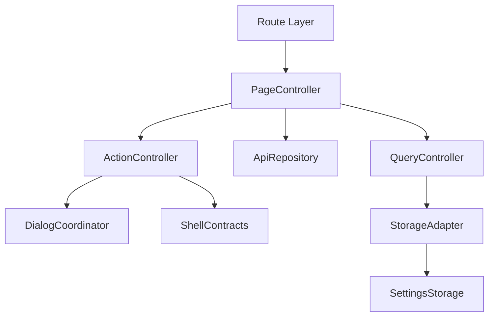
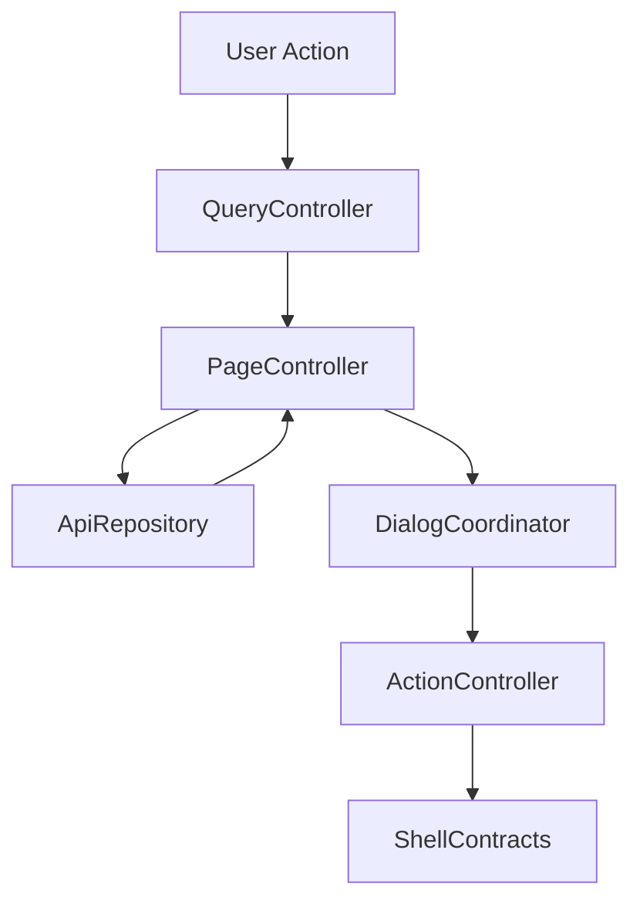

# 設計書: ダッシュボード

## 概要

この仕様は Dashboard summary、more link、item action handoff、responsive/theme の technical design を定める。

**ユーザー**: EPGStation の通常ユーザー、operator、関連 routed screen の実装者。

**影響**: requirements を component、route/query/API/localStorage contract、test strategy に接続し、実装境界を曖昧にしない。

### 目標

- requirements の全受け入れ条件を design component と test に追跡可能にする。
- 決定済み React 技術選定を `client/` の file 構成として示す。
- `unittest/spec`、`unittest/imp`、E2E の最小 gate を明記する。

### 非目標

- 隣接 spec が所有する workflow、player lifecycle、settings default/backfill の取り込み。

## 境界の合意

### この仕様が所有するもの

- Dashboard route/title、summary layout、recording/recorded/reserves API fetch、more link、item menu/dialog、responsive/theme。
- requirements に明記された route/query/API/localStorage/action/snackbar/dialog/menu behavior。
- 本 spec 配下の PageController、QueryController、ApiRepository、ActionController、DialogCoordinator、StorageAdapter の責務境界。

### 境界外

- 各 list/detail 画面の全機能、再生 player、settings contract。
- 実 URL、実番組名、認証情報、Mirakurun URL、ffmpeg/ffprobe 実 path、環境固有値の tracked docs への記録。

### 許可する依存

- page size と表示設定は `frontend-settings-storage`、shell は `frontend-app-shell` に従う。
- `frontend-settings-storage` の保存済み settings contract と adjacent storage key registry。
- `frontend-app-shell` の shell、title bar slot、edit title bar、snackbar、navigation host。
- 既存 EPGStation REST API と hash route compatible router。

### 再検証トリガー

- requirements の受け入れ条件、route/query/API endpoint、snackbar 文言、dialog/menu action が変わる。
- `frontend-settings-storage` の field/default/validation/adjacent key default が変わる。
- `frontend-app-shell` の title/snackbar/navigation/edit title bar contract が変わる。

## アーキテクチャ

### アーキテクチャ前提

frontend は React と hash route を前提にし、hash route compatibility、既存 API、localStorage contract、observed responsive behavior、snackbar/dialog/menu の表示条件を本書の requirements に定義された通りに維持する。

formal design の正本は、この design と同一 spec の requirements、visual-cases、mock-data、ならびに `.kiro/steering/` の project memory とする。矛盾がある場合は同一 spec の requirements と requirements 横断レビューの反映済み判断を優先する。

### アーキテクチャパターンと境界マップ



**アーキテクチャ統合**:
- 選択したパターン: feature boundary + shared typed contracts。
- ドメイン/機能境界: route/query/API/action/dialog/storage を feature 内で分離し、settings と shell は consumer として参照する。
- 固定するパターン: hash route、API endpoint、dialog close cleanup、snackbar result、responsive breakpoint。
- Steering 準拠: 設計書は日本語。

### 技術スタック

| レイヤー | 選択 / バージョン | 機能内の役割 | 備考 |
|-------|------------------|-----------------|-------|
| フロントエンド | React / TypeScript / Vite | UI と typed contract | package root は `client/`、package name は `epgstation-client`。 |
| ルーティング | React Router hash route 対応 router | route/query contract | route contract は `/#/...`（hash route）とする。 |
| Server state | TanStack Query | API response cache、loading/error/refetch、Socket.IO invalidation | query key は route/query/API option から導出し、Socket.IO `updateStatus` などの event は該当 query invalidation/refetch に接続する。 |
| Local state | React local state/reducer | screen/dialog/edit/bulk state と App Shell 横断 state | Zustand は使わない。server state は TanStack Query が持ち、Snackbar・connection・server config など横断 state は App Shell の hook が持つ。 |
| UI / CSS | MUI Core + `@mdi/font` + theme token + `*.module.css` | MUI component 実装、responsive、visual contract | global CSS は `src/index.css`（font-face と reset 程度）に限定し、visual-cases の geometry/screenshot contract を theme/shared component に接続する。 |
| Form / validation | React Hook Form + Zod | form state、submit validation、typed payload validation | Dashboard は form を所有しないが、consumer spec の form はこの境界に従う。 |
| API client | native `fetch` wrapper + typed request/response validation | backend integration | repository base `./api` と endpoint path を二重結合しない。endpoint/query/body contract はこの design と requirements を正とする。 |
| Socket.IO | `socket.io-client` | realtime update trigger | event handler は feature repository / TanStack Query invalidation/refetch 境界へ接続し、failure snackbar の有無は各 design の契約に従う。Dashboard 表示中の `updateStatus` は active `DASHBOARD_QUERY_KEY` を直接 refetch し、録画中/録画済み/予約 summary の DOM が iOS Safari でもイベント後に差し替わることを固定する。 |
| Lint / format / alias | ESLint flat config + typescript-eslint + React Hooks plugin / Prettier / `@/` | static gate と import 解決 | `@/` は Vite / TypeScript / Vitest / ESLint で同一解決規則にする。 |
| Script gate | `build` = `npm run bundle`（Vite production build のみ）、`build:verify` = lint + typecheck + unit test + build、`check` = lint + format:check + typecheck + `test:dev-server` + `unittest/spec` + `unittest/imp` | `client/package.json` の scripts | `build` は lint・test を含めず、`build:verify` が lint・typecheck・unit test・build をまとめる。format check は `check` が持つ。 |
| Test / coverage / browser | Vitest + V8 coverage / React Testing Library / Playwright / MSW | `unittest/spec`、`unittest/imp`、E2E、visual regression | 正式検証対象は Desktop Chromium、Desktop Firefox、Android Chrome、iOS Safari。visual は Playwright screenshot assertion と geometry assertion を併用する。 |

## ファイル構成

### ディレクトリ構成

```text
client/src/
├── app/                    # App Shell, navigation, snackbar, theme
├── features/               # routed feature boundaries
├── shared/                 # settings, API error, route helpers, typed utilities
└── test/                   # MSW server（`src/test/msw/server.ts`）
```

unittest・e2e・visual は `client/unittest`・`client/e2e`・`client/visual` に置く。

### ファイル構成

- `client/src/features/dashboard/DashboardPage.tsx` — `/` route root、title、summary query、section composition、reserves dialog。
- `client/src/features/dashboard/dashboardApi.ts` — `createFetchDashboardApiRepository`（`GET /reserves/cnts`、`GET /recording`、`GET /recorded`、`GET /reserves`、`GET /channels` の channel name 補完）。型は `lib/dashboardApiTypes.ts`。
- `client/src/features/dashboard/dashboardRequests.ts` — summary request set、query key、失敗 message、section title。
- `client/src/features/dashboard/components/` — `DashboardRecordsSection`（録画中 / 録画済み）、`DashboardReservesSection`。
- `client/src/features/dashboard/hooks/` — `useDashboardSummaryQuery`（4 request の並列取得と失敗 snackbar）、`useDashboardScrollHistory`（section scroll の保存 / 復元）。
- `client/src/features/dashboard/lib/` — `dashboardFormat`（iOS scroll chain guard、遷移先 path、時刻 label、drop info）、`dashboardRecordedAdapters` / `dashboardReserveAdapters`（API 応答の adapter）。
- `client/unittest/spec/dashboard/` — `dashboardTestKit.tsx`（fixture / helper）と layout、summary、edges、realtime removal、scroll history、more / time label、item route、menu の spec。`client/unittest/imp/dashboard.imp.test.ts`、`dashboard.adapters.imp.test.ts`、`dashboard.apiEdges.imp.test.ts`、`dashboard.format.imp.test.ts` — imp。
- `client/e2e/dashboard-workflow.spec.ts`、`dashboard-android.spec.ts` — deterministic mock E2E。fixture は `client/e2e/support/dashboardFixtures.ts`、handler は `dashboardMocks.ts`。
- `client/visual/dashboard-geometry.spec.ts` — geometry 検査。

## システムフロー



Flow は route/query/API/localStorage 境界で validation し、UI component が endpoint 文字列や localStorage schema を直接所有しない構造にする。

## 要件トレーサビリティ

| 要件 | 概要 | コンポーネント | インターフェース | フロー |
|-------------|---------|------------|------------|-------|
| 1.1-1.10 | route と summary 表示 | PageController, QueryController, ApiRepository, StorageAdapter | State / Service / API | summary fetch / scroll restore flow |
| 2.1-2.16 | more link と item action | ActionController, DialogCoordinator, QueryController, ApiRepository | State / Service / API | delegated menu/dialog/action flow |
| 3.1-3.8 | responsive と visual state | PageController, StorageAdapter | State | responsive/theme rendering flow |

## コンポーネントとインターフェース

| コンポーネント | ドメイン/レイヤー | 意図 | 要件カバレッジ | 主な依存 | 契約 |
|-----------|--------------|--------|--------------|------------------|-----------|
| PageController | Feature Routing | route 初期化、title、fetch、loading/error/empty、section scroll restore を統括する。 | 1.1-1.10, 2.1-2.7, 2.15-2.16, 3.1-3.8 | frontend-settings-storage / frontend-app-shell / EPGStation API | 状態管理 |
| QueryController | Feature Routing | path/query/local UI input を typed model に変換する。 | 1.4, 2.2, 2.5, 2.7 | frontend-settings-storage / frontend-app-shell / EPGStation API | Service |
| ApiRepository | Feature API | requirements で定義された endpoint request と typed error 変換を扱う。 | 1.3, 1.4, 1.8（2.8-2.11 の API 呼び出しは owner の部品へ委譲） | frontend-settings-storage / frontend-app-shell / EPGStation API | API |
| ActionController | Feature Service | menu、button、dialog submit、bulk action の結果を route/API/snackbar に接続する。 | 2.1-2.14 | frontend-settings-storage / frontend-app-shell / EPGStation API | Service/API |
| DialogCoordinator | Feature UI | dialog/menu/open-reset/close-cleanup/focus を管理する。 | 2.4-2.6, 2.10, 2.11 | frontend-settings-storage / frontend-app-shell / EPGStation API | 状態管理 |
| StorageAdapter | Shared Boundary | settings と scroll history state を consumer として読む。 | 1.4, 1.9, 2.12-2.14, 3.2, 3.3 | frontend-settings-storage / frontend-app-shell / EPGStation API | 状態管理 |

### ページ制御（PageController）

| 項目 | 詳細 |
|-------|--------|
| 意図 | route 初期化、title、loading/error/empty、child component composition を統括する。 |
| 要件 | 1.1-1.8, 1.10, 2.1-2.7, 2.15-2.16, 3.1-3.8 |

**責務と制約**
- route entrypoint と screen lifecycle だけを所有する。
- fetch/action の副作用は ApiRepository と ActionController へ委譲する。
- App Shell title/snackbar/edit title bar へは typed request だけを渡す。
- Dashboard の desktop outer page/main は title bar と App Shell padding を差し引いた viewport 内に収め、3 column layout では各 summary section body を縦 scroll 対象にする。mobile/tablet single column では main content が縦 scroll owner であり、summary list は `overflow-y:auto` や `overscroll-behavior-y:contain` で touch scroll を閉じ込めてはならない。Android Chrome では summary list/card 上からの touch drag で page scroll owner が進むことを E2E で固定する。iOS / iPadOS Safari では App Shell 全 route 共通で `html.fix-address-bar2` を適用し、document rubber-band が title bar 上の余白として露出しないよう `html/body/#root/app-shell/shell-content` は viewport 高さに固定して overflow を hidden にする。`shell-main` は `box-sizing: border-box`、`height: 100%`、`max-height: 100%`、title bar height `64px` の top padding を持つ唯一の page scroll container とし、Dashboard の各 summary section list は desktop fixed column の内側だけ momentum scroll 対象とする。`app-shell` や `shell-content` が routed page content 高まで伸びると `/recorded` などで scrollHeight と clientHeight が等しくなり scroll 不能になるため、viewport 境界を維持する。さらに `fix-address-bar2` 中の title bar は `position: fixed`、`left: var(--app-main-offset)`、`right: 0` にし、title bar 起点の touch drag は document rubber-band へ渡さず `shell-main` scroll へ転送する。横画面で上端へ momentum scroll した後、または title bar 付近から drag した後に title bar より上へ余白が出ないことを iPad Pro 13-inch simulator landscape の gesture test で固定する。

### クエリ制御（QueryController）

| 項目 | 詳細 |
|-------|--------|
| 意図 | route query、path param、form/filter input を typed model に変換する。 |
| 要件 | 1.4, 2.2, 2.5, 2.7 |

**責務と制約**
- `unknown` / string query を domain type へ narrow する。
- invalid input は requirements に従い normalize、ignore、controlled error、または no-op に変換する。
- route refresh 用 `timestamp` は user-facing filter state へ露出しない。

### API リポジトリ（ApiRepository）

| 項目 | 詳細 |
|-------|--------|
| 意図 | API request builder、response adapter、typed error conversion を扱う。 |
| 要件 | 1.3, 1.4, 1.8（2.8-2.11 の API 呼び出しは `frontend-reserves` / `frontend-recorded` の部品へ委譲し、本 repository は呼ばない） |

**責務と制約**
- endpoint は requirements を正とする。
- request body/query は explicit type で定義し、TypeScript の `any` を使わない。
- API failure は UI へ例外を漏らさず typed error として返す。

### アクション制御（ActionController）

| 項目 | 詳細 |
|-------|--------|
| 意図 | menu、dialog、button、bulk action の実行と snackbar/route update を扱う。 |
| 要件 | 2.1-2.14 |

**責務と制約**
- 表示条件、disabled/hidden 条件、成功/失敗 snackbar は requirements を正とする。
- action 完了後の refetch、dialog close、route move を一箇所に集約する。
- 破壊的 action は confirm dialog または requirements に定義された no-op 条件を経由する。
- Dashboard の recorded/recording item menu は `frontend-recorded` の `RecordedItemMenu` と route builder を consumer として使う。search action では `ruleId` を持つ item を `/recorded?ruleId=<ruleId>` へ、`ruleId` を持たない item を owner の番組名 keyword normalization 後の `/recorded?keyword=<keyword>` へ遷移させ、Dashboard 独自の keyword 生成や二重 navigation を持たない。

### ダイアログ調整（DialogCoordinator）

| 項目 | 詳細 |
|-------|--------|
| 意図 | dialog/menu open/reset/close cleanup/focus を扱う。 |
| 要件 | 2.4-2.6, 2.10, 2.11 |

**責務と制約**
- open ごとに stale state を reset する。
- close animation 後の remove/remount が requirements にある場合は維持する。
- dialog body の screenshot が不足する場合は mock API または検証 config で fixture を補完する。

### ストレージアダプター（StorageAdapter）

| 項目 | 詳細 |
|-------|--------|
| 意図 | settings と adjacent localStorage key を consumer として読む。 |
| 要件 | 1.4, 2.12, 3.2, 3.3 |

**責務と制約**
- settings default、backfill、validation は `frontend-settings-storage` に委譲する。
- feature 固有の adjacent key owner がある場合だけ、その shape を design と tasks に展開する。
- 保存済み値の parse failure は settings storage contract に従う。

### API 契約

この表の endpoint は frontend repository contract であり、`./api` の base path は含めない。決定済み native `fetch` wrapper に基づいて API client を作る場合も base path と endpoint path を二重に結合しない。

| メソッド | エンドポイント | リクエスト | レスポンス | エラー |
|--------|----------|---------|----------|--------|
| GET | /recording | limit/offset/isHalfWidth | recording summary items | 録画中 summary fetch failure snackbar |
| GET | /recorded | limit/offset/isHalfWidth plus recorded filters | recorded summary items | 録画済み summary fetch failure snackbar |
| GET | /reserves | type/limit/offset/isHalfWidth | reserve summary items | 予約 summary fetch failure snackbar |
| GET | /channels | none | channel id と name の対応（summary item の channel label の補完用。shell の bootstrap と共有。recording / recorded / reserves の取得時に一度だけ読む） | — |
| GET | /reserves/cnts | none | normal/conflicts/skips/overlaps counts | 予約情報取得に失敗 |
| POST | /encode | encode body | enqueue result | delegated endpoint。Dashboard は body/文言を所有せず `frontend-recorded` を参照する |
| PUT | /recorded/:recordedId/protect | none | result | delegated endpoint。Dashboard は body/文言を所有せず `frontend-recorded` を参照する |
| PUT | /recorded/:recordedId/unprotect | none | result | delegated endpoint。Dashboard は body/文言を所有せず `frontend-recorded` を参照する |
| DELETE | /recorded/:recordedId/encode | none | stop encode result | delegated endpoint。Dashboard は body/文言を所有せず `frontend-recorded` を参照する |
| DELETE | /recorded/:recordedId | none | delete result | delegated endpoint。Dashboard は body/文言を所有せず `frontend-recorded` を参照する |
| DELETE | /videos/:videoFileId | none | delete result | delegated endpoint。Dashboard は body/文言を所有せず `frontend-recorded` を参照する |
| DELETE | /reserves/:reserveId | none | delete result | delegated endpoint。Dashboard は body/文言を所有せず `frontend-reserves` を参照する |
| DELETE | /reserves/:reserveId/skip | none | unskip result | delegated endpoint。Dashboard は body/文言を所有せず `frontend-reserves` を参照する |
| DELETE | /reserves/:reserveId/overlap | none | unoverlap result | delegated endpoint。Dashboard は body/文言を所有せず `frontend-reserves` を参照する |

### 共有型契約

```typescript
type FeatureResult<T, E extends string> =
  | { ok: true; value: T }
  | { ok: false; error: E; message: string };

interface RouteBuildResult {
  path: string;
  query: Record<string, string>;
}

interface SnackbarRequest {
  text: string;
  color?: 'normal' | 'success' | 'info' | 'error';
  timeout?: number;
}
```

## 機能固有の設計判断

### Dashboard 所有境界

Dashboard は summary の取得、section layout、more link、Dashboard 上での shared item component composition を所有する。Recorded / Reserves / Recording の item menu、dialog、protect/delete/unskip/unoverlap/add encode/stop encode などの action semantics は各 owner spec の contract を再利用する。Dashboard 専用に menu/dialog/action behavior を分岐させない。Dashboard は Recorded owner が named export する `RecordedItemMenu`、`RecordedDeleteDialog`、`AddEncodeDialog` と、Reserves owner が named export する `ReserveDialog`、`ReserveMenu`、`ReserveDeleteDialog` を import/composition する。

### summary fetch 契約

- `recordingLength`、`recordedLength`、`reservesLength` を settings から読み、各 summary request の `limit` とする。
- Dashboard summary fetch は route `page` query を使わず、各 section の summary request は page 1 相当の `offset=0` を固定で使う。more button/link は各 owner route の page 2 へ遷移する fixed handoff とし、Dashboard 自身の route query は summary offset に反映しない。
- Recorded summary filter は route query を受ける場合だけ `keyword`、`ruleId`、`channelId`、`genre`、`hasOriginalFile` を Recorded query parser と同じ規則で変換する。
- `GET /reserves/cnts` は `normal` / `conflicts` / `skips` / `overlaps` count display の source とする。
- conflict badge は `/reserves/cnts` の `conflicts` を source とし、`conflicts >= 1` の場合だけ表示する。`conflicts >= 1` のときは、badge 単体と、それを含む予約 section title 全体（ラベル文字部分を含む）のどちらを click しても `/reserves?type=conflict` へ遷移する。`conflicts === 0` のときは section title を click しても遷移しない。ラベル文字部分と badge は、見出し要素配下の互いに入れ子でない native `<button type="button">` として実装し、どちらもキーボードで到達・操作でき、一方の click が他方の handler を重複起動しない。
- recording summary item は thumbnail を表示しない。recorded summary item は  thumbnail/no-image を height `100px`、`flex-basis:30%`、`max-width:200px` の slot で表示し、thumbnail がない場合または load error 時は `img/noimg.png` を表示する。settings `isShowDropInfoInsteadOfDescription` に従い、description と drop/file size 表示を切り替える。
- summary empty response は追加 empty copy を出さず、section title を `0/0` のまま維持する。
- ReserveDialog の content、日時 row click から `/guide?time=<YYMMddhh>` と conditional `type=<channelType>` を作る規則、extended text の linkify は `frontend-reserves` owned shared contract を使う。Dashboard は dialog を再実装しない。
- protect/unprotect、stop encode、recorded delete、reserve delete/unlock の snackbar 文言は owner spec の exact text を Dashboard 上でも同じ文字列として表示する。Dashboard は文言を再定義せず、owner component の emit を App Shell snackbar へ中継する。
- recorded summary item menu の search は `frontend-recorded` の `RecordedItemMenu` route builder を使用し、rule reserve 由来 item では `/recorded?ruleId=<ruleId>`、ruleId のない item では番組名 keyword search を発火する。Dashboard はこの分岐を独自実装しない。

### スクロールとタイトル

- Dashboard section は recording / recorded / reserves の scrollTop を route update/leave で保存する。復元は scroll state の history restore flag が true のときだけ fetch 完了後に行い、通常の route/query 更新では常に戻さない。Socket.IO `updateStatus` では App Shell が `DASHBOARD_QUERY_KEY` を stale 化し、表示中の active Dashboard query を 1 回 refetch する。録画中削除、予約削除、録画削除、録画完了などで server response が変わった場合は、iOS Safari でも録画中/録画済み/予約 summary item と各 section title が更新後 response へ差し替わることを固定する。
- iOS / iPadOS では Socket.IO `updateStatus` が WebKit runtime で遅延または取りこぼされる場合があるため、Dashboard 表示中だけ 3000ms 間隔の fallback refetch を有効にする。これは 「状態変更後に Dashboard summary が現在の server state へ追従する」挙動を守るための iOS 限定補完であり、Desktop では Socket.IO invalidation/refetch を主経路とする。
- Dashboard title と browser title は App Shell の version state を消費する。Dashboard 自身は version fetch を所有しない。

## データモデル

- `DashboardSummaryRequestSet`（`dashboardRequests.ts`）: recording・recorded・reserves の 3 request。各 request は `{ isHalfWidth, offset, limit }` を持ち、recorded は `keyword`・`ruleId`・`channelId`・`genre`・`hasOriginalFile`、reserves は `type: 'normal'` を加える。
- `DashboardSummary`（`hooks/useDashboardSummaryQuery.ts`）: `{ reserveCounts, recording, recorded, reserves }`。

次の 2 つは概念名であり、同名の型は実装に無い。

- section の状態: `{ items, loading, error, scrollTop, restoreHistory }` を section ごとに持つ。
- action の引き継ぎ: owner spec name、target item、action intent を持ち、Dashboard は action implementation を直接所有しない。

## エラーハンドリング

- validation は route/query/form/API/localStorage の境界で行う。
- snackbar 文言は requirements に定義された文言を優先する。
- no-op、blank presentation、controlled error の選択は requirements を正とする。
- stale research と formal requirements が矛盾する場合は formal requirements を正とする。

## テスト戦略

unit test は `npm run coverage:gate` で statements・branches・functions・lines の 4 指標 100% を要求する。unit test は `unittest/spec` と `unittest/imp` の 2 種類を持ち、片方で他方を代替しない。E2E と visual は release-preflight の client-browser step で実ブラウザーに流す。hosted CI（client.yml）は lint・typecheck・format check だけを行う。

- `unittest/spec`: user-visible behavior、route/query contract、API request contract、状態遷移、snackbar/dialog/menu 表示条件を requirements ID に紐づけて検証する。
- `unittest/imp`: query parser、request builder、state reducer、validator、lifecycle cleanup、storage adapter の分岐と edge case を検証する。
- E2E: deterministic mock data で route 表示、主要 action、dialog/menu、responsive、empty/error state を確認する。

### Visual Regression 契約

この feature の詳細 layout は、本文の Dashboard section layout / responsive contract と `visual-cases.md` の visual cases、`mock-data.md` の synthetic dataset contract を合わせて正本とする。

`visual-cases.md` は screenshot / geometry / interaction test の撮影条件を定義する。`mock-data.md` は visual cases で使う synthetic recording / recorded / reserve summary、reserve counts、fixture 条件を定義する。

Dashboard は shared item component を composition するが、Recorded / Reserves / Recording の action semantics と dialog body は各 owner spec を正とする。tracked artifact には実番組名、実 URL、実ロゴ、サムネイル、認証情報、環境固有値を含めない。

### Visual Implementation Contract

Dashboard page は App Shell content 領域いっぱいを使い、desktop（viewport 幅 1023px 以上）では section の並び（`.sections`）が `display:flex`、gap `8px`、3 section 各 `flex-basis:33.333%`、mobile/tablet では max width `600px` の single column とする。page は padding `4px` を持ち、desktop の page 高さは `calc(100vh - 72px)`（72px は title bar 64px と page padding 4px × 2）に固定して `overflow:hidden` とし、各 section の list は `max-height: calc(100% - 60px)` で縦 scroll する。section card 自体へ `height:100%` を付与しない。録画中 summary のように item 数が少ない section は内容の必要最小高さに収まり、余白分だけ main content 全体へ伸びない。section body だけを縦 scroll させるのは desktop fixed column のみとし、mobile/tablet では各 section/list を通常 flow に置いて main content scroll に委ねる。

Section container は background が App Shell の surface（light `#fff`、dark `#1e1e1e`）、border なし（box-shadow）、border radius `4px`、overflow hidden、min-height `60px`（desktop は `0`）とする。Section title は height `60px`、padding `16px`、`1rem`/400 とする。list は padding `0 8px 4px`（reserves section は `0 0 4px`）で item 間に gap を置かず、more は list 末尾の min-height `36px` の button とする。empty section は header のみを維持し、body に empty copy を追加しない。

Summary item は owner component の compact density を使い、Dashboard recorded summary の thumbnail/no-image slot は height `100px`、`flex-basis:30%`、`max-width:200px`、metadata は recorded・recording が `0.75rem`、reserve が `0.8125rem`、action icon button は 36px とする。shared item の詳細配色は owner spec を正とし、Dashboard は section background と outer scroll の有無だけを再定義する。

Dashboard から開く recorded item menu は MUI portal として body 配下に出るため、dark theme token は App Shell の portal-compatible theme marker と MUI theme から解決する。Dashboard 側は menu を再実装せず、`RecordedItemMenu` の owner class と App Shell の dark portal contract が届く状態で contrast を検証する。

### 機能テストケース

- recording/recorded/reserves summary request の settings 由来 limit、`offset=0` 固定、isHalfWidth と `/reserves/cnts` の `normal/conflicts/skips/overlaps`、`予約情報取得に失敗` snackbar を検証する。Socket.IO `updateStatus` 後は API 呼び出し回数だけでなく、録画中/録画済み/予約 summary の表示テキストが更新後 response へ差し替わり、更新前 item が DOM から消えることを検証する。
- Dashboard item menu/action が owner spec contract へ委譲され、専用分岐しないことを検証する。recorded search action は ruleId あり/なしの両 fixture で `/recorded?ruleId=<ruleId>` と `/recorded?keyword=<keyword>` の両遷移を検証する。
- Dashboard 上の recorded / recording menu action、ReserveMenu の unlock、ReserveDeleteDialog の削除成功後は、Socket.IO `updateStatus` の到着だけに依存せず現在表示中の Dashboard query を明示 refetch する。iOS Safari で Socket.IO が遅延または取りこぼされた場合でも、操作元画面の summary item と section title が成功後 response へ差し替わることを固定する。
- recorded add encode handoff、recording thumbnail なし、recording summary row が  text content の必要最小高さで収まり 100px thumbnail row height に固定されないこと、recorded no-image が height `100px` / `flex-basis:30%` / `max-width:200px` fallback になること、recorded description/drop display toggle、section scroll restoration flag と fetch failure/blank state を検証する。
- Android Chrome mobile viewport では Dashboard summary list/card 上から touch drag しても list が scroll chain を閉じ込めず、main content scroll owner が進むことを検証する。
- dark theme の recorded item menu open state で text、icon、pseudo icon の contrast を検証し、portal によって `data-theme-mode` selector が外れないことを確認する。
- Recorded owner の AddEncodeDialog を Dashboard が composition した状態でも、`AddEncodeSeting` の保存・復元 contract が機能することを検証する。
- more button 表示条件、page 2 遷移、ReserveDialog の linkify と Guide 遷移、ReserveMenu の 4 action、recorded/reserve delete 分岐、unlock、empty `0/0`、loading hide/transition を requirements ID に紐づけて検証する。
- Dashboard title が version state を消費し、自身で version fetch しないことを検証する。

## セキュリティとプライバシー

- tracked docs、test fixture、snapshot に実 URL、実番組名、認証情報、Mirakurun URL、ffmpeg/ffprobe 実 path、環境固有値を書かない。
- 調査用と実機 test の screenshot は git の ignore 対象（`client/device/artifacts/`、`client/test-results`）に置く。visual test の基準画像は `client/visual/*-snapshots/`（e2e は `client/e2e/*-snapshots/`）に置いて git で追跡する。
- E2E は実データではなく controlled mock data を使う。

## 性能とアクセシビリティ

- list/grid/dialog は stable dimensions と responsive constraints を持ち、text overlap と layout shift を避ける。
- menu button、dialog button、item action button、予約 section title のラベル文字部分/conflict badge button は keyboard focus と accessible name を持つ。
- heavy rendering、stream、upload、dialog timer は route leave または close 時に cleanup する。

## リスクと緩和策

- requirements が変更された場合、traceability と task boundary を再確認する。
- screenshot body が不足する dialog は mock API または validation config で補完する。
