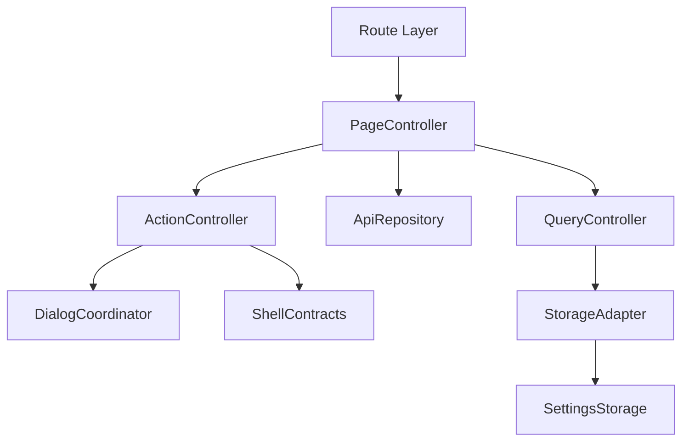
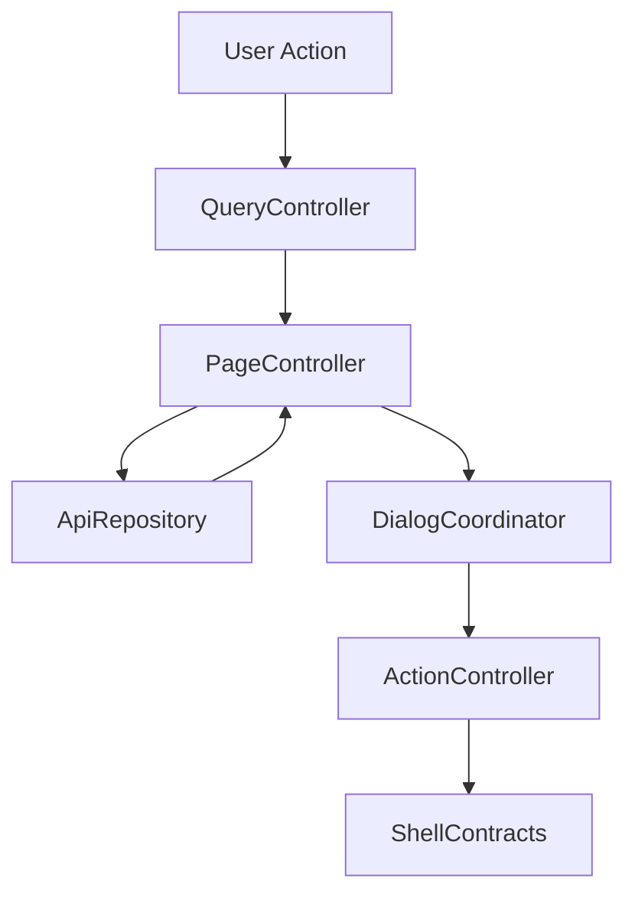

# 設計書: 番組表

## 概要

この仕様は /guide と /guide/setting、query/fetch/grid/dialog/menu/live stream handoff の technical design を定める。

**ユーザー**: EPGStation の通常ユーザー、operator、関連 routed screen の実装者。

**影響**: requirements を component、route/query/API/localStorage contract、test strategy に接続し、実装境界を曖昧にしない。

### 目標

- requirements の全受け入れ条件を design component と test に追跡可能にする。
- 決定済み React 技術選定を `client/` の file 構成として示す。
- `unittest/spec`、`unittest/imp`、E2E の最小 gate を明記する。

### 非目標

- 隣接 spec が所有する workflow、player lifecycle、settings default/backfill の取り込み。

## 境界の合意

### この仕様が所有するもの

- `/guide`、`/guide/setting`、Guide query、normal/single-channel fetch、grid/timeline/header、dialog/menu、empty/error/loading、responsive。
- requirements に明記された route/query/API/localStorage/action/snackbar/dialog/menu behavior。
- 本 spec 配下の PageController、QueryController、ApiRepository、ActionController、DialogCoordinator、StorageAdapter の責務境界。

### 境界外

- App Shell navigation item 生成、settings key/default、video player lifecycle の詳細。
- 実 URL、実番組名、認証情報、Mirakurun URL、ffmpeg/ffprobe 実 path、環境固有値の tracked docs への記録。

### 許可する依存

- Guide settings は `frontend-settings-storage`、shell は `frontend-app-shell`、player の route validation と lifecycle は `frontend-video-playback` に従う。
- `frontend-settings-storage` の保存済み settings contract と adjacent storage key registry。
- `frontend-app-shell` の shell、title bar slot、edit title bar、snackbar、navigation host。
- 既存 EPGStation REST API と hash route compatible router。

### 再検証トリガー

- requirements の受け入れ条件、route/query/API endpoint、snackbar 文言、dialog/menu action が変わる。
- `frontend-settings-storage` の field/default/validation/adjacent key default が変わる。
- `frontend-app-shell` の title/snackbar/navigation/edit title bar contract が変わる。

## アーキテクチャ

### アーキテクチャ前提

frontend は React と hash route を前提にし、hash route compatibility、既存 API、localStorage contract、observed responsive behavior、snackbar/dialog/menu の表示条件を本書の requirements に定義された通りに維持する。

formal design の正本は、この design と同一 spec の requirements、visual-cases、mock-data、ならびに `.kiro/steering/` の project memory とする。矛盾がある場合は同一 spec の requirements と requirements 横断レビューの反映済み判断を優先する。

### アーキテクチャパターンと境界マップ



**アーキテクチャ統合**:
- 選択したパターン: feature boundary + shared typed contracts。
- ドメイン/機能境界: route/query/API/action/dialog/storage を feature 内で分離し、settings と shell は consumer として参照する。
- 固定するパターン: hash route、API endpoint、dialog close cleanup、snackbar result、responsive breakpoint。
- Steering 準拠: 設計書は日本語。

### 技術スタック

| レイヤー | 選択 / バージョン | 機能内の役割 | 備考 |
|-------|------------------|-----------------|-------|
| フロントエンド | React / TypeScript / Vite | UI と typed contract | package root は `client/`、package name は `epgstation-client`。 |
| ルーティング | React Router hash route 対応 router | route/query contract | route contract は `/#/...`（hash route）とする。 |
| Server state | TanStack Query | API response cache、loading/error/refetch、Socket.IO invalidation | query key は route/query/API option から導出し、Socket.IO `updateStatus` などの event は該当 query invalidation/refetch に接続する。 |
| Local state | React local state/reducer | screen/dialog/edit/bulk state と App Shell 横断 state | Zustand は使わない。server state は TanStack Query が持ち、Snackbar・connection・server config など横断 state は App Shell の hook が持つ。GuideGridRenderer の DOM 参照は React state に保存しない。 |
| UI / CSS | MUI Core + `@mdi/font` + theme token + `*.module.css` | MUI component 実装、responsive、visual contract | global CSS は `src/index.css`（font-face と reset 程度）に限定し、visual-cases の geometry/screenshot contract を theme/shared component に接続する。 |
| Form / validation | React Hook Form + Zod | form state、submit validation、typed payload validation | Guide setting form と dialog form payload はこの境界に従う。 |
| API client | native `fetch` wrapper + typed request/response validation | backend integration | repository base `./api` と endpoint path を二重結合しない。endpoint/query/body contract はこの design と requirements を正とする。 |
| Socket.IO | `socket.io-client` | realtime update trigger | event handler は feature repository / TanStack Query invalidation 境界へ接続し、failure snackbar の有無は各 design の契約に従う。 |
| Lint / format / alias | ESLint flat config + typescript-eslint + React Hooks plugin / Prettier / `@/` | static gate と import 解決 | `@/` は Vite / TypeScript / Vitest / ESLint で同一解決規則にする。 |
| Script gate | `build` = `npm run bundle`（Vite production build のみ）、`build:verify` = lint + typecheck + unit test + build、`check` = lint + format:check + typecheck + `test:dev-server` + `unittest/spec` + `unittest/imp` | `client/package.json` の scripts | `build` は lint・test を含めず、`build:verify` が lint・typecheck・unit test・build をまとめる。format check は `check` が持つ。 |
| Test / coverage / browser | Vitest + V8 coverage / React Testing Library / Playwright / MSW | `unittest/spec`、`unittest/imp`、E2E、visual regression | 正式検証対象は Desktop Chromium、Desktop Firefox、Android Chrome、iOS Safari。visual は Playwright screenshot assertion と geometry assertion を併用する。 |

## ファイル構成

`client/src/features/guide/` 配下。ts・tsx の各 file は 300 行以下に保つ（CSS module は除く）。

- `GuidePage.tsx` — `/guide` の route root。route key と履歴 URL、無効 channel の再試行、dialog / menu の開閉、grid host の composition。`GuideSettingPage` を再 export する。
- `GuideSettingPage.tsx` — `/guide/setting` の表示設定 form（save / reset）。
- `ProgramDialog.tsx` — 共有 ProgramDialog（予約・検索・詳細・編集・ルール action と encode / 元ファイル削除の選択）。`frontend-onair` / `frontend-search-rule` / `frontend-reserves` が利用する。
- `GuideGridRenderer.ts` — 命令的 grid renderer の class（mount / reserve index 更新 / genre 表示更新 / scroll 復元 / destroy）。`lib/guideGridTypes.ts` と `lib/guideGridLayout.ts` の型と純粋関数を再 export する。
- `guideApi.ts` — `GuideApiRepository` の型と `createFetchGuideApiRepository`。
- `guideRequests.ts` — `lib/guideRequestTypes.ts` / `lib/guideRoute.ts` / `lib/guideUrls.ts` / `lib/guideProgramText.ts` の barrel。
- `guideStorage.ts` — Guide 固有の localStorage key（genre 表示、size 設定）の読み書き。
- `components/` — `GuideGridHost`（renderer の mount 先）、`GuideTitleActions`（title bar の時刻選択・menu）、`GuideNavigationOverlays`（日付 / 時刻 / genre の overlay）、`GuideDaySelectDialog`、`GuideTimeSelectorMenu`、`GuideGenreSettingDialog`、`GuideProgramOverlays`（ProgramDialog と stream 選択 dialog の配線）、`ProgramDialogBody`（dialog 本文）、`LegacyToolbarIcon`。
- `hooks/` — `useGuideRouteData`（request set と schedule / reserve index の query）、`useGuideRouteCompletion`（fetch 失敗の通知、無効 channel の再試行、scroll 復元と保存）、`useGuideRendererInput`、`useGuideDialogState`、`useGuideGenreVisibility`、`useProgramDialogSetting`。
- `lib/` — `guideRequestTypes`（型と定数）、`guideRoute`（route / query の解釈と route builder）、`guideUrls`（API URL、検索 path、予約 payload）、`guideProgramText`（拡張文の link 化、detail 設定の保存、title、reserve index 変換）、`guideApiAdapters`（応答 adapter と fetch helper）、`guideDate`（日付 option と JST 変換）、`guideSizeSettingForm`（size 設定 form の定義と CSS 変数）、`guidePageState`（route key、dialog program の解決、表示 channel 判定）、`guideGridTypes` / `guideGridLayout` / `guideGridDom` / `guideGridVisibility` / `guideGridInteraction`（grid の型、layout 計算、DOM 構築、可視判定、click / drag）、`programGenreLabels`（genre / component の表示名表）、`programDialogText`（dialog の表示文字列と snackbar 文言）。
- `GuidePage.module.css` — Guide と ProgramDialog の style。

test:

- `client/unittest/spec/guide.*.spec.test.tsx`（theme / route / loading / streamDialog / refresh / programDialog / programDialogActions / menus）と `unittest/spec/support/guideSpecHarness.tsx`。
- `client/unittest/imp/guide.*.imp.test.ts`（requests / requestsDialog / api / storage / gridLayout / gridRenderer）と `unittest/imp/support/guideImpHarness.ts`。
- `client/e2e/broadcast-guide-workflow.spec.ts`、`broadcast-guide-dialog-workflow.spec.ts`、`guide-fixed-shell.spec.ts`、support `client/e2e/support/broadcastWorkflow.ts` / `guideOnAirMocks.ts` / `guideOnAirFixtures.ts`。
- `client/visual/broadcast-geometry.spec.ts`。

## システムフロー



Flow は route/query/API/localStorage 境界で validation し、UI component が endpoint 文字列や localStorage schema を直接所有しない構造にする。

## 要件トレーサビリティ

| 要件 | 概要 | コンポーネント | インターフェース | フロー |
|-------------|---------|------------|------------|-------|
| 1.1, 1.2, 1.3, 1.4, 1.5, 1.6, 1.7, 1.8, 1.9, 1.10, 1.11 | route/query と fetch | PageController, QueryController, ApiRepository, ActionController, DialogCoordinator, StorageAdapter | State / Service / API | route/query/action flow |
| 2.1-2.22 | grid と visual state | PageController, QueryController, ApiRepository, GuideGridRenderer, StorageAdapter | State / Service / API / DOM | schedule/reserve index/grid flow |
| 3.1-3.36 | Guide menu と表示設定 | PageController, QueryController, ApiRepository, ActionController, DialogCoordinator, StorageAdapter | State / Service / API | route/query/action flow |
| 4.1-4.27（4.24a・4.24b を含む） | ProgramDialog の予約・除外・重複 action | PageController, QueryController, ApiRepository, ActionController, DialogCoordinator, StorageAdapter | State / Service / API | route/query/action flow |
| 5.1-5.7 | live stream handoff | QueryController, ActionController, DialogCoordinator, StorageAdapter | State / Service | OnAir shared stream dialog consumer flow |
| 6.1, 6.2, 6.3 | loading/error/empty | PageController, QueryController, ApiRepository, ActionController, DialogCoordinator, StorageAdapter | State / Service / API | route/query/action flow |
| 7.1, 7.2, 7.3 | reserve reflection と dark theme | PageController, ApiRepository, GuideGridRenderer, StorageAdapter | State / Service / DOM | reserve index 更新と theme 同期 |

## コンポーネントとインターフェース

| コンポーネント | ドメイン/レイヤー | 意図 | 要件カバレッジ | 主な依存 | 契約 |
|-----------|--------------|--------|--------------|------------------|-----------|
| PageController | Feature Routing | route 初期化、title、fetch、loading/error/empty、GuideGridRenderer lifecycle を統括する。 | 1.1-1.11, 2.1-2.22, 3.1-3.14, 6.1-6.3, 7.1-7.3 | frontend-settings-storage / frontend-app-shell / EPGStation API | 状態管理 |
| QueryController | Feature Routing | path/query/local UI input を typed model に変換する。 | 1.1-1.8, 3.1-3.13, 4.10, 5.1-5.6 | frontend-settings-storage / frontend-app-shell / EPGStation API | Service |
| ApiRepository | Feature API | requirements で定義された endpoint request と typed error 変換を扱う。 | 1.3-1.11, 2.11, 2.12, 3.15, 4.1-4.27, 5.1-5.7, 7.1-7.3 | frontend-settings-storage / frontend-app-shell / EPGStation API | API |
| GuideGridRenderer | Feature DOM Renderer | program cell の大量 DOM 生成、chunk append、visibility/genre/reserve class 更新、scroll sync、event delegation を React tree の外側で扱う。 | 2.1-2.22, 3.22, 4.1, 7.1-7.3 | Browser DOM / frontend-app-shell | DOM/Performance |
| ActionController | Feature Service | menu、button、dialog submit、bulk action の結果を route/API/snackbar に接続する。 | 3.13-3.36, 4.1-4.27, 5.1-5.7 | frontend-settings-storage / frontend-app-shell / EPGStation API | Service/API |
| DialogCoordinator | Feature UI | dialog/menu/open-reset/close-cleanup/focus を管理する。 | 3.6, 3.14, 3.16, 3.18-3.22, 4.1-4.27, 5.1-5.7 | frontend-settings-storage / frontend-app-shell / EPGStation API | 状態管理 |
| StorageAdapter | Shared Boundary | settings と隣接 localStorage key を consumer として読む。 | 2.5, 2.6, 3.18-3.36, 4.10, 4.11, 5.1-5.6, 6.1-6.3, 7.1-7.3 | frontend-settings-storage / frontend-app-shell / EPGStation API | 状態管理 |

### ページ制御（PageController）

| 項目 | 詳細 |
|-------|--------|
| 意図 | route 初期化、title、loading/error/empty、child component composition、GuideGridRenderer lifecycle を統括する。 |
| 要件 | 1.1-1.11, 2.1-2.22, 3.1-3.14, 6.1-6.3, 7.1-7.3 |

**責務と制約**
- route entrypoint と screen lifecycle だけを所有する。
- fetch/action の副作用は ApiRepository と ActionController へ委譲する。
- App Shell title/snackbar/edit title bar へは typed request だけを渡す。
- program cell DOM は React component tree として render せず、GuideGridRenderer へ sanitized schedule/reserve/settings input を渡す。

### GuideGridRenderer

| 項目 | 詳細 |
|-------|--------|
| 意図 | 数万件規模になりうる Guide program cell DOM を React reconciliation の外側で管理し、DOM 直管理の性能上の理由で維持する。 |
| 要件 | 2.1-2.22, 3.22, 4.1, 7.1-7.3 |

**責務と制約**
- React は Guide shell、route/fetch/dialog state、renderer mount/destroy、renderer への typed input だけを所有する。program cell は React child component として大量 render しない。
- renderer は `DocumentFragment` と 500 件単位の chunk append など、main thread を長時間占有しない DOM 生成を使う。
- renderer は `programId -> HTMLElement[]` index を内部に持ち、reserve/conflict/skip/overlap 更新と genre hide 更新は既存 node の class 差分更新で行う。route/query による schedule rebuild 以外では program cell DOM 全体を作り直さない。genre hide は cell を消す operation ではなく muted 表示 state であり、DOM、geometry、click target を維持する。
- renderer は per-cell event listener を避け、container event delegation で program click を React callback へ戻す。callback payload は `programId` と domain data 参照用 key に留め、React state に `HTMLElement` を保存しない。
- `mount(container, input)`、`updateVisibility(viewport)`、`updateGenreVisibility(setting)`、`updateReserveIndex(index)`、`restoreScroll(position)`、`destroy()` 相当の interface を持つ。React StrictMode の effect 二重実行に耐えるよう `mount` / `destroy` は idempotent にする。`restoreScroll(position)` は program grid の `scrollLeft` / `scrollTop` を復元し、同じ値を channel header `scrollLeft` と time scale `scrollTop` へ同期してから visibility update と表示完了扱いへ進める。
- `all` / `sequential` / `minimum` guide mode は renderer の visibility policy として扱う。`all` は visibility hiding なし、`sequential` は一度 visible になった cell を保持、`minimum` は viewport 外で再度 hide できる。
- scroll sync、edge scroll normalization、drag scroll、current timeline positioning は renderer か renderer-adjacent controller が扱い、App Shell scroll history contract とは x/y position の保存/復元だけで接続する。iOS / Android の bounce、端部 fling、CSS pixel 丸めで `scrollLeft` / `scrollTop` が 0 未満または content bounds 超過になっても、visibility update を破棄せず、判定用 viewport を `[0, maxScroll]` に clamp する。`sequential` は既に可視化済みの cell を保持し、`minimum` は clamp 済み viewport に基づき画面外 cell を再 hide、画面内 cell を再表示する。`lib/guideGridLayout.ts` の `normalizeGuideViewport()` は範囲外の scroll 値を `[0, maxScroll]` へ clamp してから visibility 判定を続行し、更新を破棄しない。

### クエリ制御（QueryController）

| 項目 | 詳細 |
|-------|--------|
| 意図 | route query、path param、form/filter input を typed model に変換する。 |
| 要件 | 1.1-1.8, 3.1-3.13, 4.10, 5.1-5.6 |

**責務と制約**
- `unknown` / string query を domain type へ narrow する。
- invalid input は requirements に従い normalize、ignore、controlled error、または no-op に変換する。
- route refresh 用 `timestamp` は user-facing filter state へ露出しない。

### API リポジトリ（ApiRepository）

| 項目 | 詳細 |
|-------|--------|
| 意図 | API request builder、response adapter、typed error conversion を扱う。 |
| 要件 | 1.3-1.11, 3.15, 4.1-4.27, 5.1-5.6, 7.1-7.3 |

**責務と制約**
- endpoint は requirements を正とする。
- request body/query は explicit type で定義し、TypeScript の `any` を使わない。
- API failure は UI へ例外を漏らさず typed error として返す。

### アクション制御（ActionController）

| 項目 | 詳細 |
|-------|--------|
| 意図 | menu、dialog、button、bulk action の実行と snackbar/route update を扱う。 |
| 要件 | 3.13-3.36, 4.1-4.27, 5.1-5.6 |

**責務と制約**
- 表示条件、disabled/hidden 条件、成功/失敗 snackbar は requirements を正とする。
- action 完了後の refetch、dialog close、route move を一箇所に集約する。
- 破壊的 action は confirm dialog または requirements に定義された no-op 条件を経由する。

### ダイアログ調整（DialogCoordinator）

| 項目 | 詳細 |
|-------|--------|
| 意図 | dialog/menu open/reset/close cleanup/focus を扱う。 |
| 要件 | 3.6, 3.14, 3.16, 3.18-3.22, 4.1-4.27, 5.1-5.6 |

**責務と制約**
- open ごとに stale state を reset する。
- close animation 後の remove/remount が requirements にある場合は維持する。
- dialog body の screenshot が不足する場合は mock API または検証 config で fixture を補完する。

### ストレージアダプター（StorageAdapter）

| 項目 | 詳細 |
|-------|--------|
| 意図 | settings と adjacent localStorage key を consumer として読む。 |
| 要件 | 2.5, 2.6, 3.18-3.36, 4.10, 4.11, 5.1-5.6, 6.1-6.3, 7.1-7.3 |

**責務と制約**
- settings default、backfill、validation は `frontend-settings-storage` に委譲する。
- feature 固有の adjacent key owner がある場合だけ、その shape を design と tasks に展開する。
- 保存済み値の parse failure は settings storage contract に従う。

### API 契約

この表の endpoint は frontend repository contract であり、`./api` の base path は含めない。決定済み native `fetch` wrapper に基づいて API client を作る場合も base path と endpoint path を二重に結合しない。

| メソッド | エンドポイント | リクエスト | レスポンス | エラー |
|--------|----------|---------|----------|--------|
| GET | /schedules | startAt/endAt/isHalfWidth/isFree plus broadcast booleans `GR`/`BS`/`CS`/`SKY`/`BS4K` | schedule list | 番組表情報の取得に失敗しました |
| GET | /schedules/:channelId | startAt/days/isHalfWidth/isFree | single-channel schedule | 番組表情報の取得に失敗しました |
| GET | /reserves/lists | startAt/endAt | raw `{ normal, conflicts, skips, overlaps }` arrays | initial/route fetch failure uses Guide fetch error handling; Socket.IO refresh failure has no snackbar catch |
| POST | /reserves | programId/allowEndLack/encodeOption | reserve result | program action snackbar failure |
| DELETE | /reserves/:reserveId | none | manual reserve delete or rule reserve skip/cancel result | program action snackbar failure |
| DELETE | /reserves/:reserveId/skip | none | unskip result | program action snackbar failure |
| DELETE | /reserves/:reserveId/overlap | none | unoverlap result | program action snackbar failure |
| POST | /reserves/update | none | update trigger | 予約情報の更新を開始できませんでした。 |
| EVENT | socket.io updateStatus | none | reserve index refresh only | does not refetch schedule grid |

### 共有型契約

```typescript
type FeatureResult<T, E extends string> =
  | { ok: true; value: T }
  | { ok: false; error: E; message: string };

interface RouteBuildResult {
  path: string;
  query: Record<string, string>;
}

interface SnackbarRequest {
  text: string;
  color?: 'normal' | 'success' | 'info' | 'error';
  timeout?: number;
}
```

## 機能固有の設計判断

### クエリ検証契約

- `type` は server config 上で enabled な `GR` / `BS` / `CS` / `SKY` / `BS4K` のみ valid。invalid は API query、title、selector state から除外し normal guide として扱う。
- `type` 未指定（normal guide 全表示）時、`/schedules` の `BS4K` query は server config 上で `BS4K` が enabled なときだけ `true` を送る。enabled でない環境（`BS4K` が存在しない旧 server 応答や `false` を含む）では常に `BS4K=false` を送り、GR/BS/CS/SKY の request 内容は変更しない。`BS4K` は optional query のため、この `false` の付加を許容する。
- `time` は日本時間(JST, Asia/Tokyo)の `YYMMddhh` として parse 可能で hour 0-23 の値だけ valid。parse 後の `startAt` はその JST 時刻を表す絶対 timestamp とし、normal `/schedules`、single-channel `/schedules/:channelId`、`/reserves/lists` の fetch window は同じ `startAt` から作る。invalid は現在時刻を Asia/Tokyo で正規化し、API query、title、day/time selector selected state へ反映しない。
- `channelId` は finite positive integer かつ schedule fetch 可能な id だけ single-channel guide に使う。invalid は normal guide として扱う。
- day selector / time selector route builder は Asia/Tokyo の `YYMMddhh` を生成し、現在 valid な `type` と `channelId` だけ維持する。

### 予約装飾ライフサイクル

対象要件: 2.11, 2.12。

- initial Guide load は schedule fetch と別に `GET /reserves/lists` を取得する。API response は `normal` / `conflicts` / `skips` / `overlaps` の配列で受け、各 item の source field `reserveId` を frontend 内部の `id` に正規化してから、program id keyed `reserve/conflict/skip/overlap` index に変換する。予約が存在する response を `id` 欠落として failure 扱いしてはならない。
- reserve index 変換順は normal、conflicts、skips、overlaps とし、同じ program id が複数 list に存在する異常 fixture では後勝ちで最終 state を決める。
- program DOM の visible decoration は `reserve`: 赤（`#ff0000`）の 4px solid border、`conflict`: `reserveConflictBackground` と赤（`#ff0000`）の 4px dashed border、`skip`: `reserveSkipBackground`、`overlap`: line-through、`reserveOverlapBackground`、text `reserveOverlapText`、`none`: 視覚差分なし、とする。border 色は MUI theme の `error` token ではなく light/dark 共通の固定値である。
- route/query 更新では schedule と reserve index を再取得する。Socket.IO `updateStatus` は reserve index だけを更新し、schedule 全体の再取得を発火しない。
- `/reserves/lists` の `startAt` / `endAt` は schedule fetch window と同じ値を使い、grid 端の reserve decoration と ProgramDialog action state を同じ時間範囲で確定させる。
- Socket.IO `updateStatus` では schedule 全体を再取得せず、reserve index だけを更新して grid decoration と ProgramDialog action state に反映する。
- ProgramDialog action は成功/失敗どちらでも snackbar 表示後に dialog を close する。action 成功時は schedule grid 全体を再取得せず、reserve index だけを即時 refetch して既存 program DOM の reserve/conflict/skip/overlap class を更新する。後続の Socket.IO `updateStatus` でも reserve index だけを更新し、schedule 全体の再取得は発火しない。
- 別端末で ProgramDialog の `予約` / `削除` / `除外` / `除外解除` / `重複解除` が成功し、server が `updateStatus` を送信した場合、操作していない端末の Guide も同じ reserve index query を refetch し、該当 program cell と開いている ProgramDialog の action state を更新する。
- `DELETE /reserves/:reserveId` は manual reserve では削除、rule reserve / conflict では skip/cancel として扱う。conflict の `除外` 後は Socket.IO refresh により skip decoration と action state へ遷移する。

### ProgramDialog snackbar 契約

- no reserve success/failure: `<programName> 予約` / `<programName> 予約失敗`。
- manual/rule reserve delete or skip success/failure: `<programName> キャンセル` / `<programName> キャンセル失敗`。
- unskip success/failure: `<programName> 除外解除` / `<programName> 除外解除失敗`。
- unoverlap success/failure: `<programName> 重複解除` / `<programName> 重複解除失敗`。
- ProgramDialog は常設 `閉じる` button を持つ。Guide time selector は常設 `閉じる` button を持ち、API call なしで dialog を close する。live stream select dialog の `キャンセル` / `視聴` / optional `番組表` button は `frontend-onair` owned `LiveStreamSelectDialog` contract に従う。
- Genre setting dialog は `キャンセル` と `更新` button を持つ。`キャンセル` は保存せず close し、`更新` は保存後に schedule refetch せず既存 DOM の `hide` class を更新する。
- ProgramDialog の共通 UI、action matrix、linkify、close animation 後の remove/remount、Android Chrome の Guide grid scroll 干渉を避ける lazy unmount/remount は Guide が所有する。SearchRule、OnAir は ProgramDialog を再実装せず、Guide owned shared component を consumer として使う。
- ProgramDialog extended text renderer は `http://` / `https://` のみを tokenized link とし、`target="_blank"` と `rel="noopener noreferrer"` を付ける。`javascript:` など他 scheme は plain text のままとし、HTML string の直接挿入を禁止する。
- ProgramDialog の `詳細`、`編集`、`ルール`、`検索` の route 遷移 action は、dialog close を先に実行し、約 300ms の close animation 待機後に route を変更する。click と同一 tick で hash route を変更して dialog close animation を飛ばしてはならない。
- ProgramDialog は active close と external unmount を分離する。button/backdrop/action close は parent の close handler を呼んで dialog open state と `GuideProgramDetailSetting` を更新する。route leave や close animation 中の unmount cleanup は persisted setting callback だけを呼び、parent page state の close 更新を再入させない。これにより `検索` / `編集` / `ルール` へ遷移した後に Guide route へ戻っても React Router の hash state と grid selection が破綻せず、同じ test/user flow 内で次の ProgramDialog action を継続できる。
- Reserves screen の `ReserveDialog` は ProgramDialog とは別 component であり、Reserves owner の action/snackbar contract に従う。

### Guide 表示設定 storage 契約

`GuideSizeSetting` は `/guide/setting` が read/write owner となる。settings-storage は key existence だけを固定し、詳細 shape と save/reset/leave lifecycle は frontend-guide が所有する。

Guide size setting field は shared `AppSelect` / MUI Select で実装し、visual display と操作面を分離した透明 overlay を使ってはならない。raw native `<select>` を直接描画する実装は静的検査で failure とする。

| Mode | channelHeight | channelWidth | channelFontsize | timescaleHeight | timescaleWidth | timescaleFontsize | programFontSize |
| --- | ---: | ---: | ---: | ---: | ---: | ---: | ---: |
| tablet | 30 | 140 | 14 | 180 | 30 | 16 | 10 |
| mobile | 20 | 100 | 12 | 120 | 20 | 12 | 7.5 |

| Control | Range |
| --- | --- |
| channel width | `0-600 step 10` |
| time height | `10-400 step 10` |
| channel height | `10-100 step 10` |
| time width | `10-100 step 10` |
| font size | `0.5-40.0 step 0.5`。表示は小数 1 桁。 |

`保存` は `GuideSizeSetting` の current tmp を永続化し、`保存されました` snackbar を表示する。`リセット` は tmp を default に戻すだけで、保存 action まで localStorage へ永続化しない。route leave 時は保存済み値へ復元する。

Guide は保存済み `GuideSizeSetting` を `.app-content.guide` の CSS variables へ反映する。tablet/mobile の切替 breakpoint は `600px`、program font size は `pt` 単位を使う。CSS variables は `--channel-tablet-height`、`--channel-tablet-width`、`--channel-tablet-fontsize`、`--timescale-tablet-height`、`--timescale-tablet-width`、`--timescale-tablet-fontsize`、`--program-tablet-fontsize`、`--channel-mobile-height`、`--channel-mobile-width`、`--channel-mobile-fontsize`、`--timescale-mobile-height`、`--timescale-mobile-width`、`--timescale-mobile-fontsize`、`--program-mobile-fontsize` を正とする。

size setting field の select 幅は viewport 幅に関わらず一定とし、特定の exact-match viewport 幅（`width: 600px` のような範囲を持たない条件）だけで select 幅を変える rule を持たない。

`GuideGenreSetting` は genre id `0` から `15` までの boolean map を shape とし、default は全 id `true`。genre dialog の保存時に frontend-guide が永続化し、schedule refetch は行わず既存 program DOM の `hide` class を更新する。

genre setting dialog が描画する switch も genre id `0` から `15` までの 16 件とする。

`GuideProgramDetailSetting` は `{ encode: 'TS', isDeleteOriginalAfterEncode: false }` を default とし、ProgramDialog close 時に frontend-guide が保存する。

### Guide route / grid 固有契約

- Title は `番組表`、任意の broadcast type suffix、半角スペース、`MM/dd(w)` を組み合わせる。
- full guide schedule は audio/video service channel だけを表示対象にする。
- history restore ではない route/query update 後の scroll は channel header `scrollLeft=0`、time scale `scrollTop=0` を含めて初期位置へ戻す。
- history restore では schedule data と reserve index を取得し、program grid DOM、channel header、time scale の初期準備が完了した後、user-visible content を表示完了扱いにする前に `restoreScroll(position)` を実行する。通常位置で一度表示してから保存済み位置へ scroll する flicker は許容しない。
- drag scroll は mouse event を listen する pointer-type 判定で追加ガードしない。
- TimeLine の minute-boundary timer は route leave / unmount で cleanup する。
- Guide page は高さを `100vh` 直接参照ではなく App Shell の `--app-viewport-height` と title bar 高さ差分から決める。iOS / iPadOS の address bar / Stage Manager resize 補正は App Shell の `fix-address-bar2` と `--app-viewport-height` が所有し、Guide page は `fix-address-bar` を独自に付与しない。
- Guide page は program grid、channel header、time scale の内部 scroll sync を所有するため、page lifecycle 中に `guide-shell-scroll-lock` を document に付与し、外側 `shell-main` の縦 scroll を抑止する。program grid 最下部で追加 scroll しても `shell-main.scrollTop` が増えたり、channel header が grid と一緒に上へ逃げたりしてはならない。
- ProgramDialog の検索遷移は settings-storage の `isIncludeChannelIdWhenSearching` と `isIncludeGenreWhenSearching` を参照し、channel / genre / subGenre query を含めるかを決める。遷移先 `/search?keyword=...` は `frontend-search-rule` の query-driven auto-search contract に接続され、SearchRule 側で route 初期化後に `POST /schedules/search` が発火する。その後、ユーザーが Search 画面の rule option `追加` をそのまま押した場合も、`encodeOption` の mode1/2/3 が全て null なら該当 field を omit した body で `POST /rules` が成功することを SearchRule 側の contract とする。Guide 側は close animation 待機後に query を正しく渡すことだけを所有し、Search 画面で追加 click を要求する状態を作らない。
- Guide から開く stream select dialog は `frontend-onair` owned `LiveStreamSelectDialog` を consumer として使う。Guide consumer が渡す入力は `showGuide=true`、対象 `channelId`、現在の有効 `time`、stream start callback であり、`番組表` button は 300ms 程度の遷移 delay 後に `/guide?channelId=<channelId>` と現在 `time` のみを生成する。`type` は維持しない。URL scheme / M2TS playlist fallback / watch route の実行、`キャンセル` / `視聴` button、stream 候補生成、stream select snackbar は On Air / Video Playback spec の owner contract に委譲する。
- ProgramDialog action 成功後は schedule 全体を再取得せず reserve index だけを再取得し、既存 grid DOM の reserve/conflict/skip/overlap class を即時更新する。reserve index refetch 失敗時は既存 schedule を破棄せず、番組表データ取得失敗とは別に扱う。
- dark theme では Guide 固有 palette、ProgramDialog paper/content/action area、time selector、genre dialog の背景/文字/補助文字を App Shell theme state と同期させる。Guide dark color disabled setting は program cell palette のみを対象とし、dialog や routed main content を light 固定にしない。

### 番組表固有の非ページネーション

Guide は route `page`、API `limit/offset`、settings page size を持たない。fetch length は `guideLength` から `startAt/endAt/days` を作る。

## データモデル

- `GuideQuery`: `{ type?: BroadcastWave, startAt, channelId?: number, mode: 'normal' | 'singleChannel' }`。raw query と分離する。
- `GuideScheduleRequest`（`lib/guideRequestTypes.ts`）: `NormalGuideScheduleRequest` | `SingleChannelGuideScheduleRequest`。normal は `/schedules`、single-channel は `/schedules/:channelId`。normal は `startAt/endAt/isHalfWidth/isFree` と broadcast boolean `GR` / `BS` / `CS` / `SKY` / `BS4K` を持ち、single-channel は `startAt/days/isHalfWidth/isFree` を持つ。`BS4K` は server config 上で enabled なときだけ（`type` 未指定時）`true` になる。`GuideFetchRequestSet` は `{ guideQuery, schedule, reserveIndex }` をまとめる。
- `GuideReserveIndex`（`lib/guideRequestTypes.ts`）: program id を key に `{ type: 'reserve' | 'conflict' | 'skip' | 'overlap', item }` を持つ map。`GuideReserveLists` から `transformReserveListsToIndex` で作る。
- `GuideGridRendererInput`（`lib/guideGridTypes.ts`）: `{ schedules, mode, startAt, hours, reserveIndex, genreVisibility, guideMode, sizeVariables?, onProgramClick?, onChannelClick?, now? }`。React shell から GuideGridRenderer へ渡す immutable input。DOM node は含めない。
- `GuideGridViewport`: `{ scrollLeft, scrollTop, width, height, contentWidth, contentHeight }`。visibility update と edge scroll normalization の入力。renderer は raw viewport を直接 visibility 判定へ使わず、負値と content bounds 超過を clamp した normalized viewport を使う。
- 概念名（同名の型は実装に無い）: day/time/broadcast selector の selected/disabled item は sanitized query だけから作る。renderer 内部だけが `{ [programId: number]: HTMLElement[] }` の DOM index を保持し、React state、Redux 相当 store、scroll history state には保存しない。

## エラーハンドリング

- validation は route/query/form/API/localStorage の境界で行う。
- snackbar 文言は requirements に定義された文言を優先する。
- no-op、blank presentation、controlled error の選択は requirements を正とする。
- stale research と formal requirements が矛盾する場合は formal requirements を正とする。

## テスト戦略

unit test は `npm run coverage:gate` で statements・branches・functions・lines の 4 指標 100% を要求する。unit test は `unittest/spec` と `unittest/imp` の 2 種類を持ち、片方で他方を代替しない。E2E と visual は release-preflight の client-browser step で実ブラウザーに流す。hosted CI（client.yml）は lint・typecheck・format check だけを行う。

- `unittest/spec`: user-visible behavior、route/query contract、API request contract、状態遷移、snackbar/dialog/menu 表示条件を requirements ID に紐づけて検証する。
- `unittest/imp`: query parser、request builder、state reducer、validator、lifecycle cleanup、storage adapter の分岐と edge case を検証する。
- E2E: deterministic mock data で route 表示、主要 action、dialog/menu、responsive、empty/error state を確認する。

### Visual Regression 契約

この feature の詳細 layout は、本文の GuideGridRenderer / Guide route / grid contract と `visual-cases.md` の visual cases、`mock-data.md` の synthetic dataset contract を合わせて正本とする。

`visual-cases.md` は screenshot / geometry / interaction test の撮影条件を定義する。`mock-data.md` は visual cases で使う synthetic schedule、channel、program、genre、reserve state、settings fixture 条件を定義する。

Guide は複雑 UI のため、geometry assertions を仕様化し、dense grid と ProgramDialog（light・dark）の 3 件には screenshot visual regression を加える。Guide visual cases は dense grid、single-channel、reserve/conflict/skip/overlap、genre hidden、program dialog、stream dialog、mobile viewport、scroll sync を含める。Guide mock data は架空 channel / program / genre / reserve state を使い、5 分番組、長時間番組、日跨ぎ、genre 0-15、reserve/conflict/skip/overlap を網羅する。

Guide では program cell の `left` / `top` / `height`、channel header `scrollLeft`、time scale `scrollTop`、history restore の pre-visible scroll application、edge scroll normalization、visibility / genre / reserve class の assertion cases を `visual-cases.md` に定義する。reserve class assertion は `reserve` / `conflict` / `skip` / `overlap` の visible decoration と、normal -> conflicts -> skips -> overlaps の後勝ち priority fixture を含める。tracked artifact には実番組名、実 URL、実ロゴ、サムネイル、認証情報、環境固有値を含めない。

### Visual Implementation Contract

Guide grid は CSS variable を visual contract として扱う。`GuideSizeSetting` は `tablet` と `mobile` の 2 段だけを持ち（前述の default 値表を参照）、desktop 専用の段は持たない。renderer が `GuideSizeSetting` 取得前に使う fallback は `lib/guideGridTypes.ts` の `DEFAULT_CHANNEL_WIDTH_PX=140` / `DEFAULT_TIMESCALE_HEIGHT_PX=180` であり、`GuideSizeSetting` の tablet default（`channelWidth=140`、`timescaleHeight=180`）と一致する。mobile は settings 由来の size variable を使うが、time scale / channel header / program cell の計算式は tablet と同一にする。

Program cell は `position:absolute` で、left/top/height は `visual-cases.md` の geometry assertion に従う。通常 cell は border `1px solid #ccc`（dark theme は `#443737`）、padding `2px 4px`、font-size は `--program-fontsize`（`GuideSizeSetting` 由来）、line-height 1.5、title 700 とし、5 分番組では title を 1 行以内に収める。program cell host が native `button` でも browser 既定の中央寄せに依存せず、`display:flex`、`flex-direction:column`、`align-items:stretch`、`justify-content:flex-start` 相当で内容を上揃えにする。さらに iOS / iPadOS Safari の UA `button` font が日本語 glyph fallback を壊す場合があるため、program cell host は App Shell / MUI 側の font stack を継承し、UA default `system-ui` に落としてはならない。最初の可視子要素は cell 上端から 6px 以内に配置する。

reserve は赤（`#ff0000`）の 4px solid border、conflict は `reserveConflictBackground` と赤（`#ff0000`）の 4px dashed border、skip は `reserveSkipBackground`、overlap は line-through、`reserveOverlapBackground`、text `reserveOverlapText` を正とする。reserve / conflict の border は MUI theme の `error` token を参照せず、light/dark 共通の固定値を直書きする。genre hide は  muted program cell とし、light theme は background `#f8f8f8` / text `#888`、dark theme は background `#272121` / text `#888` を使う。`.hide` は `.ctg-*` palette の後で一括上書きし、`visibility:hidden` や `display:none` で完全不可視にしてはならない。dark theme の program cell は次の palette を使い、cell border `#443737`、text `#f3f3f3`、hidden genre `#272121` / text `#888`、conflict background `#f6c90e` / text `#000`、skip/overlap `#717171` を使う。dark channel header item は background `#393e46`、border `#888888`、text `#fff` とする。time scale は dark theme 専用の暗色 background を作らず、`time-0..23` class を `--guide-time-bg-0..23` の参照だけに使い、文字色は `.guide-time-scale-item` の `--guide-time-scale-text: #fff` で一括制御する。特定時間帯だけ text color を `#000` などで直接指定してはならない。dark genre palette は ctg-0..11 `#40b6bd`, `#97a039`, `#59b1c7`, `#d88686`, `#7fa534`, `#cf56a1`, `#d85b2a`, `#eb8242`, `#515585`, `#83a993`, `#2c7873`, `#46b3e6`、ctg-12..15 と empty を `#445165` とする。

ProgramDialog は max width `500px`、paper radius `4px`、content padding `16px 16px 20px`、footer padding `8px`、field gap `8px` とする。metadata は textSecondary、description/extended は body 14px/20px、divider は App Shell `divider` token。dark theme では paper/content/action area すべて `chromeSurface` を使い、Guide cell palette setting で dialog surface を変更しない。

ProgramDialog の no reserve footer は `元ファイル削除` checkbox と `エンコード` select を footer 上段の 52px option row 内で右寄せ・中央揃えにする。footer 自体は fixed height にせず `height:auto` とし、short content では option row + action row だけに shrink する。`エンコード` select の option は `TS`、server config の `encodeModes` / `encode` 由来の mode、保存済み選択値の順に重複排除して作る。frontend は encode mode 名を hardcode せず、Guide、SearchRule、OnAir の consumer は App Shell が取得した server config 由来の同一配列を shared ProgramDialog へ渡す。

ProgramDialog footer control は visible な MUI form control として扱う。encode select は shared `AppSelect` / MUI Select を使い、control box は 48px 高さ、max width `120px` とし、selected text は MUI Select の表示面を唯一の表示 source とする。同じ mode 名を sibling `span`、absolute overlay、display-only text で再描画してはならない。delete-original は MUI `Checkbox` / `FormControlLabel` を使い、checkbox label と encode select の vertical center が揃うよう 52px option row 内で align center する。checked state では primary fill と白い check mark を表示する。select/checkbox の操作対象を透明 overlay や不可視 DOM にしてはならず、label、underline、arrow、check mark は dark theme の `chromeSurface` 上で十分な contrast を持つ。mobile では footer、checkbox、select が dialog bounds 内に収まり、action buttons と重なったり水平 overflow を発生させたりしない。

mobile ProgramDialog は paper width `100%`、margin `0`、max-height `calc(100% - 120px)` とする。ただし height は `auto` とし、short content では content と footer の合計高に shrink する。Genre dialog のような full-height picker とは分けて扱い、ProgramDialog に `height: calc(100% - 120px)` を適用して下部の blank area を作ってはならない。

Guide time selector と `/guide/setting` は `.guidePage` subtree の外側または別 route に存在するため、`.guidePage` にだけ定義した CSS variables へ依存してはならない。time selector paper、MUI Select、select arrow、setting page card、setting field は dark theme 時に local scope または MUI theme で surface `#1e1e1e`、text `rgba(255,255,255,0.87)`、field background/border/icon token を解決できることを design contract とする。select text を transparent にして styled text だけで見せる実装は禁止し、Testing Library / Playwright / keyboard / pointer で操作できる visible MUI combobox を維持する。

番組表の channel header、time scale、program cell の dark palette は `.guidePage` 配下の Guide grid token と `data-theme-mode='dark'` 起点の rule で管理する。genre `ctg-*` は category ごとの dark background rule を持ってよいが、time scale は明色の時間帯 background（`--guide-time-bg-0..23`）と白文字（`--guide-time-scale-text: #fff`）を維持し、React 側で独自に暗色化してはならない。ProgramDialog footer の checkbox/select は shared MUI owner を使い、short mobile content では height auto に shrink し、下部に固定高由来の blank area を作らない。

channel header の dark 表示は program cell や genre palette と同じく `isForceDisableDarkThemeForGuide`（Guide dark color disabled setting）の対象とする。`:global([data-theme-mode='dark']) .guidePage:not([data-guide-dark-colors='disabled']) :global(.guide-channel-header-item)` で program cell と同じ disabled 条件を channel header にも適用し、設定を一貫して尊重する。

Guide day selector の候補生成は  dialog open 時点の current clock を基準にする。route `time` は disabled 判定と現在 route 表示にだけ使い、list の先頭日を route day に変更しない。day selector は max width 150 の dialog 内で 8 日分を縦 1 列に並べ、genre dialog の 2 列 grid layout を共有しない。time selector の day 候補も current clock を基準に 8 日分を生成し、selected day/hour は route `time` が valid な場合だけ route から初期化する。time selector day select の表示 label は `MM/DD(曜)`、内部 route value は `YYMMdd` とする。年付き label は 110px 幅の day select で hour select と視覚的に干渉するため使わない。time selector background は drawer を含む viewport 全体を覆い、outside click で menu を閉じ、透明 background を残さない。

Socket.IO `updateStatus` の reserve index background refetch は schedule DOM rebuild を行わず、`GuideGridRenderer.updateReserveIndex` だけで reserve class を更新する。Guide route の初回 load / route change では、`GuideGridHost` の領域の上に暗い scrim と円形 progress（MUI `CircularProgress`。表示の可否は共有 hook `useDeferredLoading` が決め、遅延表示 200ms・最短表示 200ms は Recorded・Reserves と同じ）を absolute で重ね、grid の表示条件（`hasRouteData && isRendererReady && isRestored`）が成り立つまで出す（v2 の `Loading` と同じ見た目。title bar と channel header の位置は変えない）。また `isLoading` を使って Guide chrome を抑止してよいが、既に `scheduleQuery.data` と `reserveIndexQuery.data` がある状態の background refetch では title bar action を unmount してはならない。time selector は title bar clock button の DOM を anchor にするため、background refetch 中に button を外すと anchor が disconnected になり、menu paper が viewport 外へ移動したり透明 overlay だけが残る。Guide chrome availability は `hasRouteData && isRendererReady` で判定し、fetching state は初回/route 完了判定にだけ使う。さらに anchor が disconnected になった場合は time selector state を close し、操作不能 overlay を残さない。

### 機能テストケース

- invalid `type/time/channelId` が API/title/selector に漏れないことを検証する。
- `GET /reserves/lists` raw arrays から program id keyed index を作り、Socket.IO `updateStatus` で reserve decoration だけ更新すること、Socket.IO refresh failure で snackbar を追加しないことを検証する。
- 実操作 E2E では、端末 A の Guide ProgramDialog で予約追加/削除を行い、同じ Socket.IO `updateStatus` を受けた端末 B の Guide が reserve decoration を追加/削除することを検証する。直接 `socket.emit('updateStatus')` だけを呼ぶ検証は補助であり、実操作から mutation、event、別端末 refetch までの検証を必須とする。
- ProgramDialog snackbar exact text、成功/失敗後 close、常設 close/cancel buttons、API action matrix を検証する。
- ProgramDialog linkify は `http://` / `https://` だけを anchor 化し、close 後に DOM が unmount されることを検証する。
- ProgramDialog no reserve footer は server config 由来の encode options、`TS` default、保存済み選択値、delete-original checkbox、encode あり予約時の payload、Guide/SearchRule/OnAir consumer の共有 contract を検証する。
- mobile ProgramDialog は short content で下部 blank area を作らず、footer、checkbox、select が dialog bounds 内に収まり、select underline/arrow と checked checkbox mark が dark/light theme で可視であることを geometry/visual assertion で検証する。
- GuideSizeSetting / GuideGenreSetting / GuideProgramDetailSetting の default shape、save/reset/leave、CSS variable 反映を検証する。
- Guide に page/limit/offset が混入しないことを request builder test で検証する。

## セキュリティとプライバシー

- tracked docs、test fixture、snapshot に実 URL、実番組名、認証情報、Mirakurun URL、ffmpeg/ffprobe 実 path、環境固有値を書かない。
- 調査用と実機 test の screenshot は git の ignore 対象（`client/device/artifacts/`、`client/test-results`）に置く。visual test の基準画像は `client/visual/*-snapshots/`（e2e は `client/e2e/*-snapshots/`）に置いて git で追跡する。
- E2E は実データではなく controlled mock data を使う。

## 性能とアクセシビリティ

- list/grid/dialog は stable dimensions と responsive constraints を持ち、text overlap と layout shift を避ける。
- menu button、dialog button、item action button は keyboard focus と accessible name を持つ。
- heavy rendering、stream、upload、dialog timer は route leave または close 時に cleanup する。

## リスクと緩和策

- requirements が変更された場合、traceability と task boundary を再確認する。
- screenshot body が不足する dialog は mock API または validation config で補完する。

## conflict / overlap の dark theme 文字色

dark `.guide-program-cell.conflict` は `color:#000`、`.guide-program-cell.overlap` は `color:#fff` を明示追加する。
この明示指定は、conflict の黄色背景・overlap/skip の灰色背景それぞれの上で文字を読めるようにするための可読性対応である。

## genre setting dialog を開く delay

`hooks/useGuideDialogState.ts` の `openGenreDialogAfterDelay()` は main menu を閉じてから 300ms 後に genre setting
dialog を開く。300ms は main menu の close animation を見せ切るための待ち時間である。
