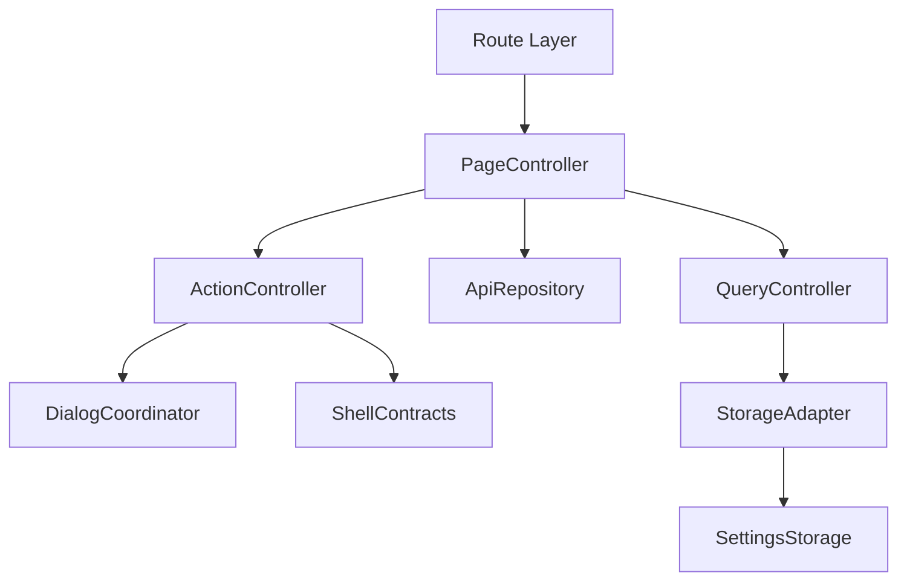
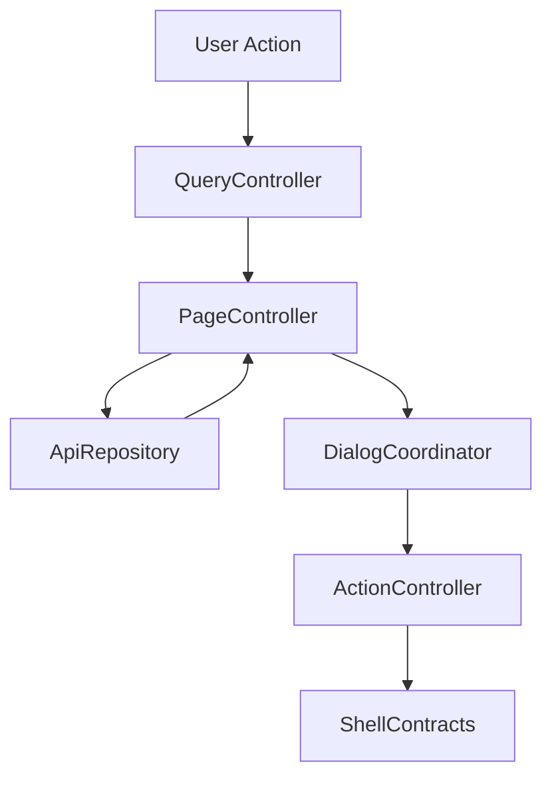

# 設計書: 放映中

## 概要

この仕様は /onair、tab/list、OnAirCard、ProgramDialog、live stream handoff の technical design を定める。

**ユーザー**: EPGStation の通常ユーザー、operator、関連 routed screen の実装者。

**影響**: requirements を component、route/query/API/localStorage contract、test strategy に接続し、tasks と実装の境界を曖昧にしない。

### 目標

- requirements の全受け入れ条件を design component と test に追跡可能にする。
- 決定済み React 技術選定を、実 package root `client/` の file plan に対応づける。
- `unittest/spec`、`unittest/imp`、E2E の最小 gate を明記する。

### 非目標

- 隣接 spec が所有する workflow、player lifecycle、settings default/backfill の取り込み。

## 境界の合意

### この仕様が所有するもの

- `/onair`、放映中 fetch、tab/list 表示、OnAirCard、program dialog、stream select dialog、live watch 情報 card。
- requirements に明記された route/query/API/localStorage/action/snackbar/dialog/menu behavior。
- 本 spec 配下の PageController、QueryController、ApiRepository、ActionController、DialogCoordinator、StorageAdapter の責務境界。

### 境界外

- stream API lifecycle の詳細、settings key/default、App Shell navigation。
- 実 URL、実番組名、認証情報、Mirakurun URL、ffmpeg/ffprobe 実 path、環境固有値の tracked docs への記録。

### 許可する依存

- live/player の詳細は `frontend-video-playback`、settings は `frontend-settings-storage` に従う。
- `frontend-settings-storage` の保存済み settings contract と adjacent storage key registry。
- `frontend-app-shell` の shell、title bar slot、edit title bar、snackbar、navigation host。
- 既存 EPGStation REST API と hash route compatible router。

### 再検証トリガー

- requirements の受け入れ条件、route/query/API endpoint、snackbar 文言、dialog/menu action が変わる。
- `frontend-settings-storage` の field/default/validation/adjacent key default が変わる。
- `frontend-app-shell` の title/snackbar/navigation/edit title bar contract が変わる。

## アーキテクチャ

### アーキテクチャ前提

frontend は React と hash route を前提にし、hash route compatibility、既存 API、localStorage contract、observed responsive behavior、snackbar/dialog/menu の表示条件を本書の requirements に定義された通りに維持する。

formal design の正本は、この design と同一 spec の requirements、visual-cases、mock-data、ならびに `.kiro/steering/` の project memory とする。矛盾がある場合は同一 spec の requirements と requirements 横断レビューの反映済み判断を優先する。

### アーキテクチャパターンと境界マップ



**アーキテクチャ統合**:
- 選択したパターン: feature boundary + shared typed contracts。
- ドメイン/機能境界: route/query/API/action/dialog/storage を feature 内で分離し、settings と shell は consumer として参照する。
- 固定するパターン: hash route、API endpoint、dialog close cleanup、snackbar result、responsive breakpoint。
- Steering 準拠: 設計書は日本語。

### 技術スタック

| レイヤー | 選択 / バージョン | 機能内の役割 | 備考 |
|-------|------------------|-----------------|-------|
| フロントエンド | React / TypeScript / Vite | UI と typed contract | package root は `client/`、package name は `epgstation-client`。 |
| ルーティング | React Router hash route 対応 router | route/query contract | route contract は `/#/...`（hash route）とする。 |
| Server state | TanStack Query | API response cache、loading/error/refetch、timer/Socket.IO invalidation | query key は route/query/API option から導出し、Socket.IO `updateStatus` などの event は該当 query invalidation/refetch に接続する。 |
| Local state | React local state/reducer | screen/dialog/edit/bulk state と App Shell 横断 state | server state は TanStack Query に置く。Zustand は使わない。 |
| UI / CSS | MUI Core + `@mdi/font` + theme token + `*.module.css` | MUI component 実装、responsive、visual contract | global CSS は `src/index.css` の bootstrap/reset 程度に限定し、visual-cases の geometry/screenshot contract を theme/shared component に接続する。 |
| Form / validation | React Hook Form + Zod | form state、submit validation、typed payload validation | reserve dialog や stream handoff payload validation はこの境界に従う。 |
| API client | native `fetch` wrapper + typed request/response validation | backend integration | repository base `./api` と endpoint path を二重結合しない。endpoint/query/body contract はこの design と requirements を正とする。 |
| Socket.IO | `socket.io-client` | realtime update trigger | event handler は feature repository / TanStack Query invalidation 境界へ接続し、failure snackbar の有無は各 design の契約に従う。 |
| Lint / format / alias | ESLint flat config + typescript-eslint + React Hooks plugin / Prettier / `@/` | static gate と import 解決 | `@/` は Vite / TypeScript / Vitest / ESLint で同一解決規則にする。 |
| Script gate | `build` = Vite production build（`bundle`）、`build:verify` = lint + typecheck + unit test + `build`、`check` = lint + format:check + typecheck + `test:dev-server` + `unittest/spec` + `unittest/imp` | `client/package.json` の scripts | `build:verify` は format check を含めず、`check` が Prettier gate を持つ。 |
| Test / coverage / browser | Vitest + V8 coverage / React Testing Library / Playwright / MSW | `unittest/spec`、`unittest/imp`、E2E、visual regression | 正式検証対象は Desktop Chromium、Desktop Firefox、Android Chrome、iOS Safari。visual は Playwright screenshot assertion と geometry assertion を併用する。 |

## ファイル構成

`client/src/features/onair/` 配下。TS/TSX の各 file は 300 行以下に保つ（CSS module は対象外）。

- `OnAirPage.tsx` — `/onair` の route root。tab 選択、ProgramDialog と stream 選択 dialog の配線、card list の composition。
- `WatchOnAirPage.tsx` — `/onair/watch` の live 視聴情報 card。
- `LiveStreamSelectDialog.tsx` — 共有 stream 選択 dialog（URL scheme / web 再生、種別と mode の選択、保存）。`frontend-guide` からも利用する。
- `onairApi.ts` — `OnAirApiRepository` の型と `createFetchOnAirApiRepository`。
- `onairRequests.ts` — `lib/onairRequestTypes.ts` / `lib/onairStreams.ts` / `lib/onairWatch.ts` の barrel。
- `index.ts` — feature の公開 export。
- `components/` — `OnAirCard`（card と list）、`OnAirTabs`（放送波 tab）。
- `hooks/` — `useOnAirSchedules`（放映中 query、番組終了時の再取得 timer、進行状況の tick、route 変更と予約 action 後の invalidate）。
- `lib/` — `onairRequestTypes`（型と定数）、`onairStreams`（API URL、stream 候補、stream 設定の保存、M2TS URL scheme）、`onairWatch`（watch route、視聴情報表示、query key、reserve index 変換、tab、更新遅延、進行率）、`onairApiAdapters`（応答 adapter と fetch helper）、`onairLiveStreamAdapters`（stream 情報と channel 名の adapter）、`liveStreamSelection`（stream 選択 dialog の候補探索と修復）。
- `OnAirPage.module.css` — On Air と stream 選択 dialog の style。

test:

- `client/unittest/spec/onair.*.spec.test.tsx`（route / card / liveStream / liveWatch / programDialog）と `unittest/spec/support/onairSpecHarness.tsx`。
- `client/unittest/imp/onair.*.imp.test.ts`（requests / api）。
- `client/e2e/broadcast-onair-workflow.spec.ts`、`broadcast-ios.spec.ts`、support `client/e2e/support/broadcastWorkflow.ts` / `guideOnAirMocks.ts` / `guideOnAirFixtures.ts`。
- browser の時計での更新: `client/e2e/browser-api-parity.spec.ts`（`page.clock` で放映中の番組の終わりをまたぎ、一覧を読み直すこと）。
- `client/visual/broadcast-geometry.spec.ts`。

## システムフロー



Flow は route/query/API/localStorage 境界で validation し、UI component が endpoint 文字列や localStorage schema を直接所有しない構造にする。

## 要件トレーサビリティ

| 要件 | 概要 | コンポーネント | インターフェース | フロー |
|-------------|---------|------------|------------|-------|
| 1.1-1.15 | route と放映中一覧 | PageController, QueryController, ApiRepository, ActionController, DialogCoordinator, StorageAdapter | State / Service / API | route/query/action flow |
| 2.1-2.10 | card と dialog | PageController, QueryController, ApiRepository, ActionController, DialogCoordinator, StorageAdapter | State / Service / API | route/query/action flow |
| 3.1-3.25 | live stream handoff | PageController, QueryController, ApiRepository, ActionController, DialogCoordinator, StorageAdapter | State / Service / API | stream selection/watch info flow |
| 4.1-4.4 | live playback と dark theme | PageController, DialogCoordinator | State | stream selection/watch info flow |

## コンポーネントとインターフェース

| コンポーネント | ドメイン/レイヤー | 意図 | 要件カバレッジ | 主な依存 | 契約 |
|-----------|--------------|--------|--------------|------------------|-----------|
| PageController | Feature Routing | route 初期化、title、fetch、loading/error/empty を統括する。 | 1.1-1.15, 2.1-2.10, 3.1, 3.10-3.12, 4.1-4.4 | frontend-settings-storage / frontend-app-shell / EPGStation API | 状態管理 |
| QueryController | Feature Routing | path/query/local UI input を typed model に変換する。 | 1.6-1.8, 3.3, 3.7, 3.9-3.11 | frontend-settings-storage / frontend-app-shell / EPGStation API | Service |
| ApiRepository | Feature API | requirements で定義された endpoint request と typed error 変換を扱う。 | 1.4, 1.10, 2.7, 3.5, 3.6, 3.10-3.12 | frontend-settings-storage / frontend-app-shell / EPGStation API | API |
| ActionController | Feature Service | menu、button、dialog submit、bulk action の結果を route/API/snackbar に接続する。 | 2.5, 2.6, 2.8, 3.1-3.9 | frontend-settings-storage / frontend-app-shell / EPGStation API | Service/API |
| DialogCoordinator | Feature UI | dialog/menu/open-reset/close-cleanup/focus を管理する。 | 2.5, 2.6, 2.8, 3.1-3.4, 4.2 | frontend-settings-storage / frontend-app-shell / EPGStation API | 状態管理 |
| StorageAdapter | Shared Boundary | settings を consumer として読み、OnAir 固有 adjacent key の restore/save を扱う。 | 1.4, 1.6, 3.3, 3.4, 3.14 | frontend-settings-storage / frontend-app-shell / EPGStation API | 状態管理 |

### ページ制御（PageController）

| 項目 | 詳細 |
|-------|--------|
| 意図 | route 初期化、title、loading/error/empty、child component composition を統括する。 |
| 要件 | 1.1-1.15, 2.1-2.10, 3.1, 3.10-3.12, 4.1-4.4 |

**責務と制約**
- route entrypoint と screen lifecycle だけを所有する。
- fetch/action の副作用は ApiRepository と ActionController へ委譲する。
- App Shell title/snackbar/edit title bar へは typed request だけを渡す。

### クエリ制御（QueryController）

| 項目 | 詳細 |
|-------|--------|
| 意図 | route query、path param、form/filter input を typed model に変換する。 |
| 要件 | 1.6-1.8, 3.3, 3.7, 3.9-3.11 |

**責務と制約**
- `unknown` / string query を domain type へ narrow する。
- invalid input は requirements に従い normalize、ignore、controlled error、または no-op に変換する。
- route refresh 用 `timestamp` は user-facing filter state へ露出しない。

### API リポジトリ（ApiRepository）

| 項目 | 詳細 |
|-------|--------|
| 意図 | API request builder、response adapter、typed error conversion を扱う。 |
| 要件 | 1.4, 1.10, 2.7, 3.5, 3.6, 3.10-3.12 |

**責務と制約**
- endpoint は requirements を正とする。
- request body/query は explicit type で定義し、TypeScript の `any` を使わない。
- API failure は UI へ例外を漏らさず typed error として返す。

### アクション制御（ActionController）

| 項目 | 詳細 |
|-------|--------|
| 意図 | menu、dialog、button、bulk action の実行と snackbar/route update を扱う。 |
| 要件 | 2.5, 2.6, 2.8, 3.1-3.9 |

**責務と制約**
- 表示条件、disabled/hidden 条件、成功/失敗 snackbar は requirements を正とする。
- action 完了後の refetch、dialog close、route move を一箇所に集約する。
- 破壊的 action は confirm dialog または requirements に定義された no-op 条件を経由する。

### ダイアログ調整（DialogCoordinator）

| 項目 | 詳細 |
|-------|--------|
| 意図 | dialog/menu open/reset/close cleanup/focus を扱う。 |
| 要件 | 2.5, 2.6, 2.8, 3.1-3.4, 4.2 |

**責務と制約**
- open ごとに stale state を reset する。
- close animation 後の remove/remount が requirements にある場合は維持する。
- dialog body の screenshot が不足する場合は mock API または検証 config で fixture を補完する。

### ストレージアダプター（StorageAdapter）

| 項目 | 詳細 |
|-------|--------|
| 意図 | settings を consumer として読み、OnAir 固有 adjacent localStorage key を restore/save する。 |
| 要件 | 1.4, 1.6, 3.3, 3.4, 3.14 |

**責務と制約**
- settings default、backfill、validation は `frontend-settings-storage` に委譲する。
- `OnAirSelectStreamSetting` の default shape は `frontend-settings-storage` requirements の adjacent key contract を正とする。OnAir feature は dialog open restore、close save、現在候補に対する invalid correction を design と tasks に展開する。
- 保存済み値の parse failure は settings storage contract に従う。

### API 契約

この表の endpoint は frontend repository contract であり、`./api` の base path は含めない。決定済み native `fetch` wrapper に基づいて API client を作る場合も base path と endpoint path を二重に結合しない。

| メソッド | エンドポイント | リクエスト | レスポンス | エラー |
|--------|----------|---------|----------|--------|
| GET | /reserves/lists | startAt=now/endAt=now+1h | reserve index for current programs | 放映中 fetch failure snackbar |
| GET | /schedules/broadcasting | isHalfWidth only; no time query | flat broadcasting schedule array | 放映中 fetch failure snackbar |
| GET | /streams | isHalfWidth | live stream info list for /onair/watch info card | ストリーム情報取得に失敗 |
| EVENT | Socket.IO updateStatus | none | refetch trigger | refetch failure は route fetch failure snackbar と同じ扱いにしない |

### 共有型契約

```typescript
type FeatureResult<T, E extends string> =
  | { ok: true; value: T }
  | { ok: false; error: E; message: string };

interface RouteBuildResult {
  path: string;
  query: Record<string, string>;
}

interface SnackbarRequest {
  text: string;
  color?: 'normal' | 'success' | 'info' | 'error';
  timeout?: number;
}
```

## 機能固有の設計判断

### 放映中 fetch 契約

- `/onair` は loading indicator を追加せず、取得中/0 件では no card / no empty message / no loading indicator の blank body を維持する。
- fetch は `GET /reserves/lists?startAt=now&endAt=now+1h` と `GET /schedules/broadcasting?isHalfWidth=<setting>` を使う。`time` query は送らない。
- `/schedules/broadcasting` は flat schedule array として受け、`isOnAirTabListView=true` では UI 側で `channelType` ごとに tab filter する。`false` では flat list grouping とする。
- tab 順序は server config enabled broadcast wave の `GR` / `BS` / `CS` / `SKY` / `BS4K` 順とし、tab value は broadcast type 文字列を使う。tab 表示条件は `isOnAirTabListView=true` かつ schedule 件数が 1 件以上の場合だけ true とする。
- tab は App Shell title bar extension slot に描画する。iOS / iPadOS fixed shell では App Shell が extension を含む title bar 実測 height を `shell-main` の top padding に反映するため、On Air list の top は放送波 tab の bottom 以上でなければならない。
- route deep watch は immediate に fetch lifecycle を開始する。Socket.IO `updateStatus`、次 program `endAt` timer、0 件時 1 秒 retry で data を再取得する。
- progress 表示用の 10 秒 interval を持つ。 fetch 開始時に次 fetch timer を clear し、progress interval は fetch 成功後に clear/recreate する。fetch 失敗時は結果の更新で effect の cleanup が timer と progress interval を解除し、再生成しない（一覧は空になる）。route leave / destroy では timer、progress interval、Socket.IO subscription を cleanup する。

### ストリーム選択ストレージ

`OnAirSelectStreamSetting` の default shape は `frontend-settings-storage` requirements が定義する key を参照する。OnAir は dialog open 時に復元し、現在の候補に存在しない type は候補配列の先頭へ補正し、mode が範囲外の場合は `0` へ補正する。close 時に選択値を保存する。この保存 / 復元 / invalid 補正は On Air owned `LiveStreamSelectDialog` contract の一部であり、Guide consumer は再実装しない。

dialog 表示中に配信方式（type）select を変更したときは、この invalid 補正と同じ規則（`normalizeMode`）を type 変更後の候補配列に対して適用する。すなわち選択中の mode index が新しい配信方式の画質候補にも存在すればその mode を維持し、存在しない場合だけ `0` へ補正する。`useURLScheme` switch の切り替え時は独立した規則（要求 3 AC14）に従い、常に候補配列の先頭 type・mode `0` へ補正する。

### LiveStreamSelectDialog export 契約

On Air は `LiveStreamSelectDialog` の 物理 owner として named export を提供する。consumer は On Air screen 自身と Guide とする。`showGuide` prop の契約は「On Air から開くと false、Guide から開くと true」で固定する。

Dialog input は対象 `channelId`、表示用 channel name、現在の Guide `time`、show-guide flag、stream start callback を含む。On Air owner は stream type/mode 候補生成、`useURLScheme` toggle による候補再構築、`OnAirSelectStreamSetting` の保存/復元/invalid 補正、M2TS URL scheme / playlist fallback、watch route builder、`再生に対応していません` / `視聴ページへの移動に失敗` snackbar を所有する。consumer はこれらを再定義しない。

M2TS URL scheme は 、Settings の `onAirM2TSViewURLScheme` が non-empty ならそれを最優先し、empty/null の場合は `/api/config.urlscheme.m2ts` から current platform の template を選ぶ。platform 判定は iOS user agent（iPhone / iPad / iPod）、Android user agent、iPadOS (`Mac` platform + `maxTouchPoints > 1`)、macOS、Windows の順で行う。template が解決できない場合だけ、repository base `./api` に `streams/live/:channelId/m2ts/playlist?mode=:mode` を結合した相対 URL（`./api/streams/live/:channelId/m2ts/playlist?mode=:mode`）を `window.location.href` へ渡す。相対 URL は文書の path を基準に解決されるため、subDirectory 配下でも同じ配下の API を指す。template の `PROTOCOL` は current `location.protocol` から `:` を除いた値、`ADDRESS` は `location.host + subDirectory + /api/streams/live/:channelId/m2ts?mode=:mode` とし、template に `vlc-x-callback` を含む場合のみ `ADDRESS` を `encodeURIComponent` する。tracked spec/test artifact には実 host や実 scheme を残さず synthetic placeholder を使う。

`/api/config` の streamConfig は fetch adapter 境界で iOS 用に正規化する。iOS では live TS の `webm` / `mp4` を常に削除する。`m2tsll` は iPad/iPhone というモデル判定では残す/削除しない。実行中の browser が mpegts.js の MSE live playback（`Mpegts.isSupported() && getFeatureList().mseLivePlayback` -- W3C `MediaSource` または Apple `ManagedMediaSource` のいずれかで `video/mp4; codecs="avc1.42E01E,mp4a.40.2"` が `isTypeSupported` になり、かつ fetch+`ReadableStream` の network stream IO が使える場合に true）を feature detection した結果だけを adapter 既定値の入力にし、support があるときだけ `m2tsll` を残す。iPhone/iPad のいずれでも、`ManagedMediaSource` または `MediaSource` 経由でこの support を満たす環境だけが `m2tsll` を残し、満たさない環境は機種を問わず削除される。残った live 候補は URL Scheme 用の `m2ts` と web playback 用の `hls`、および support 済み環境の `m2tsll` に限定される。On Air の dialog や Guide consumer はこの正規化済み config だけを入力に候補生成し、iOS 非対応形式の個別再表示をしてはならない。

Dialog は常設 `キャンセル` button と `視聴` 確定 button を持つ。`キャンセル` は API call なしで close し、`視聴` は現在選択中の stream handoff を実行する。`番組表` button は `showGuide=true` の場合だけ表示し、On Air から開いた場合は表示しない。

### ProgramDialog アクション表

On Air は Guide owned shared ProgramDialog を consume し、Guide ProgramDialog と同じ no reserve / manual / rule / skip / overlap action matrix を使う。reserve index は ProgramDialog open 時の action state 決定だけに供給し、OnAirCard 自体には reserve/conflict/skip/overlap class を付けない。

On Air consumer は ProgramDialog の active close handler と persisted setting callback を分けて渡す。active close では `GuideProgramDetailSetting` と dialog open state を更新し、route leave / external unmount cleanup では setting の永続化だけを行う。`検索`、`編集`、`ルール` で別 route へ遷移してから `/onair` へ戻る flow では、OnAirCard 一覧が再表示され、同一 test/user session 内で削除、除外、除外解除、重複解除など後続 action を継続できる。

| 状態 | 主アクション | API / Route | Snackbar | Close |
| --- | --- | --- | --- | --- |
| no reserve | 予約 | `POST /reserves` with `programId`, `allowEndLack`, optional encode option | `<programName> 予約` / `<programName> 予約失敗` | success/failure 後に close |
| manual reserve | 削除 | `DELETE /reserves/:reserveId` | `<programName> キャンセル` / `<programName> キャンセル失敗` | success/failure 後に close |
| rule reserve | 除外 | `DELETE /reserves/:reserveId` | `<programName> キャンセル` / `<programName> キャンセル失敗` | success/failure 後に close |
| skip | 除外解除 | `DELETE /reserves/:reserveId/skip` | `<programName> 除外解除` / `<programName> 除外解除失敗` | success/failure 後に close |
| overlap | 重複解除 | `DELETE /reserves/:reserveId/overlap` | `<programName> 重複解除` / `<programName> 重複解除失敗` | success/failure 後に close |

常設 `閉じる` button は API call なしで dialog を close する。

### `/onair/watch` 情報カード

- `/onair/watch` の physical route component と player validation は `frontend-video-playback` が所有する。On Air は On Air 一覧からの route builder、stream selection entrypoint、live info card matching/fetch のみを所有する。
- live watch route は query key `channel`、stream `type`、`mode` を validate する。`type` query は `hls`、`m2tsll`、`webm`、`mp4` の serialized value を使う。表示名 `M2TS-LL` は route query では `m2tsll`、`WebM` / `MP4` / `HLS` は lowercase に変換する。
- `GET /streams?isHalfWidth=<setting>` で stream info を取得し、route query `channel` の数値値と stream item `channelId`、および `mode` に一致する stream info があるときだけ info card を表示する。stream info の backend 内部 `type` は route query の stream type と直接比較しない。
- stream info fetch failure は `ストリーム情報取得に失敗` snackbar を表示するが、player route 自体は video-playback owner の validation/lifecycle に委譲する。
- live info card は `endAt - now` を次回更新 timer として使う。`endAt - now <= 0`、stream info が 0 件、または fetch failure の場合は 1000ms retry とする。Socket.IO `updateStatus` は OnAir list 側の refetch trigger であり、live info card の stream info は route init と timer に加えて Socket.IO `updateStatus` でも更新される。route leave/destroy では timer と Socket.IO subscription を cleanup する。
- stream select dialog は呼び出し元に応じて `番組表` button の表示可否を受け取る。On Air から開いた場合は `番組表` button を表示しない。

### Visual contract

| UI | Owner | Contract |
| --- | --- | --- |
| `OnAirCard` | frontend-onair | single column、centered、max width 800、1 item per channel/schedule。 |
| `LiveStreamSelectDialog` | frontend-onair | max width 400、scrollable、header は selected channel name、stream type/config select、`外部アプリで開く` switch、optional `番組表`、常設 `キャンセル` / `視聴` action。switch は track background と thumb position / color に 150ms 程度の transition を持つ。 |
| `/onair/watch` content | frontend-onair / frontend-video-playback | live watch player/info content は centered max width 1200 の領域に配置する。physical player は frontend-video-playback、info card は frontend-onair が所有する。 |

## データモデル

- `OnAirFetchResult`: `{ reserveIndex, broadcastingSchedules }`。reserve index と flat broadcasting schedule array を別 source として扱う。
- `OnAirStreamSelection`: `{ useURLScheme, type: 'M2TS' | 'M2TS-LL' | 'WebM' | 'MP4' | 'HLS', mode: number }`。
- `LiveWatchInfoState`: `{ matchingStreamInfo?, fetchError?, refreshTimerId? }`。player lifecycle とは分離する。

## エラーハンドリング

- validation は route/query/form/API/localStorage の境界で行う。
- snackbar 文言は requirements に定義された文言を優先する。
- no-op、blank presentation、controlled error の選択は requirements を正とする。
- stale research と formal requirements が矛盾する場合は formal requirements を正とする。

## テスト戦略

unit test は `npm run coverage:gate` で statements・branches・functions・lines の 4 指標 100% を要求する。unit test は `unittest/spec` と `unittest/imp` の 2 種類を持ち、片方で他方を代替しない。E2E と visual は release-preflight の client-browser step で実ブラウザーに流す。hosted CI（`client.yml`）は lint・typecheck・format check だけを行う。

- `unittest/spec`: user-visible behavior、route/query contract、API request contract、状態遷移、snackbar/dialog/menu 表示条件を requirements ID に紐づけて検証する。
- `unittest/imp`: query parser、request builder、state reducer、validator、lifecycle cleanup、storage adapter の分岐と edge case を検証する。
- E2E: deterministic mock data で route 表示、主要 action、dialog/menu、responsive、empty/error state を確認する。

test 名の先頭に付ける `[AC n.m]` の n.m は、test file が属する本 spec（file 名と配置 directory で決まる）の受け入れ条件の番号である。他の spec の受け入れ条件を確かめる test は `[AC <spec 名> n.m]` と書く（例: `[AC frontend-app-shell 8.32]`）。E2E と visual の test も同じ書式の ID を test 名の先頭に付ける。受け入れ条件の番号から test を辿るときは、この書式の ID を `grep` する。

### Visual Regression 契約

この feature の詳細 layout は、本文の OnAirCard / LiveStreamSelectDialog / watch info contract と `visual-cases.md` の visual cases、`mock-data.md` の synthetic dataset contract を合わせて正本とする。

`visual-cases.md` は geometry / interaction test の条件を定義する。`mock-data.md` は visual cases で使う synthetic broadcasting schedule、reserve index、stream options、watch info fixture 条件を定義する。

Video player surface は `frontend-video-playback` が所有し、On Air は `/onair/watch` の info card と live stream handoff の visual contract だけを所有する。tracked artifact には実番組名、実 URL、実ロゴ、サムネイル、認証情報、環境固有値を含めない。

### Visual Implementation Contract

OnAirCard list は centered single column max width `800px`、card padding `12px 16px`、card gap `8px`、channel header 14px/20px/500、program title 14px/20px/500、description 12px/16px 2 行までとする。Progress bar は height `4px`、track/fill は App Shell token と theme palette を使い、category 表示は visual contract に含めない。

iOS / iPadOS fixed shell の visual regression では、`isOnAirTabListView=true` の `/onair` で title bar height が通常 toolbar だけの 64px を超えること、`shell-main` の computed `padding-top` が実測 title bar height と一致すること、On Air list top が title bar bottom 以上であることを確認する。

LiveStreamSelectDialog は max width `400px`、content padding `16px 24px`、control gap `12px`、action row `8px 16px` とする。保存済み stream type/mode が候補にない場合も select が空白にならず、先頭候補を表示する。Guide consumer の `番組表` button がある場合も action row height を変えない。

`/onair/watch` は centered max width `1200px` とする。info card は desktop・mobile とも player の下に縦積みし、最大幅 `800px`、padding `12px 16px`、player との間は `.watchPage` の padding `8px` とする。player controls と autoplay/subtitle は Video Playback owner を正とし、On Air は info card が controls を覆わないことだけを固定する。

`/onair/watch` の info card は App Shell の `contentSurface` / `textPrimary` / `textSecondary` token を使う。CSS module fallback は light mode `#fff` だけでなく dark mode `#1e1e1e` を明示し、dark theme 時に CSS variable が未定義でも channel/time/title/description が white surface fallback または dark surface 上の black foreground にならないようにする。

### 機能テストケース

- On Air fetch が `/reserves/lists` と `/schedules/broadcasting` を使い、`time` を送らず、flat response を `channelType` で tab filter することを検証する。
- blank body、tab/list mode、card click split、route watch immediate、Socket.IO update、next endAt timer、10 秒 progress interval、0 件時 1 秒 retry、destroy cleanup を検証する。
- OnAirSelectStreamSetting の settings-storage default shape 消費、restore、invalid補正、close保存を検証する。
- On Air ProgramDialog action matrix、常設 close button、success/failure close を検証する。
- `/onair/watch` query key `channel`、info card matching と `ストリーム情報取得に失敗` snackbar を検証する。

## セキュリティとプライバシー

- tracked docs、test fixture、snapshot に実 URL、実番組名、認証情報、Mirakurun URL、ffmpeg/ffprobe 実 path、環境固有値を書かない。
- Playwright の基準画像（`client/visual/*-snapshots/`・`client/e2e/*-snapshots/`。synthetic data だけを写す）は追跡する。test 実行時の出力と実機の撮影結果は追跡しない（`client/test-results`、`client/device/artifacts/` は ignore 済み）。
- E2E は実データではなく controlled mock data を使う。

## 性能とアクセシビリティ

- list/grid/dialog は stable dimensions と responsive constraints を持ち、text overlap と layout shift を避ける。
- menu button、dialog button、item action button は keyboard focus と accessible name を持つ。
- heavy rendering、stream、upload、dialog timer は route leave または close 時に cleanup する。

## リスクと緩和策

- 技術選定は `.kiro/steering/tech.md` と `.kiro/steering/testing.md` を参照し、`client/` の package root、scripts、dependencies と一致させる。
- requirements が変更された場合、traceability と task boundary を再確認する。
- screenshot body が不足する dialog は mock API または validation config で補完する。

### select と playback controls の契約

On Air の live stream selection dropdown は shared `AppSelect` を使い、既存の横幅を維持したまま MUI theme、dark token、4.5 item menu cap、vertical center 表示を継承する。HLS live playback は `frontend-video-playback` の HLS lifecycle を正とし、On Air は route handoff に channel id、streaming type、mode を欠落なく渡す。`/onair/watch` の info card は card-like surface として dark coverage 対象に含め、mobile Android では playback started 後の loading overlay、tap-to-hide controls、fullscreen landscape lock、standalone rotation button を `frontend-video-playback` contract と合わせて確認する。
