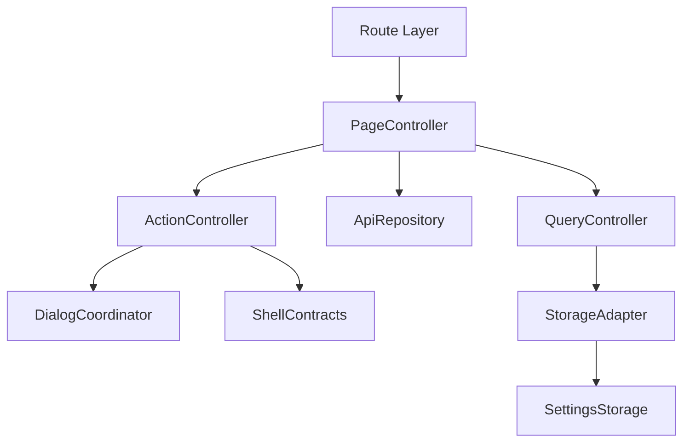
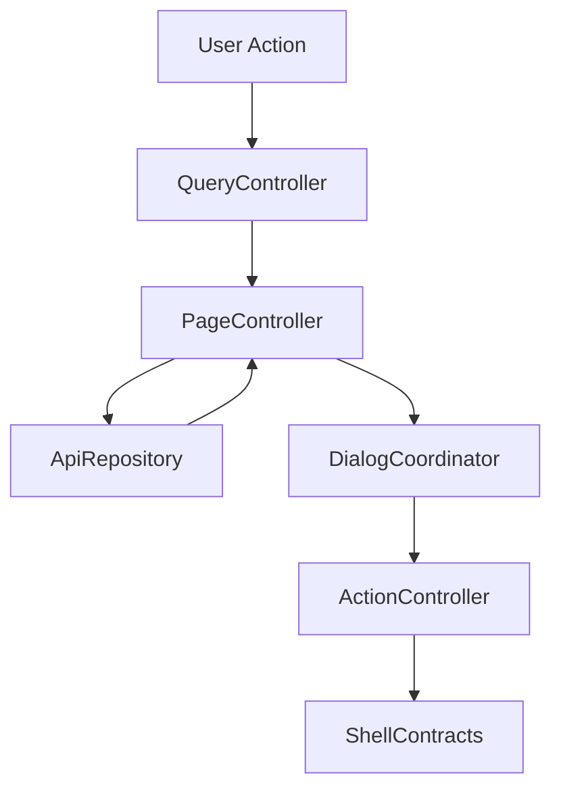

# 設計書: 録画済み

## 概要

この仕様は 録画済み list/detail、protect/delete/cleanup/encode/Kodi/drop log、playback/upload handoff の technical design を定める。

**ユーザー**: EPGStation の通常ユーザー、operator、関連 routed screen の実装者。

**影響**: requirements を component、route/query/API/localStorage contract、test strategy に接続し、tasks と実装の境界を曖昧にしない。

### 目標

- requirements の全受け入れ条件を design component と test に追跡可能にする。
- 決定済み React 技術選定を、実 package root `client/` の file plan に対応づける。
- `unittest/spec`、`unittest/imp`、E2E の最小 gate を明記する。

### 非目標

- 隣接 spec が所有する workflow、player lifecycle、settings default/backfill の取り込み。

## 境界の合意

### この仕様が所有するもの

- `/recorded`、`/recorded/detail/:id`、Recorded list/detail menu/dialog、protect/delete/cleanup、encode/kodi/drop log、watch/streaming/upload への handoff。
- requirements に明記された route/query/API/localStorage/action/snackbar/dialog/menu behavior。
- 本 spec 配下の PageController、QueryController、ApiRepository、ActionController、DialogCoordinator、StorageAdapter の責務境界。

### 境界外

- video player lifecycle、stream keep/stop。
- 実 URL、実番組名、認証情報、Mirakurun URL、ffmpeg/ffprobe 実 path、環境固有値の tracked docs への記録。

### 許可する依存

- settings は `frontend-settings-storage`、shell は `frontend-app-shell`、player は `frontend-video-playback` に従う。Recorded upload form の `/recorded/upload` route contract は `frontend-storages-upload` が所有し、本 spec は upload route への入口だけを持つ。
- `frontend-settings-storage` の保存済み settings contract と adjacent storage key registry。
- `frontend-app-shell` の shell、title bar slot、edit title bar、snackbar、navigation host。
- 既存 EPGStation REST API と hash route compatible router。

### 再検証トリガー

- requirements の受け入れ条件、route/query/API endpoint、snackbar 文言、dialog/menu action が変わる。
- `frontend-settings-storage` の field/default/validation/adjacent key default が変わる。
- `frontend-app-shell` の title/snackbar/navigation/edit title bar contract が変わる。

## アーキテクチャ

### アーキテクチャ前提

frontend は React と hash route を前提にし、hash route compatibility、既存 API、localStorage contract、observed responsive behavior、snackbar/dialog/menu の表示条件を本書の requirements に定義された通りに維持する。

formal design の正本は、この design と同一 spec の requirements、visual-cases、mock-data、ならびに `.kiro/steering/` の project memory とする。矛盾がある場合は同一 spec の requirements と requirements 横断レビューの反映済み判断を優先する。

### アーキテクチャパターンと境界マップ



**アーキテクチャ統合**:
- 選択したパターン: feature boundary + shared typed contracts。
- ドメイン/機能境界: route/query/API/action/dialog/storage を feature 内で分離し、settings と shell は consumer として参照する。
- 固定するパターン: hash route、API endpoint、dialog close cleanup、snackbar result、responsive breakpoint。
- Steering 準拠: 設計書は日本語。

### 技術スタック

| レイヤー | 選択 / バージョン | 機能内の役割 | 備考 |
|-------|------------------|-----------------|-------|
| フロントエンド | React / TypeScript / Vite | UI と typed contract | package root は `client/`、package name は `epgstation-client`。 |
| ルーティング | React Router hash route 対応 router | route/query contract | route contract は `/#/...`（hash route）とする。 |
| Server state | TanStack Query | API response cache、loading/error/refetch、Socket.IO invalidation | query key は route/query/API option から導出し、Socket.IO `updateStatus` などの event は該当 query invalidation/refetch に接続する。 |
| Local state | React local state/reducer | screen/dialog/edit/bulk state と App Shell 横断 state | server state は TanStack Query に置く。Zustand は使わない。 |
| UI / CSS | MUI Core + `@mdi/font` + theme token + `*.module.css` | MUI ベースの UI 実装、responsive、visual contract | global CSS は `src/index.css` の bootstrap/reset 程度に限定し、visual-cases の geometry/screenshot contract を theme/shared component に接続する。 |
| Form / validation | React Hook Form + Zod | form state、submit validation、typed payload validation | search/action dialog payload validation はこの境界に従う。 |
| API client | native `fetch` wrapper + typed request/response validation | backend integration | repository base `./api` と endpoint path を二重結合しない。endpoint/query/body contract はこの design と requirements を正とする。 |
| Socket.IO | `socket.io-client` | realtime update trigger | event handler は feature repository / TanStack Query invalidation 境界へ接続し、failure snackbar の有無は各 design の契約に従う。 |
| Lint / format / alias | ESLint flat config + typescript-eslint + React Hooks plugin / Prettier / `@/` | static gate と import 解決 | `@/` は Vite / TypeScript / Vitest / ESLint で同一解決規則にする。 |
| Script gate | `build` = Vite production build（`bundle`）、`build:verify` = lint + typecheck + unit test + `build`、`check` = lint + format:check + typecheck + `test:dev-server` + `unittest/spec` + `unittest/imp` | `client/package.json` の scripts | `build:verify` は format check を含めず、`check` が Prettier gate を持つ。 |
| Test / coverage / browser | Vitest + V8 coverage / React Testing Library / Playwright / MSW | `unittest/spec`、`unittest/imp`、E2E、visual regression | 正式検証対象は Desktop Chromium、Desktop Firefox、Android Chrome、iOS Safari。visual は Playwright screenshot assertion と geometry assertion を併用する。 |

## ファイル構成

`client/src/features/recorded/` が list / detail を所有する。TS/TSX の 1 file は 300 行前後に保ち、CSS module は対象外とする。

- `RecordedPage.tsx` — `/recorded` route root。query と settings から request / query key を組み立て、一覧、pagination（共有の `AppPagination` が `isEnableExtendedPagination` で拡張 pagination と `LegacyPagination` を選ぶ）、edit mode、dialog を composition する。
- `RecordedDetailPage.tsx` — `/recorded/detail/:id` route root。
- `recordedPageProps.ts` — 両 page が受け取る props 型。
- `index.ts` — 共有 component（`RecordedItemMenu`、`RecordedDeleteDialog`、`RecordedBulkDeleteDialog`、`AddEncodeDialog`）と bulk delete action の export。
- `components/` — `RecordedListTitleBar`、`RecordedListItemView`、`RecordedItemMenu`、`RecordedDeleteDialogs`、`AddEncodeDialog`、`RecordedSearchDialog`、`RecordedCleanupDialog`、`RecordedDownloadDialog`、`RecordedStreamSelectDialog`、`RecordedDetailVideoFileMenu`、`RecordedDetailMoreMenu`、`SendVideoFileToKodiDialog`、`RecordedPlainDialog`。
- `lib/` — `recordedFormat.ts`（layout、時刻、genre、drop 情報の整形）、`recordedRoute.ts`（detail route id の parse）、`recordedBrowser.ts`（origin / href / storage の取得）、`recordedSnackbar.ts`。
- `recordedApi.ts` — `createFetchRecordedApiRepository` と `api/` の型 re-export。`api/recordedApiTypes.ts`（DTO と `RecordedApiRepository`）、`api/recordedAdapters.ts`（list / detail / channel の adapter）、`api/recordedSearchAdapters.ts`（検索 option、rule、upload 応答の adapter）、`api/recordedFetch.ts`（fetch helper）、`api/createRecordedActionMethods.ts`（protect / delete / cleanup / encode / Kodi の action method）。
- `recordedRequests.ts` — `requests/` の barrel。`constants.ts`、`listRequest.ts`、`searchPath.ts`、`extendedText.ts`、`videoHandoff.ts`、`streamSelect.ts`、`addEncode.ts`、`bulkDelete.ts`、`settingsStorage.ts`、`fileSize.ts`、`uploadForm.ts`（upload form の contract は `frontend-storages-upload` が所有し、barrel は re-export だけを行う）。
- `RecordedPage.module.css` — list / detail / dialog の style。

test:

- `client/unittest/spec/recorded/*.spec.test.tsx` — 画面ごとの spec（`list-*`、`detail-*`）。共有 helper は `recordedSpecHelpers.tsx`、`recordedSpecRepository.tsx`。
- `client/unittest/imp/recorded/*.imp.test.ts` — request builder、adapter、transport、handoff、action の実装 test。
- `client/e2e/recorded-list-workflow.spec.ts`、`recorded-scroll-workflow.spec.ts`、`recorded-detail-workflow.spec.ts`、`recorded-ios.spec.ts`。helper は `client/e2e/support/recordedWorkflow.ts`、mock は `recordedMocks.ts` と `recordedFixtures.ts`。
- `client/visual/recorded-geometry.spec.ts`。

## システムフロー



Flow は route/query/API/localStorage 境界で validation し、UI component が endpoint 文字列や localStorage schema を直接所有しない構造にする。

## 要件トレーサビリティ

| 要件 | 概要 | コンポーネント | インターフェース | フロー |
|-------------|---------|------------|------------|-------|
| 1.1-1.15 | Recorded list | PageController, QueryController, ApiRepository, StorageAdapter | State / Service / API | list route/fetch/render flow |
| 2.1-2.37 | Recorded list actions | ActionController, DialogCoordinator, QueryController, ApiRepository, StorageAdapter | State / Service / API | menu/dialog/action flow |
| 3.1-3.35 | Recorded detail | PageController, QueryController, ApiRepository, ActionController, DialogCoordinator, StorageAdapter | State / Service / API | detail fetch/menu/dialog/handoff flow |
| 4.1-4.10 | playback/upload handoff | QueryController, ActionController, StorageAdapter | State / Service | playback/upload route handoff flow |
| 5.1-5.6 | detail dialog と playback handoff の契約 | DialogCoordinator, ActionController | State / Service | detail dialog / playback handoff flow |

## コンポーネントとインターフェース

| コンポーネント | ドメイン/レイヤー | 意図 | 要件カバレッジ | 主な依存 | 契約 |
|-----------|--------------|--------|--------------|------------------|-----------|
| PageController | Feature Routing | route 初期化、title、fetch、loading/error/empty を統括する。 | 1.1-1.15, 2.1-2.9, 2.17, 2.25-2.37, 3.1-3.3, 3.18-3.35, 4.1-4.10 | frontend-settings-storage / frontend-app-shell / EPGStation API | 状態管理 |
| QueryController | Feature Routing | path/query/local UI input を typed model に変換する。 | 1.1-1.4, 2.1, 2.10, 2.11, 3.1, 3.3, 3.11-3.14, 4.1-4.8 | frontend-settings-storage / frontend-app-shell / EPGStation API | Service |
| ApiRepository | Feature API | requirements で定義された endpoint request と typed error 変換を扱う。 | 1.4-1.15, 2.2, 2.8-2.37, 3.4-3.35, 4.4-4.8 | frontend-settings-storage / frontend-app-shell / EPGStation API | API |
| ActionController | Feature Service | menu、button、dialog submit、bulk action の結果を route/API/snackbar に接続する。 | 2.3-2.37, 3.3-3.17, 4.1-4.8, 5.1-5.6 | frontend-settings-storage / frontend-app-shell / EPGStation API | Service/API |
| DialogCoordinator | Feature UI | dialog/menu/open-reset/close-cleanup/focus を管理する。 | 2.4, 2.6-2.9, 2.14, 2.19-2.26, 3.4-3.17, 3.21-3.35, 4.2, 4.7-4.10, 5.1-5.6 | frontend-settings-storage / frontend-app-shell / EPGStation API | 状態管理 |
| StorageAdapter | Shared Boundary | settings と隣接 localStorage key を consumer として読む。 | 1.4, 2.20, 3.6, 3.14, 3.16, 4.1-4.8 | frontend-settings-storage / frontend-app-shell / EPGStation API | 状態管理 |

### ページ制御（PageController）

| 項目 | 詳細 |
|-------|--------|
| 意図 | route 初期化、title、loading/error/empty、child component composition を統括する。 |
| 要件 | 1.1-1.15, 2.1-2.9, 2.17, 2.25-2.37, 3.1-3.3, 3.18-3.35, 4.1-4.10 |

**責務と制約**
- route entrypoint と screen lifecycle だけを所有する。
- fetch/action の副作用は ApiRepository と ActionController へ委譲する。
- App Shell title/snackbar/edit title bar へは typed request だけを渡す。

### クエリ制御（QueryController）

| 項目 | 詳細 |
|-------|--------|
| 意図 | route query、path param、form/filter input を typed model に変換する。 |
| 要件 | 1.1-1.4, 2.1, 2.10, 2.11, 3.1, 3.3, 3.11-3.14, 4.1-4.8 |

**責務と制約**
- `unknown` / string query を domain type へ narrow する。
- invalid input は requirements に従い normalize、ignore、controlled error、または no-op に変換する。
- route refresh 用 `timestamp` は user-facing filter state へ露出しない。

### API リポジトリ（ApiRepository）

| 項目 | 詳細 |
|-------|--------|
| 意図 | API request builder、response adapter、typed error conversion を扱う。 |
| 要件 | 1.4-1.15, 2.2, 2.8-2.37, 3.4-3.35, 4.4-4.8 |

**責務と制約**
- endpoint は requirements を正とする。
- request body/query は explicit type で定義し、TypeScript の `any` を使わない。
- API failure は UI へ例外を漏らさず typed error として返す。

### アクション制御（ActionController）

| 項目 | 詳細 |
|-------|--------|
| 意図 | menu、dialog、button、bulk action の実行と snackbar/route update を扱う。 |
| 要件 | 2.3-2.37, 3.3-3.17, 4.1-4.8, 5.1-5.6 |

**責務と制約**
- 表示条件、disabled/hidden 条件、成功/失敗 snackbar は requirements を正とする。
- action 完了後の refetch、dialog close、route move を一箇所に集約する。
- 破壊的 action は confirm dialog または requirements に定義された no-op 条件を経由する。

### ダイアログ調整（DialogCoordinator）

| 項目 | 詳細 |
|-------|--------|
| 意図 | dialog/menu open/reset/close cleanup/focus を扱う。 |
| 要件 | 2.4, 2.6-2.9, 2.14, 2.19-2.26, 3.4-3.17, 3.21-3.35, 4.2, 4.7-4.10, 5.1-5.6 |

**責務と制約**
- open ごとに stale state を reset する。
- close animation 後の remove/remount が requirements にある場合は維持する。
- dialog body の screenshot が不足する場合は mock API または検証 config で fixture を補完する。
- Drop log dialog、download dialog、streaming dialog、add encode dialog は Paper 実体に component-specific data attribute を付け、visual / dark audit が portal root ではなく dialog surface 本体を検査できるようにする。
- Add encode dialog は `isSaveSameDirectory=true` の場合、保存先 select/input を disabled にし、request body から `parentDir` と `directory` を省略する。`false` の場合だけ non-empty `parentDir` / `directory` を送る。
- Add encode dialog の `sub directory` は shared clearable owner を使い、non-empty かつ disabled でないときだけ field 右端に clear action を表示し、押下で `sub directory` だけを空にする。
- MUI portal 配下の menu/dialog は body level theme marker を前提に dark style を適用し、component subtree だけに依存した dark selector を使わない。
- Recorded list/detail/search/upload で使う select control は MUI Select icon だけを表示し、CSS module の pseudo-element や補助 span による下三角を残してはならない。Recorded search select は owner width を維持し、矢印除去のために field width を変更しない。

### ストレージアダプター（StorageAdapter）

| 項目 | 詳細 |
|-------|--------|
| 意図 | settings と adjacent localStorage key を consumer として読む。 |
| 要件 | 1.4, 2.20, 3.6, 3.14, 3.16, 4.1-4.8 |

**責務と制約**
- settings default、backfill、validation は `frontend-settings-storage` に委譲する。
- feature 固有の adjacent key owner がある場合だけ、その shape を design と tasks に展開する。
- 保存済み値の parse failure は settings storage contract に従う。

### API 契約

この表の endpoint は frontend repository contract であり、`./api` の base path は含めない。決定済み native `fetch` wrapper に基づいて API client を作る場合も base path と endpoint path を二重に結合しない。

| メソッド | エンドポイント | リクエスト | レスポンス | エラー |
|--------|----------|---------|----------|--------|
| GET | /recorded | filters/limit/offset/isHalfWidth | recorded list | 録画データ取得に失敗 |
| GET | /recorded/options | none | search option lists | 録画検索オプションの取得に失敗 |
| GET | /rules/keyword | limit=1000 and optional keyword | rule keyword items | search option failure snackbar |
| GET | /rules/:ruleId | none | rule detail for search menu completion | failure is logged and not surfaced as snackbar |
| GET | /recorded/:id | isHalfWidth | recorded detail | API failure shows 録画データ取得に失敗; invalid id is controlled route error |
| PUT | /recorded/:id/protect | none | result | 保護に失敗 |
| PUT | /recorded/:id/unprotect | none | result | 保護解除に失敗 |
| DELETE | /recorded/:id | none | delete result | 削除に失敗 |
| DELETE | /videos/:videoFileId | none | delete result | 削除に失敗 |
| POST | /recorded/cleanup | none | cleanup result | クリーンアップに失敗 |
| POST | /thumbnails/cleanup | none | cleanup result | クリーンアップに失敗 |
| POST | /encode | `{ recordedId, sourceVideoFileId, mode, removeOriginal, isSaveSameDirectory, parentDir?, directory? }`; `isSaveSameDirectory=true` の場合は `parentDir` / `directory` を送らない | enqueue result | エンコード追加に失敗しました |
| DELETE | /recorded/:id/encode | none | stop encode result | エンコード停止に失敗 |
| POST | /videos/:videoFileId/kodi | { kodiName } | send result | 送信に失敗しました |
| GET | /dropLogs/:dropLogFileId | maxsize=512 | drop log text | ログファイル取得に失敗しました |
| EVENT | socket.io updateStatus | none | list/detail refetch only | Socket.IO refetch failure has no snackbar catch |

`DELETE /recorded/:id` は単一 item 削除（`RecordedDeleteDialog` が全 video file を選択したときの経路）専用であり、`RecordedBulkDeleteDialog` の一括削除は `全て`/`オリジナルファイルだけ`/`エンコードファイルだけ` のいずれの option でも `DELETE /videos/:videoFileId` だけを使う。一括削除が `DELETE /recorded/:id` を呼び出すことはない。

### 共有型契約

```typescript
type FeatureResult<T, E extends string> =
  | { ok: true; value: T }
  | { ok: false; error: E; message: string };

interface RouteBuildResult {
  path: string;
  query: Record<string, string>;
}

interface SnackbarRequest {
  text: string;
  color?: 'normal' | 'success' | 'info' | 'error';
  timeout?: number;
}
```

## 機能固有の設計判断

### 検索メニュー契約

- route init/search menu open は `/recorded/options` で channel/genre/rule related option を取得する。
- rule autocomplete は `/rules/keyword?limit=1000[&keyword=...]`、rule completion は `/rules/:ruleId` を使う。`/rules/:ruleId` failure は log のみで、search menu snackbar へ伝播しない。
- search option failure は `/recorded/options` と `/rules/keyword` の failure で `録画検索オプションの取得に失敗` snackbar を表示する。
- search menu は `/recorded/options` の channel/genre と `/rules/keyword` の rule keyword を state に保持し、rule/channel/genre を select control として表示する。数値入力欄で代替してはならない。
- channel/genre select は `AppSelect` の clearable owner を使い、rule 欄は MUI `Autocomplete`（`frontend-storages-upload` の rule autocomplete と同じ入力駆動パターン）を使う。いずれも選択済みのときだけ clear action を表示する。clear 後は route query と次回 fetch から該当 filter を除外し、placeholder/label は selected text と重ならない位置に戻す。options loading / disabled state では clear action を表示しない。rule 欄の clear action は `Autocomplete` 標準の clear icon（`clearText` prop で aria-label を指定）を使うが、既定の hover/focus 限定表示を `sx` で常時表示へ上書きし、他の clearable owner と同じ「選択済みなら常に見える」契約に揃える。
- search menu の keyword text field は shared clearable owner を使い、non-empty かつ disabled でないときだけ field 右端に clear action を表示し、押下で keyword だけを空にする。
- `/recorded/options` adapter は OpenAPI の `RecordedSearchOptions` を source contract とし、`channels[].channelId` を option value、`channels[].cnt` を label count、`genres[].genre` を option value、`genres[].cnt` を label count として扱う。channel label は `/channels` の `name` / `halfWidthName` と count を合成し、genre label は genre 大分類名と count を合成する。`id/name` 形式の test fixture だけに依存してはならない。search menu の放送局 select が表示する channel label は `frontend-settings-storage` の `isHalfWidthDisplayed`（shared channel display contract）に従い、true のとき halfWidthName、false のとき name を選択する。他の channel 表示 workflow（`RecordedUploadPage` の rule autocomplete 隣接 channel select など）と同じ設定を参照し、選択される option value（channelId）はどちらの表示でも変わらない。
- route query に `ruleId` があり `/rules/keyword` に含まれない場合、`/rules/:ruleId` の `searchOption.keyword` を使って selected rule option を追加する。completion failure は console log のみに留め、search option failure snackbar と混同しない。
- search submit route builder は active field だけを query に出力する。ただし `ruleId=0` は手動録画のみを表す有効な filter として query に保持し、fetch option に渡す。
- item menu route builder は rule action で `/search?rule=<ruleId>`、search action で `ruleId` がある場合 `/recorded?ruleId=<ruleId>`、ない場合 program name keyword の `/recorded` search へ遷移する。
- detail more menu の search transition は double navigation を避け、target query が確定してから 1 回だけ route move する。

### Socket.IO とスクロール復元

- list/detail は Socket.IO `updateStatus` を `frontend-app-shell` の realtime invalidation（`updateStatus` -> `recorded/list`、`recorded/detail` query key invalidation）経由で購読し、visible route の data を refetch する。
- route fetch 完了後は scroll restoration の done signal を発行する。
- Socket.IO refetch 自体は scroll restoration done signal を発行せず、failure snackbar catch も持たない。route fetch failure だけが `録画データ取得に失敗` を表示する。
- action 成功後の visible label/state は optimistic update ではなく、requirements が refetch を要求する action だけ refetch-driven update を正とする。protect/unprotect は snackbar のみを表示し、即時 refetch を要求しない。
- cleanup は `POST /recorded/cleanup` 成功後だけ `POST /thumbnails/cleanup` を実行する。recorded cleanup 失敗時は thumbnails cleanup を skip し、thumbnail cleanup 失敗時も最終結果を failure とする。success/failure のどちらも `クリーンアップ中` progress を最低 1 秒表示してから snackbar を出す。

### レスポンシブ契約

- card multi-column 判定は `floor(width / 308) > 1` とし、2 card layout breakpoint は 616px 以上とする。
- large card width は `300px`、margin は `8px`、table max width は `1000px` とする。pagination は viewport 幅 500px 以下では current page 周辺の最大 5 ページ番号、500px を超える範囲では pagination 要素の実測 `clientWidth` から求めた `maxButtons`（`Math.floor((width - 96) / 42)`）に応じた可変ページ番号数を contract とする。current page が先頭・末尾付近なら先頭 N + ellipsis + 末尾 M の固定の並び、中間なら current page を中心に window がスライドする（詳細は後述）。

### 詳細削除とメタデータ

対象要件: 3.11, 3.12, 3.13, 3.19。

- detail で全 video file delete が成功した場合は previous route へ戻る。削除済み detail に留まらない。
- detail extended text の URL-like string は fetch 後に linkify し、external link は new tab 相当で開く。
- detail more menu の rule action は `ruleId` がある場合 `/search?rule=<ruleId>` へ遷移する。detail more menu の protect/unprotect は list item menu と同じ API、snackbar 文言、icon contract を使う。cleanup は detail more menu には表示しない。
- detail drop/error/scrambling metadata は `isRecording !== true && dropLogFile !== undefined` の場合だけ `button` として描画し、drop log dialog open action を保持する。録画中または drop log file がない detail では、`0/0/0` の fallback text も表示しない。warning style は `dropCnt >= 1 || errorCnt >= 1 || scramblingCnt >= 1` の場合だけ付与し、録画完了済みの `0/0/0` は neutral metadata として表示する。
- Kodi endpoint は `/videos/:videoFileId/kodi` + `{ kodiName }` を正とする。

### 隣接 storage 契約

default shape と parse failure 時の backfill は `frontend-settings-storage` が所有する。Recorded は以下の adjacent key の open restore、close/save、consumer behavior だけを所有する。

- `AddEncodeSeting`: `{ encodeMode: null, parentDirectory: null, isSaveSameDirectory: false, removeOriginal: false }`。AddEncodeDialog close 時に encode mode、parent directory、same directory、remove original の次回初期値として保存する。submit は dialog close 経路を通るため、submit handler と close handler の二重保存を作らない。
- `RecordedSelectStreamSetting`: `{ type: 'WebM', mode: 0 }`。streaming dialog open 時は stream 候補を再構築してから保存済み type/mode が現候補に存在するか検証し、有効なら復元、無効なら先頭 type と `mode=0` に補正する。streaming handoff 成功時に選択 type/mode を保存し、video playback route builder の初期値として使う。
- `SendVideoFileSelectHostSetting`: `{ hostName: null }`。Kodi dialog で送信先 host を保存し、次回 dialog open の初期値として使う。

### 共有コンポーネント export 契約

Recorded は `RecordedDeleteDialog`、`RecordedBulkDeleteDialog`、`RecordedItemMenu`、`AddEncodeDialog` の物理 owner として named export を提供する。`AddEncodeDialog` は `POST /encode` body、`AddEncodeSeting`、Recorded list/detail entrypoint を Recorded workflow が所有するため `features/recorded` 配下に置く。

consumer は component ごとに分ける。Dashboard は `RecordedItemMenu` を使い、その中の `RecordedDeleteDialog`・`AddEncodeDialog` を経由して、削除、保護、エンコード追加、エンコード停止の action semantics を再定義しない。Recording は `RecordedItemMenu` と `RecordedBulkDeleteDialog` を recording context で使い、add encode と stop encode は表示しない。Recorded list 編集モードと Recording 編集モードは同じ `RecordedBulkDeleteDialog` を使い、Recording は `disableOption=true` 相当で `全て` / `オリジナルファイルだけ` / `エンコードファイルだけ` の option を非表示にする。option select は削除対象とする video file の絞り込み条件を切り替えるだけであり、`全て` を選んでも item 単位 API（`DELETE /recorded/:id`）へは切り替わらない。`RecordedBulkDeleteDialog` はどの option でも選択 item の video file を列挙し `DELETE /videos/:videoFileId` を 1 件ずつ呼ぶ。Recorded list の select-all は Recording / Reserves と同じ helper contract とし、表示中 item が全選択済みなら visible id を解除し、一部未選択なら visible id をすべて追加する。Recorded detail delete dialog の host は detail PageController / DialogCoordinator が保持し、全 video file delete 成功時に previous route へ戻す。Dashboard / Recording / Recorded list / Recorded detail の protect/unprotect menu icon は `protect=mdi-lock`、`unprotect=mdi-lock-open` とし、同一 icon にまとめない。

### Visual contract

| UI | Owner | Contract |
| --- | --- | --- |
| `RecordedDeleteDialog` | frontend-recorded | max width 300、video file checkbox list、`キャンセル` / `削除` action。 |
| `RecordedBulkDeleteDialog` | frontend-recorded | Recorded list では `全て` / `オリジナルファイルだけ` / `エンコードファイルだけ` option を表示し、Recording consumer では `disableOption=true` 相当で option を非表示にする。選択数 body、`キャンセル` / `削除` action、close animation 後の remove/remount を維持する。option の値に関わらず削除は `DELETE /videos/:videoFileId` の video file 単位で行い、item 単位の `DELETE /recorded/:id` は呼ばない。 |
| `AddEncodeDialog` | frontend-recorded | max width 500、source/preset/directory/sub directory/same directory/remove original controls、`キャンセル` / `追加` action。長い番組名、preset 名、directory 名でも dialog body は horizontal overflow を出さず、field は owner 幅内で収縮し select 表示は ellipsis で省略する。 |

## データモデル

- `RecordedListQuery`: `keyword` string、`ruleId/channelId/genre` number、`hasOriginalFile` boolean、`page` positive integer、`timestamp` ignored。
- `RecordedSearchOptions`: `/recorded/options` と `/rules/keyword` の結果を合成した search menu state。
- `RecordedResponsiveState`: `{ mode: 'table' | 'largeCard' | 'smallCard', columnCount, paginationMode }`。
- `RecordedDeleteResult`: `{ allFilesDeleted, deletedVideoFileIds }`。detail では `allFilesDeleted=true` で戻る。

## エラーハンドリング

- validation は route/query/form/API/localStorage の境界で行う。
- snackbar 文言は requirements に定義された文言を優先する。
- no-op、blank presentation、controlled error の選択は requirements を正とする。
- stale research と formal requirements が矛盾する場合は formal requirements を正とする。

## テスト戦略

unit test は `npm run coverage:gate` で statements・branches・functions・lines の 4 指標 100% を要求する。unit test は `unittest/spec` と `unittest/imp` の 2 種類を持ち、片方で他方を代替しない。E2E と visual は release-preflight の client-browser step で実ブラウザーに流す。hosted CI（`client.yml`）は lint・typecheck・format check だけを行う。

- `unittest/spec`: user-visible behavior、route/query contract、API request contract、状態遷移、snackbar/dialog/menu 表示条件を requirements ID に紐づけて検証する。
- `unittest/imp`: query parser、request builder、state reducer、validator、lifecycle cleanup、storage adapter の分岐と edge case を検証する。
- E2E: deterministic mock data で route 表示、主要 action、dialog/menu、responsive、empty/error state を確認する。

test 名の先頭に付ける `[AC n.m]` の n.m は、test file が属する本 spec（file 名と配置 directory で決まる）の受け入れ条件の番号である。他の spec の受け入れ条件を確かめる test は `[AC <spec 名> n.m]` と書く（例: `[AC frontend-app-shell 8.32]`）。E2E と visual の test も同じ書式の ID を test 名の先頭に付ける。受け入れ条件の番号から test を辿るときは、この書式の ID を `grep` する。

### Visual Regression 契約

この feature の詳細 layout は、本文の responsive contract / shared component export contract と `visual-cases.md` の visual cases、`mock-data.md` の synthetic dataset contract を合わせて正本とする。

`visual-cases.md` は screenshot / geometry / interaction test の撮影条件を定義する。`mock-data.md` は visual cases で使う synthetic recorded list/detail、video files、search options、encode options、stream options fixture 条件を定義する。

Recorded は `RecordedDeleteDialog`、`RecordedBulkDeleteDialog`、`RecordedItemMenu`、`AddEncodeDialog` の visual owner であり、Dashboard / Recording consumer はこの visual contract を再定義しない。tracked artifact には実番組名、実 URL、実ロゴ、サムネイル、実 file path、認証情報、環境固有値を含めない。

`RecordedDownloadDialog` は visual owner を Recorded とする。dialog は accessible name `録画ダウンロード` を持つが、本文内 heading は追加しない。backdrop click、Escape、route change、close action 後は dialog subtree を remove し、次回 open では stale video file / play list state を持ち越さず remount する。

Streaming action は `frontend-video-playback` への handoff を行うだけで、Recorded 側では player lifecycle を所有しない。handoff model は `recordedId`、`videoFileId`、`streamingType`、`mode`、`fileType` を欠落させずに渡し、WebM / MP4 / HLS / Direct stream の再生可否、absolute seek、subtitle 表示は `frontend-video-playback` の契約を正とする。

Recorded view/download URL scheme は 、Settings の `recordedViewURLScheme` / `recordedDownloadURLScheme` が non-empty ならそれを最優先し、empty/null かつ `shouldUseRecordedViewURLScheme` / `shouldUseRecordedDownloadURLScheme` が true の場合は `/api/config.urlscheme.video` / `/api/config.urlscheme.download` から current platform の template を選ぶ。platform 判定は iOS user agent、Android user agent、iPadOS (`Mac` platform + touch)、macOS、Windows の順で共通 helper を使う。
platform 判定は `client/src/shared/settings/urlSchemePlatform.ts` の `detectBrowserUrlSchemePlatform` が
iOS user agent → Android user agent → iPadOS (`Mac` platform + `maxTouchPoints > 1`) → macOS → Windows の
順で行う。iPhone・iPad の UA と iPadOS の platform は `Mac` を含むため、iOS と iPadOS の判定を macOS より先に行う順序が結果を決める。template が解決できない場合、view は `./api/videos/:videoFileId/playlist`、download は `./api/videos/:videoFileId?isDownload=true`（どちらも文書の path を基準とする相対 URL）へ fallback する。`PROTOCOL` は current `location.protocol` から `:` を除いた値、`ADDRESS` は `location.host + subDirectory + /api/videos/:videoFileId[?isDownload=true]`、`FILENAME` は対象 video filename とし、template に `vlc-x-callback` を含む場合のみ `ADDRESS` を `encodeURIComponent` する。Android/iOS の `/api/config` fallback が Settings の空文字で無効化されないことを regression test で固定する。

標準設定 (`config/config.yml.template`、`server-configuration` の `Configuration.DEFAULT_VALUE`) は `urlscheme.download.ios` の既定値を持たない（空）。iOS/iPadOS Safari は録画ファイルをブラウザから直接ダウンロードできる一方、vlc-x-callback などの URL scheme を経由すると保存ファイル名が Base64 化されるため、iOS/iPadOS 向け download URL scheme はデフォルトでは設定しない。この結果、config.yml で `urlscheme.download.ios` を明示的に設定しない限り、iOS/iPadOS の recorded download は `shouldUseRecordedDownloadURLScheme` が true でも `/api/config.urlscheme.download` から解決できる template を得られず、上記の `/api/videos/:videoFileId?isDownload=true` fallback（ブラウザの通常ダウンロード）を使う。Android / macOS / Windows の download 既定値、および view (`urlscheme.video`) の既定値はこの変更による影響を受けない。

server 側は `urlscheme` のカテゴリ (`m2ts` / `video` / `download`) を config.yml で個別に省略・null にした場合でも、`Configuration.setTemplateValues` がカテゴリ単位で既定値を補い、`ConfigApiModel` 側も `config.urlscheme ?? {}` 等の欠落防御を持つため、`urlscheme.download` を省略した config.yml でも `GET /api/config` は失敗しない。client はこの契約により `/api/config.urlscheme.download` が常に (空でも) 存在するオブジェクトとして扱える。

Recorded streaming 候補は iOS 用に正規化済みの `/api/config.streamConfig.recorded` を正とする。iOS では recorded TS / encoded の `webm` / `mp4` を fetch adapter 境界で削除し、HLS が存在する場合だけ Streaming dialog の候補に残す。HLS が存在しない file type は streamConfig branch 自体を削除し、React 側で WebM/MP4 を fallback 候補として復活させてはならない。PLAY dialog の URL Scheme は TS / encoded を問わず raw video URL を渡す。streaming 候補の有効判定は file type ごとの recorded stream 設定の有無を正とし、`ts` file は `streamConfig.recorded.ts`、`encoded` file は `streamConfig.recorded.encoded` がある場合だけ候補にする（server `src/model/api/config/ConfigApiModel.ts` が両 flag を `config.stream.recorded.ts` / `.encoded` の存在と等価に設定する）。候補が 0 件の detail では streaming action 自体を描画しない。`streamConfig` object の存在だけを見て候補を通す判定や、`encoded` file を無条件に候補へ入れる判定へ退行してはならない。エンコード済み H.265 など player app 側で開けない可能性がある形式でも、同じ URL Scheme handoff であれば追加の形式判定を持たない。

dark theme では recorded list/detail/search menu/dialog/menu/pagination/upload entry の main content surface、icon、secondary text、disabled text が App Shell theme token と一致する。light surface や background と同化する icon が残る場合は visual regression failure とする。Recorded upload form 本体の visual contract は `frontend-storages-upload` が所有し、Recorded は upload entry (title bar action と route handoff) だけを audit 対象にする。

### Visual Implementation Contract

Recorded list の table mode は container max width `1000px`、row min height `48px`、header は背景を持たず table wrapper の `contentSurface`（light `#fff`、dark は `background.paper`）に乗り、文字色 `rgb(0 0 0 / 54%)`（dark は `rgb(255 255 255 / 70%)`）、weight 500、cell padding `0 16px`、action column width `68px` とする。large card mode は card width `300px`、margin/gap `8px`、thumbnail 16:9、content padding `8px 12px`、title 14px/20px/500、metadata 12px/16px とする。large card / table mode は `floor(containerWidth / (300 + 8))` が 2 列以上になる境界として 616px 以上で有効にし、615px 以下では small card/list 表示へ切り替える。この `containerWidth` は viewport 幅ではなく list container の実測 `clientWidth` を指す。`RecordedPage` は自身が描画する `<section className={styles.recordedPage}>` に `ref` を張り、`useMeasuredContainerWidth`（`client/src/shared/useMeasuredContainerWidth.ts`、`frontend-reserves` の `ReservesPage` と共通）で実際の `clientWidth` を測定し、`resolveRecordedLayout` へ渡す。`viewportWidth` prop は実測値が得られるまで（jsdom には `ResizeObserver` が存在せず、test では常にこの経路になる）の fallback、`containerWidth` prop は test 用に実測を bypass する override であり、優先順位は `containerWidth` ?? 実測値 ?? `viewportWidth` の順とする。

2 card layout の境界は `floor(width / 308) > 1` を解いた `616px` とする（`floor(616/308)=2`、`floor(615/308)=1`）。

`.recordedPage` は `box-sizing: border-box` かつ `padding: 8px`（viewport 幅 640px 以下では `padding: 4px`）であり、`ref` を張った `.recordedPage` 自身の `clientWidth` はこの padding を含む。2 card layout の判定は、この padding を含む `clientWidth` をそのまま `616px` の閾値と比較する。large card container は available width に応じて 4 列、5 列以上へ増える。page root に 3 列相当の max width を固定してはならず、wide viewport では `300px` card を横に追加できるだけ追加し、余白は centered wrap/grid で配分する。mobile small card は `height:100px`、thumbnail slot `flex-basis:30%` 相当、`max-width:200px`、action icon 48px hit area、title は 2 行までとする。thumbnail が存在しない list/detail item は空 spacer ではなく `./img/noimg.png` image fallback を描画し、image load error でも同じ fallback に切り替える。fallback image だけ別 fit、別 background、別 radius にせず、16:9 thumbnail 表示として `object-fit: cover` を使う。large card fallback は 300px slot、small card fallback は 100px row 内 thumbnail slot と同じ寸法にする。

Recorded list の large card / small card で settings `isShowDropInfoInsteadOfDescription` が true かつ item が録画完了済みで `dropLogFile` を持つ場合、description ではなく drop 情報の簡易表示 と同じ `<dropCnt>/<errorCnt>/<scramblingCnt> <合計ファイルサイズ>` を表示する。合計ファイルサイズは `videoFiles[].size` を全件合算し、単位列 `B`、`KB`、`MB`、`GB`、`TB`、`PB`、1024 除算、1 桁小数で整形する。React list card は raw bytes 表記を出さず、detail の `drop: ... <size>` と同じ `formatRecordedFileSize()` contract を共有する。`dropCnt`、`errorCnt`、`scramblingCnt` のいずれかが 1 以上の場合は warning 表示として赤色かつ bold にする。

Shared `LegacyPagination` は viewport 幅（`window.innerWidth` / `visualViewport.width` / `document.documentElement.clientWidth` の最小値）が `LEGACY_MOBILE_PAGINATION_MAX_WIDTH`（500px）以下のとき `visibleMobilePages` へ切り替え、current page 周辺の最大 5 ページ番号のみを 1 段で表示する（`client/src/shared/LegacyPagination.tsx`）。500px を超える範囲では、`<nav>` 要素自身の実測 `clientWidth`（`useMeasuredContainerWidth` の `ResizeObserver` 計測）から `computeDesktopPaginationMaxButtons` が `maxButtons = Math.floor((width - 96) / 42)` を求める（`client/src/shared/legacyPaginationDesktop.ts`）。実測幅 137px 以下、および実測前（`containerWidth` が `undefined`）は `maxButtons` が 0 以下になる。

`computeDesktopPaginationItems` は `maxLength = min(12, maxButtons が正ならその値・0 以下なら総ページ数, 総ページ数)` を求める。総ページ数が `maxLength` 以下なら全ページ番号を ellipsis なしで表示する。総ページ数が `maxLength` を超える場合、`left = floor(maxLength / 2)`、`isEven = maxLength が偶数なら 1、奇数なら 0`、`right = 総ページ数 - left + 1 + isEven` を境に、current page の位置に応じて次の 4 通りに分かれる（`current === left` と `current === right` は中間の式を使わない別分岐であり、その式をそのまま `current` に当てはめた値にはならない）。

- current page が `left` 未満、または `right` より大きい: 先頭 `left` ページ + ellipsis + 末尾 `総ページ数 - right + 1` ページの固定の並びになり、この範囲内では current page の値によらず同じ表示になる。実測 `clientWidth` が 600px 以上（`maxButtons` 12 以上、`left` 6）では `prev 1 2 3 4 5 6 ... last-4 last-3 last-2 last-1 last next`（先頭 6 + 末尾 5）、558px から 599px（`maxButtons` 11、`left` 5）では先頭 5 + 末尾 5、516px から 557px（`maxButtons` 10、`left` 5）では先頭 5 + 末尾 4、474px から 515px（`maxButtons` 9、`left` 4）では先頭 4 + 末尾 4、432px から 473px（`maxButtons` 8、`left` 4）では先頭 4 + 末尾 3、390px から 431px（`maxButtons` 7、`left` 3）では先頭 3 + 末尾 3（例: 総ページ数 100 の 1 ページ目は `1 2 3 ... 98 99 100`）になる。
- current page が `left` と等しい: 先頭 `current + left - 1 - isEven` ページ + ellipsis + 最終ページ 1 個（末尾は常に 1 ページだけ）になる。
- current page が `left` より大きく `right` より小さい: `start = current - left + 2`、`end = current + left - 2 - isEven` として、`1`、2 番目の要素（`start - 1` が `2` と等しければページ番号 `2`、そうでなければ ellipsis）、`start` から `end` までのページ番号、最後から 2 番目の要素（`end + 1` が `総ページ数 - 1` と等しければページ番号 `end + 1`、そうでなければ ellipsis）、最終ページの順に並べる。
- current page が `right` と等しい: 先頭ページ 1 個（先頭は常に 1 ページだけ）+ ellipsis + `current - left + 1` から最終ページまでのページ番号になる。

総ページ数 13・`maxButtons` 11（`maxLength` 11、`left` 5、`right` 9）で実行すると、current page 1〜4 と 10〜13 は `1 2 3 4 5 ... 9 10 11 12 13`（1 番目の固定の並び）、5（`left` と等しい）は `1 2 3 4 5 6 7 8 9 ... 13`（末尾はページ 13 のみ）、6 は `1 2 3 4 5 6 7 8 9 ... 13`（中間の式だが 2 番目の要素がページ 2 と一致し 5 と同じ見た目になる）、7 は `1 ... 4 5 6 7 8 9 10 ... 13`（中間、両側とも ellipsis）、8 は `1 ... 5 6 7 8 9 10 11 12 13`（中間の式だが最後から 2 番目の要素がページ 12 と一致し 9 と同じ見た目になる）、9（`right` と等しい）は `1 ... 5 6 7 8 9 10 11 12 13`（先頭はページ 1 のみ）になる。

432px 未満も同じ式を使う。264px から 305px（`maxButtons` 4、`left` 2、`isEven` 1、`right` = 総ページ数）、222px から 263px（`maxButtons` 3、`left` 1、`isEven` 0、`right` = 総ページ数）、180px から 221px（`maxButtons` 2、`left` 1、`isEven` 1、`right` = 総ページ数 + 1）は `left` が 1〜2、138px から 179px（`maxButtons` 1、`left` 0、`isEven` 0、`right` = 総ページ数 + 1）は `left` が 0 になる。`right` が総ページ数を超える場合、current page が `right` と等しい、または `right` を超える分岐には到達しない。

`left` が 2 以下になるこの `maxButtons` 1〜4 の範囲では、上記の式をそのまま適用すると次の 2 つの縮退が起こるため、`computeDesktopPaginationItems`（`client/src/shared/legacyPaginationDesktop.ts`）は結果を返す前に 2 点を補正する。1 点目: `current === left` 分岐の先頭 range（`1` から `current + left - 1 - isEven`）は、`current + left - 1 - isEven` が 1 未満になると空になり、先頭ページ 1 自体が結果から消える。この場合でも先頭ページ 1 を必ず 1 個含めるよう range の終端を 1 未満にしない。2 点目: interior 分岐の 2 番目の要素と最後から 2 番目の要素が両方 ellipsis になり隣接する場合、ellipsis が 2 つ連続して並ぶ。連続する ellipsis は 1 個に統合する。

総ページ数 100 で実行すると、`maxButtons` 1〜4 のいずれも、1 ページ目付近・最終ページ（100 ページ目）付近の current page は上記補正の影響を受けず元の式のまま表示され（例: `maxButtons` 1 の 1 ページ目は `1 2 ... 100`、`maxButtons` 4 の 100 ページ目は `1 ... 99 100`）、それ以外の中間の current page（例: 50 ページ目）はすべて `1 ... 100`（先頭ページ 1、ellipsis 1 個、最終ページ 100 のみ）になる。`maxButtons` 2 の 1 ページ目は、補正前は先頭側の range が空になり `... 100`（ページ 1 自体が表示されない）だったが、1 点目の補正により `1 ... 100` になる。`maxButtons` 5 以上ではこの 2 つの補正は一度も作動せず、元の式のまま（例: `maxButtons` 5 の 50 ページ目は `1 ... 50 ... 100`、current page 自身が 2 つの ellipsis の間に表示される）になる。

`maxButtons` が 0 以下（実測前を含む、実測幅 137px 以下、負値も含む）のときは、`maxLength` の計算上 `maxButtons` が 12 のときと同じ値になるため、任意の総ページ数・current page の組み合わせで `maxButtons` 12 と同じ結果になる。pagination button は 36px fixed width を維持し、713px から 501px の幅では折り返しと横スクロールを発生させてはならない。

Recorded table の dark theme は table wrapper と row/cell の両方を対象にする。table mode を有効にする visual/E2E は document load 前に `isShowTableMode=true` を settings に注入し、hash route 遷移後の設定変更だけで table mode を検査済みにしない。row hover は background surface を変える。light hover は `#eeeeee`、dark hover は `#616161` を使い、selected row は hover rule の対象外にする。

Recorded detail main content の max width は viewport 幅に応じた 3 段 breakpoint に従う（960px 未満は `max-width` を指定せず、960px 以上で `max-width:900px`、1264px 以上で `max-width:1185px`、1904px 以上で `max-width:1785px`、padding `12px` は breakpoint 無しで常時適用）。Top section は 800px 以上で thumbnail と metadata を横並び、799px 以下で縦積みとする。thumbnail は mobile では `min-width:100px`、`max-height:240px`、desktop では `min-width:400px`、`width:400px`、`max-height:400px` 相当とする。metadata は 12px/20px、extended text は padding-top `0` かつ 14px/20px で linkify 後も container 幅を超えない。thumbnail がない detail item でも `./img/noimg.png` を表示し、thumbnail 領域を完全に消して metadata 位置を変えてはならない。detail fallback も list と同じ asset を使い、独自 background/radius を追加してはいけない。Video file list は `contentSurface` row、separator `divider`、download/streaming action は icon + text または menu item として 48px hit area を保つ。Recorded detail title menu button は iOS / iPadOS Safari の raw vertical ellipsis glyph fallback に依存せず、Recorded list item menu と同じ Material Design Icons の `dots-vertical` 相当を使う。genre metadata は API の `genres` 文字列配列よりも `genre1/subGenre1` などの数値 field を優先し、shared `genreLabels` の完全な sub genre table を使う。Recorded 独自の不完全な sub genre table を持ってはならない。

Recorded detail の play/streaming/encode/kodi action button は icon を label より前に描画し、icon box は 18px 四方とする。button label の先頭 icon は `margin-left: -4px`、label は `letter-spacing: 1.25px` / `line-height: 21px` とする（要求 3.22、`RecordedPage.module.css` の `.detailActionIcon` / `.detailKodiAction` 等）。icon は Material Design Icons font の glyph 文字を `<span>` に直接埋め込む。`play` は `mdi-play` (`\F040A`)、`streaming` は `mdi-play-circle` (`\F040C`)、`encode` は `mdi-plus-circle-outline` (`\F0419`)、`kodi` は `mdi-cast` (`\F0118`) を使う。`client/unittest/spec/recorded/list-styles.spec.test.tsx` の `[AC 3.22]`（2 test）は、この 3 値が `RecordedPage.module.css` に宣言されていることを CSS source の文字列一致で固定する。`client/unittest/spec/recorded/detail-metadata-2.spec.test.tsx` の `[AC 3.22]` は、描画した detail の play/streaming/encode/kodi の 4 button すべてで先頭 icon に `.detailActionIcon` class が付くこと、および各 button の icon `textContent` が上記の glyph codepoint（`play`=U+F040A、`streaming`=U+F040C、`encode`=U+F0419、`kodi`=U+F0118）と一致することを固定する。`client/visual/recorded-geometry.spec.ts` は viewport 1440x900 で Desktop Chromium / Desktop Firefox / Android Chrome / iOS Safari の 4 project それぞれについて、play button の icon box の高さが 18px（差 0.5px 未満）かつ幅が 20px 以下であること、4 button の icon 左端の button 左端からの offset が play/encode/kodi は 11.5px 超 13.5px 未満、streaming は 12px 超 14.5px 未満であること、button の computed style が `letter-spacing: 1.25px` / `line-height: 21px` であること、icon と label の上下中心が button の上下中心との差 0.5px 未満であることを描画結果で検査する。

Recorded owned dialogs は Delete max width `300px`、Add Encode max width `500px`、Streaming max width `400px`、Download は UI library default width を上限に file/play list が縦に収まる幅とする。全 dialog の content padding は `16px 24px`、action row padding は `8px 16px`、control vertical gap は `12px`、dark theme surface は `chromeSurface` とする。MUI /  enter transition を維持し、`transitionDuration={0}` などで open animation を無効化してはならない。

Recorded menu icon は Material Design Icons font の glyph を使う。`protect` は `mdi-lock` (`\F033E`)、`unprotect` は `mdi-lock-open` (`\F033F`) を使う。`RecordedItemMenu` を使う Dashboard / Recording / Recorded list と、detail more menu の両方で同じ mapping を適用する。

Recorded list/detail/dashboard/recording consumer の protect / unprotect action は成功 snackbar のみを表示して終了し、action 側から明示的な refetch は発行しない。menu label、lock icon、protected state の server state への同期は Socket.IO `updateStatus`（`recorded/detail`、`recorded/list` query key invalidation）に委ねる。Add Encode dialog の source/preset/directory select は `AppSelect` の MUI theme、vertical center、4.5 item menu cap を使い、compact density が必要な field は explicit `controlHeight=32` で指定する。Recorded detail main content は desktop max width（960/1264/1904px の 3 段 breakpoint）と 800px の layout 境界を分離して維持し、select の manual arrow や visible placeholder option は持たない。

### 読み込み中表示

遅延表示（`useDeferredLoading`）の読み込み中表示を持つ画面は、録画済み一覧（本 spec の RecordedPage）・予約一覧（通常/競合/重複/除外、`frontend-reserves` の ReservesPage）・番組詳細予約の編集時（`frontend-reserves` の Manual Reserve、`reserveId` による既存予約取得時のみ）・番組表の取得中の scrim と円形 progress（`frontend-guide` の Guide、`GuideGridHost`）の 4 画面に限られる。再生画面（`frontend-video-playback`。On Air の live 視聴を含む）は別の仕組みの読み込み中表示を持つ。録画の watch route の解決待ちは `PlaybackPendingState`、media の読み込み中は player 中央の loading indicator（`PlaybackShell`）である。それ以外の画面はこの表示自体を持たない（データが揃うまで何も描画しない）。

表示の可否は共有 hook `useDeferredLoading`（`client/src/shared/useDeferredLoading.ts`、`frontend-reserves` の ReservesPage / Manual Reserve と共通）が次の 2 規則で決める。

- 遅延表示（`delayMs=200`）: 取得が始まっても直ちには表示しない。200ms 未満で取得が完了した場合、「読み込み中」を一度も描画しない。
- 最短表示時間（`minDurationMs=200`）: 一度表示したら最低 200ms は消さない。起点は表示された瞬間であり、取得が完了した瞬間ではない。単独の遅延表示だけでは、`delayMs` 経過直後に完了する取得で表示が数 ms しか出ず再び点滅するため、この規則が要る。

この hook は表示の可否だけを差し替える。`data === undefined` による loading/error/content の分岐、スクロール復元の readiness 判定（`useScrollHistoryPageReady(query.data !== undefined && !query.isFetching, ...)`）は、常に取得の生の状態を直接参照し、遅延させない。対象の `data-testid` は `recorded-loading`。

### 機能テストケース

- `/recorded/options`、`/rules/keyword`、`/rules/:ruleId` を含む search menu API、`/rules/:ruleId` failure no-snackbar、active field only route builder、`ruleId=0` の手動録画 filter 維持、item/detail menu route builder を検証する。
- Socket.IO `updateStatus` refetch と route fetch 後だけ scroll restoration done signal を発行すること、Socket.IO failure で snackbar を追加しないことを検証する。
- responsive numeric contract と table/card切替を検証する。large card mode は 1900px 程度の wide viewport で 5 列以上が同一 row に並ぶ geometry を E2E で確認し、3 列 max width への退行を failure とする。
- detail `GET /recorded/:id?isHalfWidth=<setting>`、全件削除後に戻ること、extended text linkify、Kodi endpoint/body、adjacent storage keys を検証する。
- `RecordedDownloadDialog` の accessible name、heading 非表示、backdrop/Escape/route change cleanup、remount 後の stale state 不在を検証する。
- Streaming handoff が playback owner に必要な `recordedId`、`videoFileId`、`streamingType`、`mode`、`fileType` を渡すことを検証する。

## セキュリティとプライバシー

- tracked docs、test fixture、snapshot に実 URL、実番組名、認証情報、Mirakurun URL、ffmpeg/ffprobe 実 path、環境固有値を書かない。
- Playwright の基準画像（`client/visual/*-snapshots/`・`client/e2e/*-snapshots/`。synthetic data だけを写す）は追跡する。test 実行時の出力と実機の撮影結果は追跡しない（`client/test-results`、`client/device/artifacts/` は ignore 済み）。
- E2E は実データではなく controlled mock data を使う。

## 性能とアクセシビリティ

- list/grid/dialog は stable dimensions と responsive constraints を持ち、text overlap と layout shift を避ける。
- menu button、dialog button、item action button は keyboard focus と accessible name を持つ。
- heavy rendering、stream、upload、dialog timer は route leave または close 時に cleanup する。

## リスクと緩和策

- 技術選定は `.kiro/steering/tech.md` と `.kiro/steering/testing.md` を参照し、`client/` の package root、scripts、dependencies と一致させる。
- requirements が変更された場合、traceability と task boundary を再確認する。
- screenshot body が不足する dialog は mock API または validation config で補完する。
