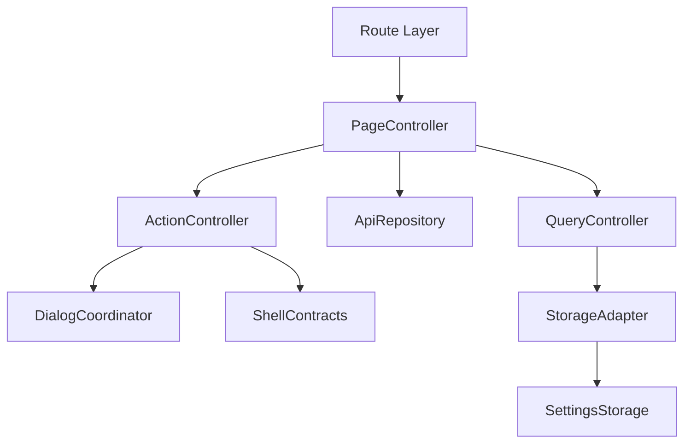
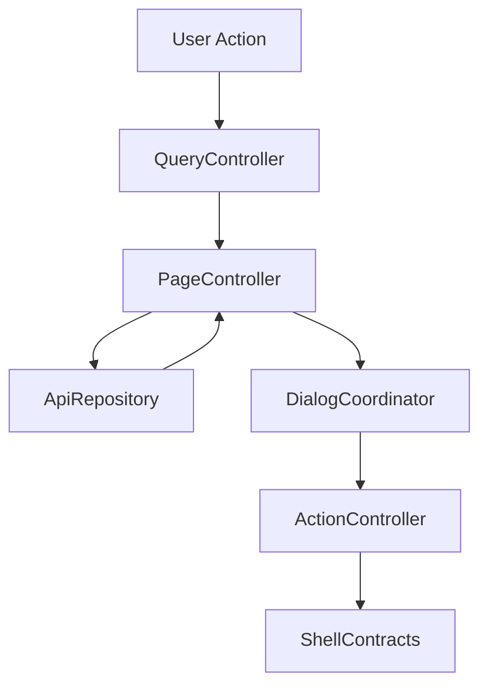

# 設計書: 録画中とエンコード

## 概要

この仕様は 録画中 list/menu/edit/bulk delete と encode running/waiting cancel の technical design を定める。

**ユーザー**: EPGStation の通常ユーザー、operator、関連 routed screen の実装者。

**影響**: requirements を component、route/query/API/localStorage contract、test strategy に接続し、tasks と実装の境界を曖昧にしない。

### 目標

- requirements の全受け入れ条件を design component と test に追跡可能にする。
- 決定済み React 技術選定を、実 package root `client/` の file plan に対応づける。
- `unittest/spec`、`unittest/imp`、E2E の最小 gate を明記する。

### 非目標

- 隣接 spec が所有する workflow、player lifecycle、settings default/backfill の取り込み。

## 境界の合意

### この仕様が所有するもの

- `/recording`、`/encode`、list fetch、pagination（`/recording` のみ）、edit mode、single/bulk delete/cancel、blank state。
- requirements に明記された route/query/API/localStorage/action/snackbar/dialog/menu behavior。
- 本 spec 配下の PageController、QueryController、ApiRepository、ActionController、DialogCoordinator、StorageAdapter の責務境界。

### 境界外

- Recorded list/detail の encode enqueue、AddEncodeDialog、video player、settings default。Encode queue page は `POST /encode` を発火しない。
- 実 URL、実番組名、認証情報、Mirakurun URL、ffmpeg/ffprobe 実 path、環境固有値の tracked docs への記録。

### 許可する依存

- page size と display setting は `frontend-settings-storage`、shell は `frontend-app-shell` に従う。
- recording item menu と delete dialog の shared component は `frontend-recorded` の `RecordedItemMenu` / `RecordedDeleteDialog` contract に従う。
- `frontend-settings-storage` の保存済み settings contract と adjacent storage key registry。
- `frontend-app-shell` の shell、title bar slot、edit title bar、snackbar、navigation host。
- 既存 EPGStation REST API と hash route compatible router。

### 再検証トリガー

- requirements の受け入れ条件、route/query/API endpoint、snackbar 文言、dialog/menu action が変わる。
- `frontend-settings-storage` の field/default/validation/adjacent key default が変わる。
- `frontend-app-shell` の title/snackbar/navigation/edit title bar contract が変わる。
- `frontend-recorded` の shared menu/delete dialog/export contract が変わる。

## アーキテクチャ

### アーキテクチャ前提

frontend は React と hash route を前提にし、hash route compatibility、既存 API、localStorage contract、observed responsive behavior、snackbar/dialog/menu の表示条件を本書の requirements に定義された通りに維持する。

formal design の正本は、この design と同一 spec の requirements、visual-cases、mock-data、ならびに `.kiro/steering/` の project memory とする。矛盾がある場合は同一 spec の requirements と requirements 横断レビューの反映済み判断を優先する。

### アーキテクチャパターンと境界マップ



**アーキテクチャ統合**:
- 選択したパターン: feature boundary + shared typed contracts。
- ドメイン/機能境界: route/query/API/action/dialog/storage を feature 内で分離し、settings と shell は consumer として参照する。
- 固定するパターン: hash route、API endpoint、dialog close cleanup、snackbar result、responsive breakpoint。
- Steering 準拠: 設計書は日本語。

### 技術スタック

| レイヤー | 選択 / バージョン | 機能内の役割 | 備考 |
|-------|------------------|-----------------|-------|
| フロントエンド | React / TypeScript / Vite | UI と typed contract | package root は `client/`、package name は `epgstation-client`。 |
| ルーティング | React Router hash route 対応 router | route/query contract | route contract は `/#/...`（hash route）とする。 |
| Server state | TanStack Query | API response cache、loading/error/refetch、Socket.IO invalidation | query key は route/query/API option から導出し、Socket.IO `updateStatus` / `updateEncode` などの event は該当 query invalidation/refetch に接続する。 |
| Local state | React local state/reducer | screen/dialog/edit/bulk state と App Shell 横断 state | server state は TanStack Query に置く。Zustand は使わない。 |
| UI / CSS | MUI Core + `@mdi/font` + theme token + `*.module.css` | MUI component 実装、responsive、visual contract | global CSS は `src/index.css` の bootstrap/reset 程度に限定し、visual-cases の geometry/screenshot contract を theme/shared component に接続する。 |
| Form / validation | React Hook Form + Zod | form state、submit validation、typed payload validation | cancel/delete dialog payload validation はこの境界に従う。 |
| API client | native `fetch` wrapper + typed request/response validation | backend integration | repository base `./api` と endpoint path を二重結合しない。endpoint/query/body contract はこの design と requirements を正とする。 |
| Socket.IO | `socket.io-client` | realtime update trigger | event handler は feature repository / TanStack Query invalidation 境界へ接続し、failure snackbar の有無は各 design の契約に従う。 |
| Lint / format / alias | ESLint flat config + typescript-eslint + React Hooks plugin / Prettier / `@/` | static gate と import 解決 | `@/` は Vite / TypeScript / Vitest / ESLint で同一解決規則にする。 |
| Script gate | `build` = Vite production build（`bundle`）、`build:verify` = lint + typecheck + unit test + `build`、`check` = lint + format:check + typecheck + `test:dev-server` + `unittest/spec` + `unittest/imp` | `client/package.json` の scripts | `build:verify` は format check を含めず、`check` が Prettier gate を持つ。 |
| Test / coverage / browser | Vitest + V8 coverage / React Testing Library / Playwright / MSW | `unittest/spec`、`unittest/imp`、E2E、visual regression | 正式検証対象は Desktop Chromium、Desktop Firefox、Android Chrome、iOS Safari。visual は Playwright screenshot assertion と geometry assertion を併用する。 |

## ファイル構成計画

package root は `client/` である。

### ディレクトリ構成

```text
client/src/
├── app/                    # App Shell, navigation, snackbar, theme
├── features/               # routed feature boundaries
├── shared/                 # settings, API error, route helpers, typed utilities
└── test/                   # MSW server
```

### ファイル構成

- `client/src/features/recording/RecordingPage.tsx` — `/recording` route root、title bar、edit mode、bulk delete dialog、table / card の切替。
- `client/src/features/recording/components/` — `RecordingTable`、`RecordingCards`。
- `client/src/features/recording/hooks/useVisibleRecording.ts` — route query、可視 list state、card layout の判定。
- `client/src/features/recording/lib/recordingFormat.ts` — label、放送局、時刻 label、card layout 閾値。
- `client/src/features/recording/recordingApi.ts`、`recordingRequests.ts` — `GET /recording` の request builder と typed adapter、query key、選択 toggle。
- `client/src/features/encode/EncodePage.tsx` — `/encode` route root、title bar、edit mode、section composition。
- `client/src/features/encode/components/` — `EncodeItem`（item と section）、`EncodeCancelDialogs`（single / bulk）。
- `client/src/features/encode/hooks/useVisibleEncode.ts` — query と可視 list state。
- `client/src/features/encode/encodeApi.ts`、`encodeRequests.ts` — `GET /encode`、`DELETE /encode/:encodeId` の request builder と typed adapter、表示 item の生成、bulk cancel。
- `client/unittest/spec/recording/`、`client/unittest/spec/encode/` — test kit と list / menu、list / edit・realtime の spec。`client/unittest/imp/recording.imp.test.ts`、`encode.imp.test.ts` — imp。
- `client/e2e/recording-encode-workflow.spec.ts` — deterministic mock E2E。fixture は `client/e2e/support/recordingEncodeFixtures.ts`、handler は `recordingEncodeMocks.ts`。
- `client/visual/recording-encode-geometry.spec.ts` — geometry 検査。

## システムフロー



Flow は route/query/API/localStorage 境界で validation し、UI component が endpoint 文字列や localStorage schema を直接所有しない構造にする。

## 要件トレーサビリティ

| 要件 | 概要 | コンポーネント | インターフェース | フロー |
|-------------|---------|------------|------------|-------|
| 1.1-1.34 | Recording list | PageController, QueryController, ApiRepository, ActionController, DialogCoordinator, StorageAdapter | State / Service / API | recording list/menu/delete flow |
| 2.1-2.30 | Encode list | PageController, QueryController, ApiRepository, ActionController, DialogCoordinator, StorageAdapter | State / Service / API | encode list/cancel flow |
| 3.1-3.5 | encode empty と dark theme | PageController, DialogCoordinator | State | encode list/cancel flow |

## コンポーネントとインターフェース

| コンポーネント | ドメイン/レイヤー | 意図 | 要件カバレッジ | 主な依存 | 契約 |
|-----------|--------------|--------|--------------|------------------|-----------|
| PageController | Feature Routing | route 初期化、title、fetch、loading/error/empty を統括する。 | 1.1-1.34, 2.1-2.30, 3.1-3.5 | frontend-settings-storage / frontend-app-shell / EPGStation API | 状態管理 |
| QueryController | Feature Routing | path/query/local UI input を typed model に変換する。 | 1.1-1.4, 1.12, 2.1-2.3, 2.10 | frontend-settings-storage / frontend-app-shell / EPGStation API | Service |
| ApiRepository | Feature API | requirements で定義された endpoint request と typed error 変換を扱う。 | 1.4, 1.10-1.34, 2.2, 2.12-2.30 | frontend-settings-storage / frontend-app-shell / EPGStation API | API |
| ActionController | Feature Service | menu、button、dialog submit、bulk action の結果を route/API/snackbar に接続する。 | 1.5-1.34, 2.5-2.30 | frontend-settings-storage / frontend-app-shell / EPGStation API | Service/API |
| DialogCoordinator | Feature UI | dialog/menu/open-reset/close-cleanup/focus を管理する。 | 1.5-1.9, 1.21-1.26, 2.6, 2.9-2.17, 2.22, 3.3 | frontend-settings-storage / frontend-app-shell / EPGStation API | 状態管理 |
| StorageAdapter | Shared Boundary | settings と隣接 localStorage key を consumer として読む。 | 1.4, 2.19, 2.20 | frontend-settings-storage / frontend-app-shell / EPGStation API | 状態管理 |

### ページ制御（PageController）

| 項目 | 詳細 |
|-------|--------|
| 意図 | route 初期化、title、loading/error/empty、child component composition を統括する。 |
| 要件 | 1.1-1.34, 2.1-2.30, 3.1-3.5 |

**責務と制約**
- route entrypoint と screen lifecycle だけを所有する。
- fetch/action の副作用は ApiRepository と ActionController へ委譲する。
- App Shell title/snackbar/edit title bar へは typed request だけを渡す。

### クエリ制御（QueryController）

| 項目 | 詳細 |
|-------|--------|
| 意図 | route query、path param、form/filter input を typed model に変換する。 |
| 要件 | 1.1-1.4, 1.12, 2.1-2.3, 2.10 |

**責務と制約**
- `unknown` / string query を domain type へ narrow する。
- invalid input は requirements に従い normalize、ignore、controlled error、または no-op に変換する。
- route refresh 用 `timestamp` は user-facing filter state へ露出しない。

### API リポジトリ（ApiRepository）

| 項目 | 詳細 |
|-------|--------|
| 意図 | API request builder、response adapter、typed error conversion を扱う。 |
| 要件 | 1.4, 1.10-1.34, 2.2, 2.12-2.30 |

**責務と制約**
- endpoint は requirements を正とする。
- request body/query は explicit type で定義し、TypeScript の `any` を使わない。
- API failure は UI へ例外を漏らさず typed error として返す。

### アクション制御（ActionController）

| 項目 | 詳細 |
|-------|--------|
| 意図 | menu、dialog、button、bulk action の実行と snackbar/route update を扱う。 |
| 要件 | 1.5-1.34, 2.5-2.30 |

**責務と制約**
- 表示条件、disabled/hidden 条件、成功/失敗 snackbar は requirements を正とする。
- action 完了後の refetch、dialog close、route move を一箇所に集約する。ただし protect/unprotect など即時 refetch しない action は snackbar のみを行い、必要な action だけ refetch を要求する。
- 破壊的 action は confirm dialog または requirements に定義された no-op 条件を経由する。

### ダイアログ調整（DialogCoordinator）

| 項目 | 詳細 |
|-------|--------|
| 意図 | dialog/menu open/reset/close cleanup/focus を扱う。 |
| 要件 | 1.5-1.9, 1.21-1.26, 2.6, 2.9-2.17, 2.22, 3.3 |

**責務と制約**
- open ごとに stale state を reset する。
- close animation 後の remove/remount が requirements にある場合は維持する。
- dialog body の screenshot が不足する場合は mock API または検証 config で fixture を補完する。

### ストレージアダプター（StorageAdapter）

| 項目 | 詳細 |
|-------|--------|
| 意図 | settings と adjacent localStorage key を consumer として読む。 |
| 要件 | 1.4, 2.19, 2.20 |

**責務と制約**
- settings default、backfill、validation は `frontend-settings-storage` に委譲する。
- feature 固有の adjacent key owner がある場合だけ、その shape を design と tasks に展開する。
- 保存済み値の parse failure は settings storage contract に従う。

### API 契約

この表の endpoint は frontend repository contract であり、`./api` の base path は含めない。決定済み native `fetch` wrapper に基づいて API client を作る場合も base path と endpoint path を二重に結合しない。

| メソッド | エンドポイント | リクエスト | レスポンス | エラー |
|--------|----------|---------|----------|--------|
| GET | /recording | limit/offset/isHalfWidth | recording list | 録画中 fetch failure snackbar |
| GET | /channels | none | shared channel index | channel label hydration 用。失敗時は recording fetch failure とせず、recording item の `channelId` numeric fallback を使う |
| DELETE | /recorded/:recordedId | none | delete recorded result | Recording item menu delete で全 video file が選択された場合だけ使う。Recording bulk delete では使わない |
| DELETE | /videos/:videoFileId | none | delete result | delete failure snackbar |
| PUT | /recorded/:id/protect | none | result | protect failure snackbar |
| PUT | /recorded/:id/unprotect | none | result | unprotect failure snackbar |
| GET | /encode | isHalfWidth | running/waiting encode list | encode fetch failure snackbar |
| DELETE | /encode/:encodeId | none | cancel result | cancel failure snackbar |

### 共有型契約

```typescript
type FeatureResult<T, E extends string> =
  | { ok: true; value: T }
  | { ok: false; error: E; message: string };

interface RouteBuildResult {
  path: string;
  query: Record<string, string>;
}

interface SnackbarRequest {
  text: string;
  color?: 'normal' | 'success' | 'info' | 'error';
  timeout?: number;
}
```

## 機能固有の設計判断

### 録画中通常 item menu 表

| アクション | `/recording` での表示 | 結果 |
| --- | --- | --- |
| rule | `ruleId` がある item で表示 | `/search?rule=<ruleId>` へ遷移する。 |
| search | always | `ruleId` がある場合は `/recorded?ruleId=<ruleId>`、ない場合は program name 由来の `/recorded` keyword search へ遷移する。 |
| protect | unprotected item で表示 | `/recorded/:id/protect`、成功/失敗 snackbar。即時 refetch は要求しない。icon は `frontend-recorded` owner contract の `mdi-lock`。 |
| unprotect | protected item で表示 | `/recorded/:id/unprotect`、成功/失敗 snackbar。即時 refetch は要求しない。icon は `frontend-recorded` owner contract の `mdi-lock-open`。 |
| delete | always | RecordedDeleteDialog contract を使う。全 video file 選択時は `DELETE /recorded/:recordedId`、一部選択時は selected `videoFiles[].id` を `DELETE /videos/:videoFileId` で削除する。 |
| encode | hidden | recording item では実行可能 action として扱わない。 |
| stop | hidden | shared menu に存在しても Recording view は handler 未接続のため hidden intentional fix。 |

menu/button click は row click の detail navigation と競合させない。event propagation を止める。
Recording item menu は `frontend-recorded` owned `RecordedItemMenu` を recording context で composition する。Recording 編集モードの selection UI は `frontend-recorded` owned `RecordedListItemView` と同じく row/card click と selected color だけで表現し、右端 checkbox や別 selection control を追加しない。Recording 編集モードの bulk delete は `frontend-recorded` owned `RecordedBulkDeleteDialog` を import し、`disableOption=true` 相当で使う。disableOption consumer では削除対象 select とそのための余白を出さず、dialog body は `選択した N 件の番組を削除しますか。` の短い確認文と actions だけにする。Recording 側は Recorded multiple deletion dialog の削除対象 option、dialog body、bulk delete snackbar を再定義しない。

Recording list adapter は `/recording` response item に `channelName` がない場合、`/channels` の shared channel index から `channelId` を解決する。`isHalfWidthDisplayed=true` では `halfWidthName`、false では `name` を優先し、該当 channel がない場合のみ `channelId.toString(10)` を表示 fallback とする。Dashboard と Recording の channel label 表示は同じ hydration helper を使い、UI 側で数値 fallback を先に確定させない。

Recording と Encode の title bar 編集 entrypoint は kebab menu 配下ではなく、`mdi-pencil` 相当の direct icon button とする。Recorded / Reserves の title bar menu とは意図的な差であり、direct icon button を実行すると edit mode に入り、title を `<selectedCount> 件選択 ` に切り替える。

Recording edit mode では menu column の content を空にし（checkbox や別の selection control は追加しない）、table row height `48px`、title / channel / time columns、mobile card height `100px` を維持する。Bulk delete dialog は `RecordedBulkDeleteDialog` の `disableOption=true` consumer case とし、Recorded 側の `削除対象 ` select を表示しない。

### 空表示とマウント契約

- Recording は item が 1 件以上あるときだけ content wrapper を mount する。0 件では current blank presentation を維持する。
- Encode は content area を常時 mount し、running/waiting section が空なら section content を空にする。

### エンコード進捗と cancel 文言契約

running encode item は `percent` と `log` が両方存在する場合だけ progress bar と progress text を表示する。
Encode bulk cancel dialog body は `選択した <total> 件の番組を削除しますか。` を保持する。confirm 後の snackbar は encode action として `選択したエンコードをキャンセルしました。` / `一部エンコードのキャンセルに失敗しました。` を使うため、dialog と snackbar の用語混在は意図的な互換仕様とする。

Encode single/bulk cancel dialog は max-width 300px、padding `16px 16px 0`、action row を explicit CSS owner に写像する。Paper は max-width `300px` のみを固定し（`width` は固定しないため短文 body では 300px 未満に縮む）、content は `padding: 16px 16px 0` と text primary、action row は `min-height: 52px` と `padding: 8px` を持つ。MUI default DialogContent / DialogActions の padding に依存してはならない。

Encode bulk cancel dialog は short body で縦 scroll を発生させない。Paper は max width 300px と action row density を維持し、body text と actions の合計より小さい固定 height を指定しない。dialog surface、body text、action text は dark theme token を継承し、empty encode state に placeholder surface を追加しない。

## データモデル

- `RecordingItemMenuState`: `{ canRule, canSearch: true, canProtect, canUnprotect, canDelete, hideEncode: true, hideStop: true }`。
- `RecordingDeleteSelection`: recorded item と selected `videoFiles[].id` を保持し、全 file 選択か一部選択かで delete endpoint を分岐する。
- `EncodeItemDisplay`: `{ state, percent?, log?, showProgressBar: percent != null && log != null, showProgressText: percent != null && log != null }`。
- `RoutePageSplit`: `/recording` と `/encode` は同一 spec だが Page/Controller は分ける。

## エラーハンドリング

- validation は route/query/form/API/localStorage の境界で行う。
- snackbar 文言は requirements に定義された文言を優先する。
- no-op、blank presentation、controlled error の選択は requirements を正とする。
- stale research と formal requirements が矛盾する場合は formal requirements を正とする。

## テスト戦略

unit test は `npm run coverage:gate` で statements・branches・functions・lines の 4 指標 100% を要求する。unit test は `unittest/spec` と `unittest/imp` の 2 種類を持ち、片方で他方を代替しない。E2E と visual は release-preflight の client-browser step で実ブラウザーに流す。hosted CI（`client.yml`）は lint・typecheck・format check だけを行う。

- `unittest/spec`: user-visible behavior、route/query contract、API request contract、状態遷移、snackbar/dialog/menu 表示条件を requirements ID に紐づけて検証する。
- `unittest/imp`: query parser、request builder、state reducer、validator、lifecycle cleanup、storage adapter の分岐と edge case を検証する。
- E2E: deterministic mock data で route 表示、主要 action、dialog/menu、responsive、empty/error state を確認する。

### Visual Regression 契約

この feature の詳細 layout は、本文の recording / encode list contract と `visual-cases.md` の visual cases、`mock-data.md` の synthetic dataset contract を合わせて正本とする。

`visual-cases.md` は screenshot / geometry / interaction test の撮影条件を定義する。`mock-data.md` は visual cases で使う synthetic recording item、encode queue、progress、cancel/delete target fixture 条件を定義する。

Recording は Recorded owned shared dialog を consumer として使う。`RecordedBulkDeleteDialog` の option 非表示 consumer state はこの feature の visual cases で確認するが、dialog の基本 visual contract は `frontend-recorded` を正とする。tracked artifact には実番組名、実 URL、実ロゴ、サムネイル、実 file path、ffmpeg / ffprobe 実 path、認証情報、環境固有値を含めない。

Encode page は running / waiting queue がどちらも空の場合、main content を空にする。`エンコード中 `、`待機中 `、empty copy、placeholder container は描画しない。running または waiting の対象が存在する場合だけ該当 section label と item container を描画する。

dark theme では recording list、encode list、progress row、cancel/delete dialog、action menu、pagination、empty/error surface が App Shell theme token と一致する。icon や secondary text が background と同化する場合、または empty encode state に light placeholder が残る場合は visual regression failure とする。

Recording の desktop table container / mobile card と Encode の running/waiting item は CSS module の card-like surface として扱う。dark theme 時は `contentSurface=#1e1e1e` と `textPrimary` を明示し、CSS variable が未定義の実行環境でも `#fff` fallback に落ちないことを横断 E2E の computed style assertion で確認する。

Recording desktop table は App Shell の table owner matrix に含め、table card だけでなく row/cell/action cell を検査対象にする。dark theme の row/cell foreground は `textPrimary` / `textSecondary` を使い、menu icon と progress/metadata text が black foreground に戻った場合は failure とする。

### Visual Implementation Contract

Recording list は `Recorded` の shared item を再利用せず、この feature 専用の `RecordingTable` / `RecordingCards` を持つ。desktop table は行高 `48px`、フォントサイズ `14px`。mobile card は高さ `100px`、card title `14px/700`、channel/time/description `12px/300`。録画停止/削除 dialog は Recorded owned dialog contract を使い、Recording 固有の差分は option 非表示だけに限定する。

Encode list は running section、waiting section の順で表示する。各 section label（`エンコード中` / `待機中`）は `20px/32px/500` とする。section 間の gap は `8px`。item title は `14px/700`。channel/time/mode/progress text は `12px`。progress bar height は `4px`。item row（`.item` / `.itemButton`）の高さは固定値を持たず、thumbnail の `aspect-ratio: 1.7778` に連動する fluid 値である。thumbnail は `flex-basis: 30%; max-width: 200px` の fluid layout であり、コンテナ幅 800px 時で概算 `200px / 1.7778 ≈ 112px` になる。percent と log が両方ある場合だけ progress text block を描画し、どちらか欠ける場合は row height を増やさない。

running / waiting がどちらも空の場合は section label、divider、placeholder、empty copy を一切描画しない。main content は App Shell background のまま、追加 min-height や hidden placeholder による outer scroll を発生させない。dark theme でも空状態用の light surface を作らない。

### 機能テストケース

- Recording normal item menu の rule/search/protect/unprotect/delete と encode/stop hidden、click propagation を検証する。
- Recording bulk delete が `videoFiles[].id` を使うことを検証する。
- Recording list の channelName 優先表示、編集モードでの row height/menu replacement、bulk delete dialog の no option state を検証する。
- Recording 0 件 wrapper unmount と Encode empty blank main content を検証し、running/waiting label は対象がある場合だけ表示する。
- Encode progress bar/text が percent+log 両方のときだけ表示されること、single/bulk cancel を検証する。

## セキュリティとプライバシー

- tracked docs、test fixture、snapshot に実 URL、実番組名、認証情報、Mirakurun URL、ffmpeg/ffprobe 実 path、環境固有値を書かない。
- Playwright の基準画像（`client/visual/*-snapshots/`・`client/e2e/*-snapshots/`。synthetic data だけを写す）は追跡する。test 実行時の出力と実機の撮影結果は追跡しない（`client/test-results`、`client/device/artifacts/` は ignore 済み）。
- E2E は実データではなく controlled mock data を使う。

## 性能とアクセシビリティ

- list/grid/dialog は stable dimensions と responsive constraints を持ち、text overlap と layout shift を避ける。
- menu button、dialog button、item action button は keyboard focus と accessible name を持つ。
- heavy rendering、stream、upload、dialog timer は route leave または close 時に cleanup する。

## リスクと緩和策

- 技術選定は `.kiro/steering/tech.md` と `.kiro/steering/testing.md` を参照し、`client/` の package root、scripts、dependencies と一致させる。
- requirements が変更された場合、traceability と task boundary を再確認する。
- screenshot body が不足する dialog は mock API または validation config で補完する。
