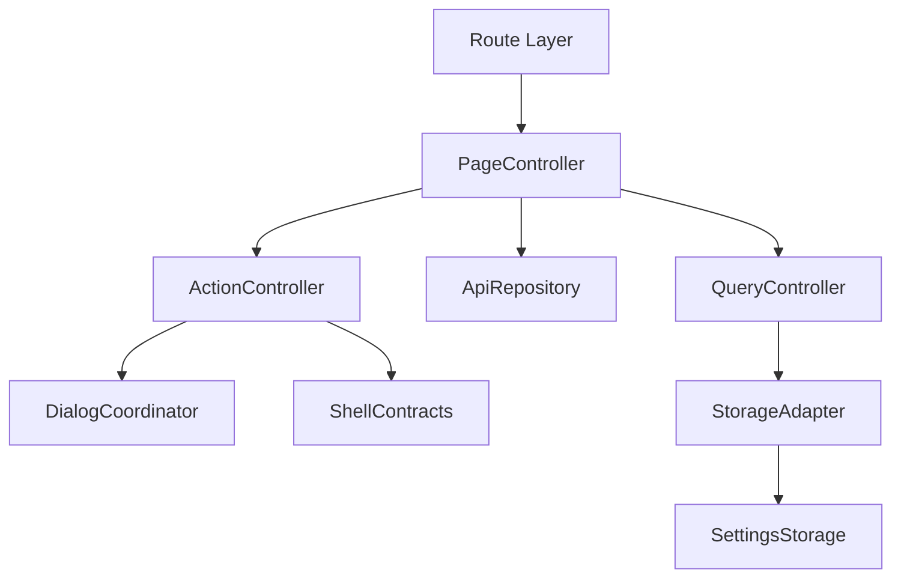
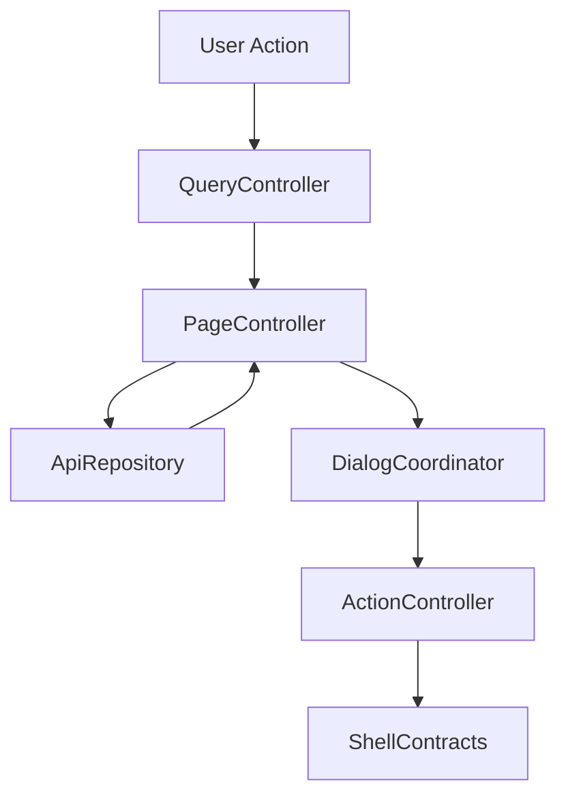

# 設計書: 予約

## 概要

この仕様は 予約/競合/重複 list、Manual Reserve、delete/unskip/unoverlap、bulk action の technical design を定める。

**ユーザー**: EPGStation の通常ユーザー、operator、関連 routed screen の実装者。

**影響**: requirements を component、route/query/API/localStorage contract、test strategy に接続し、tasks と実装の境界を曖昧にしない。

### 目標

- requirements の全受け入れ条件を design component と test に追跡可能にする。
- 決定済み React 技術選定を、実 package root `client/` の file plan に対応づける。
- `unittest/spec`、`unittest/imp`、E2E の最小 gate を明記する。

### 非目標

- 隣接 spec が所有する workflow、player lifecycle、settings default/backfill の取り込み。

## 境界の合意

### この仕様が所有するもの

- `/reserves`、`/reserves/manual`、type query、list rendering、state variants、dialog/menu/snackbar、manual reserve form。
- requirements に明記された route/query/API/localStorage/action/snackbar/dialog/menu behavior。
- 本 spec 配下の PageController、QueryController、ApiRepository、ActionController、DialogCoordinator、StorageAdapter の責務境界。

### 境界外

- App Shell navigation item の生成、settings default。
- 実 URL、実番組名、認証情報、Mirakurun URL、ffmpeg/ffprobe 実 path、環境固有値の tracked docs への記録。

### 許可する依存

- page size は `frontend-settings-storage`、shell は `frontend-app-shell` に従う。
- `frontend-settings-storage` の保存済み settings contract と adjacent storage key registry。
- `frontend-app-shell` の shell、title bar slot、edit title bar、snackbar、navigation host。
- 既存 EPGStation REST API と hash route compatible router。

### 再検証トリガー

- requirements の受け入れ条件、route/query/API endpoint、snackbar 文言、dialog/menu action が変わる。
- `frontend-settings-storage` の field/default/validation/adjacent key default が変わる。
- `frontend-app-shell` の title/snackbar/navigation/edit title bar contract が変わる。

## アーキテクチャ

### アーキテクチャ前提

frontend は React と hash route を前提にし、hash route compatibility、既存 API、localStorage contract、observed responsive behavior、snackbar/dialog/menu の表示条件を本書の requirements に定義された通りに維持する。

formal design の正本は、この design と同一 spec の requirements、visual-cases、mock-data、ならびに `.kiro/steering/` の project memory とする。矛盾がある場合は同一 spec の requirements と requirements 横断レビューの反映済み判断を優先する。

### アーキテクチャパターンと境界マップ



**アーキテクチャ統合**:
- 選択したパターン: feature boundary + shared typed contracts。
- ドメイン/機能境界: route/query/API/action/dialog/storage を feature 内で分離し、settings と shell は consumer として参照する。
- 固定するパターン: hash route、API endpoint、dialog close cleanup、snackbar result、responsive breakpoint。
- Steering 準拠: 設計書は日本語。

### 技術スタック

| レイヤー | 選択 / バージョン | 機能内の役割 | 備考 |
|-------|------------------|-----------------|-------|
| フロントエンド | React / TypeScript / Vite | UI と typed contract | package root は `client/`、package name は `epgstation-client`。 |
| ルーティング | React Router hash route 対応 router | route/query contract | route contract は `/#/...`（hash route）とする。 |
| Server state | TanStack Query | API response cache、loading/error/refetch、Socket.IO invalidation | query key は route/query/API option から導出し、Socket.IO `updateStatus` などの event は該当 query invalidation/refetch に接続する。 |
| Local state | React local state/reducer | screen/dialog/edit/bulk state と App Shell 横断 state | server state は TanStack Query に置く。Zustand は使わない。 |
| UI / CSS | MUI Core + `@mdi/font` + theme token + `*.module.css` | MUI component 実装、responsive、visual contract | global CSS は `src/index.css` の bootstrap/reset 程度に限定し、visual-cases の geometry/screenshot contract を theme/shared component に接続する。 |
| Form / validation | React Hook Form + Zod | form state、submit validation、typed payload validation | Manual Reserve add/edit form と action payload validation はこの境界に従う。 |
| API client | native `fetch` wrapper + typed request/response validation | backend integration | repository base `./api` と endpoint path を二重結合しない。endpoint/query/body contract はこの design と requirements を正とする。 |
| Socket.IO | `socket.io-client` | realtime update trigger | event handler は feature repository / TanStack Query invalidation 境界へ接続し、failure snackbar の有無は各 design の契約に従う。 |
| Lint / format / alias | ESLint flat config + typescript-eslint + React Hooks plugin / Prettier / `@/` | static gate と import 解決 | `@/` は Vite / TypeScript / Vitest / ESLint で同一解決規則にする。 |
| Script gate | `build` = Vite production build（`bundle`）、`build:verify` = lint + typecheck + unit test + `build`、`check` = lint + format:check + typecheck + `test:dev-server` + `unittest/spec` + `unittest/imp` | `client/package.json` の scripts | `build:verify` は format check を含めず、`check` が Prettier gate を持つ。 |
| Test / coverage / browser | Vitest + V8 coverage / React Testing Library / Playwright / MSW | `unittest/spec`、`unittest/imp`、E2E、visual regression | 正式検証対象は Desktop Chromium、Desktop Firefox、Android Chrome、iOS Safari。visual は Playwright screenshot assertion と geometry assertion を併用する。 |

## ファイル構成計画

package root は `client/` である。

### ディレクトリ構成

```text
client/src/
├── app/                    # App Shell, navigation, snackbar, theme
├── features/               # routed feature boundaries
├── shared/                 # settings, API error, route helpers, typed utilities
└── test/                   # MSW server
```

### ファイル構成

- `client/src/features/reserves/ReservesPage.tsx` — `/reserves` route root、title bar / dialog / list の composition、edit mode と selection state。
- `client/src/features/reserves/ManualReservePage.tsx` — `/reserves/manual` route root、時刻指定 switch、option panel の composition。
- `client/src/features/reserves/ReserveListItem.tsx` — table / card の行 component。`ReserveDialog` / `ReserveMenu` を再 export する。行 component は `frontend-search-rule` の time-specified rule edit が使い、再 export した `ReserveDialog` / `ReserveMenu` は `index.ts` 経由で `frontend-dashboard` が使う。
- `client/src/features/reserves/reservesApi.ts` — `createFetchReservesApiRepository`（`GET /reserves`、`GET /reserves/:id`、`GET /schedules/detail/:programId`、`POST /reserves`、`PUT /reserves/:id`、`DELETE /reserves/:id` と `/skip` / `/overlap`、`POST /reserves/update`）。
- `client/src/features/reserves/reservesRequests.ts` — `lib/` の request / payload / route helper を集約する barrel。
- `client/src/features/reserves/index.ts` — 他 feature へ公開する entry。
- `client/src/features/reserves/components/` — `ReservesTitleBar`、`ReservesList`、`ReserveDialog`、`ReserveMenu`、`ReserveDeleteDialogs`（single / bulk）、`LegacyMdiIcon`、`ManualProgramInfo`、`ManualTimeSpecifiedFields`、`ManualOptionPanel`、`ManualOptionPanels`（directory / file format）、`ManualEncodePanel`。
- `client/src/features/reserves/hooks/` — `useVisibleReserves`（route query と可視 list state）、`useManualReserveForm`（react-hook-form の watch と reset）、`useManualReserveLoader`（mode 別の初期化と PageInfo 保存）、`useManualReserveSubmit`（payload 構築、保存、成功後の戻り）。
- `client/src/features/reserves/lib/` — `reservesListRequests`（route / query / request URL / title / layout）、`manualReserveTypes`（定数、型、Zod schema）、`manualReservePayload`（mode 解釈、add / edit payload）、`manualReserveForm`（form state 変換、日時入力の parse / format）、`manualReserveServerOptions`（`serverApi.ts` wrapper 経由の放送局 / directory / encode mode 取得）、`manualProgramFormat`、`reserveRoutes`（visual state、遷移 path、extended text の linkify）、`reserveSelection`（選択 toggle、bulk delete）、`reserveLabels`（表示 label / 時刻 format）、`reserveAdapters` / `manualReserveAdapters`（API 応答の adapter）、`reservesApiTypes`、`reservesFetch`、`reserveEndpoint`。
- `client/unittest/spec/reserves/` — `reservesTestKit.tsx`（fixture / helper）と、route lifecycle、realtime、dialog、edit mode、actions、bulk delete、manual add form / add submit / edit の spec。
- `client/unittest/imp/reserves/` — request、manual request、adapter、route helper、manual API、API action の imp。
- `client/e2e/booking-workflow.spec.ts`、`client/e2e/manual-reserve-workflow.spec.ts` — deterministic mock E2E。fixture は `client/e2e/support/reservesFixtures.ts` / `manualReserveFixtures.ts`、handler は `reservesMocks.ts`、共通操作は `reservesWorkflowHelpers.ts`。
- `client/visual/booking-geometry.spec.ts` — geometry 検査。helper は `client/visual/bookingGeometryHelpers.ts`。

## システムフロー



Flow は route/query/API/localStorage 境界で validation し、UI component が endpoint 文字列や localStorage schema を直接所有しない構造にする。

## 要件トレーサビリティ

| 要件 | 概要 | コンポーネント | インターフェース | フロー |
|-------------|---------|------------|------------|-------|
| 1.1-1.13 | Reserves list route と fetch | PageController, QueryController, ApiRepository, StorageAdapter | State / Service / API | list route/fetch flow |
| 2.1-2.24 | state variants と list actions | PageController, QueryController, ApiRepository, ActionController, DialogCoordinator, StorageAdapter | State / Service / API | route/query/action/export flow |
| 3.1-3.12 | delete dialog と bulk edit | PageController, QueryController, ApiRepository, ActionController, DialogCoordinator, StorageAdapter | State / Service / API | route/query/action flow |
| 4.1-4.32 | Manual Reserve | PageController, QueryController, ApiRepository, ActionController, DialogCoordinator, StorageAdapter | State / Service / API | manual add/edit flow |
| 5.1-5.5, 6.1-6.3 | dark theme | PageController, DialogCoordinator | State | list route/fetch flow |

## コンポーネントとインターフェース

| コンポーネント | ドメイン/レイヤー | 意図 | 要件カバレッジ | 主な依存 | 契約 |
|-----------|--------------|--------|--------------|------------------|-----------|
| PageController | Feature Routing | route 初期化、title、fetch、loading/error/empty を統括する。 | 1.1-1.13, 2.1-2.24, 3.1-3.12, 4.1-4.32 | frontend-settings-storage / frontend-app-shell / EPGStation API | 状態管理 |
| QueryController | Feature Routing | path/query/local UI input を typed model に変換する。 | 1.1-1.4, 2.1, 2.6-2.8, 4.1-4.32 | frontend-settings-storage / frontend-app-shell / EPGStation API | Service |
| ApiRepository | Feature API | requirements で定義された endpoint request と typed error 変換を扱う。 | 1.5-1.13, 2.6-2.18, 3.2-3.12, 4.3-4.32 | frontend-settings-storage / frontend-app-shell / EPGStation API | API |
| ActionController | Feature Service | menu、button、dialog submit、bulk action、shared component export の結果を route/API/snackbar に接続する。 | 2.8, 2.10-2.24, 3.2-3.12, 4.8-4.32 | frontend-settings-storage / frontend-app-shell / EPGStation API | Service/API |
| DialogCoordinator | Feature UI | dialog/menu/open-reset/close-cleanup/focus と shared `ReserveDialog` / `ReserveMenu` / `ReserveDeleteDialog` / `ReserveListItem` export surface を管理する。 | 2.9, 2.14, 2.20, 2.21, 3.1-3.9, 4.1-4.7, 4.21 | frontend-settings-storage / frontend-app-shell / EPGStation API | 状態管理 |
| StorageAdapter | Shared Boundary | settings と隣接 localStorage key を consumer として読む。 | 1.4, 4.11, 4.13-4.16, 4.19 | frontend-settings-storage / frontend-app-shell / EPGStation API | 状態管理 |

### ページ制御（PageController）

| 項目 | 詳細 |
|-------|--------|
| 意図 | route 初期化、title、loading/error/empty、child component composition を統括する。 |
| 要件 | 1.1-1.13, 2.1-2.24, 3.1-3.12, 4.1-4.32 |

**責務と制約**
- route entrypoint と screen lifecycle だけを所有する。
- fetch/action の副作用は ApiRepository と ActionController へ委譲する。
- App Shell title/snackbar/edit title bar へは typed request だけを渡す。

### クエリ制御（QueryController）

| 項目 | 詳細 |
|-------|--------|
| 意図 | route query、path param、form/filter input を typed model に変換する。 |
| 要件 | 1.1-1.4, 2.1, 2.6-2.8, 4.1-4.32 |

**責務と制約**
- `unknown` / string query を domain type へ narrow する。
- invalid input は requirements に従い normalize、ignore、controlled error、または no-op に変換する。
- route refresh 用 `timestamp` は user-facing filter state へ露出しない。

### API リポジトリ（ApiRepository）

| 項目 | 詳細 |
|-------|--------|
| 意図 | API request builder、response adapter、typed error conversion を扱う。 |
| 要件 | 1.5-1.13, 2.6-2.18, 3.2-3.12, 4.3-4.32 |

**責務と制約**
- endpoint は requirements を正とする。
- request body/query は explicit type で定義し、TypeScript の `any` を使わない。
- API failure は UI へ例外を漏らさず typed error として返す。

### アクション制御（ActionController）

| 項目 | 詳細 |
|-------|--------|
| 意図 | menu、dialog、button、bulk action の実行と snackbar/route update を扱う。 |
| 要件 | 2.8, 2.10-2.24, 3.2-3.12, 4.8-4.32 |

**責務と制約**
- 表示条件、disabled/hidden 条件、成功/失敗 snackbar は requirements を正とする。
- action 完了後の refetch、dialog close、route move を一箇所に集約する。
- 破壊的 action は confirm dialog または requirements に定義された no-op 条件を経由する。

### ダイアログ調整（DialogCoordinator）

| 項目 | 詳細 |
|-------|--------|
| 意図 | dialog/menu open/reset/close cleanup/focus を扱う。 |
| 要件 | 2.9, 2.14, 2.20, 2.21, 3.1-3.9, 4.1-4.7, 4.21 |

**責務と制約**
- open ごとに stale state を reset する。
- close animation 後の remove/remount が requirements にある場合は維持する。
- dialog body の screenshot が不足する場合は mock API または検証 config で fixture を補完する。

### ストレージアダプター（StorageAdapter）

| 項目 | 詳細 |
|-------|--------|
| 意図 | settings と adjacent localStorage key を consumer として読む。 |
| 要件 | 1.4, 4.11, 4.13-4.16, 4.19 |

**責務と制約**
- settings default、backfill、validation は `frontend-settings-storage` に委譲する。
- feature 固有の adjacent key owner がある場合だけ、その shape を design と tasks に展開する。
- 保存済み値の parse failure は settings storage contract に従う。

### API 契約

この表の endpoint は frontend repository contract であり、`./api` の base path は含めない。決定済み native `fetch` wrapper に基づいて API client を作る場合も base path と endpoint path を二重に結合しない。

| メソッド | エンドポイント | リクエスト | レスポンス | エラー |
|--------|----------|---------|----------|--------|
| GET | /reserves | type/limit/offset/isHalfWidth | reserve list | 予約データ取得に失敗 |
| GET | /reserves/:reserveId | isHalfWidth | reserve detail for manual edit | 予約情報取得に失敗 |
| GET | /schedules/detail/:programId | isHalfWidth | program detail for manual add | 番組情報取得に失敗 |
| POST | /reserves | manual reserve body | created reserve | 予約の追加に失敗しました。 |
| PUT | /reserves/:reserveId | manual reserve body | updated reserve | manual update failure snackbar |
| DELETE | /reserves/:reserveId | none | delete result | delete failure snackbar |
| DELETE | /reserves/:reserveId/skip | none | unskip result | unskip failure snackbar |
| DELETE | /reserves/:reserveId/overlap | none | unoverlap result | unoverlap failure snackbar |
| POST | /reserves/update | none | update trigger | 予約情報の更新を開始できませんでした。 |

### 共有型契約

```typescript
type FeatureResult<T, E extends string> =
  | { ok: true; value: T }
  | { ok: false; error: E; message: string };

interface RouteBuildResult {
  path: string;
  query: Record<string, string>;
}

interface SnackbarRequest {
  text: string;
  color?: 'normal' | 'success' | 'info' | 'error';
  timeout?: number;
}
```

## 機能固有の設計判断

### 手動予約 fetch 契約

- `reserveId` edit mode は `GET /reserves/:reserveId?isHalfWidth=<setting>` で既存予約を取得する。
- `programId` add mode は `GET /schedules/detail/:programId?isHalfWidth=<setting>` で番組情報を取得し、timeSpecifiedOption へ start/end/channel/name を copy する。
- `programId` add mode で時刻指定 switch が off の場合は program information section を表示し、time-specified target fields を表示しない。時刻指定 switch が on の場合は program information section を非表示にし、`ManualTimeSpecifiedOption` の time-specified target fields を表示する。switch を off に戻すと program information section を再表示する。
- edit mode の target field は disabled とし、program/time target を変更できる UI にしない。existing reserve が `programId` を持つ場合は `GET /schedules/detail/:programId?isHalfWidth=<setting>` で schedule detail を補完取得し、program information 表示だけに使う。
- query に `reserveId` と `programId` が同時にある場合は `reserveId` edit mode を優先し、`programId` branch は実行しない。
- `/reserves/manual` no-query add mode で時刻指定 off のまま追加した場合、program target がないため request builder は `manual-reserve-invalid` エラーとして失敗し、API call せず `予約の追加に失敗しました。` snackbar を表示する。
- Manual Reserve init では option panels index `[0, 1, 2, 3, 6]` を open する。index は 0=オプション、1=ディレクトリ、2=ファイル名形式、3/4/5=エンコード1/2/3、6=ファイル削除 を表し、初期 open は 0・1・2・3（エンコード1）・6 である。panel header は button として実装し、open/closed は local draft state で保持する。panel body は MUI `Collapse` または同等の height transition を使い、open/close の transition duration を 0ms にしてはならない。閉じた panel は exit transition 完了後に入力 control を描画せず、再 open 時に form draft value を再表示する。
- Manual Reserve の `エンコード2` / `エンコード3` は初期 closed の panel だが、開いた場合は `mode2` / `mode3`、`directory2` / `directory3`、`sub directory2` / `sub directory3` を `encodeOption` draft に接続する。
- Manual Reserve の `エンコード1` / `エンコード2` / `エンコード3` / `ファイル削除` panel は、encode mode option が 1 件以上ある場合だけ表示する。
- Manual Reserve の時刻指定 `番組名` field の label は `name` とする。他 field の命名規則（`channel`、`file format` などの英小文字 short label）に合わせた値である。
- Manual Reserve の time-specified input 表示は `yyyy-MM-dd HH:mm` とし、parse 後の internal/pageInfo/API body は milliseconds number を維持する。start/end field は編集中の生文字列を component local state (draft) として保持し、入力が `yyyy-MM-dd HH:mm`（または `T` 区切り）に完全一致した時点でだけ milliseconds へ commit する。不完全または不正な文字列は milliseconds へ変換せず、draft はそのまま表示され続ける。draft は外部要因（program mode 切替、reset、reserveId edit mode の初期読み込みなど）で commit 済みの値が変化したときにだけ再フォーマットして同期する。
- add payload の `startAt` / `endAt` は number milliseconds として送る。Date object や ISO string は API body に入れない。
- `saveOption` は UI 上の保存設定 option object が存在する場合は空 object でも body に含め、存在しない場合は omit する。`encodeOption` は mode1/2/3 のいずれかが非 null の場合だけ含め、`isDeleteOriginalAfterEncode` は `encodeOption` 内に置く。
- time-specified mode の Socket.IO `updateStatus` は program-info fetch target を持たないため no-op とする。

### 手動予約スクロール履歴契約

- add mode の route leave/update 時だけ form state を scroll history PageInfo へ保存する。edit mode では保存しない。
- 保存対象は `isTimeSpecification`、`timeSpecifiedOption`、`reserveOption`、`saveOption`、`encodeOption`。
- `programId` mode では history state がある場合に復元し、cancel/back で入力を失わない。
- no-query add mode と edit mode では history state を復元しない。

### 予約一覧契約

- URL の `type` query は `normal` / `conflict` / `overlap` / `skip` だけを valid とする。unknown value と URL 上の `all` は `normal` に正規化する。URL に `type` がない場合だけ API request 内部値として `type=all` を使う。
- list empty は明示 copy を追加しない。
- `page` query は `parsePositivePage`（`client/src/features/reserves/lib/reservesListRequests.ts`）で非整数・1 未満・欠落を一律 `1` に丸める（requirements.md 1.13）。
- item menu、delete/unskip/unoverlap、bulk delete の snackbar と dialog wording は requirements を正とする。
- item menu の表示 label は `recorded`、`edit`、`delete`、`unlock` を維持する。遷移先と API contract は requirements を正とする。
- item menu の recorded search は `/recorded?ruleId=<ruleId>`、manual edit は `/reserves/manual?reserveId=<reserveId>`、rule edit は `/search?rule=<ruleId>` へ遷移する。rule edit handoff は 遷移元で auto-scroll を抑止せず、SearchRule の `isEnableAutoScrollWhenEditingRule` 設定だけで初回検索結果 scroll 有無を決める。URL は `/search?rule=<ruleId>` のままとし、この形式で navigation の selected 判定を維持する。
- 単体 delete 成功後は optimistic removal を行わず、`refetch` を明示的に呼んで即座に list を更新する（`ReservesPage.tsx` の `ReserveDeleteDialog` は `onDeleteSuccess={refetch}` を渡す）。unlock（skip/overlap 解除）成功後と bulk delete 成功後は明示的な refetch を行わず、Socket.IO `updateStatus`、route change、または別 fetch による refetch-driven update を待つ。この非対称は意図的な仕様である。`予約情報更新 ` 成功後も直接 list refetch を行わない。
- Reserves title は query なしまたは `type=normal` で `予約 `、`type=conflict` で `競合 `、`type=overlap` で `重複 `、`type=skip` で `除外 ` とする。invalid type を `normal` に正規化した場合は `予約 ` を表示する。
- Reserves screen は `needsDecoration` を渡さず、table layout も state class を付けないため、state class priority は保持しても visible decoration を表示しない。SearchRule の time-specified rule edit だけが `needsDecoration=true` を渡す consumer である。
- bulk delete は selection を clear して edit mode を終了した後、選択予約へ `DELETE /reserves/:reserveId` を順次実行する。一部または全件失敗時は `一部番組のキャンセルに失敗しました。` を表示する。
- bulk delete dialog は single delete dialog と同じ 300px 幅系の confirmation dialog とし、visible title を出さず、選択件数本文、`キャンセル `、`削除 ` だけを表示する。screen reader 用の accessible name は `予約一括削除 ` として保持する。confirm 後に edit mode と selection を先に clear し、optimistic removal は行わない。
- edit mode の select-all は現在表示中の reserve id のみを対象に toggle し、全選択済み状態で再実行した場合は表示中 selection を解除する。
- Reserves screen の reserve dialog は Guide owned ProgramDialog とは別 component の `ReserveDialog` であり、番組名、channel、日時、genre、description、extended を表示する。extended の URL linkify、time row click から `/guide?time=<YYMMddhh>` と conditional `type=<wave>` を作る規則、delete/unlock、snackbar wording は Reserves owner contract に従う。
- extended の URL linkify は `https?://` に続く `[^\s<>"']+` を URL とみなし（`client/src/features/reserves/lib/reserveRoutes.ts` の `linkifyReserveExtendedText`）、`isSafeHttpUrl` で `http:`/`https:` 以外の protocol へ解決される値をリンク化しない。

### 共有コンポーネント export 契約

Reserves は `ReserveDialog`、`ReserveMenu`、`ReserveDeleteDialog`、`ReserveListItem` の 物理 owner として named export を提供する。consumer は Reserves screen 自身、Dashboard、SearchRule の time-specified rule edit とする。`ReserveListItem` の consumer は Reserves screen と SearchRule の time-specified rule edit であり、Dashboard は `ReserveMenu`・`ReserveDialog`・`ReserveDeleteDialog` を使って、行は Dashboard 自身が描画する。consumer は card rendering、state class priority、dialog body、extended URL linkify、time row click route builder、recorded search/edit/delete/unlock route、API body、success/failure snackbar 文言を再定義せず、Reserves owner contract を呼び出す。

`ReserveListItem` は `needsDecoration` と `disableEdit` 相当の prop を持つ。Reserves screen は `needsDecoration=false`、`disableEdit=false` 相当で consume する。SearchRule の time-specified rule edit は `needsDecoration=true`、`disableEdit=true` 相当で consume し、reserve card 上から edit/delete/unlock action を発火しない。

`ReserveMenu`（`client/src/features/reserves/components/ReserveMenu.tsx`）は `edit`/`delete`/`unlock` の 3 action すべてを `!disableEdit` で隠す。これは decoration-only consumer から破壊的操作を発火させないための挙動である。

### Visual contract

| UI | Owner | Contract |
| --- | --- | --- |
| `ReserveListItem` | frontend-reserves | 通常 card layout と table layout の描画 owner。list container width 915px 以下では card/list rows、916px 以上では max width 1600px の table を表示する。table layout では state class decoration を表示しない。`needsDecoration` / `disableEdit` prop は export 契約を正とする。 |
| `ReserveDialog` | frontend-reserves | 番組名、channel、日時、genre、description、extended、`閉じる ` action。max width 500px。body contract を formal spec へ取り込む。 |
| `ReserveDeleteDialog` | frontend-reserves | max width 300、`<予約名> を削除しますか?`、`キャンセル ` / `削除 ` action。 |
| `ReserveBulkDeleteDialog` | frontend-reserves | max width 300、`選択した <total> 件の番組を削除しますか。`、`キャンセル ` / `削除 ` action。dark theme でも Paper/body/button text contrast を維持する。 |
| `ReserveMenu` | frontend-reserves | title bar menu と item menu の item icon/text は MUI portal 配下でも body-level `data-theme-mode` で dark token を受け、黒い icon/text を残さない。 |

## データモデル

- `ReserveListQuery`: `{ routeType?: 'normal' | 'conflict' | 'overlap' | 'skip', apiType: 'all' | 'normal' | 'conflict' | 'overlap' | 'skip', page }`。invalid type は `normal` に正規化し、no query だけ `apiType='all'` にする。
- `ManualReserveMode`: `{ kind: 'add' } | { kind: 'program'; programId } | { kind: 'edit'; reserveId }`。query precedence は `reserveId` > `programId` > no-query add。
- `ManualReservePageInfo`: `{ isTimeSpecification, timeSpecifiedOption, reserveOption, saveOption, encodeOption }`。
- `ReserveActionRequest`: `{ action: 'delete' | 'unskip' | 'unoverlap' | 'bulkDelete', reserveIds }`。

## エラーハンドリング

- validation は route/query/form/API/localStorage の境界で行う。
- snackbar 文言は requirements に定義された文言を優先する。
- no-op、blank presentation、controlled error の選択は requirements を正とする。
- stale research と formal requirements が矛盾する場合は formal requirements を正とする。

## テスト戦略

unit test は `npm run coverage:gate` で statements・branches・functions・lines の 4 指標 100% を要求する。unit test は `unittest/spec` と `unittest/imp` の 2 種類を持ち、片方で他方を代替しない。E2E と visual は release-preflight の client-browser step で実ブラウザーに流す。hosted CI（`client.yml`）は lint・typecheck・format check だけを行う。

- `unittest/spec`: user-visible behavior、route/query contract、API request contract、状態遷移、snackbar/dialog/menu 表示条件を requirements ID に紐づけて検証する。
- `unittest/imp`: query parser、request builder、state reducer、validator、lifecycle cleanup、storage adapter の分岐と edge case を検証する。
- E2E: deterministic mock data で route 表示、主要 action、dialog/menu、responsive、empty/error state を確認する。

### Visual Regression 契約

この feature の詳細 layout は、本文の ReserveListItem / ReserveDialog / Manual Reserve contract と `visual-cases.md` の visual cases、`mock-data.md` の synthetic dataset contract を合わせて正本とする。

`visual-cases.md` は geometry / interaction test の条件を定義する。`mock-data.md` は visual cases で使う synthetic reserve list、state variants、manual reserve options fixture 条件を定義する。

Reserves screen は state class priority を保持するが、通常 card layout と table layout では visible decoration を表示しない。Reserve list layout は list container width（`.reservesPage` の実測幅、左右 padding 8px を含む）916px を境界とし、desktop visual case は table、mobile/narrow visual case は card/list rows を正とする。time-specified rule edit など `needsDecoration=true` consumer の visual state は明示 case で確認する。tracked artifact には実番組名、実 URL、実ロゴ、サムネイル、認証情報、環境固有値を含めない。

### Visual Implementation Contract

Reserve list は container width（`.reservesPage` の実測幅。左右 padding 8px を含み、padding を除いた content 幅では 900px／899px に当たる）が `916px` 以上で table、`915px` 以下で card/list rows に切り替える（`resolveReservesLayout`、`client/src/features/reserves/lib/reservesListRequests.ts`）。Table は max width `1600px`（`ReservesPage.module.css` の `.reservesPage` および `.tableCard` と共有）、header row height `48px`・cell padding `0 16px`、body row height `80px`（`td` は height `64px`・padding `8px 16px`）、menu column `68px` とする。Card/list row は個別の max width を持たず、親 `.reservesPage`（max width `1600px`）の幅一杯に配置される。padding は `12px`（`.item`、min height `154px`）、row gap は card layout 変種で `0`（`.reservesPage[data-reserves-layout='card'] .list`）とする。

`resolveReservesLayout` への入力は list container の実測幅であり、window/viewport 幅ではない。`ReservesPage` は自身が描画する `<section className={styles.reservesPage}>` に `ref` を張り、`useMeasuredContainerWidth`（`client/src/shared/useMeasuredContainerWidth.ts`）で `ResizeObserver` により実際の `clientWidth` を測定する。navigation drawer が開いて content 幅が viewport より狭くなる場合でも、この実測値には drawer offset が自動的に反映されるため、window 幅基準との差分は生じない。

`viewportWidth` prop は実測値が得られるまで（jsdom には `ResizeObserver` が存在せず、test では常にこの経路になる）の fallback としてのみ使う。`containerWidth` prop は test 用に実測を bypass して container 幅を直接注入するための override であり、production では渡さない（`managementRoutes.tsx` は `containerWidth` を渡さず、実 ResizeObserver 計測に委ねる）。優先順位は `containerWidth` ?? 実測値 ?? `viewportWidth` の順とする。

Edit mode selection は Recorded / Recording と同じ filled blue row/card contract とし、background `#4285f4`、foreground `#fff` を使う。Table layout では selected `tr` だけでなく各 `td` にも同じ background/foreground を適用し、cell surface が row selection を分断しないことを static/visual guard の対象にする。

dark theme の table layout では table card だけでなく `ReserveListItem` の visible row 自体にも `contentSurface` と `textPrimary` を適用する。row が light fallback を持つと computed style 監査では table card が dark でも row 単位で failure とするため、table row / cell / menu cell を owner selector として検査する。

通常 reserve item には visible state decoration を出さない。conflict/skip/overlap filter でも class priority は保持するが、一覧 visual は normal と同じ density を維持する。SearchRule の time-specified rule edit だけが decoration consumer として state decoration を表示できる。

ReserveDialog は max width `500px`、content padding は `sm` 以上で `20px 24px`、`xs` で `16px 16px 8px`、本文は 14px / line-height 22px、description / extended の段落は上下 margin `8px`、genre は上下 margin `4px` とする。Delete dialog は max width `300px`、content padding `16px`、action row は MUI 既定の padding `8px`。Bulk delete dialog は max width `300px`、content padding `16px 16px 0`、action row min-height `52px` / padding `8px`、visible title なしとする。Manual Reserve form は max width `800px`、option panel gap `8px 16px`、form grid gap `18px`、dark theme surface は all `contentSurface` / portal `chromeSurface` に統一する。Manual Reserve option panel header は button として実装し、`aria-expanded` を持ち、click / keyboard activation で panel body を animated mount/unmount できることを正とする。ReserveDialog、single delete、bulk delete、Manual Reserve option panel は UI library の enter/exit transition を維持し、`transitionDuration={0}` などで open/close animation を無効化してはならない。

Manual Reserve の user-editable text-like field は shared clearable owner を使い、non-empty かつ enabled の場合に field 右端へ clear action を表示する。対象は時刻指定 `番組名 `、start/end、保存 `sub directory`、`file format`、encode1-3 `sub directory` とし、channel/directory/mode の select は App Shell select contract の対象として扱う。Manual Reserve の `channel`、保存 `directory`、encode1-3 `mode` / `directory` は `appSelectMenuProps` を共有し、empty value placeholder は open listbox の visible option に出さず `display:none` 等の hidden fallback item に限定する。

### 読み込み中表示

遅延表示（`useDeferredLoading`）の読み込み中表示を持つ画面は、予約一覧（通常/競合/重複/除外、本 spec の ReservesPage）・番組詳細予約の編集時（本 spec の Manual Reserve、`reserveId` による既存予約取得時のみ）・録画済み一覧（`frontend-recorded` の RecordedPage）・番組表の取得中の scrim と円形 progress（`frontend-guide` の Guide、`GuideGridHost`）の 4 画面に限られる。再生画面（`frontend-video-playback`。On Air の live 視聴を含む）は別の仕組みの読み込み中表示を持つ。録画の watch route の解決待ちは `PlaybackPendingState`、media の読み込み中は player 中央の loading indicator（`PlaybackShell`）である。それ以外の画面はこの表示自体を持たない（データが揃うまで何も描画しない）。

表示の可否は共有 hook `useDeferredLoading`（`client/src/shared/useDeferredLoading.ts`、`frontend-recorded` の RecordedPage と共通）が次の 2 規則で決める。

- 遅延表示（`delayMs=200`）: 取得が始まっても直ちには表示しない。200ms 未満で取得が完了した場合、「読み込み中」を一度も描画しない。
- 最短表示時間（`minDurationMs=200`）: 一度表示したら最低 200ms は消さない。起点は表示された瞬間であり、取得が完了した瞬間ではない。単独の遅延表示だけでは、`delayMs` 経過直後に完了する取得で表示が数 ms しか出ず再び点滅するため、この規則が要る。

この hook は表示の可否だけを差し替える。loading/error/content のどれを選ぶかの分岐、Manual Reserve の 保存 button の無効化、スクロール復元の readiness 判定（`useScrollHistoryPageReady`）は、常に取得の生の状態（`visibleState.status`、`isLoading`）を直接参照し、遅延させない。対象の `data-testid` は ReservesPage が `reserves-loading`、Manual Reserve が `manual-reserve-loading`。

### 機能テストケース

- Manual Reserve edit/program add の `/reserves/:reserveId` と `/schedules/detail/:programId`、fetch failure snackbar 文言、`reserveId` precedence、no-query add guard を検証する。
- add mode のみ form PageInfo を保存/復元し、edit mode では保存しないことを検証する。
- type query mapping、empty copy なし、item menu/delete/unskip/unoverlap/bulk snackbar を検証する。

## セキュリティとプライバシー

- tracked docs、test fixture、snapshot に実 URL、実番組名、認証情報、Mirakurun URL、ffmpeg/ffprobe 実 path、環境固有値を書かない。
- Playwright の基準画像（`client/visual/*-snapshots/`・`client/e2e/*-snapshots/`。synthetic data だけを写す）は追跡する。test 実行時の出力と実機の撮影結果は追跡しない（`client/test-results`、`client/device/artifacts/` は ignore 済み）。
- E2E は実データではなく controlled mock data を使う。

## 性能とアクセシビリティ

- list/grid/dialog は stable dimensions と responsive constraints を持ち、text overlap と layout shift を避ける。
- menu button、dialog button、item action button は keyboard focus と accessible name を持つ。
- heavy rendering、stream、upload、dialog timer は route leave または close 時に cleanup する。

## リスクと緩和策

- 技術選定は `.kiro/steering/tech.md` と `.kiro/steering/testing.md` を参照し、`client/` の package root、scripts、dependencies と一致させる。
- requirements が変更された場合、traceability と task boundary を再確認する。
- screenshot body が不足する dialog は mock API または validation config で補完する。
