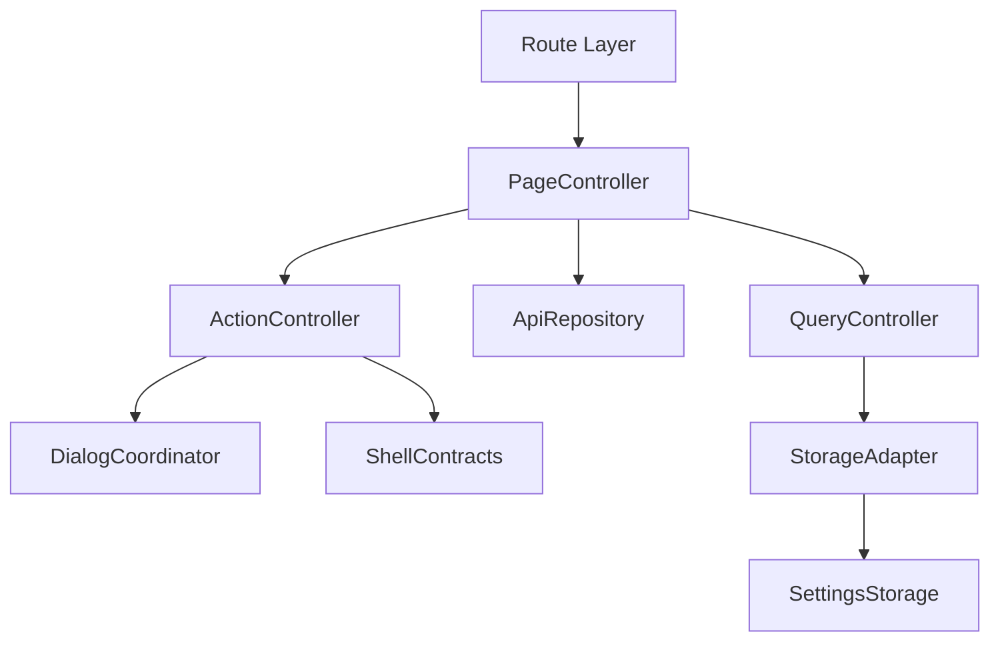
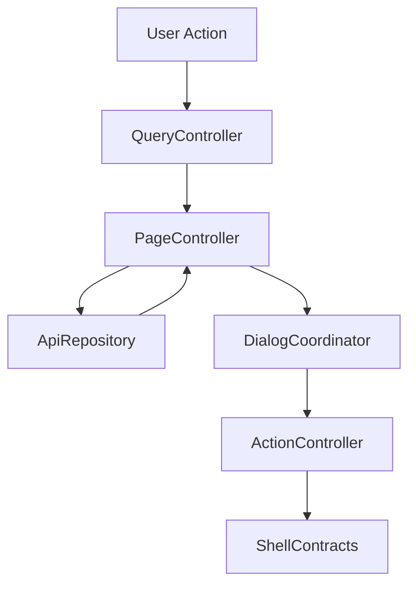

# 設計書: 検索とルール

## 概要

この仕様は Search form/result、Rule list/add/edit/action、query/API mapping の technical
design を定める。

**ユーザー**: EPGStation の通常ユーザー、operator、関連 routed screen の実装者。

**影響**: requirements を component、route/query/API/localStorage contract、test
strategy に接続し、tasks と実装の境界を曖昧にしない。

### 目標

- requirements の全受け入れ条件を design component と test に追跡可能にする。
- 決定済み React 技術選定を、実 package root `client/` の file plan に対応づける。
- `unittest/spec`、`unittest/imp`、E2E の最小 gate を明記する。

### 非目標

- 隣接 spec が所有する workflow、player lifecycle、settings default/backfill の取り込み。

## 境界の合意

### この仕様が所有するもの

- `/search`、`/search?rule=...`、`/rule`、検索 form、result decoration、rule option、rule list action。
- requirements に明記された route/query/API/localStorage/action/snackbar/dialog/menu behavior。
- 本 spec 配下の PageController、QueryController、ApiRepository、ActionController、DialogCoordinator、StorageAdapter の責務境界。

### 境界外

- App Shell navigation、settings default、Manual Reserve 詳細。
- 実 URL、実番組名、認証情報、Mirakurun URL、ffmpeg/ffprobe 実 path、環境固有値の tracked docs への記録。

### 許可する依存

- settings は `frontend-settings-storage`、program dialog 共通挙動は Guide/Recorded 各 spec と整合させる。
- `frontend-settings-storage` の保存済み settings contract と adjacent storage key registry。
- `frontend-app-shell` の shell、title bar slot、edit title bar、snackbar、navigation host。
- 既存 EPGStation REST API と hash route compatible router。

### 再検証トリガー

- requirements の受け入れ条件、route/query/API endpoint、snackbar 文言、dialog/menu action が変わる。
- `frontend-settings-storage` の field/default/validation/adjacent key default が変わる。
- `frontend-app-shell` の title/snackbar/navigation/edit title bar contract が変わる。

## アーキテクチャ

### アーキテクチャ前提

frontend は React と hash route を前提にし、hash route
compatibility、既存 API、localStorage contract、observed responsive behavior、snackbar/dialog/menu の表示条件を本書の requirements に定義された通りに維持する。

formal design の正本は、この design と同一 spec の requirements、visual-cases、mock-data、ならびに `.kiro/steering/`
の project
memory とする。矛盾がある場合は同一 spec の requirements と requirements 横断レビューの反映済み判断を優先する。

### アーキテクチャパターンと境界マップ



**アーキテクチャ統合**:

- 選択したパターン: feature boundary + shared typed contracts。
- ドメイン/機能境界:
  route/query/API/action/dialog/storage を feature 内で分離し、settings と shell は consumer として参照する。
- 固定するパターン: hash route、API endpoint、dialog close cleanup、snackbar result、responsive
  breakpoint。
- Steering 準拠: 設計書は日本語。

### Clearable text field owner

Search / Rule の keyword、ignore keyword、duration、period datetime、Rule option text/number、Rule search menu
keyword は shared clearable input owner を使う。非 select の MUI `TextField` を直接配置せず、raw
input を使う場合も同一 field 内に `...をクリア` accessible name を持つ clear
button を隣接させる。select/combobox、checkbox、genre button、Autocomplete 内部 input はこの clearable text
field 契約の対象外とする。

### 技術スタック

| レイヤー                  | 選択 / バージョン                                                                                                                            | 機能内の役割                                                      | 備考                                                                                                                                                               |
| ------------------------- | -------------------------------------------------------------------------------------------------------------------------------------------- | ----------------------------------------------------------------- | ------------------------------------------------------------------------------------------------------------------------------------------------------------------ |
| フロントエンド            | React / TypeScript / Vite                                                                                                                    | UI と typed contract                                              | package root は `client/`、package name は `epgstation-client`。 |
| ルーティング              | React Router hash route 対応 router                                                                                                          | route/query contract                                              | route contract は `/#/...`（hash route）とする。                                                              |
| Server state              | TanStack Query                                                                                                                               | API response cache、loading/error/refetch、Socket.IO invalidation | query key は route/query/API option から導出し、Socket.IO `updateStatus` などの event は該当 query invalidation/refetch に接続する。                               |
| Local state               | React local state/reducer                                                                                               | screen/dialog/edit/bulk state と App Shell 横断 state             | server state は TanStack Query に置く。Zustand は使わない。                                 |
| UI / CSS                  | MUI Core + `@mdi/font` + theme token + `*.module.css`                                                                                          | MUI theme に基づく visual contract、responsive                | global CSS は `src/index.css` の bootstrap/reset 程度に限定し、visual-cases の geometry/screenshot contract を theme/shared component に接続する。                                   |
| Form / validation         | form の値は hook の local state（`useState`）、送信は React Hook Form の `handleSubmit`、payload の検証は Zod | form state、submit validation、typed payload validation           | Search form、Rule add/edit form、time-specified rule form はこの境界に従う。                                                                                       |
| API client                | native `fetch` wrapper + typed request/response validation                                                                                   | backend integration                                               | repository base `./api` と endpoint path を二重結合しない。endpoint/query/body contract はこの design と requirements を正とする。                                 |
| Socket.IO                 | `socket.io-client`                                                                                                                           | realtime update trigger                                           | event handler は feature repository / TanStack Query invalidation 境界へ接続し、failure snackbar の有無は各 design の契約に従う。                                  |
| Lint / format / alias     | ESLint flat config + typescript-eslint + React Hooks plugin / Prettier / `@/`                                                                | static gate と import 解決                                        | `@/` は Vite / TypeScript / Vitest / ESLint で同一解決規則にする。                                                                                                 |
| Script gate               | `build` = Vite production build（`bundle`）、`build:verify` = lint + typecheck + unit test + `build`、`check` = lint + format:check + typecheck + `test:dev-server` + `unittest/spec` + `unittest/imp` | `client/package.json` の scripts                               | `build:verify` は format check を含めず、`check` が Prettier gate を持つ。                                                                                                |
| Test / coverage / browser | Vitest + V8 coverage / React Testing Library / Playwright / MSW                                                                              | `unittest/spec`、`unittest/imp`、E2E、visual regression           | 正式検証対象は Desktop Chromium、Desktop Firefox、Android Chrome、iOS Safari。visual は Playwright の geometry assertion で確認する（screenshot の比較はしない）。         |

## ファイル構成

`client/src/features/search/rule/` が本機能の境界で、ts/tsx は原則 300 行以下に保つ（例外は `RuleListPage.tsx`。CSS は 1 module にまとめる）。

```text
client/src/features/search/rule/
├── index.ts                      # SearchRulePage / RuleListPage / API repository factory / query key の公開
├── SearchRulePage.tsx            # /search の route root。hooks と components の合成だけを持つ
├── RuleListPage.tsx              # /rule の route root。一覧状態、action、pagination（共有の `AppPagination` が `isEnableExtendedPagination` で拡張 pagination と `LegacyPagination` を選ぶ）
├── SearchRulePage.module.css     # 両画面の CSS module
├── genreLabels.ts                # genre / sub genre の表示名
├── query.ts                      # lib/ の barrel（型、route 解析、form state、request、payload）
├── api.ts                        # api/ の barrel（型と createFetchSearchRuleApiRepository）
├── lib/
│   ├── searchTypes.ts            # form / route / API option / rule payload の型と定数
│   ├── searchRoute.ts            # /search と /rule の query 解析、rule 一覧 request
│   ├── searchFormState.ts        # form の既定値、route query と rule option からの復元
│   ├── searchRequest.ts          # /schedules/search の request body と時刻指定 option
│   ├── rulePayload.ts            # rule 追加・更新 payload と schema
│   ├── ruleOptionDraft.ts        # rule option の既定値
│   ├── channelSelectOptions.ts   # channel 選択肢と rule detail の channel 名の合成
│   ├── programDisplay.ts         # 検索結果の表示文字列と reserve index request
│   ├── genreSelection.ts         # genre / sub genre の選択切替
│   ├── searchFormItems.ts        # keyword target、曜日、genre、時刻の選択肢
│   ├── inputParsers.ts           # 数値 / 日時 / 空文字の parse
│   ├── pageScroll.ts             # 結果と先頭への scroll（固定 shell 対応）
│   ├── ruleLayout.ts             # 一覧の table/list 判定（780px）
│   ├── searchPageInfo.ts         # 履歴復元用の page info
│   ├── readOnlyReservesRepository.ts # 時刻指定予約一覧の読み取り専用 repository
│   └── ruleListText.ts           # rule 一覧の cell 文字列
├── hooks/
│   ├── useSearchRuleFormState.ts # form、request、option draft、dialog の state と ref
│   ├── useSearchRuleQueries.ts   # rule detail、channel、検索、rule 予約、reserve index の query
│   ├── useSearchRuleRouteEffects.ts # route 変更と rule 編集 preload の effect
│   ├── useSearchResultEffects.ts # 検索結果の反映、scroll、失敗 snackbar
│   └── useSearchRuleActions.ts   # 検索実行、クリア、rule 送信、scroll action
├── components/
│   ├── SearchConditionForm.tsx   # 検索条件 card（下記 3 row の合成）
│   ├── SearchKeywordRows.tsx     # keyword、除外 keyword、放送局 row
│   ├── SearchGenreRow.tsx        # genre row
│   ├── SearchTimeRows.tsx        # 時刻、長さ、期間、その他 row と action
│   ├── TimeSpecifiedSearchForm.tsx # 時刻指定 form
│   ├── SearchResultSection.tsx   # 検索結果一覧と rule option anchor
│   ├── TimeSpecifiedReserveSection.tsx # 時刻指定 rule の予約一覧
│   ├── RuleOptionForm.tsx / RuleOptionField.tsx # rule option form
│   ├── SearchCheckbox.tsx / ChannelMultiSelect.tsx / ClearableInput.tsx / SearchPeriodField.tsx # form control
│   ├── searchFormProps.ts        # form state を受け取る component の共通 props 型
│   ├── RuleListTitleBar.tsx      # rule 一覧の title bar と edit mode title bar
│   ├── RuleListRow.tsx           # rule 一覧の 1 行
│   ├── RuleItemMenu.tsx          # rule 行の menu（recorded / edit / delete）
│   ├── RuleSearchMenu.tsx        # rule の keyword 検索 menu
│   └── RuleDeleteDialogs.tsx     # 単体 / 一括削除 dialog
└── api/
    ├── types.ts                  # SearchProgram、RuleListItem、SearchRuleApiRepository
    ├── repository.ts             # createFetchSearchRuleApiRepository
    ├── http.ts                   # fetch helper と URL builder
    ├── guards.ts                 # 型 guard
    ├── adaptPrograms.ts          # 番組 / 予約一覧 / 予約追加応答の adapter
    ├── adaptRules.ts             # rule detail / rule 一覧 / rule 追加応答の adapter
    └── channelNames.ts           # channel index と channel 名の補完
```

test:

- `client/unittest/spec/searchRule.*.spec.test.tsx` — 画面 spec（layout、route、submit、controls、scroll、ruleEdit、dialog、ruleEditResults、timeSpecified、ruleList）。共有 fixture と helper は `searchRuleSupport.tsx`。
- `client/unittest/imp/searchRule.*.imp.test.ts` — request / payload builder、scroll FAB、API repository（rule 追加、検索、rule detail）。
- `client/e2e/search-rule-*.spec.ts` — workflow、form-controls、select-parity、scroll-geometry、responsive-theme、extended-pagination、pagination-narrow-width、list-row-hit-area、switch-hit-area、switch-vertical-hit-area。helper は `e2e/support/searchRuleHelpers.ts`、mock は `searchRuleMocks.ts`。
- `client/visual/search-rule-*.spec.ts` — geometry assertion（`search-rule-geometry.spec.ts` を主とし、crowded-row-geometry、extended-pagination、option-fontsize）。

## システムフロー



Flow は route/query/API/localStorage 境界で validation し、UI component が endpoint 文字列や localStorage
schema を直接所有しない構造にする。

## 要件トレーサビリティ

| 要件                                                                                                                            | 概要                                | コンポーネント                                                                                      | インターフェース      | フロー                  |
| ------------------------------------------------------------------------------------------------------------------------------- | ----------------------------------- | --------------------------------------------------------------------------------------------------- | --------------------- | ----------------------- |
| 1.1-1.15, 1.17-1.22 | Search route と query-driven search | PageController, QueryController, ApiRepository, ActionController, DialogCoordinator, StorageAdapter | State / Service / API | route/query/action flow |
| 1.16                                                                                                                            | SearchResult header scroll action   | PageController                                                                                      | State / Service       | UI action flow          |
| 2.1-2.41                                                                                                                        | Search からの reserve/rule workflow | PageController, QueryController, ApiRepository, ActionController, DialogCoordinator, StorageAdapter | State / Service / API | route/query/action flow |
| 3.1-3.35 | Rule list と item actions           | PageController, QueryController, ApiRepository, ActionController, DialogCoordinator, StorageAdapter | State / Service / API | route/query/action flow |
| 4.1-4.4 | dark theme coverage | PageController, DialogCoordinator | State | route/query/action flow |

## コンポーネントとインターフェース

| コンポーネント    | ドメイン/レイヤー | 意図                                                                              | 要件カバレッジ                         | 主な依存                                                        | 契約        |
| ----------------- | ----------------- | --------------------------------------------------------------------------------- | -------------------------------------- | --------------------------------------------------------------- | ----------- |
| PageController    | Feature Routing   | route 初期化、title、fetch、loading/error/empty を統括する。                      | 1.1-1.22, 2.1-2.41, 3.1-3.35           | frontend-settings-storage / frontend-app-shell / EPGStation API | 状態管理    |
| QueryController   | Feature Routing   | path/query/local UI input を typed model に変換する。                             | 1.1-1.13, 2.1-2.21, 3.1-3.3, 3.18-3.20 | frontend-settings-storage / frontend-app-shell / EPGStation API | Service     |
| ApiRepository     | Feature API       | requirements で定義された endpoint request と typed error 変換を扱う。            | 1.10-1.15, 2.10-2.17, 3.1-3.35         | frontend-settings-storage / frontend-app-shell / EPGStation API | API         |
| ActionController  | Feature Service   | menu、button、dialog submit、bulk action の結果を route/API/snackbar に接続する。 | 1.16, 2.10-2.41, 3.1-3.35              | frontend-settings-storage / frontend-app-shell / EPGStation API | Service/API |
| DialogCoordinator | Feature UI        | dialog/menu/open-reset/close-cleanup/focus を管理する。                           | 2.14-2.41, 3.1-3.17, 3.21-3.35         | frontend-settings-storage / frontend-app-shell / EPGStation API | 状態管理    |
| StorageAdapter    | Shared Boundary   | settings と隣接 localStorage key を consumer として読む。                         | 1.10, 1.13, 2.17-2.41, 3.20            | frontend-settings-storage / frontend-app-shell / EPGStation API | 状態管理    |

### ページ制御（PageController）

| 項目 | 詳細                                                                               |
| ---- | ---------------------------------------------------------------------------------- |
| 意図 | route 初期化、title、loading/error/empty、child component composition を統括する。 |
| 要件 | 1.1-1.22, 2.1-2.41, 3.1-3.35                                                       |

**責務と制約**

- route entrypoint と screen lifecycle だけを所有する。
- fetch/action の副作用は ApiRepository と ActionController へ委譲する。
- App Shell title/snackbar/edit title bar へは typed request だけを渡す。

### クエリ制御（QueryController）

| 項目 | 詳細                                                                   |
| ---- | ---------------------------------------------------------------------- |
| 意図 | route query、path param、form/filter input を typed model に変換する。 |
| 要件 | 1.1-1.13, 2.1-2.21, 3.1-3.3, 3.18-3.20                                 |

**責務と制約**

- `unknown` / string query を domain type へ narrow する。
- invalid input は requirements に従い normalize、ignore、controlled error、または no-op に変換する。
- route refresh 用 `timestamp` は user-facing filter state へ露出しない。

### API リポジトリ（ApiRepository）

| 項目 | 詳細                                                                   |
| ---- | ---------------------------------------------------------------------- |
| 意図 | API request builder、response adapter、typed error conversion を扱う。 |
| 要件 | 1.10-1.15, 2.10-2.17, 3.1-3.35                                         |

**責務と制約**

- endpoint は requirements を正とする。
- request body/query は explicit type で定義し、TypeScript の `any` を使わない。
- API failure は UI へ例外を漏らさず typed error として返す。

### アクション制御（ActionController）

| 項目 | 詳細                                                                      |
| ---- | ------------------------------------------------------------------------- |
| 意図 | menu、dialog、button、bulk action の実行と snackbar/route update を扱う。 |
| 要件 | 1.16, 2.10-2.41, 3.1-3.35                                                 |

**責務と制約**

- 表示条件、disabled/hidden 条件、成功/失敗 snackbar は requirements を正とする。
- action 完了後の refetch、dialog close、route move を一箇所に集約する。
- 破壊的 action は confirm dialog または requirements に定義された no-op 条件を経由する。

### ダイアログ調整（DialogCoordinator）

| 項目 | 詳細                                                |
| ---- | --------------------------------------------------- |
| 意図 | dialog/menu open/reset/close cleanup/focus を扱う。 |
| 要件 | 2.14-2.41, 3.1-3.17, 3.21-3.35                      |

**責務と制約**

- open ごとに stale state を reset する。
- close animation 後の remove/remount が requirements にある場合は維持する。
- dialog body の screenshot が不足する場合は mock API または検証 config で fixture を補完する。

### ストレージアダプター（StorageAdapter）

| 項目 | 詳細                                                           |
| ---- | -------------------------------------------------------------- |
| 意図 | settings と adjacent localStorage key を consumer として読む。 |
| 要件 | 1.10, 1.13, 2.17-2.41, 3.20                                    |

**責務と制約**

- settings default、backfill、validation は `frontend-settings-storage` に委譲する。
- feature 固有の adjacent key owner がある場合だけ、その shape を design と tasks に展開する。
- 保存済み値の parse failure は settings storage contract に従う。

### API 契約

この表の endpoint は frontend repository contract であり、`./api` の base path は含めない。決定済み native `fetch` wrapper に基づいて API client を作る場合も base path と endpoint
path を二重に結合しない。

| メソッド | エンドポイント               | リクエスト                                                                                                                                                                                      | レスポンス                                               | エラー                                                                             |
| -------- | ---------------------------- | ----------------------------------------------------------------------------------------------------------------------------------------------------------------------------------------------- | -------------------------------------------------------- | ---------------------------------------------------------------------------------- |
| POST     | /schedules/search            | { option, isHalfWidth, limit }                                                                                                                                                                  | program search results                                   | 初回/query-driven failure は `検索に失敗`; refresh failure は `検索情報更新に失敗` |
| GET      | /rules                       | type=normal/limit/offset/optional keyword plus isHalfWidth display option                                                                                                                       | rule list                                                | ルールデータ取得に失敗                                                             |
| GET      | /rules/:ruleId               | none                                                                                                                                                                                            | rule detail for preload/edit                             | rule preload controlled error                                                      |
| GET      | /reserves                    | type=all&ruleId=:ruleId&isHalfWidth=:setting                                                                                                                                                    | reserve list for rule edit/time-specified relation       | reserve preload controlled error                                                   |
| GET      | /reserves/lists              | startAt/endAt                                                                                                                                                                                   | reserve index for ProgramDialog action state             | program dialog reserve state fallback                                              |
| POST     | /reserves                    | `{ programId, allowEndLack: true, encodeOption?: { mode1?, encodeParentDirectoryName1?, directory1?, isDeleteOriginalAfterEncode } }`; `isDeleteOriginalAfterEncode` は `encodeOption` 内に置く | reserve result                                           | program action snackbar failure                                                    |
| DELETE   | /reserves/:reserveId         | none                                                                                                                                                                                            | manual reserve delete or rule reserve skip/cancel result | program action snackbar failure                                                    |
| DELETE   | /reserves/:reserveId/skip    | none                                                                                                                                                                                            | unskip result                                            | program action snackbar failure                                                    |
| DELETE   | /reserves/:reserveId/overlap | none                                                                                                                                                                                            | unoverlap result                                         | program action snackbar failure                                                    |
| POST     | /rules                       | rule body                                                                                                                                                                                       | created rule                                             | rule add failure snackbar                                                          |
| PUT      | /rules/:ruleId               | rule body                                                                                                                                                                                       | updated rule                                             | rule update failure snackbar                                                       |
| PUT      | /rules/:ruleId/enable        | none                                                                                                                                                                                            | result                                                   | enable rollback and snackbar                                                       |
| PUT      | /rules/:ruleId/disable       | none                                                                                                                                                                                            | result                                                   | disable rollback and snackbar                                                      |
| DELETE   | /rules/:ruleId               | none                                                                                                                                                                                            | delete result                                            | delete failure snackbar                                                            |

### 共有型契約

```typescript
type FeatureResult<T, E extends string> = { ok: true; value: T } | { ok: false; error: E; message: string };

interface RouteBuildResult {
    path: string;
    query: Record<string, string>;
}

interface SnackbarRequest {
    text: string;
    color?: 'normal' | 'success' | 'info' | 'error';
    timeout?: number;
}
```

## 機能固有の設計判断

### 検索フォームから API へのマッピング

Search submit は `POST /schedules/search` に `{ option, isHalfWidth, limit }` を送る。`limit` は
`searchLength`。主な mapping は次の通り。

| コントロール           | API マッピング                                                                                                                                                                                                                                                                                                                                                                                                                                                                                                                                                                                                                                                                                                                                                                                                                                                                                                                                                                                                     |
| ---------------------- | ------------------------------------------------------------------------------------------------------------------------------------------------------------------------------------------------------------------------------------------------------------------------------------------------------------------------------------------------------------------------------------------------------------------------------------------------------------------------------------------------------------------------------------------------------------------------------------------------------------------------------------------------------------------------------------------------------------------------------------------------------------------------------------------------------------------------------------------------------------------------------------------------------------------------------------------------------------------------------------------------------------------ |
| keyword                | `keyCS`、`keyRegExp`、`name`、`description`、`extended` の target boolean と keyword text を `option` へ反映する。empty keyword は keyword text を送らない。target 未選択時は次行の keyword target default を適用する。                                                                                                                                                                                                                                                                                                                                                                                                                                                                                                                                                                                                                                                                                                                                                                                                       |
| keyword target default | keyword が non-empty で `name` / `description` / `extended` target がすべて false の場合、`name=true`、`description=true` を設定する。                                                                                                                                                                                                                                                                                                                                                                                                                                                                                                                                                                                                                                                                                                                                                                                                                                                        |
| exclude words          | `ignoreKeyword`、`ignoreKeyCS`、`ignoreKeyRegExp`、`ignoreName`、`ignoreDescription`、`ignoreExtended` を `option` へ反映する。empty ignore keyword は送らない。                                                                                                                                                                                                                                                                                                                                                                                                                                                                                                                                                                                                                                                                                                                                                                                                                                                   |
| exclude target default | ignore keyword が non-empty で `ignoreName` / `ignoreDescription` / `ignoreExtended` target がすべて false の場合、`ignoreName=true`、`ignoreDescription=true` を設定する。                                                                                                                                                                                                                                                                                                                                                                                                                                                                                                                                                                                                                                                                                                                                                                                                                   |
| channel selector       | UI は text/numeric input ではなく `/channels` の id/name から作る select/combobox とする。複数 channel を選択でき、未選択時は表示面に muted placeholder color の `channel` を表示し、non-empty 時は `channelIdをクリア` clear action で全選択を解除できる。表示面は MUI theme token を継承する 48px density の standard select とし、outlined variant の `fieldset` や raw text input 用 border/underline を重ねてはならない。複数選択時の表示名は 1 行 ellipsis で親 card 幅内に収め、selected label の長さや件数で combobox の実幅が親 card を突き抜けてはならない。selected channel ids がある場合は `channelIds` を送り、broadcast wave 条件とは排他にする。rule edit では selected id が fetched option にない場合も rule detail の channelNames から fallback option を挿入し、表示名と id を維持する。                                                                                                                                                    |
| broadcast wave         | channel ids が空の場合だけ `GR` / `BS` / `CS` / `SKY` / `BS4K` boolean filter を送る。visible wave がすべて disabled の場合は全 visible wave を enabled に戻し、visible wave がすべて enabled の場合は `GR` / `BS` / `CS` / `SKY` / `BS4K` key 自体を omit する。                                                                                                                                                                                                                                                                                                                                                                                                                                                                                                                                                                                                                                                                                                                                               |
| genre/subGenre         | genre select は genre 定義の top-level genre を option に持つ select/combobox とし、numeric input にしない。この select は検索対象の単一 genre 値ではなく genre list filter であり、all-filter 状態を `すべて` として表示する。`すべて` では全 top-level genre を一覧表示し、top-level genre 選択時は下の一覧をその genre に絞る。genre select は clearable select ではないため、genre 選択後も右端の `genreをクリア` clear button を表示しない。genre list filter を全件表示へ戻す操作は、select menu 内の `すべて` option 選択だけで行う。検索対象 genre は一覧内の item click で複数選択し、top-level 選択は `{ genre }`、subGenre 選択は `{ genre, subGenre }` として backend `genres` 配列へ変換する。`サブジャンル表示` OFF 時は subGenre button 群を非表示にし、既存 subGenre 選択を同一 genre の top-level 選択へ正規化する。genre item の blue tint は selected state 専用であり、hover は selected と同じ background/color を使わない。 |
| time specification     | UI の first time row を `times[0].week` / `times[0].start` / `times[0].range` へ変換する。`start` は 0-23 時、`range` は 1-23 時間の select/combobox とし、直接数値入力 field にしない。未選択時は表示面に `start` / `range` を表示し、non-empty 時は各 select の clear action で null に戻せる。weekday がすべて未選択の場合は `week=0x7f` を送る。                                                                                                                                                                                                                                                                                                                                                                                                                                                                                                                                                                                                                                                               |
| search period          | UI は `開始` / `終了` の readonly text field から日時 picker dialog を開く。dialog は共有部品 `DateTimePickerDialog`（月曜始まりの日本語 calendar と 24 時間表記の時刻の選択）に `クリア` / `設定` action を持ち、local datetime を Unix time milliseconds へ変換する。start/end の両方が指定されている場合だけ `searchPeriods` を 1 件送る。片側だけの場合は `searchPeriods` を omit する。                                                                                                                                                                                                                                                                                                                                                                                                                                                                                                                                                                                                                                                                                                                  |
| duration               | UI minute value を seconds に変換し、下限/上限を `durationMin` / `durationMax` へ反映する。                                                                                                                                                                                                                                                                                                                                                                                                                                                                                                                                                                                                                                                                                                                                                                                                                                                                                                                        |
| free-only / flags      | free-only は `isFree`、除外条件などは option key へ non-empty value だけを反映する。                                                                                                                                                                                                                                                                                                                                                                                                                                                                                                                                                                                                                                                                                                                                                                                                                                                                                                                 |

`SearchApiOption` は exact key として
`keyword`、`keyCS`、`keyRegExp`、`name`、`description`、`extended`、`ignoreKeyword`、`ignoreKeyCS`、`ignoreKeyRegExp`、`ignoreName`、`ignoreDescription`、`ignoreExtended`、`channelIds`、`GR`、`BS`、`CS`、`SKY`、`BS4K`、`genres`、`times`、`searchPeriods`、`durationMin`、`durationMax`、`isFree`
を扱う。empty value は上記 omit rule に従う。

plain `/search` の `時刻指定` は `時刻指定` switch
に対応する controlled switch とする。rule edit 中は常に disabled、通常 `/search`
では操作可能で、OFF では通常検索 card、ON では番組名 keyword / channel select / 開始・終了 time field / weekday
checkbox の time-specified rule card を表示する。ON に切り替えても `/schedules/search` は発火せず、検索実行前から Rule
option card を表示する。time-specified rule add payload は
`isTimeSpecification=true`、`keyword`、`channelIds[0]`、`times[0].start`、`times[0].range`、`times[0].week`
を生成し、weekday が 0 件の場合は normal search と同じ `week=0x7f` へ正規化する。

query-driven search は `keyword`、`channelId`、`genre`、`subGenre`
のいずれかを query から form に反映した場合に query-driven search として検索を発火する。Guide ProgramDialog の `検索` action は
`/search?keyword=<programName>` を入口にするため、SearchRule 側は route 初期化後に user submit を待たず
`POST /schedules/search` を実行し、query 由来 keyword にも keyword target default を適用する。`rule`
query がある場合は rule edit mode が優先され、query-driven search は実行しない。

keyword text field の Enter submit は user submit として扱う。実装では `onChange`
と `onKeyDown` の同一 tick 競合で stale form state を使わないよう、submit 時に現在 input value を反映した
`SearchFormState` から `SearchApiOption` を再生成する。Enter submit、検索 button submit、query-driven search は同一の
`buildSearchRequestBody` と keyword target defaulting を通る。

Search / Rule の text-like field は  clear
affordance を持つ。対象は Search keyword / ignore keyword / duration min/max、period dialog の datetime field、Rule
option の日数 / sub directory / file format / encode sub directory、Rule search menu keyword とする。Clear
button は value が non-empty のときだけ field 右端に表示し、該当 field だけを empty
string/null 相当に戻す。select/combobox は clearable な場合だけ select owner の clear
action を持つ。Search form の channel / start time / range、Rule option form の directory / directory1-3 /
mode1-3 は clearable select として扱う。Search form の genre select は clearable select 対象外であり、non-empty
state でも `genreをクリア` button を表示しない。`file format` は select ではなく clearable な text field として扱う。通常検索 UI の `range` select と、
time-specified UI の `終了` field の両方を、field 右端の clear button の確認対象に含める。read-only
activator、disabled field、textarea はこの clear button 対象外とする。

Rule option の directory / directory1-3 / mode1-3 select は、empty value を placeholder/clear
state として内部保持しても、menu option として field label 自体を表示してはならない。`mode1`、`directory1`
などの label が先頭 option に混入する状態は clearable select の failure とする。current
value が server config option に存在しない場合だけ fallback option を追加し、fallback option の label は実 current
value とする。

### ルール既定値と副作用

- new rule 初期化では `isCheckAvoidDuplicate` と `isCheckDeleteOriginalAfterEncode` を settings から反映する。
- search preparation for rule creation では `isEnableCopyKeywordToDirectory` と `isEnableEncodingSettingWhenCreateRule`
  を反映する。
- `searchLength` は search submit の `limit`、`rulesLength` は Rule list page size、`isHalfWidthDisplayed` は `/rules`
  request、rule edit preload の `/reserves` request、取得後の channel name 表示変換に使う。
- `isEnableAutoScrollWhenEditingRule` は `/settings` で保存された settings value を consume し、`/search?rule=<ruleId>`
  の EPG rule edit 初期表示で、loaded rule の searchOption を使った初回 `POST /schedules/search`
  成功後に検索結果へ自動 scroll するかどうかを制御する。`false` では `needsResultScroll` を立てず、初回検索成功後も
  `window.scrollTo` を呼ばない。time-specified rule edit、history restoration、query-driven `/search?keyword=...`、user
  submit はこの設定の対象外で、query-driven search と user submit は常に自動 scroll する。Reserves item
  menu、Recorded item menu、Recorded detail menu、ProgramDialog、Rule list など別 screen から `/search?rule=<ruleId>`
  を開く handoff でも、遷移元で auto-scroll を抑止してはならない。
- Search page の section 間 scroll は  title-bar-offset 計算と
  `behavior: smooth` を使う。通常 document scroll では scroll target の
  `getBoundingClientRect().top + window.pageYOffset - titleBar.clientHeight - offset` を `window.scrollTo()` に渡し、iOS
  / iPadOS の `html.fix-address-bar2` 中では実 scroll owner が `window` ではなく `shell-main`
  であるため、`shell-main.scrollTop + targetRect.top - shellMainRect.top - titleBar.clientHeight - offset` を
  `shell-main.scrollTo()` に渡す。sticky/fixed title bar の下に target heading が隠れないようにし、`/reserves` の rule
  item menu `edit` から `/search?rule=<ruleId>` へ遷移した後に検索ボタンを押した場合も、console
  error を出さず SearchResult section へ smooth scroll する。user submit 後の検索結果 scroll、route-backed auto
  search、rule edit preload、SearchResult header の「録画設定へ移動」button はすべて `behavior: smooth`
  を維持する。同一 helper を使い、**scroll target（`resultRef`/`ruleOptionRef` が指す element）が
  mount されていない場合にだけ** `スクロールに失敗` snackbar を表示する。title bar の高さが取得できない
  場合は offset 0 として scroll を続行し、`window.scrollTo`/`shell-main.scrollTo` 自体が例外を投げた
  場合も同様に握りつぶして続行し、いずれも `スクロールに失敗` を出してはならない。
  `Element.scrollIntoView()` に直接委譲して title bar offset を失ってはならない、という制約は維持する。
- Rule add/update body は `{ isTimeSpecification, searchOption, reserveOption, saveOption?, encodeOption? }`
  を基本とする。normal rule は `isTimeSpecification=false` と search form 由来の `searchOption`、time-specified rule は
  `isTimeSpecification=true` と time specification 由来の `searchOption` を生成する。
- `saveOption` は UI 上の local save option object が存在する場合、空 object でも body に含める。ただし
  `parentDirectoryName`、`directory`、`recordedFormat` が `null`
  の field は body に出さない。
- 既存 rule fetch で `saveOption` が欠落している場合は rule option の default
  と同じく、初期化済みの空 save option `{ parentDirectoryName:null, directory:null, recordedFormat:null }`
  のまま編集を継続する。`saveOption` 欠落を rule detail parse failure として扱ってはならない。
- `reserveOption.periodToAvoidDuplicate` は UI value がある場合だけ number として parse して送る。未入力時は
  field 自体を omit し、`null` placeholder を送らない。
- `encodeOption` は mode1/2/3 が全て null の場合 omit し、そうでなければ `isDeleteOriginalAfterEncode`
  と選択済み mode/directory fields を含める。directory fields は parent directory と sub directory の field を維持し、未選択 field は  omit する。
- Rule option form は `SearchRuleOptionDraft` 相当の controlled
  state を持つ。`reserveOption`、`saveOption`、`encodeOption` の各 input は read-only
  snapshot ではなく draft を更新し、Rule add/update payload builder は settings default と existing
  rule よりもユーザー編集済み draft を優先する。`directory` / `directory1-3` は server config `recorded` directory
  list、`mode1-3` は server config `encode` / `encodeModes` 由来 option を持つ select/combobox とし、
  clearable empty value と fallback current value を保持する。
- encode mode が 0 件の場合、new rule の `encodeOption` は存在しないため encode option fields は表示しない。encode
  mode が 1 件以上ある場合、`isEnableEncodingSettingWhenCreateRule=false` でも encode mode 判定
  と同じく encode1/2/3 panels は表示し、controlled `encodeOption`
  draft を保持する。ただし初期値は mode1/2/3 全て null とし、ユーザーが mode を選ぶまでは `buildSearchRulePayload` で
  `encodeOption` を omit する。`isEnableEncodingSettingWhenCreateRule=true` の場合は mode1 と directory1/sub
  directory1 を初期化する。mode2/mode3 panels は user-controlled
  disclosure とし、mode 未選択で panel を開いて directory/sub
  directory を入力しても再 render で閉じたり値を失ったりしてはならない。
- Rule option accordion/panel は native `details/summary` または同等の accessible disclosure を使い、summary text が CSS
  `content` で描画される場合でも clickable/focusable DOM target を維持する。accordion body は `::details-content`、MUI
  `Collapse`、または同等の height/content transition を使い、open/close の transition
  duration を 0ms にしてはならない。非表示の title span をクリック target としてテストしてはならない。
- Search form の duration min/max fields は max-width 100px に合わせ、Rule option の duplicate
  period field は 90px、directory/mode select は 150px を上限にする。これらは full-width grid
  track に引き伸ばしてはならない。
- Rule list の single delete と bulk delete はどちらも modal dialog として表示する。bulk delete を inline
  `<div role="dialog">` として page content に挿入しない。

### ProgramDialog とルールアクション表

- ProgramDialog の共通 UI、linkify、close animation 後の remove/remount、基本 action matrix は `frontend-guide`
  が所有する。SearchRule は search result から共通 ProgramDialog へ渡す decoration/reserve index、rule edit
  route、search result 固有の handoff input だけを所有し、ProgramDialog を重複実装しない。
- routed title は plain `/search` で `検索`、`/search?rule=<ruleId>` で `ルール編集`、`/rule` で `ルール` とする。`rule`
  query が存在する場合は search query values より rule edit mode title を優先する。
- `/rule` title bar の検索 icon は Rule search menu を開く。`/search` へ遷移する action ではない。Rule search
  menu は current route の `keyword` query を `キーワード` field へ preload し、`閉じる` は route を変えず close、`検索`
  は menu close 後約 300ms 待って `/rule?keyword=<keyword>` へ遷移する。keyword が空の場合は `/rule`
  へ遷移する。
- time-specified rule edit の reserve cards は `frontend-reserves` owned `ReserveListItem` を
  `needsDecoration=true`、`disableEdit=true` 相当で consume する。SearchRule は reserve card body、state decoration
  priority、edit/delete/unlock action を再定義せず、time-specified rule edit 内では reserve card から edit/delete/unlock
  action を発火しない。
- Search result ProgramDialog は Guide と同じ no reserve / manual / rule / skip / overlap action
  matrix を使い、表示 button は状態ごとに明示する。
- no reserve は `詳細`、`検索`、`予約` と encode selector / delete-original checkbox を表示する。
- manual reserve は `編集`、`検索`、`削除` を表示する。表示 label は `削除`、snackbar 文言は `<programName> キャンセル`
  / `<programName> キャンセル失敗` を維持する。
- rule reserve は `ルール`、`検索` と、状態に応じて `除外`、`除外解除`、`重複解除` を表示する。
- no reserve は `POST /reserves` に `{ programId, allowEndLack: true }` と optional `encodeOption`
  を送り、`<programName> 予約` / `<programName> 予約失敗` snackbar を表示して close する。`isDeleteOriginalAfterEncode`
  は `encodeOption` 内の field として送る。
- manual/rule reserve は `DELETE /reserves/:reserveId` を送り、`<programName> キャンセル` /
  `<programName> キャンセル失敗` snackbar を表示して close する。
- skip は `DELETE /reserves/:reserveId/skip`、overlap は `DELETE /reserves/:reserveId/overlap` を送り、それぞれ
  `除外解除` / `重複解除` の success/failure snackbar を表示して close する。
- `GET /reserves/lists` は result program の reserve state decoration と ProgramDialog action 分岐に使う。
  decoration は `frontend-guide` が所有する `GuideReserveIndex` / `ReserveVisualState`
  （`reserve`/`conflict`/`skip`/`overlap`）を再利用し、`SearchResultSection` の各結果 item に
  `reserveIndex[program.id]?.type` を `data-reserve-state` 属性として付与する。表示は 4 状態
  （`reserve`: 赤 4px 枠、`conflict`: 黄背景+赤破線枠、`skip`: 灰背景、`overlap`:
  取消線+灰背景+黒文字）を `SearchRulePage.module.css` に持ち、dark theme では `frontend-guide` の
  `GuidePage.module.css` と同じ token 調整（`conflict` 背景 `#f6c90e`、`skip`/`overlap` 背景
  `#717171`、`overlap` 文字色 `#fff`）を適用する。
- Rule enable/disable は API await 後に state を確定し、失敗時は rollback と snackbar を行う intentional fix とする。
- Rule add/update 成功後は `ルール追加に成功` / `ルール更新に成功` snackbar を表示し、既存 delay 後に previous
  route へ戻る。失敗時は `ルール追加に失敗` / `ルール更新に失敗` を表示して route を維持する。
- Rule add/update/delete 後の list update は optimistic mutation ではなく refetch-driven update を正とする。
- Rule option は normal
  search 完了後であれば 0 件結果でも表示でき、time-specified が ON の場合は検索実行前でも表示できる。
- bulk delete 0 件は `ルールを選択してください。` snackbar を表示し、API call しない。dialog
  noun は rule 対象として固定する。

### Snackbar 文言一覧

SearchRule は requirements の exact text を正とする。主な文言は
`検索に失敗`、`検索情報更新に失敗`、`初期化失敗`、`スクロールに失敗`、`予約情報更新に失敗`、`予約情報取得に失敗`、`ルール追加に成功`、`ルール追加に失敗`、`ルール更新に成功`、`ルール更新に失敗`、`有効化: <keyword>`、`無効化: <keyword>`、`ルールの有効化に失敗`、`ルールの無効化に失敗`、`<keyword> を削除`、`<keyword> を削除に失敗`、`選択したルールを削除しました。`、`一部ルールの削除に失敗しました。`
とする。API 表の generic failure 表記はこの一覧を上書きしない。

Search result item typography は次を正とする。program title（`.programName`）は `16px` / `28px` / `font-weight:900`、
channel と date/duration は同一テキストノード（`.programMeta`）として `14px`（`color-mix(in srgb, currentColor 70%, transparent)`）、
description（`.programDescription`）は `14px` / `20px`（`rgba(0,0,0,0.6)`）とする。result item は
`button` として描画するため、title/description が iOS Safari の UA default button font に落ちないよう、各 text
element に明示 font-size / line-height を持たせる。dark theme では description の light fixed color を残さず App Shell
text token 相当へ反転する。

Rule list item の main area も `button` として描画するため、iOS / iPadOS Safari の UA `button`
font が日本語 glyph fallback を壊さないよう、App Shell / MUI 側の font stack を継承し、UA default `system-ui`
に落としてはならない。

- edit mode では Socket.IO `updateStatus` など clear を伴わない refetch 後に、visible rows に残っている selected rule
  id を維持する。page/keyword route
  change は fetch 前に state を clear するため selection を維持しない。exit は selection を clear して edit
  mode を解除し、select-all は現在 visible rows 全件を選択し、row toggle は visible row の selected
  state だけを反転する。
- `/rule` edit mode title は App Shell shared `EditTitleBar` を使う。Reserves / Recorded /
  Recording と同じ close/select-all/delete icon button、48px toolbar density、dark/light
  treatment を正とし、RuleList 固有の `すべて選択` / `選択削除` / `終了` text button row を実装してはならない。
- Rule bulk delete dialog は  max-width 300px、title `ルール削除`、body
  `選択した <total> 件のルールを削除しますか。`、text actions を使う。0 件時は dialog を開かず
  `ルールを選択してください。` snackbar を表示する。
- Search page state は history restore の場合だけ
  `searchOption`、`genreSelect`、`reserveOption`、`saveOption`、`encodeOption`、`isSearched`
  を復元する。検索実行済み状態は `activeRequest`（`source` が `route-search` / `search-submit` /
  `rule-edit-preload` / `rule-edit-submit`）で表し、未実行は `activeRequest=null` である。履歴の `isSearched` は
  `activeRequest !== null` から作る。
- Search page と Rule list page は App Shell scroll history contract の routed screen として、初期 option / rule detail
  / search result / rule list fetch と初期 DOM の準備が完了した時点で completion signal を発火する。`/rule` は rule list
  query 完了前に restore 完了扱いにしてはならず、browser back では App Shell が保存した `/rule` の scroll
  position を timeout fallback 待ちなしで復元できることを E2E で固定する。
- ProgramDialog の action matrix、button label、linkify、close/remount、snackbar 文言の正本は `frontend-guide`
  であり、SearchRule は search result の reserve index/decorator と handoff input だけを test scope とする。
- Guide / OnAir / Recorded などから `/search?keyword=...` へ遷移した route-backed search は、ProgramDialog
  の検索 action と同じく keyword target の `名前` と `概要` を UI 上でも checked にする。request
  builder だけで暗黙補完して checkbox を未選択に見せてはならない。keyword がある状態で target
  checkbox がすべて off のまま user submit した場合も、default target として `名前` / `概要`
  を form state に反映してから検索する。
- 放送波チェックボックス（`GR`/`BS`/`CS`/`SKY`/`BS4K`）にも上記 keyword target と同じ規約を適用する: channel
  未選択かつ visible な放送波チェックボックスが全て off のまま user submit した場合、request builder
  だけで暗黙補完して checkbox を未選択に見せてはならず、全 visible 放送波を checked へ戻した状態を
  form state（＝画面上のチェックボックス）に反映してから検索する。channel が 1 件以上選択されている
  場合は、逆に visible な放送波チェックボックスを全て unchecked 表示に戻す。詳細と出典は要求 1.22。
- `/search?rule=<ruleId>` の rule edit preload は loaded rule detail の search/reserve/save/encode
  contract、settings、encode modes、visible broadcast waves の組み合わせごとに一度だけ form / rule option / initial
  search request を同期する。route query の副次的な変化や timestamp 正規化で rule edit mode の form /
  activeRequest を default search state へ戻してはならない。`setForm` 後に派生する `requestBody` を preload
  effect の dependency に入れて、同一 rule detail の `POST /schedules/search`、auto-scroll、state
  update を再発行し続けてはならない。rule edit route を数分放置しても render loop、query loop、browser
  crash を起こさないことを regression test で固定する。
- plain `/search`（rule edit ではない）モードにも、上記 rule edit preload と同じ churn-safety 制約を適用する。
  `useSearchRuleRouteEffects` の 'search' mode 分岐は、`routeSearch`（`location.search`）自体が変化した
  ときにだけ `setForm`/`setActiveRequest` で form を route 既定値へ戻してよく、`settings` /
  `enabledBroadcastWaves` / `routeState` など同じ内容で参照だけ新しくなり得る dependency が変わっただけの
  再実行では何もしてはならない。この区別を怠ると、keyword/除外 keyword の入力、channel 選択、放送波
  チェック、時刻/期間 field の操作のいずれかの直後に無関係な祖先 re-render（snackbar 表示、server config
  の非同期反映など）が起きただけで、入力内容と検索結果（および表示中の rule option/encode option
  card）が消える。
- Search form の user submit 成功後は SearchResult section 先頭へ smooth scroll を行う。SearchResult
  header の link icon は form ではなく Rule option card 先頭へ smooth scroll する。scroll target が存在しない場合は
  `スクロールに失敗` snackbar を表示する。route-backed auto search / rule edit preload も Search page
  と同じ smooth scroll を維持する。rule edit 中の user submit は existing rule の reserve/save/encode
  draft を維持しつつ、検索条件だけを新しい request body へ更新する。
- Search page の top FAB は 56px circular pink button / white `mdi-chevron-up` 相当とする。位置は
  `left = app main offset + 12px`、
  `bottom = 16px` を正とし、desktop permanent drawer の `256px` 幅に重なって欠けてはならない。top FAB の click
  は section scroll helper と同じ active scroll owner 解決を使い、iOS / iPadOS の `html.fix-address-bar2` 中では
  `window` ではなく `shell-main.scrollTo({ top: 0, behavior: "smooth" })` を呼ぶ。通常環境では `window.scrollTo`
  を使う。top FAB は scroll API 呼び出しが失敗しても `スクロールに失敗` snackbar を表示せず、silent に
  best-effort で終える。
- Search form action row は  action row 上部に 1px
  divider を置き、card 末尾に pseudo element divider を描画しない。
- Rule list layout breakpoint は 780px とする（導出の詳細は要求 3.26 および
  `client/src/features/search/rule/lib/ruleLayout.ts` のコメント参照）。table
  layout の list container は `<table>` 要素と同じく available content width に追従する `width: 100%` を正とし、
  desktop で `max-width: 1160px` などの上限を設けて viewport 伸縮を止めてはならない（`/search` と `/rule` が共有する page wrapper の上限 1600px を除く）。

## データモデル

- `SearchFormState`: keyword、targets、channels、broadcast waves、genres、time
  condition、duration、flags を持つ。検索実行済み状態は form とは別の `activeRequest`（未実行は `null`）で持ち、Socket.IO
  `updateStatus` は `activeRequest=null` の plain `/search` では default search を発火しない。
- `SearchApiOption`: backend `/schedules/search` の `option` object。UI state から non-empty fields だけを生成する。
- `RuleFormState`: search option、reserve option、save option、encode option、settings-derived defaults を持つ。
- `RuleListState`: `{ page, limit, selectedRuleIds, editMode, layoutMode }`。refetch 時は visible rule
  ids との intersection で `selectedRuleIds` を preserve する。

## エラーハンドリング

- validation は route/query/form/API/localStorage の境界で行う。
- snackbar 文言は requirements に定義された文言を優先する。
- no-op、blank presentation、controlled error の選択は requirements を正とする。
- stale research と formal requirements が矛盾する場合は formal requirements を正とする。

## テスト戦略

unit test は `npm run coverage:gate` で statements・branches・functions・lines の 4 指標 100% を要求する。unit test は
`unittest/spec` と `unittest/imp` の 2 種類を持ち、片方で他方を代替しない。E2E と visual は release-preflight の
client-browser step で実ブラウザーに流す。hosted CI（`client.yml`）は lint・typecheck・format check だけを行う。

- `unittest/spec`: user-visible behavior、route/query contract、API request
  contract、状態遷移、snackbar/dialog/menu 表示条件を requirements ID に紐づけて検証する。
- `unittest/imp`: query parser、request builder、state reducer、validator、lifecycle cleanup、storage
  adapter の分岐と edge case を検証する。
- E2E: deterministic mock data で route 表示、主要 action、dialog/menu、responsive、empty/error state を確認する。

### Visual Regression 契約

この feature の詳細 layout は、本文の Search form / ProgramDialog / Rule list contract と `visual-cases.md`
の visual cases、`mock-data.md` の synthetic dataset contract を合わせて正本とする。

`visual-cases.md` は geometry / interaction test の撮影条件を定義する。`mock-data.md` は visual
cases で使う synthetic search options、program results、reserve states、rule list/edit fixture 条件を定義する。

Rule list layout の 780px container breakpoint、keyword fallback、channel/genre `他<n>`、`reservesCnt`
fallback は visual cases の invariant として扱う。tracked
artifact には実番組名、実 URL、実ロゴ、サムネイル、実 directory path、認証情報、環境固有値を含めない。

### Visual Implementation Contract

Search form / Search result / Rule option card は `800px` の max
width を共有し、keyword 入力 card と結果/録画設定 card の最大横幅がずれてはならない。content surface
`contentSurface`、search card padding `32px 16px 24px`、control vertical gap `20px`、Rule option card の内側 padding `16px`（`.rulePanels`）、panel の内容の gap `12px`（`.rulePanelContent`）とする。Initial
`/search` は form だけを表示し、result placeholder を追加しない。Result list は program item density を使い、item は padding `16px` の button とする。検索結果は pagination を持たない。

Rule list は container width `780px` 以上で table、`779px` 以下で card/list rows に切り替える。
`RuleListPage` は自身が描画する `<section className={styles.page}>` に `ref` を張り、
`useMeasuredContainerWidth`（`client/src/shared/useMeasuredContainerWidth.ts`）で `ResizeObserver` により
実際の `clientWidth` を測定し、`resolveRuleLayout`（`client/src/features/search/rule/lib/ruleLayout.ts`）
へ渡す。判定結果は `.page` へ `data-rule-layout` 属性として反映し、CSS は
`.page[data-rule-layout='list'] .ruleHeader` のような属性セレクタでこれを参照する（`@media` による
viewport 幅判定はここでは使わない）。`.page` は `box-sizing: border-box` かつ `padding: 12px` であり、
`ref` を張った `.page` 自身の `clientWidth` はこの padding を含んだ値になる。閾値は
`780px`（`RULE_TABLE_LAYOUT_MIN_WIDTH`）とし、`client/e2e/search-rule-responsive-theme.spec.ts` の
"keeps Search result cards and Rule list width responsive" test の期待値もこの値に合わせる。

Rule の有効/無効は enable switch（`.ruleSwitchButton`）でだけ切り替わり、switch の click/tap 領域は keyword 列を含む
他のどの列とも重ならない（要求3 AC33）。`RuleListRow.tsx` は edit mode 外では `.ruleSwitchButton` を MUI
`Button`（variant="text"）として描画するが、MUI `Button` は自身の runtime style を単一の emotion 生成 class
（`min-width: 64px`、`padding: 6px 8px`）として持ち、これと `.ruleSwitchButton` の plain rule は selector
specificity が同じ (0,1,0) 単一 class であるため、emotion が挿入する `<style>` が page 本体の stylesheet より後に
`<head>` へ入る cascade の順序により MUI 側が勝ち、`min-width: 48px`／`padding: 0` の override が適用されない
ことがある。`SearchRulePage.module.css` はこれを `.ruleSwitchButton:global(.MuiButtonBase-root)`
（selector specificity (0,2,0)）で上書きし、`.ruleFab:global(.MuiFab-root)` と同じ技法で cascade の順序に
依存せず勝つようにする。list layout の 52px、table layout の 82px という switch 列の固定 grid track 幅は
この override が効いていることを前提にしており、効いていない場合は switch の実際の hit box（64px 幅）が
list layout の 52px track を越えて keyword 列へ食い込む。edit mode の空 placeholder `<span aria-hidden>`
は `MuiButtonBase-root` class を持たないため、plain rule（`min-width: 48px`、`padding: 0`）をそのまま使う。

list layout の行選択領域（`.ruleItemMain`、要求3 AC34）は、switch 列（`grid-column: 1`）と action menu 列
（`grid-column: 4`）を除いた行の残り 2 列分（keyword 列・`reservesCnt` 列、`grid-column: 2 / 4`）を占める実
box とする。`RuleListRow.tsx` の `<button className={styles.ruleItemMain}>` 自体は `display: flex` と
`align-self: stretch` を持ち、行の全高・全幅を占めるひとつの hit area として振る舞う。内側の keyword
`<span>`（`flex: 1 1 auto`）と `reservesCnt` `<span>`（`flex: 0 0 42px`）は button 内の flex item として
並び、視覚上の列幅配分は table layout と同じ比率を保つ。この構成により、keyword text の右側の余白を含む
button 領域全体の click/tap が edit mode の選択 toggle を発火させる一方、button の grid-column は switch
列・action menu 列のどちらとも重ならないため、要求3 AC33 の switch hit-area 非重複契約は保たれる。

Rule add FAB は 、fixed bottom right、pink
surface、white plus icon を維持する。MUI `Fab color="secondary"` の theme default に任せて icon
color が light/dark で黒へ戻る実装は禁止し、`.MuiFab-root` owner style で foreground を白に固定する。

Rule edit/create form は Search form と同じ max width `800px` と control gap を使い、auto scroll target が title
bar に隠れない位置は、上の scroll 座標の計算（title bar の高さを引く）で決める。ProgramDialog / menu portal は App Shell
`chromeSurface`、dark theme では form、list、dialog、menu、pagination のすべてで light surface を残さない。

Search/Rule の select は shared `AppSelect` または複数選択専用 owner を通して MUI theme、4.5
item menu cap、hidden fallback item、vertical center 表示を継承する。`.selectLikeInput` は width /
density だけを所有し、manual arrow background や overlay text を持たない。`directory` など未選択表示は visible
option ではなく hidden fallback とする。keyword field の Enter submit は button submit と同じ正規化を使い、target
checkbox がすべて OFF の状態で keyword が入力された場合は `name` と `description`
を自動 ON にしてから検索する。Search form の `channel` select と broadcast wave checkbox row、`start` / `range`
select と weekday checkbox row の間には  vertical
gap を確保し、select 下端と checkbox row が接触してはならない。Rule option の `sub directory` / `directory1-3` /
`sub directory1-3` など label 付き field は accordion body 内で上要素と衝突しない padding を持つ。Search / Rule の clear
button は `/settings` text field と同じく 32px hit area、28px の `×`、`#1976d2` foreground を使う。
Search form card 内の checkbox は MUI `FormControlLabel` の default negative margin を打ち消して card padding /
input left edge に揃え、16px の text size を使うが、Rule option card 末尾の
encode/delete option checkbox にはこの補正を適用しない。keyword と ignore keyword の target checkbox row は fixed 3
column width ではなく、先頭 2 項目を 96px、残り 3 項目を 64px の flex item とする。288px viewport
では `大小区別` / `正規表現` を 1 行目、`名前` / `概要` / `詳細` を 2 行目に収め、390px viewport では
`大小区別` / `正規表現` / `名前` を 1 行目、`概要` / `詳細` を 2 行目に収め、ラベルを折り返さない。
Search form の `keyword`、`ignore keyword`、`channel` は floating label
contract に従い、空欄かつ未 focus では外側の青い小 label を表示せず、field 内に placeholder text
だけを表示する。focus 中、または value / selected channel がある場合だけ label を field 外上部へ 150ms
程度で移動し、primary color の小 label として表示する。placeholder と floating label の二重表示は禁止する。

### 機能テストケース

- Search form control-to-API mapping exact keys、target default、duration
  seconds 変換、channel/wave 排他、period 両端条件を検証する。
- Search form の channel/genre-filter/start/range が select/combobox として表示され、channel option は `/channels`
  由来、genre-filter/start/range option は `client/src/features/search/rule/lib/searchFormItems.ts` の `SEARCH_GENRE_ITEMS` / `START_TIME_ITEMS` / `RANGE_TIME_ITEMS` 定義由来で、選択値が search request body に反映されることを検証する。
- Search form の genre list は top-level genre と subGenre の複数選択、selected
  visual、clear、subGenre 表示 OFF 時の正規化、query-backed genre/subGenre 初期選択を検証する。
- plain `/search` Socket.IO default search 抑止、query auto-search、0-hit result、rule preload を検証する。
- SearchResult header の `<n> 件ヒット` 表示と link icon click による SearchRuleOption card への title-bar-offset
  scroll を検証する。
- Search top FAB は 1264px 以上で drawer 右端 + 12px に表示され、drawer と重ならないことを geometry assertion
  で確認する。iOS / iPadOS fixed shell では `shell-main.scrollTop > 0` の状態から top FAB を押すと
  `shell-main.scrollTop = 0` へ戻ることを確認する。
- Rule add/update body、normal/time-specified searchOption、saveOption 空 object、reserveOption parse、recorded
  directory select、encode mode select、encodeOption omit/directory fields、Rule defaults/settings side
  effects、`searchLength`、`isEnableAutoScrollWhenEditingRule`、title-bar-offset
  scroll、`GET /rules type=normal/keyword/limit/offset`、enable/disable rollback、bulk delete 0 件、selection
  preservation を検証する。
- ProgramDialog の action と snackbar の文言は frontend-guide の test で確かめる。search 側は ProgramDialog への受け渡しと、編集・削除・解除の画面の流れを確かめる。

## セキュリティとプライバシー

- tracked docs、test fixture、snapshot に実 URL、実番組名、認証情報、Mirakurun
  URL、ffmpeg/ffprobe 実 path、環境固有値を書かない。
- Playwright の基準画像（`client/visual/*-snapshots/`・`client/e2e/*-snapshots/`。synthetic data だけを写す）は追跡する。test 実行時の出力と実機の撮影結果は追跡しない（`client/test-results`、`client/device/artifacts/` は ignore 済み）。
- E2E は実データではなく controlled mock data を使う。

## 性能とアクセシビリティ

- list/grid/dialog は stable dimensions と responsive constraints を持ち、text overlap と layout shift を避ける。
- menu button、dialog button、item action button は keyboard focus と accessible name を持つ。
- heavy rendering、stream、upload、dialog timer は route leave または close 時に cleanup する。

## リスクと緩和策

- 技術選定は `.kiro/steering/tech.md` と `.kiro/steering/testing.md` を参照し、`client/` の package root、scripts、
  dependencies と一致させる。
- requirements が変更された場合、traceability と task boundary を再確認する。
- screenshot body が不足する dialog は mock API または validation config で補完する。
