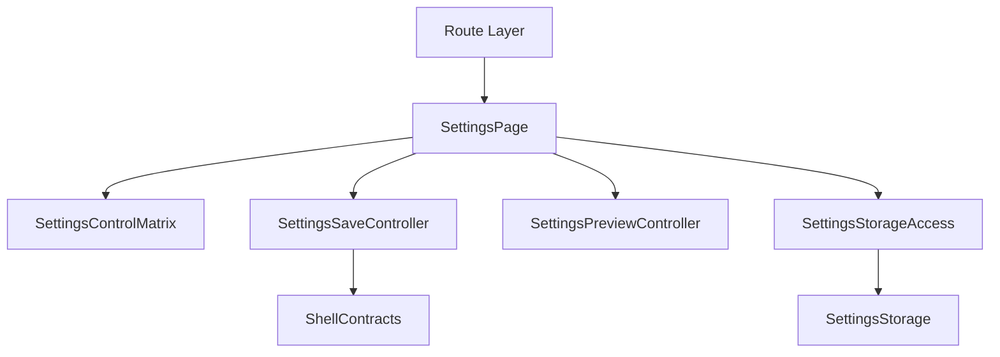
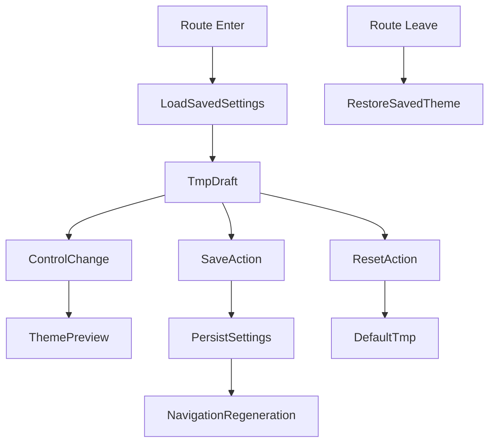

# 設計書: 設定画面

## 概要

この仕様は /settings 画面、control matrix、保存/reset/leave、theme preview、navigation 再生成 の technical design を定める。

**ユーザー**: EPGStation の通常ユーザー、operator、関連 routed screen の実装者。

**影響**: requirements を settings screen component、route/localStorage contract、test strategy に接続し、tasks と実装の境界を曖昧にしない。

### 目標

- requirements の全受け入れ条件を design component と test に追跡可能にする。
- 決定済み React 技術選定を、実 package root `client/` の file plan に対応づける。
- `unittest/spec`、`unittest/imp`、E2E の最小 gate を明記する。

### 非目標

- 隣接 spec が所有する workflow、player lifecycle、settings default/backfill の取り込み。

## 境界の合意

### この仕様が所有するもの

- `/settings` route、設定 card、section/control、保存、リセット、leave 時の未保存破棄、theme preview、保存後 navigation 再生成。
- requirements に明記された route/localStorage/action/snackbar behavior。
- 本 spec 配下の SettingsPage、SettingsControlMatrix、SettingsPreviewController、SettingsSaveController の責務境界。Settings の saved 値は `frontend-settings-storage` の `SettingsStorageRepository` で読み書きし（`lib/settingsStorageAccess.ts` 経由）、`tmp` は `SettingsPage` が React state に持つ。

### 境界外

- settings key/default/backfill の所有、App Shell の navigation 生成結果、各 workflow の詳細挙動。
- 実 URL、実番組名、認証情報、Mirakurun URL、ffmpeg/ffprobe 実 path、環境固有値の tracked docs への記録。

### 許可する依存

- settings key と default は `frontend-settings-storage`、title bar と snackbar 表示領域は `frontend-app-shell` に従う。
- `frontend-settings-storage` の保存済み settings contract と adjacent storage key registry。
- `frontend-app-shell` の shell、title bar slot、edit title bar、snackbar、navigation host。
- hash route compatible router。Settings screen は backend API を直接呼ばない。

### 再検証トリガー

- requirements の受け入れ条件、route/localStorage/action/snackbar 文言、control matrix が変わる。
- `frontend-settings-storage` の field/default/validation/adjacent key default が変わる。
- `frontend-app-shell` の title/snackbar/navigation/edit title bar contract が変わる。

## アーキテクチャ

### アーキテクチャ前提

frontend は React と hash route を前提にし、Settings screen は backend API、dialog、menu を所有せず、hash route compatibility、localStorage contract、observed responsive behavior、snackbar の表示条件を本書の requirements に定義された通りに維持する。

formal design の正本は、この design と同一 spec の requirements、visual-cases、mock-data、ならびに `.kiro/steering/` の project memory とする。矛盾がある場合は同一 spec の requirements と requirements 横断レビューの反映済み判断を優先する。

### アーキテクチャパターンと境界マップ



**アーキテクチャ統合**:
- 選択したパターン: feature boundary + shared typed contracts。
- ドメイン/機能境界: route lifecycle、settings draft、theme preview、save action、storage consumer を feature 内で分離し、settings storage と shell は dependency として参照する。
- 固定するパターン: hash route、settings control order、save/reset/leave behavior、snackbar result、responsive breakpoint。
- Steering 準拠: 設計書は日本語。

### 技術スタック

| レイヤー | 選択 / バージョン | 機能内の役割 | 備考 |
|-------|------------------|-----------------|-------|
| フロントエンド | React / TypeScript / Vite | UI と typed contract | package root は `client/`、package name は `epgstation-client`。 |
| ルーティング | React Router hash route 対応 router | route/query contract | route contract は `/#/...`（hash route）とする。 |
| Server state | TanStack Query | API response cache、loading/error/refetch | Settings screen は backend API を所有しないが、App Shell など隣接 owner の server state は TanStack Query 境界に従う。 |
| Local state | React local state/reducer | screen state と settings draft state | settings draft（`tmp`）は `SettingsPage` の React state に持ち、読み書きは `lib/settingsStorageAccess.ts` が `SettingsStorageRepository` で行う。Zustand は使わない。 |
| UI / CSS | MUI Core + `@mdi/font` + theme token + `*.module.css` | MUI theme に基づく visual contract、responsive | global CSS は `src/index.css` の bootstrap/reset 程度に限定し、visual-cases の geometry/screenshot contract を theme/shared component に接続する。 |
| Form / validation | React Hook Form + Zod | settings form state、save/reset validation、typed settings validation | `frontend-settings-storage` の typed settings contract と Zod validation を form 境界へ接続する。 |
| API client | native `fetch` wrapper + typed request/response validation | backend integration | Settings screen は backend API を所有しない。隣接 owner の API は repository base `./api` と endpoint path を二重結合しない。 |
| Socket.IO | `socket.io-client` | realtime update trigger | Settings screen は Socket.IO subscription を所有しない。 |
| Lint / format / alias | ESLint flat config + typescript-eslint + React Hooks plugin / Prettier / `@/` | static gate と import 解決 | `@/` は Vite / TypeScript / Vitest / ESLint で同一解決規則にする。 |
| Script gate | `build` = Vite production build（`bundle`）、`build:verify` = lint + typecheck + unit test + `build`、`check` = lint + format:check + typecheck + `test:dev-server` + `unittest/spec` + `unittest/imp` | `client/package.json` の scripts | `build:verify` は format check を含めず、`check` が Prettier gate を持つ。 |
| Test / coverage / browser | Vitest + V8 coverage / React Testing Library / Playwright / MSW | `unittest/spec`、`unittest/imp`、E2E、visual regression | 正式検証対象は Desktop Chromium、Desktop Firefox、Android Chrome、iOS Safari。visual は Playwright screenshot assertion と geometry assertion を併用する。 |

## ファイル構成

package root は `client/` である。

### ディレクトリ構成

```text
client/src/
├── app/                    # App Shell, navigation, snackbar, theme
├── features/               # routed feature boundaries
├── shared/                 # settings, typed utilities
└── test/                   # MSW server
```

### ファイル

`client/src/features/settings/` 配下。

- `SettingsPage.tsx` — route root、title、section rendering、保存 / reset、scroll-data completion、離脱時の theme 復元。
- `components/SettingsSection.tsx` — section 見出しと control の並び。switch + text の URL scheme 対を `SettingsSchemeControl` へまとめる。
- `components/SettingsControl.tsx` — switch / select / text control と tmp binding。
- `components/SettingsSchemeControl.tsx` — URL scheme の switch + text の対。
- `components/SettingsControlText.tsx` — control の label と subtitle。
- `lib/settingsControlSupport.ts` — accessible name、select 表示値、表示可否、change handler 型。
- `lib/settingsStorageAccess.ts` — localStorage の読取 / 保存、memory fallback、navigation 再生成 target。
- `settingsControlMatrix.ts` — `SETTINGS_CONTROL_MATRIX` と section / visible / disabled / 表示値 / update / preview theme の解決関数。`settingsControlTypes.ts`（型）、`settingsControlRowsFront.ts`（全般 / 放映中 / 番組表 / 予約 / 録画中）、`settingsControlRowsBack.ts`（録画 / 検索 / ルール / ビデオプレーヤ）、`lib/settingsControlOptions.ts`（range / value option 生成）から組み立てる。
- `settingsLayoutContract.ts` — section 順、card 幅、URL scheme placeholder。
- `settingsPreview.ts` — theme preview、reset / 離脱の復元。
- `settingsSave.ts` — 保存、navigation 再生成 request、snackbar。

test:

- `client/unittest/spec/settingsScreen.bootstrapSave.spec.test.tsx`（route bootstrap と保存）、`settingsScreen.controlMatrixRendering.spec.test.tsx`（control 表の描画）、`settingsScreen.controlMatrixDraft.spec.test.tsx`（tmp 更新と不正値の扱い）、`settingsScreen.themePreview.spec.test.tsx`（reset / theme preview / 離脱）、`settingsScreen.controlInteractions.spec.test.tsx`（control 操作）、`settingsScreen.defensiveGuards.spec.test.tsx`（防御的な guard）。共有 helper は `unittest/spec/support/settingsScreenHelpers.tsx`。
- `client/unittest/imp/settingsScreen.layoutMatrix.imp.test.ts`（layout と control 表の契約）、`settingsScreen.savePreview.imp.test.ts`（保存と preview の契約）、`settingsScreen.liveWebPlaybackSwitch.imp.test.ts`（放映中の web 再生 switch）、`settingsScreen.numericSelectUnitSuffix.imp.test.ts`（数値 select の単位表示）、`settingsStorageAccess.imp.test.ts`（storage access の memory fallback と保存失敗）。
- `client/e2e/settings-screen-workflow.spec.ts`、visual `visual/settings-screen-geometry.spec.ts`。
- 本物の browser の localStorage: `client/e2e/browser-api-parity.spec.ts`（本物の容量の上限での保存の失敗、参照の拒否〈起動時の shell の読み込みが拒否を受け止めないので、直るまで失敗を期待する〉、古い client が保存した設定の読み込みと保存）。

## システムフロー



Settings screen は backend API、search query、dialog/menu state を持たない。全 control は `tmp` を更新し、保存 action では storage save が成功したときにだけ navigation regeneration request と `保存されました ` snackbar を実行する。失敗時は error snackbar `設定の保存に失敗しました` を出し、再生成は要求しない。

## 要件トレーサビリティ

| 要件 | 概要 | コンポーネント | インターフェース | フロー |
|-------------|---------|------------|------------|-------|
| 1.1-1.21 | route と画面構成 | SettingsPage, SettingsControlMatrix, SettingsPreviewController, SettingsSaveController | State / Service | route/action flow |
| 2.1-2.11 | 一時編集と保存 | SettingsPage, SettingsControlMatrix, SettingsPreviewController, SettingsSaveController | State / Service | draft save flow |
| 3.1-3.7 | reset と theme preview | SettingsPage, SettingsControlMatrix, SettingsPreviewController, SettingsSaveController | State / Service | reset/preview/leave flow |
| 4.1-4.3 | dark theme coverage | SettingsPage, SettingsControlMatrix | State | route/action flow |

## コンポーネントとインターフェース

| コンポーネント | ドメイン/レイヤー | 意図 | 要件カバレッジ | 主な依存 | 契約 |
|-----------|--------------|--------|--------------|------------------|-----------|
| SettingsPage | Feature UI | `/settings` route、title、section rendering、scroll completion、leave cleanup を扱う。 | 1.1-1.21, 2.1-2.11, 3.1-3.7 | App Shell title/snackbar | 状態管理 |
| SettingsControlMatrix | Feature Config | section/key/control/options/range/visible/disabled/tmp target を固定する。 | 1.1-1.21, 2.1-2.4, 3.1-3.5 | SettingsValue schema | 状態管理 |
| SettingsPreviewController | Feature State | theme preview、reset rollback、leave rollback を扱う。 | 2.1-2.3, 3.1-3.7 | Color theme state / settings draft | 状態管理 |
| SettingsSaveController | Feature Service | save、navigation regeneration request、snackbar を扱う。 | 2.4-2.7, 3.6, 3.7 | SettingsStorageRepository / App Shell | Service |

### 設定ページ（SettingsPage）

| 項目 | 詳細 |
|-------|--------|
| 意図 | Settings screen の route lifecycle と UI composition を保持する。 |
| 要件 | 1.1-1.21, 2.1-2.11, 3.1-3.7 |

**責務と制約**
- backend API、loading/error fetch state、dialog/menu state を持たない。
- route enter で saved settings を tmp に読み、route leave/destroy で tmp と theme を保存済み状態へ戻す。
- title/snackbar/navigation regeneration は App Shell contract へ typed request として渡す。
- control matrix は単一の centered settings card に配置し、desktop max width 800px を layout owner contract とする。section ごとの独立 card、nested cards、dashboard-style multi-column layout は採用しない。
- select control は MUI `TextField select` / `Select` を使用し、theme、focus-visible、keyboard operation、screen reader name を維持する。styled display 用要素と browser-default select を分離した透明 overlay 実装、MUI native-select variant、browser default select は禁止する。
- Settings の select menu/listbox は 最大 4.5 item 分、216px を超えない。select control は owner width を変更せず、control matrix の幅は既存 CSS が決定する。

### 設定コントロール表（SettingsControlMatrix）

| 項目 | 詳細 |
|-------|--------|
| 意図 | Settings UI の全 control を implementation-independent table として固定する。 |
| 要件 | 1.1-1.21, 2.1-2.4, 3.1-3.5 |

**責務と制約**
- matrix の key は `SettingsValue` schema に存在する。
- option/range/visible/disabled は `Feature-Specific Decisions` の matrix を正とする。
- validation error snackbar は持たない。保存済み既存 field の範囲外値は settings-storage が読み込み時に補正しない。Settings screen は UI control から保存される値だけを許容範囲に制限する。
- select control の visual label と accessible name は一致させ、`combobox` が Playwright / Testing Library で `getByRole('combobox', { name })` により取得できる状態を contract とする。

### 設定プレビュー制御（SettingsPreviewController）

| 項目 | 詳細 |
|-------|--------|
| 意図 | theme controls の immediate preview と rollback を扱う。 |
| 要件 | 2.1-2.3, 3.1-3.7 |

**責務と制約**
- OS theme switch と manual dark switch は tmp と表示 theme を即時更新する。
- reset/leave は保存済み settings 由来の theme へ戻す。

### 設定保存制御（SettingsSaveController）

| 項目 | 詳細 |
|-------|--------|
| 意図 | 保存 action の永続化、navigation regeneration request、snackbar を順序どおり実行する。 |
| 要件 | 2.4-2.7, 3.6, 3.7 |

**責務と制約**
- storage save が成功した後に App Shell へ navigation regeneration request を送る。storage save は例外を caller へ伝播せず結果（`ok`）を返すので、Settings screen は `ok: false` のとき error snackbar `設定の保存に失敗しました` を表示し、navigation regeneration request は送らない（v2 は書込に失敗しても `保存されました` を出していたが、失敗を正しく知らせる）。rollback path は持たない。
- success snackbar は `保存されました `、失敗 snackbar は `設定の保存に失敗しました`（severity `error`）。settings-specific validation error snackbar と rollback path は持たない。

### API 契約

この表の endpoint は frontend repository contract であり、`./api` の base path は含めない。決定済み native `fetch` wrapper に基づいて API client を作る場合も base path と endpoint path を二重に結合しない。

| メソッド | エンドポイント | リクエスト | レスポンス | エラー |
|--------|----------|---------|----------|--------|
| なし | なし | なし | なし | API を直接所有しない |

### 共有型契約

```typescript
type FeatureResult<T, E extends string> =
  | { ok: true; value: T }
  | { ok: false; error: E; message: string };

interface RouteBuildResult {
  path: string;
  query: Record<string, string>;
}

interface SnackbarRequest {
  text: string;
  color?: 'normal' | 'success' | 'info' | 'error';
  timeout?: number;
}
```

## 機能固有の設計判断

### 設定コントロール表

Settings screen は backend API を呼ばない。全 control は `SettingsPage` が持つ `tmp` を編集し、保存 action まで `settings` localStorage へ永続化しない。

| セクション | ラベル | 設定キー | コントロール | 選択肢 / 範囲 | 表示 / 無効条件 | tmp 反映先 |
| --- | --- | --- | --- | --- | --- | --- |
| 全般 | PWA | `isEnablePWA` | switch | boolean | always | `tmp.isEnablePWA` |
| 全般 | OSカラーテーマ | `shouldUseOSColorTheme` | switch | boolean | always | `tmp.shouldUseOSColorTheme`; true へ変更した場合は OS-derived dark state を `tmp.isForceDarkTheme` と preview theme にも反映 |
| 全般 | ダークテーマ | `isForceDarkTheme` | switch | boolean | disabled when `tmp.shouldUseOSColorTheme=true` | `tmp.isForceDarkTheme` + preview |
| 全般 | 半角表示 | `isHalfWidthDisplayed` | switch | boolean | always | `tmp.isHalfWidthDisplayed` |
| 放映中 | 放送波種別表示 | `isOnAirTabListView` | switch | boolean | always | `tmp.isOnAirTabListView` |
| 放映中 | web での再生を優先する | `isPreferredPlayingLiveM2TSOnWeb` | switch | boolean | mpegts.js 対応時のみ表示 | `tmp.isPreferredPlayingLiveM2TSOnWeb` |
| 放映中 | 視聴 URL Scheme | `onAirM2TSViewURLScheme` | text | string/null | always | `tmp.onAirM2TSViewURLScheme` に入力値をそのまま保持する |
| 番組表 | 描画設定 | `guideMode` | select | `逐次 `=`sequential` / `最小 `=`minimum` / `すべて `=`all` | always | `tmp.guideMode` |
| 番組表 | 表示時間 | `guideLength` | select | 1-24 | always | `tmp.guideLength` |
| 番組表 | ダークテーマの配色を無効化する | `isForceDisableDarkThemeForGuide` | switch | boolean | 現在 preview 中の表示 theme が light のとき disabled | `tmp.isForceDisableDarkThemeForGuide` |
| 番組表 | 無料放送だけ表示する | `isShowOnlyFreePrograms` | switch | boolean | always | `tmp.isShowOnlyFreePrograms` |
| 番組表 | 放送波種別表示 | `isEnableDisplayForEachBroadcastWave` | switch | boolean | always | `tmp.isEnableDisplayForEachBroadcastWave` |
| 番組表 | 検索時に放送局情報を含むか | `isIncludeChannelIdWhenSearching` | switch | boolean | always | `tmp.isIncludeChannelIdWhenSearching` |
| 番組表 | 検索時にジャンル情報を含むか | `isIncludeGenreWhenSearching` | switch | boolean | always | `tmp.isIncludeGenreWhenSearching` |
| 予約 | 表示件数 | `reservesLength` | select | 1-100 | always | `tmp.reservesLength` |
| 録画中 | 表示件数 | `recordingLength` | select | 1-100 | always | `tmp.recordingLength` |
| 録画 | 表示件数 | `recordedLength` | select | 1-100 | always | `tmp.recordedLength` |
| 録画 | テーブル表示 | `isShowTableMode` | switch | boolean | always | `tmp.isShowTableMode` |
| 録画 | ドロップ情報を表示する | `isShowDropInfoInsteadOfDescription` | switch | boolean | always | `tmp.isShowDropInfoInsteadOfDescription` |
| 録画 | 削除時のチェックを入れるか | `deleteRecordedDefaultValue` | switch | boolean | always | `tmp.deleteRecordedDefaultValue` |
| 録画 | web での再生を優先する | `isPreferredPlayingOnWeb` | switch | boolean | always | `tmp.isPreferredPlayingOnWeb` |
| 録画 | 視聴 URL Scheme | `shouldUseRecordedViewURLScheme` / `recordedViewURLScheme` | switch + text | boolean + string/null | always | switch は `tmp.shouldUseRecordedViewURLScheme`、text は `tmp.recordedViewURLScheme` に入力値をそのまま保持する |
| 録画 | ダウンロード URL Scheme | `shouldUseRecordedDownloadURLScheme` / `recordedDownloadURLScheme` | switch + text | boolean + string/null | always | switch は `tmp.shouldUseRecordedDownloadURLScheme`、text は `tmp.recordedDownloadURLScheme` に入力値をそのまま保持する |
| 検索 | 最大表示件数 | `searchLength` | select | 50-600 step 50 | always | `tmp.searchLength` |
| 検索 | 自動スクロール | `isEnableAutoScrollWhenEditingRule` | switch | boolean | always | `tmp.isEnableAutoScrollWhenEditingRule`。保存後の値は `/search?rule=<ruleId>` の EPG rule edit 初期自動検索だけが参照し、manual search / query-driven search / time-specified rule edit / history restoration / 検索結果 header link には影響しない。 |
| 検索 | 自動サブディレクトリ設定 | `isEnableCopyKeywordToDirectory` | switch | boolean | always | `tmp.isEnableCopyKeywordToDirectory` |
| 検索 | 録画済み番組を排除 | `isCheckAvoidDuplicate` | switch | boolean | always | `tmp.isCheckAvoidDuplicate` |
| 検索 | エンコードの自動設定 | `isEnableEncodingSettingWhenCreateRule` | switch | boolean | always | `tmp.isEnableEncodingSettingWhenCreateRule` |
| 検索 | 元ファイルの自動削除 | `isCheckDeleteOriginalAfterEncode` | switch | boolean | always | `tmp.isCheckDeleteOriginalAfterEncode` |
| ルール | 表示件数 | `rulesLength` | select | 1-100 | always | `tmp.rulesLength` |
| ビデオプレーヤ | 字幕の縁取りを強制する | `isForceEnableSubtitleStroke` | switch | boolean | always | `tmp.isForceEnableSubtitleStroke` |

### 既存不正値の表示規則

`frontend-settings-storage` は保存 raw の不正値を read 時に書き戻さない。画面が `tmp` に使う consumer `value` では、型が default と違う field は default になり、`guideMode` の任意の string と範囲外の数値は保持される。そのため Settings screen は、select control が選択肢に存在しない値を受け取る可能性を前提にする。

- select control は選択肢に存在しない値を空表示（隠し fallback item の `value=""`）として扱うが、ユーザー操作が発生するまで `tmp` の既存値を自動上書きしない。
- ユーザーが select control を操作した場合だけ、当該 control の許容範囲内の値を `tmp` に保存する。
- switch の `tmp` は consumer `value` 由来なので常に boolean である。ユーザー操作時に boolean として `tmp` に保存する。
- text control の empty string はそのまま `tmp` に保持し、storage save 時にも `null` へ正規化しない。consumer は empty string と `null` を fallback 扱いにする。

### 保存 / リセット / 離脱状態機械

- route enter: saved settings を `tmp` へ copy し、OS color theme 判定が `tmp.isForceDarkTheme` と表示 theme を更新しうる。scroll-data completion を通知する。backend fetch、loading indicator、settings-specific error snackbar は存在しない。
- control change: `tmp` のみ更新する。theme controls は preview として color theme state も即時更新する。
- `保存 `: `tmp` を `settings` localStorage へ保存する処理が成功した後、App Shell へ navigation regeneration request を発行し、`保存されました ` snackbar を表示する。失敗した場合は navigation regeneration request も `保存されました ` も行わず、error snackbar `設定の保存に失敗しました` を表示する。storage save failure は caller へ例外伝播せず結果で返る。
- `リセット `: `tmp` を default settings object に置換する。localStorage には保存しない。表示 theme は保存済み settings 由来へ戻す。
- route leave / destroyed: 未保存 `tmp` を破棄し、保存済み settings から `tmp` と表示 theme を復元する。
- navigation item の生成条件や label は `frontend-app-shell` が所有する。Settings は保存が成功した後の再生成要求だけを所有する。

## データモデル

- `SettingsControlDefinition`: `{ section, label, key, controlType, options, range, visibleWhen, disabledWhen, tmpTarget }` を持つ。全 key は `frontend-settings-storage` の `SettingsValue` に存在する。
- `SettingsScreenState`: `{ tmp, savedSnapshot, previewTheme, isDirty }`。dirty 表示は user-facing requirement ではないため、保存/leave 判定の内部状態に限定する。
- `NavigationRegenerationRequest`: save が成功した後に発行する command。App Shell が server config と saved settings を読んで item を再生成する。

## エラーハンドリング

- validation は route/query/form/API/localStorage の境界で行う。
- snackbar 文言は requirements に定義された文言を優先する。
- no-op、blank presentation、controlled error の選択は requirements を正とする。
- stale research と formal requirements が矛盾する場合は formal requirements を正とする。

## テスト戦略

unit test は `npm run coverage:gate` で statements・branches・functions・lines の 4 指標 100% を要求する。unit test は `unittest/spec` と `unittest/imp` の 2 種類を持ち、片方で他方を代替しない。E2E と visual は release-preflight の client-browser step で実ブラウザーに流す。hosted CI（`client.yml`）は lint・typecheck・format check だけを行う。

- `unittest/spec`: user-visible behavior、route lifecycle、control matrix、状態遷移、snackbar 表示条件を requirements ID に紐づけて検証する。
- `unittest/imp`: settings draft reducer、theme preview、save/reset/leave state machine、storage consumer adapter の分岐と edge case を検証する。
- E2E: deterministic mock data で Settings route 表示、control 操作、save/reset/leave、responsive、backend API/dialog/menu を持たないことを確認する。

### Visual Regression 契約

この feature の詳細 layout は、本文の Settings control matrix / theme preview contract と `visual-cases.md` の visual cases、`mock-data.md` の synthetic dataset contract を合わせて正本とする。

`visual-cases.md` は screenshot / geometry / interaction test の撮影条件を定義する。`mock-data.md` は visual cases で使う synthetic settings object、invalid existing values、theme preview、edited tmp fixture 条件を定義する。

Settings Screen は `/settings` の visual owner であり、`frontend-settings-storage` は storage contract だけを所有する。Settings visual fixture は backend API response を持たず、URL scheme control には placeholder だけを使う。Settings visual cases は単一の centered settings card、desktop max width 800px、section order `全般 ` から `ビデオプレーヤ `、mobile 1 column を正とする。tracked artifact には実 URL、実 host、認証情報、Mirakurun URL、ffmpeg / ffprobe 実 path、環境固有値を含めない。

### Visual Implementation Contract

Settings page は single centered card を使い、desktop max width `800px`、mobile width `100%`、container padding は desktop `12px 0` / mobile `12px` とする。card 自体に内側 padding は持たせず、section は `16px 16px 17.5px` 相当の padding と bottom divider を持つ。Section title は  20px/24px/500、control label は 16px/19.2px、helper text は 14px/16px textSecondary とする。

Select、text input、switch、checkbox、slider、number input は MUI density standard を使い、height を viewport 幅で変えない。Settings select は MUI TextField select / Select を使い、CSS module の透明 native select と表示用 overlay の組み合わせを禁止する。Settings select の右端 icon は MUI Select icon だけを表示し、CSS module の `::before` / `::after` や追加 span で下三角を重ねてはならない。表示値は  compact 表示に合わせて `時間 ` / `件 ` suffix を表示面から省略してよいが、開いた listbox item は実ラベルを表示し、Android/iOS でも先頭に空白の選択不能 item を見せない。許容値外の保存済み値は hidden fallback item で空表示にし、route 表示だけで storage を補正しない。Custom switch は thumb の `background-color` / `transform`、track の `background-color` がいずれも `150ms ease` で変化し、checked / unchecked の切替が瞬時ではなく滑らかに見えることを正とする。Long URL scheme placeholder は input 内で overflow hidden または horizontal scroll にし、page horizontal overflow を出さない。URL Scheme text control の placeholder `URL` は native input placeholder として未入力時だけ表示し、入力済み状態では非表示にして入力文字列と重ねない。放映中、録画視聴、録画ダウンロードの 3 種は同一の native placeholder 実装とし、別要素の fake placeholder を絶対配置しない。URL Scheme text control は non-empty かつ enabled の場合に field 右端の clear button を表示し、押下で該当 text value だけを empty string に戻す。clear button は `bottom: 0` や fixed `top` px で行下端/row 全体へ固定せず、input と同一 grid cell に重ね、input underline の縦中央へ揃える。Save/reset action row は card 内末尾に置き、padding `8px`、button hit area min height `36px`、text button 表示、reset は default text color、save は primary text color とする。card 後続へ不可視 dummy/spacer を置き、Settings 画面の下端に余白を残す。

Theme preview は `tmp` value を App Shell token に即時反映し、Settings card、section title、helper text、input/select、icon/adornment、snackbar が同じ frame で切り替わる。dark theme では select の開閉 icon を `rgb(255 255 255 / 70%)`（`textSecondary` 相当）、disabled control を `textDisabled` で描き、background と同化しない。navigation icon は App Shell が持つ。

Settings select は MUI `TextField select` と `appSelectMenuProps` を必ず使い、dark theme では `.MuiSelect-select`、`.MuiSelect-icon`、underline before/after が text/icon/focus token を使う。CSS module の `.selectDisplay` は layout 補助に限定し、visible option や arrow を二重描画してはならない。URL Scheme clear button は text row / scheme row の個別 fixed top を持たせず、input と同じ wrapper/grid cell で配置し、放映中/録画視聴/録画ダウンロードの 3 field すべてで input underline の縦中央に揃える。

### 機能テストケース

- control matrix の全 key、section order、option/range、disabled/visible 条件を検証する。
- 検索 section の `自動スクロール ` switch は保存後に `isEnableAutoScrollWhenEditingRule` として永続化され、Search Rule feature の EPG rule edit 初期自動検索だけに反映されることを integration test で検証する。
- OS theme on/off、manual dark preview、reset、leave rollback の状態遷移を検証する。
- 保存が成功したときに navigation regeneration request と `保存されました ` snackbar が発行され、失敗したときは request が発行されず `設定の保存に失敗しました` の error snackbar だけが表示されることを検証する。
- backend API、dialog/menu、settings-specific validation error snackbar を作らないこと（保存の成功と失敗の snackbar は作る）を E2E と spec test で確認する。

## セキュリティとプライバシー

- tracked docs、test fixture、snapshot に実 URL、実番組名、認証情報、Mirakurun URL、ffmpeg/ffprobe 実 path、環境固有値を書かない。
- Playwright の基準画像（`client/visual/*-snapshots/`・`client/e2e/*-snapshots/`。synthetic data だけを写す）は追跡する。test 実行時の出力と実機の撮影結果は追跡しない（`client/test-results`、`client/device/artifacts/` は ignore 済み）。
- E2E は実データではなく controlled mock data を使う。

## 性能とアクセシビリティ

- list/grid/dialog は stable dimensions と responsive constraints を持ち、text overlap と layout shift を避ける。
- menu button、dialog button、item action button は keyboard focus と accessible name を持つ。
- heavy rendering、stream、upload、dialog timer は route leave または close 時に cleanup する。

## リスクと緩和策

- 技術選定は `.kiro/steering/tech.md` と `.kiro/steering/testing.md` を参照し、`client/` の package root、scripts、dependencies と一致させる。
- requirements が変更された場合、traceability と task boundary を再確認する。
- Settings screen は dialog を所有しない。dialog body が必要な場合は該当 screen spec で mock API または validation config を使う。
