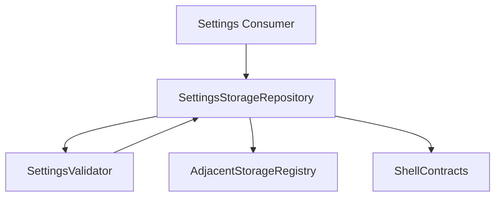
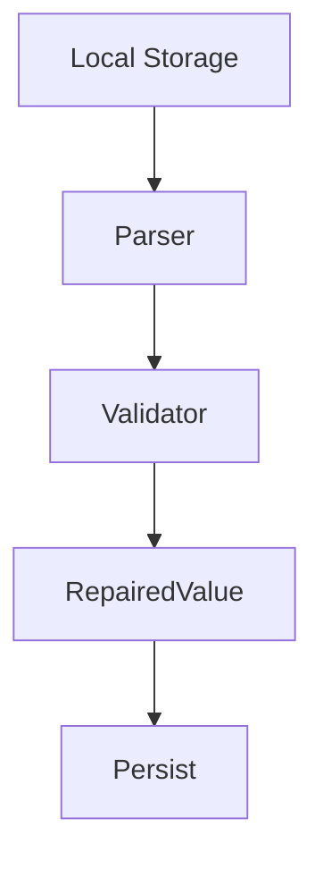

# 設計書: 設定ストレージ契約

## 概要

この仕様は localStorage settings contract、default、補完、validation、隣接 workflow storage key の technical design を定める。

**ユーザー**: EPGStation の通常ユーザー、operator、関連 routed screen の実装者。

**影響**: requirements を settings storage component、localStorage contract、test strategy に接続し、実装境界を曖昧にしない。

### 目標

- requirements の全受け入れ条件を design component と test に追跡可能にする。
- 決定済み React 技術選定を、実 package root `client/` の file plan に対応づける。
- `unittest/spec`、`unittest/imp`、E2E の最小 gate を明記する。

### 非目標

- 隣接 spec が所有する workflow、player lifecycle、settings default/backfill の取り込み。
- `/settings` 画面の control placement、snackbar placement、navigation regeneration visual、write failure snackbar の所有。

## 境界の合意

### この仕様が所有するもの

- `settings` localStorage key、JSON 保存形式、default value、platform-dependent default、missing storage / missing field の補完、`tmp` 一時値、保存、reset、隣接 workflow storage key の存在。
- requirements に明記された localStorage key/default/backfill/validation behavior。
- 本 spec 配下の SettingsStorageRepository、SettingsValidator、AdjacentStorageRegistry の責務境界。

### 境界外

- `/settings` 画面の visual layout、App Shell の navigation item 生成結果、Guide / Recorded / Video など各 feature の詳細挙動。
- 実 URL、実番組名、認証情報、Mirakurun URL、ffmpeg/ffprobe 実 path、環境固有値の tracked docs への記録。

### 許可する依存

- Settings 画面はこの contract を編集する UI として扱う。App Shell、Guide、Search、Recorded、Video などはこの contract の保存済み値を読む consumer として扱う。
- Browser localStorage と user agent/platform 判定。
- consumer specs は本 spec が export する typed settings contract だけを参照する。
- consumer visual generation は `visual-cases.md` の契約 case と `mock-data.md` の `settingsStorageStateMatrix` / `adjacentStorageFixtures` を参照する。

### 再検証トリガー

- requirements の受け入れ条件、settings schema、adjacent storage key、localStorage repair behavior が変わる。
- `frontend-settings-storage` の field/default/validation/adjacent key default が変わる。
- `frontend-app-shell` の title/snackbar/navigation/edit title bar contract が変わる。

## アーキテクチャ

### アーキテクチャ前提

frontend は React と hash route を前提にし、この spec は hash route や backend API を所有せず、localStorage contract と consumer-facing typed settings の一貫性を保つ。

formal design の正本は、この design と同一 spec の requirements、visual-cases、mock-data、ならびに `.kiro/steering/` の project memory とする。矛盾がある場合は同一 spec の requirements と requirements 横断レビューの反映済み判断を優先する。

### アーキテクチャパターンと境界マップ



**アーキテクチャ統合**:
- 選択したパターン: feature boundary + shared typed contracts。
- ドメイン/機能境界: storage/validation/default/draft/consumer adapter を分離し、routed screen は consumer として参照する。
- 固定するパターン: localStorage key spelling、default/backfill、adjacent storage key compatibility。
- Steering 準拠: 設計書は日本語。

### 技術スタック

| レイヤー | 選択 / バージョン | 機能内の役割 | 備考 |
|-------|------------------|-----------------|-------|
| フロントエンド | React / TypeScript / Vite | typed settings contract | package root は `client/`、package name は `epgstation-client`。 |
| ルーティング | なし | storage contract は route/query を所有しない | routed screen は React Router hash route 対応 router の consumer として別 spec が扱う。 |
| Server state | TanStack Query | API response cache、loading/error/refetch | Settings Storage は backend API を所有せず、server state を持たない。consumer spec の server state は TanStack Query 境界に従う。 |
| Local state | React local state/reducer | settings value、settings draft、localStorage repair state | Settings 画面は `tmp`（settings draft）を `SettingsPage` の React state に持ち、読み書きは `client/src/features/settings/lib/settingsStorageAccess.ts` が `SettingsStorageRepository` で行う（保存は `persistSettingsTmp`）。Zustand は使わない。 |
| UI / CSS | MUI Core + `@mdi/font` + theme token + `*.module.css` | consumer 向け visual contract | Settings Storage 自体は visual layout を所有しないが、consumer visual-cases の geometry/screenshot contract は theme/shared component に接続する。 |
| Form / validation | React Hook Form + Zod | typed settings validation、consumer form validation | Zod schema を settings contract validation の境界とし、Settings screen の React Hook Form が consumer になる。 |
| API client | native `fetch` wrapper + typed request/response validation | backend integration | Settings Storage は backend REST API を所有しない。consumer API は repository base `./api` と endpoint path を二重結合しない。 |
| Socket.IO | `socket.io-client` | realtime update trigger | Settings Storage は Socket.IO subscription を所有しない。 |
| Lint / format / alias | ESLint flat config + typescript-eslint + React Hooks plugin / Prettier / `@/` | static gate と import 解決 | `@/` は Vite / TypeScript / Vitest / ESLint で同一解決規則にする。 |
| Script gate | `build` = Vite production build（`bundle`）、`build:verify` = lint + typecheck + unit test + `build`、`check` = lint + format:check + typecheck + `test:dev-server` + `unittest/spec` + `unittest/imp` | `client/package.json` の scripts | `build:verify` は format check を含めず、`check` が Prettier gate を持つ。 |
| Test / coverage / browser | Vitest + V8 coverage / React Testing Library / Playwright / MSW | `unittest/spec`、`unittest/imp`、E2E、visual regression | 正式検証対象は Desktop Chromium、Desktop Firefox、Android Chrome、iOS Safari。visual は Playwright screenshot assertion と geometry assertion を併用する。 |

## ファイル構成

package root は `client/` である。

### ディレクトリ構成

```text
client/src/
├── app/                    # shell consumer。storage contract 自体は所有しない
├── features/               # routed feature boundaries。storage contract 自体は所有しない
├── shared/                 # settings storage, typed utilities
└── test/                   # MSW server
```

### ファイル

- `client/src/shared/settings/settingsTypes.ts` — `SettingsValue`、`GuideViewMode`、adjacent key 型を定義する。
- `client/src/shared/settings/defaultSettings.ts` — platform input から default settings object を生成する。
- `client/src/shared/settings/settingsValidation.ts` — parse failure、missing storage、missing field の backfill と補正結果を返す。保存 raw の不正値の補正は intentional fix が別途定義された field だけに限定する。consumer `value` では、型が default と違う field を default にする（`guideMode` の任意の string と範囲外の数値は保持）。
- `client/src/shared/settings/settingsStorage.ts` — `settings` localStorage read/write、missing storage、parse failure fallback、repair persist を扱う。
- `client/src/shared/settings/platformDefaultSettings.ts` — navigator から `DefaultSettingsInput`（`isIOS` / `isAndroid`）を作る。
- `client/src/shared/settings/settingsUiContract.ts` — Settings 画面が使う UI 許容値の contract を公開する。
- `client/src/shared/settings/urlScheme.ts`、`urlSchemePlatform.ts` — URL scheme の placeholder replacement と platform 判定の共通 helper。
- `client/src/shared/settings/index.ts` — 公開 export。
- `client/src/shared/settings/__fixtures__/settingsStorageFixtures.ts` — 共有 fixture。
- `client/src/app/settingsStorageAdapter.ts` — App Shell が theme と navigation の設定を読む adapter。
- `client/src/shared/settings/adjacentStorageRegistry.ts` — adjacent workflow storage key の default compatibility contract を集約する。
- `client/unittest/spec/settingsStorage.contract.spec.test.ts`（storage と default の契約）、`settingsStorage.adjacent.spec.test.ts`（adjacent key と synthetic fixture）— unittest/spec。
- `client/unittest/imp/settingsStorage.repository.imp.test.ts`（repository の実装境界）、`settingsStorage.registryUrlScheme.imp.test.ts`（registry、URL scheme、fixture 安全性）— unittest/imp。共有 fixture は `client/src/shared/settings/__fixtures__/settingsStorageFixtures.ts`（state matrix と adjacent key）、storage の例外と書込失敗の stub は `client/unittest/imp/support/settingsStorageFixtures.ts`。

## システムフロー



Storage contract は routed screen ではない。API repository、dialog coordinator、route query parser を持たず、localStorage boundary だけを扱う。

## 要件トレーサビリティ

| 要件 | 概要 | コンポーネント | インターフェース | フロー |
|-------------|---------|------------|------------|-------|
| 1.1-1.10 | Settings storage key と保存形式 | SettingsStorageRepository, SettingsValidator, DefaultSettingsFactory | State / Service | localStorage load/save/repair flow |
| 2.1, 2.2, 2.3, 2.4, 2.5, 2.6, 2.7, 2.8 | 一時値、保存、reset | SettingsStorageRepository, SettingsValidator, Settings 画面の下書き | State / Service | draft save/reset/restore flow |
| 3.1-3.8 | 全般と theme settings | DefaultSettingsFactory, SettingsValidator | State / Service | settings value consumer flow |
| 4.1-4.8 | 放映中と live playback settings | SettingsStorageRepository, SettingsValidator, AdjacentStorageRegistry, URL scheme helper（`urlScheme.ts`） | State / Service | settings value consumer flow |
| 5.1, 5.2, 5.3, 5.4, 5.5, 5.6, 5.7, 5.8, 5.9, 5.10, 5.11, 5.12 | Guide settings | SettingsStorageRepository, SettingsValidator, AdjacentStorageRegistry | State / Service | settings value consumer flow |
| 6.1, 6.2, 6.3, 6.4, 6.5, 6.6, 6.7 | List page size と Recorded display settings | SettingsStorageRepository, SettingsValidator, AdjacentStorageRegistry | State / Service | settings value consumer flow |
| 7.1, 7.2, 7.3, 7.4, 7.5, 7.6, 7.7, 7.8 | Recorded playback URL scheme settings | SettingsStorageRepository, SettingsValidator, AdjacentStorageRegistry | State / Service | settings value consumer flow |
| 8.1, 8.2, 8.3, 8.4, 8.5, 8.6, 8.7, 8.8, 8.9, 8.10, 8.11 | Search / Rule / Video player settings | SettingsStorageRepository, SettingsValidator, AdjacentStorageRegistry | State / Service | settings value consumer flow |
| 9.1-9.13 | 隣接 workflow storage key | AdjacentStorageRegistry, DefaultSettingsFactory | State / Service | adjacent key default compatibility flow |

## コンポーネントとインターフェース

| コンポーネント | ドメイン/レイヤー | 意図 | 要件カバレッジ | 主な依存 | 契約 |
|-----------|--------------|--------|--------------|------------------|-----------|
| SettingsStorageRepository | Shared Storage | `settings` localStorage の read/write、missing storage、repair persist を扱う。 | 1.1-1.10, 2.1-2.8 | Browser localStorage | State / Service |
| DefaultSettingsFactory | Shared Config | platform-dependent default settings object を生成する。 | 3.1-3.8, 4.1-4.7, 5.1-5.12, 6.1-6.7, 7.1-7.8, 8.1-8.11 | user agent platform input | Service |
| SettingsValidator | Shared Validation | unknown JSON を `SettingsValue` へ narrow し、parse failure、missing storage、missing field を補正する。保存 raw の不正値の補正は intentional fix がある場合だけ扱い、consumer `value` では型が default と違う field を default にする（`guideMode` の任意の string と範囲外の数値は保持）。 | 1.1-1.10 | default settings schema | Service |
| AdjacentStorageRegistry | Shared Storage | adjacent workflow storage key の key existence、default shape、spelling の compatibility contract だけを固定する。詳細利用と validation は workflow owner spec に委譲する。 | 9.1, 9.2, 9.3, 9.4, 9.5, 9.6, 9.7, 9.8, 9.9, 9.10, 9.11, 9.12, 9.13 | workflow owner specs | 状態管理 |

### 設定ストレージリポジトリ（SettingsStorageRepository）

| 項目 | 詳細 |
|-------|--------|
| 意図 | `settings` localStorage の source of truth を安全に読み書きする。 |
| 要件 | 1.1-1.10, 2.1-2.8 |

**責務と制約**
- `settings` key だけを所有し、routed screen、backend API、dialog/menu UI を持たない。
- parse failure、missing storage、missing field は `SettingsValidator` の repair result に従って保存し直す。保存 raw の不正値の補正は intentional fix が明記された field だけに限定する。consumer `value` では、型が default と違う field を default にする（`guideMode` の任意の string と範囲外の数値は保持）。
- write failure は caller へ例外を伝播しない。storage operation は失敗を application 全体の停止にしない。navigation regeneration と `保存されました` snackbar は Settings screen / App Shell 側の user-facing contract であり、storage owner は文言や表示を所有しない。

### 設定バリデーター（SettingsValidator）

| 項目 | 詳細 |
|-------|--------|
| 意図 | default schema、platform default、field validation/backfill を固定する。 |
| 要件 | 1.1-1.10, 3.1-8.9 |

**責務と制約**
- `any` を使わず `unknown` を field ごとに narrow する。
- 保存 raw の boolean / enum / numeric range の不正値の補正は missing field backfill とは別扱いとし、intentional fix が明記された field だけで行う。consumer `value` では、型が default と違う field を default にする（`guideMode` の任意の string と範囲外の数値は保持）。
- unknown additional field は requirements 外として consumer contract に含めないが、storage read/write では削除せず保持してよい。

### 設定画面の下書き（`SettingsPage` の React state）

| 項目 | 詳細 |
|-------|--------|
| 意図 | saved value と temporary edit value `tmp` を分離する。実装は Settings 画面側（`client/src/features/settings/SettingsPage.tsx` と `lib/settingsStorageAccess.ts`）にあり、受け入れ条件の追跡先は `client/unittest/spec/settingsScreen.*` の test である。 |
| 要件 | 2.1-2.8, 3.2, 3.3, 3.6, 3.7 |

**責務と制約**
- control change は `tmp` だけを更新する。
- save は `tmp` を repository へ persist する。repository は保存済み JSON を読み、追加 field を削除せず書き戻し、型不一致のため consumer value が default になっている field は `tmp` の値が default のままなら保存済み値を残す（`tmp` で変更された field だけを上書きする。v2 は保存済み値そのものを `tmp` として書き戻すため同じ結果になる）。ただし reset の後の保存は `tmp` だけを書き（保存済みの追加 field と型不一致の値は残らない）、これも v2（reset が `tmp` を default に置き換え、保存が `tmp` だけを書く）と同じ結果になる。repository の `save` は、この場合を `discardStored` option で区別する。
- reset は `tmp` を default に置換し（以後、保存または leave までの保存は `discardStored` で行う）、leave は saved value から `tmp` を復元する。
- theme preview は `tmp` と別の表示状態を持つ。reset では `tmp` を default へ置換しても表示 theme は saved settings を参照し続け、leave では `tmp` と表示 theme の両方を saved settings へ戻す。

### 隣接ストレージレジストリ（AdjacentStorageRegistry）

| 項目 | 詳細 |
|-------|--------|
| 意図 | settings へ吸収しない workflow-local storage key の compatibility default を固定する。 |
| 要件 | 9.1-9.13 |

**責務と制約**
- key existence/default shape/spelling だけを所有する。
- operation timing、dialog state、validation UI は各 workflow owner spec が所有する。

### 共有型契約

```typescript
interface SettingsLoadResult {
  value: SettingsValue;
  raw: SettingsRawObject;
  repaired: boolean;
  persisted: boolean;
}
```

## 機能固有の設計判断

### 設定 schema と既定値

`settings` localStorage value は次の field を必須 contract とする。missing storage ではこの default object を即時保存し、missing field は default で補完して保存する。

| Key | Type | Default | Validation / Notes |
| --- | --- | --- | --- |
| `isEnablePWA` | boolean | `true` | missing field のみ default で補完する。既存 field の型不一致は、保存 raw では保持し、consumer に渡す `value` では default にする。 |
| `shouldUseOSColorTheme` | boolean | `true` | missing field のみ default で補完する。既存 field の型不一致は、保存 raw では保持し、consumer に渡す `value` では default にする。 |
| `isForceDarkTheme` | boolean | `false` | `shouldUseOSColorTheme=true` のとき UI 側で disabled。 |
| `isHalfWidthDisplayed` | boolean | `true` | channel name 表示と各 API option の shared display contract。 |
| `isOnAirTabListView` | boolean | `true` | On Air tab/list mode。 |
| `isPreferredPlayingLiveM2TSOnWeb` | boolean | `true` | compatibility UI として保存する。playback behavior へは接続しない。 |
| `onAirM2TSViewURLScheme` | string/null | `null` | empty string は fallback 扱い。`PROTOCOL` / `ADDRESS` replacement を許可する。 |
| `guideMode` | enum | iOS: `all`, others: `sequential` | missing field のみ default で補完する。既存 field が string 以外なら保存 raw では保持し `value` では default にし、string の enum 不一致は保存 raw も `value` も保持する。 |
| `guideLength` | number | `24` | UI 許容範囲は 1-24。missing field のみ default で補完し、既存 field の範囲外/非整数は保持する。 |
| `isForceDisableDarkThemeForGuide` | boolean | `false` | light theme では UI disabled。 |
| `isShowOnlyFreePrograms` | boolean | `false` | Guide normal/single-channel fetch の free filter。 |
| `isEnableDisplayForEachBroadcastWave` | boolean | `false` | App Shell navigation regeneration の入力。 |
| `isIncludeChannelIdWhenSearching` | boolean | `true` | ProgramDialog search link。 |
| `isIncludeGenreWhenSearching` | boolean | `true` | ProgramDialog search link。 |
| `reservesLength` | number | `24` | UI 許容範囲は 1-100。missing field のみ default で補完し、既存 field の範囲外/非整数は保持する。 |
| `recordingLength` | number | `24` | UI 許容範囲は 1-100。missing field のみ default で補完し、既存 field の範囲外/非整数は保持する。 |
| `recordedLength` | number | `24` | UI 許容範囲は 1-100。missing field のみ default で補完し、既存 field の範囲外/非整数は保持する。 |
| `isShowTableMode` | boolean | `false` | Recorded list display。 |
| `isPreferredPlayingOnWeb` | boolean | desktop: `true`, Android/iOS: `false` | platform-dependent recorded playback default。 |
| `isShowDropInfoInsteadOfDescription` | boolean | `false` | Recorded card display。 |
| `deleteRecordedDefaultValue` | boolean | `false` | Recorded delete dialog initial checkbox。 |
| `shouldUseRecordedViewURLScheme` | boolean | `true` | external view scheme enable。 |
| `recordedViewURLScheme` | string/null | `null` | `PROTOCOL` / `ADDRESS` / `FILENAME` replacement。 |
| `shouldUseRecordedDownloadURLScheme` | boolean | `true` | external download scheme enable。 |
| `recordedDownloadURLScheme` | string/null | `null` | `PROTOCOL` / `ADDRESS` / `FILENAME` replacement。 |
| `searchLength` | number | `300` | UI 許容値は 50-600 の 50 刻み。missing field のみ default で補完し、既存 field の範囲外/刻み不一致は保持する。 |
| `isEnableAutoScrollWhenEditingRule` | boolean | `true` | `/settings` 検索 section の `自動スクロール` 保存値。Search Rule は `/search?rule=<ruleId>` の EPG rule edit 初期自動検索成功後に検索結果へ title-bar-offset scroll するかどうかだけに使う。 |
| `isEnableCopyKeywordToDirectory` | boolean | `false` | Rule creation default。 |
| `isCheckAvoidDuplicate` | boolean | `false` | Rule/reserve option default。 |
| `isEnableEncodingSettingWhenCreateRule` | boolean | `false` | Rule creation encode setting default。 |
| `isCheckDeleteOriginalAfterEncode` | boolean | `false` | Encode option default。 |
| `rulesLength` | number | `24` | UI 許容範囲は 1-100。missing field のみ default で補完し、既存 field の範囲外/非整数は保持する。 |
| `isForceEnableSubtitleStroke` | boolean | `true` | Video subtitle stroke option。 |
| `isEnableExtendedPagination` | boolean | `false` | ページ送りを持つ画面（録画済み・録画中・予約・ルール一覧）の pagination を拡張 pagination（`frontend-app-shell` 要求 8.33-8.47）にするか。`false` のときは従来の `LegacyPagination` のまま。1 つの設定で 4 画面を同時に切り替える（`frontend-app-shell` 要求 8.49）。 |

### 解析 / 補完 / 検証契約

- Settings 画面の読み込み（`SettingsStorageRepository.load()`）で `localStorage.getItem('settings')` が missing の場合、default settings object を JSON で保存し、その object を source of truth とする。App Shell など読むだけの consumer（`client/src/app/settingsStorageAdapter.ts`、`pwa.ts`、`lib/shellSettingsSnapshots.ts`）は default で補った値を使うが保存しない。
- JSON parse 不能、配列、null、primitive など settings object として扱えない値は default settings object に退避して保存し直す intentional fix とする。壊れた localStorage で画面全体を停止させないための fix とする。
- default に存在する field が missing または `undefined` の場合は、Settings 画面の読み込みでは default で補完して保存する。読むだけの consumer は補完した値を使うが保存しない。
- 既存 field の boolean / enum / range 不正値は、field ごとの intentional fix が別途定義されない限り、保存する raw をそのまま保持する。consumer に渡す `value` は、既存 field の型が default の型と違えば default になり、範囲外の数値と任意の string の enum は保持する。unknown additional field は contract 外として consumer へ要求しないが、読み書き時に削除せず保持してよい。Settings 画面の保存（`SettingsStorageRepository.save`）も通常は保存済み JSON を読み、未知の field と、型違いのため default として読まれる field の保存済み raw を残す（変更した field だけを上書きする）。reset の後の保存だけは `tmp` を書くので、型違いの raw は default に置き換わり、未知の field は残らない。
- storage write failure は application 全体を停止させない。成功と失敗の snackbar（`保存されました` と `設定の保存に失敗しました`）は Settings 画面が出すため、本 spec は write failure の snackbar 文言を定義しない。

### 隣接ストレージキー契約

| Key | Default Shape | Operation Owner |
| --- | --- | --- |
| `OnAirSelectStreamSetting` | `{ useURLScheme: false, type: 'M2TS', mode: 0 }` | `frontend-onair` |
| `RecordedSelectStreamSetting` | `{ type: 'WebM', mode: 0 }` | `frontend-recorded` |
| `SendVideoFileSelectHostSetting` | `{ hostName: null }` | `frontend-recorded` Kodi dialog |
| `VideoPlayerSetting` | `{ isShowSubtitle: false }` | `frontend-video-playback` |
| `GuideProgramDetailSetting` | `{ encode: 'TS', isDeleteOriginalAfterEncode: false }` | `frontend-guide` |
| `GuideSizeSetting` | 詳細 default shape は `frontend-guide` が所有する。ここでは key existence と owner だけを固定する。 | `frontend-guide` |
| `GuideGenreSetting` | 詳細 default shape は `frontend-guide` が所有する。ここでは key existence と owner だけを固定する。 | `frontend-guide` |
| `AddEncodeSeting` | `{ encodeMode: null, parentDirectory: null, isSaveSameDirectory: false, removeOriginal: false }` | Recorded add encode dialog |

この spec は adjacent key の existence/default compatibility を固定する。各 key の read/write timing と UI は operation owner の design が所有する。

## データモデル

- `SettingsValue`: 上記 schema の全 field を持つ typed object。TypeScript 実装では `any` を使わず、unknown JSON を validator で narrow する。
- `DefaultSettingsInput`: `{ isIOS?: boolean; isAndroid?: boolean }`（各 field は省略可）を入力とし、user agent 判定を default factory の外側に隔離する。
- `SettingsLoadResult`: `{ value, raw, repaired, persisted }` を返し、parse fallback、missing storage、missing field 補完、field ごとの intentional fix の有無を `unittest/imp` で検証可能にする。
- `SettingsDraft`: 保存済み value と `tmp` を分け、save/reset/leave の永続化境界を Settings screen から利用できるようにする。

## エラーハンドリング

- validation は localStorage の read/write 境界で行う。
- snackbar 文言、route/query、backend API、dialog/menu は本 spec では所有しない。
- no-op、blank presentation、controlled error の選択は routed screen owner の requirements を正とする。
- stale research と formal requirements が矛盾する場合は formal requirements を正とする。

## テスト戦略

unit test は `npm run coverage:gate` で statements・branches・functions・lines の 4 指標 100% を要求する。unit test は `unittest/spec` と `unittest/imp` の 2 種類を持ち、片方で他方を代替しない。E2E と visual は release-preflight の client-browser step で実ブラウザーに流す。hosted CI（`client.yml`）は lint・typecheck・format check だけを行う。

- `unittest/spec`: settings schema、default/backfill、adjacent key owner、save/reset/leave の storage-facing behavior を requirements ID に紐づけて検証する。
- `unittest/imp`: unknown JSON validator、default factory、storage adapter、repair persist の分岐と edge case を検証する。
- E2E: Settings screen owner の E2E から storage contract を間接確認する。本 spec 単独では routed E2E を定義しない。

### Visual Regression 契約

この feature は UI を直接所有しないため、`visual-cases.md` は契約確認用の case 一覧（検査は unit test）、`mock-data.md` は契約確認用の fixture として持つ（fixture の実体は `client/src/shared/settings/__fixtures__/settingsStorageFixtures.ts`）。Settings storage の visual regression 反映は consumer spec が所有し、主に `frontend-settings-screen/visual-cases.md` と `frontend-settings-screen/mock-data.md` を正本とする。

各 consumer はこの spec の settings default、platform-dependent default、adjacent storage key、URL scheme placeholder replacement contract を参照して synthetic data を作る。tracked artifact には実 URL、実 host、認証情報、Mirakurun URL、ffmpeg / ffprobe 実 path、環境固有値を含めない。

### 機能テストケース

- `settings` missing 時に default を保存し、platform default を iOS/Android/desktop 別に検証する。
- parse 不能 JSON、null、array、primitive、missing field、unknown additional field を検証する。
- `guideMode`、`guideLength`、page size、`searchLength` は missing field の default 補完だけを検証し、既存 field の enum/range 不正値を storage 読み込み時に補正しないことを検証する。
- adjacent storage key の owner と spelling `AddEncodeSeting` を検証する。`GuideSizeSetting` / `GuideGenreSetting` の詳細 default shape は `frontend-guide` の test が検証する。
- storage write failure が application 全体を停止させず、caller へ例外を伝播せず、settings-storage 自体が snackbar 文言を所有しないことを検証する。

## セキュリティとプライバシー

- tracked docs、test fixture、snapshot に実 URL、実番組名、認証情報、Mirakurun URL、ffmpeg/ffprobe 実 path、環境固有値を書かない。
- Playwright の基準画像（`client/visual/*-snapshots/`・`client/e2e/*-snapshots/`。synthetic data だけを写す）は追跡する。test 実行時の出力と実機の撮影結果は追跡しない（`client/test-results`、`client/device/artifacts/` は ignore 済み）。
- E2E は実データではなく controlled mock data を使う。

## リスクと緩和策

- 技術選定は `.kiro/steering/tech.md` と `.kiro/steering/testing.md` を参照し、`client/` の package root、scripts、dependencies と一致させる。
- requirements が変更された場合、traceability と task boundary を再確認する。
- dialog は Settings Storage の所有外。dialog body が必要な場合は該当 screen spec で mock API または validation config を使う。
