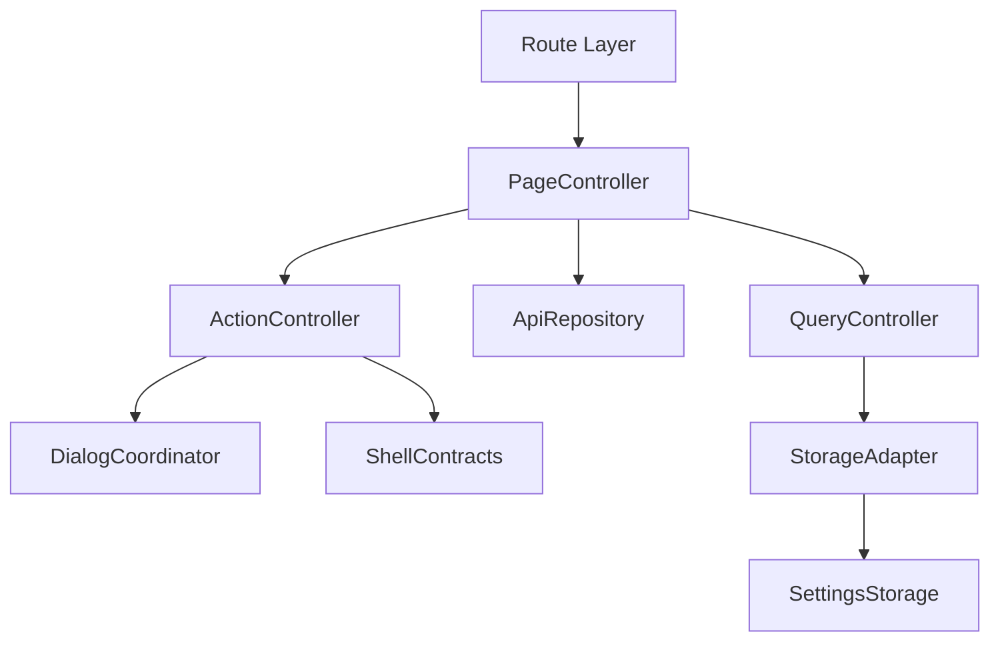
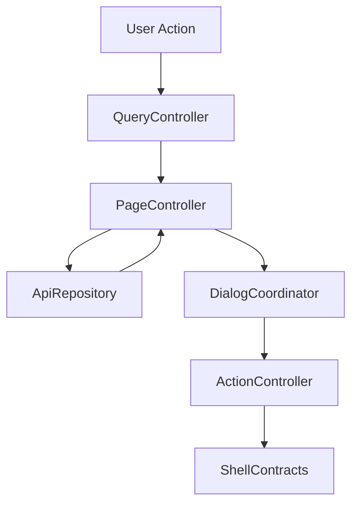

# 設計書: ストレージと録画アップロード

## 概要

この仕様は storage usage view と /recorded/upload form/progress/rollback の technical design を定める。

**ユーザー**: EPGStation の通常ユーザー、operator、関連 routed screen の実装者。

**影響**: requirements を component、route/query/API/localStorage contract、test strategy に接続し、実装境界を曖昧にしない。

### 目標

- requirements の全受け入れ条件を design component と test に追跡可能にする。
- 決定済み React 技術選定を、実 package root `client/` の file plan に対応づける。
- `unittest/spec`、`unittest/imp`、E2E の最小 gate を明記する。

### 非目標

- 隣接 spec が所有する workflow、player lifecycle、settings default/backfill の取り込み。

## 境界の合意

### この仕様が所有するもの

- `/storages`、`/recorded/upload`、storage usage rendering、upload form、validation、progress dialog、rollback。
- requirements に明記された route/query/API/localStorage/action/snackbar/dialog/menu behavior。
- 本 spec 配下の PageController、QueryController、ApiRepository、ActionController、DialogCoordinator、StorageAdapter の責務境界。

### 境界外

- Recorded list/detail、settings default、App Shell。
- 実 URL、実番組名、認証情報、Mirakurun URL、ffmpeg/ffprobe 実 path、環境固有値の tracked docs への記録。

### 許可する依存

- channel display setting は `frontend-settings-storage`、Recorded workflow は `frontend-recorded` と整合させる。
- `frontend-settings-storage` の保存済み settings contract と adjacent storage key registry。
- `frontend-app-shell` の shell、title bar slot、edit title bar、snackbar、navigation host。
- 既存 EPGStation REST API と hash route compatible router。

### 再検証トリガー

- requirements の受け入れ条件、route/query/API endpoint、snackbar 文言、dialog/menu action が変わる。
- `frontend-settings-storage` の field/default/validation/adjacent key default が変わる。
- `frontend-app-shell` の title/snackbar/navigation/edit title bar contract が変わる。

## アーキテクチャ

### アーキテクチャ前提

frontend は React と hash route を前提にし、hash route compatibility、既存 API、localStorage contract、observed responsive behavior、snackbar/dialog/menu の表示条件を本書の requirements に定義された通りに維持する。

formal design の正本は、この design と同一 spec の requirements、visual-cases、mock-data、ならびに `.kiro/steering/` の project memory とする。矛盾がある場合は同一 spec の requirements と requirements 横断レビューの反映済み判断を優先する。

### アーキテクチャパターンと境界マップ



**アーキテクチャ統合**:
- 選択したパターン: feature boundary + shared typed contracts。
- ドメイン/機能境界: route/query/API/action/dialog/storage を feature 内で分離し、settings と shell は consumer として参照する。
- 固定するパターン: hash route、API endpoint、dialog close cleanup、snackbar result、responsive breakpoint。
- Steering 準拠: 設計書は日本語。

### 技術スタック

| レイヤー | 選択 / バージョン | 機能内の役割 | 備考 |
|-------|------------------|-----------------|-------|
| フロントエンド | React / TypeScript / Vite | UI と typed contract | package root は `client/`、package name は `epgstation-client`。 |
| ルーティング | React Router hash route 対応 router | route/query contract | route contract は `/#/...`（hash route）とする。 |
| Server state | TanStack Query | API response cache、loading/error/refetch、Socket.IO invalidation、upload progress adapter | query key は route/query/API option から導出し、Socket.IO `updateStatus` などの event は該当 query invalidation/refetch に接続する。upload progress は deterministic test harness で制御する。 |
| Local state | React local state/reducer | screen/dialog/edit/bulk/upload form state と App Shell 横断 state | server state は TanStack Query に置く。Zustand は使わない。 |
| UI / CSS | MUI Core + `@mdi/font` + theme token + `*.module.css` | MUI ベースの UI 実装、responsive、visual contract | global CSS は `src/index.css` の bootstrap/reset 程度に限定し、visual-cases の geometry contract を theme/shared component に接続する。 |
| Form / validation | React Hook Form + Zod | upload form state、metadata validation、typed payload validation | Recorded Upload form と metadata payload validation はこの境界に従う。 |
| API client | native `fetch` wrapper + typed request/response validation | backend integration | repository base `./api` と endpoint path を二重結合しない。endpoint/query/body contract はこの design と requirements を正とする。 |
| Socket.IO | `socket.io-client` | realtime update trigger | event handler は feature repository / TanStack Query invalidation 境界へ接続し、failure snackbar の有無は各 design の契約に従う。 |
| Lint / format / alias | ESLint flat config + typescript-eslint + React Hooks plugin / Prettier / `@/` | static gate と import 解決 | `@/` は Vite / TypeScript / Vitest / ESLint で同一解決規則にする。 |
| Script gate | `build` = Vite production build（`bundle`）、`build:verify` = lint + typecheck + unit test + `build`、`check` = lint + format:check + typecheck + `test:dev-server` + `unittest/spec` + `unittest/imp` | `client/package.json` の scripts | `build:verify` は format check を含めず、`check` が Prettier gate を持つ。 |
| Test / coverage / browser | Vitest + V8 coverage / React Testing Library / Playwright / MSW | `unittest/spec`、`unittest/imp`、E2E、visual regression | 正式検証対象は Desktop Chromium、Desktop Firefox、Android Chrome、iOS Safari。visual は Playwright の geometry assertion で確認する（screenshot の比較はしない）。 |

## ファイル構成

`client/src/features/` 配下。`storages/` が `/storages` と `/recorded/upload` の両方を所有する。1 file は 300 行以下に保つ。

- `storages/StoragesPage.tsx` — `/storages` route root。title、blank / error 表示、storage list の composition。
- `storages/storagesApi.ts`、`storages/storagesRequests.ts` — `GET /storages` の request builder と typed adapter。Storages は user action、mutation API、dialog / menu / button を持たない。
- `storages/StoragesPage.module.css`。
- `storages/upload/RecordedUploadPage.tsx` — `/recorded/upload` route root。title、form、video block、uploading dialog の composition。
- `storages/upload/hooks/useRecordedUploadForm.ts` — react-hook-form の form state、option / rule の取得、reset、video block の追加 / 更新。
- `storages/upload/hooks/useRecordedUploadRun.ts` — upload 手順（metadata 登録 → video file 順送信）、進捗 dialog、失敗時 rollback、snackbar。
- `storages/upload/components/` — `UploadSelect`、`RecordedUploadDatetimePicker`、`RecordedUploadVideoBlock`。
- `storages/upload/lib/uploadFormat.ts` — 必須項目 schema、値の整形、option 生成、validated request の生成。
- `recorded/requests/uploadForm.ts` — upload form state と metadata / multipart body の builder（`recordedRequests.ts` から re-export）。
- `storages/upload/RecordedUploadPage.module.css`。
- route `/recorded/upload` は `client/src/app/routes/managementRoutes.tsx` が `/storages` と並べて登録する。

test:

- `client/unittest/spec/storages.spec.test.tsx`、`client/unittest/imp/storages.imp.test.ts`。
- `client/unittest/spec/storages/upload-*.spec.test.tsx`（helper は `recordedUploadSpecSupport.tsx`）、`client/unittest/imp/storages/upload-*.imp.test.ts`（`upload-format`・`upload-requests`・`upload-run`）。
- `client/e2e/storages-upload-workflow.spec.ts`（mock は `client/e2e/support/storagesUploadMocks.ts`）。
- `client/visual/storages-upload-geometry.spec.ts`。

## システムフロー



Flow は route/query/API/localStorage 境界で validation し、UI component が endpoint 文字列や localStorage schema を直接所有しない構造にする。

## 要件トレーサビリティ

| 要件 | 概要 | コンポーネント | インターフェース | フロー |
|-------------|---------|------------|------------|-------|
| 1.1-1.11 | Storages | PageController, ApiRepository | State / API | route/fetch flow。Storages は query/action/dialog/storage adapter を持たない |
| 2.1-2.27 | Recorded Upload form | PageController, QueryController, ApiRepository, ActionController, DialogCoordinator, StorageAdapter | State / Service / API | route/query/action flow |
| 3.1-3.15 | upload sequence と rollback | PageController, QueryController, ApiRepository, ActionController, DialogCoordinator, StorageAdapter | State / Service / API | route/query/action flow |
| 4.1-4.6 | dark theme coverage | PageController, DialogCoordinator | State | route/fetch flow |

## コンポーネントとインターフェース

| コンポーネント | ドメイン/レイヤー | 意図 | 要件カバレッジ | 主な依存 | 契約 |
|-----------|--------------|--------|--------------|------------------|-----------|
| PageController | Feature Routing | route 初期化、title、fetch、loading/error/empty を統括する。Storages は fetch lifecycle のみ、Recorded Upload は form/upload lifecycle も扱う。 | 1.1-1.11, 2.1-2.27, 3.1-3.15 | frontend-settings-storage / frontend-app-shell / EPGStation API | 状態管理 |
| QueryController | Feature Routing | Recorded Upload form input を typed model に変換する。Storages は user-facing query を持たない。 | 2.2, 2.6-2.27, 3.7-3.10 | frontend-settings-storage / frontend-app-shell / EPGStation API | Service |
| ApiRepository | Feature API | requirements で定義された endpoint request と typed error 変換を扱う。server config 由来 recorded directory names もここで supply する。 | 1.2, 1.6-1.8, 2.5, 2.8, 2.11, 2.12, 3.2-3.6, 3.9-3.11 | frontend-settings-storage / frontend-app-shell / EPGStation API | API |
| ActionController | Feature Service | Recorded Upload の button、dialog submit、upload sequence の結果を route/API/snackbar に接続する。Storages では使わない。 | 2.1-2.27, 3.1-3.15 | frontend-settings-storage / frontend-app-shell / EPGStation API | Service/API |
| DialogCoordinator | Feature UI | Recorded Upload の progress dialog open/reset/close cleanup/focus を管理する。Storages では使わない。 | 3.1, 3.4, 3.5, 3.6, 3.12 | frontend-settings-storage / frontend-app-shell / EPGStation API | 状態管理 |
| StorageAdapter | Shared Boundary | Recorded Upload が必要な settings を consumer として読む。Storages は StorageAdapter を持たない。 | 2.3 | frontend-settings-storage | 状態管理 |

### ページ制御（PageController）

| 項目 | 詳細 |
|-------|--------|
| 意図 | route 初期化、title、loading/error/empty、child component composition を統括する。 |
| 要件 | 1.1-1.11, 2.1-2.27, 3.1-3.15 |

**責務と制約**
- route entrypoint と screen lifecycle だけを所有する。
- fetch/action の副作用は ApiRepository と ActionController へ委譲する。
- App Shell title/snackbar/edit title bar へは typed request だけを渡す。

### クエリ制御（QueryController）

| 項目 | 詳細 |
|-------|--------|
| 意図 | route query、path param、form/filter input を typed model に変換する。 |
| 要件 | 2.2, 2.6-2.27, 3.7-3.10 |

**責務と制約**
- `unknown` / string query を domain type へ narrow する。
- invalid input は requirements に従い normalize、ignore、controlled error、または no-op に変換する。
- `/storages` と `/recorded/upload` は user-facing query state を持たない。route refresh 用 `timestamp` は `frontend-app-shell` の route boundary contract が付与・除外を所有し、この spec は business query として解釈しない。
- `/recorded/upload` の channel、genre、sub genre、video file block select は shared `AppSelect` / MUI `TextField select` として操作可能にし、`file type` / `directory` は MUI standard input 相当の 48px height、underline、transparent background、0px border radius を CSS module の owner width 内で維持する。browser-default select、MUI native-select variant、custom dropdown arrow の再実装、または `appearance: none` への依存を使ってはならない。
- 全 upload select の menu/listbox は shared `AppSelect` の 216px max height を使い、項目数が多くても main content 高さいっぱいに伸びない。
- channel、genre、sub genre select の empty placeholder は selected value が empty のときだけ displayEmpty の空表示として扱い、listbox item としては hidden にする。field-name label の `channel`、`genre`、`sub genre` を visible option として露出してはならない。
- `/recorded/upload` は recorded search filter 用 option label をそのまま再利用しない。upload channel options は channel model の `name` / `halfWidthName` を使い、recorded search count suffix `(<cnt>)` を削除し、channel name が解決できず数値だけになる item は表示しない。upload genre options は `genre.name`（count suffix 除去後）を使う。
- Video file block の field label は 英字 label を正とし、i18n/翻訳層を通さない。翻訳済み文字列や block index suffix は field label 側へ出さない。

### API リポジトリ（ApiRepository）

| 項目 | 詳細 |
|-------|--------|
| 意図 | API request builder、response adapter、typed error conversion を扱う。 |
| 要件 | 1.2, 1.6-1.8, 2.5, 2.8, 2.11, 2.12, 3.2-3.6, 3.9-3.11 |

**責務と制約**
- endpoint は requirements を正とする。
- request body/query は explicit type で定義し、TypeScript の `any` を使わない。
- API failure は UI へ例外を漏らさず typed error として返す。

### アクション制御（ActionController）

| 項目 | 詳細 |
|-------|--------|
| 意図 | menu、dialog、button、bulk action の実行と snackbar/route update を扱う。 |
| 要件 | 1.1-1.11, 2.1-2.27, 3.1-3.15 |

**責務と制約**
- 表示条件、disabled/hidden 条件、成功/失敗 snackbar は requirements を正とする。
- Recorded Upload の action 完了後の dialog close、route move、snackbar を一箇所に集約する。Storages view は user action、mutation API、dialog/menu/button を持たない。
- 破壊的 action は confirm dialog または requirements に定義された no-op 条件を経由する。

### ダイアログ調整（DialogCoordinator）

| 項目 | 詳細 |
|-------|--------|
| 意図 | dialog/menu open/reset/close cleanup/focus を扱う。 |
| 要件 | 3.1, 3.4, 3.5, 3.6, 3.12 |

**責務と制約**
- open ごとに stale state を reset する。
- close animation 後の remove/remount が requirements にある場合は維持する。remove/remount delay は `100ms` とし、`mock-data.md` の `dialogCleanupDelayMs: 100` と整合させる。
- dialog body の screenshot が不足する場合は mock API または検証 config で fixture を補完する。

### ストレージアダプター（StorageAdapter）

| 項目 | 詳細 |
|-------|--------|
| 意図 | settings と adjacent localStorage key を consumer として読む。 |
| 要件 | 2.3, 2.8, 2.11, 3.10 |

**責務と制約**
- settings default、backfill、validation は `frontend-settings-storage` に委譲する。
- feature 固有の adjacent key owner がある場合だけ、その shape を design と tasks に展開する。
- 保存済み値の parse failure は settings storage contract に従う。

### API 契約

この表の endpoint は frontend repository contract であり、`./api` の base path は含めない。決定済み native `fetch` wrapper に基づいて API client を作る場合も base path と endpoint path を二重に結合しない。

| メソッド | エンドポイント | リクエスト | レスポンス | エラー |
|--------|----------|---------|----------|--------|
| GET | /storages | none | storage usage list | storage fetch failure snackbar |
| GET | /rules/keyword | limit=1000 and optional keyword | { items: RuleKeywordItem[] } | rule autocomplete failure snackbar |
| POST | /recorded | recorded metadata body | `{ recordedId }` | metadata creation failure snackbar |
| POST | /videos/upload | multipart video block: recordedId/viewName/fileType/parentDirectoryName/file plus optional non-empty subDirectory | `{ code: 200, result: 'ok' }`; response body is not user-visible | upload failure triggers rollback path |
| DELETE | /recorded/:recordedId | rollback target | rollback result | rollback failure is logged only; user-facing notification remains original upload failure |
| EVENT | socket.io updateStatus | none | storages refetch | Socket.IO refetch failure does not show snackbar; route fetch failure shows snackbar |

### 共有型契約

```typescript
type FeatureResult<T, E extends string> =
  | { ok: true; value: T }
  | { ok: false; error: E; message: string };

interface RouteBuildResult {
  path: string;
  query: Record<string, string>;
}

interface SnackbarRequest {
  text: string;
  color?: 'normal' | 'success' | 'info' | 'error';
  timeout?: number;
}
```

## 機能固有の設計判断

### アップロード手順

1. form validation は完全に空の video block を upload target から除外し、一部だけ入力された video block を検証対象にする。完全に空とは `viewName=null` かつ `file=null` であり、default `parentDirectoryName` は空判定に影響しない。program name と入力済み video block `viewName` blank は invalid。invalid block を skip しない。
2. `POST /recorded` で metadata を作成する。
3. 作成された `recordedId` を使い、各 video block を multipart `POST /videos/upload` へ送る。body は `recordedId`、`viewName`、`fileType`、`parentDirectoryName`、`file` を含み、`subDirectory` は non-empty string の場合だけ含める。
4. いずれかの upload が失敗した場合は rollback として `DELETE /recorded/:recordedId` を実行する。
5. rollback failure は log に留め、user-facing snackbar は元の failure として `アップロードに失敗 ` だけを表示する。
6. success/failure/progress は upload progress dialog が所有する。
7. validation failure は `入力内容に問題があります。`、upload success は `アップロード完了 `、metadata failure / video upload failure は `アップロードに失敗 ` を snackbar で通知する。emit owner は ActionController とし、Progress dialog は persistent `アップロード中 ` と indeterminate 表示だけを所有する。
8. upload 成功後は current form values を維持しつつ、route を `/recorded/upload?timestamp=<number>` へ更新する。

### ストレージ画面契約

- route fetch 前に existing storage state を clear する。
- `GET /storages` は query/body なし。Socket.IO `updateStatus` を `frontend-app-shell` の realtime invalidation（`updateStatus` -> `storages` query key invalidation）経由で購読して refetch する。route fetch failure は `ストレージ情報取得に失敗 ` snackbar を表示し、Socket.IO refetch failure では追加 snackbar を出さない。
- empty/error は blank presentation と snackbar を維持する。専用 empty copy を追加しない。
- file size formatting と usage ratio は current utility に合わせ、`total=0` では division by zero を避ける。

### アップロードフォーム契約

- form container は max width `800px` とし、row title/content の 25%/75% split と mobile vertical layout を維持する。
- required row title（`放送局※` / `日付※` / `長さ※` / `番組名※`）は `.requiredTitle` を最終 color owner とし、light/dark theme とも赤色を維持する。dark theme の row title 一括 color override で required red を白へ上書きしない。
- form は channel、genre、rule autocomplete、start/end/duration、program name、description、extended、video blocks を持つ。
- video block は `viewName`、`fileType` (`ts` / `encoded`)、`parentDirectoryName`、optional `subDirectory`、`file` を持つ。
- video block の visible label / accessible name は 原文 label を正とし、field label は `name`、`file type`、`directory`、`sub directory`、`video file` を使う。block number suffix は row title `ビデオファイル<n>` にだけ付け、field label には付けない。 `表示名 `、`ファイル種別 `、`保存先 `、`サブディレクトリ `、`動画ファイル ` へ翻訳してはならない。
- video file block の file selection control は icon、selected filename、placeholder `video file` の owner を持ち、file selected 後は placeholder を隠して selected filename と重複させない。
- channel、genre、sub genre、video block type、directory は select 操作性を維持する。control は MUI `combobox` として keyboard/mouse/touch 操作を受け、`aria-label` は visible label と同じ原文 label を持つ。独自 label + browser-default select、MUI native-select variant、表示用 overlay で MUI theme を迂回してはならない。select owner の横幅は row/content CSS が決定し、MUI の component や `AppSelect` は owner 幅を短縮してはならない。menu/listbox Paper は `AppSelect` / `MuiSelect.defaultProps.MenuProps` により 216px max height を共有する。open menu/listbox に空白 option、空白 `MenuItem`、`<em />` だけの item を表示してはならない。
- `genre` と sub genre selector は横並び 2 分割で、selected text と dropdown text が折り返しや重なりを起こさない高さ `48px` の select とする。
- channel option label は `isHalfWidthDisplayed` に応じて `halfWidthName` fallback `name`、または `name` を使う。id だけの数値 option は failure とする。
- initial video block と FAB 追加 video block は同一 default を使う。first recorded directory default を default として使う。video block 追加は add-only FAB。datetime picker は remount reset を維持する。
- remove-video-block action は追加しない。add-only video block UI を維持する。
- reset は form state を再作成し datetime picker を remount するが、route init と異なり `/rules/keyword` の autocomplete fetch を再実行しない。
- `isHalfWidthDisplayed` は channel selector display option にだけ反映する。rule autocomplete display には適用しない。
- `日付※` input は direct text input (`yyyy-MM-ddTHH:mm`) と `日付選択 ` dialog open を分離する。direct input/fill の後に dialog が残って後続操作を覆う状態は failure とする。dialog は title `日付選択 `、`日付 ` date input、`時刻 ` time input を持ち、field click で draft date/time を現在値から初期化し、blur だけで close しない。close は backdrop/Escape/`クリア `/`設定 ` の明示操作に限定し、単一の browser default `datetime-local` input だけを dialog 内容として出さない。
- upload form の user-editable text-like field は shared clearable owner を使い、non-empty かつ enabled の場合に field 右端へ clear action を表示する。対象は direct datetime、dialog datetime、duration、program name、description、extended、video block `name` / `sub directory` とし、select、file input、Rule autocomplete 内部 input は対象外とする。select のうち `channel` / `genre` / `sub genre` は `AppSelect` として non-empty enabled state で clear action を表示する。
- rule autocomplete item は `RuleKeywordItem: { id, keyword }` とし、表示は `keyword`、値は `id` を使う。
- recorded directory names は server config の recorded directory list を source とする。localStorage ではなく ApiRepository / config supplier から供給する。

### ルート所有

`/storages` と `/recorded/upload` は同一 spec が所有する。route root・hook・component は `client/src/features/storages/` 配下（`/recorded/upload` は `storages/upload/`）に置き、upload form state と body の builder は `recorded/requests/uploadForm.ts` にある。Recorded main menu は upload route への handoff だけを所有する。

## データモデル

- `StorageUsageItem`（`storagesApi.ts`）: API の item で `{ name, used, total, available }`。数値は必須で、`useRate` は持たない。
- `StorageUsageView`（`storagesRequests.ts`）: `{ name, available, used, total, useRate }`。`useRate` は view で算出し、`total=0` guard を持つ。
- `RecordedUploadFormState`: channel/genre/rule/time/program metadata と `videoBlocks[]` を持つ。
- `RecordedUploadVideoBlockState`（`recorded/requests/uploadForm.ts`）: `{ id, viewName, fileType?, parentDirectoryName, subDirectory: string | null, file }`。multipart では non-empty string の場合だけ `subDirectory` を送る。
- upload の進行状態: 専用の型は持たず、`isSubmitting`・`isUploadingDialogOpen`・`isUploadingDialogMounted` の boolean 3 つで管理する（`useRecordedUploadRun.ts`）。UI は indeterminate な progress dialog を表示し、API 由来の current/total progress を表示しない。

## エラーハンドリング

- validation は route/query/form/API/localStorage の境界で行う。
- snackbar 文言は requirements に定義された文言を優先する。
- no-op、blank presentation、controlled error の選択は requirements を正とする。
- stale research と formal requirements が矛盾する場合は formal requirements を正とする。

## テスト戦略

unit test は `npm run coverage:gate` で statements・branches・functions・lines の 4 指標 100% を要求する。unit test は `unittest/spec` と `unittest/imp` の 2 種類を持ち、片方で他方を代替しない。E2E と visual は release-preflight の client-browser step で実ブラウザーに流す。hosted CI（`client.yml`）は lint・typecheck・format check だけを行う。

- `unittest/spec`: user-visible behavior、route/query contract、API request contract、状態遷移、snackbar/dialog/menu 表示条件を requirements ID に紐づけて検証する。
- `unittest/imp`: query parser、request builder、state reducer、validator、lifecycle cleanup、storage adapter の分岐と edge case を検証する。
- E2E: deterministic mock data で route 表示、主要 action、dialog/menu、responsive、empty/error state を確認する。

### Visual Regression 契約

この feature の詳細 layout は、本文の Storages / Recorded Upload form contract と `visual-cases.md` の visual cases、`mock-data.md` の synthetic dataset contract を合わせて正本とする。

`visual-cases.md` は geometry / interaction test の撮影条件を定義する。`mock-data.md` は visual cases で使う synthetic storage list、upload options、progress、rollback state fixture 条件を定義する。

Storage path と upload file は placeholder / synthetic label だけを使う。tracked artifact には実 storage path、実 file path、実 URL、認証情報、ffmpeg / ffprobe 実 path、環境固有値を含めない。

### Visual Implementation Contract

Storages list は 960px 未満は `max-width` を指定せず、`min-width:960px` で `max-width:900px`、`min-width:1264px` で `max-width:1185px`、`min-width:1904px` で `max-width:1785px` とする。padding は breakpoint 無しで常時 `12px`、centering は `margin: 0 auto`。item padding `8px`、storage name は `1.17em` bold（`h3`）、footer（`<used> 使用済み` / `<available> 空き`）は 14px/20px textSecondary とする。Usage bar は height `25px`、角丸なし、fill は `#1976d2`（`value=useRate`）、track の `useRate` より右は `rgba(25, 118, 210, 0.3)` で、0% / 中間 / ほぼ満杯でも container width を変えない。

Upload form は max width `800px`、content surface `contentSurface`、padding `16px 16px 0`、form row の padding-top `16px`、action row top margin `44px` とする。Mobile fixed FAB は 56px square、right/bottom `16px`、z-index は dialog より低く、form controls と重ならない。Progress feedback は persistent `アップロード中 ` dialog、indeterminate progress height `4px`、step label は画面に出さない。

Recorded upload の channel / genre / sub genre / file type / directory select は shared `AppSelect` を使い、MUI theme、dark token、4.5 item menu cap、vertical center 表示を継承する。select は MUI class を持つ 48px control とし、browser default select の 23px height や raw appearance へ退行した場合は visual regression failure とする。required row title（`放送局※` / `日付※` / `長さ※` / `番組名※`）は light/dark theme とも赤色を維持し、dark theme の row title 一括 color override で白へ上書きしない。channel / genre / sub genre は選択済みの場合に field 内 clear action を表示し、clear は当該 field と従属 field だけを空にする。`file type` / `directory` の未選択 placeholder は visible option として menu に出さず、hidden fallback とする。date/time picker dialog は MUI dialog と native `type="date"` / `type="time"` input を使う。empty field で placeholder と label が重なる状態はユーザー操作上の破綻であり、regression として扱う。dialog 内の empty `type="date"` / `type="time"` field は MUI label を shrink させ、native placeholder と label が重ならない状態を維持する。

dark theme では usage bar track/fill、file input/select、disabled controls、progress dialog、icon-only action が App Shell token に従う。rollback/error state は実 path や実 URL を表示せず、retry action の visual density は upload form action row と同じにする。

### 機能テストケース

- `GET /storages` no query/body、clear before fetch、Socket.IO `updateStatus` refetch、route fetch failure snackbar と Socket.IO refetch failure no-snackbar、file size formatting、`total=0` guard を検証する。
- rule autocomplete が `/rules/keyword?limit=1000[&keyword]` を使うことを検証する。
- upload validation が default `parentDirectoryName` を空判定に含めず、完全に空の video block を upload target から除外し、一部入力済み block を検証し、blank program/viewName と invalid block skip 禁止を検証する。
- `POST /recorded` `{ recordedId }` response followed by multipart `POST /videos/upload` sequence、`parentDirectoryName` field、optional non-empty `subDirectory`、indeterminate uploading dialog、failure rollback と rollback failure log-only を検証する。
- title、storage footer の `<used> 使用済み ` / `<available> 空き `、add-only video block、reset で `/rules/keyword` を再 fetch しないこと、`入力内容に問題があります。`、`アップロード完了 `、metadata failure で rollback しない negative assertion、close animation 後の remove/remount を requirements ID に紐づけて検証する。

## セキュリティとプライバシー

- tracked docs、test fixture、snapshot に実 URL、実番組名、認証情報、Mirakurun URL、ffmpeg/ffprobe 実 path、環境固有値を書かない。
- Playwright の基準画像（`client/visual/*-snapshots/`・`client/e2e/*-snapshots/`。synthetic data だけを写す）は追跡する。test 実行時の出力と実機の撮影結果は追跡しない（`client/test-results`、`client/device/artifacts/` は ignore 済み）。
- E2E は実データではなく controlled mock data を使う。

## 性能とアクセシビリティ

- list/grid/dialog は stable dimensions と responsive constraints を持ち、text overlap と layout shift を避ける。
- menu button、dialog button、item action button は keyboard focus と accessible name を持つ。
- heavy rendering、stream、upload、dialog timer は route leave または close 時に cleanup する。

## リスクと緩和策

- 技術選定は `.kiro/steering/tech.md` と `.kiro/steering/testing.md` を参照し、`client/` の package root、scripts、dependencies と一致させる。
- requirements が変更された場合、traceability と task boundary を再確認する。
- screenshot body が不足する dialog は mock API または validation config で補完する。

## dark theme の storage title 不透明度

dark theme の storage title 不透明度は MUI の `text.primary` 既定に従い、`StoragesPage.module.css` の
`:global([data-theme-mode='dark']) .storageTitle { color: rgb(255 255 255 / 87%); }`（87%）を維持する。
この spec は他 feature の dark title と同じ 87% トークンへ統一する App Shell の dark token 方針
（`frontend-app-shell` design.md の `textPrimary` token）に従う。

## Storages layout の画面幅分岐

Storages 画面は画面幅による layout 分岐を持たない。`data-storages-layout` / `data-storages-item-layout` の
ような layout 分岐属性は持たず、`StoragesPage.module.css` に viewport 幅で padding を変える media query も
持たない。

layout の分岐そのものは持たないが、`.storagesPage` の `max-width`（`min-width: 1264px`/`1904px` で段階的
に広がる）と `.storageItem` の `width: 100%` により、storage row の幅は viewport 幅に追従して連続的に変わる。
`client/visual/storages-upload-geometry.spec.ts` の `keeps storage usage layout stable on desktop and
mobile` はこの追従を実測 geometry で検証する契約とする: 1440x900 と 390x844 のどちらでも row 数が一致し、row 幅が
互いに揃い（面積 0 の row が無く）、`.storagesPage` の矩形からはみ出さないこと、加えて 390px 幅の row 幅が
1440px 幅の row 幅より狭いことを確認し、viewport 幅の変化がそのまま row の再計算に反映されることを担保する。

## genre / subGenre 横並びの間隔

genre / subGenre の 2 つの select は隙間なく隣接させる。幅はそれぞれ `50%` とし、`column-gap` は指定しない。
