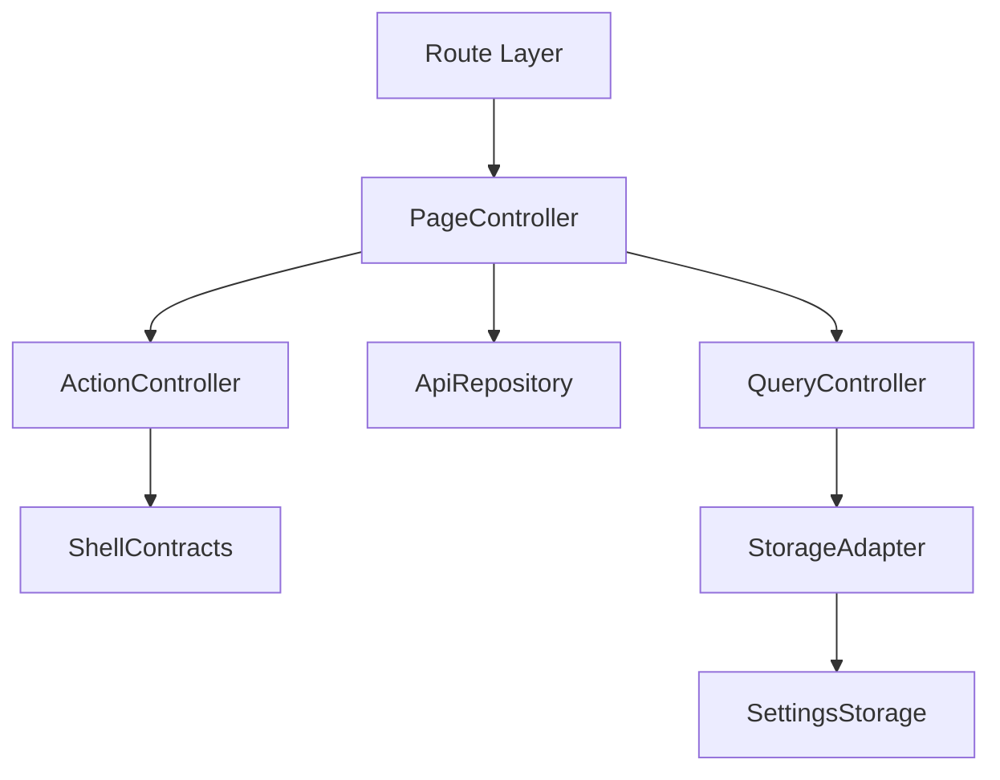
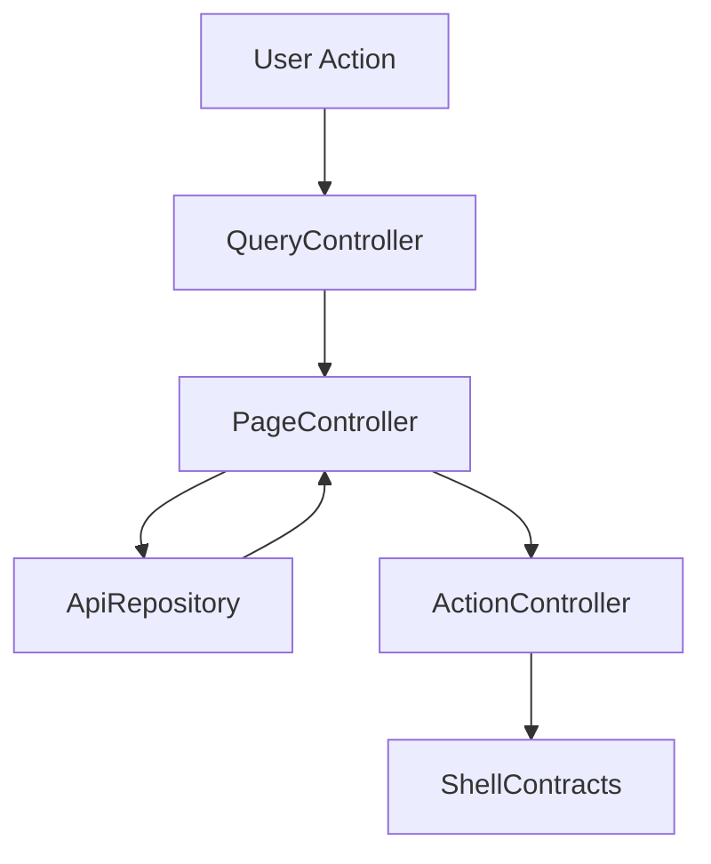

# 設計書: ビデオ再生

## 概要

この仕様は live/recorded watch/streaming route、player lifecycle、platform
constraint、subtitle の技術設計を定める。

**ユーザー**: EPGStation の通常ユーザー、operator、関連 routed screen の実装者。

**影響**: requirements を component、route/query/API/localStorage contract、test
strategy に接続し、実装境界を曖昧にしない。

### 目標

- requirements の全受け入れ条件を design component と test に追跡可能にする。
- 決定済み React 技術選定を、実 package root `client/` の file plan に対応づける。
- `unittest/spec`、`unittest/imp`、E2E の最小 gate を明記する。

### 非目標

- 隣接 spec が所有する workflow、settings default/backfill の取り込み。

## 境界の合意

### この仕様が所有するもの

- `/onair/watch`、`/recorded/watch`、`/recorded/streaming/:videoFileId`、player params、HLS/WebM/MP4/direct
  playback、platform constraints、error/empty。
- requirements に明記された route/query/API/localStorage/action/snackbar/dialog/menu behavior。
- 本 spec 配下の PageController、QueryController、ApiRepository、ActionController、StorageAdapter の責務境界。

### 境界外

- On Air list、Recorded list/detail、settings key/default。
- 実 URL、実番組名、認証情報、Mirakurun URL、ffmpeg/ffprobe 実 path、環境固有値の tracked docs への記録。

### 許可する依存

- playback preference は `frontend-settings-storage`、entrypoint は `frontend-onair` / `frontend-recorded` に従う。
- `frontend-settings-storage` の保存済み settings contract と adjacent storage key registry。
- `frontend-app-shell` の shell、title bar slot、edit title bar、snackbar、navigation host。
- 既存 EPGStation REST API と hash route compatible router。

### 再検証トリガー

- requirements の受け入れ条件、route/query/API endpoint、snackbar 文言、dialog/menu action が変わる。
- `frontend-settings-storage` の field/default/validation/adjacent key default が変わる。
- `frontend-app-shell` の title/snackbar/navigation/edit title bar contract が変わる。

## アーキテクチャ

### アーキテクチャ前提

frontend は React と hash route を前提にし、hash route
compatibility、既存 API、localStorage contract、observed responsive behavior、snackbar/dialog/menu の表示条件を
本書の requirements に定義された通りに維持する。

formal design の正本は、この design と同一 spec の requirements、visual-cases、mock-data、ならびに `.kiro/steering/`
の project
memory とする。矛盾がある場合は同一 spec の requirements と requirements 横断レビューの反映済み判断を優先する。

### アーキテクチャパターンと境界マップ



**アーキテクチャ統合**:

- 選択したパターン: feature boundary + shared typed contracts。
- ドメイン/機能境界:
  route/query/API/action/dialog/storage を feature 内で分離し、settings と shell は consumer として参照する。
- 固定するパターン: hash route、API endpoint、dialog close cleanup、snackbar result、responsive
  breakpoint。
- Steering 準拠: 設計書は日本語。

### 技術スタック

| レイヤー                  | 選択 / バージョン                                                                                                                            | 機能内の役割                                                             | 備考                                                                                                                                                                         |
| ------------------------- | -------------------------------------------------------------------------------------------------------------------------------------------- | ------------------------------------------------------------------------ | ---------------------------------------------------------------------------------------------------------------------------------------------------------------------------- |
| フロントエンド            | React / TypeScript / Vite                                                                                                                    | UI と typed contract                                                     | package root は `client/`、package name は `epgstation-client`。           |
| ルーティング              | React Router hash route 対応 router                                                                                                          | route/query contract                                                     | route contract は `/#/...`（hash route）とする。                                                                        |
| Server state              | TanStack Query                                                                                                                               | API response cache、loading/error/refetch、stream lifecycle invalidation | query key は route/query/API option から導出し、stream lifecycle event は該当 query invalidation/refetch に接続する。media source は deterministic test harness で制御する。 |
| Local state               | React local state/reducer                                                                                               | player lifecycle、dialog/edit state と App Shell 横断 state              | server state は TanStack Query に置く。Zustand は使わない。                                           |
| UI / CSS                  | MUI Core + `@mdi/font` + theme token + `*.module.css`                                                                                          | MUI ベースの UI 実装、responsive、visual contract                       | global CSS は `src/index.css` の bootstrap/reset 程度に限定し、visual-cases の geometry/screenshot contract を theme/shared component に接続する。                                             |
| Form / validation         | React Hook Form + Zod                                                                                                                        | player setting form、typed payload validation                            | playback settings と stream request payload validation はこの境界に従う。                                                                                                    |
| API client                | native `fetch` wrapper + typed request/response validation                                                                                   | backend integration                                                      | repository base `./api` と endpoint path を二重結合しない。endpoint/query/body contract はこの design と requirements を正とする。                                           |
| Socket.IO / media         | `socket.io-client` / `hls.js` / `mpegts.js`                                                                                                  | realtime update trigger と media playback                                | media playback library は継続採用し、browser support check は Desktop Chromium、Desktop Firefox、Android Chrome、iOS Safari の制約に従う。                                   |
| Lint / format / alias     | ESLint flat config + typescript-eslint + React Hooks plugin / Prettier / `@/`                                                                | static gate と import 解決                                               | `@/` は Vite / TypeScript / Vitest / ESLint で同一解決規則にする。                                                                                                           |
| Script gate               | `build` = Vite production build（`bundle`）、`build:verify` = lint + typecheck + unit test + `build`、`check` = lint + format:check + typecheck + `test:dev-server` + `unittest/spec` + `unittest/imp` | `client/package.json` の scripts                                      | `build:verify` は format check を含めず、`check` が Prettier gate を持つ。                                                                                                          |
| Test / coverage / browser | Vitest + V8 coverage / React Testing Library / Playwright / MSW                                                                              | `unittest/spec`、`unittest/imp`、E2E、visual regression                  | 正式検証対象は Desktop Chromium、Desktop Firefox、Android Chrome、iOS Safari。visual は Playwright screenshot assertion と geometry assertion を併用する。                   |

## ファイル構成

package root は `client/` である。

### ディレクトリ構成

```text
client/src/
├── app/                    # App Shell, navigation, snackbar, theme
├── features/               # routed feature boundaries
├── shared/                 # settings, API error, route helpers, typed utilities
└── test/                   # MSW server
```

### ファイル

`client/src/features/video/playback/` 配下。

- `PlaybackShell.tsx` — `PlaybackPlayerContainer`。hook と component を合成する player の route root。
- `PlaybackRouteShell.tsx` — `PlaybackRouteShell` / `PlaybackControlledError` / `PlaybackPendingState`。
- `RecordedWatchPages.tsx` — `RecordedWatchPage` / `RecordedStreamingWatchPage`。
- `components/PlaybackControlsOverlay.tsx` — 再生 / seek / 速度 / 音量 / 字幕 / PiP / fullscreen の control 群。
- `components/PlaybackVideoElement.tsx` — `<video>` と media event の配線。
- `components/RecordedWatchInfoCard.tsx` — 録画済み番組の情報 card。
- `hooks/usePlaybackLifecycle.ts` — lifecycle mode、HLS controller、有効 media URL、seek による再開始。
- `hooks/usePlaybackMediaElement.ts` — 再生 / 一時停止 / 時刻 / 音量 / loading / canplay の media element state。
- `hooks/usePlaybackMediaSources.ts` — hls.js / mpegts.js の attach と破棄。
- `hooks/usePlaybackSeek.ts` — seek bar の preview / commit、segment 外 seek の再開始。
- `hooks/usePlaybackSubtitles.ts` — 字幕設定と subtitle adapter の装着。
- `hooks/usePlaybackControlsVisibility.ts` — control の自動非表示と pointer / mouse の扱い。
- `hooks/usePlaybackFullscreen.ts` — fullscreen、画面回転、PiP。iPhone（iPad を除く、`detectIPhonePlatform`）では container の `requestFullscreen` を呼ばず常に `video.webkitEnterFullscreen()` を使う（container の `requestFullscreen` は resolve しても実際には拡大描画されないため、promise の成否では判別できない）。iPhone 以外で container の `requestFullscreen` が無い場合は、iPad（`detectIPadPlatform`）以外なら同じ `webkitEnterFullscreen()` へ fallback し（`webkitEnterFullscreen` も無い場合だけ CSS の非 native fallback にする）、`webkitbeginfullscreen` / `webkitendfullscreen` から state を同期する。iPad の場合はこの `webkitEnterFullscreen()` fallback 自体を試みず直接 CSS の非 native fallback にする（6c: iOS のホーム画面に追加した standalone PWA では Safari タブと異なり `requestFullscreen` 自体が存在しないことがあるため、防御的に分岐する。iPhone のこの fallback は変えない）。container の `requestFullscreen` が存在するのに reject した場合は（iPad かどうかに関わらず）`webkitEnterFullscreen()` へは fallback せず直接 CSS の非 native fallback にする（reject 後に `webkitEnterFullscreen()` へ fallback すると Apple 標準 UI になり、録画 HLS のシーク範囲が制限され PiP も動作しなくなる。存在する API が1回 reject しただけでは container fullscreen が本当に使えないとは判断できないため）。CSS の非 native fallback へ入る/出る（`isFullscreenFallback` の切替）ごとに `../../../app/hooks/useFixedShellViewport.ts` の `syncViewportHeightVariable()` を呼び、`--app-viewport-height` を明示的に再実測する（6d: `resize` / `orientationchange` / `visualViewport` event を伴わない、この fallback 自身の state 変化だけでも再実測を保証するため）。PiP の利用可否は `isPictureInPictureEnabled` state として保持し、video 要素が mount された時点で一度 `detectPictureInPictureEnabled(videoRef.current)` を評価するほか、`refreshPictureInPictureSupport()` を呼び出し元（`usePlaybackVideoEvents` の `loadedmetadata` / `emptied` / `loadstart`）から呼ばせて再評価する（13a: mount 時の一度きりの評価だけでは、`webkitSupportsPresentationMode` が読み込み前は `false` を返す WebKit で Safari タブでも button が出ないため、`loadedmetadata` などで再評価する）。
- `hooks/usePlaybackWaitingStatus.ts` — HLS lifecycle が `waiting` の間の経過秒数（screen reader 向けの `配信準備中… (N秒)` 用）。
- `hooks/usePlaybackVideoEvents.ts` — media event handler と keyboard shortcut。`onLoadedMetadata` / `onEmptied` / `onLoadStart` は `fullscreen.refreshPictureInPictureSupport()` を呼び、PiP 利用可否を再評価させる（13a）。
- `hooks/useRecordedWatchInfo.ts` — 録画済み番組情報の query と file type 解決。
- `lib/playbackShellSupport.ts` — seek 秒数の読取、PiP / orientation lock 判定、storage 取得。`detectPictureInPictureEnabled(video?)` は対象 video が `webkitSupportsPresentationMode` を持つ場合その `('picture-in-picture')` 判定を優先し、無い場合だけ `document.pictureInPictureEnabled` にフォールバックする（13a: iOS/iPadOS の standalone PWA では `document.pictureInPictureEnabled` が `true` を誤報告するまま `requestPictureInPicture()` が機能しない既知の WebKit issue（Bugzilla #303885）があり、`webkitSupportsPresentationMode` の方が正しく `false` を返すため）。この関数自体は純粋な判定であり、呼び出し側（`usePlaybackFullscreen`）が「いつ」呼ぶかで正しさが決まる。
- `playbackRoutes.ts` — route / query 検証と route builder。
- `playbackMedia.ts` — route から media source（media / stream start / readiness URL）を組み立てる。
- `playbackLifecycle.ts` — lifecycle mode 解決（`resolvePlaybackLifecycleMode`）、direct stream の seek URL 再構築（`rebuildDirectStreamUrlForSeek`）、M2TS-LL の再生可否（`resolveM2tsLlPlaybackReadiness`・`detectM2tsLlSupport`）。`playbackLifecycleTypes.ts`（定数 / 型 / 共通 helper）、`playbackLifecycleRepository.ts`（`fetch` による stream API repository）、`playbackLifecycleControllerBase.ts`（generation / timer / stop の bookkeeping）、`playbackLifecycleController.ts`（start / readiness polling / stop）を再 export する。
- `playbackControls.ts` — control 表示判定、seek clamp、音量 label。
- `playbackSettings.ts` — `VideoPlayerSetting` の読み書きと subtitle renderer 契約。
- `playbackSubtitle.ts` / `playbackStreamMetadata.ts` — 字幕 adapter と HLS / mpegts metadata bridge。
- `platformDetection.ts` — mobile platform 判定（`detectMobilePlatform`）、iPhone 判定（`detectIPhonePlatform`）、iPad 判定（`detectIPadPlatform`）。
- `recordedWatchRequests.ts` — 録画済み watch 情報の query key。
- `index.ts` — 他 feature が使う公開 export。

test:

- `client/unittest/spec/videoPlayback.route.spec.test.tsx`（要求 1: route 検証と controlled state）、`videoPlayback.mapping.spec.test.tsx`（要求 2: direct / streaming / live の player mapping、info card、readiness polling）、`videoPlayback.lifecycle.spec.test.tsx`（要求 3: HLS lifecycle、失敗の回復、platform 制約、録画中の推定総尺）、`videoPlayback.controls.spec.test.tsx`（要求 4: loading、seek / 速度 / 音量 / 字幕 / PiP の control 表示）、`videoPlayback.controlsVisibility.spec.test.tsx`（要求 4: controls の自動非表示、tap toggle、keyboard、fullscreen fallback）、`videoPlayback.streaming.spec.test.tsx`（要求 5: 総尺、segment 外 seek、HLS seek、字幕契約、絶対再生位置）。ほかに、`videoPlayback.playerContainerDirect`・`recordedRoutesExtra`・`recordedStreamingDurationQueryRace`・`recordedWatchInfoCard`・`recordedWatchPageStandalone` の spec がある（録画済みの視聴 page の container、route、streaming 総尺の query race、info card、standalone の page）。一覧は glob `client/unittest/spec/videoPlayback.*.spec.test.tsx` を正とする。各 `it` の名前は検証する受け入れ条件を `[AC <要求>.<条件>]` で示す。共有 harness は `unittest/spec/support/videoPlaybackSpecSupport.tsx`。
- `client/unittest/imp/videoPlayback.routes.imp.test.ts`（route 検証）、`videoPlayback.platformMedia.imp.test.ts`（platform 判定と media source）、`videoPlayback.hlsLifecycle.imp.test.ts`（HLS start / readiness / keep / stop）、`videoPlayback.hlsRecovery.imp.test.ts`（失敗の回復と generation token）、`videoPlayback.hlsCleanupDirect.imp.test.ts`（cleanup、direct stream、platform 制約）、`videoPlayback.subtitles.imp.test.ts`（字幕設定と adapter）、`videoPlayback.subtitleBridgesControls.imp.test.ts`（metadata bridge と shared controls）。ほかに `videoPlayback.hooks*.imp.test.ts(x)`（media element・media source・fullscreen・orientation / PiP・seek・字幕・video event・controls visibility・録画済みの視聴 info の各 hook）、`lifecycleControllerRaces*`、`routesModeCountFallback`、`pureHelpersExtra`、`subtitleAdapterExtra` がある。一覧は glob `client/unittest/imp/videoPlayback.*.imp.test.ts(x)` を正とする。共有 fixture は `unittest/imp/support/videoPlaybackFixtures.ts`。
- `client/e2e/video-playback-workflow.spec.ts` / `video-playback-android.spec.ts` / `video-playback-non-ios.spec.ts`、visual `visual/video-playback-geometry.spec.ts`。
- 本物の media での再生: `client/e2e/video-playback-real-media-non-ios.spec.ts`（合成の WebM と VP9・Opus の fMP4 の HLS〈`e2e/support/media`〉を返し、本物の browser の `<video>`・hls.js が decode・再生・終了すること、本物の Fullscreen API での全画面の出入り）。

## システムフロー



Flow は route/query/API/localStorage 境界で validation し、UI component が endpoint 文字列や localStorage
schema を直接所有しない構造にする。

## 要件トレーサビリティ

| 要件                                                    | 概要                                      | コンポーネント                                                                                                      | インターフェース           | フロー                                 |
| ------------------------------------------------------- | ----------------------------------------- | ------------------------------------------------------------------------------------------------------------------- | -------------------------- | -------------------------------------- |
| 1.1-1.13 | route validation と player state          | PageController, QueryController, ApiRepository, ActionController, StorageAdapter                 | State / Service / API      | route/query/action flow                |
| 2.1-2.11                                                | direct / streaming player mapping         | PageController, QueryController, ApiRepository, PlaybackPlayerContainer, StorageAdapter, ViteDevProxy                       | State / Service / API      | player mapping/info flow               |
| 3.1-3.14                                                | stream lifecycle と platform constraints  | HlsPlayer, DirectStreamPlayer, ApiRepository, ActionController, StorageAdapter                                      | State / Service / API      | stream lifecycle/player flow           |
| 4.1-4.19                                                | subtitle、player setting、shared controls | PageController, QueryController, ApiRepository, ActionController, StorageAdapter, PlaybackPlayerContainer | State / Service / API / UI | route/query/action/player control flow |
| 5.1-5.6 | recorded streaming の再生契約 | PageController, ApiRepository, ActionController, PlaybackPlayerContainer | State / Service / API / UI | route/query/action/player control flow |

## コンポーネントとインターフェース

| コンポーネント | ドメイン/レイヤー | 実装の file | 意図 | 要件カバレッジ | 主な依存 | 契約 |
| ------------------ | ----------------- | --- | ------------------------------------------------------------------------------------------------------------------------------------------------------------------------------------------------------------------------------- | -------------------------------------------------------------------------------------------------------------------------------------------------------------------------------------------- | --------------------------------------------------------------- | ----------- |
| PageController | Feature Routing | `PlaybackRouteShell.tsx`、`RecordedWatchPages.tsx` | route 初期化、validation result、player composition、loading/error/empty を統括する。TitleBar への title 書き込みは entrypoint owner から渡される title input を中継するだけで、On Air / Recorded の title 文言を再定義しない。 | 1.1-1.13, 2.1-2.11, 3.1-3.14, 4.1-4.19, 5.1-5.6 | frontend-settings-storage / frontend-app-shell / EPGStation API | 状態管理 |
| QueryController | Feature Routing | `playbackRoutes.ts` | path/query/local UI input を typed model に変換する。 | 1.1-1.13, 2.1-2.11, 3.1-3.14, 4.1-4.19 | frontend-settings-storage / frontend-app-shell / EPGStation API | Service |
| ApiRepository | Feature API | `playbackMedia.ts`、`playbackLifecycleRepository.ts`、`recordedWatchRequests.ts` | requirements で定義された endpoint request と typed error 変換を扱う。 | 1.1-1.13, 2.1-2.11, 3.1-3.14, 4.1-4.19, 5.1-5.6 | frontend-settings-storage / frontend-app-shell / EPGStation API | API |
| ActionController | Feature Service | `hooks/usePlaybackVideoEvents.ts`、`playbackLifecycleController.ts` | menu、button、dialog submit、bulk action の結果を route/API/snackbar に接続する。 | 1.1-1.13, 2.1-2.11, 3.1-3.14, 4.1-4.19, 5.1-5.6 | frontend-settings-storage / frontend-app-shell / EPGStation API | Service/API |
| StorageAdapter | Shared Boundary | `playbackSettings.ts` | settings と隣接 localStorage key を consumer として読む。 | 1.1-1.13, 2.1-2.11, 3.1-3.14, 4.1-4.19 | frontend-settings-storage / frontend-app-shell / EPGStation API | 状態管理 |
| PlaybackPlayerContainer | Feature UI | `PlaybackShell.tsx`（`PlaybackPlayerContainer`） | player kind ごとの player component を選択し、shared player controls を提供する。 | 2.1-2.11, 3.1-3.14, 4.1-4.19, 5.1-5.6 | Browser media APIs / EPGStation API | UI / Player |
| ViteDevProxy | Dev Boundary | `client/vite.config.ts` | React dev server の proxy を保持し、実 HLS 確認時に `/api`、`/socket.io`、`/streamfiles` を backend へ転送する。 | 2.10 | EPGStation API / streamfiles | Dev config |
| HlsPlayer | Feature Player | `hooks/usePlaybackLifecycle.ts`、`playbackLifecycleController.ts`、`hooks/usePlaybackMediaSources.ts` | live/recorded HLS start/keep/stop、readiness、seek restart、cleanup を扱う。 | 3.1-3.8, 3.11, 4.1, 4.2, 4.6 | EPGStation stream API | Player |
| DirectStreamPlayer | Feature Player | `playbackLifecycle.ts`、`components/PlaybackVideoElement.tsx`、`hooks/usePlaybackMediaSources.ts` | M2TS-LL/WebM/MP4/direct video response を `<video>` に渡し、browser media lifecycle を扱う。 | 3.9, 3.10, 3.12, 4.3, 4.5, 4.6 | Browser media APIs | Player |

### ページ制御（PageController）

| 項目 | 詳細                                                                                                                                                                                 |
| ---- | ------------------------------------------------------------------------------------------------------------------------------------------------------------------------------------ |
| 意図 | route 初期化、validation result、loading/error/empty、child component composition を統括する。Title 文言の owner は entrypoint spec とし、Video Playback は title input を中継する。 |
| 要件 | 1.1-1.13, 2.1-2.11, 3.1-3.14, 4.1-4.19, 5.1-5.6                                                                                                                                               |

**責務と制約**

- route entrypoint と screen lifecycle だけを所有する。
- fetch/action の副作用は ApiRepository と ActionController へ委譲する。
- App Shell title/snackbar/edit title bar へは typed request だけを渡す。

### クエリ制御（QueryController）

| 項目 | 詳細                                                                   |
| ---- | ---------------------------------------------------------------------- |
| 意図 | route query、path param、form/filter input を typed model に変換する。 |
| 要件 | 1.1-1.13, 2.1-2.11, 3.1-3.14                                           |

**責務と制約**

- `unknown` / string query を domain type へ narrow する。
- invalid input は requirements に従い normalize、ignore、controlled error、または no-op に変換する。
- route refresh 用 `timestamp` は user-facing filter state へ露出しない。

### API リポジトリ（ApiRepository）

| 項目 | 詳細                                                                   |
| ---- | ---------------------------------------------------------------------- |
| 意図 | API request builder、response adapter、typed error conversion を扱う。 |
| 要件 | 1.6-1.9, 2.1-2.11, 3.1-3.14, 5.1-5.6                                            |

**責務と制約**

- endpoint は requirements を正とする。
- request body/query は explicit type で定義し、TypeScript の `any` を使わない。
- API failure は UI へ例外を漏らさず typed error として返す。

### アクション制御（ActionController）

| 項目 | 詳細                                                                      |
| ---- | ------------------------------------------------------------------------- |
| 意図 | menu、dialog、button、bulk action の実行と snackbar/route update を扱う。 |
| 要件 | 2.1-2.11, 3.1-3.14, 4.6, 5.1-5.6                                                   |

**責務と制約**

- 表示条件、disabled/hidden 条件、成功/失敗 snackbar は requirements を正とする。
- action 完了後の refetch、dialog close、route move を一箇所に集約する。
- 破壊的 action は confirm dialog または requirements に定義された no-op 条件を経由する。

### ストレージアダプター（StorageAdapter）

| 項目 | 詳細                                                           |
| ---- | -------------------------------------------------------------- |
| 意図 | settings と adjacent localStorage key を consumer として読む。 |
| 要件 | 1.6, 1.7, 2.1, 4.1-4.6                                         |

**責務と制約**

- settings default、backfill、validation は `frontend-settings-storage` に委譲する。
- feature 固有の adjacent key owner がある場合だけ、その shape を design と tasks に展開する。
- 保存済み値の parse failure は settings storage contract に従う。

### 開発サーバープロキシ（ViteDevProxy）

| 項目 | 詳細                                                                                         |
| ---- | -------------------------------------------------------------------------------------------- |
| 意図 | React dev server 経由の実 HLS 確認で backend media endpoint を SPA fallback に落とさない。   |
| 要件 | 2.10                                                                                         |

**責務と制約**

- `/api`、`/socket.io`、`/streamfiles` を同じ backend origin へ proxy する。
- HLS playlist URL は `./streamfiles/stream<streamId>.m3u8`（document 相対）として組み立て、`playbackMedia.ts` の `basePath`（既定 `'./api'`）と結合しない。dev proxy の対象 path は `/streamfiles` である。
- dev server origin で playlist を確認する場合、response body の first line は `#EXTM3U` でなければならない。`<!doctype html>` / `<!DOCTYPE html>` は React SPA fallback を返しているため失敗とする。
- この契約は開発環境の実 HLS 検証を成立させる境界であり、real browser media playback と Android Chrome emulator verification の成功を代替しない。

### API 契約

この表の endpoint は frontend repository contract であり、`./api` の base path は含めない。決定済み native `fetch` wrapper に基づいて API client を作る場合も base path と endpoint
path を二重に結合しない。

| メソッド | エンドポイント                      | リクエスト  | レスポンス                                             | エラー                                                                                                      |
| -------- | ----------------------------------- | ----------- | ------------------------------------------------------ | ----------------------------------------------------------------------------------------------------------- |
| GET      | /streams/live/:channelId/hls        | mode        | live HLS stream session                                | HLS start failure controlled playback error                                                                 |
| GET      | /streams/recorded/:videoFileId/hls  | ss/mode     | recorded HLS stream session                            | HLS start failure controlled playback error                                                                 |
| PUT      | /streams/:streamId/keep             | none        | `{ code: 200 }`                                        | catch/snackbar を追加しない。失敗は無視し（snackbar も log も出さない）、route leave cleanup を妨げない |
| DELETE   | /streams/:streamId                  | none        | `{ code: 200 }`                                        | cleanup is idempotent; failure does not block route leave                                                   |
| GET      | /streams/live/:channelId/m2tsll     | mode        | direct live M2TS-LL stream                             | unsupported/platform error if not playable                                                                  |
| GET      | /streams/live/:channelId/webm       | mode        | direct live WebM stream                                | unsupported/platform error if not playable                                                                  |
| GET      | /streams/live/:channelId/mp4        | mode        | direct live MP4 stream                                 | unsupported/platform error if not playable                                                                  |
| GET      | /streams/recorded/:videoFileId/webm | ss/mode     | recorded WebM stream                                   | controlled playback error                                                                                   |
| GET      | /streams/recorded/:videoFileId/mp4  | ss/mode     | recorded MP4 stream                                    | controlled playback error                                                                                   |
| GET      | /streams                            | isHalfWidth | stream readiness/status list for HLS readiness polling | readiness timeout/abort controlled playback error                                                           |
| URL      | ./streamfiles/stream<streamId>.m3u8 | none        | HLS playlist URL for player                            | playlist URL builder。`playbackMedia.ts` の API base path とは別の document 相対 media URL として組み立てる            |
| URL      | /streams/live/:channelId/m2tsll     | mode        | direct live M2TS-LL media URL                          | document 相対（`./api/streams/live/:channelId/m2tsll?mode=<mode>`）の media URL builder。M2TS-LL だけは `window.location.href` を基準に解いた absolute URL を渡す。fetch repository endpoint ではない |
| GET      | /videos/:videoFileId                | none        | direct video file response                             | controlled playback error                                                                                   |
| GET      | /videos/:videoFileId/duration       | none        | duration                                               | 失敗時は `動画長の取得に失敗` snackbar を出し、再生は続ける                                                                             |
| GET      | /recorded/:recordedId               | isHalfWidth | recorded watch info                                    | info fetch failure is non-fatal                                                                             |

### 共有型契約

```typescript
type FeatureResult<T, E extends string> = { ok: true; value: T } | { ok: false; error: E; message: string };

interface RouteBuildResult {
    path: string;
    query: Record<string, string>;
}

interface SnackbarRequest {
    text: string;
    color?: 'normal' | 'success' | 'info' | 'error';
    timeout?: number;
}

interface WatchPageTitleInput {
    route: '/onair/watch' | '/recorded/watch' | '/recorded/streaming/:videoFileId';
    title: '視聴';
    owner: 'frontend-onair' | 'frontend-recorded';
}
```

## 機能固有の設計判断

### ルート検証と所有

Video Playback は `/onair/watch`、`/recorded/watch`、`/recorded/streaming/:videoFileId` の physical route
component、watch/streaming route validation、player mapping、stream lifecycle、subtitle/player setting を所有する。On
Air / Guide / Recorded の stream select dialog、menu/button UI、watch route の title 文言は entrypoint
owner が所有し、本 spec は route builder input/output contract、title input の受け渡し、route validation
result だけを共有する。

`WatchPageTitleInput` は entrypoint owner から Video Playback へ渡す typed boundary とする。`/onair/watch` は
`frontend-onair`、`/recorded/watch` と `/recorded/streaming/:videoFileId` は `frontend-recorded` が
`{ route, title: '視聴', owner }` を提供し、Video Playback はこの title を App Shell へ中継するだけで `視聴 `
の文言を再定義しない。

- live `channelId/type/mode` は route type が `hls` / `m2ts` / `m2tsll` / `webm` / `mp4` のいずれかで、server
  config の対応 live stream config（type と mode の範囲）に存在する場合だけ valid。`channelId` は finite integer であることだけを検証し、channel の存在は検証しない。`m2ts` は通常 entrypoint では
  `frontend-onair` の stream 選択が URL scheme 経由の外部 player へ渡すため watch route に入らないが、
  `/onair/watch?type=m2ts` の直リンクは、通常の画面操作では到達しない direct stream 入口として valid とし、`hls`/`m2tsll` 以外と同じ
  direct stream（`./api/streams/live/:channelId/:type?mode=:mode` を渡す）で player を mount
  する。
- recorded streaming `videoFileId/streamingType/mode` は video file type と server config の recorded stream
  config に存在する場合だけ player-valid とする。`recordedId` は info card 用の optional finite
  integer として扱い、player-valid 判定には含めない。
- server config validation は platform
  pruning 後の config を使う。iOS では live/recorded の WebM/MP4 streaming
  config が削除された状態を valid 判定の source とし、raw `/config`
  だけで route を valid にしない。M2TS-LL は iPhone/iPad というモデル判定では pruning しない。実行中の browser
  が mpegts.js の MSE live playback（W3C `MediaSource` または Apple `ManagedMediaSource` の feature
  detection）に対応していない場合だけ pruning され、対応していれば iPhone/iPad のどちらでも残る差異を維持する
  （`frontend-onair` design の streamConfig 正規化契約と同じ判定を共有する）。
- iOS Safari の recorded direct playback は EPGStation encode 生成 MP4 も raw TS も ready として扱い、再生可否は
  browser の media element に委ねる（controlled unsupported UI は出さない）。通常 entrypoint は TS/raw direct watch
  route を生成しない。URL 直打ちで TS/raw videoId が渡された場合も media element の decode/network error に委ね、
  別途 player-error design が追加されるまで controlled unsupported UI は追加しない。
- recorded direct watch の通常 entrypoint route builder は encoded file かつ `isPreferredPlayingOnWeb=true` の場合だけ
  `/recorded/watch` を生成する。TS/raw direct watch は通常 entrypoint からは生成しない。
- route/query の数値 param は非数値文字列を拒否する厳密な finite integer 検証（`playbackRoutes.ts` の
  `parseFiniteInteger`: 数字のみの正規表現 + `Number.isSafeInteger`）を行う。route 段階で invalid と判定した場合は
  player を mount せず、`再生条件が不正です ` 等の controlled error を表示する。

### 制御されたエラー / 空 UI

- invalid `/onair/watch` は player を mount せず、inline controlled error `再生条件が不正です `
  を表示する。snackbar は表示しない。
- invalid `/recorded/watch` は `videoId` が invalid の場合だけ player を mount せず、inline controlled error
  `再生対象が不正です ` を表示する。`videoId` が valid で `recordedId` だけ invalid の場合は raw video
  player を維持し、recorded info card だけ描画しない。TS/raw direct watch の platform unsupported は route
  validation では判定せず、通常 entrypoint 側で route 生成を抑止する。
- invalid `/recorded/streaming/:videoFileId` は `videoFileId`、`streamingType`、`mode` のいずれかが invalid な場合だけ
  `PlaybackPlayerContainer` と info card を mount せず、inline controlled error `ストリーム再生条件が不正です `
  を表示する。`recordedId` だけ invalid または欠落の場合は streaming player を維持し、recorded info
  card だけ描画しない。snackbar は表示しない。
- HLS start/readiness failure は player area に recoverable error state を表示し、route leave cleanup を必ず実行する。
- recorded info card fetch failure は playback 非 fatal。recorded は `番組情報取得に失敗 ` snackbar を表示して player
  lifecycle は継続する。inline info error にはしない。live info card fetch、表示、`ストリーム情報取得に失敗 ` snackbar は
  `frontend-onair` が所有する。

### HLS ライフサイクル契約

- HLS start は live `/streams/live/:channelId/hls`、recorded `/streams/recorded/:videoFileId/hls` を使う。
- HLS playlist は stream start 後に `./streamfiles/stream<streamId>.m3u8`（document 相対）の playlist
  path を player へ渡す。これは REST API repository endpoint ではなく media URL
  builder の責務であり、`playbackMedia.ts` の `basePath`（既定 `'./api'`）と結合しない。base path / subdir /
  origin の解決は media URL builder 側で行い、tracked docs に環境固有 URL を固定しない。
- React dev server で実環境 HLS を確認する場合、`/api` と `/socket.io` だけでなく `/streamfiles` も backend へ proxy する。`/streamfiles/stream:streamId.m3u8` が Vite SPA fallback の HTML を返す状態は HLS 再生不能の実原因になるため、dev server smoke / 実ブラウザ確認では playlist response の先頭が `#EXTM3U` であることを確認する。
- HLS readiness polling は `GET /streams?isHalfWidth=<setting>` で stream
  status を取得し、対象 stream の状態を 3 通りに判定する（`playbackLifecycleController.ts`
  waitForReadiness()）。`isHalfWidthDisplayed` は settings-storage から読み、
  `WatchOnAirPage.tsx` が readiness URL の query へ反映する（`playbackMedia.ts` の `readinessUrl`
  builder）。
  - 対象 stream が応答一覧から消えている（server が既に stream を削除した = 確定的な失敗） →
    即座に `HLS_STREAM_LOST_MESSAGE` で recoverable error state へ落ちる。timeout を待たない。
  - 対象 stream が見つかり `isEnabled` → ready として readiness wait を完了する。
  - 対象 stream が見つかるが `isEnabled: false`（server 側で起動処理継続中） → 失敗と見なさず
    poll を継続する。
  readiness polling の interval は 1000ms（`readinessPollMs` 既定値）。`readinessTimeoutMs`
  （既定値 `1800000`＝30 分）は、上記のいずれの状態にも該当しない状況が起き得た場合に無限待ちを
  避けるための safety net であり、意図された打ち切り値ではない（server は `isEnabled: false` の
  stream に対して独自の timeout を課さないため、他の 2 状態だけでは待ち続ける可能性を安全側に
  閉じる目的）。safety net に達した場合、および readiness polling 自体の fetch failure
  （network/HTTP エラー）の場合は、いずれも汎用の `HLS_READINESS_FAILURE_MESSAGE` で recoverable
  error state へ落ちる。
- keep は `PUT /streams/:streamId/keep` interval。keep
  failure は catch/snackbar を追加せず、次回 keep または route leave cleanup に委ねる。stop は
  `DELETE /streams/:streamId`。
- readiness wait、keep interval、duration timer、subtitle renderer は abortable resource として route leave / source
  change / seek restart で破棄する。`playbackLifecycleControllerBase.ts` の `stop()` は `readinessTimerId` /
  `readinessTimeoutId` を常に clear してから返す。
- start/stop の二重呼び出し、late resolve、seek restart は generation token で無視する。
- `streamId === null` など start failure path は必ず resolve/reject し、pending promise を残さない。
- recorded HLS の seek restart を含む HLS start は、network/backend timing による一時的な start failure で即座に user-visible error へ落とさず、同一 generation 内で短い delay 後に少なくとも 1 回 retry する。retry 中に route leave / source change / 次の seek restart が発生した場合は generation token により古い retry を無視し、古い stream が後から返った場合は cleanup する。retry 後も start に失敗した場合だけ `ストリーム開始に失敗 ` を表示する。retry delay は `500ms`、retry 回数は `1` 回（`hooks/usePlaybackLifecycle.ts` が `playbackLifecycleControllerBase` へ渡す `retryDelayMs: 500` / `startRetryCount: 1`）とする。起動失敗側はこの retry で有限時間の recoverable error として扱い、readiness 待ち側は上記の 3 状態判定と `readinessTimeoutMs` safety net（既定 `1800000`）により、いずれも無限待ちにはならず有限時間で recoverable error に落ちる設計とする。
- HLS start failure は `ストリーム開始に失敗 `、missing stream id は `ストリーム id 取得に失敗 `、stop failure は
  `ストリーム停止に失敗 ` snackbar を表示する。
- recorded HLS/WebM/MP4 の out-of-range seek restart では restart 前の playback rate と paused/playing
  state を維持し、restart 後に再適用する。WebM/MP4 stream URL も restart 時の seek second を `ss` query として送る。

### WebM / MP4 / M2TS-LL と shared player controls

- live M2TS-LL/WebM/MP4 と recorded WebM/MP4 は direct stream response を `<video>`
  に渡し、frontend は HLS の start/keep/stop API を呼ばない。backend 側の HTTP request
  close が keep/stop を管理する。in-progress recording では
  `/videos/:videoFileId/duration` の取得値に duration fetch 後の経過秒を足した推定総尺を使う。synthetic
  1 秒 timeupdate は current time だけでなく duration display / seek
  max の再計算も発火し、録画中の総再生時間が固定値のまま止まらないようにする。
- live M2TS-LL は、文書の URL（`window.location.href`）を基準に `./api/streams/live/:channelId/m2tsll?mode=<mode>` を解いた
  `origin + subDirectory + /api/streams/live/:channelId/m2tsll?mode=<mode>` の absolute
  URL を mpegts.js に渡す。live WebM/MP4 と recorded WebM/MP4 は relative media
  URL のままでよいが、M2TS-LL だけは mpegts.js の MediaSource URL 解決差を避けるため origin を含める。
- M2TS-LL は dialog preflight で未対応なら `再生に対応していません `、player 内の browser support check 失敗なら
  `非対応ブラウザーです。`、video element が取得できない場合は `video 要素がありません。` を使う。browser support
  check は mpegts.js 相当の MSE live playback capability を判定する。
- `<video>` 要素は kind/streaming type に関わらず常に `autoplay playsinline` を持つ。単一の `PlaybackVideoElement`
  component が全 kind で `autoPlay` 属性を持つ `<video>` を描画するため、kind 間の不整合は構造的に発生しない。
- Picture-in-Picture は browser API として利用可能な場合だけ player control に表示できる（13a: 利用可否は `webkitSupportsPresentationMode('picture-in-picture')` を優先判定し、無い場合だけ `document.pictureInPictureEnabled` にフォールバックする。この判定は `loadedmetadata` の後に評価し、media 入れ替え（`emptied` / `loadstart`）で再評価する — mount 時の一度きりの評価は WebKit で読み込み前の `false` に固定される regression を招く。iOS/iPadOS の standalone PWA でこの二つが食い違う既知の WebKit issue（Bugzilla #303885）への対策）。
- shared player controls は `duration > 0` の場合だけ seek/speed controls を表示し、mobile/iPadOS では volume
  slider を非表示にする。
- keyboard shortcuts、fullscreen fallback、`video.play()` failure は snackbar を出さず log only とする。media
  element の decode/network error overlay は追加しない。
- direct stream の loading indicator は source
  URL 設定時に表示し、WebM/MP4 では `loadeddata`、`loadedmetadata`、`canplay`、`durationchange`、`play`、`playing`
  のいずれかで解除する。live stream は duration が 0 のまま再生されることがあるため、WebM/MP4 では `durationchange` や `canplay`
  だけに依存せず、autoplay 成功後の `play` / `playing` を loading 解除条件に含める。M2TS-LL は mpegts.js の MediaSource 経由で `play` / `playing` / `durationchange` / `loadedmetadata` が映像 data 到達前に発火し得るため、`loadeddata` または `canplay` まで loading を維持し、その間 center/bottom controls を表示しない。
- HLS の loading indicator は lifecycle `ready` / playlist URL 接続だけでは解除しない。HLS lifecycle `ready` は stream file の URL が決まった状態であり、media element の `loadeddata`、`loadedmetadata`、`canplay`、`durationchange`、`play`、または `playing` のいずれかを受けるまで loading を維持する。textless spinner も同じ `isPlayerLoading` state に従わせ、entrypoint owner から常時表示 flag を渡して再生開始後も spinner が残る実装は禁止する。Android Chrome では HLS readiness 後かつ media event 前に `playback-loading-indicator` と textless spinner が表示され、center/bottom controls が非表示であることを確認する。recorded TS direct playback の `canplay` gate は HLS に適用しない。HLS は playlist URL が解決した後、media event のうち `loadeddata` / `loadedmetadata` / `canplay` / `durationchange` / `play` / `playing` のいずれかで loading を解除できるようにし、`fileType=ts` だけを理由に HLS を canplay 専用 gate へ入れてはならない。

### Player surface / controls visual contract

`PlaybackPlayerContainer` は 16:9 の黒い player surface と custom overlay controls を所有する。media element は player
surface 全体に広げ、実 media URL、実サムネイル、実番組名を visual fixture に含めない。

Synthetic visual layout の player 固有 token は以下で固定する。App Shell の page theme は隣接 owner へ委譲するが、player
surface 内では `#000000` background、bottom overlay は `rgba(0, 0, 0, 0.85)`
から transparent への上向き gradient、control icon/text は `#ffffff`、secondary track は `#808080`、disabled
subtitle は opacity `0.3`、visible controls は opacity `0.8` 相当を使う。player surface 内の control button は丸 icon
button として扱い、card radius は使わない。

Synthetic frame geometry は screenshot viewport をそのまま frame size とする。desktop は 1440x900 frame、content max
width 1200、recorded / live の player はともに content 幅（最大 1200px）の 16:9 とする。recorded / live の info card は player の
下に縦積みし（最大幅 800px）、player の右には置かない。mobile/narrow は 390x844
frame、player width 390、height 219.375 とする。SVG/Penpot 用の canvas 座標はこの viewport/frame
contract から導出し、別の縮小 frame を仮定しない。

Video Playback visual cases は App Shell chrome の pixel parity を所有しない。synthetic SVG
frame では header、navigation drawer、bottom navigation、title bar を描かず、frame background は `#f5f5f5`、content top
margin は desktop `24px`、mobile/narrow `0px` とする。App Shell chrome の visual parity は `frontend-app-shell`
が所有する。

Synthetic typography は browser default に依存させず、font family は `Arial, sans-serif`、body text `14px`、caption/time
text `12px`、section/title text `16px`、controlled error text `16px`、player icon label `12px` を固定する。letter
spacing は `0` とし、text は frame 内で clipping しない。

Video Playback が隣接 owner から受け取る info card は synthetic compact panel として描く。recorded / live の info card
panel は light theme では background `#ffffff`、border は持たず box-shadow で浮き上がりを表現し、dark
theme では App Shell の `background.paper` / `text.primary` / `text.secondary` 相当を使い、white surface や black
foreground を残さない。border radius `4px`、padding は垂直 `12px`・水平 `16px`、行の間は `margin-top: 2px` とし、text は
mock-data の synthetic compact fields だけを表示する。recorded / live の info
card はいずれも player の下に縦積みし、最大幅 `800px` に収める。実 thumbnail、実 logo、実 channel image は表示しない。

Controlled error visual case の inline error panel は background を `background.paper`（fallback `#ffffff`）、border を `1px` の半透明、border radius `4px`、
16:9、最大幅 `960px`、最小高 `180px` とし、content の中央に配置する（`margin: 0 auto`。content が 960px より狭いときは content 幅いっぱいになる）。unsupported player error（M2TS-LL 非対応）は panel を使わず、player surface の中央に padding `16px` の中央揃え text として出す（`.lifecycleError`）。

SVG/Penpot 用の icon glyph は exact Material Design Icons path を要求しない代わりに、丸 button 内の短い semantic
label を固定する。label は play `PLAY`、pause `PAUSE`、rewind 30 `R30`、rewind 10 `R10`、forward 10 `F10`、forward 30
`F30`、speed up `SPD+`、speed reset `XN.N`、speed down `SPD-`、volume high `VOL+`、volume medium `VOL~`、volume off
`MUTE`、subtitle `SUB`、PiP `PIP`、fullscreen enter `FULL`、fullscreen exit `EXIT`、rotation `ROT` とする。

| 領域                | 表示条件                                                   | UI contract                                                                                                                                                                                                                                                                |
| ------------------- | ---------------------------------------------------------- | -------------------------------------------------------------------------------------------------------------------------------------------------------------------------------------------------------------------------------------------------------------------------- |
| Loading             | `isLoading === true`                                       | player 中央に loading indicator を置く。HLS lifecycle が `waiting` の間は、screen reader 向けに `配信準備中… (N秒)` を `aria-live="polite"` で読み上げる（`hooks/usePlaybackWaitingStatus.ts`）。視覚上は表示しない。loading は 16:9 surface の寸法を変えず、controls overlay より後ろの media content と重なってもよい。recoverable HLS error summary を同時に表す case では、indicator 直下の中央揃え inline message として player surface 内に置く。 |
| Center controls     | controls 表示中                                            | 中央に play/pause button を置く。paused では `mdi-play` 相当、playing では `mdi-pause` 相当を表示する。live ではなく、かつ `duration > 0` のときだけ left side に 30 秒戻る・10 秒戻る、right side に 10 秒進む・30 秒進むを置く。live 再生中は media element が報告する `duration` の値に関わらずこれらの button 自体を置かない。                                                             |
| Left speed controls | live ではなく、かつ `duration > 0` かつ viewport width `> 420px` | player 右寄せ中央に縦並びで speed up、`XN.N` playback rate reset、speed down を置く。live 再生中、duration zero、420px 以下では領域ごと表示しない。                                                                                                                              |
| Bottom controls     | controls 表示中                                            | bottom overlay は 60px 高を基準に、上段 seek bar、下段 play/pause、volume、time、subtitle、PiP、fullscreen を並べる。背景は下から上への黒 fade gradient とし、control content は白系 icon/text で 0.8 opacity 相当を維持する。                                             |
| Seek bar            | 常時描画。ただし live 中、または `duration === 0` では disabled | `currentTime` を value、`duration` を max とする。drag/input 中は表示値だけを preview し、recorded HLS では stream start URL 更新と lifecycle restart を発火しない。pointer/touch/mouse/key/blur の commit で、現在 segment 内なら `video.currentTime` を更新し、segment 外なら `ss=<absoluteSeconds>` で stream を再開始する。disabled 状態は live と duration 未確定を示し、live 判定は media element が報告する `duration` の値に依存しない。 |
| Time display        | bottom controls 表示中                                     | `currentTimeStr/durationStr` を 12px 相当で表示する。`timeDisplay` は current time と duration をそれぞれ 1 時間未満なら `MM:SS`、1 時間以上なら `HH:MM:SS` で整形して `/` でつなぐ（例: `05:00/01:00:00`）。区切りの `/` は左右 4px の margin で離して描き、text に空白は入れない。live、または duration が有限の正の値でない間は `--:--/--:--` を表示する。                                             |
| Volume              | bottom controls 表示中                                     | volume button は `volume > 0.4` で `mdi-volume-high`、`0 < volume <= 0.4` で `mdi-volume-medium`、`0` または muted で `mdi-volume-off` を示す。volume slider は 0.0-1.0、0.1 step。mobile/iPadOS と 420px 以下では slider だけ非表示。ラベル文言（`VOL+`/`VOL~`/`MUTE`）と icon 名は同一の boundary 判定関数（`resolveVolumeControlLabel` から icon 名を導出する `resolveVolumeControlIcon`）で決めており、しきい値を 2 箇所に別々実装しない。 |
| Subtitle            | text track が存在する場合                                  | subtitle button を表示する。非表示状態では disabled opacity を持つ。text track がない場合は button を表示しない。                                                                                                                                                          |
| Picture-in-Picture  | `detectPictureInPictureEnabled(video)` が true（13a: `webkitSupportsPresentationMode('picture-in-picture')` があればそれを優先し、無ければ `document.pictureInPictureEnabled` にフォールバック。`loadedmetadata` 後に評価し、media 入れ替えで再評価する） | PiP button を表示する。非対応環境では button を表示しない。                                                                                                                                                                                                                |
| Fullscreen          | bottom controls 表示中                                     | fullscreen ではない場合は enter fullscreen、fullscreen 中は exit fullscreen icon を表示する。fullscreen 時も video wrap は 16:9 containment を維持する。iPhone Safari の native video fullscreen（`webkitEnterFullscreen`）中は browser 側の native player UI が画面全体を占有するため、この overlay 自体は表示されない。                                             |
| Rotation            | mobile かつ orientation API が利用可能、かつ fullscreen 中 | player 右上に rotation button を standalone で表示する。desktop visual cases では表示しない。                                                                                                                                                                              |

Mouse / touch
interaction は overlay の可視性に含めて扱う。paused または canplay 後の停止状態では controls を表示し cursor を隠さない。playing 中の非 Android 環境では、control
wrap 上の mousemove で controls と cursor を表示し、背景上で 3000ms
idle になったら controls と cursor を隠す。mouseleave でも再生中は controls を隠し、時間の猶予（直前の seek から一定時間は
無視する、など）は設けない。Android
/ coarse pointer 環境は mousemove / mouseleave 自動 hide contract の対象外とし、`toggleControl`
と同じく player 背景または control 外周の tap で controls 表示を toggle する。button、slider、menu、input など interactive
control 上の tap は toggle に伝播させない（`isInteractiveShortcutTarget`）。

420px 以下の narrow viewport では playback speed controls、bottom play button、volume slider を非表示にする。center
play/pause、seek bar、time、subtitle、PiP、fullscreen は表示条件を満たす限り維持し、horizontal overflow を出さない。

visual placement は player 右側中央である。 user-visible 名称を playback speed
controls とし、左右位置は右側中央に固定する。SVG では Material Design Icons の実 path を再現しなくてよいが、各 button は
`mdi-play`、`mdi-pause`、`mdi-rewind-30`、`mdi-rewind-10`、`mdi-fast-forward-10`、`mdi-fast-forward-30`、`mdi-plus-circle`、`mdi-minus-circle`、`mdi-volume-high`、`mdi-volume-medium`、`mdi-volume-off`、`mdi-subtitles`、`mdi-picture-in-picture-bottom-right`、`mdi-fullscreen`、`mdi-fullscreen-exit`、`mdi-screen-rotation`
相当の semantic glyph または短い icon label で区別できる必要がある。

### 字幕 caption / superimpose 二系統 decoder

live M2TS-LL（direct mpegts stream）の ARIB 字幕には、通常字幕（caption、data_identifier `0x80`、PES `stream_id`
`0xbd`）と字幕スーパー（superimpose、data_identifier `0x81`、PES `stream_id` `0xbf`）の 2 系統がある。

使用する aribb24.js 2.x は 1 renderer 分の責務を `Controller`（media/lifecycle）・`Feeder`（demux/decode）・
`Renderer`（描画）の 3 role に分割しており、`Controller.attachFeeder` は feeder を 1 個しか保持できない
（`node_modules/aribb24.js/src/runtime/browser/controller/controller.ts` の `attachFeeder` は呼ぶたびに
`detachFeeder()` する）。`Feeder`（`DecodingFeeder.feed`、`node_modules/aribb24.js/src/runtime/browser/feeder/
decoding-feeder.ts`）は PES payload の先頭 byte（`0x80`/`0x81`）から `demuxPES`
（`node_modules/aribb24.js/src/lib/demuxer/b24/independent/index.ts`）で `'Caption'` / `'Superimpose'` の tag を
判定し、`FeederOption.recieve.type`（既定 `'Caption'`）と一致しないデータを黙って捨てる。単一の `Feeder`
（既定オプション）に caption と superimpose の両方を渡すと、`recieve.type` と一致しない側のデータが常に discard
され、該当する字幕が表示されない。

対応として、`createPlaybackSubtitleAdapter` は caption 用（`Controller` + 既定 `Feeder` + `Renderer`）と
superimpose 用（`Controller` + `recieve.type: 'Superimpose'` の `Feeder` + `Renderer`）を独立した 2 組として
mount し、同じ `video` 要素に両方の `Controller.attachMedia` を張る。
`pushMpegtsPrivateData` は `stream_id === 0xbd` かつ `data[0] === 0x80` を caption 側 feeder の `feedB24` へ、
`stream_id === 0xbf`（malformed PES の re-parse を含む）を superimpose 側 feeder の `feedB24` へ振り分ける。HLS
経由の ID3v2 metadata（`pushID3v2Data`）は caption/superimpose どちらの PES が乗るかを送出側が保証しないため、
両方の feeder に同一データを渡し、`Feeder.feed` 内の `recieve.type` 判定で個別に取捨選択させる。`setVisible` /
`dispose` は 2 組双方に対して行う。

### DRCS（外字）表示方針

DRCS（Dynamically Redefinable Character Set）は放送局が独自に定義して送出する外字ビットマップである。

`CanvasRendererOption.replace.drcs` はデフォルトで空の `Map` であり
（`node_modules/aribb24.js/src/runtime/common/renderer/canvas/renderer-option.ts`）、`playbackSubtitle.ts` の
`createAribb24BaseOptions` はこれを明示的に埋めていない。DRCS を置換せず、放送局から届いたビットマップを
そのまま描画する。置換テーブルは既知の DRCS 文字だけをカバーする近似
（ある放送局の外字を別の視覚的に近い Unicode 文字へ寄せるだけ）であり、テーブルに無い外字は結局元のビットマップへ
fallback するため、常にビットマップをそのまま描く方が、放送局が意図した見た目に対して忠実である。テーブルを持ち込む
場合は、1.x 由来の固定表を移植する追加コストと、テーブル自体の保守（新しい DRCS 外字が追加された場合の追従）が
発生するため、現時点では採用しない。

### 情報カード / 字幕契約

- recorded watch info は `/recorded/:recordedId?isHalfWidth=<setting>`、recorded streaming duration は
  `/videos/:videoFileId/duration` を使う。live info card と `ストリーム情報取得に失敗 ` snackbar は `frontend-onair`
  が所有し、本 spec は player validation result と HLS readiness polling だけを提供する。On Air / Guide の dialog
  preflight で使う `再生に対応していません ` snackbar は entrypoint owner が発行し、Video Playback は player 内の
  `非対応ブラウザーです。` / `video 要素がありません。` を所有する。
- `/recorded/streaming/:videoFileId` は semantic param 名として `videoFileId` を使うが、hash route compatibility
  test では `/recorded/streaming/:videoFileId` の single-param path shape と query contract を維持する。
- `VideoPlayerSetting.isShowSubtitle` は canplay 後に復元し、toggle 時に保存する。seek/restart 後も再適用する。
- `isForceEnableSubtitleStroke` は aribb24 subtitle renderer option に反映する。subtitle/caption data は HLS
  playlist と stream metadata 経由で扱い、独立した `/videos/:videoFileId/subtitle` API は定義しない。Normal direct
  playback と WebM/MP4 direct stream では renderer を追加しない。
- recorded streaming の HLS は aribb24 subtitle renderer の対象に含める。recorded WebM/MP4 は direct stream
  response として扱い、source kind が direct stream の場合は `VideoPlayerSetting.isShowSubtitle` の値に関わらず aribb24
  renderer を mount しない。subtitle button の表示可否は video の native text track の有無で決める。
- playback page 遷移時は `<video autoplay playsinline>`
  を正とし、frontend は mute 属性を付与しない。browser autoplay policy で `play()`
  が reject された場合は snackbar ではなく log only とし、user gesture による再生を妨げない。
- recorded WebM/MP4 の seek state は `activeBaseSeekSeconds`（segment の開始秒）と segment-local `video.currentTime`
  を分離して扱う。UI の current time と seek bar value は absolute seconds、video element の `currentTime` は current
  segment 内の relative seconds とする。
- recorded WebM/MP4 の segment 外 seek は `GET /streams/recorded/:videoFileId/:type?mode=<mode>&ss=<absoluteSeconds>`
  へ media URL を rebuild する。`GET /videos/:videoFileId/duration`
  の総尺取得に失敗した場合は `動画長の取得に失敗` snackbar を出し、media の duration へ fallback して再生を続ける。
- recorded HLS の segment 外 seek は stream start URL の `ss` を absolute seconds に更新し、古い HLS
  lifecycle を cleanup してから新しい lifecycle を開始する。manifest parsed 後は autoplay を試行し、playback
  rate と paused/playing state を復元する。stream start の一時失敗は HLS lifecycle retry contract に従って復旧を試み、retry 成功時は snackbar を出さない。

## データモデル

- `PlaybackRouteValidation`: `{ ok: true, source, playerKind } | { ok: false, reason, inlineMessage }`。
- `PlayerKind`: `liveHls` / `liveM2tsLl` / `liveWebm` / `liveMp4` / `recordedDirect` / `recordedHls` / `recordedWebm` /
  `recordedMp4`。
- `StreamSession`: `{ streamId, generation, keepTimerId?, readinessAbort?, durationTimerId? }`。
- `generation` は double start、late resolve、seek restart の古い side
  effect を無視するための単調増加 token として扱う。
- `SubtitleState`: `{ isShowSubtitle, strokeEnabled, rendererMounted }`。

## エラーハンドリング

- validation は route/query/form/API/localStorage の境界で行う。
- snackbar 文言は requirements に定義された文言を優先する。
- no-op、blank presentation、controlled error の選択は requirements を正とする。
- stale research と formal requirements が矛盾する場合は formal requirements を正とする。

## テスト戦略

unit test は `npm run coverage:gate` で statements・branches・functions・lines の 4 指標 100% を要求する。unit test は
`unittest/spec` と `unittest/imp` の 2 種類を持ち、片方で他方を代替しない。E2E と visual は release-preflight の
client-browser step で実ブラウザーに流す。hosted CI（`client.yml`）は lint・typecheck・format check だけを行う。

- `unittest/spec`: user-visible behavior、route/query contract、API request
  contract、状態遷移、snackbar/dialog/menu 表示条件を requirements ID に紐づけて検証する。
- `unittest/imp`: query parser、request builder、state reducer、validator、lifecycle cleanup、storage
  adapter の分岐と edge case を検証する。
- E2E: deterministic mock data で route 表示、主要 action、dialog/menu、responsive、empty/error state を確認する。

### Visual Regression 契約

この feature の詳細 layout は、本文の player route / controlled error / subtitle / lifecycle / player surface /
controls contract と `visual-cases.md` の visual cases、`mock-data.md` の synthetic dataset
contract を合わせて正本とする。

`visual-cases.md` は screenshot / geometry / interaction test の撮影条件を定義する。`mock-data.md` は visual
cases で使う synthetic player metadata、media source placeholder、stream state、subtitle samples
fixture 条件を定義する。

Video Playback は player surface を所有する。On Air / Recorded の info card や entrypoint metadata は隣接 owner
spec から受け取り、media source は mock id / placeholder として扱う。tracked artifact には実番組名、実 media
URL、実 file path、実サムネイル、認証情報、環境固有値を含めない。

### Visual Implementation Contract

Player frame は App Shell chrome を描画しない standalone visual case では frame background `#f5f5f5`、desktop top margin
`24px`、mobile top margin `0px` とする。Recorded / live の player は content 幅（最大 1200px）の 16:9、mobile 390x219.375 とし、recorded / live の info card は player の下に
縦積みで最大幅 800px に収める。Player surface は 16:9、background
`#000000`、controls overlay は bottom absolute、gradient/scrim は controls 可読性のためだけに使う。

Controls は icon button hit area `36px`（`PlaybackPage.module.css` の center/bottom/speed/rotation button 共通値）、
seek bar height 4px、
time text 12px（Arial）とし、bottom overlay は高さ 60px・padding `0 8px`・行間 gap `8px` とする。420px 以下では playback speed controls、bottom play
button、volume slider を非表示にし、center play/pause、seek/time、subtitle/PiP/fullscreen が horizontal overflow
なしで収まる。Icon は semantic label parity を正とし、SVG path の pixel parity は要求しない。

Android/mobile playback の pointer interaction を desktop hover と同じに扱わない。mobile
tap は controls visible state を明示的に toggle し、tap 直後の pointermove で即時再表示してはならない。fullscreen
entry は可能な環境で `screen.orientation.lock('landscape')` を試行し、回転 button は bottom
controls 内ではなく player 右上の standalone icon button として表示する。HLS は stream start / readiness / playlist
attach の lifecycle を維持し、live と recorded の両方で start URL、readiness URL、cleanup、controlled
error を同じ path で扱う。recorded WebM/MP4 の seek は absolute seconds を `ss` query に反映した direct stream URL
rebuild 後、自動再生を試行して再生状態へ戻す。

Subtitle overlay は player surface 内に absolute 配置し、bottom controls visible 時は controls top より上、controls
hidden 時は lower safe area に配置する。Subtitle text color は `#ffffff`、stroke enabled 時は `#000000`、font family は
`isWindowsFirefox()` 判定で切り替わる `playbackSubtitle.ts createAribb24BaseOptions` の値を使う。aribb24.js 2.x の
`CanvasRendererOption`（`node_modules/aribb24.js/src/runtime/common/renderer/canvas/renderer-option.ts`）は
`font.normal` / `font.arib`（family のみ）と `color.stroke`（色のみ）しか受け付けず、font size・line-height・stroke
幅の設定項目自体が存在しない（実際の大きさは ARIB 規格の仮想 plane 解像度から canvas 解像度へ内部的にスケーリングされる）。
そのため「desktop 28px / mobile 20px / line-height 1.35 / stroke 3px」という数値は実装に出典が無く、
aribb24.js の実レンダリングに対する契約ではない。これらは `visual-cases.md` の synthetic SVG fixture が固定
描画を作るために使う fixture 専用の期待値であり、実 subtitle renderer の pixel 契約として扱わない。dark/light theme は
player chrome 外の info card と buttons に影響し、recorded streaming info card も dark coverage の対象に含める。player
surface は常に黒を正とする。

### 機能テストケース

- all playback route validation と server config dependent validity を検証する。
- stream endpoint mapping、recorded WebM/MP4 `ss` query、HLS start/keep/stop、HLS start retry、HLS lifecycle snackbar 3 種、late
  resolve/generation token、route leave cleanup を検証する。
- live M2TS/M2TS-LL/WebM/MP4 と recorded WebM/MP4 が start/keep/stop API を呼ばないこと、M2TS-LL preflight
  3 文言、PiP 表示条件、`duration > 0` guard、mobile/iPadOS volume slider 非表示、keyboard/fullscreen/play failure log
  only、decode/network overlay 非追加を検証する。
- bottom / center / playback speed controls の表示条件、play/pause icon、fullscreen icon、volume icon
  threshold、subtitle/PiP hidden condition、loading overlay、3000ms idle hide、420px narrow viewport control
  pruning を検証する。
- invalid route の固定 inline error copy、`recordedId` だけ invalid な `/recorded/watch` と
  `/recorded/streaming/:videoFileId` では player を維持して info card だけ抑制すること、HLS failure の controlled
  error と snackbar 有無を検証する。
- info card API、duration API、info fetch non-fatal behavior、recorded streaming info card の dark theme surface/text
  contrast を検証する。
- platform pruning 後 server config validation、recorded direct watch entrypoint builder、VideoPlayerSetting
  restore/save、subtitle stroke、Normal direct playback で renderer を追加しないことを検証する。
- recorded WebM/MP4/HLS の autoplay audio、absolute seek URL rebuild、HLS manifest parsed autoplay、recorded WebM/MP4
  direct stream の subtitle renderer 非 mount と native text track 有無に応じた subtitle button 表示、recorded HLS の
  subtitle renderer mount、duration API fallback を spec test で検証する。

## セキュリティとプライバシー

- tracked docs、test fixture、snapshot に実 URL、実番組名、認証情報、Mirakurun
  URL、ffmpeg/ffprobe 実 path、環境固有値を書かない。
- Playwright の基準画像（`client/visual/*-snapshots/`・`client/e2e/*-snapshots/`。synthetic data だけを写す）は追跡する。test 実行時の出力と実機の撮影結果は追跡しない（`client/test-results`、`client/device/artifacts/` は ignore 済み）。
- E2E は実データではなく controlled mock data を使う。

## 性能とアクセシビリティ

- list/grid/dialog は stable dimensions と responsive constraints を持ち、text overlap と layout shift を避ける。
- menu button、dialog button、item action button は keyboard focus と accessible name を持つ。
- heavy rendering、stream、upload、dialog timer は route leave または close 時に cleanup する。

## リスクと緩和策

- 技術選定は `.kiro/steering/tech.md` と `.kiro/steering/testing.md` を参照し、`client/` の package root、scripts、
  dependencies と一致させる。
- requirements が変更された場合、traceability と task boundary を再確認する。
- screenshot body が不足する dialog は mock API または validation config で補完する。
