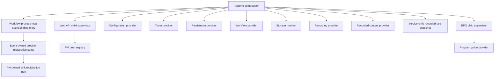
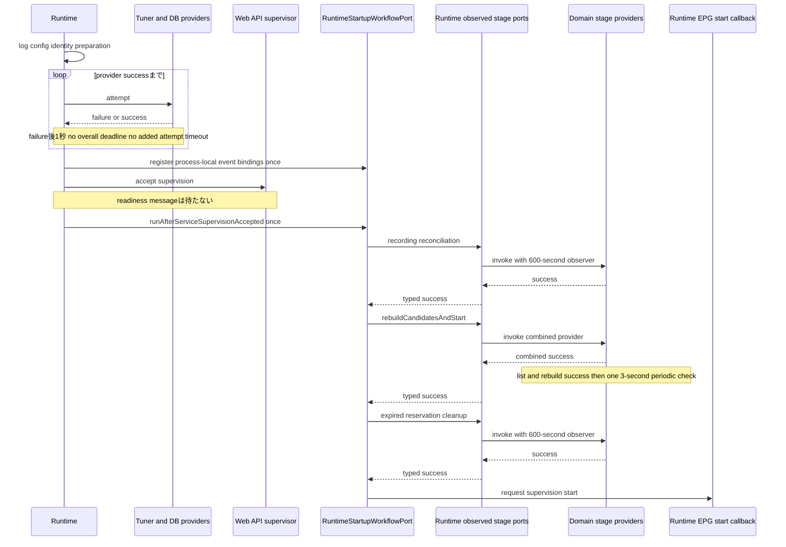
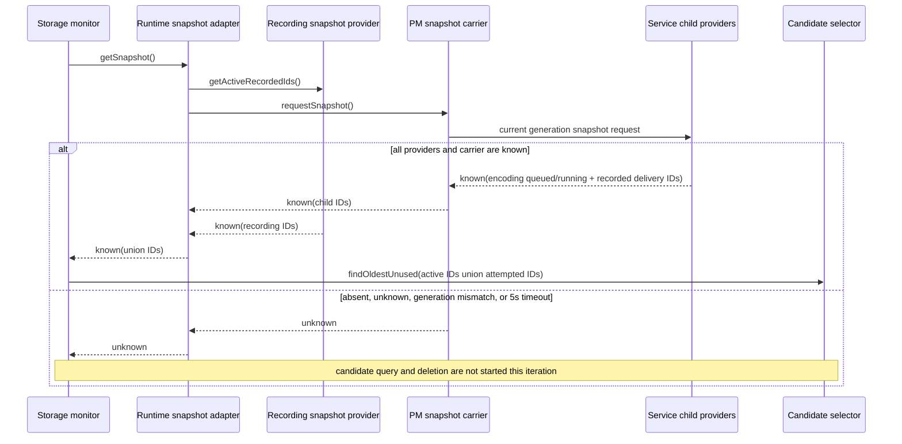
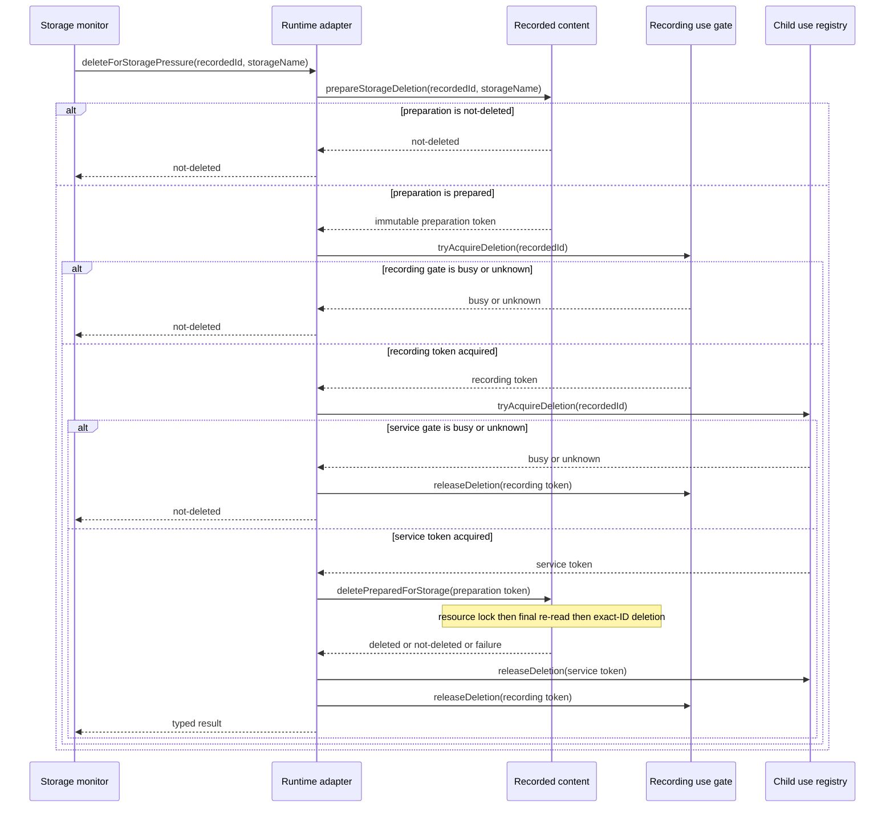
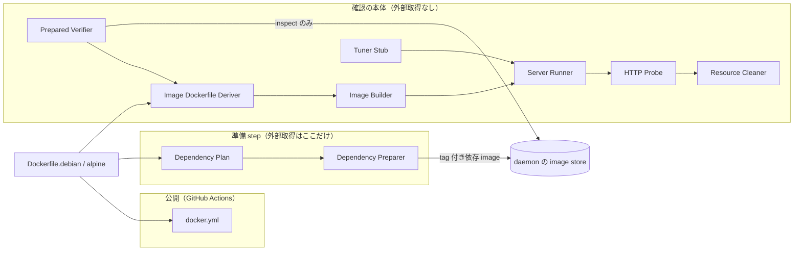
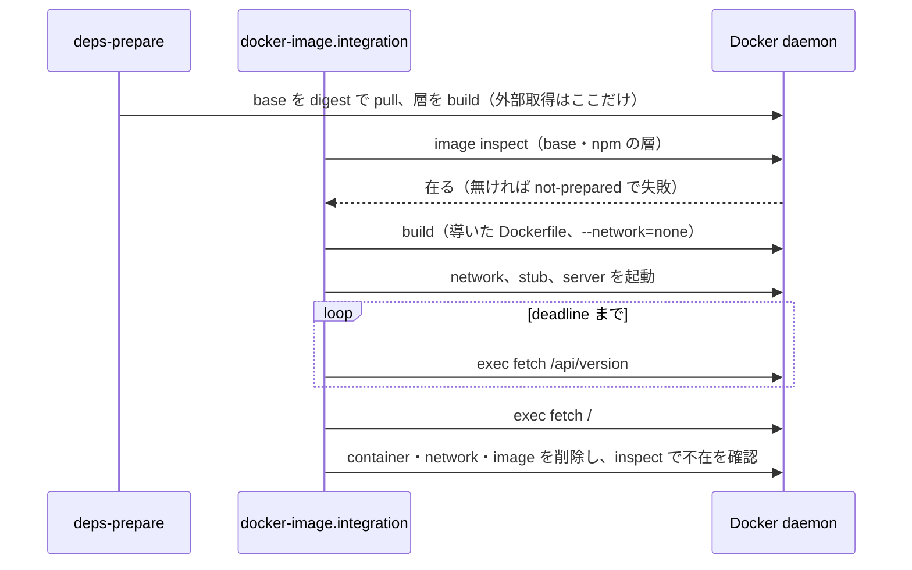

# サーバー起動・稼働管理機能 設計

## 1. 目的と責任境界

本機能は、EPGStation Serverを利用可能にするための起動順序を管理する。ログと設定を準備し、必要なら実行user/groupを切り替
え、チューナーサーバーとDBを待ち、予約・録画、Web・API、起動時整理、番組情報更新を順に開始する。Web・APIと番組情報更新は
別child processとして起動し、終了時に再起動する。

本機能は composition root であり、起動前準備と依存待ち、Workflow provider が公開する起動continuation入口とprocess-local
event binding入口の一回だけの呼出し、child generationごとの監督、soft deadline の観測、全server機能が共有する
test foundation（coverageの計測の道具を含む）、および公開用Docker imageの構築・起動確認と公開workflowだけを所有する。予約、録画、録画済み番組、容量管理、workflow、番組更新、Web・API、event payload、
およびHLS成果物の業務algorithmは各owner機能へ委譲する。全機能共通のready状態またはshutdown drainも提供しない。

共有server test foundationのownerは本機能だけである。server全体のC0・C1の判定（Requirement 9 Acceptance Criterion 9）も本機能が
行う。`client/`のrunner、coverage、品質判定は所有せず、server用の判定をclientへ適用しない。

## 2. 依存関係とprocess構成



| process               | 主な責任                            | 監督                                              |
| --------------------- | ----------------------------------- | ------------------------------------------------- |
| 予約・録画管理process | 起動順、composition、起動段階の監督 | OS/service manager                                |
| Web・API child        | HTTP、static file、realtime通知     | 親processが`exit`/`error`の先着terminal後に再起動 |
| 番組情報更新 child    | 番組取得・更新                      | 親が四terminal eventの先着後に回収・再起動        |

`src/index.ts`が上記processをcompositionし、service childについてはgeneration単位のsingle terminal
settlementとstale callback fenceを保持する。storage削除adapterのbindingと、Workflow入口の背後でevent providerをPMへ
登録する依存方向（`EventSetter.set()`の一回呼出し）も実装済みである。

## 3. 論理コンポーネント

| コンポーネント                       | Runtimeが所有する役割                                                                 | Provider owner         |
| ------------------------------------ | ------------------------------------------------------------------------------------- | ---------------------- |
| Startup Workflow Invocation          | observed stage portとEPG開始callbackをbindingし、Workflow入口を一回invoke             | Workflow               |
| Dependency Waiter                    | provider試行を1秒後に再呼出しし、成功まで後続を止める                                 | tuner / DB             |
| Operator Composition                 | 同じtuner snapshotの配布、Workflow event binding入口の一回呼出し、storage monitor開始 | domain各機能           |
| Service Child Supervisor             | generation、terminal先着、一回restart、current peer登録一回                           | PM / SI                |
| Startup Stage Observer               | 600秒soft deadline、late settlementの一回遷移                                         | stage provider         |
| EPG Child Supervisor                 | generation、四terminal先着、listener回収、再起動                                      | program guide          |
| Storage Deletion Composition Adapter | typed snapshot、recordingとservice-child use gate、provider call順のbinding           | SM / PM / RE / RC / SI |
| Workflow Event Binding Invocation    | Workflow providerのprocess-local event binding入口を一回だけ呼ぶ                      | Workflow               |
| Server Test Foundation               | 共通runner、coverageの計測の道具、artifactの基盤                                      | Runtimeのみ            |
| Docker Image Check                   | 製品のDockerfileから構築したimageを起動し、Web・APIの応答を手元で確かめる（§17）      | Docker                 |
| Docker Publish Workflow              | `master`へのpushとtagで公開用imageを構築してDocker Hubへ公開する（§17）              | GitHub Actions         |

Runtimeは上表のprovider内部algorithm、payload schema、DB transaction、filesystem削除、録画terminal barrierの判定内容を所
有しない。

## 4. 起動sequence



実行順序:

1. 運用ログを初期化し、設定を取得する。
2. root起動なら、`gid`が`null`または`undefined`のときだけ`video` groupへ切り替え、空文字列を含む文字列または数値が設定されているときはその値のgroupへ切り替える。設定されたuserがあればuserも切り替える。
3. 切替後の実行主体で予約・録画管理用log設定を読み込む。
4. チューナーサーバーの状態取得を試し、失敗中は1秒待って繰り返す。
5. 成功後にDB接続確認へ進み、失敗中は1秒待って繰り返す。
6. Workflow providerのprocess-local event binding入口を一回呼ぶ。Workflowはevent-and-hook-delivery所有の引数なし
   provider-registration入口を呼び、同機能がPM所有registration portへproviderを一回登録する。RuntimeはPMのsink
   registration型またはevent provider実装を直接参照しない。
7. tuner一覧を取得し、予約競合判定と録画処理へ同じsnapshotを渡した後、storage monitorを開始する。
8. Web・API childの監督受付を成立させ、現在generationをIPC相手へ一回登録する。readiness messageは待たない。
9. Runtimeは、各domain stageを600秒soft observerで包んだport、Recording Execution所有のcombined
   `rebuildCandidatesAndStart()` port、およびEPG child監督開始callbackを `RuntimeStartupWorkflowPort`へbindingし、その入
   口を一回だけinvokeする。
10. Workflow providerは、起動時録画整理→combined候補再構築・3秒周期処理開始→期限切れ予約整理をtyped success後だけ順に呼
    び、最初のfailureで後続を止める。候補再構築と3秒scheduler開始を二つのprovider callへ分割しない。
11. 期限切れ予約整理の成功後、Workflow providerはbindingされたEPG開始callbackを一回呼び、Runtimeが番組情報更新childの監
    督を開始する。

9から11の論理的なcontinuation policy、stage選択、順序、およびtyped success/failureは `server-workflow-coordination`
Requirement 7.9-7.10が所有する。Runtimeはそのpolicyを変えず、Workflow入口の一回開始guard、各providerのoriginal Promiseへ
付ける600秒soft deadline観測、provider binding、およびEPG child supervisionを所有する。Workflowが同じ段階を自動retryせ
ず、RuntimeもWorkflow入口またはdomain stageを独自に再実行しない。Runtimeは録画整理、候補選択、3秒周期内の対象判定、予約
削除、番組更新のdomain algorithmまたはWorkflowのcontinuation判断を再実装しない。

外部依存先の待機全体に期限を設けない。一回の状態取得・DB接続試行にもEPGStation独自timeoutを重ねない。依存先固有clientや
DB driverのprovider-drivenな完了だけを待つ。`ConnectionCheckModel.checkDB()`を再利用するbackup、restore、およびv1
migrationもDB availabilityを無期限に待つ例外を維持し、Runtimeまたはmanagement toolが有限deadlineを追加しない。

tuner一覧の取得に失敗した場合も、先に登録済みのevent bindingを解除または再登録せず、tuner情報設定、容量監視、および後続
機能を開始しない。失敗を重大な未処理非同期失敗として記録するが、その記録だけを理由に予約・録画管理processを明示終了また
は自己再起動しない。

## 5. Node.jsと起動失敗

最低対応環境はNode.js 24、追加互換検証対象はNode.js 26とする。rootのversion宣言、型定義、開発環境、および
`Dockerfile.debian`と`Dockerfile.alpine`のserver build/runtime stageはNode.js 24を基準とし、client builderのNode.js 26と
は役割を分ける。24未満を対応対象として表明せず、Node.js 26の成功によって最低対応版を26へ引き上げない。

両環境はfreshな依存導入、server build、全server test（compiled startup smokeを含む）を同じ固定matrixで検証する。Node.js 24の
回は、単体test（spec・imp）をcoverage付きで一度、結合testをcoverageなしで一度流し、C0/C1を計測する（§12.4）。どのtestも二度は流さない。

ログ、設定、実行主体切替、または初期依存準備の例外は起動失敗として非0終了する。一方、予約・録画管理processに既に登録され
ている未捕捉例外・未処理Promise rejectionのhandlerは重大logを残すだけという動作を維持し、それだけを根拠に新しい停止・再
起動制御を追加しない。

## 6. 起動時整理

起動時compositionは次の四段階である。Workflowは成功/failureから次にどのtyped operationへ進むかという論理policyと各段階の
invoke順を所有し、Runtimeはobserved portとEPG開始callbackをbindingして単一Workflow入口をparent lifecycle上で一回invokeす
る。業務処理のownerは括弧内に示す。

1. 録画中のまま残った録画情報を整理する（workflow / recording / recorded-content）。
2. 保存済み予約から録画候補を再構築し、再構築成功後に録画対象を確認する3秒周期処理を開始する（recording-executionの同じ
   start lifecycle）。
3. 終了時刻を過ぎた予約を削除する（reservation-management）。
4. 番組情報更新childの監督を開始する（program-guide provider、Runtime supervisor）。

段階1では移動可能な一時録画fileの通常保存先への移動と、対応予約を確認できるfileのsize反映をowner providerが試みる。
Runtimeは項目単位の継続、通知選択、filesystem操作を再実装しない。Workflowは各段階を前段成功後だけ開始する。一段階が
rejectまたは同期throwした場合は後続を開始せず、自動retryしない。Runtimeはこの判断を複製せず、観測wrapperから同じtyped
outcomeを返す。Web・API childは整理完了を待たずに受付可能になり、整理に依存しない業務は継続する。

`RuntimeStartupWorkflowPort.runAfterServiceSupervisionAccepted`はこの判断をthrowせず、`{ kind: 'Failed', stage, cause }`
としてfulfilする。Runtimeはこのfulfilした`Failed` outcomeを`src/index.ts`の既存重大異常記録経路(`log.system.fatal`)へ
stageとcauseを一回だけ記録し、process全体のunhandledRejectionへ意図的に漏らさない。`Succeeded`のときは記録しない。この
記録だけを理由に予約・録画を管理するprocessを終了、再起動、または同じ段階のretryをしない。Runtimeが保持する予期しない
Promise rejection用catchは維持するが、typed `Failed`と予期しないrejectionを混同しない。実装は`src/index.ts`の
`runStartupWorkflow`である。

段階1から3の観測deadlineは開始から600秒（`STARTUP_STAGE_OVERDUE_MS = 600_000`、`src/StartupStageObserver.ts`）とする。こ
れは処理を解放するtimeoutではなくsoft observationである。600秒到達時は
overdueを一回記録するだけで、underlying処理を完了、取消、解放、失敗または再実行済みと扱わず、後段へ進まない。original
Promiseを引き続き所有し、後から成功した場合はtyped successをWorkflowへ一回返し、後から失敗した場合はtyped failureを一回
返す。同じ段階を並行再実行しない。observer timerとoriginal settlementが同じtickで競合してもobserverのterminal outcomeは
一回だけで、後段開始の一回性はそのoutcomeを受けるWorkflow providerが所有する。

`observeStartupStage`（`src/StartupStageObserver.ts`）は600秒のtimerを張ってoverdueを一回記録するだけで、original Promiseの
settlementをそのままWorkflowへ返す。terminalの一回性と後段開始の一回性はWorkflow（`StartupContinuationCoordinator`）が持ち、
段階の状態を保持する別の型は持たない。再起動後の途中再開用記録は持たない。通常の業務eventを構成できる結果は各所有機能へ
通知を委譲し、起動時整理専用の画面eventは追加しない。

`src/index.ts`の`createObservedStartupWorkflowInput`は、録画reconciliation、保存済み予約候補再構築と3秒周期開始を包む
combined stage、期限切れ予約cleanupをそれぞれ600秒observerで包んだobserved portsと、EPG開始callbackを作る。
`runStartupWorkflow`は`IRuntimeStartupWorkflowPort.runAfterServiceSupervisionAccepted`へそれを渡して一回だけ開始する。

## 7. Web・API childの監督

各spawnにはchildとの相関だけに用いるopaqueなservice identityをfreshに新規割当し、過去のidentityを再利用しない。identity
の大小・順序、永続値、IPC公開値、正負分岐としては扱わない。新identityのchildをspawnし、そのterminal settlementと
stdout/stderr drain listenerを設置した時点で監督を受理する。起動成立を知らせる追加messageは待たず、active-child参照とPM
のcurrent IPC peerへ同じchild identityをそれぞれ一回だけ登録する。

`exit`と`error`はgeneration内の一つのterminal settlementを競う。先着eventだけが次の順序を実行する。

1. generationをterminalへ一回commitし、後着terminal callbackをno-opにする。
2. child、stdout、stderrへ登録したRuntime監督listenerを取り除く。
3. active-childが同じobject identityの場合だけ参照を無効化する。PM peerのidentity-based無効化はPM ownerへ委譲する。
4. 異常と再起動を記録する。
5. 次generationを一回だけspawnし、active-childとIPC peerを新childへ一回だけ登録する。

旧generationのstale callbackは新しいactive-childまたはIPC peerを置換、無効化、再登録できない。登録済みchildを通知先とし
て利用できるか、受付依頼へのreplyをどのchildへ返すかは`server-process-messaging`がchild identityと送信結果から判断する。
stdout/stderrをpipeで受ける場合はbuffer滞留を防ぐため読み取る。再起動回数に固定上限を設けず、共通shutdown coordinator、
readiness state、固定restart cap、子孫process回収は追加しない。

`src/index.ts`の`runService`はspawnごとにfreshなidentityを割当て、`terminalSettled`、child object identity、service
identityの一致でterminal callbackをfenceする。先着は監督listenerをdetachし、active参照を無効化して一回だけ
`runService()`を呼ぶ。identityはこの相関以外に使わず、spawn直後の`ipcServer.register(child)`とreadiness messageを待たな
い挙動を維持する。

## 8. 番組情報更新childの監督

`updated` messageのpayload解釈と予約更新への連携はprogram-guide/event ownerへ委譲する。RuntimeはEPG childのgenerationと
監督だけをcompositionする。

各generationでは`exit`、`disconnect`、`close`、`error`が一つのterminal settlementを競う。先着だけがgenerationをterminal
へcommitし、同じchildとstdout/stderrの監督listenerを除去し、active identity一致時だけ参照を無効化して、次generationを一
回spawnする。`disconnect`が先着した場合はlistener除去と再起動の前にそのexact childへ`SIGINT`を一回送る。後着eventと旧
generationのstale callbackは新generationを停止、置換、再起動できない。stdout/stderrはbuffer滞留を防ぐため読み取り、再起
動回数に固定上限を設けない。

`src/model/epgUpdater/EPGUpdateExecutorManageModel.ts`は四event、disconnect時SIGINT、listener除去、stdout/stderr drain、
固定上限なしに加え、generation identity、active-child参照、single terminal settlementを保持する。先着eventだけが
terminalを一回commitして次のspawnを一回行い、後着/stale callbackは新generationを停止、置換、再起動できない
（exactly-one continuity contract）。

## 9. 録画済み資源削除のcomposition

三つの削除経路は一つへ統合しない。Runtimeはservice childとparent processのcomposition topology、およびtyped portへの
bindingだけを所有する。削除選択、Encode取消、録画停止判断、prepared plan、lock、filesystem/DB効果はWorkflow、
recording-execution、recorded-content、storage-managementのowner contractに従う。

### 9.1 利用者による録画済み番組全体削除

service childでは、Service Interface compositionがWorkflow所有`ServiceChildUserDeletionCoordinator`をEncode取消provider
と`ChildUserDeletionRequestPort`へbindingする。Encode取消成功後にだけoutbound portを一回呼ぶ順序はWorkflowが所有し、
Service Interfaceがoutbound portを既存PM client adapterの`recorded.delete(recordedId)`へ写像する。Runtimeはchild内の
route、coordinator、Encode provider、PM client adapterをcompositionせず、childのspawn、generation identity、およびparent
側handler bindingだけを所有する。

parent processでは、PM `recorded.delete` handler adapterをWorkflow所有
`ParentUserDeletionCoordinator.deleteFromRequest(recordedId)`へbindingする。parent coordinatorをrecorded-content所
有`IPreparedRecordedDeletionProvider`とrecording-execution所有`RecordingDeletionPort`へ接続する。Workflowは
`prepareUserDeletion`→必要なterminal barrier→`deletePrepared`のcoordinationを所有し、recorded-contentがresource lock内最
終再読取とexact-ID効果を所有する。Runtimeはこの順序を業務algorithmとして複製せず、port実装とhandlerを配線する。

既存PM model/function/args/replyと通常5秒carrier timeoutを変更せず、新しいIPC operationを追加しない。service child側の
Encode失敗、carrier timeout、parent prepare/barrier/delete failureをRuntimeがretry、cancel、rollbackまたは途中再開しな
い。

### 9.2 利用者による個別録画file削除

parent processの既存PM `recorded.deleteVideoFile(videoFileId)` handler adapterをWorkflow所有
`ParentVideoFileDeletionCoordinator.deleteVideoFileFromRequest(videoFileId)`へbindingする。coordinatorはrecorded-content
所有`IPreparedVideoFileDeletionProvider`、`IPreparedRecordedDeletionProvider`とrecording-execution所有 `RecordingDeletionPort`を利
用する。

direct planでは`deletePreparedVideoFile`へ進み、録画中または最終file削除後の
`WholeRecordedDeletionRequired(recordedId)`ではfreshな`prepareUserDeletion`から必要なterminal barrier、lock内最終再読
取、exact-ID whole deletionへ進む。このdecisionと順序はWorkflow/recorded-content ownerが持ち、Runtimeはbindingだけを持
つ。個別file経路へservice childのEncode取消を追加せず、既存`videoFileId` wire、reply、通常5秒carrier timeoutを変えない。

### 9.3 容量不足削除

容量監視は`server-storage-management`所有のtyped consumer port
`IRecordedStorageDeletionPort.deleteForStoragePressure(recordedId, storageName)`へだけ依存する。Runtimeはこのportに、
recording、service-child resource use registry、およびrecorded-contentのproviderを組み合わせるadapterを一回bindingする。
容量不足削除は利用者削除workflowを経由せず、進行中の録画、Encode、または配信を停止・取消せず、workflowの利用者削除
algorithmもRuntimeへ移さない。

```ts
type RecordedResourceUseKind = 'encoding' | 'delivery';

interface ParentRecordedResourceUseRegistry {
    acquire(input: {
        readonly senderPeer: object;
        readonly requestId: number;
        readonly recordedId: number;
        readonly kind: RecordedResourceUseKind;
    }): { readonly status: 'granted' | 'blocked' | 'unknown' };
    release(input: {
        readonly senderPeer: object;
        readonly acquisitionRequestId: number;
    }): 'released' | 'already-released' | 'unknown';
}

interface RecordingRecordedUseGate {
    tryAcquireDeletion(recordedId: number): { readonly token: object } | { readonly status: 'busy' | 'unknown' };
    releaseDeletion(token: object): void;
}

type RecordedUseSnapshot =
    | { readonly status: 'known'; readonly recordedIds: ReadonlySet<number> }
    | { readonly status: 'unknown' };

interface RecordingRecordedUseSnapshotProvider {
    getActiveRecordedIds(): RecordedUseSnapshot;
}

type RecordedUseSnapshotPayload =
    | { readonly status: 'known'; readonly recordedIds: readonly number[] }
    | { readonly status: 'unknown' };

interface RecordedUseSnapshotClient {
    requestSnapshot(): Promise<RecordedUseSnapshotPayload>;
}

type StorageRecordedUseSnapshot =
    | { readonly status: 'known'; readonly recordedIds: ReadonlySet<number> }
    | { readonly status: 'unknown' };

interface IStorageRecordedUseSnapshotPort {
    getSnapshot(): Promise<StorageRecordedUseSnapshot>;
}
```

`ServiceChildRecordedUseRegistry`は`ParentRecordedResourceUseRegistry`と`RecordingRecordedUseGate`を実装するparent Runtime内の正本である。service childの長期保存Encodeは待機列へ公開する前、録画file配
信はfileの最終再照会・open・response開始より前にPMの内部resource-control requestを一回送り、parentがrequest senderの
object identityから確定したgenerationとPM request IDへleaseを結び付ける。Encodeは同じleaseを待機中から実行・結果反映
terminalまで保持する。childがgenerationを自己申告して選ばない。live配信はrecorded resourceを使わないため対象外である。

acquire/releaseは通常PM requestと同じ5秒期限を使用し、新しい設定値、retry、永続queue、または公開APIを追加しない。acquire
が失敗または期限超過ならEncode／録画file配信を開始しない。期限超過後のlate acquire replyはuse開始へ採用せず、同じ
generationとrequest IDの解放をbest-effortで一回依頼する。releaseの送信・応答を確認できない場合、parentはそのleaseを「使
用なし」へ推測で変えず、容量不足削除を`not-deleted`にする。これは新しい利用者向け業務operationではなく、承認済みの削除直
前排他確認を成立させる内部resource-control protocolである。

service childの有効なpeerが登録されていない場合、またはgenerationのuse状態を確認できない場合も
`tryAcquireDeletion()`は`unknown`を返す。旧generationの遅延releaseは新generationのleaseを解放しない。childの
`disconnect`、`error`、`exit`、`close`だけを根拠にchildが開始したfile/processの終端を推測せず、未解放leaseはunknownとし
て残す。deletion tokenを保持中にchildが置換されてもparent registryはblockを維持し、新generationの同じrecorded IDに対する
acquireを拒否する。

`RecordingRecordedUseGate`はRecording Execution providerがsession registryと同じ直列化境界で実装する。既存sessionが対象
recorded IDへ作用中なら`busy`、状態を確定できなければ`unknown`を返す。token保持中は同じrecorded IDへ作用する新しい録画
sessionを開始しない。容量不足削除はこのgateを録画取消へ変換しない。

Runtime-owned `IStorageRecordedUseSnapshotPort` adapterはStorageが候補queryを行う直前に呼ばれる。adapterは
`RecordingRecordedUseSnapshotProvider`と、PMの既存resource-control carrierを使う
`RecordedUseSnapshotClient`をそれぞれ一回読取り、両方が`known`の場合だけchildのserializable readonly
`number[]`を検証してprocess内Setへ変換・重複除去し、Recording側Setとの和集合を`known(recordedIds)`として返す。service
child側の集合はEncodingの待機列・実行中一覧と、Media Deliveryのactive録画file配信を含み、live配信を含まない。Set、
generation object、tokenなどのobject参照をprocess間carrierへ載せない。

recording provider、service child、登録generation、child内provider、carrier responseのいずれかが不在・不明の場合、配列要
素をrecorded IDとして検証できない場合、またはPMの通常5秒期限が到達した場合は、集合の一部を返さず`unknown`とする。期限後
のlate replyを次の監視回へ再利用しない。Runtimeは`unknown`を空集合へ変換せず、Storageはその監視回をcandidate query前に終
了する。このsnapshotは候補から明らかな利用中IDを除外する助言的filterであり、削除直前の権威的判定ではない。したがって既存
のprepare→recording gate→service-child gate→lock内最終再読取・exact-ID deleteを省略・置換しない。





不変条件は次のとおりである。

-   順序は副作用のない`prepare`、recording gate、service-child gate、recorded-content内のresource lockと最終再読取、最終
    計画のexact-ID削除である。停止前snapshotを削除効果へ使わない。
-   recording gateまたはservice-child gateが`busy`／`unknown`ならfile、DB、録画取消、Encode取消を開始せず
    `not-deleted`を返す。後段gateを取得できない場合は取得済みの前段gateだけを一回解放する。
-   両gateを取得した後は、success、`not-deleted`、provider rejection、および同期throwを含む全terminal pathでservice、
    recordingの逆順に各tokenを一回解放する。
-   storage-managementは容量、候補ID、保存先名、削除result、削除後容量再取得を所有する。
-   Runtime-owned snapshot adapterはrecordingとcurrent service childのread-only providerがすべて`known`の場合だけ和集合
    を返す。一部だけの集合、空集合へのfallback、retry、前generationまたはlate replyの再利用を行わない。
-   snapshotはcandidate filterだけに使い、取得後の競合を防ぐ権威的gateとして扱わない。final deletion sequenceは二つの
    deletion gateとlock内最終再読取を常に維持する。
-   recording-executionはactive判定と新しい同ID利用のblockだけを所有する。容量不足削除から60秒の利用者削除terminal
    barrierまたは`recorded-content-deletion`取消を呼ばない。
-   PMはchild use leaseのrequest/reply identityと5秒carrierを、Service Interfaceはchild側のEncode／Media Delivery
    consumer port bindingを、Encodingは待機列への公開前からterminalまでleaseを保持する規則を、Media Deliveryはfile利用前
    にleaseを取得する規則を所有する。
-   recorded-contentはimmutable preparation token、resource lock、最終DB/filesystem再読取、保存先所属・保護・relation再
    確認、exact-ID file/row deletion、全settlementを所有する。
-   workflow-coordinationは利用者削除の調整algorithmを所有するが、容量不足削除pathからは呼ばれない。
-   Runtimeは上記providerの呼出し順、typed result投影、binding、一回解放だけを所有する。

`src/model/operator/storage/StorageManageModel.ts`は、typed port（`IStorageDeletionCandidatePort`・
`IRecordedStorageDeletionPort`・`IStorageRecordedUseSnapshotPort`）を注入されて候補の選別と削除を行い、削除後に容量を再取得する。
`ModelContainerSetter.ts`が`StoragePressureDeletionAdapter`をbindし、adapterが保存先を含むprepare、recording gate、
service-child gate、lock内最終再読取、exact-ID最終削除を上記の順序で呼ぶ。

cross-spec integrationの具体locatorは
`test/server/application-runtime/storage-pressure-deletion.integration.test.ts#exclusive-prepare-and-final-delete` とす
る。これは`server-storage-management`の`INT-CASES-SM-6.4` runtime-owner行を供給し、snapshot `known`時の
recording/Encoding待機中・実行中/active録画file配信ID和集合、snapshot `unknown`時のcandidate query 0件、Storage fixture
から受けたcandidate ID/storageName、prepare→二gate→final deleteの順序、各gate一回解放、active
recording/Encode/delivery、current child不在、unknown generation、snapshot/acquire/release timeout、late reply、child
replacement、新use race、 `deleted`/`not-deleted`/rejection投影を検証する。特に
`snapshot known(empty) → candidate選択 → 同じIDのEncode受付`を固定interleavingで実行し、Encodeのleaseが先着した場合は
queue公開後の最終削除が`not-deleted`、deletion tokenが先着した場合はEncodeがqueue公開前に失敗となり、いずれもfinal
deleteとqueued/running jobの重複が0件であることを確認する。容量削除からqueue取消、drain、Encode終了待ち、またはretryを呼
ばないことも確認し、domain内部testを重複しない。

利用者全体削除の具体locatorは
`test/server/application-runtime/user-whole-recorded-deletion.integration.test.ts#service-pm-parent-prepared-final-delete`、
個別file削除は
`test/server/application-runtime/individual-video-file-deletion.integration.test.ts#direct-or-fresh-whole-delete`とす
る。前者はservice coordinator→outbound port→既存PM carrier→parent handler adapter→parent coordinator→provider portsを接
続し、後者はexisting individual carrier→parent video coordinator→directまたはfresh whole provider pathを接続する。
Workflow coordinatorのcase、PM transportのrequest/reply identity、recorded-content/recordingの内部algorithmは各owner
testを再利用し、Runtime integrationはbinding、process境界、call先identity、重複登録0だけを検証する。

## 10. Encode完了port登録の起動境界

`server-process-messaging`が`EncodeCompletionInfo`、consumer-owned `EncodeCompletionSink.accept(info)`、および
`EncodeCompletionSinkRegistrationPort`を所有し、event-and-hook-deliveryがprovider implementationと引数なしの
provider-registration入口を提供する。Workflowのprocess-local event binding入口はそのEvent-owned入口を一回呼ぶ。Runtimeは
Workflow入口を一回開始するだけで、PMのsink registration型、event provider実装、payload field、dispatcher route、
listener、hook選択、または画面通知algorithmを直接参照しない。

PM所有の`EncodeCompletionSink`・`EncodeCompletionSinkRegistrationPort`（`src/model/ipc/IEncodeCompletionSink.ts`）、event
provider実装（`OperatorEncodeEvent`）、Event-ownedのprovider-registration入口（`OperatorEncodeEventBinding.setup()`）、および
Workflowのevent binding入口（`EventSetter.set()`）から同入口を一回呼ぶ依存方向は実装済みである。PM sourceからevent
interfaceへの静的importはない。

Runtimeの具体的なtest locatorは
`test/server/application-runtime/encode-completion-binding.integration.test.ts#workflow-event-binding-invoked-once`とす
る。RuntimeがWorkflowのevent binding入口を一回だけ呼び、Runtime再入時にも重複呼出しを作らないことを検証する。PM
dispatcherから同じproviderへの一回配送、Event-owned registrationの一回性、およびPM sourceからevent providerへの静的
reverse import 0はProcess Messaging、Event／Hook、Workflowのowner testで検証し、Runtime testへ各機能の内部構成を複製しな
い。

## 11. 準備完了状態と終了境界

Web・API受付開始、起動時整理完了、番組情報更新開始、最初の更新完了は別々の事実であり、一つの公開ready状態へまとめない。
本機能は全child・予約・録画・配信をdrainする共通shutdown coordinatorを追加しない。600秒overdueもready、failure、
release、cancelまたはshutdown signalへ変換しない。

## 12. テスト・品質設計

### 12.1 品質判定の成立条件

server変更の完了は、Requirement 9 Acceptance Criterion 9に従い、全server機能の単体test（spec・imp）と結合testがすべて成功し、
単体testだけでserverの`src/**`のC0・C1がともに100%であり、`.kiro/steering/server-testing.md`の共通品質判定へ適合した場合に限って
判定する。Runtimeに残る規則は次の一点である。

-   共有foundation、固定script、test、またはreportが存在すること自体をPASSへ読み替えない。coverageは全testの完了後に
    C0/C1を集計し、100%未達は非0終了とする。閾値を緩和したり成功へ変換したりしない。

### 12.2 共有foundation

本機能は全server機能が共用するfoundationを一度だけ所有する。各機能は独自runner、別test root、別coverage
configurationを作らず、機能固有testとfixtureだけを追加する。

| 要素                      | Locator                                      | 契約                                                                                               |
| ------------------------- | -------------------------------------------- | -------------------------------------------------------------------------------------------------- |
| test root                 | `test/server/`                               | server testの唯一のroot。clientを含めない                                                          |
| runner config             | `vitest.server.config.ts`                    | Vitest、V8、spec/imp/integration project、source map                                               |
| harness                   | `test/server/harness/`                       | synthetic fixture、fake timer、deferred Promise、call ledger、temporary filesystem、isolated child |
| artifact ignore           | `test/server/.gitignore`の`.artifacts/`      | report、incremental state、一時成果物をGit管理外にする                                             |
| coverage artifact         | `test/server/.artifacts/coverage/`           | C0/C1 report。tracked fileへ複製しない                                                             |
| runtime artifact          | `test/server/.artifacts/runtime/`            | synthetic child/DB/filesystem実行の一時成果物。private runtime値を保存しない                       |

production serverをcompileした後、testはproductionと同じ`dist`成果物をimportし、source mapで`src/**/*.ts`へ結果を対応付
ける。pure build入口`test:server:build`がそのworkspace内の`dist/`を削除してから
TypeScriptをcompileする。production sourceを書き換えるlint/format commandをtest buildへ含めない。fixtureとartifactに実
URL、実番組情報、credential、実保存path、実チューナー情報を含めない。

root packageは次の固定scriptを提供する。

```text
test:server:build       = workspace-local distを消去してserver TypeScriptだけをcompile
test:server:spec        = compile後にunittest/specだけを実行
test:server:imp         = compile後にunittest/impだけを実行
test:server:integration = compile後にintegrationだけを実行
test:server             = 上記三層を固定順で全実行
test:server:coverage    = spec・impの単体testだけをcoverage付きで一度実行し、serverの`src/**`のC0/C1を計測して、100%未満を非0終了にする
```

この6 commandはroot packageの公開 command 集合である。

### 12.3 Coverageの計測の道具

本機能は、serverの`src/**`のC0・C1を単体test（spec・imp）だけで計測する道具を、全server機能のために一度だけ所有する
（Requirement 9 Acceptance Criterion 8）。道具は次の四つで構成し、各機能は独自の計測や閾値を持たない。

| 要素                       | Locator                                                                                                              | 契約                                                                                                                |
| -------------------------- | -------------------------------------------------------------------------------------------------------------------- | ------------------------------------------------------------------------------------------------------------------- |
| worker側のraw coverage取得 | `test/server/harness/coverage-raw-flush.ts`、`coverage-raw-flush-guard.ts`、`coverage-transform-capture.ts`          | Vitest workerが終了する前にV8のraw coverageを書き出し、Vitestが実行したmodule本体（SSR変換後）を保存して、raw offsetを`dist`とsource mapへ対応付けられるようにする      |
| compiled snapshotの計測    | `scripts/server-test/compiled-snapshot-coverage.mjs`                                                                 | raw coverageをistanbul形式へ変換し、`src/**`のC0・C1を集計する。母数を減らせるのはレビュー済みの除外表（`COVERAGE_EXCLUSION_AUTHORIZATIONS`。結び付け方は§12.3.1）と、構文のみのspanを除外する規則だけである |
| C0・C1の集計と判定         | `scripts/server-test/run-coverage-gate-cli.mjs`                                                                      | `npm run test:server:coverage`を実行し、coverage結果からC0・C1と未到達statement・branch数を集計する。test失敗、集計自体の破綻（母数0、malformed）、100%未満のいずれでも非0終了とし、自身は除外を行わない |
| 作業場所の中身の記録       | `scripts/server-test/worktree-content.mjs`                                                                           | 作業場所の中身（追跡中のfileの今の内容と、ignoreされていない未追跡のfile）のtree id、HEADのtree id、両者の違いの有無を求める。coverageのrun、Node.js matrix、preflightが「何を検証したか」の記録と取り出し元に使い、合否の条件には使わない（§12.3.2） |

共通規則の正本は`.kiro/steering/server-testing.md`である。foundationが提供する固定command、artifact配置は§12.2が正本である。

#### 12.3.1 除外の承認の結び付け（Requirement 9 Acceptance Criteria 10〜13）

除外の承認は、除外したcodeとその周りのcodeの中身に結び付け、fileの中の位置（行、列、byte位置）やfile全体のdigestには結び付けない。
このため、commentを直す、離れた場所にcodeを足すといった、除外した箇所と根拠に関係の無い変更では承認が無効にならない。

**守る性質。** 次の性質を保つ。

| ID   | 性質                                                                                                                                                         |
| ---- | ------------------------------------------------------------------------------------------------------------------------------------------------------------ |
| EX-1 | 箇所を指定した除外は、除外表に載ったレビュー済みの承認だけが行える。sourceの注釈やcommentだけで除外は起きない（構文のみのspanの規則は§12.3の表のとおり別に定める） |
| EX-2 | 承認は、除外したstatement・branchのcode、その箇所を含む関数の単位のcode、および承認が根拠として記録した同じfileの関数の単位のcodeに結び付く。どれかが変われば承認は無効になり、coverageの判定が失敗する（再レビューを強制する） |
| EX-3 | anchor 1件はbasisのentryをちょうど1件だけ除く。除く件数は表の件数（statement 67件、branch 20件、16 file）を超えない                                            |
| EX-4 | 解決できない、曖昧、または表と食い違う承認は、除外を適用せず`malformed-coverage-exclusion`で判定を失敗にする（fail-closed）                                 |
| EX-5 | 解決はsource（TypeScript）と静的なbasisだけで決まり、raw coverage、shard、実行順に依らない                                                                  |
| EX-6 | comment・空白・改行（改行に伴う末尾のcommaの付け外しを含む）の変更と、結び付いた関数の単位の外のcodeの変更では、承認は有効のままで、同じ箇所を除く      |
| EX-7 | sourceの末尾のambient marker（`declare const __EPGSTATION_COVERAGE_EXCLUSION_…: unique symbol`）が1 fileに1個だけあり、表の承認と1対1に対応する。markerの位置・形・未知のmarker・別fileのmarkerの検査は今の規則のまま保つ |

**関数の単位。** 結び付けの単位は、classのmember（method、constructor、accessor、初期化子を持つproperty、static block）、
またはfile直下のfunction宣言・変数宣言である。入れ子のclosureは外側の単位に含める。単位は次の名前で指す。

| 単位                       | 名前                                                   |
| -------------------------- | ------------------------------------------------------ |
| classのmember              | `<Class名>.<member名>`。staticは`static `、accessorは`get `・`set `を前に付ける。constructorは`<Class名>.constructor` |
| file直下のfunction宣言     | `function <名前>`                                      |
| file直下の変数宣言         | `const <名前>`（`let`・`var`も同じ形で宣言の種類を書く） |

本体または初期化子を持たない宣言（overloadのsignature、`declare`、abstract）は単位にしない。同じ名前の単位が2つ以上あれば、その名前を
指す承認は曖昧として失敗する。

**codeのtoken列。** 単位のcodeは、TypeScriptのparser（converterが既に使う`typescript`の`ts.createSourceFile`）のASTを
`getChildren`でたどった葉のtokenの列で表す。次だけを除く。

-   comment（JSDocのnodeを含む。`getChildren`はJSDocを子として返すため、JSDocのnodeはたどらない）、空白、改行。
-   閉じ括弧（`)`・`]`・`}`・`>`）の直前のcomma 1個（prettierの`trailingComma: all`が改行に応じて付け外しするもの）。

文字列literalの引用符、括弧、semicolonなど、他のtokenのtextはそのまま残す。単位の指紋`codeSha256`は、token textの配列を
`JSON.stringify`した文字列のsha256である。

**データの形。** 除外表の各承認を次の形にする。`markerlessSourceSha256`と、行・列・byte位置を含むID（位置ID。`statement:<path>:<line>:<col>-<line>:<col>:<start>:<end>`、`branch:…`）は持たない。

```ts
type FunctionUnitName = string; // 例: 'RecorderModel.doRecord'、'static Foo.bar'、'function main'

interface BoundFunction {
    readonly name: FunctionUnitName;
    readonly codeSha256: string; // 単位のtoken列の指紋
}

interface ExclusionAnchor {
    readonly functionName: FunctionUnitName; // boundFunctionsのどれか
    readonly tokenStart: number; // 単位のtoken列での開始index（含む）
    readonly tokenEnd: number; // 終了index（含まない）。tokenStart < tokenEnd
    readonly code: string; // tokens[tokenStart, tokenEnd)のtextを空白1個で連結したもの
}

interface CoverageExclusionAuthorization {
    readonly sourcePath: string; // 'src/**/*.ts'
    readonly markerIdentifier: string;
    readonly decisionIdentity: string;
    readonly owner: string;
    readonly alternativeOwnerEntries: readonly string[];
    readonly boundFunctions: readonly BoundFunction[]; // 除外の箇所を含む単位と、根拠として記録した単位
    readonly statementAnchors: readonly ExclusionAnchor[];
    readonly branchAnchors: readonly ExclusionAnchor[];
}
```

**解決の手順。** markerを持つfileごとに次を行う。どの段で失敗しても、そのfileの除外は適用せず、判定全体を
`malformed-coverage-exclusion`で失敗にする。

1. markerの検査（EX-7）。markerが指す承認の`sourcePath`がそのfileであることを確かめる。
2. `boundFunctions`の各`name`について、名前が一致する単位がちょうど1つであることを確かめ、その単位の`codeSha256`を計算して表の値と
   比べる。違えば、単位の名前、表の値、今の値を示して失敗する（EX-2）。
3. 各anchorについて、`functionName`が`boundFunctions`に含まれること、`tokenStart < tokenEnd`であること、単位のtoken列の
   `[tokenStart, tokenEnd)`のtextの連結が`code`と一致することを確かめる（表の整合）。
4. basisを作った後、各basis entryについて、source mapで対応付けたsource上の始点と終点から、始点を含む単位と、その単位のtoken列での
   `[始点以後の最初のtoken, 終点以後の最初のtoken)`を求め、`(種類, 単位の名前, 開始index, 終了index)`をそのentryのkeyにする。
   単位の外のentry（importなど）はkeyを持たない。
5. 承認のanchorごとに、同じkeyを持つ同じ種類のentryを数える。ちょうど1件ならそのentryを母数と到達済みの両方から除く。0件または
   2件以上なら、anchorと件数を示して失敗する（EX-3、EX-4）。
6. statementとbranchは独立に行う（今と同じ）。

source mapの対応が退化して、2つのdist spanが同じsourceの範囲へ対応する場合がある（constructorのparameter propertyで、
`RecordingManageModel.ts`の140:25-140:44と`StreamManageModel.ts`の86:33-86:40に実在する）。そのような箇所を指すanchorは手順5で
2件となって失敗する。今のanchor 87件（statement 67件・branch 20件）は、実際のcompiled snapshotのbasis（16 fileでstatement 22,800件、branch 1,359件）に対して
それぞれちょうど1件に解決する。

失敗のmessageには、変わった単位の今の`codeSha256`と、anchorの候補（今のkeyとcode）を含め、再レビューの後に表を直せるようにする。
`compiled-snapshot-coverage.mjs`は、与えたsourceとbasis entryから各entryのkey・codeと各単位の`codeSha256`を返す関数と、
承認を引数に取って解決する関数をexportし、testは実装と同じ計算を使う。

**決定。**

| ID      | 決定                                                                                     | 理由                                                                                                                         | 採らなかった案と理由                                                                                                                                                                                                                                                                                                     |
| ------- | ---------------------------------------------------------------------------------------- | ---------------------------------------------------------------------------------------------------------------------------- | ------------------------------------------------------------------------------------------------------------------------------------------------------------------------------------------------------------------------------------------------------------------------------------------------------------------------ |
| DEX-1   | 承認を関数の単位のcodeの指紋に結び付ける                                                 | 除外の箇所とその周りのcodeの変更を検出しつつ、単位の外の変更と位置のずれでは落ちない（EX-2、EX-6）                        | file全体のcomment除去後のdigest: commentと空白は通るが、離れた場所へcodeを足すと落ちる。除外のspanのcodeだけ: 周りのcodeの変更を検出できない。除外を含む最も内側の関数: 小さいclosureだけになり、同じmethodの中の前提（flagの設定、listenerの解除など）が変わっても落ちない                                                  |
| DEX-2   | 根拠が依存する同じfileの別の単位を`boundFunctions`に記録できる                           | 今の承認の根拠は別のmethodのcodeに依る（例: `EncodeManageModel`の`waitQueue`へ積むmethod）。file全体のdigestをやめると、それらの変更で再レビューが起きなくなる | 記録しない: 根拠が変わっても承認が残る。file全体に結び付ける: EX-6を満たさない。他fileの前提は今も結び付けておらず、範囲は今と同じ                                                                                                                                                                                       |
| DEX-3   | 位置を単位のtoken列のindexで持ち、`code`を併記する                                       | 単位の指紋が一致する限りindexは一意で、comment・空白に影響されない。`code`はレビューで読むためと表の整合の確認のため       | `code`の文字列で単位の中を検索: 同じcodeが同じ単位に複数ある（`ReservationManageModel.createDiff`の`0`が3箇所）ため曖昧になる。前後のtokenを文脈に持つ: 文脈の幅を決める規則が増え、指紋で既に周りのcodeを固定している                                                                                                     |
| DEX-4   | 正規化をcomment・空白・改行と、閉じ括弧の直前のcommaに限る                               | 改行の変更に伴ってformatterが付け外しするものだけを同じと見なし、意味の変わり得る違いはcodeの変更として落とす（安全側）   | 引用符・括弧・semicolonも正規化: 意味の変わり得る違いを見逃す余地が増える。formatter（prettier）の出力で比べる: formatterの版と設定が判定に入る                                                                                                                                                                             |
| DEX-5   | tokenはparserのASTの葉から得る                                                           | template literalと正規表現literalをparserが正しく切り分ける                                                                  | scannerを直接回す: template literal・正規表現literalの再走査を自前で行う必要があり誤りやすい                                                                                                                                                                                                                                |
| DEX-6   | 解決はsourceとbasis entryのsource上の位置だけで行う                                      | shard・raw coverage・実行順に依らない（EX-5）。distのbyte位置は前方の変更とcompilerの出力で動く                              | distのspanに結び付ける: sourceの前方の変更やcompilerの出力の変化で動き、reviewerが読むcode（TypeScript）とも離れる                                                                                                                                                                                                         |

#### 12.3.2 gitの状態に依らない合否（Requirement 9 Acceptance Criteria 14〜17）

server test、coverageの判定、Node.js matrix、およびpreflightの合否は、実行時点のfileの中身だけで決める。commit id、treeのid、
未commitの変更の有無は「何を検証したか」の記録として残し、合否の条件にしない。

**作業場所の中身の記録。** `scripts/server-test/worktree-content.mjs`が次を返す。

```ts
interface WorktreeContentRecord {
    readonly contentTree: string | null; // 作業場所の中身（追跡中のfileの今の内容と、ignoreされていない未追跡のfile）のtree id
    readonly headTree: string | null; // HEAD^{tree}
    readonly uncommittedChanges: boolean | null; // contentTree !== headTree
}

declare function snapshotWorktreeContent(repositoryRoot: string): Promise<WorktreeContentRecord>;
```

`test/server/.artifacts/worktree-content/`の下の一時index（`GIT_INDEX_FILE`）へ`git read-tree HEAD`、`git add -A`、
`git write-tree`を行ってcontentTreeを求め、一時indexを消す。利用者のindex、作業file、refは変えない（git objectだけが増える）。
約2,000 fileのrepositoryで約0.3秒である。gitを使えない、またはgitの操作が失敗した場合は該当するfieldを`null`にして返し、扱いは
呼び出し側が決める。commandとして実行すると`contentTree`を1行で出力し、求められなければ非0で終わる。

**coverageのrun。** `scripts/server-test/run-tests.mjs`のcoverage modeは、buildの前に`snapshotWorktreeContent`で記録を取る。

-   未commitの変更がある作業場所でも、その中身を計測して判定する（`dirty-worktree`の失敗は無い）。
-   `coverage-final.binding.json`は`worktreeContent`（`WorktreeContentRecord`）を記録する。記録だけで、
    どのfieldが`null`でも判定は続ける。`missing-binding-digest`は`testRoster`の欠落だけに使う。
-   隔離runtime identityのregistryの照合に使う値（`EPGSTATION_COVERAGE_TREE_DIGEST`）には`contentTree ?? 'unrecorded'`を渡す。
    この値は同じrunの中で書く側と読む側が共有するだけで、gitの状態で合否は変わらない。

**Node.js matrix。** `scripts/server-test/run-node-acceptance-matrix.mjs`の候補を次のように決める。

-   `--candidate <tree id>`は任意である。指定が無ければ`snapshotWorktreeContent`のcontentTree（出所`worktree`）、指定があれば
    そのtree（出所`argument`）を候補とする。どちらもHEADとの一致を求めない（`dirty-worktree`・`candidate-mismatch`の失敗は無い）。
-   fresh workspaceは、候補のtreeから親の無いcommitを作り、linked worktreeとして取り出す。
-   artifactに`candidate: { tree, source, headTree, uncommittedChanges }`を記録する。
-   git repositoryでない、または候補のtreeを取り出せない場合は、workspaceを作れないため`materialize-failed`で失敗する。これは
    workspaceを作るための環境の前提であり、gitの状態で合否を決めるものではない。

**preflight。** `scripts/release-preflight.sh`は開始時に`node scripts/server-test/worktree-content.mjs`で候補のtreeを一度だけ
求め（`CANDIDATE`）、全stepでその中身を検証する。

-   `summary.tsv`の`tree=`は`CANDIDATE`にする。log directoryは`test/server/.artifacts/preflight/<CANDIDATEの先頭12桁>/<開始時刻(UTC)>/`で、
    実行ごとに分ける。HEADのtreeと未commitの変更の有無は開始時にlogへ出す。
    「node-matrix requires a clean tree」の警告を無くす。
-   node-matrixへは`--candidate $CANDIDATE`を渡す。模擬runnerを使うstep（`deps-prepare`、`server-check`、`docker-gate-node24`、
    `client`、`client-browser`）へは`tree:$CANDIDATE`を渡す。
-   実行中にfileを書き換えても、各stepが検証する中身は開始時の`CANDIDATE`のままである。

**模擬runner。** `scripts/ci-rehearsal/job.sh`の第1引数に`tree:<tree id>`を足す。そのtreeから親の無いcommitを作り、一時ref
（`refs/epgstation-rehearsal/<pid>`）を通してbundleにしてcontainerへ渡し、bundleを作った後に一時refを消す。containerの中で
取り出した`HEAD^{tree}`が指定のtreeと一致することを確かめる（取り出しの正しさの確認）。`tree:`のときは、実行するworkflowのstep
（`server.yml`・`client.yml`）も、containerのimageのdigestの期待値（`scripts/ci-rehearsal/image-digest.mjs --tree <tree id>`）も、
作業場所のfileではなく`git show <tree id>:<path>`で開始時のtreeから読む。実行時点の作業場所の書き換えが、照合する中身に混ざらない。
一時refの削除は後始末であり、削除に失敗しても検証の合否にしない（同時に走る別のstepと`packed-refs`のlockを取り合っても、stepを失敗させない）。`local`（HEADのcommitを渡す。pushの前に
hosted CIの`check`を手元で通す用途）と`<40桁のsha>`（push済みのcommitを取る）も受け付ける。

**gitの状態が関わる箇所の洗い出し。**

| 箇所                                                                                                   | 扱い                                                                                                                      |
| ------------------------------------------------------------------------------------------------------ | ------------------------------------------------------------------------------------------------------------------------- |
| `run-tests.mjs`のcoverageのrun                                                                         | 未commitの変更があっても失敗せず、`WorktreeContentRecord`を記録する。gitが使えなければ`null`・`'unrecorded'`で続ける      |
| `run-node-acceptance-matrix.mjs`の`runNodeAcceptanceMatrixCli`                                         | `--candidate`は任意で、未commitの変更やHEADとの違いでは失敗しない                                                         |
| `release-preflight.sh`の候補の決め方                                                                   | 開始時の`CANDIDATE`（作業場所の中身のtree）を全stepで使う                                                                 |
| `ci-rehearsal/job.sh`の`local`                                                                         | HEADのcommitを検証する。gitの状態では失敗しない。preflightのために`tree:`も受け付ける                                     |
| `.github/workflows/server.yml`・`client.yml`の`[[ $(git rev-parse HEAD) == "$EPGSTATION_CANDIDATE_SHA" ]]` | 対象外。取得したcommitが依頼したcommitであることを確かめる取り出しの正しさの確認で、workflowはbyteで固定しているため変えない |
| `.githooks/pre-commit`                                                                                 | 対象外。commitの時の秘密情報の検査で、testの合否ではない                                                                  |
| `scripts/build-cache.mjs`                                                                              | cacheのkeyにgitの状態を使わず、中身のhashを使う                                                                           |
| `test/server/**`                                                                                       | 一時repositoryでgitを呼ぶtestがある（`worktree-content`・`image-digest`の各spec test）。合否は実行している作業木のgitの状態ではなく、testの中で作ったrepositoryの中身で決まる |

**決定。**

| ID     | 決定                                                                                           | 理由                                                                                                       | 採らなかった案と理由                                                                                                                                                       |
| ------ | ---------------------------------------------------------------------------------------------- | ---------------------------------------------------------------------------------------------------------- | -------------------------------------------------------------------------------------------------------------------------------------------------------------------------- |
| DGIT-1 | treeのidは記録として残し、合否に使わない                                                       | 何を検証したかを後から引けるようにしつつ、commitのまとめ直しや未commitの変更で合否が変わらないようにする | 記録も無くす: 結果と中身を結び付けられない。HEADのtreeだけ記録する: 未commitの変更があるときに検証した中身を表さない                                                       |
| DGIT-2 | Node.js matrixとpreflightの既定の取り出し元を、実行時点の作業場所の中身にする                  | 作業場所でそのまま流すtest（`npm run test:server:coverage`など）と同じ中身を検証する                       | HEADのtree: 未commitの変更を検証しないまま合格を記録し、作業場所で流すtestと中身が食い違う                                                                                 |
| DGIT-3 | 中身はgitの一時indexで求めたtreeで表す                                                         | 利用者のindex・作業file・refを変えずに、ignoreの規則に沿った中身を一意のidで表せ、そのままworkspaceを作れる | file一覧を自前でhashする: ignoreの規則を再実装することになり、workspaceを作るためのtreeも別に要る。`git stash create`: 未追跡のfileを含めない                         |
| DGIT-4 | preflightは開始時に一度だけ候補を決め、全stepへ渡す                                            | 実行中にfileを書き換えてもstep間で検証する中身が揃い、`summary.tsv`の`tree=`が全stepの中身を表す           | stepごとに作業場所を読む: 長いrunの途中の編集でstepごとに中身が変わる                                                                                                     |
| DGIT-5 | 模擬runnerの`local`は残し、`tree:`を足す                                                       | pushの前の`check`の模擬はpushするcommit（HEAD）を検証するのが正しい。preflightだけが作業場所の中身を要る | `local`の意味を作業場所の中身に替える: pushの前の確認がpushしないものを検証する                                                                                           |

#### 12.3.3 §12.3.1・§12.3.2が関わるfile

| File                                                                         | 責任                                                                                                       |
| ---------------------------------------------------------------------------- | ---------------------------------------------------------------------------------------------------------- |
| `scripts/server-test/compiled-snapshot-coverage.mjs`                         | token列、関数の単位、承認の解決、除外表の新しい形（§12.3.1）。binding sidecarの`worktreeContent`（§12.3.2） |
| `scripts/server-test/worktree-content.mjs`                                   | 作業場所の中身の記録（§12.3.2）                                                                            |
| `scripts/server-test/run-tests.mjs`                                          | coverageのrunの記録とregistryの照合の値（§12.3.2）                                                        |
| `scripts/server-test/run-node-acceptance-matrix.mjs`                         | 候補の決め方とartifactの記録（§12.3.2）                                                                    |
| `scripts/server-test/run-coverage-gate-cli.mjs`                              | 失敗の理由の説明から未commitの変更を除く（挙動は変えない）                                                 |
| `scripts/release-preflight.sh`、`scripts/ci-rehearsal/job.sh`                | 開始時の`CANDIDATE`と`tree:`の受け渡し、`tree:`でのworkflowのstepとimageのdigestの期待値の読み取り（§12.3.2） |
| `scripts/ci-rehearsal/image-digest.mjs`                                      | `--tree <tree id>`で、digestの入力を作業場所ではなくそのtreeから読む（§12.3.2）                            |
| `test/server/application-runtime/spec/image-digest.spec.test.ts`            | 作業場所のdigestと`--tree`のdigestの一致、作業場所を書き換えても`--tree`のdigestが変わらないcase            |
| `test/server/application-runtime/spec/compiled-snapshot-coverage.test.ts`    | 除外の承認の結び付けと解決のcase、未commitの変更があるrunのcase                                            |
| `test/server/application-runtime/spec/coverage-command-terminal.test.ts`     | coverageのrunとnode-matrix CLIのcase                                                                       |
| `test/server/application-runtime/spec/worktree-content.spec.test.ts`        | 作業場所の中身の記録のcase                                                                                 |

### 12.4 Node.js acceptance

Node.js 24と26の各matrix cellは、独立したfresh workspace（linked worktree）で次のsequenceを実行する。入口は
`scripts/server-test/run-node-acceptance-matrix.mjs`である。workspaceへ取り出す中身は、指定が無ければ実行時点の作業場所の中身、
`--candidate <tree id>`の指定があればそのtreeであり、HEADとの一致や未commitの変更の有無で失敗しない（§12.3.2）。

```text
mise exec node@24 -- npm ci
mise exec node@24 -- npm run build-server
mise exec node@24 -- node scripts/server-test/run-coverage-gate-cli.mjs   # spec・impをcoverage付きで一度。C0/C1を判定
mise exec node@24 -- npm run test:server:integration                         # integrationをcoverageなしで一度

mise exec node@26 -- npm ci
mise exec node@26 -- npm run build-server
mise exec node@26 -- npm run test:server
```

Node.js 24 cellは最低対応acceptanceで、単体test（spec・imp）をcoverage付きで一度（coverageの判定、§12.3）、結合testをcoverageなしで一度
実行する。cellはどちらかが失敗すれば失敗とし、結合testの全件成功もcellの成立条件にする。26 cellは追加互換acceptanceで、
`npm run test:server`（全server test）を一度実行する。どちらのcellもどのtestも二度実行しない。両cellのserver test本体は
`scripts/server-test/node-matrix-worker-cap.mjs`の同じworker上限で実行する。Node.js 18または24未満をfallback証拠にしない。
本matrixはRuntimeのfresh regression（R1.1〜R1.3）が使う固定command集合の正本である。

node-matrixは、各cellが各testを一度ずつ流す構造である。Node.js 24の回は単体testだけにcoverageを付ける。単体testだけの
coverage run（約325秒の実測がある）に、coverageなしの結合testが加わる形で、全testをcoverage付きで一度流す仕事量と同じである。
26の回は全server testを一度流す。

### 12.5 機能固有caseとintegration

機能固有testは、値域`null / empty / 0 / 1 / min / max / out-of-range / invalid type / duplicate`、開始前・進行中・成功・
失敗・cancel非適用・再入・restart、1秒と600秒の直前/到達/超過/late settlement/同tick race、timer・listener・child・IPC
peer・exclusive gateの取得から一回解放までを分類する。該当しない値は理由付きN/Aとし、空欄にしない。

最低限、次のexact case群を持つ。

-   startup composition: service監督受付後の録画整理success→combined候補再構築・3秒周期開始success→期限切れ整理success
    →EPG監督、各stage failureの後続0、600秒overdue時の後続0、late successの次stage一回、late failureの停止一回。
-   child supervision: serviceの`exit`/`error`同tick、EPGの四terminal event全順列、generation listener detach、stale
    callback作用0、restart一回、new child/IPC peer登録一回、disconnect exact childへのSIGINT一回、stdout/stderr drain。
-   dependency wait: tuner/DBの0・1・複数failure後success、長時間/never-settle、1秒sleep、全体deadlineなし、attempt
    timeout追加0。backup/restore/v1 migrationも同じprovider-driven DB waitをcharacterizeする。
-   storage deletion composition:
    `test/server/application-runtime/storage-pressure-deletion.integration.test.ts#exclusive-prepare-and-final-delete`。
    recordingとservice childのsnapshotがすべて`known`のときだけ和集合をcandidate filterへ渡し、provider不在・
    `unknown`・generation不一致・5秒期限ではcandidate query 0件とする。snapshot後の新規利用は二つのdeletion gateで遮断
    し、snapshotだけで最終削除しない。snapshot取得後のEncode受付を固定interleavingで競合させ、lease先着とdeletion token
    先着の両方で削除とqueue公開が重ならず、容量削除がqueue取消・drain・待機・retryを行わないことを確認する。
-   user whole deletion:
    `test/server/application-runtime/user-whole-recorded-deletion.integration.test.ts#service-pm-parent-prepared-final-delete`。
    service childのEncode→abstract outbound、既存PM carrier、parent handler adapter、Workflow parent coordinator、
    recording/recorded-content providerを接続し、transportとcoordinatorを同一視しない。
-   individual video deletion:
    `test/server/application-runtime/individual-video-file-deletion.integration.test.ts#direct-or-fresh-whole-delete`。
    direct planとfresh whole escalationを分け、個別経路のEncode call 0と既存wire不変を確認する。
-   Workflow event binding invocation:
    `test/server/application-runtime/encode-completion-binding.integration.test.ts#workflow-event-binding-invoked-once`。
-   Node.js 24/26 acceptance、root/non-rootとuser/group、同じtuner snapshot、event binding一回、Web受付とcleanupの独立。

integrationはtuner-access経由のsynthetic HTTP状態、temporary SQLite/MySQL DB、isolated Web・API/EPG childとIPC、
recorded-content経由のtemporary filesystem整理、storage削除composition、Workflow event binding入口を接続する。各domainの
内部contractと公開HTTP APIはowner specへ委譲する。

### 12.6 Runtime feature-level completionとcross-spec integration

Runtimeのfeature-level completionは`R9.7` / `AR-9.7`で表す。これは、Runtime自身のfunctional case（R1〜R8）、Runtime固有のquality
contract（R9.3〜R9.6）、および`.kiro/steering/server-testing.md`の共通品質判定への適合を一対一で表す。server全体の
C0・C1の判定は`R9.9` / `AR-9.9`が表し、本機能の共有foundationが行う。

機能間の具体的なintegration locatorは次のとおりである。

| Integration ID                    | 消費側                                         | Runtime locator                                                                                                            |
| --------------------------------- | ---------------------------------------------- | -------------------------------------------------------------------------------------------------------------------------- |
| `RUNTIME-WC-7.9-FAILURE-STOP`     | workflow startup `WC-7.9`                      | `test/server/application-runtime/startup-composition.integration.test.ts#failure-stop`                                     |
| `RUNTIME-WC-7.10-STARTUP`         | workflow startup `WC-7.10`                     | `test/server/application-runtime/startup-composition.integration.test.ts#case-7-10`                                        |
| `RUNTIME-WC-USER-DELETE-BINDING`  | workflow whole-recorded deletion composition   | `test/server/application-runtime/user-whole-recorded-deletion.integration.test.ts#service-pm-parent-prepared-final-delete` |
| `RUNTIME-WC-VIDEO-DELETE-BINDING` | workflow individual-video deletion composition | `test/server/application-runtime/individual-video-file-deletion.integration.test.ts#direct-or-fresh-whole-delete`          |
| `RUNTIME-SM-DELETE-COMPOSITION`   | storage `INT-CASES-SM-6.4` runtime owner       | `test/server/application-runtime/storage-pressure-deletion.integration.test.ts#exclusive-prepare-and-final-delete`         |
| `RUNTIME-WC-EVENT-BINDING`        | Workflow event binding入口の一回呼出し         | `test/server/application-runtime/encode-completion-binding.integration.test.ts#workflow-event-binding-invoked-once`        |

## 13. Numeric requirements traceability

Runtimeが所有するRequirements 1から9の全64 Acceptance Criteriaを一行ずつ追跡する。R1からR8の47行は機能canonical case、R9の17行
（9.1〜9.17）はRuntimeのfoundation/品質layerである。Requirements 10・11は§17.10で追跡する。

| Requirement ID | Design owner | Primary evidence |
| -------------- | ------------ | ---------------- |
| R1.1           | 5、12.4      | AR-1.1           |
| R1.2           | 5、12.4      | AR-1.2           |
| R1.3           | 5、12.4      | AR-1.3           |
| R1.4           | 5、12.4      | AR-1.4           |
| R2.1           | 4、5         | AR-2.1           |
| R2.2           | 4、5         | AR-2.2           |
| R2.3           | 4、5         | AR-2.3           |
| R2.4           | 4、5         | AR-2.4           |
| R2.5           | 4、5         | AR-2.5           |
| R2.6           | 4、5         | AR-2.6           |
| R2.7           | 5            | AR-2.7           |
| R3.1           | 4            | AR-3.1           |
| R3.2           | 4            | AR-3.2           |
| R3.3           | 4            | AR-3.3           |
| R3.4           | 4            | AR-3.4           |
| R3.5           | 4            | AR-3.5           |
| R3.6           | 4、12.5      | AR-3.6           |
| R3.7           | 4、12.5      | AR-3.7           |
| R4.1           | 4            | AR-4.1           |
| R4.2           | 4            | AR-4.2           |
| R4.3           | 3、4、10     | AR-4.3           |
| R4.4           | 3、4、9      | AR-4.4           |
| R4.5           | 4、10        | AR-4.5           |
| R4.6           | 4            | AR-4.6           |
| R5.1           | 2、4、7      | AR-5.1           |
| R5.2           | 7            | AR-5.2           |
| R5.3           | 7            | AR-5.3           |
| R5.4           | 7            | AR-5.4           |
| R6.1           | 4、6         | AR-6.1           |
| R6.2           | 6            | AR-6.2           |
| R6.3           | 6            | AR-6.3           |
| R6.4           | 4、6         | AR-6.4           |
| R6.5           | 6            | AR-6.5           |
| R6.6           | 6、11        | AR-6.6           |
| R6.7           | 4、6         | AR-6.7           |
| R6.8           | 6            | AR-6.8           |
| R7.1           | 4、6、8      | AR-7.1           |
| R7.2           | 8            | AR-7.2           |
| R7.3           | 8            | AR-7.3           |
| R7.4           | 11           | AR-7.4           |
| R8.1           | 2、7、8      | AR-8.1           |
| R8.2           | 7            | AR-8.2           |
| R8.3           | 7            | AR-8.3           |
| R8.4           | 8            | AR-8.4           |
| R8.5           | 8            | AR-8.5           |
| R8.6           | 7、8         | AR-8.6           |
| R8.7           | 7、8         | AR-8.7           |
| R9.1           | 1、12.2      | AR-9.1           |
| R9.2           | 12.2         | AR-9.2           |
| R9.3           | 12.5         | AR-9.3           |
| R9.4           | 12.5         | AR-9.4           |
| R9.5           | 12.5、14     | AR-9.5           |
| R9.6           | 12.5         | AR-9.6           |
| R9.7           | 12.6         | AR-9.7           |
| R9.8           | 12.3         | AR-9.8           |
| R9.9           | 12.1、12.3   | AR-9.9           |
| R9.10          | 12.3.1      | AR-9.10         |
| R9.11          | 12.3.1      | AR-9.11         |
| R9.12          | 12.3.1      | AR-9.12         |
| R9.13          | 12.3.1      | AR-9.13         |
| R9.14          | 12.3.2、12.4 | AR-9.14         |
| R9.15          | 12.3.2      | AR-9.15         |
| R9.16          | 12.3.2、12.4 | AR-9.16         |
| R9.17          | 12.3.2      | AR-9.17         |

## 14. Feature Test Matrix

以下の64 IDはすべて一意である。locatorは各IDを確かめるtest、または実行・レビューの手順を指す。R1からR8は47 canonical case、R9は17 quality layer
（9.1〜9.17）である。

| AR ID   | Requirement | Layer | Canonical locator                                                              | 値・状態・時間・資源・境界              |
| ------- | ----------- | ----- | ------------------------------------------------------------------------------ | --------------------------------------- |
| AR-1.1  | R1.1        | N     | Node.js matrixの実行（§12.4）#AR-1.1                                          | Node 24 minimum、fresh workspace        |
| AR-1.2  | R1.2        | N     | Node.js matrixの実行（§12.4）#AR-1.2                                          | 24 install/build/start/test、process/DB |
| AR-1.3  | R1.3        | N     | Node.js matrixの実行（§12.4）#AR-1.3                                          | 26 additional matrix、同suite           |
| AR-1.4  | R1.4        | R     | `package.json`の`engines`、`mise.toml`、両server Docker stage（§15）           | 24未満unsupported、18 fallback 0        |
| AR-2.1  | R2.1        | S/I   | `startup-preparation.spec.test.ts#AR-2.1`                                      | log→config順、同期throw/reject          |
| AR-2.2  | R2.2        | S/I   | `startup-preparation.spec.test.ts#AR-2.2`                                      | root、group string/number               |
| AR-2.3  | R2.3        | S/I   | `startup-preparation.spec.test.ts#AR-2.3`                                      | root、group null/undefined→video、空文字列を含むstring/number→設定値 |
| AR-2.4  | R2.4        | S/I   | `startup-preparation.spec.test.ts#AR-2.4`                                      | root、user string/number/省略           |
| AR-2.5  | R2.5        | S/I   | `startup-preparation.spec.test.ts#AR-2.5`                                      | identity後log、一回                     |
| AR-2.6  | R2.6        | S/I   | `startup-preparation.spec.test.ts#AR-2.6`                                      | 各準備failure、後続0、exit非0           |
| AR-2.7  | R2.7        | S/I   | `startup-preparation.spec.test.ts#AR-2.7`                                      | uncaught/rejection、logのみ、restart 0  |
| AR-3.1  | R3.1        | S/I   | `dependency-wait.spec.test.ts#AR-3.1`                                          | 準備後tuner attempt一回目               |
| AR-3.2  | R3.2        | S/I   | `dependency-wait.spec.test.ts#AR-3.2`                                          | failure 1/N、999/1000/1001ms            |
| AR-3.3  | R3.3        | S/I   | `dependency-wait.spec.test.ts#AR-3.3`                                          | tuner成功後だけDB                       |
| AR-3.4  | R3.4        | S/I   | `dependency-wait.spec.test.ts#AR-3.4`                                          | DB failure 1/N、1秒timer解放            |
| AR-3.5  | R3.5        | S/I   | `dependency-wait.spec.test.ts#AR-3.5`                                          | 両成功後だけoperator開始                |
| AR-3.6  | R3.6        | S/I   | `dependency-wait.spec.test.ts#AR-3.6`                                          | 長時間/never-settle、overall timer 0    |
| AR-3.7  | R3.7        | S/I/G | `dependency-wait.spec.test.ts#AR-3.7`                                          | attempt timeout 0、provider-driven      |
| AR-4.1  | R4.1        | S/I   | `operator-composition.spec.test.ts#AR-4.1`                                     | tuner 0/1/max、取得failure              |
| AR-4.2  | R4.2        | S/I   | `operator-composition.spec.test.ts#AR-4.2`                                     | 同じsnapshot identityを二providerへ     |
| AR-4.3  | R4.3        | S/G   | `operator-composition.spec.test.ts#AR-4.3`                                     | workflow/event provider開始             |
| AR-4.4  | R4.4        | S/G   | `operator-composition.spec.test.ts#AR-4.4`                                     | storage monitor開始、typed adapter      |
| AR-4.5  | R4.5        | S/I/G | `operator-composition.spec.test.ts#AR-4.5`、`encode-completion-binding.integration.test.ts#workflow-event-binding-invoked-once` | event/port binding各一回、再入          |
| AR-4.6  | R4.6        | S/I   | `operator-composition.spec.test.ts#AR-4.6`                                     | tuner failure、後続0、binding再登録0    |
| AR-5.1  | R5.1        | S/G   | `service-child-supervision.spec.test.ts#AR-5.1`                                | separate child、spawn failure           |
| AR-5.2  | R5.2        | S/I/G | `service-child-supervision.spec.test.ts#AR-5.2`                                | readiness待ち0、active/IPC各一回        |
| AR-5.3  | R5.3        | S/I/G | `service-child-supervision.spec.test.ts#AR-5.3`                                | exit terminal、restart継続              |
| AR-5.4  | R5.4        | S/I/G | `service-child-supervision.spec.test.ts#AR-5.4`                                | pre/post-spawn error、exit race         |
| AR-6.1  | R6.1        | S/G   | `startup-composition.integration.test.ts#case-7-10`                            | service監督受付→reconcile→rebuild       |
| AR-6.2  | R6.2        | S/G   | `startup-composition.spec.test.ts#AR-6.2`                                      | tmp move attempt、filesystem owner      |
| AR-6.3  | R6.3        | S/G   | `startup-composition.spec.test.ts#AR-6.3`                                      | reserve有/無、size反映                  |
| AR-6.4  | R6.4        | S/G   | `startup-composition.spec.test.ts#AR-6.4`                                      | 3秒周期開始後expired cleanup            |
| AR-6.5  | R6.5        | S/I   | `startup-composition.spec.test.ts#AR-6.5`                                      | ordinary event委譲、専用UI 0            |
| AR-6.6  | R6.6        | S/G   | `startup-composition.spec.test.ts#AR-6.6`                                      | Web受付とcleanup deferred独立           |
| AR-6.7  | R6.7        | S/I/G | `startup-composition.spec.test.ts#AR-6.7`、`startup-composition.integration.test.ts#failure-stop` | 各stage failure、後続/retry 0           |
| AR-6.8  | R6.8        | S/I/G | `startup-composition.spec.test.ts#AR-6.8`                                      | 599999/600000/600001、late/race、timer  |
| AR-7.1  | R7.1        | S/G   | `startup-composition.spec.test.ts#AR-7.1`                                      | 整理3段階がsuccessした後にEPG一回                  |
| AR-7.2  | R7.2        | S/G   | `startup-composition.spec.test.ts#AR-7.2`                                      | updated一回、reservation provider       |
| AR-7.3  | R7.3        | S/I/G | `child-supervision.spec.test.ts#AR-7.3`                                        | 四terminal、listener/child回収          |
| AR-7.4  | R7.4        | S     | `startup-composition.spec.test.ts#AR-7.4`                                      | common readiness state 0                |
| AR-8.1  | R8.1        | S/G   | `child-supervision.spec.test.ts#AR-8.1`                                        | service/EPG direct child各一            |
| AR-8.2  | R8.2        | S/I/G | `service-child-supervision.spec.test.ts#AR-8.2`                                | service exit、log、restart一回          |
| AR-8.3  | R8.3        | S/I/G | `service-child-supervision.spec.test.ts#AR-8.3`                                | service error+exit同tick、一回          |
| AR-8.4  | R8.4        | S/I/G | `child-supervision.spec.test.ts#AR-8.4`                                        | EPG四event全順列、stale 0               |
| AR-8.5  | R8.5        | S/I/G | `child-supervision.spec.test.ts#AR-8.5`                                        | disconnect exact child SIGINT一回       |
| AR-8.6  | R8.6        | S/I   | `child-supervision.spec.test.ts#AR-8.6`                                        | restart N回、fixed cap 0                |
| AR-8.7  | R8.7        | S/I/G | `child-supervision.spec.test.ts#AR-8.7`                                        | stdout/stderr drain、listener解放       |
| AR-9.1  | R9.1        | R     | `package.json`の公開scriptと§12.2                                               | Runtime owner一つ、client対象0、公開6 command |
| AR-9.2  | R9.2        | R     | §12.2と`scripts/server-test/run-tests.mjs`のlayer分類                           | spec/imp/integration command分離        |
| AR-9.3  | R9.3        | S     | `*.spec.test.ts`のAR-2.1〜AR-8.7の43 case（R1はAR-1.1〜1.4でspec caseではない） | R2-R8 canonical 43件一意                |
| AR-9.4  | R9.4        | I     | `imp/runtime-characteristics.test.ts#AR-9.4`                                   | root、failure count、600、terminal      |
| AR-9.5  | R9.5        | M     | 本節の64行                                                                     | 状態/time/race/resource分類             |
| AR-9.6  | R9.6        | G     | `integration/runtime-boundaries.integration.test.ts#AR-9.6`                    | tuner/SQLite/MySQL/child/IPC/fs         |
| AR-9.7  | R9.7        | Q     | 本機能のspec・imp・integrationの全件成功とAR-9.9                               | Runtime feature-level completionのみ    |
| AR-9.8  | R9.8        | T     | `compiled-snapshot-coverage.test.ts`、`coverage-command-terminal.test.ts`、`coverage-raw-flush.spec.test.ts`、`run-coverage-gate-cli.test.ts`（`test/server/application-runtime/spec/`） | raw coverage取得、compiled snapshot計測、C0/C1集計 |
| AR-9.9  | R9.9        | Q     | `npm run test:server:coverage`（spec・imp、§12.3）と`npm run test:server:integration`（§12.4） | server全体の単体・結合testの全件成功、単体testだけでC0/C1 100%、steering適合 |
| AR-9.10 | R9.10       | T/Q   | `compiled-snapshot-coverage.test.ts`の除外の承認の解決のcaseと`npm run test:server:coverage`（§12.3.1） | anchor 1件につきentry 1件、statement 67件・branch 20件、表外0件 |
| AR-9.11 | R9.11       | T     | `compiled-snapshot-coverage.test.ts`の除外の承認の結び付けのcase（codeの変更） | 除外のspan・同じ単位・根拠の単位のcodeの変更で`malformed-coverage-exclusion` |
| AR-9.12 | R9.12       | T     | `compiled-snapshot-coverage.test.ts`の除外の承認の結び付けのcase（comment・無関係な変更） | 単位の内外のcomment、空白・改行・末尾comma、単位の外のcodeの追加で同じentryを除く |
| AR-9.13 | R9.13       | T     | `compiled-snapshot-coverage.test.ts`の除外の承認の解決のcase（0件・2件以上） | 解決0件、2件以上（parameter propertyの退化した対応）で失敗 |
| AR-9.14 | R9.14       | T/N/P | `worktree-content.spec.test.ts`、`coverage-command-terminal.test.ts`、未commitの変更がある作業場所でのNode.js matrixとpreflightの実行（§12.3.2） | commit id・tree id・未commitの変更で合否が変わらない |
| AR-9.15 | R9.15       | T     | `coverage-command-terminal.test.ts`と`compiled-snapshot-coverage.test.ts`の未commitの変更があるrunのcase | 失敗0、binding sidecarに`worktreeContent` |
| AR-9.16 | R9.16       | T/N   | `coverage-command-terminal.test.ts`のnode-matrix CLIのcaseと、未commitの変更がある作業場所でのNode.js matrixの実行 | 候補の出所`worktree`・`argument`、artifactの`candidate`の記録 |
| AR-9.17 | R9.17       | P     | `bash scripts/release-preflight.sh --only deps-prepare`を未commitの変更がある作業場所で実行（§12.3.2） | `summary.tsv`の`tree=`が開始時の`CANDIDATE`、containerの`HEAD^{tree}`が一致 |

記号は`S=unittest/spec`、`I=unittest/imp`、`G=integration`、`N=Node.js matrixの実行`、`R=設定・設計のレビュー確認`、
`M=本表そのもの`、`T=coverageの計測の道具とtest基盤のtest`、`Q=品質判定`、`P=preflightの実行`である。AR-9.7はRuntime行のfeature-level completionを表し、
server全体のC0・C1の判定はAR-9.9が表す。
`AR-9.15`・`AR-9.17`はこの表のとおりcoverageのrunの記録とpreflightの確認を表す。runtime-boundariesの結合testが作るMySQL等のcontainer名の接頭辞`ar-9-17-`は資源名であり、AR-9.17とは関係が無い（このtestはAR-9.6に属する）。

## 15. Source mapping

設計要素ごとに、source factとRuntimeの責務・接続を示す。

| 設計要素 | source fact | Runtimeの責務・接続 |
| ------------------------------------ | -------------------------------------------------------------------------------------------------------------------- | -------------------------------------------------------------------------------------------------------------------------------------------------------- |
| 起動準備・operator・service・cleanup | `src/index.ts`（init、operator、service、observed ports、Workflow入口）、`src/StartupStageObserver.ts`（`STARTUP_STAGE_OVERDUE_MS = 600_000`） | stage facade、guard、600秒observer、composition binding |
| startup continuation | `src/index.ts`の`createObservedStartupWorkflowInput`・`runStartupWorkflow`、`StartupContinuationCoordinator` | Runtimeがobserved portsとEPG callbackをbindingして単一Workflow入口をinvoke。Workflowがreconcile→combined rebuild/scheduler→expired→EPG requestを順序付ける |
| dependency wait                      | `src/model/ConnectionCheckModel.ts`の`checkMirakurun`・`checkDB`は各failure後1秒、無期限                                                    | test seam。有限deadline/attempt timeoutは追加しない                                                                                            |
| management DB wait                   | `src/DBTools.ts`、`src/V1MigrationTool.ts`は`checkDB()`をawait                                       | provider-driven無期限waitを維持。finite timeoutは追加しない                                                                                              |
| service child | `src/index.ts`の`runService`はspawn直後register、`exit`/`error`共通terminal settlement、listener detach、child/identity fence、先着一回再spawn | service child監督のtest（`service-child-supervision.spec.test.ts`） |
| EPG child | `src/model/epgUpdater/EPGUpdateExecutorManageModel.ts`は四event、SIGINT、drainに加えgeneration identity、active reference、single terminal settlementを保持 | exactly-one restart |
| startup reconciliation               | `src/model/operator/recording/RecordingManageModel.ts`の`cleanup()`                                                       | stage result provider。業務algorithmはworkflow/recording owner                                                                                           |
| expired cleanup                      | `src/model/operator/reservation/ReservationManageModel.ts`の`cleanup()`                                                 | Runtimeの段階順と一回開始guardだけ                                                                                                                       |
| 3秒target check | `src/index.ts`の独立startup stageは無く、combined stageが`RecordingManageModel.rebuildCandidatesAndStart`を呼ぶ | recording-execution providerの3秒周期を候補再構築後に一回開始                                                                                            |
| storage monitor/delete | `src/index.ts`の`storageManageModel.start()`、`StorageManageModel`はtyped port（candidate・deletion・use snapshot）経由で選別と削除を行う | typed snapshot、candidate filter、prepare→recording gate→service-child gate→locked final exact-ID delete                                                 |
| service child whole deletion | `src/model/api/recorded/RecordedApiModel.ts`の`delete`は`ServiceChildUserDeletionCoordinator`経由で既存IPC deleteを呼ぶ | Workflow child coordinator→abstract outbound port→existing PM client adapterのbinding                                                                    |
| parent whole deletion | `src/model/ipc/IPCServer.ts`の`recorded.delete`のhandlerは`ParentUserDeletionCoordinator.deleteFromRequest`を呼ぶ | handler adapter→Workflow parent coordinator→recording/recorded-content portsのbinding                                                                    |
| parent individual deletion | `src/model/ipc/IPCServer.ts`の`recorded.deleteVideoFile`のhandlerは`ParentVideoFileDeletionCoordinator.deleteVideoFileFromRequest`を呼ぶ。`src/model/operator/recorded/RecordedManageModel.ts`が下位の削除を提供する | handler adapter→parent video coordinator→prepared video/whole portsのbinding                                                                             |
| recorded deletion provider | `RecordedManageModel`が`prepareStorageDeletion` / `deletePreparedForStorage`を提供する | recorded-content所有`prepareStorageDeletion` / `deletePreparedForStorage`                                                                                |
| capacity deletion use gates | `ServiceChildRecordedUseRegistry`（`tryAcquireDeletion`）と`RecordingRecordedUseProvider`が容量不足削除の排他確認を提供する | recording-execution所有gateとparentのchild-use registryをbinding。active利用を取消しない                                                                 |
| capacity deletion use snapshot | `StorageRecordedUseSnapshotAdapter`が録画・service childの利用中IDを統合してcandidate前に確認する | Recording providerとPM current-generation child snapshotを一回ずつ読み、全known時だけ和集合、その他はunknown                                             |
| Encode完了                           | PM所有sink/registration port、`OperatorEncodeEventBinding`、`EventSetter.set()`からの一回呼出しで接続済み           | PM所有sink/registration port、Event-owned provider registration、Workflow event binding入口。RuntimeはWorkflow入口だけを一回呼ぶ                         |
| Node.js                              | `mise.toml`は24を既定、26を追加cellとして順序付きで保持し、`package.json`は`>=24`、型定義と両server Docker stageは24 | 24 minimum / 26 additionalの同一command matrix（§12.4）とR9.7 feature-level completion                                                                                   |
| test foundation                      | `test/server`、Vitest、固定script、coverage artifact配置                                  | domain test。server全体のC0/C1 100%の判定は本機能が所有（§12.3）                                                                                 |
| coverage除外の承認 | `scripts/server-test/compiled-snapshot-coverage.mjs`の`COVERAGE_EXCLUSION_AUTHORIZATIONS`は16件のentry（除くanchorはstatement 67件・branch 20件の計87件）で、各entryが関数の単位のcodeの指紋（`boundFunctions`）と単位の中のtoken位置のanchor（`statementAnchors`・`branchAnchors`）に結び付く（§12.3.1） | 除く件数と対象は表のとおり |
| gitの状態と合否 | `run-tests.mjs`のcoverageのrun、`run-node-acceptance-matrix.mjs`、`release-preflight.sh`は作業場所の中身（`worktree-content.mjs`）を候補・記録に使い、gitの状態では合否が変わらない | 作業場所の中身を候補・記録にし、gitの状態を合否の条件から外す（§12.3.2） |

## 16. Unknownと再検証trigger

owner判断を新設するopen decisionはない。Implementation時は承認済みRequirements、隣接provider Design、実sourceを同じ変更
単位で同期する。次の変更では本Designを再検証する。

-   Node.js minimum、Docker server stage、root package/test stack、TypeScript/source map。
-   child process terminal event、PM peer registration、reply identity、service/EPG process topology。
-   起動時reconciliation、保存予約candidate rebuild、3秒scheduler、expired cleanup、600秒soft observation。
-   storage候補port、recording/service-child use snapshot、recording/service-child use gate、recorded-content
    preparation token/resource lock/exact-ID deletion。
-   PM `EncodeCompletionSink` payload/registration port、Event-owned provider registration、Workflow process-local event
    binding入口、およびRuntimeから同入口への一回呼出し。
-   coverage scope/exclusion、Vitest config、`Dockerfile.debian`・`Dockerfile.alpine`の構成、`docker.yml`のaction・platform・tag。
-   TypeScript parserの`getChildren`が返す葉のtokenとJSDocの扱い、prettierの`trailingComma`の設定（§12.3.1のtoken列の正規化の前提）。
-   gitの一時indexによる中身のtreeの求め方、Node.js matrixのworkspaceの作り方、模擬runnerへの中身の渡し方（§12.3.2）。

## 17. 公開用Docker imageの構築・起動確認と公開（Requirement 10・11）

本節の内容は、`scripts/server-test/`・`test/server/application-runtime/`・`.github/workflows/docker.yml` に実装されている。Docker Hub への公開、QEMU での arm の構築、gha cache の保存・復元は §17.9 のとおり最初の実行まで確かめていない。

### 17.1 Boundary Commitments

#### This Spec Owns
- `Dockerfile.debian`・`Dockerfile.alpine` から linux/amd64 向けの image を手元で構築し、起動した server が Web・API に応答することを確かめる確認（Requirement 10）。
- その確認の前に外部からの取得を済ませる依存の準備（OS の package の層と npm の層、準備済みの確認、取得失敗の終了 code、層の再利用）。
- 確認が作る container・network・image の片付け。
- 公開用 image の構築と Docker Hub への公開を行う `.github/workflows/docker.yml`（Requirement 11）: trigger、matrix、tag、認証情報の渡し方、`permissions`。

#### Out of Boundary
- image の中の個別機能（予約、録画、番組表など）の振る舞い。各機能の test が確かめる。
- 実チューナー・実 tuner server への接続。確認は代役だけを使う。
- linux/amd64 以外の architecture の手元での確認。Requirement 11 の公開用の構築が行う（実機・QEMU での動作は確かめない）。
- secret の検査、build context の一覧検査、registry への公開の静的な禁止検査。手元の確認は持たない。
- Docker Hub 側の repository・secret の登録、`master` と tag の運用、公開の可否の判断。

#### Allowed Dependencies
- 製品の Dockerfile（読むだけ。変更しない）、`package.json`・`package-lock.json`（client・server）、`config/config.yml.template`・`config/*LogConfig.sample.yml`。
- Docker CLI と、container A（hosted runner 模擬）の nested daemon、または host の daemon。
- GitHub Actions の公式・Docker 公式の action（`docker.yml` のみ。commit SHA で固定）。
- §12.2 の共通 test 基盤（`test/server/`、`vitest.server.config.ts`、`run-tests.mjs`、`serialized-real-process-files.mjs`）。

#### Revalidation Triggers
- Dockerfile の stage 構成の変更（依存の部分を導く規則 17.4 が前提にする行の並び: `COPY . ` の位置、server の最初の `WORKDIR`、`npm ci` の行）。
- base image の digest の変更、client・server の `package.json`・`package-lock.json` の変更（npm の層の tag が変わる）。
- 起動時に server が tuner server へ行う問い合わせの変更（代役の契約 17.4）。
- `docker.yml` の action の版、platform の一覧、tag の付け方、secret 名の変更。

### 17.2 構成の前提

| 項目 | 現状 | locator |
| --- | --- | --- |
| 依存の層 | OS の package の層（server のみ）と npm の層を、tag 付き image として準備 step が用意する。tag は base の digest・層の内容・manifest の sha256 の hash。本体は `docker image inspect` だけ | `scripts/server-test/dependency-images.mjs`（`planDependencyImages`、`prepareDependencyImages`） |
| 準備 step | 取得は 3 回・15 秒間隔・種類ごとの上限時間。exit 0 / 75 / 2 / 1 | `scripts/server-test/prepare-dependency-images.mjs` |
| 層の Dockerfile | 製品の Dockerfile の依存の部分から導く（手書きの層の Dockerfile と Node の header の取得は持たない）。製品の Dockerfile は header を取らず、base image 同梱の header を `npm_package_config_node_gyp_nodedir` で使う | `scripts/server-test/dependency-images.mjs`（`planDependencyImages`）、`Dockerfile.debian`・`Dockerfile.alpine` の server-builder |
| preflight | `deps-prepare`（container A と host）→ `docker-gate-node24`（container A）。node-matrix の Node 24 の回も同じ file を host の daemon で実行 | `scripts/release-preflight.sh`、`scripts/ci-rehearsal/job.sh`、`scripts/server-test/run-node-acceptance-matrix.mjs` |
| 公開用 workflow | `master` への push と全 tag で、debian・alpine の matrix を構築して Docker Hub へ公開する。action は commit SHA で固定する | `.github/workflows/docker.yml` |

### 17.3 構成



- 準備と本体は同じ `Dependency Plan`（Dockerfile から導く層と tag）を共有する。違いは、取得してよいのが準備だけという点。
- 公開用の構築（`docker.yml`）は手元の確認と独立した経路で、同じ製品の Dockerfile を入力とする。手元の確認は公開を行わず、公開は手元の確認を呼ばない。

### 17.4 手元の確認の設計（Requirement 10）

#### Dependency Plan（`scripts/server-test/dependency-images.mjs`）

| 項目 | 契約 |
| --- | --- |
| base の一覧 | `Dockerfile.debian`・`Dockerfile.alpine` の `FROM ...@sha256:...` をすべて読む。同じ tag が別の digest なら `DependencyImagePlanError`（exit 2） |
| 依存の部分の導出 | 各 builder stage（`client-builder`・`server-builder`）で、`FROM` から最初の行頭 `COPY . `（ソース全体の copy）の直前までを依存の部分とする。comment と空行は除く。層の `FROM` は `<tag>@<digest>`（`--platform=$BUILDPLATFORM` は外す）。導けない形（`npm ci` の行・`COPY . ` が無いなど）は exit 2 |
| OS の package の層 | server の依存の部分のうち、最初の `WORKDIR` の直前まで。tag は `epgstation-deps-os-<kind>:<hash12>`（base の digest と層の内容） |
| npm の層 | OS の層（client は base）の上に、残りの依存の部分と manifest。tag は `epgstation-deps-<kind>:<hash12>`（層の内容と manifest の path・sha256。server は OS の層の tag を含む） |
| 再利用 | `package.json` または `package-lock.json` が変わると、その側（client または server）の npm の層だけ tag が変わる。OS の層と base は tag が変わらない（10.6・10.7） |
| 取得 | base の pull、層の `docker buildx build --no-cache --pull=false --load`。Node の header の取得は持たない（製品の Dockerfile が base 同梱の header を使う） |
| build context（層） | manifest を製品の配置どおり（`package.json`・`package-lock.json`、`client/package.json`・`client/package-lock.json`）に置く。製品の `COPY client/package*.json /app/client/` が層の Dockerfile でもそのまま通る |

#### Prepared Verifier（`scripts/server-test/docker-image-check.mjs`）

`docker image inspect` だけで、base（Dockerfile の digest と一致）と npm の層（現在の tag）が手元にあることを確かめる。無ければ理由 `not-prepared` と準備 step の command を示して失敗する。外部へは取りに行かない（10.10）。

#### Image Dockerfile Deriver（同 module）

製品の Dockerfile を読み、各 builder stage の依存の部分を `FROM <npm の層の tag> AS <stage>` の 1 行に置き換えた Dockerfile を生成する。それ以外の行（`COPY . .`、`RUN rm -rf client`、`RUN npm run compile`、`RUN npm run bundle`、最終 stage）は製品のまま。出力は `test/server/.artifacts/docker-image-check/<id>/Dockerfile` に置く。

#### Image Builder

`docker build --platform linux/amd64 --network=none --pull=false --no-cache -f <導いた Dockerfile> -t epgstation-docker-check-<flavor>:<id> --label epgstation.docker-check.owner=<id> <repository root>`。context は repository root で、`.dockerignore` が効く（公開用の構築と同じ context の決め方）。build 後に `docker image inspect` で `Os=linux`・`Architecture=amd64` を確かめる（10.1）。上限時間は`BUILD_TIMEOUT_MS`（準備の build と同じ `FETCH_TIMEOUT_MS.osBuild`）で、hang を止めるための上限である。

#### Tuner Stub

`/api/version`（`{"current":"0.0.0-stub","latest":"0.0.0-stub"}`）、`/api/status`（`{}`）に応じ、それ以外は `[]` を返す Node の script。検査対象の image を `--entrypoint node` で起動して動かす（別 image を要らなくする）。実チューナー・実 tuner server へは接続しない（10.4）。

#### Server Runner

1. 専用の user-defined network `epgs-docker-check-<id>` を作る。
2. stub の container `epgs-docker-check-<flavor>-stub-<id>` を起動する（script は `docker cp` で入れるか read-only の bind mount）。
3. 設定を生成する: `config/config.yml.template` の複製で `mirakurunPath` を `http://<stub の container 名>:40772/` にしたもの、`config/*LogConfig.sample.yml` の複製を `*LogConfig.yml` として。`/app/config/` 下へ read-only で渡す。DB は template の sqlite のまま。
4. server の container `epgs-docker-check-<flavor>-<id>` を image の既定の ENTRYPOINT・CMD（`npm start`）で起動する。host の port は公開しない。

#### HTTP Probe

server container の中で `docker exec <id> node -e "fetch('http://127.0.0.1:8888/...')..."` を実行する。deadline（`PROBE_DEADLINE_MS`、60 秒）まで 1 秒間隔で `GET /api/version` を試し、container が終了していれば即座に `start-failed`。成功条件は次の 2 つ（10.3）。
- `GET /api/version` が 200 で、body の `version` が `package.json` の `version` と一致する。
- `GET /` が 200 で、content-type が HTML（client の bundle が image に入っていること）。

失敗時は server・stub 両方の `docker logs --tail` を失敗の message に含める。

#### Resource Cleaner

`finally` で、この run の container（server、stub）を `docker rm -f`、network を `docker network rm`、検査用 image を `docker rmi` し、その後 `docker inspect` で存在しないことを確かめる。依存 image・base は触らない（後確認で存在を確かめる）。片付けの失敗は `cleanup-failed`（10.12）。呼んだ docker の argv は ledger に残し、`push`・`login`・`--push`・registry への `--output` が無いことを確かめる（10.11）。

#### 終了 code

| 失敗 | 終了 code・理由 |
| --- | --- |
| 準備の取得失敗 | 75（`deps-prepare: FETCH-FAILED <reason> <対象>`）。確認の本体は始めない |
| 準備の入力の誤り | 2（`INVALID-INPUT`） |
| 準備の想定外の失敗 | 1（`ERROR`） |
| 準備されていない | vitest の失敗（1）。理由 `not-prepared` |
| 構築の失敗 | 1。理由 `build-failed` |
| 起動・応答の失敗 | 1。理由 `start-failed` / `response-invalid` |
| 片付けの失敗 | 1。理由 `cleanup-failed` |

### 17.5 File Structure Plan

```
scripts/server-test/
├── dependency-images.mjs            # 製品の Dockerfile から層を導く（Node の header の取得と手書きの層の Dockerfile を持たない）
├── prepare-dependency-images.mjs    # 取得の対象は base image・OS の package・npm の依存関係だけ
└── docker-image-check.mjs           # Prepared Verifier、Image Dockerfile Deriver、docker 実行 helper（上限時間・argv ledger）
test/server/application-runtime/
├── docker-image.integration.test.ts          # 確認の本体。Debian・Alpine の 2 case（describe.each）
└── docker-dependency-images.spec.test.ts     # 依存の準備の test（層の導出、再利用、取得失敗、exit code）
.github/workflows/docker.yml                  # 公開用 workflow（17.8）。恒久の test は持たない（17.9）
```

#### 関連する file
- `scripts/server-test/serialized-real-process-files.mjs` — `SERIALIZED_REAL_PROCESS_FILES` に `application-runtime/docker-image.integration.test.ts` を載せる。
- `scripts/server-test/run-tests.mjs` — 直列で流す一覧は `SERIALIZED_REAL_PROCESS_FILES` で、Docker image の test は `DOCKER_IMAGE_CHECK_LOCATOR`（`application-runtime/docker-image.integration.test.ts`）が指す。`EPGSTATION_TEST_SKIP_DOCKER_IMAGE_CHECK` が `1` のときだけ、この 1 file を直列の一覧から外す。
- `scripts/server-test/run-node-acceptance-matrix.mjs` — Node 26 の回の除外 env の名前と説明は `docker-image.integration.test.ts` に合わせてある。
- `scripts/ci-rehearsal/job.sh` — `serialized` の locator は `<layer>/<test/server 配下の path>` の形で対応する。
- `scripts/ci-rehearsal/setup.sh`、`scripts/preflight-clean-stale-containers.sh` — 残骸の pattern は `epgstation-docker-check-*`・`epgs-docker-check-*` で、network と container も回収する。
- `scripts/release-preflight.sh` — `docker-gate-node24`・`deps-prepare` の説明文は確認の内容を示す。
- `scripts/release-preflight.sh` — `--all` は `server-check`（root の lint・typecheck・format check を container A で実行）を `deps-prepare` の後・`docker-gate-node24` の前に持つ。`--all` の並列 group は container A の `server-check` → `docker-gate-node24` と container B の `client` → `client-browser` の 2 系統とし、その後に node-matrix を単独で流す。`CANDIDATE` は node-matrix へ `--candidate`、模擬 runner を使う step（`deps-prepare`・`server-check`・`docker-gate-node24`・`client`・`client-browser`）へ `tree:$CANDIDATE` で渡す。

### 17.6 確認の流れ



### 17.7 preflight の構成

| step | 内容 | 実行場所 |
| --- | --- | --- |
| `deps-prepare` | base・OS の package の層・npm の層を揃える。外部取得はこの step だけ。失敗は 75 で、test の step は始めない | container A の nested daemon と host の daemon |
| `server-check` | root の lint・typecheck・format check（PR の server `check` job と同じ検査） | container A（hosted runner 模擬、0-3 CPU） |
| `docker-gate-node24` | `docker-image.integration.test.ts` を単独で実行。Debian・Alpine の構築・起動・応答・片付け | container A（hosted runner 模擬、0-3 CPU） |

- `--all` の並列 group は 2 系統で、container A の `server-check` → `docker-gate-node24` と、container B の `client` → `client-browser`。container A の系統は並列 group の中でクリティカルパス（client → client-browser、続く node-matrix）の外にある。node-matrix は各 cell が各 test を一度ずつ流す構造である（§12.4）。
- `docker-image.integration.test.ts` は integration の一部として node-matrix の Node 24 の回でも host の daemon で流れ、Node 26 の回では除外 env で外す（現状のまま。挙動は変えない）。
- `--only docker-gate-node24` の前に `--only deps-prepare` が要る運用は変えない。

### 17.8 公開用 workflow の設計（Requirement 11）

`.github/workflows/docker.yml` は次の内容にする。action は commit SHA で固定する。契約は下の「v2 との差と理由」の表と 17.10 が正で、yaml は実装の参照である。

```yaml
name: Docker
on:
  push:
    branches:
      - master
    tags:
      - '*'
permissions: {}
env:
  MAIN_DISTRO: debian
jobs:
  build:
    name: Build images
    runs-on: ubuntu-latest
    permissions:
      contents: read
    strategy:
      matrix:
        distro:
          - alpine
          - debian
        include:
          - distro: alpine
            platforms: linux/amd64,linux/arm/v6,linux/arm/v7,linux/arm64/v8
          - distro: debian
            platforms: linux/amd64,linux/arm/v7,linux/arm64/v8
    steps:
      - uses: actions/checkout@3d3c42e5aac5ba805825da76410c181273ba90b1 # v7.0.1
        with:
          persist-credentials: false
      - name: Docker tags
        id: docker-tags
        env:
          IMAGE: ${{ secrets.DOCKERHUB_IMAGE }}
          DISTRO: ${{ matrix.distro }}
        run: |
          if echo "$GITHUB_REF" | grep -e '^refs/heads/' >/dev/null 2>&1; then
            GIT_BRANCH=$(echo "$GITHUB_REF" | sed -e 's|^refs/heads/||')
            MAIN_TAG="$IMAGE:$GIT_BRANCH-$DISTRO"
            TAGS="$MAIN_TAG"
            if [ "$MAIN_DISTRO" = "$DISTRO" ]; then
              TAGS="$TAGS,$IMAGE:$GIT_BRANCH"
            fi
          else
            GIT_TAG=$(echo "$GITHUB_REF" | sed -e 's|^refs/tags/||')
            MAIN_TAG="$IMAGE:$GIT_TAG-$DISTRO"
            TAGS="$MAIN_TAG"
            if [ "$MAIN_DISTRO" = "$DISTRO" ]; then
              TAGS="$TAGS,$IMAGE:$GIT_TAG"
            fi
            TAGS="$TAGS,$IMAGE:$DISTRO"
            if [ "$MAIN_DISTRO" = "$DISTRO" ]; then
              TAGS="$TAGS,$IMAGE:latest"
            fi
          fi
          echo "Main tag: $MAIN_TAG"
          echo "Tags: $TAGS"
          echo "tags=$TAGS" >> "$GITHUB_OUTPUT"
      - name: Setup QEMU user-mode emulation
        uses: docker/setup-qemu-action@99012661954931238ded8c8b007157a8430204e1 # v4.4.0
      - name: Setup Docker Buildx
        uses: docker/setup-buildx-action@f87e5991a6d7451dcb8d9637bfbc97413f497069 # v4.4.1
      - name: Login to Docker Hub
        uses: docker/login-action@dbcb813823bdd20940b903addbd779551569679f # v4.6.0
        with:
          username: <secrets.DOCKERHUB_USER>
          password: <secrets.DOCKERHUB_TOKEN>
      - name: Build and push
        uses: docker/build-push-action@c3c9e263c25d99ce0380d002d59b67737d91b0dc # v7.4.0
        with:
          context: .
          file: Dockerfile.${{ matrix.distro }}
          platforms: ${{ matrix.platforms }}
          tags: ${{ steps.docker-tags.outputs.tags }}
          cache-from: type=gha,scope=${{ matrix.distro }}
          cache-to: type=gha,mode=max,scope=${{ matrix.distro }}
          provenance: false
          push: true
```

#### v2 との差と理由

trigger（`master` への push と全 tag）、matrix の distro と platform、tag の付け方、secret 名、`MAIN_DISTRO` は v2 と同じである。上の `username` と `password` の `<secrets.…>` は、実装では GitHub Actions の `secrets` の参照（式の記法 `${{ … }}`）として書く。次の点だけが v2 と違う。

| 変更点 | 理由 |
| --- | --- |
| action を Node 24 の版へ更新し、commit SHA で固定する | v2 の action は Node 12 で、今の runner では動かない。tag は動かせる参照のため、`DOCKERHUB_TOKEN` を渡す job では SHA で固定する |
| `actions/cache` + local cache をやめ、`cache-from` / `cache-to` を `type=gha`（scope は distro ごと）にする | v2 の `actions/cache` は旧版のため今は動かない。`type=gha` は追加の action が要らず、scope を分けると matrix の 2 job が同じ cache を上書きし合わない |
| `provenance: false` を指定する | build-push-action は v4 以降、指定しないと attestation を付けて multi-arch の index に entry が増える。v2 と同じ image を出す |
| `::set-output` を `$GITHUB_OUTPUT` への書き込みにする | `::set-output` は非推奨で、公式の置き換えは `$GITHUB_OUTPUT` である |
| `${{ secrets.DOCKERHUB_IMAGE }}` と `matrix.distro` を `env` で shell へ渡す | script への展開を避ける。tag の計算の論理は v2 と同一である |
| job に `permissions: contents: read` を与える（top-level は `{}`） | `{}` のままでは GITHUB_TOKEN に権限が無く、private repository の checkout が取得できない。v2 は `permissions` を書かず repository の既定に従っていた |
| env を `MAIN_DISTRO` だけにする | runner 上の step が他の env を読まない |
| platform の一覧を 1 行にする | v2 の折り畳み記法と末尾の `,` をやめ、同じ platform の一覧を明示する |

`pull_request` を含まないので、PR の検査では実行しない（11.5）。

### 17.9 Testing Strategy

恒久の test は 2 file である。1 つは「製品の Docker image を build して起動する確認」（`docker-image.integration.test.ts`、integration、Requirement 10 の AC 1〜4・11・12）。もう 1 つは、要件を持つ依存の準備の道具の test（`docker-dependency-images.spec.test.ts`、spec。層の導出、lock 変更時の npm の層だけの作り直し、取得失敗の終了 code。AC 5〜10）である。`docker.yml` には恒久の test を置かない。

| ID | 確認項目 | 手段 | 対応する要件 |
| --- | --- | --- | --- |
| DC-1 | 準備済みの確認: base と npm の層が手元に無いとき、取得せず `not-prepared` で失敗する | `docker-image.integration.test.ts` の先頭。無い状態の再現は、`docker-dependency-images.spec.test.ts` が fake の `run` で（取得の argv が 0 件であることを確認）。実 Docker の本体は準備済みの前提 | 10.8, 10.10 |
| DC-2 | 製品の Dockerfile から導いた Dockerfile で linux/amd64 の image を `--network=none` で構築し、base が Dockerfile の digest と一致する | 同 integration（Debian・Alpine）。image の `Architecture`・`Os`、導いた Dockerfile の `FROM` が準備済みの npm の層の tag で、それ以外の行が製品の Dockerfile と一致することを spec test で | 10.1, 10.2 |
| DC-3 | 起動して `GET /api/version`（200、version が `package.json` と一致）と `GET /`（200、HTML）を返す | 同 integration | 10.3 |
| DC-4 | 実 tuner server へ接続しない: server の `mirakurunPath` が stub の container 名で、container は専用 network 内のみ | 同 integration（生成した config の値と network の構成を確認） | 10.4 |
| DC-5 | 準備だけが外部取得を行う: 準備の取得（pull・build・再試行・上限時間）、層の再利用（lock 変更で npm の層だけ変わる、OS の層・base は変わらない）、揃っていれば inspect だけ | `docker-dependency-images.spec.test.ts`（fake の `run`）。本体の argv に pull・curl・取得を伴う build が無いことは integration の ledger で | 10.5, 10.6, 10.7, 10.8 |
| DC-6 | 取得失敗の終了 code: 75（取得）、2（入力）、1（想定外）。確認の失敗（vitest の 1）と区別できる | `docker-dependency-images.spec.test.ts`（`prepare-dependency-images.mjs` の `main` を fake の `run` で） | 10.9 |
| DC-7 | 層の導出: 製品の Dockerfile の形が規則に合わないとき exit 2 | 同 spec test（Dockerfile の複製を壊して） | 10.2, 10.9 |
| DC-8 | registry へ公開しない: 呼んだ docker の argv に `push`・`login`・`--push`・registry への `--output` が無い | `docker-image.integration.test.ts` の ledger の検査 | 10.11 |
| DC-9 | 片付け: 成功・失敗のどちらでも container・network・検査用 image が残らず、依存 image は残る | 同 integration の後確認（失敗の経路は、build 失敗を起こす入力で spec test が cleaner を呼ぶ） | 10.12 |

#### 実装時の確認（恒久の test にしない）

`.github/workflows/docker.yml` の形（trigger、matrix、action の版、secret の参照）は恒久の test にしない。次を実装時に一度だけ行い、結果を実装の記録に残す。

- `Docker tags` step の `run` を、`GITHUB_REF` を `refs/heads/master` と `refs/tags/v2.10.0`、`DISTRO` を `debian` と `alpine` の 4 通りで実行し、期待する tag 列（Requirement 11 AC 3・4）と一致することを確かめる。`IMAGE` はダミーを使う。
- `actionlint` が使えれば、構文を検査する。

Docker Hub への実際の公開、QEMU での arm の構築、gha cache の保存・復元は offline では確かめられない。最初の公開の実行で確かめる。

### 17.10 Requirements Traceability

| Requirement | Summary | Components | Test |
| --- | --- | --- | --- |
| 10.1 | 両 Dockerfile から linux/amd64 の image を構築 | Image Dockerfile Deriver、Image Builder | DC-2 |
| 10.2 | base を Dockerfile の digest と同じにする | Dependency Plan（base の一覧）、Prepared Verifier | DC-2, DC-7 |
| 10.3 | 起動して Web・API が正常応答 | Server Runner、HTTP Probe | DC-3 |
| 10.4 | tuner の代役、実機へ接続しない | Tuner Stub、Server Runner | DC-4 |
| 10.5 | 外部取得は準備の段階だけ | Dependency Preparer、Prepared Verifier | DC-5 |
| 10.6 | OS の package と npm を別々に保持し再利用 | Dependency Plan（OS の層・npm の層） | DC-5 |
| 10.7 | lock 変更で変わった側の npm の層だけ用意し直す | Dependency Plan（tag の決まり方） | DC-5 |
| 10.8 | 揃っていれば外へ取りに行かない | Dependency Preparer（inspect のみ） | DC-1, DC-5 |
| 10.9 | 取得失敗を本体を始めずに、区別できる終了 code で報告 | `prepare-dependency-images.mjs`（75）、`release-preflight.sh` | DC-6, DC-7 |
| 10.10 | 揃っていなければ取らず「準備されていない」で失敗 | Prepared Verifier | DC-1 |
| 10.11 | registry へ公開しない | docker 実行 helper の argv ledger | DC-8 |
| 10.12 | 成功・失敗どちらでも container と構築した image を片付け、依存は残す | Resource Cleaner | DC-9 |
| 11.1 | master への push・tag で、両 Dockerfile から構築して Docker Hub へ公開 | `docker.yml` | 実装時の確認（構文）、最初の実行 |
| 11.2 | Debian・Alpine の platform の一覧 | `docker.yml` の matrix | 最初の実行 |
| 11.3 | master の push の tag | `docker.yml` の `Docker tags` | 実装時の確認（tag の計算の 4 通り） |
| 11.4 | git tag の tag | 同 | 実装時の確認（tag の計算の 4 通り） |
| 11.5 | PR の検査では実行しない | `docker.yml` の trigger | 実装時の確認（trigger に `pull_request` が無いこと） |

## Primary production source ownership

本節は、本機能が主に所有する製品 source と、その owner-local test の置き場所を示す。次の primary source の動作、公開 API、
IPC wire、DB schema、設定、保存形式は変更しない。owner-local test locator は既存 test directory の範囲を示すものであり、
個別 source の characterization 網羅を主張しない。

| Primary source | Owner-local test locator | Cross-spec consumer |
| --- | --- | --- |
| `src/index.ts` | `test/server/application-runtime/**/*.test.ts` | Recording Execution と Workflow Coordination は handoff consumer test を持つ。 |
| `src/model/ModelContainer.ts` | `test/server/application-runtime/**/*.test.ts` | binding-0 の空 Container primitive。ModelContainerSetter.ts が binding 投入・resolution を所有する。container.get(token) resolution consumer は Service Interface(primary source 65 file 中 58 file の API handler 群)、IPTV Export、Management Tools、Media Delivery、Program Guide、および Application Runtime 自身。 |
| `src/model/ModelContainerSetter.ts` | `test/server/application-runtime/**/*.test.ts` | Reservation Management、Service Interface、Workflow Coordination は binding consumer。 |
