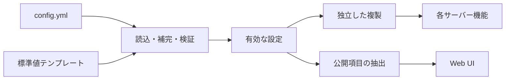
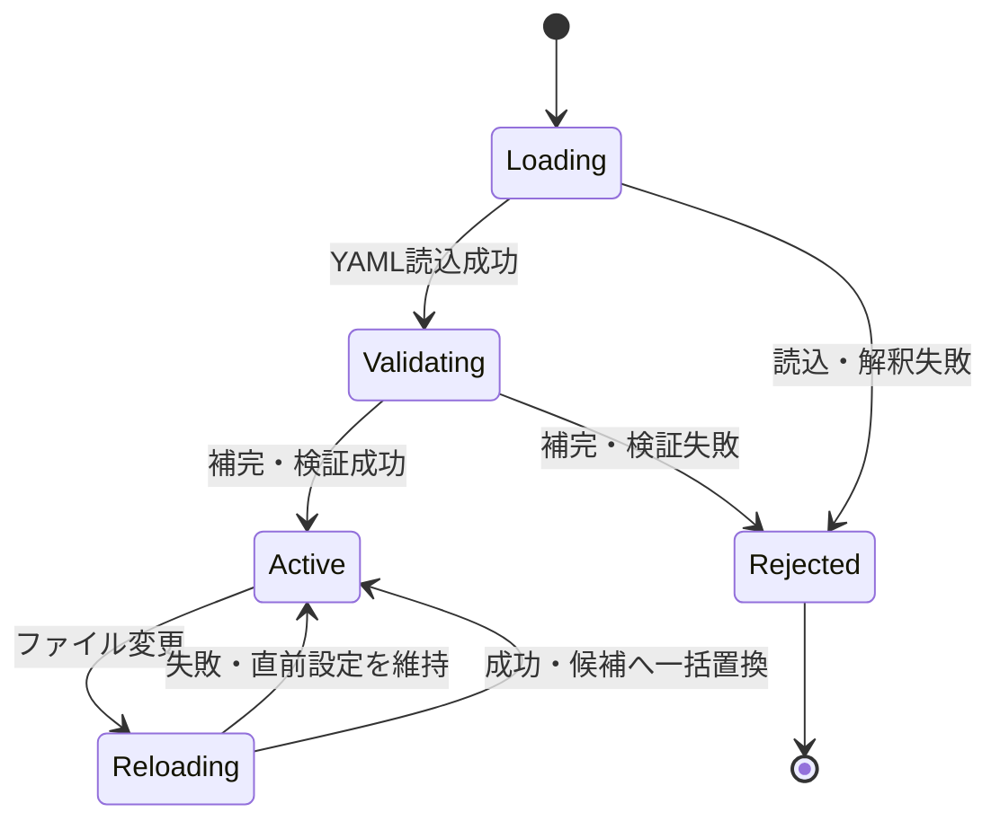
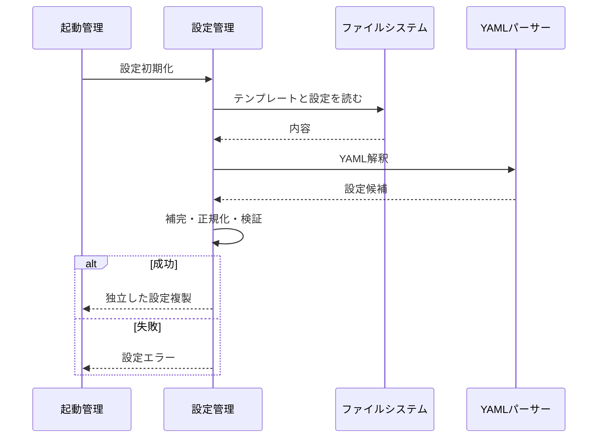
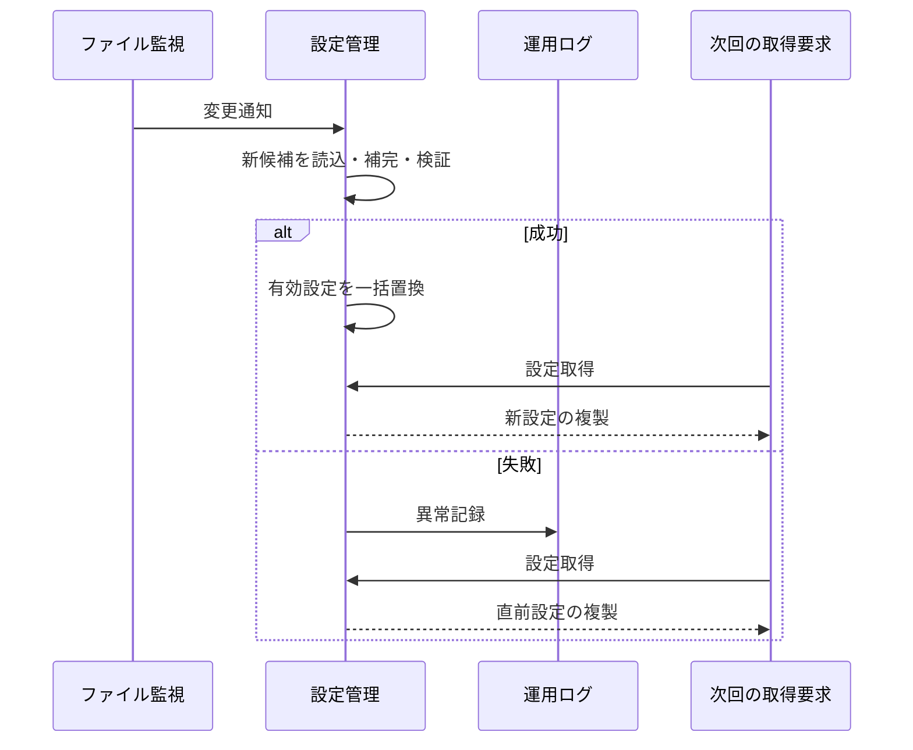

# サーバー設定管理機能 設計

## 1. 目的と境界

本機能は、YAML 形式のサーバー設定を読み込み、標準値の補完と表記の正規化を行い、各サーバー機能へ独立した複製として提供す
る。設定ファイルが変更された場合は同じ手順で再読み込みし、成功した設定だけを以後の取得結果へ反映する。また、Web UI へ公
開してよい項目だけを抽出して提供する。

### 対象

-   設定ファイルと標準値の読み込み
-   HTTP/HTTPS の最低起動条件の確認
-   保存先、サブディレクトリ、ストリーミング設定の補完・正規化
-   設定一式の独立した複製の提供
-   設定ファイル変更時の再読み込み
-   Web UI 向け公開設定の作成
-   外部コマンド設定の既存形式による解釈
-   処理量上限、アップロード受信期限、および外部コマンド期限に関する6項目の既定値・検証

### 対象外

-   すべての既存設定項目へ新しい共通検証方式を導入すること
-   設定を保持済みの機能を自動的に停止、再起動、再構成すること
-   Web UI 内部の設定状態

### 依存関係

| 依存先                       | 利用目的                                                             |
| ---------------------------- | -------------------------------------------------------------------- |
| ファイルシステム             | 設定ファイル、標準値テンプレート、秘密鍵、証明書、実行ファイルの参照 |
| YAML パーサー                | 設定ファイルの解釈                                                   |
| `server-operational-logging` | 再読み込み失敗などの運用記録                                         |

本機能の設定取得結果は、起動管理、録画、配信、エンコード、アップロード、サムネイル、外部コマンドなどの各機能が利用する。



## 2. 機能構成

### 2.1 初回読み込み

起動時に次の順序で設定を構成する。

1. YAML 設定ファイルを読み込む。
2. YAML として解釈する。このとき アンカー・別名と merge key `<<` を展開し、`!env 環境変数名` の項目を、その時点の環境変数の値（文字列）へ置き換える。
3. 実装内蔵の標準値（`Configuration.DEFAULT_VALUE`）で、省略された最上位の項目を補う。本書 3.1 の6項目の既定値もここで補う。
4. ストリーミング設定で基準となる選択肢（標準値テンプレート）を利用できる場合、その値を省略箇所へ補う。
5. 本書 3.1 の6項目を検証する。
6. HTTP または HTTPS の最低条件を確認する。
7. サーバー基準位置を表す記号、保存先、配信サブディレクトリを内部表記へ正規化し、`dbtype` の `better-sqlite3` を `sqlite` へ読み替える。
8. 成功した候補を有効な設定として保持する。

設定ファイルを読めない、YAML として解釈できない、`!env` が参照する環境変数が定義されていない、または HTTP/HTTPS の最低条件を満たさない場合は、後続機能へ設定を提供せ
ずサーバー起動を失敗させる。3.1 の検証に失敗した場合は設定エラーを返し、不正な値を利用する機能を開始しない。

`!env` は設定ファイル（`config.yml`）のスカラー値だけで使える。YAML の既定の解釈（`CORE_SCHEMA`）にタグ `!env` と merge key
`<<`（`mergeTag`）を足し、他の型の解釈は変えない。`<<` の展開は v2（js-yaml 4 の既定）と同じで、明示した項目が取り込みより優先され、
`<<: [*a, *b]` では先に書いたものが優先される。`ormconfig.js` は同じ定義（`ConfigYaml`）を読むので、同じ規則で展開される。展開結果は常に文字列で、数値や真偽値へは変換しない。このため、整数であることを検証する項目
（3.1 の6項目）に `!env` を使うと `ConfigValueError:<項目名>` で失敗する。環境変数が空文字列のときは空文字列を値とする。
`!env` を付けない値は環境変数名として解釈しない（`$VAR` や `${VAR}` の形は展開しない）。展開は初回読み込みと再読み込みの
どちらでも同じ規則で行い、再読み込みで環境変数が未定義のときは 2.3 の失敗として直前の設定を保持する。ログ設定ファイルは
`!env` を解釈しない。

`!env` の定義と読み込みの option は、`src/model/ConfigYaml.ts` の一か所に置く。`Configuration` と、データ構造更新の CLI が使う
`ormconfig.js`（build 後の `dist/model/ConfigYaml.js` を読む）が同じ定義を使うので、`ormconfig.js` も `config.yml` の
`!env` を同じ規則で展開し、環境変数が未定義なら CLI も失敗する。同じ module が `dbtype` の読み替えも持つ: `better-sqlite3`
は `sqlite` と同じ値として扱い、`Configuration` の取得結果でも `ormconfig.js` でも `sqlite` になる（DB の file、Migration、
backup の扱いは `sqlite` と同じ）。読み替えは手順 3 の標準値の補完の後に行う。

標準値テンプレートを読めない場合でも設定ファイルの読み込み自体は続け、テンプレートからしか得られない省略値だけを補わな
い。

`urlscheme`（`m2ts` / `video` / `download`）のように複数カテゴリを持つ項目は、`urlscheme` 自体の省略だけでなく、カテゴ
リ単位の省略・null も個別に標準値で補う。設定ファイルで `urlscheme` はあるが `download` だけを省略・null にした場合で
も、`download` カテゴリだけを標準値で補い、他カテゴリの値は変更しない。Web UI 向け公開設定の生成でも同じ欠落へ多重に防
御し、`urlscheme` またはその一部カテゴリが欠けていても公開設定の取得を失敗させない。

`config/config.yml.template` の `urlscheme.download.ios` は既定値を持たない（空）。iOS/iPadOS Safari は録画ファイルをブ
ラウザから直接ダウンロードできる一方、vlc-x-callback などの URL Scheme を経由すると保存ファイル名が Base64 化されるこ
とを実機で確認したため、iOS/iPadOS 向け download URL Scheme はデフォルトでは設定しない。config.yml で明示的に設定した
場合のみ利用する。

### 2.2 設定取得

設定取得は、その時点で有効な設定のディープコピーを返す。呼出元が返却値を変更しても、管理中の設定や他の取得結果へ影響しな
い。

通常の録画保存先一覧を返す箇所では、一時録画用の予約名を持つ保存先を除外する。

### 2.3 再読み込み

設定ファイルを監視し、変更検知時に初回と同じ読み込み、補完、正規化、検証を新しい候補へ適用する。

-   成功: 候補を有効な設定へ一度に置き換える。
-   失敗: 直前の有効な設定を保持し、異常を記録する。

置換後に行う設定取得は新しい複製を返す。ただし、すでに設定を保持した各機能を停止・再起動・更新しない。起動時スナップ
ショットを採用する設定は、その機能の次回起動時にだけ反映される。



### 2.4 Web UI 向け公開設定

公開設定は、管理中の設定一式をそのまま返さず、必要な項目だけを明示的に選ぶ。

-   リアルタイム通知の接続先ポート
-   録画保存先名
-   エンコード方法名
-   利用可能なストリーミング方法
-   端末別の再生用 URL 設定
-   外部再生先の名前

DB 認証情報、内部保存場所、外部コマンド、および 3.1 の6項目は公開しない。

### 2.5 外部コマンド設定の解釈

既存のコマンド設定形式を次のように解釈する。

1. 空白区切りの先頭要素を実行ファイル、残りを引数とする。
2. Node.js 実行ファイルを表す記号を、実行中の Node.js 実行ファイルへ置き換える。
3. 引数中のサーバー基準位置または空白を表す記号を、既存規則に従って置き換える。
4. 実行ファイルが存在しない場合は開始せずエラーを返す。

この互換形式を shell コマンドとして再解釈しない。

## 3. データと検証

### 3.1 起動時スナップショット設定

| 設定名                   | 意味                                         |     既定値 | 許容値                  | 利用機能     |
| ------------------------ | -------------------------------------------- | ---------: | ----------------------- | ------------ |
| `encodeQueueLimit`       | エンコード待機依頼上限                       |      1,024 | 1 以上の安全な整数      | エンコード   |
| `concurrentUploadNum`    | 同時アップロード数                           |          3 | 1 以上の安全な整数      | アップロード |
| `uploadReceiveTimeoutMs` | 一件のアップロード本文全体の受信期限         | 300,000 ms | 1〜2,147,483,647 の整数 | アップロード |
| `thumbnailMaxPending`    | サムネイル生成待機依頼上限                   |         32 | 1〜10,000 の整数        | サムネイル   |
| `hookCommandMaxPending`  | 外部コマンド待機依頼上限                     |         64 | 1〜10,000 の整数        | 外部コマンド |
| `hookCommandTimeoutMs`   | 外部コマンドの準備開始から実行終了までの期限 | 300,000 ms | 1〜2,147,483,647 の整数 | 外部コマンド |

「安全な整数」は JavaScript の `Number.isSafeInteger` を満たす整数とする。文字列、小数、`NaN`、無限値、0、負数、および各
項目の上限を超える値は許可しない。

ECMAScript 言語仕様自体は timer API を定義しない。本設計では、JavaScript の標準的な timer 契約である HTML Standard の
`setTimeout()` が Web IDL の符号付き32ビット整数 `long` を受け取ることに合わせ、timerへ直接渡す二つの設定値
（`uploadReceiveTimeoutMs`、`hookCommandTimeoutMs`）の上限を `Configuration.SETTIMEOUT_DELAY_MAX_MS`
（2,147,483,647ミリ秒）とする。Node.js固有の上限や`Number.MAX_SAFE_INTEGER`を移植可能なtimer上限として扱わない。実際に
Node.js の `setTimeout()` へこの値を超える delay（2,147,483,648 以上）を渡すと `TimeoutOverflowWarning` が発生し、delay
は 1 ミリ秒へ切り詰められる（実行して確認済み）。この上限は「overflow でクランプされずに `setTimeout()` へ渡せる最大の
ミリ秒数」と一致する。

`thumbnailMaxPending`、`hookCommandMaxPending` の上限 `Configuration.PENDING_QUEUE_SAFETY_LIMIT`（10,000）は、まだ処理を
開始していない依頼の待機件数が際限なく積み上がって memory を圧迫することを防ぐための安全弁である。値そのものに個別の算
出根拠は無く、既定値（32、64）から算出した値でもない。この値の根拠は本節を正とし、`server-thumbnail-management`、
`server-event-and-hook-delivery` の各 Design で同じ上限に言及する箇所は本節を参照する。

これらは完全な設定複製には含めるが、Web UI 向け公開設定には含めない。各利用機能は開始時に必要な値を一度取得して保持し、
設定再読み込みで保持値を置き換えない。

#### Cross-spec 補足: 録画保存先 command 期限 field

`server-storage-management` Requirement 3.2 と同 Design の「設定 snapshot と反映時点」「設定値、単位、および境界」を
consumer authority とし、設定 provider は optional raw field `storageLimitCommandTimeoutMs` を YAML と完全設定型で受理
し、候補、有効設定、防御的な snapshot／clone、および reload 後の新しい完全設定へ欠落・変換させず保持する。field の不在も
不在のまま保持し、reload 前に取得済みの複製と reload 後の新しい複製は参照を共有しない。

設定 provider はこの field を Web UI 向け公開設定へ投影せず、既定値の補完または値域検証を行わない。
`server-storage-management` consumer が省略時の `300_000`
ms、`Number.isSafeInteger(value) && 1 <= value && value <= 2_147_483_647` の検証、不正 raw 値の設定 error、component 構
築を含む起動時の snapshot と使用を所有する。したがって、この field は Requirement 7 と 3.1 の provider-owned 6項目に含め
ず、その正式な既定値・検証契約または AC trace を変更しない。この段落の契約は `src/model/IConfigFile.ts` と
`src/model/Configuration.ts`（`getConfig` が有無を判定し、`lodash/cloneDeep` で複製する）で実装され、
`test/server/configuration/storage-timeout-provider.cross-spec.test.ts` が検査する。

#### Cross-spec 補足: チューナー要求期限 field

`server-tuner-access` を consumer authority とし、設定 provider は optional raw field `tunerRestRequestTimeoutMs` と
`tunerStreamEstablishmentTimeoutMs` を、録画保存先 command 期限 field と同じ形で保持する。YAML と完全設定型で受理し、有効
設定、snapshot／clone、および reload 後の新しい完全設定へ欠落・変換なく保持する。field の不在は不在のまま保持する。既定値
の補完と値域検証は行わず、Web UI 向け公開設定へも投影しない。これらの field も Requirement 7 と 3.1 の provider-owned 6項目
には含めない。`test/server/configuration/configuration.spec.test.ts` の
`TA-2.4-CONFIG-SNAPSHOT` は、raw 値を変換・検証せず独立した snapshot として返すことと、不在を不在のまま返すことを検査す
る。YAML の読込、reload、公開設定への非投影は、録画保存先 command 期限 field と同じ実装（`getConfig` と `ConfigApiModel` の
許可項目）で満たし、tuner の 2 field に固有の case は持たない。

### 3.2 HTTP/HTTPS の最低条件

-   HTTP を使用する場合は待受ポートを必要とする。
-   HTTPS を使用する場合は待受ポート、秘密鍵、証明書を必要とする。
-   少なくとも一方が有効でなければならない。

### 3.3 有効設定の置換単位

再読み込み中の候補は、管理中の設定と分離する。読み込み、補完、正規化、検証のすべてが成功した候補だけを、一回の参照置換で
有効化する。部分的に書き換えた設定を公開しない。

## 4. 処理シーケンス

### 4.1 起動時



### 4.2 再読み込み



## 5. 失敗と再起動

-   初回読み込み失敗は起動失敗とし、不完全な設定を後続へ渡さない。
-   再読み込み失敗はサーバー全体を停止せず、直前の有効設定を維持する。
-   3.1 の設定が不正な場合、その設定を消費する機能を開始しない。
-   設定再読み込みの成功は、既存 consumer の再起動や保持済みスナップショットの更新を意味しない。
-   サーバー再起動時は設定ファイルを改めて読み、3.1 の値を各利用機能が新しく保持する。
-   設定管理の状態を DB へ永続化せず、再起動時はファイルを正本とする。

## 6. 実装上の制約

-   再読み込みは「候補の構築」と「有効設定の置換」を分離し、管理中オブジェクトを途中で変更しない。
-   取得結果は深い複製とし、配列やネストしたオブジェクトも共有しない。
-   公開設定は許可項目を列挙する方式とし、除外項目だけを列挙する方式にしない。
-   3.1 の既定値と検証を設定管理へ集約し、各利用機能は検証済み値を起動時に保持する。

### 6.1 設定filesystem port

設定fileとtemplateの固定path、同期・非同期read、およびwatcher登録を`Configuration`から分離し、内部
`IConfigurationFileAccess` portとして注入する。

```typescript
type ConfigurationChangeListener = () => void;

interface IConfigurationFileAccess {
    readonly configPath: string;
    readonly templatePath: string;
    readSync(path: string): string;
    read(path: string): Promise<string>;
    watch(path: string, listener: ConfigurationChangeListener): void;
    unwatch(path: string, listener: ConfigurationChangeListener): void;
}
```

production bindingは既存の設定・template path、UTF-8 read、`fs.watchFile`、`fs.unwatchFile`へ対応し、読込、補完、正規
化、再読込の製品挙動を変更しない。`Configuration`は同一listener参照をwatchへ渡せる形で保持する。integration testは
temporary pathを返すadapterを注入し、teardownで同じpathとlistenerをunwatchして、固定pathの運用fileへ接続しない。

このportは内部test seamであり、公開設定contract、設定更新通知API、製品shutdown interface、またはwatcher自動解放保証を追
加しない。production processの終了順序は本機能の境界外のままとする。

## 7. テスト方針

本機能は、設定管理固有のtest oracle、fixture、状態・値域・失敗・資源matrix、および結合境界を所有する。共有runner、
`test/server` root、production compile後の`dist` import、V8 coverage、固定commandは`server-application-runtime`
Requirement 9へ委ね、全serverのcoverage判定は`server-application-runtime` Requirement 9 Acceptance Criterion 9へ委ね、本機能から重複する
runner、threshold、coverage設定を追加しない。

### `unittest/spec`

-   Requirements 1、2のYAML読み込み、標準値とstream選択肢の補完、保存先とsubdirectoryの正規化、一時録画用保存先の除外、
    template不在時の継続、およびHTTP/HTTPS最低条件を外部契約として検証する。
-   Requirements 3、4の取得結果の独立性、再読み込み中は旧設定、成功後は新設定、失敗後は直前設定を返す契約を検証する。変
    更前後の取得結果は旧または新の完全な設定だけとし、候補の一部を含む設定を許可しない。
-   Requirement 5の公開許可項目を肯定的に検証し、DB認証情報、内部保存場所、外部コマンド、および3.1の6項目がHTTP応答へ含
    まれないことを検証する。
-   Requirement 6の実行ファイルと引数の分離、Node.js・基準位置・空白記号の置換、および実行ファイル不存在時に開始せずエ
    ラーを返す契約を検証する。外部コマンド自体は起動しない。
-   Requirement 7の6項目について、省略時の既定値、許容値、設定エラーによる利用機能の開始抑止、完全な設定複製への包含、公
    開設定からの除外、および稼働中consumerの保持値を自動更新しない契約を検証する。再起動後の反映は、新しい設定から
    consumerを再初期化した結果で確認し、process再起動そのものは開始しない。

### Cross-spec 補足 case（正式 trace／matrix 外）

次の case は `server-storage-management` Requirement 3.2 と同 Design が所有する consumer contract を設定 provider 側から
接続するための非正式な補足である。Requirement 8 の formal trace、設定状態 lifecycle matrix、必須 Test Matrix、既存の
configuration case 件数には加算しない。

| 補足 case ID                    | test path                                                              | assertion                                                                                       |
| ------------------------------- | ---------------------------------------------------------------------- | ----------------------------------------------------------------------------------------------- |
| `CFG-4.2-ABSENT`                | `test/server/configuration/storage-timeout-provider.cross-spec.test.ts` | field 不在を不在のまま保持し、provider の既定値を入れないこと                                   |
| `CFG-4.2-RAW-CLONE`             | 同上                                                                   | 有効 raw 値と不正な object を変換・拒否せず保持し、取得ごとに参照を共有しないこと               |
| `CFG-4.2-YAML-TIMESTAMP`        | 同上                                                                   | 引用符なしの YAML timestamp を独立した Date の複製として保持すること                            |
| `CFG-4.2-YAML-ALIAS`            | 同上                                                                   | 循環する YAML alias の raw 値を、snapshot 間で参照を共有せず保持すること                        |
| `CFG-4.2-RELOAD`                | 同上                                                                   | reload で raw 値が置き換わっても、取得済みの複製が変わらないこと                                |
| `CFG-4.2-NESTED-RELOAD`         | 同上                                                                   | ネストした raw 値の型を保持し、reload 後も独立した複製を返すこと                                |
| `CFG-4.2-RELOAD-REJECTED`       | 同上                                                                   | 不正な reload で旧 raw 値と内部の設定参照を維持すること                                         |
| `CFG-4.2-PUBLIC-BOUNDARY`       | 同上                                                                   | 公開 projection に field が現れないこと                                                         |

### `unittest/imp`

3.1の値域は次の同値区分と境界値をすべて表に沿って実行する。各caseは設定候補の採用または設定エラーだけでなく、有効設定と
consumer開始effectが変更されたかもassertする。

| 設定群                                           | 省略値   | 最小値 |         最大許容値 | 拒否する代表値                                               |
| ------------------------------------------------ | -------- | -----: | -----------------: | ------------------------------------------------------------ |
| `encodeQueueLimit`、`concurrentUploadNum`        | 1,024、3 |      1 | 安全な整数の最大値 | 0、負数、安全な整数範囲外、小数、文字列、`NaN`、正負の無限値 |
| `thumbnailMaxPending`、`hookCommandMaxPending`   | 32、64   |      1 |             10,000 | 0、負数、10,001、小数、文字列、`NaN`、正負の無限値           |
| `uploadReceiveTimeoutMs`、`hookCommandTimeoutMs` | 300,000  |      1 |      2,147,483,647 | 0、負数、2,147,483,648、小数、文字列、`NaN`、正負の無限値    |

加えて、次の内部境界と分岐を検証する。

-   配列とネストしたobjectを含む取得結果を変更し、管理中の設定と別の取得結果が変化しないこと。
-   基準位置、末尾区切り、subdirectory、およびstream選択肢の表記を、正規化前後の具体例で比較すること。
-   公開設定を許可項目の追加方式で構成し、非公開項目を入力へ追加してもprojectionへ漏れないこと。
-   実在する合成実行ファイルと存在しないpathで、記号置換後の実行ファイル確認分岐を通し、後者が引数返却やprocess開始へ進
    まないこと。
-   deferred Promiseで再読み込みを保留し、完了前の取得、成功確定後の取得、および失敗確定後の取得を順に行って一括置換の分
    岐を検証すること。

### `integration`

-   **設定filesystem**: 6.1のportへtemporary directoryの設定pathを注入し、合成YAMLの不在、読取不能、解析失敗、正常読込、
    正常な変更、および不正な変更を`Configuration`へ接続する。portのcall ledgerで同期・非同期readのpathと回数を確認
    し、file descriptorは読込完了または失敗後に閉じ、testが作成したfileとdirectoryをteardownで回収する。
-   **template filesystem**: 6.1のportへtemporary template pathを注入し、合成templateの正常読込、不在、および読取不能
    を`Configuration`へ接続する。利用できる省略値だけが補われ、不在または失敗時も設定file自体の読込が継続することを確認
    する。
-   **鍵・証明書filesystem**: 合成鍵・証明書pathとephemeral portを持つ設定で実際の`ServiceServer.start()`をisolated
    child process内から呼び、鍵・証明書を読める場合のlistener開始と、片方が不在または読取不能の場合の起動失敗を区別す
    る。親test harnessは成功・失敗の両経路でchildを終了・回収し、file handleとserver listenerが残らないことを確認する。
    設定管理側の検証はpathを含む最低条件と引渡しまでとし、TLS fallback、製品processの停止・再起動、またはshutdown契約を
    本機能へ追加しない。
-   **実行ファイルfilesystem**: temporary directoryの合成実行fileと存在しないpathを実際の存在確認へ接続し、解釈結果また
    は不存在エラーを確認する。権限変更や実行結果は外部コマンド利用機能の責任であり、本機能ではprocessを開始しない。
-   **設定watch**: 6.1のportを介してtemporary設定fileの変更通知を`Configuration`へ接続し、読込完了前は旧設定、成功後は新
    設定、失敗後は旧設定を返すことを確認する。production bindingは`fs.watchFile`を維持する。test harnessは注入したport
    の`unwatch()`を同じpathとlistenerで各caseのteardownに一回だけ呼び、後続caseへ通知、timer、listener、open handleを残
    さない。このteardownを製品の停止interfaceまたは自動解除保証とは扱わない。
-   **公開設定HTTP projection**: 公開設定の実装（`ConfigApiModel`）をlocal HTTP harnessへ接続して合成設定を与え、許可項目
    だけの成功応答を確認する。設定fileにDB認証情報、内部保存場所、外部コマンド、および3.1の6項目を含めても応答へ現れない
    ことをfield単位でassertする。実際のGET routeは`server-service-interface`が検査する。

DBは設定状態の保存先ではなく、本機能がtransactionまたはschemaを所有しないため結合非適用とする。IPCは公開設定と組み合わさ
れる設定外情報の配送を本機能が所有しないため結合非適用とし、HTTP projection testではそのportへ合成結果を与える。外部コマ
ンド実行と製品processの再起動は各利用機能の責任であるためprocess境界は非適用とする。鍵・証明書testのisolated child
は`ServiceServer.start()`を隔離して資源回収を確認するtest harnessであり、製品のprocess再起動contractを検証するものではな
い。これらの非適用理由をtest matrixと実行証跡へ残し、未実行を成功扱いしない。

### 設定状態・値域・取得／更新／失敗／資源 lifecycle matrix

| 観点              | 入力・値域／開始状態                                   | 取得・更新／成功状態                               | 失敗・競合                                                   | 取得から解放までの資源境界                                                     | 種別                            |
| ----------------- | ------------------------------------------------------ | -------------------------------------------------- | ------------------------------------------------------------ | ------------------------------------------------------------------------------ | ------------------------------- |
| 初回読み込み      | 有効設定なし、設定・templateの有無、HTTP/HTTPS最低条件 | 完全に補完・正規化した設定を一度だけ有効化         | 不在、読取不能、解析失敗、最低条件不足、値域違反             | 設定・template fileをopenからcloseまで追跡し、失敗後もhandleを残さない         | `unittest/spec`、`integration`  |
| 値域              | 省略、最小、最大許容、範囲外、小数、文字列、非有限値   | 許容値または既定値を完全な設定複製へ含める         | 不正候補を拒否し、consumer開始effectを0件にする              | 合成設定fileをcaseごとに生成・回収する                                         | `unittest/imp`                  |
| 設定取得          | 有効設定あり、同一時点の複数取得                       | 各取得へ独立した深い複製を返す                     | 一つの取得結果の変更を管理中設定と別の取得へ伝播させない     | 返却object、配列、ネストしたobjectの参照非共有を確認する                       | `unittest/spec`、`unittest/imp` |
| 再読み込み中      | 有効設定あり、変更通知済み、候補の読込・検証中         | 確定前の取得は旧設定の完全な複製だけを返す         | 旧値と候補値を混在させず、重複通知時の順序と結果を記録する   | watcherとlistenerを登録し、test終了時に通知解除とopen handle 0件を確認する     | `unittest/spec`、`integration`  |
| 再読み込み成功    | 正常な変更後YAML                                       | 一回の置換後、新設定の完全な複製だけを返す         | 稼働中consumerの保持値を更新せず、次の初期化だけへ反映する   | 読込fileを閉じ、watcherとlistenerはsingletonの稼働期間中維持する               | `unittest/spec`、`integration`  |
| 再読み込み失敗    | 読取不能、解析失敗、最低条件不足、値域違反             | 直前の有効設定の完全な複製を維持し、異常を記録する | 候補の一部、空設定、失敗候補を公開しない                     | 失敗した読込fileを閉じ、watcherとlistenerは次の変更監視に再利用する            | `unittest/spec`、`integration`  |
| 公開設定          | HTTP/HTTPS要求、許可項目と非公開項目を含む完全設定     | HTTP projectionへ許可項目だけを返す                | 非公開項目を応答へ含めず、設定外情報を設定項目へ混入させない | request/responseはHTTP harnessで完了させ、設定外情報のIPC portは合成結果を返す | `unittest/spec`、`integration`  |
| 外部コマンド解釈  | 合成実行file、存在しないpath、置換記号、引数           | 実在時だけ解釈済み実行fileと引数を返す             | 不存在時はエラーとし、process開始effectを0件にする           | filesystemの存在確認を完了し、test用fileを回収する                             | `unittest/spec`、`unittest/imp` |
| HTTPS鍵・証明書   | 合成鍵・証明書path、ephemeral port                     | isolated childで`ServiceServer.start()`を開始する  | 鍵・証明書の不在・読取不能で起動を失敗させる                 | 親harnessがchild、server listener、file handleを終了・回収する                 | `integration`                   |
| consumer snapshot | 稼働中の保持値、再読み込み成功後の新設定、次回初期化   | 稼働中は旧値を保持し、新しい初期化は新値を保持する | 設定管理から停止、再起動、自動更新を開始しない               | consumer instanceはtest内で生成・破棄し、process lifecycleへ接続しない         | `unittest/spec`                 |

matrixの各caseは戻り値だけでなく、有効設定の置換回数、旧・新設定の完全性、ログ、consumer開始・process開始effect、および
file・watcher・listenerの回収結果をassertする。

### 必須Test Matrixの横断割当

次の表で、共通方針の各観点を本機能のtest、または非適用理由へ一意に割り当てる。

| Matrix観点 | testへの割当                                                                                                                                                          | 非適用理由                                                                                                                                              | assertion・証跡                                                                                                        |
| ---------- | --------------------------------------------------------------------------------------------------------------------------------------------------------------------- | ------------------------------------------------------------------------------------------------------------------------------------------------------------------- | ---------------------------------------------------------------------------------------------------------------------- |
| 契約       | Requirements 1から8と既存互換contractを`unittest/spec`のnamed caseおよび8節のtraceへ対応付ける                                                                        | 仕様、source、test、実行時証拠の差は推測で埋めず、`.kiro/steering/server-testing.md`の不一致の分類に従って分類する                                | AC ID、case名、期待した戻り値・error・状態・effectを記録する                                                           |
| 種別       | 外部契約を`unittest/spec`、値域・分岐・adapterを`unittest/imp`、filesystem・HTTP・isolated childを`integration`へ割り当てる                                           | 3種は相互に代替しない                                                                                                                                               | 種別ごとの対象件数、成功・失敗、および未実行理由を分ける                                                               |
| 入力       | `null`・空YAML・空の必須objectは初回／再読込失敗、0・1・最小・最大・範囲外・文字列等の不正型は値域表、空commandは解釈失敗、同一変更通知の重複はwatch caseへ割り当てる | 設定形式に意味を持たない入力を新しいfallbackへ読み替えない                                                                                                          | 候補採否、旧設定維持、error、consumer／process開始effect 0件、および通知回数をassertする                               |
| 状態       | 開始前は有効設定なし、進行中は再読込保留、成功・失敗は一括切替／旧設定維持、再入は複数取得と重複watch、restartは次回consumer初期化で検証する                          | cancel入力または取消状態を本機能のinterfaceが持たないためcancelは非適用。製品process再起動は利用機能の責任                                                          | 各取得が旧または新の完全設定であること、保持値、自動停止・再起動effect 0件をassertする                                 |
| 時間・順序 | deferred readでlate settlement、同着、race、重複通知を作り、取得と再読込完了の順序ごとに完全設定だけが返ることを`unittest/imp`と`integration`で検証する               | Requirements 1から7はtimeoutまたはdeadlineを定義しないため、timeoutとdeadline直前・到達・超過は非適用。競合時の最終winner順序も契約化せず、完了順と結果を証跡化する | 通知、read開始、read確定、有効設定置換、取得のcall ledgerと、各時点の完全設定をassertする                              |
| 資源       | fileはreadからclose、timer・listenerはwatchからunwatch、child processとserver listenerは鍵・証明書testの起動から親による終了・回収までを検証する                      | DB transaction、stream、lockを本機能は取得しないため非適用                                                                                                          | close、unwatch、child exit・reapを各1回とし、teardown後のlistener、timer、open handleを0件にする                       |
| 外部境界   | filesystemは設定・template・鍵・証明書・実行file、HTTPは公開設定projectionへ接続する                                                                                  | DBは永続化責任なし、IPCは設定外情報の配送責任なし、製品process境界は外部コマンド実行・再起動の責任なし。isolated childはtest隔離であり製品process contractではない  | 成功・失敗と後始末を境界別に記録し、非適用をPASSへ数えない                                                             |
| 証跡       | Runtime Requirement 9の固定commandから、本機能のcase数、成功・失敗、coverage、非適用、資源回収を抽出する                                                    | test file未実装またはcommand未実行を成功扱いしない                                                                                                                  | command識別子、対象file・件数、結果、最小coverage除外、追加assertion、不一致分類、未解決riskをhandoffへ残す  |

### 品質判定

本機能の完了は、本節の機能固有の単体test（spec・imp）と結合testがすべて成功し、かつ`server-application-runtime`
Requirement 9 Acceptance Criterion 9（server全体の単体testだけで`src/**`のC0・C1が100%）を満たした場合に限り判定する。

共有runner、coverageの設定とcommandは`server-application-runtime` Requirement 9の責任である。本機能は独自runner
またはthresholdを定義しない。いずれかを満たさない場合、本機能を未完了とする。

### テスト配置

次のpathは共有test foundationの下に置く。

| 配置                                                       | 責任                                                               |
| ---------------------------------------------------------- | ------------------------------------------------------------------ |
| `test/server/configuration/configuration.spec.test.ts`     | Requirements 1から7の外部契約、取得、切替、公開範囲、保持値        |
| `test/server/configuration/implementation.test.ts`         | 値域、深い複製、正規化、allowlist、実行file不存在の内部分岐        |
| `test/server/configuration/filesystem.integration.test.ts` | 設定、template、鍵、証明書、実行file、watcher・listenerの後始末    |
| `test/server/configuration/http.integration.test.ts`       | 公開設定GETのHTTP projectionと非公開fieldの不在                    |
| `test/server/configuration/file-access-and-template.imp.test.ts` | filesystem portのunwatchとtemplate読込失敗の内部分岐          |
| `test/server/configuration/storage-timeout-provider.cross-spec.test.ts` | 7節の補足case（raw carrierの保持）                      |
| `test/server/fixtures/configuration/`                      | 秘密情報と実運用pathを含まない合成YAML、鍵、証明書。templateと実行fileはtestが一時directoryに作って回収する |

## 8. Acceptance Criteria トレーサビリティ

下の表は AC から設計の節への対応である。AC から検査する named case への対応は、`configuration.spec.test.ts` の `[CFG-6.1-AC-TRACE]` が持つ（AC 1.1 から 7.12 の 38 個を、同 directory の `*.test.ts` に実在する case ID へ引く）。

| AC   | 設計上の対応先                        |
| ---- | ------------------------------------- |
| 1.1  | 2.1 手順 1                            |
| 1.2  | 2.1 手順 3                            |
| 1.3  | 2.1 手順 4                            |
| 1.4  | 2.1 手順 7                            |
| 1.5  | 2.1 手順 7                            |
| 1.6  | 2.2 一時録画用保存先の除外            |
| 1.7  | 2.1 `dbtype` の読み替え               |
| 2.1  | 2.1 初回読み込み失敗                  |
| 2.2  | 3.2 HTTP/HTTPS 条件                   |
| 2.3  | 2.1、3.2 最低条件不足                 |
| 2.4  | 2.1 テンプレート不在時の継続          |
| 3.1  | 2.2 有効設定の取得                    |
| 3.2  | 2.2 ディープコピー                    |
| 3.3  | 2.2 取得結果間の独立                  |
| 4.1  | 2.3 ファイル監視                      |
| 4.2  | 2.3 初回と同じ候補構築                |
| 4.3  | 2.3 成功時の一括置換                  |
| 4.4  | 2.3 失敗時の直前設定維持              |
| 4.5  | 2.3 保持済み機能を更新しない          |
| 5.1  | 2.4 リアルタイム通知ポート            |
| 5.2  | 2.4 保存先名・エンコード名・配信方法  |
| 5.3  | 2.4 再生 URL・外部再生先名            |
| 5.4  | 2.4 非公開項目                        |
| 6.1  | 2.5 実行ファイルと引数の分離          |
| 6.2  | 2.5 Node.js 実行ファイル記号          |
| 6.3  | 2.5 基準位置・空白記号                |
| 6.4  | 2.5 実行ファイル不在エラー            |
| 7.1  | 3.1 `encodeQueueLimit`                |
| 7.2  | 3.1 `concurrentUploadNum`             |
| 7.3  | 3.1 `uploadReceiveTimeoutMs`          |
| 7.4  | 3.1 `thumbnailMaxPending`             |
| 7.5  | 3.1 `hookCommandMaxPending`           |
| 7.6  | 3.1 `hookCommandTimeoutMs`            |
| 7.7  | 3.1 安全な整数の検証                  |
| 7.8  | 3.1 1〜10,000 の検証                  |
| 7.9  | 3.1 timer設定の1〜2,147,483,647検証   |
| 7.10 | 2.1、5 設定エラーと機能開始抑止       |
| 7.11 | 2.4、3.1 公開設定から除外             |
| 7.12 | 2.3、3.1 完全複製への包含と起動時保持 |

Requirement 8のtest品質要件は、次の各行で設計箇所、主な検証、および失敗・資源境界へ対応付ける。

| AC  | 設計箇所                                 | 主な検証                                                                            | 失敗・資源境界                                                                  |
| --- | ---------------------------------------- | ----------------------------------------------------------------------------------- | ------------------------------------------------------------------------------- |
| 8.1 | 7 `unittest/spec`、lifecycle／横断matrix | Requirements 1から7の読込・補完・正規化・取得・切替・公開・コマンド・値設定契約     | 初回／再読込失敗、旧・新完全設定、consumer開始・process開始effect 0件           |
| 8.2 | 7 `unittest/imp`、値域表                 | 省略・最小・最大・範囲外・不正型・深い複製・正規化・allowlist・実行file不存在       | 不正候補拒否、参照非共有、file存在確認、追加assertionとfixture回収              |
| 8.3 | 7 lifecycle／横断matrix                  | 有効設定なし／あり、再読込中／成功／失敗、取得前後、競合、保持値と次回初期化        | 一括置換、late settlement・重複通知、file close、watch／unwatchとlistener回収   |
| 8.4 | 6.1 filesystem port、7 `integration`     | 設定・template・鍵・証明書・実行fileのfilesystemと公開設定HTTP projection           | 読取失敗と後始末；DB・IPC・製品processは直接所有境界でないため非適用            |
| 8.5 | 7 品質判定                               | 機能固有の単体test・結合test全件成功と、`server-application-runtime` Requirement 9 Acceptance Criterion 9のC0・C1 | 独自runner・thresholdを持たず、test失敗またはC0・C1未達時は本機能を未完了とする |

## 9. ソース対応

| 設計要素                                  | 主な実装位置                                                                | 責任                                                                   |
| ----------------------------------------- | --------------------------------------------------------------------------- | ---------------------------------------------------------------------- |
| 読み込み、補完、正規化、監視、複製        | `src/model/Configuration.ts`                                                | filesystem portを介し、候補を完全に検証してから一括置換する            |
| 設定filesystem port                       | `src/model/IConfigurationFileAccess.ts`                                     | 設定・template path、同期・非同期read、watch／unwatch contractを定める |
| production filesystem binding             | `src/model/ConfigurationFileAccess.ts`、`src/model/ModelContainerSetter.ts` | 既存固定pathと`fs`操作へbindし、製品挙動を維持する                     |
| 設定の型                                  | `src/model/IConfigFile.ts`                                                  | 3.1の6項目を非公開のサーバー設定として保持する                         |
| 標準設定                                  | `config/config.yml.template`                                                | 3.1 の既定値を記載する                                                 |
| 公開設定                                  | `src/model/api/config/ConfigApiModel.ts`                                    | 許可項目方式を維持し、3.1 を公開しない                                 |
| コマンド解釈                              | `src/util/ProcessUtil.ts`                                                   | 既存の記号と引数分割契約を維持する                                     |
| エンコードの値保持                        | `src/model/service/encode/EncodeManageModel.ts`                             | `encodeQueueLimit` を開始時に保持する                                  |
| アップロードの値保持                      | `src/model/service/ServiceServer.ts`                                        | 同時数と受信期限を開始時に保持する                                     |
| サムネイルの値保持                        | `src/model/operator/thumbnail/ThumbnailManageModel.ts`                      | `thumbnailMaxPending` を開始時に保持する                               |
| 外部コマンドの値保持                      | `src/model/operator/externalCommand/ExternalCommandManageModel.ts`          | 上限と期限を開始時に保持する                                           |

Cross-spec source responsibility として、`src/model/IConfigFile.ts` と `src/model/Configuration.ts` は
optional raw `storageLimitCommandTimeoutMs`、`tunerRestRequestTimeoutMs`、`tunerStreamEstablishmentTimeoutMs` を完全設定型、
clone、reload で保持し、既定値・値域検証を各 consumer へ委ねる。`src/model/api/config/ConfigApiModel.ts` はこれらの
field を公開 projection へ追加しない。

この表は保守時の入口を示すものであり、ソース配置を設定仕様の正本とはしない。

## Primary production source ownership

本節は、本機能が主に所有する製品 source と、その owner-local test の置き場所を示す。次の primary source の動作、公開 API、
IPC wire、DB schema、設定、保存形式は変更しない。owner-local test locator は既存 test directory の範囲を示すものであり、
個別 source の characterization 網羅を主張しない。

| Primary source | Owner-local test locator | Cross-spec consumer |
| --- | --- | --- |
| `src/Enums.ts` | `test/server/configuration/**/*.test.ts` | — |
