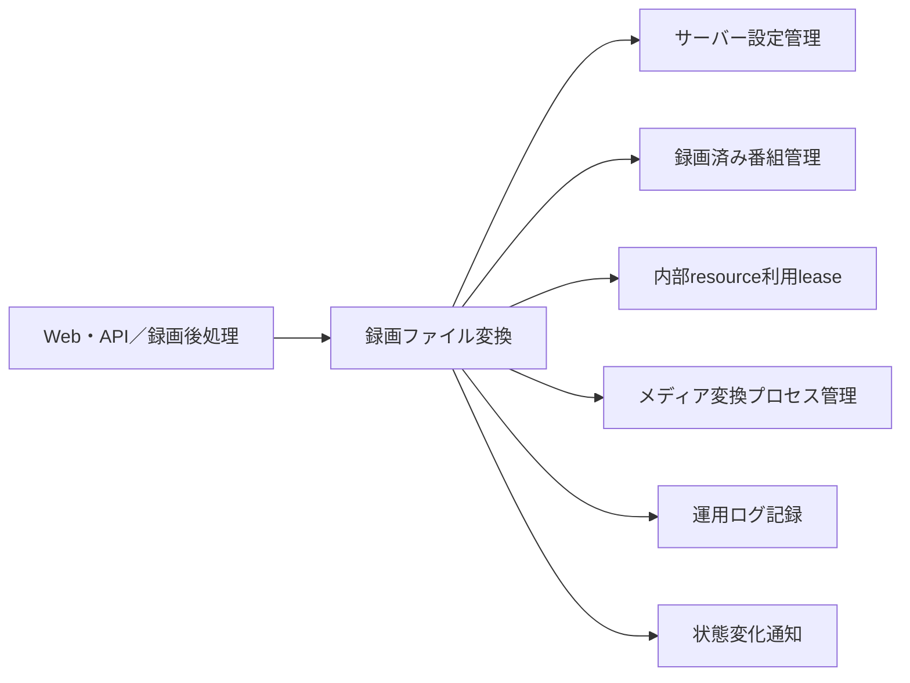
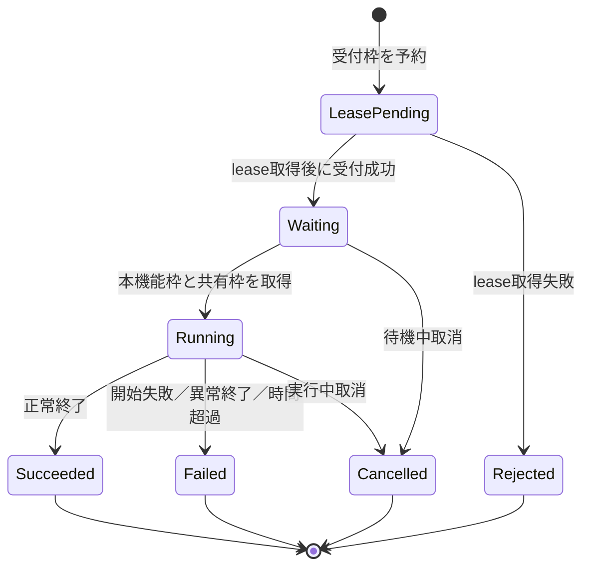
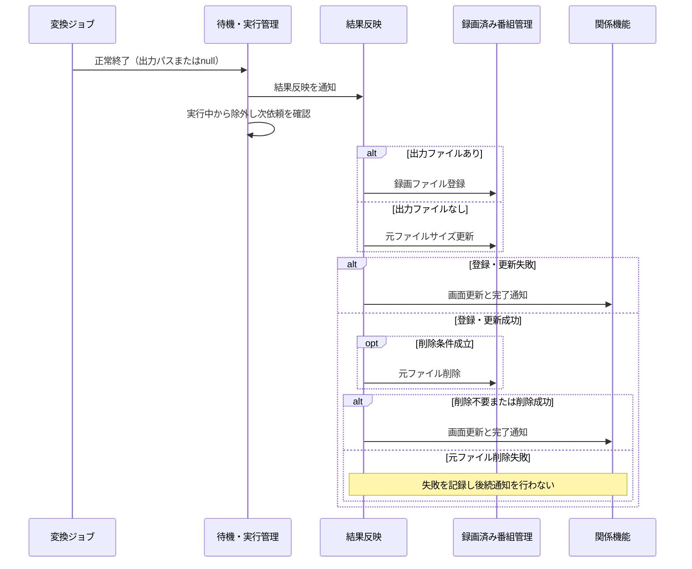

# 録画ファイル変換（エンコード）機能 設計

## 1. 目的

録画済み番組の動画ファイルを、設定された変換方法で別の形式へ変換する。依頼を受け付け順に実行し、待機・実行状態、進捗、取
消、結果反映を一つの機能として扱う。

## 2. 境界と依存関係

### 2.1 本機能が担当すること

-   変換依頼の受付と識別番号の割当て
-   メモリー内の待機列と実行中一覧
-   受付順の開始とエンコード同時実行数の制御
-   変換対象・変換方法・保存先の開始前確認
-   外部変換処理の開始、進捗取得、取消、実行時間上限
-   変換結果の録画済み番組への反映依頼
-   失敗時の途中出力削除と、終了後の次依頼開始
-   容量削除候補の選別に使う待機中・実行中recorded IDのread-only snapshot

### 2.2 本機能が担当しないこと

-   録画済み番組と録画ファイルの永続保存
-   ライブ視聴や録画再生のための一時変換
-   メディア変換処理全体の共有上限と優先順位
-   録画、予約、外部フック配送

### 2.3 依存関係



| 依存先                   | 利用内容                                                                             |
| ------------------------ | ------------------------------------------------------------------------------------ |
| サーバー設定管理         | 変換方法、保存先、同時実行数、共有処理数、待機上限を起動時に取得する                 |
| 録画済み番組管理         | 番組・変換元ファイル・放送局を確認し、結果登録、サイズ更新、元ファイル削除を依頼する |
| プロセス間通信           | 録画済みresource利用leaseを取得・解放し、容量不足削除との競合を防ぐ                  |
| メディア変換プロセス管理 | ライブ・再生用変換と共有する外部処理枠を取得する                                     |
| 運用ログ記録             | 受付、開始、完了、取消、失敗、結果反映失敗を記録する                                 |
| 状態変化通知             | 追加、進捗、取消、失敗、完了を関係機能へ伝える                                       |

## 3. 機能構成

| 構成要素          | 責務                                                                            |
| ----------------- | ------------------------------------------------------------------------------- |
| 変換操作窓口      | 手動依頼を内部形式へ変換し、一覧と取消を提供する                                |
| 受付・待機管理    | 受付上限、識別番号、FIFO待機列、実行中一覧を管理する                            |
| 変換ジョブ        | 開始前確認、外部処理、進捗、取消、実行時間上限を一件単位で管理する              |
| resource利用lease | 待機列へ公開する前にrecorded IDのencode利用を取得し、結果settlement後に解放する |
| 利用中snapshot    | 待機列と実行中一覧のrecorded IDを副作用なしで一時点の集合へ投影する             |
| 出力名管理        | 同時処理および既存ファイルと重複しない出力候補を選ぶ                            |
| 結果反映          | 新規ファイル登録またはサイズ更新を依頼し、条件付きで元ファイル削除を依頼する    |
| 変換イベント      | 追加、進捗、取消、失敗、完了を通知する                                          |

## 4. 主要データとインターフェース

### 4.1 変換依頼

```ts
interface EncodeRequest {
    recordedId: number;
    sourceVideoFileId: number;
    parentDir: string;
    directory?: string; // 親保存先の中に収まる相対path。手動依頼は受付時に検査する
    mode: string;
    removeOriginal: boolean;
}

interface IRecordedResourceUsePort {
    acquire(recordedId: number, kind: 'encoding'): Promise<{ readonly token: object }>;
    release(token: object): Promise<void>;
}

type EncodingRecordedUseSnapshot =
    | { readonly status: 'known'; readonly recordedIds: ReadonlySet<number> }
    | { readonly status: 'unknown' };

interface IEncodingRecordedUseSnapshotProvider {
    getQueuedAndRunningRecordedIds(): EncodingRecordedUseSnapshot;
}

interface InternalEncodeJob {
    readonly info: EncodeInfoItem;
    readonly recordedUseToken: object;
}
```

受付後は正の整数 `encodeId` と取得済みのrecorded-use tokenを加えた内部ジョブとして保持する。tokenは公開一覧、通
知、HTTP、または業務IPCへ露出しない。依頼、待機列、実行中一覧、進捗、識別番号は永続化しない。

### 4.2 一覧情報

```ts
interface EncodeQueueInfo {
    runningQueue: EncodeInfoItem[];
    waitQueue: EncodeInfoItem[];
}

interface EncodeInfoItem {
    id: number;
    mode: string;
    recordedId: number;
    percent?: number;
    log?: string;
}
```

進捗率とメッセージは外部変換処理が出力した場合だけ設定する。取得できない値を本機能で推定しない。

`IEncodingRecordedUseSnapshotProvider`は待機列と実行中一覧を同じprocess-local同期境界でread-onlyに読み、両方の
`recordedId`を重複除去した集合として返す。待機中jobも将来のsource利用が確定した受付済み要求なので含める。snapshot取得は
jobを開始・取消・並べ替えず、leaseを取得・解放せず、queueの進行を待たない。一時点として両一覧を安全に列挙できない場合は
部分集合や空集合を返さず`unknown`とする。snapshotへ現れる全jobは待機列への公開前からrecorded-use leaseを保持している。結
果は永続化せず、後続のqueue変化を拘束しない。

### 4.3 起動時設定

| 設定                  | 意味                         | 省略時         | 検証                                        | 反映時期   |
| --------------------- | ---------------------------- | -------------- | ------------------------------------------- | ---------- |
| `concurrentEncodeNum` | 本機能で同時に実行する変換数 | 設定管理に従う | 0以下なら新規受付を拒否                     | 起動時     |
| `encodeProcessNum`    | メディア変換全体の共有処理数 | 設定管理に従う | 共有管理側で検証                            | 起動時     |
| `encodeQueueLimit`    | 受付処理中と待機中の合計上限 | 1,024          | `Number.isSafeInteger(value) && value >= 1` | 起動時     |
| `encode[].rate`       | 録画時間に掛ける実行時間倍率 | 4              | 変換方法の設定に従う                        | 変換開始時 |

`encodeQueueLimit` はproperty自体がない場合、またはencode設定を含むconfig objectが空の場合だけ1,024を使う。明示された
`null`、空文字、非数値、および正の安全な整数でない値は省略とみなさず、起動を失敗させる。

`encodeQueueLimit` は設定ファイルだけの運用設定であり、公開API、Web UI向け公開設定、IPCの業務データには追加しない。構築
済みの管理インスタンスは設定ファイルを再読込せず、変更は再起動後に反映する。

## 5. 処理の設計

### 5.1 依頼受付

1. `concurrentEncodeNum <= 0` なら拒否する。
2. 非同期処理へ進む前の同じ同期処理内で `admissionReservations + waitQueue.length >= encodeQueueLimit`を確認する。満杯な
   ら拒否し、識別番号、ジョブ、通知を作らない。
3. 空きがあれば同じ同期処理内で`admissionReservations`を一件増やす。複数の受付が同じevent loopで続いても、後続受付は増加
   済みの値を観測する。
4. 受付処理を直列化する実行権を取得する。
5. 実行権を保持したまま、`IRecordedResourceUsePort.acquire(recordedId, 'encoding')`を一回awaitする。この受付は
   `admissionReservations`として上限に含まれるが、成功前は識別番号、ジョブ、公開待機列、または追加通知を作らない。直列化
   により、先に受付処理へ入った依頼の成否が未確定な間に後続依頼を先に待機列へ公開しない。
6. lease取得後に変換ジョブを生成し、現在のカウンター値である正の識別番号、依頼内容、および取得したexact tokenを設定す
   る。
7. 待機列の末尾へ追加し、予約一件を待機中一件へ原子的に移す。
8. 実行権を解放し、追加通知と待機列確認を行う。

3以後で失敗した場合、当該受付が所有する`admissionReservations`を一回だけ戻す。実行権の取得自体が失敗した場合は、未取得の
実行権へ解放を行わない。lease取得失敗、`blocked`相当、状態不明、または通常5秒のPM期限超過では識別番号、ジョブ、通知、
queue追加、DB・filesystem照会、およびprocess開始を0件とし、この機能から自動retryしない。期限後のlate grantedの解放はPM
adapterへ委譲する。lease取得後のジョブ生成失敗、識別番号設定失敗、待機列追加失敗では、取得済みexact tokenと実行権を各一
回だけ解放する。待機列追加の途中で失敗しても不完全なジョブを残さず、予約から待機中への移行、reservation解放、およびlease
解放を二重に行わない。releaseの送信・応答を確認できない場合は記録し、parent側は同じrecorded IDを削除可能と推測しない。実
行中一覧は待機上限の計数対象に含めない。

識別番号は1から増加させ、`Number.MAX_SAFE_INTEGER` の次を1とする。この識別番号について新しい探索・予約機構は追加しない。

### 5.2 FIFO実行



待機列確認は一回につき先頭の一件を選ぶ。`runningQueue.length < concurrentEncodeNum` の場合だけ先頭を実行中一覧へ移し、変
換ジョブを開始する。外部処理の生成時に共有枠を取得できなければ、その依頼は失敗として終了し、待機列へ戻さない。

一件の終了または開始失敗で実行中一覧から対象を除いた後、次のイベントループで待機列を再確認する。この繰返しにより、空き枠
の範囲で受付順に処理を開始する。

### 5.3 開始前確認と外部処理

変換ジョブは待機列へ公開される前に取得したexact recorded-use tokenを待機中から保持している。待機列から実行中へ移す際に
leaseを再取得または交換しない。実行開始時は同じtokenを保持したまま次を順番に確認する。

1. 変換元の録画ファイル登録情報
2. 対象の録画済み番組
3. 録画済み番組に対応する放送局
4. 変換元の実ファイル
5. 指定された変換方法
6. 保存先と必要な出力ディレクトリ

一つでも確認できなければ外部処理を開始せず失敗とする。出力ファイルを作る変換方法では、出力ディレクトリを書式を展開した後に
`server-recording-execution`の設計6.7.2の共通関数`isSubDirectoryInsideRoot()`で検査する。録画保存先の外を指す場合は、そ
のディレクトリを使わず、指定された親保存先の直下を出力先にして運用ログへ記録し、変換を続ける。このとき登録する相対path
はfile名だけで、環境変数`SUBDIR`は空文字になる。出力ファイルを作る変換方法では、既存ファイルおよび同時実行中の予約
と重ならない名前を選ぶ。出力を作らない変換方法では出力先を `null` としてコマンドを起動し、出力先ディレクトリの検査と
書式展開は行わず、依頼のdirectoryをそのまま環境変数`SUBDIR`（`DIR`）へ渡す。

変換コマンドは引用符やshell構文を解釈せず、半角空白で実行ファイルと引数へ分け、次の置換を行う。

| 記法       | 適用位置                     | 置換値                                |
| ---------- | ---------------------------- | ------------------------------------- |
| `%NODE%`   | 実行ファイル                 | サーバーを起動したNode.js実行ファイル |
| `%ROOT%`   | 各引数                       | サーバーのroot path                   |
| `%SPACE%`  | 各引数                       | 半角空白                              |
| `%INPUT%`  | 各引数                       | 入力ファイルpath                      |
| `%OUTPUT%` | 各引数。出力先がある場合だけ | 出力ファイルpath                      |

変換processは親processの環境変数を継承し、次の変換用環境変数を上書きまたは追加する。

| 環境変数                 | 値                                                                                                       |
| ------------------------ | -------------------------------------------------------------------------------------------------------- |
| `RECORDEDID`             | 録画済み番組ID                                                                                           |
| `INPUT`                  | 入力ファイルのfull path                                                                                  |
| `OUTPUT`                 | 出力ファイルのfull path。出力先なしは空文字                                                              |
| `DIR`                    | 出力を作らず依頼にdirectoryがあればその文字列。それ以外は出力ファイルのfull path。どちらもなければ空文字 |
| `SUBDIR`                 | 出力ファイルを作る変換方法では、書式を展開した後の依頼のdirectory（保存先の外を指して使わなかったときと指定なしは空文字）。出力を作らない変換方法では、展開しない依頼のdirectory（指定なしは空文字） |
| `FFMPEG`                 | 設定されたffmpeg path                                                                                    |
| `FFPROBE`                | 設定されたffprobe path                                                                                   |
| `NAME`                   | 録画済み番組名                                                                                           |
| `HALF_WIDTH_NAME`        | 録画済み番組の半角名                                                                                     |
| `DESCRIPTION`            | 番組概要。欠損時は空文字                                                                                 |
| `HALF_WIDTH_DESCRIPTION` | 番組概要の半角表現。欠損時は空文字                                                                       |
| `EXTENDED`               | 番組詳細。欠損時は空文字                                                                                 |
| `HALF_WIDTH_EXTENDED`    | 番組詳細の半角表現。欠損時は空文字                                                                       |
| `VIDEOTYPE`              | 録画済み番組の映像形式。欠損時は空文字                                                                   |
| `VIDEORESOLUTION`        | 録画済み番組の映像解像度。欠損時は空文字                                                                 |
| `VIDEOSTREAMCONTENT`     | 録画済み番組の映像stream content                                                                         |
| `VIDEOCOMPONENTTYPE`     | 録画済み番組の映像component type                                                                         |
| `AUDIOSAMPLINGRATE`      | 録画済み番組の音声sampling rate                                                                          |
| `AUDIOCOMPONENTTYPE`     | 録画済み番組の音声component type                                                                         |
| `CHANNELID`              | 録画済み番組の放送局ID                                                                                   |
| `CHANNELNAME`            | 関連する放送局名                                                                                         |
| `HALF_WIDTH_CHANNELNAME` | 関連する放送局名の半角表現                                                                               |
| `GENRE1`                 | 録画済み番組の第1ジャンル                                                                                |
| `SUBGENRE1`              | 録画済み番組の第1サブジャンル                                                                            |
| `GENRE2`                 | 録画済み番組の第2ジャンル                                                                                |
| `SUBGENRE2`              | 録画済み番組の第2サブジャンル                                                                            |
| `GENRE3`                 | 録画済み番組の第3ジャンル                                                                                |
| `SUBGENRE3`              | 録画済み番組の第3サブジャンル                                                                            |
| `START_AT`               | 録画済み番組の開始時刻                                                                                   |
| `END_AT`                 | 録画済み番組の終了時刻                                                                                   |
| `DROPLOG_ID`             | 関連するドロップログID。欠損時は空文字                                                                   |
| `DROPLOG_PATH`           | 関連するドロップログの相対path。欠損時は空文字                                                           |
| `ERROR_CNT`              | 関連するドロップログのerror count。欠損時は空文字                                                        |
| `DROP_CNT`               | 関連するドロップログのdrop count。欠損時は空文字                                                         |
| `SCRAMBLING_CNT`         | 関連するドロップログのscrambling count。欠損時は空文字                                                   |

数値は10進文字列、任意の数値情報が欠損した場合は空文字にする。チャンネル名のkeyは`CHANNELNAME`であり、この名前を維持す
る。

メディア変換プロセス管理からは、標準入出力とevent購読に使うchildと、停止に使うopaque managed handleを受け取る。変換ジョ
ブは両方を保持するが、取消または実行時間上限時にchildへ直接signalを送らず、handleでprocess managerの `requestStop()`へ停
止を依頼する。優先度入れ替えが同じ対象の停止を開始済みなら、そのstop request operationへjoinする。

開始前確認へ新しい期限は追加しない。既存のDB・ファイルシステム・共有処理枠の完了契約をそのまま利用する。resource leaseは
待機列への公開前から、待機、開始前確認、入力file利用、外部process、途中出力cleanup、結果登録・size更新・条件付き元file削
除を含む結果settlementの完了まで保持する。結果settlementへ到達しない開始前失敗または待機中取消は受付側がexact tokenを一
回releaseする。結果settlementへ到達したjobは、`EncodeFinishModel.finishEncode()`の成功・失敗と後続の条件付き元file削除が
確定してから、管理側（`EncodeManageModel`）がexact tokenの `release()`を一回試みる。停止要求の応答だけではprocess terminalでもfile利用終
了でもないため解放しない。releaseの送信・応答失敗は記録するがjobの既に確定した結果を巻き戻さず、parent側が同じrecorded
IDの容量不足削除を安全側に遮断する。

`IEncodeFinishModel`は同じservice child内だけで使うPromise返却の結果settlement操作（`finishEncode()`）を提供し、
`EncodeManageModel`はそれをawaitしてからexact leaseのreleaseを一回試みる。結果反映は`IEncodeEvent`のfinish listenerを使
わず、direct portだけで実行する。結果settlement内の`ipc.encodeEvent.emitFinishEncode()`による完了通知を行う。queue
finalization、画面更新、完了outcome、元file削除の順序、公開API、業務IPC、設定、DB schemaは変更しない。

### 5.4 実行時間上限と進捗

実行時間上限は次式で算出する。

```text
実行時間上限 = 録画済み番組の duration × 変換方法の rate
```

`rate` が省略されていれば4を使う。上限到達時は通常の取消処理と同じmanaged handleへの`requestStop()`を行う。この呼出しは
stdio整理と一回の`SIGINT`要求後に完了し、processのterminalを待たない。取消処理そのものに新しい監視期限や再試行規則は追加
せず、外部処理の終了通知でジョブを確定する。

停止要求の完了後も対象は実行中一覧に保持し、processのterminalを確認した場合だけ`finalize()`する。遅延または重複した
terminal eventは同じジョブのtimer、listener、実行枠、および実行中一覧を一回だけ解放し、後から到着したeventでは通知、
cleanup、次依頼開始を重複させない。

外部処理の標準出力に、JSON形式の `type: "progress"`、数値 `percent`、文字列 `log` が揃った場合だけ進捗へ反映し、更新通知
を行う。不正な行または進捗を出さない方法は進捗なしとして扱う。

### 5.5 取消

-   待機中: 対象を待機列から除き、外部処理を開始せず、保持中のexact recorded-use tokenを一回解放する。
-   実行中: 対象ジョブが保持するmanaged handleでprocess managerへ停止を要求し、外部処理の終了後に実行中一覧から除く。
-   録画済み番組単位: 待機中と実行中から対象番組の識別番号を集め、それぞれへ取消を要求する。

実行中ジョブの停止要求直前、`log.encode.info`へ`kill encode process encodeId: <エンコードID>, pid: <対象processのpid>`
を一回記録する。要求が失敗した場合は`log.encode.error`へ`stop encode process failed: <エンコードID>`を記録する。

運用者が`kill -9`等の手動介入を行う際にpidをログから追えるようにするため、対象processのpidを含むinfo行を停止要求の
直前に記録する。handleが存在する場合は`this.childProcess`も同じ生存期間で保持されているため、追加の状態を持たずpid
を取得できる。

取消要求を受け付けた時点で取消通知を行う。番組単位の取消は個別の失敗を記録し、全件を試した後、一件以上失敗していれば呼出
元へ失敗を返す。

### 5.6 正常終了と結果反映



結果反映と次の待機依頼の開始は独立して進み得る。これは、ジョブ終了時に実行中枠を先に解放し、結果反映の完了を待た
ずに次の待機列確認を行う順序である。

結果反映は次の順序を厳守する。

1. 出力ファイルがあれば新しい録画ファイルの登録を依頼する。なければ元ファイルのサイズ更新を依頼する。
2. 1が失敗した場合は失敗をログへ記録し、元ファイル削除を依頼しない。
3. 1が成功し、`removeOriginal` が真で、同じ変換元を使う別の待機中・実行中ジョブがなければ元ファイル削除を依頼する。
4. 1が失敗した場合、または1が成功して元ファイル削除が不要もしくは成功した場合は、画面更新とエンコード完了通知を行う。
5. 1の成功後に元ファイル削除が失敗した場合は、その失敗を結果settlementを待つ管理側（`EncodeManageModel`）でログへ記録し、後続の画面更新とエンコード完了通
   知を行わない。

完了通知へ進む場合は、録画済み番組ID、新規録画ファイルIDまたは`null`、および変換方法を通知する。結果登録またはサイズ更新
が失敗した場合も完了通知へ進むが、元ファイル削除は依頼しない。

## 6. 失敗、後始末、再起動

| 状況                     | 動作                                                 |
| ------------------------ | ---------------------------------------------------- |
| 同時実行数が0以下        | 新規依頼を拒否する                                   |
| 待機上限到達             | 新規依頼だけを副作用なしで拒否する                   |
| 起動時の待機上限が不正   | 本機能の起動を失敗させる                             |
| 開始前対象・設定なし     | 外部処理を開始せず失敗とし、実行中一覧から除く       |
| 共有枠取得失敗           | 失敗として終了し、再待機しない                       |
| 外部処理の開始失敗       | 失敗通知後、実行中一覧から除く                       |
| 異常終了または取消       | 途中出力の削除をbest-effortで試みる                  |
| 実行時間上限到達         | 停止を要求し、終了通知により失敗または取消を確定する |
| 結果登録・サイズ更新失敗 | ログへ記録し、元ファイルを削除せず、完了通知へ進む   |
| 元ファイル削除失敗       | 録画済み番組管理から返る既存の失敗として扱う         |
| 機能再起動               | 待機・実行状態を復元せず、識別番号を1から開始する    |
| 再起動前の途中出力       | 自動追跡・自動整理を行わない                         |
| resource lease取得失敗   | 変換元を読まずprocessを開始せず失敗として終了する    |
| resource lease解放失敗   | 記録してjob結果を維持し、容量不足削除側は遮断を維持  |

途中出力削除と元ファイル削除は異なる。途中出力は失敗したジョブが生成しかけた出力であり、元ファイルは結果反映成功後だけ削
除を依頼できる入力である。

## 7. API・IPC・DB・ファイルシステム契約

### 7.1 API

既存の次の操作とレスポンス形を維持する。

-   変換一覧取得
-   変換追加
-   識別番号による取消
-   録画済み番組に関係する変換の取消

`encodeQueueLimit` 到達は既存のエラー応答経路を使い、新しい成功レスポンス項目を追加しない。

### 7.2 IPC

-   結果反映は、録画ファイル追加、ファイルサイズ更新、元ファイル削除の既存操作を使う。
-   完了通知は録画済み番組ID、新規録画ファイルIDまたは `null`、変換方法を渡す。
-   `encodeQueueLimit` はIPCへ渡さない。
-   IPCの識別、再送、応答期限は `server-process-messaging` の責務であり、本機能では変更しない。
-   録画済みresource利用leaseはPMの内部resource-control carrierを使い、公開業務operation、HTTP API、設定項目を追加しな
    い。acquire/releaseは通常5秒期限を使い、自動retryしない。

### 7.3 DB

本機能はDBを直接更新せず、開始前照会と結果反映を各DB portまたは録画済み番組管理へ依頼する。変換待機列と実行状態をDBへ追
加しない。

### 7.4 ファイルシステム

-   保存先名は設定された録画保存先へ解決する。
-   相対ディレクトリは録画済み番組の書式置換後に保存先へ結合する。
-   出力名は元ファイル名と変換方法の拡張子から作り、衝突時は番号付き候補を選ぶ。
-   失敗・取消時は当該ジョブの途中出力だけを削除対象とする。
-   結果登録成功前に元ファイルを削除しない。

## 8. 実装対応

| 設計要素                   | 配置                                                         | 責任                                                                            |
| -------------------------- | ------------------------------------------------------------ | ------------------------------------------------------------------------------- |
| 待機上限設定               | `src/model/IConfigFile.ts`、`src/model/Configuration.ts`     | 任意の `encodeQueueLimit` と省略値1,024を扱う                                   |
| 起動時snapshotと検証       | `src/model/service/encode/EncodeManageModel.ts`              | 正の安全な整数へ検証し、不正値で構築を失敗させる                                |
| 上限到達前の同期受付予約   | `src/model/service/encode/EncodeManageModel.ts`              | 非同期境界前に受付予約と待機中の合計を検査・予約する                            |
| 結果反映成功による削除条件 | `src/model/service/encode/EncodeFinishModel.ts`              | 登録またはサイズ更新の成功を確認した後だけ元ファイル削除へ進む                  |
| 録画済みresource利用lease  | PM所有`RecordedResourceUseClient`とservice child composition | queue公開前のacquire、待機から結果settlement後まで保持、Task 5.3のexact release |

新しい永続テーブル、公開IPC業務操作、開始前確認期限、取消期限は追加しない。

## 9. 機能固有テスト設計

本機能は`server-application-runtime`が所有する共有server test foundationへ、次の機能固有suiteを追加する。testは
`test/server/encoding/`に置き、仕様testは`encode-contracts.spec.test.ts`、実装testは `encode-internals.test.ts`、結合
testは`encode-boundaries.integration.test.ts`とする。次節の54行を本機能唯一の機能固有Test Matrixとし、別matrixまたは
ledgerへ判定を分散させない。

### 9.1 AC別Test Matrix

各Acceptance Criterionは一行と一意な主test IDを持つ。同じtest caseが別ACを補助できても、主test IDを兼用しない。
R8.1・R8.3・R8.5は動作のtest caseを持たず、R8.1はR1〜R7の49主testの集合、R8.3は本表、R8.5は共有gateで判定する。これらの行のIDは判定対象の名前であり、主test IDの一意性の数には含めない。
`境界`の`adapter`はportのfakeを接続する単体test、`実境界`はDB、HTTP、IPC、filesystem、processを接続する結合testを表す。
最後の列は実装状態、主testの件数、および除外を表す。

| 契約／主test            | 種別／file                                           | 入力・値域                                                                                | 状態                                         | 時間・race・late settlement                      | 資源                                                  | 外部境界                             | failure                   | 期待結果                                                                                                                                                                             | 実装状態・主test・除外                                                     |
| ----------------------- | ---------------------------------------------------- | ----------------------------------------------------------------------------------------- | -------------------------------------------- | ------------------------------------------------ | ----------------------------------------------------- | ------------------------------------ | ------------------------- | ------------------------------------------------------------------------------------------------------------------------------------------------------------------------------------ | -------------------------------------------------------------------------- |
| `R1.1 / EN-SPEC-R1-1`   | spec／`encode-contracts.spec.test.ts`                | 有効な番組・元file・mode・保存先                                                          | 受付前→待機                                  | 通常受付                                         | 待機枠                                                | adapter                              | なし                      | 末尾へ一件追加                                                                                                                                                                       | 実装済み／主test 1／除外なし                  |
| `R1.2 / EN-SPEC-R1-2`   | spec／同上                                           | `removeOriginal`真・偽                                                                    | 待機                                         | 依頼ごと                                         | job                                                   | adapter                              | なし                      | 値を混同せず保持                                                                                                                                                                     | 実装済み／主test 1／除外なし                                              |
| `R1.3 / EN-SPEC-R1-3`   | spec／同上                                           | 最小ID 1                                                                                  | 受付前→待機                                  | 連続受付                                         | ID counter                                            | adapter                              | なし                      | 正の整数IDを返す                                                                                                                                                                     | 実装済み／主test 1／除外なし                                              |
| `R1.4 / EN-SPEC-R1-4`   | spec／同上                                           | `concurrentEncodeNum` 0、負数                                                             | 受付前                                       | 同期拒否                                         | 待機枠・ID                                            | adapter                              | 無効設定                  | job・ID・通知0回で拒否                                                                                                                                                               | 実装済み／主test 1／除外なし                                              |
| `R1.5 / EN-SPEC-R1-5`   | spec／同上                                           | 有効依頼1件                                                                               | 待機                                         | 追加後                                           | listener                                              | event adapter                        | 通知失敗                  | 受付成功時だけ追加通知1回                                                                                                                                                            | 実装済み／主test 1／除外なし                                              |
| `R1.6 / EN-SPEC-R1-6`   | spec／`encode-contracts.spec.test.ts`                | propertyなし・空config object                                                             | 起動前                                       | 起動snapshot                                     | config値                                              | config adapter                       | 省略                      | 既定1,024を一回読取                                                                                                                                                                  | 実装済み／主test 1／除外なし                                              |
| `R1.7 / EN-SPEC-R1-7`   | spec／同上                                           | 1、最大安全整数、明示`null`、空文字、0、負数、小数、NaN、Infinity、安全でない整数、非数値 | 起動前                                       | validation                                       | instance                                              | config adapter                       | 各不正値                  | 1と最大を受理し、明示値のその他は起動失敗                                                                                                                                            | 実装済み／主test 1／除外なし                                              |
| `R1.8 / EN-SPEC-R1-8`   | spec／同上                                           | 上限1、受付中1、待機0／受付中0、待機1                                                     | 受付中・待機                                 | 同一tick                                         | admission reservation・待機枠                         | adapter                              | なし                      | 合計が上限以下                                                                                                                                                                       | 実装済み／主test 1／除外なし                                              |
| `R1.9 / EN-SPEC-R1-9`   | spec／同上                                           | 上限到達後の重複受付                                                                      | 待機満杯                                     | 同着受付・race                                   | ID・job・listener                                     | adapter                              | queue full                | 新規だけ拒否、既存不変、副作用0回                                                                                                                                                    | 実装済み／主test 1／除外なし                                              |
| `R1.10 / EN-SPEC-R1-10` | spec／同上                                           | 起動時1、稼働中変更2                                                                      | 稼働中→再起動                                | reload前後                                       | config snapshot                                       | config adapter                       | なし                      | 現instanceは1、新instanceは2                                                                                                                                                         | 実装済み／主test 1／除外なし                                              |
| `R1.11 / EN-SPEC-R1-11` | spec／同上                                           | 上限設定あり                                                                              | 稼働中                                       | API・IPC projection                              | payload                                               | HTTP・IPC adapter                    | なし                      | API、UI設定、IPC業務payloadにfieldなし                                                                                                                                               | 実装済み／主test 1／除外なし                                              |
| `R2.1 / EN-SPEC-R2-1`   | spec／同上                                           | 異なる3依頼                                                                               | 待機→実行                                    | 同一tickの選択                                   | FIFO queue                                            | adapter                              | なし                      | 受付順に一件ずつ開始                                                                                                                                                                 | 実装済み／主test 1／除外なし                                              |
| `R2.2 / EN-SPEC-R2-2`   | spec／同上                                           | 同時実行上限1、依頼2                                                                      | 実行中・待機                                 | 先行未確定                                       | 実行枠                                                | process adapter                      | なし                      | process開始は最大1件                                                                                                                                                                 | 実装済み／主test 1／除外なし                                              |
| `R2.3 / EN-SPEC-R2-3`   | spec／同上                                           | 実行可能依頼                                                                              | 開始中                                       | job開始前                                        | managed handle                                        | process adapter                      | なし                      | 高優先度で共有枠取得を一回要求                                                                                                                                                       | 実装済み／主test 1／除外なし                                              |
| `R2.4 / EN-SPEC-R2-4`   | spec／同上                                           | 共有枠なし                                                                                | 開始中→失敗                                  | settlement reject                                | 待機枠・実行枠                                        | process adapter                      | create reject             | 失敗確定し再待機・自動retryなし                                                                                                                                                      | 実装済み／主test 1／除外なし                                              |
| `R2.5 / EN-SPEC-R2-5`   | spec／同上                                           | 待機2、実行1                                                                              | 実行→終了                                    | terminal後の次tick                               | 実行枠・queue listener                                | process adapter                      | なし                      | 枠解放後に次の先頭を確認                                                                                                                                                             | 実装済み／主test 1／除外なし                                              |
| `R2.6 / EN-SPEC-R2-6`   | spec／同上                                           | 待機・実行各1                                                                             | 稼働中→再起動                                | restart                                          | memory queue                                          | DB非適用: 永続化しない               | なし                      | DB write 0回、process-localだけで保持                                                                                                                                                | 実装済み／主test 1／DB除外理由あり                                    |
| `R3.1 / EN-SPEC-R3-1`   | spec／同上                                           | 番組・元file・局・mode・保存先                                                            | 開始前                                       | 順次確認                                         | DB参照・file                                          | DB・filesystem adapter               | なし                      | 6項目確認後だけprocess開始                                                                                                                                                           | 実装済み／主test 1／除外なし                                              |
| `R3.2 / EN-SPEC-R3-2`   | spec／同上                                           | 6項目を一つずつ欠損、`null`                                                               | 開始前→失敗                                  | 各取得reject                                     | DB参照・file・実行枠                                  | DB・filesystem・process adapter      | missing/reject            | spawn 0回、失敗終了、枠回収                                                                                                                                                          | 実装済み／主test 1／除外なし                                              |
| `R3.3 / EN-SPEC-R3-3`   | spec／`encode-contracts.spec.test.ts`                | duration 0・1・最大有効値、rate 1                                                         | 開始前                                       | timer設定                                        | timer                                                 | 非適用: 純粋計算                     | overflow/不正値は上流契約 | `duration × rate`と一致                                                                                                                                                              | 実装済み／主test 1／範囲外は上流理由                                  |
| `R3.4 / EN-SPEC-R3-4`   | spec／同上                                           | rate欠損・空field                                                                         | 開始前                                       | timer設定                                        | timer                                                 | config adapter                       | 省略                      | 倍率4                                                                                                                                                                                | 実装済み／主test 1／除外なし                                              |
| `R3.5 / EN-SPEC-R3-5`   | spec／同上                                           | deadline直前・到達・超過                                                                  | 実行中→停止中→終了                           | fake timer、明示取消とのrace、late・重複terminal | timer・listener・managed handle・実行枠               | process adapter                      | terminal遅延              | 到達後だけstopを要求し、signal要求後にterminalを待たず応答する。terminalまでは実行中一覧を保持し、到着後だけfinalizeする。遅延・重複terminalでもtimer・listener・枠を各一回解放      | 実装済み／主test 1／除外なし                                              |
| `R3.6 / EN-SPEC-R3-6`   | spec／`encode-contracts.spec.test.ts`                | start reject・同期throw                                                                   | 開始中→失敗                                  | process settlement                               | 実行枠・listener                                      | process adapter                      | start failure             | 実行中から一回除去、次依頼確認                                                                                                                                                       | 実装済み／主test 1／除外なし                                              |
| `R3.7 / EN-SPEC-R3-7`   | spec／同上                                           | 5記法、`%OUTPUT%`有・無、空引数                                                           | 開始前                                       | command構築                                      | argv                                                  | process adapter                      | 不正command               | 指定位置だけ置換しargv一致                                                                                                                                                           | 実装済み／主test 1／除外なし                                              |
| `R3.8 / EN-SPEC-R3-8`   | spec／同上                                           | 親env重複key、全規定key                                                                   | 開始前                                       | spawn直前                                        | environment                                           | process adapter                      | なし                      | 親env継承＋規定key上書き、欠落keyなし                                                                                                                                                | 実装済み／主test 1／除外なし                                              |
| `R3.9 / EN-SPEC-R3-9`   | spec／同上                                           | 任意情報`null`・空、数値0・1・最大                                                        | 開始前                                       | serialization                                    | environment                                           | process adapter                      | なし                      | 欠損は空文字、数値は10進、`CHANNELNAME`維持                                                                                                                                          | 実装済み／主test 1／除外なし                                              |
| `R4.1 / EN-SPEC-R4-1`   | spec／同上                                           | 待機・実行各1、空queue                                                                    | 待機・実行                                   | snapshot取得                                     | queue projection                                      | HTTP adapter                         | なし                      | 二一覧を分離、空は空配列                                                                                                                                                             | 実装済み／主test 1／除外なし                                              |
| `R4.2 / EN-SPEC-R4-2`   | spec／同上                                           | ID・mode・recordedId                                                                      | 待機・実行                                   | snapshot取得                                     | DTO                                                   | HTTP adapter                         | なし                      | 各項目一致                                                                                                                                                                           | 実装済み／主test 1／除外なし                                              |
| `R4.3 / EN-SPEC-R4-3`   | spec／同上                                           | percent 0・1・最大100、log空・非空                                                        | 実行中                                       | 重複progress                                     | listener・progress state                              | process adapter                      | なし                      | 最新の取得値を対象jobへ反映                                                                                                                                                          | 実装済み／主test 1／除外なし                                              |
| `R4.4 / EN-SPEC-R4-4`   | spec／同上                                           | 有効progress                                                                              | 実行中                                       | 更新後                                           | listener                                              | event adapter                        | 通知失敗                  | state反映後に更新通知1回                                                                                                                                                             | 実装済み／主test 1／除外なし                                              |
| `R4.5 / EN-SPEC-R4-5`   | spec／同上                                           | 進捗なし、不正JSON、不正型                                                                | 実行中                                       | 複数stdout chunk                                 | stream・listener                                      | process adapter                      | parse failure             | 値を創作せず既存progress不変                                                                                                                                                         | 実装済み／主test 1／除外なし                                              |
| `R5.1 / EN-SPEC-R5-1`   | spec／同上                                           | 待機ID                                                                                    | 待機→取消                                    | 開始との同着race                                 | 待機枠・listener                                      | adapter                              | なし                      | queueから一回除去、spawn 0回                                                                                                                                                         | 実装済み／主test 1／除外なし                                              |
| `R5.2 / EN-SPEC-R5-2`   | spec／同上                                           | 実行ID、重複取消                                                                          | 実行中→停止中→終了                           | deadline・優先度入替とのrace、late・重複terminal | timer・listener・managed handle・stop promise・実行枠 | process adapter                      | stop reject               | `requestStop`へ一回集約し、signal要求後にterminalを待たず応答する。terminalまでは実行中一覧を保持し、到着後だけfinalizeする。child直接signal 0回、遅延・重複terminal後の解放は各一回 | 実装済み／主test 1／除外なし                                              |
| `R5.3 / EN-SPEC-R5-3`   | spec／同上                                           | 同番組の待機2・実行2、他番組1                                                             | 待機・実行→取消                              | 全件試行                                         | queue・handle                                         | process adapter                      | 一件cancel reject         | 対象4件を各一回試し他番組不変                                                                                                                                                        | 実装済み／主test 1／除外なし                                              |
| `R5.4 / EN-SPEC-R5-4`   | spec／同上                                           | 有効ID・重複要求                                                                          | 待機・実行                                   | 受付時                                           | listener                                              | event adapter                        | 通知失敗                  | 受理した取消ごとに契約どおり通知                                                                                                                                                     | 実装済み／主test 1／除外なし                                              |
| `R6.1 / EN-SPEC-R6-1`   | spec／同上                                           | 正常終了・出力あり                                                                        | 成功→反映中                                  | queue枠解放後                                    | 出力file・IPC                                         | IPC adapter                          | add rejectはR6.4          | file追加を一回依頼                                                                                                                                                                   | 実装済み／主test 1／除外なし                                              |
| `R6.2 / EN-SPEC-R6-2`   | spec／同上                                           | 正常終了・出力`null`                                                                      | 成功→反映中                                  | queue枠解放後                                    | 元file・IPC                                           | IPC adapter                          | update rejectはR6.4       | size更新を一回依頼                                                                                                                                                                   | 実装済み／主test 1／除外なし                                              |
| `R6.3 / EN-SPEC-R6-3`   | spec／同上                                           | 同じ元fileの別待機・実行job                                                               | 反映中                                       | 別jobとのrace                                    | 元file                                                | IPC adapter                          | なし                      | delete 0回、元file保持                                                                                                                                                               | 実装済み／主test 1／除外なし                                              |
| `R6.4 / EN-SPEC-R6-4`   | spec／同上                                           | add/update reject                                                                         | 反映中→失敗                                  | late reject                                      | 元file・IPC                                           | IPC adapter                          | DB登録・更新失敗          | error記録、delete 0回                                                                                                                                                                | 実装済み／主test 1／除外なし                                              |
| `R6.5 / EN-SPEC-R6-5`   | spec／同上                                           | 反映成功、削除真、別jobなし                                                               | 反映中                                       | DB反映settlement後                               | 元file・IPC                                           | IPC adapter                          | delete rejectはR6.8       | commit point後だけdelete一回                                                                                                                                                         | 実装済み／主test 1／除外なし                                              |
| `R6.6 / EN-SPEC-R6-6`   | spec／同上                                           | add/update reject                                                                         | 反映失敗→完了                                | late failure                                     | listener・元file                                      | IPC・event adapter                   | DB反映失敗                | delete 0回、完了通知1回                                                                                                                                                              | 実装済み／主test 1／除外なし                                              |
| `R6.7 / EN-SPEC-R6-7`   | spec／同上                                           | 反映成功＋削除不要／削除成功                                                              | 反映成功→完了                                | settlement順序                                   | listener・IPC                                         | IPC・event adapter                   | なし                      | 画面更新・完了通知各1回                                                                                                                                                              | 実装済み／主test 1／除外なし                                              |
| `R6.8 / EN-SPEC-R6-8`   | spec／同上                                           | 反映成功後delete reject                                                                   | 反映成功→削除失敗                            | late reject                                      | 元file・listener                                      | IPC・event adapter                   | delete failure            | error記録、後続画面更新・完了通知0回                                                                                                                                                 | 実装済み／主test 1／除外なし                                              |
| `R6.9 / EN-SPEC-R6-9`   | spec／同上                                           | 実行1、待機1                                                                              | 実行→終了                                    | 結果反映との並行・late settlement                | 実行枠・queue listener                                | process・IPC adapter                 | 反映遅延                  | 実行中から一回除去し次依頼確認                                                                                                                                                       | 実装済み／主test 1／除外なし                                              |
| `R7.1 / EN-SPEC-R7-1`   | spec／同上                                           | 異常終了・取消、出力あり・なし                                                            | 失敗・取消                                   | terminal重複                                     | 途中出力・listener                                    | filesystem adapter                   | unlink reject             | 対象途中出力だけ一回削除試行、元file不変                                                                                                                                             | 実装済み／主test 1／除外なし                                              |
| `R7.2 / EN-SPEC-R7-2`   | spec／同上                                           | 再起動前の待機・実行                                                                      | 再起動                                       | restart                                          | memory queue                                          | DB非適用                             | なし                      | 旧依頼を復元しない                                                                                                                                                                   | 実装済み／主test 1／DB除外理由あり                                    |
| `R7.3 / EN-SPEC-R7-3`   | spec／同上                                           | 再起動                                                                                    | 起動直後                                     | restart                                          | ID counter                                            | 非適用                               | なし                      | 最初のID 1                                                                                                                                                                           | 実装済み／主test 1／除外なし                                              |
| `R7.4 / EN-SPEC-R7-4`   | spec／`encode-contracts.spec.test.ts`                | 最大安全整数、次の依頼                                                                    | 稼働中                                       | wrap境界                                         | ID counter                                            | 非適用                               | なし                      | 次IDを1へ戻す                                                                                                                                                                        | 実装済み／主test 1／除外なし                                              |
| `R7.5 / EN-SPEC-R7-5`   | spec／同上                                           | 再起動前の孤立途中出力                                                                    | 再起動                                       | startup                                          | filesystem                                            | filesystem adapter                   | なし                      | scan・unlink 0回                                                                                                                                                                     | 実装済み／主test 1／除外なし                                              |
| `R8.1 / EN-SPEC-R1-1〜EN-SPEC-R7-5（49主testの集合）` | spec／`encode-contracts.spec.test.ts`                | R1–R7契約一覧                                                                         | 全状態                                       | 通常・失敗・race                                 | 全機能固有資源                                        | adapter群                            | 代表失敗注入              | 49契約主testが一意に存在                                                                                                                                                             | 実装済み／主test 49／除外なし                                              |
| `R8.2 / EN-SPEC-R8-2`   | imp／`encode-internals.test.ts`・`*.imp.test.ts`     | 値域・分岐一覧                                                                        | 全内部状態                                   | 境界・settlement                                 | queue・timer・process・file                           | adapter群                            | 各分岐失敗                | 指定内部caseを追加imp caseへ収容                                                                                                                                                     | 実装済み／除外なし     |
| `R8.3 / EN-MATRIX-R8-3` | Test Matrix／本節                                    | null、空、0、1、最小、最大、範囲外、不正型、重複                                          | 受付前・待機・実行・成功・失敗・取消・再起動 | 同着、取消×期限、late settlement                 | 待機枠・timer・process・途中出力・元file              | 全分類                               | 未分類cell                | 54行・主ID重複0・非適用理由あり                                                                                                                                                      | 実装済み（本表）／54 AC                                                    |
| `R8.4 / EN-INTEGRATION-T6-6-HTTP-IPC-FS-PROCESS` | integration／`encode-boundaries.integration.test.ts` | HTTP各操作、IPC各操作、衝突file、synthetic command                                        | 全状態                                       | process停止・IPC settlement                      | HTTP server・IPC peer・file・child・listener          | HTTP・IPC・filesystem・process実境界 | carrier/process/file失敗  | 9.4の境界caseを個別実行し成功・失敗・cleanupを観測                                                                                                                                   | 実装済み／主test＋境界case／DB transaction非適用                           |
| `R8.5 / EN-GATE-R8-5`   | 品質判定／共有foundation                             | 機能固有suite（spec・imp・integration）                                                   | 全状態                                       | 全件成功とC0・C1                                 | test・coverage結果                                    | 共有foundation                       | 不一致未解決              | 全件成功とRuntime Requirement 9 Acceptance Criterion 9のC0・C1成立まで未完了                                                                                                         | 実装済み（共有gate）／除外2件（`EncodeFileManageModel.getFilePath`、`EncodeManageModel.checkQueue`） |

入力観点の非適用は次のように限定する。TypeScript内部interfaceだけに対する不正型はcompile時型検証の責務であり、runtime
castで存在しないvalidationを創作しない。ただし設定、HTTP payload、process stdoutの不正型は実際のruntime境界として検証す
る。空は省略設定、空文字の環境変数・log・引数・空queueへ、`null`は出力なし・欠損外部取得へ、0と1は上限・件数・進捗・数値
環境変数へ割り当てる。最小・最大・範囲外は`encodeQueueLimit`、識別番号、progress、durationへ割り当て、承認済み最大値がな
い項目は上流validation境界として理由付き非適用にする。重複は同着受付、重複取消、重複progress、重複terminal・通知へ割り当
てる。

### 9.2 必須観点と追加実装case

R1からR7の49 ACはすべて`encode-contracts.spec.test.ts`の一意な`EN-SPEC-*`主testで判定する。次の`EN-IMP-*`はR8.2を満たす
追加caseであり、主testの代替や重複したAC traceにはしない。

| 必須観点               | 主test／追加case                                                                                            | 判定とassertion                                                                                                                              |
| ---------------------- | ----------------------------------------------------------------------------------------------------------- | -------------------------------------------------------------------------------------------------------------------------------------------- |
| `encodeQueueLimit`値域 | `EN-SPEC-R1-6`、`EN-SPEC-R1-7`／`EN-IMP-QUEUE-LIMIT-VALIDATION`                                             | propertyなし・空config objectだけが1,024。明示`null`、空文字、非数値、非安全整数は起動失敗                                                   |
| 再入                   | `EN-SPEC-R2-5`、`EN-SPEC-R6-9`／`EN-IMP-QUEUE-REENTRY`                                                      | queue確認中の追加・終了event再入でも同じjobを二重dequeueせず、実行権と枠を各一回だけ解放                                                     |
| 受付実行権の取得失敗   | `EN-SPEC-R1-8`／`EN-IMP-ADMISSION-CLEANUP`                                                     | 受付reservationを一回解放。未取得の実行権は解放0回、ID・job・通知・queue追加0回                                                              |
| job生成失敗            | `EN-SPEC-R1-9`／`EN-IMP-ADMISSION-CLEANUP`                                                       | 受付reservationと取得済み実行権を各一回解放し、不完全job・ID公開・通知0回                                                                    |
| queue追加失敗          | `EN-SPEC-R1-9`／`EN-IMP-ADMISSION-CLEANUP`                                                     | 受付reservationと取得済み実行権を各一回解放し、部分追加・二重移行・通知0回                                                                   |
| timeout                | `EN-SPEC-R3-3`、`EN-SPEC-R3-4`、`EN-SPEC-R3-5`／`EN-IMP-TIMEOUT-BOUNDARY`                                   | 算出値、既定4、直前・到達・超過を分離し、到達後だけstop一回                                                                                  |
| process settlement     | `EN-SPEC-R3-5`、`EN-SPEC-R3-6`、`EN-SPEC-R5-2`／`EN-IMP-R3-5-R5-2`                              | stop応答はterminalを待たず、一覧はterminalまで保持。遅延・重複terminalでtimer・listener・枠・finalize各一回                                  |
| command・environment   | `EN-SPEC-R3-7`、`EN-SPEC-R3-8`、`EN-SPEC-R3-9`／`EN-IMP-COMMAND-REPLACEMENT`、`EN-IMP-ENVIRONMENT`、`EN-IMP-ENVIRONMENT-CHANNEL-FALLBACK`                               | 置換有無、全key、欠損空文字、10進文字列、親env上書き順を分岐ごとに固定                                                                       |
| DB登録・更新と元file   | `EN-SPEC-R6-1`から`EN-SPEC-R6-8`／`EN-IMP-RESULT-REFLECTION`、`EN-IMP-SOURCE-DELETION`、`EN-IMP-R6-4-5`、`EN-IMP-R6-8`                                           | IPC settlement成功を削除commit pointとし、失敗・別job・削除不要では元file保持                                                                |
| resource利用lease      | `EN-SPEC-R1-1`、`EN-SPEC-R3-1`、`EN-SPEC-R3-2`、`EN-SPEC-R5-1`、`EN-SPEC-R5-2`／`EN-IMP-RECORDED-USE-PRE-SETTLEMENT`、`EN-IMP-RECORDED-USE-WAIT-CANCEL`、`EN-IMP-RECORDED-USE-RELEASE-LEDGER`、`EN-IMP-RECORDED-USE-SETTLEMENT` | queue公開前acquire、取得失敗時ID/job/queue/通知/read/spawn 0、待機取消または結果settlement後でexact release、late/double/stale release無作用 |
| 利用中snapshot         | supporting cross-spec case／`EN-IMP-RECORDED-USE-SNAPSHOT-INACTIVE`                                                  | 待機中・実行中recorded IDの和集合をread-onlyで返し、列挙不能時は部分集合でなくunknown。queue状態とleaseを変更しない                          |
| 重複通知               | `EN-SPEC-R4-4`、`EN-SPEC-R5-4`、`EN-SPEC-R7-1`／`EN-IMP-R3-5-R5-2`、`EN-IMP-R7-1-5`                     | 同じprogress・取消・terminalの重複deliveryでも状態反映、通知、cleanupを契約回数だけ行いlistenerを一回回収                                    |
| DB transaction         | owner委譲のため非適用                                                                                       | 本機能はtransactionを開始・commit・rollbackせず、`server-recorded-content`のDB portをIPC経由で利用する。transaction検証は同owner spec        |

### 9.3 状態と資源

| 分類           | 期待状態・結果                                                                              | 一回だけの回収または保持assertion                                                      |
| -------------- | ------------------------------------------------------------------------------------------- | -------------------------------------------------------------------------------------- |
| 受付前・受付中 | 起動snapshotの上限で同期予約し、直列化したままlease取得、満杯・取得失敗なら副作用なしで拒否 | reservationをlease付き待機一件へ移すか失敗時に一回解放                                 |
| 待機           | FIFO末尾でexact leaseとともに保持し、取消なら開始しない                                     | 待機枠とleaseを各一回解放、process生成0回                                              |
| 実行・停止中   | 高優先度handleを保持し、取消・期限・入替えは同じstop operationへjoin                        | timer、listener、stop promiseを重複生成せずchild直接signal 0回                         |
| 成功・反映中   | 実行枠を先に解放し、DB登録または更新のsettlementを待つ                                      | queue finalize一回、結果反映一回                                                       |
| 反映成功       | DB登録・更新成功を元file削除可否のcommit pointとする                                        | 全削除条件成立時だけ元file削除一回                                                     |
| 反映失敗       | 元fileを保持して失敗を記録し、完了通知へ進む                                                | 元file削除0回、完了通知一回                                                            |
| 削除失敗       | 失敗を記録し、後続通知を行わない                                                            | 画面更新・完了通知0回                                                                  |
| 取消・異常終了 | 当該途中出力だけを削除試行する                                                              | cleanup一回、元file削除0回、重複terminalは無作用                                       |
| 再起動         | queue、progress、IDを復元しない                                                             | 旧process・fileを自動追跡せずIDを1から開始                                             |
| lease取得中    | queueへ公開せず、ID・jobを作らず、PMの通常5秒結果を待つ                                     | 失敗・期限超過でqueue/通知/DB/file/process 0、late grantedはPMが解放                   |
| lease保持中    | queue公開前から待機・実行・結果settlement完了まで同じtokenを保持                            | 受付失敗またはTask 5.3のsettlement後にrelease一回、release未確認は削除可能と推測しない |

### 9.4 結合境界case

結合testは共有foundation上の`encode-boundaries.integration.test.ts`に配置し、各caseで成功、失敗、およびcleanupを個別に観
測する。IPCは実際の`IPCClient`と`IPCServer`を接続し、相手側だけをsynthetic recorded-content handlerまたはsynthetic
operator-event handlerとする。DB connectionやtransaction fixtureを本機能へ持ち込まない。

| 境界／case ID                                                        | 成功case                                                                  | failure case                          | cleanup・保持assertion                                                                      |
| -------------------------------------------------------------------- | ------------------------------------------------------------------------- | ------------------------------------- | ------------------------------------------------------------------------------------------- |
| HTTP一覧・追加／`EN-INTEGRATION-T6-6-HTTP-IPC-FS-PROCESS`                | 有効payloadでIDを返し、実行中のjobをresponseへ返す                        | 不正payloadの拒否                     | 拒否時にproviderを呼ばず、ID・jobを作らない                                                 |
| HTTP識別番号取消／`EN-INTEGRATION-T6-6-HTTP-IPC-FS-PROCESS`、`EN-INTEGRATION-HTTP-CANCEL-WAITING-ID` | 実行中のIDを取消し、stopを一回要求する。待機中のIDの取消は同じrouteから待機枠を外し、開始せず実行中のjobに触れない | 存在しないIDは待機列・実行中の一覧を変えず、取消通知を一回発行して200を返す | 対象外queue不変、listener・stop operation重複0件 |
| 番組単位取消（管理側）／`EN-SPEC-R5-3`、`EN-SPEC-R5-3-4`（`encode-contracts.spec.test.ts`）。`DELETE /recorded/{recordedId}/encode`のrouteは`server-service-interface`のroute test（`route-contracts.ts`の`recorded/{recordedId}/encode`）、`RecordedApiModel.stopEncode`の委譲は`test/server/recorded-content/cleanup.spec.test.ts`の`stopEncode`のcase | 対象番組の全jobを取消                                                     | 一件失敗後も残件を試行し、最後に`StopEncodeError` | 他番組不変、各対象の取消を一回ずつ試行                                                      |
| IPC file追加・size更新・元file削除・完了通知／`EN-INTEGRATION-T6-6-HTTP-IPC-FS-PROCESS`、`EN-INTEGRATION-RECORDED-RESULT`、`EN-INTEGRATION-RECORDED-RESULT-FAILURE` | real client/serverでsynthetic handlerへpayloadを一回ずつ配送する          | handler reject・serialization failure | 失敗後も元fileを保持し、削除失敗時は画面更新・完了通知0回                                  |
| IPC resource lease／`EN-INTEGRATION-RECORDED-USE-ORDER`、`EN-INTEGRATION-RECORDED-USE-REJECT` | queue公開前にencoding leaseを取得し待機・実行・結果settlement完了まで保持 | lease carrierのreject                 | 未取得時ID/job/queue/通知/read/spawn 0                                                      |
| IPC resource snapshot／`EN-INTEGRATION-RECORDED-USE-SNAPSHOT-INACTIVE` | 待機中・実行中IDをsnapshotとして返す                                      | provider列挙不能（`EN-IMP-RECORDED-USE-SNAPSHOT-INACTIVE`） | unknownへ収束し、queue変更・取消・lease操作0回                                              |
| filesystem出力名衝突／`EN-INTEGRATION-T6-6-HTTP-IPC-FS-PROCESS`                | temporary directoryで既存名を避け番号付き候補を選択する                    | —                                     | 既存fileの内容が不変                                                                        |
| filesystem途中出力／`EN-INTEGRATION-FS-PARTIAL-CLEANUP`              | 異常・取消時に対象途中出力だけ削除                                        | unlink reject                         | 削除試行一回、別file・元file不変、失敗記録                                                  |
| filesystem元file保持／`EN-INTEGRATION-RECORDED-RESULT-FAILURE`       | 反映失敗で元fileを保持                                                    | delete要求が誤って届けばtest失敗      | 元file存在、delete call 0回                                                                 |
| process起動・環境／`EN-INTEGRATION-T3-1`、`EN-INTEGRATION-T3-3`、`EN-INTEGRATION-T6-2-OUTPUT` | synthetic commandを実childで起動しargv・全env・progressを返す             | 起動失敗（共有枠の拒否）。不正progressは`EN-SPEC-R4-5`・`EN-IMP-R4-PROGRESS-PARSER` | stdio・listener・child参照・実行枠をterminal後に一回回収                                    |
| process停止／`EN-INTEGRATION-PROCESS-STOP`、`EN-INTEGRATION-LIFECYCLE-ACTUAL-DEADLINE` | 取消・期限でmanaged stopを一回要求                                        | terminal遅延。stop rejectは`EN-IMP-R5-2` | 応答はterminal非待機、一覧はterminalまで保持しtimer・listener・枠を一回回収                 |

HTTP routeの契約は`server-service-interface`のroute testが検査する。容量削除との競合を含む実際のPM IPC・Runtime境界は、`test/server/process-messaging/integration/process-messaging.integration.test.ts`、
`test/server/application-runtime/storage-pressure-deletion.integration.test.ts`、
`test/server/application-runtime/service-child-recorded-use-registry.integration.test.ts`、
`test/server/service-interface/recorded-resource-use-binding.integration.test.ts`が検査し、本機能の結合testは
consumer側をfake carrierで検査する。

外部network、実運用DB、実録画file、実設定値は使用しない。DB transactionは`server-recorded-content`のowner境界であり、本
機能では非適用理由だけを記録する。

補足として、同じfileの`EN-INTEGRATION-REAL-FFMPEG`の2 caseは、node のscriptで代用しているencode commandを、同梱の`config/enc.js.template`と本物の ffmpeg（入力は ffmpeg の lavfi で作る合成の TS）に置き換え、待機列の順の実行・出力の登録（実際の MP4 の video・audio stream）と、実行中の取消（途中出力の削除、待機列・実行中の一覧が空になる）を確かめる。AC の主testを兼ねず、上の Test Matrix の行数に数えない。

## 10. 要件トレーサビリティ

| 要件 | 設計箇所      | 検証観点                                       |
| ---- | ------------- | ---------------------------------------------- |
| 1.1  | 4.1、5.1      | 指定した依頼が待機列へ入る。手動依頼の保存先外のdirectoryは拒否 |
| 1.2  | 4.1、5.6      | 依頼ごとの `removeOriginal`                    |
| 1.3  | 4.1、5.1      | 正の整数ID                                     |
| 1.4  | 4.3、5.1      | 同時実行数0以下の受付拒否                      |
| 1.5  | 3、5.1        | 受付成功時の追加通知                           |
| 1.6  | 4.3、9.1      | propertyなし・空config objectだけが省略時1,024 |
| 1.7  | 4.3、8、9.1   | 明示`null`・空文字を含む不正値の起動失敗       |
| 1.8  | 5.1           | 受付処理中と待機中の合計上限                   |
| 1.9  | 5.1、9.2      | 上限拒否時と受付段階失敗時の副作用なし         |
| 1.10 | 4.3           | 起動snapshot                                   |
| 1.11 | 4.3、7.1、7.2 | 非公開設定                                     |
| 2.1  | 5.2           | FIFO先頭選択                                   |
| 2.2  | 5.2           | 同時実行数上限                                 |
| 2.3  | 2.3、5.2      | 共有枠取得                                     |
| 2.4  | 5.2、6        | 共有枠失敗時の終了                             |
| 2.5  | 5.2、5.6、9.2 | 終了後の次依頼確認と再入                       |
| 2.6  | 4.1、4.2、7.3 | メモリー内管理                                 |
| 3.1  | 5.3           | 開始前の6項目確認。保存先外のdirectoryは親保存先直下へ |
| 3.2  | 5.3、6        | 確認失敗時の終了                               |
| 3.3  | 5.4           | duration×rate                                  |
| 3.4  | 4.3、5.4      | 既定倍率4                                      |
| 3.5  | 5.4、6、9.2   | 上限時の停止応答とterminal後finalize           |
| 3.6  | 5.2、6        | 開始失敗時の実行中除外                         |
| 3.7  | 5.3、7.4      | command置換                                    |
| 3.8  | 5.3、7.4      | 変換用環境変数                                 |
| 3.9  | 5.3、7.4      | 欠損値・数値・key名                            |
| 4.1  | 4.2           | 待機・実行の分離                               |
| 4.2  | 4.2           | ID・方法・録画済み番組                         |
| 4.3  | 5.4           | 進捗率・メッセージ反映                         |
| 4.4  | 3、5.4、9.2   | 進捗通知と重複delivery                         |
| 4.5  | 4.2、5.4      | 進捗非推定                                     |
| 5.1  | 5.5           | 待機中取消                                     |
| 5.2  | 5.5、9.2      | 実行中停止応答とterminal後finalize             |
| 5.3  | 5.5           | 番組単位取消                                   |
| 5.4  | 5.5、9.2      | 取消通知と重複delivery                         |
| 6.1  | 5.6、9.4      | 出力ファイル登録                               |
| 6.2  | 5.6、9.4      | 元ファイルサイズ更新                           |
| 6.3  | 5.6           | 同じ元ファイル利用時の削除抑止                 |
| 6.4  | 5.6、6        | 反映失敗の記録と元ファイル保持                 |
| 6.5  | 5.6           | 反映成功後の条件付き削除                       |
| 6.6  | 5.6、9.4      | 反映失敗時の完了通知                           |
| 6.7  | 5.6、9.4      | 削除不要・成功時の完了通知                     |
| 6.8  | 5.6、6、9.4   | 元ファイル削除失敗時の通知抑止                 |
| 6.9  | 5.2、5.6      | 実行中除外と次依頼確認                         |
| 7.1  | 6、7.4、9.3   | 異常・取消時の途中出力削除                     |
| 7.2  | 4.1、6        | 再起動時に依頼を復元しない                     |
| 7.3  | 5.1、6        | 再起動時ID 1                                   |
| 7.4  | 5.1           | 最大安全整数後の折返し                         |
| 7.5  | 6             | 過去の途中出力を自動整理しない                 |
| 8.1  | 9.1           | R1–R7の仕様testと一意な主test                  |
| 8.2  | 9.1、9.2      | 内部値域・分岐と追加imp case                   |
| 8.3  | 9.1、9.2、9.3 | 54 ACの状態・race・資源分類                    |
| 8.4  | 9.1、9.4      | HTTP・IPC・filesystem・process                 |
| 8.5  | 9.1           | 単体・結合testの全件成功とC0・C1の品質判定     |

## 11. ソース対応表

具体的な実装を確認・変更するときは、機能説明ではなく本節から辿る。

| 機能                      | 主なソース                                                                                                                               | 主な型・処理                                                                                               |
| ------------------------- | ---------------------------------------------------------------------------------------------------------------------------------------- | ---------------------------------------------------------------------------------------------------------- |
| 受付、待機、実行中、取消  | `src/model/service/encode/EncodeManageModel.ts`                                                                                          | `push()`、`checkQueue()`、`cancel()`、`finalize()`                                                         |
| 管理インターフェース      | `src/model/service/encode/IEncodeManageModel.ts`                                                                                         | `IEncodeManageModel`、`EncodeQueueInfo`                                                                    |
| 一件の変換処理            | `src/model/service/encode/EncoderModel.ts`                                                                                               | `start()`、`cancel()`、`childEndProcessing()`                                                              |
| 変換ジョブ型              | `src/model/service/encode/IEncoderModel.ts`                                                                                              | `EncodeOption`、`EncodeProgressInfo`                                                                       |
| 共有メディア処理          | `src/model/service/encode/EncodeProcessManageModel.ts`                                                                                   | `create()`、共有数と優先度                                                                                 |
| command解釈               | `src/util/ProcessUtil.ts`                                                                                                                | `%NODE%`、`%ROOT%`、`%SPACE%`                                                                              |
| 出力名選択                | `src/model/service/encode/EncodeFileManageModel.ts`                                                                                      | `getFilePath()`、`release()`                                                                               |
| 手動操作と一覧            | `src/model/api/encode/EncodeApiModel.ts`                                                                                                 | `add()`、`getAll()`、`cancel()`                                                                            |
| 結果反映                  | `src/model/service/encode/{IEncodeFinishModel,EncodeFinishModel}.ts`                                                                     | child-local settlement portと`finishEncode()`                                                              |
| 変換イベント              | `src/model/event/EncodeEvent.ts`、`src/model/event/IEncodeEvent.ts`                                                                      | add、cancel、progress、finish、error                                                                       |
| 録画済み番組へのIPC       | `src/model/ipc/IPCClient.ts`、`src/model/ipc/IPCServer.ts`                                                                               | addVideoFile、updateVideoFileSize、deleteVideoFile                                                         |
| 録画済みresource利用lease | PM所有`RecordedResourceUseClient`とservice child composition                                                                             | queue公開前acquire、待機・実行・結果settlement中保持、generation/request identity、Task 5.3のexact release |
| 録画済みresource snapshot | `EncodeManageModel`の待機列・実行中一覧とservice child composition                                                                       | 両queueのrecorded ID和集合をread-onlyで返し、列挙不能時はunknown                                           |
| 設定型と既定値            | `src/model/IConfigFile.ts`、`src/model/Configuration.ts`                                                                                 | encode設定、`encodeQueueLimit`                                                                             |
| 公開操作                  | `src/model/service/api/encode.ts`、`src/model/service/api/encode/{encodeId}.ts`、`src/model/service/api/recorded/{recordedId}/encode.ts` | 一覧、追加、取消                                                                                           |
| 機能固有仕様test          | `test/server/encoding/encode-contracts.spec.test.ts`                                                                                     | R1–R7の外部契約とR8.1                                                                  |
| 機能固有実装test          | `test/server/encoding/encode-internals.test.ts`                                                                                          | 値域・分岐assertion                                                         |
| 機能固有結合test          | `test/server/encoding/encode-boundaries.integration.test.ts`                                                                             | HTTP・IPC・filesystem・process                                                         |
| 機能固有Test Matrix       | 本設計の§9.1                                                                                                                             | 54 ACの一意な主test                                                                    |

待機列・実行中一覧の所有構造、queue公開前のlease取得、recorded IDの保持時点、service child snapshot handler、または容量
削除候補filterを変更する場合は、利用中snapshot、resource lease、Runtimeの最終deletion gate、および
`snapshot empty → encode lease/deletion tokenの競合 → final delete`のinterleavingを同じ変更単位で再検証する。

## Primary production source ownership

本節は、本機能が主に所有する製品 source と、その owner-local test の置き場所を示す。次の primary source の動作、公開 API、
IPC wire、DB schema、設定、保存形式は変更しない。owner-local test locator は既存 test directory の範囲を示すものであり、
個別 source の characterization 網羅を主張しない。

| Primary source | Owner-local test locator | Cross-spec consumer |
| --- | --- | --- |
| `src/model/api/encode/IEncodeApiModel.ts` | `test/server/encoding/**/*.test.ts` | — |
| `src/model/api/encode/EncodeApiModel.ts` | `test/server/encoding/**/*.test.ts` | — |
