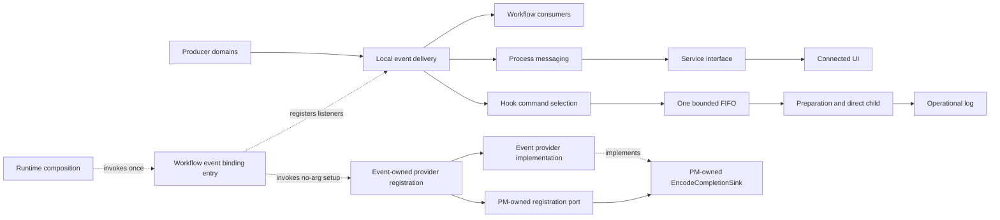
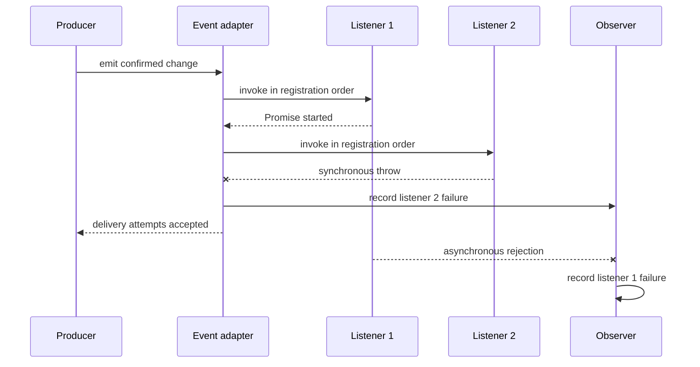
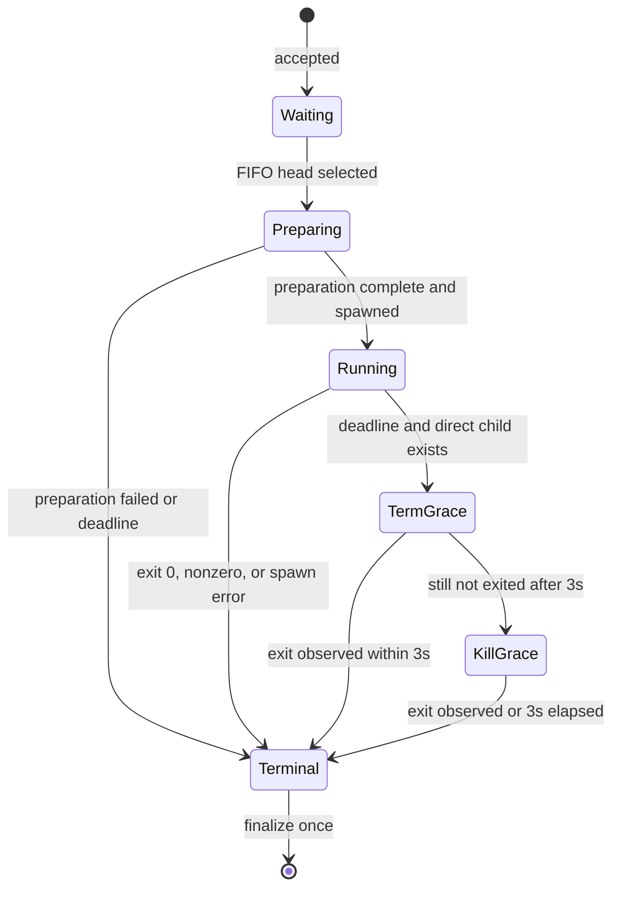
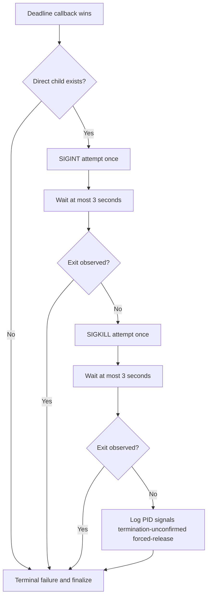

# 状態変化通知・外部連携機能 設計

## 1. 目的、責務、境界

本機能は、番組情報、ルール、予約、録画、録画済み番組、録画ファイル、タグ、サムネイル、およびエンコードの確定した状態変化
を受け取り、選択済みのサーバー内通知先、プロセス間通知、画面向け再取得通知、および外部コマンドへ配送する。

状態変化を起こす業務判断、状態変化後に必要な業務処理の選択、画面への送信、および画面の再取得は本機能の責務ではない。本機
能の受付完了は、登録済み listener への呼出しを試みたことを表し、listener が開始した後続 Promise、IPC の到達、画面の再取
得、または外部コマンドの終了を表さない。

### 1.1 所有する責務

-   状態変化別 listener の登録と登録順の delivery attempt
-   listener の同期 throw と非同期 rejection の観測および記録
-   プロセス間通知と画面向け再取得通知の `server-process-messaging` への受け渡し
-   `server-process-messaging` 所有の `EncodeCompletionSink` consumer port に対する provider implementation
-   9種類の状態変化と設定済み外部コマンドの対応付け
-   全コマンド種別で一つだけの上限付き FIFO、期限、二段階停止、および一回だけの終端
-   コマンド探索用環境とイベント固有環境の allowlist 構築
-   確認できた通知、準備、起動、終了、停止、および過負荷の失敗記録

### 1.2 所有しない責務

-   元の業務状態の変更、取消、rollback
-   状態変化に応じた後続業務の選択
-   IPC message の保存、acknowledgment、必達再送
-   画面向け通知の200ミリ秒集約、Socket.IO送信、画面の再取得
-   通知またはコマンド依頼の永続化、共通 dedupe、自動 retry
-   外部コマンドの業務内容、外部コマンドが作る子孫プロセスの終了保証
-   新しいコマンド記法、既存記法の移行期間、shell互換層

listener がないこと、listener が失敗したこと、IPC の通知先がないこと、外部コマンドが未設定または失敗したことは、確定済み
業務状態を取り消す理由にならない。

## 2. 依存関係と依存方向

| 相手機能                       | 方向                     | 契約                                                                                                                                                           |
| ------------------------------ | ------------------------ | -------------------------------------------------------------------------------------------------------------------------------------------------------------- |
| `server-configuration`         | 本機能から利用           | 9種の command 設定値、既存形式を解釈する provider、`hookCommandMaxPending`、`hookCommandTimeoutMs` の起動時 snapshot を受け取る。                              |
| `server-operational-logging`   | 本機能から利用           | 通知、過負荷、準備、起動、終了、signal、終了未確認を記録する。                                                                                                 |
| `server-process-messaging`     | 本機能から利用           | 状態更新通知を子processへ渡す。PM所有`EncodeCompletionSink`を実装し、そのregistration portへproviderを登録する。PMから本機能へのreverse importを要求しない。   |
| `server-workflow-coordination` | 本機能の利用側           | process-local event bindingから本機能所有の引数なしprovider-registration入口を一回呼び、listener登録と選択した配送を依頼する。PMの型またはportを受け取らない。 |
| 各 producer domain             | producer から本機能      | 確定した状態変化と外部コマンド準備に必要な ID・entity を渡す。                                                                                                 |
| `server-service-interface`     | 本機能から直接依存しない | PM から受けた再取得契機を集約して画面へ送る。                                                                                                                  |

依存方向は provider 側である本機能から PM 所有 port へ向ける。PM source は event interface や provider class を importし
ない。本機能所有のprovider-registration adapterだけが、注入済みのPM registration portと本機能のprovider implementationを
知って一回登録する。Workflowは本機能所有の引数なしsetupだけを呼び、PMの型を受け取らない。Runtimeは承認済みのWorkflow
event binding入口だけを一回呼ぶ。この向きにより、PM・Workflow・本機能の間に静的循環と未承認の直接依存を作らない。画面通
知も本機能から `server-service-interface` を直接呼ばず、PMへ渡した時点で本機能の配送責務を終える。

## 3. コンポーネントとデータ所有

| コンポーネント                  | 単一の責任                                                                  | 所有する状態                          |
| ------------------------------- | --------------------------------------------------------------------------- | ------------------------------------- |
| Event Adapter                   | event name と payload を listener registry へ渡す。                         | event ごとの登録順 listener           |
| Delivery Observer               | 同期 throw と非同期 rejection を一件ごとに記録する。                        | 観測中 Promise の参照だけ             |
| `EncodeCompletionSink` Provider | PM dispatcher から受けた encode 完了を operator encode event へ渡す。       | なし                                  |
| Encode Provider Registration    | PM所有registration portへ同じproviderを一回登録する引数なし入口を提供する。 | 永続状態なし                          |
| UI Notification Handoff         | 再取得契機を PM の一方向通知へ渡す。                                        | 保存・再送状態なし                    |
| Hook Command Selector           | 9種の event と起動時に取得した command 設定値を対応付ける。                 | 起動時 command snapshot               |
| Configured Command Interpreter  | queue 先頭で既存形式を executable と args へ解釈する。                      | 状態を持たない                        |
| Hook Command Queue              | waiting 上限、FIFO、active 一件、再入を管理する。                           | waiting list と active item           |
| Hook Command Preparer           | DB、path、event固有 env を準備する。                                        | active item 内の準備結果              |
| Direct Child Controller         | spawn、exit/error/timeout競合、signal、timer、listener cleanupを管理する。  | active item の child、timer、listener |

コマンド依頼は受付順序、command type、起動時 snapshot に含まれる command 設定値、event payload または参照 ID を持つ。通
知、waiting list、active item、timer、および child 参照はメモリー内だけに保持し、再起動を越えて復元しない。

## 4. サーバー内 event 配送

### 4.1 対象 event inventory

| 区分                       | 状態変化                                                                                                                           |
| -------------------------- | ---------------------------------------------------------------------------------------------------------------------------------- |
| 番組情報                   | EPG 更新完了、EPG 更新完了 one-shot                                                                                                |
| ルール                     | 追加、更新、有効化、無効化、削除                                                                                                   |
| 予約                       | 予約差分の追加、更新、削除                                                                                                         |
| 録画                       | 準備開始、準備取消、準備失敗、録画開始、録画失敗、retry 終了、録画完了、event relay                                                |
| 録画済み番組・録画ファイル | 録画済み番組削除、file size 更新、新規録画済み番組、file 追加、upload file 追加、file 削除、ドロップログ登録情報変更、保護状態変更 |
| タグ                       | 作成、更新、関連付け、削除、関連付け削除                                                                                           |
| サムネイル                 | 追加、削除                                                                                                                         |
| エンコード                 | 追加、取消、完了、失敗、進捗更新、更新、および operator 側完了                                                                     |

この inventory は event interface の実装 locator である。業務処理の選択表ではない。producer が確定前の状態を emit しない
ことは producer domain の契約である。

ドロップログ登録情報変更は `IRecordedEvent` の `emitDropLogFileChanged(dropLogFileId)` と
`setDropLogFileChanged(callback)` で配送し、emit と callback の payload は一件の型付き `DropLogFileId` とする。内部の
raw event key はこの公開 interface contract に含めない。

### 4.2 delivery attempt と完了境界

Event Adapter は Node.js `EventEmitter` の登録順に wrapper listener を呼び出す。各 wrapper は callback を一回だけ呼び、
戻り値を `await` する `try/catch` を持つ。

1. `emit*()` は登録順に wrapper の呼出しを開始する。
2. callback 呼出し時の同期 throw は同じ wrapper の `catch` で記録する。
3. callback が返した Promise の rejection は同じ wrapper の `await` 後の `catch` で記録する。
4. async wrapper が返す Promise を `EventEmitter.emit()` は待たない。したがって登録順は callback の呼出し順であり、後続
   Promise の完了順ではない。
5. 一つの wrapper が同期 throw または非同期 rejection を記録しても、別 wrapper の呼出し、元の業務状態、および emit の受
   付結果を rollback しない。
6. listener が0件なら delivery attempt は0件で終了し、業務失敗へ変換しない。
7. 同じ payload を再度受け付けた場合も毎回 emit し、共通 dedupe key や履歴を持たない。

新しい ack、listener retry、永続 event log、配送 dedupe は追加しない。

### 4.3 配送先ごとの failure isolation

一つの event から local workflow、IPC/UI handoff、hook enqueue の複数 destination を開始する場合、各 destination の呼出
しを独立した owner boundary で囲む。一つの destination の同期 throw または観測可能な非同期 rejection を記録した後も、後
続 destination の開始を試みる。複数 destination を `Promise.all` で一つの受付結果へ束ねず、全 destination の Promise 完
了を `emit*()` の受付条件として await しない。ただし録画完了 listener の Thumbnail 受付と `setEncode()` は、
`server-workflow-coordination` が定める依存 domain call 列であり、同期 throw 時は以後の Hook・画面通知へ到達しない。throw
は event wrapper が記録する。

-   local listener の同期 throw と非同期 rejection は event wrapper が記録する。
-   PM handoff の呼出しが同期 throw した場合は本機能の handoff boundary が記録し、hook 等の後続 destination を開始する。
-   PM transport の `child.send()` callback failure は PM が記録する。実行時 probe では切断後の `send` が `false` を返し
    て callback に `ERR_IPC_CHANNEL_CLOSED` を渡したが、callback failure だけを唯一の形とはせず、同期 throw も PM
    transport の失敗分岐に含める。
-   PM handoff 後に起きる Socket.IO の非同期送信失敗は SI の owner boundary が記録する。本機能は遅延失敗を業務 rollback
    や hook 失敗へ変換しない。
-   hook enqueue の同期失敗は `EventSetter` の destination ごとの guard（`attemptDestination`）が記録し、local/IPC/UI の受付結果を変更しない。

## 5. IPC と画面向け通知

予約、録画、録画済み番組、タグ、サムネイル、エンコードの画面反映が必要な場合、UI Notification Handoff は PM の状態更新通
知を一回呼ぶ。PM は現在登録された Web・API 提供子プロセスへの一方向送信を所有し、`server-service-interface` は受信後の
`updateStatus` または `updateEncode` の集約と Socket.IO 送信を所有する。

本機能は次を保証しない。

-   PM の通知先が存在しない期間の保存または再送
-   切断中の個別通知を再接続後に送ること
-   画面通知の集約時間、送信単位、payload 全体
-   画面が API 再取得を完了したこと
-   IPC または画面通知を後続業務の成功とすること

UI の集約、送信、遅延 Socket.IO failure の検証は
`server-service-interface` の realtime notifier の test が所有する。本機能側では PM handoff の call ledger だけを所有し、SI の集約 timer や Socket.IO adapter を複製しない。

PM の `encodeEvent.emitFinishEncode(info)` dispatcher は PM 所有 `EncodeCompletionSink.accept(info)` を呼ぶ。本機能の
`OperatorEncodeEvent` はこの port の provider implementation となる。本機能所有のprovider-registration adapterは、注入済
みのPM所有registration portへ同じproviderを一回登録する引数なしsetupを提供する。Workflowのevent binding入口はこのsetupを
一回呼ぶが、PMのconsumer port、registration port、provider instanceを引数またはfieldとして受け取らず、binding判断を所有
しない。Runtimeも承認済みのWorkflow event binding入口を一回呼ぶだけで、本機能のprovider型へ直接依存しない。Workflowのevent binding入口（`EventSetter.set()`）は先頭でこのsetupを一回呼ぶ。

## 6. 外部コマンド選択

### 6.1 9種の対応

| command type                         | 状態変化               | 設定がある場合       | 設定がない場合     |
| ------------------------------------ | ---------------------- | -------------------- | ------------------ |
| `reserve-added`                      | 予約追加               | 一件ごとに enqueue 1 | enqueue 0、spawn 0 |
| `reserve-updated`                    | 予約変更               | 一件ごとに enqueue 1 | enqueue 0、spawn 0 |
| `reserve-deleted`                    | 予約削除               | 一件ごとに enqueue 1 | enqueue 0、spawn 0 |
| `recording-prep-started`             | 録画準備開始           | enqueue 1            | enqueue 0、spawn 0 |
| `recording-prep-cancelled-or-failed` | 録画準備取消または失敗 | enqueue 1            | enqueue 0、spawn 0 |
| `recording-started`                  | 録画開始               | enqueue 1            | enqueue 0、spawn 0 |
| `recording-failed`                   | 録画失敗               | enqueue 1            | enqueue 0、spawn 0 |
| `recording-finished`                 | 録画完了               | enqueue 1            | enqueue 0、spawn 0 |
| `encoding-finished`                  | エンコード完了         | enqueue 1            | enqueue 0、spawn 0 |

予約差分に同じ種類が複数件あれば entity ごとに受付順で enqueue する。起動時に録画実行が録画候補と時刻指定手動予約の
timer を組み直すために保存済みの全予約を送り直す入力は、予約の変更ではないため予約変更 command の対象に含めない（予約管
理機能が外部連携へ渡す予約差分から除く）。同じ状態変化を複数回受け付けた場合も各回を独立した
依頼とし、共通 dedupe をしない。command の成功、非0終了、起動失敗、準備失敗、timeout は元の予約、録画、エンコード結果の
成功条件でも他の後続処理の成功条件でもない。

予約差分の削除のうち、番組の終了時刻（`endAt`）を過ぎていて録画実行がまだ録画中として保持している予約（差分を録画実行
へ渡す前に `hasReserve` で判定する）は、予約削除 command をすぐに enqueue せず、その予約の録画完了または録画失敗の
command（録画準備中・再試行待ちで終わる場合は録画準備取消・失敗の command）を enqueue した直後に enqueue する。終了時刻を過ぎた録画は、同じ rule の別の録画の完了による予約再計算などで予
約が先に削除されても、録画実行が届いた data を読み終えてから正常終了として録画完了を出す（`server-recording-execution`）。
削除 command を先に積むと、利用者の command から見て、正常に終わる録画の予約削除が録画完了より先に届く。同期の DB driver
（better-sqlite3）では同時に終わった録画の 2 本目以降で必ずこの順になるため、予約ごとに「録画完了・失敗 → 予約削除」の
順を保つ。それらが 10 分以内に来なければ、保留した予約削除 command をその時点で enqueue する（予約削除 command を失わな
い）。録画完了は一時 directory（`recordedTmp`）から保存先への copy の後に出るので、copy が 10 分を超える構成では、その
録画だけ予約削除が録画完了より先になりうる。録画完了・失敗が出ずに終わる録画（録画済み情報を作れなかった、削除予定とし
て止めた、など）の予約削除は期限まで遅れる。process が止まると保留中の予約削除 command は実行されない（実行待ちの列と同
じく process 内にだけある）。保留は他の予約の command の順序を変えない。

### 6.2 command 解釈

Selector は起動時 snapshot から event type に対応する command 設定値を選び、queue item へ保持する。queue item が FIFO 先
頭へ到達して active となり、実行時間制限を開始した後に、`server-configuration` が提供する既存形式の interpreter を一回呼
ぶ。interpreter は `ProcessUtil.parseCmdStr`（`server-configuration` が契約を維持する既存形式）であり、executable と args を
確定し、実行 file の存在を同期で確認して、失敗時は `CmdBinIsNotFound` を throw する。

本機能は command 設定値を独自に空白分割せず、shell の引用、変数展開、pipe、redirection を適用せず、`%NODE%`、
`%ROOT%`、`%SPACE%` の意味を再定義しない。解釈成功時は返された executable と args を変更せず起動入力に使う。throw は当該
active item の preparation failure として一回 settle し、spawn 0、失敗記録、次の FIFO head の処理へ進む。遅延した解
釈結果は generation と settled guard で破棄する。新しい記法や互換期間は設けない。

## 7. 一つの上限付き FIFO

### 7.1 waiting 上限の意味

全 command type が同じ `Hook Command Queue` を使う。`hookCommandMaxPending` は waiting list に存在する、まだ処理開始して
いない依頼数の上限である。`preparing`、`running`、`term-grace`、`kill-grace` にある active item 一件は waiting 件数へ二
重算入しない。

| 設定                         | 契約                                                                   |
| ---------------------------- | ---------------------------------------------------------------------- |
| `hookCommandMaxPending` 省略 | 64                                                                     |
| 許容値                       | `Number.isInteger(value) && 1 <= value && value <= 10_000`（上限の根拠は `server-configuration` Design 3.1 節を正とする。値そのものに `hookCommandMaxPending` 固有の算出根拠は無く、待機件数の際限ない増加を防ぐ安全弁である） |
| 不正値                       | `Configuration` が config 読込時に拒否し（`ConfigValueError`）、サーバー起動が失敗する。本機能は検証済みの値だけを受け取る |
| 読取時点                     | feature 開始時に一回                                                   |
| reload                       | 稼働中の設定再読込では保持値を更新しない。feature の次回開始時に読む。 |

enqueue 時に `waiting.length >= maxPending` なら新規依頼を waiting に加えず、直接実行もせず、overload error を記録する。
既存 waiting の順序と active item を変更しない。active item がある状態でも waiting は最大 `maxPending` 件まで保持でき
る。受け付けた依頼は、直列 queue がその依頼の処理を開始した時点（idle なら受付の次の microtask、active item があればその完
了後）で waiting の件数から外れ、active item になった後の running item は waiting 上限へ重ねて数えない。そのため、同じ同期区間に続けて受け付けた依頼からは、idle 時に受け付けた先頭の
1 件も処理開始前として数える。

### 7.2 状態機械

状態不変条件は次のとおりである。

-   active item は0または1件だけである。
-   `preparing` から `kill-grace` まで次の waiting item を開始しない。
-   terminal finalizer が active item を一回だけ解放した後、次の FIFO head を一回だけ開始する。
-   enqueue の再入は waiting 末尾への追加だけを行い、active item を置換しない。
-   cancellation API は存在しない。timeout による child 停止を利用者 cancel へ読み替えない。
-   command failure と timeout の自動 retry は0回である。
-   feature restart では waiting、active、timer、listener、child 参照を復元しない。再起動前の child や子孫の終了を保証し
    ない。

## 8. 期限、停止、競合

### 8.1 一件全体の期限

| 設定                        | 契約                                                                             |
| --------------------------- | -------------------------------------------------------------------------------- |
| `hookCommandTimeoutMs` 省略 | 300,000 ms                                                                       |
| 許容値                      | `Number.isInteger(value) && 1 <= value && value <= 2_147_483_647`                |
| 不正値                      | `Configuration` が config 読込時に拒否し（`ConfigValueError`）、サーバー起動が失敗する。本機能は検証済みの値だけを受け取る |
| 開始                        | FIFO head を active にし、最初の command 選択または準備を始める直前              |
| 対象                        | command 選択・解釈・実行 file 確認、DB、file path、env 準備、spawn、実行終了待ち |
| 除外                        | waiting list で待った時間                                                        |
| reload                      | 稼働中は保持値を更新せず、feature の次回開始時に読む。                           |

`preparing` 中に期限へ達した場合は terminal failure を一回確定し、spawn 0とする。DB、filesystem、path、env の遅延結果が
後着しても active generation と settled guard を照合して破棄し、旧結果から child を開始しない。

### 8.2 deadline 境界

-   deadline 直前の terminal event は通常の完了を確定できる。
-   deadline 到達で timeout timer は実行可能になり、timeout callback が最初の settlement attempt なら timeout が勝つ。
-   同じ event-loop turn で exit/error callback が先に settlement を確定した場合、後着 timeout は無視する。
-   deadline 超過後の exit、error、準備成功、準備失敗は最初の timeout 結果を上書きしない。
-   same tick の優先度を event 名で固定せず、最初に `settled` を false から true へ変えた一件だけを採用する。

### 8.3 二段階停止

timeout 時に直接起動した child が存在する場合だけ、次を行う。

1. 同じ direct child へ通常終了要求 `SIGINT` を一回送る。
2. 最大3秒だけ `exit` を待つ。
3. 終了を確認できなければ同じ direct child へ `SIGKILL` を一回送る。
4. さらに最大3秒だけ `exit` を待つ。
5. 終了を確認できなくても logical command を失敗として強制解放し、次の FIFO head へ進む。
6. command type、PID、送信済み signal、`termination-unconfirmed`、`forced-release` を error log へ記録する。

`SIGINT` または `SIGKILL` の送信が throw した場合も送信回数を増やさず、失敗を記録して次の有限段階へ進む。二段階停止後は
追加 signal を送らない。direct child が起動した grandchild の終了は保証しない。自動 retry は行わない。

### 8.4 single completion と cleanup

active item は `settled`、`finalized`、generation token を持つ。preparation failure、spawn throw、child `error`、child
`exit`、timeout、および停止補助失敗の最初の一件だけが logical result を確定する。finalizer は一回だけ次を行う。

1. main deadline timer、termination grace timer、kill grace timer を clear し参照を破棄する。
2. direct child にこの依頼が登録した `exit` と `error` listener だけを同じ関数参照で解除する。
3. active item から direct child、準備 Promise、env、DB/file/path結果への参照を破棄する。
4. 結果と未記録診断を記録する。log failure が後続 cleanup を止めない。
5. active item を一回だけ空にし、terminal item を waiting 件数へ戻さない。
6. 次の turn で FIFO head を一回だけ開始する。

後着 event は generation、`settled`、`finalized` を確認し、別依頼の timer、listener、child、waiting list を変更しない。
child が即時 exit した場合も listener 登録後に終了状態を確認し、event と即時確認の競合を同じ settlement guard へ通す。

## 9. 外部コマンド環境

parent process の環境全体は継承しない。各 spawn の env は command 探索に必要な `PATH` と、次表の event 固有 allowlist だ
けから新しく構成する。`PATH` はサーバー process の `PATH`（`process.env.PATH`）を、command 準備の始め（`ProcessUtil.parseCmdStr` の直後、DB の読み出しより前）に一回読み、spawn の env へ渡す。未設定なら
環境変数 `PATH` を渡さず、独自 fallback や parent env 全体への切替を追加しない。

### 9.1 予約・録画準備 profile

| 変数                                    | 値                       |
| --------------------------------------- | ------------------------ |
| `RESERVEID`、`PROGRAMID`                | 予約 ID、番組 ID         |
| `CHANNELTYPE`、`CHANNELID`              | 放送種別、放送局 ID      |
| `CHANNELNAME`、`HALF_WIDTH_CHANNELNAME` | 放送局名、半角化名       |
| `STARTAT`、`ENDAT`、`DURATION`          | 開始、終了、期間         |
| `NAME`、`HALF_WIDTH_NAME`               | 番組名、半角化名         |
| `DESCRIPTION`、`HALF_WIDTH_DESCRIPTION` | 説明、半角化説明         |
| `EXTENDED`、`HALF_WIDTH_EXTENDED`       | 拡張情報、半角化拡張情報 |

### 9.2 録画 profile

録画 profile は予約 profile の `RESERVEID` を除く番組・放送局・時刻項目に次を加える。

| 変数                                      | 値                 |
| ----------------------------------------- | ------------------ |
| `RECORDEDID`                              | 録画済み番組 ID    |
| `RECPATH`                                 | 録画 file path     |
| `LOGPATH`                                 | drop log path      |
| `ERROR_CNT`、`DROP_CNT`、`SCRAMBLING_CNT` | 10進文字列の集計値 |

### 9.3 エンコード完了 profile

| 変数                                    | 値                                       |
| --------------------------------------- | ---------------------------------------- |
| `RECORDEDID`                            | 録画済み番組 ID                          |
| `VIDEOFILEID`                           | 出力録画 file ID。存在しない場合は空文字 |
| `OUTPUTPATH`                            | 出力 path。存在しない場合は文字列 `null` |
| `MODE`                                  | エンコード方法                           |
| `NAME`、`HALF_WIDTH_NAME`               | 番組名、半角化名                         |
| `DESCRIPTION`、`HALF_WIDTH_DESCRIPTION` | 値がない場合は空文字                     |
| `EXTENDED`、`HALF_WIDTH_EXTENDED`       | 値がない場合は空文字                     |
| `CHANNELID`                             | 値がない場合は空文字                     |
| `CHANNELNAME`、`HALF_WIDTH_CHANNELNAME` | 値がない場合は空文字                     |

予約・録画 profile の nullable 項目は各既存項目の規則どおり文字列 `null` を使用し、環境変数自体を渡さない項目は unset の
ままとする。本機能は null、empty、unset の規則を統一せず、新しい環境変数を追加しない。

### 9.4 9 hook family の exact allowlist

| Hook family        | 渡す key                                                                                                                                                                                                                                                                                                       |
| ------------------ | -------------------------------------------------------------------------------------------------------------------------------------------------------------------------------------------------------------------------------------------------------------------------------------------------------------- |
| 予約追加           | `PATH`, `RESERVEID`, `PROGRAMID`, `CHANNELTYPE`, `CHANNELID`, `CHANNELNAME`, `HALF_WIDTH_CHANNELNAME`, `STARTAT`, `ENDAT`, `DURATION`, `NAME`, `HALF_WIDTH_NAME`, `DESCRIPTION`, `HALF_WIDTH_DESCRIPTION`, `EXTENDED`, `HALF_WIDTH_EXTENDED`                                                                   |
| 予約変更           | `PATH`, `RESERVEID`, `PROGRAMID`, `CHANNELTYPE`, `CHANNELID`, `CHANNELNAME`, `HALF_WIDTH_CHANNELNAME`, `STARTAT`, `ENDAT`, `DURATION`, `NAME`, `HALF_WIDTH_NAME`, `DESCRIPTION`, `HALF_WIDTH_DESCRIPTION`, `EXTENDED`, `HALF_WIDTH_EXTENDED`                                                                   |
| 予約削除           | `PATH`, `RESERVEID`, `PROGRAMID`, `CHANNELTYPE`, `CHANNELID`, `CHANNELNAME`, `HALF_WIDTH_CHANNELNAME`, `STARTAT`, `ENDAT`, `DURATION`, `NAME`, `HALF_WIDTH_NAME`, `DESCRIPTION`, `HALF_WIDTH_DESCRIPTION`, `EXTENDED`, `HALF_WIDTH_EXTENDED`                                                                   |
| 録画準備開始       | `PATH`, `RESERVEID`, `PROGRAMID`, `CHANNELTYPE`, `CHANNELID`, `CHANNELNAME`, `HALF_WIDTH_CHANNELNAME`, `STARTAT`, `ENDAT`, `DURATION`, `NAME`, `HALF_WIDTH_NAME`, `DESCRIPTION`, `HALF_WIDTH_DESCRIPTION`, `EXTENDED`, `HALF_WIDTH_EXTENDED`                                                                   |
| 録画準備取消・失敗 | `PATH`, `RESERVEID`, `PROGRAMID`, `CHANNELTYPE`, `CHANNELID`, `CHANNELNAME`, `HALF_WIDTH_CHANNELNAME`, `STARTAT`, `ENDAT`, `DURATION`, `NAME`, `HALF_WIDTH_NAME`, `DESCRIPTION`, `HALF_WIDTH_DESCRIPTION`, `EXTENDED`, `HALF_WIDTH_EXTENDED`                                                                   |
| 録画開始           | `PATH`, `RECORDEDID`, `PROGRAMID`, `CHANNELTYPE`, `CHANNELID`, `CHANNELNAME`, `HALF_WIDTH_CHANNELNAME`, `STARTAT`, `ENDAT`, `DURATION`, `NAME`, `HALF_WIDTH_NAME`, `DESCRIPTION`, `HALF_WIDTH_DESCRIPTION`, `EXTENDED`, `HALF_WIDTH_EXTENDED`, `RECPATH`, `LOGPATH`, `ERROR_CNT`, `DROP_CNT`, `SCRAMBLING_CNT` |
| 録画失敗           | `PATH`, `RECORDEDID`, `PROGRAMID`, `CHANNELTYPE`, `CHANNELID`, `CHANNELNAME`, `HALF_WIDTH_CHANNELNAME`, `STARTAT`, `ENDAT`, `DURATION`, `NAME`, `HALF_WIDTH_NAME`, `DESCRIPTION`, `HALF_WIDTH_DESCRIPTION`, `EXTENDED`, `HALF_WIDTH_EXTENDED`, `RECPATH`, `LOGPATH`, `ERROR_CNT`, `DROP_CNT`, `SCRAMBLING_CNT` |
| 録画完了           | `PATH`, `RECORDEDID`, `PROGRAMID`, `CHANNELTYPE`, `CHANNELID`, `CHANNELNAME`, `HALF_WIDTH_CHANNELNAME`, `STARTAT`, `ENDAT`, `DURATION`, `NAME`, `HALF_WIDTH_NAME`, `DESCRIPTION`, `HALF_WIDTH_DESCRIPTION`, `EXTENDED`, `HALF_WIDTH_EXTENDED`, `RECPATH`, `LOGPATH`, `ERROR_CNT`, `DROP_CNT`, `SCRAMBLING_CNT` |
| エンコード完了     | `PATH`, `RECORDEDID`, `VIDEOFILEID`, `OUTPUTPATH`, `MODE`, `NAME`, `HALF_WIDTH_NAME`, `DESCRIPTION`, `HALF_WIDTH_DESCRIPTION`, `EXTENDED`, `HALF_WIDTH_EXTENDED`, `CHANNELID`, `CHANNELNAME`, `HALF_WIDTH_CHANNELNAME`                                                                                         |

録画 profile の nullable 値は literal string `null` として child へ渡す。source は `null` と `undefined` をそのまま `env` に渡し、Node.js spawn の env 変換により
null を literal string `null` に、undefined を unset にする。本機能はこの変換を変えず、項目ごとに null・空文字・unset を使い分ける。`videoFiles` が未定義または空配列なら `RECPATH` を欠損扱いにし、`videoFiles[0]` を参照しない。エンコード完了は
`VIDEOFILEID` と説明・拡張・放送局系の欠損を空文字、`OUTPUTPATH` の欠損を literal string `null` とする。

## 10. 失敗、再入、再起動

| 事象                                   | logical result              | 後続                         | 元の業務状態 |
| -------------------------------------- | --------------------------- | ---------------------------- | ------------ |
| listener 同期 throw / 非同期 rejection | failure を記録              | 他 listener は独立に継続     | 変更しない   |
| IPC 通知先なし / send failure          | PM 契約へ渡し記録           | 保存、再送、ack なし         | 変更しない   |
| command 未設定                         | 非実行                      | enqueue 0、spawn 0           | 変更しない   |
| queue full                             | overload error              | 新規だけ拒否、既存順序を維持 | 変更しない   |
| command / DB / path / env 準備失敗     | command failure             | active 解放後に次へ          | 変更しない   |
| spawn throw / child `error`            | command failure             | cleanup 後に次へ             | 変更しない   |
| exit code 0                            | success log                 | cleanup 後に次へ             | 変更しない   |
| exit code nonzero                      | failure log                 | cleanup 後に次へ             | 変更しない   |
| timeout                                | command failure             | 二段階停止後に次へ           | 変更しない   |
| termination unconfirmed                | error log と forced release | 追加 signal 0、次へ          | 変更しない   |
| enqueue 再入                           | waiting 末尾へ一回          | active と既存順序を維持      | 変更しない   |
| feature restart                        | メモリー状態を復元しない    | 新しい受付だけ処理           | 変更しない   |

通知と command には利用者 cancel interface がないため cancel case は N/A である。restart は feature を新しい instance と
して構成し、reload は既存 instance を維持するため区別する。

実装は停止 API を持たず、parent process shutdown 時に hook の direct child へ signal を送る処理を持たない。本設計
は timeout 時の二段階停止だけを定義し、shutdown protocol を追加しない。確認できる restart 契約は、メモリー内 queue
を復元、再送、再実行しないことに限る。

## 11. Test 設計

外部commandのintegrationは、成功・観測失敗・観測timeoutのいずれでもtest本体の`finally`で直接起動したchildの終了と
`close`を有限期限で確認してから一時directoryを削除する。hookのログ行が揃ったことをchild終了の代用にせず、固定sleepで回収を待たない。

### 11.1 品質判定と証拠状態

本機能は R1からR6の62 canonical `unittest/spec` 主case、機能固有 `unittest/imp`、integration を所有する。共有 runner、
command、V8 設定、および server 全体の C0/C1 判定は `server-application-runtime` Requirement 9
（Acceptance Criterion 9）が所有する。

判定は混同しない。

| 判定                                         | 所有                  | この Design の状態                                         |
| -------------------------------------------- | --------------------- | ---------------------------------------------------------- |
| 機能仕様 case                                | 本機能                | 実装済み（62 case が実在する）                             |
| 機能実装・integration                        | 本機能                | 実装済み（imp・integration が実在する）                    |
| C0 statement・C1 branch 100%（server 全体）  | Runtime Requirement 9 | Runtime の判定に従う（本書は結果を記録しない）             |

test の実行結果と coverage の値は共有 command の実行結果を正とし、Design 内に command、件数、PASS、coverage 除外を記録
しない。

### 11.2 値域 profile

| Profile      | 9観点と適用                                                                                                                                                                            |
| ------------ | -------------------------------------------------------------------------------------------------------------------------------------------------------------------------------------- |
| `V-EVENT`    | null/empty/0/1/min/max/out-of-range/invalid type は typed producer interface へ直接入らないため N/A。duplicate は同一 payload の二回配送で適用する。                                   |
| `V-LISTENER` | null は登録 interface の型外、empty は listener 0件、0/1/min/max/out-of-range は件数として0・1・複数を適用、invalid type は型外、duplicate は同一 callback 二登録を適用する。          |
| `V-COMMAND`  | null/empty は設定 provider の既存規則、0/1/min/max/out-of-range/invalid type は command 数では N/A、duplicate は同一 event 二回を適用する。                                            |
| `V-PENDING`  | 省略64、0、1、最小1、最大10,000、範囲外-1/10,001、不正型の文字列・小数・NaN・Infinity、duplicate enqueue を適用する。                                                                  |
| `V-TIMEOUT`  | 省略300,000、0、1、最小1、最大2,147,483,647、範囲外-1/2,147,483,648、不正型の文字列・小数・NaN・Infinity、duplicate timer は同着で検出する。                                           |
| `V-ENV`      | null、empty、unset を項目規則で区別する。0/1/min/max/out-of-range は ID・時刻・count の10進化で適用し、不正型は provider/entity 境界、duplicate key は allowlist 構築で0件を確認する。 |
| `V-EXIT`     | null は signal exit、empty は N/A、0、1、最小/最大 OS exit code、範囲外/不正型は ChildProcess 境界外、duplicate exit/error/timeout を競合として適用する。                              |
| `V-EVIDENCE` | runtime 値入力を持たないため9観点は N/A。ID、locator、行数、必須列に欠落・重複がないことを本書の構成として満たす。                                                                                   |

### 11.3 状態、時間、資源、境界 profile

| Profile      | 内容                                                                                                                                                          |
| ------------ | ------------------------------------------------------------------------------------------------------------------------------------------------------------- |
| `S-EVENT`    | listenerなし、登録済み、delivery attempt、同期失敗、非同期失敗、完了。cancel/restart は event instance の公開操作でないため N/A。再入とduplicate emitを含む。 |
| `S-QUEUE`    | waiting、preparing、running、term-grace、kill-grace、terminal。idle、full、failure、再入、restartを含む。cancelはN/A。                                        |
| `T-EVENT`    | 登録順呼出し、非同期完了順N/A、duplicate、同期throw、late rejection。                                                                                         |
| `T-DEADLINE` | 直前、到達、超過、same tick、late settlement、exit/error/timeout競合。                                                                                        |
| `R-EVENT`    | listener と観測 Promise。timer、child、DB、file、env は N/A。                                                                                                 |
| `R-COMMAND`  | queue head、DB、file、path、env、direct child、timer、listener。stream と lock は使用しないため N/A。                                                         |
| `B-LOCAL`    | EventEmitter と callback port。                                                                                                                               |
| `B-IPC`      | PM consumer port、child IPC。HTTP と画面への直接配送は SI 責務のため N/A。                                                                                    |
| `B-PROCESS`  | configuration、DB、filesystem、Node.js child process、signal、operational log。                                                                               |
| `B-STATIC`   | 設計文書の ID・locator・行の構成。動的 resource は N/A。                                                                                           |

### 11.4 不在機能

次の不在保証は call ledger で検証する。

各 spec case の call ledger は acknowledgment、retry scheduler、永続 queue、delivery history、dedupe key/store の timer、
DB/file write が0であること、retry 0、duplicate各回、未設定・full時spawn 0、timeout後late spawn 0、追加signal 0を確認する。

### 11.5 偽物と本番の部品の一致の補足case

AC の主caseを兼ねない補足として、`integration/event-hook-delivery.integration.test.ts` の `recording event to hook command chain without doubles in between` は、本物の `RecordingEvent` → 本物の `EventSetter` → 本物の `ExternalCommandManageModel` → 実 child をつなぎ、録画の経路が渡す凍結した写しで event を出したとき、各 hook の command が 1 回ずつ event の順に動くことを確かめる。`integration/external-command-environment.integration.test.ts` の `hook payload doubles against the frozen copies the recording path passes` は、全 hook の payload を凍結した写しにしても子 process の引数と環境変数が instance のときと同じであること、録画済みの path を本物の `VideoUtil` と本物の video file の行で解決することを確かめる。

もう 1 つの補足として、`integration/real-hook-conditions.integration.test.ts` は、本物の `RecordingEvent`・`ReserveEvent`・`OperatorEncodeEvent` → 本物の `EventSetter` → 本物の `ExternalCommandManageModel` → 実 child を、実 SQLite（`ChannelDB`・`RecordedDB`・`VideoFileDB` と本物の `VideoUtil`）と実時計の上でつなぎ、次を確かめる。(1) 同じ予約変更・録画終了・encode 完了を 2 回受け付けると command が 2 回ずつ起動し、重複排除をしない（EH-3.11）。(2) 9 種の hook を即 exit 1・期限まで眠る・存在しない file にしても、呼び出し側の戻り値・業務側の呼び出し・DB の行が hook を設定しない場合と同じである（EH-3.12・EH-6.5）。(3) 眠る hook の最中にも通知と予約の取消しは終わっており、期限切れでも増減しない（EH-6.6）。(4) 本物の `Configuration` と実 config.yml の再読込で、待機件数の上限と実行時間制限は起動時に読んだ値のままで、再起動した model だけが新しい値を使う（EH-4.6・EH-4.10）。(5) 実行時間制限が未設定なら 300,000ms で、時計の部品で model の timer だけを進めて実の子へ 299.999 秒では signal が届かず 300 秒で SIGINT・3 秒後に SIGKILL が届く（EH-4.9）。(6) 孫を作る実の子で、signal は直接の子だけに届き孫は生き残る（EH-4.14）。(7) SIGINT を無視する実の子へ、SIGKILL が 1 回だけ 3 秒後に同じ子へ届く（EH-4.15）。(8) 終了しない子（`kill()` を子へ届けない）で、SIGKILL の 3 秒後に強制解放し、実の log4js の出力 file に `termination-unconfirmed forced-release: type=<種別> pid=<pid> signals=SIGINT,SIGKILL` を残し、次の実の command が走り、以後 signal・再起動・孫の停止が無い（EH-4.16・EH-4.17・EH-4.18）。

## 12. Canonical case registry

以下の locator はすべて実装済みである（EH-7.1・EH-7.3 は文書のレビュー、EH-7.5 は Runtime の判定を指す）。R1からR6は一つの AC に一つの canonical `*.spec.test.ts#EH-N.M` 主caseを割
り当てる。R7は動作主caseを重複させず、spec case 一覧、implementation characteristic、Feature Test Matrix、integration、
server 全体の C0/C1 の5層へ割り当てる。

| ID      | Canonical locator                                                                                |
| ------- | ------------------------------------------------------------------------------------------------ |
| EH-1.1  | `test/server/event-and-hook-delivery/event-delivery.spec.test.ts#EH-1.1`                         |
| EH-1.2  | `test/server/event-and-hook-delivery/event-delivery.spec.test.ts#EH-1.2`                         |
| EH-1.3  | `test/server/event-and-hook-delivery/event-delivery.spec.test.ts#EH-1.3`                         |
| EH-1.4  | `test/server/event-and-hook-delivery/event-delivery.spec.test.ts#EH-1.4`                         |
| EH-1.5  | `test/server/event-and-hook-delivery/event-delivery.spec.test.ts#EH-1.5`                         |
| EH-1.6  | `test/server/event-and-hook-delivery/event-delivery.spec.test.ts#EH-1.6`                         |
| EH-1.7  | `test/server/event-and-hook-delivery/event-delivery.spec.test.ts#EH-1.7`                         |
| EH-2.1  | `test/server/event-and-hook-delivery/downstream-notification.spec.test.ts#EH-2.1`                |
| EH-2.2  | `test/server/event-and-hook-delivery/downstream-notification.spec.test.ts#EH-2.2`                |
| EH-2.3  | `test/server/event-and-hook-delivery/downstream-notification.spec.test.ts#EH-2.3`                |
| EH-2.4  | `test/server/event-and-hook-delivery/downstream-notification.spec.test.ts#EH-2.4`                |
| EH-2.5  | `test/server/event-and-hook-delivery/downstream-notification.spec.test.ts#EH-2.5`                |
| EH-2.6  | `test/server/event-and-hook-delivery/downstream-notification.spec.test.ts#EH-2.6`                |
| EH-2.7  | `test/server/event-and-hook-delivery/downstream-notification.spec.test.ts#EH-2.7`                |
| EH-3.1  | `test/server/event-and-hook-delivery/external-command-selection.spec.test.ts#EH-3.1`             |
| EH-3.2  | `test/server/event-and-hook-delivery/external-command-selection.spec.test.ts#EH-3.2`             |
| EH-3.3  | `test/server/event-and-hook-delivery/external-command-selection.spec.test.ts#EH-3.3`             |
| EH-3.4  | `test/server/event-and-hook-delivery/external-command-selection.spec.test.ts#EH-3.4`             |
| EH-3.5  | `test/server/event-and-hook-delivery/external-command-selection.spec.test.ts#EH-3.5`             |
| EH-3.6  | `test/server/event-and-hook-delivery/external-command-selection.spec.test.ts#EH-3.6`             |
| EH-3.7  | `test/server/event-and-hook-delivery/external-command-selection.spec.test.ts#EH-3.7`             |
| EH-3.8  | `test/server/event-and-hook-delivery/external-command-selection.spec.test.ts#EH-3.8`             |
| EH-3.9  | `test/server/event-and-hook-delivery/external-command-selection.spec.test.ts#EH-3.9`             |
| EH-3.10 | `test/server/event-and-hook-delivery/external-command-selection.spec.test.ts#EH-3.10`            |
| EH-3.11 | `test/server/event-and-hook-delivery/external-command-selection.spec.test.ts#EH-3.11`            |
| EH-3.12 | `test/server/event-and-hook-delivery/external-command-selection.spec.test.ts#EH-3.12`            |
| EH-4.1  | `test/server/event-and-hook-delivery/external-command-queue.spec.test.ts#EH-4.1`                 |
| EH-4.2  | `test/server/event-and-hook-delivery/external-command-queue.spec.test.ts#EH-4.2`                 |
| EH-4.3  | `test/server/event-and-hook-delivery/external-command-queue.spec.test.ts#EH-4.3`                 |
| EH-4.4  | `test/server/event-and-hook-delivery/external-command-queue.spec.test.ts#EH-4.4`                 |
| EH-4.5  | `test/server/event-and-hook-delivery/external-command-queue.spec.test.ts#EH-4.5`                 |
| EH-4.6  | `test/server/event-and-hook-delivery/external-command-queue.spec.test.ts#EH-4.6`                 |
| EH-4.7  | `test/server/event-and-hook-delivery/external-command-queue.spec.test.ts#EH-4.7`                 |
| EH-4.8  | `test/server/event-and-hook-delivery/external-command-queue.spec.test.ts#EH-4.8`                 |
| EH-4.9  | `test/server/event-and-hook-delivery/external-command-queue.spec.test.ts#EH-4.9`                 |
| EH-4.10 | `test/server/event-and-hook-delivery/external-command-queue.spec.test.ts#EH-4.10`                |
| EH-4.11 | `test/server/event-and-hook-delivery/external-command-queue.spec.test.ts#EH-4.11`                |
| EH-4.12 | `test/server/event-and-hook-delivery/external-command-queue.spec.test.ts#EH-4.12`                |
| EH-4.13 | `test/server/event-and-hook-delivery/external-command-queue.spec.test.ts#EH-4.13`                |
| EH-4.14 | `test/server/event-and-hook-delivery/external-command-queue.spec.test.ts#EH-4.14`                |
| EH-4.15 | `test/server/event-and-hook-delivery/external-command-queue.spec.test.ts#EH-4.15`                |
| EH-4.16 | `test/server/event-and-hook-delivery/external-command-queue.spec.test.ts#EH-4.16`                |
| EH-4.17 | `test/server/event-and-hook-delivery/external-command-queue.spec.test.ts#EH-4.17`                |
| EH-4.18 | `test/server/event-and-hook-delivery/external-command-queue.spec.test.ts#EH-4.18`                |
| EH-4.19 | `test/server/event-and-hook-delivery/external-command-queue.spec.test.ts#EH-4.19`                |
| EH-4.20 | `test/server/event-and-hook-delivery/external-command-queue.spec.test.ts#EH-4.20`                |
| EH-5.1  | `test/server/event-and-hook-delivery/external-command-environment.spec.test.ts#EH-5.1`、`test/server/event-and-hook-delivery/external-command-environment.spec.test.ts#EH-5.1-CONSUMER-EXACT`           |
| EH-5.2  | `test/server/event-and-hook-delivery/external-command-environment.spec.test.ts#EH-5.2`、`test/server/event-and-hook-delivery/external-command-environment.spec.test.ts#EH-5.2-CONSUMER-NO-SHELL`           |
| EH-5.3  | `test/server/event-and-hook-delivery/external-command-environment.spec.test.ts#EH-5.3`、`test/server/event-and-hook-delivery/external-command-environment.spec.test.ts#EH-5.1-CONSUMER-EXACT`           |
| EH-5.4  | `test/server/event-and-hook-delivery/external-command-environment.spec.test.ts#EH-5.4`、`test/server/event-and-hook-delivery/external-command-environment.spec.test.ts#EH-5.1-CONSUMER-EXACT`           |
| EH-5.5  | `test/server/event-and-hook-delivery/external-command-environment.spec.test.ts#EH-5.5`           |
| EH-5.6  | `test/server/event-and-hook-delivery/external-command-environment.spec.test.ts#EH-5.6`           |
| EH-5.7  | `test/server/event-and-hook-delivery/external-command-environment.spec.test.ts#EH-5.7`           |
| EH-5.8  | `test/server/event-and-hook-delivery/external-command-environment.spec.test.ts#EH-5.8`           |
| EH-5.9  | `test/server/event-and-hook-delivery/external-command-environment.spec.test.ts#EH-5.9`           |
| EH-6.1  | `test/server/event-and-hook-delivery/external-command-failures.spec.test.ts#EH-6.1`              |
| EH-6.2  | `test/server/event-and-hook-delivery/external-command-failures.spec.test.ts#EH-6.2`              |
| EH-6.3  | `test/server/event-and-hook-delivery/external-command-failures.spec.test.ts#EH-6.3`              |
| EH-6.4  | `test/server/event-and-hook-delivery/external-command-failures.spec.test.ts#EH-6.4`              |
| EH-6.5  | `test/server/event-and-hook-delivery/external-command-failures.spec.test.ts#EH-6.5`              |
| EH-6.6  | `test/server/event-and-hook-delivery/external-command-failures.spec.test.ts#EH-6.6`              |
| EH-6.7  | `test/server/event-and-hook-delivery/external-command-failures.spec.test.ts#EH-6.7`              |
| EH-7.1  | `test/server/event-and-hook-delivery/*.spec.test.ts`の62 canonical主case#EH-7.1                        |
| EH-7.2  | `test/server/event-and-hook-delivery/imp/event-hook-characteristics.test.ts#EH-7.2`              |
| EH-7.3  | 本節の Feature Test Matrix（§13）#EH-7.3                          |
| EH-7.4  | `test/server/event-and-hook-delivery/integration/event-hook-delivery.integration.test.ts#EH-7.4` |
| EH-7.5  | Runtime Requirement 9 Acceptance Criterion 9#EH-7.5      |

## 13. Feature Test Matrix

`S` は `unittest/spec`、`I` は `unittest/imp`、`G` は integration、`M` は本節の matrix 自体と文書のレビュー、`Q` は
品質判定を表す。各行の証拠は実装済みの test である。EH-7.1・EH-7.3 は文書のレビュー（層 `M`）、EH-7.5 は Runtime の判定（層 `Q`）である。

| ID      | Canonical locator                                                                                | 層    | 値域            | 状態・時間                 | 資源・境界                     | 主 assertion / N/A                                                           |
| ------- | ------------------------------------------------------------------------------------------------ | ----- | --------------- | -------------------------- | ------------------------------ | ---------------------------------------------------------------------------- |
| EH-1.1  | `test/server/event-and-hook-delivery/event-delivery.spec.test.ts#EH-1.1`                         | S/I   | V-EVENT         | S-EVENT/T-EVENT            | R-EVENT/B-LOCAL                | inventory 全 event の登録先へ payload を渡す。                               |
| EH-1.2  | `test/server/event-and-hook-delivery/event-delivery.spec.test.ts#EH-1.2`                         | S/I   | V-LISTENER      | S-EVENT/T-EVENT            | listener/B-LOCAL               | 複数 listener の callback 呼出し順が登録順。Promise完了順はN/A。             |
| EH-1.3  | `test/server/event-and-hook-delivery/event-delivery.spec.test.ts#EH-1.3`                         | S/I   | V-LISTENER      | delivery/late              | Promise/B-LOCAL                | callback開始後のPromise完了をemit受付が待たない。                            |
| EH-1.4  | `test/server/event-and-hook-delivery/event-delivery.spec.test.ts#EH-1.4`                         | S/I   | V-EVENT         | duplicate                  | listener/B-LOCAL               | 同一payload二回で各listener二回、dedupe state 0。                            |
| EH-1.5  | `test/server/event-and-hook-delivery/event-delivery.spec.test.ts#EH-1.5`                         | S     | V-LISTENER      | listenerなし               | listener/B-LOCAL               | attempt 0、業務failure/rollback 0。                                          |
| EH-1.6  | `test/server/event-and-hook-delivery/event-delivery.spec.test.ts#EH-1.6`                         | S/I   | V-LISTENER      | sync throw/async rejection | listener/log                   | 両失敗を記録し、別listenerを継続。                                           |
| EH-1.7  | `test/server/event-and-hook-delivery/event-delivery.spec.test.ts#EH-1.7`                         | S     | V-EVENT         | failure                    | log/B-LOCAL                    | listener失敗後も業務取消effect 0。                                           |
| EH-2.1  | `test/server/event-and-hook-delivery/downstream-notification.spec.test.ts#EH-2.1`                | S/G   | V-EVENT         | delivery                   | IPC/B-IPC                      | 対象状態変化をPMへ一回渡す。                                                 |
| EH-2.2  | `test/server/event-and-hook-delivery/downstream-notification.spec.test.ts#EH-2.2`                | S/G   | V-EVENT         | delivery                   | IPC/B-IPC                      | 再取得契機をPMへ渡す。HTTP/画面直接配送はN/A。                               |
| EH-2.3  | `test/server/event-and-hook-delivery/downstream-notification.spec.test.ts#EH-2.3`                | S     | V-EVENT         | 全状態                     | timer/B-IPC                    | 本機能に集約timer・送信単位定義0。                                           |
| EH-2.4  | `test/server/event-and-hook-delivery/downstream-notification.spec.test.ts#EH-2.4`                | S     | V-EVENT         | delivery                   | message/B-IPC                  | payload全体を必須にせず再取得契機だけ。                                      |
| EH-2.5  | `test/server/event-and-hook-delivery/downstream-notification.spec.test.ts#EH-2.5`                | S     | V-EVENT         | no-wait                    | IPC/B-IPC                      | PMの同期throw後も後続を開始し、retry 0。ackを待つ経路は`notifyClient(): void`が持たない。 |
| EH-2.6  | `test/server/event-and-hook-delivery/downstream-notification.spec.test.ts#EH-2.6`                | S/I   | V-EVENT         | disconnect                 | IPC/B-IPC                      | 保存・必達再送state 0。                                                      |
| EH-2.7  | `test/server/event-and-hook-delivery/downstream-notification.spec.test.ts#EH-2.7`                | S/I   | V-EVENT         | restart                    | IPC/B-IPC                      | 個別再送優先state 0、現在状態再取得を妨げない。                              |
| EH-3.1  | `test/server/event-and-hook-delivery/external-command-selection.spec.test.ts#EH-3.1`             | S     | V-COMMAND       | enqueue                    | queue/B-PROCESS                | 予約追加を対応するhook入口へ一回渡す。設定ありで一件ごとのenqueue 1はsupporting case。 |
| EH-3.2  | `test/server/event-and-hook-delivery/external-command-selection.spec.test.ts#EH-3.2`             | S     | V-COMMAND       | enqueue                    | queue/B-PROCESS                | 予約変更を対応するhook入口へ一回渡す。設定ありでenqueue 1はsupporting case。 |
| EH-3.3  | `test/server/event-and-hook-delivery/external-command-selection.spec.test.ts#EH-3.3`             | S     | V-COMMAND       | enqueue                    | queue/B-PROCESS                | 予約削除を対応するhook入口へ一回渡す。設定ありでenqueue 1はsupporting case。終了時刻を過ぎて録画中の予約の削除は録画完了・失敗・録画準備取消の後（10分で期限）を `test/server/event-and-hook-delivery/reserve-deletion-order.spec.test.ts` が見る。 |
| EH-3.4  | `test/server/event-and-hook-delivery/external-command-selection.spec.test.ts#EH-3.4`             | S     | V-COMMAND       | enqueue                    | queue/B-PROCESS                | 録画準備開始を対応するhook入口へ一回渡す。設定ありでenqueue 1はsupporting case。 |
| EH-3.5  | `test/server/event-and-hook-delivery/external-command-selection.spec.test.ts#EH-3.5`             | S     | V-COMMAND       | enqueue                    | queue/B-PROCESS                | 準備取消/失敗設定ありで同じtypeへenqueue 1。                                 |
| EH-3.6  | `test/server/event-and-hook-delivery/external-command-selection.spec.test.ts#EH-3.6`             | S     | V-COMMAND       | enqueue                    | queue/B-PROCESS                | 録画開始を対応するhook入口へ一回渡す。設定ありでenqueue 1はsupporting case。 |
| EH-3.7  | `test/server/event-and-hook-delivery/external-command-selection.spec.test.ts#EH-3.7`             | S     | V-COMMAND       | enqueue                    | queue/B-PROCESS                | 録画失敗を対応するhook入口へ一回渡す。設定ありでenqueue 1はsupporting case。 |
| EH-3.8  | `test/server/event-and-hook-delivery/external-command-selection.spec.test.ts#EH-3.8`             | S     | V-COMMAND       | enqueue                    | queue/B-PROCESS                | 録画完了を対応するhook入口へ一回渡す。設定ありでenqueue 1はsupporting case。 |
| EH-3.9  | `test/server/event-and-hook-delivery/external-command-selection.spec.test.ts#EH-3.9`             | S     | V-COMMAND       | enqueue                    | queue/B-PROCESS                | encode完了を対応するhook入口へ一回渡す。設定ありでenqueue 1はsupporting case。 |
| EH-3.10 | `test/server/event-and-hook-delivery/external-command-selection.spec.test.ts#EH-3.10`            | S     | V-COMMAND       | unset                      | queue/child                    | encode完了の設定なしでenqueue 0、spawn 0。9種の設定なしはsupporting case。 |
| EH-3.11 | `test/server/event-and-hook-delivery/external-command-selection.spec.test.ts#EH-3.11`            | S/I   | V-COMMAND       | duplicate                  | queue/child                    | EventSetterが同一eventを2回とも渡す。2依頼のenqueue、dedupe 0はsupporting case。 |
| EH-3.12 | `test/server/event-and-hook-delivery/external-command-selection.spec.test.ts#EH-3.12`            | S     | V-COMMAND       | success/failure            | domain/child                   | hook受付はcallbackの戻り値を変えない。command結果と業務状態の分離はEH-6.5・EH-6.6。 |
| EH-4.1  | `test/server/event-and-hook-delivery/external-command-queue.spec.test.ts#EH-4.1`                 | S/I   | V-COMMAND       | waiting                    | queue/B-PROCESS                | 全type共通一FIFOで受付順。                                                   |
| EH-4.2  | `test/server/event-and-hook-delivery/external-command-queue.spec.test.ts#EH-4.2`                 | S/I   | V-COMMAND       | preparing/running          | DB/file/env/child              | active terminalまで次の準備/spawn 0。                                        |
| EH-4.3  | `test/server/event-and-hook-delivery/external-command-queue.spec.test.ts#EH-4.3`                 | S/I   | V-EXIT          | terminal                   | queue/child                    | terminal finalizer後に次を一回開始。                                         |
| EH-4.4  | `test/server/event-and-hook-delivery/external-command-queue.spec.test.ts#EH-4.4`                 | S/I   | V-PENDING       | idle/running               | queue                          | 省略64、activeをwaitingへ二重算入しない。                                    |
| EH-4.5  | `test/server/event-and-hook-delivery/external-command-queue.spec.test.ts#EH-4.5`                 | S/I   | V-PENDING       | startup                    | config/queue                   | 最小1・最大10,000を保持。不正値の拒否はConfiguration（EH-7.2 imp）。 |
| EH-4.6  | `test/server/event-and-hook-delivery/external-command-queue.spec.test.ts#EH-4.6`                 | S     | V-PENDING       | reload/restart             | config/queue                   | reload非反映、feature restart時だけ新値。                                    |
| EH-4.7  | `test/server/event-and-hook-delivery/external-command-queue.spec.test.ts#EH-4.7`                 | S/I   | V-EXIT          | failure/timeout            | queue/child                    | 自動retry 0。                                                                |
| EH-4.8  | `test/server/event-and-hook-delivery/external-command-queue.spec.test.ts#EH-4.8`                 | S/I   | V-TIMEOUT       | T-DEADLINE                 | config/DB/file/env/child/timer | active化後のprovider解釈・file確認から実行までを期限へ含め、queue wait除外。 |
| EH-4.9  | `test/server/event-and-hook-delivery/external-command-queue.spec.test.ts#EH-4.9`                 | S/I   | V-TIMEOUT       | startup                    | config/timer                   | 省略300,000ms。                                                              |
| EH-4.10 | `test/server/event-and-hook-delivery/external-command-queue.spec.test.ts#EH-4.10`                | S     | V-TIMEOUT       | reload/restart             | config/timer                   | reload非反映、feature restart時だけ新値。                                    |
| EH-4.11 | `test/server/event-and-hook-delivery/external-command-queue.spec.test.ts#EH-4.11`                | S/I   | V-TIMEOUT       | running/timeout            | child/signal                   | timeoutをsuccessにせずSIGINT attempt 1。                                     |
| EH-4.12 | `test/server/event-and-hook-delivery/external-command-queue.spec.test.ts#EH-4.12`                | S/I   | V-TIMEOUT       | term-grace                 | child/timer                    | SIGINT後の待機は最大3秒。                                                    |
| EH-4.13 | `test/server/event-and-hook-delivery/external-command-queue.spec.test.ts#EH-4.13`                | S/I   | V-TIMEOUT       | terminal                   | queue/timer/listener           | 二段階停止後failure確定、retry 0、次へ。                                     |
| EH-4.14 | `test/server/event-and-hook-delivery/external-command-queue.spec.test.ts#EH-4.14`                | S/I/G | V-EXIT          | running                    | direct child                   | spawnが返した一child参照だけを保持。                                         |
| EH-4.15 | `test/server/event-and-hook-delivery/external-command-queue.spec.test.ts#EH-4.15`                | S/I/G | V-TIMEOUT       | term/kill grace            | child/signal/timer             | 3秒未終了なら同childへSIGKILL attempt 1。                                    |
| EH-4.16 | `test/server/event-and-hook-delivery/external-command-queue.spec.test.ts#EH-4.16`                | S/I/G | V-TIMEOUT       | kill-grace                 | child/timer                    | SIGKILL後の待機は最大3秒。                                                   |
| EH-4.17 | `test/server/event-and-hook-delivery/external-command-queue.spec.test.ts#EH-4.17`                | S/I/G | V-TIMEOUT       | termination-unconfirmed    | child/signal/log/queue         | type、PID、signals、termination-unconfirmed、forced-releaseをlogし次へ。     |
| EH-4.18 | `test/server/event-and-hook-delivery/external-command-queue.spec.test.ts#EH-4.18`                | S/I/G | V-TIMEOUT       | terminal/restart           | child/signal                   | 追加signal 0、grandchild保証N/A、retry 0。                                   |
| EH-4.19 | `test/server/event-and-hook-delivery/external-command-queue.spec.test.ts#EH-4.19`                | S/I   | V-TIMEOUT       | preparing/late             | DB/file/env/timer/child        | preparation timeout後spawn 0、late結果破棄、次へ。                           |
| EH-4.20 | `test/server/event-and-hook-delivery/external-command-queue.spec.test.ts#EH-4.20`                | S/I   | V-PENDING       | full/reentry               | queue/log/child                | 新規enqueue 0、spawn 0、overload error、既存順序不変。                       |
| EH-5.1  | `test/server/event-and-hook-delivery/external-command-environment.spec.test.ts#EH-5.1`、`test/server/event-and-hook-delivery/external-command-environment.spec.test.ts#EH-5.1-CONSUMER-EXACT`           | S/I   | V-COMMAND       | preparing                  | config/process/timer           | provider（`ProcessUtil.parseCmdStr`）の出力がexecutable+argsをexactに返す。consumerが戻り値を変えずspawnへ渡し、設定文字列のparseが1回だけであることはhook family 9種の`EH-5.1-CONSUMER-EXACT`で固定する。 |
| EH-5.2  | `test/server/event-and-hook-delivery/external-command-environment.spec.test.ts#EH-5.2`、`test/server/event-and-hook-delivery/external-command-environment.spec.test.ts#EH-5.2-CONSUMER-NO-SHELL`           | S/I   | V-COMMAND       | preparing                  | process                        | shell metacharacterをliteralな引数として返す。spawnがshellなし・stdio ignoreで起動されることは`EH-5.2-CONSUMER-NO-SHELL`で固定する。 |
| EH-5.3  | `test/server/event-and-hook-delivery/external-command-environment.spec.test.ts#EH-5.3`、`test/server/event-and-hook-delivery/external-command-environment.spec.test.ts#EH-5.1-CONSUMER-EXACT`           | S/I   | V-COMMAND       | preparing                  | config                         | Node記号の置換結果をproviderが返す。consumerの再解釈0は、記号入りの要素を含む戻り値が不変で使われることを見る`EH-5.1-CONSUMER-EXACT`で固定する。 |
| EH-5.4  | `test/server/event-and-hook-delivery/external-command-environment.spec.test.ts#EH-5.4`、`test/server/event-and-hook-delivery/external-command-environment.spec.test.ts#EH-5.1-CONSUMER-EXACT`           | S/I   | V-COMMAND       | preparing                  | config                         | ROOT/SPACE記号の置換結果をproviderが返す。consumerの再解釈0は、記号入りの要素を含む戻り値が不変で使われることを見る`EH-5.1-CONSUMER-EXACT`で固定する。 |
| EH-5.5  | `test/server/event-and-hook-delivery/external-command-environment.spec.test.ts#EH-5.5`           | S/I/G | V-ENV           | preparing/running          | env/process                    | PATHとevent固有allowlistだけ。                                               |
| EH-5.6  | `test/server/event-and-hook-delivery/external-command-environment.spec.test.ts#EH-5.6`           | S/I/G | V-ENV           | running                    | env/process                    | parent env全継承0、非allowlist key 0。                                       |
| EH-5.7  | `test/server/event-and-hook-delivery/external-command-environment.spec.test.ts#EH-5.7`           | S/I   | V-ENV           | preparing                  | DB/env                         | 予約・番組・放送局・予約設定の利用可能値。                                   |
| EH-5.8  | `test/server/event-and-hook-delivery/external-command-environment.spec.test.ts#EH-5.8`           | S/I/G | V-ENV           | preparing                  | DB/file/env                    | 録画済み、file、drop、encode結果の利用可能値。                               |
| EH-5.9  | `test/server/event-and-hook-delivery/external-command-environment.spec.test.ts#EH-5.9`           | S/I   | V-ENV           | preparing                  | env                            | 項目別null/empty/unsetをexact assertion。                                    |
| EH-6.1  | `test/server/event-and-hook-delivery/external-command-failures.spec.test.ts#EH-6.1`              | S/I/G | V-COMMAND/V-ENV | preparing/failure          | config/DB/file/env/log/queue   | 解釈・file確認・情報準備不能でspawn 0、failure伝達、次へ。                   |
| EH-6.2  | `test/server/event-and-hook-delivery/external-command-failures.spec.test.ts#EH-6.2`              | S/I/G | V-EXIT          | running/error              | child/listener/log/queue       | spawn/child error記録、cleanup、次へ。                                       |
| EH-6.3  | `test/server/event-and-hook-delivery/external-command-failures.spec.test.ts#EH-6.3`              | S/I/G | V-EXIT          | running/terminal           | child/listener/log/queue       | nonzero記録、single completion、次へ。                                       |
| EH-6.4  | `test/server/event-and-hook-delivery/external-command-failures.spec.test.ts#EH-6.4`              | S/I/G | V-EXIT          | running/terminal           | child/listener/log/queue       | exit 0記録、single completion。                                              |
| EH-6.5  | `test/server/event-and-hook-delivery/external-command-failures.spec.test.ts#EH-6.5`              | S     | V-EXIT          | failure/timeout            | domain/process                 | 業務状態変更effect 0。                                                       |
| EH-6.6  | `test/server/event-and-hook-delivery/external-command-failures.spec.test.ts#EH-6.6`              | S     | V-COMMAND       | enqueue/terminal           | workflow/process               | command受付/終了を他処理successにしない。                                    |
| EH-6.7  | `test/server/event-and-hook-delivery/external-command-failures.spec.test.ts#EH-6.7`              | S/I   | V-COMMAND/V-ENV | preparing/late/failure     | config/DB/file/env/queue       | provider解釈を含むasync準備 rejectionをactiveへ伝え、解放して次へ。          |
| EH-7.1  | `test/server/event-and-hook-delivery/*.spec.test.ts`の62 canonical主case#EH-7.1                        | M     | V-EVIDENCE      | static                     | B-STATIC                       | §12の62 locatorが`*.spec.test.ts`に各1つ実在することをレビューで確認する。動的資源N/A。 |
| EH-7.2  | `test/server/event-and-hook-delivery/imp/event-hook-characteristics.test.ts#EH-7.2`              | I     | V-EVIDENCE      | all states/times           | R-EVENT/R-COMMAND/B-STATIC     | 値域、分岐、null/empty/unset、single completion、cleanupを横断。             |
| EH-7.3  | 本節の Feature Test Matrix（§13）#EH-7.3                          | M     | V-EVIDENCE      | static                     | B-STATIC                       | 67行、必須列、状態、時間、資源、境界、N/A理由、一意性が揃う。                |
| EH-7.4  | `test/server/event-and-hook-delivery/integration/event-hook-delivery.integration.test.ts#EH-7.4` | G     | V-EVIDENCE      | failure/timeout/restart    | DB/file/IPC/child/signal       | DB/filesystem/IPC/process/signal接続。HTTP/画面直接配送はSI責務でN/A。       |
| EH-7.5  | Runtime Requirement 9 Acceptance Criterion 9#EH-7.5      | Q     | V-EVIDENCE      | server 全体 C0/C1       | coverage              | 機能test全件と server 全体の C0/C1 未成立なら未完了。                          |

## 14. Evidence ledger

各行の expected evidence は実装済みの test（EH-7.1・EH-7.3 は文書のレビュー、EH-7.5 は Runtime の判定）であり、registry、matrix、Formal trace と同じ locator を使う。

| ID      | Evidence locator                                                                                 | Expected evidence                          |
| ------- | ------------------------------------------------------------------------------------------------ | ------------------------------------------ |
| EH-1.1  | `test/server/event-and-hook-delivery/event-delivery.spec.test.ts#EH-1.1`                         | 全event categoryのcall ledger              |
| EH-1.2  | `test/server/event-and-hook-delivery/event-delivery.spec.test.ts#EH-1.2`                         | 登録順callback ledger                      |
| EH-1.3  | `test/server/event-and-hook-delivery/event-delivery.spec.test.ts#EH-1.3`                         | emit受付とdeferred Promise分離             |
| EH-1.4  | `test/server/event-and-hook-delivery/event-delivery.spec.test.ts#EH-1.4`                         | duplicate各回                              |
| EH-1.5  | `test/server/event-and-hook-delivery/event-delivery.spec.test.ts#EH-1.5`                         | listener 0、rollback 0                     |
| EH-1.6  | `test/server/event-and-hook-delivery/event-delivery.spec.test.ts#EH-1.6`                         | sync/async failure log                     |
| EH-1.7  | `test/server/event-and-hook-delivery/event-delivery.spec.test.ts#EH-1.7`                         | domain mutation 0                          |
| EH-2.1  | `test/server/event-and-hook-delivery/downstream-notification.spec.test.ts#EH-2.1`                | PM handoff                                 |
| EH-2.2  | `test/server/event-and-hook-delivery/downstream-notification.spec.test.ts#EH-2.2`                | UI refresh trigger handoff                 |
| EH-2.3  | `test/server/event-and-hook-delivery/downstream-notification.spec.test.ts#EH-2.3`                | aggregation state 0                        |
| EH-2.4  | `test/server/event-and-hook-delivery/downstream-notification.spec.test.ts#EH-2.4`                | full state payload不要                     |
| EH-2.5  | `test/server/event-and-hook-delivery/downstream-notification.spec.test.ts#EH-2.5`                | ack/wait 0                                 |
| EH-2.6  | `test/server/event-and-hook-delivery/downstream-notification.spec.test.ts#EH-2.6`                | persistence/resend 0                       |
| EH-2.7  | `test/server/event-and-hook-delivery/downstream-notification.spec.test.ts#EH-2.7`                | reconnect replay priority 0                |
| EH-3.1  | `test/server/event-and-hook-delivery/external-command-selection.spec.test.ts#EH-3.1`             | reserve add enqueue                        |
| EH-3.2  | `test/server/event-and-hook-delivery/external-command-selection.spec.test.ts#EH-3.2`             | reserve update enqueue                     |
| EH-3.3  | `test/server/event-and-hook-delivery/external-command-selection.spec.test.ts#EH-3.3`             | reserve delete enqueue                     |
| EH-3.4  | `test/server/event-and-hook-delivery/external-command-selection.spec.test.ts#EH-3.4`             | prep start enqueue                         |
| EH-3.5  | `test/server/event-and-hook-delivery/external-command-selection.spec.test.ts#EH-3.5`             | prep cancel/fail enqueue                   |
| EH-3.6  | `test/server/event-and-hook-delivery/external-command-selection.spec.test.ts#EH-3.6`             | recording start enqueue                    |
| EH-3.7  | `test/server/event-and-hook-delivery/external-command-selection.spec.test.ts#EH-3.7`             | recording fail enqueue                     |
| EH-3.8  | `test/server/event-and-hook-delivery/external-command-selection.spec.test.ts#EH-3.8`             | recording finish enqueue                   |
| EH-3.9  | `test/server/event-and-hook-delivery/external-command-selection.spec.test.ts#EH-3.9`             | encoding finish enqueue                    |
| EH-3.10 | `test/server/event-and-hook-delivery/external-command-selection.spec.test.ts#EH-3.10`            | unset enqueue/spawn 0                      |
| EH-3.11 | `test/server/event-and-hook-delivery/external-command-selection.spec.test.ts#EH-3.11`            | duplicate independent                      |
| EH-3.12 | `test/server/event-and-hook-delivery/external-command-selection.spec.test.ts#EH-3.12`            | business result independent                |
| EH-4.1  | `test/server/event-and-hook-delivery/external-command-queue.spec.test.ts#EH-4.1`                 | one FIFO                                   |
| EH-4.2  | `test/server/event-and-hook-delivery/external-command-queue.spec.test.ts#EH-4.2`                 | serial prepare/run                         |
| EH-4.3  | `test/server/event-and-hook-delivery/external-command-queue.spec.test.ts#EH-4.3`                 | terminal starts next                       |
| EH-4.4  | `test/server/event-and-hook-delivery/external-command-queue.spec.test.ts#EH-4.4`                 | default64/waiting meaning                  |
| EH-4.5  | `test/server/event-and-hook-delivery/external-command-queue.spec.test.ts#EH-4.5`                 | range1..10,000                             |
| EH-4.6  | `test/server/event-and-hook-delivery/external-command-queue.spec.test.ts#EH-4.6`                 | restart-only reload                        |
| EH-4.7  | `test/server/event-and-hook-delivery/external-command-queue.spec.test.ts#EH-4.7`                 | retry 0                                    |
| EH-4.8  | `test/server/event-and-hook-delivery/external-command-queue.spec.test.ts#EH-4.8`                 | active後のprovider解釈からの期限           |
| EH-4.9  | `test/server/event-and-hook-delivery/external-command-queue.spec.test.ts#EH-4.9`                 | default300,000ms                           |
| EH-4.10 | `test/server/event-and-hook-delivery/external-command-queue.spec.test.ts#EH-4.10`                | timeout restart-only reload                |
| EH-4.11 | `test/server/event-and-hook-delivery/external-command-queue.spec.test.ts#EH-4.11`                | timeout SIGINT 1                           |
| EH-4.12 | `test/server/event-and-hook-delivery/external-command-queue.spec.test.ts#EH-4.12`                | term grace max3s                           |
| EH-4.13 | `test/server/event-and-hook-delivery/external-command-queue.spec.test.ts#EH-4.13`                | failure/remove/next                        |
| EH-4.14 | `test/server/event-and-hook-delivery/external-command-queue.spec.test.ts#EH-4.14`                | direct child reference                     |
| EH-4.15 | `test/server/event-and-hook-delivery/external-command-queue.spec.test.ts#EH-4.15`                | SIGKILL 1                                  |
| EH-4.16 | `test/server/event-and-hook-delivery/external-command-queue.spec.test.ts#EH-4.16`                | kill grace max3s                           |
| EH-4.17 | `test/server/event-and-hook-delivery/external-command-queue.spec.test.ts#EH-4.17`                | unconfirmed forced-release log             |
| EH-4.18 | `test/server/event-and-hook-delivery/external-command-queue.spec.test.ts#EH-4.18`                | extra signal0/grandchild N/A               |
| EH-4.19 | `test/server/event-and-hook-delivery/external-command-queue.spec.test.ts#EH-4.19`                | preparation late spawn0                    |
| EH-4.20 | `test/server/event-and-hook-delivery/external-command-queue.spec.test.ts#EH-4.20`                | overload reject preserves queue            |
| EH-5.1  | `test/server/event-and-hook-delivery/external-command-environment.spec.test.ts#EH-5.1`、`test/server/event-and-hook-delivery/external-command-environment.spec.test.ts#EH-5.1-CONSUMER-EXACT`           | deadline内provider解釈結果のexact使用      |
| EH-5.2  | `test/server/event-and-hook-delivery/external-command-environment.spec.test.ts#EH-5.2`、`test/server/event-and-hook-delivery/external-command-environment.spec.test.ts#EH-5.2-CONSUMER-NO-SHELL`           | shell reinterpretation 0                   |
| EH-5.3  | `test/server/event-and-hook-delivery/external-command-environment.spec.test.ts#EH-5.3`、`test/server/event-and-hook-delivery/external-command-environment.spec.test.ts#EH-5.1-CONSUMER-EXACT`           | Node symbol reinterpretation 0             |
| EH-5.4  | `test/server/event-and-hook-delivery/external-command-environment.spec.test.ts#EH-5.4`、`test/server/event-and-hook-delivery/external-command-environment.spec.test.ts#EH-5.1-CONSUMER-EXACT`           | ROOT/SPACE reinterpretation 0              |
| EH-5.5  | `test/server/event-and-hook-delivery/external-command-environment.spec.test.ts#EH-5.5`           | search+event env allowlist                 |
| EH-5.6  | `test/server/event-and-hook-delivery/external-command-environment.spec.test.ts#EH-5.6`           | parent env inheritance 0                   |
| EH-5.7  | `test/server/event-and-hook-delivery/external-command-environment.spec.test.ts#EH-5.7`           | reserve/program/channel env                |
| EH-5.8  | `test/server/event-and-hook-delivery/external-command-environment.spec.test.ts#EH-5.8`           | recorded/file/drop/encode env              |
| EH-5.9  | `test/server/event-and-hook-delivery/external-command-environment.spec.test.ts#EH-5.9`           | null/empty/unset exact                     |
| EH-6.1  | `test/server/event-and-hook-delivery/external-command-failures.spec.test.ts#EH-6.1`              | interpret/preparation failure/spawn0/next  |
| EH-6.2  | `test/server/event-and-hook-delivery/external-command-failures.spec.test.ts#EH-6.2`              | spawn failure/next                         |
| EH-6.3  | `test/server/event-and-hook-delivery/external-command-failures.spec.test.ts#EH-6.3`              | nonzero/next                               |
| EH-6.4  | `test/server/event-and-hook-delivery/external-command-failures.spec.test.ts#EH-6.4`              | zero success                               |
| EH-6.5  | `test/server/event-and-hook-delivery/external-command-failures.spec.test.ts#EH-6.5`              | domain mutation 0                          |
| EH-6.6  | `test/server/event-and-hook-delivery/external-command-failures.spec.test.ts#EH-6.6`              | other workflow success 0                   |
| EH-6.7  | `test/server/event-and-hook-delivery/external-command-failures.spec.test.ts#EH-6.7`              | async interpret/preparation rejection/next |
| EH-7.1  | `test/server/event-and-hook-delivery/*.spec.test.ts`の62 canonical主case#EH-7.1                        | 62 case layer                    |
| EH-7.2  | `test/server/event-and-hook-delivery/imp/event-hook-characteristics.test.ts#EH-7.2`              | implementation characteristic layer        |
| EH-7.3  | 本節の Feature Test Matrix（§13）#EH-7.3                          | 67 row matrix layer                        |
| EH-7.4  | `test/server/event-and-hook-delivery/integration/event-hook-delivery.integration.test.ts#EH-7.4` | integration boundary layer                 |
| EH-7.5  | Runtime Requirement 9 Acceptance Criterion 9#EH-7.5      | server 全体の C0/C1 layer |

## 15. Numeric Formal AC trace

Numeric Formal ID は Requirements の Requirement と Acceptance Criterion の番号をそのまま表す。全67 ACを一意に持ち、R1か
らR6は62件、R7は5件である。各 locator の status は registry と同じ（実装済み。EH-7.1・EH-7.3・EH-7.5 は §12 の但し書きのとおり）である。

| Formal AC | Feature ID | Design responsibility            | Formal locator                                                                                   |
| --------- | ---------- | -------------------------------- | ------------------------------------------------------------------------------------------------ |
| R1.AC1    | EH-1.1     | 全対象eventの配送                | `test/server/event-and-hook-delivery/event-delivery.spec.test.ts#EH-1.1`                         |
| R1.AC2    | EH-1.2     | 登録順delivery attempt           | `test/server/event-and-hook-delivery/event-delivery.spec.test.ts#EH-1.2`                         |
| R1.AC3    | EH-1.3     | 後続Promise非待機                | `test/server/event-and-hook-delivery/event-delivery.spec.test.ts#EH-1.3`                         |
| R1.AC4    | EH-1.4     | duplicate各回                    | `test/server/event-and-hook-delivery/event-delivery.spec.test.ts#EH-1.4`                         |
| R1.AC5    | EH-1.5     | listenerなし                     | `test/server/event-and-hook-delivery/event-delivery.spec.test.ts#EH-1.5`                         |
| R1.AC6    | EH-1.6     | sync/async failure観測           | `test/server/event-and-hook-delivery/event-delivery.spec.test.ts#EH-1.6`                         |
| R1.AC7    | EH-1.7     | 業務rollback 0                   | `test/server/event-and-hook-delivery/event-delivery.spec.test.ts#EH-1.7`                         |
| R2.AC1    | EH-2.1     | 別process通知handoff             | `test/server/event-and-hook-delivery/downstream-notification.spec.test.ts#EH-2.1`                |
| R2.AC2    | EH-2.2     | 画面再取得契機handoff            | `test/server/event-and-hook-delivery/downstream-notification.spec.test.ts#EH-2.2`                |
| R2.AC3    | EH-2.3     | 集約・送信をSIへ委譲             | `test/server/event-and-hook-delivery/downstream-notification.spec.test.ts#EH-2.3`                |
| R2.AC4    | EH-2.4     | 状態全体不要                     | `test/server/event-and-hook-delivery/downstream-notification.spec.test.ts#EH-2.4`                |
| R2.AC5    | EH-2.5     | 再取得・後続完了と分離           | `test/server/event-and-hook-delivery/downstream-notification.spec.test.ts#EH-2.5`                |
| R2.AC6    | EH-2.6     | 保存・必達再送保証なし           | `test/server/event-and-hook-delivery/downstream-notification.spec.test.ts#EH-2.6`                |
| R2.AC7    | EH-2.7     | 再接続時個別再送優先なし         | `test/server/event-and-hook-delivery/downstream-notification.spec.test.ts#EH-2.7`                |
| R3.AC1    | EH-3.1     | 予約追加command                  | `test/server/event-and-hook-delivery/external-command-selection.spec.test.ts#EH-3.1`             |
| R3.AC2    | EH-3.2     | 予約変更command                  | `test/server/event-and-hook-delivery/external-command-selection.spec.test.ts#EH-3.2`             |
| R3.AC3    | EH-3.3     | 予約削除command                  | `test/server/event-and-hook-delivery/external-command-selection.spec.test.ts#EH-3.3`・`reserve-deletion-order.spec.test.ts`             |
| R3.AC4    | EH-3.4     | 録画準備開始command              | `test/server/event-and-hook-delivery/external-command-selection.spec.test.ts#EH-3.4`             |
| R3.AC5    | EH-3.5     | 録画準備取消・失敗command        | `test/server/event-and-hook-delivery/external-command-selection.spec.test.ts#EH-3.5`             |
| R3.AC6    | EH-3.6     | 録画開始command                  | `test/server/event-and-hook-delivery/external-command-selection.spec.test.ts#EH-3.6`             |
| R3.AC7    | EH-3.7     | 録画失敗command                  | `test/server/event-and-hook-delivery/external-command-selection.spec.test.ts#EH-3.7`             |
| R3.AC8    | EH-3.8     | 録画完了command                  | `test/server/event-and-hook-delivery/external-command-selection.spec.test.ts#EH-3.8`             |
| R3.AC9    | EH-3.9     | encode完了command                | `test/server/event-and-hook-delivery/external-command-selection.spec.test.ts#EH-3.9`             |
| R3.AC10   | EH-3.10    | command未設定                    | `test/server/event-and-hook-delivery/external-command-selection.spec.test.ts#EH-3.10`            |
| R3.AC11   | EH-3.11    | command dedupe 0                 | `test/server/event-and-hook-delivery/external-command-selection.spec.test.ts#EH-3.11`            |
| R3.AC12   | EH-3.12    | commandと業務結果の分離          | `test/server/event-and-hook-delivery/external-command-selection.spec.test.ts#EH-3.12`            |
| R4.AC1    | EH-4.1     | 全type共通FIFO                   | `test/server/event-and-hook-delivery/external-command-queue.spec.test.ts#EH-4.1`                 |
| R4.AC2    | EH-4.2     | prepare/run直列                  | `test/server/event-and-hook-delivery/external-command-queue.spec.test.ts#EH-4.2`                 |
| R4.AC3    | EH-4.3     | terminal後に次                   | `test/server/event-and-hook-delivery/external-command-queue.spec.test.ts#EH-4.3`                 |
| R4.AC4    | EH-4.4     | waiting上限・既定64              | `test/server/event-and-hook-delivery/external-command-queue.spec.test.ts#EH-4.4`                 |
| R4.AC5    | EH-4.5     | 上限値域                         | `test/server/event-and-hook-delivery/external-command-queue.spec.test.ts#EH-4.5`                 |
| R4.AC6    | EH-4.6     | 上限restart反映                  | `test/server/event-and-hook-delivery/external-command-queue.spec.test.ts#EH-4.6`                 |
| R4.AC7    | EH-4.7     | retry 0                          | `test/server/event-and-hook-delivery/external-command-queue.spec.test.ts#EH-4.7`                 |
| R4.AC8    | EH-4.8     | active後の解釈から実行までの期限 | `test/server/event-and-hook-delivery/external-command-queue.spec.test.ts#EH-4.8`                 |
| R4.AC9    | EH-4.9     | 期限既定300秒                    | `test/server/event-and-hook-delivery/external-command-queue.spec.test.ts#EH-4.9`                 |
| R4.AC10   | EH-4.10    | 期限restart反映                  | `test/server/event-and-hook-delivery/external-command-queue.spec.test.ts#EH-4.10`                |
| R4.AC11   | EH-4.11    | timeout終了要求                  | `test/server/event-and-hook-delivery/external-command-queue.spec.test.ts#EH-4.11`                |
| R4.AC12   | EH-4.12    | 有限終了待ち                     | `test/server/event-and-hook-delivery/external-command-queue.spec.test.ts#EH-4.12`                |
| R4.AC13   | EH-4.13    | failure確定・次                  | `test/server/event-and-hook-delivery/external-command-queue.spec.test.ts#EH-4.13`                |
| R4.AC14   | EH-4.14    | direct child保持                 | `test/server/event-and-hook-delivery/external-command-queue.spec.test.ts#EH-4.14`                |
| R4.AC15   | EH-4.15    | 3秒後SIGKILL 1                   | `test/server/event-and-hook-delivery/external-command-queue.spec.test.ts#EH-4.15`                |
| R4.AC16   | EH-4.16    | kill後最大3秒                    | `test/server/event-and-hook-delivery/external-command-queue.spec.test.ts#EH-4.16`                |
| R4.AC17   | EH-4.17    | 終了未確認logとforced release    | `test/server/event-and-hook-delivery/external-command-queue.spec.test.ts#EH-4.17`                |
| R4.AC18   | EH-4.18    | 追加signal 0・grandchild非保証   | `test/server/event-and-hook-delivery/external-command-queue.spec.test.ts#EH-4.18`                |
| R4.AC19   | EH-4.19    | preparation timeout/late spawn 0 | `test/server/event-and-hook-delivery/external-command-queue.spec.test.ts#EH-4.19`                |
| R4.AC20   | EH-4.20    | full時新規拒否                   | `test/server/event-and-hook-delivery/external-command-queue.spec.test.ts#EH-4.20`                |
| R5.AC1    | EH-5.1     | provider解釈結果のexact使用      | `test/server/event-and-hook-delivery/external-command-environment.spec.test.ts#EH-5.1`、`test/server/event-and-hook-delivery/external-command-environment.spec.test.ts#EH-5.1-CONSUMER-EXACT`           |
| R5.AC2    | EH-5.2     | shell再解釈0                     | `test/server/event-and-hook-delivery/external-command-environment.spec.test.ts#EH-5.2`、`test/server/event-and-hook-delivery/external-command-environment.spec.test.ts#EH-5.2-CONSUMER-NO-SHELL`           |
| R5.AC3    | EH-5.3     | Node記号再定義0                  | `test/server/event-and-hook-delivery/external-command-environment.spec.test.ts#EH-5.3`、`test/server/event-and-hook-delivery/external-command-environment.spec.test.ts#EH-5.1-CONSUMER-EXACT`           |
| R5.AC4    | EH-5.4     | ROOT/SPACE再定義0                | `test/server/event-and-hook-delivery/external-command-environment.spec.test.ts#EH-5.4`、`test/server/event-and-hook-delivery/external-command-environment.spec.test.ts#EH-5.1-CONSUMER-EXACT`           |
| R5.AC5    | EH-5.5     | 探索+event環境                   | `test/server/event-and-hook-delivery/external-command-environment.spec.test.ts#EH-5.5`           |
| R5.AC6    | EH-5.6     | parent env全継承0                | `test/server/event-and-hook-delivery/external-command-environment.spec.test.ts#EH-5.6`           |
| R5.AC7    | EH-5.7     | 予約・番組・放送局env            | `test/server/event-and-hook-delivery/external-command-environment.spec.test.ts#EH-5.7`           |
| R5.AC8    | EH-5.8     | 録画・file・drop・encode env     | `test/server/event-and-hook-delivery/external-command-environment.spec.test.ts#EH-5.8`           |
| R5.AC9    | EH-5.9     | null/empty/unset                 | `test/server/event-and-hook-delivery/external-command-environment.spec.test.ts#EH-5.9`           |
| R6.AC1    | EH-6.1     | 解釈・情報準備失敗               | `test/server/event-and-hook-delivery/external-command-failures.spec.test.ts#EH-6.1`              |
| R6.AC2    | EH-6.2     | 起動失敗                         | `test/server/event-and-hook-delivery/external-command-failures.spec.test.ts#EH-6.2`              |
| R6.AC3    | EH-6.3     | nonzero終了                      | `test/server/event-and-hook-delivery/external-command-failures.spec.test.ts#EH-6.3`              |
| R6.AC4    | EH-6.4     | 正常終了                         | `test/server/event-and-hook-delivery/external-command-failures.spec.test.ts#EH-6.4`              |
| R6.AC5    | EH-6.5     | 業務状態非変更                   | `test/server/event-and-hook-delivery/external-command-failures.spec.test.ts#EH-6.5`              |
| R6.AC6    | EH-6.6     | 他処理successと分離              | `test/server/event-and-hook-delivery/external-command-failures.spec.test.ts#EH-6.6`              |
| R6.AC7    | EH-6.7     | async解釈・準備失敗伝播          | `test/server/event-and-hook-delivery/external-command-failures.spec.test.ts#EH-6.7`              |
| R7.AC1    | EH-7.1     | 62 canonical spec case      | `test/server/event-and-hook-delivery/*.spec.test.ts`の62 canonical主case#EH-7.1                        |
| R7.AC2    | EH-7.2     | implementation characteristic    | `test/server/event-and-hook-delivery/imp/event-hook-characteristics.test.ts#EH-7.2`              |
| R7.AC3    | EH-7.3     | Feature Test Matrix                    | 本節の Feature Test Matrix（§13）#EH-7.3                          |
| R7.AC4    | EH-7.4     | integration boundary             | `test/server/event-and-hook-delivery/integration/event-hook-delivery.integration.test.ts#EH-7.4` |
| R7.AC5    | EH-7.5     | server 全体の C0/C1      | Runtime Requirement 9 Acceptance Criterion 9#EH-7.5      |

## 16. Source、spec、test、runtime evidence の不一致

| 分類                    | 本機能での扱い                                                                                                                                                                |
| ----------------------- | ----------------------------------------------------------------------------------------------------------------------------------------------------------------------------- |
| `spec defect`           | Requirements と producer event、configuration、PM、SI の契約が矛盾する場合、該当仕様 phase へ戻す。                                                                           |
| `implementation defect` | raw command の consumer 再解釈、Promise executor の `async`、PM から event interface への reverse import、上限・期限・二段階停止不足など、Design と source の差を対象にする。 |
| `test defect`           | ack、retry、永続化、dedupe、画面直接配送、grandchild終了等の要件外保証を test が要求する場合、oracle を修正する。                                                             |
| `approved change`       | 要求変更の根拠が別途確定している場合だけ、Requirements、Design、test、source、trace を同じ変更単位で同期する。                                                                |
| `unknown`               | OS signal 結果、同着順、DB/filesystem failure など証拠不足を推測で埋めず、isolated runtime evidence へ割り当てる。                                                            |

event wrapper は同期 throw と非同期 rejection を捕捉する。`EventSetter` は destination ごとに `attemptDestination` で囲み、
先行の失敗を記録して後続を試す。録画完了の Thumbnail 受付と `setEncode()` は Workflow が定める依存列として例外である。
external command は共通上限、全体期限、二段階停止を持つ。準備の失敗は active item の failure として settle し、spawn 0、
記録、次 item へ進む。

## 17. Implementation mapping

| 設計要素                        | Source locator                                                                                                                                                                                      | 状態と責任                                                                                           |
| ------------------------------- | --------------------------------------------------------------------------------------------------------------------------------------------------------------------------------------------------- | ---------------------------------------------------------------------------------------------------- |
| event interface と wrapper      | `src/model/event/IEPGUpdateEvent.ts`、`IRuleEvent.ts`、`IReserveEvent.ts`、`IRecordingEvent.ts`、`IRecordedEvent.ts`、`IRecordedTagEvent.ts`、`IThumbnailEvent.ts`、`IEncodeEvent.ts`、各実装 class | event inventory、登録順、sync throw / async rejection 観測の入口                                     |
| delivery wiring                 | `src/model/event/EventSetter.ts`                                                                                                                                                                    | UI handoff、workflow callback、9種command選択の入口                                                  |
| PM consumer port                | `src/model/ipc/IEncodeCompletionSink.ts`                                                                                                                                                            | PM所有payloadと `EncodeCompletionSink`。                                                     |
| provider implementation         | `src/model/event/OperatorEncodeEvent.ts`                                                                                                                                                            | `EncodeCompletionSink` を実装する。                                                          |
| provider registration adapter   | `src/model/event/OperatorEncodeEventBinding.ts`と既存`ModelContainerSetter`内のEvent/PM injection seam                                                                                      | PM registration portとproviderを本機能内で一回登録する引数なし`setup()`だけをWorkflowへ公開する。`EventSetter.set()`が一回呼ぶ。 |
| PM dispatcher / notification    | `src/model/ipc/IPCServer.ts`、`IIPCServer.ts`、`IPCMessageDefine.ts`                                                                                                                                | encode完了をportへ渡し、状態更新を現在のchildへ送る入口                                              |
| SI realtime consumer            | `src/model/service/socketio/SocketIOManageModel.ts`                                                                                                                                                 | 200ms集約、本文なし通知、接続中client送信。SI所有                                                    |
| external command facade         | `src/model/operator/externalCommand/IExternalCommandManageModel.ts`                                                                                                                                 | 既存9種入口の対応                                                                                    |
| bounded FIFO と lifecycle       | `src/model/operator/externalCommand/ExternalCommandManageModel.ts`                                                                                                                                  | waiting/active、期限、single finalizer、二段階停止の変更入口                                         |
| command provider interpretation | `src/util/ProcessUtil.ts` の `parseCmdStr`                                                                                                                                                          | 既存記号とexecutable/args解釈の入口。`Configuration.ts` は9種の command 文字列と上限・期限の検証済み値を保持する |
| feature snapshot settings       | `src/model/IConfigFile.ts`、`src/model/Configuration.ts`、`config/config.yml.template`                                                                                                              | 上限64、期限300,000ms、値域、feature restart反映の入口                                               |
| DB/path/env preparation         | `ExternalCommandManageModel.ts` の `createReserveCmd`、`createRecordedCmd`、`createFinishEncodeCmd`                                                                                                 | DB、path、allowlist env の準備入口                                                                   |
| direct child 停止               | `ExternalCommandManageModel.ts` の `timeoutCommand`、`finishTerminationGrace`、`finishKillGrace`、`attemptSignal`                                                                                   | direct child signal と有限待機を実装する入口。`ProcessUtil.isExited` を補助に使う                    |

Source locator は実装調査と変更入口であり、機能境界や実装済みの証拠ではない。

## 18. 再確認 trigger

-   producer event interface、payload、登録方式、または Node.js `EventEmitter` 利用を変更する場合
-   PM の通知 message、`EncodeCompletionSink`、PM registration port、本機能のprovider-registration入口、Workflow event
    binding入口、または SI の通知名・集約時間を変更する場合
-   9種の command 設定名、既存 command 解釈、環境変数名、null/empty/unset 規則を変更する場合
-   `hookCommandMaxPending`、`hookCommandTimeoutMs`、signal、grace時間、queue状態を変更する場合
-   Node.js ChildProcess、timer、DB、filesystem adapter の主要契約を変更する場合
-   Runtime Requirement 9、Vitest/V8設定、共有 command、
    coverage 対象を変更する場合

## Primary production source ownership

本節は、本機能が主に所有する製品 source と、その owner-local test の置き場所を示す。次の primary source の動作、公開 API、
IPC wire、DB schema、設定、保存形式は変更しない。owner-local test locator は既存 test directory の範囲を示すものであり、
個別 source の characterization 網羅を主張しない。

| Primary source | Owner-local test locator | Cross-spec consumer |
| --- | --- | --- |
| `src/model/event/EventSetter.ts` | `test/server/event-and-hook-delivery/**/*.test.ts` | Workflow Coordination は event ordering consumer。 |
