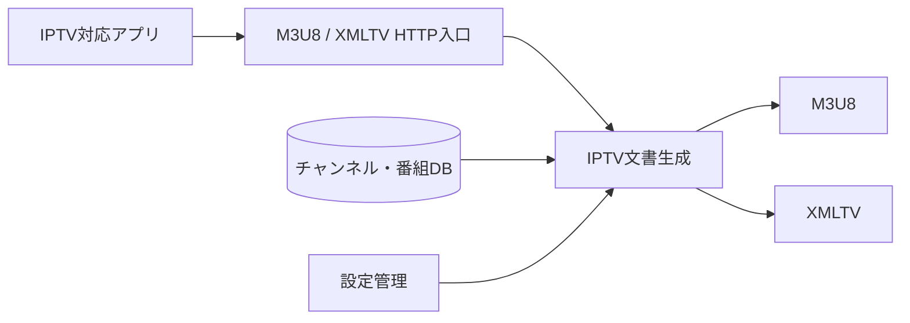
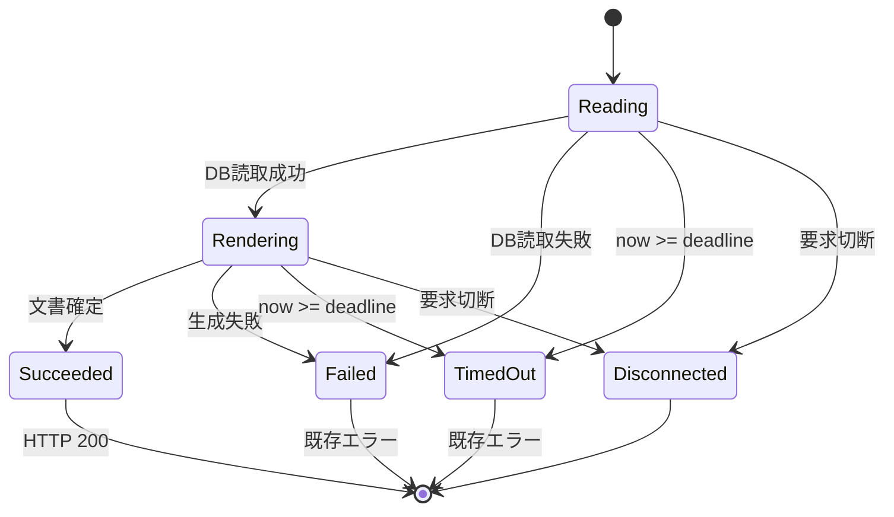
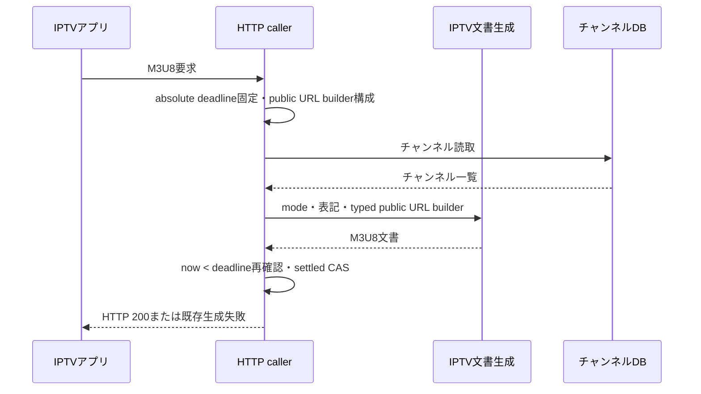
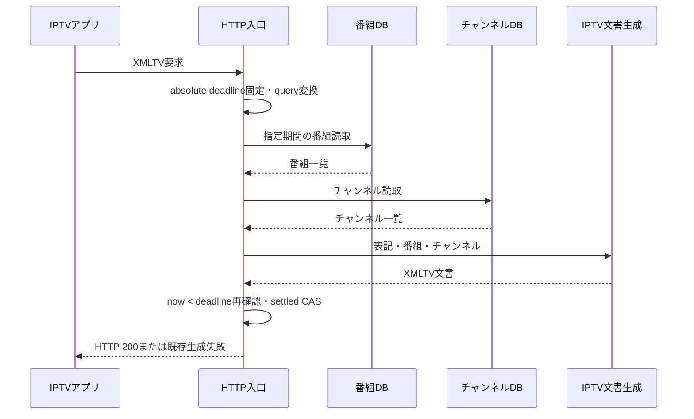

# IPTV向けチャンネル一覧・番組表出力機能 設計

## 1. 目的と境界

本機能は、保存済みのチャンネルと番組を読み取り、IPTV 対応アプリ向けに M3U8 チャンネル一覧と XMLTV 電子番組表を生成する。
通常表記と半角表記、出力期間、ライブ配信方法、チャンネル順、URL、文字置換、時刻表現を一要求ごとに決定する。

### 対象

-   M3U8 チャンネル一覧の生成
-   XMLTV 電子番組表の生成
-   出力日数、表記、ライブ配信方法の受付
-   対象チャンネル・番組の選択と並び順
-   ロゴ・ライブ視聴 URL、文字、時刻の表現
-   一 HTTP 要求全体に対する30秒の文書応答期限

### 対象外

-   チャンネル・番組情報の取得元からの収集と DB 保存
-   ロゴ画像そのものの配信
-   ライブ視聴の開始または成功確認
-   Host、通信方式、転送情報の信頼性判定
-   IPTV アプリ側の設定
-   複数要求をまたぐ実行数制御や結果共有

### 依存関係

| 依存先                       | 利用目的                                                               |
| ---------------------------- | ---------------------------------------------------------------------- |
| `server-persistence`         | 保存済みチャンネルと番組の要求単位の読み取り                           |
| `server-program-guide`       | チャンネル、番組、通常・半角表記の意味                                 |
| `server-configuration`       | チャンネル順とサービス識別子順                                         |
| `server-media-delivery`      | public URL providerが同期する安定したライブ視聴route contract          |
| `server-operational-logging` | 文書生成失敗の記録                                                     |
| `server-service-interface`   | downstream caller。HTTP carrierとpublic URL providerを本機能へ構造入力 |

`server-service-interface`は本機能を呼ぶ downstream であり、本機能からreverse importしない。本機能はdocument内のロゴ属性
とライブ視聴行の配置を所有する一方、URL文字列の組立てはcallerから渡されるtyped public-URL builderを使用する。providerは
要求のHost、scheme、設定済みsubDirectory、および安定routeからロゴURLとライブURLを構成する。HTTP status・header・Host抽
出・ trust policy、公開route、ライブ配信lifecycle、log sinkは各依存機能の責務を維持する。

### component、port、data ownership

| component / port          | 入力                                             | 出力                         | ownership と不変条件                                              |
| ------------------------- | ------------------------------------------------ | ---------------------------- | ----------------------------------------------------------------- |
| document request adapter  | query、public URL builder、接続状態              | 文書または既存生成失敗       | 要求ごとの deadline、timer、listener、完了 guard を一要求だけ所有 |
| M3U8 generator            | channel snapshot、mode、表記、public URL builder | immutable な M3U8 文字列     | URLの文書内配置を所有し、DB entity変更・stream開始を行わない      |
| XMLTV generator           | program/channel snapshot、生成時点、表記         | immutable な XMLTV 文字列    | DB entity を変更せず、要求ローカル projection だけを生成する      |
| channel/program read port | 設定順または期間条件                             | 要求専用 snapshot            | DB connection、query、retry、取消は `server-persistence` が所有   |
| public URL builder        | channel ID、mode                                 | logo URL、live M2TS URL      | callerがHost・scheme・subDirectory・安定routeから構成する         |
| response completion guard | success、failure、deadline、disconnect           | 最大一回の terminal decision | 後着 DB result/rejection を観測して応答と別要求への作用だけを遮断 |

typed structural inputは次の二つの能力だけを公開する。具体classや`server-service-interface`の型を本機能へimportしない。

```ts
type IptvPublicUrlBuilder = {
    channelLogoUrl(channelId: number): string;
    liveM2tsUrl(channelId: number, mode: number): string;
};
```

`src/model/service/api/iptv/channel.m3u8.ts`は要求ごとにHost、scheme、設定済みsubDirectoryから不変の
`IptvPublicUrlBuilder`を構成し、`getChannelList({ isHalfWidth, mode, publicUrls })`へ渡す。本機能はsubDirectoryを設定から
直接読み取らない。

共有 cache、要求数 queue、global semaphore、再試行 counter、IPTV 固有 ID、保存 schema、migration は追加しない。M3U8 と
XMLTV の channel ID は保存済み channel ID の projection であり、本機能固有の識別子を発行しない。



## 2. 出力条件

### 2.1 HTTP query

| 条件          | M3U8                     | XMLTV              | 省略時           |
| ------------- | ------------------------ | ------------------ | ---------------- |
| `mode`        | ライブ配信方法を表す整数 | 使用しない         | API 定義の既定値 |
| `days`        | 使用しない               | 取得日数を表す整数 | 3                |
| `isHalfWidth` | 表記選択                 | 表記選択           | `true`           |

`mode` と `days` は OpenAPI 上の整数値として扱う。Requirements 1.9と1.10に従い、HTTP queryが小数を含む数値として到達した
場合は`Math.floor`と同じ規則で、その数値以下の最大の整数へ変換してから使用する。例えば`3.9`は`3`、`-1.2`は`-2`となる。

本機能は `days` の最小値・最大値を追加検証せず、`mode` が実際に配信可能かも事前確認しない。

### 2.2 表記

-   `isHalfWidth = false`: チャンネル名と番組情報に通常表記を使用する。
-   `isHalfWidth = true`: チャンネル名と番組情報に半角表記を使用する。

## 3. M3U8 チャンネル一覧

### 3.1 対象サービス

チャンネルのサービス種別が次のいずれかである場合に出力する。

-   デジタルテレビ
-   デジタル音声
-   臨時映像
-   臨時音声
-   プロモーション映像
-   プロモーション音声
-   4K 専用テレビ

判定はチャンネル共通のメディアサービス判定を利用し、IPTV 出力だけの別一覧を持たない。

### 3.2 文書構造

文書先頭へ `#EXTM3U` を出力する。各対象チャンネルには次を出力する。

1. MPEG-2 TS を示す `#KODIPROP:mimetype=video/mp2t`
2. `#EXTINF` 内のチャンネル識別子、放送波区分、選択表記の表示名
3. ロゴがある場合だけロゴ参照
4. 指定された `mode` を含むライブ視聴参照

サービスが音声種別でも MPEG-2 TS の指定を変えない。対象が0件の場合は `#EXTM3U` 宣言だけを返し、エラーにはしない。

出力はUTF-8文字列とし、改行はLFだけを使用する。文書先頭と一件のチャンネルは、次の文字列をこの順に連結する。以下の `\n`は
一文字のLF、`{logo}`はロゴ参照属性または空文字、`　`はU+3000の全角空白一文字を表す。

```text
#EXTM3U\n
#KODIPROP:mimetype=video/mp2t\n
#EXTINF:-1 tvg-id="{channelId}" {logo} group-title="{channelType}",{displayName}　\n
{scheme}://{base}/api/streams/live/{channelId}/m2ts?mode={mode}\n
```

ロゴがない場合も、`tvg-id`の閉じ引用符と`group-title`の間にはASCII空白二文字が残る。ロゴがある場合はロゴ属性の前後に
ASCII空白を一文字ずつ置く。ロゴ属性は正確に `tvg-logo="{scheme}://{base}/api/channels/{channelId}/logo"`とする。表示名の
直後には、同名識別用の末尾ASCII空白とは別にU+3000を常に一文字置く。対象が0件の文書は正確に`#EXTM3U\n`であり、非空文書も
最後のライブ視聴参照の後にLFを一文字持つ。この属性順、空白、改行配置をserializerで正規化しない。

### 3.3 URL

callerが渡すtyped public-URL builderは、HTTP要求のHostとschemeを使用し、設定済みsubDirectoryがある場合はHostの後ろへ加え
る。同じbuilder instanceが一要求内のロゴ参照とライブ視聴参照を生成する。

-   ロゴ: `{scheme}://{base}/api/channels/{channelId}/logo`
-   ライブ視聴: `{scheme}://{base}/api/streams/live/{channelId}/m2ts?mode={mode}`

本機能は返されたURLを3.2の正確な位置へ置き、subDirectoryを設定から直接読まない。provider構成前にHostを取得できない場合は
既存の文書生成エラーとして返す。Host、scheme、転送ヘッダーのtrust policyはHTTP carrierに従い、本機能は再判定しない。URL
を文書へ配置してもライブ視聴を開始しない。

### 3.4 表示名の重複

選択表記で同じ表示名となるチャンネルが複数ある場合、最初の名前はそのまま使用し、後続の同名チャンネルには末尾空白を追加し
て区別する。同じ元表示名の出現順に末尾ASCII空白を無条件で0個、2個、3個、4個…とする。表示名直後のU+3000はこのsuffixとは別
に常に一文字置く。識別子は表示名とは別であり、重複名でも変更しない。

### 3.5 並び順

設定されたチャンネル順があればその順を優先して先頭へ置く。チャンネル順がなくサービス識別子順がある場合は、その指定順を先
頭へ置く。指定に含まれない残りはチャンネルの標準順で続ける。両方の指定がある場合はチャンネル順を採用する。

## 4. XMLTV 電子番組表

### 4.1 対象期間と番組

生成開始時刻を `now` とし、`now + days × 24時間` までを対象期間とする。GR、BS、CS、SKY、BS4K の番組を検索し、開始または
終了の端点に重なる番組も含める。

保存済み番組が0件の場合は、XML 宣言、文書型、生成元を備え、チャンネル要素と番組要素を持たない XMLTV 文書を返す。

### 4.2 文書構造

文書には次の順序で出力する。

1. XML 宣言
2. XMLTV の文書型
3. EPGStation を示す生成元を持つ `tv` 要素
4. 対象期間に番組を持つチャンネルごとの `channel` 要素
5. 各 `channel` の直後に、そのチャンネルの `programme` 要素

`channel` には、M3U8 と共通のチャンネル識別子、選択表記の表示名、サービス識別子を含める。`programme` には、対応するチャ
ンネル識別子、開始時刻、終了時刻、選択表記の番組名を含める。

通常説明がある場合は通常説明を出力する。詳細説明もある場合は、通常説明の最後のbyteと詳細説明の最初のbyteをseparatorなし
で直結した文字列を`desc`本文とする。通常説明がない場合は詳細説明を参照せず、`desc`自体を出力しない。

XMLTVもUTF-8文字列として、次の文字列を改行なしで連結して開始する。

```text
<?xml version="1.0" encoding="UTF-8"?><!DOCTYPE tv SYSTEM "xmltv.dtd"><tv generator-info-name="EPGStation">
```

一件のチャンネルは次の文字列であり、閉じ`channel`の直後だけにLFを一文字置く。

```text
<channel id="{channelId}" tp="{channel}"><display-name lang="ja_JP">{displayName}</display-name><service_id>{serviceId}</service_id></channel>\n
```

一件の番組は次の文字列を改行なしで連結する。説明がある場合の`{descriptionElement}`は、先頭にASCII空白四文字を持つ
`    <desc lang="ja_JP">{ordinaryDescription}{extendedText}</desc>`である。 `{ordinaryDescription}`と`{extendedText}`の
間は0 byteで、改行、空白、区切り文字を加えない。通常説明がnullの場合の `{descriptionElement}`は空文字であり、詳細説明も
無視する。

```text
<programme start="{start}" stop="{stop}" channel="{channelId}"><title lang="ja_JP">{title}</title>{descriptionElement}</programme>
```

全件の後へ`</tv>`を改行なしで加える。対象番組が0件の文書は正確に次の文字列とし、末尾改行を持たない。非空文書も
`programme`間へ改行を加えず、pretty printを行わない。

```text
<?xml version="1.0" encoding="UTF-8"?><!DOCTYPE tv SYSTEM "xmltv.dtd"><tv generator-info-name="EPGStation"></tv>
```

### 4.3 並び順

チャンネルは放送波、リモコン番号、サービス識別子による標準順とする。各チャンネル内の番組は開始時刻順とする。同じ開始時刻
を持つ番組には、追加の安定順序を定義しない。

M3U8 は設定順、XMLTV は標準順を使うため、共通チャンネルの相対順序が両文書で同じであることは保証しない。

### 4.4 文書間の識別

同じチャンネルには M3U8 と XMLTV で同じチャンネル ID を使用する。XMLTV の番組もこの ID でチャンネルへ関連付ける。表示名
や末尾空白を識別子の代わりに使わない。

## 5. 文字と時刻

### 5.1 XMLTV の番組文字列

番組名、通常説明、詳細説明にだけ次の変換を適用する。

| 入力                  | 出力 |
| --------------------- | ---- |
| `<`                   | `＜` |
| `>`                   | `＞` |
| `&`                   | `＆` |
| `"`                   | `”`  |
| `'`                   | `’`  |
| SUB 制御文字 (`0x1A`) | 除去 |

チャンネル名、チャンネル識別子、その他の属性値、M3U8 項目へ、この番組文字列変換を一律には適用しない。

### 5.2 XMLTV の時刻

番組の開始・終了時刻を正確に`yyyyMMddhhmmss ±HHMM`へ変換する。年月日時分秒とUTC時差の間はASCII空白一文字である。年月日時
分秒はその時点のサーバー現地時刻、UTC時差は本機能のモジュールを読み込んだ時点のサーバー時刻帯から一度だけ求める。稼働中
の時刻帯変更や夏時間切替では更新しない。

## 6. 要求処理、期限、失敗

### 6.1 要求単位の処理

M3U8 と XMLTV の各 HTTP 要求は、それぞれ必要な DB 情報を新しく読み取る。一要求の読み取り結果、生成文字列、失敗、期限状態
を別要求へ共有しない。

DB読み取りと文書生成が成功し、成功確定時のmonotonic clockが絶対期限より小さい場合だけ、文書をHTTP 200で返す。

-   M3U8: `application/x-mpegURL; charset="UTF-8"`
-   XMLTV: `application/xml; charset="UTF-8"`

DB または生成処理が明示的に失敗した場合は、既存の文書生成エラー応答を返す。文書全体を自動再生成しない。

### 6.2 30秒の文書応答期限

HTTP handler開始時のmonotonic clockへ30,000msを加え、一要求のabsolute deadlineを一回固定する。同じresponse fenceがquery
変換、public URL provider構成、persistence read Promise、文書生成、応答確定を囲む。保存済み情報へ有限読取時間を適用する
とは、このhandler fenceがDB読取Promiseを待てる時間を有限にすることである。

このfenceは基礎DB connectionやqueryをcancel、timeout、retryせず、persistenceの接続lifecycleと内部失敗契約を変更しない。
期限までに必要情報を読めない、または文書を確定できない場合は、その要求だけを既存の文書生成エラー応答として終了する。late
DB resolve/rejectは観測してresponseへの採用を抑止し、別要求へ適用しない。

成功条件は厳密に`now < deadline`である。`now >= deadline`は既存の文書生成エラーとする。これはライブ視聴streamや録画
streamの継続時間を制限するものではない。本機能が生成するのは参照URLを含む文書であり、stream自体を開かない。

### 6.3 遅延結果と切断

各 handler は要求ローカルの完了済み状態と timer だけを持つ。

-   正常応答、エラー応答、期限到達、要求切断の候補を要求ローカルのsettled CASへ集約し、先着一件だけが要求を完了させる。
-   成功候補はHTTP 200確定直前にmonotonic clockを再確認し、`now < deadline`の場合だけCASを試みる。`now >= deadline`では
    deadline失敗としてCASを試みる。
-   timer callbackとDB settlementが同じtickに並んでも、settled CASと上記monotonic再確認を共に通すため、期限と等しい時刻
    の成功候補は採用されない。同期的な文書生成がevent loopを長時間占有してtimer callbackより先に戻った場合も同じである。
-   期限到達後または要求切断後に DB 読み取りや生成が完了しても応答を送らない。
-   遅延結果を別要求へ適用しない。
-   DB connection/queryをcancelまたはtimeoutせず、遅延完了を観測して応答への採用だけを抑止する。

完了状態と timer は要求ごとに破棄し、別要求へ持ち越さない。サーバー再起動で処理中の HTTP 要求は通常の接続切断として終わ
り、再開しない。



## 7. 処理シーケンス

### 7.1 M3U8



### 7.2 XMLTV



## 8. 実装上の制約

-   `days`と`mode`の小数処理はRequirements 1.9と1.10に従い、10進文字列を途中で打ち切る`parseInt`ではなく、数値化後の
    `Math.floor`相当で行う。handlerはcoerce済みの値を再変換せず渡し、`1e21`以上の値も変えない。
-   DB entity を文書用文字列へ変換する際、保存済み entity 自体を書き換えず要求ローカルの出力値を作る。
-   M3U8 generatorはtyped public-URL builderだけを受け、subDirectoryやHTTP requestを直接参照しない。
-   30秒制御は handler ごとの timer と一度だけ完了するローカル状態で実装し、別要求と状態を共有しない。
-   timer callbackだけに期限判定を委ねず、成功応答の確定直前に同じabsolute deadlineを再確認する。成功条件は
    `now < deadline`だけで、同値を含む`now >= deadline`はsettled CASでdeadline失敗へ確定する。
-   timeout 後に Promise が完了しても rejection を未処理にせず、応答だけを抑止する。
-   M3U8 と XMLTV の識別子生成規則を別々に実装しない。

## 9. 機能固有テスト設計

### 9.1 配置計画と証拠分離

次の path の test file と named case は実在する。固定 command は `server-application-runtime` が提供するものを使う。test
file の実在を、test 成功や coverage 達成の証拠へ読み替えない。

| file                                             | 所有する証拠                                                                                    |
| ------------------------------------------------ | ----------------------------------------------------------------------------------------------- |
| `query.spec.test.ts`                             | 出力条件10 ACの外部契約を一 AC 一 caseで検証                                                    |
| `m3u8.spec.test.ts`                              | M3U8 15 ACの exact UTF-8 byte、対象、URL、順序、非配信を一 AC 一 caseで検証                     |
| `xmltv.spec.test.ts`                             | XMLTV 15 ACの exact UTF-8 byte、期間、内容、順序、空文書を一 AC 一 caseで検証                   |
| `identity.spec.test.ts`                          | 文書間対応6 ACを一 AC 一 caseで検証                                                             |
| `representation.spec.test.ts`                    | 文字・時刻6 ACを一 AC 一 caseで検証                                                             |
| `request-lifecycle.spec.test.ts`                 | URL・読取・失敗・deadline 11 ACを一 AC 一 caseで検証                                            |
| `query.test.ts`、`serializers.test.ts`           | 省略、正負の小数 floor、対象集合、空、文字、byte serializerの具体的内部分岐                     |
| `ordering.test.ts`、`request-completion.test.ts` | 設定順、同名・同時刻、状態、deadline比較、late settlement、timer/listener解放の具体的内部分岐   |
| `iptv-db-http.integration.test.ts`               | SQLite／MySQL共通repository fixtureと実HTTP adapterのquery、Host、status、header、exact文書byte |

Requirements 1から6の外部契約は、上表の6個の`*.spec.test.ts`に63個の named caseとして一意に置く。R7の5項目は機能behavior
caseへ混ぜない。仕様test、具体的imp結果、具体的DB/HTTP integrationを別々のtestから得るため、一つのtestが自分の成功を
別名で再判定する循環 gateを作らない。

### 9.2 test層、状態、資源、外部境界

-   `unittest/spec`: R1からR6の63 ACを、queryからHTTP結果とexact document byteまで一 AC 一主caseで検証する。UTF-8、ASCII
    空白、U+3000、LFの有無と順序、末尾byte、channel/program順、logo属性、descriptionの0-byte連結、時刻、URL
    scheme/Host/subDirectoryを部分一致でなく文書全体のbyte比較で固定する。
-   `unittest/imp`: `query.test.ts`等4 fileの具体的結果を使う。`null`、空、0、1、正負の小数、対象・対象外、重複、期間端
    点、説明欠損、文字変換、期限直前・到達・超過、同着、late resolve/reject、二重完了を検証する。不正型の一般validation
    や上限値はHTTP carrier契約の範囲とし、castによる追加validationを作らない。
-   `integration`: SQLiteとMySQLの共通DB contract fixtureをHTTP adapterへ接続し、query、Host、通信方式、status、
    Content-Type、exact byte、DB失敗、disconnect、deadline後の結果を検証する。DB transaction・connection lifecycleは
    persistence ownerのharnessを使い、本機能はconnectionを保持しない。
-   状態は読取前、読取中、生成中、応答済み、失敗、切断、deadline、restart後の新要求を分類する。正常、DB/生成失敗、
    deadline、disconnectの先着一件だけをterminalにし、後着結果から二重応答、別要求更新、unhandled rejectionを生じさせな
    い。
-   資源は要求ローカルtimer、disconnect listener、DB read Promiseのsettlement観測、response guardである。完了時にtimerと
    listenerを一回解放する。DB connection/transactionはpersistence portのlifecycleに残し、文書生成はstream、file、lock、
    child processを取得しない。

| 境界          | 分類   | 理由・検証                                                                                  |
| ------------- | ------ | ------------------------------------------------------------------------------------------- |
| DB            | 適用   | channel/program読取の成功・0件・失敗・pending・late settlementをSQLite/MySQL contractで検証 |
| HTTP          | 適用   | query、Host、scheme、disconnect、status、Content-Type、exact body byteを接続                |
| IPC           | 非適用 | 本機能固有message、serialization、再接続contractがなくprocess内typed portだけを使う         |
| filesystem    | 非適用 | 文書はmemory上の文字列でありfileをopen、write、rename、deleteしない                         |
| child process | 非適用 | 文書生成でprocessをspawn、signal、waitせず、ライブ配信開始も行わない                        |

restart時に進行中要求を復元せず接続切断として終える。次の新要求は新しいguardとDB読取で開始する。文書応答の30秒期限だけを
検証し、確立済みmedia streamへtimerを接続しない。

### 9.3 品質判定

本機能の完了は、6個の`*.spec.test.ts`、imp test、DB/HTTP integrationの全件成功と、
`server-application-runtime` Requirement 9 Acceptance Criterion 9（server全体の単体testだけで`src/**`のC0・C1が100%）で
判定する。本機能のintegration成功はC0・C1を代替しない。

### 9.4 機能固有Test Matrix

本表を本機能唯一のTest Matrixとする。全68 ACを一行ずつ非衝突ID`IPTV-N.M`へ割り当てる。`S`は仕様test、`I`は実装
test、`G`はDB/HTTP integration、`M`は本表そのもの、`Q`は品質判定である。入力の`N`は呼出値がなく非適用、`C`はHTTP
carrier、`T`はfixture値、`B`は境界、`D`は重複である。`証跡`の「実在」は主testが実在することを表す。成否とcoverageは含まず、空欄をPASSへ読み替えない。

| Test ID   | 主test・証拠                                  | 種別  | 入力   | 状態                        | 時間・race               | 資源                       | 境界          | failure                   | 期待結果・assertion                                                | 証跡 |
| --------- | --------------------------------------------- | ----- | ------ | --------------------------- | ------------------------ | -------------------------- | ------------- | ------------------------- | ------------------------------------------------------------------ | ---- |
| IPTV-1.1  | `query.spec.test.ts#IPTV-1.1`                 | S/G   | C/T    | 読取前                      | なし                     | query                      | HTTP          | carrier拒否               | mode整数をgeneratorへ渡す                                          | 実在 |
| IPTV-1.2  | `query.spec.test.ts#IPTV-1.2`                 | S/G   | C/T    | 読取前                      | なし                     | query                      | HTTP          | carrier拒否               | days整数をgeneratorへ渡す                                          | 実在 |
| IPTV-1.3  | `query.spec.test.ts#IPTV-1.3`                 | S/I   | 空     | 読取前                      | なし                     | query                      | HTTP          | なし                      | days省略時3                                                        | 実在 |
| IPTV-1.4  | `query.spec.test.ts#IPTV-1.4`                 | S/I   | 空     | 読取前                      | なし                     | query                      | HTTP          | なし                      | isHalfWidth省略時true                                              | 実在 |
| IPTV-1.5  | `query.spec.test.ts#IPTV-1.5`                 | S/I   | T      | 生成中                      | 順序                     | projection                 | HTTP/DB       | 読取失敗                  | 通常fieldだけをexact byteへ出す                                    | 実在 |
| IPTV-1.6  | `query.spec.test.ts#IPTV-1.6`                 | S/I   | T      | 生成中                      | 順序                     | projection                 | HTTP/DB       | 読取失敗                  | 半角fieldだけをexact byteへ出す                                    | 実在 |
| IPTV-1.7  | `query.spec.test.ts#IPTV-1.7`                 | S/I   | 0/B    | 読取前                      | なし                     | query                      | HTTP          | DB/生成結果に従う         | days範囲を追加拒否しない                                           | 実在 |
| IPTV-1.8  | `query.spec.test.ts#IPTV-1.8`                 | S/I   | 0/B    | 読取前                      | なし                     | query                      | HTTP          | 視聴開始は非適用          | mode可用性照会0回                                                  | 実在 |
| IPTV-1.9  | `query.spec.test.ts#IPTV-1.9`                 | S/I/G | B      | 読取前                      | なし                     | query                      | HTTP          | 数値carrier失敗           | 正負小数をfloorした期間                                            | 実在 |
| IPTV-1.10 | `query.spec.test.ts#IPTV-1.10`                | S/I/G | B      | 読取前                      | なし                     | query                      | HTTP          | 数値carrier失敗           | 正負小数をfloorしたmode byte                                       | 実在 |
| IPTV-2.1  | `m3u8.spec.test.ts#IPTV-2.1`                  | S/I/G | 空/T   | 生成中/応答済み             | 順序                     | document                   | HTTP          | 生成失敗                  | `#EXTM3U\n`先頭byte                                                | 実在 |
| IPTV-2.2  | `m3u8.spec.test.ts#IPTV-2.2`                  | S/I/G | T/B    | 読取中/生成中               | 順序                     | DB snapshot                | DB/HTTP       | DB失敗                    | 対象7種だけを含む                                                  | 実在 |
| IPTV-2.3  | `m3u8.spec.test.ts#IPTV-2.3`                  | S/G   | T      | 生成中                      | 順序                     | document                   | DB/HTTP       | 生成失敗                  | channel ID exact byte                                              | 実在 |
| IPTV-2.4  | `m3u8.spec.test.ts#IPTV-2.4`                  | S/G   | T/D    | 生成中                      | 順序                     | projection                 | DB/HTTP       | 生成失敗                  | 選択表示名とsuffix exact byte                                      | 実在 |
| IPTV-2.5  | `m3u8.spec.test.ts#IPTV-2.5`                  | S/G   | T      | 生成中                      | 順序                     | document                   | DB/HTTP       | 生成失敗                  | group-titleの放送波byte                                            | 実在 |
| IPTV-2.6  | `m3u8.spec.test.ts#IPTV-2.6`                  | S/I   | T      | 生成中                      | 順序                     | document                   | HTTP          | 生成失敗                  | 全対象でvideo/mp2t                                                 | 実在 |
| IPTV-2.7  | `m3u8.spec.test.ts#IPTV-2.7`                  | S/G   | T      | 生成中                      | 順序                     | document                   | DB/HTTP       | DB/生成失敗               | exact `tvg-logo="{scheme}://{base}/api/channels/{channelId}/logo"` | 実在 |
| IPTV-2.8  | `m3u8.spec.test.ts#IPTV-2.8`                  | S/G   | 空/T   | 生成中                      | 順序                     | document                   | DB/HTTP       | DB/生成失敗               | logoなしのASCII空白二文字                                          | 実在 |
| IPTV-2.9  | `m3u8.spec.test.ts#IPTV-2.9`                  | S/G   | T/B    | 生成中                      | 順序                     | document                   | HTTP          | 生成失敗                  | mode付きlive URL exact byte                                        | 実在 |
| IPTV-2.10 | `m3u8.spec.test.ts#IPTV-2.10`                 | S/G   | 空/T   | provider構成/生成中         | 順序                     | public URL builder         | HTTP          | provider/生成失敗         | logo/live双方へ同じbase/subDirectory                               | 実在 |
| IPTV-2.11 | `m3u8.spec.test.ts#IPTV-2.11`                 | S/I/G | D      | 生成中                      | 出現順                   | counter/document           | DB/HTTP       | 生成失敗                  | suffix 0,2,3,4…空白とU+3000                                        | 実在 |
| IPTV-2.12 | `m3u8.spec.test.ts#IPTV-2.12`、`ordering.test.ts`、`iptv-db-http.integration.test.ts` | S/I/G | D/T    | 読取中/生成中               | 設定順                   | DB snapshot                | DB/HTTP       | DB/設定失敗               | 指定prefix後に標準順                                               | 実在 |
| IPTV-2.13 | `m3u8.spec.test.ts#IPTV-2.13`                 | S/I   | D/T    | 読取中                      | 設定順                   | DB snapshot                | DB            | DB/設定失敗               | channel順がservice ID順より優先                                    | 実在 |
| IPTV-2.14 | `m3u8.spec.test.ts#IPTV-2.14`                 | S/I/G | 0      | 成功/応答済み               | なし                     | document                   | DB/HTTP       | DB失敗                    | exact `#EXTM3U\n`                                                  | 実在 |
| IPTV-2.15 | `m3u8.spec.test.ts#IPTV-2.15`                 | S/G   | T      | 生成中/応答済み             | なし                     | streamなし                 | HTTP          | 文書失敗                  | media delivery開始呼出し0回                                        | 実在 |
| IPTV-3.1  | `xmltv.spec.test.ts#IPTV-3.1`                 | S/I/G | 0/T    | 生成中/応答済み             | 順序                     | document                   | HTTP          | 生成失敗                  | XML宣言・DOCTYPE・生成元exact byte                                 | 実在 |
| IPTV-3.2  | `xmltv.spec.test.ts#IPTV-3.2`                 | S/I/G | T/B    | 読取中                      | 順序                     | DB snapshot                | DB            | DB失敗                    | GR/BS/CS/SKY/BS4K                                                  | 実在 |
| IPTV-3.3  | `xmltv.spec.test.ts#IPTV-3.3`                 | S/I/G | 0/1/B  | 読取前/読取中               | 固定now                  | clock/query                | DB            | DB失敗                    | nowからdays×24時間                                                 | 実在 |
| IPTV-3.4  | `xmltv.spec.test.ts#IPTV-3.4`                 | S/I/G | B      | 読取中                      | 開始/終了端点            | DB snapshot                | DB            | DB失敗                    | 期間の端点を取得元へそのまま渡し、両端に接する番組を出力する（取得元の条件の端点含みは`ordering.test.ts`・integrationが固定） | 実在 |
| IPTV-3.5  | `xmltv.spec.test.ts#IPTV-3.5`                 | S/G   | T      | 生成中                      | channel先行              | document                   | DB/HTTP       | 生成失敗                  | channel ID/name/service ID exact byte                              | 実在 |
| IPTV-3.6  | `xmltv.spec.test.ts#IPTV-3.6`                 | S/G   | T      | 生成中                      | channel先行              | document                   | DB/HTTP       | 生成失敗                  | programme channel ID exact byte                                    | 実在 |
| IPTV-3.7  | `xmltv.spec.test.ts#IPTV-3.7`                 | S/I/G | B/T    | 生成中                      | 時刻順                   | document/clock             | HTTP          | 生成失敗                  | start/stop exact属性byte                                           | 実在 |
| IPTV-3.8  | `xmltv.spec.test.ts#IPTV-3.8`                 | S/G   | T      | 生成中                      | 順序                     | projection                 | DB/HTTP       | 生成失敗                  | 選択表記title exact byte                                           | 実在 |
| IPTV-3.9  | `xmltv.spec.test.ts#IPTV-3.9`                 | S/G   | T      | 生成中                      | title後                  | projection                 | DB/HTTP       | 生成失敗                  | 通常説明をdescへ出す                                               | 実在 |
| IPTV-3.10 | `xmltv.spec.test.ts#IPTV-3.10`                | S/I/G | T      | 生成中                      | 通常説明後               | projection                 | DB/HTTP       | 生成失敗                  | 通常+詳細を0-byte連結しdesc前4空白                                 | 実在 |
| IPTV-3.11 | `xmltv.spec.test.ts#IPTV-3.11`                | S/I/G | 空/T   | 生成中                      | 順序                     | projection                 | DB/HTTP       | 生成失敗                  | 通常説明nullなら詳細単独を出さない                                 | 実在 |
| IPTV-3.12 | `xmltv.spec.test.ts#IPTV-3.12`                | S/I/G | D/T    | 読取中/生成中               | 標準順                   | DB snapshot                | DB/HTTP       | DB失敗                    | wave/remote/service順                                              | 実在 |
| IPTV-3.13 | `xmltv.spec.test.ts#IPTV-3.13`                | S/I/G | D/T    | 読取中/生成中               | start順                  | DB snapshot                | DB/HTTP       | DB失敗                    | channel内programme開始順                                           | 実在 |
| IPTV-3.14 | `xmltv.spec.test.ts#IPTV-3.14`                | S/I/G | D      | 読取中/生成中               | 同時刻                   | DB snapshot                | DB/HTTP       | DB失敗                    | 追加二次sortを呼ばない                                             | 実在 |
| IPTV-3.15 | `xmltv.spec.test.ts#IPTV-3.15`                | S/I/G | 0      | 成功/応答済み               | なし                     | document                   | DB/HTTP       | DB失敗                    | exact空XMLTV、末尾改行なし                                         | 実在 |
| IPTV-4.1  | `identity.spec.test.ts#IPTV-4.1`              | S/G   | T      | 二文書生成                  | 文書横断                 | snapshots                  | DB/HTTP       | 一方の生成失敗            | 同じ保存IDのbyte一致                                               | 実在 |
| IPTV-4.2  | `identity.spec.test.ts#IPTV-4.2`              | S/G   | T      | XML生成中                   | channel先行              | document                   | DB/HTTP       | 生成失敗                  | programme IDがchannel IDへ一致                                     | 実在 |
| IPTV-4.3  | `identity.spec.test.ts#IPTV-4.3`              | S/I   | D/T    | 二文書生成                  | 文書横断                 | projection                 | DB            | 生成失敗                  | 表示名変更でもID不変                                               | 実在 |
| IPTV-4.4  | `identity.spec.test.ts#IPTV-4.4`              | S/I/G | D/T    | 二文書生成                  | 設定順/標準順            | DB snapshots               | DB/HTTP       | DB失敗                    | M3U設定順、XML標準順                                               | 実在 |
| IPTV-4.5  | `identity.spec.test.ts#IPTV-4.5`              | S/G   | D/T    | 二文書生成                  | 相対順差                 | documents                  | DB/HTTP       | 一方の生成失敗            | 共通IDでも相対順一致をassertしない                                 | 実在 |
| IPTV-4.6  | `identity.spec.test.ts#IPTV-4.6`              | S/I/G | T      | XML生成中                   | channel→programme        | document                   | HTTP          | 生成失敗                  | 各channelが対応programmeより前                                     | 実在 |
| IPTV-5.1  | `representation.spec.test.ts#IPTV-5.1`        | S/I/G | T      | XML生成中                   | 置換順                   | projection/document        | DB/HTTP       | 生成失敗                  | 五記号の全角類似byte                                               | 実在 |
| IPTV-5.2  | `representation.spec.test.ts#IPTV-5.2`        | S/I/G | T      | XML生成中                   | 置換順                   | projection/document        | DB/HTTP       | 生成失敗                  | SUB byte 0件                                                       | 実在 |
| IPTV-5.3  | `representation.spec.test.ts#IPTV-5.3`        | S/I/G | T      | 二文書生成                  | 順序                     | documents                  | DB/HTTP       | 生成失敗                  | 非対象fieldへ一律置換しない                                        | 実在 |
| IPTV-5.4  | `representation.spec.test.ts#IPTV-5.4`        | S/I/G | B/T    | XML生成中                   | 現地時刻                 | clock/document             | HTTP          | 生成失敗                  | exact `yyyyMMddhhmmss ±HHMM`                                       | 実在 |
| IPTV-5.5  | `representation.spec.test.ts#IPTV-5.5`        | S/I   | T      | module読込/生成             | 読込時固定               | module clock               | process非適用 | 生成失敗                  | 1 ASCII空白+module-load offset exact byte                          | 実在 |
| IPTV-5.6  | `representation.spec.test.ts#IPTV-5.6`        | S/I   | T      | 稼働中生成                  | timezone/DST変化後       | module clock               | process非適用 | 生成失敗                  | 既決offsetを更新しない                                             | 実在 |
| IPTV-6.1  | `request-lifecycle.spec.test.ts#IPTV-6.1`     | S/G   | C/T    | provider構成/生成中         | 順序                     | public URL builder         | HTTP          | Host/provider/生成失敗    | caller carrierのHost/scheme exact URL                              | 実在 |
| IPTV-6.2  | `request-lifecycle.spec.test.ts#IPTV-6.2`     | S/G   | 空/T   | provider構成/生成中         | 順序                     | public URL builder         | HTTP          | provider/生成失敗         | providerがHost後へsubDirectory                                     | 実在 |
| IPTV-6.3  | `request-lifecycle.spec.test.ts#IPTV-6.3`     | S/G   | null   | 読取前/失敗                 | 先着                     | guard                      | HTTP          | Hostなし                  | DB読取前に既存生成失敗                                             | 実在 |
| IPTV-6.4  | `request-lifecycle.spec.test.ts#IPTV-6.4`     | S/G   | C/T    | provider構成前              | なし                     | HTTP carrier               | HTTP          | trust policyは非所有      | carrierが選んだHost/schemeをbuilderへ固定                          | 実在 |
| IPTV-6.5  | `request-lifecycle.spec.test.ts#IPTV-6.5`     | S/I/G | D/T    | 読取中/同時要求             | race/順序                | DB Promise/guard           | DB/HTTP       | DB失敗                    | 要求ごとに読取・結果非共有                                         | 実在 |
| IPTV-6.6  | `request-lifecycle.spec.test.ts#IPTV-6.6`     | S/G   | T      | 読取中/失敗                 | reject先着               | DB Promise/guard           | DB/HTTP       | channel読取失敗           | M3U全体を既存失敗、部分byteなし                                    | 実在 |
| IPTV-6.7  | `request-lifecycle.spec.test.ts#IPTV-6.7`     | S/G   | T      | 読取中/失敗                 | 各reject順               | DB Promises/guard          | DB/HTTP       | channel/program読取失敗   | XML全体を既存失敗、部分byteなし                                    | 実在 |
| IPTV-6.8  | `request-lifecycle.spec.test.ts#IPTV-6.8`     | S/I/G | T      | 生成中/失敗                 | reject先着               | guard                      | HTTP          | DB/生成失敗               | 文書自動再生成0回                                                  | 実在 |
| IPTV-6.9  | `request-lifecycle.spec.test.ts#IPTV-6.9`     | S/I/G | B      | 読取/生成/応答確定          | 直前/同値/超過/same tick | timer/listener/CAS         | DB/HTTP       | now >= deadline           | `now < deadline`だけ成功、等値は既存失敗                           | 実在 |
| IPTV-6.10 | `request-lifecycle.spec.test.ts#IPTV-6.10`    | S/I/G | B      | DB Promise pending/期限失敗 | pending→deadline         | DB Promise/timer/CAS       | DB/HTTP       | DB pending                | responseだけ既存失敗、DB cancel/timeout/retry 0回                  | 実在 |
| IPTV-6.11 | `request-lifecycle.spec.test.ts#IPTV-6.11`    | S/I/G | D/T    | 期限/切断/応答済み          | late resolve/reject/同着 | timer/listener/DB observer | DB/HTTP       | disconnect/late rejection | late結果観測、応答最大1、別要求作用0、unhandled/残留0              | 実在 |
| IPTV-7.1  | `*.spec.test.ts`の63 named case#IPTV-7.1      | S     | N      | 全AC                        | 非適用                   | spec file                  | 非適用        | 欠落/重複                 | 63 ACと63 spec caseの一意対応                                      | 実在 |
| IPTV-7.2  | `query.test.tsほか3fileの具体的結果#IPTV-7.2` | I     | 全分類 | 全内部状態                  | 境界/race                | projection/timer/listener  | DB/HTTP補助   | 分岐未到達                | 省略・floor・0・対象・端点・文字・失敗分岐の実結果                 | 実在 |
| IPTV-7.3  | 本表（9.4）#IPTV-7.3                          | M     | N      | 全AC                        | 非適用                   | design matrix              | 非適用        | 欠落/重複/空欄            | 68 IDと必須分類が揃う                                              | 実在 |
| IPTV-7.4  | `iptv-db-http.integration.test.ts#IPTV-7.4`   | G     | C/T/B  | provider/読取/応答          | deadline/late/race       | DB connection/response     | DB/HTTP       | DB/HTTP/切断              | caller builder同期とDB/HTTP/exact byte接続                         | 実在 |
| IPTV-7.5  | 機能固有suiteとRuntime R9 AC9#IPTV-7.5        | Q     | N      | 品質判定                    | 非適用                   | suite/coverage             | Runtime       | 未実行/失敗/未解決        | feature全件成功かつserver全体のC0・C1成立まで未完了               | 実在（成否・coverageはR9 AC9の判定） |

## 10. Formal Requirements Traceability

次の68行だけを本機能のnumeric formal traceとする。`R`名前空間はRequirements、`IPTV`名前空間は9.4のTest Matrixであり衝突
しない。

| Trace | 設計・主検証            |
| ----- | ----------------------- |
| R1.1  | 2.1、IPTV-1.1           |
| R1.2  | 2.1、IPTV-1.2           |
| R1.3  | 2.1、IPTV-1.3           |
| R1.4  | 2.1、IPTV-1.4           |
| R1.5  | 2.2、IPTV-1.5           |
| R1.6  | 2.2、IPTV-1.6           |
| R1.7  | 2.1、IPTV-1.7           |
| R1.8  | 2.1、IPTV-1.8           |
| R1.9  | 2.1・8、IPTV-1.9        |
| R1.10 | 2.1・8、IPTV-1.10       |
| R2.1  | 3.2、IPTV-2.1           |
| R2.2  | 3.1、IPTV-2.2           |
| R2.3  | 3.2、IPTV-2.3           |
| R2.4  | 3.2、IPTV-2.4           |
| R2.5  | 3.2、IPTV-2.5           |
| R2.6  | 3.2、IPTV-2.6           |
| R2.7  | 3.2・3.3、IPTV-2.7      |
| R2.8  | 3.2・3.3、IPTV-2.8      |
| R2.9  | 3.2・3.3、IPTV-2.9      |
| R2.10 | 3.3、IPTV-2.10          |
| R2.11 | 3.4、IPTV-2.11          |
| R2.12 | 3.5、IPTV-2.12          |
| R2.13 | 3.5、IPTV-2.13          |
| R2.14 | 3.2、IPTV-2.14          |
| R2.15 | 3.3、IPTV-2.15          |
| R3.1  | 4.2、IPTV-3.1           |
| R3.2  | 4.1、IPTV-3.2           |
| R3.3  | 4.1、IPTV-3.3           |
| R3.4  | 4.1、IPTV-3.4           |
| R3.5  | 4.2、IPTV-3.5           |
| R3.6  | 4.2、IPTV-3.6           |
| R3.7  | 4.2、IPTV-3.7           |
| R3.8  | 4.2、IPTV-3.8           |
| R3.9  | 4.2、IPTV-3.9           |
| R3.10 | 4.2、IPTV-3.10          |
| R3.11 | 4.2、IPTV-3.11          |
| R3.12 | 4.3、IPTV-3.12          |
| R3.13 | 4.3、IPTV-3.13          |
| R3.14 | 4.3、IPTV-3.14          |
| R3.15 | 4.1・4.2、IPTV-3.15     |
| R4.1  | 4.4、IPTV-4.1           |
| R4.2  | 4.4、IPTV-4.2           |
| R4.3  | 4.4、IPTV-4.3           |
| R4.4  | 3.5・4.3、IPTV-4.4      |
| R4.5  | 4.3、IPTV-4.5           |
| R4.6  | 4.2、IPTV-4.6           |
| R5.1  | 5.1、IPTV-5.1           |
| R5.2  | 5.1、IPTV-5.2           |
| R5.3  | 5.1、IPTV-5.3           |
| R5.4  | 5.2、IPTV-5.4           |
| R5.5  | 5.2、IPTV-5.5           |
| R5.6  | 5.2、IPTV-5.6           |
| R6.1  | 3.3、IPTV-6.1           |
| R6.2  | 3.3、IPTV-6.2           |
| R6.3  | 3.3・6.1、IPTV-6.3      |
| R6.4  | 3.3、IPTV-6.4           |
| R6.5  | 6.1・6.3、IPTV-6.5      |
| R6.6  | 6.1、IPTV-6.6           |
| R6.7  | 6.1、IPTV-6.7           |
| R6.8  | 6.1、IPTV-6.8           |
| R6.9  | 6.2・6.3、IPTV-6.9      |
| R6.10 | 6.2・6.3、IPTV-6.10     |
| R6.11 | 6.3、IPTV-6.11          |
| R7.1  | 9.1・9.4、IPTV-7.1      |
| R7.2  | 9.1・9.2・9.3、IPTV-7.2 |
| R7.3  | 9.2・9.4、IPTV-7.3      |
| R7.4  | 9.1・9.2・9.4、IPTV-7.4 |
| R7.5  | 9.3・9.4、IPTV-7.5      |

## 11. 確認済みsource、依存責務

### 11.1 確認済みsource

| 状態      | locator                                                  | 確認済み事実                                                                                                                                                                                |
| --------- | -------------------------------------------------------- | ------------------------------------------------------------------------------------------------------------------------------------------------------------------------------------------- |
| CONFIRMED | `src/model/api/iptv/IPTVApiModel.ts`                     | exact M3U8/XMLTV連結（3・4・5節のfull-byte出力）、対象選択、設定順/標準順、文字置換、固定offset、要求ローカルの`ProgramProjection`（番組entityを書き換えない）、typed `IptvPublicUrlBuilder`を受ける`getChannelList({ isHalfWidth, mode, publicUrls })` |
| CONFIRMED | `src/model/service/api/iptv/channel.m3u8.ts`             | Host、scheme、設定済みsubDirectoryから要求ごとにfrozenな`IptvPublicUrlBuilder`を構成、Content-Type、HTTP 200、既存error carrier、`IptvDocumentRequestGuard`による30秒期限。queryのfloorはOpenAPIのcoercerが適用し、handlerはcoerce済みの値を再変換せずそのままproviderへ渡す |
| CONFIRMED | `src/model/service/api/iptv/epg.xml.ts`                  | XML Content-Type、HTTP 200、既存error carrier、`IptvDocumentRequestGuard`による30秒期限。queryのfloorはOpenAPIのcoercerが適用し、handlerはcoerce済みの値を再変換せずそのままproviderへ渡す |
| CONFIRMED | `src/model/api/iptv/IptvDocumentRequestGuard.ts` | 30秒absolute deadline（`now < deadline`）、先着一件のsettled、timerとlistenerの解放、切断、late結果の観測                                                                                     |
| CONFIRMED | `src/util/ChannelUtil.ts`                                | 共通media service判定                                                                                                                                                                      |
| CONFIRMED | `src/model/db/ChannelDB.ts`                              | M3U8設定順とXMLTV標準順の読取入口                                                                                                                                                           |
| CONFIRMED | `src/model/db/ProgramDB.ts`                              | 期間重なりと開始時刻順の読取入口                                                                                                                                                            |
| CONFIRMED | `src/util/DateUtil.ts`                                   | 現地時刻書式                                                                                                                                                                                |
| CONFIRMED | `test/server/iptv-export/`                               | 9.1のtest群が実在する。coverage判定はRuntime Requirement 9 Acceptance Criterion 9に従う                                                                                                     |

source locatorは実装入口であり、仕様または完了証拠を置き換えない。

### 11.2 依存責務

-   `server-service-interface`はquery validation、status、body error schema、Host・scheme・forwarded情報のtrust policy、
    subDirectory取得、およびtyped public-URL provider構成を担う。
-   `server-media-delivery`は安定したlive M2TS routeとstream lifecycleを担う。本機能はURLを文書へ配置するだけで、stream
    を開始・停止しない。
-   `server-persistence`はDB connection/query、内部timeout・retry・取消可否を担う。本機能の30秒fenceはDB Promiseを囲む
    が、基礎DB処理を変更しない。
-   `server-configuration`から本機能が利用する設定意味はチャンネル順とサービス識別子順である。subDirectoryはHTTP caller
    がpublic-URL providerへ取り込む。
-   `server-operational-logging`はlog levelとmessage contractを担い、本機能は新しいerror codeを定義しない。

## Primary production source ownership

本節は、本機能が主に所有する製品 source と、その owner-local test の置き場所を示す。次の primary source の動作、公開 API、
IPC wire、DB schema、設定、保存形式は変更しない。owner-local test locator は既存 test directory の範囲を示すものであり、
個別 source の characterization 網羅を主張しない。

| Primary source | Owner-local test locator | Cross-spec consumer |
| --- | --- | --- |
| `src/model/api/iptv/IptvDocumentRequestGuard.ts` | `test/server/iptv-export/**/*.test.ts` | Service Interface は route composition consumer。 |
| `src/model/service/api/iptv/channel.m3u8.ts` | `test/server/iptv-export/**/*.test.ts` | Service Interface は route composition consumer。 |
| `src/model/service/api/iptv/epg.xml.ts` | `test/server/iptv-export/**/*.test.ts` | Service Interface は route composition consumer。 |
| `src/util/ChannelUtil.ts` | `test/server/iptv-export/**/*.test.ts` | — |

`src/util/ChannelUtil.ts` の primary owner は本 spec に一意に属する（唯一の importer は
本 spec 所有の `src/model/api/iptv/IPTVApiModel.ts`）。`server-program-guide` 側には割り当てない。
