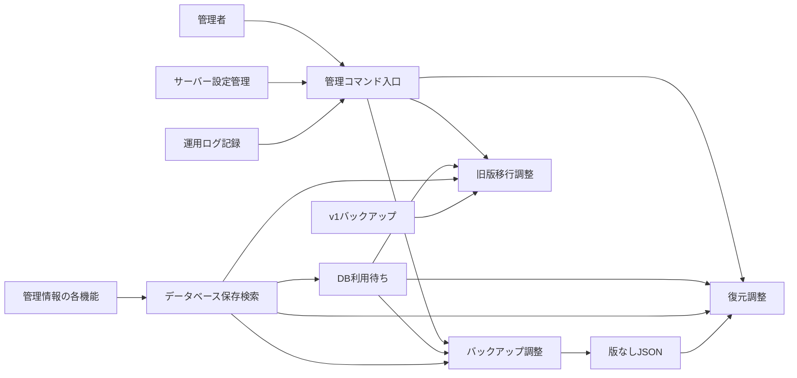
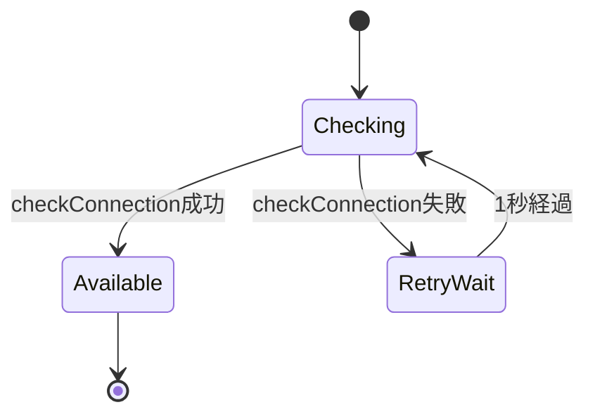
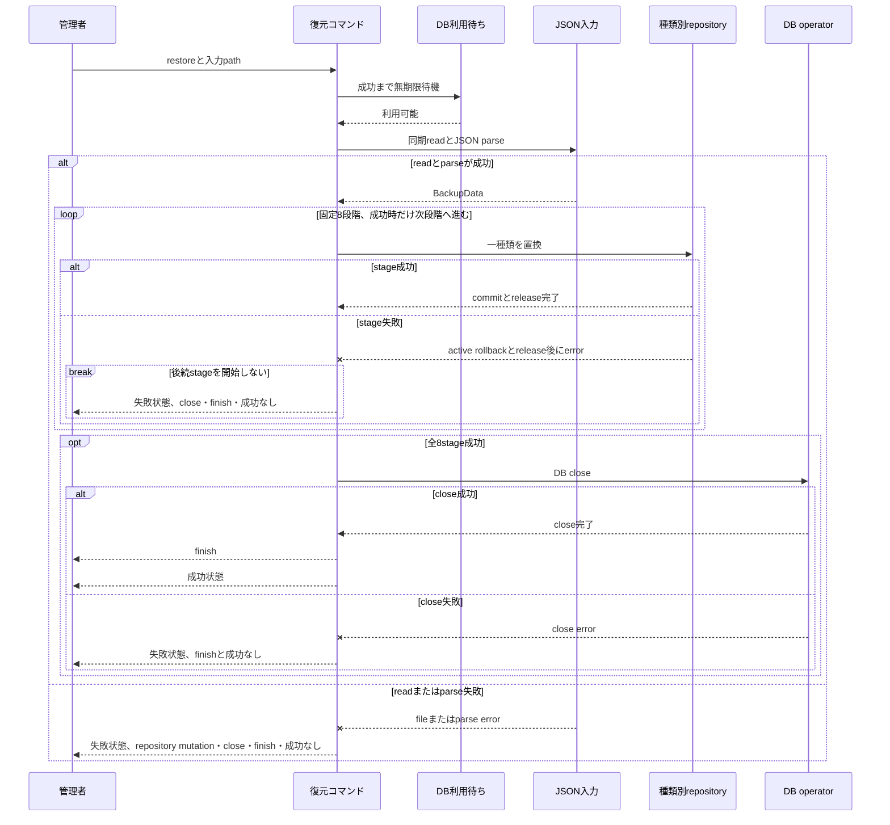
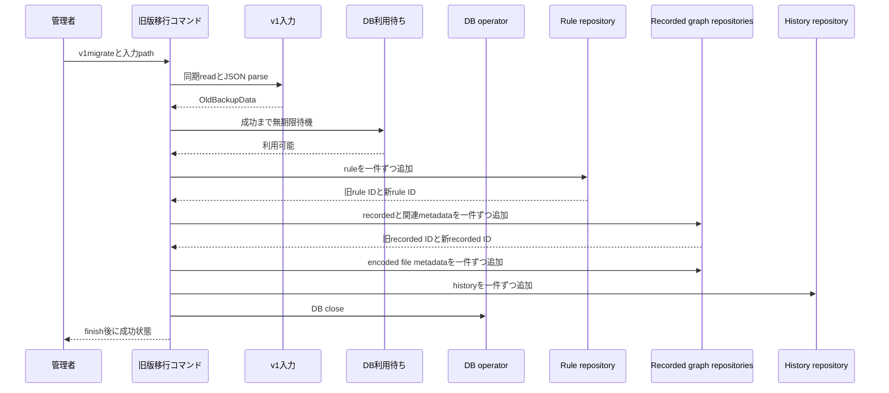
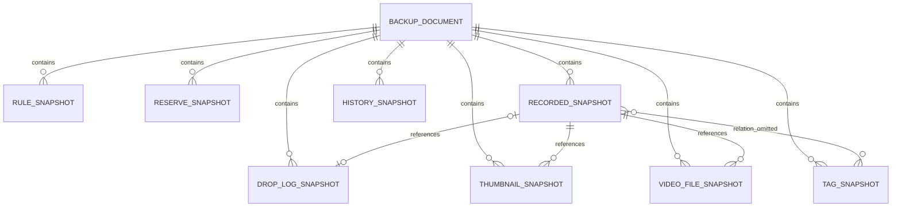
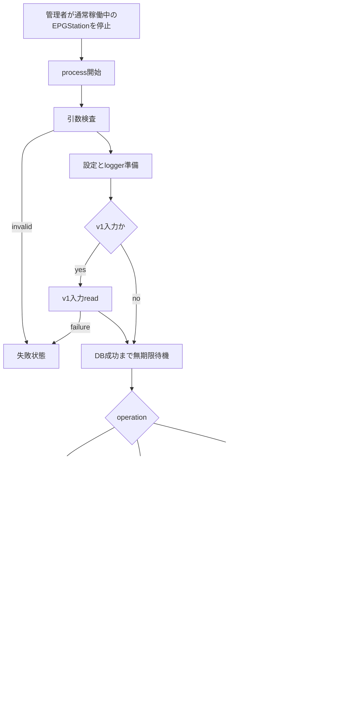

# バックアップ・復元・旧版移行機能 設計

## 概要

本機能は、EPGStation の管理者が、データベースに保存された管理情報を一つの JSON ファイルへバックアップし、その形式から管
理情報を復元し、または EPGStation v1 のバックアップを本仕様の管理情報へ変換して追加するための管理コマンドを提供する。録
画映像、サムネイル画像、ドロップログなどの実ファイルは移送せず、それらを指す管理情報だけを扱う。

既存のコマンド名、引数、版番号を持たない JSON 形式、同期ファイル入出力、処理順序、種類単位の確定、および v1 移行の変換規
則を互換境界として維持する。管理者は処理中の種類と終了状態を確認できるが、バックアップ全体の同一時点性、復元・移行全体の
一括 rollback、通常運用との排他、途中再開、および v1 移行の重複防止は本機能の保証に含めない。

確認済みのコマンド、順序、wire、部分確定、出力、終了状態、および DB 利用可能性を無期限に待つ挙動を維持する。管理者は通常
稼働中の EPGStation を停止してからコマンドを実行する。コマンド自身による自動停止、版管理、事前 schema 検査、operation 全
体の transaction、maintenance lock、temporary file への atomic write、v1 移行の再開・重複排除、または Windows 対応保証は
新しく導入しない。これらを後で修正するときは、該当 Requirements、Design、test、および実装を同じ変更単位で更新する。

### 設計目標

-   `backup`、`restore`、`v1migrate` の既存 CLI と入出力指定を維持する。
-   8 種類の管理情報と、録画済み番組とタグの関連付けを除外した版なし JSON wire を維持する。
-   復元と v1 移行の順序、種類単位または行単位の確定、および途中失敗後に残る状態を一意にする。
-   v1 の識別番号を実行中の対応表で変換し、管理情報だけを本仕様の entity へ写像する。
-   DB 接続確認が失敗を返した後は 1 秒待って再確認し、一回の確認にも待機全体にも EPGStation 独自の期限を追加しない。
-   仕様 test、実装 test、DB integration test、および CLI process test から 45 Acceptance Criteria を一意に追跡できるよ
    うにする。

### 非目標

-   録画映像、画像、ドロップログ実ファイル、設定ファイル、またはデータベース file 自体の保全
-   録画済み番組とタグの関連付けのバックアップまたは復元
-   backup の暗号化、圧縮、遠隔保存、世代管理、定期実行、自動保持
-   稼働中 process の自動停止、停止済みであることの機械検査、排他 lock、同一時点 snapshot、復元後の再計算または再生成
-   backup schema の version discriminator、upgrade registry、unknown field policy の新設
-   operation 全体の rollback、checkpoint、resume、v1 移行の idempotency key
-   Windows 上での service 登録・解除の動作保証または検証済み表明

## Boundary Commitments

### This Spec Owns

-   管理コマンドから backup、restore、v1 migration を選び、入力元または出力先へ結び付けること。
-   版番号を持たない backup root の 8 collection、書出し順、読込順、および除外範囲。
-   repository operation を呼ぶ順序、進行記録、成功時の DB close、および process 終了状態。
-   v1 rule、recorded、thumbnail、video file、encoded file、recorded history の変換と旧新 ID 対応表。
-   DB 接続確認が失敗を返した後の 1,000 ms 間隔と、成功するまで期限を設けず待つこと。
-   管理 command が所有する同期 JSON file の読書きと、その成功・失敗の境界。

本機能は移送対象の業務データを所有しない。Rule、Reserve、Recorded、Thumbnail、VideoFile、DropLogFile、RecordedHistory、
RecordedTag の意味と整合性は各 domain と persistence が所有し、本機能はそれらの snapshot または入力 row を順序付きで受け
渡す。

### Out of Boundary

-   domain entity の業務判断、DB schema、migration、query retry、および種類内 transaction の実装
-   通常 server process の起動・停止、DB 接続処理の内部方式、再接続、および shutdown orchestration
-   録画保存先、thumbnail 保存先、drop log 保存先にある実ファイルの存在確認、copy、move、delete
-   v1 backup を最終 schema へ更新する旧版側手順、および `dbRevisionInfo` の runtime 判定
-   HTTP、IPC、event、Socket.IO、Web UI、および remote management API
-   Windows service command の内部動作、OS support matrix、および Windows CI

### Allowed Dependencies

依存方向は `server-operational-logging` → `server-configuration` → `server-persistence` → 各 domain contract →
`server-management-tools` とする。本機能から利用してよい依存は次に限定する。

-   サーバー設定管理機能: DB 設定、録画親保存先、encode 方法の snapshot
-   運用ログ記録機能: system logger と既存 console 出力
-   データベース保存・検索機能: availability probe、close、および 8 種類の repository port
-   録画予約管理機能、自動予約ルール機能、録画済み番組管理機能、サムネイル管理機能: 移送する domain data の意味
-   Node.js built-in filesystem、timer、process、および既存 CLI parser

本機能は downstream の runtime、service interface、workflow、event delivery、recording execution を呼び出さない。復元後
の再評価や通知を暗黙に開始しない。

### Revalidation Triggers

-   `backup`、`restore`、`v1migrate`、`install-win-service`、`uninstall-win-service` の script または引数が変わる場合
-   backup root key、collection element、JSON の version 方針、読書き方式、または除外対象が変わる場合
-   repository の `findAll`、`restore`、`insertOnce`、transaction、retry、relation、ID 生成規則が変わる場合
-   v1 backup type、rule / recorded / encoded converter、旧新 ID 対応、または最終 v1 schema の前提が変わる場合
-   `checkConnection()`、失敗後の 1 秒待機、無期限待機、`closeConnection()`、または process 終了方式が変わる場合
-   config default、reload、snapshot、または public projection が変わる場合
-   本設計に記した制約を修正する場合。修正時は Requirements、Design、test、実装を同時に再検証する。

## Architecture

### Architecture Pattern and Boundary Map



管理 command は local process 内の batch orchestration とする。CLI adapter は引数を検査し、DB 利用待ちを通過した後だけ対
象 operation を開始する。backup / restore / v1 migration は repository port を直接順序付けるが、repository が所有する
transaction や domain data の意味を再実装しない。

### Dependency Responsibilities

| 相手機能                        | 本機能が受け取るもの                                           | 本機能が返すもの                               | 相手側に残る責任                                    |
| ------------------------------- | -------------------------------------------------------------- | ---------------------------------------------- | --------------------------------------------------- |
| `server-configuration`          | process 内設定 snapshot                                        | なし                                           | YAML 読込、既存top-level default、reload、deep-copy |
| `server-operational-logging`    | system logger                                                  | 進行と失敗の記録                               | sink、level、rotation、flush                        |
| `server-persistence`            | availability probe、close、repository Promise                  | query、replace、insert の依頼                  | DB 選択、接続、migration、transaction、共通 retry   |
| `server-reservation-rules`      | Rule の domain 形式                                            | backup snapshot、restore row、v1 AddRuleOption | Rule の意味と通常 CRUD                              |
| `server-reservation-management` | Reserve entity                                                 | backup snapshot、restore row                   | 予約の意味、競合再計算、通常 CRUD                   |
| `server-recorded-content`       | Recorded、VideoFile、DropLogFile、RecordedHistory、RecordedTag | snapshot、restore row、v1 変換 row             | 録画済み情報と実ファイルの通常管理                  |
| `server-thumbnail-management`   | Thumbnail entity                                               | snapshot、restore row、v1 変換 row             | thumbnail の生成、削除、実画像管理                  |

repository の共通 retry は一つの query または insert の内部動作であり、管理 command、restore stage、または migration 全
体の自動 retry ではない。本機能は失敗した operation 全体を再実行しない。

### Components

| Component                           | Domain or Layer | Intent                                                        | Requirements                                      | Key Dependencies                  | Contracts      |
| ----------------------------------- | --------------- | ------------------------------------------------------------- | ------------------------------------------------- | --------------------------------- | -------------- |
| Management CLI adapter              | CLI             | 既存 command と必須引数を operation へ写像する                | 1.1-1.5, 5.2, 5.6, 6.1-6.3                        | process P0、CLI parser P1         | Batch          |
| Management DB availability wait     | Coordination    | DB 確認失敗後に1秒待ち、成功するまで無期限に再確認する        | 5.1-5.3                                           | DB operator P0、sleep P0          | Service, State |
| Backup coordinator                  | Application     | 8 種類を固定順で読み、版なし JSON を同期書出しする            | 2.1-2.5, 5.4-5.6                                  | repositories P0、filesystem P0    | Batch          |
| Restore coordinator                 | Application     | JSON を読み、8 種類を固定順で置換する                         | 3.1-3.7, 5.4-5.6                                  | repositories P0、filesystem P0    | Batch, State   |
| v1 migration coordinator            | Application     | v1 data を変換し、旧新 ID 関係を保って追加する                | 4.1-4.13, 5.4-5.6                                 | repositories P0、configuration P0 | Batch, State   |
| v1 converter set                    | Domain adapter  | v1 rule、recorded、file、history を本仕様の入力形式へ射影する | 4.4-4.11                                          | domain types P0、configuration P1 | Service        |
| Metadata repository ports           | Data adapter    | read、種類別 replace、row insert、close を提供する            | 2.1, 3.3, 3.6, 3.7, 4.4-4.7, 4.12, 4.13, 5.1, 5.5 | persistence P0                    | Service        |
| Synchronous JSON file adapter       | Infrastructure  | 指定 path を UTF-8 で同期 read または direct write する       | 2.2, 2.4, 2.5, 3.1, 3.2, 3.4, 4.2, 4.3, 4.11      | Node filesystem P0                | Batch          |
| Progress and process result adapter | Operations      | stage 順の記録、close 後の成功、失敗終了を表す                | 5.4-5.6                                           | logger P0、process P0             | Batch          |
| Feature test catalog                | Verification    | 固有 case、matrix、結合 test と server 全体の C0/C1 判定を分離する | 7.1-7.5                                      | Runtime Requirement 9 P0          | Test           |

### Technology Stack

| Layer    | Choice or Version                    | Role                                        | Notes                                        |
| -------- | ------------------------------------ | ------------------------------------------- | -------------------------------------------- |
| Runtime  | Node.js 24 minimum、26 compatibility | CLI process、filesystem、1秒sleep、終了状態 | Node.js 18 は acceptance 対象外              |
| Language | project TypeScript                   | 型付き coordinator と converter             | `any` を新しい contract に使用しない         |
| CLI      | 既存 `minimist`                      | short / long option の解析                  | command syntax を変更しない                  |
| Data     | TypeORM repository ports             | read、transactional replace、insert、close  | 本機能から ORM detail を再所有しない         |
| Logging  | 既存 system logger と console        | 進行、input error、接続失敗、処理失敗       | 実データ内容と credential を意図して記録しない（JSON 解析 error の断片は除く） |
| File     | Node.js synchronous filesystem API   | UTF-8 JSON read / direct write              | temporary file や atomic rename は追加しない |

新しい外部 package、管理 tool 専用の timeout 設定、clock adapter、または deadline service は導入しない。

## Components and Interfaces

### Management CLI Adapter

| Command surface                     | Accepted invocation            | Required value                              | Operation                               |
| ----------------------------------- | ------------------------------ | ------------------------------------------- | --------------------------------------- |
| root script `backup`                | `DBTools -m backup -o <path>`  | mode と output                              | versionless backup を `<path>` へ書く   |
| root script `restore`               | `DBTools -m restore -o <path>` | mode と input path として使う output option | versionless backup を `<path>` から読む |
| root script `v1migrate`             | `V1MigrationTool -i <path>`    | input                                       | v1 backup を `<path>` から読む          |
| root script `install-win-service`   | 既存 script 名                 | 既存 `winser` 引数                          | command 名だけを維持する                |
| root script `uninstall-win-service` | 既存 script 名                 | 既存 `winser` 引数                          | command 名だけを維持する                |

`-m` / `--mode`、`-o` / `--output`、`-i` / `--input` の alias を維持する。R1.4 の specification oracle は、DBTools の
mode または output の未指定・空文字、および v1 input の未指定・空文字で DB operation を開始せず終了状態 1 を返すことであ
り、file call count を要求しない。source characterization では、DBTools の未指定・空文字と v1 input 未指定は input /
output file operation 0、v1 input の空文字は未指定判定を通過して空 path の input read を一回試み、その失敗で DB
operation 前に終了状態 1 となる。mode が `backup` / `restore` 以外の場合も logger や DB operation を開始せず終了状態 1
を返す。その他の path の存在、read、parse、write の可否は file operation の段階で判定する。

Windows の 2 command は root script surface に残すが、本 Design は Windows 上の起動成功、service lifecycle、exit code、
または検証済み support を定義しない。

### Management DB Availability Wait

```ts
interface IConnectionCheckModel {
    checkDB(): Promise<void>;
}

interface SleepPort {
    sleep(delayMs: number): Promise<void>;
}
```

`IConnectionCheckModel` は通常 server 起動と管理 command が共有する既存 port である。管理 command 専用の新しい待機
service は作らず、次の処理をそのまま利用する。

1. `IDBOperator.checkConnection()` を直ちに一回呼ぶ。
2. 接続、Migration、extension、`select 1` のいずれかが pending の間は、その Promise が成功または失敗を返すまで待つ。
3. 成功した場合は待機を終了し、対象 operation を開始する。
4. 失敗した場合は 1,000 ms 待ち、新しい `checkConnection()` を開始する。
5. 一回ごとの確認、試行回数、待機時間全体のいずれにも EPGStation 独自の上限を設けない。



この待機は management command を自動停止する cancellation 契約を持たない。管理者が中止する場合は command process 自体を
終了する。管理者は通常稼働中の EPGStation を先に停止してから実行し、本機能は停止要求や排他 lock を取得しない。

### Backup Coordinator

**Contracts**: Batch, State

```ts
interface BackupData {
    ruleItems: RuleWithCnt[];
    reserveItems: Reserve[];
    recordedItems: Recorded[];
    thumbnailItems: Thumbnail[];
    videoFileItems: VideoFile[];
    dropLogFileItems: DropLogFile[];
    recordedHistoryItems: RecordedHistory[];
    recordedTagItems: RecordedTag[];
}
```

precondition は CLI validation と DB availability wait の成功である。coordinator は read と進行 log を一件ずつ await
し、全 read 成功後だけ `BackupData` を組み立てる。read は一つの transaction / snapshot / lock を共有しないため、通常運用
中に値が変わると collection ごとの観測時点が異なり得る。

#### Read and Progress Order

| Order | Progress label     | Repository operation  | Projection                                                      |
| ----: | ------------------ | --------------------- | --------------------------------------------------------------- |
|     1 | `rule`             | rules `findAll`       | update count を含む rule domain form                            |
|     2 | `reserve`          | reserves `findAll`    | 通常表記、既存一覧順                                            |
|     3 | `drop log file`    | drop logs `findAll`   | metadata only                                                   |
|     4 | `recorded`         | recorded `findAll`    | video、thumbnail、drop log、tag relation を join しない通常表記 |
|     5 | `thumbnail file`   | thumbnails `findAll`  | metadata only                                                   |
|     6 | `video file`       | video files `findAll` | metadata only                                                   |
|     7 | `recorded history` | histories `findAll`   | metadata only                                                   |
|     8 | `recorded tag`     | tags `findAll`        | tag body only                                                   |

JSON object の property emission order は
`ruleItems`、`reserveItems`、`recordedItems`、`thumbnailItems`、`videoFileItems`、
`dropLogFileItems`、`recordedHistoryItems`、`recordedTagItems` とする。read 順と property 順の差を暗黙に統一しない。

出力は version field、format ID、indent、trailing newline を追加せず、`JSON.stringify()` の compact JSON を UTF-8 で指定
path へ同期 direct write する。既存 file があれば同じ path を直接置き換える。temporary file、fsync、rename、書込み
failure 時の旧 file 復元を追加しないため、write failure では出力先が空または途中内容になり得る。

### Restore Coordinator

**Contracts**: Batch, State

restore は DB availability wait 成功後に指定 path を UTF-8 で同期 read し、`JSON.parse()` する。file 不在、read
failure、parse failure は最初の repository mutation 前に終了状態 1 とする。JSON として解釈できた後は、8 collection 全体
の runtime schema、row field、ID relation、重複 ID を mutation 前に一括検査しない。extra root field は参照せず、missing
/ invalid collection はその stage へ到達したときに失敗し得る。



#### Restore Stage Order and Atomicity

| Order | Stage              | Replace boundary                                                                               | Failure after stage commit                                     |
| ----: | ------------------ | ---------------------------------------------------------------------------------------------- | -------------------------------------------------------------- |
|     1 | rules              | rule delete + all insert の一 transaction                                                      | rules は新内容のまま                                           |
|     2 | reserves           | reserve delete + all insert の一 transaction                                                   | rules と reserves は新内容のまま                               |
|     3 | drop logs          | thumbnail、video、recorded、drop log metadata を同一 transaction で削除後、drop logs を insert | 前 2 stage と drop logs は確定し、後続 recorded graph は未復元 |
|     4 | recorded           | thumbnail、video、recorded metadata を同一 transaction で削除後、recorded を insert            | 前段と recorded は確定                                         |
|     5 | thumbnails         | thumbnail delete + all insert の一 transaction                                                 | 前段と thumbnails は確定                                       |
|     6 | video files        | video file delete + all insert の一 transaction                                                | 前段と video files は確定                                      |
|     7 | recorded histories | history delete + all insert の一 transaction                                                   | 前段と histories は確定                                        |
|     8 | recorded tags      | tag body delete + all insert の一 transaction                                                  | 全 8 stage が確定                                              |

各 repository はquery runner作成後の`startTransaction()`、delete／insert、commitを一つの`try/catch/finally`へ置く。開始
失敗を含む全経路で`release()`を試み、rollbackは`queryRunner.isTransactionActive`の場合だけ行う。開始、mutation、commitの
raw database errorはrepository内部のprimary cause／診断として保持し、rollbackまたはreleaseのerrorは別のcleanup診断に記録
する。依頼元には各restore portの既存`restore error` messageだけを返し、raw database／cleanup errorを投影しない。
management coordinatorはrepository Promiseがこれらの後始末までsettleするのを待ち、失敗時は後続stageを開始しない。

commit が成功した後に release が失敗した場合、command は失敗を返す一方、その stage は確定済みである。すでに commit した
前 stage も管理 operation 全体として rollback しない。checkpoint と自動 resume は持たない。録画済み番組と tag の join
relation は入力にも stage にも存在せず、復元しない。

同じ完全な入力を全 stage 成功まで再実行すると各 collection は明示 ID を含む入力へ再置換されるが、途中状態からの安全な
resume を保証しない。restore は通常 server process を停止せず、並行 write を lock しない。

### V1 Migration Coordinator and Converter Set

**Contracts**: Batch, State, Service

v1 migration は input path 検査後、DB 利用前に file を同期 read / JSON parse する。受け付ける前提は、移行元を v1 の最終
DB 構造へ更新して作成した backup である。入力には `dbRevisionInfo` が存在するが、coordinator は値を受入判定に使わ
ず、format version または revision の runtime validation を行わない。

設定の `recorded[0].name` を、v1 backup の読込みより前（`run()` の最初）に読み、その後で型を検査する。設定の `recorded`
が空なら参照時に失敗し、v1 backup の読込みと DB 確認へ進まない。v1 backup の `recorded` が空であることは、この失敗の
条件ではない。先頭 `name` が文字列でない場合は error を
記録するだけで処理を止めず、その値を rule 変換へ渡すため、後続変換または DB 操作で失敗し得る。v1 rule が参照する encode
index に対応する encode 方法がない場合も、未知 index の読み替えや別保存先への fallback を行わない。本設計はこれらを新し
い事前検証または fail-fast 保証へ変更しない。

```ts
interface OldBackupData {
    rules: OldRuleItem[];
    recorded: OldRecordedItem[];
    encoded: OldEncodedItem[];
    recordedHistory: OldRecordedHistoryItem[];
    dbRevisionInfo: { revision: number };
}

type RuleIndex = ReadonlyMap<number, number>;
type RecordedIndex = ReadonlyMap<number, number>;
```

process 内 object で index を保持してよい。index は DB へ永続化せず、失敗または process 終了で失われる。

#### Migration Flow



#### Rule Mapping

| v1 source                                                                              | Target                 | Rule                                                                       |
| -------------------------------------------------------------------------------------- | ---------------------- | -------------------------------------------------------------------------- |
| `keyword`、`ignoreKeyword`                                                             | search text            | `null` でなければ設定する                                                  |
| `keyCS`、`keyRegExp`、`title`、`description`、`extended`                               | search flags           | `null` でなければ設定し、`title` は target `name` へ写像する               |
| `ignoreKeyCS`、`ignoreKeyRegExp`、`ignoreTitle`、`ignoreDescription`、`ignoreExtended` | ignore flags           | `ignoreTitle` は target `ignoreName` へ写像する                            |
| `GR`、`BS`、`CS`、`SKY`                                                                | broadcast flags        | 各値が `null` でなければ設定する。v1にBS4K相当のfieldは無いため、移行後のRuleの`BS4K`は既定値`false`のまま設定しない |
| `station`                                                                              | `channelIds`           | `null` でなければ一要素配列にする                                          |
| `genrelv1`、`genrelv2`                                                                 | `genres`               | level 1 がある場合だけ一要素とし、level 2 があれば sub genre にする        |
| `startTime`、`timeRange`、`week`                                                       | `times`                | start と range が両方ある場合だけ含め、week は常に一要素へ含める           |
| `isFree`、`durationMin`、`durationMax`                                                 | search limits          | `null` でなければ設定する                                                  |
| `enable`、`allowEndLack`、`avoidDuplicate`                                             | reserve options        | 直接設定する                                                               |
| `periodToAvoidDuplicate`                                                               | reserve option         | `null` でなければ設定する                                                  |
| `directory`、`recordedFormat`                                                          | save option            | `null` でなければ設定する                                                  |
| 最初の `recorded` 設定名                                                               | `parentDirectoryName`  | 全 rule の保存親名に使う                                                   |
| `mode1..3`                                                                             | encode mode name       | number の場合だけ config の同じ index の encode 名へ変換する               |
| `directory1..3`                                                                        | encode directory       | 対応 mode がある場合に `null` でなければ設定する                           |
| `delTs`                                                                                | original delete option | `null` は false。encode mode が一つもなければ encode option 自体を付けない |

rule は一件ずつ追加し、生成された ID を `oldRule.id -> newRuleId` に記録する。config に対応 encode index がなければその
rule で移行を失敗させる。

#### Recorded and File Mapping

| v1 source                                                                    | Target                                 | Rule                                                                                                                            |
| ---------------------------------------------------------------------------- | -------------------------------------- | ------------------------------------------------------------------------------------------------------------------------------- |
| `id`                                                                         | runtime recorded index                 | insert 後に `oldRecorded.id -> newRecordedId` を記録する                                                                        |
| `ruleId`                                                                     | `Recorded.ruleId`                      | rule index に対応がある場合だけ新 ID を設定する                                                                                 |
| `programId`                                                                  | `Recorded.programId`                   | 正数だけ保持し、0 以下は manual reservation として `null` にする                                                                |
| channel、start、end、duration、name                                          | Recorded 基本情報                      | 値を移し、name の検索用表記を生成する                                                                                           |
| `description`                                                                | `description` / `halfWidthDescription` | 原文を `description` に保持し、半角化した検索用文字列を `halfWidthDescription` に設定する                                       |
| `extended`                                                                   | `extended` / `halfWidthExtended`       | 原文を `extended` に保持し、半角化した検索用文字列を `halfWidthExtended` に設定する（`null` のときはどちらも設定しない）      |
| genre 1..6                                                                   | genre / sub genre 1..3                 | 2 項目ずつ順番に組にする                                                                                                        |
| video type、resolution、stream content、component type、audio component type | Recorded media metadata                | 対応 field を移す                                                                                                               |
| `recording`、`protection`                                                    | `isRecording`、`isProtected`           | 旧値を使わず両方 false とする                                                                                                   |
| `recPath`                                                                    | original VideoFile metadata            | 値がある場合だけ type `ts`、name `ts`、親保存先を設定する                                                                       |
| `thumbnailPath`                                                              | Thumbnail metadata                     | 値がある場合だけ新 recorded ID と関連付ける                                                                                     |
| `filesize`                                                                   | VideoFile size                         | `null` は 0 とする                                                                                                              |
| encoded `recordedId`                                                         | encoded VideoFile `recordedId`         | recorded index に対応がなければ移行を失敗させる                                                                                 |
| encoded `name`、`path`、`filesize`                                           | encoded VideoFile                      | type `encoded`、親保存先、size の `null -> 0` を設定する                                                                        |
| history name、channel ID、end time                                           | RecordedHistory                        | 一件ずつ追加する                                                                                                                |

`reserveId` は `null`、raw extended fields は `null` とする。v1 の audio sampling rate、未変換の詳細情報、log
path、error / drop / scrambling count、temporary recording state は移行しない。v1 reserve と drop information も入力
stage を持たない。file path は文字列 metadata として登録するだけで、録画映像または画像を copy / move / delete しない。

`extended` は `description` と同じく、original-width の text を `extended` に、半角化した text を `halfWidthExtended`
に設定する。これは通常の録画済み番組の登録と同じ写像であり、半角表示を既定とする client と encode 用の環境変数
`HALF_WIDTH_EXTENDED` が移行した番組の詳細を参照できる。

#### Commit and Reexecution

順序は rules → recorded とその thumbnail / original video → encoded video → recorded history で固定する。各
`insertOnce()` は個別 operation であり、v1 migration 全体の transaction を持たない。途中失敗では、それ以前に追加した row
を rollback せず、同じ入力を再実行すると既存追加分を識別できないため重複登録し得る。自動 retry は repository の一件
operation 内に限り、migration 全体を最初から再実行しない。

### Metadata Repository Ports

| Port            | Backup                       | Restore                                     | v1 Migration                         |
| --------------- | ---------------------------- | ------------------------------------------- | ------------------------------------ |
| Rule            | all with update count        | replace all                                 | insert and return new ID             |
| Reserve         | all                          | replace all                                 | not used                             |
| DropLogFile     | all                          | 実装の dependent-clear order で replace all | not used                             |
| Recorded        | all without joined relations | replace all                                 | insert and return new ID             |
| Thumbnail       | all                          | replace all                                 | insert with new recorded ID          |
| VideoFile       | all                          | replace all                                 | insert original and encoded metadata |
| RecordedHistory | all                          | replace all                                 | insert history                       |
| RecordedTag     | all tag bodies               | replace all tag bodies                      | not used                             |

port の引数型、戻り値、transaction、共通 retry、dialect 差は `server-persistence` の contract を使う。管理 coordinator
は driver、query builder、transaction runner、SQL を参照しない。

## Data Models and Ownership

### Backup Document Relationships



`BACKUP_DOCUMENT` は file 上の transfer document であり、DB aggregate root ではない。collection element の ID と
relation field は保存値を維持するが、Recorded と Tag の many-to-many join は document に存在しない。

### Ownership and Resource Handoff

| Resource                | Before operation                             | During operation                          | After success                  | On failure                                                               |
| ----------------------- | -------------------------------------------- | ----------------------------------------- | ------------------------------ | ------------------------------------------------------------------------ |
| backup output path      | 管理者が指定し、既存 file があれば管理者所有 | synchronous writer が同じ path を直接変更 | 完成 JSON は管理者所有         | truncate / partial content の可能性があり、自動復元・削除なし            |
| restore / v1 input path | 管理者所有                                   | read-only synchronous reader が一回読む   | file は変更しない              | file は変更しない                                                        |
| DB connection           | persistence 所有                             | availability wait と repository が借用    | success path で close を await | failure pathの共通 close / reopen は保証しない。process 終了境界へ委ねる |
| restore transaction     | persistence 所有                             | 一 stage の delete / insert を所有        | stage ごとに commit            | 失敗 stage だけ rollback、前 stage は維持                                |
| v1 ID indexes           | v1 coordinator 所有                          | process memory に保持                     | process exit で破棄            | rollback / resume 情報として保存しない                                   |
| actual media files      | 各 media 機能または管理者所有                | 本機能は触れない                          | 変更なし                       | 変更なし                                                                 |

## System Flows

### Command Lifecycle



v1 だけが入力 read / parse を DB wait より前に行う。restore は DB wait の後、backup は DB read 全件の後に file write を
行う。この順序を統一しない。最初の precondition は管理者の責任を示し、command が通常稼働 process の停止状態を検査または
強制することを意味しない。

### Success Ordering

成功時は `run` 記録 → operation 固有の開始・stage 記録 → operation 完了 → `closeConnection()` await → `finish` 記録 → 終
了状態 0 の順である。`finish` は DB close 成功後だけ記録する。

### Failure Ordering

-   DBTools の必須値・mode failure と v1 input 未指定は DB、file、logger operation 前に console error と終了状態 1 を返
    す。v1 input の空文字は logger 初期化後に input read を一回試み、DB probe 前に終了状態 1 を返す。
-   restore の input read / parse failure は DB availability 成功後、restore mutation 前に失敗する。
-   v1 input read / parse failure は DB availability probe 前に失敗する。
-   DB 接続確認が pending の間は operation 固有 read / mutation / write を開始せず、その確認結果を待ち続ける。
-   DB 接続確認が失敗を返した場合は 1 秒後に再確認し、DB 不可だけを理由に command を自動終了しない。
-   stage / converter / write / close error は後続 stage、`finish`、終了状態 0 へ進まない。
-   operation failure 後に前 stage、追加済み row、または direct-write file を共通 rollback しない。

## Error Handling, Retry, and Cleanup

### Error Matrix

| Failure                                       | Observable result                | DB mutation                     | Retry                            | Cleanup boundary                                     |
| --------------------------------------------- | -------------------------------- | ------------------------------- | -------------------------------- | ---------------------------------------------------- |
| required CLI value missing                    | existing console message、exit 1 | none                            | none                             | process exit                                         |
| unsupported DBTools mode                      | existing console message、exit 1 | none                            | none                             | process exit                                         |
| DB connection check pending                   | command remains waiting          | management mutation none        | none until current check settles | administrator may terminate process                  |
| DB connection check failure                   | no operation start、1秒待機      | management mutation none        | unlimited new checks after wait  | no management-specific deadline                      |
| input file absent / unreadable / invalid JSON | file / parse error、exit 1       | restore none、v1 none           | none                             | input unchanged                                      |
| missing or invalid JSON collection            | stageで失敗し得る。受理時は続行  | earlier stages may remain       | no whole-operation retry         | repository・driverの入力解釈とtransaction境界に従う  |
| repository read failure during backup         | error、exit 1                    | none by management              | repository internal only         | output write not started if before write             |
| direct backup write failure                   | error、exit 1                    | none by management              | none                             | output may be empty / partial                        |
| restore transaction start failure             | `restore error`、exit 1          | stage mutationなし、前段は残る  | no stage retry by management     | rollbackなし、全経路release。raw causeは内部診断     |
| restore mutation / commit failure             | `restore error`、exit 1          | 前段は残る。失敗stageは結果不定 | no stage retry by management     | active時rollback、全経路release。cleanup診断は別記録 |
| restore release failure after commit          | `restore error`、exit 1          | 当該stageと前段はcommit済み     | no stage retry by management     | raw release errorを投影せず後続stageへ進まない       |
| v1 row conversion / insert failure            | error、exit 1                    | earlier inserted rows remain    | repository insert internal only  | indexes discarded at process exit                    |
| DB close failure                              | no finish / success state        | completed operation remains     | none                             | process failure boundary                             |

本機能は error を「対象なし」や成功へ変換しない。file contents、DB row、credential、connection endpoint、実 media path
を error log や test assertion output に含めない。

### Idempotency and Concurrency

-   backup は同じ path を上書きするが、live DB の共通 snapshot を持たないため同一 byte 列を保証しない。
-   restore は種類別全置換であり、全 stage 成功時だけ入力の 8 collection を再構成する。途中再開 marker はない。
-   v1 migration は追加型であり、同じ input の再実行を idempotent としない。
-   management command は通常 runtime を quiesce せず、複数 management command の相互排他も取得しない。
-   DB transaction と constraint が拒否する競合以外を本機能が直列化しない。
-   signal handling、cancellation token、graceful drain、automatic resume を追加しない。

## Observability and Security

### Progress Contract

backup は `run`、`start backup`、8 stage、`writing`、`finish` の順で記録する。restore は `run`、`start restore`、
`read backup file`、`restore`、8 stage、`finish` の順で記録する。v1 migration は `run`、`read old backup file`、
`import rules`、`import recorded`、`import encode video files`、`import recorded history`、`finish` の順で記録する。

各 DB probe は開始前に既存の `check db` を記録する。接続確認が失敗した場合は error 内容を追加記録せず 1 秒待って次の
`check db` へ進む。接続確認が pending の間は新しい probe、operation、`finish` を開始しない。

実装の error channel 差を一律に変更しない。両 entrypoint の引数・restore input・drop-log restore の明示 catch は console
へ出力し、v1 input の read / parse は system logger へ出力し、その他の async operation error は command Promise の失敗と
して process failure へ伝播する。stack trace の文字列自体は互換 contract にせず、stage log より後に finish / success が
ないことを安定 contract とする。

### Security Considerations

-   management CLI は local operator 権限で実行され、追加の HTTP auth boundary を持たない。
-   入出力 path は管理者が指定する既存契約を維持し、本機能独自の managed-root 制限を追加しない。
-   backup JSON は暗号化されず、管理情報を含み得る。配置先の access control と保全は管理者の責任である。
-   tracked spec、fixture、log expectation に実 endpoint、credential、実番組、実ユーザー、実 media path を含めない。
-   backup / input file の内容を意図して log へ出さない。ただし入力の JSON が壊れているとき、`JSON.parse` の標準 error message に入力の
    一部（最大で 20〜30 文字程度）が入ることがあり、DBTools の terminal 出力と v1 移行 tool の system log に出る。この断片は例外
    として許容し、message から取り除かない（位置情報など、原因の特定に使う部分を失うため）。

## Testing Strategy

### 所有権、配置、および証拠状態

共有 runner、`test/server` root、production compile 後の `dist` import、固定 command、V8 coverage、Node.js
24/26 matrix は、サーバー起動・稼働管理機能（`server-application-runtime`）Requirement 9 が所有する。server 全体の C0 / C1
判定も同 Requirement 9 Acceptance Criterion 9 が所有する。本機能は共有基盤を利用して機能固有の case、fixture、
SQLite / MySQL schema、filesystem、compiled CLI scenario だけを所有する。

次の locator は、機能固有 test の canonical な path と、外部の証拠の所有者を示す。Matrix と formal trace は path を重複記載せず、この表の locator key を参照する。

| Locator key           | Canonical filename / external evidence owner                                                                                                                                                                                                                                                                                                                                                                                                                                                                                                               | 責務                                                                |
| --------------------- | ---------------------------------------------------------------------------------------------------------------------------------------------------------------------------------------------------------------------------------------------------------------------------------------------------------------------------------------------------------------------------------------------------------------------------------------------------------------------------------------------------------------------------------------------------------- | --------------------------------------------------------------------------- |
| `SPEC-CLI`            | `test/server/management-tools/cli.spec.test.ts`                                                                                                                                                                                                                                                                                                                                                                                                                                                                                                            | command、alias、必須値、unsupported mode                                    |
| `SPEC-BACKUP`         | `test/server/management-tools/backup.spec.test.ts`                                                                                                                                                                                                                                                                                                                                                                                                                                                                                                         | 8 collection、wire、除外、write failure                                     |
| `SPEC-RESTORE`        | `test/server/management-tools/restore.spec.test.ts`                                                                                                                                                                                                                                                                                                                                                                                                                                                                                                        | parse、種類別置換、順序、部分確定、`restore error`                          |
| `SPEC-V1`             | `test/server/management-tools/v1-migration.spec.test.ts`                                                                                                                                                                                                                                                                                                                                                                                                                                                                                                   | v1 変換、ID 対応、除外、追加順、部分失敗                                    |
| `SPEC-DB`             | `test/server/management-tools/database-lifecycle.spec.test.ts`                                                                                                                                                                                                                                                                                                                                                                                                                                                                                             | 無期限 DB 待ち、進行、close、終了状態、並行境界                             |
| `IMP-CLIJSON`         | `test/server/management-tools/cli-json.test.ts`                                                                                                                                                                                                                                                                                                                                                                                                                                                                                                            | parser と JSON の値域・分岐 characterization                                |
| `IMP-V1`              | `test/server/management-tools/v1-conversion.test.ts`                                                                                                                                                                                                                                                                                                                                                                                                                                                                                                       | nullable field、0/1/境界、invalid index、duplicate ID、除外 field           |
| `IMP-DBCLEAN`         | `test/server/management-tools/database-wait-cleanup.test.ts`                                                                                                                                                                                                                                                                                                                                                                                                                                                                                               | pending probe、1,000 ms、transaction cleanup、late settlement               |
| `INT-DBFS`            | `test/server/management-tools/db-filesystem.integration.test.ts`                                                                                                                                                                                                                                                                                                                                                                                                                                                                                           | SQLite / MySQL、JSON file、transaction / connection cleanup                 |
| `INT-CLI`             | `test/server/management-tools/compiled-cli.integration.test.ts`                                                                                                                                                                                                                                                                                                                                                                                                                                                                                            | production と同じ compiled CLI process、exit 0 / 1、stdout / stderr、取消し |
| `IMP-DIRECT-START` | `test/server/management-tools/direct-start.imp.test.ts` | entry として起動されたときの自動実行と引数不足の終了 |
| `INT-ENTRY-GUARD` | `test/server/management-tools/entry-export-guard.integration.test.ts` | `require` しても自動実行せず、`.default` が class であること |
| `INT-REAL-FILE-ENTRY` | `test/server/management-tools/real-file-entry.integration.test.ts` | 実 file の entry を起動し、V8 raw coverage が eval ではなく実 file に付くこと |
| `HARNESS` | `test/server/management-tools/_harness.ts` | 共通 helper（synthetic の versionless backup、final-v1 backup、fake container） |
| `FIXTURE` | `test/server/management-tools/fixtures/` | 実 file の compiled entry を起動するための container 差し替え（`*.mjs`）。fault injection は各 test に内包 |
| `IMP-CHAR-MT-7.2`     | `test/server/management-tools/cli-json.test.ts#dbtools-missing-empty-before-file-and-db`、`test/server/management-tools/cli-json.test.ts#v1-missing-before-read-and-db`、`test/server/management-tools/cli-json.test.ts#v1-empty-read-once-before-db`、`test/server/management-tools/cli-json.test.ts#json-null-empty-zero-one-invalid-duplicate`、`test/server/management-tools/v1-conversion.test.ts#nullable-zero-one-index-omission-duplicate`、`test/server/management-tools/database-wait-cleanup.test.ts#pending-unbounded-one-second-cleanup-race` | 値域、種類、変換、無期限待ち、cleanup の実装特性                            |
| `INT-BOUNDARY-MT-7.4` | `test/server/management-tools/db-filesystem.integration.test.ts#sqlite-mysql-json-transaction-cleanup`、`test/server/management-tools/compiled-cli.integration.test.ts#compiled-cli-exit-progress-cancel`                                                                                                                                                                                                                                                                                                                                                  | SQLite / MySQL、JSON、compiled CLI、資源解放                                |
| `RUNTIME-R9-MT-7.5`   | 固定 command と server 全体の C0/C1 判定は `server-application-runtime` Requirement 9 が所有する                                                                                                                                                                                                                                                                                                                                                                  | 外部 gate が本機能を完了または未完了と判定する                              |

`test の状態` 列の値は次の意味を持つ。`実装済み` は、名指しの test が実在して主 assertion を持つことを表す。
`確認済み（レビュー）` は、`package.json` の確認として文書のレビューで確かめる行を表す。`本節の構成` は、この Matrix
自身の構成で満たす行を表す。`Runtime の判定に従う` は、server 全体の C0 / C1 の判定が `server-application-runtime` の
所有であることを表す。実行時の command、対象件数、成功・失敗、除外、coverage、未解決 risk は Implementation phase の証拠へ記録し、この
Design に架空の結果を記載しない。

### Matrix 記法

値域 profile は対象入力に対する `null / empty / 0 / 1 / min / max / out-of-range / invalid / duplicate` を次のように固定
する。

| Profile         | 適用と期待                                                                                                                                                                                                                                                                                                                                                                                                                 |
| --------------- | -------------------------------------------------------------------------------------------------------------------------------------------------------------------------------------------------------------------------------------------------------------------------------------------------------------------------------------------------------------------------------------------------------------------------- |
| `V-DBTOOLS-CLI` | DBTools の mode / output が `null` 相当の未指定または empty なら、仕様上は DB operation 0、exit 1。実装特性は file operation 0 でもある。mode `0` と invalid は unsupported、output `0` は非空 path、1組の指定が有効最小。duplicate option は string 配列になり、duplicate mode は DB 前に unsupported、duplicate output は operation 後の file 境界で不受理となる。数値 max / out-of-range は数値入力契約がないため N/A。 |
| `V-V1-CLI`      | v1 input の `null` 相当の未指定と empty は、仕様上は DB operation 0、exit 1。実装特性では、未指定は input read 0、empty は未指定判定を通過して input read を1回試みる。`0` / `1` は非空 path、1指定が有効最小、invalid / unreadable path は read failure、duplicate input は string 配列を1回の readへ渡して失敗する。数値 max / out-of-range は数値入力契約がないため N/A。                                               |
| `V-JSON`        | `null` root、empty file、`0` / `1` root、invalid JSON / collection type、duplicate property を分ける。空 collection と 1 row は有効 fixture とする。document size の min / max / out-of-range は製品上限がないため N/A とし、test harness 上限を製品契約にしない。duplicate property は `JSON.parse` で後の property が採用されることを characterization する。                                                            |
| `V-ROWS`        | collection の `null` / invalid type、empty、0 row、1 row、duplicate ID と DB constraint failureを対象にする。row count の min は0、次点は1。max / out-of-range は製品件数上限がないため N/A。field 値域は owner domain と persistence の contract を利用する。                                                                                                                                                             |
| `V-V1`          | nullable field、empty collection、0 / 1 row、`programId <= 0`、size `null -> 0`、encode index の有効最小0・有効最大`encode.length - 1`・範囲外、invalid type、duplicate old ID を対象にする。全 document / row 件数の最大値は定義がないため N/A。duplicate old ID は各 row を追加する一方、process 内 index は後に追加した new ID を保持することと DB constraint の結果を別に観測する。                                    |
| `V-WAIT`        | 失敗0回、1回、任意の有限回、成功まで無期限を対象にする。`null` / empty / invalid result は Promise rejection / fulfillment の port 契約外のため N/A、最大試行数と out-of-range は上限を設けないため N/A、duplicate settlement は Promise が一回だけ settle するため N/A。                                                                                                                                                  |
| `V-CONCURRENCY` | command数0は操作なし、1は有効最小、2はduplicate / 同着を別processとして観測する。null / empty / invalid invocationは`V-DBTOOLS-CLI`と`V-V1-CLI`へ委ねる。最大同時command数とout-of-rangeは本機能に上限がないためN/A。通常runtimeとの1対1同着も別process境界として扱う。                                                                                                                                                    |
| `V-CLOSE`       | close call 0は成功経路では範囲外、1が有効な最小かつ最大、2回以上はduplicate / out-of-rangeとして検出する。Promise<void>のpending・fulfill・rejectを対象にする。null / empty / 数値値 / invalid型はportが受け取るdata入力ではないためN/A。                                                                                                                                                                                  |
| `V-SURFACE`     | `package.json` の固定 command 名だけを確認する。9値域は動的入力を受けないためすべて N/A とし、文字列の存在と非保証文言を確認する。                                                                                                                                                                                                                                                               |
| `V-EVIDENCE`    | test の構成と品質判定を表す行であり製品データを入力しないため9値域はすべて N/A。case 数、ID、column、結果状態に欠落・重複がないことを本書の構成として満たす。                                                                                                                                                                                                                                                            |

状態は `P`（開始前）、`W`（DB 待機）、`R`（種類処理中）、`S`（成功）、`F`（失敗）、`C`（process 終了による cancel）、
`RE`（別 process の再入）、`RST`（再起動）で表す。管理 command は内部 cancellation / resume を持たないため、`C` では
child process を外部から終了して DB / file / process 資源を観測し、`RE` は排他せず別 command として開始し、`RST` は
checkpoint なしで先頭から新規実行する。

`ST-STATIC` は command 名と設計文書の構成を扱うため `P` だけを持ち、進行・cancel・再入・restart は動的実行がないため
N/A とする。`ST-GATE` は Runtime Requirement 9 Acceptance Criterion 9 の判定が返す `S / F` の結果だけを受け取り、本機能内の cancel・再入・restart は
Runtime 所有のため N/A とする。

時間・順序 profile は `T-SEQ`（固定 stage 順、後続抑止、失敗後の late settlement から後続を開始しないこと）、
`T-WAIT`（一回の probe settlement を無期限に待ち、失敗後だけ 1,000 ms、全体も無期限。process 終了後の late settlement は
新 process へ作用しないこと）、`T-RACE`（runtime / 複数 command の同着を lock なしで DB transaction / constraint の結果
まで観測）、`T-STATIC`（実行順を持たない静的な対象）とする。HTTP / IPC / event / tuner は本機能が利用しないため N/A であ
り、DB、filesystem、process だけを結合する。

### 機能固有 Test Matrix

各 `MT-N.M` は同じ番号の Acceptance Criterion に一対一であり、R1-R6 の各行は一つの主 case を持つ。`層` は `S`
（`unittest/spec`）、`I`（`unittest/imp`）、`G`（integration）、`R`（`package.json` の確認）、`M`（本表）、`Q`（品質判定）であ
る。

| ID      | 主 case locator       | 層    | 値域 profile                                     | 状態               | 時間・競合          | 資源                            | 境界 / failure                               | 主 assertion                                                                                 | test の状態 |
| ------- | --------------------- | ----- | ------------------------------------------------ | ------------------ | ------------------- | ------------------------------- | -------------------------------------------- | -------------------------------------------------------------------------------------------- | ---- |
| MT-1.1  | `SPEC-CLI#MT-1.1`     | S/G   | V-DBTOOLS-CLI                                    | P/W/R/S/F/C/RE/RST | T-SEQ               | child/DB/output file            | process/必須値・DB・write失敗                | backup と output を一回受理し他 operation 0                                                  | 実装済み |
| MT-1.2  | `SPEC-CLI#MT-1.2`     | S/G   | V-DBTOOLS-CLI                                    | P/W/R/S/F/C/RE/RST | T-SEQ               | child/DB/input file             | process/必須値・read失敗                     | restore と input path を一回受理し他 operation 0                                             | 実装済み |
| MT-1.3  | `SPEC-CLI#MT-1.3`     | S/G   | V-V1-CLI                                         | P/W/R/S/F/C/RE/RST | T-SEQ               | child/DB/input file             | process/必須値・read失敗                     | v1migrate と input を一回受理する                                                            | 実装済み |
| MT-1.4  | `SPEC-CLI#MT-1.4`     | S/I/G | V-DBTOOLS-CLI/V-V1-CLI                           | P/F/RE/RST         | T-SEQ               | child/input file                | process/missing・empty                       | specは全caseでDB 0・exit 1。impはDBTools missing/emptyとv1 missingでfile 0、v1 emptyでread 1 | 実装済み |
| MT-1.5  | `SPEC-CLI#MT-1.5`     | S/I/G | V-DBTOOLS-CLI                                    | P/F/RE/RST         | T-SEQ               | child                           | process/unsupported mode                     | DB operation 0、exit 1                                                                       | 実装済み |
| MT-2.1  | `SPEC-BACKUP#MT-2.1`  | S/G   | V-ROWS                                           | W/R/S/F/C/RE/RST   | T-SEQ               | DB connection                   | SQLite/MySQL/read失敗                        | 8 repository を記載順に一回ずつ読み出す                                                      | 実装済み |
| MT-2.2  | `SPEC-BACKUP#MT-2.2`  | S/I/G | V-JSON                                           | R/S/F/C/RE/RST     | T-SEQ               | output file                     | filesystem/stringify・write失敗              | version field なしの compact UTF-8 JSON を指定 path へ direct write                          | 実装済み |
| MT-2.3  | `SPEC-BACKUP#MT-2.3`  | S/I/G | V-ROWS                                           | R/S/F/RE/RST       | T-SEQ               | DB/output file                  | DB/filesystem/relation混入                   | recorded と tag body を含み join relation key を含めない                                     | 実装済み |
| MT-2.4  | `SPEC-BACKUP#MT-2.4`  | S/I/G | V-ROWS                                           | R/S/F/C/RE/RST     | T-RACE              | DB/output file                  | filesystem/実 media path                     | spec/imp/static call ledgerで実file read/write/move/delete 0                                 | 実装済み |
| MT-2.5  | `SPEC-BACKUP#MT-2.5`  | S/I   | V-JSON                                           | R/S/F/RE/RST       | T-SEQ               | output file                     | filesystem/config混入                        | backup root と nested value に設定 file 内容を追加しない                                     | 実装済み |
| MT-3.1  | `SPEC-RESTORE#MT-3.1` | S/I/G | V-JSON                                           | W/R/S/F/C/RE/RST   | T-SEQ               | input file/DB                   | filesystem/parse失敗                         | 指定 file を UTF-8 read し一回だけ JSON parse                                                | 実装済み |
| MT-3.2  | `SPEC-RESTORE#MT-3.2` | S/I/G | V-JSON                                           | W/F/C/RE/RST       | T-SEQ               | input file/DB                   | ENOENT/read/invalid JSON                     | repository mutation 0、exit 1                                                                | 実装済み |
| MT-3.3  | `SPEC-RESTORE#MT-3.3` | S/G   | V-ROWS                                           | R/S/F/C/RE/RST     | T-SEQ               | DB transaction/connection       | SQLite/MySQL/delete・insert・commit失敗      | 到達した一種類だけを一 transaction で全置換                                                  | 実装済み |
| MT-3.4  | `SPEC-RESTORE#MT-3.4` | S/I/G | V-ROWS                                           | R/S/F/C/RE/RST     | T-RACE              | input file/DB                   | filesystem/実 media path                     | spec/imp/static call ledgerで実file operation 0                                              | 実装済み |
| MT-3.5  | `SPEC-RESTORE#MT-3.5` | S/I/G | V-ROWS                                           | R/S/F/RE/RST       | T-SEQ               | DB transaction                  | DB/tag relation混入                          | tag body は置換し Recorded-Tag relation mutation 0                                           | 実装済み |
| MT-3.6  | `SPEC-RESTORE#MT-3.6` | S/G   | V-ROWS                                           | R/S/F/C/RE/RST     | T-SEQ               | 8 DB transactions               | SQLite/MySQL/stage失敗                       | rules→reserves→drop logs→recorded→thumbnails→video→history→tags                              | 実装済み |
| MT-3.7  | `SPEC-RESTORE#MT-3.7` | S/G   | V-ROWS                                           | R/F/C/RE/RST       | T-SEQ               | DB transaction/connection       | 各後段のstart・mutation・commit・release失敗 | 前段 row は残り、失敗段より後の call 0                                                       | 実装済み |
| MT-3.8  | `SPEC-RESTORE#MT-3.8` | S/I/G | V-ROWS                                           | R/F/C/RE/RST       | T-SEQ               | QueryRunner/transaction         | start・mutation・commit・rollback・release   | active時rollback、全経路release後も公開 message は`restore error`のみ                        | 実装済み |
| MT-4.1  | `SPEC-V1#MT-4.1`      | S     | V-V1                                             | P/R/S/F/RE/RST     | T-SEQ               | input file                      | final-v1前提違反                             | final-v1 synthetic fixture を受入対象とし runtime revision判定を追加しない                   | 実装済み |
| MT-4.2  | `SPEC-V1#MT-4.2`      | S/I/G | V-V1                                             | P/R/S/F/C/RE/RST   | T-SEQ               | input file                      | filesystem/parse失敗                         | DB probe 前に UTF-8 read と JSON parse                                                       | 実装済み |
| MT-4.3  | `SPEC-V1#MT-4.3`      | S/I/G | V-V1                                             | P/F/RE/RST         | T-SEQ               | input file                      | ENOENT/read/invalid JSON                     | migration DB insert と probe 0、exit 1                                                       | 実装済み |
| MT-4.4  | `SPEC-V1#MT-4.4`      | S/I/G | V-V1                                             | R/S/F/C/RE/RST     | T-SEQ               | rule DB/process index           | invalid encode index・duplicate old ID       | rule fieldを変換し old rule ID→new ID を記録                                                 | 実装済み |
| MT-4.5  | `SPEC-V1#MT-4.5`      | S/I/G | V-V1                                             | R/S/F/C/RE/RST     | T-SEQ               | recorded DB/process indexes     | missing rule mapping・duplicate old ID       | recorded を追加し対応がある rule ID だけ new ID へ置換                                       | 実装済み |
| MT-4.6  | `SPEC-V1#MT-4.6`      | S/I/G | V-V1                                             | R/S/F/C/RE/RST     | T-SEQ               | DB rows/process index           | missing recorded mapping・insert失敗         | thumbnail/original/encoded を new recorded ID へ関連付ける                                   | 実装済み |
| MT-4.7  | `SPEC-V1#MT-4.7`      | S/I/G | V-V1                                             | R/S/F/C/RE/RST     | T-SEQ               | history DB                      | insert失敗                                   | name/channelId/endAt を一件ずつ追加                                                          | 実装済み |
| MT-4.8  | `SPEC-V1#MT-4.8`      | S/I   | V-V1                                             | R/S/F/RE/RST       | T-SEQ               | DB call ledger                  | reserve/drop混入                             | spec/imp/static call ledgerでreserveとdrop repository call 0                                 | 実装済み |
| MT-4.9  | `SPEC-V1#MT-4.9`      | S/I/G | V-V1                                             | R/S/F/RE/RST       | T-SEQ               | recorded DB row                 | old state true/false                         | old値にかかわらず isRecording=false、isProtected=false                                       | 実装済み |
| MT-4.10 | `SPEC-V1#MT-4.10`     | S/I/G | V-V1                                             | R/S/F/RE/RST       | T-SEQ               | converted row                   | nullable・invalid field                      | 7除外fieldとtemporary stateをtarget rowへ写さない                                            | 実装済み |
| MT-4.11 | `SPEC-V1#MT-4.11`     | S/I/G | V-V1                                             | R/S/F/C/RE/RST     | T-RACE              | DB/input file                   | filesystem/実 media path                     | spec/imp/static call ledgerで実録画・画像fileのcopy/move/delete 0                            | 実装済み |
| MT-4.12 | `SPEC-V1#MT-4.12`     | S/G   | V-V1                                             | R/S/F/C/RE/RST     | T-SEQ               | DB rows/process indexes         | 各stage insert失敗                           | rules→recorded関連→encoded→history の exact ledger                                           | 実装済み |
| MT-4.13 | `SPEC-V1#MT-4.13`     | S/I/G | V-V1                                             | R/F/C/RE/RST       | T-SEQ               | DB rows/process indexes         | 各後段 conversion・insert失敗                | 追加済み row を戻さず後続 call 0、再実行で duplicate が生じ得る                              | 実装済み |
| MT-5.1  | `SPEC-DB#MT-5.1`      | S/I/G | V-WAIT                                           | P/W/R/S/F/C/RE/RST | T-WAIT              | DB connection                   | SQLite/MySQL/probe失敗                       | validation後、operation前に probe成功 barrier                                                | 実装済み |
| MT-5.2  | `SPEC-DB#MT-5.2`      | S/I/G | V-CONCURRENCY                                    | P/W/R/S/F/C/RE/RST | T-RACE              | DB/process                      | runtime・複数command競合                     | spec/imp/static call ledgerでstop API・signal・管理command lock 0、競合結果を観測（競合は`db-filesystem.integration.test.ts`の`MT-5.2/T-RACE`が実DBで観測） | 実装済み |
| MT-5.3  | `SPEC-DB#MT-5.3`      | S/I/G | V-WAIT                                           | W/C/RE/RST         | T-WAIT              | DB connection/timer             | pending・reject・eventual success            | 一回のprobeにtimeoutなし、reject後1,000 ms、全体上限なし                                     | 実装済み |
| MT-5.4  | `SPEC-DB#MT-5.4`      | S/I/G | V-ROWS                                           | W/R/S/F/C/RE/RST   | T-SEQ               | logger/DB/file                  | 各stage失敗                                  | 処理開始した種類だけをexact順で記録し後続・finishを記録しない                                | 実装済み |
| MT-5.5  | `SPEC-DB#MT-5.5`      | S/I/G | V-CLOSE                                          | R/S/F/C/RE/RST     | T-SEQ               | DB connection/child             | close pending・reject                        | operation成功→close完了→finish→exit 0                                                        | 実装済み |
| MT-5.6  | `SPEC-DB#MT-5.6`      | S/I/G | V-DBTOOLS-CLI/V-V1-CLI/V-JSON                    | P/W/R/F/C/RE/RST   | T-SEQ               | child/DB/file                   | input・parse・read・write・DB・close失敗     | exit 1、後続stage/finish/exit 0なし                                                          | 実装済み |
| MT-6.1  | `package.json#MT-6.1`     | R     | V-SURFACE                                        | ST-STATIC          | T-STATIC            | package script 一覧        | command欠落                                  | `install-win-service` 名が一意に存在                                                         | 確認済み（レビュー） |
| MT-6.2  | `package.json#MT-6.2`     | R     | V-SURFACE                                        | ST-STATIC          | T-STATIC            | package script 一覧        | command欠落                                  | `uninstall-win-service` 名が一意に存在                                                       | 確認済み（レビュー） |
| MT-6.3  | `package.json#MT-6.3`     | R     | V-SURFACE                                        | ST-STATIC          | T-STATIC            | specification 文言             | support誤表明                                | 名称存在だけを確認し Windows runtime success を要求・報告しない                              | 確認済み（レビュー） |
| MT-7.1  | `SPEC-*`の37主case     | S     | V-EVIDENCE                                       | ST-STATIC          | T-STATIC            | case 一覧              | AC欠落・重複・locator重複                    | R1-R6の40 ACのうちMT-6.1〜6.3を除く37 ACに37主caseを一意対応                                                             | 本節の構成 |
| MT-7.2  | `IMP-CHAR-MT-7.2`     | I     | V-DBTOOLS-CLI/V-V1-CLI/V-JSON/V-ROWS/V-V1/V-WAIT | P/W/R/S/F/RE/RST   | T-SEQ/T-WAIT/T-RACE | DB/file/timer/process           | 値域・管理情報種類・除外・継続待機の分岐欠落 | concrete imp / characterization caseを一意対応                              | 実装済み |
| MT-7.3  | 本節の Matrix | M     | V-EVIDENCE                                       | ST-STATIC          | T-STATIC            | matrix 一覧             | 必須列・N/A理由・分類欠落                    | 45行、値域、状態、cancel/reentry/restart、時刻、資源、境界 が揃う                         | 本節の構成 |
| MT-7.4  | `INT-BOUNDARY-MT-7.4` | G     | V-EVIDENCE                                       | P/W/R/S/F/C/RE/RST | T-SEQ/T-WAIT/T-RACE | DB/file/child                   | SQLite/MySQL/filesystem/process失敗          | concrete integration case、cleanup、HTTP/IPC N/A理由を一意対応                               | 実装済み |
| MT-7.5  | `RUNTIME-R9-MT-7.5`   | Q     | V-EVIDENCE                                       | ST-GATE            | T-STATIC            | test/coverage evidence | 品質判定未実行・失敗           | 全固有testとserver全体のC0/C1が成立したときだけ完了                                | Runtime の判定に従う |

Matrix は 45 行である。空欄はなく、N/A は profile または当該 cell に理由を持つ。主 case locator は 45 個とも一意である。

### R7 Evidence Layers

| Canonical locator     | Evidence layer                | 本機能が定義する oracle                                                                                                                                                                                    |
| --------------------- | ----------------------------- | ---------------------------------------------------------------------------------------------------------------------------------------------------------------------------------------------------------- |
| `SPEC-*`の37主case     | spec case                     | canonical registryに列挙したR1-R5の37 named case（R6のMT-6.1〜6.3は`package.json`の確認）がAC欠落なく一対一で並び、R7を仕様case件数へ混入しない                                                   |
| `IMP-CHAR-MT-7.2`     | implementation-characteristic | canonical registryに列挙したparser / JSON collection / converter / wait / cleanup caseを対応付け、仕様期待とsource固有事実を混同しない                                                    |
| 本節の Matrix | matrix                        | `MT-1.1`〜`MT-7.5` 45行、全必須列、9値域、状態、時間、transaction / connection / input / output file、runtime・command競合、境界、failure、test の状態、N/A理由、およびID / locatorの欠落・重複がない |
| `INT-BOUNDARY-MT-7.4` | integration boundary          | canonical registryに列挙したSQLite / MySQL row、versionless JSON byte、transaction / connection / file / child cleanup、exit 0 / 1を接続する。HTTP / IPCはcarrier自体がないためN/A、Windowsは名称のみ      |
| `RUNTIME-R9-MT-7.5`   | 品質判定                      | 本機能の単体 test と結合 test が全成功し、Runtime Requirement 9 Acceptance Criterion 9 の server 全体の C0 / C1 が成立したときだけ完了と判定する。未実行・失敗は本機能未完了                                    |

### 結合境界と資源 lifecycle

-   `INT-DBFS` は temporary SQLite と隔離 MySQL schema の両方で 8 collection の read / replace と v1 insert を実行し、
    QueryRunner の開始、commit、active rollback、全経路 release、connection close を exact count で確認する。driver 差を
    一方の backend の成功で代替しない。v1 insert は、rule、recorded、thumbnail、original video、encoded video、history の
    各種類の先頭・中間・末尾の insert を実 repository の前で失敗させ（`MT-4.12/MT-4.13`）、それ以前に追加済みの row が
    残り、後続の種類の insert が 0 回で、connection close と finish の記録が無いことを確認する。
-   同じ test は temporary filesystem で UTF-8 read、invalid JSON、compact direct write、write failure 時の空 / partial
    target を観測し、録画映像・画像・drop log 実 file への操作が 0 であることを確認する。input file は成功・失敗とも変更
    せず、output file は成功後に管理者へ戻り、失敗時の自動復旧を期待しない。
-   `INT-CLI` は production と同じ compiled CLI を isolated child として実行し、success 0、input / mode / parse /
    repository / close failure 1、進行順、close barrier を確認する。無期限待ちは harness の観測完了後に child を終了し、
    child、pipe、listener、temporary directory、DB handle が harness 規則で解放されたことを確認する。
-   管理 command が `closeConnection()` を要求するのは operation 成功経路である。失敗経路では種類内 QueryRunner の
    rollback / release と process / harness の回収を検証するが、command 共通の DB close を新しい期待値にしない。
-   cancel は product callback ではなく OS process 終了である。再入は別 command process、restart は checkpoint なしの新
    規実行であり、途中状態を自動 resume しない。runtime と管理 command、または複数管理 command の同着は、停止 API、
    signal、排他 lock を呼ばず、DB transaction と constraint が返す結果および部分確定を観測する。

### Coverage

本機能は `server-application-runtime` Requirement 9 Acceptance Criterion 9 の C0 / C1 100% 判定を利用する。runner、
coverage scope、command、threshold は同 Requirement 9 が所有するため本機能で再定義しない。本機能で事前に認める executable production line / branch の coverage 除外はない。`src/v1.d.ts` は実
行文を持たない型宣言だけであるため、production executable scope 外の最小候補であり、`IMP-V1` と `INT-DBFS` が runtime
converter と wire fixture を代替検証する。compiled entrypoint の `process.exit()`、DI bootstrap、filesystem error、お
よび無期限 loop は `INT-CLI` と deferred Promise で到達させ、file または関数全体を除外しない。direct-start の判定（`import.meta.url` と `argv[1]` の比較）は `IMP-DIRECT-START` と `INT-REAL-FILE-ENTRY` が受け持ち、`require` 時に自動実行しないことは `INT-ENTRY-GUARD` が受け持つ。

C0/C1 100%だけ、または名指しの test の実在だけを完了証拠にしない。

### 不一致分類と同期

仕様、source、test、runtime evidence が一致しない場合は、次の具体例に従って修正対象を決める。

| 分類                    | 本機能の例                                                                                                                           | 同期                                                                                                      |
| ----------------------- | ------------------------------------------------------------------------------------------------------------------------------------ | --------------------------------------------------------------------------------------------------------- |
| `spec defect`           | Design が tag relation を復元対象に含めたが、R3.5 と versionless wire が含めない場合                                                 | Requirements を oracle として Design / trace を同期する                                                   |
| `implementation defect` | R3.8 に反して raw DB / cleanup error が管理者へ漏れる、または active transaction / QueryRunner が解放されない実行時証拠がある場合    | R3.8 を保持し、失敗する固有test、source、mappingを同じ変更単位で修正する                                  |
| `test defect`           | test が restore input read を v1 と同じく DB probe 前と期待する、または Windows service の runtime 成功を要求する場合                | 要件にない順序・保証を assertion から除き、R3 / R6 の oracle へ合わせる                                   |
| `specification change`  | Requirements の変更により restore stage 順または進行出力が変更された場合                                                             | Requirements、Design、Tasks、test、source、trace、matrix を同じ変更単位で更新する                         |
| `unknown`               | source の static 調査だけでは SQLite / MySQL の constraint、commit 後 release failure、process exit 時の file 状態を断定できない場合 | `INT-DBFS` / `INT-CLI` の runtime evidence へ割り当て、証拠前に spec / implementation defect と断定しない |

## Requirements Traceability

Formal trace は、Requirements 1-7 の 45 Acceptance Criteria を `MT-N.M` に一対一で割り当てる。

| AC      | Numeric ID | Component                      | Interface / data                | 状態・失敗                                                                   | 検証                  |
| ------- | ---------- | ------------------------------ | ------------------------------- | ---------------------------------------------------------------------------- | --------------------- |
| R1.AC1  | MT-1.1     | CLI / Backup coordinator       | command table / output path     | validation→DB待機→backup、各失敗                                             | `SPEC-CLI#MT-1.1`     |
| R1.AC2  | MT-1.2     | CLI / Restore coordinator      | command table / input path      | validation→DB待機→restore、各失敗                                            | `SPEC-CLI#MT-1.2`     |
| R1.AC3  | MT-1.3     | CLI / v1 coordinator           | command table / input path      | validation→v1 read→DB待機→migration                                          | `SPEC-CLI#MT-1.3`     |
| R1.AC4  | MT-1.4     | CLI adapter                    | parser / input read contract    | specは全caseでDB前失敗。impはDBTools空値・v1未指定でfile 0、v1空文字でread 1 | `SPEC-CLI#MT-1.4`     |
| R1.AC5  | MT-1.5     | CLI adapter                    | mode contract                   | unsupported→DB前失敗                                                         | `SPEC-CLI#MT-1.5`     |
| R2.AC1  | MT-2.1     | Backup / repositories          | 8 read ports                    | 固定read順、read失敗                                                         | `SPEC-BACKUP#MT-2.1`  |
| R2.AC2  | MT-2.2     | Backup / JSON adapter          | `BackupData` / output file      | stringify / direct write成功・失敗                                           | `SPEC-BACKUP#MT-2.2`  |
| R2.AC3  | MT-2.3     | Backup / data model            | recorded / tag body             | relation除外                                                                 | `SPEC-BACKUP#MT-2.3`  |
| R2.AC4  | MT-2.4     | Backup / file boundary         | metadata only                   | 実file操作0                                                                  | `SPEC-BACKUP#MT-2.4`  |
| R2.AC5  | MT-2.5     | Backup / JSON adapter          | root key set                    | config除外                                                                   | `SPEC-BACKUP#MT-2.5`  |
| R3.AC1  | MT-3.1     | Restore / JSON adapter         | input file / `BackupData`       | read / parse成功・失敗                                                       | `SPEC-RESTORE#MT-3.1` |
| R3.AC2  | MT-3.2     | Restore coordinator            | file error contract             | mutation前失敗                                                               | `SPEC-RESTORE#MT-3.2` |
| R3.AC3  | MT-3.3     | Restore / repositories         | 種類別 restore port             | 一種類transaction成功・失敗                                                  | `SPEC-RESTORE#MT-3.3` |
| R3.AC4  | MT-3.4     | Restore / file boundary        | metadata only                   | 実file操作0                                                                  | `SPEC-RESTORE#MT-3.4` |
| R3.AC5  | MT-3.5     | Restore / data model           | tag body / relation port        | relation mutation 0                                                          | `SPEC-RESTORE#MT-3.5` |
| R3.AC6  | MT-3.6     | Restore coordinator            | 8 stage table                   | 固定順、後続抑止                                                             | `SPEC-RESTORE#MT-3.6` |
| R3.AC7  | MT-3.7     | Restore / repositories         | stage commit                    | 後段失敗、前段維持                                                           | `SPEC-RESTORE#MT-3.7` |
| R3.AC8  | MT-3.8     | Restore / persistence port     | transaction lifecycle / wrapper | rollback / release失敗、`restore error`維持                                  | `SPEC-RESTORE#MT-3.8` |
| R4.AC1  | MT-4.1     | v1 coordinator                 | final-v1 `OldBackupData`        | caller前提、revision preflightなし                                           | `SPEC-V1#MT-4.1`      |
| R4.AC2  | MT-4.2     | v1 / JSON adapter              | v1 input file                   | DB前read / parse                                                             | `SPEC-V1#MT-4.2`      |
| R4.AC3  | MT-4.3     | v1 coordinator                 | file error contract             | insert / probe前失敗                                                         | `SPEC-V1#MT-4.3`      |
| R4.AC4  | MT-4.4     | rule converter / coordinator   | `RuleIndex`                     | 変換 / insert / duplicate                                                    | `SPEC-V1#MT-4.4`      |
| R4.AC5  | MT-4.5     | recorded converter             | `RuleIndex` / `RecordedIndex`   | missing mapping / insert失敗                                                 | `SPEC-V1#MT-4.5`      |
| R4.AC6  | MT-4.6     | file converters / repositories | `RecordedIndex`                 | relation insert成功・失敗                                                    | `SPEC-V1#MT-4.6`      |
| R4.AC7  | MT-4.7     | history converter / repository | history insert                  | 行単位成功・失敗                                                             | `SPEC-V1#MT-4.7`      |
| R4.AC8  | MT-4.8     | v1 coordinator                 | stage / call ledger             | reserve / drop call 0                                                        | `SPEC-V1#MT-4.8`      |
| R4.AC9  | MT-4.9     | recorded converter             | state fields                    | falseへ固定                                                                  | `SPEC-V1#MT-4.9`      |
| R4.AC10 | MT-4.10    | recorded converter             | omitted field set               | 7 field / temporary除外                                                      | `SPEC-V1#MT-4.10`     |
| R4.AC11 | MT-4.11    | v1 / file boundary             | metadata path only              | 実file操作0                                                                  | `SPEC-V1#MT-4.11`     |
| R4.AC12 | MT-4.12    | v1 coordinator                 | 4 stage ledger                  | 固定順、後続抑止                                                             | `SPEC-V1#MT-4.12`     |
| R4.AC13 | MT-4.13    | v1 coordinator / repositories  | row commit                      | 後段失敗、前段維持、再実行duplicate                                          | `SPEC-V1#MT-4.13`     |
| R5.AC1  | MT-5.1     | DB wait / coordinators         | `checkDB()` barrier             | probe成功後だけoperation                                                     | `SPEC-DB#MT-5.1`      |
| R5.AC2  | MT-5.2     | CLI boundary                   | runtime / process boundary      | 自動停止・signal・lockなし、競合                                             | `SPEC-DB#MT-5.2`      |
| R5.AC3  | MT-5.3     | DB availability wait           | probe / 1,000 ms sleep          | 一回・全体無期限、cancelはprocess終了                                        | `SPEC-DB#MT-5.3`      |
| R5.AC4  | MT-5.4     | Progress adapter               | exact stage labels              | 処理中のみ記録、失敗後続なし                                                 | `SPEC-DB#MT-5.4`      |
| R5.AC5  | MT-5.5     | DB / result adapter            | close / finish / exit           | close完了後に成功                                                            | `SPEC-DB#MT-5.5`      |
| R5.AC6  | MT-5.6     | CLI / result adapter           | failure status                  | input / operation / close失敗                                                | `SPEC-DB#MT-5.6`      |
| R6.AC1  | MT-6.1     | command surface                | package script 一覧        | 名称存在、runtime N/A                                                        | `package.json#MT-6.1`     |
| R6.AC2  | MT-6.2     | command surface                | package script 一覧        | 名称存在、runtime N/A                                                        | `package.json#MT-6.2`     |
| R6.AC3  | MT-6.3     | command / support boundary     | specification 文言             | Windows保証を表明しない                                                      | `package.json#MT-6.3`     |
| R7.AC1  | MT-7.1     | Feature test catalog       | spec case                       | 欠落 / 重複                                                                  | `SPEC-*`の37主case     |
| R7.AC2  | MT-7.2     | Feature test catalog       | imp / characteristic case       | 値域・分岐・継続待機                                                         | `IMP-CHAR-MT-7.2`     |
| R7.AC3  | MT-7.3     | Feature test catalog       | matrix                          | 状態・時間・資源・競合の未分類                                               | 本節の Matrix |
| R7.AC4  | MT-7.4     | Feature test catalog       | DB / filesystem / process cases | SQLite / MySQL / compiled CLI失敗・cleanup                                   | `INT-BOUNDARY-MT-7.4` |
| R7.AC5  | MT-7.5     | Runtime Requirement 9 判定    | server 全体の C0 / C1         | 未実行・失敗・未解決なら未完了                                               | `RUNTIME-R9-MT-7.5`   |

Formal trace は 45 行、Numeric ID は `MT-1.1`〜`MT-7.5` の 45 個であり、重複・余剰・未割当は 0 である。R1-R5 は 37 主
case、R6 の 3 AC は `package.json` の確認、R7 は spec case / implementation-characteristic / matrix / integration / 品質判定の 5 layer と一
対一である。

## Risks and Revalidation Notes

-   backup は種類別 read のため同一時点 snapshot ではない。通常運用中の backup は collection 間で時点差を持ち得る。
-   restore と v1 migration は operation 全体を rollback しない。失敗後の再実行前に管理者が DB 状態を確認する必要があ
    る。
-   direct synchronous write は event loop を block し、write failure で既存 backup を損なう可能性がある。この挙動を
    atomic write の保証へ読み替えない。
-   versionless JSON と runtime preflight 不在により、別 release の document は途中 stage で失敗し得る。本設計は互換
    upgrade を新設しない。
-   v1 `dbRevisionInfo` は受入判定に使わない。最終 v1 schema であることは caller precondition である。
-   DB 接続確認が pending の場合、management command は無期限に待つ。中止する場合は管理者が command process を終了する。
-   management command と通常 runtime の同時実行を安全と表明しない。管理者が通常稼働中の EPGStation を停止してから実行す
    ることを前提とし、排他や自動停止を追加する場合は Requirements と Design を更新する別の仕様変更として扱う。
-   Windows service script の存在は support evidence ではない。

## Implementation Mapping

以下は機能契約を実装入口へ対応付ける索引である。

| Design Element                                   | Source Locator                                                                                                                                                                               | Mapping                                                                                                |
| ------------------------------------------------ | -------------------------------------------------------------------------------------------------------------------------------------------------------------------------------------------- | ------------------------------------------------------------------------------------------------------ |
| backup / restore CLI、引数、run、順序、同期 JSON | `src/DBTools.ts`                                                                                                                                                                      | `BackupData`、constructor、`run()`、`backup()`、`restore()`                                            |
| v1 CLI、順序、converter、ID index                | `src/V1MigrationTool.ts`                                                                                                                                                              | `RuleIndex`、`RecordedIndex`、`run()`、read、rule / recorded / encoded / history conversion            |
| v1 detail の射影                                 | `src/V1MigrationTool.ts`（`convertOldRecordedToRecorded()` 内の `extended` の代入）                                                                                                                                                             | `extended` と `halfWidthExtended` の二 field への射影                                                  |
| v1 input type                                    | `src/v1.d.ts`                                                                                                                                                                          | final-v1 field shape と `dbRevisionInfo`                                                               |
| management scripts                               | `package.json` の `scripts`                                                                                                                                                                         | backup、restore、v1migrate、Windows service command names                                              |
| 無期限 DB probe と 1,000 ms cadence              | `src/model/ConnectionCheckModel.ts`（`checkDB()`）、`src/model/IConnectionCheckModel.ts`                                                                                                          | `checkDB()` が失敗後に1秒待ち、成功まで上限なく再確認する                                              |
| DB availability と close                         | `src/model/db/IDBOperator.ts`、`src/model/db/DBOperator.ts`（`checkConnection()`・`closeConnection()`）                                                                                                                      | `checkConnection()`、`closeConnection()`                                                               |
| restore transaction lifecycle                    | 各`src/model/db/*DB.ts`の`restore()`                                                                                                                                                         | start failureを含むfinally release、active rollback、`restore error`維持とraw診断分離はpersistence契約 |
| management caller                                | `src/DBTools.ts`（`run()` の `checkDB()`）、`src/V1MigrationTool.ts`（`run()` の `checkDB()`）                                                                                                                                    | operation前に既存 `checkDB()` をawaitし、tool自身は通常稼働processを停止しない                         |
| rule read / restore / insert                     | `src/model/db/RuleDB.ts`（`restore()`・`insertOnce()`・`findAll()`）、`src/model/db/IRuleDB.ts`                                                                                                                            | update count を含む snapshot、種類別 transaction、v1 insert ID                                         |
| reserve read / restore                           | `src/model/db/ReserveDB.ts`（`restore()`・`findAll()`）、`src/model/db/IReserveDB.ts`                                                                                                                      | start-time ordered snapshot と種類別 transaction                                                       |
| drop log read / restore                          | `src/model/db/DropLogFileDB.ts`（`restore()`・`findAll()`）、`src/model/db/IDropLogFileDB.ts`                                                                                                              | dependent metadata clear を含む stage transaction                                                      |
| recorded read / restore / insert                 | `src/model/db/RecordedDB.ts`（`restore()`・`insertOnce()`・`findAll()`）、`src/model/db/IRecordedDB.ts`                                                                                                                    | relation option なし snapshot、種類別 transaction、v1 insert ID                                        |
| thumbnail read / restore / insert                | `src/model/db/ThumbnailDB.ts`（`restore()`・`insertOnce()`・`findAll()`）、`src/model/db/IThumbnailDB.ts`                                                                                                                  | metadata snapshot、replace、v1 relation insert                                                         |
| video file read / restore / insert               | `src/model/db/VideoFileDB.ts`（`restore()`・`insertOnce()`・`findAll()`）、`src/model/db/IVideoFileDB.ts`                                                                                                                  | metadata snapshot、replace、original / encoded insert                                                  |
| history read / restore / insert                  | `src/model/db/RecordedHistoryDB.ts`（`restore()`・`insertOnce()`・`findAll()`）、`src/model/db/IRecordedHistoryDB.ts`                                                                                                        | history snapshot、replace、v1 insert                                                                   |
| tag body read / restore                          | `src/model/db/RecordedTagDB.ts`（`restore()`・`findAll()`）、`src/model/db/IRecordedTagDB.ts`                                                                                                              | tag body の snapshot / replace。join relation は対象外                                                 |
| data relations                                   | `src/db/entities/Recorded.ts`、`src/db/entities/Thumbnail.ts`、`src/db/entities/VideoFile.ts`、`src/db/entities/DropLogFile.ts`、`src/db/entities/RecordedTag.ts` | Recorded graph と omission boundary                                                                    |
| logger / process output                          | `src/model/LoggerModel.ts`、`src/model/ILoggerModel.ts`、`src/model/ILogger.ts`                                                                                                        | system logger と既存 console / exit path                                                               |
