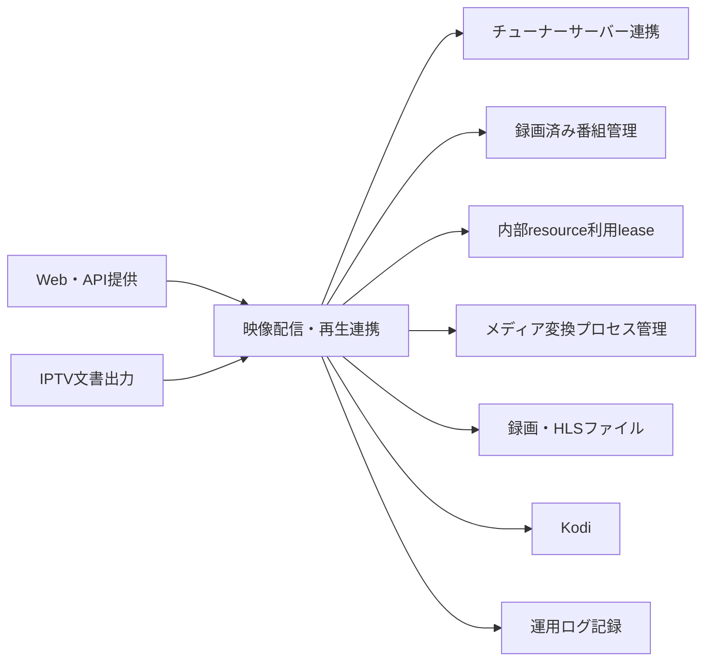
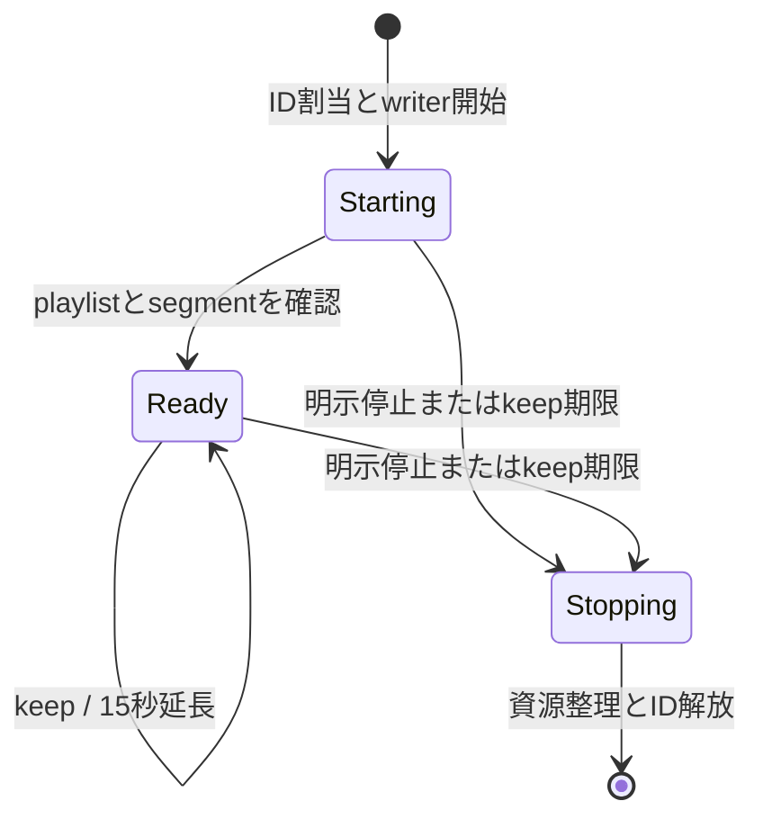
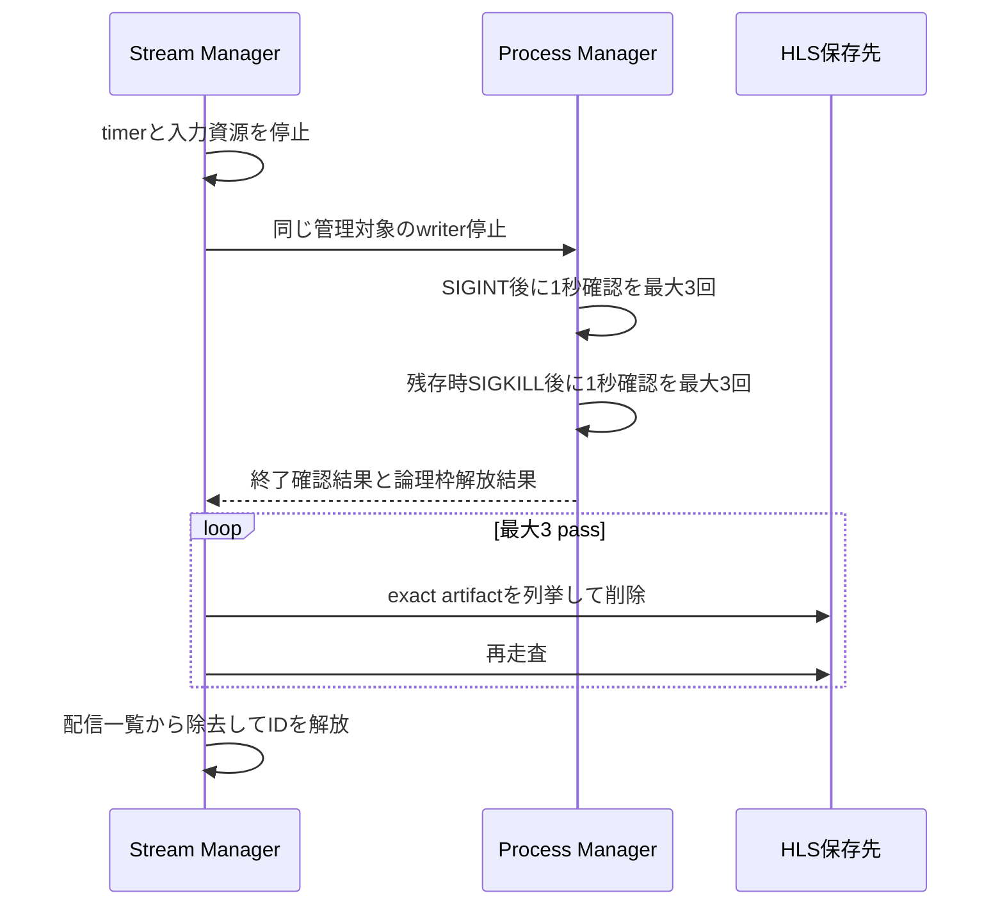

# 映像配信・再生連携機能 設計

## 1. 目的と責任境界

本機能は、ライブ放送と録画ファイルを直接または視聴用に変換して配信し、配信状態、継続要求、停止、HLS成果物、およびKodiへ
の再生依頼を管理する。

本機能は配信識別番号とHLS成果物を所有する。視聴用外部プロセスの論理実行枠は `server-media-process-management`、放送受信
は`server-tuner-access`、録画ファイルの再生用source解決は`server-recorded-content`が所有する。本機能は渡されたsourceを採
用して配信を開始・停止する。確立済みの映像本文を、接続確立用timeoutだけを理由に終了させない。容量削除候補向けに
は、activeな録画file resource利用だけをread-only snapshotとして提供し、live配信を含めない。



## 2. 機能構成

| 論理コンポーネント       | 役割                                             | 配置                        |
| ------------------------ | ------------------------------------------------ | --------------------------- |
| Stream Manager           | 配信識別番号、配信一覧、開始・停止・keepを管理   | `StreamManageModel`         |
| Live Stream              | 放送受信とM2TS/WebM/MP4/HLS変換を接続            | `LiveStreamBaseModel`       |
| Recorded Playback Source | 録画file・録画済み番組・実path・readerを解決する | Recorded Content provider   |
| Recorded Stream          | 解決済みsourceとWebM/MP4/HLS変換を接続           | `RecordedStreamBaseModel`   |
| Recorded Use Lease       | 録画file利用前の取得と配信terminal後の解放       | `RecordedDeliveryLeaseConsumer`（PM consumer port adapterの`RecordedDeliveryUsePort`を使用） |
| Recorded Use Snapshot    | activeな録画file resource利用IDのread-only投影   | `DeliveryRecordedUseSnapshotProvider`（Recorded Use Leaseの取得完了後にRecorded Delivery Lease Consumerが`ActiveRecordedDeliveryRegistry`を更新） |
| HLS Readiness Monitor    | 100msごとに親playlistと媒体成果物を確認          | `StreamBaseModel`           |
| HLS Artifact Index       | 起動時走査、識別番号予約、exact artifact選択     | `HLSFileDeleterModel`と`HlsStreamIdAllocator` |
| HLS Stop Coordinator     | writer停止、成果物削除、配信ID強制解放を順序化   | stream managerとbase model  |
| Kodi Client              | 録画URLを組み立て、設定済みKodiへ送信            | video API model             |

HLSは共通`streamFilePath`直下を使う。世代別directory、token、永続session registry、janitorは追加しない。

## 3. 配信データと内部interface

```ts
type StreamId = number; // 0..Number.MAX_SAFE_INTEGER
type StreamState = 'starting' | 'ready' | 'stopping';
type StopReason = 'start-failed' | 'start-timeout' | 'explicit-stop' | 'source-ended';
type ResourceDisposer = (reason: StopReason) => Promise<void> | void;

// StreamManageModel内部のclass。後始末関数を登録順に保持し、finalizeで一度だけ実行する。
class ResourceLeaseBundle {
    constructor(onError: (error: unknown) => void);
    adopt(disposer: ResourceDisposer): 'adopted' | 'stale';
    finalize(reason: StopReason): Promise<void>;
}

// 主な項目。ほかに開始結果のPromiseと開始前の準備処理を持つ。
interface ActiveStream {
    id: StreamId;
    state: StreamState;
    stream: IStreamBaseModel | null; // 録画配信ではsource採用後に設定する
    pendingInfo: LiveStreamInfo | RecordedStreamInfo | null; // stream設定前の配信情報
    resources: ResourceLeaseBundle;
    startTimer: NodeJS.Timeout | null;
    finalizePromise: Promise<void> | null;
    usesManagedId: boolean; // HLSなど、ディスク上の成果物と衝突しない識別番号が必要か
}

// 録画file配信の利用leaseはRecordedDeliveryLeaseConsumerが取得し、PM側のadapterが実体を持つ。
interface RecordedDeliveryUseLease {
    release(): Promise<void>;
}

interface RecordedDeliveryUsePort {
    acquire(recordedId: number, kind: 'delivery'): Promise<RecordedDeliveryUseLease>;
}

// `IRecordedPlaybackSourceProvider` と `RecordedPlaybackReader` はRecorded Contentが定義・所有する内部contractを再利用する。
// RecordedDeliveryLeaseConsumerは Pick<IRecordedPlaybackSourceProvider, 'resolveRecordedId' | 'open'> だけを使う。

type DeliveryRecordedUseSnapshot =
    | { readonly status: 'known'; readonly recordedIds: ReadonlySet<number> }
    | { readonly status: 'unknown' };

class DeliveryRecordedUseSnapshotProvider {
    getActiveRecordedFileDeliveryIds(): DeliveryRecordedUseSnapshot;
}

// HLSFileDeleterModelがIHLSFileDeleterModel（setOption・deleteAllFiles）の宣言の外で公開する走査・列挙。
// HlsStreamIdAllocatorはこれをArtifactIndexとして受け取る。
interface ArtifactIndex extends IHLSFileDeleterModel {
    scanAtStartup(streamFilePath: string): Promise<ReadonlySet<StreamId>>;
    scanCurrent(streamFilePath: string): Promise<ReadonlySet<StreamId>>;
    listExact(streamFilePath: string, streamId: StreamId): Promise<string[]>;
}

// IEncodeProcessManageModel（メディア変換プロセス管理機能）のうち、配信が使う開始・停止
interface IEncodeProcessManageModel {
    createManaged(option: CreateProcessOption): Promise<{ child: ChildProcess; handle: ManagedProcessHandle }>;
    createHlsWriter(option: CreateProcessOption): Promise<{ child: ChildProcess; handle: HlsWriterHandle }>;
    requestStop(handle: ManagedProcessHandle): Promise<
        | { status: 'requested'; sentSignals: ['SIGINT'] }
        | { status: 'already-released'; sentSignals: [] }
    >;
    stopHls(handle: HlsWriterHandle): Promise<{
        exitConfirmed: boolean;
        sentSignals: Array<'SIGINT' | 'SIGKILL'>;
        slotReleased: true;
    }>;
}
```

`ManagedProcessHandle`とそのHLS用subtypeである`HlsWriterHandle`は、メディア変換プロセス管理機能が開始ごとに返す内部専用
の停止用取っ手である。取っ手は一回の起動だけを識別するobject tokenを内包するが、配信機能は中身を解釈せず、公開pathや
stream IDから再構成しない。配信機能はpipeに使うchildとは別に取っ手を保持し、停止時はchildへ直接signalを送らない。非HLS変
換は`IEncodeProcessManageModel.requestStop(handle)`、HLS writerは`IEncodeProcessManageModel.stopHls(handle)`を使う。
process group、object token、opaque handleの定義は`server-media-process-management`に従う。これらをclientへ公開せず、
親playlistの`./streamfiles/stream{streamId}.m3u8`を変更しない。

`StreamManageModel.streams`、停止中ID、起動時成果物ID、走査で確認した成果物ID、およびallocation cursorをメモリー内で保持する。再起動
前の配信状態は復元しない。

`ResourceLeaseBundle`は`StreamManageModel`内部だけの型であり、API、IPC、公開playlistへ露出しない。tuner stream、file
reader、Readable、readiness・keep timer、listener、process handleは各streamの実装（`LiveStreamBaseModel`、
`RecordedStreamBaseModel`、`StreamBaseModel`）が所有する。各ActiveStreamは`ResourceLeaseBundle`を一つだけ持ち、その終端契約
は次のとおりである。

1. bundleへ登録するのは後始末関数（`ResourceDisposer`）である。`StreamManageModel`は開始期限timerの解除と、紐付けたstream
   の`stop()`を登録する。
2. `finalize()`は最初の停止理由で一つのPromiseを作り、重複するclose、timeout、stop、terminal eventは同じPromiseへjoinす
   る。登録済みの後始末を登録順に一回ずつ実行し、個別のthrowまたはrejectは診断へ記録して残りの実行を続ける。HLS成果物整
   理とID解放は本書8の順序を続ける。
3. `finalize()`が始まった後の`adopt()`は登録せず`stale`を返す。
4. streamの`stop()`は、timer取消、listener除去、Readableのunpipe・destroy、tuner stream・file reader停止、保存済みprocess
   handleの停止要求を行う。
5. timeoutまたは停止が先着した後に遅れて得た資源（録画source、生成したstream候補、tuner stream、process、HLS writer）は、
   得た側がその場で停止またはcloseし、pipe、一覧、通知へ渡さない。録画sourceは`disposeBeforeAdoption()`とleaseの解放で、
   stream候補は`stop()`で整理する。cleanup失敗は診断へ記録する。
6. 録画file配信の利用lease（`RecordedDeliveryUseLease`）は、直接応答のfile reader、変換process、または録画HLS writerがsourceを利用しなくなっ
   た後にexact tokenを一回releaseする。releaseの送信・応答失敗は記録して配信の既確定結果を巻き戻さず、parent側が同じ
   recorded IDの容量不足削除を安全側に遮断する。ライブ配信はこのleaseを取得しない。

`DeliveryRecordedUseSnapshotProvider`は、Recorded Delivery Lease Consumerが更新する`ActiveRecordedDeliveryRegistry`から、
resource利用leaseの取得が完了した時点からexact releaseが完了するまでのactive録画file配信をread-onlyで列挙し、recorded IDを
重複除去して返す。直接配信、録画変換配信、録画HLSを含み、ライブ直接配信・ライブ変換・ライブHLSとKodi要求そのものは含めない。列挙は
start、stop、keep、finalize、lease状態を変更せず、配信終了を待たない。active registryからrecorded IDを安全に列挙でき
ない場合は部分集合または空集合を返さず`unknown`とする。snapshot後の開始・終了を拘束せず、権威的な削除直前lease gateを置
換しない。

開始処理は次の所有権境界を持つ。

1. Stream Managerの同期境界内で未使用IDを選び、`starting`の`ActiveStream` objectを一覧へ予約する。
2. 一覧更新後は同期境界を直ちに解放し、DB、file、チューナー、processなどの外部I/Oを境界外で開始する。他のstart、stop、
   keep、一覧取得を外部I/Oの完了まで待たせない。
3. 開始結果を反映するときは、同じIDだけでなく一覧内のobject identityと`starting`状態が一致することを確認する。非HLSは
   HTTP本文へ接続できた時点で同じobjectを`ready`へ進める。HLSはwriter handleを保存して30秒開始期限を終了させても
   `starting`のままreadiness monitorへ渡し、本書7の条件を満たした時点だけ`ready`へ進める。
4. 30秒期限が先着した場合は、同じobjectを一回だけ`starting`から`stopping`へ移して開始要求を失敗させ、取得済み資源と後着
   資源の停止を開始する。
5. `stopping`のIDは、資源とHLS成果物のcleanup完了、または本書8の強制解放まで再利用しない。
6. 期限後にDB結果、file reader、チューナーstream、process、HLS writerが得られた場合は、object identityと開始要求の有効
   性を照合する。無効な開始要求へのDB結果は破棄し、遅れて得たresourceは得た側が停止またはcloseする。再利用済みIDや別
   objectの状態・通知へ作用させない。

配信開始とKodi通信には次の内部定数を用い、公開設定、API、IPCへ追加しない。

| 定数                              | 値       | 起算点と完了点                                                                         |
| --------------------------------- | -------- | -------------------------------------------------------------------------------------- |
| `MEDIA_DELIVERY_START_TIMEOUT_MS` | 30,000ms | 入力検証後に開始処理を受け付けてから、HTTP本文またはHLS writer入力へ接続できる状態まで |
| `KODI_REQUEST_TIMEOUT_MS`         | 30,000ms | Kodiへの一回のHTTP要求を開始する直前から、応答本文の受信・解釈完了まで                 |

### 3.1 視聴用変換コマンド

選択した配信方法に`cmd`がなければ視聴用変換processを開始しない。`cmd`がある場合は引用符やshell構文を解釈せず、半角空白で
実行ファイルと引数へ分ける。親processの環境変数をそのまま継承し、録画ファイル変換機能が使う追加環境変数は付与しない。

置換規則は次のとおりである。

| 記法              | 適用位置                      | 値                                                       |
| ----------------- | ----------------------------- | -------------------------------------------------------- |
| `%FFMPEG%`        | 分割前のcommand全体           | 設定されたffmpeg path                                    |
| `%streamFileDir%` | HLSだけ、分割前のcommand全体  | 設定されたHLS保存先                                      |
| `%streamNum%`     | HLSだけ、分割前のcommand全体  | 配信識別番号の10進文字列                                 |
| `%SS%`            | 録画配信、分割前のcommand全体 | 録画元種類がTSなら空文字、それ以外は再生位置の10進文字列 |
| `%NODE%`          | 実行ファイル                  | サーバーを起動したNode.js実行ファイル                    |
| `%ROOT%`          | 各引数                        | サーバーのroot path                                      |
| `%SPACE%`         | 各引数                        | 半角空白                                                 |
| `%INPUT%`         | 各引数、入力値がある場合だけ  | 録画終了済みfile配信では入力fileのfull path              |
| `%OUTPUT%`        | 各引数、出力値がある場合だけ  | HLSでは`{streamFilePath}/stream{streamId}.m3u8`          |

ライブ配信の入力値は`null`であり、放送streamをprocessのstdinへ接続する。録画中fileの配信も入力値は`null`であり、追尾
readerをstdinへ接続する。非HLSの出力値は`null`である。値が`null`の`%INPUT%`または`%OUTPUT%`と、HLS以外の
`%streamFileDir%`・`%streamNum%`、ライブ配信の`%SS%`は置換せずcommand内に残す。

## 4. ライブ放送配信

1. チャンネル、形式、画質を検証する。
2. M2TSで変換方法がなければチューナーサーバーのstreamをHTTP応答へ接続する。
3. WebM、MP4、HLS、または変換指定M2TSでは共有メディア変換枠を取得し、放送streamを変換processへ接続する。
4. 放送受信要求、変換process、およびHTTP streamの確立を一つの30秒開始期限で監督する。
5. 途中で失敗した場合は開始済みの放送受信と変換をbest-effortで停止し、開始失敗を返す。
6. 接続確立後は総時間・無通信時間だけで配信本文を打ち切らず、接続終了または配信固有の終了条件で停止する。

ライブM2TS用playlistは、外部アプリが同じ配信URLを開ける形式で生成する。

開始期限の「確立」は、放送受信のReadable streamと、必要な場合は変換processの入出力をHTTP本文へ接続できる状態を指す。期限
はMirakurun/mirakcとの接続確立までにだけ適用し、接続後に継続して届く放送本文へは適用しない。HLSではwriterの開始受付と
opaque handleの保存に加え、放送streamをwriterのstdinへ接続するまでを対象とし、playlistやsegmentの生成待ちは含めない。期
限後に放送受信またはprocess開始が遅れて成功した場合は、その結果を応答や配信一覧へ採用せず、遅れて得た資源の停止を
best-effortで試みる。

### 4.1 視聴用変換commandの読み取り速度制御と、encode processの入出力異常の記録

`config/config.yml.template`のライブ配信視聴用変換command（`stream.live.ts`の`m2ts`・`webm`・`mp4`・`hls`）は既定で`-re`
（入力を実時間速度で読む指定）を持たない。放送streamはチューナーから既に実時間で届くため、`-re`による追加の読み取り速度
制御は不要である。`m2tsll`（低遅延M2TS）と録画配信の視聴用変換command（`stream.recorded`配下）も`-re`を持たない。

`-re`を使わない理由はffmpeg 8.0以降の挙動である。ffmpeg 8.0は`readrate_catchup`（`-re`使用時は既定で有効、通常再生より
5%速く追いつく）により、取り込む全ストリームの遅延（期待PTSと実PTSの差）を追跡し、遅延が最大のstreamに合わせて入力全体
の読み取りを絞る。ライブHLS配信が`-map 0`で取り込むTSのPID（`arib-subtitle-timedmetadater`が挿入するtimed_id3や、
epg・bin_dataのような他のデータPID）はPTSが進行しないため、この遅延が際限なく増加し、demux全体を絞ってHLSのsegment生成
が遅延したり、encode processが終了コード255で異常終了して配信が停止する場合がある（この遅延はffmpeg 8.0系で起き、
7.1以前は同一入力でlag 0になる）。ライブ配信の既定commandが`-re`を持たないことで、この経路を避ける。

`LiveStreamBaseModel.startStreamProcess`は、放送streamをencode processの`stdin`へ接続する前に、その`stdin`へ
session専属の`'error'`listenerを登録する。書き込み中にencode processが既に終了しているなどで`stdin`が`error`を発行し
ても、uncaughtExceptionにはせずstream用ログへ記録するだけに留め、既存の停止経路（encode processの`'exit'`/`'error'`に
よる`emitExitForSession`）は変更しない。

同じ`startStreamProcess`は、encode processの`'exit'`イベントが持つ終了code/signalもstream用ログへ記録する。session
がまだ`canSessionAdopt`な状態（`stop()`や世代交代で無効化されていない）のまま終了した場合は、`stop()`を経由しない予期し
ない終了として警告levelで記録し、session側が既に無効化されている場合は通常levelで記録する。このログ記録はstream停止・
資源解放の経路そのものを変更しない。

## 5. 録画ファイル配信

`RecordedStreamBaseModel`は、`StreamManageModel.startRecorded()`が採用した`RecordedPlaybackSource`を
`adoptPlaybackSource(source, release)`で受け取り、sourceの`inputPath`・`videoInfo`・`playPosition`・`reader`を使う。
`encoded-direct`はpathをprocess入力へ渡し、reader variantはreaderをstdinへ接続する。

直接再生・downloadでは録画済み番組管理機能が解決したsourceを開き、視聴用変換では同sourceをWebM、MP4、または
HLSへ渡す。直接再生・downloadの再生位置は常に0であり、動画情報にビットレートが無い録画ファイルでも、sourceを開く手順を
失敗させず、Range指定つきの取得を含めて録画ファイルの中身をそのまま返す。視聴用変換も再生位置0なら同様に開始する。再生位
置が0を超え、ビットレートが無くて録画済み番組管理機能が`RecordedPlaybackStartPositionUnavailable`で失敗した場合は、他の配
信開始失敗と同じく例外の理由を保ったまま呼び出し側へ伝え、公開APIの応答も既存の開始失敗と同じ形式（サーバーエラー、メッセ
ージが理由の名前）とする。4xxなど新しい応答形式は追加しない。開始位置は動画時間内だけ受け付ける。

録画中fileの追尾readerはRecorded Content providerの`RecordingTailReadable`であり、EOFで1秒後にsizeを再確認して、増えていれ
ば追記位置から読み続け、不変ならreaderを終了し、現在の読取位置より縮小していれば先頭から読み直す。readerのdestroyでは末
尾確認timerを取り消し、開いたfile handleを閉じる。これはreader内部の資源回収であり、公開API、IPC、DB、設定、HLS公開
path、ログ契約を変更しない。`RecordedStreamBaseModel`がsourceを受け取らずに自身でDBから解決する経路では、`src/lib/TailStream.ts`の
追尾readerを使う。

開始時は`recordedPlaybackSource.resolveRecordedId(videoFileId)`だけを呼び、recorded IDを得るまでsourceを開かない。この予
備照会はRecorded Content providerが所有し、本機能はDBを直接読まない。recorded IDを得た後、
`RecordedDeliveryUsePort.acquire(recordedId, 'delivery')`を一回awaitする。取得失敗、状態不明、またはPMの通常5秒期限超過
では再照会、source取得、変換process、HTTP本文を開始しない。

lease取得後に同じproviderの`open(videoFileId, recordedId, playPosition, option)`を呼ぶ。録画ファイルの直接配信（
`acquireRecordedDelivery`）は動画情報を使わないため、`option.allowMissingVideoInfo`を`true`にして動画情報の取得失敗を許し、
視聴用変換は指定しない。providerはvideo file/recorded対応、動画
情報、実path、readerを再読取し、既存再生要求の`playPosition`を解決済みsourceへ保持する。対応消失・変更または対象なしなら
sourceを返さず失敗する。したがって、lease取得前に得たrecorded IDと一致しないsourceを採用しない。返った
`OpenedRecordedPlaybackSource`はprovider所有であり、本機能が開始coordinatorへ採用できると確定した時点でだけ`adopt()`す
る。`adopt()`が`stale`ならsource、process、HTTP本文を各0件にする。採用前の失敗、期限超過、またはlate resultはprovider
の`disposeBeforeAdoption()`で整理し、採用後は本機能が一意に整理する。disposeとadoptが競合しても先着した一回だけを採用す
る。`encoded-direct`ではpathだけをprocess入力へ渡し、 `fileReader` resourceは作らない。reader variantだけをresource
bundleへ採用してcloseする。配信機能はprovider失敗時にDB、path、動画情報を直接再照会するfallbackを持たない。これにより予
備照会とlease取得の間に容量不足削除が先着しても、削除済みsnapshotをsource利用へ使わない。

採用後のRecorded Stream consumerはsourceの`playPosition`だけを既存の再生位置選択、再生時間確認、および`%SS%`置換へ渡す。
再生位置をDB、実path、動画情報から再解決するconsumer側fallbackは持たない。

録画済み番組管理機能によるsource解決と必要な変換の確立は、一件の30秒開始期限で監督する。期限は入力検証後からHTTP本文へ接
続できる状態、またはopaque handleを保存してfile readerをHLS writerのstdinへ接続するまでを覆い、配信本文の寿命、HLS準備確
認、録画中fileの追尾には適用しない。期限後に完了したprovider結果や開始結果は応答へ採用せず、遅れて得たfile readerまたは
processの停止をbest-effortで試みる。PMの5秒lease期限はこの30秒開始期限の内側で動作し、どちらかが先着した後のlate granted
を配信開始へ採用しない。PM adapterがlate leaseをbest-effortで解放する。

直接再生・downloadではresponse/file readerがterminalとなるまで、変換配信ではprocessが録画fileを使用しなくなるterminalま
で、録画HLSではwriter停止finalizerまでleaseを保持する。HTTP close、明示停止、keep期限、開始失敗、30秒期限、file追尾終
了、process異常を含む全経路でexact leaseを一回解放する。release失敗は記録して配信の既確定結果を変更せず、同じrecorded ID
の容量不足削除を未確認のまま遮断する。Kodi再生要求はfileを直接開かないためleaseを取得せず、Kodiが開く録画配信routeで取得
する。

### 5.5 動画情報取得（ffprobe）の内部実装

`RecordedStreamBaseModel.getVideoInfo()`は録画済み番組管理機能が持つ共有のprobe
`VideoUtil.getInfo()`（`src/model/api/video/VideoUtil.ts`、`server-recorded-content`の5.7で規定）へ委譲する。
共有側はffprobeを`child_process.execFile()`とargv配列で起動し、30秒のdeadlineを過ぎたらSIGKILLへ
escalateして3秒のstop graceで終了を確認する。

ここでffprobeを自前で起動してはならない。理由は2つある。

1つ目は保護である。`getVideoInfo()`は`setOption()`の中でawaitされる。ffprobeが終了しない状況
（壊れたfile、書き込み途中の録画、停止したstorage）でdeadlineを持たないと、このawaitが永久に返らない。
配信開始の要求が応答を返さないまま残り、ffprobeのchild processも生き続け、`setOption()`が返らないため
そのstreamの後始末も走らない。共有側へ委譲することでdeadlineとSIGKILLがこの経路にも効く。

2つ目はshellを経由しないことである。録画fileの名前はEPGの番組名から作られ、
`StrUtil.replaceFileName()`（`src/util/StrUtil.ts`）は`"`を全角へ置き換えるが`$`とbacktickは残す。
そのため番組名に`$(...)`や`` `...` ``を含む番組を録画すると、その文字列が保存pathに残る。shell command
文字列へ差し込むと二重引用符の内側でもshellがcommand置換を行うため、その番組を配信した時点で任意の
commandが実行される。argv配列で渡す共有側の実装はこの経路を持たない。

委譲していること、shell metacharacterを含むpathがそのまま共有側へ渡ること、本機能がffprobeのchild
processを自前で起動しないことは
`test/server/media-delivery/recorded-stream-getvideoinfo.imp.test.ts`が固定する。deadlineとSIGKILLの
contract自体は`test/server/recorded-content/probe.spec.test.ts`が固定する。

## 6. HLS識別番号と公開path

### 6.1 起動時走査

HLS保存先の初期化では、`streamFilePath`が存在しなければ作成し、read/write accessを確認してから走査する。ファイル名の先頭
が`stream`、続いて10進整数、その直後が数字ではないHLS成果物からIDを抽出し、`startupArtifactIds`へ予約する。見つけたファ
イルは自動削除しない。

サーバー起動時の初期化に失敗した場合はerrorを記録してHLSを未初期化とするが、非HLS配信と他機能の起動は続ける。HLS開始要求
ごとに保存先の作成、access確認、走査を再試行し、成功して残存IDを予約できるまで当該HLS開始だけを失敗させる。

### 6.2 採番

1. ID予約用の同期境界へ入る前にHLS保存先を非同期走査し、成果物IDのsnapshotを得る。走査中はstart、stop、keep、一覧取得の
   同期境界を保持しない。
2. 同期境界内で`allocationCursor`から調査を始め、snapshot、`StreamManageModel.streams`、停止中ID、`startupArtifactIds`、および走査で
   確認済みの成果物IDに含まれない候補を選ぶ。同じ境界で`starting` objectとして予約してcursorを進めるため、同じsnapshotを
   使った並行startも同じIDを予約しない。
3. 候補が`Number.MAX_SAFE_INTEGER`なら次を0とし、それ以外は1を加える。
4. 同期境界を抜けた後、writerなどの外部資源を開始する前に、予約したIDのexact artifactを非同期で再確認する。成果物が見つ
   かった場合は同じobject identityを確認して予約を解除し、そのIDを確認済み成果物IDへ加えて次候補を1からやり直す。
5. cleanupで成果物なしを確認できたIDは確認済み成果物IDから除ける。成果物残存または走査不能のIDは論理的な配信IDを強制解放
   しても確認済み成果物IDへ残し、後の成功した走査で成果物なしを確認してから採番候補へ戻す。
6. 強制解放時もcursorを解放IDの次へ進め、同じIDを直後の第一候補にしない。
7. wrap後も使用中候補を飛ばす。利用可能なIDがない間は重複IDを割り当てず、解放後に再び採番できる。

保存先走査、同期予約、予約後のexact再確認の間に外部I/Oを保持したlockは置かない。固定された公開pathのため、強制解放後も終
了未確認processが成果物を新たに生成する競合を完全には排除できない。各採番前snapshotとwriter開始前のexact再確認で検出し、
検出したIDを使用せず次候補へ進む。late callbackとlate resultのidentity guardは、管理対象objectへの状態反映、通知、二重解
放を防ぐものであり、終了未確認の外部processが固定pathへ書き続けること自体は防止しない。強制解放後もcursorは解放IDを直後
の第一候補にせず、走査時点で観測した成果物IDを飛ばすが、exact再確認後に外部processが書き込む残余競合は残る。この残余は終
了未確認processと成果物として診断し、process終了までのID隔離や別のstaging pathを追加せず、サービス継続を優先して論理IDを
強制解放する本設計のサービス継続性契約の範囲として扱う。

HLS開始APIは準備完了を待たずIDを返す。親playlistは `{streamFilePath}/stream{streamId}.m3u8`、利用者向けpathは
`./streamfiles/stream{streamId}.m3u8`である。`/streamfiles`のstatic routeとこのpathを変更しない。

## 7. HLSの準備、継続、終了



準備中は100ms間隔で、親playlistと、拡張子が`.m3u8`でも`.vtt`でもない媒体成果物が2件以上あることを確認する。親playlistは
`stream{id}.m3u8`へ完全一致させ、媒体成果物も`stream{id}`の直後が数字ではないものだけを同じ
`HLSFileDeleterModel.listExact()`で選ぶ。したがって`stream1`のready判定へ`stream10`のsegmentを数えない。この二条件を満たし
た時点でreadyとする。子playlistと字幕playlistはreadyの必須条件ではなく、字幕playlistが利用できる場合だけ親playlistへ字幕
情報を反映する。準備確認自体に全体deadlineは設けず、明示停止、15秒のkeep期限、または配信側終了条件まで続ける。

ライブHLSは変換または放送受信の終了で停止する。録画HLSはファイル生成終了後も、明示停止またはkeep途絶まで配信情報と生成済
み成果物を保持する。存在しないstreamのstopは成功扱い、存在しないstreamのkeepは失敗とする。状態変化は関係機能へ通知する。
全配信停止は要求受付時点の管理中一覧を走査し、一件ずつ停止を要求する。直接接続のcloseはその接続に対応する配信を停止す
る。

## 8. HLS停止と成果物削除



停止順序は次のとおりである。

1. readiness timerとkeep timerを止め、放送受信またはファイル読取を停止する。
2. writer開始時に保存したopaque handleがあれば、そのhandleでprocess managerの`stopHls()`へ停止を依頼する。stream IDや
   pipe用childから停止対象を引き直さず、childへ直接signalを送らない。停止依頼がthrow・rejectした場合は記録して、成果物の
   整理へ進む。
3. process managerは`SIGINT`一回、1秒確認を最大3回、残存時`SIGKILL`一回、1秒確認を最大3回行い、論理枠を一回解放する。
4. `streamFilePath`を走査し、対象IDだけの成果物を削除して再走査する処理を最大3 pass行う。走査、exact列挙、個別削除、再走
   査の各失敗はそのpassへ記録し、安全に実行できる次のpassまたは終端処理へ進む。
5. 一回だけ実行されるHLS停止finalizerで、writer停止結果、成果物の列挙・削除・再走査結果、および成果物残存の確認可否にか
   かわらず、配信一覧から対象を除き、配信IDを強制解放する。

最大3 passは、走査、exact列挙、個別削除、および再走査がthrowするか返したPromiseがresolveまたはrejectした場合の試行回数を
制限するものであり、filesystem操作のwall-clock期限ではない。同期throwまたはrejectは記録して、実行可能な次の操作または
passへ進む。一方、filesystem adapterが返したPromiseがsettleしない場合にcancelする契約や新しいdeadlineは承認されておら
ず、現設計はその待機からfinalizerへ到達するwall-clock有限性を保証しない。未解決操作へtimeoutだけを追加すると、cancelされ
ない遅延削除が強制解放・再利用後の固定pathを変更し得るため、新しいcancel契約、期限、または設定値を導入するには
Requirementsを先に改訂する必要がある。この未解決Promiseは残余リスクとして記録し、cancelと期限は本機能の契約に含めない。
process managerの`SIGINT`・`SIGKILL`と各終了確認には、これと区別して承認済みの固定された有限回・有限間隔を維持する。

成果物の選択ではID境界を検査する。親は`stream{id}.m3u8`に完全一致させ、その他は`stream{id}`の直後が数字でないものだけを
対象にする。したがって`stream1`の削除は`stream10`へ一致しない。

個別削除失敗はfile名、ID、pass、errorを記録する。走査、exact列挙、または再走査の失敗はID、pass、操作、errorを記録し、成
果物状態を未確認とする。writer終了未確認の場合、process managerはPID、PGID、処理種別、signal、確認結果、論理枠の強制解放
を記録する。配信機能はその停止結果を受け、ID、配信種別、削除結果または確認不能、ID強制解放を記録する。残存fileも同様に記
録する。これらの記録処理自体が失敗しても停止finalizerを妨げない。強制解放後の遅延eventには対象object identityと状態を照
合し、新しい配信、再利用ID、実行枠、通知へ作用させない。このguardは管理下のcallbackや削除結果が別objectへ作用することを
防ぐが、終了未確認の外部processによる固定pathへの新規書込みを防ぐとは主張しない。

## 9. 非HLS停止とKodi

非HLSライブ停止では放送受信と視聴用変換、録画配信停止ではファイル読取と視聴用変換をbest-effortで停止し、配信一覧から除去
する。視聴用変換は保存済み`ManagedProcessHandle`でprocess managerへ停止を依頼し、優先度入れ替えが同じ対象の停止を開始済
みなら同じ`requestStop()` operationへjoinする。この要求はsignal送信要求までで完了し、processのterminalを応答条件にしな
い。

Kodi再生では、設定済み送信先と録画ファイルを確認し、要求の通信方式・hostから録画file URLを構成する。Kodiのbasic認証情報
はKodiとの通信だけに使用し、録画file URLへ埋め込まない。一回のKodi HTTP要求を開始する直前から応答本文の受信・解釈完了ま
でを30秒期限で監督する。期限後の応答を成功へ変更せず、別のKodi要求へ転用しない。

## 10. 再起動とテスト設計

再起動時に`StreamManageModel.streams`、準備状態、keep期限を復元しない。起動時走査で残存成果物IDだけを予約してから新規配信を受け付け
る。サーバー全体終了時に全配信の回収完了まで待つ新しい専用経路は追加しない。

### 10.1 機能固有test配置

共有test root、runner、固定command、coverage基盤は`server-application-runtime` Requirement 9を利用する。
本機能のtestは`test/server/media-delivery/`にあり、次の表は主なfileと責務を示す。

| file                                                                | 所有する責務                                                                         |
| ------------------------------------------------------------------- | ------------------------------------------------------------------------------------ |
| `live-delivery.spec.test.ts`、`recorded-delivery.spec.test.ts`      | ライブと録画の直接・変換・HLS配信、stream確立・引渡し・終了                          |
| `hls-lifecycle.spec.test.ts`、`direct-stop.spec.test.ts`            | HLSの採番・準備・継続・停止・成果物整理、非HLS停止                                   |
| `kodi.spec.test.ts`、`restart.spec.test.ts`、`command.spec.test.ts` | 外部プレーヤー、再起動、視聴用commandの外部契約                                      |
| `live-delivery.test.ts`、`recorded-delivery.test.ts`                | Readable所有権、開始期限、録画file追尾、終了条件の内部分岐                           |
| `hls-lifecycle.test.ts`、`command.test.ts`                          | ID、exact artifact、timer、finalizer、placeholderの内部分岐                          |
| `media-delivery-http.integration.test.ts`                           | 公開HTTPのライブ・録画本文、一覧・keep・stop、playlist、Kodi要求                     |
| `media-delivery-filesystem.integration.test.ts`                     | temporary filesystem上の録画file読取とHLS走査・生成・削除                            |
| `doubles-parity.integration.test.ts`                                | 偽物の部品と本物の一致: Kodi への送信を本物の axios と手作りの Kodi（実 HTTP）で、動画の種類の判定を本物の `file-type` と本物の ffmpeg で作った合成の TS・MP4 で、live HLS を同梱の設定の command と本物の ffmpeg で流す（playlist と segment の生成、停止後の削除） |
| `media-delivery-process.integration.test.ts`                        | isolated child processとprocess manager portの開始・二段階停止・終了確認             |
| `media-delivery-tuner.integration.test.ts`                          | tuner access portからのReadable確立・引渡し・close・late result                      |
| `media-delivery-recorded-content.integration.test.ts`               | recorded-content playback source、PM resource lease、source引渡し、失敗・late result |

上の表に無い補助test（canonical ACとmatrix行を増やさない）として、`api-util`・`stream-api-keep-stopall`・
`recorded-delivery-lease-consumer`・`recorded-delivery-snapshot-provider`・`recorded-playback-source-consumer`の各
`.spec.test.ts`、`recorded-use-snapshot.test.ts`、`*.imp.test.ts`（資源回収・race・失敗分岐の個別case）、および
`recorded-delivery-lease`・`recorded-playback-source`の各`.integration.test.ts`がある。

仕様testは必ず`*.spec.test.ts`、内部algorithm・分岐testは`*.test.ts`、外部境界testは `*.integration.test.ts`とする。HTTP
carrier、tuner access、recorded-content、process managerの内部実装を本機能へ複製せず、本機能が所有する要求・応
答・Readable・handle・cleanupの接続結果を各ownerのharnessで検証する。

### 10.2 test層、外部境界、資源所有権

-   `unittest/spec`はRequirements 1から9の全83 ACだけを、利用者または関係機能から観測できる入力、応答、stream、状態、通
    知、停止、成果物、診断として一件ずつ検証する。
-   R10.1の83 ACはRequirements 1から9の仕様test件数であり、R10.3の88行matrixは本書10.4である。いずれも機能の仕様test件
    数へ加えない。
-   `unittest/imp`は再生位置、ID reservation・cursor・wrap・reuse、exact artifact集合、公開path生成、readiness、timeout
    race、process停止段階、cleanup finalizer・latch、Readable所有権、placeholderを検証する。R10.2の証拠は10.1に記載した4
    imp fileの具体的な実行結果であり、仕様testで代替しない。
-   `integration`はHTTP、temporary filesystem、isolated child process、tuner access port、およびrecorded-content portを
    接続する。R10.4の証拠は10.1に記載した5 integration fileの具体的な実行結果である。DBはrecorded-content ownerが提供す
    る照会結果の接続だけを対象とし、本機能はDB transaction、schema、直接queryを所有しない。公開業務IPCは非適用である。
    capacity deletionとの排他に使うPM内部resource-control carrierだけはrecorded-content integration fileで接続し、新しい
    公開operationまたはdomain serialization契約として扱わない。
-   R10.5の品質判定は10.5に従う。本機能のtestはcoverageを判定しない。
-   ライブReadableはtuner accessから受領後に本機能へ所有権が移り、直接配信ではHTTP本文、変換配信ではprocess stdinへ一回
    だけ引き渡す。録画Readableもfile open後に同じ規則で引き渡す。確立失敗、close、明示停止、timeout、late resultの各経路
    でownerを一意にし、destroy・unpipe・listener・timer・handle releaseの対象identityと回数をassertする。
-   録画配信は予備照会→delivery lease取得→同じvideo/recorded対応の再照会→file openの順をcall ledgerで固定する。直接、変
    換、HLS、追尾、close、開始期限、late granted、peer置換を組み合わせ、lease未取得時のfile/process開始0、全terminalで
    exact release一回、release未確認時のcapacity deletion blockをassertする。ライブとKodi依頼のlease取得は0件とする。
-   supporting `recorded-use-snapshot.test.ts`はactiveな直接・変換・HLS録画file配信のrecorded IDだけを重複除去して返し、
    live、Kodi要求、終了済み配信を含めないことを確認する。registry/ID対応を列挙不能なら部分集合でなく`unknown`を返し、
    start/stop/keep/finalize/lease操作を各0回とする。canonical ACとmatrix行は増やさない。
-   HLS停止では公開pathを変えず、保存済みopaque handleだけで同じprocess groupを停止する。filesystem操作がthrow、
    resolve、またはrejectする経路では、exact artifact全件への削除試行、診断、finalizer一回、一覧除去、ID強制解放まで進め
    る。IDは成果物なしを確認するまで採番候補へ戻さず、終了未確認processからのlate eventを新しいobjectへ適用しない。
    settleしないfilesystem操作は本書8の残余リスクであり、wall-clock有限なcleanupとは扱わない。

外部境界の適用分類は次のとおりである。

| 境界             | 分類                 | 理由・検証                                                                                                                    |
| ---------------- | -------------------- | ----------------------------------------------------------------------------------------------------------------------------- |
| HTTP             | 直接境界             | live・recorded本文、playlist、一覧、keep、stop、Kodiのcarrier接続と切断時cleanupを検証する                                    |
| filesystem       | 直接境界             | 録画fileのopen・追尾、HLS保存先の準備・exact走査・生成・削除・残存をtemporary directoryで検証する                             |
| child process    | 直接境界             | 視聴用processの開始、stdin/stdout引渡し、opaque handle停止、HLSの二段階停止結果を接続する                                     |
| tuner            | owner port境界       | `server-tuner-access`のReadable handleを受け、HTTPまたはprocessへ一回だけ引き渡して停止する                                   |
| recorded-content | owner port境界       | 番組・file・動画情報・実pathの照会結果だけを受け、DBの意味とtransactionはownerへ委ねる                                        |
| DB               | 間接適用             | recorded-content結合harnessを介した照会成功・対象なし・失敗・late resultだけを検証し、直接DB testは行わない                   |
| IPC              | 業務非適用／内部補助 | 公開業務IPCは追加しない。recorded resource leaseのgeneration/request identityと通常5秒carrierだけをPM owner harnessで接続する |

### 10.3 Matrix記法

入力列は`[null, 空, 0, 1, 最小, 最大, 範囲外, 不正型, 重複]`の順で、`T`は主test、`C`はHTTP等のcarrier検証、 `N`は値入力
がないか承認済み上限がないため非適用、`S`は状態、`R`は時間・raceで検証する。`N×9`も空欄ではなく、triggerまたは状態だけを
入力とする理由付き非適用である。不正型を受けない内部TypeScript interfaceではcompile時型検証とcarrier validationへ委
ね、castで未承認のruntime validationを創作しない。

状態は`L`=ライブ開始前・確立中・引渡し済み・停止中・停止済み、`R`=録画照会前・file open・引渡し済み・追尾中・停止済み、
`H`=未予約・starting・ready・stopping・released・restart、`P`=process未開始・running・stopping・terminal未確認・released
を表す。時間・raceは`期`=期限直前・到達・超過・late settlement、`同`=同着、`順`=順序、`無`=時間契約なしである。

証跡列は、行の主testを実行する固定commandの種類を示す。`spec`・`imp`・`integration`は
`npm run test:server:<種類> -- test/server/media-delivery/<file>`で、`<file>`は主test列のfile（MD-10.1・10.2・10.4は
`media-delivery`directory、または10.1の該当file）である。`coverage`は`npm run test:server:coverage`（C0・C1は
`server-application-runtime` Requirement 9）、`review`は本表自体のレビューでcommandを持たない。種別に`I`・`G`を含む行の補助境界は、
10.1に記した該当のimp・integration fileが担う。主test列の`file#[PRIMARY R<N>.<M>]`は、そのfileで題が`[PRIMARY R<N>.<M>]`のcase
を指し、`MD-<N>.<M>`と`R<N>.<M>`が対応する。固定commandと共有runnerは`server-application-runtime` Requirement 9が定める。
成功・失敗の記録は実行ごとのevidenceに束縛し、本書には書かない。test fileやmatrixの存在をtest成功、coverage達成の証拠として扱わない。

### 10.4 機能固有Test Matrix

本表を本機能唯一のTest Matrixとする。全88 ACを一行ずつ一意な`MD-N.M`へ割り当て、Requirements traceabilityの正式な
`R1.1`形式とは名前空間を分ける。`S`は`unittest/spec`主test、`I`は`unittest/imp`、`G`はintegration、`M`は本表そのもの、`品質判定`は
10.5の判定である。同じACを別のTest IDへ重複割当しない。

| Test ID | 主test・証拠                                                          | 種別     | 入力              | 状態                                    | 時間・race                    | 資源                                       | 外部境界                                       | failure                            | 期待結果                                                                   | command・件数・結果・除外・risk |
| ------- | --------------------------------------------------------------------- | -------- | ----------------- | --------------------------------------- | ----------------------------- | ------------------------------------------ | ---------------------------------------------- | ---------------------------------- | -------------------------------------------------------------------------- | ------------------------------- |
| MD-1.1  | `live-delivery.spec.test.ts#[PRIMARY R1.1]`                                   | S/G      | C,C,T,T,T,N,T,C,T | L                                       | 期/同                         | Readable/timer                             | HTTP/tuner                                     | 受信・確立失敗                     | 妥当な要求だけを確立し、失敗資源を一回停止                                 | spec                            |
| MD-1.2  | `live-delivery.spec.test.ts#[PRIMARY R1.2]`                                   | S/G      | N,N,T,T,T,N,N,C,T | L                                       | 順                            | stream/process                             | HTTP/tuner/process                             | 形式別開始失敗                     | M2TS・低遅延M2TS・WebM・MP4・HLSを選択                                     | spec                            |
| MD-1.3  | `live-delivery.spec.test.ts#[PRIMARY R1.3]`                                   | S/I/G    | N,N,N,T,N,N,N,C,T | L                                       | 順                            | tuner Readable                             | HTTP/tuner                                     | 受信error                          | process 0件でHTTPへ一回引渡し                                              | spec                            |
| MD-1.4  | `live-delivery.spec.test.ts#[PRIMARY R1.4]`                                   | S/G      | N,N,N,T,N,N,N,C,T | L/P                                     | 期/順                         | slot/handle/stream                         | process/tuner                                  | 枠・spawn失敗                      | 視聴中だけ変換しhandleを保持                                               | spec                            |
| MD-1.5  | `live-delivery.spec.test.ts#[PRIMARY R1.5]`                                   | S/G      | C,C,T,T,T,N,T,C,T | L                                       | 無                            | なし                                       | HTTP                                           | channel・形式・画質不正            | tuner・process呼出し0件で開始拒否                                          | spec                            |
| MD-1.6  | `live-delivery.spec.test.ts#[PRIMARY R1.6]`                                   | S/I/G    | N,N,N,T,N,N,N,N,T | L/P                                     | 期/同                         | Readable/handle/timer                      | tuner/process                                  | 受信・変換開始失敗                 | 先に得た資源を停止して失敗確定                                             | spec                            |
| MD-1.7  | `live-delivery.spec.test.ts#[PRIMARY R1.7]`                                   | S/G      | C,C,T,T,T,N,T,C,T | L                                       | 無                            | playlist文字列                             | HTTP                                           | 対象不正                           | 同じライブM2TS URLのplaylist                                               | spec                            |
| MD-1.8  | `live-delivery.spec.test.ts#[PRIMARY R1.8]`                                   | S/I/G    | N,N,N,T,T,N,T,C,T | L/P                                     | 期/同                         | timer/Readable/handle                      | HTTP/tuner/process                             | deadline・late成功                 | 正の有限期限で一意決着し後着資源を停止                                     | spec                            |
| MD-1.9  | `live-delivery.spec.test.ts#[PRIMARY R1.9]`                                   | S/I/G    | N×9               | L引渡し済み                             | 期限超過後                    | Readable/listener                          | HTTP/tuner                                     | 長時間・無通信                     | 確立timeoutを解除し本文を時間で停止しない                                  | spec                            |
| MD-2.1  | `recorded-delivery.spec.test.ts#[PRIMARY R2.1]`                               | S/G      | C,C,T,T,T,N,T,C,T | R                                       | 順                            | file Readable                              | HTTP/filesystem/recorded-content               | 対象・open失敗                     | 登録fileを直接再生・download                                               | spec                            |
| MD-2.2  | `recorded-delivery.spec.test.ts#[PRIMARY R2.2]`                               | S/I/G    | C,C,T,T,T,N,T,C,T | R                                       | 無                            | file metadata                              | recorded-content/filesystem                    | methodなし                         | 元file・変換済みfileに設定済み方法を選択                                   | spec                            |
| MD-2.3  | `recorded-delivery.spec.test.ts#[PRIMARY R2.3]`                               | S/G      | N,N,N,T,T,N,N,C,T | R/P                                     | 期/順                         | reader/slot/handle                         | HTTP/filesystem/process                        | open・spawn失敗                    | WebM・MP4・HLSへ視聴中だけ変換                                             | spec                            |
| MD-2.4  | `recorded-delivery.spec.test.ts#[PRIMARY R2.4]`                               | S/I/G    | N,N,T,T,T,T,T,C,T | R                                       | 無                            | file reader                                | filesystem/HTTP                                | seek失敗                           | 妥当位置からbyte配信開始                                                   | spec                            |
| MD-2.5  | `recorded-delivery.spec.test.ts#[PRIMARY R2.5]`                               | S/I/G    | N,N,N,T,T,T,T,C,T | R                                       | 無                            | metadata/reader                            | recorded-content/filesystem                    | duration超過                       | file open・process開始0件で拒否                                            | spec                            |
| MD-2.6  | `recorded-delivery.spec.test.ts#[PRIMARY R2.6]`                               | S/I/G    | N×9               | R追尾中                                 | 1秒到達                       | timer/reader                               | filesystem                                     | stat失敗                           | EOF後ちょうど1秒でsize確認                                                 | spec                            |
| MD-2.7  | `recorded-delivery.spec.test.ts#[PRIMARY R2.7]`                               | S/I/G    | N,N,T,T,T,T,N,N,T | R追尾中                                 | 1秒/順                        | timer/reader                               | filesystem/HTTP                                | 再open失敗                         | 増加位置から追記分を一回配信                                               | spec                            |
| MD-2.8  | `recorded-delivery.spec.test.ts#[PRIMARY R2.8]`                               | S/I/G    | N,N,T,T,T,T,N,N,T | R追尾中                                 | 1秒/同                        | timer/reader                               | filesystem/HTTP                                | 録画継続中                         | size不変なら本文を終了し資源回収                                           | spec                            |
| MD-2.9  | `recorded-delivery.spec.test.ts#[PRIMARY R2.9]`                               | S/I/G    | N,N,T,T,T,T,N,N,T | R追尾中                                 | 1秒/順                        | timer/reader                               | filesystem/HTTP                                | file縮小                           | 先頭から再読し既存互換の再送を維持                                         | spec                            |
| MD-2.10 | `recorded-delivery.spec.test.ts#[PRIMARY R2.10]`                              | S/G      | C,C,T,T,T,N,T,C,T | R                                       | 期                            | query/reader                               | recorded-content/filesystem                    | 番組・fileなし/open拒否            | stream・processを開始せず失敗                                              | spec                            |
| MD-2.11 | `recorded-delivery.spec.test.ts#[PRIMARY R2.11]`                              | S/G      | C,C,T,T,T,N,T,C,T | R                                       | 無                            | playlist文字列                             | HTTP/recorded-content                          | 対象なし                           | 録画file直接URLのplaylist                                                  | spec                            |
| MD-2.12 | `recorded-delivery.spec.test.ts#[PRIMARY R2.12]`                              | S/I/G    | N,N,N,T,T,N,T,C,T | R/P                                     | 期/同                         | query/reader/handle/timer                  | recorded-content/filesystem/process            | 各確立失敗・late結果               | 一件の正の有限期限で決着し後着資源を停止                                   | spec                            |
| MD-3.1  | `hls-lifecycle.spec.test.ts#[PRIMARY R3.1]`                                   | S/I/G    | N,N,T,T,T,T,T,C,T | H未予約                                 | 同                            | ID予約/artifact snapshot                   | filesystem                                     | 全候補使用中                       | activeとartifact双方にないIDを一件だけ予約                                 | spec                            |
| MD-3.2  | `hls-lifecycle.spec.test.ts#[PRIMARY R3.2]`                                   | S/I      | N,N,T,T,T,T,T,C,T | H released                              | 順/同                         | cursor/reservation                         | 非適用                                         | 強制解放直後                       | 解放IDの次の安全候補から走査                                               | spec                            |
| MD-3.3  | `hls-lifecycle.spec.test.ts#[PRIMARY R3.3]`                                   | S/I      | N,N,T,T,T,T,T,C,T | H starting/stopping                     | wrap/同                       | cursor/sets                                | 非適用                                         | wrap先使用中                       | MAX_SAFE_INTEGER後0へ戻り使用IDをskip                                      | spec                            |
| MD-3.4  | `hls-lifecycle.spec.test.ts#[PRIMARY R3.4]`                                   | S/G      | N,N,N,T,N,N,N,C,T | H starting                              | readiness前                   | reservation/response                       | HTTP                                           | writer受付失敗                     | writer入力確立後readyを待たずID応答                                        | spec                            |
| MD-3.5  | `hls-lifecycle.spec.test.ts#[PRIMARY R3.5]`                                   | S/I/G    | N×9               | H starting                              | 100ms反復                     | timer/artifact                             | filesystem/HTTP                                | 成果物不足                         | 一覧で準備中を維持                                                         | spec                            |
| MD-3.6  | `hls-lifecycle.spec.test.ts#[PRIMARY R3.6]`                                   | S/I/G    | N,N,N,T,T,N,N,N,T | H starting                              | 100ms/同                      | timer/artifact                             | filesystem/HTTP                                | 別ID混在                           | 親と媒体2件で同じobjectだけready                                           | spec                            |
| MD-3.7  | `hls-lifecycle.spec.test.ts#[PRIMARY R3.7]`                                   | S/I/G    | N,N,N,T,T,N,N,N,T | H starting/ready                        | 順                            | playlist/file                              | filesystem/HTTP                                | 字幕なし・読取失敗                 | 利用可能時だけ字幕情報を追加                                               | spec                            |
| MD-3.8  | `hls-lifecycle.spec.test.ts#[PRIMARY R3.8]`                                   | S/I/G    | C,C,T,T,T,T,T,C,T | H starting                              | 無                            | parent playlist                            | filesystem                                     | path生成失敗                       | 保存先直下の`stream{id}.m3u8`                                              | spec                            |
| MD-3.9  | `hls-lifecycle.spec.test.ts#[PRIMARY R3.9]`（client 側の補助は `client/unittest/spec/videoPlayback.lifecycle.spec.test.tsx` と `client/unittest/imp/videoPlayback.hlsLifecycle.imp.test.ts`） | S/G      | C,C,T,T,T,T,T,C,T | H starting/ready                        | 無                            | 公開path                                   | HTTP                                           | static取得失敗                     | `./streamfiles/stream{id}.m3u8`完全一致、世代なし                          | spec                            |
| MD-3.10 | `hls-lifecycle.spec.test.ts#[PRIMARY R3.10]`                                  | S/I/G    | C,C,T,T,T,N,T,C,T | H starting/ready                        | 15秒直前/同                   | keep timer                                 | HTTP                                           | stop同着                           | 有効keepだけdeadlineを15秒へ更新                                           | spec                            |
| MD-3.11 | `hls-lifecycle.spec.test.ts#[PRIMARY R3.11]`                                  | S/I/G    | N×9               | H starting/ready                        | 15秒直前・到達・超過          | keep timer/handle                          | process/filesystem                             | stop失敗                           | keep途絶で停止へ一回遷移                                                   | spec                            |
| MD-3.12 | `hls-lifecycle.spec.test.ts#[PRIMARY R3.12]`                                  | S/I/G    | N×9               | H starting                              | 100ms直前・到達               | readiness timer                            | filesystem                                     | scan失敗                           | 100ms間隔でexact成果物を確認                                               | spec                            |
| MD-3.13 | `hls-lifecycle.spec.test.ts#[PRIMARY R3.13]`                                  | S/I/G    | N×9               | H starting                              | 長時間/keep同着               | readiness/keep timer                       | filesystem                                     | 成果物未生成                       | readiness全体期限なし、終了条件まで継続                                    | spec                            |
| MD-3.14 | `hls-lifecycle.spec.test.ts#[PRIMARY R3.14]`                                  | S/I/G    | N,N,T,T,T,T,T,C,T | H restart                               | 起動時/順                     | directory/artifact set                     | filesystem                                     | read失敗                           | 数字境界を満たす残存IDだけ予約                                             | spec                            |
| MD-3.15 | `hls-lifecycle.spec.test.ts#[PRIMARY R3.15]`（起動時の非削除は補助の`hls-lifecycle.test.ts`と`media-delivery-filesystem.integration.test.ts`）                                  | S/I/G    | N,N,T,T,T,T,N,N,T | H restart                               | 順                            | artifact set                               | filesystem                                     | 残存fileあり                       | 起動時削除0件、該当ID割当0件                                               | spec                            |
| MD-3.16 | `hls-lifecycle.spec.test.ts#[PRIMARY R3.16]`                                  | S/I/G    | N×9               | H未初期化                               | 起動時                        | directory/access                           | filesystem                                     | mkdir/read/write失敗               | 作成とaccess確認後だけ走査                                                 | spec                            |
| MD-3.17 | `hls-lifecycle.spec.test.ts#[PRIMARY R3.17]`                                  | S/I/G    | N×9               | H未初期化                               | 後続要求/順                   | directory/log                              | filesystem                                     | 準備各失敗                         | HLSだけ失敗・診断し、非HLS継続、後続で再試行                               | spec                            |
| MD-4.1  | `hls-lifecycle.spec.test.ts#[PRIMARY R4.1]`                                   | S/G      | N,N,T,T,T,N,N,N,T | L/R/H                                   | 無                            | registry                                   | HTTP                                           | 一覧取得中変化                     | 受付時点のライブ・録画一覧                                                 | spec                            |
| MD-4.2  | `hls-lifecycle.spec.test.ts#[PRIMARY R4.2]`                                   | S/G      | N,N,T,T,T,N,N,N,T | L/R/H                                   | 無                            | registry/info                              | HTTP                                           | 一部状態欠落                       | 形式・画質・準備・対象を投影                                               | spec                            |
| MD-4.3  | `hls-lifecycle.spec.test.ts#[PRIMARY R4.3]`                                   | S/I/G    | C,C,T,T,T,T,T,C,T | L/R/H                                   | 同                            | registry/全資源                            | HTTP/process/filesystem                        | 個別停止失敗                       | 対象identityだけ停止を試行                                                 | spec                            |
| MD-4.4  | `hls-lifecycle.spec.test.ts#[PRIMARY R4.4]`                                   | S/I/G    | N×9               | L/R/H複数                               | 順/同                         | registry/全資源                            | HTTP                                           | 途中停止失敗                       | 受付snapshotの各配信へ順に停止要求                                         | spec                            |
| MD-4.5  | `live-delivery.spec.test.ts#[PRIMARY R4.5]`                                   | S/I/G    | N×9               | L/R引渡し済み                           | close/error同着               | Readable/listener/handle                   | HTTP/tuner/filesystem/process                  | 重複terminal                       | 接続対応配信を一回停止し全listener回収                                     | spec                            |
| MD-4.6  | `hls-lifecycle.spec.test.ts#[PRIMARY R4.6]`                                   | S/I/G    | N×9               | H live ready                            | terminal/同                   | tuner/handle/timer                         | tuner/process/filesystem                       | stop失敗                           | 変換終了、無変換時は受信終了で停止                                         | spec                            |
| MD-4.7  | `hls-lifecycle.spec.test.ts#[PRIMARY R4.7]`                                   | S/I/G    | N×9               | H recorded ready                        | 生成終了/15秒                 | file/handle/timer/artifact                 | filesystem/process                             | writer終了                         | stopまたはkeep途絶まで状態と成果物保持                                     | spec                            |
| MD-4.8  | `hls-lifecycle.spec.test.ts#[PRIMARY R4.8]`                                   | S/G      | C,C,T,T,T,T,T,C,T | H stopped                               | 同                            | registry                                   | HTTP                                           | 対象なし                           | 停止済みとして成功、副作用0件                                              | spec                            |
| MD-4.9  | `hls-lifecycle.spec.test.ts#[PRIMARY R4.9]`                                   | S/G      | C,C,T,T,T,T,T,C,T | H stopped                               | 同                            | registry/timer                             | HTTP                                           | 対象なし                           | keep失敗、timer生成0件                                                     | spec                            |
| MD-4.10 | `hls-lifecycle.spec.test.ts#[PRIMARY R4.10]`                                  | S/I/G    | N×9               | L/R/H全遷移                             | 順/重複                       | listener                                   | HTTP/event                                     | 通知失敗                           | 確定した状態変化だけ一回通知                                               | spec                            |
| MD-4.11 | `hls-lifecycle.spec.test.ts#[PRIMARY R4.11]`                                  | S/I      | N,N,T,T,T,T,T,C,T | H stopping                              | cleanup同着                   | reservation/artifact                       | filesystem                                     | 強制解放中                         | 停止中IDの割当0件                                                          | spec                            |
| MD-5.1  | `hls-lifecycle.spec.test.ts#[PRIMARY R5.1]`                                   | S/I/G    | N×9               | H stopping                              | 順/同                         | timers/Readable/handle                     | tuner/filesystem/process                       | 各停止throw                        | timer・入力・writerを各一回停止試行                                        | spec                            |
| MD-5.2  | `hls-lifecycle.spec.test.ts#[PRIMARY R5.2]`                                   | S/I/G    | N×9               | P running                               | 1秒×最大3                     | process group/handle                       | process                                        | SIGINT・確認失敗                   | 同じgroupへSIGINT一回、確認最大3回を依頼                                   | spec                            |
| MD-5.3  | `hls-lifecycle.spec.test.ts#[PRIMARY R5.3]`                                   | S/I/G    | N×9               | P stopping                              | 3秒後/1秒×最大3               | process group/handle                       | process                                        | SIGKILL・確認失敗                  | 残存時だけSIGKILL一回、確認最大3回を依頼                                   | spec                            |
| MD-5.4  | `hls-lifecycle.spec.test.ts#[PRIMARY R5.4]`                                   | S/I/G    | N,N,T,T,T,T,N,N,T | H stopping                              | 最大3 pass/順                 | artifact set                               | filesystem                                     | scan/delete/rescan失敗             | 二段階停止後exact全件を各passで削除・再走査                                | spec                            |
| MD-5.5  | `hls-lifecycle.spec.test.ts#[PRIMARY R5.5]`                                   | S/I/G    | N,N,T,T,T,T,N,N,T | H stopping                              | 無                            | artifact set                               | filesystem                                     | 近接ID混在                         | `stream1`整理で`stream10`不変                                              | spec                            |
| MD-5.6  | `hls-lifecycle.spec.test.ts#[PRIMARY R5.6]`                                   | S/I/G    | N,N,N,T,T,N,N,N,T | H stopping                              | pass順                        | file/log                                   | filesystem                                     | 個別unlink失敗                     | file名・ID・pass・errorを記録し継続                                        | spec                            |
| MD-5.7  | `hls-lifecycle.spec.test.ts#[PRIMARY R5.7]`                                   | S/I/G    | N×9               | H/P stopping                            | finalizer同着                 | registry/slot/artifact                     | process/filesystem                             | 終了未確認・残存                   | 一覧除去・ID強制解放、slot解放はownerで一回                                | spec                            |
| MD-5.8  | `hls-lifecycle.spec.test.ts#[PRIMARY R5.8]`                                   | S/I/G    | N×9               | P terminal未確認                        | SIGKILL後3回                  | handle/log                                 | process                                        | group残存                          | process診断を受け配信側診断と強制解放を記録                                | spec                            |
| MD-5.9  | `hls-lifecycle.spec.test.ts#[PRIMARY R5.9]`                                   | S/I/G    | N,N,N,T,T,N,N,N,T | H stopping                              | 3 pass後                      | artifact/log                               | filesystem                                     | file残存                           | 残存file・ID・試行・強制解放を記録                                         | spec                            |
| MD-5.10 | `hls-lifecycle.spec.test.ts#[PRIMARY R5.10]`                                  | S/I/G    | N,N,N,T,N,N,N,N,T | H released/再利用                       | late全順序                    | listener/handle/artifact                   | process/filesystem                             | late callback・外部書込            | callbackは新object・ID・slot・通知へ作用せず、外部書込は残余riskとして診断 | spec                            |
| MD-5.11 | `hls-lifecycle.spec.test.ts#[PRIMARY R5.11]`                                  | S/G      | N×9               | P離脱                                   | stop後                        | process group                              | process                                        | daemonize/setsid                   | 保証外を成功扱いせず診断・論理解放                                         | spec                            |
| MD-5.12 | `hls-lifecycle.spec.test.ts#[PRIMARY R5.12]`                                  | S/I/G    | N×9               | H stopping                              | 全failure順                   | 全停止資源                                 | process/filesystem                             | stop失敗・filesystem reject/未解決 | reject後は残りを続け、未解決時はwall-clock有限を主張せずrisk記録           | spec                            |
| MD-5.13 | `hls-lifecycle.spec.test.ts#[PRIMARY R5.13]`                                  | S/I/G    | N×9               | H stopping                              | pass順                        | artifact/log                               | filesystem                                     | scan/list/rescan失敗               | ID・pass・操作・errorを記録し残存未確認                                    | spec                            |
| MD-6.1  | `direct-stop.spec.test.ts#[PRIMARY R6.1]`                                     | S/I/G    | N×9               | L/P stopping                            | terminal同着                  | tuner Readable/handle                      | tuner/process                                  | 各停止失敗                         | ライブ受信と変換をbest-effortで各一回停止                                  | spec                            |
| MD-6.2  | `direct-stop.spec.test.ts#[PRIMARY R6.2]`                                     | S/I/G    | N×9               | R/P stopping                            | terminal同着                  | file reader/handle                         | filesystem/process                             | 各停止失敗                         | 録画readerと変換をbest-effortで各一回停止                                  | spec                            |
| MD-6.3  | `direct-stop.spec.test.ts#[PRIMARY R6.3]`                                     | S/I/G    | N×9               | L/R stopping                            | cleanup後                     | registry/listener                          | HTTP                                           | cleanup一部失敗                    | 停止処理後に対象identityだけ一覧除去                                       | spec                            |
| MD-7.1  | `kodi.spec.test.ts#[PRIMARY R7.1]`                                            | S/G      | C,C,T,T,T,N,T,C,T | 要求前/応答済み                         | 期                            | HTTP request/timer                         | HTTP/recorded-content                          | 対象・通信失敗                     | 設定済み宛先へ一回再生要求                                                 | spec                            |
| MD-7.2  | `kodi.spec.test.ts#[PRIMARY R7.2]`                                            | S/I/G    | C,C,T,T,T,N,T,C,T | 要求前                                  | 無                            | URL                                        | HTTP/recorded-content                          | scheme/host不正                    | 要求scheme・hostとfile IDでURL構成                                         | spec                            |
| MD-7.3  | `kodi.spec.test.ts#[PRIMARY R7.3]`                                            | S/I/G    | T,T,T,T,T,N,T,C,T | 要求前                                  | 無                            | auth header                                | HTTP                                           | credential片方なし                 | 設定済みuser/passwordをKodi認証だけへ使用                                  | spec                            |
| MD-7.4  | `kodi.spec.test.ts#[PRIMARY R7.4]`                                            | S/I/G    | T,T,T,T,T,N,T,C,T | 要求前                                  | 無                            | URL/auth                                   | HTTP                                           | credential特殊文字                 | file URLに認証情報・秘密値を含めない                                       | spec                            |
| MD-7.5  | `kodi.spec.test.ts#[PRIMARY R7.5]`（後着不採用は補助の`kodi.spec.test.ts`の`[MD-7.5]`case）                                            | S/I/G    | N,N,N,T,T,N,T,C,T | 要求中                                  | 期/同                         | timer/request/response                     | HTTP                                           | body遅延・late応答                 | 正の有限期限で解釈まで監督し後着不採用                                     | spec                            |
| MD-7.6  | `kodi.spec.test.ts#[PRIMARY R7.6]`                                            | S/G      | C,C,T,T,T,N,T,C,T | 全状態                                  | 期                            | query/request/timer                        | HTTP/recorded-content                          | 設定・file・通信不明               | 成功へ変えず失敗を返し資源回収                                             | spec                            |
| MD-8.1  | `restart.spec.test.ts#[PRIMARY R8.1]`                                         | S/I      | N,N,T,T,T,T,T,C,T | L/R/H                                   | 無                            | registry/timers                            | 非適用                                         | 重複ID                             | 一覧・ID・準備・期限をmemoryだけで管理                                     | spec                            |
| MD-8.2  | `restart.spec.test.ts#[PRIMARY R8.2]`                                         | S/I/G    | N×9               | H restart                               | 再起動後                      | registry/timers                            | filesystem                                     | 旧状態あり                         | 旧一覧・準備・keep期限を復元しない                                         | spec                            |
| MD-8.3  | `restart.spec.test.ts#[PRIMARY R8.3]`                                         | S/I/G    | N,N,T,T,T,T,N,N,T | H restart                               | 起動順                        | artifact/reservation                       | filesystem                                     | 走査失敗                           | 残存ID予約後だけ新規HLS受付                                                | spec                            |
| MD-8.4  | `restart.spec.test.ts#[PRIMARY R8.4]`                                         | S/G      | N×9               | 全配信状態                              | shutdown                      | managed資源                                | 非適用                                         | 資源残存                           | 全回収待ちの専用shutdown経路を追加しない                                   | spec                            |
| MD-9.1  | `command.spec.test.ts#[PRIMARY R9.1]`                                         | S/I      | T,T,T,T,T,N,T,C,T | P未開始                                 | 無                            | process                                    | process                                        | cmd省略                            | process開始0件                                                             | spec                            |
| MD-9.2  | `command.spec.test.ts#[PRIMARY R9.2]`                                         | S/I/G    | T,T,T,T,T,N,T,C,T | P未開始                                 | 無                            | bin/args                                   | process                                        | quote/shell文字                    | 半角空白分割のみ、shell解釈0件                                             | spec                            |
| MD-9.3  | `command.spec.test.ts#[PRIMARY R9.3]`                                         | S/I      | T,T,T,T,T,N,T,C,T | P未開始                                 | 無                            | bin/args                                   | process                                        | placeholder重複                    | NODE・ROOT・SPACE・有効INPUT/OUTPUTを所定位値へ置換                        | spec                            |
| MD-9.4  | `command.spec.test.ts#[PRIMARY R9.4]`                                         | S/I      | T,T,T,T,T,N,T,C,T | P未開始                                 | 無                            | command                                    | process/config                                 | ffmpeg未設定                       | FFMPEGを設定pathへ置換                                                     | spec                            |
| MD-9.5  | `command.spec.test.ts#[PRIMARY R9.5]`                                         | S/I/G    | T,T,T,T,T,T,T,C,T | H/P starting                            | 無                            | command/path                               | process/filesystem                             | ID/path不正                        | HLSだけdirと10進IDを置換                                                   | spec                            |
| MD-9.6  | `command.spec.test.ts#[PRIMARY R9.6]`                                         | S/I/G    | N,N,T,T,T,T,T,C,T | R/P starting                            | 無                            | command/metadata                           | process/recorded-content                       | 位置不正                           | TSは空、非TSは10進再生位置へSS置換                                         | spec                            |
| MD-9.7  | `command.spec.test.ts#[PRIMARY R9.7]`                                         | S/I      | T,T,T,T,T,N,T,C,T | L/R/H/P                                 | 無                            | command                                    | process                                        | 値非適用/null                      | 別値を推定せずplaceholderを残す                                            | spec                            |
| MD-9.8  | `command.spec.test.ts#[PRIMARY R9.8]`                                         | S/I/G    | T,T,T,T,T,N,T,C,T | P starting                              | 無                            | spawn env                                  | process                                        | ambient env変化                    | 親envだけ継承し追加env 0件                                                 | spec                            |
| MD-10.1 | `*.spec.test.ts`の83主test#MD-10.1                                    | S        | N×9               | 全仕様状態                              | 無                            | spec test                                  | 非適用                                         | AC欠落・重複                       | R1–R9全83 ACにspec主testが一つずつ対応する                                 | spec                            |
| MD-10.2 | `live-delivery.test.tsほか3 fileの個別結果#MD-10.2`                   | I        | N×9               | 全内部状態                              | 境界/race                     | assertion結果                     | 非適用                                         | 分岐未割当               | 10.1記載の4 imp fileから値域・exact集合・終了・失敗の具体的結果を提示      | imp                             |
| MD-10.3 | 本表（10.4）#MD-10.3                                                  | M        | N×9               | starting/ready/stopping/stopped/restart | 100ms/1秒/15秒/30秒/late/同着 | stream/file/timer/listener/handle/artifact | 非適用                                         | matrix空欄                         | 88行の一意性と全状態・時間・race・資源分類が揃う                           | review                          |
| MD-10.4 | `media-delivery-http.integration.test.tsほか4 fileの個別結果#MD-10.4` | G        | N×9               | 全結合状態                              | 順/late                       | 全境界資源                                 | HTTP/filesystem/process/tuner/recorded-content | 境界未接続                         | 10.1記載の5 integration fileの結果とDB間接・IPC非適用理由を提示            | integration                     |
| MD-10.5 | 機能固有suiteとRuntime R9 AC9#MD-10.5                                 | 品質判定 | N×9               | 品質判定                                | 全件成功/C0・C1               | suite/coverage                             | Runtime                                        | 未実行・失敗・除外未解決           | feature全件成功かつserver全体のC0・C1成立まで未完了                       | coverage                        |

### 10.5 品質判定

本機能の完了判定は、Requirements 1から9の機能固有`unittest/spec`主test 83件、Requirement 10.2の具体的な
`unittest/imp`結果、およびRequirement 10.4の具体的な`integration`結果の全件成功に加え、`server-application-runtime`
Requirement 9 Acceptance Criterion 9（server全体の単体testだけで`src/**`のC0・C1が100%）を満たすことを必要条件とする。
本機能のtestはcoverageを判定しない。

-   C0/C1、固定command、共有runnerはRuntime R9へ委ね、本機能独自の閾値を設けない。
-   仕様、source、test、runtime evidenceの不一致は`spec defect`、`implementation defect`、`test defect`、
    `approved change`、`unknown`へ分類し、testを通すためだけに承認済み契約を変更しない。
-   command、対象件数、成功・失敗・skip、coverage除外、未解決riskが揃わない結果をPASSとせず、未実装、未実行、
    C0・C1不成立のいずれかがあれば本機能を未完了とする。

## 11. Requirements traceability

| Requirement | 設計箇所・検証                                                     |
| ----------- | ------------------------------------------------------------------ |
| R1.1        | 4: ライブ開始                                                      |
| R1.2        | 4: 対応形式                                                        |
| R1.3        | 4: 無変換M2TS                                                      |
| R1.4        | 4: 視聴用変換枠                                                    |
| R1.5        | 4: 入力検証                                                        |
| R1.6        | 4: 開始失敗cleanup                                                 |
| R1.7        | 4: 外部playlist                                                    |
| R1.8        | 4: 開始期限                                                        |
| R1.9        | 4: 確立済み本文                                                    |
| R2.1        | 5: 直接再生・download                                              |
| R2.2        | 5: 再生方法                                                        |
| R2.3        | 5: 視聴用変換                                                      |
| R2.4        | 5: 開始位置                                                        |
| R2.5        | 5: 範囲外拒否                                                      |
| R2.6        | 5: 末尾再確認                                                      |
| R2.7        | 5: 追記継続                                                        |
| R2.8        | 5: 不変時終了                                                      |
| R2.9        | 5: 縮小時先頭                                                      |
| R2.10       | 5: 対象確認失敗                                                    |
| R2.11       | 5: 外部playlist                                                    |
| R2.12       | 5: 開始期限                                                        |
| R3.1        | 6.2: 未使用ID                                                      |
| R3.2        | 6.2: cursor                                                        |
| R3.3        | 6.2: wrap                                                          |
| R3.4        | 6.2: 準備前応答                                                    |
| R3.5        | 7: starting                                                        |
| R3.6        | 7: ready                                                           |
| R3.7        | 7: 字幕                                                            |
| R3.8        | 6.2: 親playlist                                                    |
| R3.9        | 6.2: 公開path                                                      |
| R3.10       | 7: keep延長                                                        |
| R3.11       | 7: 15秒停止                                                        |
| R3.12       | 7: 100ms確認                                                       |
| R3.13       | 7: 準備確認無期限                                                  |
| R3.14       | 6.1: 起動走査                                                      |
| R3.15       | 6.1: 残存file保持                                                  |
| R3.16       | 6.1: 保存先作成・access確認                                        |
| R3.17       | 6.1、10: HLSだけ失敗して再試行                                     |
| R4.1        | 3、7: 配信一覧                                                     |
| R4.2        | 3、7: 配信情報                                                     |
| R4.3        | 7、8: 個別停止                                                     |
| R4.4        | 7、8: 全停止                                                       |
| R4.5        | 4、9: 直接接続終了                                                 |
| R4.6        | 7: ライブHLS終了                                                   |
| R4.7        | 7: 録画HLS保持                                                     |
| R4.8        | 7: stop冪等                                                        |
| R4.9        | 7: keep失敗                                                        |
| R4.10       | 7: 状態通知                                                        |
| R4.11       | 3、8: 停止中ID                                                     |
| R5.1        | 8: timerと入力停止                                                 |
| R5.2        | 8: SIGINT確認                                                      |
| R5.3        | 8: SIGKILL確認                                                     |
| R5.4        | 8: 削除3 pass                                                      |
| R5.5        | 8: exact ID境界                                                    |
| R5.6        | 8: 削除error                                                       |
| R5.7        | 8: ID強制解放                                                      |
| R5.8        | 8: 終了未確認log                                                   |
| R5.9        | 8: 残存file log                                                    |
| R5.10       | 8: 遅延event隔離                                                   |
| R5.11       | 8: group離脱保証外                                                 |
| R5.12       | 8、10: cleanup失敗時の強制解放                                     |
| R5.13       | 8、10: 走査失敗の記録                                              |
| R6.1        | 9: ライブ停止                                                      |
| R6.2        | 9: 録画停止                                                        |
| R6.3        | 9: 一覧除去                                                        |
| R7.1        | 9: Kodi要求                                                        |
| R7.2        | 9: URL構成                                                         |
| R7.3        | 9: Kodi認証                                                        |
| R7.4        | 9: URLへ認証非埋込                                                 |
| R7.5        | 9: 応答timeout                                                     |
| R7.6        | 9: 失敗                                                            |
| R8.1        | 3、10: メモリー管理                                                |
| R8.2        | 10: 非復元                                                         |
| R8.3        | 6.1、10: 起動予約                                                  |
| R8.4        | 10: 専用shutdownなし                                               |
| R9.1        | 3.1、4、5: cmd省略                                                 |
| R9.2        | 3.1: 半角空白分割・shell非解釈                                     |
| R9.3        | 3.1: 共通placeholder                                               |
| R9.4        | 3.1: ffmpeg path                                                   |
| R9.5        | 3.1、6: HLS path・ID                                               |
| R9.6        | 3.1、5: 録画再生位置                                               |
| R9.7        | 3.1: 値なしplaceholder未置換                                       |
| R9.8        | 3.1: 親環境変数の継承                                              |
| R10.1       | 10.1、10.4: 全83 ACの仕様test                                      |
| R10.2       | 10.1、10.3、10.4: 4 imp fileの具体的結果、値域・分岐 |
| R10.3       | 10.3、10.4: 状態・時間・race・資源の全88 AC matrix                 |
| R10.4       | 10.1、10.2、10.4: 5 integration file、DB間接・IPC非適用            |
| R10.5       | 10.5: 機能固有全件成功とserver全体のC0・C1                         |

## 12. ソース対応表

| 機能                                       | 主な実装位置                                                                                      | 責任                                                                                                                                                                                   |
| ------------------------------------------ | ------------------------------------------------------------------------------------------------- | -------------------------------------------------------------------------------------------------------------------------------------------------------------------------------------- |
| 配信一覧、ID、start/stop/keep              | `src/model/service/stream/manager/StreamManageModel.ts`                                           | cursor、停止中ID、起動時予約、opaque writer handle                                                                                                                                     |
| 共通HLS readiness/keep                     | `src/model/service/stream/base/StreamBaseModel.ts`                                                | 親playlist・媒体成果物確認、15秒keep                                                                                                                                                   |
| ライブ配信                                 | `src/model/service/stream/base/LiveStreamBaseModel.ts`                                            | 対応形式、視聴command、公開HLS path、30秒開始期限、encode process stdinのerror記録とexit code/signalの記録                                                                             |
| 録画ファイル再生source provider | `src/model/operator/recorded/{IRecordedPlaybackSourceProvider,RecordedPlaybackSourceProvider}.ts` | recorded ID予備照会、全情報再読取、direct/reader variantと採用前整理を所有する                                                                                                         |
| 録画配信                                   | `src/model/service/stream/base/RecordedStreamBaseModel.ts`                                        | provider sourceの採用後のreader/process lifecycle、視聴command、公開HLS pathを担当する（録画file・録画済み番組・実path・動画情報はproviderが解決する）。30秒開始期限は`StreamManageModel`の`MEDIA_DELIVERY_START_TIMEOUT_MS`。 |
| 録画済みresource利用lease                  | PM所有`RecordedResourceUseClient`とservice child composition                                      | 予備照会後acquire、再照会、全source利用terminal後のrelease                                                                                                                             |
| 録画済みresource利用snapshot               | `src/model/service/stream/recorded/DeliveryRecordedUseSnapshotProvider.ts`（`ActiveRecordedDeliveryRegistry`を`RecordedDeliveryLeaseConsumer`が更新）とservice child composition | active recorded use IDのread-only集合、列挙不能時unknown                                                                                                                               |
| command解釈                                | `src/util/ProcessUtil.ts`                                                                         | 半角空白分割、共通placeholder、親環境変数                                                                                                                                              |
| HLS成果物削除                              | `src/model/service/stream/util/HLSFileDeleterModel.ts`                                            | exact ID境界、3 pass、error log                                                                                                                                                        |
| shared process枠                           | `src/model/service/encode/EncodeProcessManageModel.ts`                                            | HLS group停止とopaque handle                                                                                                                                                           |
| static route                               | `src/model/service/ServiceServer.ts`                                                              | `/streamfiles`                                                                                                                                                                         |
| client playlist path                       | `client/src/features/video/playback/playbackLifecycleTypes.ts`（`buildHlsPlaylistUrl`）、`playbackLifecycleControllerBase.ts` | `./streamfiles/stream{id}.m3u8`                                                                                                                                                        |
| stream API                                 | `src/model/service/api/streams.ts`、`src/model/service/api/streams/`                              | route・response                                                                                                                                                                        |
| Kodi API                                   | `src/model/service/api/videos/{videoFileId}/kodi.ts`                                              | 認証、URL境界、30秒期限                                                                                                                                                                |
| 機能固有server test                        | `test/server/media-delivery/`                                                                     | 88 ACの一意な主test、固有imp・integration assertion                                                                                                                          |

active stream registry、recorded IDの確定・保持時点、recorded-use lease、service child snapshot handler、または容量削除
候補filterを変更する場合は、利用中snapshotとRuntimeの権威的deletion gateを同じ変更単位で再検証する。

### 12.1 ApiUtil 補助（method-to-contract）

| method                                                           | requirement | design 節 |
| ----------------------------------------------------------------- | ----------- | --------- |
| `createM3U8PlayListStr`（live 経路 `StreamApiModel`）    | R1.7        | §4        |
| `createM3U8PlayListStr`（recorded 経路 `VideoApiModel`） | R2.11       | §5        |
| `getHost`（`ApiUtil.createM3U8PlayListStr` 内部および `VideoApiModel.sendToKodi` から呼出し） | R1.7 / R2.11 / R7 | §4 / §5 / §9 |
| `sendToKodi`                                                     | R7 AC1-6    | §9        |

`IApiUtil.ts` / `ApiUtil.ts` の主な要件は Requirement 7 とする。根拠:
`ApiUtil.sendToKodi` は R7 専属であり、`getHost` の唯一の external caller も `VideoApiModel.sendToKodi`
（R7 経路）である。`getHost` は `createM3U8PlayListStr` 内部からも呼ばれるため R7 専属ではないが、その
R1.7 / R2.11 への寄与は同 table の `createM3U8PlayListStr` 2 行が保持する。

### 12.2 IPlayList tie-breaker

`IPlayList.ts` の主な要件は Requirement 1 AC7 とする。根拠:
`IPlayList` は method を持たない純 data-shape であり R1.7 / R2.11 に対称に拘束されるため、
caller 非対称による選別は成立しない。requirements.md 内で先に定義される Requirement 1 側（AC7 / §4）を
代表とし、Requirement 2 側（AC11 / §5）の拘束は `recorded-delivery.spec.test.ts`（MD-2.11）が
同重みの拘束として保全する。この規約は対称拘束の純 data-shape source に限り適用する。

### 12.3 IStreamApiModel tie-breaker（method-to-requirement）

| method 群 | requirement | design 節 |
| --- | --- | --- |
| `startLiveM2TsStream` / `startLiveM2TsLLStream` / `startLiveWebmStream` / `startMp4Stream` / `startLiveHLSStream` / `getLiveM2TsStreamM3u8` | R1（HLS 側面は R3） | §4（§6.2/§7） |
| `startRecordedWebMStream` / `startRecordedMp4Stream` / `startRecordedHLSStream` | R2（HLS 側面は R3） | §5（§6.2/§7） |
| `keep` | R3.10 | §7 |
| `getStreamInfos` / `stopAll` | R4 | §3・§7 |
| `stop` | R4（非 HLS 側面は R6） | §7・§8（§9） |

`IStreamApiModel.ts` および実装 `StreamApiModel.ts` の主な要件は Requirement 1 とする。根拠:
拘束集合 {R1, R2, R3, R4, R6} のうち requirements.md 内で先に定義されるのは R1 であり（§12.2 と同一の順序原理）、
かつ 13 method 中 6 method（live 系 5 start + `getLiveM2TsStreamM3u8`）が R1 に従属し最多である。設計の節は §4。
R2/R3/R4/R6 側の拘束は本 §12.3 対応表と、各 Requirement の primary spec test が保全する。本規約は route 1:1 対応の
型専用 API surface（interface と、それと method 集合が一致する実装 class）に限り適用する。

## Primary production source ownership

本節は、本機能が主に所有する製品 source と、その owner-local test の置き場所を示す。次の primary source の動作、公開 API、
IPC wire、DB schema、設定、保存形式は変更しない。owner-local test locator は既存 test directory の範囲を示すものであり、
個別 source の characterization 網羅を主張しない。

| Primary source | Owner-local test locator | Cross-spec consumer |
| --- | --- | --- |
| `src/model/api/IApiUtil.ts` | `test/server/media-delivery/**/*.test.ts` | — |
| `src/model/api/IPlayList.ts` | `test/server/media-delivery/**/*.test.ts` | — |
| `src/model/api/stream/IStreamApiModel.ts` | `test/server/media-delivery/**/*.test.ts` | — |
| `src/model/service/stream/base/LiveStreamBaseModel.ts` | `test/server/media-delivery/**/*.test.ts` | Operational Logging は log consumer。 |
| `src/model/service/stream/manager/StreamManageModel.ts` | `test/server/media-delivery/**/*.test.ts` | Operational Logging は log consumer。 |
