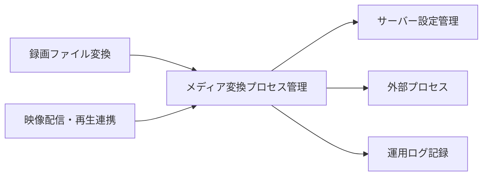
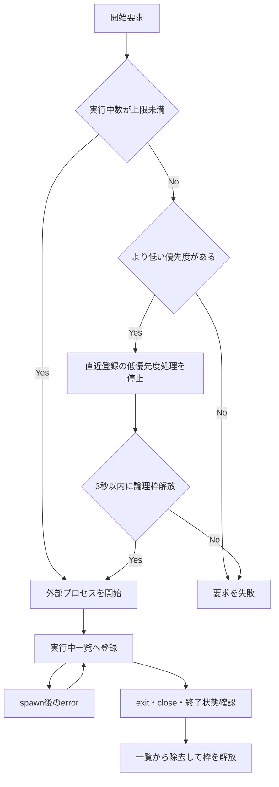
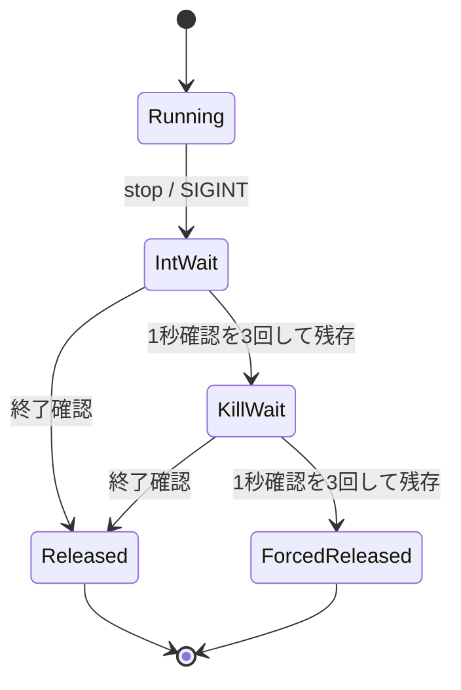

# メディア変換プロセス管理機能 設計

## 1. 目的と責任境界

本機能は、録画ファイルのエンコードと視聴用変換が共有する外部プロセス実行枠を管理する。要求元が指定した優先度に従って開始
可否を決め、終了した処理の枠を解放する。HLS writerについては、停止不能な処理が配信識別番号と実行枠を恒久的に占有しないよ
う、process group単位の有限停止と強制的な論理解放を行う。

本機能が所有するのは外部プロセスの開始、優先度、実行中一覧、および論理実行枠である。エンコード結果、再生状態、HLS成果物
の削除、配信識別番号、および要求元の待機列は所有しない。

### 依存関係



| 隣接機能                     | 受け渡す内容                                   |
| ---------------------------- | ---------------------------------------------- |
| `server-encoding`            | 高優先度の外部プロセス開始要求、終了・取消要求 |
| `server-media-delivery`      | 低優先度の視聴用変換要求、HLS writerの停止要求 |
| `server-configuration`       | 起動時に保持する同時実行上限                   |
| `server-operational-logging` | 開始失敗、停止失敗、強制解放の診断情報         |

## 2. 機能構成

| 論理コンポーネント      | 役割                                                               | 配置                         |
| ----------------------- | ------------------------------------------------------------------ | ---------------------------- |
| Process Admission       | 同時実行上限と優先度から開始可否を決める                           | `EncodeProcessManageModel`   |
| Active Process Registry | process handle、内部ID、優先度、HLS用PID/PGID、状態を保持する      | `EncodeProcessManageModel`内 |
| Replacement Coordinator | 上限到達時に低優先度処理を一件選び、終了後に高優先度処理を開始する | `killAndCreateProcess()`周辺 |
| HLS Group Launcher      | Debian/LinuxでHLS writerを新しいprocess groupとして開始する        | process生成adapter           |
| HLS Stop Coordinator    | `SIGINT`、終了確認、`SIGKILL`、強制論理解放を一回だけ進める        | process管理機能              |

`Active Process Registry`はメモリー内だけに置く。待ち行列、永続記録、世代識別子、終了証明、再照合処理は追加しない。

## 3. 主要データとinterface

```ts
type ProcessPriority = number;
type ManagedProcessState = 'starting' | 'running' | 'stopping' | 'released';
type ManagedProcessKind = 'process' | 'hls-writer';

// 内部状態。公開しない。
interface ChildProcessInfo {
    token: object;
    child: ChildProcess;
    handle: ManagedProcessHandle;
    priority: ProcessPriority;
    kind: ManagedProcessKind;
    state: ManagedProcessState;
    pid?: number;
    pgid?: number;
    slotReleased: boolean;
    directTerminalConfirmed: boolean;
    directCloseConfirmed: boolean;
    groupAbsentConfirmed: boolean;
    slotReleasedPromise: Promise<void>;
    stopRequestOperation?: Promise<ManagedStopRequestResult>;
    hlsStopOperation?: Promise<HlsWriterStopResult>;
    groupAbsenceCheckOperation?: Promise<void>;
}

// 入れ替え要求が対象の枠を確保している間だけ存在する。
interface ReplacementReservation {
    consumed: boolean;
    target: ChildProcessInfo;
    token: object;
}

interface CreateProcessOption {
    input: string | null;
    output: string | null;
    cmd: string;
    priority: number;
    spawnOption?: SpawnOptions;
}

// 型としてだけ公開するopaqueな識別子。実体は凍結した空object（HLS writerは`kind`だけを持つ）で、
// 内部状態はprocess管理機能内部の`WeakMap`でhandleから引く。
declare const managedProcessHandleBrand: unique symbol;
interface ManagedProcessHandle {
    readonly [managedProcessHandleBrand]: true;
}

interface ManagedProcessStartResult {
    child: ChildProcess;
    handle: ManagedProcessHandle;
}

interface HlsWriterHandle extends ManagedProcessHandle {
    readonly kind: 'hls-writer';
}

interface HlsWriterStartResult extends ManagedProcessStartResult {
    handle: HlsWriterHandle;
}

interface ManagedStopRequestResult {
    status: 'requested' | 'already-released';
    sentSignals: Array<'SIGINT'>;
}

interface HlsWriterStopResult {
    exitConfirmed: boolean;
    sentSignals: Array<'SIGINT' | 'SIGKILL'>;
    slotReleased: true;
}
```

管理対象はprocess管理機能内部の`childs`配列（`ChildProcessInfo`）に保持する。開始予約は`reservations`（object tokenの
集合）、入れ替え予約は`replacementReservations`（`ReplacementReservation`の集合）で数え、実行中数と合わせて占有枠とする。

通常のprocess生成interface`createManaged`は上記`CreateProcessOption`を受け、pipeとevent購読に使う`child`と、停止に使う
opaqueな`ManagedProcessHandle`を`ManagedProcessStartResult`として返す。HLS writerは`createHlsWriter`が同じ契約を型で
限定した`HlsWriterStartResult`として返す。これらに加え、`handle`を返さず`ChildProcess`だけを返す互換用の生成method
`create(option)`がある。現在の呼び出し元は`create`を使わない。エンコード、ライブ配信、録画配信の各consumerはchildを直接signalせず、handleを保持して通常
processでは`requestStop(handle)`、HLS writerでは`stopHls(handle)`を呼ぶ。管理状態、handle、停止結果は公開APIやIPCへ追加
しない。管理対象の同一性は時刻由来の数値ではなく、生成ごとに異なるobject tokenで判定する。

ここで使う用語の意味は次のとおりである。

-   **process group**: Debian/Linux上で、一回のHLS writer起動によって生じるffmpeg等の直接プロセスと、その子孫をまとめて
    停止対象にするOS上の単位。直接プロセスだけを停止して子孫を残すことを避けるために使う。
-   **object token**: 一回のプロセス起動ごとにメモリー内で新しく作るobject参照。同じPID、内部ID、または配信識別番号が後
    で再利用されても、古い終了通知を新しいプロセスへ適用しないための内部照合キーである。
-   **opaque handle**: process管理機能が起動ごとに新しく作って返す凍結objectで、内部専用の「停止用の取っ手」。process管理機能
    は`WeakMap`でhandleから内部状態（object tokenを含む）を引く。利用側はPID、PGID、tokenを解釈または再構成せず、その
    まま`requestStop()`または`stopHls()`へ返す。

これらはサーバー内部だけの管理情報である。公開API、配信識別番号、HLS親プレイリストのパス、およびclientから見えるURLへ追
加しない。

## 4. 通常の開始・終了



1. 起動時に`encodeProcessNum`を読み、機能の再起動まで同じ値を使う。
2. 外部I/Oや`await`へ進む前の一つの同期処理内で、実行中数と開始予約数を確認し、空き枠または一件の入れ替え予約を確保す
   る。同じ同期処理内で到着した後続要求は更新済みの予約状態を観測する。
3. 上限未満なら一件の開始予約を作ってからprocessを生成する。`spawn()`が返した直後、最初の非同期境界より前に、同じ
   object tokenの`starting`管理対象を実行中一覧へ登録して開始予約を移し、`spawn`、`error`、`exit`、`close` listenerを
   結び付ける。
4. `spawn` eventで同じtokenの`starting`管理対象を`running`へ移す。同期的なspawn throw、`spawn` event前の`error`、または
   `running`へ移る前の即時終了は開始失敗とし、予約または管理対象を一回解放して実行中一覧へ残さない。
5. 上限到達時は、新しい要求より優先度が低く`running`である対象を実行中一覧の新しい側から選ぶ。同じ優先度またはすでに
   `stopping`の対象は選ばない。
6. 対象を選んだ同じ同期処理内で`killAndCreateProcess`を呼ぶ。この関数は、対象と新しい要求を結ぶ一件の
   `ReplacementReservation`を作り、続けて対象kindに応じた`requestStop`または`stopHls`を同期的に呼ぶ。この同期区間で、
   `running`から`stopping`への遷移と、一つの`stopRequestOperation`または`hlsStopOperation`の登録まで終わる。別要求は
   同じ対象、停止operation、または予約済み枠を重複して所有できない。operationを登録してから同期境界を抜け、signal送信
   などの外部処理を開始する。
7. 入れ替え要求は対象の`slotReleasedPromise`を最大3000ms待つ。3000ms到達時の同着解放を期限内として扱い、同じ対象の論理実
   行枠解放を確認した場合だけ、その予約を持つ一要求が一回だけ新しいprocessを生成する。deadline timerが発火した場合は
   `setImmediate`で到達時の解放処理へ先行機会を与え、再確認時も未解放なら新しいprocessを開始せず予約を解放する。対象は
   `stopping`のままとし、開始済みの停止処理を取り消さない。HLS writerの`hlsStopOperation`は本書5.2の終端まで継続し、後続
   の明示停止は同じpromiseへjoinする。通常processは一回の`stopRequestOperation`完了後も論理枠解放まで`stopping`を維持す
   る。どちらも同じ対象へsignal送信権を二重に作らず、受付timerとdeadline確認用immediateは成功・失敗の両経路で回収する。
8. spawn成立後の`error`だけでは終了とみなさず、診断を記録して同じ管理対象と実行枠を保持する。
9. 通常processは`exit`、`close`、または`exitCode`・`signalCode`による終了を確認したとき、同じobject tokenの対象を一回だ
   け一覧から除去する。HLS writerはdirect childの終了をlatchするが、process groupの不在を確認するまで通常解放しない。
10. 本機能は開始要求を待ち行列へ入れず、空き枠も入れ替え対象も予約できない要求を直ちに失敗させる。失敗要求を自動再実行し
    ない。

取消、配信終了、実行時間上限、および優先度入れ替えによる通常processの停止は、同じ`requestStop(ManagedProcessHandle)`へ集
約する。最初の停止要求が対象objectを`stopping`へ移し、stdio整理と500ms後の`SIGINT`一回までを行う一つの
`stopRequestOperation`を作る。後続要求は同じoperationへjoinするため、consumerがpipe用childを保持していても直接signalを送
らない。

通常processの`requestStop()`はsignal送信要求までで完了し、processのterminalや論理枠解放を待たない。terminalは
`directTerminalConfirmed`等のevent latchで追跡する。優先度入れ替えだけが`slotReleasedPromise`を最大3秒観測し、取消や配信停
止の応答をterminal待ちで無期限化しない。通常processのterminal callbackは同じobjectの`slotReleased` latchによりregistry除
去と枠解放を一回だけ行い、その時点で`slotReleasedPromise`を解決する。

## 5. HLS writerの開始と停止

### 5.1 process group

Debian/LinuxでHLS writerを開始するときは、writerを新しいprocess groupのleaderとして生成する。registryにはdirect child
handle、PID、PGID、優先度、object tokenを同じ管理対象として登録し、そのtokenを包んだopaque HLS handleを要求元へ返
す。writerが自らdaemonize、`setsid`、または別groupへ移動したprocessは回収保証外である。

### 5.2 停止アルゴリズム



停止要求は次の順序で処理する。

1. opaque HLS handleのobject tokenでregistry内の対象を引く。対象が存在しないか`released`なら、signal送信と二重解放を行わ
   ず、送信signalが空で論理枠解放済みの冪等な停止結果を返す。対象が`stopping`で`hlsStopOperation`を持つ場合は、同じ
   promiseへjoinして結果を返す。対象が`running`かつ`groupAbsentConfirmed === false`なら、一つの同期境界で`stopping`へ移
   す。 `directTerminalConfirmed === true`でもgroupが残る対象は停止できる。
2. 同じ同期境界で保存済みdirect childとPGIDを停止対象として固定し、対象objectへ一つだけの`hlsStopOperation`を保存する。
   以後はこのoperationだけがsignal送信権と停止finalizerの実行権を持つ。
3. 固定済みprocess groupの存在を確認し、存在する場合は同じgroupへ`SIGINT`を一回送る。direct childだけが終了済みでも、
   group内に子孫が残る場合はsignalを省略しない。
4. 1秒間隔で最大3回、groupの終了を確認する。
5. 残っていれば同じgroupへ`SIGKILL`を一回送り、1秒間隔で最大3回確認する。
6. group存在確認、signal送信、または確認待機がthrow・rejectした場合は、対象、段階、PID、PGID、errorを記録する。安全に続
   行できる次の停止段階は試みるが、補助処理の失敗を理由に終端処理を省略しない。
7. 一回だけ実行される停止finalizerで、終了確認と各補助処理の成否にかかわらずregistryから対象を除き、論理実行枠を一回だけ
   解放する。
8. 終了未確認ならPID、PGID、処理種別、送信signal、確認結果、強制解放をerrorログへ記録する。

停止開始前に同じ管理対象でない、またはすでに`released`である場合は、保存済みPID/PGIDへsignalを送らない。これはOSによる
PID/PGID再利用先を誤って停止しないための条件である。強制解放後の`exit`、`close`、`error`、確認timerは、対象objectの
identityと`slotReleased`を確認し、別処理や再利用済み枠へ作用しない。OSによるPID/PGID再利用との競合を利用者空間から絶対に
排除することはできないため、terminal確認後はsignalを送らず、停止開始後も保存済みhandle以外からPID/PGIDを再解決しない。

HLS writerのdirect childが自然終了した場合は`directTerminalConfirmed`だけを記録し、保存済みPGIDのgroup不在を確認できた場
合に`groupAbsentConfirmed`を設定して通常解放する。groupに子孫が残る場合は`running`のopaque handleと論理枠を保持し、後続
の停止要求が同じgroupを有限停止できるようにする。本書5.2の二段停止を終えた場合は、group終了確認の成否にかかわらず強制解
放できる。

入れ替え時の待機期限とHLS stop operationの寿命は別である。入れ替え要求は新しい高優先度要求を開始できるか判断するため
`slotReleasedPromise`を最大3秒だけ待ち、未確認なら新要求を失敗させる。HLSではdirect childの終了だけでこのpromiseを解決せ
ず、process group不在の確認または停止finalizerによる強制解放で解決する。一方、開始済みのHLS stop operationは`SIGINT`後3
回と `SIGKILL`後3回の確認を終えるまで継続し、最後は必ず停止finalizerで論理枠を強制解放する。後続の明示停止は同じ
operationへjoinし、別のsignal列を開始しない。

HLS成果物の削除と配信識別番号の解放は`server-media-delivery`が行う。本機能は成果物の削除成否を待たずに論理実行枠を解放す
る。

## 6. 失敗、再起動、終了

-   process生成に失敗した場合はregistryへ残さず、要求元へ失敗を返す。
-   通常processの正常終了・異常終了を確認した場合はいずれも一覧から除去する。spawn後の`error`単独では除去しない。本機能
    から自動再起動しない。
-   入れ替え対象の論理実行枠解放を3秒以内に確認できない場合、新しいprocessは開始しない。後で枠が空いても同じ要求を再実行
    しない。
-   HLS writerは二段停止後に終了未確認でも論理枠を強制解放し、サービス継続を優先する。
-   再起動時は設定を読み直し、以前のメモリー内registryを復元しない。
-   サーバー全体をdrainする専用shutdown coordinatorは本機能に追加しない。

## 7. テスト設計

本機能は`server-application-runtime`が所有する共有server test foundationへ機能固有suiteを追加する。本機能の機能固有
suiteは`test/server/media-process-management/`にあり、仕様testは`media-process-management.spec.test.ts`、実装testは
`implementation.test.ts`、結合testは`process-group.integration.test.ts`である。Linux process group用のsynthetic child
fixtureは結合testが実行時に一時directoryへ生成し、case終了時に回収する。このほか、エンコード要求側（`EncoderModel`）の
分岐を確かめる`*.imp.test.ts`が4件ある。本機能唯一の機能固有test matrixは7.3の形式で
持ち、別のmatrixまたはledgerへ判定を分散させない。suiteとtestが存在する事実は、実行結果やcoverageが得られた証拠ではな
い。

### 7.1 `unittest/spec`

`unittest/spec`はRequirements 1から7を外部から観測可能な開始結果、停止結果、管理枠、およびprocess lifecycleとして検証す
る。

-   上限0ではspawnせず、上限未満では開始を試み、上限到達時は新要求より低優先度の対象だけを入れ替え候補にする。低・同・高
    優先度、候補なし、複数候補時の直近登録対象を分け、同優先度を停止しない。
-   空き枠も入れ替え対象もない要求はその場で失敗し、待ち行列へ入らず、後から枠が空いても自動開始しない。終了した処理も自
    動再起動しない。
-   入れ替え対象の論理枠が3000ms以下で解放された場合だけ予約済みの新要求を開始する。3000ms到達時の解放成功と、3000ms時点
    でも未解放またはそれより後の解放による失敗を分ける。期限超過時は新要求を失敗させる一方、開始済み停止を取り消さず、後
    続の明示停止、取消、または配信終了を同じstop operationへ参加させる。
-   通常processの正常終了と終了確認済みの異常終了は枠を一回解放する。起動成立後の`error`単独では解放せず、後続の
    `exit`、`close`、または終了状態確認まで保持する。
-   通常processの停止はstdio整理と一回の`SIGINT`要求後に応答し、terminal未到着を理由に取消や配信停止の応答を無期限に待た
    せない。
-   HLS writerでは新しいprocess group、direct child、PID、PGID、優先度、opaque handle、および論理枠が一つの管理対象へ対
    応する。`SIGINT`、必要時の`SIGKILL`、終了確認、最後まで未確認の場合の強制解放、および成果物削除と枠解放の分離を検証
    する。
-   起動時の設定値を稼働中は保持し、設定変更は新しい機能instanceでだけ反映する。全processを回収する専用shutdown、エン
    コード結果、再生状態、および配信成果物の判断を本機能へ追加しない。

### 7.2 `unittest/imp`

`unittest/imp`は内部値域、分岐、順序、および一回だけの副作用を固定する。

| 観点           | ケース                                                               | assertion                                                             |
| -------------- | -------------------------------------------------------------------- | --------------------------------------------------------------------- |
| 実行上限       | 0、上限未満、上限到達、同一event loopでの境界同時開始                | 実行中数と開始予約数の合計が上限以下で、0ではspawnが0回               |
| 優先度         | 低・同・高、複数の低優先度候補、複数の高優先度要求                   | 同優先度を選ばず直近登録の一対象だけを予約し、一枠を一要求だけが使用  |
| 起動settlement | 同期spawn throw、spawn前`error`、spawn後`error`、spawnと即時terminal | `starting`の管理対象を一回だけ`running`へ移すか解放し、成立後の`error`単独では枠を維持    |
| 通常停止       | 最初の停止、重複停止、取消・期限・配信停止・入れ替えの競合           | 一つのstop operationだけがsignal送信権を持ち、`SIGINT`要求は一回      |
| HLS停止        | `SIGINT`後終了、`SIGKILL`後終了、最後まで残存                        | 各signalは一回、終了確認は各段階で最大3回、finalizerと枠解放は一回    |
| stale identity | 古いPID・PGID、別object token、解放済みhandle                        | 保存値へ追加signalを送らず、別対象を削除せず、停止済み結果を返す      |
| 補助失敗       | group存在確認、signal送信、確認timerのthrowまたはreject              | 段階付きerrorを記録し、停止処理を一回だけ終端して強制解放             |
| 遅延通知       | 解放後の`exit`、`close`、`error`、終了確認結果                       | object identityと解放latchで無作用にし、二重解放と別対象への作用が0回 |

fake timer、deferred Promise、およびfake process groupは時間境界、失敗注入、最後まで残存する分岐を決定論的に検証するため
に使う。ただし、fake process groupをLinuxの実process group結合testの代替にはしない。

### 7.3 状態・資源・失敗matrix

機能固有test matrixは、R1.1からR8.5まで各Acceptance Criterionを一行ずつ計48行持ち、各行の`AC/契約`欄で一つだけの主test IDへ
対応付ける。同じtestが別ACを補助検証することは許すが、各ACの合否を決める主testは一意にし、一つの主test IDを複数ACの
主testとして兼用しない。R8.2とR8.4の主testは、接頭辞で示すcase群である。次表の48行が各ACの主test・入力・状態・資源・失敗・期待結果の正本である。実行結果はこの表へ記録しない。

| 分類             | 開始条件または競合                                          | 期待状態・結果                                     | 回収assertion                                               |
| ---------------- | ----------------------------------------------------------- | -------------------------------------------------- | ----------------------------------------------------------- |
| 開始中           | 枠予約後、spawn成立前                                       | `starting`。後続受付は予約済み枠を空きとみなさない | 同期throw、spawn前`error`、即時terminalで予約を一回解放     |
| 実行中           | spawn成立後                                                 | `running`。priorityとobject tokenを保持            | terminal listenerが同じ対象だけを一回解放                   |
| 停止中           | 入れ替え、明示停止、取消、期限のいずれかが先着              | `stopping`。後続要求は同じoperationへjoin          | signal所有権、timer、listener、停止promiseを重複生成しない  |
| 解放済み         | terminal確認またはHLS finalizer完了                         | registry外。後続開始が枠を利用可能                 | 遅いevent、timer結果、重複停止が無作用                      |
| 入れ替え期限内   | 3000ms以下で論理枠解放                                      | 予約済み高優先度要求だけを開始                     | 旧対象解放と新対象開始を各一回                              |
| 入れ替え期限超過 | 3000ms時点でも未解放、または3000msより後に解放              | 新要求を失敗し自動再実行しない。旧対象の停止は継続 | 受付timerを回収し、late settlementから新processを開始しない |
| 同着・race       | 枠境界の複数開始、複数高優先度、terminalとtimeout           | 同期受付で一つの順序へ確定                         | 上限超過、同一対象の二重予約、未処理rejectionが0件          |
| 通常process資源  | child、stdio、terminal listener、停止timer、論理枠          | 終了確認まで必要な資源だけを保持                   | stdio整理、timer解除、listener重複なし、枠解放一回          |
| HLS資源          | direct child、process group、確認timer、停止promise、論理枠 | group不在確認またはfinalizerまで追跡               | child/group残存の観測、確認timer回収、枠解放一回            |
| 起動失敗         | command解析、同期spawn、group確立の失敗                     | 開始失敗。registryと枠を残さない                   | child、listener、timer、開始予約の残留が0件                 |
| 停止失敗         | 存在確認、`SIGINT`、`SIGKILL`、確認待機の失敗               | error記録後に一つの終端経路へ収束                  | registry除去と強制解放が一回、追加signalが0回               |

機能固有test matrixの列は次に固定する。

| AC/契約                 | test種別                  | 入力                                                         | 状態                                     | 時間・順序/race                                                                 | 資源                                                                          | 外部境界                                                                        | failure注入                                                           | 期待結果                                                                              |
| --- | --- | --- | --- | --- | --- | --- | --- | --- |
| `R1.1 / MP-SPEC-R1-1`   | `unittest/spec`           | priority 1と10のchild各1件                                   | 実行中                                   | 二つの開始を順次settle                                                          | child process、registry、論理実行枠2                                          | process adapter                                                                 | なし                                                                  | encodingとplaybackを一つの一覧で保持                                                  |
| `R1.2 / MP-SPEC-R1-2`   | `unittest/spec`           | priority最小相当1と高値10                                    | 実行中                                   | 登録済みchildのpriorityを昇順に並べて確認 | object token、priority、論理実行枠                                            | process adapter                                                                 | なし                                                                  | registryのpriority集合が受理値と一致 |
| `R1.3 / MP-SPEC-R1-3`   | `unittest/spec`           | 上限2、使用0から1                                            | 開始中から実行中                         | 予約後にspawn、spawn後にpromote                                                 | 予約、listener、child process、論理実行枠                                     | spawn adapter                                                                   | なし                                                                  | 上限未満で一回だけspawn                                                               |
| `R1.4 / MP-SPEC-R1-4`   | `unittest/spec`           | 検証済み上限0                                                | 開始前                                   | 同期受付                                                                        | 予約、child process、論理実行枠                                               | server-configurationからの検証済み値                                            | なし                                                                  | spawn 0回、registry 0件で即時失敗                                                     |
| `R1.5 / MP-SPEC-R1-5`   | `unittest/spec`           | 有効command、空registry                                      | 開始中から解放済み                       | 予約後の同期spawn throw                                                         | 予約、listener、論理実行枠                                                    | spawn adapter                                                                   | 同期throw                                                             | error identityを保って失敗し枠残留0                                                   |
| `R1.6 / MP-SPEC-R1-6`   | `unittest/spec`           | cmdなしdirect live stream                                    | manager開始前                            | consumerが変換要否を先に判定                                                    | source stream、manager call ledger                                            | live consumer                                                                   | なし                                                                  | manager start 0回でsourceを直接返す                                                   |
| `R2.1 / MP-SPEC-R2-1`   | `unittest/spec`           | encoding consumer                                            | 開始前                                   | 起動時定数を要求へ渡す                                                          | priority値、開始要求                                                          | EncoderModel                                                                    | なし                                                                  | encoding priorityは10                                                                 |
| `R2.2 / MP-SPEC-R2-2`   | `unittest/spec`           | liveとrecorded playback                                      | 開始前                                   | 両consumerを同じ順序で比較                                                      | priority値、開始要求                                                          | stream consumers                                                                | なし                                                                  | 両playback priorityは1                                                                |
| `R2.3 / MP-SPEC-R2-3`   | `unittest/spec`           | 上限到達、active 1、request 10                               | 実行中から停止中                         | 低優先度選択後に停止、解放後spawn                                               | registry、入れ替え予約、停止promise、論理実行枠                               | normal process stop                                                             | なし                                                                  | 低優先度一対象だけを入れ替える                                                        |
| `R2.4 / MP-SPEC-R2-4`   | `unittest/spec`           | active 11、request 10                                        | 実行中                                   | 同期候補選択                                                                    | registry、開始要求                                                            | 非適用                                                                          | 候補なし                                                              | activeを維持しrequestを即時失敗                                                       |
| `R2.5 / MP-SPEC-R2-5`   | `unittest/spec`           | 低優先度候補3件                                              | 実行中から停止中                         | 登録時刻1、2、3の直近を選択                                                     | registry、入れ替え予約、論理実行枠                                            | normal process stop                                                             | なし                                                                  | newest一対象だけへSIGINT                                                              |
| `R2.6 / MP-SPEC-R2-6`   | `unittest/spec`           | active 10、request 10                                        | 実行中                                   | 同priority比較                                                                  | registry、開始要求                                                            | 非適用                                                                          | なし                                                                  | 同priorityを停止せず即時失敗                                                          |
| `R3.1 / MP-SPEC-R3-1`   | `unittest/spec`           | replaceable normal handle                                    | 停止中                                   | 入れ替え選択後500msで停止要求                                                   | timer、停止promise、signal権、論理実行枠                                      | child signal                                                                    | なし                                                                  | 選択対象へSIGINT一回                                                                  |
| `R3.2 / MP-SPEC-R3-2`   | `unittest/spec`           | SIGINT後も残るchild                                          | 停止中                                   | 3000ms未満はpending、3000ms到達後immediateで判定                                | timer、immediate、停止promise、論理実行枠                                     | fake timerとchild signal                                                        | terminalなし                                                          | 最大3秒だけ待ちtimer残留0                                                             |
| `R3.3 / MP-SPEC-R3-3`   | `unittest/spec`           | 3000ms到達時に解放するchild                                  | 停止中から解放済み、次の開始中           | timeoutとterminalの同着、releaseがdeadline immediateより先                      | timer、immediate、予約、listener、論理実行枠                                  | fake timerとspawn adapter                                                       | exact boundary                                                        | 予約ownerだけがslotを取得して一回spawn                                                |
| `R3.4 / MP-SPEC-R3-4`   | `unittest/spec`           | 3000ms時点でも未解放                                         | 停止中                                   | deadline immediate後に失敗                                                      | timer、immediate、停止promise、論理実行枠                                     | fake timer                                                                      | terminal欠落                                                          | replacement spawn 0回、stopは継続                                                     |
| `R3.5 / MP-SPEC-R3-5`   | `unittest/spec`           | 3000msより後に解放                                           | 停止中から解放済み                       | timeout後のlate settlement                                                      | timer、listener、retired予約、論理実行枠                                      | fake timerとterminal event                                                      | late terminal                                                         | old slotは解放するが新processを自動開始しない                                         |
| `R3.6 / MP-SPEC-R3-6`   | `unittest/spec`           | 同じhandleへの重複停止                                       | 停止中                                   | 入れ替え、明示停止、取消、期限の競合をjoin                                      | timer、停止promise、signal権                                                  | child signal                                                                    | duplicate call                                                        | 同じPromiseとSIGINT一回                                                               |
| `R4.1 / MP-SPEC-R4-1`   | `unittest/spec`           | exit code 0                                                  | 実行中から解放済み                       | terminal listenerが一回発火                                                     | listener、child process、論理実行枠                                           | child terminal event                                                            | なし                                                                  | registry除去、枠一回解放                                                              |
| `R4.2 / MP-SPEC-R4-2`   | `unittest/spec`           | spawn前errorとexit code 1                                    | 開始中または実行中から解放済み           | error、exit、closeの順序を分離                                                  | listener、予約、child process、論理実行枠                                     | child lifecycle                                                                 | pre-spawn error、abnormal terminal                                    | 両generationを一回だけ除去                                                            |
| `R4.3 / MP-SPEC-R4-3`   | `unittest/spec`           | 上限1、first terminal、later request                         | 解放済みから開始中、実行中               | first release後の明示start                                                      | listener、child process、論理実行枠                                           | spawn adapter                                                                   | なし                                                                  | later requestが空き枠を取得                                                           |
| `R4.4 / MP-SPEC-R4-4`   | `unittest/spec`           | terminal child一件                                           | 実行中から解放済み                       | terminal後に全timerをdrain                                                      | listener、child process                                                       | 非適用                                                                          | なし                                                                  | spawn総数1のまま自動再起動0                                                           |
| `R4.5 / MP-SPEC-R4-5`   | `unittest/spec`           | public prototype                                             | 全状態の非所有contract                   | API inventoryを同期確認                                                         | manager API                                                                   | consumer ownership                                                              | なし                                                                  | resultとplayback state APIが存在しない                                                |
| `R4.6 / MP-SPEC-R4-6`   | `unittest/spec`           | 上限到達時の同priority request                               | 実行中から後続解放済み                   | reject後にslotが空く順序                                                        | registry、予約、timer                                                         | 非適用                                                                          | capacity rejection                                                    | 待ち行列0、後続自動spawn 0                                                            |
| `R5.1 / MP-SPEC-R5-1`   | `unittest/spec`           | HLS writer command                                           | 開始中から実行中                         | detached spawn後にspawn event                                                   | direct child、process group、listener、論理実行枠                             | Linux process adapter                                                           | なし                                                                  | detached trueでgroup leader開始                                                       |
| `R5.2 / MP-SPEC-R5-2`   | `unittest/spec`           | PIDとPGID 42、priority 7                                     | 実行中                                   | 一つのstart settlement                                                          | direct child、PID、PGID、token、handle、論理実行枠                            | process adapter                                                                 | なし                                                                  | 全identityを同じentryへ関連付ける                                                     |
| `R5.3 / MP-SPEC-R5-3`   | `unittest/spec`           | PID 0（実EACCES executableは補助testの`MP-INT-R7-LINUX-START-FAILURE`） | 開始中から解放済み                       | spawn成立時のgroup identity判定                                                 | 予約、direct child、listener、論理実行枠                                      | Linux process adapter                                                           | group開始失敗                                                         | start失敗、registryとslot残留0                                                        |
| `R5.4 / MP-SPEC-R5-4`   | `unittest/spec`           | 保存PGID 42、外部移動PID 99                                  | 実行中から停止中                         | start時identityだけをstopで使用                                                 | process group、opaque handle、論理実行枠                                      | Linux escaped descendant                                                        | external setsid                                                       | 保存groupだけを扱いescaped process停止を成功扱いしない                                |
| `R6.1 / MP-SPEC-R6-1`   | `unittest/spec`           | alive列 true、true、true、false                              | 停止中                                   | SIGINT後1秒間隔で最大3回確認                                                    | process group、timer、停止promise、signal ledger                              | fake groupとLinux group                                                         | third pollでabsence                                                   | SIGINT一回、確認3回、slot一回解放                                                     |
| `R6.2 / MP-SPEC-R6-2`   | `unittest/spec`           | SIGINT後残存、SIGKILL後third pollでabsence                   | 停止中                                   | 各signal段階を順番に最大3回確認                                                 | process group、timer、停止promise、signal ledger                              | fake groupとLinux group                                                         | SIGINT無視                                                            | SIGINTとSIGKILL各一回、確認最大3回ずつ                                                |
| `R6.3 / MP-SPEC-R6-3`   | `unittest/spec`           | group absence確認                                            | 停止中から解放済み                       | signal後terminal確認が先着                                                      | finalizer、registry、論理実行枠                                               | process group                                                                   | なし                                                                  | registry除去とrelease resolver各一回                                                  |
| `R6.4 / MP-SPEC-R6-4`   | `unittest/spec`           | 全7回alive                                                   | 停止中から解放済み                       | SIGKILL後third pollまで残存                                                     | process group、timer、停止promise、論理実行枠                                 | fake groupとLinux unconfirmed                                                   | permanent alive                                                       | exitConfirmed falseでも論理枠を強制解放                                               |
| `R6.5 / MP-SPEC-R6-5`   | `unittest/spec`           | PID、PGID、kind、signal列                                    | 解放済み                                 | 全poll終了後にerror記録                                                         | logger、signal ledger、論理実行枠                                             | operational logger                                                              | terminal未確認                                                        | forcedSlotReleaseと全identityを記録                                                   |
| `R6.6 / MP-SPEC-R6-6`   | `unittest/spec`           | stop完了後の重複stop                                         | 解放済み                                 | first finalizer後のlate call                                                    | opaque handle、signal ledger                                                  | process group                                                                   | duplicate call                                                        | 追加signal 0、既送信SIGINT一回                                                        |
| `R6.7 / MP-SPEC-R6-7`   | `unittest/spec`           | 旧childのlate error、exit、close                  | 解放済み旧generationと実行中新generation | release→error→exit→close（late poll settlementは補助test`MP-IMP-R6-HLS-LATE-POLL`） | listener、token、registry、論理実行枠                                         | child lifecycleとfake group                                                     | deferred terminal                                                     | 各段階で新対象signal、削除、二重解放すべて0                                           |
| `R6.8 / MP-SPEC-R6-8`   | `unittest/spec`           | artifact deleterなしのmanager                                | 全process状態と成果物非所有              | process finalizerだけを実行                                                     | process group、論理実行枠                                                     | HLS成果物削除=非適用                                                            | deletion failureは注入しない                                          | 枠解放は成果物削除成否に依存しない                                                    |
| `R6.9 / MP-SPEC-R6-9`   | `unittest/spec`           | 古いPID、PGID、別token、再利用数値42                         | 解放済み旧generationと実行中新generation | old handle stopがnew startより後                                                | token、handle、signal ledger、registry                                        | process group                                                                   | stale identity                                                        | 保存数値へsignal 0、新対象除去0                                                       |
| `R6.10 / MP-SPEC-R6-10` | `unittest/spec`           | 同じhandleへの3重stop                                        | 停止中から解放済み                       | concurrent callとpost-release call                                              | 停止promise、signal ledger、finalizer                                         | process group                                                                   | 重複                                                                  | concurrentは同一Promise、post-releaseはstable result                                  |
| `R6.11 / MP-SPEC-R6-11` | `unittest/spec`           | SIGINT送信のthrow（他のstageとlogger failureは補助testの`MP-IMP-R6-HLS-FAILURE-*`・`MP-IMP-R6-HLS-LOGGER-FAILURE`） | 停止中から解放済み                       | SIGINT送信failureを一件注入 | logger、timer、process group、finalizer、論理実行枠                           | process adapterとlogger                                                         | helper throwまたはreject                                              | error記録後に一つの終端経路で強制解放                                                 |
| `R7.1 / MP-SPEC-R7-1`   | `unittest/spec`           | getConfigが上限0を返す                                       | instance開始時                           | constructorで一回read後にadmission                                              | configuration snapshot、論理実行枠                                            | server-configuration                                                            | なし                                                                  | captured 0でspawn 0                                                                   |
| `R7.2 / MP-SPEC-R7-2`   | `unittest/spec`           | 稼働中に上限1から2へ変更                                     | 実行中                                   | original instanceのstart後に外部値変更                                          | configuration snapshot、registry                                              | server-configuration                                                            | live mutation                                                         | originalは上限1を維持                                                                 |
| `R7.3 / MP-SPEC-R7-3`   | `unittest/spec`           | restart時上限2                                               | 新instance開始中から実行中               | old instance後にnew constructor                                                 | configuration snapshot、新registry、論理実行枠2                               | server-configuration                                                            | なし                                                                  | new instanceは2件開始、old registryを復元しない                                       |
| `R7.4 / MP-SPEC-R7-4`   | `unittest/spec`           | public prototype                                             | 全状態の非所有contract                   | API inventoryを同期確認                                                         | manager API                                                                   | application runtime                                                             | なし                                                                  | drain、shutdown、stopAllなし                                                          |
| `R8.1 / MP-SPEC-R8-1`   | `unittest/spec` | R1.1からR7.4の43 AC                                          | 全状態                                   | 43 canonical caseを一意順で実行                                                 | fixture、開始結果、停止結果、slot、lifecycle、非所有effect                    | spec suite                                                                      | duplicate ID、missing case                                        | 43 AC、43 primary ID、空欄0、skip 0                                                   |
| `R8.2 / MP-IMP-R8-*` | `unittest/imp`            | null、空文字、通常値、0、1、最小、最大、範囲外、不正型、重複 | 開始中、実行中、停止中、解放済み         | value単位locator、branch、実測order、exactly-onceを8分類                        | call ledger、timer、listener、予約、停止promise、論理実行枠                   | server-configurationとTypeScript compile                                        | 全failure stage                                                       | 各valueのlocatorに対応するimp testを置き、固有最大と範囲外はconfiguration非適用       |
| `R8.3 / MP-SPEC-R8-3`   | `本表`                   | 本表48 data rowと固定9列                                    | 全状態分類                               | row順、AC順、ID uniqueness                                            | 設計文書                                                             | repository test artifact                                                        | 欠落列、重複ID、空欄                                                  | 48行、48 unique ID、空欄0、未分類0                                                    |
| `R8.4 / MP-INT-R7-*` | `integration`            | PID値域6種、EISDIR、atomic publication、既存Linux 6 mode     | PID公開前後、実行中、停止中、解放済み    | atomic ready→validated staged PID→release→final rename、値検証、group lifecycle | report/sibling/ready/release file、child/group、timer/listener、registry/slot | DB=非適用; HTTP=非適用; IPC=非適用; 永続filesystem=非適用; HLS成果物削除=非適用 | invalid PID、EISDIR、release待ち削除、SIGINT無視、direct-exit、EACCES | Linux 7/7、validated PID、final ENOENT before release、child close、親signal 0、残留0 |
| `R8.5 / MP-GATE-R8-5`   | `品質判定`                | 機能固有suiteとRuntime R9 AC9                                | 全状態                                   | 全件成功とC0・C1                                                                | test、coverage                                                                | Runtime Requirement 9共有foundation                                             | 一件失敗、未実行                                                      | feature suite全件成功とserver全体のC0・C1が成立したときだけ完了                      |

上表は全ACの行を持つ。`入力`欄では`null`、空、0、1、最小、最大、範
囲外、不正型、重複を空欄にせず、test caseまたは理由付き非適用へ割り当てる。

-   `CreateProcessOption.input`と`output`の`null`と空文字は、置換有無とprocess受付結果を`unittest/imp`へ割り当てる。
-   検証済み同時実行上限の0と1、空き枠数の0と1は、生成なし、単一枠、上限境界の`unittest/spec`と`unittest/imp`へ割り当て
    る。
-   本機能が受け取る検証済み上限には、承認済みの固有最大値とその範囲外契約が定義されていない。最大と範囲外は値を創作せ
    ず、サーバー設定管理機能の入力検証境界として理由付き非適用にする。最小の観点は本仕様が明示する境界値0へ割り当てる
    が、これを上流の入力検証範囲の下限定義へ読み替えない。
-   TypeScript interfaceに対する不正型はruntime入力境界ではないため、compile時の型検証へ割り当て、runtime testは理由付き
    非適用にする。型を迂回するcastで存在しないruntime validationを要求しない。
-   重複は、同じhandleへの停止、同じ対象を狙う複数入れ替え、重複terminal、および遅延通知のcaseへ割り当てる。

command、結果、未解決riskは共有foundationの実行記録で管理し、本表には記録しない。command未定義、suite未実装、または
未実行の段階はその事実を記録し、PASSまたはcoverage済みとしない。

### 7.4 Linux process group結合test

Debian/Linuxでは、synthetic executableを実際のisolated child processとして起動し、fakeではないOS process group境界を
`*.integration.test.ts`で接続する。test parentのprocess groupとfixtureのgroupを分離し、終了処理では保存済みPGIDだけを対
象にする。

1. HLS writer役のdirect childが新しいprocess groupのleaderとなり、通常の子childが同じPGIDを継承したことをOSから確認す
   る。
2. `SIGINT`でgroup全体が終了するfixtureと、`SIGINT`を処理せず`SIGKILL`を必要とするfixtureを分け、実signal送信、direct
   childと子childの終了、およびgroup不在確認を観測する。
3. direct childが先に終了して子childが残るfixtureでは、子childのgroupが存在する間は論理枠とopaque handleを保持し、後続
   stopが同じgroupを終了させた後だけ通常解放することを確認する。
4. 各caseのfinally相当の後始末でfixture child、process group、timer、listener、およびregistry残留を確認する。test parent
   自身のgroupへsignalを送らない安全条件を事前・事後にassertする。

非LinuxではこのOS境界を非適用として、platform、skip対象case数、および「Linux process group contractのため」という理由を
test reportへ残す。非Linuxでのskipを成功証拠へ読み替えず、本機能の完了判定にはLinux上で同suiteが実行
され全件成功することを必須とする。fake process group suiteは非Linuxでも内部分岐を検証できるが、このLinuxでの実行を代替しな
い。

### 7.5 外部境界の適用分類

| 境界                                 | 分類     | 理由・証拠                                                                                     |
| ------------------------------------ | -------- | ---------------------------------------------------------------------------------------------- |
| child process・process group・signal | 直接境界 | 本機能が起動、追跡、signal送信、終了確認、資源解放を所有するため、Linux実child結合testで検証   |
| DB                                   | 非適用   | registryと予約はprocess-local memoryであり、本機能はDB read/writeやtransactionを行わない       |
| HTTP                                 | 非適用   | 本機能は公開endpoint、request、responseを所有せず、consumerから内部interfaceで要求を受ける     |
| IPC                                  | 非適用   | managed handleと停止契約はprocess内interfaceであり、IPC messageまたはserializationを追加しない |
| 永続filesystem                       | 非適用   | registry、PID、PGID、予約、停止状態を永続化・復元せず、file lifecycleを所有しない              |
| HLS成果物削除                        | 非適用   | `server-media-delivery`の所有境界であり、削除成否を論理枠解放の条件にしない                    |

synthetic executableと一時directoryはtest harnessの隔離資源であり、製品の永続filesystem契約を意味しない。結合testは一時
資源をcase終了時に回収するが、その回収成功をHLS成果物削除contractの検証へ読み替えない。

### 7.6 品質判定

本機能の完了は、上記機能固有`unittest/spec`、`unittest/imp`、`integration`の全件成功に加え、
`server-application-runtime` Requirement 9が所有する共有runnerと固定commandを利用し、同Requirement 9 Acceptance
Criterion 9（server全体の単体testだけで`src/**`のC0・C1が100%）を満たすことで判定する。

-   C0とC1、coverage再計測は共有foundationの契約をそのまま適用する。本機能独自のcoverage閾値を設けない。
-   不一致は`spec defect`、`implementation defect`、`test defect`、`approved change`、`unknown`へ分類し、testを通すため
    だけに承認済み契約を変更しない。
-   test path、共有command、coverageが未実装または未実行なら未完了であり、test設計をcoverage済みの証拠として扱わな
    い。

## 8. Requirements traceability

| Requirement | 設計箇所・検証                                          |
| ----------- | ------------------------------------------------------- |
| R1.1        | 2、3、4: 共有registry                                   |
| R1.2        | 3、4: priority保持                                      |
| R1.3        | 4: 上限未満の開始                                       |
| R1.4        | 4、7: 上限0                                             |
| R1.5        | 4、6: spawn失敗                                         |
| R1.6        | 1、4: 変換不要時は要求しない境界                        |
| R2.1        | 4: encode高優先度                                       |
| R2.2        | 4: playback低優先度                                     |
| R2.3        | 4: 低優先度との入れ替え                                 |
| R2.4        | 4: 候補なしの拒否                                       |
| R2.5        | 4: 直近登録対象                                         |
| R2.6        | 4: 同優先度を除外                                       |
| R3.1        | 4: 停止要求                                             |
| R3.2        | 4: 3秒終了確認                                          |
| R3.3        | 4: 確認後spawn                                          |
| R3.4        | 4、6: 未確認時拒否                                      |
| R3.5        | 4、6: 自動再実行なし                                    |
| R3.6        | 4、5.2: 一意なstop operation                            |
| R4.1        | 4、6: 正常終了                                          |
| R4.2        | 4、6: 起動失敗・異常終了                                |
| R4.3        | 4: 枠再利用                                             |
| R4.4        | 6: 自動再起動なし                                       |
| R4.5        | 1: 結果非所有                                           |
| R4.6        | 2、6: 待ち行列なし                                      |
| R5.1        | 5.1: process group生成                                  |
| R5.2        | 3、5.1: handle/PID/PGID                                 |
| R5.3        | 5.1、6: group開始失敗                                   |
| R5.4        | 5.1: group離脱は保証外                                  |
| R6.1        | 5.2: SIGINTと3回確認                                    |
| R6.2        | 5.2: SIGKILLと3回確認                                   |
| R6.3        | 5.2: 確認後解放                                         |
| R6.4        | 5.2、6: 強制解放                                        |
| R6.5        | 5.2: errorログ                                          |
| R6.6        | 5.2: 追加signal禁止                                     |
| R6.7        | 5.2、7: 遅延event隔離                                   |
| R6.8        | 5.2: 成果物と枠の分離                                   |
| R6.9        | 5.2: stale PID/PGID guard                               |
| R6.10       | 5.2、7: 冪等な停止結果                                  |
| R6.11       | 5.2、7: 補助処理失敗時の強制解放                        |
| R7.1        | 4、6: 起動時設定                                        |
| R7.2        | 4、6: 稼働中固定                                        |
| R7.3        | 6: 再起動時再読込                                       |
| R7.4        | 6: 専用shutdownなし                                     |
| R8.1        | 7.1: Requirements 1から7の仕様test                      |
| R8.2        | 7.2: 値域・分岐の実装test                               |
| R8.3        | 7.3: 状態・資源・失敗matrix                             |
| R8.4        | 7.4、7.5: Linux実child結合境界                          |
| R8.5        | 7.6: 機能固有全件成功とserver全体のC0・C1               |

## 9. ソース対応表

| 機能                          | 主な実装位置                                               | 責任                                                 |
| ----------------------------- | ---------------------------------------------------------- | ---------------------------------------------------- |
| 共有上限、優先度、process生成 | `src/model/service/encode/EncodeProcessManageModel.ts`     | 実行枠、object token、terminal判定、HLS二段停止 |
| process生成interface          | `src/model/service/encode/IEncodeProcessManageModel.ts`    | child＋managed handle、二種類の停止契約              |
| 停止helper                    | `src/util/ProcessUtil.ts`                                  | 通常process停止（`kill`）とprocess group操作の原始関数。二段停止の制御は`EncodeProcessManageModel.ts` |
| エンコード要求                | `src/model/service/encode/EncoderModel.ts`                 | 高優先度consumer                                     |
| ライブHLS要求                 | `src/model/service/stream/base/LiveStreamBaseModel.ts`     | 低優先度consumer、opaque handle保持                  |
| 録画HLS要求                   | `src/model/service/stream/base/RecordedStreamBaseModel.ts` | 低優先度consumer、opaque handle保持                  |

## Primary production source ownership

本節は、本機能が主に所有する製品 source と、その owner-local test の置き場所を示す。次の primary source の動作、公開 API、
IPC wire、DB schema、設定、保存形式は変更しない。owner-local test locator は既存 test directory の範囲を示すものであり、
個別 source の characterization 網羅を主張しない。

| Primary source | Owner-local test locator | Cross-spec consumer |
| --- | --- | --- |
| `src/util/ProcessUtil.ts` | `test/server/media-process-management/**/*.test.ts` | Configuration は process configuration consumer。 |
