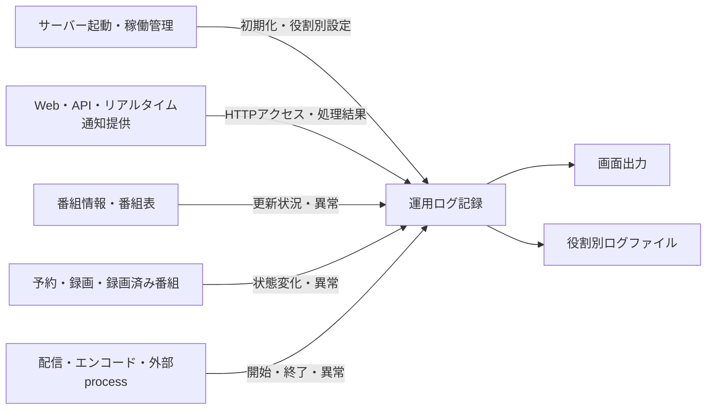
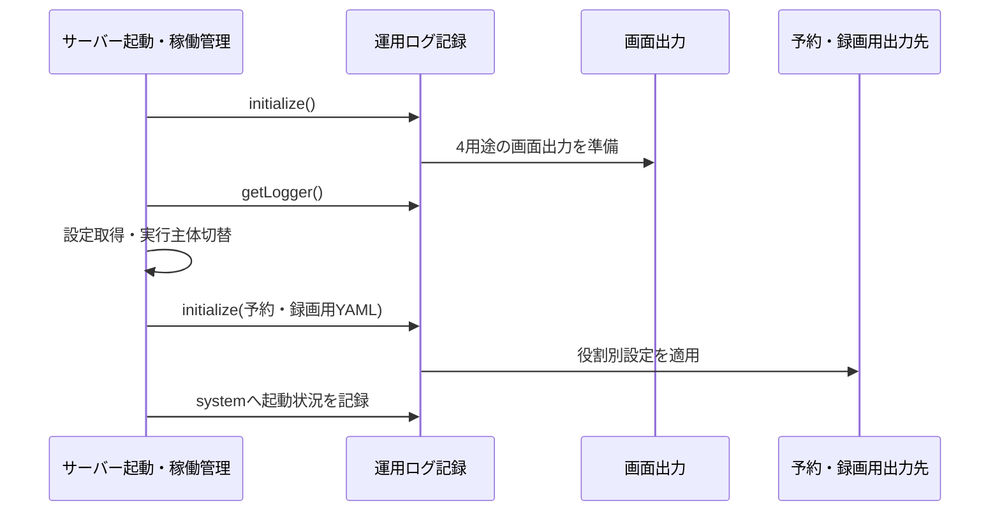
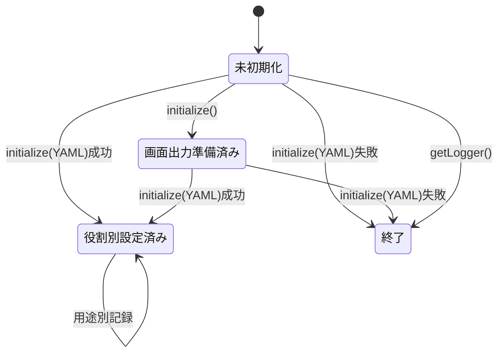

# 運用ログ記録機能 設計

## 概要

運用ログ記録機能は、EPGStation Server の処理、HTTPアクセス、映像配信、エンコード、および重大な異常を、用途と重要度に応じ
た出力先へ記録する。予約・録画を管理する処理、Web・APIを提供する処理、番組情報を更新する処理は、それぞれの起動時に独立し
たログ設定を読み込む。

主な利用者は、障害調査や稼働確認を行う運用者と、各業務機能から記録を出力するサーバー実装者である。

### 目標

-   サーバー起動の早い段階から、設定読込前の異常を画面へ記録できるようにする。
-   システム、アクセス、ストリーム、エンコードの記録を用途別に提供する。
-   サーバー処理の役割ごとに、出力先、重要度、ファイル切替条件を適用する。
-   HTTP要求と応答状態、および捕捉されなかった重大な異常を運用者が確認できるようにする。

### 責任境界

この機能が所有する責任は、ログ出力の初期化、用途別loggerの提供、役割別設定の適用、HTTPアクセス記録、および重大異常の記録
である。テストでは、これらの契約に対する機能固有の`unittest/spec`、`unittest/imp`、結合シナリオ、fixture、および状態・失
敗・資源matrixを所有する。

次の責任は所有しない。

-   記録する業務事象と重要度の選択
-   HTTP要求の許可、拒否、応答内容の決定
-   異常後の継続、停止、再起動、または再試行の決定
-   メトリクス、分散トレース、監査証跡、ブラウザー側エラーの収集
-   ログファイルを録画ファイルや配信ファイルとして管理すること
-   サーバー終了時のprocess順序や強制終了の制御
-   共有test runner、`test/server` root、およびそれらのcommandの定義。これらは`server-application-runtime`
    Requirement 9へ委ねる。V8 C0・C1 100%判定、およびthresholdの定義も同Requirement 9 Acceptance Criterion 9へ委ねる

## 他機能との関係

この機能は他の業務機能へ依存しない。起動処理からログ設定ファイルの位置を受け取り、設定された画面またはファイルへ出力す
る。すべての`server-*`機能は、必要な用途と重要度を選んでこの機能を利用する。



| 依存元                         | この機能へ渡すもの                            | この機能が返すもの                 | 依存元に残る責任                                     |
| ------------------------------ | --------------------------------------------- | ---------------------------------- | ---------------------------------------------------- |
| サーバー起動・稼働管理         | 初期化要求、役割別ログ設定の位置、process異常 | 用途別logger                       | service／EPG childの起動、terminal event監視、再起動 |
| Web・API・リアルタイム通知提供 | HTTP要求と応答、Web・API処理の記録            | アクセスログとシステムログへの出力 | HTTP処理と応答内容                                   |
| 番組情報・番組表               | 更新処理の記録                                | 用途と重要度に従った出力           | 更新、再接続、失敗処理                               |
| 予約・録画・録画済み番組       | 状態変化と異常の記録                          | 用途と重要度に従った出力           | 予約、録画、file操作の判断                           |
| 配信・エンコード・外部process  | 開始、進行、終了、異常の記録                  | stream/encode/systemへの出力       | 実行、取消、後始末、再試行                           |

## 構成

### コンポーネント

| コンポーネント      | 責任                                                                                                     | 入力                             | 出力・所有状態                      |
| ------------------- | -------------------------------------------------------------------------------------------------------- | -------------------------------- | ----------------------------------- |
| ログ初期化器        | 画面出力または役割別YAMLを適用し、4用途のloggerを準備する                                                | 任意のログ設定file位置           | process内で共有する用途別logger一式 |
| ログ設定adapter     | YAMLを読み、出力先、重要度、容量、保持数をログ基盤へ渡す。ログfile位置の記号を役割別の保存位置へ置換する | 役割別YAML                       | ログ基盤の設定                      |
| 用途別logger集合    | system/access/stream/encodeの記録口を利用機能へ提供する                                                  | message、重要度、任意のerror情報 | 設定されたappenderへの記録          |
| HTTPアクセスadapter | HTTP処理完了時に要求情報と応答状態を一つのアクセス記録へまとめる                                         | HTTP request/response            | access loggerへのinfo記録           |
| process異常observer | 捕捉されなかった例外と、待たれないまま失敗した非同期処理を重大異常として記録する                         | processの異常通知                | system loggerへのfatal記録          |

### インターフェース

用途別logger集合は次の4項目を持つ。

```typescript
interface ILogger {
    system: Logger;
    access: Logger;
    stream: Logger;
    encode: Logger;
}

interface ILoggerModel {
    initialize(filePath?: string): void;
    getLogger(): ILogger;
}
```

`initialize()`を設定file位置なしで呼ぶと画面出力を準備し、位置ありで呼ぶと指定YAMLを適用する。`getLogger()`は初期化済み
の同一process内logger集合を返す。利用機能はloggerの重要度methodを選び、ログ設定がその重要度を出力するかを決定する。

| 重要度        | 主な用途                          |
| ------------- | --------------------------------- |
| trace / debug | 詳細な処理経過                    |
| info          | 通常の開始、進行、完了            |
| warn          | 処理を継続できる警告              |
| error         | 個別処理の失敗                    |
| fatal         | process継続に影響し得る重大な異常 |
| mark          | ログ基盤が提供する常時記録level   |

どの事象をどの重要度へ渡すかは呼出元が決める。ログ設定のcategory levelは、それ未満の記録を出力しないためのfilterとして働
く。

### 所有するデータと資源

-   process内に保持する用途別logger集合
-   ログ基盤へ適用した役割別設定
-   ログ基盤が開く画面出力およびfile appender

業務data、HTTP session、録画file、配信file、エンコード結果は所有しない。ログfileの切替と過去file保持は設定されたappender
が行い、この機能は録画済み番組のような業務recordとして管理しない。

## 初期化と記録の流れ

### 予約・録画を管理するprocessの起動

予約・録画を管理するprocessは、設定読込と実行主体切替の前に画面出力を準備する。実行主体を切り替えた後、予約・録画用YAML
を適用し直す。このため、起動準備中の異常は画面へ、役割別設定の適用後は設定された出力先へ記録される。



### Web・API processと番組情報更新processの起動

これらのprocessは、processのentrypointでそれぞれの役割別YAMLを一度読み、用途別loggerを準備してから業務処理を開始する。稼
働中にYAMLが変わっても自動再読込せず、次回のprocess初期化時に新しい内容を使用する。

### HTTPアクセスの記録

HTTPアクセスadapterはmiddlewareとしてWeb・API処理の前に登録される。要求を受け付けた時点で、そのrequestを記録対象として印
し、開始時刻を保持し、responseの`end`、`finish`、`error`、`close`を監視する。これが要求受付時の記録開始境界である。

最初に届いたterminal eventで、request method、要求先、response status等を一つのaccess記録として出力する。複数のterminal
eventが届いても同じ要求を二度出力しない。要求受付と応答状態を別々の2行として出力するのではなく、受付時に追跡を開始
し、terminal event時の1行に両方を含める。

### 重大な異常の記録

各processは用途別loggerを準備した後、捕捉されなかった例外と未処理のpromise rejectionをprocess異常observerへ接続する。運
用ログ記録機能のobserverは通知をsystem loggerへfatalとして記録する。通知を受けたことだけを理由に、予約・録画を管理する
operator process、Web・API child、または番組情報更新childの新規受付停止、非0終了、回収、再起動を開始しない。

同じprocessで`uncaughtException`と`unhandledRejection`が近接して届いた場合も、それぞれの通知を記録する。運用ログ記録機能
は二つを一つの異常へ集約したと推測せず、重複抑止用の終了gateを追加しない。processが別の理由で終了した場合の監督はサー
バー起動・稼働管理機能が所有するが、fatal記録そのものを終了通知として扱わない。

## 状態と不変条件



次の不変条件を維持する。

1. 初期化成功後はsystem、access、stream、encodeの4用途を必ず取得できる。
2. 用途と重要度は呼出元が選び、運用ログ記録機能は業務上の成否を再判定しない。
3. 一つのprocessが使うlogger集合は、そのprocessへ最後に成功適用されたログ設定に従う。
4. 役割別YAMLの変更を稼働中のprocessへ自動反映しない。
5. HTTPアクセスadapterは要求の許可、拒否、response bodyを決めない。
6. 重大異常の記録を、process停止や再起動の指示として扱わない。

logger集合の再取得、または同じprocessからの並行記録に独自のqueue、retry、idempotency keyを追加しない。記録順序とfile書込
はログ基盤の同一process内動作に従い、複数process間の全体順序は保証しない。

## 設定と出力契約

### 設定形式

役割別ログ設定はログ基盤が解釈するYAMLであり、主に次を定める。

| 項目       | 意味                                        |
| ---------- | ------------------------------------------- |
| appender   | console、stdout、fileなどの出力先           |
| category   | system/access/stream/encodeとappenderの対応 |
| level      | categoryごとの最低出力重要度                |
| maxLogSize | fileを切り替える容量                        |
| backups    | 保持する過去file数                          |
| pattern    | 切替後のfile名へ付ける形式                  |

配布sampleはfile appenderへ`maxLogSize: 1048576`、`backups: 3`、`pattern: -yyyy-MM-dd`を指定する。これらはsampleに記載さ
れた設定値であり、任意の役割別YAMLへ強制する固定値ではない。

ログfile位置には、予約・録画、Web・API、番組情報更新の各役割とsystem/access/stream/encodeを表す記号を使用できる。初期化
時にサーバー内の対応位置へ置換する。実際の機器上の位置は設定または配備環境の情報であり、設計書へ固定しない。

### 役割別categoryの配布sample

| 初期化区分           | system                      | access                      | stream                      | encode                                                     |
| -------------------- | --------------------------- | --------------------------- | --------------------------- | ---------------------------------------------------------- |
| 設定fileなし         | console / info              | console / info              | console / info              | system appender / info                                     |
| 予約・録画用sample   | system file + stdout / info | access file + stdout / info | stream file + stdout / info | 個別categoryなし。default categoryのconsole + stdoutを使用 |
| Web・API用sample     | system file + stdout / info | access file + stdout / info | stream file + stdout / info | encode file + stdout / info                                |
| 番組情報更新用sample | system file + stdout / info | access file + stdout / info | stream file + stdout / info | 個別categoryなし。default categoryのconsole + stdoutを使用 |

sampleにencode appenderが定義されていても、categoryと結び付いていない役割では専用encode fileへ出力されない。この経路差を
暗黙に統一せず、sample設定のcharacterization testで固定する。

encode categoryへ記録するproducerはWeb・API process内のencode機能に配置されているため、配布構成ではWeb・API用sampleの専
用encode fileが使われる。producerを別processへ移す場合、または役割別sampleを変更する場合はcategoryとappenderの対応を再検
証する。

### HTTPアクセス記録

HTTPアクセスadapterの標準形式には、request method、queryを含み得る要求先、response status、response content
length、referrer、user agent、接続元が含まれ得る。認証・認可や機密情報の除外をこの機能が追加で判断する契約はない。検証で
は実際の利用情報を使わず、合成requestだけを使用する。

## 失敗、終了、および後始末

| 条件                                                | この機能の動作                                                              | 後続判断の所有者                                                   |
| --------------------------------------------------- | --------------------------------------------------------------------------- | ------------------------------------------------------------------ |
| ログ設定fileがない、読めない、解釈できない          | 画面へエラーを出し、そのprocessを終了する                                   | process-localなlogger初期化                                        |
| 初期化前にlogger集合を要求                          | 画面へ未初期化を出し、そのprocessを終了する                                 | 呼出元process                                                      |
| appenderが書込に失敗                                | ログ基盤の失敗処理に従う。この機能独自のfallback、retry、運用通知は行わない | 配備・運用                                                         |
| childの捕捉されなかった例外または未処理rejection    | 通知ごとにsystemへfatalを記録する                                           | 記録だけではchildを終了させず、終了した場合だけ親runtimeが監督する |
| operatorの捕捉されなかった例外または未処理rejection | 通知ごとにsystemへfatalを記録する                                           | 記録だけでは新規受付停止または非0終了を開始しない                  |
| 稼働中のログ設定変更                                | 実行中loggerへ反映しない                                                    | process再起動を行う運用者                                          |
| process終了                                         | この機能専用の受付停止、flush待ち、shutdown APIは実行しない                 | なし。共通終了順序は存在しない                                     |

ログ出力は外部要求を待つ業務処理ではないため、この仕様でtimeoutや自動retryを追加しない。ログ基盤のfile descriptorと
bufferはprocessの終了動作に従う。

### process停止・再起動との統合境界

ログ記録と再起動判断は分離する。process所有側で確認できる経路は次のとおりである。

| 対象process・通知                                                      | 記録                                          | 記録後のowner動作                                                                                     |
| ---------------------------------------------------------------------- | --------------------------------------------- | ----------------------------------------------------------------------------------------------------- |
| Web・API childの`exit`／`spawn`後`error`                               | system/fatalで停止と再起動を各1件記録（`exit`と`error`は一つのterminal settlementを競い、先着だけが記録する） | runtimeが待機を挟まず同じspawn処理を再実行する |
| 番組情報更新childの`exit`／`close`                                     | system/fatalで中断またはcloseを記録           | runtimeが対象childのlistenerを除去し、待機を挟まず同じspawn処理を再実行する                           |
| 番組情報更新childの`disconnect`                                        | system/fatalで切断を記録                      | runtimeが対象childへ`SIGINT`を送り、listenerを除去してから待機を挟まず同じspawn処理を再実行する       |
| 番組情報更新childの`spawn`後`error`                                    | system/fatalで通知種別とerror詳細を記録       | runtimeが対象childのlistenerを除去し、待機を挟まず同じspawn処理を再実行する                           |
| Web・API／番組情報更新childの`uncaughtException`／`unhandledRejection` | child内observerが通知ごとにsystem/fatalへ記録 | 記録だけでは非0終了を開始しない。processが別の理由で終了した場合だけruntimeが監督規則を適用する |
| 親operator processの`uncaughtException`／`unhandledRejection`          | 親observerが通知ごとにsystem/fatalへ記録      | 記録だけでは新規受付停止、非0終了、または再起動を開始しない                                           |

運用ログ記録機能はchildの終了、回収、再起動、待機時間、signal送信、または同じroleの再利用可否を判断しない。これらはサー
バー起動・稼働管理機能が所有し、active IPC peerの選択と切断はサーバー内部のプロセス間通信機能が所有する。運用ログ記録機
能は、呼出元から通知されたcategory、重要度、およびmessageを記録するだけである。

役割別ログ設定が不正な場合、child process自体は業務処理を開始せず終了する。親管理componentはサーバー起動・稼働管理機能の
監督規則に従って同じ処理を再起動し得るが、運用ログ記録機能は待機、停止強化、回収、隔離、回数上限、または恒久停止を追加し
ない。

### 呼出元との分類契約

用途別logger集合は、呼出元が選んだcategoryと重要度をそのまま扱う。すべての業務eventを自動分類するものではないため、呼出
元は機能契約に対応する category を選ぶ。

-   ライブ視聴と録画済み番組の配信開始、継続、停止、および失敗は stream category へ記録する。内部原因を system category
    にも記録する場合でも、配信状況の stream 記録を省略しない。

これらを `server-application-runtime` および `server-media-delivery` の cross-spec test へ対応付ける。配信分類は R2 AC3 の仕様 test を正本とする。

## テスト戦略

本機能は運用ログ固有のtest oracle、fixture、外部境界シナリオ、および失敗時のassertionを定める。共通test foundationは
`server-application-runtime` Requirement 9に依存し、品質判定も同Requirement 9 Acceptance Criterion 9に依存する。
本機能から独自runner、coverage条件、またはthresholdを追加しない。

### `unittest/spec`

-   設定fileなしの初期化で4用途が画面出力へ接続され、3種類の役割別設定が各processへ適用される契約を検証する。
-   system、access、stream、encodeの用途と、呼出元が指定した重要度が設定へ渡る契約を検証する。配信開始・継続・停止・失敗
    はstream category、エンコードの開始・進行・終了・異常はencode categoryをoracleとする。
-   file出力を設定した役割では、設定された容量でfileを切り替え、設定された保持数に従って過去fileを保持する契約を検証す
    る。
-   稼働中の設定変更を自動反映せず、再初期化後だけ新しい設定を使う契約を検証する。
-   HTTP要求受付で追跡を開始し、最初のterminal eventで要求と応答状態を一つのaccess記録へ含める一方、許可、拒否、応答内容
    を変更しない契約を検証する。
-   捕捉されなかった例外、未処理rejection、および他機能から通知された停止・再起動を指定用途と重要度で記録し、記録だけで
    停止、回収、signal送信、再起動を開始しない契約を検証する。

### `unittest/imp`

-   12種類の役割・用途別file位置記号について、それぞれ最初の出現を置換すること。
-   4用途のlogger集合生成と同一process内取得、出力先とlevelの選択分岐を検証すること。
-   3種類の役割別sampleのcategory、level、file切替容量、保持数、patternを検証すること。予約・録画用と番組情報更新用
    sampleのencode categoryはdefault出力を使い、Web・API用sampleだけが専用encode fileを使う差をcharacterizationとして保
    持する。
-   設定file不在、読取不能、YAML解析失敗、および初期化前取得の各分岐をisolated child processで実行し、終了codeと画面出力
    を観測すること。
-   合成HTTP request/responseから標準アクセス記録が生成され、`end`、`finish`、`error`、`close`の順序と重複にかかわらず最
    初のterminal eventだけが出力する内部gateを検証すること。
-   Web・API childの`exit`と`spawn`後`error`が同じ停止・再起動通知を記録することと、stream取得失敗がstream用途へ残る
    ことをcross-spec testで確認すること。

### `integration`

-   HTTP境界は実際のmiddlewareへ合成request/responseを接続し、要求受付、terminal event、応答状態、およびlistener後始末を
    確認する。mock呼出し確認だけでHTTP lifecycleを代替しない。
-   filesystem境界はtemporary directoryへ合成YAMLを配置し、設定読込、容量到達時のfile切替、過去file保持、書込権限なし、
    容量不足相当、およびprocess終了直前の記録を実際のログ基盤へ接続して観測する。観測結果を新しいfallbackやflush保証とは
    扱わず、契約変更が必要ならRequirementsとDesignを同時に更新する。
-   process境界はOperator、Service、EPG updater相当の独立processで設定が共有されないことを確認する。isolated processへ
    `uncaughtException`と`unhandledRejection`を近接して配送し、それぞれのfatal記録、listenerの終了、およびログ機能自身に
    よるprocess終了・親runtimeのterminal settlement・再起動effectが0件であることを確認する。
-   cross-spec processシナリオでは、Web・API childの`exit`と`spawn`後`error`のどちらでも停止と再起動が各1件記録され、同じ
    spawn処理へ進むことを確認する。番組情報更新childでは4種類のeventが記録され、listener除去後に同じspawn処理へ進
    み、`disconnect`だけが先に`SIGINT`を送ることを確認する。再起動の判断とeffectは `server-application-runtime`のtest責
    任とする。
-   DBはログの保存・検索先ではなく、本機能がtransactionやschemaを所有しないため結合非適用とする。DB処理から渡される
    messageの選択はproducer機能のtest責任である。
-   IPCは本機能がmessage配送、peer選択、接続状態を所有せず、呼出元から渡された記録だけを扱うため結合非適用とする。IPC異
    常を記録するproducer側の接続検証は`server-process-messaging`のtest責任である。

### 状態・失敗・資源matrix

| 観点             | 成功・通常状態                                               | 失敗・競合                                                 | 取得から終了までの資源境界                                                 | 種別                                           |
| ---------------- | ------------------------------------------------------------ | ---------------------------------------------------------- | -------------------------------------------------------------------------- | ---------------------------------------------- |
| logger lifecycle | 未初期化、画面出力初期化、役割別初期化、再初期化             | 設定不在、読取不能、解析失敗、初期化前取得                 | logger集合とappenderを取得し、process終了へ委ねる                          | `unittest/spec`、`unittest/imp`                |
| HTTP lifecycle   | 要求受付から最初の`end`／`finish`／`error`／`close`まで      | terminal eventの順序入替、重複通知、error／close           | request単位のlistenerを登録し、初回完了後は再記録しない                    | `unittest/spec`、`integration`                 |
| 重大異常         | uncaught exceptionとunhandled rejectionを通知ごとにfatal記録 | 両通知の近接発生、記録先失敗                               | process listenerを接続し、isolated process終了まで観測する                 | `unittest/spec`、`integration`                 |
| filesystem       | 設定読込、書込、容量到達時のrotation、保持数適用             | 権限なし、容量不足相当、書込失敗、終了直前の記録           | appenderのopen・rotationと、終了時のclose・flush結果を分類する             | `unittest/spec`、`unittest/imp`、`integration` |
| role別process    | Operator、Service、EPG updaterの独立設定                     | 初期化失敗、terminal／post-spawn error、再起動通知の分類差 | test harnessがchildとlistenerを生成・回収し、Runtimeの再起動責任と分離する | `unittest/spec`、`integration`                 |

matrixの各行は戻り値または出力だけでなく、記録件数、categoryとlevel、状態遷移、通知順序、listener除去、およびログ機能が
所有しない停止・再起動effectが0件であることをassertする。非適用のDBとIPCは上記結合方針の理由をtest evidenceへ残し、未実
行を成功扱いしない。

#### 必須Test Matrixの横断割当

| 観点                  | 機能固有testまたは非適用理由                                                                                                                                    | assertion・証跡                                                                                         |
| --------------------- | --------------------------------------------------------------------------------------------------------------------------------------------------------------- | ------------------------------------------------------------------------------------------------------- |
| 契約                  | Requirements 1から5を`unittest/spec`、内部値域・分岐を`unittest/imp`、実境界を`integration`へ割り当てる                                                         | Requirement／AC、主test、補助testを一意に対応付け、未割当を0件にする                                    |
| 種別                  | 仕様、実装、結合を別suiteにし、同じassertionの重複だけで別層を成功扱いしない                                                                                    | 各suiteの対象件数、成功・失敗、skipと非適用理由を記録する                                               |
| 入力                  | 設定file位置の未指定・空・不在・読取不能・不正YAML、用途・重要度、HTTP fieldの欠損・空・重複を検証する                                                          | 画面出力または役割別設定、初期化失敗、category・level、1要求1記録をassertする                           |
| 数値境界              | 0、1、最小、最大、範囲外、不正型は、本機能が数値範囲を定義せずログ基盤へ渡すrotation設定のため非適用                                                            | 新しい値検証を創作せず、合成fixtureで設定値の引渡しと容量到達時のrotationだけを証拠にする               |
| 状態                  | 未初期化、画面出力初期化、役割別初期化、再初期化、成功、失敗、重複通知を検証する                                                                                | logger集合、適用設定、記録件数、失敗時のprocess effectをassertする                                      |
| cancel・再入・restart | cancel可能な業務jobと自動retryを所有しないため非適用。再入はHTTP terminal重複と再初期化で検証する                                                               | 非適用理由を残し、再起動判断をログ機能へ追加しない                                                      |
| 時間と順序            | HTTP terminal eventの順序・同着・race・重複、重大異常通知の近接発生を検証する。timeout、deadline、late settlementはtimerを所有しないため非適用                  | 最初のterminalだけを記録し、各重大異常通知を失わず、timer・retryを追加しないことをassertする            |
| 資源                  | logger、appender、file、request listener、process listenerと、testが生成するisolated childを検証する。DB transaction、stream、timer、lockは所有しないため非適用 | open、rotation、記録完了、test listener解除、isolated childの生成・終了・回収と残留handleなしを記録する |
| 外部境界              | HTTP、filesystem、役割別processを結合し、DBとIPCは直接境界でないため非適用とする                                                                                | middleware、実appender、isolated processの結果と、DB・IPC非適用理由を記録する                           |
| 証跡                  | Runtime所有の固定commandが生成するsuite、coverage結果と、本機能のmatrix判定を対応付ける                                                               | command、対象件数、成功・失敗、除外、非適用、未解決riskを記録し、未実行をPASSにしない                   |

### 品質判定

本機能の完了は、上記の機能固有の単体test（spec・imp）と結合testがすべて成功し、かつ`server-application-runtime`
Requirement 9 Acceptance Criterion 9（server全体の単体testだけで`src/**`のC0・C1が100%）を満たした場合に限り判定する。

runner、coverageの設定とcommandは`server-application-runtime` Requirement 9の責任である。本機能は独自thresholdを
定義しない。いずれかを満たさない場合、本機能を未完了とする。

### 要件トレーサビリティ

| 要件 | 設計箇所                                            | 主な検証／失敗・資源境界                                                                                        |
| ---- | --------------------------------------------------- | --------------------------------------------------------------------------------------------------------------- |
| 1.1  | 初期化と記録の流れ、設定と出力契約                  | 設定fileなし初期化characterization                                                                              |
| 1.2  | ログ初期化器、ログ設定adapter、役割別category       | 3役割のsample integration                                                                                       |
| 1.3  | 状態と不変条件、失敗表                              | 不在・読取不能・解析失敗のprocess test                                                                          |
| 1.4  | インターフェース、状態と不変条件、失敗表            | 初期化前取得のprocess test                                                                                      |
| 2.1  | 用途別logger集合                                    | system category出力test                                                                                         |
| 2.2  | 用途別logger集合、HTTPアクセスadapter               | access category出力test                                                                                         |
| 2.3  | 用途別logger集合、呼出元との分類契約      | 配信開始・継続・停止・失敗のstream category出力                                                                 |
| 2.4  | 用途別logger集合、役割別category                    | encode producerとService sample integration                                                                     |
| 2.5  | インターフェース、設定形式                          | level filtering test                                                                                            |
| 3.1  | 予約・録画processの起動、役割別category             | Operator相当process integration                                                                                 |
| 3.2  | Web・API processの起動、役割別category              | Service相当process integration                                                                                  |
| 3.3  | 番組情報更新processの起動、役割別category           | EPG updater相当process integration                                                                              |
| 3.4  | 設定形式                                            | rotation integration                                                                                            |
| 3.5  | Web・API/番組情報更新processの起動、不変条件        | 設定変更と再初期化test                                                                                          |
| 4.1  | HTTPアクセスの記録                                  | 受付時の追跡開始integration                                                                                     |
| 4.2  | HTTPアクセスの記録、HTTPアクセス記録契約            | terminal event時のcombined記録integration                                                                       |
| 4.3  | 責任境界、HTTPアクセスadapter                       | middlewareがHTTP判断を変更しないtest                                                                            |
| 5.1  | 重大な異常の記録                                    | uncaught exception fatal記録と終了effect 0件test                                                                |
| 5.2  | 重大な異常の記録                                    | unhandled rejection fatal記録と終了effect 0件test                                                               |
| 5.3  | process停止・再起動との統合境界、呼出元との分類契約 | terminal別記録・即時再起動matrix                                                                  |
| 5.4  | 責任境界、不変条件、統合境界                        | logging port自身の停止・再起動effectがないtest                                                                  |
| 6.1  | `unittest/spec`、状態・失敗・資源matrix             | Requirements 1から5の外部契約；初期化失敗、listener・process終了境界                                            |
| 6.2  | `unittest/imp`、設定と出力契約、HTTPアクセスの記録  | 役割・用途・出力先・level・初期化失敗・HTTP終了分岐；logger・listener境界                                       |
| 6.3  | 状態・失敗・資源matrix                              | 未初期化・再初期化、HTTP重複・順序、重大異常近接、rotation・書込失敗；logger・listener・file・process境界       |
| 6.4  | `integration`、状態・失敗・資源matrix               | HTTP、filesystem、process結合と後始末；DB・IPCは直接境界でないため非適用                                        |
| 6.5  | 品質判定、実装・テスト配置方針                      | 機能固有test全件成功と`server-application-runtime` Requirement 9 Acceptance Criterion 9のC0・C1；独自threshold・未解決結果を残さない |

### 環境依存の検証項目と設計を見直す変更

owner判断を必要とする未確定の製品動作はない。HTTP要求の記録は、受付時の追跡開始とterminal event時の1行出力を合わせた一つ
のlifecycleとして扱う。次は実装時に実行結果を取得する検証項目であり、未確認の保証を追加するものではない。

-   ログ基盤更新時のfile切替、過去file名、保持数の互換性
-   file書込失敗時に各appenderへ実際に残る記録
-   process終了直前にbuffer中の記録が保存される範囲

ログ基盤またはそのfile rotation依存の更新、役割別sampleの変更、entrypointのprocess構成変更、HTTP middleware変更、logger
interface変更、`test/server`と共有server test foundationの確定・変更を再検証triggerとする。

## 実装・テスト配置方針

運用ログの実装は実装対応表の各 file へ分かれている。本 Design は Requirements の挙動を対象とし、call site 差を一律に統一
せず、characterization test で確認済みの差を明示する。

`test/server`を共有test rootとする契約、Vitest、production compile後の`dist` import、V8 coverage、root command、Node.js
24/26 CI matrixは`server-application-runtime` Requirement 9へ委譲する。server全体のC0・C1判定も同Requirement 9
Acceptance Criterion 9へ委譲する。本Designはそのfoundationへ追加する運用ログ固有のtest責任と配
置候補だけを定める。

次のpathは実装済みの配置である。個々のtestの実行結果とcoverageはTasksで追跡する。

| 実装配置                                                           | 責任                                                                      |
| ------------------------------------------------------------------ | ------------------------------------------------------------------------- |
| `test/server/operational-logging/operational-logging.spec.test.ts` | `unittest/spec`: logger、初期化、役割、HTTP、重大異常契約                 |
| `test/server/operational-logging/implementation.test.ts`           | `unittest/imp`: token置換、category、level、HTTP終了分岐                  |
| `test/server/operational-logging/http.integration.test.ts`         | `integration`: 実middleware、HTTP応答、初回terminal通知、listener後始末   |
| `test/server/operational-logging/process.integration.test.ts`      | `integration`: 役割別entrypoint、fatal記録、terminal分類、process間分離   |
| `test/server/operational-logging/rotation.integration.test.ts`     | `integration`: 実appender、rotation、権限・容量相当の失敗、終了直前の結果 |
| `test/server/fixtures/logging/`                                    | 合成YAMLと秘密情報を含まないHTTP fixture                                  |

実装時は共有test foundationの`*.spec.test.ts`、実装・characterization用`*.test.ts`、`*.integration.test.ts`の分離へ従
い、共通の品質判定へ接続する。production processを終了させる分岐はtest runner自身で呼ばず、isolated child processで確
認する。

## 実装対応表

この節は機能設計を実装へ対応付けるためのlocatorであり、前節までの契約を置き換えない。

| 設計要素                                          | 実装位置                                                | 主なclass・関数                                                                      |
| ------------------------------------------------- | ------------------------------------------------------- | ------------------------------------------------------------------------------------ |
| ログ初期化器・設定adapter・logger集合             | `src/model/LoggerModel.ts`                              | `LoggerModel.initialize()`、`getLogger()`、`readLogFile()`、`createDefaultLogPath()` |
| 公開interface                                     | `src/model/ILoggerModel.ts`、`src/model/ILogger.ts`     | `ILoggerModel`、`ILogger`                                                            |
| 予約・録画processの二段階初期化と重大異常observer | `src/index.ts`                                          | uncaught／unhandled通知をsystem/fatalへ記録し、記録だけでは終了処理を開始しない      |
| Web・API processの初期化と重大異常observer        | `src/model/service/ServiceExecutor.ts`                  | uncaught／unhandled通知をsystem/fatalへ記録し、記録だけでは終了処理を開始しない      |
| 番組情報更新processの初期化と重大異常observer     | `src/model/epgUpdater/EPGUpdateExecutor.ts`             | uncaught／unhandled通知をsystem/fatalへ記録する。`start()` rejectだけはexit code 1   |
| HTTPアクセスadapter                               | `src/model/service/ServiceServer.ts`                    | `ServiceServer.init()`、`setLog()`                                                   |
| ライブ配信の取得失敗producer                      | `src/model/service/stream/base/LiveStreamBaseModel.ts`  | `LiveStreamBaseModel.setMirakurunStream()`                                           |
| 配信継続producer                                  | `src/model/service/stream/manager/StreamManageModel.ts` | `StreamManageModel.keep()`                                                           |
| 予約・録画用sample                                | `config/operatorLogConfig.sample.yml`                   | appenders、categories                                                                |
| Web・API用sample                                  | `config/serviceLogConfig.sample.yml`                    | appenders、categories                                                                |
| 番組情報更新用sample                              | `config/epgUpdaterLogConfig.sample.yml`                 | appenders、categories                                                                |
