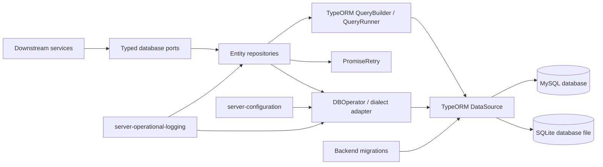
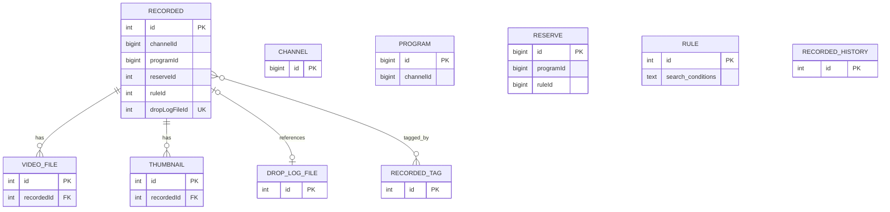
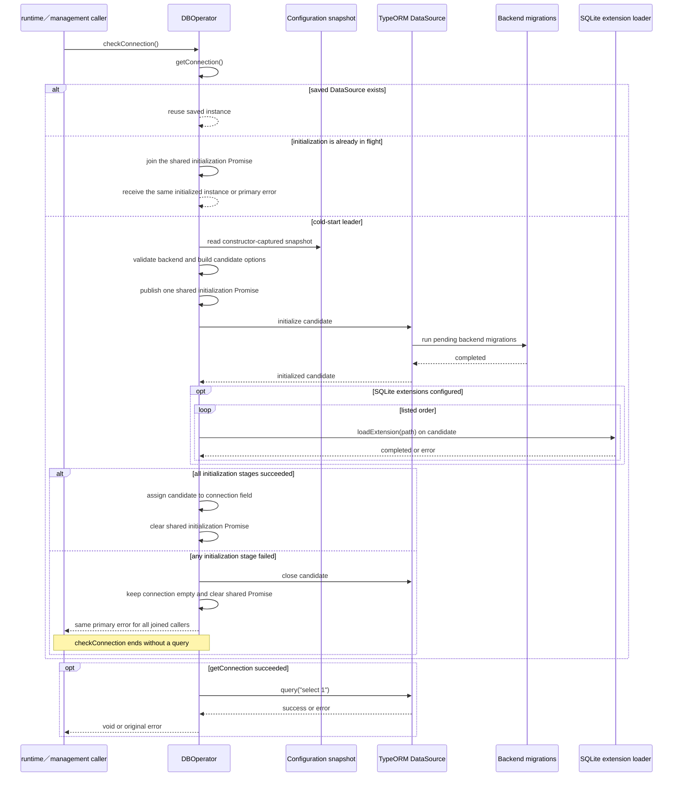
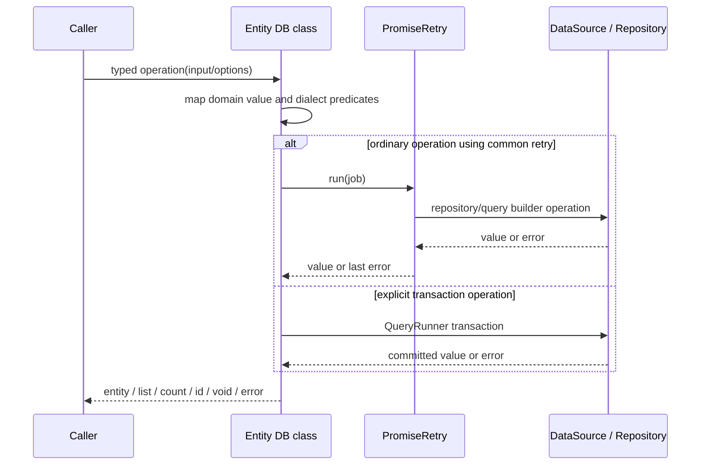
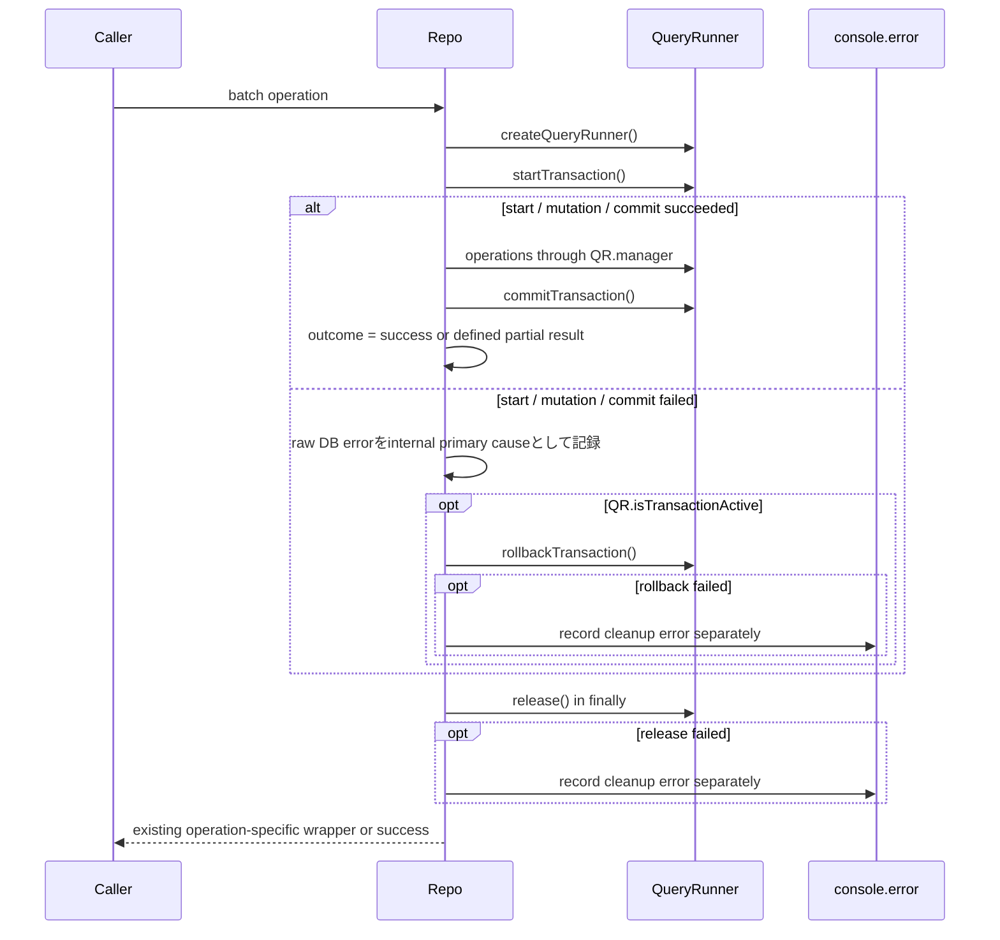
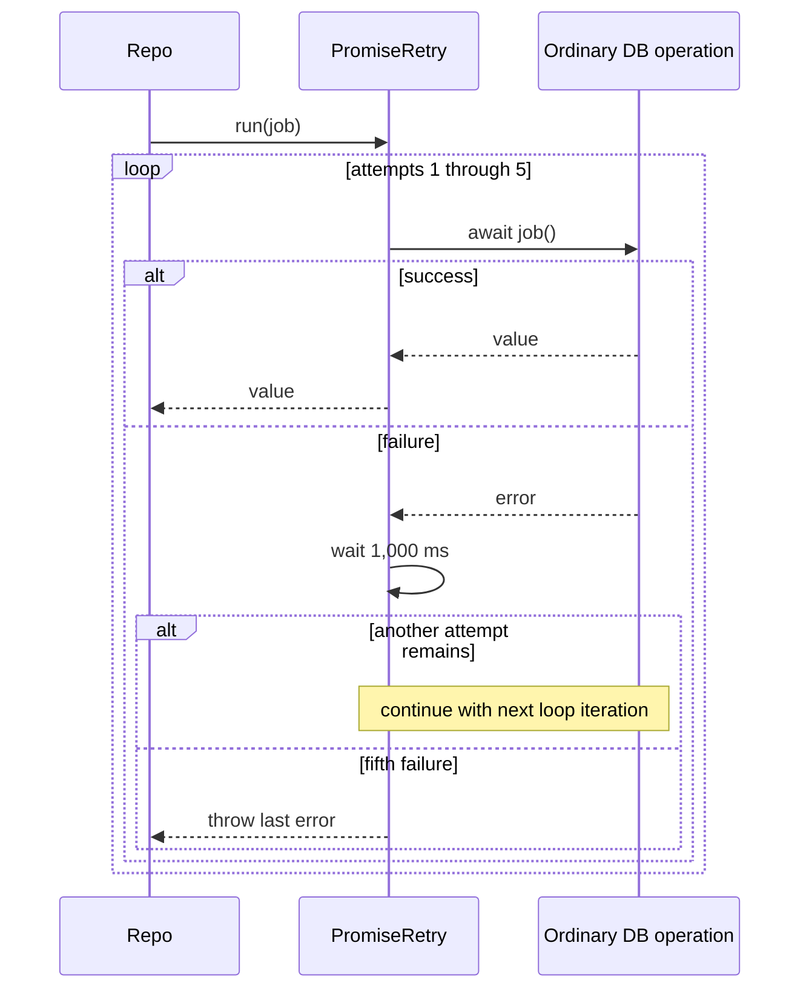

# データベース保存・検索機能 設計

## 概要

本機能は、SQLite または MySQL 上の EPGStation 管理情報について、接続、永続化、検索、処理単位の一括確定、通常操作の再試
行、およびデータ構造更新を提供する。各業務機能は型付きのデータベースポートを利用し、本機能は TypeORM の
Entity、Repository、QueryBuilder、QueryRunner、および Migration へ変換する。

設計の中心は次の五点である。

1. 1 process 内で `DataSource` を遅延生成し、保存済み接続がある後続処理ではその接続を共有する。cold startの並行要求は一
   つの初期化Promiseへ合流する。
2. 管理情報の表現と関連、SQLite・MySQL ごとの差異、および読取時の復元失敗を保存境界で扱う。
3. 要件で指定された処理だけを明示的な transaction 境界に置き、通常の単発操作とは分離する。
4. Migration と SQLite extension 読込みを接続初期化の一部として実行し、すべて成功した接続だけを共有fieldへ保存する。
5. 接続、Migration、extension、簡易問い合わせが成功または失敗を返すまで待ち、EPGStation 独自の一律な接続期限を追加しな
   い。

### 設計目標

-   SQLite と MySQL の双方で、同じ業務ポートから管理情報を保存・検索できること
-   接続、Migration、SQLite extension 読込みの各結果を最初の利用要求へ返し、各段階の保存状態を明示すること
-   初期化中の並行要求を一つへ合流し、失敗または不採用の候補接続を後続利用へ残さないこと
-   各 transaction の確定単位と共通再試行の適用範囲を曖昧にしないこと
-   `null`、空配列、件数、最後の error など、呼出元が判断に使う戻り値を維持すること
-   SQLite と MySQL の検索差を吸収したと偽らず、dialect ごとの能力を明示すること
-   既存のデータベース設定と保存データを維持したまま、現行公式 MySQL LTS の認証 handshake で本番接続と接続終了ができるこ
    と

### 非目標

-   予約、録画、rule、番組などの業務状態や変更可否の決定
-   録画ファイル、thumbnail、drop log の実体ファイル操作
-   backup の入出力形式、復元順序、旧版移行全体の orchestration
-   database server の配備、監視、backup、replication、failover
-   SQLite と MySQL の文字照合、正規表現、検索結果の完全一致
-   process 全体の起動待機時間、signal 処理、shutdown 順序の orchestration
-   新しい再接続方式、transaction 分類、または再試行分類の導入
-   サーバー認証の弱体化、削除済み旧認証プラグインへの依存、TypeORM の `driver` override、設定 field の追加
-   API、CLI、データベース schema、およびデータ移行の変更

## 境界と依存関係

### 所有する責務

-   `DataSource` の生成、初回利用、保存済み接続の process 内共有、利用可能性確認、明示的終了
-   SQLite database file と extension、または MySQL 接続情報からの接続 option 構築
-   接続試行と利用可能性確認について、利用する database driver と TypeORM の結果をそのまま待つ境界
-   Entity、table、column、relation、dialect 固有の値変換
-   管理情報ごとの CRUD、条件検索、並び替え、絞り込み、pagination、件数取得
-   要件 4 で指定された transaction の開始、確定、取消し、解放
-   通常操作で利用する共通再試行の回数、待機、最後の error の伝播
-   backend ごとの Migration 選択、接続時実行、失敗時の非公開

### 境界外の責務

| 責務                                              | 所有機能                           | 本機能との契約                                                          |
| ------------------------------------------------- | ---------------------------------- | ----------------------------------------------------------------------- |
| YAML 読込み、共通補完、snapshot 配布              | `server-configuration`             | `IConfiguration.getConfig()` から database 設定 snapshot を受け取る     |
| system log の sink、level、rotation、重大異常方針 | `server-operational-logging`       | 接続処理（`DBOperator`）は event と error を system logger へ渡す。transaction の raw error と rollback / release error は各 repository が `console.error` で記録する。番組増分更新と放送局更新の個別失敗は repository が system logger へ記録する                     |
| database が利用可能になるまでの起動待機           | `server-application-runtime`       | `checkConnection()` が失敗を返した後に 1 秒待って成功まで繰り返す       |
| 明示的な接続終了を含む管理処理                    | `server-management-tools`          | backup・restore・旧版移行の完了後に `closeConnection()` を 1 回要求する |
| backup payload、復元する種類と順序                | `server-management-tools`          | 種類ごとの `restore()` を順次呼び出す                                   |
| 状態遷移、入力値の業務妥当性                      | 各 downstream 業務機能             | 妥当と判断済みの entity または query option を渡す                      |
| 実ファイルの生成・削除                            | 録画、保存先、thumbnail 等の各機能 | 本機能は path、size、関連 ID などの管理情報だけを保存する               |

### 許可する依存

本機能から直接利用できる上位機能は `server-configuration` と `server-operational-logging` だけであ
る。TypeORM、`better-sqlite3`、`mysql2` は保存 adapter の技術依存であり、業務機能への逆依存を作らない。downstream 機能の
service、HTTP API、event model を接続管理や repository の内部へ import しない。ただし既存ポートの入力 DTO 型は互換性維持
のため境界型として利用できる。MySQL の driver は直接依存の `mysql2` であり、旧来の `mysql` は直接依存に含めない。

### この設計を見直す必要がある変更

次の変更時は本設計と依存する設計を再検証する。

-   `IConfiguration` snapshot、database 設定 schema、default または reload 方針の変更
-   TypeORM、SQLite driver、MySQL driver の major/minor 更新、または driver 自身の接続待機の意味変更
-   直接 MySQL クライアントの置換、TypeORM の `type: 'mysql'` 経路における client 解決、または公式 MySQL LTS の認証方式
-   Entity relation、Migration、serialization 形式、ID 型の変更
-   repository port の戻り値、pagination、検索演算子、文字照合条件の変更
-   transaction 対象、復元順序、増分番組更新の結果契約の変更
-   共通再試行の回数、待機、対象操作の変更
-   process 起動確認、明示的な接続終了 caller、または共通 shutdown 導入の変更
-   `test/server` と共有 server test foundation の確定または変更

database 設定 schema と default を変更する場合は `server-configuration` Design を、起動待機または test foundation を変更
する場合は `server-application-runtime` Design を同時に再検証する。共通 shutdown を将来導入する場合は、その機能を定める
Requirements と Design、および本機能の終了 caller を同じ変更単位で追加する。

## Architecture

### 論理構成



`DBOperator` は接続 lifecycle と dialect 差を担当する。各 DB class は対応 Entity の CRUD・query・transaction を担当す
る。`PromiseRetry` は repository が明示的に委譲した通常操作だけを再実行する。TypeORM Migration は
`DataSource.initialize()` の接続初期化経路から backend 別に実行する。

### 技術選択

| 項目          | 選択                              | 設計理由                                                                       |
| ------------- | --------------------------------- | ------------------------------------------------------------------------------ |
| ORM           | TypeORM 1.x の `DataSource` API   | Entity、relation、QueryBuilder、QueryRunner、Migration を同じ adapter で扱える |
| SQLite driver | `better-sqlite3`                  | file database と native extension 読込みを提供する。TypeORM 1.x は旧 `sqlite3`（node-sqlite3）driver を廃止し `better-sqlite3` へ置き換えたため、利用者向け設定値は従来どおり `dbtype: 'sqlite'` のまま、`DataSource`生成時の`type`だけ`'better-sqlite3'`へ読み替える（`src/model/db/DBOperator.ts`） |
| MySQL driver  | 直接依存の `mysql2`               | 既存 `type: 'mysql'` 経路で TypeORM が利用する保守中クライアント。旧 `mysql` は直接依存に含めない |
| 接続単位      | process 内の保存済み `DataSource` | DI singleton の field に保存した接続を repository 間で共有する                 |
| schema 更新   | backend 別 Migration              | 自動同期を無効にし、版管理された変更だけを順番に適用できる                     |

本機能は MySQL の `connectTimeout`、SQLite 接続、Migration、extension、`select 1` を EPGStation 独自の timer で包まな
い。driver または TypeORM が返した成功・errorをそのまま接続 port の結果とする。repository port、Entity、Migration、共通
再試行の public signature は変更しない。

## Components and Interfaces

### Component 一覧

| Component              | 責務                                                      | 入力                              | 出力 / error                         | 依存                                           |
| ---------------------- | --------------------------------------------------------- | --------------------------------- | ------------------------------------ | ---------------------------------------------- |
| `DBOperator`           | `DataSource` 生成、初期化、共有、確認、終了、dialect 変換 | 設定 snapshot、logger             | `DataSource`、dialect 値、接続 error | configuration、logging、TypeORM                |
| Entity DB classes      | 管理情報の CRUD、query、transaction、restore              | entity、ID、query option          | entity、配列、件数、生成 ID、error   | `IDBOperator`、TypeORM、必要時 `IPromiseRetry` |
| `PromiseRetry`         | 通常操作の最大 5 回実行                                   | async job、任意 option            | job の値、または最後の error         | timer                                          |
| TypeORM `DataSource`   | driver 接続、pool/handle、Migration、repository 生成      | backend option、Entity、Migration | initialized source、driver error     | SQLite / MySQL driver                          |
| TypeORM `QueryRunner`  | 1 connection 上の transaction                             | transaction job                   | commit、rollback、error              | initialized `DataSource`                       |
| backend Migration      | 版管理された DDL                                          | Migration 実行順                  | schema 更新、error                   | TypeORM Migration API                          |
| Persistence test suite | 永続化固有の契約、内部分岐、実driver境界、資源解放を検証  | compiled production、fixture      | test結果、matrix証跡   | 共有server test foundation、SQLite / MySQL     |

### 接続 port

```ts
interface IDBOperator {
    getConnection(): Promise<DataSource>;
    checkConnection(): Promise<void>;
    closeConnection(): Promise<void>;
    isEnabledRegexp(): boolean;
    convertBoolean(value: boolean): boolean | number;
    isEnableCS(): boolean;
    getRegexpStr(cs: boolean): string;
    getLikeStr(cs: boolean): string;
}
```

| Operation           | 事前条件                          | 成功契約                                                             | 失敗契約                                                         |
| ------------------- | --------------------------------- | -------------------------------------------------------------------- | ---------------------------------------------------------------- |
| `getConnection()`   | configuration snapshot が構築済み | 保存済み接続がなければ一つの初期化へ合流し、あれば同じinstanceを返す | backend不正、接続、Migration、extensionのerrorを全合流要求へ返す |
| `checkConnection()` | なし                              | `getConnection()` と `select 1` が成功すると `void`                  | 接続、Migration、extension、query の error をその呼出しへ返す    |
| `closeConnection()` | 管理処理と接続初期化が完了済み    | 接続がなければ no-op、あれば `destroy()` 完了後に `void`             | driver の終了 error を返す                                       |
| dialect helper      | snapshot の `dbtype` が確定済み   | 下記 dialect 表の値を返す                                            | 未対応 backend を接続可能とは扱わない                            |

`closeConnection()` は呼出元にとって terminal な接続 lifecycle 操作である。終了後の再利用を約束せず、同じ process で新し
い接続を生成する契約も持たない。呼出元は自身が開始したdatabase operationとcold-start初期化のsettlement後にだけ
`closeConnection()`を呼ぶ。初期化または通常operationと同時に接続を閉じる呼出しは対応範囲外であり、本機能はin-flight初期
化をcancel、join、またはcloseへ転換しない。将来、稼働中serverの共通shutdownから接続終了を要求する場合は、受付停
止、in-flight drain、初期化との排他、および終了後stateを別途設計する。

### 接続設定契約

```ts
interface DatabaseConnectionSettings {
    dbtype: 'sqlite' | 'mysql';
    sqlite?: {
        extensions?: string[];
        regexp?: boolean;
    };
    mysql?: {
        host: string;
        user: string;
        port: number;
        password: string;
        database: string;
        charset?: string;
    };
}
```

`DatabaseConnectionSettings` は本設計上の投影であり、新しい runtime service interface ではない。

| 項目                | 外部入力                               | snapshot                             | 規則                                                                                                |
| ------------------- | -------------------------------------- | ------------------------------------ | --------------------------------------------------------------------------------------------------- |
| SQLite path         | 指定なし                               | `<server-root>/data/database.db`     | server root から決まる database file                                                                |
| `sqlite.extensions` | 省略可                                 | `undefined` または順序付き配列       | 記載順を変更・重複排除せず読み込む                                                                  |
| `sqlite.regexp`     | 省略可                                 | boolean または `undefined`           | `true` の場合だけ正規表現能力あり                                                                   |
| MySQL 接続項目      | backend 選択時に `mysql` object が必要 | host、user、port、password、database | `mysql` object がなければ接続を開始せず error。値は採用 client へ渡し、接続可否を driver 結果で判定する |
| `mysql.charset`     | 省略可                                 | 省略時 `utf8mb4`                     | DataSource option に渡す                                                                            |

Requirement 8 のクライアント置換は、上表の設定 field を増やさず減らさず、SQLite 経路も変えない。保存済みデータベースデー
タはその場に残す。これはクライアントライブラリ置換であり、schema 変更やデータ移行ではない。

本機能は MySQL option へ EPGStation 独自の `connectTimeout` を設定せず、SQLite、MySQL、Migration、extension、`select 1`
のいずれも application timer で打ち切らない。採用する driver や OS が自身の待機条件で error を返すことはあるが、その条件
は EPGStation の設定契約ではない。

`getConnection()` と `checkConnection()` の契約は次のとおりである。

1. `connection` が存在すれば同じ保存済み instance を返す。
2. `connection` がなく初期化Promiseが存在すれば、後続callerは新しい候補を作らず同じPromiseへ合流する。
3. どちらもなければ、backend設定を検査して候補`DataSource`を一つ生成し、その初期化Promiseを直ちに共有する。
4. `migrationsRun: true` により接続初期化中に未適用 Migration を順に実行し、続いてSQLite extensionを設定順に読み込む。
5. 接続、Migration、extensionがすべて成功した場合だけ候補を`connection` fieldへ代入し、初期化Promiseを解除して全callerへ
   同じinstanceを返す。
6. いずれかが失敗した場合は候補を`connection`へ代入せず、作成済み候補を閉じ、初期化Promiseを解除して全callerへ同じ
   primary errorを返す。cleanup errorは別の内部診断として記録し、後続callerは新しい初期化を開始できる。
7. 初期化中に既存の利用可能接続が採用済みとなり候補を採用しない経路が生じる場合も、不採用候補を閉じてfieldへ残さない。
8. `checkConnection()` は `getConnection()` の後に返された instance で `select 1` を実行し、成功時に `void`、失敗時に元
   の error を返す。
9. 一回の接続作成、Migration、extension読込み、または確認queryがpendingの間はその処理を待ち続け、EPGStation独自の
   timeout、detached `Promise.race()`、強制 abort、または timeout 後の別試行を追加しない。

設定 reload は、構築済み `DBOperator` と `DataSource` を差し替えない。新しい接続先を反映するには、所有側 lifecycle に
従って component または process を再構築する。

### 再試行 port

```ts
interface RetryOption {
    cnt?: number; // default: 5 attempts in total
    waitTime?: number; // default: 1000 ms after each failed attempt
}

interface IPromiseRetry {
    run<T>(job: () => Promise<T>, option?: RetryOption): Promise<T>;
}
```

共通契約では、最初の実行を 1 回目として最大 5 回呼び出す。各失敗後に 1,000 ms 待ち、その後に次の試行が残る場合だけ再試行
する。このため最大失敗時は job 呼出し 5 回、待機 5 回の後、5 回目の error object を呼出元へ返す。transaction job 全体を
この port へ渡さない。

`RetryOption` は既存 caller との互換性を維持する拡張点である。repository が option を省略する通常経路は上記の `5` と
`1_000` を使用する。0 以下、非整数、非有限値を新しい意味へ読み替える契約は追加しない。

### Repository port

各 port の TypeScript signature を互換境界とする。`findId` 系は該当なしを `null`、複数検索は該当なしを空配列、一覧と件数
を返す port は `[items, totalCount]`、追加系は必要に応じて生成 ID、更新・削除・restore は `void` を返
す。driver、query、serialization の失敗は error として reject する。

| Port                 | 変更 operation                                         | 主な検索 operation                                        | 特記事項                                 |
| -------------------- | ------------------------------------------------------ | --------------------------------------------------------- | ---------------------------------------- |
| `IChannelDB`         | `insert`、`update`                                     | ID、放送種別、全件                                        | 並び順指定を扱う                         |
| `IProgramDB`         | 全件/放送局置換 `insert`、増分 `update`、古い番組削除  | ID、event relay、rule、放送局時刻、schedule、放送中、全件 | 置換と増分で確定契約が異なる             |
| `IReserveDB`         | `insertOnce`、`updateOnce`、`updateMany`、`restore`    | ID、一覧/件数、番組、時間範囲、rule、手動 ID              | `updateMany` は transaction              |
| `IRuleDB`            | 追加、更新、有効化、無効化、削除、restore              | ID、一覧/件数、keyword、ID 群                             | JSON text field を domain 形式へ復元する |
| `IRecordedDB`        | 追加、更新、関連 ID 除去、保護変更、削除、restore      | ID 群、一覧/件数、channel/genre 集約、最古、reserve ID    | relation 選択 option を持つ              |
| `IRecordedHistoryDB` | 追加、期限削除、restore                                | 全件                                                      | 履歴を独立保存する                       |
| `IVideoFileDB`       | 追加、path/size 更新、削除、recorded 単位削除、restore | ID、全件                                                  | file 実体は操作しない                    |
| `IDropLogFileDB`     | 追加、件数更新、削除、restore                          | ID、全件                                                  | log 実体は操作しない                     |
| `IThumbnailDB`       | 追加、削除、recorded 単位削除、restore                 | ID、全件                                                  | image 実体は操作しない                   |
| `IRecordedTagDB`     | 追加、更新、削除、relation 追加/削除、restore          | ID、一覧/件数                                             | many-to-many relation を所有する         |

repository は業務上の「この変更を許可するか」を判断しない。caller が渡した型付き値を保存形式へ変換し、database 制約と処
理契約だけを適用する。

### Storage deletion candidate provider contract

`server-storage-management` Requirements R4.1、R4.8、R6.4をconsumer authorityとし、本機能は次の
`IStorageDeletionCandidatePort`を`IRecordedDB`／`RecordedDB`が直接実装するDB-backed provider contractを提供する。この記述
はcross-spec同期用の補足であり、本機能Requirementsのformal AC、Requirements Traceability、および機能固
有test matrixの行数・件数を変更しない。

```ts
interface IStorageDeletionCandidatePort {
    findOldestUnused(request: {
        storageName: string;
        excludedRecordedIds: ReadonlySet<RecordedId>;
    }): Promise<RecordedId | null>;
}
```

`RecordedId`は既存APIとEntity IDに対応するprimitive `number`である。`RecordedDB.findOldestUnused()`は`Recorded`
entity、relation、DTO、またはlock tokenを返さず、条件を満たす一件のprimitive IDだけを返し、該当なしは`null`を返
す。provider queryは次を一つのcontractとして適用する。

1. `Recorded.isProtected = false`である。
2. 一件以上の`VideoFile` relationを持ち、すべてのrelationの`parentDirectoryName`が要求の`storageName`とbyte単位で一致する
   （MySQLは`CAST(... AS BINARY)`、SQLiteは`CAST(... AS BLOB)`で比較する）。対象保存先のrelationが一件あっても、別保存先の
   relationが混在するrecorded rowは除外する。
3. `Recorded.id`が`excludedRecordedIds`に含まれない。空集合では空の`NOT IN`を生成せず条件自体を省略し、非空集合では各ID
   をparameter bindingする。
4. `Recorded.startAt ASC`、同値では`Recorded.id ASC`を同時に維持して一件へ制限する。後続の`orderBy()`で先行sortを上書き
   せず、最初のキーへ`orderBy`、tie-breakへ`addOrderBy`相当を使う。

SQLiteとMySQLでは、保存先所属を「対象relationが存在する`EXISTS`」かつ「不一致relationが存在しない`NOT EXISTS`」として表
し、`storageName`、保護値、および除外IDは本機能のdialect変換とparameter bindingを使う。backend固有の真偽値投影を除き、同
じrow集合・順序・primitive ID／`null`契約を維持する。通常のread queryとして既存の接続共有と共通再試行の所有規則に従
い、query、relation、接続、または最終retryの失敗は元errorでrejectする。生成したquery／connection資源は既存のpersistence
lifecycleに従って解放し、部分的な候補や`null`へ変換しない。

`excludedRecordedIds`はconsumerが収集した利用中・試行済みIDのsnapshotであり、本機能はその由来や利用状態を判定しない。
storage consumerは返却IDを自身の`attemptedRecordedIds`と再照合し、同じIDを再試行しない。削除直前の録画・encode・配信の排
他的確認、保護・relation・保存先所属の最終再読取、および削除は`server-application-runtime`と `server-recorded-content`が
所有する。本機能はusage lockを取得・保持せず、recorded rowまたはfileを削除しない。

既存`IRecordedDB.findOld()`はこのprovider contractとは別のqueryである。このcontractは次の配置で実装する。

| 種別                 | path                                                                        | 責務                                                                                             |
| -------------------- | --------------------------------------------------------------------------- | ------------------------------------------------------------------------------------------------ |
| consumer interface   | `src/model/operator/storage/IStorageDeletionCandidatePort.ts`               | requestとprimitive `RecordedId \| null`だけを公開し、storage側がinterfaceを所有する              |
| query implementation | `src/model/db/RecordedDB.ts`、`src/model/db/IRecordedDB.ts`                 | `findOldestUnused()`がbackend共通のparameterized candidate queryを唯一実装する                   |
| composition binding  | `src/model/ModelContainerSetter.ts`                                         | `IRecordedDB`をstorage consumer portへ直接bindingし、別adapterへSQL・relation条件を複製しない    |
| contract test        | `test/server/persistence/storage-deletion-candidate.cross-spec.test.ts`     | fake query境界でrequest、順序、primitive戻り値、rejectを検証する                                 |
| SQLite / MySQL test  | `test/server/persistence/storage-deletion-candidate.integration.test.ts`    | temporary SQLiteと隔離MySQLの実driverでrelation query、parameterization、結果、cleanupを検証する |

## Data Model

### 所有データ

| 区分         | Entity                                  | 保存責務                                                        |
| ------------ | --------------------------------------- | --------------------------------------------------------------- |
| 放送情報     | `Channel`、`Program`                    | 放送局識別・表示情報、番組時刻・内容・拡張情報                  |
| 予約         | `Reserve`、`Rule`                       | 予約情報、自動予約条件と更新回数                                |
| 録画記録     | `Recorded`、`RecordedHistory`           | 録画済み番組の metadata と録画履歴                              |
| 録画付随情報 | `VideoFile`、`DropLogFile`、`Thumbnail` | file path、size、drop/scrambling/error 件数、thumbnail metadata |
| 分類         | `RecordedTag`                           | tag 属性と録画済み番組との関連                                  |



図で relation を示した
`Recorded`―`VideoFile`、`Recorded`―`Thumbnail`、`Recorded`―`DropLogFile`、`Recorded`―`RecordedTag` は TypeORM relation
と Migration の foreign key / join table で管理する。`channelId`、`programId`、`reserveId`、`ruleId` など他 bounded
context への ID は scalar reference として保存し、この機能で object relation や参照先の業務状態を推論しない。

`Recorded` 削除に伴う明示 relation の削除規則は Migration の foreign key と repository operation に従う。実ファイル削除
は別機能が行うため、row の cascade を実ファイル lifecycle と同一視しない。

### Serialization 契約

`Rule` の channel ID、genre、time、search period、tag などの複合値は JSON text として保存し、読取時に型付き値へ復元す
る。これらの保存済み text が JSON として解釈できない場合、空配列、空 object、または default へ置換せず parsing error を
返す。`Program` の raw extended 値は書込時に JSON textへ変換するが、repository は読取時に object へ復元せず、保存された
text のまま返す。この境界で Program の text を新たな解析対象にしない。

boolean は query parameter 生成時に SQLite では `1` / `0`、MySQL では boolean として扱う。Entity hydration 後の domain
型は port の既存型を維持する。

## Workflows

### 初回接続と利用可能性確認



最初のcallerは候補の接続、pending Migration、およびSQLite extension読込みを一つの初期化Promiseとして公開する。同じ
processで接続未保存の間に到着したcallerは、そのPromiseへ合流し、新しい候補を作らない。すべての初期化段階が成功した場合だ
け候補を共有fieldへ代入し、各callerへ同じinstanceを返す。

接続、Migration、またはextension読込みのいずれかが失敗した場合は、候補を共有fieldへ代入せず、作成済み候補を閉じて初期化
Promiseを解除する。合流したcallerには同じprimary errorを返し、候補のclose失敗は別の内部診断として記録する。後続要求は新
しい候補による初期化を開始できる。

利用可能性確認は `select 1` の成功だけを返し、接続、Migration、extension、query の失敗を握りつぶさない。いずれかが
pending の間は呼出元も待ち続ける。application runtimeの起動時利用可能性確認はerrorが返った場合だけ1秒後に再確認する。
backup、restore、旧版移行を含むmanagement toolsは元のDB処理のsettlementを待ち、EPGStation独自の期限で打ち切らないが、
error後の再試行方法は各toolが所有する。本機能はmanagement toolsへ一律の1秒再試行を追加しない。Migration失敗後に後続要求
が呼ばれた場合はfieldが空なので、新しい`DataSource`を生成して未適用Migrationをもう一度実行する。

1 processでは、cold startの並行`getConnection()`を一つの初期化Promiseへ集約し、正常な初回利用後はfieldへ保存した同じ
instanceを共有する。複数process間ではinstanceや初期化状態を共有しない。database側のprocess間concurrency制御はdriver、
Migration table、およびdatabase engineに従う。

### CRUD と query



検索条件は parameter binding を用い、文字列を SQL へ直接連結しない。sort key と direction は各 query option が許可する列
へ写像する。pagination は `skip` / `take` 相当で適用し、一覧と総件数を要求する port は同じ filter を共有して
`[items, totalCount]` を返す。relation の要否は `RecordedColumnOption` などの port option に従い、不要な relation を常に
eager load しない。件数の上限（limit）が 0 のときは件数を制限しないものとして扱い、`take` 相当を適用しない
（TypeORM 1.x は `take(0)` を `LIMIT 0` にするため、0 件を返さないよう適用を避ける）。位置指定（offset）が 1 以上のとき
は、上限なしの位置指定を拒む MySQL でも通るよう、`take` 相当に十分大きな固定値を与えて offset 以降の全件を返す。
番組検索（`ProgramDB.findRule`）の `limit` も、0 のときは `limit` を適用せず件数を制限しない（位置指定は使わない）。

### Dialect ごとの検索契約

| 能力                    | SQLite                                                       | MySQL                                                     |
| ----------------------- | ------------------------------------------------------------ | --------------------------------------------------------- |
| boolean parameter       | `1` / `0`                                                    | boolean                                                   |
| case-sensitive 指定能力 | 独立能力として提供しない                                     | caller の `cs` に応じた演算子を利用する                   |
| LIKE                    | `like`                                                       | `cs=true` は `like binary`、それ以外は `like`             |
| regular expression      | `sqlite.regexp === true` の場合だけ利用可。演算子は `regexp` | 利用可。`cs=true` は `regexp binary`、それ以外は `regexp` |
| regexp 設定省略         | 利用不可                                                     | 該当なし                                                  |
| 結果同一性              | MySQL と同一とは保証しない                                   | SQLite と同一とは保証しない                               |

文字照合、Unicode 正規化、database collation、regular expression engine の差は残る。repository は能力判定と適切な演算子
選択を行うが、結果集合を post-process して強制的に一致させない。

### Transaction

| 処理                           | Transaction 単位             | 成功                                                   | 依頼元へ返す既存error message      |
| ------------------------------ | ---------------------------- | ------------------------------------------------------ | ---------------------------------- |
| 複数予約の一括追加・更新・削除 | `updateMany()` 1 回          | 全変更を commit                                        | `ReserveUpdateManyError`           |
| 番組全件置換                   | 対象削除と全 insert          | 全変更を commit                                        | `InsertError`                      |
| 放送局単位の番組置換           | 指定 channel の削除と insert | 全変更を commit                                        | `InsertError`                      |
| backup 復元の一種類            | 対象種類の削除と全 insert    | その種類を commit                                      | `restore error`                    |
| 番組増分更新                   | 1 回の増分処理               | 個別失敗を記録し、残る成功変更を commit する場合がある | 既存の当該operation error contract |

上表の「対象削除」（番組全件置換、backup 復元の各種類、その他 entity の restore）は、criteria を指定しない全件削除であ
る。TypeORM 1.x は `repository.delete()` / `manager.delete()` へ空 criteria を渡すことを拒否するため、これらの全件削除
は `queryRunner.manager.createQueryBuilder().delete().from(Entity).execute()` で実装する（例:
`src/model/db/ProgramDB.ts`、`RecordedDB.ts`、`ReserveDB.ts`、`RuleDB.ts`、`ThumbnailDB.ts`、`VideoFileDB.ts`、
`DropLogFileDB.ts`、`RecordedTagDB.ts`、`RecordedHistoryDB.ts` の `restore()` / cleanup 経路）。対して「放送局単位の番組
置換」のように非空 criteria（`channelId: In(ids)` 等）を指定する削除は、従来どおり `manager.delete(Entity, criteria)`
を使う。



QueryRunnerを生成した後は`startTransaction()`自体の同期・非同期failureを含むすべての経路を一つの`try/catch/finally`へ置
く。rollbackは`queryRunner.isTransactionActive`がtrueの場合だけ試みる。開始、mutation、commitの最初のraw failureは内部の
primary cause／診断情報として保持し、rollbackまたはreleaseのfailureは別のcleanup診断として記録する。いずれのraw errorも
依頼元へ直接投影せず、repository portが従来から持つ`ReserveUpdateManyError`、`InsertError`、または`restore error`を返
す。rollback／release failureはoperation wrapperを置き換えない。operation failureがなくreleaseだけ失敗した場合も成功とせ
ず、該当repositoryの同じoperation wrapperを返し、raw release errorはcleanup診断に留める。raw errorを公開`Error.cause`へ
格納して依頼元から参照可能にすることも行わない。

予約一括変更、番組置換、種類別 restore には共通再試行を重ねない。commit 結果が不明な操作を job 単位で再実行して重複させ
ないためである。backup 復元全体は一つの transaction ではなく、caller が種類ごとの restore を順番に呼ぶ。前段が確定した後
に後段が失敗した場合、前段までを自動 rollback しない。

番組増分更新は置換契約とは別であり、個別の削除・追加・更新失敗を log した後も残りを処理し、成功分を確定する（Requirement
4.6）。個別の失敗は caller へ返さず、更新全体は成功として扱う。transaction の開始・確定・後始末の失敗は `UpdateError` と
して caller へ返る。

要件で列挙していない複数件 operation は、一律に atomic または非 atomic と分類し直さない。それぞれの port と実装が持つ処
理境界を保ち、範囲を拡張する場合は個別要件を追加する。

### 共通再試行



待機は各失敗後に置くため、5 回目の失敗後も 1,000 ms 待ってから error を返す。次の attempt がない場合は待機後に再試行せ
ず、最後の error を返す。repository ごとの別 retry policy や接続再試行方式は追加しない。

### Migration

1. 共通の Entity 集合を使用し、`dbtype` から SQLite または MySQL の Migration path を選ぶ。
2. `synchronize` を `false`、runtime の `migrationsRun` を `true` として `DataSource` を構築する。
3. `initialize()` が TypeORM の管理 table を参照し、未適用 Migration を timestamp 順に実行する。
4. SQLiteでは接続とMigrationが成功した候補へ、必要なextensionを設定順に読み込む。初期化Promiseへ合流したcallerはこの処理
   を重複して開始しない。
5. 接続、Migration、およびextension読込みがすべて成功した後だけ、候補を共有fieldへ代入する。
6. いずれかの初期化段階が失敗した場合はfieldを空のまま維持し、候補を閉じ、元errorを初期化Promiseへ合流した全callerへ返
   す。後続の利用可能性確認は新しいinstanceから未適用Migrationを再試行できる。

接続時に `down` を自動実行せず、適用済み版を降格しない。CLI 用 option が runtime と異なる場合でも、runtime の自動実行契
約を変更しない。Entity 差分からの自動同期も利用しない。

### 明示的な接続終了

実装で `closeConnection()` を呼ぶのは、backup・restore を実行する管理 tool と旧版移行 tool である。各 tool は自身の処理
と、その処理から開始された接続初期化が完了した後に接続終了を要求し、完了してから process の正常終了へ進む。本機能は
connection がなければ何もせず、存在すれば `DataSource.destroy()` を await する。終了失敗は caller へ返し、呼び出した
tool がその処理結果を決める。本機能が signal handler や `process.exit()` を登録しない。

通常 server process には signal 受信、受付停止、依存順停止、DB close をまとめた共通 shutdown が存在しない。本設計も
application runtime にその責務を割り当てず、新しい終了 caller や停止順序を追加しない。

## Invariants and Concurrency

### 不変条件

1. 共有 field に保持する `DataSource` は backend 検証、初期化、pending Migration、および必要なSQLite extension読込みを完
   了している。
2. 正常な初回利用後に順次呼び出される `getConnection()` は、同じ process で同じ返却済み instance を返す。
3. transaction 対象の全 database mutation は、その `QueryRunner.manager` を通す。
4. atomic 対象では、全 mutation 成功前に commit しない。
5. 共通再試行は transaction 全体へ適用しない。
6. 保存値の復元失敗を空値や default へ変換しない。
7. SQLite extension の順序を入れ替えず、途中失敗時はその最初の利用要求へ接続を返さない。
8. 接続、Migration、extension、利用可能性確認へ EPGStation 独自の一律な timeout を追加しない。
9. configuration snapshot の credential を log message、error 装飾、test fixture 出力へ含めない。
10. 明示的な接続終了完了後の再利用を保証しない。
11. cold startの同時callerは一つの初期化Promiseへ合流し、候補生成、initialize、Migration、extension読込みを重複開始しな
    い。
12. 初期化段階の失敗候補または採用しない候補をconnection fieldへ残さず、作成済み候補を閉じる。失敗後の後続callerは新しい
    初期化を開始できる。
13. QueryRunner生成後はtransaction開始失敗を含む全経路でreleaseし、rollbackはactive transactionだけへ行う。
14. transactionのraw operation errorは内部primary causeとして保持し、rollback／release errorは別のcleanup診断に記録す
    る。依頼元には既存のoperation-specific wrapperだけを返す。
15. MySQL 本番接続は既存 `type: 'mysql'` 経路の直接依存 `mysql2` を使い、旧直接 `mysql` や削除済み認証プラグイン、認証弱
    体化へ fallback しない。
16. MySQL クライアント置換は既存設定 field と保存済みデータを変更しない。

### Concurrency 境界

-   DI の `IDBOperator` は process singleton であり、正常な初回利用で返却済みの `DataSource` の pool / handle を
    repository 間で共有する。
-   各 OS process は独立した singleton を持つ。memory 上の connection state、transaction、retry counter を process 間共
    有しない。
-   `RuleDB` など repository 自体の scope が異なっても、同じ process の `IDBOperator` を利用する。
-   transaction は `QueryRunner` ごとに隔離し、通常 repository operation がその runner 外の manager を混在させない。
-   cold start の同時 `getConnection()` はprocess内の一つの初期化Promiseへ合流する。成功時は全callerへ同じinstanceを返
    し、失敗時は全callerへ同じprimary errorを返して候補を閉じる。
-   database isolation level を本機能独自に上書きせず、採用 driver / database の標準と Migration 制約に従う。特定
    isolation level が必要な業務を追加する場合は個別設計する。

## Failure Semantics

| Failure                                         | 呼出元への結果                                  | 接続公開 / transaction                      | Log と recovery 所有                         |
| ----------------------------------------------- | ----------------------------------------------- | ------------------------------------------- | -------------------------------------------- |
| 未対応 `dbtype`                                 | 接続 error                                      | 公開しない                                  | configuration / startup が是正               |
| MySQL 設定object不在または接続値不受理          | object不在は接続前error、値不受理はdriver error | 公開しない                                  | configurationを修正して次の起動確認で再試行  |
| driver 接続失敗                                 | driver error                                    | 公開せず候補を閉じる。旧 client / 弱体化認証へ進めない | runtime／management が後続確認を判断         |
| Migration 失敗                                  | Migration error                                 | fieldへ保存せず候補を閉じる                 | 次の確認で新しい instance と未適用分を再試行 |
| SQLite extension 失敗                           | extension error                                 | fieldへ保存せず候補を閉じる                 | 次の確認で新しい instanceから初期化を再試行  |
| 初期化候補のclose失敗                           | 元の初期化errorを維持                           | fieldへ保存しない                           | close errorは別の内部cleanup診断として記録   |
| `select 1` 失敗                                 | query error                                     | 既存 instance の自動置換は行わない          | runtime／management が起動待機を継続し得る   |
| 一回の接続・確認が pending                      | 呼出元も pending                                | EPGStation は強制終了・別試行を追加しない   | driver／TypeORM の settlement を待つ         |
| 通常 CRUD/query の一時失敗                      | 最大 5 回後の最後の error                       | transaction なし                            | repository の共通再試行                      |
| transaction開始／atomic mutation／commit失敗    | 既存operation-specific wrapper                  | activeならrollback、全経路release           | raw DB errorは内部primary causeとして記録    |
| raw operation failure後のrollback / release失敗 | 同じoperation-specific wrapperを維持            | cleanup失敗を別記録。commit成功とは扱わない | 各 repository が `console.error` へ記録                   |
| 成功後のreleaseだけが失敗                       | 該当repositoryのoperation-specific wrapper      | resource解放失敗を成功にしない              | raw release errorはcleanup診断に留める       |
| JSON 復元失敗                                   | parsing error                                   | 読取結果を捏造しない                        | data 修復は管理側責務                        |
| `destroy()` 失敗                                | close error                                     | 終了成功とは扱わない                        | 呼び出した管理 tool が処理結果を決定         |

接続 error を業務上の「該当データなし」へ変換しない。`findId()` の `null` は query が正常終了して row がない場合だけであ
る。共通 error class hierarchy、再接続 state machine、backend failover は追加しない。

### 実装上の不整合と保証境界

-   `closeConnection()` 後も破棄済み instance を field に残す実装は、明示的な接続終了後の再利用を安全にしない。終了を
    terminal とし、新しい再接続契約は追加しない。

実装特性の差はcharacterization testで再現し、望ましいcontract testへ混ぜない。本設計は接続・利用可能性確認へ新しい
timeout、一般CRUD mutex／timeout、または自動再接続方式を追加しない。

## Requirement 8: 現行公式 MySQL LTS との接続互換

本節は Requirement 8 を、1 件のクライアント置換として記述する。

### 実装決定

1. 本番の MySQL 接続は、既存 TypeORM `type: 'mysql'` 経路が利用する直接依存の保守中クライアントを `mysql2` とする。
2. `DBOperator.createConnection()` の MySQL 分岐は `type: 'mysql'` を維持し、`driver` override、設定 field 追加、API /
   CLI / schema / データ移行、認証弱体化を行わない。
3. 旧 `mysql` は直接依存に残さず、TypeORM が旧 client を選ばないようにする。
4. 既存設定 field（`host` / `user` / `port` / `password` / `database` / 任意 `charset`）と SQLite 経路は変更しない。
5. 保存済みデータベースデータはその場に残す。本 remediation はクライアントライブラリ置換であり、schema 変更やデータ移行
   ではない。
6. 接続失敗は通常の driver / TypeORM 接続失敗として扱う。旧 client、削除済み `mysql_native_password`、認証弱体化へ
   fallback しない。
7. 直接依存は `mysql2` と `typeorm` である（版は `package.json` が正本）。

### 採用している構成

-   直接依存は `mysql2` と `typeorm` であり、旧 `mysql` は直接依存に無い（版は `package.json` が正本）。
-   本番接続は TypeORM `type: 'mysql'` を選び、`driver` override が無い（`DBOperator.createConnection()`）。
-   既存 MySQL 設定 field は `host` / `user` / `port` / `password` / `database` / 任意 `charset` である
    （`IConfigFile`、`config/config.yml.template`）。
-   公式現行 MySQL LTS は image tag `mysql:lts` で表し、焦点 integration がこの tag と image digest を検証する
    （`test/server/persistence/mysql-lts-connection.integration.test.ts`）。
-   保存データの互換は維持を要求するだけであり、移行手順は対象外である。

### 本番 lifecycle

1. `server-configuration` が既存のデータベース設定 snapshot を読む。MySQL のとき field は現行の `host` / `user` /
   `port` / `password` / `database` / 任意 `charset` である。
2. `DBOperator` が既存の `type: 'mysql'` option で TypeORM `DataSource` を生成する。`driver` は渡さない。
3. TypeORM は直接依存の `mysql2` を既存 `type: 'mysql'` 経路から利用し、公式現行 MySQL LTS が要求する認証 handshake を
   完了する。
4. handshake、`initialize()`、Migration が成功した場合だけ `getConnection()` が候補を共有 field へ公開する。これが公開
   完了である。
5. 公開後の `checkConnection()` は、返却済み instance で `select 1` を実行する。成功時は `void` を返す。失敗時は既存の
   query error を返し、公開済み instance を自動で閉じたり置換したりしない。
6. 既存の `closeConnection()` が `DataSource.destroy()` を待ち、接続を解放する。

失敗は次の二類に分ける。handshake、`initialize()`、または Migration が公開前に失敗した場合は、候補を公開せず閉じ、呼出
元へ通常の接続失敗を返す。`getConnection()` が instance を公開した後の `checkConnection()` / `select 1` 失敗は、既存の
query error を返すだけであり、公開済み instance の自動 close や置換を行わない。旧直接 `mysql` への切替、削除済み認証プ
ラグインの要求、サーバー認証の弱体化は recovery 経路に含めない。焦点 integration は、この既存
state 契約を oracle にする。

```mermaid
sequenceDiagram
    participant Conf as Configuration
    participant DB as DBOperator
    participant ORM as TypeORM type mysql
    participant C as mysql2
    participant S as Official MySQL LTS

    Conf->>DB: existing mysql settings
    DB->>ORM: DataSource type mysql without driver override
    ORM->>C: production client
    C->>S: authentication handshake
    alt handshake, initialize, and Migration succeed
        S-->>C: accepted
        C-->>ORM: connected
        ORM-->>DB: getConnection publishes DataSource
        Note over DB: published instance is the existing state contract
        DB->>ORM: checkConnection select 1
        alt select 1 succeeds
            ORM-->>DB: void
            Note over DB: application work on existing ports
            DB->>ORM: closeConnection destroy
            ORM->>C: release
            C->>S: close
        else select 1 fails
            ORM-->>DB: existing query error
            Note over DB: published instance remains; no automatic close or replacement
        end
    else handshake, initialize, or Migration fails before publication
        S-->>C: authentication or connection error
        C-->>ORM: driver error
        ORM-->>DB: primary error
        DB->>ORM: close unpublished candidate
        Note over DB: no legacy client or weakened auth fallback
    end
```

### 検証境界

Requirement 8 の主検証は、実際の本番接続境界である。

-   焦点 integration は、公式現行 MySQL LTS（image tag `mysql:lts`）に対し `Configuration` → `DBOperator` の接続作成と接続終了を検証する。接続作成の成功は `getConnection()` の公開完了を意味する。公開後の `select 1` 失敗
    は既存 query error の返却であり、公開済み instance の自動 close / 置換ではない。焦点 integration
    はこの既存 state 契約を oracle にする。
-   Requirement 8.3 の主証跡は、`test/server/persistence/mysql-lts-inplace-stored-data.integration.test.ts` の in-place 保存データ互換 integration である。置換前と
    同じ schema / migration history と代表的な保存済み row を持つ MySQL fixture を開き、`Configuration` → `DBOperator`
    → `mysql2` 経路で既存 row を読み、代表的な更新と再読取りを行い、schema / migration history が変わっていないことを確
    認し、close と cleanup する。空 schema からの Migration と CRUD は既存 R1〜6 の integration であり、この代替ではな
    い。`IConfigFile` / template の field 不変確認は設定形状の補助証跡に限定する。
-   fake DataSource の unit test を認証 handshake 成功の代替にしない。
-   公開後の `select 1` 失敗は既存 query error 契約のまま観測する。

### 実装・test の配置

| 役割 | locator | 内容 |
| --- | --- | --- |
| 直接依存 | `package.json`、`package-lock.json` | `mysql2` を直接依存とし、旧 `mysql` は含めない |
| 本番接続 option | `src/model/db/DBOperator.ts` | `type: 'mysql'` 維持、`driver` 非追加 |
| 設定契約 | `src/model/IConfigFile.ts`、`config/config.yml.template` | field 不変の確認。変更しない |
| 焦点接続・終了 test | `test/server/persistence/mysql-lts-connection.integration.test.ts` | 公式 LTS image / tag（`mysql:lts`）。公開後 `select 1` は既存 query error 契約 |
| 保存データ in-place 互換 test | `test/server/persistence/mysql-lts-inplace-stored-data.integration.test.ts` | 既存 schema / migration history / 代表 row の読取り・更新・再読取り・履歴非変更・close / cleanup |
| 既存実driver接続 test | `test/server/persistence/connection.integration.test.ts`、`close.integration.test.ts` | 採用 client `mysql2` での実 driver 接続と close |

## Test Strategy

### 共有 test root

`test/server`は`server-application-runtime` Designで確定した共有server test rootである。本設計は共通のVitest、production
compile境界、V8 coverage、root commandを再定義せず、永続化固有の責任単位だけを定める。下表は永続化固有のtest配置である。

| path                                               | 種別                | 責務                                                                      |
| ---------------------------------------------------------- | ------------------- | ------------------------------------------------------------------------- |
| `test/server/persistence/connection.spec.test.ts`          | `unittest/spec`     | fake DataSourceによる方式選択、single-flight、公開・失敗契約              |
| `test/server/persistence/repositories.spec.test.ts`        | `unittest/spec`     | 10 port の CRUD、null/empty/count、relation option、serialization error   |
| `test/server/persistence/search-dialects.spec.test.ts`     | `unittest/spec`     | boolean、LIKE、case-sensitive 指定、regexp capability、backend 差         |
| `test/server/persistence/retry.spec.test.ts`               | `unittest/spec`     | 5 attempts、5 waits、最後の error、transaction 除外                       |
| `test/server/persistence/implementation.test.ts`           | `unittest/imp`      | dialect helper、characterization、内部値域、方式別分岐                    |
| `test/server/persistence/connection.integration.test.ts`   | `integration`       | temporary SQLiteと隔離MySQLへの実driver接続、確認query、close             |
| `test/server/persistence/mysql-lts-connection.integration.test.ts` | `integration` | 公式現行 MySQL LTS への本番 Configuration→DBOperator 接続作成と close。公開後 `select 1` は既存 query error 契約 |
| `test/server/persistence/mysql-lts-inplace-stored-data.integration.test.ts` | `integration` | 置換前と同じ schema / migration history と代表保存 row を in-place で開き、Configuration→DBOperator→mysql2 で既存 row 読取り、代表更新・再読取り、履歴非変更、close / cleanup |
| `test/server/persistence/transactions.integration.test.ts` | `integration`       | 実driverで予約一括、番組置換、種類別 restore のcommit / rollback          |
| `test/server/persistence/migrations.integration.test.ts`   | `integration`       | backend 別 pending Migration、同期無効、失敗候補cleanup、再確認、降格なし |
| `test/server/persistence/queries.integration.test.ts`      | `integration`       | 実driverでCRUD、relation、boolean、文字列検索、正規表現能力を確認         |
| `test/server/persistence/close.integration.test.ts`        | `integration`       | 実driverのclose、no-op、destroy await/error、terminal lifecycle           |
| `test/server/persistence/doubles-parity.integration.test.ts` | `integration` | test の偽物と本番の部品の一致: synchronize の schema と migration の schema（全 table の列・既定値・NULL 可否・index）、MySQL の認証失敗・接続拒否と sqlite の拡張の実 error、query builder の偽物が記録する条件と実 SQL の結果（`findTimeRanges` の全 flag・除外、`findRuleId`・`findLists`・`findKeyword` の offset・limit、`removeRecording`・`changeProtect` の早期 return）、即時 retry と本物の `PromiseRetry`、恒等の `convertBoolean` と本物の `DBOperator`、microtask だけで解決する DB の偽物と better-sqlite3（event loop に戻らない）・MySQL（戻る）の違い |
| `test/server/persistence/harness.ts`、`backend-runtime.ts`、`mysql-runtime.ts` | integration helper | temporary SQLite database と隔離 MySQL schema を作り、cleanup する |
| `test/server/persistence/mysql-lts-runtime.ts`             | integration helper  | 公式 MySQL LTS container の起動と cleanup                                 |
| `test/server/fixtures/persistence/mysql-inplace/`          | integration fixture | 置換前と同じ schema / migration history と代表保存 row を持つ in-place fixture |

### Cross-spec補足case（formal trace／matrix外）

次のcaseは`server-storage-management` R4.1、R4.8、R6.4をprovider側から接続する非formal補足である。本機能のformal AC、
Requirements Traceability、唯一の機能固有test matrix、既存case件数へ加算しない。

| 補足case | 種別 | test path | assertion |
| -------- | ---- | --------- | --------- |
| `[PERSIST-2.7]` `storage deletion candidate through real sqlite` / `real mysql` | `integration` | `storage-deletion-candidate.integration.test.ts` | SQLite・MySQL の実driverで、保存先不一致、保護中、別保存先relation混在、除外ID、同じ`startAt`の`id ASC` tie-break、全候補除外=`null`、接続を閉じた後のrejectを検証し、recorded／video row数が変わらないことを確認する |
| `[PERSIST-2.7]` returns one primitive id and applies storage, protection, exclusion, and stable order together | `spec/imp` | `storage-deletion-candidate.cross-spec.test.ts` | fake query境界で保護、relation、除外ID、`orderBy`と`addOrderBy`、`take(1)`、primitive IDの戻り値を確認する |
| `[PERSIST-2.7]` uses byte-exact storage identity / maps absence to null / preserves the final query rejection | `spec/imp` | `storage-deletion-candidate.cross-spec.test.ts` | 保存先名のbyte単位比較、除外IDが空のとき`NOT IN`を生成しないこと、該当なし=`null`、最終query rejectを`null`へ変換しないことを確認する |
| `[PERSIST-2.7]` binds the storage-owned candidate port to the singleton RecordedDB provider | `spec/imp` | `storage-deletion-candidate.cross-spec.test.ts` | storage側のportを`RecordedDB`のsingletonへ直接bindingすることを確認する |

### Test種別と判定責務

-   `unittest/spec`はRequirements 1から6をoracleとし、注入したfake DataSourceで方式選択、同時初期化、公開guard、保存・検
    索、方式差、一括確定、再試行、Migration、および明示終了について、呼出元から観測できる戻り値、error、副作用、順序を検
    証する。SQLite fileまたはMySQLへ実接続した事実はunit testの証拠に含めない。Requirement 8 の認証 handshake と本番接
    続・終了は実 MySQL LTS 境界の焦点 integration で検証し、fake DataSource を代
    替にしない。Requirement 8.3 の保存データ in-place 互換も実 MySQL fixture の integration に割り当て、設定型の静
    的確認だけで代替しない。公開後の `select 1` 失敗は既存 query error 契約を oracle にする。
-   `unittest/imp`は契約を重複定義せず、`null`、空配列、0・1・複数件、relation選択、boolean、文字列検索、正規表現能力、
    破損保存値、5回試行、およびbackend分岐の内部値域とcharacterizationを検証する。
-   `integration`はmock呼出し確認で代替せず、SQLiteとMySQLの実driverを介してMigration table、row集合、query結果、
    transaction状態、およびconnection lifecycleを観測する。
-   本設計の「状態・資源・失敗 matrix」とRequirements Traceabilityを、本機能について唯一の機能固有test matrixとする。各ACは一つの主検証testへ一意に対応し、同じ観点
    を複数testが補強する場合も主証跡を一つ定める。観点はAC、test種別、入力、状態、時間・順序、資源、外部境界、failure注
    入、期待結果、command・結果・未解決riskとし、非適用には理由を記録する。

### 状態・資源・失敗 matrix

機能固有test matrixでは、少なくとも次の組合せを独立行へ割り当てる。

| 分類                | 必須case                                                                       | 観測する結果                                                                               |
| ------------------- | ------------------------------------------------------------------------------ | ------------------------------------------------------------------------------------------ |
| 接続状態            | 未初期化、初期化中、共有成功、初期化失敗、後続再初期化、明示終了               | 候補生成回数、同一instance/error、field公開有無、再初期化可否、destroy結果                 |
| 並行・時間          | cold startの複数同着、extensionまたはqueryの未確定状態、遅れて成功、遅れて失敗 | 一つの初期化だけを開始し、独自timeoutを発生させず元settlementを返す                        |
| DataSource資源      | 候補生成前、initialize前後、Migration失敗、extension失敗、採用、close          | 未採用候補を閉じ、採用済みinstanceだけを共有し、明示終了をawaitする                        |
| connection資源      | SQLite handle、MySQL pool connectionの取得成功・失敗・解放                     | 成功・失敗の全経路でdriver資源が残存せず、後続caseを汚染しない                             |
| QueryRunner資源     | 生成失敗、生成成功、transaction開始失敗、mutation失敗、commit失敗、release失敗 | 生成済みrunnerを全経路で一回releaseし、開始済みの場合だけrollbackする                      |
| transaction複合失敗 | start、mutation、commitの各主失敗と、rollback失敗、release失敗の組合せ         | 操作別error messageを維持し、database errorとcleanup errorを別の内部診断に残す             |
| query・復元         | 0件、1件、複数件、relation有無、backend別文字検索、破損保存値                  | `null`、空配列、件数・relation、backend別結果、読取errorを区別する                         |
| Migration           | 未適用あり、適用済み、途中失敗、失敗後の再接続                                 | 順次適用、再適用なし、自動降格なし、新しいinstanceで未適用分を再試行する                   |
| 入力値域            | `null`、空、0、1、最小、最大、範囲外、不正型、重複                             | 各ACの型付きportまたは保存境界へtestを一意に割り当て、契約にない入力は理由付き非適用とする |

入力値域は一括して「確認済み」とせず、上記9区分を機能固有test matrixの独立欄へ展開する。空配列、0、1、最小・最大の境界値、
重複IDまたは重複保存候補は該当するrepository / retry / driver制約testへ割り当てる。`null`、範囲外、不正型など、型付き
portが入力として許容せずruntime validationも本機能が所有しない区分は、対象signatureと非適用理由を記録する。保存値の破損
として到達可能な場合は非適用にせず復元失敗testへ割り当てる。要件にない補完、clamp、重複排除の振る舞いは期待値として創作
しない。

### Unit / contract tests

-   `initialize()`、Migration、extension、`select 1` の各 Promise を制御し、30 秒以上に相当する fake clock を進めても
    EPGStation の timer で reject されず、元 Promise が settle するまで呼出元が pending のままであることを検証する。
-   各段階が error を返した場合はその error が呼出元へ伝わり、成功時だけ次の段階へ進むことを検証する。
-   cold startで複数の`getConnection()`を同時に呼び、候補生成、initialize、Migration、extension読込みが各一回だけで、全
    callerが同じinstanceを受け取ることを検証する。
-   接続、Migration、SQLite extensionをそれぞれ失敗させ、合流した全callerへ同じprimary errorを返し、fieldが空で、候補の
    closeが一回であることを検証する。closeも失敗する場合はprimary errorを維持し、cleanup errorを別に記録する。
-   初期化完了時の採用guardで候補が不採用となるtest seamを使い、不採用候補を閉じて保存済み接続を上書きしないことを検証す
    る。
-   初期化失敗後の次の`getConnection()`が新しい候補で一回だけ初期化を再開できることを検証する。
-   `closeConnection()`のintegration testは接続初期化と管理処理のsettlement後にだけ終了を要求し、no-op、destroy完了、
    destroy errorを確認する。in-flight初期化と同時のcloseを対応済みの成功経路として期待しない。
-   fake timer と deterministic job を使い、成功 attempt ごとの呼出回数、各失敗後の 1,000 ms、最大失敗時の5回目後を含む5
    回待機、最後の error identity を検証する。
-   dialect helper の truth table を SQLite regexp 有効/無効、MySQL、`cs` true/false の全組合せで検証する。
-   repository port ごとに生成 ID、`null`、空配列、`[items, totalCount]`、relation 選択を検証する。
-   Rule JSON field の正常復元と破損時reject、およびProgram raw extendedが保存済みtextのまま返ることを検証する。
-   credential が log、snapshot assertion failure、接続 error message の追加装飾に含まれないことを検証する。

### Integration tests

-   `connection.integration.test.ts`はSQLite temporary database fileと隔離MySQL schemaへ接続し、実driverで
    `initialize()`、`select 1`、同一接続の再利用、および`destroy()`を検証する。方式選択とsingle-flightの分岐自体は
    `connection.spec.test.ts`のfake DataSourceで決定的に検証し、実driver接続の成立と混同しない。
-   SQLite は test ごとの temporary directory に database file を作り、`better-sqlite3`実driverで接続する。空schemaからの
    Migration、CRUD・relation query、boolean・LIKE・設定別regexp、transactionのcommit / rollback、`destroy()`、database
    fileとextensionのcleanupまでを一つの境界として検証する。
-   MySQL は test ごとの隔離 schema を作成し、`mysql2`実driverで接続する。空schemaからのMigration、CRUD・relation query、
    boolean・case-sensitive条件・regexp、QueryRunner transaction、pool connectionのrelease、`destroy()`、schema cleanup
    を検証する。接続情報は共有runnerの隔離された実行設定から受け取り、fixtureや証跡へ複製しない。SQLite の結果との完全一
    致を期待値にしない。
-   Requirement 8.3 の主 integration は `mysql-lts-inplace-stored-data.integration.test.ts` である。置換前と同じ schema / migration history と代
    表的な保存済み row を持つ MySQL fixture を in-place で開き、`Configuration` → `DBOperator` → `mysql2` 経路で既存
    row を読み、代表的な更新と再読取りを行い、schema / migration history が変わっていないことを確認し、close と cleanup
    する。上の空 schema からの Migration と CRUD は既存 R1〜6 の integration であり、この in-place 互換の代替ではない。
    `IConfigFile` / template の field 不変確認は設定形状の補助証跡に限定する。
-   SQLite database fileとextension読込みはfilesystem結合境界として、作成、読込み失敗、close後削除を確認する。HTTP
    endpoint、IPC message、child processのspawn・signal・終了は本機能の直接portに存在せず、DB driverを介したqueryと
    connection lifecycleを検証してもそれらのcarrier境界を通らないため非適用とし、機能固有test matrixにこの理由を残す。
-   extension fixture は2件以上を用意し、呼出順、途中失敗時の非公開・候補close、および次要求で新しい初期化を開始できるこ
    とを検証する。
-   cold startの並行呼出しは制御可能なinitialize barrierで一つの初期化だけが開始し、後続callerが同じPromiseへ合流するこ
    とを検証する。
-   SQLite extension の制御可能な callback と既存接続の `select 1` を保留し、どちらも EPGStation の timer では失敗せず、
    元 callback／Promise が settle した結果だけを返すことを確認する。
-   atomic operation は 1 件目成功・中間失敗・最終失敗を fault injection し、row 集合が transaction 開始前へ戻ることを確
    認する。
-   QueryRunner生成後の`startTransaction()`、mutation、commitを個別に失敗させ、全経路でrelease一回、active時だけrollback
    一回を確認する。raw operation failureとrollback／release failureを重ねても、callerには操作ごとの既存message
    （`ReserveUpdateManyError`、`InsertError`、`restore error`）だけを返し、内部診断にはraw operation causeとcleanup
    errorが分離して残ることを検証する。release-only failureも同じ操作別messageへ投影する。
-   種類別 restore は各 stage の rollback と、前 stage が確定済みなら全体 rollback されないことを確認する。
-   番組増分更新は個別失敗の記録、後続継続、成功分 commit、transaction 全体の失敗が `UpdateError` になることを確認する。
-   Migration 失敗後の次回確認で新しい `DataSource` が生成され、未適用分が再実行されることを instance identity と
    Migration table で確認する。
-   close 後の再利用を test の正常経路に置かない。実装特性 test では field が非 `null` のまま破棄済み instance を指すこ
    とを記録し、自動再接続の期待値にしない。

### 品質判定

-   本機能固有の`unittest/spec`、`unittest/imp`、SQLite / MySQL integrationを共有runnerで全件成功させ、
    機能固有test matrixの未分類項目を0件にする。
-   `server-application-runtime` 9が所有するproduction compile、Vitest、V8 coverage、共通commandを利用し、本
    機能に独自runner、test root、coverage値の閾値を設けない。
-   `server-application-runtime` Requirement 9 Acceptance Criterion 9に従い、server全体の単体testだけで`src/**`のC0とC1をともに100%とする。coverage達成だけを完全性の証拠にしない。
-   仕様、source、test、runtime evidenceの不一致は`spec defect`、`implementation defect`、`test defect`、
    `approved change`、`unknown`のいずれかへ分類し、oracle未確認のtestを通すためだけにproductionを変更しない。
-   transaction test はcommitだけでなくstart failure、active判定、rollback、全経路release、cleanup error記録を観測する。
    接続pending、driver error、retry、Migration、明示終了のerror pathもsuccess pathと同じ品質判定へ含める。
-   実際のcredential、接続先、利用者database fileをfixtureまたは証跡に使わない。全pathは共有root`test/server`配下に置
    き、配置予定pathが未実装または未実行なら本機能をcoverage済み・完了済みとは扱わない。
-   品質判定は本機能固有testの全件成功と`server-application-runtime` Requirement 9 Acceptance Criterion 9の判定をともに満
    たす場合だけ通過する。期限またはrisk acceptanceだけで未達項目を完了扱いにしない。
-   Requirement 8 の焦点 integration は公式現行 MySQL LTS への本番接続作成と close を観測する。公開後の `select 1` 失敗
    は既存 query error を返し、公開済み instance を自動 close / 置換しない。Requirement 8.3
    の in-place 保存データ互換は `mysql-lts-inplace-stored-data.integration.test.ts` の integration が検証する。

## Requirements Traceability

| AC   | Design elements                                                     | Verification                                                                                        |
| ---- | ------------------------------------------------------------------- | --------------------------------------------------------------------------------------------------- |
| 1.1  | SQLite path と SQLite `DataSource` option                           | `connection.spec.test.ts`: fake option投影 / `connection.integration.test.ts`: temporary file実接続 |
| 1.2  | 初回接続 workflow の順序付き extension loop                         | `connection.spec.test.ts`: 2 件以上の読込み順                                                       |
| 1.3  | extension失敗を最初の利用要求へ返す契約                             | `connection.spec.test.ts`: 途中失敗時の reject / その要求へ接続を返さない                           |
| 1.4  | MySQL 必須設定と `DataSource` option                                | `connection.spec.test.ts`: fake option投影 / `connection.integration.test.ts`: 隔離MySQL実接続      |
| 1.5  | backend、MySQL設定object、driver validationの失敗契約               | `connection.spec.test.ts`: 未対応方式・設定object欠落・接続値不受理                                 |
| 1.6  | process singleton と初回遅延生成                                    | `connection.spec.test.ts`: instance identity                                                        |
| 1.7  | `checkConnection()` の `getConnection()` と `select 1`              | `connection.spec.test.ts`: success / query error / pending settlement                               |
| 1.8  | driver の結果を待ち、EPGStation 独自の一律な接続期限を追加しない    | `connection.spec.test.ts`: initialize / Migration / extension / query pending                       |
| 1.9  | terminal `closeConnection()`                                        | `close.integration.test.ts`: tool caller / no-op / destroy                                          |
| 1.10 | cold `getConnection()`のsingle-flight初期化                         | `connection.spec.test.ts`: concurrent callers / one initialization                                  |
| 1.11 | 完全初期化前失敗の非公開・候補close・再試行可能状態                 | `connection.spec.test.ts`: shared error / cleanup / later reinitialization                          |
| 2.1  | `Channel`、`Program` Entity / repository                            | `repositories.spec.test.ts`: round trip                                                             |
| 2.2  | `Reserve`、`Rule` Entity / repository                               | `repositories.spec.test.ts`: round trip                                                             |
| 2.3  | `Recorded`、`RecordedHistory` Entity / repository                   | `repositories.spec.test.ts`: round trip                                                             |
| 2.4  | `VideoFile`、`DropLogFile`、`Thumbnail` Entity / repository         | `repositories.spec.test.ts`: round trip                                                             |
| 2.5  | `RecordedTag` と join relation                                      | `repositories.spec.test.ts`: relation add/delete/read                                               |
| 2.6  | repository の persistence-only 境界                                 | port contract review と無効な business import 検査                                                  |
| 3.1  | 各 typed port の mutation operation                                 | `repositories.spec.test.ts`: add/update/delete                                                      |
| 3.2  | ID / 条件による単数・複数検索                                       | `repositories.spec.test.ts`: null / empty / matches                                                 |
| 3.3  | QueryBuilder の sort/filter/skip/take/count                         | `repositories.spec.test.ts`: pagination と total                                                    |
| 3.4  | Recorded relation 選択と Entity relation                            | `repositories.spec.test.ts`: files/thumbnails/drop/tags                                             |
| 3.5  | SQLite boolean と LIKE 契約                                         | `search-dialects.spec.test.ts`: SQLite truth table                                                  |
| 3.6  | `sqlite.regexp === true` の capability                              | `search-dialects.spec.test.ts`: enabled regexp                                                      |
| 3.7  | regexp 省略/false の非対応判定                                      | `search-dialects.spec.test.ts`: disabled capability                                                 |
| 3.8  | MySQL boolean、binary LIKE / regexp                                 | `search-dialects.spec.test.ts`: MySQL truth table                                                   |
| 3.9  | backend 間の非同一契約                                              | dialect integration test の backend 別期待値                                                        |
| 3.10 | JSON parsing error の伝播                                           | `repositories.spec.test.ts`: corrupt stored value                                                   |
| 4.1  | `ReserveDB.updateMany()` transaction                                | `transactions.integration.test.ts`: all-or-rollback                                                 |
| 4.2  | `ProgramDB.insert()` の全件/放送局置換                              | `transactions.integration.test.ts`: delete+insert atomicity                                         |
| 4.3  | repository ごとの `restore()` transaction                           | `transactions.integration.test.ts`: one type atomicity                                              |
| 4.4  | catch 時 rollback / release / error                                 | fault injection と row snapshot 比較                                                                |
| 4.5  | caller による種類別 restore sequence                                | `transactions.integration.test.ts`: stage 間の確定                                                  |
| 4.6  | 増分番組更新の記録・継続・成功分確定                                | `transactions.integration.test.ts`: partial failure                                                 |
| 4.7  | 未列挙 batch を一律 atomic にしない境界                             | port review と代表的 characterization test                                                          |
| 4.8  | start failureを含む全経路release、active時だけrollback              | `transactions.integration.test.ts`: lifecycle fault matrix                                          |
| 4.9  | 既存operation wrapperを維持しraw DB／cleanup errorを内部で分離      | `transactions.integration.test.ts`: wrapper message / diagnostic separation                         |
| 5.1  | 各失敗後に1,000 ms待ち、残りがある場合だけ再試行                    | `retry.spec.test.ts`: fake timer で5 waits・再試行4回                                               |
| 5.2  | 初回を含む最大 5 job calls                                          | `retry.spec.test.ts`: call count                                                                    |
| 5.3  | 5 回目の error identity を伝播                                      | `retry.spec.test.ts`: last error assertion                                                          |
| 5.4  | transaction 経路の共通再試行除外                                    | `transactions.integration.test.ts`: 1 transaction attempt                                           |
| 6.1  | `dbtype` 別 Migration と `migrationsRun`、手動の `orm-run`・`orm-gen` | `migrations.integration.test.ts`: pending apply、`orm-cli.integration.test.ts`: 実 SQLite の実行・生成・非対応 `dbtype` |
| 6.2  | `synchronize: false` と版管理 DDL                                   | option assertion と schema diff fixture                                                             |
| 6.3  | Migration 完了前の非公開                                            | `migrations.integration.test.ts`: failing migration                                                 |
| 6.4  | 自動 `down` なし                                                    | migration spy と適用済み版維持                                                                      |
| 6.5  | 失敗後の新規 instance と未適用分再実行                              | `migrations.integration.test.ts`: second check identity                                             |
| R7.1 | Requirements 1から6の外部契約を`unittest/spec`へ割当                | spec suite全件とRequirements TraceabilityのAC別主証跡                                       |
| R7.2 | 必須入力値域、復元、retry、backend分岐を`unittest/imp`へ割当        | 機能固有test matrixの9入力区分と`implementation.test.ts`の分岐・characterization                    |
| R7.3 | 状態・並行・未確定結果・transaction複合失敗・資源解放matrix         | 機能固有test matrixの入力、接続状態、DataSource、connection、QueryRunner、transaction行             |
| R7.4 | SQLite / MySQL実driver、DB / filesystem結合、非適用境界             | `*.integration.test.ts`とHTTP・IPC・child processの非適用理由                                       |
| R7.5 | 本機能test成功と`server-application-runtime` Requirement 9 Acceptance Criterion 9のC0・C1 | 共有runnerの結果                                               |
| 8.1  | 既存 SQLite / MySQL の接続・保存検索・一括確定・再試行・Migration・終了を維持する | 既存 R1〜6 証跡の再確認。焦点 LTS test は既存振る舞いの縮小を検出しない                             |
| 8.2  | 直接依存 `mysql2` と既存 `type: 'mysql'` 経路で公式現行 MySQL LTS の handshake、接続作成、close | `mysql-lts-connection.integration.test.ts`。公開後 `select 1` は既存 query error 契約 |
| 8.3  | 既存設定 field と保存データを in-place で維持する。schema / データ移行なし | 主証跡は `mysql-lts-inplace-stored-data.integration.test.ts`: 既存 schema / migration history / 代表 row の読取り・更新・再読取り・履歴非変更・close / cleanup。`IConfigFile` / template の field 不変確認は設定形状の補助証跡 |
| 8.4  | 認証非弱体化。削除済み旧認証プラグインを接続条件にしない | 失敗は通常の接続失敗。container 側 `mysql_native_password` を使わない                               |
| 8.5  | API / CLI / schema / データ移行は対象外 | 既存の API / CLI / schema / データ移行を変更しない                                                  |

## 参照ソース対応表

本設計は次の実装要素を機能契約、実装上の不整合、および実装入口へ対応付ける。

| Design responsibility                                  | Source                                                                                                          | Symbol / evidence                                                                         |
| ------------------------------------------------------ | --------------------------------------------------------------------------------------------------------------- | ----------------------------------------------------------------------------------------- |
| connection port                                        | `src/model/db/IDBOperator.ts`                                                                                   | `IDBOperator`                                                                             |
| lazy `DataSource`と初期化single-flight                 | `src/model/db/DBOperator.ts`                                                                                    | 共有初期化Promiseと、全初期化段階の成功後のfield代入                                        |
| SQLite extension 順序と error                          | `src/model/db/DBOperator.ts`                                                                                    | `setSQLiteExtensions()`                                                                   |
| availability query、無期限 settlement、close           | `src/model/db/DBOperator.ts`                                                                                    | `checkConnection()`、`getConnection()`、`select 1`、`closeConnection()`                   |
| boolean / regexp / LIKE 差                             | `src/model/db/DBOperator.ts`                                                                                    | `isEnabledRegexp()`、`convertBoolean()`、`isEnableCS()`、`getRegexpStr()`、`getLikeStr()` |
| configuration snapshot                                 | `src/model/IConfiguration.ts`、`src/model/Configuration.ts`                                                     | `getConfig()` deep-copy snapshot                                                          |
| MySQL driver option                                    | `src/model/db/DBOperator.ts`、`package.json`、`package-lock.json`                                               | `type: 'mysql'`、`driver` なし。`connectTimeout` を明示せず、TypeORM と採用 client の結果を待つ |
| 直接 MySQL クライアント置換                            | `package.json`、`package-lock.json`                                                                             | 直接依存は `mysql2`（版は `package.json`）。旧 `mysql` は直接依存に含めない                             |
| common retry port / defaults                           | `src/model/IPromiseRetry.ts`、`src/model/PromiseRetry.ts`                                                       | `RetryOption`、`run()`                                                                    |
| QueryRunner lifecycleとoperation wrapper維持           | transactionを持つ各`src/model/db/*DB.ts`                                                                        | create/start/active rollback/finally release、既存message投影、raw cause／cleanup診断分離 |
| process-wide connection binding                        | `src/model/ModelContainerSetter.ts`                                                                             | `IDBOperator` singleton binding                                                           |
| startup availability loop                              | `src/model/ConnectionCheckModel.ts`                                                                             | `checkDB()`                                                                               |
| Channel persistence                                    | `src/model/db/IChannelDB.ts`、`src/model/db/ChannelDB.ts`、`src/db/entities/Channel.ts`                         | `insert()`、`update()`、find methods                                                      |
| Program persistence / replacement / incremental update | `src/model/db/IProgramDB.ts`、`src/model/db/ProgramDB.ts`、`src/db/entities/Program.ts`                         | `insert()`、`update()`、query methods                                                     |
| Reserve persistence / batch transaction                | `src/model/db/IReserveDB.ts`、`src/model/db/ReserveDB.ts`、`src/db/entities/Reserve.ts`                         | `updateMany()`、`restore()`、query methods                                                |
| Rule persistence / JSON restoration                    | `src/model/db/IRuleDB.ts`、`src/model/db/RuleDB.ts`、`src/db/entities/Rule.ts`                                  | `convertDBRuleToRule()`、CRUD / query methods                                             |
| Recorded graph and queries                             | `src/model/db/IRecordedDB.ts`、`src/model/db/RecordedDB.ts`、`src/db/entities/Recorded.ts`                      | `findAll()`、relation option、CRUD / restore                                              |
| Recorded history                                       | `src/model/db/IRecordedHistoryDB.ts`、`src/model/db/RecordedHistoryDB.ts`、`src/db/entities/RecordedHistory.ts` | CRUD / restore methods                                                                    |
| Video metadata                                         | `src/model/db/IVideoFileDB.ts`、`src/model/db/VideoFileDB.ts`、`src/db/entities/VideoFile.ts`                   | CRUD / restore methods                                                                    |
| Drop log metadata                                      | `src/model/db/IDropLogFileDB.ts`、`src/model/db/DropLogFileDB.ts`、`src/db/entities/DropLogFile.ts`             | CRUD / restore methods                                                                    |
| Thumbnail metadata                                     | `src/model/db/IThumbnailDB.ts`、`src/model/db/ThumbnailDB.ts`、`src/db/entities/Thumbnail.ts`                   | CRUD / restore methods                                                                    |
| Tag and many-to-many relation                          | `src/model/db/IRecordedTagDB.ts`、`src/model/db/RecordedTagDB.ts`、`src/db/entities/RecordedTag.ts`             | relation / CRUD / restore methods                                                         |
| SQLite schema history                                  | `src/db/migrations/sqlite/*.ts`                                                                                 | Init、AddRawExtended、AddEventRelay、AddRuleBS4K                                          |
| MySQL schema history                                   | `src/db/migrations/mysql/*.ts`                                                                                  | Init、AddRawExtended、AddEventRelay、AddRuleBS4K                                          |
| runtime migration option と CLI 差                     | `src/model/db/DBOperator.ts`、`ormconfig.js`                                                                    | runtime `migrationsRun: true`、`synchronize: false`                                       |
| 手動の migration CLI の設定                            | `ormconfig.js`、`package.json` の `orm-run`・`orm-gen`                                                           | ES module として読み込み、SQLite は `better-sqlite3`、MySQL は `mysql`、他の `dbtype` は `db config error` |
| restore stage orchestration                            | `src/DBTools.ts`                                                                                                | `restore()` による種類別呼出し                                                            |
| explicit process close callers                         | `src/DBTools.ts`、`src/V1MigrationTool.ts`                                                                      | tool 終了前の `closeConnection()`                                                         |

`Channel.channelTypeId`（ソート用の内部列。APIへ公開しない）は`ChannelDB.getChannelTypeId`が`channel.type`文字列から割り当てる: `GR`=0、`BS`=1、`CS`=2、`SKY`=3、`BS4K`=5、それ以外（チューナーサーバーが返す未知の`type`文字列）=4。`channelType`列には`type`文字列をそのまま保存し、`channelTypeId`は並び替えキーとしてのみ使う。`Channel`表はEPG更新の都度作り直されるため、既存行の`channelTypeId`移行は不要である。

## Primary production source ownership

本節は、本機能が主に所有する製品 source と、その owner-local test の置き場所を示す。次の primary source の動作、公開 API、
IPC wire、DB schema、設定、保存形式は変更しない。owner-local test locator は既存 test directory の範囲を示すものであり、
個別 source の characterization 網羅を主張しない。

| Primary source | Owner-local test locator | Cross-spec consumer |
| --- | --- | --- |
| `src/model/IPromiseRetry.ts` | `test/server/persistence/**/*.test.ts` | — |
| `src/model/PromiseRetry.ts` | `test/server/persistence/**/*.test.ts` | — |
| `src/model/db/ProgramDB.ts` | `test/server/persistence/**/*.test.ts` | Program Guide は query consumer。 |
