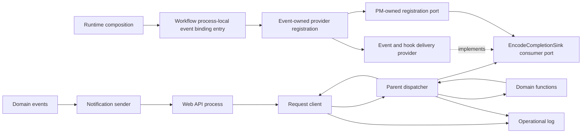
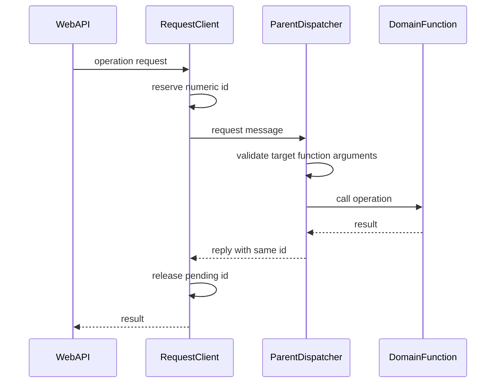
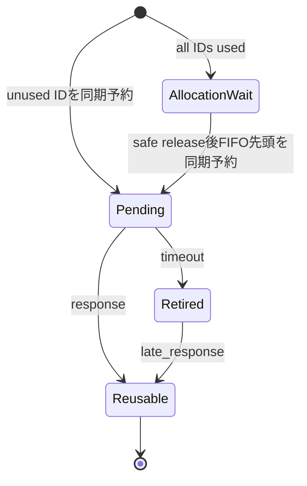
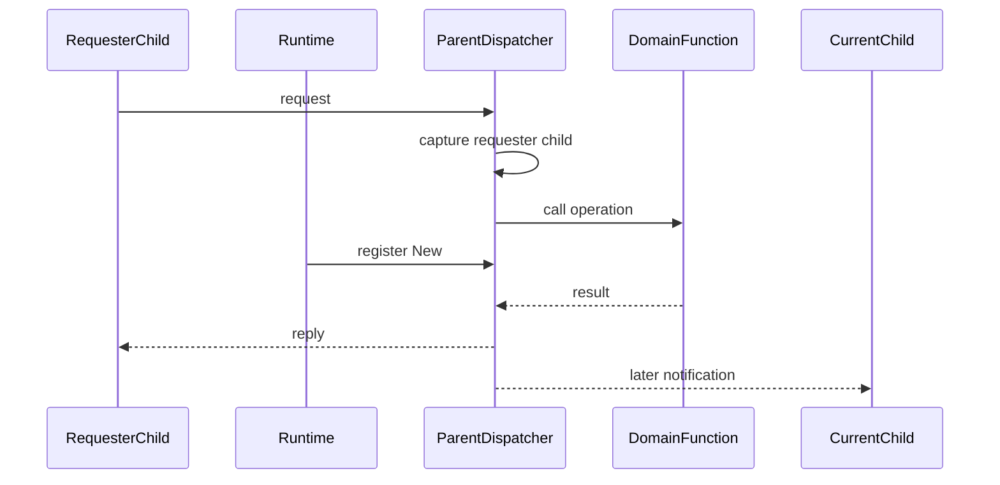

# サーバー内部のプロセス間通信機能 設計

## 1. 目的

この機能は、Web・API を提供する処理と、予約・録画などの状態を管理する処理の間で、操作依頼、処理結果、エラー、状態更新通
知、およびエンコード依頼を受け渡す。

Web・API 側は管理側の機能を同一 process 内の機能と同じ形で呼び出せる。管理側は依頼を対応する担当機能へ振り分け、結果を依
頼元へ返す。複数の依頼を同時に扱っても、依頼と応答を数値識別子で正しく対応付ける。

### 1.1 目標

-   管理側が持つ操作を Web・API 側から依頼できるようにする。
-   同時実行された依頼の結果を取り違えない。
-   応答が返らない依頼を有限時間で依頼元側だけ終了させる。
-   管理側から現在稼働中の Web・API 側へ一方向の通知を送る。
-   Web・API 側の再起動と入れ替わりが発生しても、依頼結果を別の処理へ誤送信しない。

### 1.2 対象外

-   予約、録画、録画済み番組、タグ、ルール、サムネイル、エンコードの業務判断
-   WebSocket とブラウザーへの通知配信
-   Web・API 側 process の起動、停止、および再起動判断
-   依頼先で開始済みの処理を取り消すための仕組み
-   依頼や通知の永続保存と自動再送
-   公開 HTTP API の schema、status、および URL

## 2. 責任境界と依存関係

### 2.1 この機能が所有する責任

-   依頼 message と応答 message の内部契約
-   操作対象と操作名による担当処理の振分け
-   数値識別子の採番、予約、応答待ち、期限超過後の保留、および安全な再利用
-   操作種別ごとの応答待ち期限
-   依頼を送った通信相手への応答
-   現在の通知先となる Web・API 側処理の保持
-   状態更新通知とエンコード依頼の一方向配送
-   容量削除候補の選別に使う録画済みresource利用snapshotのcurrent-generation request/reply carrier
-   通信失敗、期限超過、および送信不能の記録

### 2.2 境界外の責任

-   操作を許可するか、どの状態を更新するかは各業務機能が決める。
-   状態更新通知をブラウザーへまとめて配信する処理は Web・API・リアルタイム通知提供機能が担う。
-   エンコード依頼の受付可否と実行順序は録画ファイル変換機能が担う。
-   Web・API 側処理をいつ起動済みとみなすかはサーバー起動・稼働管理機能が担う。
-   この機能は database と filesystem を直接読み書きしない。

### 2.3 許可する依存と依存方向



依存方向は次のとおりとする。

1. Web・API 側の各 API model は、domain 別の依頼 interface だけへ依存する。
2. 依頼 interface は内部 message 契約と依頼送信処理へ依存する。
3. 管理側の振分け処理は内部 message 契約、各業務 interface、および本機能が所有する `EncodeCompletionSink` consumer port
   へ依存する。
4. event-and-hook-delivery機能は`EncodeCompletionSink`のprovider implementationを提供し、自機能所有の引数なしsetup内で
   PM-owned registration portへproviderを一回登録する。Workflowは同setupを呼ぶだけでPM型を受け取らず、RuntimeはWorkflow
   のprocess-local event binding入口だけを一回呼ぶ。
5. process-messaging sourceからevent仕様またはevent source interfaceへの静的reverse importを禁止する。provider側が
   consumer-owned portへ依存し、process-messaging側がprovider実装を知る依存方向にはしない。
6. 各業務機能は、この機能の採番状態や通信相手状態へ依存しない。
7. 通信上の異常は運用ログ記録機能へ渡す。
8. 録画・Encode・配信がどのrecorded IDを利用中とみなすかは各ownerが決める。PMはservice child snapshotの
   current-generation配送と通常5秒期限だけを所有する。

### 2.4 この設計を再確認する変更

-   process の親子構成または Node.js の child process 通信仕様を変更する場合
-   依頼 message、応答 message、操作対象、操作名、または引数の形を変更する場合
-   Web・API 側を同時に複数稼働させる構成へ変更する場合
-   応答待ち期限、期限超過後の扱い、または通知の配送保証を変更する場合
-   resource-control carrierのlease、snapshot payload、service generation、またはlate reply規則を変更する場合
-   各業務 interface の引数または戻り値を変更する場合
-   共有 server test 基盤または最低対応 Node.js 版を変更する場合

## 3. 設計上の不変条件

-   識別子は`number`とし、操作対象、操作名、引数、結果、およびエラーというmessageの役割を変更しない。
-   識別子を時刻から生成せず、同期予約した連番と`pending Map`・`retired Set`・内部resource用`leased Set`で安全に再利用す
    る。
-   応答先は依頼受付時の通信相手へ固定し、後から登録された通知先へ差し替えない。
-   エンコード完了の受け渡しはconsumer-owned `EncodeCompletionSink`だけを通し、event仕様への静的reverse importを作らな
    い。
-   公開HTTP API、WebSocket通知名、database schema、およびfilesystem配置へ内部通信状態を露出させない。
-   resource利用snapshotのchild不在・generation不一致・期限超過・provider不明を空集合または部分集合へ変換しない。

## 4. 機能構成

| コンポーネント              | 役割                                                                         | 主な依存                                             |
| --------------------------- | ---------------------------------------------------------------------------- | ---------------------------------------------------- |
| Domain Request Facade       | Web・API 側へ予約、録画済み番組、タグ、ルール等の依頼 interface を提供する。 | Request Correlator                                   |
| Request Correlator          | 識別子を予約し、応答待ち、期限、遅延応答、および Promise の完了を管理する。  | Child Process Transport、Operational Log             |
| Allocation Wait Queue       | 全識別子使用中に識別子未付与の依頼を FIFO で保持し、安全な解放後に再開する。 | Request Correlator                                   |
| Parent Operation Dispatcher | 操作対象と操作名を確認し、対応する業務 interface またはconsumer portを呼ぶ。 | Domain Functions、EncodeCompletionSink、Reply Sender |
| EncodeCompletionSink        | エンコード完了結果を受け取るconsumer-owned inbound portを提供する。          | なし                                                 |
| Encode Sink Registration    | Event-owned providerをconsumer portへ登録するportを提供する。                | EncodeCompletionSink                                 |
| Reply Sender                | 依頼ごとに保持した元の通信相手へ結果またはエラーを返す。                     | Child Process Transport、Operational Log             |
| Communication Peer Registry | 現在の通知先を保持し、通信相手の入れ替わりと切断を扱う。                     | Child Process Transport、Operational Log             |
| Reverse Notification Sender | 状態更新通知とエンコード依頼を現在の通知先へ一方向に送る。                   | Communication Peer Registry、Operational Log         |
| Message Contract            | 依頼、成功応答、失敗応答、および二種類の通知を型として定義する。             | なし                                                 |

### 4.1 操作群

内部の操作名は既存の通信相手との接続を維持する。表の「担当機能」は業務判断を所有し、この機能は呼出しだけを行う。

| 操作対象       | 操作名と必須引数                                                                                                                                                                                                                                                    | 担当機能                            |
| -------------- | ------------------------------------------------------------------------------------------------------------------------------------------------------------------------------------------------------------------------------------------------------------------- | ----------------------------------- |
| `reserveation` | `getBroadcastStatus()`、`add(option)`、`update(reserveId)`、`updateRule(ruleId)`、`updateAll(isUntilComplete)`、`cancel(reserveId)`、`removeSkip(reserveId)`、`removeOverlap(reserveId)`、`edit(reserveId, option)`                                                 | 録画予約管理機能                    |
| `recorded`     | `delete(recordedId)`、`updateVideoFileSize(videoFileId)`、`addVideoFile(option)`、`addUploadedVideoFile(option)`、`createNewRecorded(option)`、`deleteVideoFile(videoFileId)`、`changeProtect(recordedId, isProtect)`、`videoFileCleanup()`、`dropLogFileCleanup()` | 録画済み番組管理機能                |
| `recordedTag`  | `create(name, color)`、`update(tagId, name, color)`、`setRelation(tagId, recordedId)`、`delete(tagId)`、`deleteRelation(tagId, recordedId)`                                                                                                                         | 録画済み番組管理機能                |
| `recording`    | `resetTimer()`                                                                                                                                                                                                                                                      | 予約録画実行機能                    |
| `rule`         | `add(rule)`、`update(rule)`、`enable(ruleId)`、`disable(ruleId)`、`delete(ruleId)`                                                                                                                                                                                  | 自動予約ルール機能                  |
| `thumbnail`    | `regenerate()`、`fileCleanup()`、`add(videoFileId)`、`delete(thumbnailId)`                                                                                                                                                                                          | サムネイル管理機能                  |
| `encodeEvent`  | `emitFinishEncode(info)`                                                                                                                                                                                                                                            | `EncodeCompletionSink.accept(info)` |

表にない target / operation は提供しない。interface と enum に名前だけが存在しても Dispatcher の固定表に handler がない
operation は supported と扱わず、この設計だけで handler を追加しない。

## 5. 主要データと interface

### 5.1 Message 契約

```typescript
type MessageId = number;

interface RequestMessage {
    readonly id: MessageId;
    readonly model: ModelName;
    readonly func: OperationName;
    readonly args?: OperationArguments;
}

interface SuccessReply {
    readonly id: MessageId;
    readonly result?: OperationResult;
}

interface ErrorReply {
    readonly id: MessageId;
    readonly error: ErrorMessage;
}

interface StatusNotification {
    readonly type: 'notifyClient';
}

interface EncodeRequestNotification {
    readonly type: 'pushEncode';
    readonly value: AddEncodeProgramOption;
}

interface EncodeCompletionInfo {
    readonly recordedId: number;
    readonly videoFileId: number | null;
    readonly mode: string;
}

interface EncodeCompletionSink {
    accept(info: EncodeCompletionInfo): void | Promise<void>;
}

interface EncodeCompletionSinkRegistrationPort {
    register(sink: EncodeCompletionSink): void;
}
```

不変条件は次のとおりとする。

-   `MessageId` は1以上 `Number.MAX_SAFE_INTEGER` 以下の安全な整数である。
-   一件の応答は元の依頼と同じ識別子を持つ。
-   成功応答は結果を、失敗応答はエラーメッセージを運ぶ。
-   操作対象、操作名、および引数は既存の domain 別 interface と一致させる。
-   通知は依頼識別子を持たず、応答を要求しない。
-   `encodeEvent.emitFinishEncode(info)`はwire operation名を維持し、DispatcherがPM所有の
    `EncodeCompletionSink.accept(info)`へ渡す。event-and-hook-delivery所有のsetupがPM registration portへproviderを一回
    登録する。Workflowは引数なしsetup、RuntimeはWorkflow event binding入口だけを呼び、どちらもPM portとproviderの組を直
    接保持しない。

### 5.2 応答待ち状態

```typescript
interface PendingRequest<T> {
    readonly resolve: (result: T) => void;
    readonly reject: (error: Error) => void;
    readonly timeoutHandle: TimeoutHandle;
}

interface AllocationWaiter<T> {
    readonly option: ClientMessageOption;
    readonly timeoutMs: 5000 | 600000;
    readonly resolve: (result: T) => void;
    readonly reject: (error: Error) => void;
}

interface RequestCorrelationState {
    readonly pending: Map<number, PendingRequest<OperationResult>>;
    readonly retired: Set<number>;
    readonly leased: Set<number>;
    readonly allocationWaiters: AllocationWaiter<OperationResult>[];
    nextCandidate: number;
}

interface IdAllocationSeams {
    readonly max: number;
    readonly successor: (current: number) => number;
}
```

| 状態      | 意味                                                                             |
| --------- | -------------------------------------------------------------------------------- |
| 未使用    | `pending`、`retired`、`leased`のいずれにも存在せず、新しい依頼へ割り当てられる。 |
| `pending` | 送信予定または送信済みで、依頼元が結果を待っている。                             |
| `retired` | 依頼元は期限超過で終了したが、同じ識別子の遅延応答が到着する可能性がある。       |
| `leased`  | 内部resource利用へ割当済みで、exact releaseのterminalを待っている。              |

`pending`、`retired`、`leased`は互いに重ならない。一つの識別子を同時に複数の依頼へ割り当てない。 `allocationWaiters` の
要素は識別子、応答 timer、transport 送信をまだ持たない。したがって全識別子使用中の待機時間を5秒または10分の応答待ち期限
へ算入せず、識別子を予約して送信を開始するときにだけ応答 timer を開始する。採番待ち専用の期限、retry、件数上限は追加しな
い。

`IdAllocationSeams`はallocator内部の最小観測seamであり、公開APIまたは設定項目にしない。production bindingの`max`は常に
`Number.MAX_SAFE_INTEGER`、`successor`は通常候補だけを一つ進める関数とする。test factoryだけが正の安全な小さい`max`と呼
出し台帳付き`successor`を注入できる。最大値分岐は`successor`を呼ばず直接1を返すため、最大値に1を加える式を評価しない。

### 5.3 通信相手状態

管理側は次の二種類を区別する。

-   **現在の通知先**: spawn直後に最後に登録されたWeb・API側child process。状態更新通知とエンコード依頼だけに使う。
-   **依頼の応答先**: message を送った Web・API 側処理。依頼受付時に依頼単位で固定し、後の登録で置き換えない。

応答先は永続化しない。Dispatcher は受付 callback の引数である child object と識別子を request-local context に保持し、
handler settlement 後も可変な現在通知先を参照しない。依頼元が切断された場合、結果を別の通信相手へ転送しない。

### 5.4 録画済みresource利用lease

容量不足による自動削除が録画fileのencodeまたは配信と競合しないように、PMはservice childとparent Runtimeの間に内部
resource-control carrierを提供する。これは4.1の利用者向け業務操作へ追加するoperationではなく、公開HTTP API、WebSocket、
DB schema、設定項目へ露出しない。録画済みresource利用の可否と削除可否は各ownerが決め、PMはidentity、配送、通常5秒期限、
late reply、およびreleaseだけを所有する。

```ts
type RecordedResourceUseKind = 'encoding' | 'delivery';

interface RecordedResourceUseClient {
    acquire(recordedId: number, kind: RecordedResourceUseKind): Promise<{ readonly token: object }>;
    release(token: object): Promise<void>;
}

interface ParentRecordedResourceUseRegistry {
    acquire(input: {
        readonly senderPeer: object;
        readonly requestId: MessageId;
        readonly recordedId: number;
        readonly kind: RecordedResourceUseKind;
    }): { readonly status: 'granted' | 'blocked' | 'unknown' };
    release(input: {
        readonly senderPeer: object;
        readonly acquisitionRequestId: MessageId;
    }): 'released' | 'already-released' | 'unknown';
}

type RecordedUseSnapshotPayload =
    | { readonly status: 'known'; readonly recordedIds: readonly number[] }
    | { readonly status: 'unknown' };

interface RecordedUseSnapshotClient {
    requestSnapshot(): Promise<RecordedUseSnapshotPayload>;
}

interface ChildRecordedUseSnapshotHandler {
    getSnapshot(): RecordedUseSnapshotPayload;
}
```

parent dispatcherは`senderPeer`のobject identityからRuntimeが登録したservice generationを確定し、childがgenerationを引数
で選べないようにする。一件のlease identityはgenerationとacquire request IDの組であり、別generationの同じ数値IDまたは古い
releaseで現在のleaseを解放しない。domain側へ返す`token`はPM client adapterだけが解釈するopaque handleである。grantedに
なったacquire request IDは通常応答後も`leased`として予約を維持し、exact releaseのterminal後だけ未使用へ戻す。したがって
同じservice generation内でactive leaseのrequest IDを別依頼へ再利用しない。acquire期限超過では既存の`retired` 状態を維持
し、late grantedを受けたときだけ`leased`へ移して即時利用せずreleaseへ進める。

encodeはID、job、待機列、または追加通知を公開する前、録画file配信はfileの最終再照会・open・response開始より前に
`acquire()`を一回awaitする。encodeは取得したexact tokenを待機中から実行・結果反映terminalまで保持し、実行開始時に再取得
しない。`blocked`、`unknown`、送信失敗、または通常5秒期限ではresource利用またはencode queue公開を開始しない。期限後の
late granted replyは利用開始へ採用せず、PM client adapterが同じacquire identityのreleaseをbest-effortで一回送る。自動
retry、新しい期限値、永続queueは追加しない。

利用完了時はexact tokenを一回releaseする。releaseの送信または応答を確認できない場合、parent registryはleaseを未使用へ推
測で変えず、同じrecorded IDの容量不足削除を`unknown`として遮断する。service childの終了だけを根拠に、そのchildが開始した
子孫processまたはfile responseの終了を推測しない。Runtimeが新しいservice childを登録しても旧generationの未確認leaseと削
除blockを保持し、新generationからのstale releaseで解放しない。利用者による削除workflow、live stream、upload登録はこの
leaseの対象外である。

このsupporting contractは`server-application-runtime`の `RUNTIME-SM-DELETE-COMPOSITION`と、encoding/media-deliveryの
consumer testが検証する。Runtime integrationはsnapshot後に同じrecorded IDのencode受付が競合しても、lease先着なら削除gate
が`busy`、deletion token先着ならencodeがqueue公開前に失敗となることを確認する。PMの承認済みAcceptance Criteria数や4.1の
業務operation一覧を増やさず、PM固有testではgeneration/request identity、5秒直前・到達・超過、late granted、double/stale
release、peer replacement、およびlistener/timer/pending ID解放を補助caseとして検証する。

#### 容量削除候補用の利用中snapshot carrier

`RecordedUseSnapshotClient.requestSnapshot()`は同じ内部resource-control carrier上で、現在登録されているservice child
generationへread-only snapshotを一回要求する。service childのhandlerはService InterfaceがcompositionしたEncodingとMedia
Deliveryのproviderを同じ同期境界で読み、両方が`known`の場合だけ重複除去した和集合をserializableなreadonly `number[]`で返
す。Encodingは待機列と実行中一覧、Media Deliveryはactiveな録画file配信だけを報告し、live配信を含めない。PMはSetやobject
参照をprocess間messageへ載せず、ID配列の業務意味を変更せず運ぶ。受信側Runtime adapterが配列を検証し、process内の
`ReadonlySet<number>`へ変換する。

現在のchild不在、sender/receiver generation不一致、handler/providerの`unknown`、send failure、通常5秒期限、またはreply
correlation不一致では`unknown`へ収束する。既知の一方だけを部分結果として返さず、空集合へfallbackしない。期限後のlate
replyは当該requestの結果へ採用せず、次のsnapshot requestへも再利用しない。通常のrequest ID、request固有reply相手、
timer/listener cleanupを使い、自動retry、永続snapshot、追加設定、公開operation、業務IPCを追加しない。

snapshotは候補query前の助言的filterであり、resource lease registryまたは削除tokenを変更しない。RuntimeはRecording側の
read-only snapshotとchild結果をさらに集約し、Storageは`unknown`ならその監視回をcandidate query前に終了する。最終削除の
prepare、recording gate、service-child gate、lock内再読取をsnapshot carrierで置換しない。

PMのsupporting testは、known集合の透過配送、child不在、generation不一致、5秒直前・到達・超過、late reply、provider
unknown、peer replacementを検証する。失敗時のcandidate query 0件と最終削除gate維持はRuntimeの
`RUNTIME-SM-DELETE-COMPOSITION`へ委譲し、canonical AC数とFeature Test Matrix行数を増やさない。

### 5.5 Upload一時fileのadoption carrier

`recorded.addUploadedVideoFile`の公開済み業務operation名、引数、結果、および10分期限は維持する。PMはその配送に付随する内
部adoption acknowledgmentを運ぶが、ack自体をfile ownershipのcommit pointにしない。ownershipは同一 `uploadTempDir`
filesystem内のpath namespaceで判定する。

1. service childは内部生成した一意なtokenで`incoming/{uploadToken}` directoryをexclusive作成し、固定
   `incoming/{uploadToken}/payload`だけを所有して既存filePath carrierでregistration requestを送る。
2. parent recorded-content handlerは、source read、保存先処理、file内容利用、DB登録より前に、exact incoming pathをunique
   grammarとして検証し、`adopted/{uploadToken}` directoryをexclusive作成した後、
   `incoming/{uploadToken}/payload`を`adopted/{uploadToken}/payload`へraw atomic renameする。directory衝突ではrename 0
   回、既存destination不変とする。
3. rename成功がownership transferであり、parentはその後にadoption ackを返す。ackはchildのHTTP処理を進める観測値であっ
   て、失われてもownershipを戻さない。
4. childのabort、登録10分期限、送信失敗、またはrestart cleanupはincoming payloadと空のincoming token directoryだけを
   cleanupできる。renameとunlinkが競合し、renameが先着すればchild unlinkは元payload不在となりparentがadopted
   payload/directoryを所有する。unlinkが先着すればparent renameは失敗し、parentは自分の空adopted directoryだけをremoveし
   てdomain処理を開始しない。
5. childまたはPMはadopted payload/directoryと移動後destinationを変更しない。parent recorded-content ownerだけがpath段階
   に従って一回cleanupする。

このためtransport callbackだけで「delivery可能性あり」をownership transferへ変換せず、ack loss、receiver reply loss、
service child replacementでもfileの所在からownerを一意に決められる。PMはadoption状態を永続化・retryせず、child再起動時の
incoming token directory掃除とparent側adopted cleanupは各filesystem ownerへ委譲する。業務replyの10分期限後も開始済み
parent operationを取消さず、late replyを新しいHTTP requestへ配送しない既存規則を維持する。

PM補助testは、send前失敗、deliveryなし、rename先着、unlink先着、ack loss、reply loss、child replacementを組み合わせ、
incoming/adoptedのpayload/token directoryとfinal destinationのownerが常に一つであること、domain callがrename成功後だけ一
回であること、request/reply listenerとtimerが既存期限規則で一回解放されることを確認する。永続adoption journal、新しい公
開operation、設定、retryは追加しない。

## 6. 識別子採番 algorithm

### 6.1 採番範囲

-   初期候補は1とする。
-   最大値は `Number.MAX_SAFE_INTEGER`、すなわち9,007,199,254,740,991とする。
-   現在候補が最大値なら、次候補を直接1とする。
-   最大値へ1を加える式は評価しない。
-   最大値分岐では`successor`の呼出し回数を0とし、通常分岐だけで`successor(current)`を一回呼ぶ。
-   通常は採番のたびに候補を一つ進める。解放された小さい識別子へ毎回戻るのではなく、最大値で折り返した後に再利用する。

### 6.2 同期予約

新しい依頼を送る処理は、非同期処理、次の event loop、または transport 送信へ進む前に次を同じ同期処理内で行う。

1. `nextCandidate` から候補を得る。
2. 候補が `pending`、`retired`、`leased`のいずれにもないことを確認する。
3. 応答待ち処理と timer を作り、候補を `pending` へ登録する。
4. `nextCandidate` を、最大値なら1、それ以外なら現在値に1を加えた値へ進める。
5. 予約済みの識別子を持つ message だけを transport へ渡す。

折返し後に1が使用中なら、2、3の順に小さい方から未使用識別子を探す。走査中も `pending`、`retired`、`leased`のすべてを確認
する。

### 6.3 全識別子が使用中の場合

`pending`、`retired`、`leased`の合計が採番範囲全体を占める場合、新しい依頼は識別子を付けず `AllocationWaiter` として
FIFO の末尾へ一回だけ追加する。応答、同期送信失敗、または遅延応答によって識別子が未使用になった時点で先頭 waiter を一回
だけ取り出し、再開した同期処理内で未使用確認、`pending` 予約、timer 作成、transport 送信まで進める。解放が複数ある場合も
FIFO 先頭から利用可能な件数だけ再開し、一つの waiter を重複送信しない。

採番上限到達を理由に、以後の依頼を恒久的に失敗させない。通常依頼の件数にも別の固定上限を追加しない。

### 6.4 識別子の解放

| 契機                                   | 遷移                                                                  |
| -------------------------------------- | --------------------------------------------------------------------- |
| 送信前の同期失敗                       | `pending` から削除し、直ちに未使用へ戻す。                            |
| transport 送信呼出しの同期失敗         | `pending` から削除し、依頼を失敗させ、直ちに未使用へ戻す。            |
| 成功応答または失敗応答                 | timer を解除して `pending` から削除し、依頼を完了して未使用へ戻す。   |
| 応答待ち期限                           | `pending` から削除して `retired` へ移し、依頼元を期限超過で終了する。 |
| `retired` に対する遅延応答             | 応答内容を破棄し、`retired` から削除して未使用へ戻す。                |
| resource acquire成功応答               | `pending`から`leased`へ移し、lease tokenを返す。                      |
| resource acquireのlate成功応答         | `retired`から`leased`へ移し、利用開始へ返さずreleaseを一回要求する。  |
| resource leaseのexact release terminal | `leased`から削除し、未使用へ戻す。                                    |
| 三状態のいずれにもない応答             | 依頼へ渡さず、必要な診断情報だけを記録する。                          |

transport の非同期な送信結果だけでは、message が相手へ到達したかを確定できない。同期的に送信できた後の異常は識別子を直ち
に再利用せず、応答または期限超過の規則へ収束させる。

各解放経路は timer、reply listener、Promise settlement、および allocation waiter の再開をそれぞれ最大一回にする。応答と
timeout が同じ event loop turn で競合する場合、最初に `pending` を取得した側だけが依頼元 Promise を完了する。timeout が
先なら `retired` へ移し、同じ turn の応答は遅延応答として結果を破棄してから解放する。応答が先なら timer を解除し、後着
timeout callback は何も完了しない。

## 7. 主要 sequence と状態遷移

### 7.1 正常な依頼と応答



担当処理は並行して完了できるため、応答順は依頼順と一致しなくてよい。Request Correlator は識別子だけで対応付ける。

### 7.2 期限超過と遅延応答



期限超過は依頼元の待機だけを終了する。管理側で開始済みの担当処理へ取消を送らない。後から届いた応答は依頼結果に採用せず、
その識別子を安全に再利用できる状態へ戻す。

### 7.3 通信相手の入れ替わり



処理中に新しい通信相手が登録されても、依頼結果は元の依頼元だけへ返す。新しい通信相手は、登録後に発生する通知の送信先とな
る。

## 8. 振分けと応答

### 8.1 依頼の確認

Parent Operation Dispatcher は次の順で確認する。

1. internal request envelope が数値識別子、操作対象、および操作名を持つことを確認する。
2. 操作対象が固定の振分け表自身の property として存在することを確認する。
3. 操作名がその操作対象の固定の振分け表自身の property として存在することを確認する。
4. 上表で操作ごとに列挙した必須引数が `undefined` でないことを確認する。
5. 担当業務 interface を一回だけ呼び出す。

操作対象または操作名が未対応なら `IPCFunctionError`、必要な引数がなければ `IPCArgsError` として同じ識別子へ失敗応答を返
す。担当処理は呼び出さない。固定表の確認には prototype chain を operation として受け入れない own-property 判定を使う。こ
こで型、値域、余剰 field を横断的に再検証する層は追加せず、業務入力の意味は各担当機能へ委ねる。

### 8.2 業務結果

-   担当処理が成功した場合は、同じ識別子と戻り値を成功応答へ載せる。
-   戻り値のない処理も成功応答を返し、依頼元の待機を終了する。
-   例外として、`reserveation.updateAll`は`isUntilComplete=false`のとき、担当処理を開始した時点で成功応答（戻り値なし）を返し、
    完了を待たない。`isUntilComplete=true`のときは完了を待つ。公開APIの`POST /api/reserves/update`は前者で、予約の更新を手動で
    始めるtriggerとして使う。開始後に担当処理が失敗しても、応答済みの依頼へは返さず、この通信の範囲外とする。
-   担当処理が `Error` で失敗した場合は、同じ識別子と `error.message` を失敗応答へ載せ、依頼元では同じmessageの `Error`
    としてrejectする。
-   通信層は、予約できるか、削除できるか、保護を変更できるか等の業務判断を変更しない。

## 9. 応答待ち期限

| 操作区分                 | 期限 | 実装上の扱い                                                 |
| ------------------------ | ---- | ------------------------------------------------------------ |
| 通常の依頼               | 5秒  | 特記のないすべての依頼に適用する。                           |
| 動画アップロード結果登録 | 10分 | 大きなファイルの登録処理を通常依頼から分離する。             |
| 録画ファイルの一括整理   | 10分 | 10分で依頼元の待機だけを終了する。 |
| ドロップログの一括整理   | 10分 | 10分で依頼元の待機だけを終了する。 |

timer は依頼ごとに一つだけ持つ。応答または同期送信失敗で依頼が終了した場合は必ず解除する。期限を0にして無期限化する分岐
は、上表の対象操作に残さない。

## 10. 通知配送

### 10.1 状態更新通知

管理側が画面の再取得を促す必要がある場合、現在の通知先へ `notifyClient` を送る。通知先なし、送信呼出しの同期失敗、または
送信 callback の非同期失敗は運用ログへ記録してその通知を破棄する。通知を保存せず、再登録後に過去の通知を再送しな
い。`void` の通知を応答または acknowledgment 待ちへ変更しない。

### 10.2 エンコード依頼

録画完了後などにエンコード受付が必要な場合、現在の通知先へ `pushEncode` と依頼内容を送る。送信先を利用できない場合は、既
存の呼出し元へ送信不能を知らせる契約を維持する。送信呼出しの同期失敗も同じcaller-facing failureとし、送信 callback の非
同期失敗は運用ログへ記録する。いずれも依頼を保存、自動再送、または別のchildへ転送せず、新しい acknowledgment を追加しな
い。

### 10.3 一方向配送の失敗契約

通知種別ごとのrecipientなし、同期throw、非同期callback failureを一つのcross-productで検証する。契約は次のとおりである。

| 配送種別       | recipientなし               | 同期throw                   | 非同期callback failure | 保存・retry・別child転送 |
| -------------- | --------------------------- | --------------------------- | ---------------------- | ------------------------ |
| `notifyClient` | 記録して破棄する。          | 記録して破棄する。          | 記録して破棄する。     | すべて0                  |
| `pushEncode`   | 既存caller-facing failure。 | 既存caller-facing failure。 | 記録して破棄する。     | すべて0                  |

replyは通知ではないためこの表へ混在させず、request-local targetに対するrecipientなし、同期throw、非同期callback failure
を `PM-6.4`で検証する。

### 10.4 通知先の登録と切断

-   サーバー起動・稼働管理機能がspawn直後のchild processを登録した時点で、追加の起動成立messageを待たずそのchildを現在の
    通知先とする。
-   新しい処理が登録された場合、現在の通知先を新しい処理へ置き換える。
-   登録時にそのchild専用の`exit`、`error`、`disconnect`、`close` listenerを一組だけ付ける。いずれかのterminal eventで
    object identityが現在の通知先と一致する場合だけ現在値を空にし、その登録で追加した残りのterminal listenerを除去する。
-   childを置き換えるときは、以前の通知先にRegistryが追加したterminal listenerを除去する。処理中依頼が保持する
    request-local reply targetはRegistry listenerとは独立してhandler settlementまで保持する。
-   以前の通信相手から遅れて発生した終了eventで、新しい現在の通知先を消さない。

Reply Senderはrequest-local reply targetだけへ送る。対象が未接続、送信呼出しが同期失敗、または送信 callbackが非同期失敗
なら送信不能を記録して応答を破棄し、現在の通知先や後から登録されたchildへ転送しない。応答の再送または保存も行わない。

## 11. 失敗、cleanup、再起動

### 11.1 失敗ごとの扱い

| 失敗                             | 依頼元の結果               | 管理側処理                       | cleanup                                             |
| -------------------------------- | -------------------------- | -------------------------------- | --------------------------------------------------- |
| 操作対象または操作名が存在しない | 操作エラー                 | 開始しない                       | 応答後に識別子を解放する。                          |
| 必須引数が存在しない             | 引数エラー                 | 完了させない                     | 応答後に識別子を解放する。                          |
| 担当処理が失敗                   | 担当処理のエラーメッセージ | 担当機能の規則に従う             | 応答後に識別子を解放する。                          |
| `updateAll(false)`の開始後の失敗 | 返さない（成功応答済み）   | 担当機能の規則に従う             | 応答時に識別子を解放済みで、追加の応答を送らない。  |
| 送信前または送信呼出しの同期失敗 | 送信失敗                   | 開始されていない                 | timer と `pending` を除去し識別子を直ちに解放する。 |
| 応答待ち期限                     | 期限超過                   | 開始済み処理は継続し得る         | `pending` から `retired` へ移す。                   |
| 期限超過後の遅延応答             | すでに期限超過で確定       | 完了済み                         | 応答を破棄し `retired` から識別子を解放する。       |
| 元の依頼元が応答前に切断         | 依頼元には返せない         | 結果は別 process へ転送しない    | 送信不能を記録し、管理側の依頼単位状態を終了する。  |
| 通知先が存在しない               | 通知なし                   | 送信不能を記録し通知を保存しない | 再送用状態を残さない。                              |
| 通知または応答の非同期送信失敗   | caller契約または記録へ収束 | 保存、再送、別child転送なし      | send callbackとrequest-local参照を一回解放する。    |

依頼transportで`process.send`が存在しない場合、または`process.send(message)`が同期throwした場合も同期送信失敗である。同じ呼出しのPromiseは直ちにrejectされ、timer、reply listener、`pending`を一回除去して識別子を解放する。期限まで
待たせず、timeout 0を非収束へ読み替えない。

### 11.2 Web・API 側 process の再起動

-   再起動前のchild側`pending`、`retired`、`leased`、timer、および待機中Promiseは復元しない。parent側の旧generation
    resource leaseは未使用と推測せず、容量不足削除を遮断する証拠として保持する。
-   前generationの利用中snapshot結果またはpending requestを復元・再利用しない。新generationへ新しいrequestを送り、その応
    答だけを現在のsnapshotに使う。
-   新しい Web・API 側処理は初期候補1と空の `pending`・`retired`・`leased`・allocation wait queue から開始する。
-   親側で旧処理から受け付けた依頼が完了しても、応答先は旧処理のままとし、新しい処理へ転送しない。
-   新しい処理が登録された後の通知は新しい現在の通知先へ送る。

異なる Web・API 側処理で同じ数値識別子が使われても、管理側は依頼元の通信相手と識別子の組合せで送信先を保持するため、別の
処理へ結果を誤送信しない。

### 11.3 管理側 process の終了

管理側が終了すると transport が切断される。Web・API 側の各 `pending` は個別の期限で失敗へ収束する。管理側再起動後に古い
依頼を自動再送しない。

## 12. 外部契約

### 12.1 IPC 契約

-   依頼は数値識別子、操作対象、操作名、および必要な引数を持つ。
-   応答は同じ数値識別子と、結果またはエラーメッセージを持つ。
-   識別子の範囲は1から `Number.MAX_SAFE_INTEGER` までである。
-   応答順序は保証しない。
-   通知は `notifyClient` と `pushEncode` の二種類で、応答を要求しない。
-   通常依頼の同時件数へ固定上限を追加しない。

### 12.2 公開 API 契約

この機能は公開 HTTP API を直接提供しない。Web・API・リアルタイム通知提供機能が内部依頼 interface を利用し、公開 API の
schema、status、およびエラー表現を保持する。内部採番の変更を公開 response へ露出させない。

### 12.3 Filesystem と database 契約

この機能は filesystem と database を直接操作しない。録画ファイル、アップロード一時ファイル、サムネイル、および各種レコー
ドの作成・更新・削除は、依頼を受けた担当機能の契約に従う。期限超過を理由にこの機能がファイルまたはレコードを削除しない。

## 13. Test 戦略

共有 server test 基盤の `test/server` を使用し、Node.js 24を必須、Node.js 26を追加互換確認対象とする。

### 13.1 仕様 test

-   Requirement 1の全操作が正しい操作対象・操作名・引数で管理側へ届く。
-   操作対象、操作名、必須引数がない依頼は担当処理を呼び出さず、既定のエラーになる。
-   成功と失敗が同じ識別子を待つ依頼だけへ返る。
-   5秒と三種類の10分期限を fake timer で境界値まで確認する。
-   状態通知とエンコード依頼が現在の通知先へだけ送られ、保存・再送されない。
-   通信相手の入れ替わり中も、結果が元の依頼元へ返る。
-   Dispatcherは`encodeEvent.emitFinishEncode(info)`をPM所有の`EncodeCompletionSink`へ渡し、PM sourceからevent仕様
    /provider interfaceへの静的importがない。

### 13.2 採番の実装 test

-   初期値1、連続増加、最大値から1への直接折返しを確認する。
-   production最大値が独立に常に`Number.MAX_SAFE_INTEGER`であることを確認する。
-   test-onlyの小さいmaxと、maxで呼ばれたら失敗する呼出し台帳付き`successor`を注入する。最大値分岐で `successor`呼出し0
    を実測し、最大値へ1を加える処理を通らないことを確認する。
-   同一同期処理内で複数依頼を開始しても、`pending` 予約が重複しないことを確認する。
-   折返し後に `pending`、`retired`、`leased`を小さい方から飛ばし、最初の未使用値を選ぶ。
-   送信前失敗、送信呼出しの同期失敗、成功応答、失敗応答で識別子が再利用可能になる。
-   期限超過で `retired` へ移り、遅延応答を破棄した後だけ再利用可能になる。
-   全識別子使用中という縮小した採番範囲の test double で、重複送信せず解放まで待つことを確認する。
-   通常依頼を多数並行送信しても、新しい固定件数上限で拒否しない。

### 13.3 結合 test

-   実際の child process 通信で、複数依頼の応答順を入れ替えても正しく対応付く。
-   旧通信相手からの長時間依頼中に新通信相手を登録し、応答が旧通信相手だけへ届く。
-   旧通信相手の遅い切断処理が新通信相手を無効化しない。
-   元の通信相手が切断済みの場合に応答を転送せず、送信不能ログを残す。
-   Web・API 側再起動後は空の状態から始まり、旧依頼の応答が新 process へ届かない。
-   supporting resource-control testでcurrent generationへのsnapshot requestを送り、known集合を変更せず返す。child不在、
    generation不一致、provider unknown、5秒期限、late replyでは`unknown`となり、部分集合・空集合・前回結果へfallbackしな
    い。canonical ACを追加せずRuntimeの容量削除integrationへ接続する。

### 13.4 Coverage

採番の全状態遷移、timer の同着競合、送信同期失敗、遅延応答、通信相手入替え、未対応操作、および引数不足を branch coverage
対象とする。時刻由来の識別子を用いる test は残さない。

## 14. 実装・test配置

### 14.1 機能配置

| 配置                                                              | 単一の責任                                                                                                                                                |
| ----------------------------------------------------------------- | --------------------------------------------------------------------------------------------------------------------------------------------------------- |
| `src/model/ipc/IPCClient.ts`                                      | Domain Request Facade、同期採番、`pending Map`、`retired Set`、内部resource用`leased Set`、FIFO allocation wait、応答待ち期限、および遅延応答処理を担う。 |
| `src/model/ipc/IPCServer.ts`                                      | 通信相手登録、request-specific reply target、振分け・応答、および現在の通知先への通知を担う。                                                             |
| `src/model/ipc/IEncodeCompletionSink.ts`                          | エンコード完了結果のpayloadとconsumer-owned inbound portを保持する。                                                                                      |
| PM内部resource-control adapter                                    | 録画済みresource leaseとcurrent-generation snapshotのrequest/reply、通常5秒期限、late reply破棄を担う。                                                   |
| `test/server/process-messaging/*.spec.test.ts`                    | R1からR6の44 ACに、`#PM-N.M`のcanonical主caseを一件ずつ持つ。                                                                                             |
| `test/server/process-messaging/imp/*.test.ts`                     | 採番、状態遷移、timer、振分け、transport failure、および通信相手入替えの分岐を検証する。                                                                  |
| `test/server/process-messaging/integration/*.integration.test.ts` | isolated child processによる依頼・応答・切断・再登録・再起動を検証する。                                                                                  |

### 14.2 契約配置

| 配置                                     | 責任                                                                                     |
| ---------------------------------------- | ---------------------------------------------------------------------------------------- |
| `src/model/ipc/IPCMessageDefine.ts`      | 数値識別子と既存の依頼・応答・通知 message 契約を保持する。                              |
| `src/model/ipc/IIPCClient.ts`            | Web・API 側が利用する domain 別依頼 interface を保持する。                               |
| `src/model/ipc/IIPCServer.ts`            | 管理側の通信相手登録と通知 interface を保持する。                                        |
| `src/model/ipc/IEncodeCompletionSink.ts` | PM所有の`EncodeCompletionInfo`、`EncodeCompletionSink`、registration portを保持する。    |
| `src/model/event/OperatorEncodeEvent.ts` | portを実装するevent-and-hook-delivery providerである。                                   |
| Event-owned provider registration        | 注入済みregistration portへproviderを一回登録し、引数なしsetupだけをWorkflowへ公開する。 |
| PM内部resource-control契約               | lease acquire/releaseと`known(ids)` / `unknown` snapshot carrierを内部型として保持する。 |

## 15. Source mapping

| 設計要素                         | Source locator                                                                                                       | 責任                                                                                                                                                        |
| -------------------------------- | -------------------------------------------------------------------------------------------------------------------- | ----------------------------------------------------------------------------------------------------------------------------------------------------------- |
| Message 契約                     | `src/model/ipc/IPCMessageDefine.ts` の `MessageId`、`SendMessage`、`ReplayMessage`、`ParentMessage`                  | 数値識別子、依頼・応答・通知の形、および操作名を確認できる。                                                                                                |
| Domain Request Facade            | `src/model/ipc/IIPCClient.ts` の domain 別 interface                                                                 | Web・API 側が利用する予約、録画済み番組、タグ、録画、ルール、サムネイル、エンコード完了操作を確認できる。                                                   |
| Request Correlator | `src/model/ipc/IPCClient.ts` の `send` と `ipcInit`                                                                  | 同期連番、`pending`・`retired`・内部resource用`leased`・FIFO allocation waitを持つ。 |
| 操作別期限 | `src/model/ipc/IPCClient.ts` の `addUploadedVideoFile`、`videoFileCleanup`、`dropLogFileCleanup`                     | upload結果登録、video cleanup、drop-log cleanupは各10分、通常依頼は5秒である。 |
| Parent Operation Dispatcher      | `src/model/ipc/IPCServer.ts` の `register`、`init`、各 `get...Functions`                                             | 操作表、担当 interface 呼出し、成功・失敗応答を確認できる。                                                                                                 |
| 引数確認                         | `src/model/ipc/IPCServer.ts` の `getArgsValue`                                                                       | 必須引数がない場合の `IPCArgsError` を確認できる。                                                                                                          |
| 依頼元への応答 | `src/model/ipc/IPCServer.ts` の `register` と `replay`                                                               | 受付元childをrequest-localに固定し、そのchildだけへ応答する。 |
| 通知先登録と通知 | `src/model/ipc/IPCServer.ts` の `register`、`notifyClient`、`setEncode`                                              | 一つのcurrent childと二種類の一方向通知を持ち、四terminal eventでidentity-basedに無効化し、送信失敗を記録して破棄する。 |
| Web・API 側の利用箇所            | `src/model/api/**` の各 API model                                                                                    | 公開 API から domain 別依頼 interface への委譲を確認できる。                                                                                                |
| 管理側の担当機能                 | `src/model/operator/**` の管理 interface                                                                             | Dispatcher が呼び出す業務契約を確認できる。                                                                                                                 |
| エンコード完了依存               | `src/model/ipc/IIPCClient.ts`、`IPCClient.ts`、`IPCServer.ts`                                                        | encode完了のpayload・portは`IEncodeCompletionSink.ts`からだけimportし、`src/model/event/`へのimportはない。                                                                              |
| consumer port | `src/model/ipc/IEncodeCompletionSink.ts`                                                                             | PM所有のpayload、inbound port、registration portを置き、PMからevent仕様/source interfaceへの静的importは0である。 |
| provider implementation | `src/model/event/OperatorEncodeEvent.ts`                                                                             | event-and-hook-delivery機能がconsumer-owned portを実装する。 |
| provider registration        | `src/model/event/OperatorEncodeEventBinding.ts`と既存`ModelContainerSetter`のEvent/PM injection seam         | Event／Hook delivery内でregistration portへproviderを一回登録する。Workflowの`EventSetter.set()`が引数なし`setup()`を一回呼び、RuntimeはWorkflow入口だけを呼ぶ。                               |
| 状態更新とエンコード通知の発生元 | `src/model/event/EventSetter.ts`                                                                                     | 管理側から二種類の通知を要求する接続を確認できる。                                                                                                          |
| エンコード完了結果の依頼元       | `src/model/service/encode/EncodeFinishModel.ts`                                                                      | Web・API 側から管理側へエンコード完了結果を返す接続を確認できる。                                                                                           |
| 通信機能の構成                   | `src/model/ModelContainerSetter.ts` と `src/index.ts`                                                                | 親側と子側の IPC component の生成・登録位置、およびport/provider binding位置を確認できる。                                                              |
| 録画済みresource snapshot | `src/model/ipc/IPCClient.ts`、`IPCServer.ts`、`ModelContainerSetter.ts`                                              | current generationへの内部request/reply、5秒期限、service child provider bindingを持ち、公開operation・設定・DBを増やさない。 |

## 16. Evidence分類

仕様期待、source、test、runtime evidenceを混同しない。`CONFIRMED`はlocatorで静的確認したsourceの事実を表す。S1からS5、S8、S9は
実装がRequirementsを満たしている項目である。test の存在は、実行結果や coverage の達成を意味しない。

| Evidence class | Status         | 確認事項                                                                                                                                                                                                       |
| -------------- | -------------- | -------------------------------------------------------------------------------------------------------------------------------------------------------------------------------------------------------------- |
| Specification  | `CONFIRMED`    | R1からR7の49 AC、特に同期連番、`pending`・`retired`、FIFO allocation wait、三種類の10分期限、request-specific reply target、identity-based current peer無効化をoracleとする。 |
| Source S1      | `CONFIRMED`    | `IPCClient`は`number`のIDを1から`Number.MAX_SAFE_INTEGER`まで同期予約し、折返し、`pending`、`retired`、識別子未付与FIFO waitを持つ。 |
| Source S2      | `CONFIRMED`    | 一般送信は5秒、upload結果登録、video cleanup、drop-log cleanupは各600,000msである。 |
| Source S3      | `CONFIRMED`    | `IPCServer.register()`の受付callbackは受付元childを`requester`としてcaptureし、`replay()`はそのchildだけへ応答する。 |
| Source S4      | `CONFIRMED`    | `IPCServer`はcurrent childの`exit`、`error`、`disconnect`、`close`にlistenerを登録し、object identity一致時だけ無効化する。 |
| Source S5      | `CONFIRMED`    | `notifyClient()`と`setEncode()`は一つのcurrent childへ一方向送信し、reply、通知ともsend callback failureを記録して破棄する。`pushEncode`はcaller-facingのrecipient/send failureを維持し、非同期failureを記録する。 |
| Source S6      | `CONFIRMED`    | runtimeはWeb・API childのspawn直後に`register(child)`し、追加の起動成立messageを待たない。                                                                                                                     |
| Source S7      | `CONFIRMED`    | reservationの`clean`はclient interfaceとfunction enumに名前があるが、Dispatcherのhandler tableにはentryがない。                                                                                                |
| Source S8      | `CONFIRMED`    | pending entryがtimer handleを所有し、response、error、同期send failureで一回解除する。timeout時もsettlement後に残留handleを持たない。 |
| Source S9      | `CONFIRMED`    | `IPCClient.send()`は`process.send`不存在または同期throwを同じPromiseへ接続して即時rejectし、timer、listener、`pending`を一回解放する。 |
| Source S10     | `CONFIRMED`    | `IIPCClient.ts`、`IPCClient.ts`、`IPCServer.ts`は、encode完了のpayload・portを`IEncodeCompletionSink.ts`からだけimportし、`src/model/event/`へのimportはない。provider implementationとregistrationはevent-and-hook-delivery側が持ち、`EventSetter.set()`が一回呼ぶ。 |
| Test           | `CONFIRMED`    | testは`test/server/process-messaging/`のspec・imp・integrationにあり、integrationはisolated child processのIPCを扱う。実行結果とcoverage結果は本書に持たない。 |

分類集計に含めない項目は次のとおりである。

| Source evidence | Classification                          | 扱い                                                                                                                                                                                                                                                                     |
| --------------- | --------------------------------------- | ------------------------------------------------------------------------------------------------------------------------------------------------------------------------------------------------------------------------------------------------------------------------ |
| S7              | `N/A — confirmed source characteristic` | Requirementsの操作群へ含まれずhandlerもないため、`clean`をsupported operationへ昇格しない。5分類の不一致集計から除外する。                                                                                                                                               |
| S10             | `N/A — resolved in source`              | PM所有の`EncodeCompletionSink`とregistration portへpayload・登録境界を移し、event-and-hook-deliveryがproviderと自機能内registrationを所有し、Workflowの`EventSetter.set()`が引数なし`setup()`を一回呼ぶ形で解消済み。5分類の不一致集計から除外する。 |

`CONFIRMED`はsource evidenceの状態であり、不一致分類値ではない。分類
値は19節の5語だけを使い、S7の確認済みsource characteristicとS10の解消済みの項目は分類集計へ含めない。

handler tableに存在しないoperationを追加すること、業務入力の型・値域を一括再検証すること、応答deadline以外の
timeout、retry、acknowledgment、永続queue、通常依頼の固定件数上限、公開API変更はこの同期対象に含めない。依存先の業務契約
と不一致を発見した場合は本機能のcarrier期待だけを記録し、依存先sourceまたは仕様をこのDesignから変更しない。

ただし、5.5で定義するupload adoptionの内部acknowledgmentは、同じuploadのatomic rename成功後にparentからchildへ渡す
内部carrierに限る例外である。これは公開API・IPCまたは業務operationのacknowledgmentではなく、ownership transferの
commit pointも変更しない。

## 17. 機能固有test設計

### 17.1 Canonical registry

R1からR6の主case globは`test/server/process-messaging/*.spec.test.ts`である。次の6 fileだけに44個のnamed `#PM-N.M`主case
を一意に置き、一つのACを複数の主caseへ割り当てない。補助`unittest/imp`またはintegration caseは主case件数へ加えない。

| Registry key          | Canonical locator / expansion                                                                                                                                                                                                                                                                                                                                                                                                                                                                                                                                                                                                                                                                                | 責任                                                                                  |
| --------------------- | ------------------------------------------------------------------------------------------------------------------------------------------------------------------------------------------------------------------------------------------------------------------------------------------------------------------------------------------------------------------------------------------------------------------------------------------------------------------------------------------------------------------------------------------------------------------------------------------------------------------------------------------------------------------------------------------------------------ | ------------------------------------------------------------------------------------- |
| `SPEC-OPS`            | `test/server/process-messaging/operation-routing.spec.test.ts#PM-1.1`から`#PM-1.8`                                                                                                                                                                                                                                                                                                                                                                                                                                                                                                                                                                                                                           | R1の8主case                                                                           |
| `SPEC-CORR`           | `test/server/process-messaging/correlation.spec.test.ts#PM-2.1`から`#PM-2.16`                                                                                                                                                                                                                                                                                                                                                                                                                                                                                                                                                                                                                                | R2の16主case                                                                          |
| `SPEC-VALID`          | `test/server/process-messaging/validation.spec.test.ts#PM-3.1`から`#PM-3.3`                                                                                                                                                                                                                                                                                                                                                                                                                                                                                                                                                                                                                                  | R3の3主case                                                                           |
| `SPEC-DEADLINE`       | `test/server/process-messaging/deadlines.spec.test.ts#PM-4.1`から`#PM-4.7`                                                                                                                                                                                                                                                                                                                                                                                                                                                                                                                                                                                                                                   | R4の7主case                                                                           |
| `SPEC-NOTIFY`         | `test/server/process-messaging/notifications.spec.test.ts#PM-5.1`から`#PM-5.4`。`PM-5.2`と`PM-5.4`のsubcaseは通知種別×recipientなし×同期throw×非同期callback failureを列挙する。                                                                                                                                                                                                                                                                                                                                                                                                                                                                                                                             | R5の4主case                                                                           |
| `SPEC-PEER`           | `test/server/process-messaging/peer-registry.spec.test.ts#PM-6.1`から`#PM-6.6`                                                                                                                                                                                                                                                                                                                                                                                                                                                                                                                                                                                                                               | R6の6主case                                                                           |
| `IMP-CHAR-PM-7.2`     | `test/server/process-messaging/imp/id-allocation.test.ts#numeric-range-wrap-successor-zero-full-release-resume`、`test/server/process-messaging/imp/correlation-lifecycle.test.ts#pending-retired-send-failure-response-and-late-response`、`test/server/process-messaging/imp/correlation-lifecycle.test.ts#records-callback-error-but-keeps-the-same-pending-request-timer-and-allocation-waiter`、`test/server/process-messaging/imp/correlation-lifecycle.test.ts#keeps-callback-failed-id-retired-until-a-late-reply-after-timeout`、`test/server/process-messaging/imp/correlation-lifecycle.test.ts#settles-only-once-when-the-response-wins-the-deadline-boundary`、`test/server/process-messaging/imp/correlation-lifecycle.test.ts#settles-only-once-when-timeout-wins-and-treats-the-same-turn-response-as-late`、`test/server/process-messaging/imp/deadline-races.test.ts#rejects-at-5-000ms-never-returns-a-late-grant-for-use-and-best-effort-releases-that-same-identity-once`、`test/server/process-messaging/imp/dispatcher-peer.test.ts#rejects-an-inherited-operation-with-the-requester-id-and-no-domain-handler`、`test/server/process-messaging/imp/dispatcher-peer.test.ts#keeps-the-parent-owned-domain-call-after-reply-delivery-failure-and-never-forwards-it-to-a-replacement-child`、`test/server/process-messaging/imp/notification-cleanup.test.ts#notification-kind-recipient-sync-async-cross-product` | implementation-characteristic layer                                                   |
| `INT-BOUNDARY-PM-7.4` | `test/server/process-messaging/integration/process-messaging.integration.test.ts#out-of-order-disconnect-replace-restart`                                                                                                                                                                                                                                                                                                                                                                                                                                                                                                                                                                                                                                                                                                                                                                                                                                                                                                                                                                                                                 | isolated child IPCのintegration layer                                                 |
| `RUNTIME-R9-PM-7.5`   | `server-application-runtime` Requirement 9 Acceptance Criterion 9                                                                                                                                                                                                                                                                                                                                                                                                                                                                                                                                                                                                                  | provider waveがrelease evidenceを供給するruntime external layer               |

補足（registry の key ではない）: `test/server/process-messaging/integration/payload-serialization.integration.test.ts` は、`makeChild` の偽物（渡した object をそのまま届ける）と本物の子 process との IPC channel（JSON で直列化する）で同じ要求を `IPCServer` へ送り、port が受ける値が JSON の往復の分だけ違い（undefined の field の欠落、Date の文字列化、class の instance の plain 化）、応答と error の応答は同じになることを確かめる。

PMは共有command、設定、判定を再定義せず、
架空のcommand、件数、成功、除外結果をDesignへ記録しない。

### 17.2 Matrix記法

値域profileは`null / empty / 0 / 1 / min / max / out-of-range / invalid type / duplicate`の9観点を順に表す。

| Profile      | 9観点の具体化                                                                                                                                                                                                                                                        |
| ------------ | -------------------------------------------------------------------------------------------------------------------------------------------------------------------------------------------------------------------------------------------------------------------- |
| `V-ID`       | 全9観点を検証する。1が有効最小、`Number.MAX_SAFE_INTEGER`が有効最大、0・負数・最大超過・非安全整数・文字列等を送信用IDに採用しない。duplicateは`pending`・`retired`・`leased`使用中候補をskipする。testだけは注入した小さいmaxを使い、production最大値を変更しない。 |
| `V-ROUTE`    | target / operation / argsについてnull、empty、0、1、out-of-range相当の未知名、不正型、duplicate requestを検証する。数値min/maxはoperation名に数値域がないためN/A。duplicate requestは重複排除せず独立配送する。                                                      |
| `V-ARGS`     | 必須argsのnull値は存在する値としてhandlerへ渡し、missing/`undefined`とempty、0、1、domain最小・最大・範囲外・不正型はowner domainへ委譲する。duplicate keyはwire objectの一値へ正規化済みでありN/A、duplicate requestは独立配送する。                                |
| `V-TIME`     | 0、1、4,999、5,000、5,001、599,999、600,000、600,001msをfake timeで検証する。null、empty、不正型のtimeoutはproduction interfaceが受け取らないためN/A。duplicate timer/settlementを同着raceで検出する。                                                               |
| `V-MESSAGE`  | result/error/notification envelopeのnull、empty、0、1、不正shape、duplicateを検証する。payloadの業務min/max・範囲外はowner domainのためN/A。                                                                                                                         |
| `V-PEER`     | peerなし、未接続、1 child、置換した2 child、不正transport fake、同一child重複登録を検証する。数値min/max・範囲外はpeer入力でないためN/A。                                                                                                                            |
| `V-EVIDENCE` | 製品dataを入力しないため9観点すべてN/A。代わりにcase数、ID、locator、列、結果状態に欠落・重複がないことを本書の構成として満たす。                                                                                                                                                      |

状態profileは`REQ`（未送信、allocation wait、pending、成功、失敗、timeout、retired、late response）、`DSP`（受
付、handler進行、成功、失敗）、`NTF`（送信前、送信済み、失敗・破棄）、`PEER`（未登録、current、replaced、disconnected）
とする。request取消protocolはないため`CAN-NA`、同じoperationの再入は独立requestとして扱う`RE-AP`、再起動は状態を復元しな
い `RST-AP`で表す。timeoutは依頼先処理のcancelではない。

時間profileは`T-SYNC`（同じ同期処理で未使用確認→予約→送信）、`T-ORDER`（out-of-order response）、
`T-5S`（4,999/5,000/5,001msとsame tick）、`T-10M`（599,999/600,000/600,001msとsame tick）、
`T-RACE`（response/timeout/disconnect/replacement競合）、`T-NOWAIT`（ack待ちなし）、`T-STATIC`（動的時間N/A）とする。

資源profileは`R-CORR`（Map、Set、FIFO waiter、timer、reply listener、Promise）、`R-DSP`（request-local child参照、
handler Promise、send callback）、`R-PEER`（current child参照、四terminal listener、send callback）、`R-MSG` （messageだ
け。DB transaction、stream、file、lockは所有しないためN/A）、`R-EVIDENCE`（case 一覧）とする。境界`B-IPC`はchild
process IPCとprocess lifecycle、`B-PORT`は業務handler fakeを表す。HTTP、DB、filesystemは本機能が直接公開・読み書きしない
ためintegration非適用であり、公開HTTPから内部依頼への接続は`server-service-interface`、業務DB・ file副作用は各domain
ownerが検証する。

### 17.4 Feature Test Matrix

`S`は`unittest/spec`、`I`は`unittest/imp`、`G`はintegration、`M`は本表そのもの、`Q`は品質判定を表す。各行
の
locator、Numeric ID、evidence keyは17.1と18節で同じ値を使う。

| Numeric ID | Canonical locator                                                     | 層    | 値域                                        | 状態                                 | 時間                                      | 資源                            | 境界・failure                                                  | 主oracle |
| ---------- | --------------------------------------------------------------------- | ----- | ------------------------------------------- | ------------------------------------ | ----------------------------------------- | ------------------------------- | -------------------------------------------------------------- | ------------------------------------------------------------------------------------------------------------------------------------------------------------------- |
| PM-1.1     | `test/server/process-messaging/operation-routing.spec.test.ts#PM-1.1` | S/G   | V-ROUTE                                     | DSP/RE-AP                            | T-SYNC                                    | R-MSG/R-DSP                     | B-IPC/B-PORT・send/handler失敗                                 | 放送波状態照会をexact target/operationで一回配送 |
| PM-1.2     | `test/server/process-messaging/operation-routing.spec.test.ts#PM-1.2` | S/G   | V-ARGS                                      | DSP/RE-AP                            | T-ORDER                                   | R-MSG/R-DSP                     | B-IPC/B-PORT・各予約handler失敗                                | 予約追加・編集・取消・再計算・skip/overlap解除を各exact argsで配送 |
| PM-1.3     | `test/server/process-messaging/operation-routing.spec.test.ts#PM-1.3` | S/G   | V-ARGS                                      | DSP/RE-AP                            | T-5S/T-10M                                | R-MSG/R-DSP                     | B-IPC/B-PORT・録画済み操作失敗                                 | grouped recorded操作を一回ずつ配送し三長時間操作だけ10分 |
| PM-1.4     | `test/server/process-messaging/operation-routing.spec.test.ts#PM-1.4` | S/G   | V-ARGS                                      | DSP/RE-AP                            | T-ORDER                                   | R-MSG/R-DSP                     | B-IPC/B-PORT・tag handler失敗                                  | tag作成・変更・関連付け・削除をexact argsで配送 |
| PM-1.5     | `test/server/process-messaging/operation-routing.spec.test.ts#PM-1.5` | S/G   | V-ARGS                                      | DSP/RE-AP                            | T-ORDER                                   | R-MSG/R-DSP                     | B-IPC/B-PORT・rule handler失敗                                 | rule作成・変更・有効・無効・削除をexact argsで配送 |
| PM-1.6     | `test/server/process-messaging/operation-routing.spec.test.ts#PM-1.6` | S/G   | V-ARGS                                      | DSP/RE-AP                            | T-ORDER                                   | R-MSG/R-DSP                     | B-IPC/B-PORT・thumbnail handler失敗                            | thumbnail作成・再作成・削除・cleanupを配送 |
| PM-1.7     | `test/server/process-messaging/operation-routing.spec.test.ts#PM-1.7` | S/G   | V-ARGS                                      | DSP/RE-AP                            | T-ORDER                                   | R-MSG/R-DSP                     | B-IPC/B-PORT・handler失敗                                      | `resetTimer`は担当へ、`emitFinishEncode(info)`はPM所有sinkへ配送しevent reverse import 0 |
| PM-1.8     | `test/server/process-messaging/operation-routing.spec.test.ts#PM-1.8` | S/I   | V-ROUTE                                     | DSP/CAN-NA/RE-AP                     | T-SYNC                                    | R-DSP                           | B-PORT・業務拒否                                               | carrierはhandler結果を伝えるだけで業務可否を上書きしない |
| PM-2.1     | `test/server/process-messaging/correlation.spec.test.ts#PM-2.1`       | S/I/G | V-ID/V-ROUTE                                | REQ/RE-AP                            | T-SYNC                                    | R-CORR/R-MSG                    | B-IPC・send失敗                                                | 一意number、target、operation、argsを一envelopeで送る |
| PM-2.2     | `test/server/process-messaging/correlation.spec.test.ts#PM-2.2`       | S/I   | V-ROUTE                                     | DSP                                  | T-SYNC                                    | R-DSP                           | B-PORT・未対応                                                 | fixed tableのexact handlerを一回呼ぶ |
| PM-2.3     | `test/server/process-messaging/correlation.spec.test.ts#PM-2.3`       | S/G   | V-MESSAGE                                   | REQ/DSP                              | T-ORDER                                   | R-CORR/R-DSP                    | B-IPC・reply send失敗                                          | 成功resultを同じIDで返す |
| PM-2.4     | `test/server/process-messaging/correlation.spec.test.ts#PM-2.4`       | S/G   | V-MESSAGE                                   | REQ/DSP/F                            | T-ORDER                                   | R-CORR/R-DSP                    | B-IPC・handler/reply失敗                                       | error.messageを同じIDで返す |
| PM-2.5     | `test/server/process-messaging/correlation.spec.test.ts#PM-2.5`       | S/I   | V-ID/V-MESSAGE                              | REQ                                  | T-ORDER                                   | R-CORR                          | B-IPC・unknown ID                                              | 同じIDのpending Promiseだけをsettle |
| PM-2.6     | `test/server/process-messaging/correlation.spec.test.ts#PM-2.6`       | S/I/G | V-ID                                        | REQ/RE-AP                            | T-ORDER                                   | R-CORR                          | B-IPC・応答逆順                                                | 受付順でなくIDにより正しい二Promiseへ結果を渡す |
| PM-2.7     | `test/server/process-messaging/correlation.spec.test.ts#PM-2.7`       | S/I   | V-ID                                        | REQ                                  | T-SYNC                                    | R-CORR                          | B-PORT・範囲端                                                 | 最初は1、production bindingのmaxは独立に常に`Number.MAX_SAFE_INTEGER` |
| PM-2.8     | `test/server/process-messaging/correlation.spec.test.ts#PM-2.8`       | S/I   | V-ID                                        | REQ/RE-AP                            | T-SYNC                                    | R-CORR                          | B-PORT・同一tick再入                                           | async/next event loop/send前にunused確認とpending予約 |
| PM-2.9     | `test/server/process-messaging/correlation.spec.test.ts#PM-2.9`       | S/I   | V-ID                                        | REQ                                  | T-SYNC                                    | R-CORR                          | B-PORT・最大値                                                 | 小さいtest maxとmaxでfailするsuccessor seamにより呼出し0、max+1評価なし、候補1へwrap |
| PM-2.10    | `test/server/process-messaging/correlation.spec.test.ts#PM-2.10`      | S/I   | V-ID                                        | REQ                                  | T-SYNC                                    | R-CORR                          | B-PORT・wrap先使用中                                           | pending/retired/leasedを小さい順にskipし最初のunusedを予約 |
| PM-2.11    | `test/server/process-messaging/correlation.spec.test.ts#PM-2.11`      | S/I   | V-ID                                        | REQ/F                                | T-SYNC                                    | R-CORR                          | B-IPC・send前/呼出し同期失敗                                   | timer・listener・pendingを一回除去しIDを即時解放 |
| PM-2.12    | `test/server/process-messaging/correlation.spec.test.ts#PM-2.12`      | S/I   | V-MESSAGE                                   | REQ/S/F                              | T-RACE                                    | R-CORR                          | B-IPC・result/error                                            | timer・pendingを一回除去しresolve/reject後ID解放 |
| PM-2.13    | `test/server/process-messaging/correlation.spec.test.ts#PM-2.13`      | S/I   | V-TIME/V-ID                                 | REQ/TO                               | T-5S/T-10M                                | R-CORR                          | B-PORT・deadline                                               | pending→retired、Promiseだけtimeout reject |
| PM-2.14    | `test/server/process-messaging/correlation.spec.test.ts#PM-2.14`      | S/I   | V-MESSAGE/V-ID                              | REQ/LATE                             | T-RACE                                    | R-CORR                          | B-IPC・late response                                           | result不採用、retiredだけ除去してID解放 |
| PM-2.15    | `test/server/process-messaging/correlation.spec.test.ts#PM-2.15`      | S/I   | V-ID                                        | REQ/RE-AP                            | T-SYNC/T-RACE                             | R-CORR                          | B-PORT・all-used                                               | test-only縮小maxでIDなしFIFO wait→安全な解放→一回resume |
| PM-2.16    | `test/server/process-messaging/correlation.spec.test.ts#PM-2.16`      | S/I   | V-ID                                        | REQ/RE-AP/RST-AP                     | T-SYNC                                    | R-CORR                          | B-PORT・多数依頼                                               | 固定1024等で拒否せずnumber/production最大値を維持 |
| PM-3.1     | `test/server/process-messaging/validation.spec.test.ts#PM-3.1`        | S/I/G | V-ROUTE                                     | DSP/F                                | T-SYNC                                    | R-DSP/R-MSG                     | B-IPC/B-PORT・unsupported                                      | target/operation own-property不在はhandler 0、`IPCFunctionError` |
| PM-3.2     | `test/server/process-messaging/validation.spec.test.ts#PM-3.2`        | S/I   | V-ARGS                                      | DSP/F                                | T-SYNC                                    | R-DSP/R-MSG                     | B-PORT・missing args                                           | 必須arg undefinedはhandler完了0、`IPCArgsError` |
| PM-3.3     | `test/server/process-messaging/validation.spec.test.ts#PM-3.3`        | S/G   | V-MESSAGE                                   | DSP/F                                | T-ORDER                                   | R-DSP/R-CORR                    | B-IPC・handler Error                                           | exact error.messageを依頼元Errorへ渡す |
| PM-4.1     | `test/server/process-messaging/deadlines.spec.test.ts#PM-4.1`         | S/I   | V-TIME                                      | REQ                                  | T-5S                                      | R-CORR                          | B-PORT・応答なし                                               | 通常依頼は5,000ms、直前pending・到達timeout |
| PM-4.2     | `test/server/process-messaging/deadlines.spec.test.ts#PM-4.2`         | S/I   | V-TIME                                      | REQ                                  | T-10M                                     | R-CORR                          | B-PORT・upload応答なし                                         | upload結果登録は600,000ms |
| PM-4.3     | `test/server/process-messaging/deadlines.spec.test.ts#PM-4.3`         | S/I   | V-TIME                                      | REQ                                  | T-10M                                     | R-CORR                          | B-PORT・video cleanup応答なし                                  | 録画file cleanupは600,000ms、0で無期限にしない |
| PM-4.4     | `test/server/process-messaging/deadlines.spec.test.ts#PM-4.4`         | S/I   | V-TIME                                      | REQ                                  | T-10M                                     | R-CORR                          | B-PORT・drop cleanup応答なし                                   | drop-log cleanupは600,000ms、0で無期限にしない |
| PM-4.5     | `test/server/process-messaging/deadlines.spec.test.ts#PM-4.5`         | S/I   | V-TIME                                      | REQ/TO                               | T-5S/T-10M                                | R-CORR                          | B-PORT・deadline                                               | 依頼元Promiseだけ`IPCTimeout`で終了 |
| PM-4.6     | `test/server/process-messaging/deadlines.spec.test.ts#PM-4.6`         | S/I/G | V-TIME                                      | REQ/TO/CAN-NA                        | T-RACE                                    | R-CORR/R-DSP                    | B-IPC/B-PORT・handler pending                                  | timeout後もhandler cancel/abort/send 0 |
| PM-4.7     | `test/server/process-messaging/deadlines.spec.test.ts#PM-4.7`         | S/I   | V-TIME/V-MESSAGE                            | REQ/LATE                             | T-RACE                                    | R-CORR                          | B-IPC・late response                                           | timeout結果を変えずlate payload破棄後だけretired解放 |
| PM-5.1     | `test/server/process-messaging/notifications.spec.test.ts#PM-5.1`     | S/G   | V-MESSAGE/V-PEER                            | NTF/PEER                             | T-NOWAIT                                  | R-PEER/R-MSG                    | B-IPC・send failure                                            | current childへ`notifyClient`一回、ack待ち0 |
| PM-5.2     | `test/server/process-messaging/notifications.spec.test.ts#PM-5.2`     | S/G   | V-MESSAGE/V-PEER                            | NTF/PEER                             | T-NOWAIT                                  | R-PEER/R-MSG                    | B-IPC・通知種別cross-productの`pushEncode`行                   | 成功時currentへ一回、recipientなし・同期throwはcaller failure、非同期callback failureは記録 |
| PM-5.3     | `test/server/process-messaging/notifications.spec.test.ts#PM-5.3`     | S/I   | V-MESSAGE                                   | NTF/CAN-NA                           | T-NOWAIT                                  | R-PEER                          | B-IPC・async send pending                                      | response listener/timer/Promiseを作らない |
| PM-5.4     | `test/server/process-messaging/notifications.spec.test.ts#PM-5.4`     | S/I/G | V-PEER                                      | NTF/F                                | T-NOWAIT/T-RACE                           | R-PEER                          | B-IPC・通知種別×recipientなし×同期throw×非同期callback failure | `notifyClient`は三failureを記録・破棄、`pushEncode`はrecipientなし・同期をcaller failure、非同期を記録。保存/retry/forwarding 0は`NO-DELIVERY-STATE`、replyはPM-6.4 |
| PM-6.1     | `test/server/process-messaging/peer-registry.spec.test.ts#PM-6.1`     | S/I/G | V-PEER                                      | PEER                                 | T-SYNC                                    | R-PEER                          | B-IPC・spawn直後                                               | 追加messageなしでregistered childをcurrentにする |
| PM-6.2     | `test/server/process-messaging/peer-registry.spec.test.ts#PM-6.2`     | S/I/G | V-PEER/V-MESSAGE                            | DSP/PEER                             | T-SYNC                                    | R-DSP                           | B-IPC・受付                                                    | requestごとにsender childをreply targetへcapture |
| PM-6.3     | `test/server/process-messaging/peer-registry.spec.test.ts#PM-6.3`     | S/I/G | V-PEER                                      | DSP/PEER/RE-AP                       | T-RACE                                    | R-DSP/R-PEER                    | B-IPC・child replacement                                       | 旧request結果は旧childだけ、新childへreply 0 |
| PM-6.4     | `test/server/process-messaging/peer-registry.spec.test.ts#PM-6.4`     | S/I/G | V-PEER                                      | DSP/F/PEER                           | T-RACE                                    | R-DSP                           | B-IPC・reply recipientなし/同期throw/非同期callback failure    | request-local targetの三failureを記録・破棄し別child転送0 |
| PM-6.5     | `test/server/process-messaging/peer-registry.spec.test.ts#PM-6.5`     | S/I   | V-PEER                                      | NTF/PEER                             | T-NOWAIT                                  | R-PEER                          | B-IPC・currentなし                                             | 状態通知send 0、保存0、listener/timer 0 |
| PM-6.6     | `test/server/process-messaging/peer-registry.spec.test.ts#PM-6.6`     | S/I/G | V-PEER                                      | PEER/RST-AP                          | T-RACE                                    | R-PEER                          | B-IPC・四terminal/replacement同着                              | identity一致時だけcurrent無効化、旧eventは新child不変、listener解放 |
| PM-7.1     | `*.spec.test.ts`の44主case#PM-7.1                                     | S     | V-EVIDENCE                                  | REQ/DSP/NTF/PEER                     | T-STATIC                                  | R-EVIDENCE                      | 44主case・欠落/重複                                      | R1-R6の44 ACと44 canonical主caseを一意対応 |
| PM-7.2     | `IMP-CHAR-PM-7.2`                                                     | I     | V-ID/V-ROUTE/V-ARGS/V-TIME/V-MESSAGE/V-PEER | REQ/DSP/NTF/PEER/CAN-NA/RE-AP/RST-AP | T-SYNC/T-ORDER/T-5S/T-10M/T-RACE/T-NOWAIT | R-CORR/R-DSP/R-PEER/R-MSG       | B-PORT/B-IPC・全機能固有failure                                | concrete imp caseを一意対応し、不存在は各spec caseのcall ledgerで確認 |
| PM-7.3     | 本節の Feature Test Matrix#PM-7.3                                    | M     | V-EVIDENCE                                  | 全profile                            | T-STATIC                                  | R-EVIDENCE                      | matrix・列/N/A欠落                                   | PM-1.1からPM-7.5の49行と全分類が揃う |
| PM-7.4     | `INT-BOUNDARY-PM-7.4`                                                 | G     | V-ID/V-MESSAGE/V-PEER                       | REQ/DSP/NTF/PEER/RST-AP              | T-ORDER/T-RACE                            | R-CORR/R-DSP/R-PEER             | child IPC/process・HTTP/DB/filesystem N/A                      | 逆順、切断、再登録、再起動非復元と全resource cleanup |
| PM-7.5     | `RUNTIME-R9-PM-7.5`                                                   | Q     | V-EVIDENCE                                  | 品質判定 S/F                         | T-STATIC                                  | test/coverage                   | Runtime・未実行/失敗/未解決                                    | 単体・結合testの全件成功とRuntime R9 AC9のC0・C1が未成立なら未完了。PMでcommand・設定・判定の再定義0 |

Feature Test Matrixは49行、Numeric IDは`PM-1.1`から`PM-7.5`の49個で、R1からR6の44主caseとR7の5 layerを重複なく
分離する。

## 18. Numeric Formal Trace

Formal TraceはRequirements 1から7の49 Acceptance Criteriaを`PM-N.M`へ一対一で割り当てる。

| AC      | Numeric ID | Component / contract              | 状態・失敗                         | Canonical locator                                                     |
| ------- | ---------- | --------------------------------- | ---------------------------------- | --------------------------------------------------------------------- |
| R1.AC1  | PM-1.1     | Facade / broadcast status         | 配送・handler失敗                  | `test/server/process-messaging/operation-routing.spec.test.ts#PM-1.1` |
| R1.AC2  | PM-1.2     | Facade / reservation operations   | 配送・独立完了                     | `test/server/process-messaging/operation-routing.spec.test.ts#PM-1.2` |
| R1.AC3  | PM-1.3     | Facade / recorded operations      | 通常・10分期限                     | `test/server/process-messaging/operation-routing.spec.test.ts#PM-1.3` |
| R1.AC4  | PM-1.4     | Facade / tag operations           | 配送・handler失敗                  | `test/server/process-messaging/operation-routing.spec.test.ts#PM-1.4` |
| R1.AC5  | PM-1.5     | Facade / rule operations          | 配送・handler失敗                  | `test/server/process-messaging/operation-routing.spec.test.ts#PM-1.5` |
| R1.AC6  | PM-1.6     | Facade / thumbnail operations     | 配送・handler失敗                  | `test/server/process-messaging/operation-routing.spec.test.ts#PM-1.6` |
| R1.AC7  | PM-1.7     | Facade / recording・consumer port | 配送・handler失敗                  | `test/server/process-messaging/operation-routing.spec.test.ts#PM-1.7` |
| R1.AC8  | PM-1.8     | Dispatcher / domain boundary      | 業務判断を変更しない               | `test/server/process-messaging/operation-routing.spec.test.ts#PM-1.8` |
| R2.AC1  | PM-2.1     | Request envelope                  | 同期予約・send failure             | `test/server/process-messaging/correlation.spec.test.ts#PM-2.1`       |
| R2.AC2  | PM-2.2     | Dispatcher table                  | exact handler                      | `test/server/process-messaging/correlation.spec.test.ts#PM-2.2`       |
| R2.AC3  | PM-2.3     | Success reply                     | same ID/result                     | `test/server/process-messaging/correlation.spec.test.ts#PM-2.3`       |
| R2.AC4  | PM-2.4     | Error reply                       | same ID/error                      | `test/server/process-messaging/correlation.spec.test.ts#PM-2.4`       |
| R2.AC5  | PM-2.5     | Pending correlation               | exact Promise settlement           | `test/server/process-messaging/correlation.spec.test.ts#PM-2.5`       |
| R2.AC6  | PM-2.6     | Correlator                        | out-of-order                       | `test/server/process-messaging/correlation.spec.test.ts#PM-2.6`       |
| R2.AC7  | PM-2.7     | Numeric allocator                 | initial 1 / safe max               | `test/server/process-messaging/correlation.spec.test.ts#PM-2.7`       |
| R2.AC8  | PM-2.8     | Numeric allocator                 | same-sync reservation              | `test/server/process-messaging/correlation.spec.test.ts#PM-2.8`       |
| R2.AC9  | PM-2.9     | Numeric allocator                 | no max+1 evaluation                | `test/server/process-messaging/correlation.spec.test.ts#PM-2.9`       |
| R2.AC10 | PM-2.10    | Numeric allocator                 | small unused scan                  | `test/server/process-messaging/correlation.spec.test.ts#PM-2.10`      |
| R2.AC11 | PM-2.11    | Transport / allocator             | sync failure immediate release     | `test/server/process-messaging/correlation.spec.test.ts#PM-2.11`      |
| R2.AC12 | PM-2.12    | Correlator                        | response/error release             | `test/server/process-messaging/correlation.spec.test.ts#PM-2.12`      |
| R2.AC13 | PM-2.13    | Correlator                        | pending→retired                    | `test/server/process-messaging/correlation.spec.test.ts#PM-2.13`      |
| R2.AC14 | PM-2.14    | Correlator                        | late discard→release               | `test/server/process-messaging/correlation.spec.test.ts#PM-2.14`      |
| R2.AC15 | PM-2.15    | Allocation Wait Queue             | full→FIFO wait→resume              | `test/server/process-messaging/correlation.spec.test.ts#PM-2.15`      |
| R2.AC16 | PM-2.16    | Message ID contract               | no fixed cap/string/bigint         | `test/server/process-messaging/correlation.spec.test.ts#PM-2.16`      |
| R3.AC1  | PM-3.1     | Dispatcher validation             | unsupported→`IPCFunctionError`     | `test/server/process-messaging/validation.spec.test.ts#PM-3.1`        |
| R3.AC2  | PM-3.2     | Argument extraction               | missing→`IPCArgsError`             | `test/server/process-messaging/validation.spec.test.ts#PM-3.2`        |
| R3.AC3  | PM-3.3     | Error reply                       | exact handler message              | `test/server/process-messaging/validation.spec.test.ts#PM-3.3`        |
| R4.AC1  | PM-4.1     | Deadline selector                 | standard 5,000ms                   | `test/server/process-messaging/deadlines.spec.test.ts#PM-4.1`         |
| R4.AC2  | PM-4.2     | Deadline selector                 | upload 600,000ms                   | `test/server/process-messaging/deadlines.spec.test.ts#PM-4.2`         |
| R4.AC3  | PM-4.3     | Deadline selector                 | video cleanup 600,000ms            | `test/server/process-messaging/deadlines.spec.test.ts#PM-4.3`         |
| R4.AC4  | PM-4.4     | Deadline selector                 | drop cleanup 600,000ms             | `test/server/process-messaging/deadlines.spec.test.ts#PM-4.4`         |
| R4.AC5  | PM-4.5     | Correlator                        | requester timeout                  | `test/server/process-messaging/deadlines.spec.test.ts#PM-4.5`         |
| R4.AC6  | PM-4.6     | Domain boundary                   | no handler cancellation            | `test/server/process-messaging/deadlines.spec.test.ts#PM-4.6`         |
| R4.AC7  | PM-4.7     | Correlator                        | late result not adopted            | `test/server/process-messaging/deadlines.spec.test.ts#PM-4.7`         |
| R5.AC1  | PM-5.1     | Notification Sender               | `notifyClient` current child       | `test/server/process-messaging/notifications.spec.test.ts#PM-5.1`     |
| R5.AC2  | PM-5.2     | Notification Sender               | `pushEncode` current child         | `test/server/process-messaging/notifications.spec.test.ts#PM-5.2`     |
| R5.AC3  | PM-5.3     | Notification Sender               | no response wait                   | `test/server/process-messaging/notifications.spec.test.ts#PM-5.3`     |
| R5.AC4  | PM-5.4     | Notification Sender               | unavailable→record/discard         | `test/server/process-messaging/notifications.spec.test.ts#PM-5.4`     |
| R6.AC1  | PM-6.1     | Peer Registry                     | register immediately after spawn   | `test/server/process-messaging/peer-registry.spec.test.ts#PM-6.1`     |
| R6.AC2  | PM-6.2     | Reply Sender                      | request-specific target            | `test/server/process-messaging/peer-registry.spec.test.ts#PM-6.2`     |
| R6.AC3  | PM-6.3     | Reply Sender                      | replacement keeps old target       | `test/server/process-messaging/peer-registry.spec.test.ts#PM-6.3`     |
| R6.AC4  | PM-6.4     | Reply Sender                      | disconnected target record/discard | `test/server/process-messaging/peer-registry.spec.test.ts#PM-6.4`     |
| R6.AC5  | PM-6.5     | Peer Registry                     | no current notification no-op      | `test/server/process-messaging/peer-registry.spec.test.ts#PM-6.5`     |
| R6.AC6  | PM-6.6     | Peer Registry                     | four terminal identity fence       | `test/server/process-messaging/peer-registry.spec.test.ts#PM-6.6`     |
| R7.AC1  | PM-7.1     | Feature test catalog              | 44主case                           | `*.spec.test.ts`の44主case#PM-7.1                                      |
| R7.AC2  | PM-7.2     | Feature test catalog              | implementation-characteristic      | `IMP-CHAR-PM-7.2`                                                     |
| R7.AC3  | PM-7.3     | Feature test catalog              | 49行matrix                         | 本節の Feature Test Matrix#PM-7.3                                      |
| R7.AC4  | PM-7.4     | Feature test catalog              | child IPC integration              | `INT-BOUNDARY-PM-7.4`                                                 |
| R7.AC5  | PM-7.5     | Runtime Requirement 9 判定        | server全体のC0・C1                 | `RUNTIME-R9-PM-7.5`                                                   |

Formal Traceは49行、Numeric IDは49個、重複・余剰・未割当は0である。R1からR6は44個のcanonical `*.spec.test.ts#PM-N.M`主
case、R7はspec case / implementation-characteristic / matrix / integration / 品質判定の5 layerである。

## 19. 不一致処理、risk、再確認条件

| 分類                    | 本機能での扱い                                                                                                                                                            |
| ----------------------- | ------------------------------------------------------------------------------------------------------------------------------------------------------------------------- |
| `spec defect`           | RequirementsとDesignのID lifecycle、期限、peer契約が食い違う場合、実装へ進まず該当Kiro phaseで同期する。                                                                  |
| `implementation defect` | sourceまたは実行時証拠がFormal Traceのoracleと異なる場合、失敗する固有test、source、mappingを同じ変更単位で修正する。                                |
| `test defect`           | testがtimeoutでhandler cancel、通知ack、型・値域の横断validation、duplicate response quarantine等の要件外保証を要求する場合、oracleへ合わせてtestを修正する。             |
| `approved change`       | Requirementsが変更された場合だけ、Design、Tasks、test、source、trace、matrixを同じ変更単位で同期する。                                                                    |
| `unknown`               | Node IPCのcallback順、disconnectとsend callbackの実順、process終了時の残留handleを静的sourceだけで断定できない場合、`INT-BOUNDARY-PM-7.4`のruntime evidenceへ割り当てる。 |

-   成功応答後はR2.12どおりIDを解放し、duplicate response専用quarantineは追加しない。transportが同じrequestへ応答を重複
    生成しないことが前提であり、この前提を変更する場合はID再利用contractを再確認する。
-   allocation waitはprocess memoryだけにあり、process終了時に復元しない。待機中依頼のcancel API、allocation deadline、
    retry、固定件数上限はない。
-   request timeoutは依頼先handlerの完了、取消、rollback、file/DB cleanupを証明しない。
-   replyと通知はat-most-one send attemptであり、到達保証、acknowledgment、保存、自動retry、別child転送を提供しない。
-   Node.js child processの`send()`、`connected`、callback、四terminal event semantics、process構成、message shape、
    operation table、業務interface、5秒・10分期限、Runtime R9、
    Vitest/V8設定が変わる場合は本設計を再確認する。

## Primary production source ownership

本節は、本機能が主に所有する製品 source と、その owner-local test の置き場所を示す。次の primary source の動作、公開 API、
IPC wire、DB schema、設定、保存形式は変更しない。owner-local test locator は既存 test directory の範囲を示すものであり、
個別 source の characterization 網羅を主張しない。

| Primary source | Owner-local test locator | Cross-spec consumer |
| --- | --- | --- |
| `src/model/ipc/IPCServer.ts` | `test/server/process-messaging/**/*.test.ts` | Recorded Content と Workflow Coordination は operation consumer。 |
