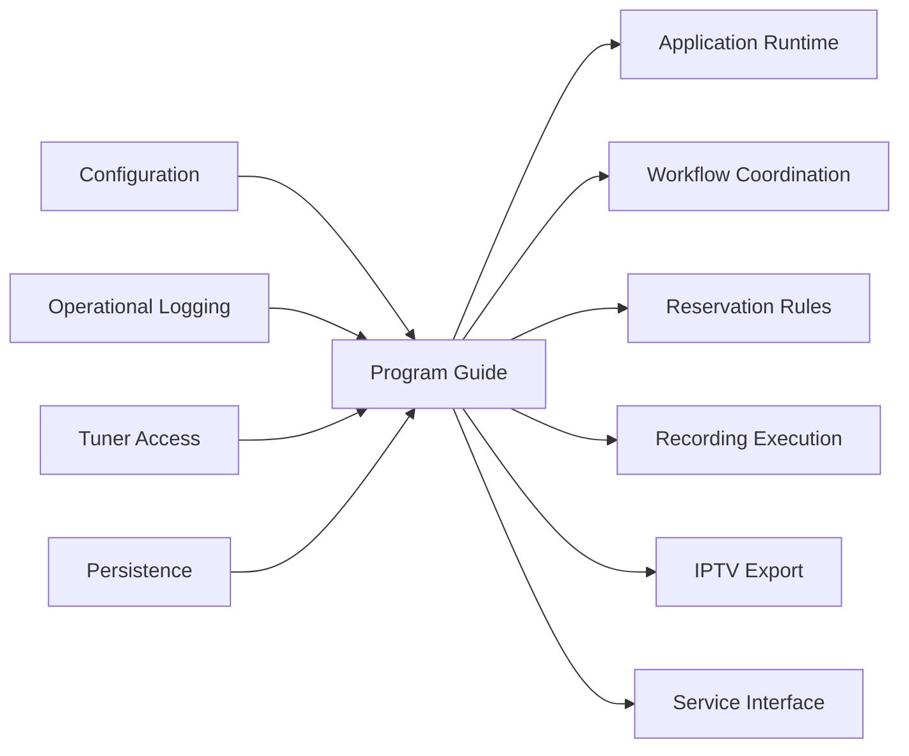
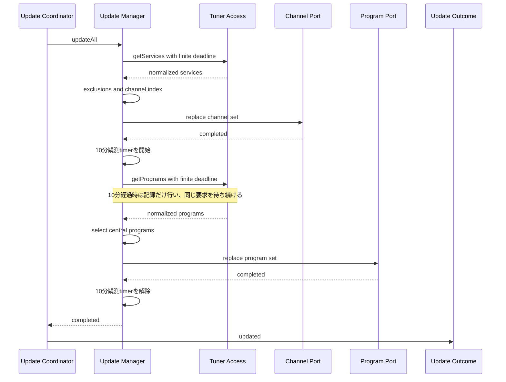
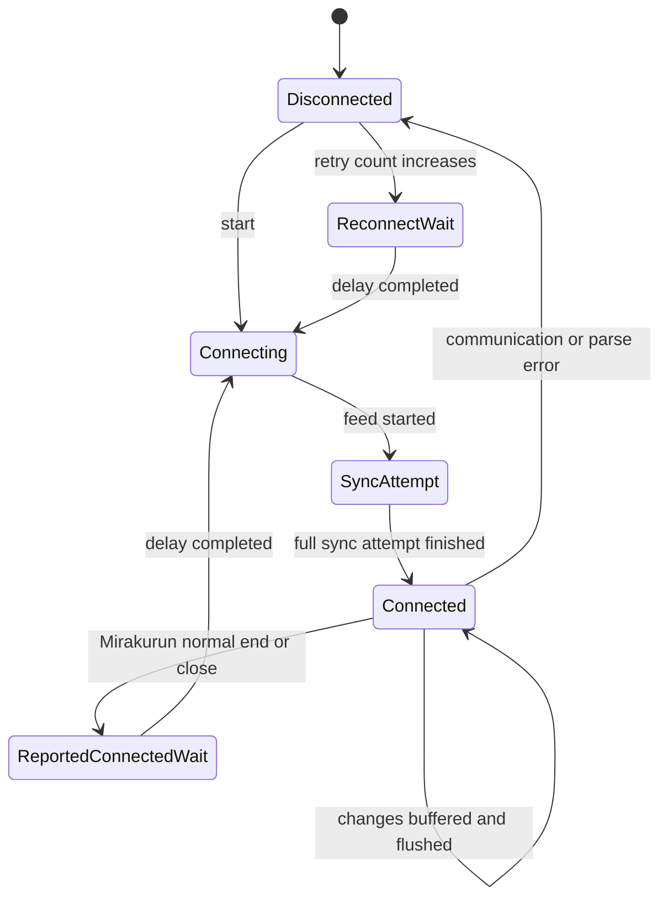
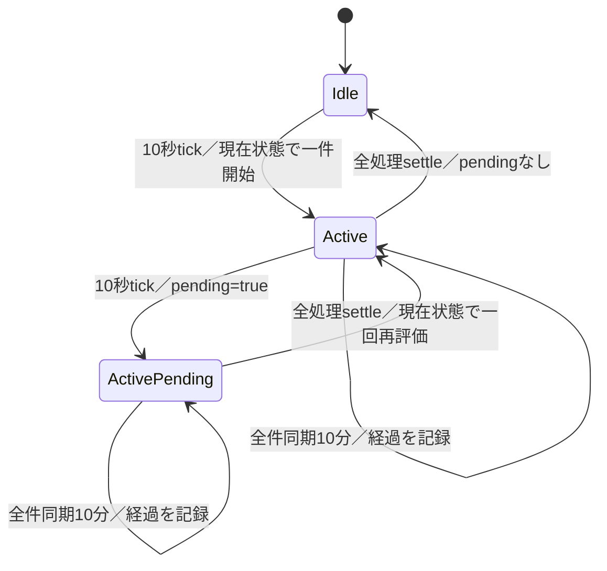
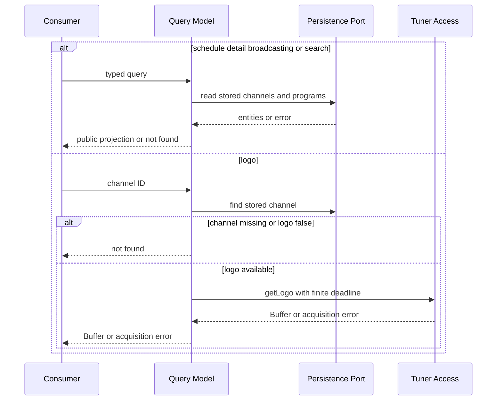

# 番組情報・番組表機能 設計

## 概要

番組情報・番組表機能は、チューナーサーバー連携機能から受け取った放送局と番組を業務上の保存対象へ変換し、全件同期と変更通
知を通じてデータベースへ反映する。保存済み情報から、放送局一覧、番組表、番組詳細、放送中番組、複合条件検索、および放送局
ロゴ照会を提供する。

主な利用者は、番組表と検索を利用するWeb・API提供機能、予約候補を探す自動予約ルール機能、録画対象を参照する予約・録画機
能、および更新後の後続処理を始める機能間連携機能である。チューナーサーバーの製品差は上流の正規化契約と変更種別の内側へ閉
じ込め、保存形式、query、公開結果へ製品判別値を持ち込まない。

本設計では、確認済みの更新周期、event集約、保存projection、検索意味、および通知時点を維持する。具体的な変更は、放送局・
番組・ロゴの取得を有限な一回要求契約へ接続することと、製品固有client型・直接通信・製品判別分岐をチューナーサーバー連携
portへ置き換えることに限定する。番組全件同期の既存10分timerは経過を記録する観測だけに用い、実行中のPromiseを取消、終了、
または別の結果へ確定しない。公開APIのルート、request、status、body、field名、およびcontent typeは変更しない。

### 目標

-   対象放送局と中心番組を全件同期し、変更通知を保存済み情報へ反映する。
-   放送中または開始が近い番組を短い周期で、その他を設定周期で保存する。
-   保存projectionと検索意味を一つの機能責務として明示する。
-   取得失敗中も保存済み情報の読取と終了済み番組の削除を継続する。
-   放送局・番組・ロゴ取得の応答待ちを上流の有限deadlineで終える。
-   更新処理をactive一件とpending一件に直列化し、10分観測後も同じ処理の通常結果を待つ。
-   Mirakurunとmirakcの入力を同じ保存・query・公開結果へ写像する。

### 非目標

-   チューナーサーバーへの接続target、HTTP route、SSEまたはevent frameの解析
-   database driver、transaction実装、Migration、共通database再試行
-   Web APIの認証、validation middleware、route registration、error body生成
-   自動予約の作成判断、予約競合、録画開始、番組リレー先での録画継続判断
-   番組表画面のlayout、client cache、Socket.IO配送
-   変更通知へ共通連番、永続cursor、欠落検出、重複除去を追加すること
-   保存済み情報へ鮮度による利用停止期限を追加すること
-   10分観測のために取消、世代管理、隔離registry、処理枠、または新しい設定値を追加すること

## 責任境界

### この機能が所有する責任

-   設定snapshotから除外放送局、除外service、番組更新間隔、および囲み文字変換条件を取得する。
-   上流DTOから保存対象放送局を選び、番組保存用の放送局索引を構築する。
-   番組リレー・同時放送情報から中心番組を選び、保存用番組projectionを決定する。
-   全件同期、変更buffer、保存周期、再接続、および終了済み番組削除を調整する。
-   番組表、詳細、放送中番組、検索、およびロゴ照会の業務query意味を定める。
-   番組情報更新のdomain outcomeと、その発行条件を定める。
-   保存済み放送局・番組の意味上の正本を所有する。

### 境界外

| 責任                                     | 所有機能                     | 本機能との境界                                                                                    |
| ---------------------------------------- | ---------------------------- | ------------------------------------------------------------------------------------------------- |
| 設定file読込、補完、reload               | `server-configuration`       | 本機能は`getConfig()`で得た構築時の設定snapshotを保持する。稼働中の更新器へreloadを自動pushしない |
| loggerのsink、level、rotation            | `server-operational-logging` | 本機能はsystem loggerへ処理結果とerrorを渡す                                                      |
| DB接続、Entity、query実行、transaction   | `server-persistence`         | 本機能は型付き放送局・番組portを呼び、確定またはerrorを受ける                                     |
| tuner transport、製品判定、payload正規化 | `server-tuner-access`        | 本機能は製品非依存DTO、change、Buffer、有限要求errorだけを受ける                                  |
| child process起動・terminal後の再起動    | `server-application-runtime` | 本機能の更新processを起動し、終了・切断・起動error後の再生成を所有する                            |
| 更新通知のIPC・Socket.IO・hook配送       | deliveryとworkflowの各機能   | 本機能は更新outcomeを発行し、配送先選択と後続順序を所有しない                                     |
| HTTP carrierとpublic error projection    | `server-service-interface`   | 本機能のquery結果またはerrorを公開API契約へ投影する                                               |

### 許可する依存

本機能が直接依存できるの
は、`server-configuration`、`server-operational-logging`、`server-persistence`、`server-tuner-access`だけである。更新
processの親子通信と HTTP adapter は下流から本機能portを呼ぶcompositionであり、本機能から下流の予約、録画、画面、HTTP
routeをimportしない。

依存方向は次で固定する。

```text
Configuration / Logging / Tuner Access / Persistence
    -> Program Guide Update and Query
        -> Runtime / Workflow / Delivery / Public Service Consumers
```

## 依存関係



| 依存                       | 方向     | 重要度 | 利用契約                                                           |
| -------------------------- | -------- | ------ | ------------------------------------------------------------------ |
| 設定snapshot               | Outbound | P0     | component生成時に更新間隔、除外一覧、文字変換条件を取得する        |
| system logger              | Outbound | P1     | 取得、保存、削除、再接続の開始・完了・失敗を記録する               |
| チューナーサーバー連携port | Outbound | P0     | services、programs、service別programs、change feed、logoを取得する |
| 放送局・番組永続化port     | Outbound | P0     | replace、incremental update、query、終了済み削除を行う             |
| 更新process管理            | Inbound  | P0     | 更新器を起動し、`updated` outcomeを受け取る                        |
| query consumer             | Inbound  | P0     | 放送局、番組表、詳細、放送中、検索、ロゴを要求する                 |
| 更新後consumer             | Inbound  | P1     | domain更新outcomeを受け、予約再計算や外部通知を選ぶ                |

チューナーサーバー連携portのREST要求は、`tunerRestRequestTimeoutMs`で指定した一回要求deadlineを持つ。省略時は30,000 msで
あり、services、programs、service別programs、logoの各要求が独立した予算を持つ。本機能はhopや処理段階ごとにdeadlineを再設
定せず、上流が返すtimeout errorを取得失敗として扱う。

## コンポーネント、interface、およびdata ownership

### コンポーネント一覧

| コンポーネント      | 責任                                                                                      | 所有状態                                             | 要件                                |
| ------------------- | ----------------------------------------------------------------------------------------- | ---------------------------------------------------- | ----------------------------------- |
| EPG更新coordinator  | 更新process内の開始、10秒周期確認、再接続、active一件・pending一件、更新outcomeを調整する | feed状態、最終更新・削除時刻、retry count、周期timer | 2.4-2.10, 7.1-7.15, 8.1-8.3         |
| 更新管理model       | 全件同期、10分経過の記録、change受信、buffer集約、保存、削除を実行する                    | 放送局索引、program/service buffer、service ID集合   | 1.1-1.6, 2.1-2.9, 7.1-7.15, 8.1-8.3 |
| 中心番組selector    | related itemから保存対象となる番組を判定する                                              | なし                                                 | 2.2, 3.11                           |
| 番組projection      | tuner DTOを保存fieldへ写像する                                                            | component生成時の文字変換設定                        | 3.1-3.11                            |
| 番組query model     | 番組表、詳細、放送中、検索の条件と表示projectionを定める                                  | なし                                                 | 4.1-4.9, 5.1-5.10                   |
| 放送局query model   | 放送局一覧とロゴ照会を調整する                                                            | なし                                                 | 6.1-6.7                             |
| 更新outcome adapter | child process内の更新完了を親processのdomain eventへ渡す                                  | listener集合                                         | 2.6, 7.1                            |

### 更新管理interface

製品判別operationをconsumer interfaceへ公開しない。更新管理modelはchangeの種類に応じてbufferを更新し、coordinatorは製品
名ではなくbuffer種別と時刻だけで保存経路を選ぶ。

```typescript
interface IEPGUpdateManageModel extends EventEmitter {
    updateAll(): Promise<void>;
    updateChannels(): Promise<void>;
    start(): Promise<void>;
    saveProgram(timeThreshold?: number): Promise<void>;
    deleteOldPrograms(): Promise<void>;
    saveService(): Promise<void>;
    saveOnAirServices(): Promise<void>;
    saveUpdateServices(): Promise<void>;
}

interface IEPGUpdater {
    start(): Promise<void>;
}
```

`start()`は一つのchange feedを開き、そのfeedが終了したときrejectする。再接続loopはcoordinatorが所有する。`updateAll()`は
放送局全件保存の後に番組全件保存を行い、両repositoryをまたぐ単一transactionを作らない。全件同期が10分を超えても、
`updateAll()`が待つ元のPromiseはそのまま継続し、遅れて得たresolveまたはrejectを一回だけの通常結果として返す。

### チューナーサーバー連携port

本機能は`server-tuner-access`が所有する正準contractの`TunerServerAccess`から、`getServices`・`getPrograms`・
`getProgramsByService`・`getLogo`・`openChangeFeed`の5 methodだけを利用する。

`TunerServerAccess`、`TunerService`、`TunerProgram`、`TunerChange`、`TunerChangeObserver`、
`TunerChangeFeedHandle`、`TunerRequestOptions`を本機能内で再定義しない。runtime compositionは `server-tuner-access`の同じ
singleton instanceをそのまま注入する。これにより、変更通知observerも正準 `TunerChange`だけを受け取
り、製品client packageの型を参照しない。

-   `program` changeはprogram bufferへ追加する。
-   `service` changeはservice bufferへ追加する。
-   `on-air-service`は短周期取得用のID集合へ追加する。
-   `service-programs-updated`は設定周期取得用のID集合へ追加する。
-   change feedの製品選択、初期通知抑止、frame解析、service別REST routeは上流の責任である。

### 永続化port

永続化実装、transaction、およびdriver差は`server-persistence`が所有する。本機能は次の型付きportへ保存・query意味を渡す。

```typescript
interface ChannelUpdateValues {
    insert: TunerService[];
    update: TunerService[];
}

interface IChannelDB {
    insert(channels: TunerService[]): Promise<void>;
    update(values: ChannelUpdateValues): Promise<void>;
    findId(channelId: number): Promise<Channel | null>;
    findChannleTypes(types: ChannelType[], needSort?: boolean): Promise<Channel[]>;
    findAll(needSort?: boolean): Promise<Channel[]>;
}

interface ProgramUpdateValues {
    insert: TunerProgram[];
    update: TunerProgram[];
    delete: number[];
}

interface IProgramDB {
    insert(index: ChannelIndex, programs: TunerProgram[], deleteChannelIds?: number[]): Promise<void>;
    update(index: ChannelIndex, values: ProgramUpdateValues): Promise<void>;
    deleteOld(time: number): Promise<void>;
    findId(programId: number): Promise<Program | null>;
    findRule(option: FindRuleOption): Promise<ProgramWithOverlap[]>;
    findSchedule(option: FindScheduleOption | FindScheduleIdOption): Promise<Program[]>;
    findBroadcasting(option: BroadcastingScheduleOption): Promise<Program[]>;
}
```

### query interface

query modelはHTTP carrierを知らず、保存済みentityを公開APIと同じfield shapeへprojectionする。

```typescript
interface IScheduleApiModel {
    getSchedule(programId: number, isHalfWidth: boolean): Promise<ScheduleProgramItem | null>;
    getSchedules(option: ScheduleOption): Promise<Schedule[]>;
    getChannelSchedule(option: ChannelScheduleOption): Promise<Schedule[]>;
    getBroadcastingSchedule(option: BroadcastingScheduleOption): Promise<Schedule[]>;
    search(option: RuleSearchOption, isHalfWidth: boolean, limit?: number): Promise<ScheduleProgramItem[]>;
}

interface IChannelApiModel {
    getChannels(): Promise<ChannelItem[]>;
    getLogo(channelId: number): Promise<Buffer>;
}
```

`IChannelApiModel`のnot-found識別値は維持する。放送局不存在と保存済み`hasLogoData === false`だけがnot-foundであり、上流
status、network、parse、timeoutは元の取得errorとして上位へ返す。

### 所有data

#### 保存済み放送局

| field                          | 意味                                        | 規則                              |
| ------------------------------ | ------------------------------------------- | --------------------------------- |
| `id`                           | tuner-server service ID兼EPGStation放送局ID | 再採番しない                      |
| `serviceId`, `networkId`       | 放送識別子                                  | numberのまま保存する              |
| `name`, `halfWidthName`        | 通常表記と半角表記                          | NUL除去後に半角projectionを作る   |
| `remoteControlKeyId`           | リモコン番号                                | 不在はnull                        |
| `hasLogoData`                  | ロゴ有無                                    | 入力をbooleanへ写像する           |
| `channelTypeId`, `channelType` | 放送波の並び順IDと値                        | GR、BS、CS、SKY、BS4Kを既存順へ写像する |
| `channel`, `type`              | channel番号とservice種別                    | 利用可能な値を保存する            |

#### 保存済み番組

`Program`が番組の保存正本である。主なfieldはID、更新時刻、放送局ID、event/service/network ID、開始・終了・duration、JST
基準の開始hourとweekday、無料判定、通常・半角・短縮番組名、通常説明、詳細説明、raw詳細、最大3組のgenre、channel情報、映
像1組、主音声1組である。

related itemは中心番組選択だけに利用し、番組間relationとして保存しない。logo画像本体、change frame、製品判別値、共通
sequence、取得errorは保存しない。

#### process内状態

| 状態                 | key                                        | lifecycle                                                                   |
| -------------------- | ------------------------------------------ | --------------------------------------------------------------------------- |
| 放送局索引           | network IDとservice ID                     | 放送局全件同期後に再構築し、追加・変更時に増分更新する                      |
| 除外索引             | channel IDまたはservice ID                 | component生成時の設定snapshotから作り、process再起動まで固定する            |
| program buffer       | program IDを含むchange列                   | feed受信から保存まで保持し、process再起動で失われる                         |
| service buffer       | service change列                           | feed受信から設定周期の保存まで保持する                                      |
| on-air service集合   | service ID                                 | 呼出開始時の全IDを一つのsnapshotとし、aggregate成功後に全件削除             |
| deferred service集合 | service ID                                 | 呼出開始時の全IDを一つのsnapshotとし、aggregate成功後に全件削除             |
| feed状態と時刻       | boolean、epoch ms、retry count             | 更新process内だけで保持し、永続化しない                                     |
| 周期確認             | interval handle、active flag、pending flag | 10秒ごとに再評価を要求し、実行中一件と保留一件を上限にprocess終了まで続ける |
| 全件同期の10分観測   | timeout handle                             | 放送局全件保存後から同じ`updateAll()`のresolveまたはrejectまで保持する      |

## 主要workflow、状態、およびtimeline

### 全件同期



1. services取得に失敗した場合は放送局保存を開始せず、番組取得と更新outcomeを行わない。
2. 放送局保存後にprograms取得または番組保存が失敗した場合、放送局確定分を自動rollbackせず、更新outcomeを行わない。
3. 対象放送局は除外channel IDと除外service IDを適用してから全件保存する。全件保存成功時、取得結果にない保存済み放送局は
   整理される。
4. 番組は中心番組selectorと保存projectionを通してから全件置換する。
5. servicesとprogramsの要求はそれぞれ独立した有限deadlineを持つ。番組全件同期の10分観測は上流の一回要求deadlineを置き換
   えず、追加の取消要求も行わない。
6. 既存10分timerの観測区間は放送局全件保存の完了後、番組全件取得の直前から始まる。services取得、放送局保存、または
   channel index再構築をこの10分へ遡って含めず、service別番組取得列または周期DB処理へ同じtimerを新設しない。
7. 10分観測が先に発火した場合は経過を一回記録するだけとする。同じ`updateAll()`、取得Promise、番組projection、および番組
   保存を終了または遮断せず、遅れてresolveした場合は後続段階を通常どおり続け、遅れてrejectした場合は通常の全件同期失敗と
   して一回だけ扱う。
8. 同じ`updateAll()`がresolveまたはrejectするまでactive状態を維持し、新しい全件同期を開始しない。settlement後は観測timer
   を一回解除し、pendingがあれば現在の時刻と状態で一回だけ再評価する。

### change feedと再接続状態



-   feed開始または再接続時は、放送局と番組の全件同期を一度だけ試みる。
-   全件同期が失敗しても、その場で同じ同期をloopせずfeed受信を有効にする。外部更新outcomeは発行しない。
-   feed開始成功時にretry countを0へ戻す。
-   feed終了後の待機は5秒ずつ増加し、最大60秒とする。試行回数に上限を設けない。
-   Mirakurunの通常`end`または`close`は再接続するが、通信・解析失敗と同じ切断通知を出さない。そのため再接続待機中も
    coordinatorの接続flagは接続中のままである。

change feed adapterはMirakurun／mirakc共通の`TunerChangeObserver`（`aborted(error: Error)`）を用いる。Mirakurun event
streamの`end`／`close`／JSON解析失敗、およびmirakcのSSE監視timerによる切断は、次のように記録する。

-   Mirakurunの通常`end`／`close`: `aborted()`を呼ばない設計（サーバー連携機能`.kiro/specs/server-tuner-access/design.md`
    の「現行の特性」節が既にcharacterizeし、通信・解析失敗と同じ通知へ統一しないと明記した既存
    決定）であるため、個別の記録は存在しない。切断そのものは`runEventStreamAttempt`の`catch`が無条件で記録する`destroy
    event stream`と、それに続けて記録する error 本体（`program-guide-lifecycle.test.ts`が2行で固定、C）に必ず含まれる。
    文言による原因の書き分けはないが、原因そのものはerror本体で残る。通信・解析失敗だけを異常として区別する設計であり、
    本機能は既存のtuner-access決定を追認する。
-   Mirakurunのframe解析失敗: `aborted(new Error('Invalid Mirakurun change frame'))`を呼び、`tuner change feed error`と
    その error 本体を記録する（`tuner-access/consumers.integration.test.ts`の`[TA-6.1] consumes normalized feed changes and performs mirakc
    service-program lookup through the facade`が`['tuner change feed error']`と`feedFailure`の2行を固定、C）。原因の詳細はerror本体で保持される。
-   mirakcのSSE監視timerによる切断: `aborted(new Error('Closed mirakc change feed'))`を呼び、同じ`tuner change feed
    error`経路で記録する（`tuner-access/change-feed.test.ts`の`[TA-2.3] terminates a mirakc feed whose open stream becomes
    unreadable without a terminal event`が`Closed mirakc change feed`への解決を固定、C）。

### 周期処理

coordinatorは一つのinterval timerで10秒ごとに条件を評価する。`updateInterval`はcomponent生成時の
`epgUpdateIntervalTime`を分へ換算した値である。timer callbackは業務処理を直接重ねず、周期再評価を要求する。周期処理が
idleなら、そのtick時点の現在時刻とfeed状態で一件を開始する。周期処理がactiveなら新しい処理を開始せず、`pending`を
`true`へするだけである。active中にtickが何回来てもpendingは一件を超えない。

activeな周期処理から開始した番組変更保存、service別番組更新、切断時全件同期、および終了済み番組削除がすべてsettleした
後、pendingがなければidleへ戻る。pendingがあれば一度だけfalseへ戻し、その時点の現在時刻とfeed状態を読み直して次の一件を
直ちに実行する。以前のtickが保持していた時刻や条件判定を再利用しない。全件同期の10分観測が発火してもactive状態を変えず、
同じ処理のresolveまたはrejectを待つ。その間のtickはpending一件へ合流し、settlement後にだけ現在の状態を一回再評価する。



一つのactive周期内では次の順序を維持する。

1. feed接続中は、Mirakurunならprogram change保存、mirakcならon-air service集合のaggregate更新を開始し、そのsettlementを
   active周期の完了条件へ含める。Mirakurunのservice change→program change、mirakcのon-air→deferredは、それぞれ一回の更新
   呼出し内で現在の順序を維持する。
2. feed切断flagがあり最終更新から設定周期の1.5倍を経過している場合は、放送局・番組の全件同期をawaitし、成功後に時刻と更
   新outcomeを確定する。
3. 接続中の更新呼出し、または切断中の全件同期開始後、終了済み番組削除の期限を評価する。接続中の更新と切断中の全件同期の
   settlement後に削除条件を評価し、開始した削除のsettlementもactive周期の完了条件へ含める。

| 条件・buffer                                | 処理経路                       | 処理                                                                     | 外部更新outcome                  |
| ------------------------------------------- | ------------------------------ | ------------------------------------------------------------------------ | -------------------------------- |
| 接続中かつprogram changeがあり、設定周期前  | Mirakurun program保存          | 開始時刻が現在から5分以内の番組を含むbatchだけを保存する                 | 発行しない                       |
| 接続中かつ設定周期到達                      | Mirakurun service・program保存 | service changeを保存し、program changeを保存する                         | 両処理成功後に発行する           |
| mirakcの周期確認                            | mirakc on-air更新              | 開始時のon-air ID集合全体をaggregate保存し、settlementをawaitする        | 発行しない                       |
| mirakcで設定周期到達                        | mirakc deferred更新            | deferred ID集合全体のaggregate保存を開始し、周期終了前にsettlementを待つ | 保存完了を待たず開始後に発行する |
| 切断flagかつ最終更新から設定周期の1.5倍経過 | 全件同期                       | 放送局と番組の全件同期を試みる                                           | 成功時だけ発行する               |
| 最終削除から設定周期経過                    | 終了済み番組削除               | `endAt < now`の番組を削除する                                            | 発行しない                       |

後続tickはactive中の処理を重複開始せず、pending一件へ合流する。active周期がsettleした後の再評価では新しい現在時刻と状態
を使うため、条件が引き続き成立する処理だけを次の周期として開始する。終了済み番組削除はresolveまたはrejectを待ち、reject
を記録した後も、そのactive周期が保持する現在時刻を最終削除時刻へ設定する。

### program change保存

1. program保存呼出しの開始時に、現在のprogram buffer全件をその呼出しのbatchとして一度取り出す。取り出し後に到着した
   changeは受付中の新しいbufferへ入れ、そのbatchと混ぜない。
2. `create`と`update`は番組名があり中心番組である場合だけprogram ID単位の最終更新候補にする。
3. `remove`はprogram ID単位の削除候補にし、それ以前の更新候補を除く。
4. `redefine`は`from`を削除候補にし、それ以前の更新候補を除く。`to`を自動取得するoperationは追加しない。
5. 後続のcreate/updateは同じIDの先行remove/redefineを除く。
6. 短周期flushでは更新候補の`startAt < now + 5分`が一件でもある場合にbatch全体を保存する。該当がなければ、削除候補を先
   頭、更新候補を後続として新着bufferの前へ戻す。
7. repositoryがrejectした場合は、その実行が所有する元change列全体を新着bufferの前へ戻し、更新outcomeを発行しない。
8. repositoryがresolveした場合は、その実行が所有するbatchだけを確定し、内部`PROGRAM_UPDATED`を発行する。外部outcomeの時
   点は前節の周期表に従う。
9. 一つのactive周期から開始したprogram保存のsettlement前に、別の周期保存を開始しない。保存中に届いたchangeは受付中の
   bufferへ残し、pending再評価または後続tickが開始する次の周期で新しいbatchとして取り出す。

### service changeとservice別programs

-   service `create`と`update`は除外設定を適用し、同じIDの最後の候補を保存する。`remove`通知だけでは放送局または関連番組
    を削除しない。
-   service change保存時はロゴ有無補完のためservices全件取得を試みる。取得失敗時は空の補完集合として処理を続け、元change
    にある値だけで保存を試みる。
-   設定周期のMirakurun更新呼出しはservice change保存の開始時にも現在のservice bufferをその呼出しのbatchとして一度取り出
    す。以後のservice changeは新しいbufferへ残し、遅れて完了した所有batchの結果で新着bufferを削除・確定しない。保存
    reject時に所有service batchを復元しない既存意味はcharacterizationとして維持する。
-   on-airおよびdeferredのservice ID集合はIDを重複させない。呼出開始時に現在の全IDを一つのsnapshotとして取得するが、元集
    合を空集合へswapしない。aggregate成功後だけsnapshot内の全IDを元集合から削除するため、failureでは全IDが残る。実行中に
    同じIDの通知が到着してもservice ID集合のset表現では区別できず、成功時にsnapshotのIDとともに削除され得る。
-   保存時に放送局全件同期を先に行う。成功後はsnapshot内の各serviceのprogramsを現在のID順で一件ずつ取得し、中心番組を一
    つの`insertPrograms`へ集める。全serviceの取得完了後、番組集合とservice ID snapshot全体を一回のrepository bulk保存へ
    渡す。
-   一件のservice取得、JSON解釈、放送局同期、またはaggregate bulk保存がrejectした場合、その呼出し全体をrejectする。成功
    したprefixをID単位で確定せず、その時点で取得loopを打ち切ってsnapshot全IDを集合に残す。後続IDだけの続行、
    partial-success、または失敗IDだけの再投入を行わない。
-   service別programsの各REST要求は30,000 msの独立deadlineを持つ。複数serviceをまとめる全体deadlineは追加しない。
-   mirakc service cycleはon-air aggregateをawaitし、reject時はerrorを記録してそのcycleのdeferred開始と更新outcomeへ進ま
    ない。on-air成功後、設定周期に達していればID集合が零件でもdeferred aggregateを開始するが、そのsettlementを待たず
    `lastUpdatedTime`を更新して外部更新outcomeを発行する。deferred rejectは後から記録し、先行outcomeを取り消さない。
-   mirakcの一回の更新呼出しではon-air aggregateをawaitしてからdeferred aggregateを開始する。deferred保存完了前に更新
    outcomeを通知する時点は維持するが、deferred Promise自体はactive周期のsettlementへ含める。後続tickはpending一件へ合流
    し、先行aggregateと同じservice ID集合を別の周期処理として重ねない。

### queryとロゴ



logo Bufferは照会ごとに上流から取得し、database、filesystem、またはprocess memoryへcacheしない。

## algorithm、不変条件、並行処理、およびidempotency

### 中心番組選択

中心番組selectorは次の順序で判定する。

1. `relatedItems`がなければ保存対象とする。
2. itemに`type`がなければ旧schema互換として保存対象とする。
3. `movement`が一件でもあれば保存対象とする。
4. `relay`だけで構成される場合は保存対象とする。
5. `shared`がある場合、itemのevent IDとservice IDが対象番組自身に一致すれば保存対象とする。
6. sharedがあるが自身に一致せず、上記条件にも該当しなければ保存対象外とする。

この判定は保存対象の選択だけに使い、related item自体を保存しない。

### 番組projection

| 項目         | projection規則                                                                                                      |
| ------------ | ------------------------------------------------------------------------------------------------------------------- |
| 必須前提     | `name`がない番組、またはnetwork IDとservice IDを放送局索引で解決できない番組は保存対象外                            |
| 時刻         | `endAt = startAt + duration`。開始hourとweekdayはJSTへ変換した開始時刻から作る                                      |
| 番組名       | NULを除去し、設定有効時は囲み文字を表示用角括弧文字へ置換する                                                       |
| 半角・短縮名 | 通常名を半角化し、短縮名は半角名から囲み文字と角括弧部分を除いてtrimし、半角名に[前]（U+1F21Cを含む）・[後]（U+1F21Dを含む）があれば位置に関わらず末尾へ`[前]`、`[後]`の順で付ける。録画履歴の名前も同じ規則で作り、重複録画の照合はこの2つを比べる |
| 通常説明     | undefinedまたは空文字はnull。それ以外は通常表記と半角表記を保存する                                                 |
| 詳細説明     | item順に、見出しへ必要なら`◇`を補って一つの表示文字列へ結合する。raw objectと半角raw objectもJSON textで保存する    |
| genre        | 入力順の先頭3slotだけを扱い、標準範囲のlevel 1とoptional level 2を各slotへ保存する                                  |
| video        | 入力にあれば一組を保存する                                                                                          |
| audio        | 単数audioを受理する。複数audiosでは`isMain !== false`の要素を走査順に写像するため、複数候補では最後の一組が残り得る |

### 番組表と放送中query

-   放送波指定は選択されたGR、BS、CS、SKY、BS4Kを対象とし、放送局指定はchannel IDを対象とする。BS4Kのqueryは任意で、
    指定しなければGR/BS/CS/SKYの4種別だけで絞り込む。
-   期間重複条件は`program.startAt <= requested.endAt`かつ`program.endAt >= requested.startAt`であり、両端を含む。
-   `isFree`が指定された番組表queryでは保存値と一致する番組だけを返す。
-   query結果は`startAt ASC`であり、同じ開始時刻へ追加tie-breakを設けない。
-   放送局ごとの日別番組表は開始時刻から24時間ずつ区切って同じ重複条件を適用する。
-   放送中queryの評価時刻は現在時刻にoptional加算時間を加えた値であり、`startAt <= time <= endAt`を満たす番組を返す。放
    送局ごとに複数件があれば先頭1件を公開projectionへ残す。
-   番組詳細の該当なしは`null`であり、carrierがnot-foundへ投影する。
-   `isHalfWidth`に応じて番組名、説明、詳細、raw詳細、および放送局名の通常表記または半角表記を返す。

### 検索query

1. 通常keywordと除外keywordは半角化して半角spaceで分割する。
2. 一つの選択field内では全tokenをANDで結び、選択されたname、description、extendedのfield間をORで結ぶ。除外keywordはその
   field集合の一致全体を否定する。
3. regexpが利用可能なら入力を一つのregexpとして選択fieldへ適用する。適用の前に`StrUtil.toHalfRegExp`で入力を変換する。
   全角の英数字と全角の空白（`　`）は`StrUtil.toHalf`と同じ対応で半角にする。全角の記号（`！`〜`～`のうち英数字以外、`”`・`’`・`‘`・`￥`・
   `〜`）も同じ対応で半角にしたうえで、半角になった文字がregexpの記号（`\` `^` `$` `.` `|` `?` `*` `+` `(` `)` `[` `]` `{` `}`）なら
   直前に`\`を付けて文字そのものとして照合する（`なぜ？`→`なぜ\?`、`（再）`→`\(再\)`、`￥`→`\\`）。半角で入力された文字は変換せず、
   半角の記号は今までどおりregexpとして働く。この`\`+記号の形は、SQLite（regexp extension）、MySQL（ICU）、MariaDB（PCRE）、
   PostgreSQL（`~`・`~*`）のいずれでも、その記号1文字に一致する同じ意味である。regexp書式の誤りは変換では直さず、databaseの
   errorとして検索の失敗になる。database能力がない場合は同じ入力を通常keyword処理へfallbackする。
4. case-sensitive能力がないdatabaseではcase-sensitive指定を無効化する。
5. `channelIds`が一件以上あれば放送波指定を使わずID集合で絞る。ID指定がなければ選択放送波を使う。
6. 複数genre条件はORで結び、各条件は保存した3slotのいずれかへ一致させる。
7. 曜日・時間帯の複数条件はORで結び、その他のkeyword、channel、genre、無料、duration、検索期間の各categoryはANDで結ぶ。
8. `isFree === true`で無料番組を絞る。falseまたはundefinedは無料・有料の追加filterを設けない。
9. duration最小・最大は秒入力をmillisecondへ換算して包含境界で比較する。検索期間は番組開始時刻が指定開始以上かつ終了以下
   の範囲を対象にする。
10. 保存済み番組の`endAt >= query開始時の現在時刻`も共通条件とし、`startAt ASC`で返す。同じ開始時刻の順序は保証せ
    ず、limitがあれば先頭から指定件数まで返す。

### 不変条件

1. 除外設定を適用した放送局だけを放送局索引と全件保存の対象にする。
2. 番組保存時のchannel ID、channel type、channel番号は同じ放送局索引から取得する。
3. 番組全件置換とservice ID集合のaggregate置換はrepositoryがresolveした場合だけ成功として扱う。
4. program bufferの保存reject時は取り出した元changeを失わない。
5. 保存済み情報の読取はfeed接続状態や最終更新時刻で拒否しない。
6. logo not-foundとupstream acquisition errorを同じ結果へ畳み込まない。
7. 製品判別値と製品client型を保存entity、query input、public projectionへ含めない。
8. 公開API契約を内部DTO変更へ追従させて変更しない。

### 並行処理とidempotency境界

-   10秒intervalはactive周期の完了を待たずtickし続けるが、業務処理は同時に一件だけ実行する。active中のtickはboolean相当
    のpending一件へ合流し、件数、Promise列、tick時刻のqueueを蓄積しない。
-   active周期がsettleした時点でpendingがあれば、現在時刻とfeed状態を読み直して一回だけ再評価する。その再評価中のtickも
    同じpending一件へ合流するため、databaseまたはRESTの長時間pendingによって周期Promiseが無制限に重ならない。
-   JavaScript event loop上の同期区間でprogram bufferを呼出しごとのbatchへspliceする。service ID集合は呼出開始時の全ID
    snapshotを読み、aggregate成功後だけsnapshot IDを削除する。active周期中に到着したchangeとservice IDは受付中bufferへ残
    り、pending再評価または後続tickの周期が扱う。
-   feed callbackはactive周期と並行してprogram bufferとservice ID集合を更新できる。settlement後に受付状態を作り直して新
    着dataを失わず、前の周期が所有するbatchまたはsnapshotだけを確定・復元する。
-   database Promiseへ人工的なtimeoutやcancel raceを追加しない。pending中も10秒timerはtickするが、競合する後続DB処理を開
    始せずpending一件を記録する。
-   REST要求の既存30秒deadlineと、放送局全件保存後に開始する番組全件同期の10分観測は独立して適用する。10分観測は同じ
    `updateAll()`を終了させず、取得、projection、保存の続行も遮断しない。
-   全件同期の10分観測後も、同じactive処理のPromiseを待つ。resolveまたはreject後にその通常結果を一回だけ反映してactiveを
    終え、pendingがあれば現在の時刻と状態で一回だけ再評価する。
-   周期保存と終了済み番組削除へ10分観測を新設しない。各DB Promiseのresolveまたはrejectまで同じactive周期を維持する。
-   同じprogram IDの未保存changeは最後の有効なcreate/updateまたはremoveへ集約する。同じservice IDの通知はset相当のindex
    で一件へ集約する。
-   database insert/updateはIDを自然keyとして利用するが、更新outcomeにidempotency keyやgenerationを付けない。同じ外部
    outcomeが複数回発行される可能性をconsumerが許容する。
-   process再起動時にbufferとID集合は失われる。永続cursorから再開せず、新しいfeed開始時の全件同期で追従を試みる。
-   change feedに切断をまたぐ共通sequenceがないため、全件同期完了後からfeed受信開始までを含む完全な無欠落を保証しない。

## failure、timeout、retry、restart、およびcleanup

### failure契約

| 場面                                              | 結果                   | retry・cleanup・通知                                                                |
| ------------------------------------------------- | ---------------------- | ----------------------------------------------------------------------------------- |
| services全件取得のnetwork、status、parse、timeout | 全件同期reject         | 上流request cleanup後にerrorを記録。番組取得と更新outcomeなし                       |
| 放送局全件保存reject                              | 全件同期reject         | 番組取得と更新outcomeなし。database cleanupは永続化portが所有                       |
| programs全件取得のnetwork、status、parse、timeout | 全件同期reject         | 確定済み放送局はrollbackしない。番組置換と更新outcomeなし                           |
| 番組全件置換reject                                | 全件同期reject         | repository rollback後に更新outcomeなし                                              |
| feed開始時の全件同期reject                        | feed受信を開始         | 同じ接続内で即時再試行せず、失敗を記録する                                          |
| change feed通信・解析error                        | feed completion reject | handleをcleanupし、切断flagへ移行して増加待機後に再接続する                         |
| Mirakurun通常end・close                           | feed completion reject | cleanupして再接続するが、通信errorと同じ切断flagへ移行しない                        |
| program増分保存reject                             | 当該呼出しの実行失敗   | 取り出したbatchをbuffer先頭へ戻す。activeをsettleし、保留時だけ現在状態で再評価する |
| service別programs取得・保存reject                 | ID snapshot全体を失敗  | 全IDを集合に残し、部分成功・失敗IDだけの再投入なし。deferredの先行通知は取消さない  |
| 番組全件同期が10分経過                            | active継続             | 経過を記録し、同じPromiseの通常結果を待つ。新しい全件同期を開始しない               |
| 周期内DB保存・削除が未確定                        | active継続             | 別の10分期限を設けず、同じPromiseを待ち、後続処理を重ねない                         |
| 終了済み削除reject                                | errorを記録            | 当該周期の現在時刻を最終削除時刻へ反映し、activeをsettleして読取・取得を継続        |
| logo用channel不存在・logo false                   | not-found              | upstream要求なし                                                                    |
| logo取得network、status、parse、timeout           | acquisition error      | not-foundへ変換せず、Bufferを保存しない                                             |

### timeout境界

-   services、programs、service別programs、logoはそれぞれチューナーサーバー連携機能の一回REST deadlineを使用する。
-   全body受信とDTO解析までに上流がtimeoutした場合、本機能は通常の取得失敗として受け取る。
-   放送局全件保存後から番組全件同期の終了まで、既存の600,000 ms timerを一つの観測に使う。値を処理段階ごとに再開始せ
    ず、callbackは経過を記録するだけで、元Promiseをresolve、reject、取消、またはcloseしない。
-   10分観測が番組取得、projection、または番組全件保存中に先着しても、同じ`updateAll()`をactiveのまま維持する。遅れて
    resolveした場合は残りの処理と成功時の通知を通常どおり一回行い、遅れてrejectした場合は通常の失敗処理を一回行う。
-   周期確認から開始したprogram増分保存、service別programs取得後のaggregate保存、および終了済み番組削除へ新しい10分
    observerを設けない。各Promiseのresolveまたはrejectまで同じactive周期を維持する。
-   service別programsのREST取得列全体へ固定10分のaggregate deadlineを適用しない。各serviceの30秒deadlineを順に適用するた
    め、対象ID数に応じて取得列全体の時間は増え得る。全取得後のaggregate DB保存も人工的な10分期限を持たない。
-   DB Promiseがpendingの間も10秒timerはtickするが、新しい周期処理を開始せず保留再評価一件だけを維持する。
-   設定reloadは進行中要求のdeadlineを変更しない。新値はチューナー連携instanceまたはprocess再構築後に使う。

### retryとrestart

-   個別RESTとlogo要求は本機能から自動retryしない。
-   feed接続だけが5秒刻み、最大60秒の待機で無期限に再接続する。
-   明示的に切断flagへ移行した状態では、設定周期の1.5倍を過ぎると周期処理も全件同期を一度試みる。
-   database通常操作の最大5回再試行は永続化機能の内側であり、本機能はtransaction job全体を再実行しない。
-   10分観測だけを理由に同じ全件同期を自動retryしない。active処理の通常結果後、pendingがある場合だけ現在の時刻と状態で再
    評価する。

### cleanupとshutdown

-   change feed handleのrequest、response、listener、timer cleanupはチューナーサーバー連携機能が一度だけ行う。
-   program save失敗時はmemory bufferを復元するが、すでに確定したDB変更を補償rollbackしない。
-   logo Bufferはresponse後に保持しない。
-   本機能は公開`stop()`、drain、shutdown timeoutを持たない。10秒interval timerはprocess終了まで再評価を要求し、active一
    件とpending一件の上限を維持する。10分観測timerは同じ`updateAll()`のresolveまたはreject後に一回解除する。

### 望ましい保証にしない挙動とcharacterization

以下は望ましい保証ではない。contract testへ混ぜず、characterization testで再現する。1・2は修正前の挙動をfixtureだけに残し、3〜8は今の挙動である。

1. 修正前の番組全件更新10分timerはcallbackからthrowするが、process-level handlerは記録だけを行うため元`updateAll()`を終
   了せず、遅れて成功した場合は時刻更新とoutcomeへ進み得る。修正前fixtureではこのthrowと記録を再現する。target contract
   はcallbackからthrowせず経過を記録するだけとし、元Promiseの遅延したresolveまたはrejectを通常結果として一回扱う。
2. 修正前は空の `genres` 配列が先頭要素参照で例外になり得る。正規化では `genres` の欠落または空配列を「ジャンルなし」と
   して扱い、存在する要素だけを入力順に最大 3 件投影する。修正前の例外は characterization fixture にだけ残す。
3. 放送局changeの`remove`は保存へ反映せず、次の放送局全件同期まで残る。これは1.5と1.6の区別として維持する。
4. 放送局全件・増分保存も一部の行失敗を記録だけにしてresolveし得る。保存済み集合と成功通知が一致する保証にはしない。
5. Mirakurunの通常`end`・`close`は再接続loopへ戻る一方、切断通知を発行しないため、再接続待機中も接続flagがtrueのままであ
   る。
6. service change保存前のservices全件取得失敗は空配列へ変換され、queued serviceの保存自体を失敗させない。
7. 放送局全件保存では、取得集合の一件でもchannel情報を持たない場合、repositoryはDB変更前にfulfilledで戻り得る。更新管理
   modelは放送局保存成功としてmemory索引を再構築し、番組全件更新へ進むため、保存済み放送局集合と新しい索引が一致する保証
   はない。欠落serviceを除いて全件置換を続ける修正は選定せず、合成入力でDB不変、索引、後続処理、および更新outcomeを
   characterizeする。
8. 放送局増分保存はservice bufferを先に全件取り出し、放送局repositoryがrejectしても取り出したchangeをbufferへ戻さない。
   内部service更新eventは発行しないが、同じchangeの自動再試行も保証しない。program bufferの失敗時復元規則をservice
   bufferへ拡張せず、reject後のbuffer状態をcharacterizeする。

上の一覧とは別に、番組増分repositoryの個別delete、insert、update失敗は、persistenceのRequirement 4.6のとおり記録して後続
を続け、成功分をcommitし、更新全体は成功として扱う。呼出元は成功として内部更新eventを発行する。これは修正の対象ではなく
今の契約であり、`characterization.test.ts`では承認済みの互換性として固定する。

## contract

### 設定contract

| field                                       | 取得時点             | 利用                                                          |
| ------------------------------------------- | -------------------- | ------------------------------------------------------------- |
| `excludeChannels?: number[]`                | 更新管理model生成時  | tuner-server service IDによる除外index                        |
| `excludeSids?: number[]`                    | 更新管理model生成時  | service IDによる除外index                                     |
| `epgUpdateIntervalTime: number`             | coordinator生成時    | 分単位の通常flush・削除周期                                   |
| `needToReplaceEnclosingCharacters: boolean` | 番組repository生成時 | 番組名、説明、詳細の保存projection                            |
| `tunerRestRequestTimeoutMs?: number`        | tuner access生成時   | services、programs、service別programs、logoの一回要求deadline |

稼働中reloadを既存更新器へ反映しない。除外、更新間隔、文字変換、deadlineの変更には該当componentまたはprocessの再構築が必
要である。

### 全件同期の10分観測contract

番組全件同期の観測値は内部固定の600,000 msとする。放送局全件保存後から、同じ`updateAll()`がresolveまたはrejectするまでを
観測し、公開設定、HTTP、IPC、環境変数、または別処理のdeadlineへ投影しない。

1. timerは番組一覧取得の直前に一回開始する。
2. 10分を先に経過した場合は経過を一回記録するだけとし、元Promiseをresolve、reject、取消、またはcloseしない。
3. 番組一覧取得が遅れてresolveした場合は、中心番組の選択と番組全件保存を通常どおり続ける。取得または保存が遅れてrejectし
   た場合は、通常の全件同期失敗として一回だけ扱う。
4. 元Promiseがresolveまたはrejectするまで同じ処理をactive一件として維持し、その間に新しい全件同期を開始しない。
5. 元Promiseのsettlement後にtimerを一回解除し、pendingがあれば現在の時刻と状態で一回だけ再評価する。
6. 周期確認から開始する番組変更保存、service別番組更新、および終了済み番組削除へ、この10分timerを追加しない。

### 更新event contract

| event                 | trigger                              | payload                  | delivery・順序                                | idempotency                             |
| --------------------- | ------------------------------------ | ------------------------ | --------------------------------------------- | --------------------------------------- |
| 内部program updated   | program増分repositoryがresolve       | なし                     | 同一更新process内EventEmitter                 | keyなし。外部outcomeへ直接転送しない    |
| 内部service updated   | service増分repositoryがresolve       | なし                     | 同一更新process内EventEmitter                 | keyなし。removeのみでは発行対象保存なし |
| feed started          | change feed確立                      | なし                     | 全件同期を一度開始する                        | 接続ごとに一回                          |
| feed aborted          | 通信または解析error                  | errorはlogへ渡す         | 切断flagをfalseへする                         | terminal cleanupは一回                  |
| program guide updated | 全件同期成功または設定周期の通知時点 | `{ msg: 'updated' }`相当 | childから親へ渡し、親がdomain eventを発行する | generationなし、重複可能                |

更新outcomeは、その発行時点までに確定した保存済み情報を読めることを示す。すべての後続保存、予約再計算、外部
hook、Socket.IO配送の完了を示さない。

### 公開API契約

HTTP routeとcarrierは`server-service-interface`の所有だが、次の既存wireを本機能の内部変更で変えない。配備時の
subdirectoryはroute前方へ付加され得る。

| Method / route                          | domain input                                        | 成功                                            | domain上のnot-found                          | その他error                                       |
| --------------------------------------- | --------------------------------------------------- | ----------------------------------------------- | -------------------------------------------- | ------------------------------------------------- |
| `GET /api/channels`                     | なし                                                | `200 application/json`、`ChannelItem[]`         | なし                                         | 既存server error JSON                             |
| `GET /api/channels/{channelId}/logo`    | channel ID                                          | `200 image/png`、binary body                    | channel不存在またはlogo falseを既存404へ投影 | upstream取得失敗・timeoutを既存server errorへ投影 |
| `GET /api/schedules`                    | 期間、表示、放送波、optional free/raw詳細           | `200 application/json`、`Schedule[]`            | なし                                         | 既存server error JSON                             |
| `GET /api/schedules/{channelId}`        | channel ID、開始、日数、表示、optional free/raw詳細 | `200 application/json`、`Schedule[]`            | route固有の新しい404を追加しない             | 既存server error JSON                             |
| `GET /api/schedules/broadcasting`       | 表示、optional加算時間                              | `200 application/json`、`Schedule[]`            | なし                                         | 既存server error JSON                             |
| `GET /api/schedules/detail/{programId}` | program ID、表示                                    | `200 application/json`、`ScheduleProgramItem`   | 保存番組不存在を既存404へ投影                | 既存server error JSON                             |
| `POST /api/schedules/search`            | `RuleSearchOption`、表示、optional limit            | `200 application/json`、`ScheduleProgramItem[]` | 空配列                                       | 既存server error JSON                             |

`ChannelItem`、`ScheduleChannleItem`、`ScheduleProgramItem`のfield名、optional条件、`Schedule`のchannel/programs構造、お
よび既存error bodyを変更しない。内部の`TunerService`、`TunerProgram`、timeout error名、製品判定をwireへ出さない。

### セキュリティとprivacy

-   設計書、log、fixtureへ実URL、socket path、credential、実番組、実ロゴ、machine固有pathを含めない。
-   新しいupstream bodyまたはchange frameのloggingを追加しない。一方、既存error objectが実際に含む情報はcharacterization
    し、redaction保証へ昇格しない。
-   queryは永続化portのparameter bindingを利用し、keyword、regexp、ID配列をSQLへ直接連結しない。
-   logo bodyは要求元へ渡すだけで、filesystemやlogへ書かない。
-   認証、認可、CORS、Host、forwarded headerの信頼境界はpublic carrier側に残す。

## テスト戦略

### test層

| 層                       | 主な対象                                                                                                        |
| ------------------------ | --------------------------------------------------------------------------------------------------------------- |
| `*.spec.test.ts`         | Requirements 1から8の71 AC、全件同期、change集約、周期、query、logo、製品非依存結果                             |
| implementation unit test | 中心番組判定、projection、keyword組立、buffer復元、ID集合、表示projection                                       |
| integration              | tuner access stub、SQLite/MySQL persistence、update process event、HTTP adapter                                 |
| characterization         | timeout callback、空genre、部分commit、service remove、通常切断flag、放送局保存と索引の乖離、service buffer消失 |
| compatibility            | Mirakurunとmirakcの合成DTO/changeから同じ保存entity・query・public fixtureを得るmatrix                          |

test名の先頭に付く印の意味は次のとおりである。`[PG-n.m]`のn.mはrequirementsのAC番号、`[PG-Tn.m]`のn.mはtasks.mdのtask番号である。
`[PG-AUX-Tn.m]`は同じtask番号の補助caseで、主caseの件数に加えない。`[PG-I-nnn]`・`[PG-MB-…]`・`[PG-MC-…]`・`[PG-X-…]`は
「唯一の機能固有Test Matrix」の補完testのlabelであり、ACの番号ではない。ACからtestを辿るときは、Test Matrixを正とする。

### 主要検証

-   services/programsの各deadline境界でtimeoutし、更新outcomeを発行せず、次の更新機会と保存済みqueryが利用できること。
-   放送局全件保存完了前は600,000 ms observerが開始されず、完了後の番組取得直前に一回だけ開始されること。observerを番組
    取得中、projection中、または番組全件保存中に発火させても、経過記録が一回、元Promiseのresolve/reject/取消/closeが0
    件、新しい全件同期が0件であることを確認する。
-   10分観測後に元取得Promiseをresolveすると、中心番組選択、番組全件保存、および成功時の更新outcomeへ通常どおり一回進む
    ことを確認する。元Promiseをrejectすると通常の全件同期失敗へ一回だけ進み、いずれもsettlement後にpendingがあれば現在の
    時刻と状態で一回だけ再評価することを確認する。
-   Mirakurunのprogram保存、mirakcのon-air／deferred aggregate保存、および終了済み番組削除のDB Promiseをそれぞれ未確定に
    し、fake clockを10分より先へ進めても新しい10分timerと後続周期処理が0件であることを確認する。active一件、pending一件
    をresolve/rejectまで維持し、その通常結果後に現在状態の再評価を一回だけ行う。
-   service別programsを21件以上、各要求を30秒以内で順に成功させても取得列全体またはaggregate DB保存用の固定10分timerを作
    らないこと。対象ID数に応じた取得時間を許容し、各要求の独立deadlineとDBの通常結果だけを適用する。
-   logo成功、放送局不存在、logo false、network error、status error、timeoutを分離し、成功時も二回の照会が二回の上流要求
    になること。
-   feed開始時の全件同期成功・失敗、失敗時のfeed継続、5秒から60秒の再接続待機をfake clockで検証すること。
-   program changeのcreate/update/remove/redefine順列、短周期threshold、save失敗時の元batch復元、新着changeとの順序を検
    証すること。
-   on-air/deferredの開始時ID集合全体、ID順のREST取得、一回のaggregate bulk保存、IDごとの30秒deadline、prefix失敗後の
    REST・保存call零件、全ID残存、partial-successと失敗IDだけの再投入がないこと、およびSSE feed非終了を検証すること。
-   program保存のdatabase Promiseを未完了にして10秒tickを複数回発火させても、新しい周期処理が0件、activeが一件、pending
    が一件であることをfake clockとdeferred portで確認する。activeをsettleすると、その時点の時刻とfeed状態で再評価が一回
    だけ開始し、その再評価中の追加tickもpending一件を超えないことを確認する。
-   Mirakurunの保存、mirakcのon-air／deferred保存、および終了済み番組削除を個別にpending・rejectさせ、各Promiseがactive
    周期のsettlementへ含まれることを確認する。mirakcのdeferred更新outcomeは保存開始後・settlement前という時点を維持する
    が、次の周期処理を保存完了前に重ねないことを確認する。
-   program保存のrejectで所有batchだけを新着buffer前へ戻すこと、service aggregate rejectではsnapshot全IDを残すこと、
    on-air rejectではdeferredと通知へ進まず、deferred開始時はID零件でも保存完了を待たず通知し、pendingまたは後発rejectで
    も通知を取り消さないことを確認する。
-   放送局全件入力の一件にchannel情報がない場合のDB不変、memory索引再構築、後続番組更新、およびoutcomeを分離して検証する
    こと。
-   放送局増分repositoryのreject後に取り出し済みservice bufferが復元されず、内部更新eventと自動再試行がないこと、遅延
    settlementが取り出し後の新着service bufferを削除・確定しないことを検証すること。
-   番組表の両端包含、free filter、開始時刻順、同時刻非保証、放送中の両端包含をSQLiteとMySQLで検証すること。
-   通常keywordのfield内AND・field間OR、除外、regexp対応・fallback、channel ID優先、genre、曜日・時間、duration、limitを
    backend能力別に検証すること。
-   通常/半角 projection、raw 詳細、最大 3 genre、映像、主音声、番組不存在を公開契約 fixture と比較すること。
-   Mirakurunとmirakcの合成入力から、同じChannel/Program field集合、同じquery結果、同じlogo結果categoryを得ること。製品
    discriminatorが保存・公開objectにないこと。

### 操作・event・反映先対応

| 発火元                  | 入力data source            | 影響query・保存      | 反映先                                            |
| ----------------------- | -------------------------- | -------------------- | ------------------------------------------------- |
| feed started            | services/programs REST     | 放送局・番組全件置換 | 番組表、詳細、放送中、検索、予約候補、更新outcome |
| program change          | normalized change feed     | program増分保存      | 次のquery、設定周期の更新outcome                  |
| service create/update   | normalized change feed     | 放送局増分保存       | 放送局一覧、番組表の放送局projection              |
| service remove          | normalized change feed     | 即時削除なし         | 次の全件同期まで保存済み結果を維持                |
| on-air service change   | service別programs REST     | 対象service番組置換  | 放送中、番組表、詳細                              |
| deferred service change | service別programs REST     | 対象service番組置換  | 番組表、詳細、検索、更新outcome                   |
| cleanup timer           | 保存済みProgram            | `endAt < now`削除    | 番組表、詳細、放送中、検索                        |
| logo request            | 保存済みChannelとlogo REST | 永続化なし           | public logo response                              |

この対応表の各行について、発火、取得、保存完了・失敗、更新outcome、query反映を一つのintegration scenarioで追跡する。更新
outcomeだけを観測して保存完了を推測しない。

### 品質判定

-   Requirementsから抽出した76個のcanonical IDが、後述する唯一の機能固有Test Matrixで相異なる主testへ一対一に対応する。
-   SQLiteとMySQLのquery suiteを別期待値で実行し、regexp非対応時のfallbackを含める。
-   fake timerで10秒tick、5分threshold、設定周期、1.5倍の切断時同期、5秒から60秒の再接続をwall clock待機なしで検証する。
-   合成fixtureだけを使用し、実接続先、実番組、実ロゴ、credentialを含めない。
-   公開API契約 fixture が route、status、content type、field key 集合、optional field 条件の規定値と一致することを検証
    する。
-   既知の不整合を望ましいspec testの期待値にせず、characterizationの失敗を無視しない。
-   共通runner、C0/C1の計測と閾値は`server-application-runtime` Requirement 9へ委譲する。本機能は次節の機能固有suiteだけを所有する。

### 唯一の機能固有Test Matrix

この表を本機能のcanonical Test Matrixとする。主testは76 AC間で重複しない。Requirements 1から8は
`program-guide.spec.test.ts`の公開contractを主testとし、内部値域は`*.test.ts`、DB・tuner・HTTP・IPCの実境界は
`*.integration.test.ts`で補完する。`spec`、`imp`、`int`はそれぞれ`unittest/spec`、`unittest/imp`、integrationを示す。入
力欄の「非適用」は当該contractに呼出入力がない理由を併記する。最終列は、対応する名前付きcaseが実在するtest fileを表す。実行は`npm run test:server:spec`・
`test:server:imp`・`test:server:integration`で行い、server全体のC0・C1は`server-application-runtime` Requirement 9
Acceptance Criterion 9が判定する。実行結果とcoverageはこの表に固定しない。`PG-S-072`は名前付きcaseを持たず、`program-guide.spec.test.ts`の71 case全体の結果
で判定する。case名のlabelは`PG-S-*`のほか、補完testでは`PG-I-073`・`PG-MB-*`・`PG-MP-*`・`PG-MC-*`・`PG-T*`等を用いる。

| AC / 一意な主test | 契約                        | 種別                         | null・空・0・1・最小・最大・範囲外・不正型・重複       | 状態                                              | 時間・race                             | 資源                             | 外部境界                                                                               | failure                         | 期待結果                                    | 主test file |
| ----------------- | --------------------------- | ---------------------------- | ------------------------------------------------------ | ------------------------------------------------- | -------------------------------------- | -------------------------------- | -------------------------------------------------------------------------------------- | ------------------------------- | ------------------------------------------- | ------------------------- |
| 1.1 / PG-S-001    | 初回services取得            | spec主、int tuner補完        | 空/1/複数service。null・不正型はtuner正規化境界        | 開始前→取得中→成功/失敗                           | timeout、late reject                   | REST、DB                         | tuner REST、DB                                                                         | 取得reject                      | 一回取得し失敗時保存0                       | program-guide.spec.test.ts |
| 1.2 / PG-S-002    | 除外適用                    | spec主、imp補完              | 除外空/1/重複、対象0/最大ID、未知ID                    | 取得成功→選別                                     | 非適用—同期判定                        | DB transaction                   | DB                                                                                     | 保存reject                      | channel/service除外後だけ保存               | program-guide.spec.test.ts |
| 1.3 / PG-S-003    | Channel保存field            | spec主、imp補完              | optional null、空名、0/1/最大ID、不正DTOは上流境界     | projection成功/失敗                               | 非適用—同期変換                        | DB transaction                   | DB                                                                                     | field変換失敗                   | 利用可能field完全一致                       | program-guide.spec.test.ts |
| 1.4 / PG-S-004    | service追加/変更            | spec主、imp/int補完          | create/update各1、同一ID重複                           | feed中→buffer→保存                                | 保存中の同ID通知race                   | listener、DB                     | stream、DB                                                                             | repository reject               | 対象だけ追加/更新                           | program-guide.spec.test.ts |
| 1.5 / PG-S-005    | remove即時削除なし          | spec主、imp補完              | remove 1/重複、未知ID                                  | feed中                                            | 重複通知                               | listener、DB call ledger         | stream、DB                                                                             | 非適用—保存を開始しない         | channel/program削除0                        | program-guide.spec.test.ts |
| 1.6 / PG-S-006    | 次回全件で整理              | spec主、int DB補完           | 取得空/1、保存済み1/複数                               | 旧集合→全件成功/失敗                              | changeとの順序                         | DB transaction                   | SQLite/MySQL                                                                           | 全件保存reject                  | 成功時だけ欠落局を整理                      | program-guide.spec.test.ts |
| 2.1 / PG-S-007    | 初回/再接続programs取得     | spec主、int tuner補完        | 空/1/最大fixture、不正DTOは上流境界                    | 初回/再接続/失敗                                  | timeout、late settlement               | REST、stream、DB                 | tuner REST/stream、DB                                                                  | 取得reject                      | 接続ごと一回取得                            | program-guide.spec.test.ts |
| 2.2 / PG-S-008    | 中心番組選択                | spec主、imp補完              | related空/1/複数/重複/不正参照                         | 選択成功/skip                                     | 非適用—純粋判定                        | 非適用—資源なし                  | 非適用—内部algorithm                                                                   | 選択不能                        | 中心番組だけ保存対象                        | program-guide.spec.test.ts |
| 2.3 / PG-S-009    | 同一program change集約      | spec主、imp補完              | create/update/remove/redefine、同ID重複                | buffer受付中/保存中                               | 順列、新着race                         | listener、buffer、DB             | stream、DB                                                                             | 保存reject                      | 最終有効changeへ集約                        | program-guide.spec.test.ts |
| 2.4 / PG-S-010    | 近接番組短周期flush         | spec主、imp補完              | 境界時刻-1/等値/+1、0/1件                              | idle/active/pending                               | 5分threshold、tick同着                 | timer、buffer、DB                | DB                                                                                     | 保存reject                      | 短周期で一batch                             | program-guide.spec.test.ts |
| 2.5 / PG-S-011    | 通常番組設定周期flush       | spec主、imp補完              | interval最小/通常/最大、0/1件                          | idle/active/pending                               | 期間直前/到達/超過                     | timer、buffer、DB                | DB                                                                                     | 保存reject                      | 設定周期到達後だけ保存                      | program-guide.spec.test.ts |
| 2.6 / PG-S-012    | 増分保存後更新通知          | spec主、int IPC補完          | batch 1/複数                                           | 保存進行中→成功                                   | resolveと新着change race               | DB、listener、IPC                | DB、IPC                                                                                | 通知送信失敗は下流              | DB resolve後一回通知                        | program-guide.spec.test.ts |
| 2.7 / PG-S-013    | 増分保存失敗復元            | spec主、imp補完              | batch 1/複数、同ID新着                                 | 保存失敗→pending再評価                            | reject/new change同着                  | buffer、DB、timer                | DB                                                                                     | repository reject               | 元batchを新着前へ復元、通知0                | program-guide.spec.test.ts |
| 2.8 / PG-S-014    | 接続ごと全件同期一回        | spec主、imp補完              | feed接続1/再接続複数                                   | 接続開始/再接続                                   | 接続とtick race                        | stream、listener、timer          | tuner stream/REST                                                                      | 同期reject                      | 各接続で一回だけ試行                        | program-guide.spec.test.ts |
| 2.9 / PG-S-015    | 同期失敗後feed継続          | spec主、int tuner補完        | 同期error各category                                    | 接続→同期失敗→受信                                | late同期rejectと通知                   | stream、listener                 | tuner REST/stream                                                                      | network/status/parse/timeout    | 即時再同期0、通知受付                       | program-guide.spec.test.ts |
| 2.10 / PG-S-016   | 共通連番なし                | spec主、imp補完              | 重複/欠落fixture                                       | 切断→再接続                                       | 切断跨ぎ重複                           | stream、process memory           | tuner stream                                                                           | 非適用—欠落検出を保証しない     | cursor/sequence保存0                        | program-guide.spec.test.ts |
| 3.1 / PG-S-017    | name欠落skip                | spec主、imp補完              | null/undefined/空/有効名                               | projection skip/成功                              | 非適用—純粋変換                        | 非適用—資源なし                  | DB call ledger                                                                         | 必須field欠落                   | 保存call 0                                  | program-guide.spec.test.ts |
| 3.2 / PG-S-018    | Program基本field            | spec主、imp補完              | ID/time 0/1/最大、optional null、不正型                | projection→保存                                   | 非適用—同期変換                        | DB                               | DB                                                                                     | mapping/save reject             | 基本field完全一致                           | program-guide.spec.test.ts |
| 3.3 / PG-S-019    | description未設定           | spec主、imp補完              | null/undefined/空/1文字                                | projection成功                                    | 非適用—純粋変換                        | 非適用—資源なし                  | DB fixture                                                                             | 非適用—許容入力                 | nullとして保存                              | program-guide.spec.test.ts |
| 3.4 / PG-S-020    | extended表示/raw            | spec主、imp補完              | 空/1/複数項目、追加field                               | projection成功                                    | 項目順                                 | DB                               | DB                                                                                     | serialization失敗               | 表示文字列とraw表現保持                     | program-guide.spec.test.ts |
| 3.5 / PG-S-021    | 囲み文字変換                | spec主、imp補完              | 空/1/複数、変換有無、未対応文字                        | projection成功                                    | 非適用—純粋変換                        | 非適用—資源なし                  | 非適用—内部utility                                                                     | 非適用—許容文字                 | 設定どおり置換                              | program-guide.spec.test.ts |
| 3.6 / PG-S-022    | 半角・短縮名                | spec主、imp補完              | 空、1文字、括弧0/1/重複、[前]・[後]（括弧・囲み文字、位置違い、両方）| projection成功                                    | 変換順                                 | 非適用—資源なし                  | 非適用—内部utility                                                                     | 非適用—許容文字                 | halfWidthName/shortName一致                 | program-guide.spec.test.ts |
| 3.7 / PG-S-023    | genre最大3件                | spec主、imp補完              | null/空/1/3/4/最大、不正要素                           | projection成功/skip                               | 入力順                                 | DB                               | DB                                                                                     | 不正要素は正規化境界            | 先頭最大3件                                 | program-guide.spec.test.ts |
| 3.8 / PG-S-024    | video一組                   | spec主、imp補完              | null/空/1/複数                                         | projection成功                                    | 入力順                                 | DB                               | DB                                                                                     | 不正型は上流境界                | 一組だけ保存                                | program-guide.spec.test.ts |
| 3.9 / PG-S-025    | main audio一組              | spec主、imp補完              | audio/audios空/1/複数                                  | projection成功                                    | 主音声選択順                           | DB                               | DB                                                                                     | 不正型は上流境界                | 主音声一組保存                              | program-guide.spec.test.ts |
| 3.10 / PG-S-026   | 通常/半角文字利用           | spec主、imp補完              | 各文字field null/空/1/最大fixture                      | 保存→query                                        | 保存とquery順                          | DB                               | SQLite/MySQL                                                                           | query reject                    | 両表記を選択可能                            | program-guide.spec.test.ts |
| 3.11 / PG-S-027   | related非保存               | spec主、imp補完              | related空/1/複数                                       | projection→保存                                   | 非適用—同期変換                        | DB                               | DB                                                                                     | 非適用—保存禁止field            | relation field不在                          | program-guide.spec.test.ts |
| 4.1 / PG-S-028    | 放送波期間番組表            | spec主、int DB補完           | type 1/複数、期間最小/最大/不正範囲                    | 保存済み→query成功/失敗                           | 端点、同時刻                           | DB                               | SQLite/MySQL、HTTP                                                                     | DB/query reject                 | overlapを開始順で返す                       | program-guide.spec.test.ts |
| 4.2 / PG-S-029    | 放送局期間番組表            | spec主、int DB補完           | channel 0/1/最大/不存在、期間境界                      | 保存済み→query                                    | 端点、同時刻                           | DB                               | SQLite/MySQL、HTTP                                                                     | DB/query reject                 | 対象局overlapだけ返す                       | program-guide.spec.test.ts |
| 4.3 / PG-S-030    | start=period end包含        | spec主、int DB補完           | -1/等値/+1 ms                                          | query                                             | deadline非適用、端点同着               | DB                               | SQLite/MySQL                                                                           | DB reject                       | 等値を含む                                  | program-guide.spec.test.ts |
| 4.4 / PG-S-031    | end=period start包含        | spec主、int DB補完           | -1/等値/+1 ms                                          | query                                             | 端点同着                               | DB                               | SQLite/MySQL                                                                           | DB reject                       | 等値を含む                                  | program-guide.spec.test.ts |
| 4.5 / PG-S-032    | free filter                 | spec主、int DB補完           | undefined/true、free 0/1                               | query                                             | 非適用—時刻外filter                    | DB                               | SQLite/MySQL                                                                           | DB reject                       | true時freeだけ                              | program-guide.spec.test.ts |
| 4.6 / PG-S-033    | 番組詳細                    | spec主、int HTTP補完         | ID 0/1/最大                                            | 保存済み/不存在                                   | 非適用—単発query                       | DB                               | DB、HTTP                                                                               | DB reject                       | entityを詳細projection                      | program-guide.spec.test.ts |
| 4.7 / PG-S-034    | 番組不存在                  | spec主、int HTTP補完         | 不存在ID、範囲外/不正型はHTTP validation境界           | query not-found                                   | 非適用—単発query                       | DB                               | DB、HTTP                                                                               | null結果                        | domain not-foundを既存404へ                 | program-guide.spec.test.ts |
| 4.8 / PG-S-035    | 放送中両端包含              | spec主、int DB補完           | nowの-1/開始等値/終了等値/+1                           | query                                             | clock固定、端点race                    | DB、clock                        | SQLite/MySQL                                                                           | DB reject                       | `start<=now<=end`                           | program-guide.spec.test.ts |
| 4.9 / PG-S-036    | 表記選択                    | spec主、int HTTP補完         | halfWidth false/true                                   | query                                             | 非適用—同期projection                  | DB                               | DB、HTTP                                                                               | query reject                    | 指定表記のname/description                  | program-guide.spec.test.ts |
| 5.1 / PG-S-037    | keyword/ignore対象field     | spec主、int DB補完           | null/空/1/複数語、field選択0/1/複数                    | query                                             | 非適用—時刻順以外                      | DB                               | SQLite/MySQL                                                                           | DB reject                       | 選択fieldだけ照合                           | program-guide.spec.test.ts |
| 5.2 / PG-S-038    | keyword結合規則             | spec主、int DB補完           | 1/複数語、空field、重複語                              | query                                             | 条件評価順非保証                       | DB                               | SQLite/MySQL                                                                           | DB reject                       | field内AND・field間OR                       | program-guide.spec.test.ts |
| 5.3 / PG-S-039    | regexp対応・全角変換        | spec主、int DB補完           | 有効/空/不正regexp、全角英数・空白・記号、半角記号     | query成功/失敗                                    | 非適用—同期query                       | DB                               | MySQL/対応backend                                                                      | regexp error                    | 選択文字列へregexp適用                      | program-guide.spec.test.ts |
| 5.4 / PG-S-040    | regexp非対応fallback        | spec主、int DB補完           | 同じ入力、空/1/複数語                                  | query                                             | 非適用—同期query                       | DB                               | SQLite/非対応backend                                                                   | DB reject                       | 通常keywordとして処理                       | program-guide.spec.test.ts |
| 5.5 / PG-S-041    | channel IDs優先             | spec主、int DB補完           | IDs 1/複数/重複、type併記                              | query                                             | 非適用—filter                          | DB                               | SQLite/MySQL                                                                           | DB reject                       | ID集合で絞りtype無視                        | program-guide.spec.test.ts |
| 5.6 / PG-S-042    | IDsなし時放送波             | spec主、int DB補完           | IDs null/空、type 1/複数                               | query                                             | 非適用—filter                          | DB                               | SQLite/MySQL                                                                           | DB reject                       | typeを適用                                  | program-guide.spec.test.ts |
| 5.7 / PG-S-043    | 複合filter                  | spec主、int DB補完           | genre/曜日/時刻/free/duration各0/1/最小/最大/範囲外    | query                                             | 日跨ぎ、期間端点                       | DB                               | SQLite/MySQL                                                                           | 不正条件/DB reject              | 各指定条件を全て適用                        | program-guide.spec.test.ts |
| 5.8 / PG-S-044    | 検索開始時刻順              | spec主、int DB補完           | 0/1/複数結果                                           | query                                             | 同時刻fixture                          | DB                               | SQLite/MySQL                                                                           | DB reject                       | startAt ASC                                 | program-guide.spec.test.ts |
| 5.9 / PG-S-045    | 同時刻追加順なし            | spec主、int DB補完           | 同一startAt重複件                                      | query                                             | 同着                                   | DB                               | SQLite/MySQL                                                                           | 非適用—追加順を保証しない       | 集合一致のみ、tie-break非assert             | program-guide.spec.test.ts |
| 5.10 / PG-S-046   | limit                       | spec主、int DB補完           | undefined/0/1/最大/超過/不正型                         | query                                             | sort後limit                            | DB                               | SQLite/MySQL、HTTP                                                                     | 不正値はHTTP validation境界     | 指定件数まで                                | program-guide.spec.test.ts |
| 6.1 / PG-S-047    | logo時channel確認           | spec主、int logo補完         | ID 0/1/最大                                            | query開始                                         | 非適用—単発query                       | DB                               | DB                                                                                     | DB reject                       | tunerより先にchannel検索                    | program-guide.spec.test.ts |
| 6.2 / PG-S-048    | channel不存在logo           | spec主、int HTTP補完         | 不存在ID                                               | not-found                                         | 非適用—単発query                       | DB、tuner call ledger            | DB、HTTP                                                                               | null channel                    | tuner call 0、既存404                       | program-guide.spec.test.ts |
| 6.3 / PG-S-049    | hasLogoData false           | spec主、int HTTP補完         | false、null/undefinedは保存projection規則で別分類      | not-found                                         | 非適用—単発query                       | DB、tuner call ledger            | DB、HTTP                                                                               | logoなし                        | tuner call 0、既存404                       | program-guide.spec.test.ts |
| 6.4 / PG-S-050    | logo true上流要求           | spec主、int tuner補完        | true、ID最小/最大                                      | channel成功→取得中                                | timeout、late reject                   | DB、REST                         | DB、tuner REST                                                                         | network/status/parse/timeout    | getLogo一回                                 | program-guide.spec.test.ts |
| 6.5 / PG-S-051    | logo Buffer返却             | spec主、int HTTP補完         | Buffer空/1/最大fixture                                 | 取得成功                                          | stream/body完了順                      | Buffer、response                 | tuner REST、HTTP                                                                       | response write失敗はcarrier境界 | byte完全一致                                | program-guide.spec.test.ts |
| 6.6 / PG-S-052    | logo取得失敗非404           | spec主、int HTTP補完         | error各category                                        | 取得失敗                                          | deadline直前/到達/超過                 | timer、request/response          | tuner REST、HTTP                                                                       | network/status/parse/timeout    | acquisition errorを維持                     | program-guide.spec.test.ts |
| 6.7 / PG-S-053    | logo非保存                  | spec主、int logo補完         | 同一IDを2回、空/1 byte                                 | 成功→再要求                                       | 連続/同時要求                          | Buffer、DB、file call ledger     | DB、tuner REST、filesystem非適用                                                       | 2回目失敗                       | cache/file/DB保存0、上流2回                 | program-guide.spec.test.ts |
| 7.1 / PG-S-054    | 全件取得失敗                | spec主、int tuner補完        | services/programs error各category                      | active→失敗                                       | timeout、late reject                   | REST、timer、DB                  | tuner REST、DB、IPC                                                                    | network/status/parse/timeout    | outcome 0、error記録                        | program-guide.spec.test.ts |
| 7.2 / PG-S-055    | 増加backoff再接続           | spec主、imp補完              | retry 0/1/最大反復                                     | connected→aborted→retry                           | 5秒刻み、60秒上限                      | timer、listener、stream          | tuner stream                                                                           | connection error                | 無期限再接続、上限60秒                      | program-guide.spec.test.ts |
| 7.3 / PG-S-056    | Mirakurun通常終了差         | spec主、characterization補完 | end/close各1、重複terminal                             | connected→再接続待ち                              | end/close race                         | stream、listener、timer          | tuner stream                                                                           | 通常終了                        | 再接続するがaborted flag不変                | program-guide.spec.test.ts |
| 7.4 / PG-S-057    | 更新失敗中query継続         | spec主、int DB補完           | 各query 0/1/複数結果                                   | update failed                                     | 失敗とquery同着                        | DB                               | SQLite/MySQL                                                                           | 更新reject、query成功/失敗      | 保存済み結果を提供                          | program-guide.spec.test.ts |
| 7.5 / PG-S-058    | stale TTLなし               | spec主、imp補完              | 古い時刻、最小/最大epoch                               | failed/restart後                                  | 長時間経過                             | DB、timer call ledger            | DB                                                                                     | 非適用—鮮度拒否なし             | 時刻だけで利用停止しない                    | program-guide.spec.test.ts |
| 7.6 / PG-S-059    | 失敗中の終了済み削除        | spec主、int DB補完           | expired 0/1/複数                                       | update failed→cleanup                             | 削除周期到達                           | timer、DB transaction            | DB                                                                                     | delete reject                   | 削除を試行しquery継続                       | program-guide.spec.test.ts |
| 7.7 / PG-S-060    | 削除失敗継続                | spec主、int DB補完           | delete error 1/反復                                    | cleanup失敗→次周期                                | rejectとquery/tick race                | timer、DB                        | DB、logger                                                                             | repository reject               | error記録、取得/読取継続                    | program-guide.spec.test.ts |
| 7.8 / PG-S-061    | active中tickをpending一件化 | spec主、imp補完              | tick 0/1/重複/多数                                     | idle/active/pending                               | tick同着、DB pending                   | timer、DB                        | DB                                                                                     | active reject                   | 新処理0、pending最大1                       | program-guide.spec.test.ts |
| 7.9 / PG-S-062    | 全件同期10分観測            | spec主、imp補完              | 600000ms直前/到達/超過                                 | active継続                                        | timer対REST/DB race                    | timer、REST、DB                  | tuner REST、DB                                                                         | late reject                     | 記録のみ、取消/確定0                        | program-guide.spec.test.ts |
| 7.10 / PG-S-063   | 観測後late通常結果          | spec主、imp補完              | late resolve/reject各1、重複settlement不可             | active→成功/失敗→pending再評価                    | 期限後settlement/tick race             | timer、DB、REST                  | tuner REST、DB、IPC                                                                    | late reject                     | 通常結果一回、新同期0                       | program-guide.spec.test.ts |
| 7.11 / PG-S-064   | service ID集合aggregate     | spec主、imp/int補完          | IDs空/1/21+/重複/最大ID                                | snapshot→順次取得→一括保存                        | 取得中の新着ID                         | set、REST、DB                    | tuner REST、DB                                                                         | prefix/保存reject               | 開始時全IDを一処理単位                      | program-guide.spec.test.ts |
| 7.12 / PG-S-065   | service別30秒期限           | spec主、int tuner補完        | ID 0/1/最大、要求数1/21+                               | 各REST pending                                    | 30秒直前/到達/超過、late               | timer、REST                      | tuner REST                                                                             | timeout                         | IDごと独立deadline                          | program-guide.spec.test.ts |
| 7.13 / PG-S-066   | aggregate全体失敗           | spec主、imp/int補完          | 先頭/中間/末尾失敗、保存失敗                           | snapshot失敗→残存                                 | 新着ID、deferred通知競合               | set、REST、DB、listener          | tuner REST/stream、DB、IPC                                                             | 一件取得/保存reject             | 全ID未完了、部分確定なし、通知取消なし      | program-guide.spec.test.ts |
| 7.14 / PG-S-067   | 周期active一件/pending一件  | spec主、imp補完              | tick 1/重複/多数                                       | idle/active/pending/再入                          | tick・resolve・reject同着              | timer、DB、REST                  | DB、tuner REST                                                                         | active各段reject                | settle後現在状態を一回再評価                | program-guide.spec.test.ts |
| 7.15 / PG-S-068   | 周期DBへ10分期限なし        | spec主、imp/int補完          | DB pending後resolve/reject                             | active継続                                        | 10分超過、late settlement              | timer、DB transaction            | SQLite/MySQL                                                                           | late DB reject                  | 別timer 0、通常結果一回                     | program-guide.spec.test.ts |
| 8.1 / PG-S-069    | Mirakurun共通結果           | spec主、int tuner補完        | service/program/change/logo空/1/複数                   | 同期/増分/query                                   | REST/stream順序                        | stream、listener、DB、Buffer     | tuner contract、DB、HTTP                                                               | 各取得error                     | 共通保存・query・logo category              | program-guide.spec.test.ts |
| 8.2 / PG-S-070    | mirakc共通結果              | spec主、int tuner補完        | service/program/change/logo空/1/複数                   | 同期/増分/query                                   | SSEとservice REST順序                  | stream、listener、DB、Buffer     | tuner contract、DB、HTTP                                                               | 各取得error                     | Mirakurunと同じ業務結果                     | program-guide.spec.test.ts |
| 8.3 / PG-S-071    | 製品表現非公開              | spec主、int HTTP補完         | 両製品fixture、追加field                               | 保存→query→HTTP                                   | 非適用—projection契約                  | DB、response                     | tuner、DB、HTTP                                                                        | 不正正規化は上流error           | discriminator/製品型なし                    | program-guide.spec.test.ts |
| 9.1 / PG-S-072    | R1–R8仕様suite              | spec                         | 71 ACの空/境界/失敗fixture。不正型は所有boundaryごと   | 全件同期から失敗継続まで                          | 各ACのfake clock/race                  | timer/listener/stream/DB         | tuner、DB、HTTP、IPC                                                                   | 各ACのfailure                   | 71主test全成功                              | program-guide.spec.test.ts |
| 9.2 / PG-I-073    | 内部値域・分岐suite         | imp                          | null/空/0/1/最小/最大/範囲外/不正型/重複を各対象へ割当 | buffer/projection/query各分岐                     | late/race対象を分離                    | timer、DB                        | SQLite/MySQL、tuner adapter                                                            | characterizationを別分類        | 内部結果と副作用をassert                    | program-guide-internals.test.ts、update-manager.test.ts、projection.test.ts、query.integration.test.ts、scheduleapi-optional-fields.imp.test.ts |
| 9.3 / PG-I-074    | lifecycle/resource matrix   | imp主、int補完               | 入力なしは非適用—lifecycle契約                         | 開始前/進行中/成功/失敗/cancel非所有/再入/restart | tick/周期/backoff/各deadline/late/race | timer/listener/stream/DBを全分類 | tuner、DB、IPC                                                                         | 各terminal/reject               | active/pending上限と一回cleanup             | program-guide-lifecycle.test.ts、update-coordinator.test.ts |
| 9.4 / PG-X-075    | 結合境界suite               | int                          | SQLite/MySQL、両tuner合成fixture、HTTP/IPC最小最大     | 起動済みcomponentの成功/失敗                      | REST/stream/DB/IPC race                | DB、stream、listener、timer      | SQLite/MySQL、tuner contract、HTTP、IPC。raw transport/process起動/filesystemはowner外 | 各境界error                     | 保存・query・logo・親結果を接続             | program-guide-boundaries.integration.test.ts、tuner-compatibility.integration.test.ts、query.integration.test.ts、logo.integration.test.ts、public-api.contract.test.ts |
| 9.5 / PG-G-076    | 機能の品質判定              | 固有suite結果 + Runtime R9 AC9 | 非適用—suite結果を入力                                 | 未実行/成功/失敗                                  | 最新の全件run                          | Runtime基盤                      | 全機能固有境界                                                                         | 一件失敗/未実行                 | 固有suite全成功かつserver全体のC0・C1成立時だけ完了 | 非適用—最新の全件run結果とserver全体のC0・C1が判定する |

## 要件トレーサビリティ

| 要件 | canonical設計locator                   | 主な検証                                          |
| ---- | -------------------------------------- | ------------------------------------------------- |
| 1.1  | 全件同期                               | services取得呼出し                                |
| 1.2  | 全件同期、所有data                     | channel ID・service ID除外matrix                  |
| 1.3  | 保存済み放送局                         | Channel field projection                          |
| 1.4  | service changeとservice別programs      | create/update増分保存                             |
| 1.5  | service changeとservice別programs      | remove即時削除なし                                |
| 1.6  | 全件同期                               | 次回全件結果による放送局整理                      |
| 2.1  | 全件同期                               | initial/reconnect programs取得                    |
| 2.2  | 中心番組選択                           | related item判定matrix                            |
| 2.3  | program change保存                     | 同一ID連続change集約                              |
| 2.4  | 周期処理、program change保存           | 5分thresholdの短周期flush                         |
| 2.5  | 周期処理、program change保存           | 設定周期flush                                     |
| 2.6  | program change保存、更新event contract | 保存resolve後の更新event                          |
| 2.7  | program change保存、failure契約        | reject時batch復元・通知なし                       |
| 2.8  | change feedと再接続状態                | 接続ごとに全件同期を一回試行                      |
| 2.9  | change feedと再接続状態                | 同期失敗後feed受信開始                            |
| 2.10 | process内状態、並行処理境界            | durable sequence/cursor不在                       |
| 3.1  | 番組projection                         | name欠落skip                                      |
| 3.2  | 保存済み番組、番組projection           | ID・channel・time・name・free保存                 |
| 3.3  | 番組projection                         | description undefined/emptyをnull                 |
| 3.4  | 番組projection                         | combined extendedとraw JSON text                  |
| 3.5  | 番組projection                         | enclosing character設定matrix                     |
| 3.6  | 番組projection                         | halfWidthNameとshortName、[前]・[後]を末尾に残す短縮名 |
| 3.7  | 番組projection                         | 先頭3genre slot                                   |
| 3.8  | 番組projection                         | video一組                                         |
| 3.9  | 番組projection                         | main audio一組                                    |
| 3.10 | 番組projection、query                  | 通常・半角文字field                               |
| 3.11 | 中心番組選択、所有data                 | related item非保存                                |
| 4.1  | 番組表query                            | 放送波・期間・開始順                              |
| 4.2  | 番組表query                            | channel ID・期間・開始順                          |
| 4.3  | 番組表query                            | startAtと期間endの等値包含                        |
| 4.4  | 番組表query                            | endAtと期間startの等値包含                        |
| 4.5  | 番組表query                            | free filter                                       |
| 4.6  | query interface                        | program detail projection                         |
| 4.7  | query interface、公開API契約           | nullから404 projection                            |
| 4.8  | 番組表query                            | `startAt <= now <= endAt`                         |
| 4.9  | query interface                        | 通常・半角response matrix                         |
| 5.1  | 検索query                              | selected text fieldのkeyword/ignore               |
| 5.2  | 検索query                              | field内AND・field間OR                             |
| 5.3  | 検索query                              | regexp利用可能matrix                              |
| 5.4  | 検索query                              | regexp非対応時通常検索fallback                    |
| 5.5  | 検索query                              | channel IDs優先                                   |
| 5.6  | 検索query                              | IDs不在時broadcast type                           |
| 5.7  | 検索query                              | genre・曜日・時間・free・duration                 |
| 5.8  | 検索query                              | startAt ASC                                       |
| 5.9  | 検索query                              | 同時刻tie-breakなし                               |
| 5.10 | 検索query                              | limit適用                                         |
| 6.1  | queryとロゴ                            | 保存済みchannel検索                               |
| 6.2  | queryとロゴ                            | channel不存在not-found                            |
| 6.3  | queryとロゴ                            | logo false not-found                              |
| 6.4  | queryとロゴ、tuner port                | logo true時getLogo                                |
| 6.5  | queryとロゴ                            | Buffer返却                                        |
| 6.6  | timeout境界、failure契約               | logo failure/timeout非404                         |
| 6.7  | 所有data、queryとロゴ                  | logo非保存・二回要求                              |
| 7.1  | 全件同期、timeout境界                  | full acquisition failure/timeout通知なし          |
| 7.2  | change feedと再接続状態                | 増加backoff継続                                   |
| 7.3  | change feed状態、characterization      | normal end/closeのflag差と再接続                  |
| 7.4  | failure契約                            | 更新失敗中の保存済みquery                         |
| 7.5  | 所有data、不変条件                     | stale TTL不在                                     |
| 7.6  | 周期処理、failure契約                  | 更新失敗中の終了済み削除                          |
| 7.7  | failure契約                            | 削除失敗logと継続                                 |
| 7.8  | 周期処理、並行処理境界                 | active中のtickは新規開始せずpendingを記録         |
| 7.9  | 全件同期、timeout境界                  | 10分経過は記録のみ・元Promise継続                 |
| 7.10 | 全件同期、周期処理、並行処理境界       | active維持・新規同期なし・late通常結果            |
| 7.11 | service changeとservice別programs      | 開始時ID集合全体・順次取得・一括保存              |
| 7.12 | service change、timeout境界            | IDごとの30秒REST deadline                         |
| 7.13 | service change、failure契約            | aggregate失敗・全ID残存・deferred通知維持         |
| 7.14 | 周期処理、並行処理境界                 | active一件・pending一件・settle後一回再評価       |
| 7.15 | 周期処理、timeout境界                  | 周期DBへ10分期限なし・通常結果後に再評価          |
| 8.1  | tuner port、製品非依存data             | Mirakurun fixtureの共通保存・query                |
| 8.2  | tuner port、製品非依存data             | mirakc fixtureの共通保存・query                   |
| 8.3  | 責任境界、公開API契約                  | discriminator・製品型非公開                       |
| 9.1  | 唯一の機能固有Test Matrix PG-S-072     | Requirements 1から8の71 ACを`unittest/spec`で検証 |
| 9.2  | 唯一の機能固有Test Matrix PG-I-073     | 値域・分岐、SQLite/MySQL差、characterization分離  |
| 9.3  | 唯一の機能固有Test Matrix PG-I-074     | lifecycle、時間race、timer/listener/stream/DB資源 |
| 9.4  | 唯一の機能固有Test Matrix PG-X-075     | SQLite/MySQL、tuner contract、HTTP、IPC結合       |
| 9.5  | 唯一の機能固有Test Matrix PG-G-076     | 固有suite全成功とserver全体のC0・C1                 |

## 環境依存の検証境界と設計変更条件

### 環境依存の検証境界

-   実外部serverを用いた長時間feed、network切断、large program listのruntime結果は未実行である。通常gateは合成
    HTTP・stream fixtureで契約を検証し、実環境値をtracked証跡へ残さない。
-   database driver更新後のregexp、LIKE、同時刻結果順は実driver integrationで再確認する。同じ開始時刻の安定順は
    保証しない。
-   process shutdown時に未保存bufferをdrainする保証は存在しない。shutdown protocolを追加する場合はapplication runtimeと
    同じ変更単位で設計する。

### この設計を見直す必要がある変更

-   `TunerService`、`TunerProgram`、`TunerChange`、change feed終了通知、service別programs、logo error契約の変更
-   `tunerRestRequestTimeoutMs`の名前、省略値、適用範囲、設定snapshot時点の変更
-   除外設定、更新間隔、囲み文字変換規則、設定reload反映時点の変更
-   Channel/Program entity、transaction結果、増分update結果型、query portの変更
-   program related item、genre、audio、extended schemaの変更
-   keyword grouping、regexp capability、放送波優先、期間端点、sort、limit意味の変更
-   更新outcomeのpayload、発行時点、IPC、workflow、Socket.IO配送の変更
-   公開APIのルート、status、content type、field shape、not-found/error projectionの変更
-   child process起動・再起動、共通shutdownの将来導入、shared test foundation、Node.js 24/26検証の変更

## 実装・テスト対応表

この節は前節までの機能契約をsourceと変更入口へ対応付ける最後のlocatorであり、source構造を責任境界の代わりにしない。

### File Structure Plan

#### production配置

| 設計要素                                         | source locator                                                                                                                                                                                                                                                                                                                             | 対応方針                                                                                                                                           |
| ------------------------------------------------ | ------------------------------------------------------------------------------------------------------------------------------------------------------------------------------------------------------------------------------------------------------------------------------------------------------------------------------------------ | -------------------------------------------------------------------------------------------------------------------------------------------------- |
| 更新管理interfaceとchange型境界                  | `src/model/epgUpdater/IEPGUpdateManageModel.ts`                                                                                                                                                                                                                                                                                            | 製品package型と製品enumを除き、tuner所有DTO/changeへ置換する                                                                                       |
| 全件同期、change buffer、中心番組、service別保存 | `src/model/epgUpdater/EPGUpdateManageModel.ts`                                                                                                                                                                                                                                                                                             | 正準`TunerServerAccess`の同一instanceを注入し、直接client、SSE、fetch、製品判定を除く。既存buffer・保存意味を維持する |
| 周期、再接続、更新outcome                        | `src/model/epgUpdater/EPGUpdater.ts`、`src/model/epgUpdater/IEPGUpdater.ts`                                                                                                                                                                                                                                                                | active一件・pending一件、呼出し内順序と通知時点を維持する                                                                                          |
| 全件同期の10分観測                               | `src/model/epgUpdater/EPGUpdateManageModel.ts`                                                                                                                                                                                                                                                                                             | timer callbackを経過記録だけにし、元Promiseと後続処理を継続してsettlement時に解除する                                                              |
| 更新child entrypoint                             | `src/model/epgUpdater/EPGUpdateExecutor.ts`                                                                                                                                                                                                                                                                                                | logging初期化、重大異常記録、updater開始を維持する                                                                                                 |
| child管理と親通知                                | `src/model/epgUpdater/EPGUpdateExecutorManageModel.ts`、`src/model/epgUpdater/IEPGUpdateExecutorManageModel.ts`                                                                                                                                                                                                                            | `{ msg: 'updated' }`受信とdomain event発行を維持する                                                                                               |
| domain更新event                                  | `src/model/event/EPGUpdateEvent.ts`、`src/model/event/IEPGUpdateEvent.ts`                                                                                                                                                                                                                                                                  | updated listener契約を維持する                                                                                                                     |
| 放送局port・保存                                 | `src/model/db/IChannelDB.ts`、`src/model/db/IChannelTypeHash.ts`、`src/model/db/ChannelDB.ts`                                                                                                                                                                                                                                              | tuner所有service DTOへ型境界を置換し、既存保存・query意味を維持する                                                                                |
| 番組port・保存・検索                             | `src/model/db/IProgramDB.ts`、`src/model/db/ProgramDB.ts`                                                                                                                                                                                                                                                                                  | tuner所有program DTOへ型境界を置換し、projection・query・characterizationを維持する                                                                |
| 放送局・番組entity                               | `src/db/entities/Channel.ts`、`src/db/entities/Program.ts`                                                                                                                                                                                                                                                                                 | schemaとpublic field意味を変更しない                                                                                                               |
| 文字projection                                   | `src/util/StrUtil.ts`、`src/util/DateUtil.ts`                                                                                                                                                                                                                                                                                              | 囲み文字、半角、短縮名、JST field生成を維持する                                                                                                    |
| 番組query/public projection                      | `src/model/api/schedule/IScheduleApiModel.ts`、`src/model/api/schedule/ScheduleApiModel.ts`                                                                                                                                                                                                                                                | 番組表、詳細、放送中、検索意味とpublic shapeを維持する                                                                                             |
| 放送局一覧・logo                                 | `src/model/api/channel/IChannelApiModel.ts`、`src/model/api/channel/ChannelApiModel.ts`                                                                                                                                                                                                                                                    | logo取得を`TunerServerAccess.getLogo()`へ置換し、timeoutを非404で伝播する                                                                          |
| tuner access binding                             | `src/model/tuner/TunerServerAccessModel.ts`、`src/model/tuner/types.ts`、`src/model/tuner/change/MirakurunChangeAdapter.ts`、`src/model/tuner/change/MirakcChangeAdapter.ts`                                                                                                                                                            | `server-tuner-access`が所有する製品非依存portとDTOを利用する           |
| DI composition                                   | `src/model/ModelContainerSetter.ts`                                                                                                                                                                                                                                                                                                        | program guide、query、persistenceをtuner access bindingへ接続し、旧client依存を外す                                                                |
| 設定型                                           | `src/model/IConfigFile.ts`、`src/model/Configuration.ts`、`config/config.yml.template`                                                                                                                                                                                                                                                     | 更新間隔・除外・文字変換を維持し、REST deadline fieldはtuner access所有として利用する                                                              |
| public型                                         | `api.d.ts`                                                                                                                                                                                                                                                                                                                                 | `ChannelItem`、`Schedule`、`ScheduleProgramItem`、query optionを変更しない                                                                         |
| public route adapter                             | `src/model/service/api/channels.ts`、`src/model/service/api/channels/{channelId}/logo.ts`、`src/model/service/api/schedules.ts`、`src/model/service/api/schedules/{channelId}.ts`、`src/model/service/api/schedules/broadcasting.ts`、`src/model/service/api/schedules/detail/{programId}.ts`、`src/model/service/api/schedules/search.ts` | method、route、status、content type、request/response wireを変更しない                                                                             |

#### test配置

次のpathが本機能のtest配置である。仕様testはRuntime Requirement 9の機械分離規則に合わせて`*.spec.test.ts`とする。
合成fixtureは各test file内に置き、fixture directoryは持たない。

| test file                                                                | 責任                                                                   |
| ------------------------------------------------------------------------ | ---------------------------------------------------------------------- |
| `test/server/program-guide/program-guide.spec.test.ts`                   | Requirements 1から8の71 ACとR9.1のcanonical契約                        |
| `test/server/program-guide/update-manager.test.ts`                       | 全件同期、中心番組、change集約、buffer復元、service ID aggregate       |
| `test/server/program-guide/update-coordinator.test.ts`                   | 10秒tick、active/pending、10分観測、late通常結果、更新outcome          |
| `test/server/program-guide/projection.test.ts`                           | Channel/Program field、通常・半角・短縮、genre、video、audio、extended |
| `test/server/program-guide/program-guide-internals.test.ts`              | R9.2の内部値域・分岐分類                                               |
| `test/server/program-guide/program-guide-lifecycle.test.ts`              | R9.3の状態、時間race、timer/listener/stream/DB資源                     |
| `test/server/program-guide/query.integration.test.ts`                    | SQLite/MySQLの番組表、放送中、検索、sort、limit                        |
| `test/server/program-guide/tuner-compatibility.integration.test.ts`      | 両製品fixture、有限services/programs/service別要求、製品非依存結果     |
| `test/server/program-guide/logo.integration.test.ts`                     | 保存済みchannel判定、Buffer、not-found、timeout、非cache               |
| `test/server/program-guide/program-guide-boundaries.integration.test.ts` | R9.4のSQLite/MySQL、tuner contract、HTTP、IPC境界                      |
| `test/server/program-guide/characterization.test.ts`                     | 8件の確認済み不整合を望ましいcontractと分離して再現                    |
| `test/server/program-guide/public-api.contract.test.ts`                  | route、status、content type、field key集合、error projection不変       |
| `test/server/program-guide/findeventrelayprogram.imp.test.ts` | 中心番組選択（`ProgramDB.findEventRelayProgram`）のentity返却とundefinedのnull正規化 |
| `test/server/program-guide/scheduleapi-cs-sky-types.imp.test.ts` | 番組表queryのCS・SKY・BS4K放送波の引数 |
| `test/server/program-guide/scheduleapi-optional-fields.imp.test.ts` | 番組項目のoptional field（genre・video・audio）のcopyとnull省略、番組なしchannelの除外 |
| `test/server/program-guide/updatechannels-insert-catch.imp.test.ts` | 放送局保存のinsert reject時の記録と再throw |
| `test/server/program-guide/epgupdatemanage-saveservice-soft.imp.test.ts` | service保存の空queue早期return、除外service のcreate・update skip |
| `test/server/program-guide/epg-update-executor-entry-seam.test.ts` | 更新child entryの初期化、updater起動、start reject時のexit code 1、自己起動 |
| `test/server/program-guide/real-epg-update.integration.test.ts` | 実 HTTP の tuner server・本物の `TunerServerAccessModel`・`EPGUpdateManageModel`・`EPGUpdater`・実 SQLite（書き込みの遅れは本物の `ProgramDB` の前の門で作り、10 秒周期・10 分・30 秒だけ fake timer で進める）で、重なる周期処理の抑止と保留 1 件（R7.8・R7.14）、10 分を過ぎた全件同期の維持と遅れた結果の 1 回の反映（R7.9・R7.10）、service ID 集合の逐次取得と一括保存（R7.11）、service ごとの 30 秒の期限（R7.12）、一件の失敗で集合を未完了に残し通知を取り消さないこと（R7.13）、周期の DB 処理に別の 10 分期限が無いこと（R7.15）、変更 feed が 1 byte ずつ・複数 frame まとめで届く実 TCP の読み取り（`MirakurunChangeAdapter`・`MirakcChangeAdapter`） |
| `test/server/program-guide/_real-epg-tuner.ts` | 上の `real-epg-update.integration.test.ts` が共有する本物の部品の配線（loopback の実 HTTP tuner server、実 SQLite、書き込みを待たせる門。補助 file） |
| `test/server/program-guide/child-process-override-hook.ts` | `program-guide-boundaries.integration.test.ts` が本物の `EPGUpdateExecutorManageModel` の `spawn` 呼び出しを観察・制御するための loader hook（補助 file） |

## Primary production source ownership

本節は、本機能が主に所有する製品 source と、その owner-local test の置き場所を示す。次の primary source の動作、公開 API、
IPC wire、DB schema、設定、保存形式は変更しない。owner-local test locator は既存 test directory の範囲を示すものであり、
個別 source の characterization 網羅を主張しない。

| Primary source | Owner-local test locator | Cross-spec consumer |
| --- | --- | --- |
| `src/model/api/channel/IChannelApiModel.ts` | `test/server/program-guide/**/*.test.ts` | — |
| `src/model/api/channel/ChannelApiModel.ts` | `test/server/program-guide/**/*.test.ts` | — |
| `src/model/api/schedule/IScheduleApiModel.ts` | `test/server/program-guide/**/*.test.ts` | — |
| `src/model/api/schedule/ScheduleApiModel.ts` | `test/server/program-guide/**/*.test.ts` | — |
| `src/model/epgUpdater/EPGUpdateExecutorManageModel.ts` | `test/server/program-guide/**/*.test.ts` | Runtime は startup provider consumer。 |

`src/model/epgUpdater/EPGUpdateExecutorManageModel.ts` に残る他 Task の承認済み historical locator は、この baseline
primary ownership と併存し得る。`src/util/ChannelUtil.ts` は本 spec の primary source ではない（唯一の importer を持つ
`server-iptv-export`側を参照）。
