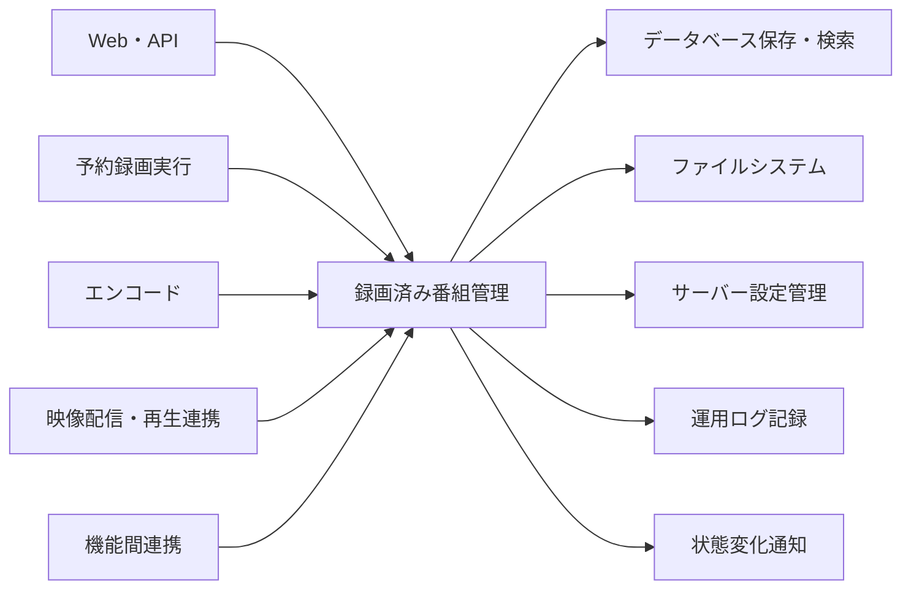
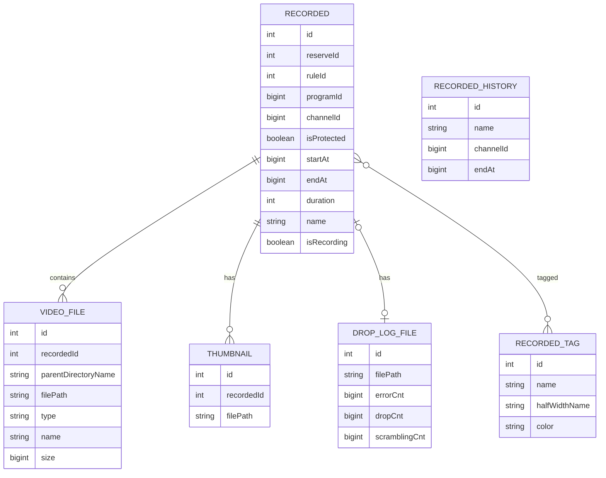
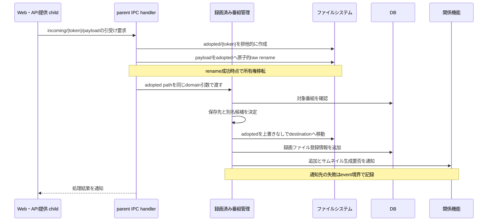
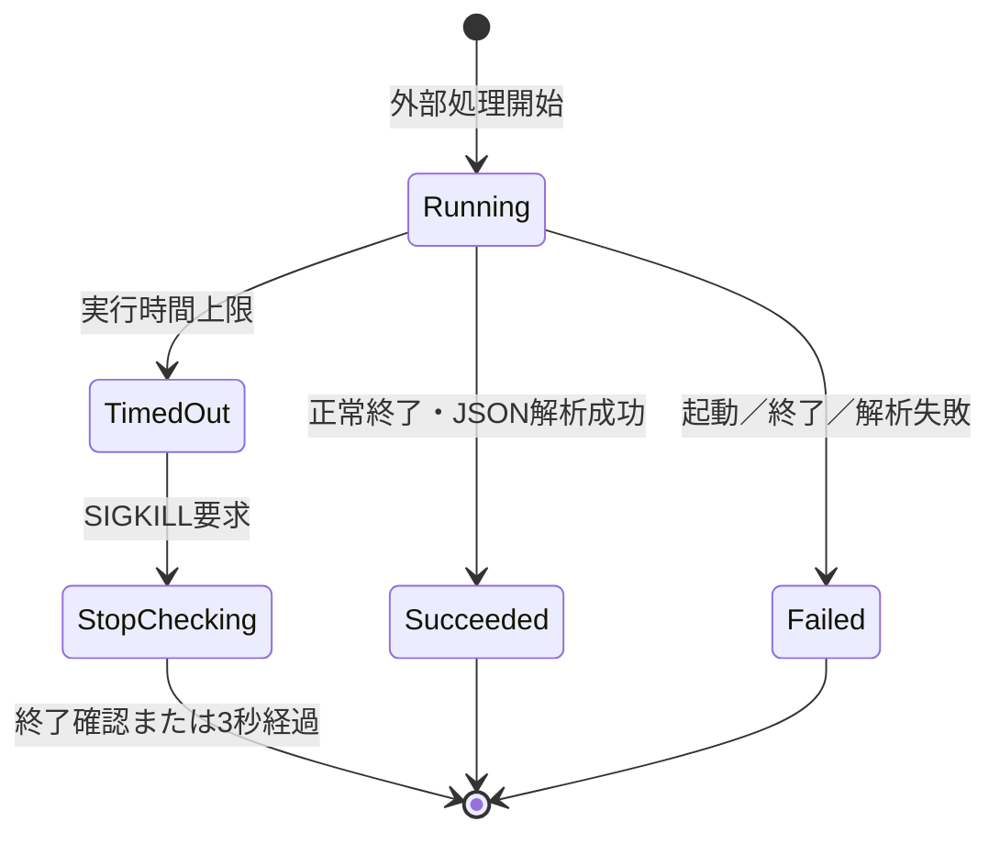
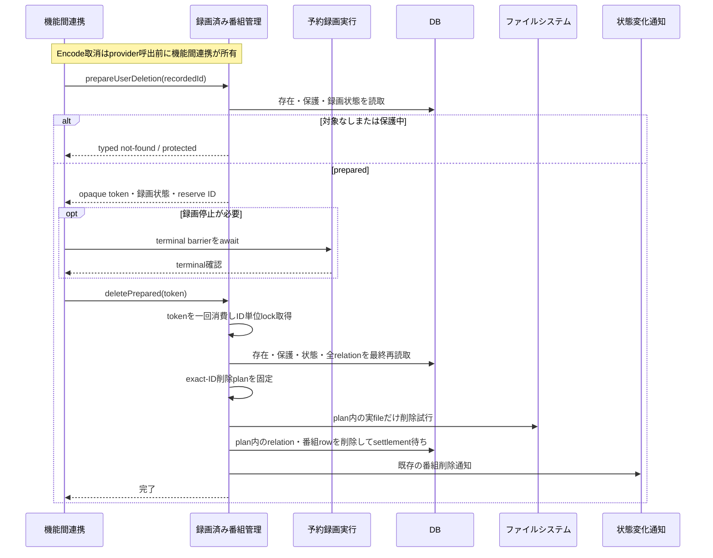
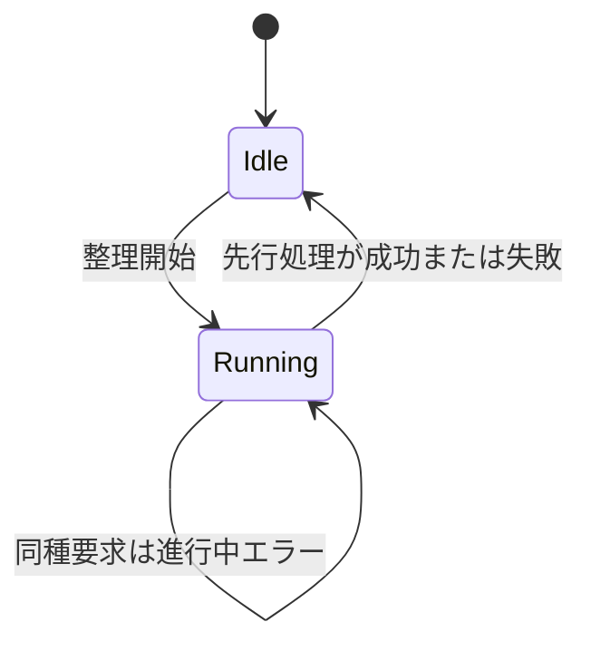

# 録画済み番組管理機能 設計

## 1. 目的

録画済み番組と、その番組に属する録画ファイル、ドロップログ、サムネイル登録情報、タグ、保護状態、録画履歴を一貫して保存・
参照・変更・整理する。

## 2. 境界と依存関係

### 2.1 本機能が担当すること

-   録画済み番組と関連情報の永続管理
-   一覧、検索、詳細、検索候補の提供
-   録画結果、既存ファイル、アップロード済み一時ファイルの登録
-   タグ、保護状態、自動予約ルールとの関連、録画履歴
-   録画済み番組および個別録画ファイルの削除
-   動画ファイルの再生時間、サイズ、ビットレートの確認
-   映像配信・再生連携機能へ渡す録画ファイル再生sourceの解決と読取resourceの作成
-   登録情報と実ファイルを照合する明示的な整理

### 2.2 本機能が担当しないこと

-   予約の決定と録画処理
-   エンコード、映像配信の開始・停止、stream ID、HLS成果物、および配信応答の管理
-   サムネイル画像の生成
-   HTTPでアップロードを受信している間の並列数、容量、時間制限
-   空き容量監視と自動削除候補の選択
-   録画中の削除に先立つエンコード取消・録画停止の全体順序

### 2.3 依存関係



| 依存先                 | 利用内容                                                                               |
| ---------------------- | -------------------------------------------------------------------------------------- |
| サーバー設定管理       | 録画保存先、一時保存先、ドロップログ・サムネイル保存先、履歴保持日数、動画情報確認設定 |
| データベース保存・検索 | 録画済み番組、録画ファイル、ドロップログ、サムネイル登録情報、タグ、履歴の永続化       |
| 運用ログ記録           | ファイル・DB操作、整理、外部処理の失敗記録                                             |
| 機能間連携             | 録画終了後の更新、削除前の取消・停止、後続処理の順序                                   |
| 状態変化通知           | 画面更新、サムネイル生成要否、外部連携へ変更を伝える                                   |

容量不足削除のconsumer authorityは、録画保存先の容量管理機能（`server-storage-management` Requirements
R4.2、R4.6、R4.9、R6.4および同Designの `IRecordedStorageDeletionPort`）である。本機能はそのruntime adapterから利用される
provider core（`prepareStorageDeletion`・`deletePreparedForStorage`）だけを所有する。容量監視、候補選択、反復、空き容量再取得、録画・encode・配信のexclusive gate、およ
びgate間のcompositionを本機能へ移さない。容量不足削除では進行中の録画、encode、配信を停止または取り消さず、各利用gateを
取得できない対象を削除しない。

利用者による番組全体削除と個別録画ファイル削除では、本機能が副作用のない準備、opaque token、同一録画済み番組ID単位のlock
内最終再読取、および確定した資源だけの削除を所有する。エンコード取消、録画停止の要否、最大60秒のterminal barrier、および
provider間の呼出順は機能間連携機能（`server-workflow-coordination`）が所有する。

## 3. 機能構成

| 構成要素               | 責務                                                                     |
| ---------------------- | ------------------------------------------------------------------------ |
| 録画済み番組照会       | 一覧、総件数、詳細、検索候補、エンコード状態の投影                       |
| 録画結果登録           | 録画開始・終了に伴う番組、ファイル、ドロップログ、サイズ、保存先の更新   |
| 手動登録・ファイル追加 | 番組の手動作成と既存ファイルの関連付け                                   |
| アップロード引受け     | 一時ファイルの所有権を引き受け、保存先へ移して録画ファイルとして登録する |
| タグ・保護・履歴       | 分類、削除保護、ルール関連解除、重複判定用履歴                           |
| 動画情報確認           | 外部処理で再生時間、サイズ、ビットレートを取得する                       |
| 再生用source provider  | 録画ファイルの情報・実path・読取resourceを解決して配信機能へ渡す         |
| 削除                   | 番組全体または個別ファイルと関連情報を削除する                           |
| 録画ファイル整理       | DB登録と録画保存先を照合して不一致を整理する                             |
| ドロップログ整理       | DB登録とドロップログ保存先を照合して不一致を整理する                     |

## 4. 主要データとインターフェース

### 4.1 データ構成



`RECORDED` は上図に加えて、番組説明、拡張情報、ジャンル、映像・音声情報と検索用の半角文字列を保持する。サムネイル画像を
生成する責務は別機能にあり、本機能はサムネイル登録情報のDB保存と関連の参照・削除だけを扱う。

### 4.2 録画ファイル追加

```ts
interface AddVideoFileOption {
    recordedId: number;
    parentDirectoryName: string;
    filePath: string;
    type: VideoFileType;
    name: string;
}
```

保存先名と相対パスから実パスを解決してサイズを取得し、録画ファイル登録情報を追加する。対象番組の存在と関連整合性はDB制約
および録画済み番組管理の処理結果で確定する。

### 4.3 アップロード済み一時ファイルの引受け

```ts
interface UploadedVideoFileOption {
    recordedId: number;
    parentDirectoryName: string;
    subDirectory?: string;
    viewName: string;
    fileType: VideoFileType;
    fileName: string;
    filePath: string;
}
```

公開HTTP、IPC、および本interfaceのfield・結果は変更しない。IPCで受け取る`filePath`は、Web・API提供機能が
`uploadTempDir/incoming/{uploadToken}/payload`に作成し、まだ同機能が所有するfileを指す。`uploadToken`は一要求ごとに内部
生成する一つのpath segmentであり、公開入力、IPC field、domain field、またはDBへ追加しない。parent側IPC handlerは、番組、
保存先、またはfile内容を読む前に、同じtokenを使う `uploadTempDir/adopted/{uploadToken}/payload`へ原子的にrenameす
る。parentは`adopted/{uploadToken}`を排他的に作成してからpayloadを移し、token directoryが既に存在する場合はraw renameを
始めない。このadoptionは、rename失敗時にdestinationをunlinkする既存`FileUtil.rename`を使わず、失敗時にsource・既存
destinationを変更しないraw filesystem rename相当の専用adapterで行う。renameの成功そのものを録画済み番組管理への所有権移
転とし、後から返すIPC応答は移転を成立させるackではなく処理結果の通知とする。

handlerはrename後の`adopted` pathを設定した同じshapeの`UploadedVideoFileOption`をprocess-localに作り、既存の録画済み番組
管理操作へ渡す。公開・IPC・domain引数へ所有者field、token、job IDを追加せず、DB schemaにも所有権や途中状態を保存しない。

`ServiceServer`が`uploadTempDir/incoming/{uploadToken}/payload`にfileを作り、`IPCServer`は受信した`filePath`を
`RecordedUploadAdoptionModel.adopt()`で`adopted/{uploadToken}/payload`へ移し、その所有権移転の後だけ、adopted pathへ差し
替えた同じshapeのoptionで`RecordedManageModel.addUploadedVideoFile()`を呼ぶ。同methodは番組と保存先を読み、録画保存先へ
移す。

### 4.3.1 録画ファイル再生用source provider

映像配信・再生連携機能が録画済み番組を再生するときは、本機能が録画ファイルの登録情報、対応する録画済み番組、
実path、および再生に必要な動画情報を解決する。最初の照会はrecorded IDだけを返し、映像配信・再生連携機能がresource lease
を取得した後に、同じvideo file IDから全情報を再読取して再生用sourceを開く。この二段階を同じproviderが所有するため、配信
機能はDB、path、動画情報を直接照会しない。

```ts
type RecordedPlaybackSource =
    | {
          readonly kind: 'encoded-direct';
          readonly recordedId: number;
          readonly videoFileId: number;
          readonly playPosition: number;
          readonly inputPath: string;
          readonly videoInfo: VideoInfo;
      }
    | {
          readonly kind: 'recording-tail-reader' | 'completed-file-reader';
          readonly recordedId: number;
          readonly videoFileId: number;
          readonly playPosition: number;
          readonly inputPath: string;
          readonly videoInfo: VideoInfo;
          readonly reader: RecordedPlaybackReader;
      };

interface RecordedPlaybackReader {
    readonly readable: NodeJS.ReadableStream;
    close(): Promise<void>;
}

type RecordedPlaybackSourceAdoption =
    | { readonly status: 'adopted'; readonly source: RecordedPlaybackSource }
    | { readonly status: 'stale' };

interface OpenedRecordedPlaybackSource {
    readonly state: 'pending' | 'adopted' | 'disposed';
    adopt(): RecordedPlaybackSourceAdoption;
    disposeBeforeAdoption(): Promise<void>;
}

interface IRecordedPlaybackSourceProvider {
    resolveRecordedId(videoFileId: number): Promise<number>;
    open(
        videoFileId: number,
        expectedRecordedId: number,
        playPosition: number,
        option?: { readonly allowMissingVideoInfo?: boolean },
    ): Promise<OpenedRecordedPlaybackSource>;
}
```

`encoded-direct`はreaderを持たず、解決済みpathをprocess入力へ渡す。二つのreader variantだけがclose可能なreaderを持つ。

`resolveRecordedId()`が返したrecorded IDをconsumerがlease取得にだけ用い、`open(videoFileId, expectedRecordedId)`は同じ
video file/recorded対応を再読取して一致を検証する。対応が消失または別recorded IDへ変わった場合はsourceを返さず失敗するた
め、一つのleaseを別のrecorded IDのsourceへ付け替えない。

録画ファイルのreader variantは、読取開始位置を`Math.floor((bitRate / 8) * playPosition)`で概算する。動画情報の`bitRate`が
有限でない（ffprobeが`format.bit_rate`を返さず、5.7で`NaN`になる）場合は次のとおりに扱う。`playPosition`が0のときは開始位
置を0とし、録画中の追尾readerも完了済みfileのreaderも、`bitRate`が取得できる場合と同じ種別・同じ手順で先頭から開く。
`playPosition`が0を超えるときは開始位置を概算できないため、readerを開く前に`RecordedPlaybackStartPositionUnavailable`で失
敗し、sourceもreaderも返さない。`encoded-direct`はreaderを持たず開始位置も計算しないので、`bitRate`に関わらず変わらない。

既存の再生要求が持つ`playPosition`は`open(videoFileId, expectedRecordedId, playPosition)`へ渡し、providerはその値を返却
sourceへ変更せず保持する。映像配信・再生連携機能は採用後にsourceの`playPosition`だけを既存の再生位置選択へ用い、
DB、path、動画情報から再構成しない。

`open()`の成功後は`pending`であり、`adopt()`と`disposeBeforeAdoption()`の先着した一回だけが状態を `adopted`また
は`disposed`へ遷移させる。`adopt()`は`adopted`になった場合だけsourceを返し、`disposed`後または二回目の
`adopt()`は`stale`を返してsourceを返さない。`disposeBeforeAdoption()`は`pending`ならreaderを高々一回閉じ、`disposed`では
冪等、`adopted`ではno-opとする。映像配信・再生連携機能が`adopt()`に成功した後は、そのsource、reader、process、timer、
listenerを一意に所有し、providerはreaderを再びcloseしない。直接入力では採用後もreader cleanupを要求しない。

`open()`の`option.allowMissingVideoInfo`が`true`のとき（動画情報を使わない直接配信だけが指定する）、providerは動画情報の取
得（ffprobe）が失敗してもそれだけでは失敗せず、`videoInfo`の`duration`・`size`・`bitRate`をすべて`NaN`にしたsourceを返す。
このとき`playPosition`が0を超える録画ファイルのreader variantは、`bitRate`が有限でない場合と同じく
`RecordedPlaybackStartPositionUnavailable`で失敗し、取得失敗の原因（外部処理の起動行や実pathを含む文言）を呼び出し元へ
伝えない。`option`を省略または`false`にしたとき（視聴用変換）は、動画情報を必要とするため従来どおり取得の失敗をそのまま
失敗として返す。

providerは、録画ファイルまたは録画済み番組が見つからない、実pathを解決できない、動画情報を取得できない（上記の
`allowMissingVideoInfo`を指定した場合を除く）、readerを開けない場合に失敗を返す。映像配信・再生連携機能はこの失敗を既存の配信開始失敗として扱い、DB・path・動画情報を直接再照会する
fallbackを持たない。providerは配信開始・停止、stream ID、HLS成果物、HTTP応答、視聴用process、source採用後のresource
lifecycleを所有しない。この型と採用操作はservice child内の内部contractであり、公開API、IPC、設定、DB schema、公開
response、HLS公開pathを追加または変更しない。

### 4.4 動画情報確認期限

一件の外部処理には内部定数`RECORDED_VIDEO_PROBE_TIMEOUT_MS = 30_000`を使用する。起算点は外部処理のspawnを呼び出す直前、
完了点は対象processの終了と出力JSONの解析完了である。応答確定直前にもmonotonic clockで期限を再確認する。この値を設定ファ
イル、公開設定、API、IPCへ追加しない。

### 4.5 整理の実行状態

録画ファイル整理とドロップログ整理は、それぞれ次のメモリー内状態だけを持つ。

```ts
type CleanupState = 'idle' | 'running';
```

二種類の状態は共有しない。整理対象や途中経過は永続化せず、サーバー再起動後に整理を再開しない。

### 4.6 利用者削除providerの内部contract

次の型は公開APIまたはIPCではなく、機能間連携機能が利用者削除を調整するための内部contractである。opaque tokenは
provider以外が内容を参照、変更、複製、または永続化できないprocess-local objectである。

```ts
declare const preparedRecordedDeletionTokenBrand: unique symbol;
declare const preparedVideoFileDeletionTokenBrand: unique symbol;

type PreparedRecordedDeletionToken = {
    readonly [preparedRecordedDeletionTokenBrand]: never;
};

type PreparedVideoFileDeletionToken = {
    readonly [preparedVideoFileDeletionTokenBrand]: never;
};

type UserDeletionPreparation =
    | { readonly status: 'not-found' }
    | { readonly status: 'protected' }
    | {
          readonly status: 'prepared';
          readonly token: PreparedRecordedDeletionToken;
          readonly isRecording: boolean;
          readonly reserveId: ReserveId | null;
      };

interface WholeRecordedDeletionRequired {
    readonly status: 'whole-recorded-deletion-required';
    readonly recordedId: RecordedId;
}

type VideoFileDeletionPreparation =
    | { readonly status: 'not-found' }
    | { readonly status: 'protected' }
    | { readonly status: 'prepared'; readonly token: PreparedVideoFileDeletionToken }
    | WholeRecordedDeletionRequired;

type VideoFileDeletionResult =
    | { readonly status: 'video-file-deleted' }
    | { readonly status: 'not-found' }
    | { readonly status: 'protected' }
    | WholeRecordedDeletionRequired;

interface IPreparedRecordedDeletionProvider {
    prepareUserDeletion(recordedId: RecordedId): Promise<UserDeletionPreparation>;
    deletePrepared(token: PreparedRecordedDeletionToken): Promise<void>;
}

interface IPreparedVideoFileDeletionProvider {
    prepareVideoFileDeletion(videoFileId: VideoFileId): Promise<VideoFileDeletionPreparation>;
    deletePreparedVideoFile(token: PreparedVideoFileDeletionToken): Promise<VideoFileDeletionResult>;
}
```

`prepareUserDeletion(recordedId)`は対象の存在と保護状態を確認し、対象なし、保護中、または準備済みをtyped resultで返す。
準備済みresultは録画中状態とreserve IDを機能間連携機能の事前判断へ渡すが、削除対象のrelation ID、path、DB entity、または
lock handleを公開しない。prepareはfile削除、DB mutation、event発行、エンコード取消、録画停止、lock取得を一件も行わない。

エンコード取消を含む利用者削除の開始順は機能間連携機能が所有し、本providerは取消の実施有無を判断または検証しない。機能間
連携機能はその順序で`prepareUserDeletion`へ到達した後、準備済みresultの録画状態とreserve IDに基づく必要な録画terminal
barrierを成功させた場合だけ`deletePrepared(token)`を呼ぶ。`deletePrepared`はtokenを一回消費してからrecorded ID単位
resource mutation lockを取得し、lock内で対象の存在、保護状態、録画状態、reserve ID、および全relationを再読取する。準備後
に対象が消失または保護された場合、または録画状態・reserve IDの変化により準備時のterminal判断を安全に再利用できない場合
は、削除効果を開始せずtyped domain errorとして返す。最終読取で適格と確定した場合だけ、その時点のexact relation/resource
IDを改変不能な内部削除planへ固定する。

`prepareVideoFileDeletion(videoFileId)`は録画ファイルと所属番組を一緒に読み、対象なし、保護中、個別削除準備済み、または
`WholeRecordedDeletionRequired(recordedId)`を返す。所属番組が録画中、または対象が最後の録画ファイルである場合は、file、
row、eventへ一件も作用せずwhole decisionを返す。録画中でなく二件以上の録画ファイルがある場合だけopaqueな個別tokenを返
す。

`deletePreparedVideoFile(token)`もtokenを一回消費し、所属recorded IDのresource mutation lock内で対象file、所属番組、保護
状態、録画状態、および全video relationを再読取する。最終読取時に録画中または最後の一件となっていれば、個別fileの実
体・row・eventへ作用せず`WholeRecordedDeletionRequired(recordedId)`を返す。直接削除が適格なら最終読取で確定した
videoFileIdだけを削除し、別fileまたは番組全体へ対象を拡張しない。機能間連携機能はwhole decisionを受けた場合、個別tokenや
以前の親snapshotを再利用せず、`prepareUserDeletion(recordedId)`から新しい番組全体削除を開始する。

番組全体と個別fileのどちらも、whole decisionを返す前に個別削除を行わない。直接個別削除を開始した後に番組全体削除へ昇格す
る部分的な経路を持たない。個別実fileまたはDB操作を開始した後の失敗は、既存の削除失敗contractに従って記録・伝播し、新しい
rollbackまたはretryを追加しない。

#### token lifecycle

三種類のprepared providerは、active tokenをtoken objectをkeyとする`WeakMap`相当、消費済みtokenを`WeakSet`相当でprovider
instanceごとに分離して管理する。final operationの入口で同期的にactive entryを除き、消費済みへ移してから最初の `await`ま
たはlock取得へ進むため、同じtokenを同時または後から使用しても一回だけが効果実行へ進める。

-   消費済みtokenの再利用は`token-replayed`、別provider instance、再起動前、別種類、またはactive entryを確認できない
    tokenは`token-stale`として、lock、file、DB、eventへ作用する前に拒否する。
-   final operationが`not-found`、`protected`、state change、file/DB/event failureのいずれで終わってもtokenを再びactive
    に戻さない。再試行には新しいprepareを要する。
-   呼出元がfinal operationへ渡さず参照を破棄したtokenは弱参照registryから回収可能である。tokenの恒久一覧、期限timer、永
    続checkpoint、定期GC、再起動復元を追加しない。
-   resource mutation lockはsuccess、typed result、同期throw、rejectionの全経路で一回解放し、token registryをlock代わり
    に使わない。

### 4.7 容量不足削除providerの内部contract

次の型は公開APIまたはIPCではなく、`server-application-runtime`が容量管理所有の `IRecordedStorageDeletionPort` adapterを
compositionするために利用する内部contractである。

```ts
type StorageDeletionNotDeletedReason =
    | 'recorded-not-found'
    | 'protected'
    | 'recording-active'
    | 'no-video-relations'
    | 'storage-mismatch';

declare const storageDeletionPreparationTokenBrand: unique symbol;
type StorageDeletionPreparationToken = {
    readonly [storageDeletionPreparationTokenBrand]: never;
};

type StorageDeletionPreparation =
    | {
          readonly status: 'not-deleted';
          readonly reason: StorageDeletionNotDeletedReason;
      }
    | {
          readonly status: 'prepared';
          readonly token: StorageDeletionPreparationToken;
      };

interface IRecordedStorageDeletionProvider {
    prepareStorageDeletion(recordedId: RecordedId, storageName: string): Promise<StorageDeletionPreparation>;

    deletePreparedForStorage(token: StorageDeletionPreparationToken): Promise<'deleted' | 'not-deleted'>;
}
```

`prepareStorageDeletion(recordedId, storageName)`は削除、録画停止、取消、lock取得を行う前に、Recordedの存在・保護状態、
録画状態、全video relation、および各relationの保存先所属を一回の準備snapshotとして読む。対象なし、保護中、録画中、video
relationなし、または一件でも指定`storageName`へ属さない場合は理由付き`not-deleted`を返す。適格ならrecorded IDと保存先名
をprovider内部だけで結び付けたopaque tokenを返す。準備時のrelation IDは最終削除集合に再利用しない。準備処理はfile、
DB、eventへ削除効果を生じさせず、録画、encode、配信を停止または取り消さない。

Runtime adapterは副作用のないprepare成功後、予約録画実行機能のrecording-use gate、service childのencode・配信use gateを
順に取得し、両方を取得した場合だけ`deletePreparedForStorage(token)`を呼ぶ。busyまたはunknownなら削除を開始せず
`not-deleted`へ投影する。容量不足削除では利用者削除用の最大60秒terminal barrier、`recorded-content-deletion`取消、または
エンコード取消を呼ばない。

`deletePreparedForStorage(token)`はtokenを4.6のlifecycle規則で一回消費し、tokenのrecorded ID単位resource mutation lockを
取得する。そのlock内で存在、保護状態、録画状態、全video relation、および全relationの`storageName`所属を再読取してから適
格性を確定する。対象なし、保護中、録画中、relationなし、または一件でも別保存先へ移った場合は`not-deleted`を返し、この経
路では実file削除、DB mutation、event発行を0件とする。tokenのreplay、stale、または種類不一致はtyped token errorとして拒否
する。

providerはlockを成功、`not-deleted`、rejectionの全経路で一回解放する。resource mutation lock自体は録画済みコンテンツの同
一ID更新を直列化する内部資源であり、Runtimeはlock handleを直接操作しない。Runtimeは二つの利用gate、typed result投影、お
よびprepareからfinal deleteまでのcompositionを所有する。repositoryとtransactionはデータベース保存・検索機能
（`server-persistence`）が所有する。

#### 旧`delete()`/`deleteVideoFile()`とprepared経路の境界

利用者削除と容量不足削除は、4.6/4.7のprepared provider、opaque token、one-shot registry、recorded ID resource mutation
lock、停止後の最終再読取、exact-ID DB削除、および容量削除用use gateを使う。既存の公開request・replyと削除後通知は維持す
る。

`RecordedManageModel.delete()`は対象を一回読み、録画停止判断、relation snapshot、実file削除、recorded ID単位のDB削除、
および通知を一つのoperationで行う。`deleteVideoFile()`は個別fileと親を読み、録画中なら同じwhole deleteへ進み、直接file・
rowを削除した後に親のvideo relationが0件ならwhole deleteへ進む。

`RecordedManageModel.delete()`と`deleteVideoFile()`は死んだcodeではない。利用者削除・video file単体削除のIPC経路
（`RecordedFunctions.delete`、`RecordedFunctions.deleteVideoFile`）はどちらも4.6/4.7のprepared token経路
（`ParentUserDeletionCoordinator.deleteFromRequest()`、`ParentVideoFileDeletionCoordinator.deleteVideoFileFromRequest()`）
だけを呼び、legacyな`delete()`/`deleteVideoFile()`を直接は呼ばない。一方、`videoFileCleanup()`
（`POST /api/recorded/cleanup` → `RecordedApiModel.fileCleanup()` → IPC `videoFileCleanup`）が内部で行う孤立video file
（DB行はあるが実fileが存在しない、またはその逆）の整理は`executeVideoFileCleanup()`内で`this.deleteVideoFile(video.id)`
を直接呼び、`deleteVideoFile()`は録画中または整理後にvideo relationが0件になった場合に`this.delete(recordedId, false)`
を呼ぶ。この経路はprepared token化されておらず、4.6/4.7のprepared設計は`videoFileCleanup()`からの呼出しを対象にしていな
い。したがって`delete()`/`deleteVideoFile()`をsourceから削除する、またはtoken経路へ完全に置き換えるには、この
`videoFileCleanup()`呼出しも同じ変更単位で扱う必要がある。

ただし、token化されていない`delete()`/`deleteVideoFile()`も、録画ファイル、サムネイル、ドロップログの実ファイル削除は
prepared経路と同じ管理削除（対応する管理保存先root内であり、途中のsymbolic linkを経由しないことを確認してからunlinkす
る。Linux以外の確認と操作の方法は7.4）だけを通す。直接のunlinkは行わない。管理保存先root外または途中link経由のpathは、削除せずログへ記録して残りの対象の
処理を続ける（8.10）。

## 5. 処理の設計

### 5.1 一覧、検索、詳細

1. 検索条件をDB検索条件へ渡す。
2. 一覧と総件数、または指定IDの詳細を取得する。
3. 録画ファイル、サムネイル登録情報、ドロップログ、タグなど、操作に必要な関連を読み込む。
4. エンコード待機・実行中索引を参照し、該当する番組の表示情報へエンコード状態を加える。
5. 公開DTOへ変換して返す。

キーワード、放送局、ジャンル、ルール、録画ファイル有無などの検索条件と、放送局・ジャンル候補は既存のDB検索契約を維持す
る。指定IDがなければ `null` 相当の対象なしを返し、別の番組を代替しない。

### 5.2 録画結果の登録

録画開始後、予約録画実行機能が次の順序で登録・更新を依頼する。

1. 番組情報から録画中の録画済み番組を登録する。
2. 録画ファイル登録情報を番組へ関連付ける。
3. ドロップ確認が有効ならドロップログ登録情報を関連付ける。
4. 録画終了時に録画中状態を解除する。
5. 一時録画先を使った場合は通常保存先へ移動し、保存先名と相対パスを更新する。
6. 最終ファイルサイズを更新する。

この処理の時刻制御、録画プロセス、実ファイル移動の詳細は予約録画実行機能が担当し、本機能は受け取った登録・更新要求を永続
化する。

### 5.3 手動作成と既存ファイル追加

手動作成は開始時刻、終了時刻、番組名、放送局と任意の番組情報を受け付ける。`endAt <= startAt` なら登録前に拒否する。作成
時は録画中でなく、保護されていない状態とし、期間から録画時間を算出する。

既存ファイル追加は、保存先名を実ディレクトリへ解決し、相対パスのファイルサイズを取得した後、表示名・種類・サイズを対象番
組へ登録する。実ファイルをこの操作で移動しない。

### 5.4 アップロード済み一時ファイルの引受け



1. parent側IPC handlerは、受け取った`filePath`が正規化後に `uploadTempDir/incoming/{uploadToken}/payload`というexact
   grammarであることを確認する。`incoming`直下のtoken directory、単一token segment、固定basename `payload`の一対一対応を
   要求し、`..`、追加階層、絶対path、`adopted` path、symbolic link、または別tokenへのaliasを拒否する。この段階では対象番
   組、保存先、file内容を読み取らず、domain処理を開始しない。
2. 同じtokenに対応する`uploadTempDir/adopted/{uploadToken}` directoryを他要求と共有せず排他的に作成し、同じfilesystem内
   で`incoming/{uploadToken}/payload`を`adopted/{uploadToken}/payload`へ原子的にrenameする。copy fallbackは使わない。
   destination token directoryが既に存在する場合はraw renameを0回とし、既存payload、directory、または別要求のentryを変更
   しない。rename失敗時にdestinationをunlinkする既存`FileUtil.rename`はadoptionに使わない。rename成功を所有権移転の
   commit pointとし、それ以降は録画済み番組管理だけが`adopted` payloadとtoken directoryを整理する。rename失敗時はdomain
   呼出しを0回とし、parentは自ら作った空の`adopted/{uploadToken}`だけを整理して、`incoming`または他tokenの`adopted`を変
   更しない。
3. Web・API提供childによるexact `incoming/{uploadToken}/payload`のunlinkとparentのrenameが競合した場合は、filesystemで先
   に成功した一方だけが成立する。renameが先ならchildのpayload unlinkは対象なしとなり、unlinkが先ならrenameは対象なしで失
   敗してdomain処理を0回とする。childは自分が所有する空の`incoming/{uploadToken}`だけを整理する。childと再起動後の新しい
   childは`adopted` pathを受け取らず、列挙、unlink、または再利用しない。
4. parentは`adopted` pathを設定した同じshapeのprocess-local optionで既存domain処理を開始し、対象番組と保存先名を確認す
   る。確認できなければ、parentが所有する`adopted`だけを一回整理して失敗を返す。
5. サブディレクトリ指定があれば番組情報で書式を展開する。展開後の相対pathを`/`で分け、`\`を含むもの、および空・`.`・`..`
   の要素を含むもの（先頭や末尾の`/`、`//`、`a/../b`を含む）を、正規化せずに`UploadPathError`で拒否する。この規則は
   予約・ruleの保存先内ディレクトリの判定（`server-recording-execution`の設計6.7.2）とは異なる。保存先外へ到達し得る入力は
   ファイル移動とDB登録の前に拒否してから、必要なディレクトリを作る。rootから配置先の親までの既存componentを`lstat`相当で
   確認し、途中にsymbolic linkがあれば、link先がroot内外のどちらでもその配置pathを拒否する。
6. 元のファイル名を最初の候補とし、存在すれば拡張子の前へ `(1)`、`(2)` の順に番号を付ける。
7. 候補を上書きしない方法で確保し、`adopted`から最終`destination`へ移動する。別要求が先に同名候補を確保した場合は、次の
   番号で再試行する。同一filesystemのrenameができない場合は、上書きしないcopyと`adopted`削除による既存fallbackを使える。
   fallback中は`adopted`を正本として保ち、copy完了と`adopted`削除の両方が成功したcommit pointで所有pathを
   `destination`へ切り替える。それ以前に失敗した場合はpartial destinationと`adopted`をそれぞれ一回だけ整理する。
8. `destination`のサイズ、表示名、種類、保存先名、相対パス、対象番組をDBへ登録する。
9. file配置とDB登録の成功を引受けのdomain commit pointとする。登録成功後、file追加とサムネイル生成要否を通知し、呼出元へ
   成功を返す。通知先の画面更新またはサムネイル受付が失敗した場合はevent境界で記録し、配置済みファイルとDB登録を削除せ
   ず、引受け成功を巻き戻さない。

失敗時の整理対象は次のとおりである。

| 失敗位置                            | 現在の所有者         | 整理するfile                                                                  |
| ----------------------------------- | -------------------- | ----------------------------------------------------------------------------- |
| adoption rename前の検証・rename失敗 | Web・API提供child    | parentは`incoming`を整理せず、自ら作った空の`adopted/{uploadToken}`だけを整理 |
| adoption後の対象・保存先確認失敗    | 録画済み番組管理     | 当該要求の`adopted`だけを一回整理                                             |
| directory準備・destination移動失敗  | 録画済み番組管理     | `adopted`と、当該要求が作成途中のpartial destinationをそれぞれ一回だけ整理    |
| destination確定後のDB登録失敗       | 録画済み番組管理     | 当該要求の`destination`だけを一回整理                                         |
| DB登録後の通知先失敗                | 録画済み番組管理・DB | 整理しない                                                                    |
| 成功後                              | 録画済み番組管理・DB | 整理しない                                                                    |

各path段階でcleanup ownerを一つにし、failure時にそのownerが所有するfileがあれば削除を一回だけ試みる。同じfileへ二回目の
削除を試みない。削除はbest-effortであり、削除失敗を元の引受け失敗から成功へ変えない。候補選択前から存在したfile、他要求
のfile、および別所有者のpathは削除しない。追加の永続job、checkpoint、retry、またはDB管理データは作らない。

IPC応答の消失、呼出元の10分期限超過、HTTP切断、またはservice child再起動がadoption後に発生しても、parentは進行中のdomain
処理と段階別cleanupを継続する。応答が届かないことを所有権の巻戻しまたは`adopted`の再移譲としない。parent processの再起動
では進行中操作を復元しない。起動直後はactive operationが存在しないため、upload handlerを受付可能にする前に専用
`adopted`領域直下のstale token directoryとその`payload`だけを一回整理できる。`incoming`領域と録画保存先の
`destination`はこの起動時整理の対象にしない。

設定された録画保存先root自体がsymbolic linkである場合は、起動時に解決したroot directoryを管理保存先の正本として扱う。
root配下の相対pathはこのrootを基準に検証するが、配置候補までの途中componentまたは最終entryにあるsymbolic linkを配置先と
して追従しない。

手順7の`destination`確保・移動（`link`または`copyFile`によるcopy fallback）が対象外エラー（`EEXIST`以外）で失敗した場
合、`log.system.error`へ`move file error`を記録し、続けて元の`Error`（fallback発生時は`cause`）を記録してから
`FileMoveError`を呼出元へ投げる。この記録は候補ごとの再試行や`EEXIST`によるcandidate skipでは発生せず、最終的に
`FileMoveError`として引受け全体が失敗する経路にだけ発生する。

配置処理は`placeUploadedFile`/`createUploadCandidate`（copy-then-unlink方式、`EXDEV` fallback付き）が担う。運用者が録画
保存先へのアップロード配置失敗をHTTP応答を経由せずgrepで追えるようにするため、`addUploadedVideoFile`の最終catchで
`FileMoveError`を検出した場合に`move file error`を、`cause`から復元した元エラーとともに記録する。

### 5.5 タグ、保護、ルール関連

-   タグは名前、検索用の半角名、色を保持し、一覧・検索・追加・変更・削除を提供する。
-   録画済み番組とタグは多対多で関連付け・関連解除する。
-   保護状態の変更をDBへ反映し、変更通知を行う。
-   利用者による番組全体または個別録画ファイルの削除では、保護中の対象を拒否する。
-   自動予約ルール削除時は、録画済み番組に残る対象ルールIDを解除する。

### 5.6 録画履歴

番組指定の自動予約が番組リレーではなく正常終了し、予約削除が必要な場合に、比較用に整形した番組名（番組の短縮名と同じ規則で、[前]・[後]を末尾に残す）、放送局ID、録画終了時刻
を履歴へ追加する。ルールの重複判定は指定期間の履歴を参照する。起動時の後処理で、現在時刻から
`recordedHistoryRetentionPeriodDays` を引いた時刻より古い履歴を削除する。

### 5.7 動画情報の確認

登録済み録画ファイルの実パスを解決し、次の引数で外部処理を起動する。

```text
ffprobe -v 0 -show_format -of json <録画ファイルの実パス>
```

JSONの `format.duration`、`format.size`、`format.bit_rate` をそれぞれ再生時間、ファイルサイズ、ビットレートとして数値へ
変換する。`format.bit_rate`が出力に含まれない録画ファイルのビットレートは`NaN`になり、動画情報の取得自体は失敗にしない。
`NaN`のビットレートを受け取った録画再生source providerの扱いは4.3.1に従う。

一件ごとの処理は次の状態で管理する。



-   対象登録または保存先を確認できなければ外部処理を起動しない。
-   解決済みpathの実ファイル欠落は、外部処理を起動した後の外部失敗として扱う。
-   spawn直前から30,000ms経過時に要求を期限超過として一度だけ失敗へ確定し、対象プロセスへ`SIGKILL`を送る。
-   その後3秒だけ終了を確認し、終了を確認できなければ対象プロセスを識別できる情報とともにログへ記録する。
-   期限超過後のcallbackと出力は、同じ要求の成功結果にも、別の要求の結果にも使用しない。
-   各要求の完了判定はその関数呼出し内に閉じ、動画情報確認以外の録画・予約・API操作を停止しない。

### 5.8 録画済み番組と個別ファイルの削除

#### 番組全体



1. `prepareUserDeletion`で対象の存在と保護状態を確認する。対象なしと保護中はtyped resultで返し、削除、取消、停止、lock取
   得を開始しない。
2. 準備済みならopaque token、録画中状態、reserve IDだけを返す。エンコード取消はprovider外で機能間連携が所有し、録画状態
   とreserve IDは録画terminal barrierの要否だけに使う。最大60秒の待機と全体の呼出順も機能間連携が所有する。
3. `deletePrepared`はtokenを一回消費し、録画済み番組ID単位のresource mutation lock内で対象と全relationを再読取する。対象
   消失、保護、または準備時の録画停止判断を安全に再利用できない状態変化では、file、DB、eventへ作用せず失敗を返す。
4. 最終読取で得た録画ファイル、サムネイル、ドロップログ、録画済み番組rowのexact IDだけを内部削除planへ固定す
   る。準備時snapshot、recorded ID単位のbulk削除、または保存先名だけを条件とする削除で対象を広げない。タグ関連は録画済み
   番組rowの削除に伴いDB側で解除され、固定対象のID列には含めない。
5. plan内の録画ファイル、サムネイル、ドロップログの相対path（先頭の区切り文字は7.4のとおり取り除いてから解釈する）を正規化し、それぞれ対応する設定済み管理保存先root内であり、
   rootから対象の親までにsymbolic linkがない対象だけ実ファイル削除を試みる。root外または途中link経由となるpathは記録して
   削除しない。最終entry自体がsymbolic linkならlink先でなくlink自体だけを削除できる。録画ファイルのrootは登録された親
   directory名から`VideoUtil.getParentDirPath`で解決する（名前`tmp`は一時録画先`recordedTmp`を指し、録画後の移動に失敗し
   て一時録画先に残ったfileも削除対象になる）。rootを解決できない親directory名の対象は削除しない。
6. plan内の録画ファイル、サムネイル登録情報、ドロップログ、録画済み番組のDB mutationを開始し、開始した全
   mutationが成功または失敗へsettleするまで成功を返さない。個別の実ファイル削除失敗は記録し、既存contractで続行できるDB
   削除を試みる。canonical recorded rowの削除失敗は要求失敗とする。
7. 必要なDB settlement後に、削除した録画済み番組の既存変更通知を高々一回発行する。通知失敗を削除成功へ読み替えず、同じ
   tokenで通知または削除を再試行しない。
8. success、typed error、同期throw、rejectionの全経路でresource mutation lockを一回解放する。

録画停止の順序を録画済み番組管理内で定義しない。停止と削除の全体順序は `server-workflow-coordination`、録画terminalの成
立条件は`server-recording-execution`を正本とする。本機能のdeletion coreはエンコード管理、録画停止、またはterminal
barrierのportを持たない。

#### 個別録画ファイル

1. `prepareVideoFileDeletion(videoFileId)`で録画ファイル、所属番組、保護状態、録画状態、およびvideo relation件数を読む。
   対象なしまたは保護中はtyped resultで返し、削除効果を開始しない。
2. 所属番組が録画中、または対象が最後の録画ファイルなら、個別fileとrowへ作用せず
   `WholeRecordedDeletionRequired(recordedId)`を返す。機能間連携はこのIDを使ってfreshな`prepareUserDeletion`から番組全体
   削除を開始する。個別prepareのsnapshotまたはtokenを番組全体削除へ渡さない。
3. 録画中でなく二件以上のvideo relationがある場合だけopaqueな個別tokenを返す。
4. `deletePreparedVideoFile(token)`はtokenを一回消費し、所属recorded ID単位lock内で対象と全video relationを再読取する。
   対象fileまたは所属番組がなければtyped `not-found`、保護中ならtyped `protected`を削除効果なしで返す。最終読取時に録画
   中または最後の一件へ変化していれば、個別file、row、eventへ作用せずwhole decisionを返す。
5. 直接個別削除が適格なら、最終読取で確定したvideoFileIdの相対path（先頭の区切り文字は7.4のとおり取り除いてから解釈す
   る）が録画保存先root内であり、途中のsymbolic linkを経由し
   ないことを確認し、その実ファイルと録画ファイル登録情報だけを削除する。rootは親directory名から`VideoUtil.getParentDirPath`
   で解決する（一時録画先を含む）。root外または途中link経由なら実ファイルを削除せず失敗とする。最終entryがlinkならlink自
   体だけをunlinkする。
6. DB mutationのsettlement後に個別ファイル削除を通知する。直接個別削除は開始前に二件以上を再確認しているため、削除後に残
   るvideo relationは一件以上であり、個別削除の部分的効果後に番組全体削除へ昇格しない。

#### 容量不足による番組全体削除のcore

容量不足削除は、activeまたは状態不明な録画、encode、配信を停止して削除する経路ではない。
`prepareStorageDeletion(recordedId, storageName)`は録画中を含む不適格対象を副作用なしの`not-deleted`とする。Runtimeが
recording-use gateとservice child use gateを取得した場合だけ、opaque tokenを`deletePreparedForStorage`へ渡す。

`deletePreparedForStorage`はtokenを一回消費してrecorded ID単位lockを取得し、存在、保護、録画状態、全video relation、およ
び保存先所属を再読取する。録画中、対象なし、保護中、relationなし、または保存先不一致なら実file、DB、eventへ作用せず
`not-deleted`を返す。適格な場合だけ、そのreadから得たrecorded row、全video relation、thumbnail relation、drop log
relation、および削除対象resourceのexact IDを改変不能な削除planへ固定する。タグ関連は録画済み番組rowの削除に伴いDB側で解除され
る。準備snapshotのID集合、保存先名だ
けのbulk削除、またはrecorded IDだけを条件にした`deleteRecordedId(recordedId)`で対象集合を後から拡張しない。各実fileの
pathは固定したexact relation/resource IDから効果実行時に読み、5.8「番組全体」と7.4のroot内・symbolic link非追従規則を再
利用して、そのexact resourceだけを削除対象とする。

file削除試行、録画ファイル、サムネイル、ドロップログ、およびcanonical recorded rowのDB settlement順と失敗時の
継続条件は、既存の録画済み番組削除contractを再利用する。開始した全DB mutationの成功または失敗がsettleする前に
`deleted`を返さず、canonical recorded rowの削除失敗はrejectionとする。個別実file失敗を記録して続行する既存contract、root
外pathを削除しない規則、および既存の削除完了event発行条件を変更しない。完了eventは必要なDB settlement後に既存効果を高々
一回発行し、失敗を成功へ変えない。

部分失敗時に容量不足削除専用のretry、別候補へのfallback、補償transaction、file復元、または新しいrollbackを発明しない。
providerは既存contractに従う一回の削除試行をsettleさせ、Runtimeへ`deleted`、`not-deleted`、またはrejectionだけを返す。容
量管理はその結果以外のplan、relation、file、DB、eventを観測しない。Runtimeはprovider結果の後、または途中失敗時に、取得済
みservice-child gateとrecording gateを逆順で一回解放する。

### 5.9 登録情報と実ファイルの整理

#### 種類ごとのsingle-flight

録画ファイル整理とドロップログ整理は、種類ごとに一件だけ実行する。



開始時に対象種類の状態を原子的に `idle` から `running` へ変更する。すでに `running` なら、新しい同種要求は先行処理へ合流
せず、先行結果を共有せず、進行中エラーで確定する。状態は先行処理本体のPromiseが成功または失敗へ確定した `finally` だけで
`idle` へ戻す。

録画ファイル整理とドロップログ整理は別状態なので同時に開始できる。両方を一回の公開操作から要求する場合も、二つのIPC要求
を同時に開始し、それぞれの処理と結果を独立させる。

IPC呼出元は開始から10分で期限超過を返せる。この期限は呼出元の待機だけを終え、親プロセスで進行中の整理本体を止めず、
`running` も解除しない。先行本体が後から成功または失敗へ確定した場合だけ同種を再受付する。異種整理、録画、予
約、Web・API、通常の録画済み番組操作にはこの状態を適用しない。

#### 録画ファイル整理

1. 全録画ファイル登録情報を取得する。
2. 各登録情報の相対pathを正規化し、対応する録画保存先root内の実パスだけを解決して、存在するファイルとディレクトリの索引
   を作る。root外となる登録pathから実ファイルを削除しない。
3. 実ファイルがなければ録画ファイル登録情報の削除を試みる。
4. 設定された全録画保存先を本節の安全な列挙規則で再帰的に列挙する。
5. 登録索引にない実ファイルの削除を試みる。
6. 管理対象を含まず空であるディレクトリを深い順に削除する。

#### ドロップログ整理

1. 全ドロップログ登録情報を取得する。
2. 実ファイルがなければ録画済み番組との関連解除とドロップログ登録情報の削除を試みる。
3. ドロップログ保存先を本節の安全な列挙規則で列挙する。
4. 登録索引にない実ファイルの削除を試みる。

安全な列挙ではentryごとに`lstat`相当で種類を確認する。symbolic linkはfile、directory、brokenの別を問わずlink自体を一件の
entryとして扱い、link先へ再帰しない。未登録なら保存先root内のlink pathへ`unlink`を行い、link先のrealpathを削除対象にしな
い。名前が`.`で始まるfileとdirectoryは整理対象から除外し、`.`で始まるdirectoryへ再帰しない。各entryの正規化pathが保存先
root内であることを確認し、root外へ再帰または削除しない。

対象集合の構築後は、一件の削除・更新失敗をログへ記録し、処理可能な他の対象を続ける。DB全件取得または管理保存先root自体の
列挙失敗は、その種類の整理全体を失敗として確定する。個別subdirectoryの列挙失敗はpathとerrorを記録してそのdirectoryを飛ば
し、すでに列挙できた他対象の整理を続ける。

## 6. 失敗、timeout、後始末、再起動

| 状況                                       | 動作                                                      |
| ------------------------------------------ | --------------------------------------------------------- |
| 手動作成の時刻範囲不正                     | DB登録前に拒否する                                        |
| 既存ファイル追加の保存先・実ファイル不明   | 登録せず失敗する                                          |
| upload adoption前の検証・rename失敗        | domain処理を開始せず、parentはincomingを削除しない        |
| adoption後の対象番組・保存先不明           | 失敗を返し、parent所有のadoptedだけを一回整理する         |
| アップロード先が録画保存先root外           | destination移動・登録前に拒否し、adoptedを一回整理する    |
| adoptedからdestinationへの移動失敗         | 失敗を返し、現在所有するpathとpartialだけを一回整理する   |
| destination確定後のDB失敗                  | 失敗を返し、当該destinationを一回整理する                 |
| adoption後の応答消失・service child再起動  | parent処理を続行し、childはadoptedを操作しない            |
| upload処理中のparent process再起動         | 操作は復元せず、受付前にstale adoptedだけを整理する       |
| 動画情報確認の登録なし・保存先不明         | 外部処理を起動せず失敗する                                |
| 動画情報確認の解決済みpathの実ファイル欠落 | 外部処理起動後の外部失敗として動画情報取得を失敗とする    |
| 動画情報確認の起動・終了・解析失敗         | 動画情報取得を失敗とする                                  |
| 動画情報確認の期限超過                     | 失敗を確定し、SIGKILLと追加3秒の終了確認を行う            |
| 番組・個別ファイルが存在しない             | 削除を失敗とする                                          |
| 保護中                                     | 利用者削除を拒否する                                      |
| prepared tokenの再利用                     | `token-replayed`として削除効果前に拒否する                |
| stale・別種類のprepared token              | `token-stale`として削除効果前に拒否する                   |
| 番組全体削除の準備後に状態が変化           | lock内で再確認し、安全に続行できなければ効果0件で失敗する |
| 個別削除の準備後に録画中・最後の一件化     | 個別効果0件で番組全体削除が必要と返す                     |
| 容量削除の対象が録画・encode・配信で利用中 | 停止せず`not-deleted`とする                               |
| 実ファイル削除失敗                         | ログへ記録し、続行可能な処理を試みる                      |
| 削除対象pathが管理保存先root外             | 実ファイルを削除せず記録または失敗とする                  |
| 管理保存先rootの列挙失敗                   | 対象種類の整理を失敗とする                                |
| 個別subdirectoryの列挙失敗                 | 記録して当該directoryを飛ばし、列挙済みの他対象を続ける   |
| 同種整理が進行中                           | 新規同種要求だけを進行中エラーとする                      |
| 整理IPCの10分期限超過                      | 呼出元だけ期限超過とし、整理本体と `running` を維持する   |
| サーバー再起動                             | 整理状態、upload途中経過、prepared tokenを復元しない      |

アップロードのファイル整理、番組削除、明示的整理は目的が異なる。アップロード失敗時に録画保存先全体を走査せず、明示的整理
をアップロード失敗の自動補償として起動しない。

## 7. API・IPC・DB・ファイルシステム契約

### 7.1 API

既存の次の公開操作、成功データ、エラー応答経路を維持する。

-   録画済み番組の一覧、総件数、詳細、検索候補、手動作成
-   保護・保護解除、番組削除
-   タグの一覧、検索、追加、変更、削除、関連付け、関連解除
-   録画ファイルのアップロード後引受け、動画情報、個別削除
-   ドロップログのID指定参照（保存済みpathの解決。サイズ上限超過は既存のエラー応答経路）
-   録画ファイルとドロップログの整理

整理の進行中と10分期限超過は既存のサーバーエラー応答経路で返し、成功レスポンスの形を変更しない。prepared providerのtyped
resultとtoken errorは内部で既存の対象なし・保護・削除失敗応答へ写像し、公開request、成功data、status、error envelopeを追
加または変更しない。

### 7.2 IPC

-   録画済み番組の削除、作成、保護変更、録画ファイル追加・削除・サイズ更新、アップロード引受け、二種類の整理という既存操
    作名と引数を維持する。
-   通常のIPC応答期限はプロセス間通信機能に従う。
-   アップロード引受けは既存の10分応答期限を維持する。
-   アップロードの`incoming`から`adopted`へのrename成功が所有権移転であり、IPC応答は移転条件ではなく処理結果の通知であ
    る。応答消失またはcaller期限超過後もparentは`adopted`の処理を続け、childまたは再起動後の新しいchildへ操作権を戻さな
    い。
-   録画ファイル整理とドロップログ整理の呼出元応答期限を、それぞれ10分とする。
-   整理の10分期限超過は処理本体への取消を意味しない。
-   prepared token、最終削除plan、resource mutation lockをIPC payloadへ含めない。既存の録画済み番組IDまたはvideoFileIdを
    受けるparent側処理の内側だけで生成・消費する。

### 7.3 DB

| DB情報             | 主な操作                                             |
| ------------------ | ---------------------------------------------------- |
| 録画済み番組       | 登録、検索、録画終了、保護変更、ルール関連解除、削除 |
| 録画ファイル       | 登録、サイズ・保存先更新、検索、削除                 |
| ドロップログ       | 登録、件数更新、検索、関連解除、削除                 |
| サムネイル登録情報 | 番組との関連、検索、削除                             |
| タグと番組関連     | タグCRUD、関連付け、関連解除                         |
| 録画履歴           | 追加、期間検索、保持期限による削除                   |

アップロードの`adopted`から`destination`への配置成功と録画ファイル登録成功は別の操作なので、DB登録失敗時は
`destination`を一回整理して失敗を返す。incoming・adopted・destinationの所有権、途中状態、再試行、またはjobを保存する新し
いDB table・columnは追加しない。

### 7.4 ファイルシステム

-   録画ファイルの実パスは、設定された保存先名とDBの相対パスを結合する。
-   ドロップログとサムネイルの実パスは、それぞれの設定保存先と相対パスを結合する。
-   相対pathは正規化後も対応する管理保存先root内であることを確認し、root外となるpathを作成、移動、再帰列挙、または削除に
    使わない。
-   登録された相対pathの先頭の区切り文字（`/`、Windowsでは`\`も）は、実ファイルを作る際の`path.join(root, 登録path)`が
    root内に収めるのと同じく、削除と整理でも取り除いてからroot相対として解釈する（例: 録画時のサブディレクトリを`/anime`
    と指定すると登録pathは`/anime/x.ts`となり、実ファイルはroot内の`anime/x.ts`にある）。先頭の区切りを取り除いた後に`..`
    でrootの外へ出るpath、取り除いた後も絶対pathとなるpath（Windowsで実行する場合の`C:\x`のようなdrive指定など）、途中のsymbolic linkを経由するpathは、
    root外として扱い削除しない。Windowsで実行する場合、同じdriveのdrive相対（`C:x`）は絶対pathではないため、削除ではroot内の
    `x`として解釈し、この場合だけ`path.join`と同じ解釈にならない。録画と変換は保存先内ディレクトリの検査でこの形を使わず、
    ファイル名の`:`は置き換えるため、登録pathにこの形は入らない。
    先頭の区切りを取り除く処理は、録画先選択が保存先内ディレクトリを検査する関数と同じfile（`src/util/SubDirectoryUtil.ts`）の
    共通関数を使い、`server-recording-execution`の設計6.7.2と食い違わない。
-   管理保存先root自体がsymbolic linkならその解決先をrootとする。root配下で見つけたsymbolic linkはlink自体を扱い、link先
    を列挙または削除しない。
-   rootから対象の親までの既存componentは`lstat`相当で確認し、途中のsymbolic linkを経由する作成、移動、登録、または削除
    を行わない。
-   録画ファイルの削除とアップロードの配置は、保存先の親directoryを確認した結果に基づき、platformにより次の方法で行う。
    Linuxでは、親directoryを`O_NOFOLLOW`でfile descriptorとして開いたまま保持し、`/proc/self/fd/<fd>/<名前>`を経由し
    て削除・作成する。保持したdirectoryの識別（dev・ino）と実pathを操作の前後に突き合わせるため、確認から操作までの間にpath
    の途中がsymbolic linkへ差し替えられても保存先外へ作用しない。Linux以外（macOSとWindows。`/dev/fd/<fd>/<名前>`は
    macOSでENOENTとなり、Windowsにはdescriptorを経由するpathが無い）では、削除・作成の直前に、(1)保存先rootと対象の親
    directoryを`realpath`で解決して親がroot内にあること、(2)rootから親までの各段（root自身を含む）を`lstat`で確認して
    すべてsymbolic linkでない通常のdirectoryであることを確かめ、その後に親directoryのpathと名前を指定して`unlink`・
    `link`・`copyFile`する。root外へ出るpath・`..`・途中のsymbolic linkを拒否する点はLinuxと同じである。ただし確認と操
    作が別の呼び出しであるため、この間に別のprocessが途中のdirectoryをsymbolic linkへ差し替える競合はLinux以外では防げな
    い。保存先を書き換える別のprocessが無い運用を前提とし、この限界を許容する。
    アップロードの後始末（配置した候補の削除。配置後の確認の失敗・登録の失敗・copyの失敗のいずれでも）も実pathを指定して
    消すため、Linux以外では消す前に同じ確認（保存先の中・各段がsymbolic linkでない）をやり直す。確認に失敗したら消さず
    にlogへ残す。確認が差し替えを見つけた後に後始末がsymbolic linkを辿って保存先外の同名fileを消すことはない（保存先の実
    directory側に配置したfileが残ることは許容する）。
-   名前が`.`で始まるentryは明示的整理の列挙・削除対象に含めない。
-   `uploadTempDir`内では、service childだけが扱う`incoming/{uploadToken}/payload`と、parentだけが扱う
    `adopted/{uploadToken}/payload`を一対一に対応させる。token directoryは各namespace直下、`payload`は固定basenameとし、
    childと再起動後の新しいchildは`adopted`領域を列挙または変更しない。
-   `incoming`から`adopted`への所有権移転は、parentがdestination token directoryを排他的に作成した後、同じfilesystem内の
    原子的raw renameだけで行い、copy fallbackを使わない。destination衝突ではrenameを始めず、renameとchild unlinkの競合で
    は先に成功した一方だけがfileを取得または削除する。
-   parent起動時はupload handler受付前に専用`adopted`領域だけをstale stagingとして整理できる。`incoming`と録画保存先の
    `destination`を起動時staging整理へ含めず、永続jobを復元しない。
-   アップロード先の同名ファイルを上書きしない。
-   adoption後のアップロード失敗時は、当該要求についてparentが現在所有する`adopted`または`destination`と、当該要求が作成
    途中のpartial destinationだけを削除対象とし、各pathを高々一回整理する。adoption前はparentが`incoming`を削除しない。
-   番組削除はDBに関連付けられた録画ファイル、ドロップログ、サムネイルの実ファイルを対象とする。
-   明示的整理は設定された録画保存先またはドロップログ保存先を対象とする。

## 8. 実装対応

| 設計要素                                      | 配置                                                                                                                                                                                        | 責任                                                                                   |
| --------------------------------------------- | ------------------------------------------------------------------------------------------------------------------------------------------------------------------------------------------- | -------------------------------------------------------------------------------------- |
| 動画情報の有限実行                            | `src/model/api/video/VideoUtil.ts`                                                                                                                                                          | 内部30秒定数、process handle、timer、SIGKILL、追加3秒確認                              |
| 録画ファイル再生source provider    | `src/model/operator/recorded/IRecordedPlaybackSourceProvider.ts`、`src/model/operator/recorded/RecordedPlaybackSourceProvider.ts`                                                           | recorded ID予備照会、全情報の再読取、direct/reader variant選択、採用前readerの一回整理 |
| upload adoption adapter            | `src/model/ipc/IPCServer.ts`、`src/model/operator/recorded/RecordedUploadAdoptionModel.ts`                                                                                                  | exclusive path、raw rename、所有権移転、失敗時dest非削除、stale整理                    |
| アップロードの上書き防止                      | `src/model/operator/recorded/RecordedManageModel.ts`、`src/util/FileUtil.ts`                                                                                                                | 候補ごとの上書きなし移動・コピーと衝突時の次候補                                       |
| アップロードの局所的後始末                    | `src/model/operator/recorded/RecordedUploadAdoptionModel.ts`、`src/model/operator/recorded/RecordedManageModel.ts`                                                                          | owner段階ごとにadopted・destination・partialをそれぞれ高々一回整理                     |
| 管理保存先path境界                            | `src/model/operator/recorded/RecordedManageModel.ts`、`src/model/api/video/VideoUtil.ts`                                                                                                    | 相対path正規化、root内判定、root外拒否                                                 |
| symbolic link安全列挙                         | `src/util/FileUtil.ts`                                                                                                                                                                      | `lstat`相当、link非追従、dot entry除外、subdirectory失敗継続                           |
| 種類別single-flight                           | `src/model/operator/recorded/RecordedManageModel.ts`                                                                                                                                        | 録画ファイル用とドロップログ用の独立状態、`finally`でだけ解除                          |
| 二種類の同時開始                              | `src/model/api/recorded/RecordedApiModel.ts`                                                                                                                                                | 二つの整理IPCを同時に開始する                                                          |
| 整理のcaller期限                              | `src/model/ipc/IPCClient.ts`                                                                                                                                                                | 二種類の整理を10分にし、親側処理は継続する                                             |
| 録画停止順序の境界                            | `src/model/api/recorded/RecordedApiModel.ts`、`src/model/operator/recorded/RecordedManageModel.ts`                                                                                          | 全体順序を機能間連携へ委ね、削除本体の責務を分離する                                   |
| 利用者の番組全体削除provider       | `src/model/operator/recorded/IPreparedRecordedDeletionProvider.ts`、`src/model/operator/recorded/RecordedManageModel.ts`                                                                    | typed prepare、opaque token、lock内最終read、exact-ID削除                              |
| 利用者の個別file削除provider       | `src/model/operator/recorded/IPreparedVideoFileDeletionProvider.ts`、`src/model/operator/recorded/RecordedManageModel.ts`                                                                   | direct planと副作用なしwhole decision、lock内再判定                                    |
| prepared token registry            | `src/model/operator/recorded/PreparedDeletionTokenRegistry.ts`                                                                                                                              | 種類別WeakMap/WeakSet、one-shot、replay/stale拒否、回収可能性                          |
| 容量不足削除provider               | `src/model/operator/recorded/IRecordedStorageDeletionProvider.ts`、`src/model/operator/recorded/RecordedManageModel.ts`                                                                     | active録画拒否、opaque token、lock内最終read、exact-ID削除                             |
| recorded ID resource mutation lock | `src/model/operator/recorded/RecordedResourceMutationLock.ts`                                                                                                                               | 同一recorded IDの最終判定とmutationを直列化し、全終了経路で解放                        |
| exact-IDの削除操作                            | `src/model/db/VideoFileDB.ts`、`src/model/db/ThumbnailDB.ts`、`src/model/db/DropLogFileDB.ts`、`src/model/db/RecordedDB.ts`（既存の`deleteOnce`）、`src/model/operator/recorded/RecordedManageModel.ts`の`deleteExactRecordedResources` | 最終再読取で得た関連IDを個別に削除する。録画ファイル・サムネイル登録情報のsettlement後に番組rowを削除し、番組rowの削除が成功した場合だけ、その番組rowが参照するドロップログ登録情報を削除する。タグ関連は番組row削除に伴いDB側で解除される |

### 8.1 機能固有test配置

共有test rootと命名規則はサーバー起動・稼働管理機能のRequirement 9を利用する。本機能のtestは`test/server/recorded-content/`に置く。
仕様testを`*.spec.test.ts`、内部algorithm・分岐testを`*.test.ts`、外部境界testを`*.integration.test.ts`とする。

| file                                                                | 所有する責務                                                                      |
| ------------------------------------------------------------------- | --------------------------------------------------------------------------------- |
| `record-domain.spec.test.ts`、`query.spec.test.ts`                  | 番組・関連情報・録画結果の保存、通知、一覧、検索、詳細                            |
| `upload.spec.test.ts`、`metadata.spec.test.ts`                      | 手動作成、upload ownership・配置・登録、tag、保護、rule関連、録画履歴             |
| `probe.spec.test.ts`、`delete.spec.test.ts`、`cleanup.spec.test.ts` | 動画情報、削除、録画file・drop log整理                                            |
| `record-domain.test.ts`、`upload.test.ts`、`metadata.test.ts`       | 値域、adoption race・失敗時dest不変、cleanup、commit、tag・保護・履歴分岐         |
| `playback-source.spec.test.ts`、`playback-source.test.ts`           | 再生対象解決、TS/encoded・録画中/完了済みsource選択、adopt/dispose競合と一回close |
| `probe.test.ts`、`delete.test.ts`、`cleanup.test.ts`                | JSON解析、timer競合、path判定、typed prepare・token・最終再読取、削除・列挙分岐   |
| `recorded-content-db.integration.test.ts`                           | temporary DBでのentity・relation・transaction結果                                 |
| `recorded-content-http.integration.test.ts`                         | Web・API提供機能の公開HTTP操作と本機能portの接続                                  |
| `recorded-content-ipc.integration.test.ts`                          | 録画済み操作IPCのserialization、upload応答消失、応答、期限                        |
| `recorded-content-filesystem.integration.test.ts`                   | incoming adoption、move・copy・削除・列挙・symbolic link・stale整理               |
| `doubles-parity.integration.test.ts`                                | 再生元の取得を、本物の better-sqlite3 の RecordedDB・VideoFileDB、本物の VideoUtil（保存先の設定と本物の ffprobe）、実 file で流し、最小の行の偽物と同じ結果（完了済み・録画の始まり〈ffprobe が bit_rate を返さない〉・encode 済み・再生位置）になること、録画中の file の成長を追って読み、成長が止まると終わること |
| `recorded-content-process.integration.test.ts`                      | isolated child processの出力、異常終了、強制停止、listener回収                    |
| `recorded-playback-source.integration.test.ts`                      | providerの二段階解決、対応変更reject、source handoff、adopt/dispose競合           |
| `delete.integration.test.ts`                                        | 利用者削除・個別file削除・容量不足削除のSQLite結合（最終再読取、exact-ID削除）    |
| `recorded-content-baseline.integration.test.ts`                     | 既存の公開契約の結合                                                              |
| `drop-log-serving.spec.test.ts`                                     | ドロップログ参照（Requirement 2.3）                                               |
| `*.imp.test.ts`（`playback-reader`、`upload-adoption`、`upload-default-filesystem`、`upload-fault-injection`、`update-video-file-size`、`deletion-parent-pinning`、`path-based-file-operations`、`legacy-delete-cascade`、`historycleanup-catch`、`videofilecleanup-dir-catch`、`deleterelation-catch`、`setrelation-catch`、`create-tag-insert-catch`） | 個別の分岐・失敗注入・補助 |

HTTP route、IPC carrier、共有runnerを本機能側へ再実装しない。本機能はsynthetic payload、DB schema、temporary filesystem
scenario、child process scenarioと期待するdomain結果を所有し、各carrierのownerが提供するharnessへ接続する。Requirement
10のcase一覧、matrix、品質判定を自己検証するtest fileは作らず、9.5の機能固有の確認項目と`server-application-runtime`
Requirement 9 Acceptance Criterion 9の判定で追跡する。

## 9. テスト観点

### 9.1 test層と外部境界

-   `unittest/spec`はRequirements 1から9の74 ACを、利用者または関係機能から観測できる入力、結果、永続副作用、通知、失敗
    として一件ずつ検証する。
-   `unittest/imp`はpath正規化、同名候補、DB/file commit point、JSON変換、削除分岐、single-flight、error継続を検証する。
    仕様testの代替にはしない。
-   `integration`はtemporary DB、公開HTTP carrier、録画済み操作IPC、temporary filesystem、isolated child processを接続す
    る。HTTPとIPCのcarrier実装、共有runner、coverage基盤はそれぞれのownerから利用する。
-   uploadはincomingの所有権移転、各owner段階のfile配置、DB登録、および応答消失後のparent継続をassertする。削除はfile削
    除試行後のDB結果、整理は対象ごとの処理結果をassertし、mock callの有無だけでDB/file commit pointの成立としない。

### 9.2 Matrix記法

入力列は`[null, 空, 0, 1, 最小, 最大, 範囲外, 不正型, 重複]`の順である。`T`はtest対象、`C`はHTTP・IPC carrierの型検証を
integrationで確認、`N`は当該ACが値入力を持たず状態またはtriggerを入力とするため非適用、`S`は状態列、 `R`は時間・race列で
検証する。仕様に上限がない項目の最大・範囲外は`N`とし、上限を追加しない。

状態は`D`=DB未登録・登録済み・更新済み、`Q`=0件・1件・複数件・対象なし、`U`=incoming(child-owned)・
adopted(parent-owned)・destination(parent-owned)・DB登録済み、`P`=未保護・保護、`V`=録画中・終了済み、`C`=整理
idle・running・success・failure・caller timeout・late settlement、`X`=外部process未開始・running・success・failure・
timed outを示す。時間・raceの`順`は副作用順序、`衝`は同名または同時要求、`期`は期限直前・到達・超過・late settlement、
`無`は時間契約がないため非適用である。

cancel・再入・restartは次の状態記法で全行を分類する。状態cellに記法がない行は`CAN-NA/RE-NA/RST-NA`を併記したものとして扱
い、未分類にはしない。

| 記法     | 分類と根拠                                                                                                                                          | 該当case                                  |
| -------- | --------------------------------------------------------------------------------------------------------------------------------------------------- | ----------------------------------------- |
| `CAN-NA` | cancel非適用。本要件は呼出元取消contractを持たない。動画情報期限時の強制停止はtimeout後のcleanupでありcancelではない                                | 全79行                                    |
| `RE-NA`  | 再入非適用。単発のtyped command/queryで、同一処理中の再要求contractを持たない                                                                       | `RE-AP`以外                               |
| `RE-AP`  | 同名upload競合、動画情報の別要求、再生sourceのadopt/dispose先着、異種整理同時要求、同種整理再入を独立結果として検証する                                  | RC-4.5、RC-7.6、RC-7.8、RC-9.9〜RC-9.11   |
| `RST-NA` | restart非適用。要求完了後の永続結果以外に再開対象のmemory内処理状態を持たない                                                                       | `RST-AP`以外                              |
| `RST-AP` | uploadはchild再起動後もparentのadopted処理を続け、parent再起動時は復元せず受付前にstale adoptedだけを整理する。整理は先行処理を復元せず新規受付可能 | RC-4.4、RC-4.9、RC-4.12、RC-9.10、RC-9.11 |

主testは`test/server/recorded-content/`の同名fileにある名前付きcaseで、`npm run test:server:spec -- test/server/recorded-content/<file>`で実行する（RC-7.7・RC-7.8も`unittest/spec`）。server全体のC0・C1は`server-application-runtime`が判定する。

### 9.3 機能固有Test Matrix

本節を本機能唯一のTest Matrixとする。各`主test`はfile内の一意なnamed caseであり、同じACを別の主testへ重複割当しな
い。`種別`の`S`は `unittest/spec`主test、`I`は`unittest/imp`補助、`G`はintegration補助である。

| 契約    | 主test                              | 種別     | null・空・0・1・最小・最大・範囲外・不正型・重複 | 状態                                           | 時間・race | 資源                                        | 外部境界                       | failure                                | 期待結果                                            |
| ----- | ---------------------------------- | ------ | --------------------------- | -------------------------------------------- | ------- | ----------------------------------------- | -------------------------- | -------------------------------------- | ----------------------------------------------- |
| RC-1.1  | `record-domain.spec.test.ts#RC-1.1` | S/G      | C,C,T,T,N,N,T,C,T                                | D                                              | 無         | DB transaction                              | DB                             | insert/update拒否                      | 全fieldと状態をround trip                           |
| RC-1.2  | `record-domain.spec.test.ts#RC-1.2` | S/G      | N,N,T,T,T,N,N,N,T                                | Q                                              | 無         | DB relation                                 | DB                             | relation失敗                           | 0・1・複数fileを同じ番組へ関連                      |
| RC-1.3  | `record-domain.spec.test.ts#RC-1.3` | S/G      | N,N,T,T,T,N,N,N,T                                | Q                                              | 無         | DB relation                                 | DB                             | 関連取得失敗                           | drop・thumbnail・tag・rule関連を保持                |
| RC-1.4  | `record-domain.spec.test.ts#RC-1.4` | S/I/G    | C,C,T,T,T,N,T,C,T                                | D                                              | 無         | DB row/file                                 | DB/filesystem                  | size取得・登録失敗                     | 保存先・相対名・種類・表示名・size一致              |
| RC-1.5  | `record-domain.spec.test.ts#RC-1.5` | S/I/G    | N,N,N,T,N,N,N,N,T                                | D                                              | 順         | listener                                    | IPC/event                      | 通知失敗                               | 確定後だけ変更通知                                  |
| RC-2.1  | `query.spec.test.ts#RC-2.1`         | S/I/G    | T,T,T,T,T,N,T,C,T                                | Q                                              | 無         | DB query                                    | DB/HTTP                        | query失敗                              | 各filterのID集合が一致                              |
| RC-2.2  | `query.spec.test.ts#RC-2.2`         | S/G      | N,N,T,T,T,N,N,N,T                                | Q                                              | 無         | DB query                                    | DB/HTTP                        | count失敗                              | page結果と全体件数を別々に返す                      |
| RC-2.3  | `query.spec.test.ts#RC-2.3`         | S/G      | C,C,T,T,T,N,T,C,T                                | Q                                              | 無         | DB relations                                | DB/HTTP                        | 対象・関連取得失敗                     | 指定番組と全関連shapeを返す                         |
| RC-2.4  | `query.spec.test.ts#RC-2.4`         | S/G      | N,N,T,T,T,N,N,N,T                                | Q                                              | 無         | DB query                                    | DB/HTTP                        | 候補query失敗                          | 放送局・ジャンル候補を返す                          |
| RC-2.5  | `query.spec.test.ts#RC-2.5`         | S/I/G    | N,N,T,T,T,N,N,N,T                                | Q                                              | 順         | encode索引                                  | DB/IPC                         | 索引取得失敗                           | 待機・実行中だけ参照情報へ投影                      |
| RC-2.6  | `query.spec.test.ts#RC-2.6`         | S/G      | C,C,T,T,N,N,T,C,T                                | Q                                              | 無         | DB query                                    | DB/HTTP                        | 対象なし                               | 別番組を返さず対象なし                              |
| RC-3.1  | `record-domain.spec.test.ts#RC-3.1` | S/G      | C,C,T,T,T,N,T,C,T                                | D/V                                            | 順         | DB transaction                              | DB/IPC                         | 番組登録失敗                           | 録画中番組を登録                                    |
| RC-3.2  | `record-domain.spec.test.ts#RC-3.2` | S/G      | C,C,T,T,T,N,T,C,T                                | D/V                                            | 順         | DB relation                                 | DB/IPC                         | 番組なし・関連失敗                     | fileを対象番組だけへ関連                            |
| RC-3.3  | `record-domain.spec.test.ts#RC-3.3` | S/G      | C,C,T,T,T,N,T,C,T                                | D/V                                            | 順         | DB relation/file                            | DB/filesystem/IPC              | drop無効・登録失敗                     | 有効時だけdrop logを関連                            |
| RC-3.4  | `record-domain.spec.test.ts#RC-3.4` | S/I/G    | C,C,T,T,T,N,T,C,T                                | D/V                                            | 順         | DB row/file                                 | DB/filesystem/IPC              | 移動・更新失敗                         | 保存先名と相対名を移動結果へ更新                    |
| RC-3.5  | `record-domain.spec.test.ts#RC-3.5` | S/I/G    | C,C,T,T,T,N,T,C,T                                | D/V                                            | 順         | DB row                                      | DB/IPC                         | 状態・size更新失敗                     | 録画終了状態と最終sizeを受付                        |
| RC-4.1  | `upload.spec.test.ts#RC-4.1`        | S/I/G    | C,C,T,T,T,N,T,C,T                                | D/V/P                                          | 無         | DB transaction                              | DB/HTTP/IPC                    | validation・insert失敗                 | 非録画中・未保護で作成                              |
| RC-4.2  | `upload.spec.test.ts#RC-4.2`        | S/I/G    | C,C,T,T,T,N,T,C,T                                | D                                              | 無         | DB transaction                              | DB/HTTP                        | `endAt<=startAt`                       | DB row・通知を作らず失敗                            |
| RC-4.3  | `upload.spec.test.ts#RC-4.3`        | S/I/G    | C,C,T,T,T,N,T,C,T                                | D                                              | 順         | file/DB row                                 | DB/filesystem/IPC              | 番組・保存先・fileなし                 | stat sizeで対象番組へ関連                           |
| RC-4.4  | `upload.spec.test.ts#RC-4.4`        | S/I/G    | C,T,T,T,T,N,T,C,T                                | U/RST-AP                                       | 順/衝      | incoming/adopted/destination                | filesystem/HTTP/IPC            | adoption・directory・move/copy失敗     | `incoming/{token}/payload`を`adopted/{token}/payload`へraw renameし所有権を移す          |
| RC-4.5  | `upload.spec.test.ts#RC-4.5`        | S/I/G    | N,T,T,T,T,N,N,C,T                                | U/RE-AP                                        | 衝         | destination/lock                            | filesystem                     | 候補確保競合                           | 上書き0、番号付き別名を排他的に確保                 |
| RC-4.6  | `upload.spec.test.ts#RC-4.6`        | S/I/G    | C,C,T,T,T,N,T,C,T                                | U                                              | 順         | adopted/destination/DB transaction          | DB/filesystem                  | stat・DB登録失敗                       | destinationの表示名・種類・size・番組を登録         |
| RC-4.7  | `upload.spec.test.ts#RC-4.7`        | S/I/G    | C,C,T,T,N,N,T,C,T                                | U                                              | 無         | adopted file                                | DB/filesystem/HTTP             | adoption後に番組・保存先なし           | 引受失敗、parent所有adoptedだけを一回整理           |
| RC-4.8  | `upload.spec.test.ts#RC-4.8`        | S/I/G    | N,N,N,T,N,N,N,N,T                                | U                                              | 順         | listener                                    | IPC/event                      | 通知先失敗                             | DB登録後にthumbnail要否を通知し結果を巻き戻さない   |
| RC-4.9  | `upload.spec.test.ts#RC-4.9`        | S/I/G    | N,N,N,T,N,N,N,N,T                                | U/RST-AP                                       | 順/衝      | incoming/adopted/partial destination        | filesystem/HTTP/IPC            | rename・move/copy・cleanup失敗         | 現owner pathだけ一回整理、別owner・他要求は不変     |
| RC-4.10 | `upload.spec.test.ts#RC-4.10`       | S/I/G    | N,N,N,T,N,N,N,N,T                                | U                                              | 順         | destination/DB transaction                  | DB/filesystem                  | DB insert・unlink失敗                  | DB rowなし、destinationだけ一回整理                 |
| RC-4.11 | `upload.spec.test.ts#RC-4.11`       | S/G      | N,N,N,T,N,N,N,N,T                                | U                                              | 順         | destination/DB transaction                  | DB/filesystem/HTTP             | 配置・登録失敗                         | 配置と登録の両方成功時だけ引受成功                  |
| RC-4.12 | `upload.spec.test.ts#RC-4.12`       | S/I/G    | N,N,N,T,N,N,N,N,T                                | U/RST-AP                                       | 順/期/衝   | incoming/adopted/destination/listener       | filesystem/HTTP/IPC            | 各段階・ack loss・restart・cleanup失敗 | owner移転を戻さず、各pathを高々一回整理             |
| RC-4.13 | `upload.spec.test.ts#RC-4.13`       | S/I/G    | T,T,T,T,T,N,T,C,T                                | U                                              | 衝         | directory/file                              | filesystem/HTTP                | incoming外・root外・途中/broken link   | adoption/domain/mkdir/move/DBを境界前に0回で拒否    |
| RC-5.1  | `metadata.spec.test.ts#RC-5.1`      | S/I/G    | T,T,T,T,T,N,T,C,T                                | Q/D                                            | 無         | DB transaction                              | DB/HTTP/IPC                    | CRUD・検索失敗                         | tag一覧・検索・名前色CRUD                           |
| RC-5.2  | `metadata.spec.test.ts#RC-5.2`      | S/I/G    | C,C,T,T,T,N,T,C,T                                | D                                              | 無         | DB relation                                 | DB/HTTP/IPC                    | 対象・relationなし                     | 対象relationだけ付与・解除                          |
| RC-5.3  | `metadata.spec.test.ts#RC-5.3`      | S/I/G    | C,C,T,T,N,N,T,C,T                                | P                                              | 順         | DB row/listener                             | DB/HTTP/IPC                    | 対象なし・update失敗                   | 指定保護値と通知payload一致                         |
| RC-5.4  | `metadata.spec.test.ts#RC-5.4`      | S/I/G    | C,C,T,T,N,N,T,C,T                                | P/V                                            | 無         | DB/file                                     | DB/filesystem/HTTP             | 保護中削除要求                         | DB・file・通知を変えず拒否                          |
| RC-5.5  | `metadata.spec.test.ts#RC-5.5`      | S/I/G    | C,C,T,T,N,N,T,C,T                                | P/V                                            | 無         | DB/file                                     | DB/filesystem/HTTP             | 保護中個別削除                         | DB・file・通知を変えず拒否                          |
| RC-5.6  | `metadata.spec.test.ts#RC-5.6`      | S/I/G    | C,C,T,T,T,N,T,C,T                                | D                                              | 無         | DB rows                                     | DB/IPC                         | ruleなし・update失敗                   | 対象rule IDだけ全番組から解除                       |
| RC-6.1  | `metadata.spec.test.ts#RC-6.1`      | S/I/G    | C,C,T,T,T,N,T,C,T                                | D/V                                            | 順         | DB transaction                              | DB/IPC                         | 条件不成立・insert失敗                 | 全条件成立時だけname/channel/endAt追加              |
| RC-6.2  | `metadata.spec.test.ts#RC-6.2`      | S/I/G    | C,C,T,T,T,N,T,C,T                                | Q                                              | 無         | DB query                                    | DB/IPC                         | query失敗                              | 指定期間内だけ返す                                  |
| RC-6.3  | `metadata.spec.test.ts#RC-6.3`      | S/I/G    | N,N,T,T,T,N,N,N,T                                | Q                                              | 無         | DB rows                                     | DB/IPC                         | 欠落field                              | 重複判定用name・channel・endAtを返す                |
| RC-6.4  | `metadata.spec.test.ts#RC-6.4`      | S/I/G    | C,C,T,T,T,N,T,C,T                                | D                                              | 期         | DB transaction/timer                        | DB                             | 境界時刻・delete失敗                   | 保持期間超過だけ削除                                |
| RC-7.1  | `probe.spec.test.ts#RC-7.1`         | S/I/G    | C,C,T,T,T,N,T,C,T                                | X                                              | 順         | child/stream/listener                       | DB/filesystem/process/HTTP     | 対象・spawn・終了・parse失敗           | duration・size・bitRate取得を試行                   |
| RC-7.2  | `probe.spec.test.ts#RC-7.2`         | S/I/G    | N,N,T,T,T,N,T,C,T                                | X                                              | 期         | timer/child                                 | process                        | 非正・非有限期限                       | 正の有限期限を一件ごとに適用                        |
| RC-7.3  | `probe.spec.test.ts#RC-7.3`         | S/I/G    | C,C,T,T,N,N,T,C,T                                | X                                              | 無         | child参照                                   | DB/filesystem/process          | 登録なし・保存先なし                   | 登録・保存先なしではspawn 0回で失敗                    |
| RC-7.4  | `probe.spec.test.ts#RC-7.4`         | S/I/G    | N,N,N,T,N,N,N,N,T                                | X                                              | 期         | child/stream/timer/listener                 | process                        | 実file欠落・spawn・exit・不正JSON・timeout | resolved pathの実file欠落はspawn後の外部失敗として成功値を返さない。spawn・exit・不正JSON・timeoutの各失敗はimp/integrationで検証                              |
| RC-7.5  | `probe.spec.test.ts#RC-7.5`         | S/I/G    | N,N,N,T,N,N,N,N,T                                | X                                              | 期         | child/timer/listener                        | process                        | kill失敗・3秒後未終了                  | 強制停止1回、終了確認、未確認log                    |
| RC-7.6  | `probe.spec.test.ts#RC-7.6`         | S/I/G    | N,N,N,T,N,N,N,N,T                                | X/RE-AP                                        | 期/衝      | child/stream/timer/listener                 | process                        | late output・重複terminal              | timeout不変、別要求不変、一回解放                   |
| RC-7.7  | `playback-source.spec.test.ts#[RC-7.7] propagates a reader-open failure without returning a source` | S/G | N,N,N,T,N,N,N,N,T                                | X                                              | 順         | reader/source ownership                     | filesystem                    | reader open失敗                        | open成功後だけsourceを返し、失敗時source/ownership 0 |
| RC-7.8  | `playback-source.spec.test.ts#[RC-7.8] lets the first adopt or dispose operation own the reader and closes an unadopted reader at most once` | S/G | N,N,N,T,N,N,N,N,T                                | X/RE-AP                                        | 衝         | reader/source ownership                     | filesystem                    | dispose先着・二重adopt/dispose          | dispose先着sourceなし・close高々一回、adopt後provider close 0 |
| RC-8.1  | `delete.spec.test.ts#RC-8.1`        | S/I/G    | C,C,T,T,N,N,T,C,T                                | Q                                              | 無         | DB query/token                              | DB/HTTP/IPC                    | 番組なし                               | typed not-found、file・DB・通知0件                  |
| RC-8.2  | `delete.spec.test.ts#RC-8.2`        | S/I/G    | C,C,T,T,N,N,T,C,T                                | P                                              | 無         | DB/token                                    | DB/HTTP/IPC                    | 保護中                                 | typed protected、全削除副作用0件                    |
| RC-8.3  | `delete.spec.test.ts#RC-8.3`        | S/G      | N,N,N,T,N,N,N,N,T                                | V                                              | 順         | opaque token/IPC相手参照                    | IPC                            | 前提処理未完了                         | prepareは副作用0、workflow成功後だけfinal port実行  |
| RC-8.4  | `delete.spec.test.ts#RC-8.4`        | S/I/G    | N,N,T,T,T,N,N,N,T                                | D/V                                            | 順         | file                                        | filesystem                     | 個別unlink失敗                         | video・thumbnail・drop実file削除を各試行            |
| RC-8.5  | `delete.spec.test.ts#RC-8.5`        | S/I/G    | N,N,T,T,T,N,N,N,T                                | D/V                                            | 順         | DB transaction                              | DB                             | relation・row削除失敗                  | video・thumbnail・drop・番組DB削除（タグ関連は番組row削除に伴い解除）             |
| RC-8.6  | `delete.spec.test.ts#RC-8.6`        | S/I/G    | C,C,T,T,T,N,T,C,T                                | V                                              | 順         | token/lock/file/DB transaction              | DB/filesystem/HTTP/IPC         | final read・file・DB削除失敗           | 非録画・複数file時だけ指定exact fileとrowを削除     |
| RC-8.7  | `delete.spec.test.ts#RC-8.7`        | S/I/G    | C,C,T,T,T,N,T,C,T                                | V                                              | 順         | token/lock/DB relations                     | DB/HTTP/IPC                    | whole prepare・削除失敗                | 録画中は個別効果0でfreshな番組全体削除              |
| RC-8.8  | `delete.spec.test.ts#RC-8.8`        | S/I/G    | N,N,T,T,T,N,N,N,T                                | V/Q                                            | 順/衝      | token/lock/DB relations/file                | DB/filesystem                  | count変化・番組削除失敗                | 最後の1件は個別効果0で番組全体削除、複数なら保持    |
| RC-8.9  | `delete.spec.test.ts#RC-8.9`        | S/I/G    | N,N,N,T,N,N,N,N,T                                | D                                              | 順         | listener                                    | IPC/event                      | 削除・通知失敗                         | canonical rowの削除が確定しなければ通知しない（成功時の通知1回はRC-8.3とdelete.integration.test.tsが確認）                           |
| RC-8.10 | `delete.spec.test.ts#RC-8.10`       | S/I/G    | T,T,T,T,T,N,T,C,T                                | D                                              | 衝         | file/directory                              | filesystem                     | root外・途中link・broken link          | 管理root外とlink先のunlink 0回                      |
| RC-9.1  | `cleanup.spec.test.ts#RC-9.1`       | S/I/G    | N,N,T,T,T,N,N,N,T                                | C/Q                                            | 無         | DB rows/file                                | DB/filesystem/IPC              | stat失敗                               | 登録fileと実体を全件照合                            |
| RC-9.2  | `cleanup.spec.test.ts#RC-9.2`       | S/I/G    | N,N,T,T,T,N,N,N,T                                | C                                              | 順         | DB transaction/file                         | DB/filesystem                  | 実体なし・DB削除失敗                   | 欠落fileのrow削除を試行                             |
| RC-9.3  | `cleanup.spec.test.ts#RC-9.3`       | S/I/G    | N,N,T,T,T,N,N,N,T                                | C                                              | 順         | file/DB query                               | DB/filesystem                  | 未登録file・unlink失敗                 | 未登録実file削除を試行                              |
| RC-9.4  | `cleanup.spec.test.ts#RC-9.4`       | S/I/G    | N,N,T,T,T,N,N,N,T                                | C                                              | 順         | directory                                   | filesystem                     | 非空・rmdir失敗                        | 管理対象なし空directoryだけ削除試行                 |
| RC-9.5  | `cleanup.spec.test.ts#RC-9.5`       | S/I/G    | N,N,T,T,T,N,N,N,T                                | C/Q                                            | 無         | DB rows/file                                | DB/filesystem/IPC              | stat失敗                               | 登録drop logと実体を全件照合                        |
| RC-9.6  | `cleanup.spec.test.ts#RC-9.6`       | S/I/G    | N,N,T,T,T,N,N,N,T                                | C                                              | 順         | DB transaction/file                         | DB/filesystem                  | 実体なし・DB失敗                       | relation解除とdrop row削除を試行                    |
| RC-9.7  | `cleanup.spec.test.ts#RC-9.7`       | S/I/G    | N,N,T,T,T,N,N,N,T                                | C                                              | 順         | file/DB query                               | DB/filesystem                  | 未登録file・unlink失敗                 | 未登録drop実file削除を試行                          |
| RC-9.8  | `cleanup.spec.test.ts#RC-9.8`       | S/I/G    | N,N,N,T,T,N,N,N,T                                | C                                              | 順         | DB/file/directory                           | DB/filesystem                  | 個別処理失敗                           | 構築済み他対象を処理し結果を分離                    |
| RC-9.9  | `cleanup.spec.test.ts#RC-9.9`       | S/I/G    | N,N,N,T,N,N,N,N,T                                | C/RE-AP                                        | 衝         | lock/timer                                  | IPC/filesystem                 | 一方成功・一方失敗                     | 異種を独立開始し結果を共有しない                    |
| RC-9.10 | `cleanup.spec.test.ts#RC-9.10`      | S/I/G    | N,N,N,T,N,N,N,N,T                                | C/RE-AP/RST-AP                                 | 衝         | lock                                        | IPC                            | 同種重複                               | 後続を即時拒否し、restart後は先行を再開せず新規受付 |
| RC-9.11 | `cleanup.spec.test.ts#RC-9.11`      | S/I/G    | N,N,N,T,N,N,N,N,T                                | C/RE-AP/RST-AP                                 | 期/衝      | lock/timer                                  | IPC/filesystem                 | caller timeout・late success/failure   | timeout後もrunning、後着確定またはrestart後に再受付 |
| RC-9.12 | `cleanup.spec.test.ts#RC-9.12`      | S/I/G    | N,N,T,T,T,N,N,N,T                                | C                                              | 無         | file/directory/link                         | filesystem                     | file・directory・broken link           | link先を辿らずlink自体を対象化                      |
| RC-9.13 | `cleanup.spec.test.ts#RC-9.13`      | S/I/G    | N,N,N,T,T,N,N,N,T                                | C                                              | 無         | link                                        | filesystem                     | root外を指すlink                       | link先列挙・削除0、root内linkだけ扱う               |
| RC-9.14 | `cleanup.spec.test.ts#RC-9.14`      | S/I/G    | T,T,T,T,T,N,T,C,T                                | C                                              | 無         | directory/file                              | filesystem                     | 正規化後root外                         | root外entryの再帰・削除0                            |
| RC-9.15 | `cleanup.spec.test.ts#RC-9.15`      | S/I/G    | N,T,N,T,T,N,N,N,T                                | C                                              | 無         | directory/file                              | filesystem                     | dot file・dot directory                | dot entry対象化0、dot directory再帰0                |
| RC-9.16 | `cleanup.spec.test.ts#RC-9.16`      | S/I/G    | N,N,N,T,N,N,N,N,T                                | C                                              | 無         | directory/lock                              | filesystem/IPC                 | root readdir失敗                       | 対象種類を失敗確定しlock解放                        |
| RC-9.17 | `cleanup.spec.test.ts#RC-9.17`      | S/I/G    | N,N,N,T,T,N,N,N,T                                | C                                              | 順         | directory/lock                              | filesystem/IPC                 | subdirectory readdir失敗               | 記録してskip、列挙済み他対象を継続                  |
| RC-10.1 | `SPEC-CASES-10.1`                   | S        | N,N,N,N,N,N,N,N,N                                | Q                                              | 順         | spec case 一覧                              | test foundation                | case欠落・重複                         | RC-1.1〜RC-9.17の74 caseを一意に列挙                |
| RC-10.2 | `IMP-CASES-10.2`                    | I        | T,T,T,T,T,T,T,T,T                                | D/U/P/V/C/X                                    | 期/衝      | DB/file/link/timer/child                    | DB/filesystem/process          | imp case欠落・失敗                     | 9.5の具体的imp caseを全件要求                       |
| RC-10.3 | `MATRIX-10.3`                       | M        | N,N,N,N,N,N,N,N,N                                | D/Q/U/P/V/C/X/CAN-NA/RE-NA/RE-AP/RST-NA/RST-AP | 順/期/衝   | DB/file/directory/link/timer/listener/child | DB/IPC/filesystem/process      | 状態・解放分類欠落                     | 79行の状態・race・資源・N/A根拠が揃う               |
| RC-10.4 | `INT-CASES-10.4`                    | G        | N,N,N,N,N,N,N,N,N                                | D/U/C/X                                        | 順/期/衝   | DB/stream/file/link/timer/listener/child    | DB/HTTP/IPC/filesystem/process | integration case欠落・失敗             | 9.5の5境界caseを要求しcarrierを重複所有しない       |
| RC-10.5 | `RUNTIME-R9-10.5`                   | Q        | N,N,N,N,N,N,N,N,N                                | success/failure                                | 順         | test・coverage結果                | Runtime                        | 未実行・失敗             | 全件成功とC0・C1成立時だけ本機能を完了              |

### 9.4 結合境界scenario

| 境界       | 接続して証明すること                                                                          | failureと解放                                                 |
| ---------- | --------------------------------------------------------------------------------------------- | ------------------------------------------------------------- |
| DB         | 番組、file、drop、thumbnail、tag relation、履歴のround trip、upload・削除・整理のcommit point | transaction失敗時の外部結果、row残存有無、temporary DB close  |
| HTTP       | 一覧・詳細・作成・upload・tag・保護・削除・整理の公開操作からdomain結果まで                   | validation/domain失敗status、stream中断、request listener解放 |
| IPC        | 録画結果、file、upload、保護、削除、整理のmessageと応答、upload・整理caller期限               | upload ack loss後のparent継続、serialization失敗、参照解放    |
| filesystem | raw adoption rename、unlink race、move、copy fallback、別名、readdir、link、stale adopted整理 | owner別一回cleanup、rename失敗時dest不変、temporary tree回収  |
| process    | 正常JSON、起動失敗、非正常終了、不正JSON、期限、強制停止、追加3秒、late output                | stream・timer・listener・child参照の一回だけの解放            |

公開HTTPはWeb・API提供機能、IPC carrierはサーバー内部のプロセス間通信機能、DB接続harnessはデータベース保存・検索機能の
contractを利用する。本機能のintegrationはcarrier自体の網羅性ではなく、録画済み番組管理portへ到達した要求と、本機能から返
る結果・副作用の接続を証明する。

#### upload所有権移転のcross-spec補足test

次の表はWeb・API提供機能と録画済み番組管理のupload所有権境界を補足するtestの対応を示す。9.3の正式79行Test Matrix、RC
ID、Requirements 1から9の74 spec case、Requirement 10の証跡件数を変更しない。

| 補足ID                          | named case                                                                                                       | 証明すること                                                                                                                                                      |
| ------------------------------- | -------------------------------------------------------------------------------------------------------------------- | ----------------------------------------------------------------------------------------------------------------------------------------------------------------- |
| `UPLOAD-ADOPTION-RACE` | `recorded-content-filesystem.integration.test.ts#atomically adopts only the exact incoming token payload`、`recorded-content-filesystem.integration.test.ts#does not rename or alter either request when the adopted token already exists`、`recorded-content-filesystem.integration.test.ts#does not create an adopted token when child unlink wins before adoption`、`recorded-content-filesystem.integration.test.ts#removes only its newly-created empty token directory when raw rename fails` | exact `incoming/{token}/payload`と`adopted/{token}/payload`を一対一対応させ、rename勝利時はparentだけがadoptedを所有、unlink勝利時とrename失敗時はdomain呼出し0回 |
| `UPLOAD-RAW-RENAME-FAILURE` | `upload.test.ts#[Task 3.1/RC-4.12] preserves both payloads when the parent adoption token is already occupied`、`upload.test.ts#[Task gap] swallows a follow-up rmdir failure after a rejected adoption rename`、`recorded-content-filesystem.integration.test.ts#removes only its newly-created empty token directory when raw rename fails` | adopted token directoryを排他的に作成し、衝突時raw rename 0回、raw rename失敗時destination unlink 0回、既存payload不変、parentの空token directoryだけ一回整理 |
| `UPLOAD-STAGE-CLEANUP` | `recorded-content-filesystem.integration.test.ts#cleans the adopted payload and token directory when recorded lookup rejects`、`recorded-content-filesystem.integration.test.ts#cleans the adopted payload when the recording does not exist`、`recorded-content-filesystem.integration.test.ts#cleans the adopted payload when the configured storage does not exist`、`recorded-content-filesystem.integration.test.ts#propagates directory creation failure after cleaning only adopted`、`recorded-content-filesystem.integration.test.ts#cleans both a partial copy and adopted when copy fallback fails`、`recorded-content-filesystem.integration.test.ts#removes the moved destination and skips notifications when DB registration fails`、`recorded-content-filesystem.integration.test.ts#swallows a failed rollback unlink of the placed file after DB registration fails` | adoption後のtarget・path・move・DB失敗ごとにadopted、partial、destinationの現在ownerだけが各pathを一回だけ整理し、既存・他要求fileは不変 |
| `UPLOAD-ACK-LOSS-CHILD-RESTART` | `recorded-content-ipc.integration.test.ts#[Task 3.1/RC-4.12] parent continues adopted upload after ACK loss and child restart` | ACK消失・caller期限・child再起動後もparentが処理を続け、旧childと新childのadopted列挙・unlink・再移譲が0回 |
| `UPLOAD-PARENT-RESTART` | `recorded-content-filesystem.integration.test.ts#cleans stale adopted tokens at initialization without touching incoming or storage files`、`recorded-content-filesystem.integration.test.ts#unlinks stale file and symbolic-link token entries without following links`、`recorded-content-ipc.integration.test.ts#[Task 3.1/RC-4.12] cleans stale adopted staging once without taking a later active adoption` | parent再起動後はjobを復元せず、handler受付前にstale adoptedだけを一回整理し、incomingと録画保存先destinationは不変 |
| `UPLOAD-PUBLIC-CONTRACT` | `recorded-content-ipc.integration.test.ts#[Task 3.1/RC-4.4] adopts the absolute incoming payload, then sends its internal acknowledgement separately from one unchanged-shape domain reply`、`recorded-content-ipc.integration.test.ts#[Task 3.1/RC-4.4] rejects an uncomposed handler before a raw upload path reaches the domain` | `UploadedVideoFileOption`、HTTP・IPC結果、domain引数、DB schemaへownership field・token・jobを追加せず、adopted pathはparent内だけで差し替える |

#### 利用者削除のcross-spec補足test

次の表は機能間連携Requirements R5と録画済み番組管理Requirements R8をprovider側から補足するtestの対応を示す。9.3の正
式79行Test Matrix、RC ID、Requirements 1から9の74 spec case、Requirement 10の証跡件数を変更しない。

| 補足ID                        | named case                                                                                                          | 証明すること                                                                                                                               |
| ----------------------------- | ----------------------------------------------------------------------------------------------------------------------- | ------------------------------------------------------------------------------------------------------------------------------------------ |
| `USER-PREP-TYPED` | `delete.spec.test.ts#prepares whole deletion without effects and returns typed gates`、`delete.spec.test.ts#[RC-8.3] keeps public prepared deletion effect-free until workflow completion, then consumes its final port once`、`delete.test.ts#returns not-found for a missing video before reading a parent or creating token state`、`delete.test.ts#treats a missing preparation relation collection as exactly empty without effects` | 対象なし、保護中、準備済みをtyped resultで分け、preparedだけがopaque token・録画状態・reserve IDを返し、file・DB・event・取消・lock効果0件 |
| `USER-FINAL-EXACT-SETTLEMENT` | `delete.integration.test.ts#settles delegated whole, individual, and storage deletions against final SQLite relations`、`delete.test.ts#deletes exact relation ids without recorded-id bulk operations and settles every started DB mutation`、`delete.test.ts#deletes a drop-log row only after its referencing canonical recorded row settles` | lock内最終readのexact video・thumbnail・drop・recorded IDだけを削除し、開始したDB mutation settlement後だけ既存通知を高々一回発行 |
| `USER-TOKEN-LIFECYCLE` | `delete.test.ts#consumes one opaque token once and rejects concurrent and later replay`、`delete.test.ts#rejects unknown, other-instance, and wrong-kind tokens as stale before effects`、`delete.test.ts#does not reactivate a consumed token after synchronous throw or rejection`、`delete.test.ts#keeps active and consumed tokens only in weak registries without timers`、`delete.test.ts#keeps each provider token kind exact across wrong-kind rejection and its one allowed effect` | 同時・逐次replayは一回だけ効果へ進み、別instance・別種類・再起動前tokenを効果0件で拒否し、未使用tokenを弱参照registryが恒久保持しない |
| `VIDEO-PREP-WHOLE-DECISION` | `delete.spec.test.ts#rechecks missing and protected parents before individual effects`、`delete.spec.test.ts#[RC-8.7] routes a recording video-file request to whole-recorded deletion without individual file effects`、`delete.spec.test.ts#[RC-8.8] routes the exact parent to whole-recorded deletion after individual removal leaves no files`、`delete.test.ts#returns a final whole decision without partially deleting an individual file` | 対象なし、保護、録画中、最後の一件、複数件を分岐し、録画中・最後の一件ではfile・row・event効果0件のwhole decisionを返す |
| `VIDEO-FINAL-STATE-RACE` | `delete.test.ts#returns the typed %s final result before individual effects`、`delete.test.ts#returns a final whole decision without partially deleting an individual file`、`delete.test.ts#does not expand an individual token to a file that moved to another parent`、`delete.test.ts#uses only the final aggregate relation path and storage for an individual deletion`、`delete.test.ts#refuses a final parent snapshot that lost the exact target relation` | direct prepare後の録画開始・relation減少をlock内再読取し、個別効果前にwhole decision、適格時はexact videoFileIdだけ削除して一件以上を残す |
| `USER-PARTIAL-FAILURE-NOTIFY` | `delete.integration.test.ts#settles delegated whole, individual, and storage deletions against final SQLite relations`、`delete.test.ts#attempts canonical deletion after an exact relation failure and rejects without notification`、`delete.test.ts#skips drop-log deletion after canonical failure and reports drop-log deletion failure`、`delete.test.ts#continues the exact DB row and notification after a safe unlink attempt fails`、`delete.test.ts#preserves DB rejection after a safe unlink attempt failure without notification`、`delete.test.ts#contains public delete file and path failures without aborting later cleanup or emission` | 実file・各DB・canonical row・通知失敗を注入し、既存継続条件、全開始settlement、通知条件、retry・rollback 0回、全経路lock一回解放を確認 |

Workflow所有のEncode取消、条件付きterminal barrier、fresh whole prepareの呼出順は `server-workflow-coordination`の
cross-spec integrationが所有する。本表はprepared provider内部のtyped result、token lifecycle、lock内再読取、exact-ID効
果、DB settlement、通知、lock解放だけを検証し、公開carrierまたはworkflowを再実装しない。

#### 容量不足削除のcross-spec補足test

次の表はStorage Requirements R4.2、R4.6、R4.9、R6.4をprovider側から補足するtestの対応を示し、9.3の正式79行Test
Matrix、RC ID、Requirements 1から9の74 spec case、Requirement 10の証跡件数、および既存の機能testを変
更しない。容量不足削除は利用者削除と同じ`deleteExactRecordedResources`を呼ぶため、`STORAGE-PARTIAL-FAILURE-EVENT`の失
敗注入は共有coreのtestで検査する。

| 補足ID                          | named case                                                                                                         | 証明すること                                                                                                                         |
| ------------------------------- | ---------------------------------------------------------------------------------------------------------------------- | ------------------------------------------------------------------------------------------------------------------------------------ |
| `STORAGE-PREP-BRANCHES` | `delete.spec.test.ts#returns storage not-deleted reasons without effects`、`delete.spec.test.ts#deletes eligible storage content from the final exact snapshot` | 対象なし、保護、録画中、relationなし、storage不一致を`not-deleted`とし、終了済み適格時だけopaque token、file・DB・event・停止効果0件 |
| `STORAGE-FINAL-STATE-CHANGE` | `delete.test.ts#[storage-final-read] when the recorded program %s after preparation returns not-deleted from the final locked read without deletion effects` | prepare後に消失、保護、録画開始、relation追加・移動した対象をlock内再読取で`not-deleted`とし、削除効果0件 |
| `STORAGE-FINAL-ELIGIBILITY` | `delete.test.ts#[storage-final-read] when the recorded program %s after preparation returns not-deleted from the final locked read without deletion effects`（録画中、保護中、relationなし、別storageのrelation追加による混在）、`delete.test.ts#consumes a storage token once and returns not-deleted after a membership race`（最終再読取での指定storage不一致） | 録画中、指定storage不一致、複数storage混在、保護中、relationなしを最終判定し、準備snapshotを削除集合に使わない |
| `STORAGE-EXACT-RESOURCE-SET` | `delete.integration.test.ts#settles delegated whole, individual, and storage deletions against final SQLite relations`、`delete.test.ts#deletes exact relation ids without recorded-id bulk operations and settles every started DB mutation`、`delete.spec.test.ts#deletes eligible storage content from the final exact snapshot` | 最終readで固定したvideo・thumbnail・drop・recorded IDだけを削除し、別record・後着relation・bulk recorded-ID deleteは不変 |
| `STORAGE-PARTIAL-FAILURE-EVENT` | `delete.test.ts#deletes exact relation ids without recorded-id bulk operations and settles every started DB mutation`、`delete.test.ts#attempts canonical deletion after an exact relation failure and rejects without notification`、`delete.test.ts#deletes a drop-log row only after its referencing canonical recorded row settles`、`delete.test.ts#skips drop-log deletion after canonical failure and reports drop-log deletion failure`、`delete.integration.test.ts#settles delegated whole, individual, and storage deletions against final SQLite relations` | file・各DB・canonical row失敗を注入し、既存継続条件、全開始settlement、rejection、event 0回または既存条件で1回、retry・rollback 0回 |
| `STORAGE-TOKEN-LIFECYCLE` | `delete.test.ts#rejects unknown, other-instance, and wrong-kind tokens as stale before effects`、`delete.test.ts#keeps each provider token kind exact across wrong-kind rejection and its one allowed effect`、`delete.test.ts#consumes a storage token once and returns not-deleted after a membership race` | 同時・逐次replay、別instance、別種類tokenを削除効果前に拒否し、未使用tokenを恒久保持しない |
| `STORAGE-LOCK-RELEASE` | `delete.test.ts#[storage-lock-release] when %s rejects rethrows the original error and releases the recorded-id lock`（最終再読取・実削除のrejection）、`delete.test.ts#consumes a storage token once and returns not-deleted after a membership race`・`delete.test.ts#shares one recorded-id lock across whole and storage final operations`（`deleted`・`not-deleted`後の解放） | `deleted`、`not-deleted`、read・file・DB・event rejectionでexact lockを一回解放し、後続同ID mutationを受付可能 |

Runtime所有のrecording-use gate、service-child use gateとのcall順、全経路のgate解放、およびStorageへの `deleted` /
`not-deleted` / rejection投影は`server-application-runtime`のcross-spec integrationが所有する。本表はそのcompositionを重
複検証せず、provider内部の副作用なし準備、active録画拒否、one-shot token、最終判定、exact resource効果、DB settlement、
既存通知、lock解放だけを検証する。容量不足削除から録画terminal barrier、録画取消、Encode取消を呼ばないことはRuntime側で
確認する。

### 9.5 Requirement 10の確認項目

Requirement 10はtest suiteまたは共有の品質判定を自己検証しない。次のIDを確認項目のkeyとする。

| 証跡key             | 追跡対象                                                                                                                                                                                                                                                                                                                                                                                             | terminal条件                                                                                     |
| ------------------- | ---------------------------------------------------------------------------------------------------------------------------------------------------------------------------------------------------------------------------------------------------------------------------------------------------------------------------------------------------------------------------------------------------- | ------------------------------------------------------------------------------------------------ |
| `SPEC-CASES-10.1`   | 9.3のRC-1.1〜RC-9.17と、各行の一意なnamed caseの74件対応                                                                                                                                                                                                                                                                                                                                                 | 欠落・重複0件、74件全成功                                                                        |
| `IMP-CASES-10.2`    | `record-domain.test.ts#zero-one-many-and-not-found`、`upload.test.ts#reject-invalid-time-range`、`upload.test.ts#resolve-concurrent-name-collision`、`upload.test.ts#reject-root-escape-and-link`、`probe.test.ts#process-failure-invalid-json-and-deadline`、`delete.test.ts#recording-protection-and-last-file-branches`、`cleanup.test.ts#link-dot-entry-and-continue-after-error`                | 全case成功                                                                                       |
| `MATRIX-10.3`       | 79行の入力、状態、時間・race、資源、外部境界、failure、期待結果、および`CAN-NA/RE-NA/RE-AP/RST-NA/RST-AP`分類                                                                                                                                                                                                                                                                      | AC・主testの欠落・重複0件、未分類0件、N/A理由欠落0件                                        |
| `INT-CASES-10.4`    | `recorded-content-db.integration.test.ts#upload-commit-and-delete-relations`、`recorded-content-http.integration.test.ts#public-recorded-operations`、`recorded-content-ipc.integration.test.ts#commands-and-cleanup-timeout`、`recorded-content-filesystem.integration.test.ts#move-copy-delete-enumerate-links`、`recorded-content-process.integration.test.ts#probe-timeout-kill-and-late-output` | 5境界のcase全成功、failure時のDB・stream・file・timer・listener・child process解放をassert       |
| `RUNTIME-R9-10.5`   | `server-application-runtime`所有の固定commandの機能固有test全件と、同Requirement 9 Acceptance Criterion 9のC0/C1                                                                                                                                                                                                                                                                            | 単体・結合testの全件成功と、server全体のC0・C1成立。未実行または失敗は本機能未完了               |

## 10. 要件トレーサビリティ

| 要件    | 設計箇所      | 検証観点                                                                        |
| ------- | ------------- | ------------------------------------------------------------------------------- |
| R1.AC1  | 4.1、7.3      | 番組情報・時刻・状態の保存                                                      |
| R1.AC2  | 4.1           | 0件以上の録画ファイル関連                                                       |
| R1.AC3  | 4.1、7.3      | ドロップログ・サムネイル登録情報・タグ・ルール関連                              |
| R1.AC4  | 4.1、4.2      | 保存先・相対名・種類・表示名・サイズ                                            |
| R1.AC5  | 3、5.2〜5.8   | 変更確定後の通知                                                                |
| R2.AC1  | 5.1           | 条件検索                                                                        |
| R2.AC2  | 5.1           | 一覧と総件数                                                                    |
| R2.AC3  | 5.1           | 詳細と関連情報                                                                  |
| R2.AC4  | 5.1           | 放送局・ジャンル候補                                                            |
| R2.AC5  | 5.1           | エンコード状態投影                                                              |
| R2.AC6  | 5.1           | 対象なし                                                                        |
| R3.AC1  | 5.2           | 録画済み番組登録                                                                |
| R3.AC2  | 5.2           | 録画ファイル関連付け                                                            |
| R3.AC3  | 5.2           | ドロップログ関連付け                                                            |
| R3.AC4  | 5.2           | 移動後の保存先・相対名更新                                                      |
| R3.AC5  | 5.2           | 録画中状態・最終サイズ更新                                                      |
| R4.AC1  | 5.3           | 手動作成の初期状態                                                              |
| R4.AC2  | 5.3           | 時刻範囲の事前検証                                                              |
| R4.AC3  | 4.2、5.3      | 既存ファイルのサイズ取得と関連付け                                              |
| R4.AC4  | 4.3、5.4、7.2 | incomingの原子的引受けと保存先への移動                                          |
| R4.AC5  | 5.4、7.4      | 上書きなしの番号付き別名                                                        |
| R4.AC6  | 5.4           | 移動後の登録項目                                                                |
| R4.AC7  | 5.4、6        | adoption後の番組・保存先不明とowner限定cleanup                                  |
| R4.AC8  | 5.4           | サムネイル生成要否通知                                                          |
| R4.AC9  | 5.4、6、7.4   | adoption・移動失敗と段階別cleanup                                               |
| R4.AC10 | 5.4、6、7.3   | DB失敗とdestination削除                                                         |
| R4.AC11 | 5.4、7.1      | 配置・登録成功応答                                                              |
| R4.AC12 | 5.4、6、7.4   | ownershipを戻さない失敗応答と当該owner pathだけの整理                           |
| R4.AC13 | 5.4、7.4      | incoming・保存先root外pathの事前拒否                                            |
| R5.AC1  | 5.5           | タグ一覧・検索・CRUD                                                            |
| R5.AC2  | 5.5           | タグ関連付け・解除                                                              |
| R5.AC3  | 5.5           | 保護状態更新                                                                    |
| R5.AC4  | 5.5、5.8      | 保護中の番組削除拒否                                                            |
| R5.AC5  | 5.5、5.8      | 保護中の個別削除拒否                                                            |
| R5.AC6  | 5.5           | ルール関連解除                                                                  |
| R6.AC1  | 5.6           | 条件成立時の履歴追加                                                            |
| R6.AC2  | 5.6           | 指定期間の履歴                                                                  |
| R6.AC3  | 4.1、5.6      | 重複判定情報                                                                    |
| R6.AC4  | 5.6           | 保持期限超過の削除                                                              |
| R7.AC1  | 5.7           | duration・size・bitRate取得                                                     |
| R7.AC2  | 4.4、5.7      | 正の有限時間                                                                    |
| R7.AC3  | 5.7、6        | 対象確認失敗                                                                    |
| R7.AC4  | 5.7、6        | 外部処理失敗・期限超過                                                          |
| R7.AC5  | 5.7、6        | SIGKILL・追加3秒・ログ                                                          |
| R7.AC6  | 5.7           | 期限後結果の無効化                                                              |
| R7.AC7  | 4.3.1         | reader sourceはopen成功後だけ返し、open失敗時にsource/ownershipを渡さない      |
| R7.AC8  | 4.3.1         | adopt/dispose先着一回、dispose先着sourceなし・close高々一回、adopt後closeなし |
| R8.AC1  | 4.6、5.8、6   | 番組なしのtyped削除失敗                                                         |
| R8.AC2  | 4.6、5.8、6   | 保護中拒否                                                                      |
| R8.AC3  | 2.2、4.6、5.8 | 録画停止順序を機能間連携へ委譲                                                  |
| R8.AC4  | 4.6、5.8      | 最終計画の関連実ファイル削除試行                                                |
| R8.AC5  | 4.6、5.8、7.3 | exact-ID関連DB情報削除とsettlement                                              |
| R8.AC6  | 4.6、5.8      | 終了済み番組の個別prepared削除                                                  |
| R8.AC7  | 4.6、5.8      | 録画中は個別効果前に番組全体削除へ昇格                                          |
| R8.AC8  | 4.6、5.8      | 最後の録画ファイルは個別効果前に番組全体削除へ昇格                              |
| R8.AC9  | 4.6、5.8      | 必要なDB settlement後の既存削除通知                                             |
| R8.AC10 | 5.8、7.4      | 管理保存先root外を削除しない                                                    |
| R9.AC1  | 5.9           | 録画ファイルのDB・実体照合                                                      |
| R9.AC2  | 5.9           | 実体なし登録情報の削除試行                                                      |
| R9.AC3  | 5.9           | 登録なし実ファイルの削除試行                                                    |
| R9.AC4  | 5.9           | 管理対象なし空ディレクトリ削除                                                  |
| R9.AC5  | 5.9           | ドロップログのDB・実体照合                                                      |
| R9.AC6  | 5.9           | 実体なしドロップログの関連・登録削除                                            |
| R9.AC7  | 5.9           | 登録なしドロップログ実体の削除                                                  |
| R9.AC8  | 5.9           | 対象構築後の個別失敗継続                                                        |
| R9.AC9  | 4.5、5.9      | 種類別独立開始・結果非共有                                                      |
| R9.AC10 | 5.9、6        | 同種single-flightと進行中エラー                                                 |
| R9.AC11 | 5.9、6、7.2   | 10分caller期限後の本体継続と局所拒否                                            |
| R9.AC12 | 5.9、7.4      | symbolic linkを辿らずlinkを整理                                                 |
| R9.AC13 | 5.9、7.4      | root外link先を削除しない                                                        |
| R9.AC14 | 5.9、7.4      | root外entryを再帰・削除しない                                                   |
| R9.AC15 | 5.9、7.4      | dot entryを整理しない                                                           |
| R9.AC16 | 5.9、6        | root列挙失敗で整理失敗                                                          |
| R9.AC17 | 5.9、6        | subdirectory列挙失敗を飛ばして継続                                              |
| R10.1   | 8.1、9.3、9.5 | `SPEC-CASES-10.1`でRequirements 1から9の74 caseを一意対応                       |
| R10.2   | 9.2、9.3、9.5 | `IMP-CASES-10.2`で値域、衝突、path、process、削除・整理の具体caseを追跡         |
| R10.3   | 9.2、9.3、9.5 | `MATRIX-10.3`でcancel・再入・restart、race、資源、N/A根拠を含む79行が揃う       |
| R10.4   | 8.1、9.4、9.5 | `INT-CASES-10.4`でDB、HTTP、IPC、filesystem、processの具体caseを追跡            |
| R10.5   | 9.2、9.5      | `RUNTIME-R9-10.5`で本機能のtest全件成功とserver全体のC0・C1を要求              |

## 11. ソース対応表

具体的な実装を確認・変更するときは、機能説明ではなく本節から辿る。

| 機能                                       | 主なソース                                                                                                                                                                               | 主な型・処理                                                                      |
| ------------------------------------------ | ---------------------------------------------------------------------------------------------------------------------------------------------------------------------------------------- | --------------------------------------------------------------------------------- |
| 録画済み番組の検索・詳細                   | `src/model/api/recorded/RecordedApiModel.ts`、`src/model/api/RecordedItemUtil.ts`                                                                                                        | `gets()`、`get()`、`getSearchOptionList()`                                        |
| 録画済み番組の管理操作                     | `src/model/operator/recorded/RecordedManageModel.ts`                                                                                                                                     | 作成、ファイル追加、アップロード、保護、削除、整理                                |
| 管理インターフェース                       | `src/model/operator/recorded/IRecordedManageModel.ts`                                                                                                                                    | `AddVideoFileOption`、`UploadedVideoFileOption`                                   |
| upload受信とIPC転送                        | `src/model/service/ServiceServer.ts`、`src/model/service/api/videos/upload.ts`、`src/model/api/recorded/RecordedApiModel.ts`、`src/model/ipc/IPCClient.ts`、`src/model/ipc/IPCServer.ts` | incoming作成、同じoption shapeのIPC転送                         |
| upload adoption                 | `src/model/ipc/IPCServer.ts`、`src/model/operator/recorded/RecordedUploadAdoptionModel.ts`                                                                                               | exclusive staging、raw rename、owner移転、起動時stale adopted整理                 |
| 利用者の番組全体削除provider    | `src/model/operator/recorded/IPreparedRecordedDeletionProvider.ts`、`src/model/operator/recorded/RecordedManageModel.ts`                                                                 | typed `prepareUserDeletion(recordedId)`、opaque token、`deletePrepared(token)`    |
| 利用者の個別file削除provider    | `src/model/operator/recorded/IPreparedVideoFileDeletionProvider.ts`、`src/model/operator/recorded/RecordedManageModel.ts`                                                                | direct prepareまたはwhole decision、lock内再読取、exact file削除                  |
| prepared token registry         | `src/model/operator/recorded/PreparedDeletionTokenRegistry.ts`                                                                                                                           | 種類別WeakMap/WeakSet、one-shot consume、replay/stale拒否                         |
| 容量不足削除provider            | `src/model/operator/recorded/IRecordedStorageDeletionProvider.ts`、`src/model/operator/recorded/RecordedManageModel.ts`                                                                  | 録画中`not-deleted`、opaque token、`deletePreparedForStorage(token)`              |
| recorded ID mutation lock       | `src/model/operator/recorded/RecordedResourceMutationLock.ts`                                                                                                                            | 最終read、exact-ID plan固定、mutationの同一ID直列化と一回解放                     |
| 録画結果登録                               | `src/model/operator/recording/RecorderModel.ts`                                                                                                                                          | `addRecorded()`、録画終了処理、履歴追加                                           |
| 一時録画先からの移動                       | `src/model/operator/recording/RecordingUtilModel.ts`                                                                                                                                     | `movingFromTmp()`、`updateVideoFileSize()`                                        |
| 起動時の録画中情報回復                     | `src/model/operator/recording/RecordingManageModel.ts`                                                                                                                                   | 録画中状態解除、移動、サイズ更新                                                  |
| 動画情報確認                               | `src/model/api/video/VideoUtil.ts`、`src/model/api/video/VideoApiModel.ts`                                                                                                               | `getInfo()`、`getDuration()`                                                      |
| 録画ファイル再生source provider | `src/model/operator/recorded/IRecordedPlaybackSourceProvider.ts`、`src/model/operator/recorded/RecordedPlaybackSourceProvider.ts`                                                        | recorded ID予備照会、再読取、direct/reader source選択、採用前reader整理を所有する |
| タグ管理                                   | `src/model/operator/recordedTag/RecordedTagManadeModel.ts`、`src/model/api/recordedTag/RecordedTagApiModel.ts`                                                                           | タグCRUDと関連                                                                    |
| 録画済み番組DB                             | `src/model/db/RecordedDB.ts`、`src/model/db/IRecordedDB.ts`                                                                                                                              | 検索、更新、削除                                                                  |
| 関連DB                                     | `src/model/db/VideoFileDB.ts`、`src/model/db/DropLogFileDB.ts`、`src/model/db/ThumbnailDB.ts`                                                                                            | 録画ファイル、ドロップログ、サムネイル登録情報                                    |
| タグ・履歴DB                               | `src/model/db/RecordedTagDB.ts`、`src/model/db/RecordedHistoryDB.ts`                                                                                                                     | タグ、履歴                                                                        |
| 永続エンティティ                           | `src/db/entities/Recorded.ts`、`VideoFile.ts`、`DropLogFile.ts`、`Thumbnail.ts`、`RecordedTag.ts`、`RecordedHistory.ts`                                                                  | DB列と関連                                                                        |
| ファイル操作                               | `src/util/FileUtil.ts`                                                                                                                                                                   | stat、size、rename、move、unlink、列挙、空ディレクトリ削除                        |
| IPC                                        | `src/model/ipc/IPCClient.ts`、`src/model/ipc/IPCServer.ts`、`src/model/ipc/IPCMessageDefine.ts`                                                                                          | 録画済み番組操作と整理                                                            |
| 公開操作                                   | `src/model/service/api/recorded*.ts`、`src/model/service/api/recorded/`、`src/model/service/api/videos/`、`src/model/service/api/tags/`                                                  | 一覧、作成、削除、保護、アップロード、動画情報、タグ、整理                        |
| 設定                                       | `src/model/IConfigFile.ts`、`src/model/Configuration.ts`                                                                                                                                 | 保存先、履歴、および外部処理の設定                                                |

## Primary production source ownership

本節は、本機能が主に所有する製品 source と、その owner-local test の置き場所を示す。次の primary source の動作、公開 API、
IPC wire、DB schema、設定、保存形式は変更しない。owner-local test locator は既存 test directory の範囲を示すものであり、
個別 source の characterization 網羅を主張しない。

| Primary source | Owner-local test locator | Cross-spec consumer |
| --- | --- | --- |
| `src/model/api/IRecordedItemUtil.ts` | `test/server/recorded-content/**/*.test.ts` | Encoding と Recording Execution は import consumer。 |
| `src/model/api/RecordedItemUtil.ts` | `test/server/recorded-content/**/*.test.ts` | Encoding と Recording Execution は import consumer。 |
| `src/model/api/dropLog/IDropLogApiModel.ts` | `test/server/recorded-content/**/*.test.ts` | — |
| `src/model/api/dropLog/DropLogApiModel.ts` | `test/server/recorded-content/**/*.test.ts` | — |
| `src/model/api/recordedTag/IRecordedTagApiModel.ts` | `test/server/recorded-content/**/*.test.ts` | — |
| `src/model/api/recordedTag/RecordedTagApiModel.ts` | `test/server/recorded-content/**/*.test.ts` | — |
| `src/model/operator/recordedTag/IRecordedTagManadeModel.ts` | `test/server/recorded-content/**/*.test.ts` | — |
| `src/model/operator/recordedTag/RecordedTagManadeModel.ts` | `test/server/recorded-content/**/*.test.ts` | — |
