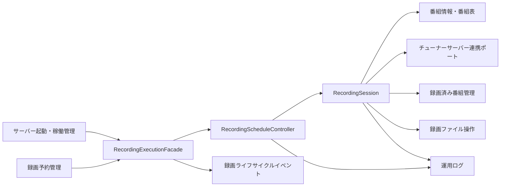
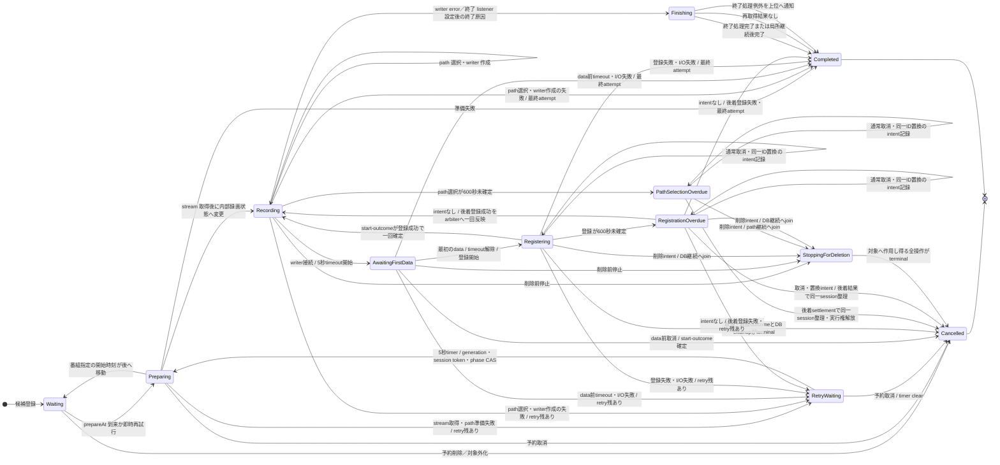
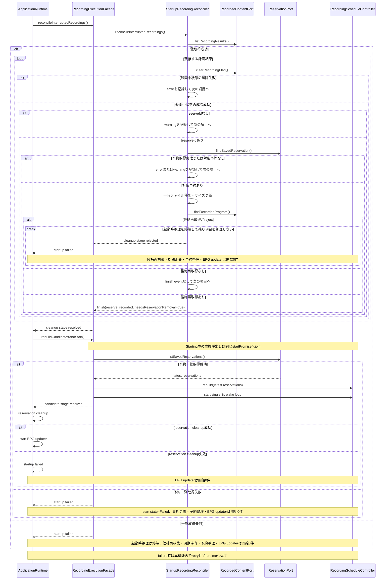
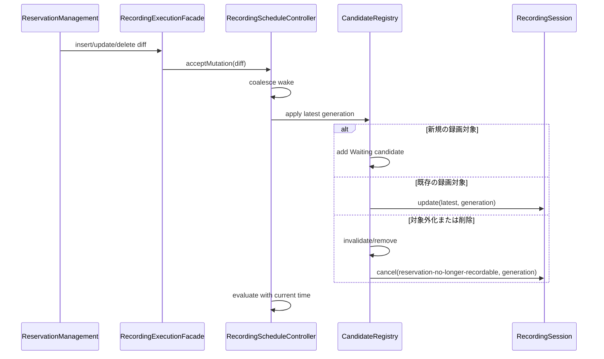
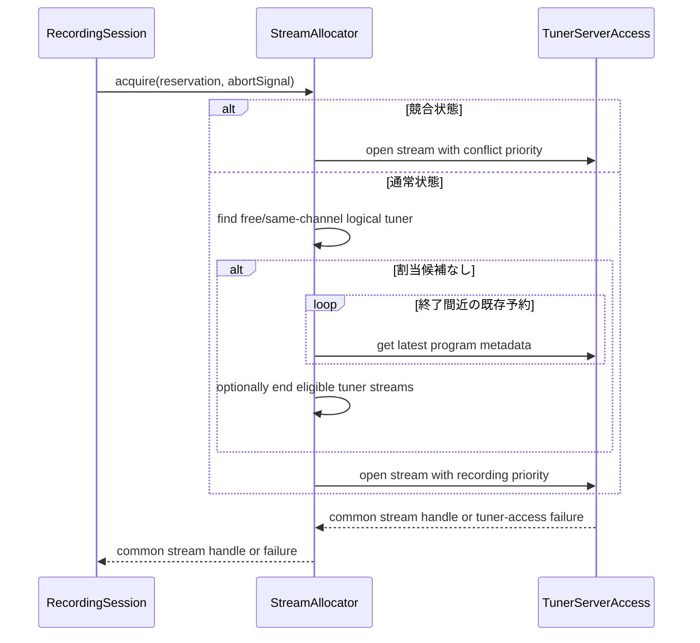
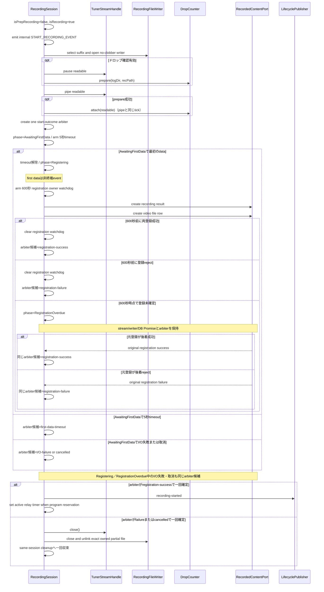
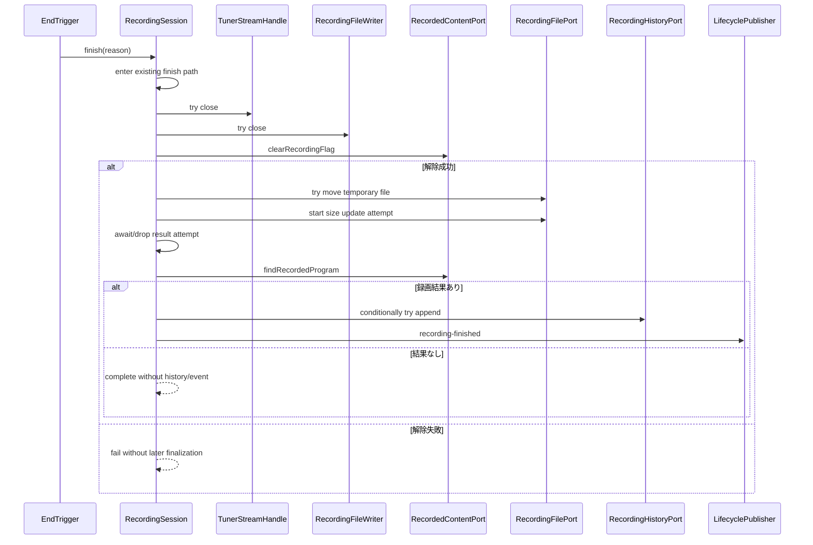

# 予約録画実行機能 設計

## 1. 目的と設計方針

### 1.1 目的

本設計は、保存済みの確定予約を実行候補として取り込み、録画準備、放送ストリーム取得、録画ファイル書込み、録画終了、有限再
試行、および起動時整理を実行するサーバー内部機能を定義する。

録画時刻の監視では、予約ごとの長時間タイマーを持たず、全候補を正の有限間隔で再評価し、直近の意味的締切だけを共有の短時間
タイマーで補完する。予約差分の受付、録画path選択の排他、起動時整理、録画準備・終了・再試行は、Requirementsと本文に定める
contractへ従う。仕様contractと異なるsource特性は隔離したcharacterization fixtureだけで扱い、仕様testへ混在させない。

### 1.2 利用者と利用機能

-   利用者: 録画予約を実行する利用者、起動時の残存状態を整理する運用者
-   主な呼出元: サーバー起動・稼働管理、状態変化通知・外部連携、プロセス間通信、Web・API・リアルタイム通知、機能間連携
-   主な依存先: 設定管理、運用ログ、予約管理、番組情報、チューナーサーバー連携、録画済み番組管理

### 1.3 対象範囲

本機能が所有する責務は次のとおりである。

-   保存済み予約から録画対象を選び、最新候補を追跡する
-   現在時刻に基づいて録画準備と時刻指定録画の終了を起動する
-   予約の追加、変更、削除へ追従する
-   録画条件と出力先を決定し、共通チューナーポートへストリームを要求する
-   ストリームをファイルへ書き込み、録画済み番組へ結果を反映する
-   録画中の変更、取消、ストリーム終了、書込み失敗を処理する
-   取得失敗と録画失敗を有限回だけ再試行する
-   起動時に中断された録画結果と残存ファイルを整理する
-   録画ライフサイクルの事実をイベントとして公開する

### 1.4 対象外

-   予約の生成、競合・重複・除外の計画判定、および予約保存
-   番組表の収集、番組情報の正規化、および最新番組情報の取得方式
-   Mirakurun または mirakc 固有 API、HTTP、ストリーム型、エラー型
-   録画済み番組の利用者向け検索・削除・再生
-   サムネイル、エンコード、配信、および録画後ワークフロー
-   前回プロセスの放送受信処理の復元

### 1.5 設計上の固定値

| 定数または値の用途                           |           値 | 根拠と用途                                               |
| -------------------------------------------- | -----------: | -------------------------------------------------------- |
| `SCAN_INTERVAL_MS`                           |     3,000 ms | 録画対象を周期的に再評価する内部定数。公開設定にはしない |
| `PREPARATION_LEAD_MS`                        |    15,000 ms | 録画準備を開始する前倒し幅                               |
| 放送ストリーム取得の再試行間隔               |     5,000 ms | 準備に失敗した後、次の準備を始めるまでの待ち             |
| 最初の放送データ受信待ち                     |     5,000 ms | 超過すると録画開始を失敗として扱う                       |
| 録画準備取消の最大待ち                       |    60,000 ms | 準備中の予約を取り消すとき、準備の終了を待つ上限         |
| ドロップ集計結果の待ち                       |    10,000 ms | ドロップ集計の結果を待つ上限                             |
| 時刻指定予約の終了時刻更新時に開始を待つ上限 |    15,000 ms | 録画準備中の予約の終了時刻を更新するとき、録画開始を待つ上限 |
| 使用済みチューナー追跡情報を整理する周期     | 1,800,000 ms | 使用済みチューナー追跡情報を整理する独立周期             |
| `DELETION_STOP_TIMEOUT_MS`                   |    60,000 ms | 削除前に録画資源の終端を確認する最大待ち                 |

`SCAN_INTERVAL_MS` と `PREPARATION_LEAD_MS` は本番では固定し、テストでは時計とスケジューラーを差し替えて境界を決定論的に
検証する。15 秒は準備開始時点の計算値であり、short timer の判定幅ではない。チューナー接続確立期限はチューナーサーバー連
携側の契約であり、本機能の予約タイマーではない。

## 2. 依存関係と境界

### 2.1 依存方向



依存は機能境界の抽象へ向ける。録画実行層から Mirakurun または mirakc のクライアント、型、URL、終了方式を直接参照してはな
らない。製品差は `server-tuner-access` が実装する `TunerServerAccess` の内側に閉じ込める。

### 2.2 依存機能との契約

| 依存機能                        | 利用する契約                                                     | 本機能が前提としないこと       |
| ------------------------------- | ---------------------------------------------------------------- | ------------------------------ |
| `server-configuration`          | 録画先、優先度、マージン、ドロップ確認、ファイル名設定           | 設定ファイル形式、再読込方式   |
| `server-operational-logging`    | 構造化された診断・失敗記録                                       | ログ配送先、ローテーション     |
| `server-reservation-management` | 保存済み予約一覧・単件取得、候補追加、録画履歴追加、予約変更通知 | 競合判定アルゴリズム           |
| `server-program-guide`          | 保存番組・放送局、保存済みリレー先番組                           | チューナー製品固有の番組表表現 |
| `server-tuner-access`           | 最新放送番組、共通番組／サービスストリーム、終了、接続失敗       | Mirakurun／mirakc 固有通信     |
| `server-recorded-content`       | 録画結果・ファイル登録、録画中解除、更新、再取得                 | 利用者向け管理 API             |

### 2.3 呼出元との契約

実装の予約変更通知は `acceptMutation(diff)` を同期で呼び、受付の同期例外と後続の拒否を `EventSetter` が記録する。差分受付
は throw しない同期キュー操作に限定し、受付後の評価失敗をコントローラー自身が記録する。通知受付は録画処理完了を意味しな
い。

本機能の起動は次の独立した段階に分ける。

1. 設定、ログ、データアクセス、およびチューナー連携を初期化する。
2. 中断録画の起動時整理を実行する。
3. 起動時整理の成功後、保存済み予約から候補レジストリを再構築する段階を開始する。
4. 保存済み予約一覧の取得と候補再構築が成功した場合だけ周期走査を開始する。

候補再構築は、前回プロセスの受信処理や OS プロセスを復元・照合することを意味しない。起動時整理と候補再構築は起動sequence
から各一回だけ呼び、いずれかがrejectした場合は周期走査、予約整理、およびEPG updaterへ進まず、失敗を
`server-application-runtime`へ返す。本機能内で固定間隔timerや無制限retryを開始しない。runtimeはfatalな起動失敗として
process lifecycleへ渡し、次のprocess起動時に保存状態から全段階を再評価する。

候補再構築段階の `rebuildCandidatesAndStart()` は process-local に `NotStarted`、`Starting`、`Started`、`Failed` の
start state と一つの `startPromise` を所有する。最初の呼出しだけが `NotStarted` から `Starting` へ遷移し、保存済み予約一
覧の取得、候補再構築、周期走査開始を同じ Promise で実行する。 `Starting` 中の並行呼出しは新しい一覧取得や周期走査を開始
せず、その `startPromise` 自体へ join する。成功時は `Started` として fulfilled Promise を保持し、以後の呼出しも同じ完了
結果を返すため、周期 handle は process 内で最大一件である。失敗時は `Failed` として同じ rejected Promise と失敗を保持
し、開始途中に生成したwake handleがあれば解除して0件にした後、以後の呼出しへ同じ失敗を返す。`Failed` から `NotStarted`
へ戻す retry、固定間隔 wake、別 Promise による再実行は本機能内に設けない。process 再起動で新しい facade instance を構成
したときだけ、新しい process-local state は `NotStarted` から始まる。

## 3. コンポーネント設計

### 3.1 論理コンポーネント

| コンポーネント                 | 責務                                                                       | 所有しない責務                   |
| ------------------------------ | -------------------------------------------------------------------------- | -------------------------------- |
| `RecordingExecutionFacade`     | 初期化、4状態start lifecycle、予約差分受付、リセット互換入口、イベント公開 | タイマー計算、ファイル書込み     |
| `RecordingScheduleController`  | 候補レジストリ、単一周期走査、共有短時間 wake、準備と時刻指定終了の判定    | 予約計画、番組リレーの意味判定   |
| `RecordingCandidateRegistry`   | 予約 ID ごとの最新候補、世代、現在 phase                                   | 永続化、タイマーハンドル         |
| `RecordingSession`             | 1 予約の準備、録画、変更、取消、終了                                       | 将来予約全体の走査               |
| `StreamAllocator`              | 論理チューナー割当、同一チャンネル共有、途中終了判定                       | 製品固有接続                     |
| `RecordingFileWriter`          | パス決定、書込み、初回データ待ち、移動、サイズ取得                         | 録画結果の永続化方針             |
| `DropCounter`                  | ドロップ、エラー、スクランブル集計                                         | 終了判断                         |
| `StartupRecordingReconciler`   | 録画中フラグ解除、残存ファイル移動・サイズ更新                             | 受信プロセス復元                 |
| `RecordingLifecyclePublisher`  | 準備、開始、失敗、再試行終了、完了、リレー候補の公開                       | イベント配送先の実装             |
| `RecordingRecordedUseGate`     | 容量不足削除と録画利用をrecorded ID単位で排他し、active利用を停止しない    | file・DB削除、service child利用  |
| `RecordingRecordedUseSnapshot` | active sessionに対応するrecorded IDをread-onlyで一時点の集合へ投影する     | 候補query、削除可否、session停止 |

facade 内部の `acceptMutation(diff)` が予約差分を同期で受け付ける。`Failed` では何もせず、候補起動前または起動中は複製可能な差分だけを起動後へ保留し、複製できない入力は controller へ一回だけ直接渡す。`Started` では scheduler 開始を確認してから controller へ一回だけ渡す。既存 `update(diff)` は互換入口としてこの同期受付を呼び、開始済みの場合にだけ controller idle と session mutation tail を待つ。facade は後続の候補評価、再試行、timer、queue を所有しない。

### 3.2 主要ポート

```ts
type ReservationId = number;
type EpochMillis = number;
type RecordingCancellationReason = 'reservation-no-longer-recordable' | 'recorded-content-deletion';
type RecordingExecutionStartState = 'NotStarted' | 'Starting' | 'Started' | 'Failed';
type OverdueTerminationIntent = 'None' | 'Cancel' | 'Replacement' | 'Deletion';
type OverdueOperation = 'PathSelection' | 'Registration';
declare const recordingGenerationBrand: unique symbol;
declare const controllerTokenBrand: unique symbol;
declare const sessionTokenBrand: unique symbol;
type RecordingGeneration = bigint & { readonly [recordingGenerationBrand]: 'RecordingGeneration' };
type ControllerToken = bigint & { readonly [controllerTokenBrand]: 'ControllerToken' };
type RecordingSessionToken = bigint & { readonly [sessionTokenBrand]: 'RecordingSessionToken' };

interface MonotonicScheduler {
    setTimeout(callback: () => void, delayMs: number): CancelHandle;
}

interface WallClock {
    now(): EpochMillis;
}

interface RecordingCandidateSource {
    listSavedReservations(): Promise<ReadonlyArray<SavedReservation>>;
    findSavedReservation(id: ReservationId): Promise<SavedReservation | null>;
}

interface RecordingExecutionFacade {
    reconcileInterruptedRecordings(): Promise<void>;
    rebuildCandidatesAndStart(): Promise<void>;
    acceptMutation(diff: ReservationMutation): void;
    update(diff: ReservationMutation): Promise<void>;
}

interface RecordingRecordedUseGate {
    tryAcquireDeletion(recordedId: number): { readonly token: object } | { readonly status: 'busy' | 'unknown' };
    releaseDeletion(token: object): void;
}

type RecordedUseSnapshot =
    | { readonly status: 'known'; readonly recordedIds: ReadonlySet<number> }
    | { readonly status: 'unknown' };

interface RecordingRecordedUseSnapshotProvider {
    getActiveRecordedIds(): RecordedUseSnapshot;
}

interface RecordingScheduleController {
    start(): Promise<void>;
    acceptMutation(mutation: ReservationMutation): void;
    requestReset(): void;
    registerTimeSpecifiedEnd(milestone: TimeSpecifiedEndMilestone): void;
    removeTimeSpecifiedEnd(reservationId: ReservationId): void;
}

interface RecordingSessionFactory {
    create(candidate: RecordingCandidate, generation: RecordingGeneration): RecordingSession;
}

interface RecordingSession {
    phase(): RecordingPhase;
    readonly token: RecordingSessionToken;
    prepare(expectedGeneration: RecordingGeneration): Promise<void>;
    update(reservation: SavedReservation, generation: RecordingGeneration): Promise<void>;
    cancel(reason: RecordingCancellationReason, generation: RecordingGeneration): Promise<void>;
    finishAtTimeSpecifiedEnd(now: EpochMillis, generation: RecordingGeneration): Promise<void>;
}

type RecordingTunerPort = Pick<TunerServerAccess, 'getProgram' | 'openProgramStream' | 'openServiceStream'>;

interface RecordedContentPort {
    createRecordingResult(input: RecordingResultInput): Promise<RecordedProgram>;
    createVideoFile(input: VideoFileInput): Promise<void>;
    updateProgram(input: RecordedProgramUpdate): Promise<void>;
    clearRecordingFlag(recordedId: number): Promise<void>;
    findRecordedProgram(recordedId: number): Promise<RecordedProgram | null>;
}

interface StartupRecordingReconciler {
    reconcileInterruptedRecordings(): Promise<void>;
}
```

論理名と実装名の対応は次のとおりである。本節と7.1の論理名は実装の `RecordingManageModel`（`IRecordingManageModel`）の操作に写像される。

| 論理名                                          | 実装                                                                        |
| ----------------------------------------------- | --------------------------------------------------------------------------- |
| `RecordingExecutionFacade`                      | `RecordingManageModel`                                                      |
| `reconcileInterruptedRecordings()`              | `cleanup()`                                                                 |
| `cancel(reservationId, reason)`                 | `cancel(reserveId, false)`（`reservation-no-longer-recordable`）、`cancel(reserveId, true)`・`cancelForDeletion(reserveId)`（`recorded-content-deletion`。後者は削除terminalまで待つ） |
| `hasReservation(id)`                            | `hasReserve(reserveId)`                                                     |
| `requestReset()`                                | `resetTimer()`                                                              |

`RecordingTunerPort` は `server-tuner-access` が所有する正準 `TunerServerAccess` のうち、本機能が利用する操作だけを表す
consumer-side alias である。`TunerProgram`、`ProgramStreamRequest`、`ServiceStreamRequest`、`TunerStreamHandle`を本機能
内で再定義しない。最新番組情報は`getProgram()`の`TunerProgram`を使い、ストリーム本体は `TunerStreamHandle.stream`から取
得する。`close()`は冪等な同期`void`操作であり、接続先resourceの解放完了を待つPromiseや結果を返さない。runtime
compositionは同じ`TunerServerAccess` instanceをこのaliasへbindingする。

`MonotonicScheduler` は待機時間を扱い、`WallClock` は意味的な時刻判定を扱う。タイマー発火回数から現在時刻を推定してはな
らない。すべての wake は `WallClock.now()` で現在時刻を取り直す。

`RecordingExecutionFacade.rebuildCandidatesAndStart()`の`startPromise`は、候補一覧read、rebuild、および
`RecordingScheduleController.start()`のsettlementを包む。controllerの`start()`はそのPromise内から一回だけ呼ばれ、独立し
たretry lifecycleや二つ目のwake handleを所有しない。

`RecordingRecordedUseGate`はactive session registryと同じ直列化境界を使う。対象recorded IDへ作用するsessionがあれば
`busy`、対応関係を確定できなければ`unknown`を返し、sessionの取消・停止は行わない。tokenを返した後は、同じrecorded IDへ作
用する新しいsession開始をfinal deleteの成否にかかわらずtoken解放まで拒否する。`releaseDeletion()`はexact tokenだけを一回
解放し、古いtokenまたは別IDのtokenで現在のgateを解放しない。このportは容量不足削除だけに提供し、利用者削除の
`recorded-content-deletion`取消と60秒terminal barrierを置換しない。

`RecordingRecordedUseSnapshotProvider`は同じactive session registryをread-onlyで列挙し、録画済み番組行と対応付いたactive
sessionのrecorded IDを重複除去して返す。候補、準備中でまだrecorded IDを持たないsession、終了済みsessionはID集合へ追加し
ない。registryとrecorded IDの対応を一時点として安全に列挙できない場合は、既知の一部または空集合を返さず `unknown`とす
る。snapshot取得はsessionの取消・停止、phase遷移、timer、stream、writer、deletion tokenを変更せず、完了を待たない。結果
は候補query用の助言的filterであり、`RecordingRecordedUseGate`の削除直前判定と新規利用blockを置換しない。

録画済み行とvideo行の登録後、sessionは自身のidentityでactive useを登録してから`Recording`へのCAS、終了処理設定、開始通知、relay設定へ進む。CAS不成立時だけ、その登録objectと一致するuseを解放する。tokenでblockされた開始は、当該sessionが所有する`PendingRegistrationResources`（path、recorded/video/drop row）だけを一つのcleanup lifetimeで回収し、既存active session、別session、token所有者へは作用しない。active useの解放はwriter、stream、drop、size更新のcontinuation終端後にidentityと登録objectの両方が一致した場合だけ行い、failure通知自体は解放契機にしない。

#### 通常録画終端の観測と active use 解放

通常録画の終端を session 内部で観測する port は、公開 API や IPC の待機契約ではない。facade は当該観測が settle し、
かつ登録時の session identity と recorded-use object が一致した場合に限り active use を解放する。解放後に同じ recorded
ID への容量不足削除が token を取得し得ることは既存の `RecordingRecordedUseGate` 不変条件の帰結であり、本観測 port は
容量不足削除の `busy` / `not-deleted` / final-delete 可否の意味を新設・緩和・厳格化しない。利用者削除の 60 秒 terminal
barrier とも置換しない。

### 3.2.1 コントローラーと session の内部責務（非公開）

本節は Requirements が定める外部不変条件を変えず、controller と session の内部協調だけを固定する。公開 API、IPC 応答、
DB schema、設定 wire、外部 hook の契約を追加しない。

#### 候補の arm 結果（内部成功信号）

| 項目 | 契約 |
| --- | --- |
| 責務境界 | facade / manage が最新候補を session へ渡し、監視を組めたかを内部信号で知る。公開返却値・HTTP/IPC schema ではない |
| 状態所有者 | 録画対象か否かの正本は候補レジストリ（通常/競合を含み、除外/重複を含めない）。session は 1 予約の準備・終了協調だけを持つ |
| 入力 | 保存済み予約 snapshot と、ログ抑制などの内部旗。利用者 request body ではない |
| 出力 | armed / not-armed の内部成功信号のみ。true/false を REST や IPC の公開契約へ載せない |
| 失敗 / no-op | 除外・重複・終了済みなどで not-armed のとき、当該 session を active 録画索引へ載せない。公開 API を失敗応答にしない |
| 資源寿命 | armed のときだけ prep / 時刻指定終了に必要な内部協調を始める。not-armed では余計な wake や索引を残さない |
| 外部不変条件 | Requirements 1 の対象選定（通常/競合を対象、除外/重複を非対象）と、長時間 per-reserve timer を持たない監視方式 |

#### 世代・session 識別の所有と stale action

| 項目 | 契約 |
| --- | --- |
| 責務境界 | `RecordingCandidateRegistry` が最新候補の generation と現在の候補 phase を所有する。`RecordingScheduleController` は session token と時刻指定終了 milestone を所有し、registry に対する generation / token / phase の検証と遷移を仲介する。session は関連 snapshot を保持し、準備・再試行・終了を実行する |
| 状態所有者 | generation と候補 phase の正本は `RecordingCandidateRegistry`。session token と時刻指定終了 milestone の正本は `RecordingScheduleController`。session は関連 snapshot と prep / retry / finalization の実行 |
| 入力 | reservationId、generation、session token、phase、および controller が与える現在性検査・遷移・時刻指定終了登録口 |
| 出力 | 無し（void 協調）。利用者向け成功・失敗コードを定義しない |
| 失敗 / no-op | generation または session token が一致しない action、および終端 phase での無効 retry は **no-op** とし、新しい準備開始・終了・再試行を起こさない |
| 資源寿命 | binding 更新で無効になった旧世代の timer / retry callback は作用させない。中央 prep / 時刻指定終了 milestone は controller が所有する |
| 外部不変条件 | Requirements 1 の周期再評価と差分再評価。利用者から見える準備・開始・終了結果は Requirements 2・3・5 が既定する |

#### 時刻指定終了の generation ゲート

| 項目 | 契約 |
| --- | --- |
| 責務境界 | controller が時刻指定終了 milestone（意味的 dueAt と generation / session token）を中央所有し、registry 上の phase と世代が一致するときだけ session の終了実行へ渡す。session は既存の終了・結果反映経路を実行する |
| 状態所有者 | 時刻指定終了 milestone と session token は controller。Finishing を含む候補 phase と generation は registry（controller が検証と遷移を仲介）。stream / writer の終了実行は session |
| 入力 | dueAt 到達と generation / session token / phase 検査。session 側へ公開引数を増やさない |
| 出力 | 既存の録画終了処理の開始。終了 adapter 自体の返却値を公開契約にしない |
| 失敗 / no-op | generation・session token・phase のいずれかが一致しない、または session 不在のとき dispatch しない |
| 資源寿命 | 終了時に stream / writer / drop の停止を試み、当該 milestone と active な番組リレー timer を除去する |
| 外部不変条件 | Requirements 5 の終了と結果反映。時刻指定終了が「終了処理に入る」意味を変えない |

### 3.3 予約候補モデル

```ts
type RecordingPhase =
    | 'Waiting'
    | 'Preparing'
    | 'RetryWaiting'
    | 'Recording'
    | 'AwaitingFirstData'
    | 'Registering'
    | 'PathSelectionOverdue'
    | 'RegistrationOverdue'
    | 'StoppingForDeletion'
    | 'Finishing'
    | 'Completed'
    | 'Cancelled';

interface RecordingCandidate {
    reservationId: ReservationId;
    reservation: SavedReservation;
    startAt: EpochMillis;
    endAt: EpochMillis;
    prepareAt: EpochMillis;
    kind: 'Program' | 'TimeSpecified';
    state: 'Normal' | 'Conflict';
    generation: RecordingGeneration;
    phase: RecordingPhase;
}

interface TimeSpecifiedEndMilestone {
    reservationId: ReservationId;
    generation: RecordingGeneration;
    dueAt: EpochMillis;
}
```

-   `prepareAt = startAt - 15,000ms` とする。
-   通常状態と競合状態だけを候補へ含める。除外状態と重複状態は含めない。
-   レジストリは予約 ID ごとに 1 件の最新候補だけを保持する。
-   `Registering`から`Recording`へのCASは、recorded IDを持つactual session identityのadmission後に行う。CAS不成立はそのidentityの当該registrationだけを解放し、同じrecorded IDを持つ別sessionのregistry entryを削除しない。
-   `generation` は予約追加・更新・削除・再構築のたびにprocess-localな不透明`bigint`として単調増加させる。予約削除後の同
    一ID再追加でも過去値を再利用せず、固定最大値、number変換、wrapを設けない。controller tokenとsession tokenも同じ規則
    で発行する。
-   番組リレー確認は active session が `endAt - 20,000ms` の専用タイマーを所有し、将来予約スケジューラーへ登録しない。

### 3.4 永続データと一時データ

| データ                   | 所有機能         | 本機能での扱い                                       |
| ------------------------ | ---------------- | ---------------------------------------------------- |
| 保存済み予約             | 予約管理         | 読取り専用の実行入力。状態は変更しない               |
| 保存番組・放送局         | 番組情報         | 録画条件とリレー候補の入力                           |
| 録画済み番組             | 録画済み番組管理 | 最初のデータ受信後に登録し、終了時に録画中状態を解除 |
| 録画ファイル行           | 録画済み番組管理 | 録画済み番組登録後に別要求として登録                 |
| 録画ファイル             | ファイルシステム | 一時／通常パスへ書込み、必要なら終了時に移動         |
| 候補レジストリ           | 本機能メモリ     | 再起動時に保存予約から再構築                         |
| start lifecycle          | facadeメモリ     | 4状態と一つのPromiseをprocess内だけ保持              |
| 期限超過session registry | 本機能メモリ     | phase、intent、元Promise、late cleanupの受皿を保持   |
| start-outcome arbiter    | sessionメモリ    | 一件の録画開始結果と同一session cleanupを裁定        |
| 時刻指定終了 milestone   | 本機能メモリ     | 中央制御し、完了・取消時に除去                       |
| 論理チューナー利用状況   | 本機能メモリ     | ストリームハンドルと予約の関連を追跡                 |

録画済み番組行と録画ファイル行の作成は、単一トランザクションへまとめない。前者の作成後に後者が失敗し得ることを、終了処理
と起動時整理が扱う。

## 4. 時刻監視設計

### 4.1 所有権と不変条件

`RecordingScheduleController` は将来予約の準備時点と、active な時刻指定録画の意味的終了時点だけを中央管理する。番組リ
レー確認タイマーは active `RecordingSession`、チューナー追跡情報の 30 分 interval は `StreamAllocator` が実装と同じく所
有し、将来予約スケジューラーへ移さない。

時刻監視は次の不変条件を満たす。

1. スケジュールコントローラーが所有する実行中タイマーハンドルは最大 1 個である。
2. 将来予約ごとの準備タイマーと、時刻指定録画ごとの終了タイマーを保持しない。
3. `nextDelay` は 3,000ms と、最早の scheduler-owned deadline までの非負時間の小さい方である。
4. 遠未来の deadline はレジストリ値として保持するだけで、共有ハンドルの待機は常に最大 3,000ms である。
5. タイマー callback は業務遷移を直接行わず、評価ループを wake するだけである。
6. 評価ループは単一実行とし、予約変更 wake とタイマー wake を合流する。
7. tick と mutation の競合による録画準備または時刻指定終了の重複起動は、予約 ID、期待世代、session token、期待 phase の
   比較で防ぐ。
8. スケジューラーが所有する待機後および非同期境界の後では、必ず wall clock と最新世代を読み直す。
9. active session の完了・取消・失敗時に、その予約の時刻指定終了 milestone を除去する。
10. wake の再設定後に到着した古い callback は、不透明`bigint`のcontroller token不一致により無効化する。
11. generation、controller token、session tokenはprocess lifetime中に再利用せず、比較以外の算術・serializationへ使わな
    い。

この構造では、候補数を `N` としたとき候補・時刻指定終了 milestone のメモリ量は `O(N)`、スケジュールコントローラーのタイ
マーハンドル数は `O(1)` である。active 番組リレータイマーと独立 cleanup interval はこの個数に含めない。3 秒ごとの走査量
は `O(N)` であり、実装のデータモデルの全候補走査を明示的に採用する。

### 4.2 wake 時刻の計算

```ts
function computeNextDelay(now: number, schedulerOwnedDeadlines: readonly number[]): number {
    const earliestAt = schedulerOwnedDeadlines.reduce(
        (earliest, dueAt) => Math.min(earliest, dueAt),
        Number.POSITIVE_INFINITY,
    );
    const untilEarliest = Number.isFinite(earliestAt) ? Math.max(0, earliestAt - now) : SCAN_INTERVAL_MS;
    return Math.min(SCAN_INTERVAL_MS, untilEarliest);
}
```

期限到来済みの準備・終了はタイマーを arm する前に直ちに dispatch する。dispatch 後に `now()` と deadline を読み直すた
め、通常は正の delay が残る。競合により計算結果が 0 の場合は microtask で再評価し、0ms timer を反復しない。

deadline の遠近にかかわらず共有 wake は最大 3 秒なので、遠未来予約に長時間ハンドルを結び付けない。deadline が 3 秒未満へ
近づいた場合だけ、同じ共有ハンドルをその時点へ早める。15 秒は `prepareAt` の算出値である。

### 4.3 評価ループ

```ts
function evaluate(reason: WakeReason): void {
    if (evaluationRunning) {
        rerunRequested = true;
        return;
    }

    evaluationRunning = true;
    cancelArmedWake();

    try {
        do {
            rerunRequested = false;
            applyQueuedMutations();

            dispatchDuePreparationsWithoutAwaitingSessionLifetime();
            dispatchDueTimeSpecifiedEnds();
        } while (rerunRequested || hasDueSchedulerWork(clock.now()));
    } finally {
        evaluationRunning = false;
        armSingleWake(clock.now());
    }
}
```

`now` を `evaluate`側で一括して読み、両フェーズへ受け渡すことはしない。各フェーズは候補単位の for-loop であり、ループの
各反復の冒頭で `clock.now()` を読み直してからその反復の候補だけを判定する。

```ts
function dispatchDuePreparationsWithoutAwaitingSessionLifetime(): void {
    for (const candidate of dueCandidatesByPrepareOrder()) {
        if (!started || hasQueuedWork()) return;
        const now = clock.now();
        // ...判定・準備dispatch
    }
}
```

前の反復で起動した準備・終了dispatchは`evaluate`がawaitしない非同期処理であり、次の反復冒頭の`clock.now()`はその非同期
境界後の読み直しに当たる。これにより4.1の不変条件8（非同期境界後は必ず wall clock を読み直す）は候補単位でも保たれる。

各 due preparation は phase CAS 後に session の非同期処理を起動し、そのストリーム取得や録画 lifetime を `evaluate` で
await しない。同時刻の複数予約は直列のストリーム取得にならず、それぞれ独立して進行する。session promise の拒否は起動箇所
で個別に記録する。時刻指定終了も同様に終了要求を dispatch し、評価ループ内で終了反映全体を待たない。

### 4.4 wake の合流と無効化

-   予約追加・変更・削除は差分をキューへ追加し、同一イベントループ内の wake を 1 回へ合流する。
-   評価中の wake は `rerunRequested = true` とするだけで、並行評価を開始しない。
-   評価外の mutation wake は現在の共有タイマーを解除し、microtask で直ちに評価する。
-   タイマーを設定するたびに不透明`bigint`のcontroller tokenを増加させる。callbackは捕捉したtokenが最新の場合だけwakeす
    る。
-   予約差分を適用するたびに予約世代を増加させる。scheduler が起動する準備と時刻指定終了は期待世代と phase を比較する。
-   取消済みハンドルの callback が競合して実行されても、controller token と予約世代の二重検査で作用を持たない。

### 4.5 時計変更と遅延

タイマーの遅延時間は wall clock から一度計算するが、意味的判断は callback 発火時の `now()` で行う。

-   時計が前へ進んだ場合、経過した準備時点と終了時点を同じ評価で期限到来として扱う。
-   時計が後ろへ戻った場合、まだ開始していない候補は新しい現在時刻から待機を続ける。
-   すでに `Preparing` または `Recording` へ遷移した処理を、時計が戻ったことだけでは `Waiting` へ戻さない。
-   event loop 停止や高負荷で周期確認が遅れても、tick 数ではなく最新の絶対時刻から判断する。
-   スケジューラーが所有する候補取得と milestone dispatch の非同期境界後にも時刻と世代を再確認する。session 内部の再試行
    や終了処理は実装の境界を維持し、この世代検査を普遍的には追加しない。

時刻指定ストリームの開始待ちと終了は同じ原則で再評価する。終了時刻を過ぎてから初めて要求しようとする場合はストリームを開
かず失敗とし、すでに active な場合は最新の `endAt + endMargin` を過ぎていれば終了を起動する。

### 4.6 milestone の分類

| milestone        | 所有者                     | `dueAt`              | 共有 wake での動作                     |
| ---------------- | -------------------------- | -------------------- | -------------------------------------- |
| 録画準備         | スケジュールコントローラー | `startAt - 15,000ms` | `Waiting` から `Preparing` を CAS 開始 |
| 時刻指定録画終了 | スケジュールコントローラー | `endAt + endMargin`  | active session へ終了要求              |

番組リレー確認は既存の active recording behavior を維持する。active session が最初のデータ受信後に `endAt - 20,000ms` の
専用タイマーを設定し、終了時刻更新時に再設定し、録画終了時に解除する。本機能は将来予約ごとの準備タイマーを持たない
（共有 wake で動く`RecordingScheduleController`が準備時点を管理する）。この active 録画用タイマーはそれとは別である。

番組指定ストリームは、ローカルの強制終了タイマーを追加しない。上流ストリームの終了、取消、ファイルエラー等で終了する。時
刻指定ストリームだけが意味的終了 milestone を持つ。

### 4.7 チューナー追跡情報の整理

使用済みチューナー追跡情報の整理は `StreamAllocator` が独立した 30 分 `setInterval` として所有する。終了時刻から 12 時間
以内の追跡情報を残す実装の条件と、tuner 情報を初回だけ設定したときに interval を開始する動作を維持する。この interval は
将来予約ごとのタイマーではなく、`RecordingScheduleController` の共有 wake の個数にも含めない。

## 5. 状態機械と所有権

### 5.1 録画セッション状態



`Completed` は、業務上の成功だけでなく、その試行が終端へ到達したことを示す。成功、準備失敗、録画失敗、終了処理失敗は
outcome で区別する。

実装の最初の `Recording` は、外部へ録画開始を通知済みであることを意味しない。stream 取得と予約存続確認の後、
`isPrepRecording = false`、`isRecording = true` に変更して session 内部の `START_RECORDING_EVENT` を発行した時点で
`Recording` へ入る。path と writer の確保後は `AwaitingFirstData`、最初のdata受信後は `Registering` へ進む。最初のdataは
開始成功ではなく、5秒のfirst-data timeoutを解除して登録を開始する非終端eventである。録画結果とfile行の登録成功が
start-outcome arbiterへ到達した場合だけ、外部の録画開始通知を発行して録画中の `Recording` へ戻る。

### 5.2 scheduler-owned 遷移の原子性

```ts
function beginScheduledTransition(
    id: ReservationId,
    expectedGeneration: RecordingGeneration,
    expectedSessionToken: RecordingSessionToken | null,
    expectedPhase: RecordingPhase,
    nextPhase: RecordingPhase,
): boolean;
```

この操作は tick と mutation が同じ準備または時刻指定終了を二重起動しないため、1 つの同期クリティカルセクションで次を検
査・更新する。

1. 候補が存在する。
2. 世代が `expectedGeneration` と一致する。
3. active sessionがある場合はsession tokenが`expectedSessionToken`と一致する。
4. phase が `expectedPhase` と一致する。
5. phase を `nextPhase` へ変更する。

Node.js の単一イベントループを前提としても、`await` をまたぐ read-modify-write を原子的とはみなさない。scheduler が起動
した準備と時刻指定終了は、非同期境界後に世代と phase を再検査する。この CAS は既存 session 内のすべての終了原因やイベン
トを新たに普遍的 dedupe する契約ではない。

### 5.3 終端競合

予約取消、時刻指定終了、上流 stream 終了、ファイル write error は競合し得る。scheduler 世代は時刻指定終了 callback の重
複だけを防ぐ。session 内は、write error 時に stream-finished callback を抑止する flag、stream の破棄、既存の終了
listener を用いる。これらを越える新しい終了重複排除契約は追加しない。この競合は特性テストで実装の通知・後始末回数を固定
する。

番組指定の自動予約で同じルールの録画が同じ時刻に終わるとき、先に終了処理を進めた録画の完了通知は`updateRule(ruleId)`に
よる予約の再計算を起こし、番組が終わった同じルールの予約を削除する。この削除による`reservation-no-longer-recordable`の
取消が、上流 stream の終了をまだ処理していない同じルールの録画へ届いても、その録画は取消による終了にせず、正常終了とし
て録画履歴の追加と予約削除要否`true`の完了通知を行う（Requirements 5.5）。データベース処理が event loop を塞ぐかどうか
（driver が同期か非同期か）で、この結果を変えない。session は、録画中の`reservation-no-longer-recordable`の取消を受けた
時点で予約終了時刻（`endAt`）を過ぎていれば（`endAt <= 現在時刻`）、自動予約ルールの予約（番組リレーを除く）に限り予約
削除要否を`true`のまま残す（6.9 の 10）。consumer はこの完了通知で`updateRule(ruleId)`を再度要求し、追加された録画履歴で
重複状態を再計算する。手動予約と番組リレー予約では、取消の時点で予約はすでに削除されている。予約削除要否を`true`にする
と consumer が存在しない予約の取消を要求して失敗を記録するだけなので、`false`のまま通知する。

### 5.4 予約変更マトリクス

| 現在 phase                         | 変更                           | 動作                                                                            |
| ---------------------------------- | ------------------------------ | ------------------------------------------------------------------------------- |
| `Waiting`                          | 開始／終了変更                 | 世代を進め、最新時刻で `prepareAt` と対象性を再評価                             |
| `Preparing`・番組指定              | 開始時刻が後へ移動             | 現準備を取消し、取消完了後に最新世代を `Waiting` として登録                     |
| `Preparing`・番組指定              | 開始時刻が前へ移動             | 現準備を開始し直さず、録画情報だけを最新化                                      |
| `Preparing`／`Recording`・時刻指定 | 開始変更                       | 放送受信開始処理を変えず、録画情報だけを最新化                                  |
| `Recording`・番組指定              | 開始変更                       | 放送受信を再開せず、録画情報だけを最新化                                        |
| `Preparing`／`Recording`           | 終了変更                       | 世代を進め、active 終了情報を更新。時刻指定 milestone は旧世代を無効化して置換  |
| 任意                               | 通常／競合から除外／重複へ変更 | 予約取消と同じ phase 別処理                                                     |
| `PathSelectionOverdue`             | 通常取消                       | `Cancel` intentを記録し、元path処理の後着確定から同一sessionだけを整理          |
| `RegistrationOverdue`              | 通常取消                       | `Cancel` intentをarbiterへ一回渡し、元DB処理の後着確定から同一sessionだけを整理 |
| いずれかのoverdue phase            | 同一予約IDの置換               | 旧sessionへ`Replacement` intentを記録し、新世代を別sessionとしてfence           |
| 任意                               | 予約削除                       | `reservation-no-longer-recordable`でphase別に取消し、overdueは`Cancel` intent   |
| 任意                               | 録画済み番組の削除前停止       | `recorded-content-deletion`で対象へ作用し得る継続もterminal barrierへjoin       |

世代更新により、旧時刻に基づく scheduler の準備・時刻指定終了 callback は無効になる。番組指定の準備中に開始時刻が前へ動
いた場合だけは、実行中の準備を継続するため session の処理 token を維持し、表示・保存用の予約 snapshot を差し替える。

stream取得後から最初のdataまでの区間は`Recording`から`AwaitingFirstData`へ進み、最初のdata後から登録確定までは
`Registering`として変更を処理する。時刻指定の終了時刻更新が`Preparing`中に開始済みならsession内部の
`START_RECORDING_EVENT`を待つが、このイベントはpath選択とwriter作成より前に発行されるため、最初のdataや外部の録画開始通
知までは待たない。

### 5.5 取消の有界性

通常の予約取消ではmanagerが対象sessionをactive indexから先にdetachし、そのsessionへ取消を依頼する。取消がrejectしても
indexへ戻さない。session不在はno-opとしてresolveする。`recorded-content-deletion`だけは後述のとおりindexから先にdetachせ
ず、terminal barrierの所有権を保持する。`reservation-no-longer-recordable`は予約削除、対象外化、競合・除外・重複への遷移
に使う。録画中のsessionでは、予約終了時刻より前の取消は予約削除要否を`false`にし、予約終了時刻を過ぎた自動予約ルール
の予約（番組リレーを除く）の取消は正常終了として`true`のまま残す（5.3）。`recorded-content-deletion`は録画済み番組の
利用者削除前にだけ使う。これは実装の `isPlanToDelete = true`へ写像する。容量不足削除はこの取消理由を使わず、
`RecordingRecordedUseGate`でactiveなら `not-deleted`へ投影する。

`Waiting`では準備timerを解除してresolveする。`RetryWaiting`ではsession所有の5秒timerを解除し、generationとsession token
を進めてcallbackを無効化する。`Preparing`ではAbortSignalを下流へ通知し、最大60秒だけ `CANCEL_EVENT`を待つ。期限を超えた
場合は取消要求をrejectする。遅れて返るscheduler起因の準備結果は世代・phase検査で新しい準備として採用しない。

`AwaitingFirstData`の取消はstream破棄に加えてstart-outcome arbiterへ`cancelled`を一回だけ渡し、first-data timeoutを解除
する。`Registering`または`RegistrationOverdue`では同じarbiterへ取消を一回だけ渡すが、進行中のDB Promiseを完了済みとは扱
わず、後着結果を同一sessionのcleanupへ接続する。取消後のdata、timeout、登録結果は別の開始結果、5秒retry、録画開始通知を
作らない。

`recorded-content-deletion`によるactive sessionの取消は、sessionをactive indexから直ちに消さず `StoppingForDeletion`とし
て保持する。streamへ`destroy()`とEOFを要求した後、writerの`close`、drop checkerの停止、対象file/rowへ作用し得る録画終了
continuation、および進行中のpath選択またはDB登録Promiseを一つのterminal latchへjoinする。対象file/rowへ触れ得るすべての
操作と、その後着結果から行う同一session cleanupがterminalになった場合だけ、60秒以内の取消をresolveしてindexから除去す
る。一つでも未確定なら停止完了を成功として返さない。

60秒へ達した場合は削除を続行できる成功として返さず、取消要求をrejectしてsessionとlatchを隔離状態で保持する。元のpath／DB
処理が後からsettleしても新しい処理を起動せず、その結果とcleanupのterminalを同じlatchへ一回だけ反映する。別の録画や予約処
理は継続できる。同じsessionへの削除要求は既存latchへjoinし、同じfile/rowへ別の削除、登録、終了反映を開始しない。

`recorded-content-deletion`では通常の終了反映を省略する。session所有timer、start-outcome arbiter、stream/listener
callbackは同じsession tokenでfenceし、取消後の5秒retry、録画開始通知、再録画判定を作用させない。

### 5.6 期限超過operationのintentと後着確定

`PathSelectionOverdue`と`RegistrationOverdue`はcanonicalな期限超過phaseであり、phaseとは直交する
`OverdueTerminationIntent`を一件だけ保持する。競合するintentは `None < Cancel < Replacement < Deletion`の順に強い値へだ
け進め、弱い値へ戻さない。同一IDの新世代が存在すれば `Replacement`、録画済み番組の削除前停止が一度でも到達すれ
ば`Deletion`を一意に選ぶ。これにより通常取消後に削除要求が来ても削除barrierを省略しない。`Deletion`ではphase
を`StoppingForDeletion`へ移すが、元の`OverdueOperation`とPromiseをterminal latch内に保持する。これらは既存の600秒owner
watchdogと削除前停止の60秒境界を使い、新しいtimeout、retry、queueを追加しない。

| canonical phase        | action           | pending中のstate／intent                             | 元operationの後着settlement                                                                                      | 終端                                                                                   |
| ---------------------- | ---------------- | ---------------------------------------------------- | ---------------------------------------------------------------------------------------------------------------- | -------------------------------------------------------------------------------------- |
| `PathSelectionOverdue` | intentなし       | `PathSelectionOverdue` / `None`                      | 成否どちらでもowned handleと未公開fileだけを整理し、実行権を一回解放。path選択再実行0                            | 同一sessionを`Cancelled`。外側の通常規則による別attemptをこの継続から直接起動しない    |
| `PathSelectionOverdue` | 通常取消         | `PathSelectionOverdue` / `Cancel`                    | intentなしと同じ局所cleanupへ一回だけ収束                                                                        | cleanup後に`Cancelled`                                                                 |
| `PathSelectionOverdue` | 同一予約IDの置換 | 旧sessionを`PathSelectionOverdue` / `Replacement`    | 旧世代のowned資源だけをcleanupし、新世代へfile、handle、結果を渡さない                                           | 旧sessionだけ`Cancelled`。新世代は別sessionとしてschedulerで評価                       |
| `PathSelectionOverdue` | 削除前停止       | `StoppingForDeletion` / `Deletion` / `PathSelection` | 元Promise、実行権、owned file cleanupをdeletion latchへ一回だけ反映                                              | 全join対象terminal後だけ停止成功。60秒未確認ならrejectしlate terminalを同じlatchへ反映 |
| `RegistrationOverdue`  | intentなし       | `RegistrationOverdue` / `None`                       | 同じstart-outcome arbiterへ通常の登録成功または登録失敗を一回だけ渡す。登録再実行0                               | 成功は`Recording`、失敗は`RetryWaiting`または`Completed`                               |
| `RegistrationOverdue`  | 通常取消         | `RegistrationOverdue` / `Cancel`                     | 後着成功なら旧sessionのexact row/file cleanup、後着失敗なら同じ失敗cleanupへ一回収束                             | start outcomeを増やさずcleanup後に`Cancelled`                                          |
| `RegistrationOverdue`  | 同一予約IDの置換 | 旧sessionを`RegistrationOverdue` / `Replacement`     | 旧世代の登録結果だけを同一session cleanupへ渡し、新世代の結果として公開しない                                    | 旧sessionだけ`Cancelled`。新世代は独立したarbiterを所有                                |
| `RegistrationOverdue`  | 削除前停止       | `StoppingForDeletion` / `Deletion` / `Registration`  | 元DB Promise、作成され得るrow、file cleanupをdeletion latchへ一回だけ反映                                        | 全join対象terminal後だけ停止成功。60秒未確認ならrejectしlate terminalを同じlatchへ反映 |
| `PathSelectionOverdue` | process再起動    | phase、intent、Promise、期限超過registryは復元しない | 停止processのPromiseにlate settlementはなく、OSがhandleを閉じる。未公開fileを旧sessionとして再open・上書きしない | 新facadeは`NotStarted`。保存予約から新世代候補を構築し、no-clobberで旧fileと分離する   |
| `RegistrationOverdue`  | process再起動    | phase、intent、Promise、arbiterは復元しない          | commit済みrowは起動時整理、未確定の旧DB継続は再実行0。旧Promiseの結果を新sessionへ渡さない                       | 新facadeは`NotStarted`。保存予約から新世代候補を構築し、旧session結果として扱わない    |

通常取消と同一ID置換では、late settlementの受皿をactive indexから期限超過session registryへ移して保持する。process再起動
ではそのprocess-local registryを復元しない。どのactionでも元path選択、row作成、file行作成、writer作成、開始eventを後着継
続から再実行せず、同じunderlying settlementを通常結果または同一session cleanupのどちらか一方へ一回だけ収束させる。

## 6. 主要ワークフロー

### 6.1 起動と候補再構築



起動時整理は逐次処理し、各録画結果について次を行う。

1. 録画中状態の解除を試みる。失敗した項目は記録して、その項目の残りを行わない。
2. `reserveId` がない場合は警告して、その項目の残りを行わない。
3. 保存済み予約の取得失敗はerrorを記録し、結果なしはwarningを記録して、その項目の残りを行わない。
4. 一時保存先のファイルは通常保存先への移動を試み、失敗を記録して続行する。
5. 各ファイルのサイズ更新を試み、失敗を記録して続行する。
6. 録画結果を再取得する。この照会がrejectした場合は起動時整理段階全体をrejectし、残りの項目と候補再構築へ進まない。
7. 再取得結果が存在するときだけ、予約、再取得した録画済み番組、 `needsReservationRemoval = true` を起動時整理済みの録画
   完了として通知する。
8. 再取得結果が存在しない場合はfinish eventを発行せず、追加の画面通知も行わず次の項目へ進む。

録画中状態の結果一覧そのものを取得できない場合は、対象集合を確定できないため起動時整理段階をrejectし、候補再構築と録画
scheduler開始を行わない。本機能内では同じ段階を再試行せず、runtimeへ起動失敗を返す。一覧を取得できた後は、全項目を逐次処
理する。録画中状態解除、予約取得、移動、サイズ更新のfailureは上記の分岐で項目内へ隔離するが、最終再取得のrejectは整理段
階全体へ伝播する。

項目loopが起動時整理段階を失敗させずにsettleした場合だけ、候補再構築を独立段階として開始する。保存済み予約を1回読み、通
常状態・競合状態だけを候補レジストリへ入れ、共有wakeを開始する。予約一覧取得が失敗した場合はerrorを記録して段階をreject
し、空registryへの置換と3秒scheduler開始を行わない。本機能内では再試行せずruntimeへ起動失敗を返す。起動時刻ですでに終了
済みの予約は候補へ入れない。前回の受信process、未追跡process、チューナー上のstreamを探して再接続しない。

起動時整理が録画完了を通知した予約のうち、その通知で保存予約が取り消される手動予約と番組リレー予約（7.2の既存consumer
契約）は、候補再構築で読んだ保存済み予約に残っていても候補へ入れない。この通知を受けた予約の取消は録画完了eventの
consumerが待たずに始めるため、候補再構築の予約一覧readがその取消より先に行われることがある。この予約を候補へ入れると、起
動直後に録画準備を始め、取消の到着で準備を取り消し、録画準備の開始と取消の通知が一回ずつ余分に出る。ルール予約（番組リ
レーを除く）はconsumerが予約を取り消さずルール予約の再計算を要求するので、この除外の対象にしない。起動時整理の対象でない
保存済み予約は、開始時刻を過ぎていても終了前であれば候補へ入れ、起動後に録画準備を始める。

候補再構築段階は2.3のstart lifecycleを使う。並行呼出しは`Starting`の同じPromiseへjoinし、成功後は`Started`の同じ完了結
果、失敗後は`Failed`の同じ失敗を返す。したがって保存済み予約一覧readと共有wake作成はprocess内で最大一回であり、失敗時の
wakeは0件である。新しい試行が許されるのはprocess再起動で新instanceが`NotStarted`になった場合だけである。

対応予約または最終再取得結果がない項目はfinish eventを発行せず、追加の画面通知、Hook、保存、ack、自動retryも行わない。録
画中一覧または最終再取得のrejectと、候補再構築failureは別の起動段階としてruntimeへ伝播する。同じprocess内では自動再試行
せず、service childの監督受付後、この二段階が成功した分岐の内側だけで予約整理へ進み、その予約整理も成功した場合だけEPG
updaterを開始する順序は`server-application-runtime`を正本とする。録画中一覧、最終再取得、保存済み予約一覧の各failureでは
この後続を開始しない。新しいwire、payload、保存、ack、またはdatabase readへの人工timeoutを追加しない。

### 6.2 予約差分の取込み



差分は insert、update、delete の順で適用し、各 snapshot から世代を更新する。`EventSetter` は
`acceptMutation` を同期で呼び、後続評価の失敗はコントローラー内部で記録する。

互換用 `resetTimer()` 入口は、中央管理する候補と時刻指定終了を最新時刻から再評価する `requestReset()` に写像する。active
番組リレータイマーは実装の session の reset 動作で再設定する。

### 6.3 録画準備の起動

評価時に `prepareAt <= now < endAt` の `Waiting` 候補を見つけた場合、期待世代と phase の CAS に成功した 1 実行だけが準備
を開始する。候補レジストリの最新 snapshot で、現在時刻が終了時刻より前であることを確認する。終了時刻に達した候補は準備へ進
めず `Completed` へ移す。除外状態または重複状態の予約は候補に入らない。通常状態と競合状態はどちらも準備対象とする。ストリ
ーム取得後に保存済み予約の存在を再確認し、削除済みならハンドルを閉じて準備取消を通知する。

準備開始から最初の data 処理までに次を決定する。実装の処理順は、保存番組の存在確認、stream 取得、予約存続確認、session
内部の `Recording` 化、path 選択、writer 作成、最初の data 待機であり、path 選択を stream 取得前には行わない。

1. 番組指定予約では保存番組が存在することを確認する。存在しない場合は取消完了として通知する。
2. 時刻指定予約では放送局と開始時刻から、利用可能なら番組表示情報を補う。
3. 録画先選択用のexecution coordinatorへ優先度1、最大5秒で実行権を要求し、取得後に録画先の選択を開始する。
4. 実行権を保持したまま、予約の親保存先指定または設定済み保存先先頭、一時保存先、subdirectory、file名形式を選ぶ。時刻指
   定予約の番組名と放送局名をdatabaseから読み、禁止文字を置換し、directoryのaccessまたは作成を行う。候補名ごとに
   `open(..., 'wx')`相当のno-clobber作成を試し、`EEXIST`なら連番suffixの次候補へ進む。成功したfile handleとpathを同じ録
   画sessionへ渡し、この間は別の録画先選択を待機させる。親保存先の選択は`config.recorded`（複数登録可能な保存先設定の配
   列）の**先頭要素**を既定fallbackとする。予約に親保存先名の指定が無い場合はもちろん、指定はあるが現在の`config.recorded`
   に一致する名前の要素が無い場合（設定変更や再読込で該当名が消えた等）も、error にせず同じ先頭要素へ silent に
   fallbackする。
   書式を展開した後のsubdirectoryが録画保存先の外を指す場合（6.7.2）は、そのsubdirectoryを使わず、選んだ親保存先の直下
   を保存先とし、使わなかったことを運用logへ記録して録画を続ける（errorにしない）。

5. 排他的なfile確保が成功または失敗でsettleした後、`finally`から取得済み実行権を解放する。read前の解放、同一session read
   の共有、実行権の再取得、保存状態・世代・phaseのCASは行わない。
6. 一時録画先が設定されていれば録画時はそこを優先し、終了時に通常先へ移す。
7. ドロップ確認が有効なら、writer作成の後に放送streamを一時停止し、`prepare()`でログ行を準備する。準備の後、録画fileへの`pipe`と
   ストリーム分岐の`attach()`を同じtickで続けて呼ぶ。`pipe`がstreamを再開し、準備の間に届いたdataは保持されて録画fileと集計の両
   方へ先頭から渡る。`prepare()`の失敗と`attach()`の同期throwは記録し、ドロップ確認なしで録画を続ける。ドロップ確認が無効なら
   一時停止も準備も接続も行わない。

ドロップログのfile名は、設定済みログ保存先(`server-configuration`の`dropLog`)へ、選択済み録画fileの`path.basename()`
（拡張子込みの録画file名そのもの）に`.log`を付けた名前で作る。同名fileがすでに存在する場合は録画fileのsuffix選択とは独
立に、ドロップログ側だけで`<録画file名>(<n>).log`（`n`は1から昇順）の空き名を再帰的に探して確定する。ログ保存先
directoryが存在しなければ作成する。確定した空fileを`prepare()`の中で即座に生成し、以降はそのpathへ追記する。

パス候補選択の5秒は優先度付き実行権の取得待ち期限である。期限切れ時はentryをqueueから除外または無効化してからcallerへ
errorを返し、録画先選択を開始しない。期限切れentryへ後から実行権を渡さず、次の有効なpath選択要求を進める。

実行権の取得後は、一件の録画先選択全体へ600秒のowner watchdogを一つ設定する。database read、directory確認・作成、
no-clobber file確保のいずれかが未確定でも、600秒内に録画先選択全体が成功または失敗としてsettleすれば`finally`から実行権
を一回解放する。watchdogが先に発火した場合はoperationを`PathSelectionOverdue`へ一回遷移させ、実行権、underlying
Promise、および取得途中のfile handleのownershipを解放済みと扱わず、同じqueueの後続path選択と当該sessionの録画開始を開始
しない。当該sessionのstreamは終了を要求し、後着settlementをgenerationとexecution IDで当該sessionの整理経路へ限定する。元
Promiseが後からsettleした場合は、成功で取得したexact handleをcloseし、当該sessionが作成した未公開fileだけをunlinkしてか
ら同じ実行権を一回解放する。録画先選択、DB read、directory作成、またはfile確保を再実行しない。すでに進行中の別録画、予
約・番組情報処理、配信、保存先監視、およびWeb・APIを停止させず、operator fatalまたはprocess再起動へ接続しない。

writerは録画先選択中に排他的に開いたfile handleを引き継ぎ、同じpathをappend modeで開き直さない。stream pipe開始前に準備
が失敗または取消された場合は、sessionが所有するhandleをcloseし、当該sessionが作成した空または未公開fileだけをunlinkす
る。no-clobber確保に失敗した候補や別sessionのfileをcleanup対象にしない。録画中の継続write、終了時のrename、copy、unlink
へ録画時間による一律timeoutを追加しない。録画先選択のowner watchdogでは、取消不能なunderlying I/Oを完了済みと扱わず同じ
queueの実行権とexact operationを保持し、後着settlementから当該sessionだけを整理する。operator processまたは他の実行単位
の回収へ接続しない。録画結果行とfile行の各writeはrecorded-content ownerの既存の個別確定境界を使い、二つのwriteを新しい共
通transactionへまとめない。新しいDB列・Migration・永続versionも追加しない。

execution coordinatorのDI bindingはtransientであるため、録画path選択は予約、encoding、配信sessionとは別のprocess内queue
を持つ。共通classとinterfaceのpriority順、同priority受付順、衝突しないprocess-local ID、timeout entryの除外、およびexact
releaseは`server-reservation-management`を正本とする。本機能は優先度1・5秒待機と、録画先選択の全処理を実行権内で行い
`finally`から一回解放する順序を所有する。

### 6.4 チューナー割当とストリーム取得



論理チューナー情報は起動時に 1 回だけ設定し、次の順で割り当てる。

1. 対応放送波で未使用のチューナー、または同一チャンネルを受信中のチューナーを選ぶ。
2. 空きがなければ、同じチューナー上の全予約が途中終了を許可し、すべて終了まで 15 秒以内の候補だけを検討する。
3. 番組指定予約ごとにチューナー連携ポートから最新番組メタデータを取得する。15 秒より長い延長が確認できたら、そのチュー
   ナーを再割当しない。
4. 最新番組メタデータの取得失敗は記録し、その予約を延長されていないものとして判定を続ける。他の条件がすべて成立すれば、
   番組が実際には延長されていても、既存ストリームを終了して新しい録画へ割り当てる。
5. 条件を満たすチューナーでは既存ストリームの終了を試み、論理割当を空にして新しい録画へ使う。
6. 論理チューナーを割り当てられなくても、共通チューナーポートへのストリーム要求自体は行う。

競合状態はローカル論理チューナー割当を省略するが、競合録画用優先度で共通チューナーポートへ要求する。通常状態は通常録画用
優先度を使う。

番組指定は番組ストリーム、時刻指定はサービスストリームを要求する。録画実行層は製品固有クライアントを取得せず、最新番組メ
タデータ、番組ストリーム、サービスストリーム、終了のすべてを `server-tuner-access` のポート経由で実行する。

### 6.5 ストリーム取得の有限再試行

1 回目を attempt 0 とし、失敗時に attempt 1、2、3 を 5 秒間隔で実行する。時刻指定予約の総試行回数は最大 4 回であり、
attempt 3 が失敗したら準備失敗を通知し、同じ準備ループではそれ以上試行しない。番組指定予約は attempt 3 が失敗した後も、
失敗の時点で予約終了時刻前であれば 5 秒間隔で再試行を続け、終了時刻に達した失敗で準備失敗を通知する。番組ストリームは
放送波上で番組が始まるまで応答しないため、放送開始の遅れで試行回数を使い切っても録画を諦めないための規則である。各試行
の打ち切りは `server-tuner-access` の stream 確立 deadline が行い、本機能は deadline を変えない。状態図の「retry残あり」は、
時刻指定では attempt 3 未満の失敗、番組指定では attempt 3 未満または予約終了時刻前の失敗を指し、「最終attempt」はそれ以外の
失敗を指す。

番組指定予約が終了時刻まで再試行を続けるあいだの準備失敗の運用ログは、attempt 0〜3 の失敗は 1 回ごとに記録し、
attempt 4 以降の失敗は記録せずに回数と最後のエラーだけを保持して、直前に記録した時刻から 60 秒以上経った失敗の時点で、
保持した失敗回数（直前の記録以後と総数）と最後のエラーを 1 回にまとめて記録する。attempt 4 以降の開始ごとの準備開始ログも
記録しない。取得に成功して録画へ進むとき、取消などで準備を取り消すとき、および終了時刻に達して準備失敗を通知するときは、まだ記録して
いない失敗があれば 60 秒を待たずにまとめて記録してから進み、なければ何も記録しない。保持した失敗は、準備を新たに始める
（attempt 0）ときに破棄し、置き換えなどで記録せずに終わった準備の分を次の準備へ持ち越さない。時刻指定予約は attempt 3 で終わるので、すべての失敗を 1 回ごとに記録する。

各5秒待機は予約スケジューラーの将来timerではなく、実行中sessionの有限backoffである。sessionはtimer handleを一件だけ所有
し、phaseを`RetryWaiting`へ遷移して期待RecordingGeneration、session token、attemptをcallbackへcaptureする。取消、更新で
世代が変わる場合、またはCompleted/Cancelledへ入る場合はtimerをclearする。callbackはgeneration、session token、
`RetryWaiting` phase、attemptを同期CASできた場合だけ次の`prepRecord()`を開始し、stale callbackはno-opで破棄する。

-   番組指定予約は、各失敗の直後に現在の予約終了時刻を確認し、終了時刻前なら再試行回数にかかわらず次の再試行を待つ。
    予約の更新で終了時刻が変わった場合は更新後の値で判定し、取消・削除・除外または重複への変更・開始時刻が後ろへ変わっ
    たときは所有 timer を clear して再試行を止める。開始時刻が前へ変わったときは準備を開始し直さず、再試行を続ける。保存番組の存在確認は各 attempt の前に行う。
-   時刻指定予約は、各ストリーム要求直前に最新現在時刻を読み、`endAt < now` ならポートを呼ばず取得失敗とする。
-   ストリーム取得後に保存済み予約を再取得し、削除済みならハンドルを閉じて準備取消を通知する。
-   AbortSignal による取消もチューナー連携の失敗として受け取り、取消中なら再試行せず取消完了へ進む。

### 6.6 時刻指定ストリーム

時刻指定予約では、準備時にサービスストリームを開く。現在時刻が開始時刻より前ならデータを消費して上流バッファ滞留を防
ぎ、`startAt - timeSpecifiedStartMargin` まで待ってから録画 writer へ接続する。待機後は最新時刻、予約世代、phase を再確
認する。

意味的終了時点 `endAt + timeSpecifiedEndMargin` は時刻指定終了 milestone として中央コントローラーへ登録する。終了時刻更
新は旧世代の milestone を無効化し、最新時刻で置換する。準備中の更新では録画開始内部イベントを最大 15 秒待つ実装の更新受
付動作を維持するが、開始時刻変更により受信開始処理を作り直さない。古い終了ハンドルは存在しないため、更新のたびにタイマー
が累積しない。

dueAt 到達時、controller は対象 milestone の generation / session token と現 session の phase（`Finishing`）が一致するこ
とを確認してから session の時刻指定終了実行へ渡す。不一致の milestone や古い世代の発火は no-op とし、別 session の終了や
二重の finalization を起こさない。session 側の実行は既存の放送受信・書込み終了と結果反映（Requirements 5）へ入り、新しい
公開終了操作を追加しない。

この録画開始内部イベントは、stream 取得と予約存続確認の後、path 選択、writer 作成、最初の data 待機より前に発行する
session 内部イベントであり、録画済み番組登録後の外部ライフサイクルイベントとは別である。

### 6.7 録画開始とファイル書込み



共通 stream handle の取得と予約存続確認を終えると、path を選ぶ前に `isPrepRecording = false`、 `isRecording = true` と
し、session 内部の `START_RECORDING_EVENT` を発行する。その後に実行権内で出力pathと排他的なfile handleを確保し、writerへ
引き渡して共通readable streamをpipeする。path選択・writer作成が失敗して再試行へ進むとき、`RetryWaiting`の間は`isPrepRecording = true`、`isRecording = false`とし、再試行待ちでも録画していない準備中として扱う。同じpathをappend modeで開き直さない。start-outcome arbiterを一つ作成して
`AwaitingFirstData`へ入り、最初の`data`を5秒待つ。このtimeoutは`AwaitingFirstData`にいる間だけ有効な実行中I/Oの有限監視
であり、最初のdataを受けて`Registering`へ遷移する同じ同期境界で解除する。`Registering`、 `RegistrationOverdue`、録画開始
確定後のstream bodyへfirst-data timeoutを適用しない。

最初のdataはstart-outcomeを成功へsettleしない非終端eventである。`AwaitingFirstData`から`Registering`へのphase CASに成功
した一経路だけが、次の順で永続化する。

1. 録画済み番組行を `isRecording = true` で作成する。
2. 得られた録画済み番組 ID を使って録画ファイル行を別要求で作成する。
3. 終了 listener を設定する。
4. 録画開始を通知する。
5. 番組指定なら active session が番組リレー確認 timer を設定する。

2つの行作成は非transactionであり、録画済み番組rowだけが作られた時点で録画ファイル行の作成が失敗する場合がある。その
failure cleanup は作成済みの録画済み番組rowを削除し、録画済み一覧に中身の無い項目と再試行ごとの空rowを残さない。
arbiterへ到達するterminal候補は、
`AwaitingFirstData`ではfirst-data timeout、stream/writer I/O failure、取消であり、`Registering`または
`RegistrationOverdue`では登録成功、登録failure、stream/writer I/O failure、取消である。最初のdata自体は候補ではなく、
timeoutを候補集合から外して登録候補を有効にするphase eventである。dataとtimeoutの同着はphase CASで直列化し、最初に成立し
た`AwaitingFirstData -> Registering`またはtimeout確定の一方だけを採用する。

最初に受理されたterminal候補だけがstart outcomeを一回確定し、外部録画開始またはfailure/cancel cleanupを選ぶ。登録成功と
失敗、取消、I/O failureはすべてこの同じarbiterを通り、別のPromiseやlistenerから外側preparationを二重settleしない。
registration-successだけが終了listener、外部録画開始event、番組リレーtimerを有効にする。failureまたはcancelledはexact
sessionのstream、writer、部分file、作成済みrowを同一session cleanupへ収束させ、cleanup後に外側preparationを有限にsettle
する。

`Registering`へ遷移してから二つの行作成が成功または失敗としてsettleするまで、一つの600秒owner watchdogを持つ。通常
settlementが先ならwatchdogを解除し、その成功または登録rejectを同じstart-outcome arbiterへ渡す。watchdogが先ならphaseを
canonicalな`RegistrationOverdue`へ一回遷移させ、stream、writer、arbiter、作成済みrow、およびunderlying DB Promiseを解
放・rollback・失敗確定したと扱わず、同じsessionの二つ目の登録処理を開始しない。元DB処理が後からsettleした場合は
generation/session tokenとtermination intentを確認し、intentがなければ同じarbiterへ通常の登録成功または登録failureを一回
だけ渡し、取消・置換・削除intentがあれば5.6の同一session cleanupへ一回だけ渡す。row作成、stream取得、writer作成、開始
eventを再実行しない。

別sessionの録画、予約・番組情報処理、配信、保存先監視、およびWeb・APIを停止させず、operator fatalまたはprocess再起動へ接
続しない。この600秒は録画開始登録だけの監視境界であり、登録成功後のstream body、予約終了までの録画時間、または受信データ
間隔へ適用しない。

録画済み番組rowまたはfile row登録がrejectした場合は、そのfailureをarbiterへ渡してstreamとwriterを終了し、exact sessionが
所有する部分fileを削除し、登録開始処理を準備failureとしてsettleする。録画済み番組rowだけが作成済みならその行の削除を試
み、失敗は記録して起動時整理/recorded-content cleanupの対象として残す。録画開始eventとrelay timerは発行しない。外側
preparationはpendingにならず、時刻指定はattemptが残れば、番組指定はattemptが残っているか予約終了時刻前であれば、session所有5秒timerへ進み、そうでなければ準備失敗通知へ進む。

最初のデータが timeout した場合も、ストリームと writer を終了し、部分ファイルの削除を試みる。削除失敗は記録するが、元の
開始失敗を置き換えない。

`AwaitingFirstData`の取消と時刻指定終了はstream破棄と同時にarbiterへcancelledを渡す。同区間のwriter/stream errorは
preparation failureを渡す。`Registering`と`RegistrationOverdue`でも取消、I/O failure、登録settlementは同じarbiterへ渡
す。後発data、timeout、登録continuationはgeneration/session token/phase/intent検査により、二重通知、二重cleanup、別経路
の再試行を開始しない。DB continuation自体が未確定なら、論理start outcomeのwinnerが決まった後も5.6の所有権とcleanup
barrierへ保持する。

### 6.7.1 ファイル名フォーマットtoken

`RecordingUtilModel.getRecPath()`は、予約の`recordedFormat`（未設定なら`server-configuration`の既定`recordedFormat`）お
よび`directory`（sub directory設定）の各文字列に対し`formatFilePathString()`を適用し、次の17個のtokenを対応する値へ
`/g`（全出現）で置換する。値の由来は常に予約（`Reserve`）または録画済み番組（`Recorded`）のsourceであり、録画実行時刻で
はなく`startAt`（放送開始予定時刻）を使う。録画経路が`getRecPath()`へ渡す予約は、candidateが保持する
`Object.freeze({ ...reservation })`の写し（`Reserve` classのinstanceではないplain object）である。これも予約のsourceとして
扱い、class instanceかどうかで`Recorded`のsourceと取り違えない（`%ID%`は予約ID、時刻指定予約の`%TITLE%`は番組表の番組名にな
る）。`%YEAR%`〜`%DOW%`は`startAt`をサーバーのtimezone設定に関係なく`DateUtil.getJaDate()`でJST
へ変換した値から求める。

| token                  | 意味                     | 値の由来                                                                                                             | 書式                                                            |
| ---------------------- | ------------------------ | --------------------------------------------------------------------------------------------------------------------- | ----------------------------------------------------------------- |
| `%YEAR%`                | 放送開始年（JST）        | `Date.getFullYear()`                                                                                                   | ゼロ埋めなし（通常4桁）                                            |
| `%SHORTYEAR%`           | 放送開始年の下2桁（JST） | 年文字列の3〜4文字目                                                                                                   | 2桁                                                                 |
| `%MONTH%`               | 放送開始月（JST）        | `getMonth() + 1`                                                                                                       | 2桁ゼロ埋め                                                        |
| `%DAY%`                 | 放送開始日（JST）        | `getDate()`                                                                                                            | 2桁ゼロ埋め                                                        |
| `%HOUR%`                | 放送開始時（JST）        | `getHours()`（24時間制、AM/PM変換なし）                                                                               | 2桁ゼロ埋め                                                        |
| `%MIN%`                 | 放送開始分（JST）        | `getMinutes()`                                                                                                         | 2桁ゼロ埋め                                                        |
| `%SEC%`                 | 放送開始秒（JST）        | `getSeconds()`                                                                                                         | 2桁ゼロ埋め                                                        |
| `%DOW%`                 | 放送開始曜日（JST）      | `getDay()`を`日,月,火,水,木,金,土`の1文字へ変換                                                                       | ゼロ埋め対象外の漢字1文字                                          |
| `%TYPE%`                | 放送波種別               | `Reserve.channelType`。放送局DBから対象channelが引ければその`channelType`で上書き                                     | 見つからなければ`NULL`                                             |
| `%CHID%`                | 放送局ID                 | `src.channelId`                                                                                                        | 10進数文字列。取得できなければ`NULL`                               |
| `%CHNAME%`              | 放送局名                 | 放送局DBから引けた`name`。引けなければ`channelId`の文字列                                                             | そのまま文字列                                                     |
| `%HALF_WIDTH_CHNAME%`   | 放送局名（半角）         | 放送局DBから引けた`halfWidthName`。引けなければ`%CHNAME%`と同じ`channelId`の文字列                                    | そのまま文字列                                                     |
| `%CH%`                  | 物理チャンネル           | `Reserve.channel`。放送局DBから対象channelが引ければその`channel`で上書き                                             | 見つからなければ`NULL`                                             |
| `%SID%`                 | サービスID               | 放送局DBから引けた`serviceId`                                                                                          | 10進数文字列。引けなければ`NULL`                                   |
| `%ID%`                  | 紐付くID                 | `Reserve`では自身の予約ID。`Recorded`では紐付く`reserveId`                                                             | 10進数文字列。`Recorded`で`reserveId`が`null`なら`NULL`            |
| `%TITLE%`               | 番組タイトル             | `src.name`。時刻指定予約（`isTimeSpecified`）だけは番組表を検索し、見つかった番組名で上書きする。検索は、放送局と予約の開始時刻を含む番組を引く（`startAt <= 時刻 < endAt`。前の番組の終了時刻と同じ時刻は次の番組に当たる） | 見つからなければ`番組名なし`                                       |
| `%HALF_WIDTH_TITLE%`    | 番組タイトル（半角）     | `src.halfWidthName`。`%TITLE%`と異なり時刻指定予約でも番組表を再検索しない                                            | `null`なら`NULL`                                                   |

置換後、確定した`fileName`だけへ`StrUtil.replaceFileName()`を適用し、Windowsで使用できない文字を全角文字へ**置換**する
（削除ではない）。`:`→`：`、`*`→`＊`、`?`→`？`、`"`→`”`、`<`→`＜`、`>`→`＞`、`|`→`｜`、`.`→`．`に加え、file名だけの追加
規則として`/`→`／`、`\`→`￥`、`¥`→`￥`を適用する。formatした`directory`（sub directory）はこの置換を適用せず、6.7.2の検査を
通したものだけを`path.join`へ渡す。

### 6.7.2 保存先内ディレクトリの検査

保存先内ディレクトリ（予約・ruleの`directory`、encodeの出力先`directory`）は、親保存先（`config.recorded`の要素または一時
保存先）のrootの中に収まるものだけを実fileの作成に使う。判定は共通の関数`isSubDirectoryInsideRoot()`
（`src/util/SubDirectoryUtil.ts`）一つが行い、録画先選択、encode出力先の決定、予約・ruleとencode追加の入口検査が同じ関数を使
う。削除の`RecordedManageModel.removeManagedFile()`が登録pathから先頭の区切りを取り除く処理も同じfileの
`stripLeadingSeparators()`を使い、fileを作る側と削除する側で解釈が食い違わない。

1. NUL文字を含む指定は外とする。
2. 先頭の区切り文字（`/`、Windowsでは`\`も）をすべて取り除き、残りをrootからの相対pathとして`.`と`..`を解決する。実ファ
   イルを作る`path.join(root, directory)`が先頭の`/`をroot内に収めるのと同じ解釈である。
3. 解決した結果がroot自身またはroot内なら内とする（空文字、`.`、`/`、`anime`、`/anime`、`a/../b`は内）。`..`でrootの上へ出
   るもの（`..`、`../x`、`/../x`、`a/../../x`）と、取り除いた後も絶対pathまたはdrive指定となるものは外とする。Windowsでは`C:\x`のようなdrive指定に加え、`C:x`・`C:`・`C:..`のようなdrive相対を含む。LinuxとmacOSでは`C:x`は普通の名前なので内とする。この判定は実行中のplatformのpath規則で行う。

録画先選択は書式展開の後のsubdirectoryを検査し、外ならsubdirectoryを空として扱う。このため登録される録画ファイルの相対
pathはfile名だけになり、`path.join(root, 登録path)`が実ファイルを指す。一時保存先（subdirectoryなし）には影響しない。外と
判定したsubdirectoryは運用logに記録し、録画準備は失敗にせず録画を続ける。

### 6.8 録画中更新と番組リレー

録画中に予約の番組情報が変わった場合、最新予約 snapshot から録画済み番組更新要求を開始する。ストリームを停止して再取得し
ない。更新promiseを録画継続の前提としてawaitしない一方、各要求へ局所的なrejection handlerを付けて失敗を一回記録する。失
敗をdetached rejectionまたはoperatorのprocess-level fatal handlerへ漏らさず、同じ録画streamと後続の予約更新を継続する。
更新完了を録画終了の前提にしない。

番組リレー確認では、active session がチューナー連携ポートから親番組の最新メタデータを取得する。取得失敗は記録して、その
回のリレー確認を終える。関連項目のうち relay だけを選び、network ID が欠ける場合は親番組の network ID を用いる。network
ID、service ID、event ID から保存済み後続番組を番組情報ポートで検索し、見つかった候補と親予約の copy を予約管理へ渡す。

終了時刻更新でリレー確認時点も変わる場合、active session は実装のタイマーを clear して新しい `endAt - 20,000ms` へ再設定
する。

### 6.9 録画終了



終了原因は、予約終了、取消、上流ストリーム終了、ストリームエラー、ファイル書込み失敗である。実装の session の flag と
listener 分岐を維持し、`RecordingScheduleController` の CAS は時刻指定終了の重複 dispatch だけを防ぐ。

終了処理の順序と失敗伝播は次のとおりである。

1. 放送ストリーム、writer、ドロップ確認の停止を試み、中央の時刻指定終了と active 番組リレー timer を除去する。
   `reservation-no-longer-recordable`による録画中の取消と時刻指定終了では、streamを`destroy()`する前に、その時点までに
   受信socketへ届いている放送データをstreamから読み取ってwriterとドロップ確認へ渡し切る。取消を処理する同期のDB処理や、
   同じ時刻に終わる別の録画の終了処理などでevent loopが直前まで塞がれていても、その間に届いたdataを読まずに捨てない。
   event loopを一周させるごとに受信socketの受信量とstreamのbufferを確かめ、受信量が増えずbufferが空になった時点、stream
   が終わった時点、または1秒（`CANCEL_DRAIN_LIMIT_MS`）を過ぎた時点で読み切りを終える。writerのbackpressureでstreamが
   止まり、streamのbufferにdataが残っている間は、受信量が増えなくても読み切りを続ける。受信socketを持たないstreamと、まだ
   録画fileへpipeしていないstream（書くdataが無い）では待たない。`recorded-content-deletion`はfileを削除するので対象外と
   する。
2. `recorded-content-deletion`による取消では、ドロップ確認停止後に終了し、録画中解除、移動、サイズ、履歴、完了通知を行わ
   ない。
3. 録画済み番組 ID がなければ、録画結果反映をせず終了する。
4. 録画中状態を解除する。この要求が失敗した場合は例外を伝播し、それ以後を行わない。録画中状態の解除、一時録画先からの
   移動、録画完了の処理は、サーバー再起動時の起動時整理（6.1）が済ませる。
5. 一時録画先を使った場合は通常先への移動を試みる。失敗は記録して続行する。
6. writer の終了（'close'）を待ってからファイルサイズ更新を開始する（未flushの書込みを読まないため）。writerの終了待ち
   自体はこの終了処理を止めない。開始後はその完了を待たず、失敗は非同期に記録する。
7. ドロップ情報を取得・集計・更新する。失敗は記録して続行する。
8. 録画済み番組を再取得する。照会例外は伝播し、履歴追加と完了通知を行わない。
9. 照会成功で結果なしなら、履歴追加と完了通知を行わず終了する。
10. 番組指定の自動予約で、番組リレーではなく、正常終了して予約削除が必要な場合だけ録画履歴追加を試みる。予約終了時刻
    を過ぎてから`reservation-no-longer-recordable`の取消で止めた自動予約ルールの予約は、正常終了に含める（5.3）。履歴の名前は録画済み番組の半角名から番組の短縮名と同じ規則（`server-program-guide` 3.6）で作る。失敗は記録して続
    行する。
11. 録画結果と予約削除要否を完了通知する。

一時ファイル移動は同一ファイルシステムの rename を先に試し、失敗時は copy を試す。録画ファイル行のパス更新に失敗した場
合、rename なら元へ rename、copy なら新しい copy の削除を試みる。copy 成功後の旧ファイル削除失敗を含む部分 rollback の失
敗は記録して呼出元へ伝えるが、終了処理側は移動失敗として後続へ進む。

### 6.10 録画開始後失敗の再試行

最初のデータ受信と録画結果登録を終えた後の stream error または write error は、通常の終了反映を試みてから録画失敗を通知
する。予約削除要否は false とし、同じ予約に関連する作成済み録画結果数を数える。

-   件数が 3 未満なら、予約終了前かつ最新候補であることを確認し、同じ予約を即時の `Waiting -> Preparing` 候補として再登
    録する。この再登録の直前に `system.info` へ `readd recording: <予約ID>` を一回記録する。予約終了時刻を過ぎていて再
    登録しない場合は `system.error` へ `readd recording error: <予約ID>` を一回記録する。
-   件数が 3 以上なら、新しい録画試行を作らず、再試行上限到達をログとイベントで通知する。
-   再登録と予約削除・更新が競合した場合、最新世代だけが準備を開始する。
-   作成済み録画結果数の照会失敗は再試行処理の失敗として上位のイベントラッパーで記録し、推測で再試行しない。

再登録は共有 scheduler への `insert` mutation を経由するが、運用者が「録画失敗からの再試行」を grep で追えるように
するため、この再登録経路にだけ `readd recording` / `readd recording error` を `info` / `error` level で記録し、通常の
新規予約追加が記録する `add recording` / `add recording error`（`debug` level）とは区別する。

これは録画開始前のストリーム取得試行（時刻指定は最大 4 回、番組指定は終了時刻まで）とは別の有限制御である。前者は
session 内 attempt、後者は作成済み録画結果数を上限根拠とする新 session である。

## 7. 外部契約とイベント

### 7.1 façade 操作

| 操作                            | 事前条件             | 成功時                                                                                                   | 失敗時                                                 |
| ------------------------------- | -------------------- | -------------------------------------------------------------------------------------------------------- | ------------------------------------------------------ |
| `reconcileInterruptedRecordings()` | 依存ポート初期化済み | 起動時整理を項目単位で完了                                                                               | 整理段階を失敗させ、候補段階を開始しない               |
| `rebuildCandidatesAndStart()`   | 起動時整理成功       | `NotStarted`だけが開始し、`Starting`/`Started`は同じPromiseへjoin。共有wake最大1                         | `Failed`に同じ失敗Promiseを保持しwake 0、内部retryなし |
| `acceptMutation(diff)`          | 任意                 | `NotStarted`/`Starting`では複製可能な差分を保留し、複製不能な入力はcontrollerへ一回だけ直接渡す。`Started`ではscheduler開始確認後にcontrollerへ一回だけ渡す | `Failed`ではno-op。facadeは後続評価の失敗を記録しない |
| `cancel(reservationId, reason)` | 任意                 | phase別取消。overdueはintentとlate settlementを同一sessionへ保持し、削除理由では全作用terminal後にdetach | session不在はno-op。削除barrier期限超過は失敗          |
| `hasReservation(id)`            | 任意                 | 最新レジストリまたは active session の存在を返す                                                         | 例外を投げない                                         |
| `requestReset()`                | 開始済み             | 現在時刻で候補と時刻指定終了を再評価                                                                     | 評価失敗を内部ログへ記録                               |

実装の runtime には録画 session の協調 shutdown 契約がない。本設計は新しい公開終了操作を追加せず、プロセス終了で中断した
結果は次回起動時整理が扱う。共有 wake は process 内 memory と timer だけを所有し、process 終了時の明示的な取消・drain・
完了待機を保証しない。共通 shutdown を将来導入する場合は、録画 session と共有 wake の停止契約を
Requirements、Design、test、mapping、実装で同時に定める。

### 7.2 ライフサイクルイベント

| イベント       | 実装の発行時点                                   | 主な payload                     | 実装の条件                            |
| -------------- | ------------------------------------------------ | -------------------------------- | ------------------------------------- |
| 録画準備開始   | attempt 0 の準備開始                             | 予約 entity                      | 5 秒再試行では再発行しない            |
| 録画準備取消   | 準備中の取消完了、保存番組なし、取得後の予約削除 | 予約 entity                      | 実装の取消経路で発行                  |
| 録画準備失敗   | 時刻指定: attempt 3 失敗、番組指定: 終了時刻後の失敗 | 予約 entity                  | 再試行上限到達時（番組指定は終了時刻） |
| 録画開始       | 最初のデータと 2 行登録の完了                    | 予約、録画済み番組 entity        | session 内部開始イベントより後        |
| 録画失敗       | session 内部 Recording 化後の失敗反映試行後      | 予約、録画済み番組または null    | 最初の data 前の writer error も含む  |
| 再試行上限到達 | 作成済み録画結果数が 3 以上                      | 予約 entity                      | 上限判定時                            |
| 録画完了       | 通常終了または起動時整理の再取得結果あり         | 予約、録画済み番組、予約削除要否 | 起動時整理は予約削除要否を必ず `true` |
| 番組リレー候補 | 保存済み後続番組が 1 件以上                      | 候補と親予約の shallow copy      | 1 回のリレー確認で候補がある場合      |

録画ライフサイクル用 `RecordingEvent` adapter は登録 listener の同期例外と返却 promise の拒否を捕捉する。予約更新を渡す
`EventSetter` の `attemptDestination` とは別境界である。実装の payload は entity object で、リレー親予約だけが shallow copy
であり、新しい payload 不変性保証は追加しない。

起動時整理は `emitFinishRecording(reserve, recorded, true)` を発行する。第 3 payload の `isNeedDeleteReservation`、すな
わち `needsReservationRemoval = true` は、手動予約またはイベントリレー予約なら保存予約を取消し、それ以外のルール予約なら
重複状態を再計算するため `updateRule(ruleId)` を要求する既存 consumer 契約である。通常終了時の session flag から推測せ
ず、起動時整理では常に `true` を渡す。

対応予約または再取得結果がなくfinish eventを構成できない場合は、追加の録画完了event、画面通知、Hookを発行しない。起動時
整理専用の通知契約は追加せず、この分岐を運用logだけへ残す。

### 7.3 チューナーポートの失敗契約

録画実行層が扱うチューナー失敗は、handle取得前の接続拒否・期限超過・取消と、handle取得後のreadable
`end`・`close`・`error`である。製品固有status、HTTP response、socket型を分岐条件に使わない。

-   open 失敗は準備 attempt の失敗へ写像する。
-   最初の data より前は通常の `stream.finished` listener をまだ設定していないため、stream の終了／error に新しい録画失
    敗保証を追加せず、最初の data 待機と timeout の境界を維持する。
-   最初の data と録画結果登録後に設定する `stream.finished` の error は録画失敗へ写像する。
-   `close()`は冪等な破棄要求として同期呼出しし、resource解放完了の成否を待機・分岐・再試行しない。writerと結果反映は
    handle closeの完了結果を前提にしない。
-   最新番組メタデータ取得失敗は、チューナー再割当では「延長なし」、番組リレーでは「今回の確認中止」として異なる既存判断
    を維持する。

## 8. エラー、再試行、後始末

### 8.1 失敗マトリクス

| 失敗箇所                               | 局所動作                                               | 後続                                                                                 | 再試行                                                     |
| -------------------------------------- | ------------------------------------------------------ | ------------------------------------------------------------------------------------ | ---------------------------------------------------------- |
| 起動時の録画中一覧取得                 | 起動時整理段階を終端してreject                         | 候補再構築・録画scheduler・後続の予約整理とEPG updaterを開始せずruntimeへ失敗        | 本機能内retryなし                                          |
| 起動時の録画中解除                     | 項目エラーを記録                                       | 次の項目へ                                                                           | なし                                                       |
| 起動時の予約取得                       | エラー／結果なしを記録                                 | 同じ項目を打切り                                                                     | なし                                                       |
| 起動時の移動・サイズ                   | エラーを記録                                           | 同じ項目の後続へ                                                                     | なし                                                       |
| 起動時の最終再取得                     | 整理段階を終端してreject                               | 残り項目、候補再構築、周期確認、予約整理、EPG updaterを開始せずruntimeへ失敗         | 本機能内retryなし                                          |
| 起動時の予約一覧再構築                 | start stateを`Failed`にして同じrejected Promiseを保持  | registry・周期確認・予約整理・EPG updaterを開始せずruntimeへ失敗                     | 本機能内retry・wakeなし。重複startは同じ失敗へjoin         |
| 準備開始時の終了時刻確認               | 終了時刻に達した候補は準備せず`Completed`へ移す        | 次の候補へ                                                                           | 周期再評価のみ                                             |
| ストリーム取得後の予約再確認           | 削除済みならハンドルを閉じて準備取消を通知             | session 終了                                                                         | なし                                                       |
| 保存番組なし                           | 準備取消通知                                           | session 終了                                                                         | なし                                                       |
| path選択の実行権取得待ちtimeout        | path選択を開始せず準備失敗                             | entryを除外または無効化し、後から実行権を渡さず次の有効なpath選択へ進む              | 通常の準備再試行規則                                       |
| path選択中のdatabase・file待機         | 現在のpath選択が実行権を保持                           | 600秒でexact sessionを`PathSelectionOverdue`に隔離。別domainは継続                   | 後着settlementでowned handle/fileを整理し一回解放          |
| チューナー open                        | attempt 失敗                                           | 5 秒待機または準備失敗                                                               | 時刻指定: 初回 + 3 回。番組指定: 終了時刻まで              |
| 最初のデータ timeout                   | gateを一回settleしclose・部分file削除                  | `RetryWaiting`または準備失敗                                                         | 時刻指定: 初回 + 3 回。番組指定: 終了時刻まで。所有timerとCAS |
| 録画済み番組／file 行作成reject        | gateをfailureでsettleしstream/writer/listenerをcleanup | 外側preparationをrejectし、開始eventなし                                             | 時刻指定: attemptが残れば所有timer。番組指定: 終了時刻まで所有timer |
| 録画済み番組／file 行作成が600秒未確定 | 登録ownershipを解放済みと扱わない                      | exact sessionを`RegistrationOverdue`に隔離し、別session・別domainは継続              | 後着DB結果を同じarbiterまたは同一session cleanupへ一回反映 |
| writer error（最初の data 待機中）     | gateを一回failureでsettle                              | 二重録画失敗通知や後発timeoutを作用させない                                          | 通常の準備attempt規則                                      |
| writer error（最初の data 後）         | 実装の write-error 経路                                | 録画失敗通知                                                                         | 作成済み結果数で判定                                       |
| stream error                           | 実装の finished 経路                                   | 録画失敗通知                                                                         | 作成済み結果数で判定                                       |
| 録画中解除                             | 例外を伝播                                             | 移動以降を行わない。後片付けは再起動時の起動時整理に任せる                           | なし                                                       |
| 一時 file 移動                         | エラーを記録                                           | サイズ以降へ                                                                         | なし                                                       |
| file サイズ反映                        | 非同期エラーを記録                                     | 待たずに後続へ                                                                       | なし                                                       |
| drop 結果・反映                        | エラーを記録                                           | 再取得へ                                                                             | なし                                                       |
| 終了時再取得の例外                     | 例外を伝播                                             | 履歴・完了通知なし                                                                   | なし                                                       |
| 終了時再取得が null                    | 正常に打切り                                           | 履歴・完了通知なし                                                                   | なし                                                       |
| 録画履歴追加                           | エラーを記録                                           | 完了通知へ                                                                           | なし                                                       |
| イベント listener                      | エラーを記録                                           | state 遷移は維持                                                                     | なし                                                       |
| `recorded-content-deletion`取消        | indexを`StoppingForDeletion`として保持し全継続へjoin   | Waiting/RetryWaitingは即時、PreparingはCANCEL_EVENT、overdueは元path/DB継続もbarrier | 全作用terminal後だけ成功。60秒未確認は成功にせずlate join  |

### 8.2 session 資源の cleanup

session の処理中には次の資源と callback が生成されるが、実装に一律の逆順解放契約はない。

-   AbortController
-   共通チューナーストリームハンドル
-   ファイル writer と初回データ timeout
-   session所有の5秒retry timer、first-data timeout、start-outcome arbiter
-   ドロップ確認 pipeline とログ行 ID
-   中央の時刻指定終了 milestone と active session の番組リレー timer
-   録画済み番組 ID、録画ファイル ID、現在ファイルパスの関連

5秒の有限backoff callbackはsessionがhandleを所有し、取消、generation変更、Completed、Cancelled、cleanupで一回解除する。
callbackはRecordingGeneration、session token、`RetryWaiting` phaseのCASに成功した場合だけ作用する。

失敗時 cleanup は実装の各 catch 境界に従う。close、unlink、drop stop の二次失敗は記録し、準備または録画失敗の経路を続け
る。AbortController は準備 attempt の `finally` で外し、中央 scheduler callback は token と世代で無効化する。session 内
の listener cleanup を新たに一律保証しない。

start-outcome arbiterは、最初のdataを非終端phase eventとして扱い、first-data timeoutは`AwaitingFirstData`だけに限定す
る。登録成功・登録failure・I/O failure・取消のterminal winnerを一件へ限定して外側preparationを必ずsettleする。winner
cleanup後はlistener、timeout、retry timerを解除し、後発continuationをtoken/phase/intentで通常結果または同一session
cleanupの一方だけへ収束させる。

### 8.3 重複起動の境界

-   `cancel` は存在しない予約に対して no-op である。
-   scheduler 世代・phase CAS は tick と mutation による準備・時刻指定終了の重複 dispatch を防ぐ。
-   録画済み番組行と録画ファイル行に新しい冪等 key は設けない。
-   session の終了 callback とイベントに新しい普遍的 exactly-once 保証は設けず、実装の flag と listener の特性をテストす
    る。
-   起動時整理は録画中状態の行だけを対象とするため、解除済み行を再処理しない。

## 9. 観測性と運用

### 9.1 構造化ログ

各ログは可能な範囲で次を含む。

-   `reservationId`、`recordedId`、`videoFileId`
-   `generation`、`phase`
-   wake reason、走査候補数、期限到来数、合流 wake 数
-   `scheduledDelayMs`、`scheduleLagMs`、時計逆行検知
-   preparation attempt、録画結果数、終了経路
-   tuner priority class と論理 tuner index
-   error category と cleanup の二次失敗

認証情報、チューナー接続 URL、cookie、header、AbortSignal 内部、放送データをログへ出さない。ファイルパスを診断へ含める既
存箇所では設定済み保存先の運用情報として扱い、外部公開イベントへは載せない。新しい運用指標基盤は本設計の範囲に含めない。

## 10. セキュリティと信頼境界

-   チューナー認証情報と接続先は `server-tuner-access` が所有し、本機能へ渡さない。
-   本機能は共通 readable handle と正規化失敗だけを受け取る。
-   保存先設定は管理者が管理する信頼済み設定、予約のディレクトリ・形式は予約管理が保存した入力として扱う。
-   ファイル名には既存の使用禁止文字置換と suffix 候補選択を適用し、候補はno-clobber作成で同時録画から排他的に確保する。
-   本タイマー変更の範囲で新しい任意パス入力、ネットワーク入口、権限昇格処理を追加しない。
-   イベント payload は実装の entity object を維持し、不変性を新たに保証しない。
-   ファイルとデータベースの部分完了を隠さず記録し、誤った成功イベントを発行しない。

保存先ルート内へのcanonical containmentは実装で保証されないため、path構築の既存互換境界として別途監査する。一方、同時録
画が同じ候補を選ぶ競合は本設計のno-clobber作成で閉じ、writerは確保済みhandleを引き継ぐ。

## 11. テスト戦略

`test/server`は`server-application-runtime` Designで確定した共有server test rootである。本設計は共通のVitest、production
compile境界、V8 coverage、root commandを再定義しない。本機能は
`test/server/recording-execution/`配下の機能固有testと`test/server/fixtures/recording-execution/`配下の合成fixtureだけを
所有する。file、named case、証跡keyのcanonical locatorは12.1の77行matrixだけに置き、別のfile台帳へ重複させない。

12.1の証跡列は、行の主case・locator・確認項目が実在するものを`E1`で表す。実在しても主caseが期待より狭いと分かっているもの
（補助層のcaseが残りを見るものを含む）、およびserver全体のC0/C1の成立を本specが確認していないものは`E0`で表す。testの合否と
coverageは`server-application-runtime`の固定commandの結果を正とし、Designには書かない。Design記載をtest成功、またはcoverage
達成の証拠へ読み替えない。

### 11.1 単体テスト観点

fake wall clock、fake scheduler、spy port を使い、実時間待機を行わない。

-   予約状態 4 種の候補選択
-   `prepareAt` と `endAt + margin` の直前・一致・直後、および active relay timer の `endAt - 20秒`
-   3 秒周期と 15 秒 prep lead を独立した値として検証
-   1 件、複数件、同時刻、大量の遠未来候補で scheduler-owned timer handle が最大 1
-   同時刻に期限到来した複数 session を、先行 session の stream 取得完了を待たずすべて dispatch すること
-   mutation wake の合流、評価中 rerun、古い controller token の無効化
-   取消または同じ予約IDの置換後に旧timer・外部read・session callbackを完了させても現在状態へ作用せず、新しい予約を受理
    して準備候補にできること
-   前方／後方の時計変更、event loop 遅延、非同期処理中の時計変更
-   予約世代と phase CAS による scheduler 起因の準備・時刻指定終了 dispatch の at-most-once
-   待機、準備、録画、終了中の予約変更マトリクス
-   stream 取得後、path 選択・writer 作成・最初の data より前に内部 `Recording` 状態と開始イベントへ移る順序
-   最初のdataは`AwaitingFirstData`から`Registering`へ進めて5秒timeoutを解除する非終端eventであり、開始成功をsettleしな
    いこと。登録成功・登録failure・取消・I/O failureは一つのstart-outcome arbiterへ収束し、first-data timeoutは
    `AwaitingFirstData`だけで候補になること
-   path選択と録画結果登録を599,999msでsettleした場合は通常経路を一回完了し、600,000msまで未確定ならownershipを解放せず
    exact sessionをそれぞれ`PathSelectionOverdue`または`RegistrationOverdue`へ隔離すること。別sessionの進行中録画、予
    約・番組情報処理、配信、保存先監視、およびWeb・APIを継続し、process終了を0件とする。path選択の後着settlementはowned
    handle/fileの整理とexact実行権解放を一回行い、登録の後着settlementはintentなしなら同じarbiterの通常経路、取消・置換
    intentなら同一session cleanupへ一回反映する。いずれも元operation、録画開始、row作成、またはeventを二重実行しない。
-   録画結果登録成功後のstream bodyを24時間進めても600秒watchdogが作用せず、予約終了または上流終端まで同じstreamへの
    writeを継続すること
-   録画中番組情報更新のrejectionを局所的に一回記録し、unhandled rejection、stream停止、後続更新停止を発生させないこと
-   5 秒間隔、時刻指定の初回 + 3 回、および番組指定の終了時刻までの再試行
-   時刻指定の要求前終了検査と終了 milestone 更新
-   active 番組リレー意味判断と専用 timer が session に残り、中央 scheduler に登録されないこと
-   tuner 情報の初回設定時だけ独立 30 分 interval を開始し、12 時間以内の追跡を残すこと
-   終了失敗マトリクスと planned-delete 分岐
-   `PathSelectionOverdue`と`RegistrationOverdue`の通常取消、同一ID置換、削除前停止、process再起動ごとにphase、intent、
    後着settlementを検証し、元operationの再実行0件と旧sessionだけのcleanup一回を確認すること
-   `recorded-content-deletion`でmanager indexを`StoppingForDeletion`として保持し、writer close・drop stop・path／DB
    continuation・対象file/row cleanupのterminal barrier後だけdetachする順序
-   session不在、`Waiting`、`Preparing`、`AwaitingFirstData`、`Registering`、各overdue phaseごとのsettlementと、60秒で
    barrier未確認の停止を削除続行可能な成功にしないこと
-   起動時整理の項目継続、対応予約／再取得結果なしで追加通知を行わないこと、および再取得成功時の
    `needsReservationRemoval = true`
-   録画中一覧、項目処理後の録画済み情報、または保存済み予約一覧のrejectで同じprocess内の再試行timerを作らず、scheduler
    と後続startupへ進まず、runtimeへ起動失敗を返すこと
-   `rebuildCandidatesAndStart()`の並行呼出しが同じstart Promiseへjoinし、成功時の周期handle最大一件、失敗時のwake 0件、
    `Started`後の同じ完了結果、`Failed`後の同じ失敗を確認すること
-   起動時整理が録画完了を通知した手動予約・番組リレー予約が保存済み予約一覧に残っていても、候補再構築でその予約の録画準
    備を始めず、その後に予約の取消が届いても録画準備の開始・取消の通知が0件であること、および起動時整理の対象でない開始
    時刻を過ぎた予約は同じ起動で録画準備を始めること

### 11.2 ポート契約テスト

-   番組／サービスストリーム、最新番組メタデータ、close がチューナー共通ポートだけを通る。
-   tuner-access の正規化 error が preparation、recording、close の各判断へ正しく写像される。
-   録画済み番組行と録画ファイル行が順序どおり別要求になり、どちらのrejectもstart-outcome arbiterと同一session cleanup後
    に外側Promiseを準備failureでsettleする。
-   起動時整理の録画完了 payload が予約、再取得結果、`needsReservationRemoval = true` である。
-   reserveIdなし、予約なし、最終再取得なしではfinish eventと追加の画面通知を作らず、次の項目へ進むことを確認する。
-   一件の最終再取得がrejectした場合は起動時整理段階をrejectし、残りの項目、候補再構築、録画scheduler、reservation
    cleanup、EPG updaterを開始しないことを確認する。service child監督はすでに受付済みであることをruntime統合testと対応付
    ける。
-   録画中一覧、最終再取得、保存済み予約一覧の各rejectでrebuild、空registry置換、scheduler開始、内部retry timerを零件と
    し、runtimeへ一回だけ起動失敗を返すことを確認する。保存済み予約一覧reject後の重複startは同じrejected Promiseへjoin
    し、追加readとwakeが0件であることも確認する。
-   予約差分 payload と実装の entity payload、リレー親予約の shallow copy を確認する。
-   `recorded-content-deletion`を実装の`isPlanToDelete = true`へ、その他の取消をfalseへ一意に写像し、利用者削除だけが
    terminal barrierを使うことを確認する。容量不足削除はactive sessionを取消さず、`RecordingRecordedUseGate`が `busy`ま
    たは`unknown`を返すことを確認する。
-   容量不足削除用gateについて、対象recorded IDのactive sessionあり、なし、対応不明、token保持中の同ID新規session、別ID
    session、double/stale releaseを検証する。active sessionへcancel、stream destroy、writer close、drop stopを一度も要求
    せず、exact token解放後だけ同IDの利用を再開できることを確認する。
-   supporting snapshot caseはactive session registryのrecorded IDを重複除去し、recorded ID未確定の準備中sessionと終了済
    みsessionを除外する。対応を安全に列挙できない場合は部分集合でなく`unknown`を返し、session、timer、stream、writer、
    gate tokenの変更を各0回とする。canonical ACと12.1 matrix行は増やさない。
-   ファイル移動の rename、copy、DB path 更新、rollback の各失敗を fault injection する。
-   同時パス選択をbarrierで同じ候補へ揃え、最初の`wx`作成だけが成功し、もう一方はsuffix候補を排他的に確保することを確認
    する。準備失敗時は当該sessionのhandleと未使用fileだけを整理する。
-   path選択で実行権を取得した後、番組・放送局read、directory access／作成、no-clobber file確保がsettleするまで保持し、
    600秒未満の成功・失敗後は`finally`で解放することを確認する。600秒未確定ではexact実行権を保持して同じqueueの別path選
    択を進めず、別domainを継続する。元Promiseの後着settlementではowned handle/fileだけを整理し、録画を開始せず一回解放す
    る。
-   録画済み番組行または録画ファイル行をpendingに保ち、600秒未満は登録ownership、stream、writerを維持すること、600秒時点
    でexact sessionを`RegistrationOverdue`に隔離して別session・別domainを継続すること、および遅いDB settlementを同じ
    start-outcome arbiterの通常結果またはintent別の同一session cleanupへ一回だけ渡してrow作成を再実行しないことを確認す
    る。
-   execution coordinatorのpriority、衝突しないprocess-local ID、timeout entry除外、およびexact releaseは
    reservation-managementの正本testを再利用し、録画側ではpath選択専用instance、優先度1、5秒override、期限切れ後も後続が
    進むこと、およびconsumer call orderを検証する。

静的依存検査で録画実行パッケージから Mirakurun／mirakc client package または製品固有型への import を禁止する。

### 11.3 統合テスト

-   保存予約追加から準備、共通 fake stream、内部 `Recording` 化、path・writer、最初のデータ、2 行登録、外部録画開始、終
    了反映、完了通知までを順序どおり通す。
-   競合状態でも候補に含まれ、競合優先度で要求されることを確認する。
-   同一チャンネル共有と、終了間近かつ延長なしの場合だけの再割当を確認する。
-   予約削除とsession所有5秒再試行、時刻指定終了、stream errorの競合でtimer clear、generation/token/phase CAS、通知と後
    始末が一回であることを確認する。
-   時刻指定終了更新後、旧時刻では終了せず新時刻で 1 回終了することを確認する。
-   録画中番組の終了時刻更新後、旧リレー milestone が作用せず新 milestone で 1 回確認する。
-   プロセス中断を模擬して録画中行と一時ファイルを残し、次回起動時整理が `needsReservationRemoval = true` の録画完了を発
    行して既存 consumer 分岐を起動することを確認する。

### 11.4 負荷・長時間テスト

-   遠未来予約を大量登録し、予約数にかかわらず scheduler-owned timer handle が 1 以下であることを確認する。
-   予約差分 burst を与え、wake 回数が差分数へ比例せず合流することを確認する。
-   走査が 3 秒を超えた場合でも並行走査を作らず、最新時刻から期限到来を回収することを確認する。
-   24 時間の fake-clock 進行で候補・時刻指定終了 milestone と scheduler callback が完了後に残らないことを確認する。

### 11.5 実装特性テスト

仕様contractと一致するsource特性、および一致しないsource特性は、仕様testと分離したcharacterization fixtureで固定する。不
一致は11.9の分類を終えるまで望ましい挙動または仕様挙動として扱わない。

-   終了時再取得が null の場合は履歴と完了通知を行わず終える。
-   ファイルサイズ更新を終了処理で待たない。
-   録画中番組情報更新を受信継続の前提にしない。
-   録画結果と録画ファイルの登録を単一トランザクションへまとめない。
-   最初の data 前でも内部状態を `Recording` とし、取消、終了時刻更新、writer error を録画中分岐で扱う。
-   起動時整理の録画完了では予約削除要否を常に `true` とする。
-   録画中flag解除後に対応予約がない項目は、file処理、finish event、追加の画面通知を行わず次の項目へ進む。

### 11.6 Matrix記法

12.1の入力列は`[null, 空, 0, 1, 最小, 最大, 範囲外, 不正型, 重複]`の順である。

-   `T`: named caseで値を直接与える。時刻は期限直前・到達・超過、件数は0・1・上限直前・上限到達、識別子は同一値の重複を
    含める。
-   `C`: typed port、DB entity、またはIPC carrierのownerが値を検証する。本機能はconsumerとして正常化済み値と失敗だけを受
    け取る。
-   `S`: scalar値ではなく状態、時間、順序、競合の組合せで直接検証する。
-   `N0`: 当該ACはscalar入力を持たず、triggerまたは状態遷移だけを入力とするため非適用である。
-   `N1`: Requirementsに最大または範囲外の契約がなく、値を創作しないため非適用である。
-   `N2`: TypeScript interfaceの不正型はcompile時、runtime wireの不正型はcarrier ownerが扱うため、本機能のruntime caseに
    は非適用である。

状態は`W`=`Waiting`、`P`=`Preparing`、`RW`=`RetryWaiting`、`R`=`Recording`、`AFD`=`AwaitingFirstData`、
`REG`=`Registering`、`POD`=`PathSelectionOverdue`、`ROD`=`RegistrationOverdue`、`SD`=`StoppingForDeletion`、
`F`=`Finishing`、`C`=`Completed`または`Cancelled`、`SU`=起動時整理、`RB`=候補再構築を表す。期限超過phaseを一つの略号へ合
成せず、matrixでも`POD`または`ROD`を一意に使う。各行には次も明記する。

-   `CAN-AP`: 取消が直接作用する。`CAN-NA`: 取消入力を持たないACであり、取消はR2.7〜R2.9、R4.8、R5.1へ集約する。
-   `RE-AP`: 同一予約、同一session、同一callbackの再入または重複を検証する。`RE-NA`: 単発のtyped readまたは結果反映で再
    入contractを持たない。
-   `RST-AP`: process restartで保存状態から再構築する。`RST-NA`: process-local状態を復元するcontractを持たず、restartは
    R7へ集約する。

時間列の`端`は直前・到達・超過、`順`は処理順、`衝`はrace・同着・重複通知、`周期`は2,999ms・3,000ms・3,001msと遅延後の
catch-up、`無`は当該ACに時間または順序contractがないことを表す。理由なしの非適用表記や根拠のない空欄は使用しない。

### 11.8 Requirement 9の確認項目

Requirement 9はtest suiteや品質判定を自己検証しない。次の5層を確認項目のkeyとし、各keyの状態は12.1の証跡
列で表す。

`SPEC-CASES-RE-9.1`・`IMP-CHAR-RE-9.2`・`MATRIX-RE-9.3`・`RUNTIME-R9-RE-9.5`は、この名前を持つtestではなく集計上の判定名である。test fileの登録と層の分類は`test/server/recording-execution/domain-suite-matrix.imp.test.ts`（定義は`domain-suite-matrix.mjs`）が確かめ、全件成功の判定は`server-application-runtime`が所有する固定commandの共有runnerが行う。test名の先頭に付くのは`INT-CASES-RE-9.4`だけである。

| 証跡key               | evidence layer                | 成立条件                                                                                                                                                                 |
| --------------------- | ----------------------------- | ------------------------------------------------------------------------------------------------------------------------------------------------------------------------ |
| `SPEC-CASES-RE-9.1`   | spec case                     | 12.1のRE-1.1〜RE-8.2と一意な`*.spec.test.ts#RE-N.M`が72件、欠落・重複0件で全件成功                                                                                       |
| `IMP-CHAR-RE-9.2`     | implementation-characteristic | scheduler、session、path、finalization、startup、characterizationの具体caseが値域・分岐・race・資源解放を検証し、仕様contractとsource特性を混在させず全件成功            |
| `MATRIX-RE-9.3`       | matrix                        | 12.1が77行、全必須列を持ち、ID、主case、状態、failure、資源、N0/N1/N2理由の欠落・重複・余剰が各0                                                                         |
| `INT-CASES-RE-9.4`    | integration                   | DB、filesystem、既存IPC/event、共通tuner streamを接続したcaseが全件成功。HTTP carrierはservice-interface、child process監督はmedia-process/runtime ownerのため非適用 |
| `RUNTIME-R9-RE-9.5`   | 品質判定                      | `server-application-runtime`所有の固定commandで実行される機能test全件と、同Requirement 9 Acceptance Criterion 9のserver全体のC0/C1が成立 |

### 11.9 外部境界と不一致同期

| 境界       | 本機能のintegrationで接続するもの                                                           | failureと解放                                                                                  |
| ---------- | ------------------------------------------------------------------------------------------- | ---------------------------------------------------------------------------------------------- |
| DB         | 保存予約、番組、録画済み番組、file行、drop、履歴のread/writeと対象なし                      | query/insert/update reject、部分row、transaction ownerの結果、DB handle回収                    |
| filesystem | 排他的file確保、writer、部分file、rename/copy/unlink、size                                  | EEXIST、permission、write、move、rollback失敗と、exact handle/fileだけの一回整理               |
| IPC/event  | `resetTimer`互換入口、予約差分、準備・開始・失敗・完了通知                                  | serialization/handler/listener失敗、detached受付と内部failureの分離、listener回収              |
| tuner      | `server-tuner-access`の番組／service共通stream handle                                       | open失敗、初回dataなし、end/close/error、重複closeとstream/listener終端                        |
| HTTP       | 非適用。HTTP route、request、responseは`server-service-interface`が所有                     | 本機能integrationはdomain portまでをfixture化し、HTTP carrier網羅を重複所有しない              |
| process    | 非適用。child processの起動・signal・監督は`server-media-process-management`とRuntimeが所有 | 本機能は放送stream本体をchild接続確立timeoutへ写像せず、process lifecycle testを重複所有しない |

仕様、source、test、runtime evidenceが一致しない場合は、次の本機能例で分類して同じ変更単位を同期する。

| 分類                    | 本機能での例                                                                                     | 同期                                                                                                     |
| ----------------------- | ------------------------------------------------------------------------------------------------ | -------------------------------------------------------------------------------------------------------- |
| `spec defect`           | 3秒周期なのにDesignまたはmatrixが予約ごとの長時間timerを要求する                                 | Requirementsへ戻り、Design、matrix、test locatorを修正して整合を再検証                                   |
| `implementation defect` | sourceがR1.3〜R1.7の単一共有wake、stale無効化、またはR4.8の単一settlementを満たさない            | Requirementsの仕様を保持し、失敗する機能固有test、source、mappingを同期                                  |
| `test defect`           | stale timerが置換後予約を変更すること、または登録600秒でstream本体も終了することをtestが期待する | oracle、fixture、fake clock、assertionを修正し、仕様とsourceをtest都合で変えない                         |
| `specification change`  | R1.3〜R1.7のtimer再設計、R3.15のno-clobber、R4.7〜R4.9の登録settlementを実装する                 | Requirements、Design、Tasks、test、source、traceを同じ仕様変更単位で同期                                 |
| `unknown`               | 共通tuner adapterでは再現しない接続先固有のlate terminal順序、またはDB adapter固有の部分確定     | redacted runtime evidenceを追加し、分類確定まで専用client依存、retry、timeout、queue、rollbackを足さない |

偽物と本番の部品の一致を確かめる補足の結合test（AC の主caseを兼ねず、12.1 の matrix に数えない）として、
`doubles-parity.integration.test.ts`を置く。本物の`RecordingManageModel`・`RecorderModel`・`RecordingStreamCreator`を本物の DB
（better-sqlite3、MySQL）の上で流し、DB から読んだ予約を録画の経路が凍結して渡す写しと test の`new Reserve()`の instance で同じ録画
file 名になること、`PassThrough`の tuner stream と本物の`TunerServerAccessModel`が返す HTTP の`IncomingMessage`で、終わりまでの録画と
取消の直前に届いた data の扱いが同じになること、4 本の録画の stream が同じ turn に終わっても同期の better-sqlite3 の上で data を
欠かさず全部終えることを確かめる。同じ file は、本物の scheduler と本物の時計で準備の時刻に準備が 1 回だけ始まることも確かめる。
録画の準備・録画先の選択・放送ストリームの取得は、本物の部品の上で確かめる補足の結合test（12.1 の matrix に数えない）を、次の file に置く。
tuner server は実 HTTP で応答する loopback の server で、受け取った stream の request の時刻・件数・`X-Mirakurun-Priority`と、stream の応答が切られた時刻で結果を見る。
共有の配線は`_real-tuner-wiring.ts`に置く。
-   `real-tuner-stream.integration.test.ts`: `RecordingStreamCreator`と本物の`TunerServerAccessModel`で、通常・競合の優先度、準備中の tuner の占有と失敗後の解放、時刻指定の終了時刻の延長・短縮が止まる時刻、終了間近の録画の再割当（延長あり・途中終了不可・番組情報の取得失敗）、終了済みの時刻指定予約が要求を出さないこと、503・接続切断の失敗の返り方
-   `real-clock-change.integration.test.ts`: 実 SQLite の予約・本物の scheduler・`RecorderModel`・`RecordingStreamCreator`・`TunerServerAccessModel`・実 HTTP の tuner server の上で、時計の部品（fake timer と偽の`Date`）の`setSystemTime`でシステム時計だけを進める・戻し、timer が進まなくても次の確認（3 秒以内）で、進めた先の準備の開始と時刻指定の終了が行われ、戻した間は準備が始まらず、戻した時計が準備の時刻に着くと始まること（要求 1.6）、終了の通知が来なかった tuner の占有が、終了時刻の 12 時間後を過ぎた次の 30 分ごとの掃除で消え、それまでは残り、掃除は最初の stream を閉じないこと（REC-026）
-   `real-scheduling.integration.test.ts`: 実 SQLite の予約を本物の scheduler が準備する条件（通常・競合を含め除外・重複を含めない）、準備前の予約の変更・削除・追加の追従、同じ予約 id を速く削除・追加し直したときに最新の予約だけが準備されること、遠い先の予約が持つ timer の数、準備中に予約を削除・除外したときに録画 file ができないこと
-   `real-preparation-retry.integration.test.ts`: 503 を返し続ける tuner server に対する、番組指定・時刻指定の再試行の間隔と回数、終了時刻での準備失敗の通知、運用 log の 1 回ごとの記録とまとめの記録（取得成功・取消・準備失敗）
-   `real-path-selection.integration.test.ts`: 本物の実行権（`ExecutionManagementModel`）と実 file system で、同時に始まる録画の file 名が重ならないこと、実行権を持つ者がいる間の選択の待機、5 秒での失敗、選択の成功・失敗の後の実行権の解放
-   `real-stream-failure.integration.test.ts`: 録画の途中で tuner server が接続を切ったときの、録画失敗・録画終了の通知と、切れる前に届いた data が file に残ること

`drop-checker-real-ts.integration.test.ts`は、本物の`DropCheckerModel`に本物の ffmpeg が作った TS を、188 byte の倍数でない大きさの
chunk で、また packet の途中から始まる形で流し、drop・error・scrambling を数えないことを確かめる。
集計結果の取得とログ追記の完了は別の境界であり、比較testは既存の書込みtrackerで追記完了を待ってからログを検証・回収する。

## 12. 正式トレーサビリティ

### 12.1 機能固有Test Matrix

本表を本機能のRE-ID機能固有Test Matrix、およびcanonical test locatorとする。file locatorはすべて
`test/server/recording-execution/`からの相対表記である。RE-1.1〜RE-8.2は1 ACにつき一意な`unittest/spec`主caseを一件持
ち、補助層を`I`=`unittest/imp`、`G`=`integration`で表す。RE-9.1〜RE-9.5は11.8の確認項目の層を主locatorとする。`設計`は
component/interfaceへの追跡、`期待`はverification oracle、`失敗`はfailure injectionまたは欠落検出を表す。

| ID      | 設計component / interface                         | canonical主case / 証跡                    | 種別  | 入力                   | 状態                                                                                                                                                    | 時間          | 資源・外部境界                                            | 失敗                                                           | 期待・検証                                                                                                                                                                                                                                                                                           | 証跡 |
| ------- | ------------------------------------------------- | ----------------------------------------- | ----- | ---------------------- | ------------------------------------------------------------------------------------------------------------------------------------------------------- | ------------- | --------------------------------------------------------- | -------------------------------------------------------------- | ---------------------------------------------------------------------------------------------------------------------------------------------------------------------------------------------------------------------------------------------------------------------------------------------------- | ---- |
| RE-1.1  | CandidateRegistry / `acceptMutation`              | `candidates.spec.test.ts#RE-1.1`          | S/I   | C,C,S,S,S,N1,N1,N2,T   | W/CAN-NA/RE-AP/RST-NA                                                                                                                                   | 衝            | registry                                                  | 状態複合・重複差分                                             | 通常・競合だけを候補化し同一IDは最新一件                                                                                                                                                                                                                                                             | E1   |
| RE-1.2  | CandidateRegistry / `acceptMutation`              | `candidates.spec.test.ts#RE-1.2`          | S/I   | C,C,S,S,S,N1,N1,N2,T   | W/P/R/CAN-AP/RE-AP/RST-NA                                                                                                                               | 衝            | registry/session                                          | 除外・重複への変更                                             | 除外・重複を候補化せずactiveはphase別に取消                                                                                                                                                                                                                                                          | E1   |
| RE-1.3  | ScheduleController / `evaluate`                   | `candidates.spec.test.ts#RE-1.3`          | S/I   | N0,N0,T,T,T,T,T,N2,T   | W/P/R/CAN-NA/RE-AP/RST-NA                                                                                                                               | 周期          | timer/registry                                            | 2,999/3,000/3,001ms・走査遅延                                  | 3秒以下の正の有限間隔でwall clockと全候補を再評価                                                                                                                                                                                                                                                    | E1   |
| RE-1.4  | ScheduleController / `armSingleWake`              | `candidates.spec.test.ts#RE-1.4`          | S/I/G | N0,N0,T,T,T,T,T,N2,T   | W/R/CAN-NA/RE-AP/RST-NA                                                                                                                                 | 端/衝         | timer/deadline registry                                   | 遠未来大量予約・同着deadline                                   | scheduler handle最大1、delay最大3秒、直近だけ短時間wake                                                                                                                                                                                                                                              | E1   |
| RE-1.5  | ScheduleController / `acceptMutation`             | `candidates.spec.test.ts#RE-1.5`          | S/I/G | T,T,T,T,T,N1,N1,N2,T   | W/P/R/CAN-AP/RE-AP/RST-NA                                                                                                                               | 衝            | mutation queue/timer                                      | insert/update/delete burst                                     | 即時wakeを合流し最新予約と実行時点を再評価                                                                                                                                                                                                                                                           | E1   |
| RE-1.6  | ScheduleController / `WallClock`                  | `candidates.spec.test.ts#RE-1.6`          | S/I   | N0,N0,T,T,T,N1,N1,N2,T | W/P/R/F/CAN-NA/RE-AP/RST-NA                                                                                                                             | 周期/端       | timer/clock/registry                                      | 時計前進・後退・event loop遅延                                 | 最新絶対時刻から未実行準備・終了をcatch-up                                                                                                                                                                                                                                                           | E1   |
| RE-1.7  | Registry / generation・controller・session token  | `candidates.spec.test.ts#RE-1.7`          | S/I/G | N0,N0,T,T,T,N1,N1,N2,T | W/P/R/C/CAN-AP/RE-AP/RST-NA                                                                                                                             | 衝            | timer/session token                                       | 取消・同一ID置換後のlate callback                              | stale作用0、新世代予約を受付しtoken表現・稼働時間に非依存                                                                                                                                                                                                                                            | E1   |
| RE-2.1  | ScheduleController / `RecordingSession.update`    | `reservation-changes.spec.test.ts#RE-2.1` | S/I   | N0,N0,T,T,T,N1,N1,N2,T | W/CAN-NA/RE-AP/RST-NA                                                                                                                                   | 端/衝         | timer/registry                                            | start/end同着更新                                              | 最新prepareAtへ更新し旧wakeは作用0                                                                                                                                                                                                                                                                   | E1   |
| RE-2.2  | RecordingSession / `update`・`cancel`             | `reservation-changes.spec.test.ts#RE-2.2` | S/I   | N0,N0,T,T,T,N1,N1,N2,T | P→W/CAN-AP/RE-AP/RST-NA                                                                                                                                 | 端/衝         | AbortSignal/timer/session                                 | 後方変更と準備settlement同着                                   | 準備を取消し取消完了後だけ新時点まで待機                                                                                                                                                                                                                                                             | E1   |
| RE-2.3  | RecordingSession / `update`                       | `reservation-changes.spec.test.ts#RE-2.3` | S/I   | N0,N0,T,T,T,N1,N1,N2,T | P/CAN-NA/RE-AP/RST-NA                                                                                                                                   | 衝            | session/stream request                                    | 前方変更中の準備結果                                           | 同じsessionで準備継続し開始要求を重複しない                                                                                                                                                                                                                                                          | E1   |
| RE-2.4  | RecordingSession / `update`                       | `reservation-changes.spec.test.ts#RE-2.4` | S/I   | N0,N0,T,T,T,N1,N1,N2,T | R/CAN-NA/RE-AP/RST-NA                                                                                                                                   | 順/衝         | stream/DB update                                          | 更新reject・重複更新                                           | stream同一、再open 0、録画情報更新を局所処理                                                                                                                                                                                                                                                         | E1   |
| RE-2.5  | RecordingSession / time-specified `update`        | `reservation-changes.spec.test.ts#RE-2.5` | S/I   | N0,N0,T,T,T,N1,N1,N2,T | P/R/CAN-NA/RE-AP/RST-NA                                                                                                                                 | 順/衝         | stream/start wait/DB                                      | 準備中・録画中の開始変更                                       | 受信開始処理を変えず録画情報だけ更新                                                                                                                                                                                                                                                                 | E1   |
| RE-2.6  | Session / `registerTimeSpecifiedEnd`・relay timer | `reservation-changes.spec.test.ts#RE-2.6` | S/I   | N0,N0,T,T,T,N1,N1,N2,T | P/R/F/CAN-NA/RE-AP/RST-NA                                                                                                                               | 端/衝         | timer/milestone                                           | 旧終了と新終了の同着                                           | 旧世代を無効化し最新終了時点で一回終了                                                                                                                                                                                                                                                               | E1   |
| RE-2.7  | Facade / `cancel`                                 | `reservation-changes.spec.test.ts#RE-2.7` | S/I/G | N0,N0,T,T,T,N1,N1,N2,T | Waiting/Preparing/RetryWaiting/Recording/AwaitingFirstData/Registering/PathSelectionOverdue/RegistrationOverdue/Finishing/Cancelled/CAN-AP/RE-AP/RST-AP | 順/衝         | timer/stream/writer/drop/path Promise/DB Promise          | 取消とdata/end/error/late settlement同着                       | phase別に取消し、overdueはintentと同一session cleanupへ一回収束して別sessionへ作用・再実行しない                                                                                                                                                                                                     | E0   |
| RE-2.8  | RecordingSession / retry wait handle・token       | `reservation-changes.spec.test.ts#RE-2.8` | S/I   | N0,N0,T,T,T,N1,N1,N2,T | RW/C/CAN-AP/RE-AP/RST-NA                                                                                                                                | 端/衝         | retry timer/session token                                 | cancel/terminal後のlate 5秒callback                            | timer解除、CAS不一致はno-op、準備再開0                                                                                                                                                                                                                                                               | E1   |
| RE-2.9  | Facade / deletion terminal barrier                | `reservation-changes.spec.test.ts#RE-2.9` | S/I/G | N0,N0,T,T,T,N1,N1,N2,T | Preparing/Recording/AwaitingFirstData/Registering/PathSelectionOverdue/RegistrationOverdue/StoppingForDeletion/Cancelled/CAN-AP/RE-AP/RST-AP            | 端/順/衝      | stream/writer/drop/file/row/path Promise/DB Promise/latch | 60秒直前・到達・late terminal                                  | 対象file/rowへ作用し得る全継続とcleanupのterminal後だけ成功し、未確認を削除続行成功にしない                                                                                                                                                                                                          | E1   |
| RE-3.1  | ScheduleController / preparation dispatch         | `candidates.spec.test.ts#RE-3.1`・`preparation.spec.test.ts#RE-3.1`         | S/I   | C,C,T,T,T,N1,T,N2,T    | W→P/CAN-AP/RE-AP/RST-NA                                                                                                                                 | 端/衝         | registry/reservation DB                                   | 削除・対象外・終了時刻同着                                     | 候補が終了前の場合だけ準備へ進み、除外・重複は候補に入らない                                                                                                                                                                                                                                                        | E0   |
| RE-3.2  | RecordingSession / Program・FileSelection ports   | `preparation.spec.test.ts#RE-3.2`         | S/I/G | T,T,T,T,T,N1,T,N2,T    | P/R/CAN-AP/RE-NA/RST-NA                                                                                                                                 | 順            | DB/path/file                                              | 番組・局・保存先・名前決定失敗                                 | stream取得後に既存規則で4項目を決定し推測変更しない                                                                                                                                                                                                                                                  | E1   |
| RE-3.3  | StreamAllocator / `open*Stream`                   | `preparation.spec.test.ts#RE-3.3`         | S/I   | N0,N0,T,T,T,N1,T,N2,T  | P/CAN-AP/RE-NA/RST-NA                                                                                                                                   | 順            | tuner stream                                              | 通常priority欠落                                               | 通常録画priorityを共通portへ一回渡す                                                                                                                                                                                                                                                                 | E1   |
| RE-3.4  | StreamAllocator / `open*Stream`                   | `preparation.spec.test.ts#RE-3.4`         | S/I   | N0,N0,T,T,T,N1,T,N2,T  | P/CAN-AP/RE-NA/RST-NA                                                                                                                                   | 順            | tuner stream                                              | 競合priority欠落                                               | 競合録画priorityを共通portへ一回渡す                                                                                                                                                                                                                                                                 | E1   |
| RE-3.5  | StreamAllocator / logical tuner registry          | `preparation.spec.test.ts#RE-3.5`         | S/I/G | N0,N0,T,T,T,N1,N1,N2,T | R/P/CAN-AP/RE-AP/RST-NA                                                                                                                                 | 端/順/衝      | tuner registry/active streams                             | 空き0・一件でも途中終了不可・延長あり                          | 全条件成立時だけ既存stream終了後に再割当                                                                                                                                                                                                                                                             | E1   |
| RE-3.6  | StreamAllocator / `getProgram`                    | `preparation.spec.test.ts#RE-3.6`         | S/I   | N0,N0,T,T,T,N1,N1,N2,T | R/P/CAN-NA/RE-NA/RST-NA                                                                                                                                 | 順            | tuner metadata/log                                        | 最新番組取得reject                                             | 失敗を記録し延長されていないものとして判定継続。他の条件が成立すれば既存stream終了後に再割当                                                                                                                                                                                                                                                                   | E1   |
| RE-3.7  | RecordingSession / retry timer                    | `preparation.spec.test.ts#RE-3.7`         | S/I   | N0,N0,T,T,T,T,T,N2,T   | P/RW/C/CAN-AP/RE-AP/RST-NA                                                                                                                              | 端/衝         | retry timer/tuner stream                                  | attempt 0/1/2/3/4・番組指定の終了時刻前/後・待機中の終了時刻変更・取消同着 | 5秒後、時刻指定は初回+3回まで、番組指定は終了時刻まで                                                                                                                                                                                                                                                | E1   |
| RE-3.8  | StreamAllocator / service stream request          | `preparation.spec.test.ts#RE-3.8`         | S/I   | N0,N0,T,T,T,N1,T,N2,T  | P/RW/CAN-AP/RE-NA/RST-NA                                                                                                                                | 端            | clock/tuner stream                                        | endAt直前・一致・超過                                          | 超過時はopen 0で取得失敗、直前・一致の互換境界を固定                                                                                                                                                                                                                                                 | E1   |
| RE-3.9  | Session / `RecordingLifecyclePublisher`           | `preparation.spec.test.ts#RE-3.9`         | S/I   | N0,N0,T,T,T,T,T,N2,T   | RW→C/CAN-NA/RE-AP/RST-NA                                                                                                                                | 端/順         | retry timer/event                                         | 時刻指定のattempt 3失敗・番組指定の終了時刻後の失敗・重複failure | 準備失敗を一回通知し追加attempt 0                                                                                                                                                                                                                                                                    | E1   |
| RE-3.10 | RecordingSession / `DropCounter.prepare`・`attach` | `preparation.spec.test.ts#RE-3.10`        | S/I/G | C,C,T,T,T,N1,T,N2,T    | P/R/CAN-AP/RE-NA/RST-NA                                                                                                                                 | 順            | stream/drop pipeline/file                                 | disabled・prepare reject・attach throw・prepare中のflowing stream | 有効時だけ3集計を録画fileと同じ先頭dataから開始し失敗は局所記録                                                                                                                                                                                                                                                               | E1   |
| RE-3.11 | PathCoordinator / `getExecution`                  | `preparation.spec.test.ts#RE-3.11`        | S/I   | N0,N0,T,T,T,T,T,N2,T   | P/CAN-AP/RE-AP/RST-NA                                                                                                                                   | 端/順         | queue/timer/lock                                          | priority≠1・4,999/5,000/5,001ms                                | priority 1、最大5秒で取得後だけ選択開始                                                                                                                                                                                                                                                              | E1   |
| RE-3.12 | FileSelection / execution ownership               | `preparation.spec.test.ts#RE-3.12`        | S/I/G | T,T,T,T,T,N1,T,N2,T    | P/POD/CAN-AP/RE-AP/RST-NA                                                                                                                               | 順/衝         | lock/DB/directory/file                                    | 各read/file段階pending・reject                                 | 実行権内で規定順に確認し別選択を待機                                                                                                                                                                                                                                                                 | E1   |
| RE-3.13 | PathCoordinator / acquisition deadline            | `preparation.spec.test.ts#RE-3.13`        | S/I   | N0,N0,T,T,T,T,T,N2,T   | P→C/CAN-AP/RE-AP/RST-NA                                                                                                                                 | 端/衝         | queue/timer                                               | grantと5秒timeout同着                                          | winner一件、期限切れentryへ後grant 0、path処理0                                                                                                                                                                                                                                                      | E1   |
| RE-3.14 | FileSelection / `release`                         | `preparation.spec.test.ts#RE-3.14`        | S/I   | N0,N0,T,T,T,N1,N1,N2,T | P/POD/CAN-AP/RE-AP/RST-NA                                                                                                                               | 順/衝         | lock/file handle                                          | success/reject/cancel/late settlement                          | selection settlement後にexact実行権を一回解放                                                                                                                                                                                                                                                        | E1   |
| RE-3.15 | FileSelection / exclusive create                  | `preparation.spec.test.ts#RE-3.15`        | S/I/G | T,T,T,T,T,N1,T,N2,T    | P/CAN-AP/RE-AP/RST-NA                                                                                                                                   | 順/衝         | lock/file handle/filesystem                               | EEXIST・同名同着・permission                                   | no-clobberで別書込み先を確保し上書き0                                                                                                                                                                                                                                                                | E1   |
| RE-3.16 | FileSelection / owned cleanup                     | `preparation.spec.test.ts#RE-3.16`        | S/I/G | N0,N0,T,T,T,N1,N1,N2,T | P→C/CAN-AP/RE-AP/RST-NA                                                                                                                                 | 順/衝         | file handle/file                                          | 準備失敗・取消・close/unlink失敗                               | exact未使用file/handleだけ整理し他file不変                                                                                                                                                                                                                                                           | E1   |
| RE-3.17 | PathCoordinator / owner watchdog                  | `preparation.spec.test.ts#RE-3.17`        | S/I/G | N0,N0,T,T,T,T,T,N2,T   | Recording→PathSelectionOverdue→Cancelled/CAN-AP/RE-AP/RST-AP                                                                                            | 端/順/衝      | lock/Promise/file handle/timer/intent                     | 599,999/600,000/600,001ms・取消/置換/削除/restart・late settle | 解放済み扱いせず同queue重複0、別domain継続、後着で旧session資源だけを一回整理解放しpath選択再実行0                                                                                                                                                                                                   | E0   |
| RE-3.18 | RecordingSession / preparation retry log           | `preparation.spec.test.ts#RE-3.18`        | S/I   | N0,N0,T,T,T,T,T,N2,T   | P/RW/C/CAN-NA/RE-AP/RST-NA                                                                                                                              | 端/順         | log/retry timer                                           | 失敗4回・5回目・59,999/60,000ms・録画開始・取消・終了時刻後の失敗・未記録0件・置換後の次の準備     | 4回目まで1回ごと、5回目以降は60秒に1回回数と最後のエラーをまとめて記録、録画開始・取消・準備失敗の前に未記録分があれば必ず記録（なければ記録しない）、次の準備へ持ち越さない                                                                                                                                                                                  | E1   |
| RE-3.19 | FileSelection / sub directory check              | `preparation.spec.test.ts#RE-3.19`        | S/I   | T,T,T,T,T,N1,T,N2,T    | P/CAN-AP/RE-AP/RST-NA                                                                                                                                   | 端            | file path/log                                             | 展開後に`..`・`/..`で外へ出る・NUL・内に収まる`a/../b`・`/anime` | 外は使わず保存先直下に保存しlogに残し録画を続ける。内に収まる指定は従来どおり使う                                                                                                                                                                                                                         | E1   |
| RE-4.1  | RecordingSession / `RecordingFileWriter`          | `recording-start.spec.test.ts#RE-4.1`     | S/I/G | T,T,T,T,T,N1,T,N2,T    | P→R/CAN-AP/RE-NA/RST-NA                                                                                                                                 | 順            | tuner stream/file handle/writer                           | open/pipe/write開始失敗                                        | 決定済み書込み先へ一回pipe開始                                                                                                                                                                                                                                                                       | E1   |
| RE-4.2  | RecordingSession / first-data timeout             | `recording-start.spec.test.ts#RE-4.2`     | S/I/G | N0,N0,T,T,T,T,T,N2,T   | AwaitingFirstData→RetryWaiting/Completed/CAN-AP/RE-AP/RST-NA                                                                                            | 端/衝         | timer/stream/writer/file                                  | 4,999/5,000/5,001ms・data同着・unlink失敗                      | timeoutはAwaitingFirstDataだけで成立し、最初のdata時に解除。成立時は失敗確定し部分file削除を試行                                                                                                                                                                                                     | E1   |
| RE-4.3  | RecordedContentPort / result・file registration   | `recording-start.spec.test.ts#RE-4.3`     | S/I/G | T,T,T,T,T,N1,T,N2,T    | Registering/RegistrationOverdue/CAN-AP/RE-NA/RST-NA                                                                                                     | 順            | DB rows/file                                              | first data・各insert reject                                    | first dataを非終端eventとして結果→fileを別要求で順序登録                                                                                                                                                                                                                                             | E1   |
| RE-4.4  | RecordingFileWriter / stream pipe                 | `recording-start.spec.test.ts#RE-4.4`     | S/I/G | N0,T,T,T,T,N1,N1,N2,T  | R/CAN-AP/RE-AP/RST-NA                                                                                                                                   | 順/衝         | stream/writer/file                                        | 0/1/複数chunk・write error                                     | 受信chunkを順序どおり書込み、終了まで同stream継続                                                                                                                                                                                                                                                    | E1   |
| RE-4.5  | RecordedContentPort / `updateProgram`             | `recording-start.spec.test.ts#RE-4.5`     | S/I/G | T,T,T,T,T,N1,T,N2,T    | R/CAN-NA/RE-AP/RST-NA                                                                                                                                   | 順/衝         | DB Promise/log/stream                                     | update reject・連続更新                                        | rejectionを局所記録しstreamと後続更新を継続                                                                                                                                                                                                                                                          | E1   |
| RE-4.6  | Session / relay candidate publisher               | `recording-start.spec.test.ts#RE-4.6`     | S/I/G | T,T,T,T,T,N1,T,N2,T    | R/CAN-NA/RE-AP/RST-NA                                                                                                                                   | 端/順         | relay timer/DB/event                                      | metadata/query reject・候補0/1/複数                            | 保存済み候補を親予約copyと予約管理へ一回渡す                                                                                                                                                                                                                                                         | E1   |
| RE-4.7  | Session / registration failure cleanup            | `recording-start.spec.test.ts#RE-4.7`     | S/I/G | N0,N0,T,T,T,N1,N1,N2,T | Registering→RetryWaiting/Completed/CAN-AP/RE-AP/RST-NA                                                                                                  | 順/衝         | DB rows/stream/writer/file/arbiter                        | result成功・file reject、両reject                              | 登録failureを同じstart-outcome arbiterへ渡しexact資源を整理、開始event 0、準備失敗として有限settle                                                                                                                                                                                                   | E1   |
| RE-4.8  | RecordingSession / start-outcome arbiter          | `recording-start.spec.test.ts#RE-4.8`     | S/I   | N0,N0,T,T,T,N1,N1,N2,T | AwaitingFirstData→Registering/RegistrationOverdue→Recording/RetryWaiting/Completed/Cancelled/CAN-AP/RE-AP/RST-NA                                        | 端/衝         | timer/listener/stream/writer/DB/arbiter                   | data/timeout/I/O/cancel/register全順序                         | 最初のdataは非終端、timeoutはdata前だけ。登録成功/失敗・I/O・取消の最初のterminal winner一件だけが結果とcleanupを決定                                                                                                                                                                                | E1   |
| RE-4.9  | Session / registration owner watchdog             | `recording-start.spec.test.ts#RE-4.9`     | S/I/G | N0,N0,T,T,T,T,T,N2,T   | Registering→RegistrationOverdue→Recording/RetryWaiting/Completed/Cancelled/CAN-AP/RE-AP/RST-AP                                                          | 端/順/衝      | DB Promise/stream/writer/timer/arbiter/intent             | 599,999/600,000/600,001ms・取消/置換/削除/restart・late settle | 資源保持、同session再登録0、別domain継続、後着を同じarbiterの通常結果または同一session cleanupへ一回収束                                                                                                                                                                                             | E1   |
| RE-4.10 | RecordingSession / active stream lifetime         | `recording-start.spec.test.ts#RE-4.10`    | S/I/G | N0,N0,T,T,T,N1,T,N2,T  | R/F/CAN-AP/RE-NA/RST-NA                                                                                                                                 | 端            | stream/writer/timer                                       | 登録後600秒・長時間録画                                        | 600秒境界をbodyへ適用せず所定終了原因まで受信継続                                                                                                                                                                                                                                                    | E1   |
| RE-5.1  | RecordingSession / `finish`                       | `finalization.spec.test.ts#RE-5.1`        | S/I/G | N0,N0,T,T,T,N1,N1,N2,T | R→F/CAN-AP/RE-AP/RST-NA                                                                                                                                 | 順/衝         | stream/writer/listener                                    | end/cancel/stream terminal/write同着                           | 放送受信と書込み終了を各一回試行                                                                                                                                                                                                                                                                     | E1   |
| RE-5.2  | RecordedContentPort / `clearRecordingFlag`        | `finalization.spec.test.ts#RE-5.2`        | S/I/G | N0,N0,T,T,T,N1,N1,N2,T | F→C/CAN-NA/RE-AP/RST-NA                                                                                                                                 | 順            | DB/remaining finalizers                                   | clear reject                                                   | 例外伝播し移動・size・drop・history・event各0。後片付けは再起動時の起動時整理へ                                                                                                                                                                                                                                                        | E1   |
| RE-5.3  | RecordingFilePort / `movingFromTmp`               | `finalization.spec.test.ts#RE-5.3`        | S/I/G | T,T,T,T,T,N1,T,N2,T    | F/CAN-NA/RE-NA/RST-NA                                                                                                                                   | 順            | file/DB path                                              | rename/copy/DB update/rollback失敗                             | clear成功後に一時先だけ通常先へ移動試行                                                                                                                                                                                                                                                              | E1   |
| RE-5.4  | RecordingFilePort・DropCounter / result update    | `finalization.spec.test.ts#RE-5.4`        | S/I/G | T,T,T,T,T,N1,T,N2,T    | F/CAN-NA/RE-NA/RST-NA                                                                                                                                   | 順            | file size/drop/DB                                         | size/drop取得・更新失敗                                        | 両反映を試み、定義済み局所failureで後続へ                                                                                                                                                                                                                                                            | E1   |
| RE-5.5  | HistoryPort / `append`                            | `finalization.spec.test.ts#RE-5.5`        | S/I/G | T,T,T,T,T,N1,T,N2,T    | F/CAN-NA/RE-NA/RST-NA                                                                                                                                   | 順            | DB history                                                | 各条件false・insert reject                                     | 全条件trueかつ再取得ありの場合だけ履歴追加試行。履歴名は番組の短縮名と同じ規則（[前]・[後]を末尾に残す）で作る                                                                                                                                                                                                                                                       | E1   |
| RE-5.6  | LifecyclePublisher / recording-finished           | `finalization.spec.test.ts#RE-5.6`        | S/I/G | T,T,T,T,T,N1,T,N2,T    | F→C/CAN-NA/RE-AP/RST-NA                                                                                                                                 | 順/衝         | DB/event                                                  | 再取得null・重複finish                                         | 再取得結果ありの場合だけ一回通知                                                                                                                                                                                                                                                                     | E1   |
| RE-5.7  | Finalization / local failure continuation         | `finalization.spec.test.ts#RE-5.7`        | S/I/G | N0,N0,T,T,T,N1,N1,N2,T | F/CAN-NA/RE-NA/RST-NA                                                                                                                                   | 順            | file/DB/drop/log/event                                    | move/size/drop/history各reject                                 | 各失敗を記録し定義済み次段階へ進む                                                                                                                                                                                                                                                                   | E1   |
| RE-5.8  | RecordedContentPort / final re-read               | `finalization.spec.test.ts#RE-5.8`        | S/I/G | N0,N0,T,T,T,N1,N1,N2,T | F→C/CAN-NA/RE-NA/RST-NA                                                                                                                                 | 順            | DB Promise                                                | query reject                                                   | 終了処理reject、history・finish event各0                                                                                                                                                                                                                                                             | E1   |
| RE-5.9  | RecordedContentPort / final re-read               | `finalization.spec.test.ts#RE-5.9`        | S/I/G | T,T,T,T,T,N1,T,N2,T    | F→C/CAN-NA/RE-NA/RST-NA                                                                                                                                 | 順            | DB/event                                                  | query成功null                                                  | 正常に終えhistory・finish event各0                                                                                                                                                                                                                                                                   | E1   |
| RE-6.1  | RetryCoordinator / result count query             | `retry.spec.test.ts#RE-6.1`               | S/I/G | T,T,T,T,T,T,T,N2,T     | F/C/CAN-NA/RE-AP/RST-NA                                                                                                                                 | 順/衝         | DB query/registry                                         | count reject・重複failure event                                | 同じ予約IDの作成済み結果数を一回確認                                                                                                                                                                                                                                                                 | E1   |
| RE-6.2  | RetryCoordinator / `prepare`                      | `retry.spec.test.ts#RE-6.2`               | S/I/G | N0,N0,T,T,T,T,T,N2,T   | C→W→P/CAN-AP/RE-AP/RST-NA                                                                                                                               | 端/衝         | DB count/clock/registry                                   | count 0/1/2・endAt直前/到達                                    | 上限未満かつ終了前だけ最新世代を再準備                                                                                                                                                                                                                                                               | E1   |
| RE-6.3  | RetryCoordinator / session factory                | `retry.spec.test.ts#RE-6.3`               | S/I   | N0,N0,T,T,T,T,T,N2,T   | C/CAN-NA/RE-AP/RST-NA                                                                                                                                   | 端            | DB count/factory                                          | count 3以上                                                    | 新session・stream request各0                                                                                                                                                                                                                                                                         | E1   |
| RE-6.4  | LifecyclePublisher / retry-over                   | `retry.spec.test.ts#RE-6.4`               | S/I/G | N0,N0,T,T,T,T,T,N2,T   | C/CAN-NA/RE-AP/RST-NA                                                                                                                                   | 順/衝         | event/log                                                 | 上限通知重複                                                   | 対象予約の録画終了を一回通知                                                                                                                                                                                                                                                                         | E1   |
| RE-7.1  | StartupReconciler / recording result list         | `startup.spec.test.ts#RE-7.1`             | S/I/G | T,T,T,T,T,N1,T,N2,T    | SU/CAN-NA/RE-NA/RST-AP                                                                                                                                  | 順            | DB query                                                  | list reject・0/1/複数                                          | 起動時に録画中だけを全件取得                                                                                                                                                                                                                                                                         | E1   |
| RE-7.2  | StartupReconciler / `clearRecordingFlag`          | `startup.spec.test.ts#RE-7.2`             | S/I/G | N0,N0,T,T,T,N1,N1,N2,T | SU/CAN-NA/RE-NA/RST-AP                                                                                                                                  | 順            | DB rows                                                   | 一件clear reject                                               | 各項目で最初に解除試行し失敗項目の残りを行わない                                                                                                                                                                                                                                                     | E1   |
| RE-7.3  | StartupReconciler / `movingFromTmp`               | `startup.spec.test.ts#RE-7.3`             | S/I/G | T,T,T,T,T,N1,T,N2,T    | SU/CAN-NA/RE-NA/RST-AP                                                                                                                                  | 順            | DB/file                                                   | 予約なし・move失敗                                             | 一時fileと保存予約がある場合だけ移動試行                                                                                                                                                                                                                                                             | E1   |
| RE-7.4  | StartupReconciler / size update                   | `startup.spec.test.ts#RE-7.4`             | S/I/G | T,T,T,T,T,N1,T,N2,T    | SU/CAN-NA/RE-NA/RST-AP                                                                                                                                  | 順            | DB/file                                                   | fileなし・size reject                                          | 残存fileと予約確認時だけsize更新試行                                                                                                                                                                                                                                                                 | E1   |
| RE-7.5  | StartupReconciler / tuner port                    | `startup.spec.test.ts#RE-7.5`             | S/I/G | N0,N0,T,T,T,N1,N1,N2,T | SU/CAN-NA/RE-NA/RST-AP                                                                                                                                  | 順            | tuner stream/process-local state                          | 保存済み録画中rowあり                                          | 前processのstream open・復元・再接続各0                                                                                                                                                                                                                                                              | E1   |
| RE-7.6  | Facade / `rebuildCandidatesAndStart`              | `startup.spec.test.ts#RE-7.6`             | S/I/G | T,T,T,T,T,N1,T,N2,T    | SU→NotStarted→Starting→Started/Failed/CAN-NA/RE-AP/RST-AP                                                                                               | 順/衝         | DB/registry/start Promise/timer                           | 整理成功・候補成功/失敗・並行start                             | 同じstart Promiseへjoinし、成功時だけ周期handle最大1、失敗時wake 0。settle後も同じ完了結果を返す                                                                                                                                                                                                     | E1   |
| RE-7.7  | StartupReconciler / per-item continuation         | `startup.spec.test.ts#RE-7.7`             | S/I/G | N0,N0,T,T,T,N1,N1,N2,T | SU/CAN-NA/RE-NA/RST-AP                                                                                                                                  | 順            | DB/file/log                                               | clear/予約/move/size各failure                                  | failure種別に応じ項目打切りまたはfile継続し次項目へ                                                                                                                                                                                                                                                  | E1   |
| RE-7.8  | StartupReconciler / stage barrier                 | `startup.spec.test.ts#RE-7.8`             | S/I/G | N0,N0,T,T,T,N1,N1,N2,T | SU→C/CAN-NA/RE-NA/RST-AP                                                                                                                                | 順            | DB/stage/timer                                            | 初期list・最終再取得reject                                     | 候補再構築・3秒周期各0で起動段階reject                                                                                                                                                                                                                                                               | E1   |
| RE-7.9  | Facade / cleanup-to-rebuild barrier               | `startup.spec.test.ts#RE-7.9`             | S/I/G | N0,N0,T,T,T,N1,N1,N2,T | SU→RB/CAN-NA/RE-NA/RST-AP                                                                                                                               | 順            | stage/DB/registry                                         | 項目0/1/複数・局所failure                                      | stage failureなしで全項目settle後だけ候補再構築                                                                                                                                                                                                                                                      | E1   |
| RE-7.10 | CandidateSource / saved reservation list          | `startup.spec.test.ts#RE-7.10`            | S/I/G | T,T,T,T,T,N1,T,N2,T    | RB→C/CAN-NA/RE-NA/RST-AP                                                                                                                                | 順            | DB/registry/timer                                         | list reject・空成功                                            | rejectを空成功にせずregistry置換・周期開始各0                                                                                                                                                                                                                                                        | E1   |
| RE-7.11 | Facade / runtime startup result                   | `startup.spec.test.ts#RE-7.11`            | S/I/G | N0,N0,T,T,T,N1,N1,N2,T | SU/RB→NotStarted/Starting/Failed/CAN-NA/RE-AP/RST-AP                                                                                                    | 順/衝         | stage/start Promise/timer/runtime port                    | 初期list/最終再取得/再構築reject・重複start                    | 同じ失敗Promiseへjoinし内部retry 0、周期wake 0、runtimeへ失敗一回。process再起動だけNotStarted                                                                                                                                                                                                       | E1   |
| RE-7.12 | Facade / startup-removed exclusion                | `startup.spec.test.ts#RE-7.12`            | S/I/G | N0,N0,T,T,T,N1,N1,N2,T | SU→RB/CAN-NA/RE-NA/RST-AP                                                                                                                               | 順/衝         | DB/registry/recording event                               | 整理済み手動・番組リレー予約が一覧に残る                       | 取り消される予約を候補へ入れず準備開始・準備取消の通知0。整理対象外で開始時刻を過ぎた予約は準備する                                                                                                                                                                                                  | E1   |
| RE-8.1  | RecordingTunerPort / common stream handle         | `tuner-boundary.spec.test.ts#RE-8.1`      | S/I/G | T,T,T,T,T,N1,T,N2,T    | P/R/F/CAN-AP/RE-AP/RST-NA                                                                                                                               | 順            | tuner stream/listener                                     | 番組/service・専用型import                                     | 共通portだけを利用し専用client依存0                                                                                                                                                                                                                                                                  | E1   |
| RE-8.2  | RecordingTunerPort / open・close・terminal error  | `tuner-boundary.spec.test.ts#RE-8.2`      | S/I/G | N0,N0,T,T,T,N1,N1,N2,T | P/R/F/C/CAN-AP/RE-AP/RST-NA                                                                                                                             | 順/衝         | tuner stream/listener                                     | open/end/close/error・重複close                                | tuner-access失敗へ写像し録画/ライブ本体へ接続timeoutを足さない                                                                                                                                                                                                                                       | E1   |
| RE-9.1  | Spec case / canonical locator                     | `SPEC-CASES-RE-9.1`                       | S     | N0,N0,T,T,T,T,T,N2,T   | 全状態/CAN-AP/RE-AP/RST-AP                                                                                                                              | 順            | 72 named cases/一覧                                   | case欠落・重複・余剰                                           | RE-1.1〜RE-8.2が一意な主case72件で全件成功                                                                                                                                                                                                                                                           | E1   |
| RE-9.2  | Implementation-characteristic cases               | `IMP-CHAR-RE-9.2`                         | I     | T,T,T,T,T,T,T,T,T      | W/P/RW/R/AFD/REG/POD/ROD/SD/F/C/CAN-AP/RE-AP/RST-AP                                                                                                     | 周期/端/順/衝 | timer/stream/writer/file/lock/DB                          | 値域・分岐・race・release欠落                                  | `scheduler.imp.test.ts#period-wake-clock-token`、`session.imp.test.ts#retry-first-data-cancel`、`path.imp.test.ts#priority-exclusive-overdue`、`finalization.imp.test.ts#[Task 5.1/6.1] ends the writer once while destroying the active stream`、`startup.imp.test.ts#stage-barrier`、`characterization.test.ts#source-contract-differences`、`drop-checker-attach-order.imp.test.ts#first-chunk-parity`が全成功 | E1   |
| RE-9.3  | Matrix                                            | `MATRIX-RE-9.3`                           | M     | N0,N0,T,T,T,T,T,N2,T   | 全状態/CAN-AP/RE-AP/RST-AP                                                                                                                              | 周期/端/順/衝 | 77 rows/全必須列                                          | 状態・資源・failure・理由欠落                                  | 77行、ID/主case重複・欠落・余剰、根拠なし非適用が各0                                                                                                                                                                                                                                                 | E1   |
| RE-9.4  | Integration case inventory                        | `INT-CASES-RE-9.4`                        | G     | T,T,T,T,T,N1,N1,N2,T   | P/R/F/SU/CAN-AP/RE-AP/RST-AP                                                                                                                            | 端/順/衝      | DB/filesystem/IPC/event/tuner stream                      | 各boundary failure・HTTP/process誤所有                         | `persistence.integration.test.ts#result-file-finalization`、`filesystem.integration.test.ts#exclusive-partial-move`、`ipc-event.integration.test.ts#reset-diff-lifecycle`、`tuner-stream.integration.test.ts#open-body-terminal`が成功し、HTTP/processは11.9の理由で非適用                           | E1   |
| RE-9.5  | 品質判定（Runtime Requirement 9）                 | `RUNTIME-R9-RE-9.5`                       | Q     | N0,N0,T,T,T,T,T,N2,T   | success/failure/CAN-NA/RE-NA/RST-NA                                                                                                                     | 順            | test/coverage                                    | 未実行・失敗・不一致未分類                       | 機能test全件とserver全体のC0/C1成立時だけ完了                                                                                                                                                                                                                                                         | E0   |

### 12.2 Numeric Formal Trace

次表はRequirements 1〜9の全77 ACを数値IDで一意に設計と検証へ対応付けるnumeric formal traceである。12.1のRE-ID機能固有
Test Matrixとは別の追跡表であり、canonical test locatorは重複所有しない。R1.3〜R1.7は仕様の時刻監視方式を、callback発火
時を含む各wakeで最新wall clockと世代から再評価する。その他の項目はRequirementsが維持する互換動作を、別
の保証へ読み替えず対応付ける。

| AC   | 設計での実現                                                        | 主な検証                                 |
| ---- | ------------------------------------------------------------------- | ---------------------------------------- |
| 1.1  | 候補モデルへ通常・競合を登録                                        | 状態 4 種の候補選択単体テスト            |
| 1.2  | 除外・重複は候補化せず、既存 session は phase 別取消                | 状態変更を含む候補選択テスト             |
| 1.3  | 単一 wake で 3 秒ごとに wall clock と全候補を再評価                 | fake clock 周期・遅延テスト              |
| 1.4  | 遠未来は値だけ保持し、最大 3 秒の scheduler 共有 wake 1 個を使用    | 大量遠未来予約と handle 数テスト         |
| 1.5  | insert・update・delete を合流 wake し、最新世代を即時再評価         | mutation burst・古い世代テスト           |
| 1.6  | scheduler wake と milestone dispatch 後に最新時刻から再判断         | 時計前進・後退・event loop 遅延テスト    |
| 1.7  | bigint generation/tokenで取消・置換前callbackをfence                | stale callback・新予約受理テスト         |
| 2.1  | `Waiting` の世代を進めて最新 `prepareAt` を再計算                   | 待機中 start・end 更新テスト             |
| 2.2  | 番組指定準備中に開始時刻が後へ移動したら Abort 後 `Waiting` 再登録  | 準備取消と旧結果破棄テスト               |
| 2.3  | 番組指定準備中に開始時刻が前へ移動しても session を作り直さない     | session identity 継続テスト              |
| 2.4  | 録画中の開始変更は snapshot 更新だけで stream 継続                  | stream handle 同一性テスト               |
| 2.5  | 時刻指定の準備・録画中開始変更は受信開始へ作用させない              | 開始待ち・録画中更新テスト               |
| 2.6  | 時刻指定終了 milestone または番組リレー timer を最新終了時刻へ更新  | 旧・新終了時刻境界テスト                 |
| 2.7  | phase別取消とoverdueのintent・後着cleanupを一意に写像               | phase・intent・late settlement統合テスト |
| 2.8  | session所有retry timerを終端でclearしgeneration/token/phase CAS     | cancel・terminal・stale callbackテスト   |
| 2.9  | 削除前取消はpath／DB継続を含む全file/row作用のterminalを待つ        | 60秒境界・file/row非競合・joinテスト     |
| 3.1  | 準備 CAS 前に registry で終了時刻を、ストリーム取得後に存在を再確認 | 削除・対象外・期限切れ競合テスト         |
| 3.2  | 番組・放送局・設定を使い、内部 Recording 化後に録画先と名前を決定   | 状態化・内部 event・path の順序テスト    |
| 3.3  | 通常状態は通常録画優先度を共通ポートへ渡す                          | tuner request 契約テスト                 |
| 3.4  | 競合状態は競合優先度を共通ポートへ渡す                              | conflict request 契約テスト              |
| 3.5  | 全予約が途中終了可、15 秒以内、延長なしの場合だけ再割当可           | 論理 tuner 組合せテスト                  |
| 3.6  | 最新番組取得失敗を記録し延長なしとして判定継続、再割当へ進む        | tuner metadata fault injection           |
| 3.7  | 5 秒後、時刻指定は初回を含む最大 4 回。番組指定は終了時刻まで       | fake scheduler attempt テスト（時刻指定の 4 回、番組指定の終了時刻前後・待機中の終了時刻変更・取消。`preparation.spec.test.ts#RE-3.7`） |
| 3.8  | 時刻指定は要求直前に `endAt < now` なら open しない                 | port 未呼出し境界テスト                  |
| 3.9  | 時刻指定は attempt 3 失敗、番組指定は終了時刻後の失敗で準備失敗を 1 回通知 | 上限・イベント回数テスト（`preparation.spec.test.ts#RE-3.9`） |
| 3.10 | 設定有効時に録画fileと同じ先頭dataから stream 分岐と drop 集計を開始 | drop enabled・disabled・先頭data一致テスト（`drop-checker-attach-order.imp.test.ts`） |
| 3.11 | 優先度1・最大5秒で実行権を取得してからpath選択を開始                | priority・5秒取得待ちテスト              |
| 3.12 | 実行権内で保存先・番組・放送局・file名・既存fileを順に確認          | read順序・別path待機テスト               |
| 3.13 | 5秒以内に実行権を取得できなければpath選択を失敗                     | 5秒timeout・path未開始テスト             |
| 3.14 | 取得後のpath選択settlement後に`finally`で実行権を解放               | success・failure解放テスト               |
| 3.15 | 実行権内で候補をno-clobber作成しhandleをsessionへ渡す               | 同時候補・suffix・exclusive openテスト   |
| 3.16 | 準備失敗時は自身のhandleと未使用fileだけを整理                      | owner別cleanup・他file不変テスト         |
| 3.17 | `PathSelectionOverdue`でintentを保持し後着確定から一回整理・解放    | action別late cleanup・同queue後続0件     |
| 3.18 | 番組指定の再試行の失敗は4回目まで1回ごと、以後60秒に1回まとめて記録。録画開始・取消・準備失敗では未記録分があれば必ず記録（なければ記録しない）、次の準備へ持ち越さない | log 集約・境界・録画開始・取消・準備失敗テスト |
| 3.19 | 展開後のsubdirectoryが保存先の外を指すときは使わず保存先直下へ保存し、logに残して録画を続ける | 外・内・NUL・log・登録pathテスト         |
| 4.1  | 内部 Recording 化後に path を決め、共通 readable を writer へ pipe  | state・event・path・writer 順序テスト    |
| 4.2  | `AwaitingFirstData`だけ5秒timeoutを持ちdata受信時に解除             | data/timeout同着・取消・writer error     |
| 4.3  | 最初のデータ後に録画結果、続いて file 行を別要求で登録              | 呼出順・async listener 拒否テスト        |
| 4.4  | `Recording` 中は readable から writer への pipe を維持              | 複数 chunk 書込みテスト                  |
| 4.5  | 最新予約snapshotの更新を要求し、rejectionを局所記録して受信継続     | rejection・unhandled 0件テスト           |
| 4.6  | active session が relay を判定し保存済み候補を予約管理へ渡す        | relay metadata・候補契約テスト           |
| 4.7  | 登録rejectを同じstart-outcome arbiterへ渡して有限settle             | DB fault・partial row・cleanupテスト     |
| 4.8  | first dataは非終端、登録結果・I/O・取消を一つのarbiterへ収束        | phase別terminal winner matrix            |
| 4.9  | `RegistrationOverdue`の後着結果を通常arbiterかintent別cleanupへ反映 | DB pending・action別late continuation    |
| 4.10 | 登録後の継続stream bodyへ600秒watchdogを適用しない                  | 24時間stream継続fake-clockテスト         |
| 5.1  | 予約終了・取消・stream 終端・writer error で終了を試行              | early writer error・終了 race テスト     |
| 5.2  | 録画中解除失敗を伝播し以後の反映を中止、後片付けは再起動時整理へ    | recorded port fault injection            |
| 5.3  | 解除成功かつ一時先使用時に通常先への移動を試行                      | rename・copy 統合テスト                  |
| 5.4  | file サイズ更新開始と drop 情報反映をそれぞれ試行                   | 部分失敗と呼出確認テスト                 |
| 5.5  | 再取得あり、番組自動、非 relay、正常終了、削除要の全条件で履歴追加  | 条件表テスト                             |
| 5.6  | 再取得結果ありの場合だけ録画完了を通知                              | null・non-null イベントテスト            |
| 5.7  | 移動、サイズ、drop、履歴失敗を記録して定義済み後続へ進む            | 各 fault injection テスト                |
| 5.8  | 終了時再取得の照会例外を伝播し履歴・通知を行わない                  | reject と副作用なしテスト                |
| 5.9  | 終了時再取得成功かつ null なら履歴・通知なしで完了                  | null 結果テスト                          |
| 6.1  | 録画失敗後に予約 ID の作成済み録画結果数を照会                      | count port 呼出テスト                    |
| 6.2  | 3 件未満かつ終了前なら最新世代を即時準備候補化                      | count 0〜2 と時刻境界テスト              |
| 6.3  | 3 件以上なら session を新規作成しない                               | factory 未呼出しテスト                   |
| 6.4  | 上限到達時に録画終了を関係機能へ 1 回通知                           | retry-over イベントテスト                |
| 7.1  | 起動時に録画中状態の結果一覧を取得                                  | startup port 契約テスト                  |
| 7.2  | 各残存結果の録画中状態解除を最初に試行                              | 呼出順・項目継続テスト                   |
| 7.3  | 一時 file と保存予約がある場合に通常先へ移動を試行                  | startup tmp 統合テスト                   |
| 7.4  | file と保存予約を確認できる場合にサイズ更新を試行                   | startup file 有無テスト                  |
| 7.5  | 前プロセスの受信処理を復元・再接続しない                            | tuner open 未呼出しテスト                |
| 7.6  | 候補段階startを4状態で管理し並行呼出しを同じPromiseへjoin           | startup ordering・handle最大1テスト      |
| 7.7  | 一件failureをrefresh要求へ隔離して次項目へ続行                      | per-item fault matrix                    |
| 7.8  | 録画中結果一覧failureで整理段階をrejectし後続段階を開始しない       | initial list reject・stage barrier test  |
| 7.9  | 項目loop後に独立した候補再構築段階へ進む                            | stage separation・runtime順序            |
| 7.10 | 保存予約一覧rejectを空一覧成功にせずschedulerを開始しない           | candidate list reject・call零件          |
| 7.11 | 起動failureを同じPromiseへ保持しretry・wakeなしでruntimeへ返す      | 重複start・wake零件・failure同一性       |
| 7.12 | 起動時整理で取り消される予約を候補再構築で準備しない                | startup race・準備通知零件               |
| 8.1  | 番組・サービスとも tuner-access の共通 readable handle だけを使用   | port 契約・静的 import テスト            |
| 8.2  | open失敗とreadable終端を共通契約で処理し、close結果を待機しない     | 正規化error・冪等close契約テスト         |
| 9.1  | R1〜R8の72 ACを一意な`unittest/spec`主caseへ対応付ける              | `SPEC-CASES-RE-9.1`                      |
| 9.2  | 値域・分岐・race・資源解放を`unittest/imp`と特性fixtureで検証       | `IMP-CHAR-RE-9.2` evidence               |
| 9.3  | 12.1の77行と全必須列、ID・主caseの一意性                            | `MATRIX-RE-9.3`                          |
| 9.4  | DB・filesystem・IPC/event・共通tuner streamの結合境界を検証         | `INT-CASES-RE-9.4` integration evidence  |
| 9.5  | 機能testとserver全体のC0/C1の成立                                   | `RUNTIME-R9-RE-9.5`                      |

## 13. 確定した設計前提と実装検証

### 13.1 設計前提

-   保存済み予約 ID はプロセス内で一意である。
-   予約差分は insert、update、delete の予約 snapshot を含み、通常は追加照会なしで最新世代を構成できる。
-   Node.js の scheduler delay は相対待機、業務時刻は wall clock として分離できる。
-   `server-tuner-access` は正準`TunerServerAccess`、`TunerProgram`、番組／サービスstream request、
    `TunerStreamHandle`を所有し、本機能はその一部を`RecordingTunerPort`として利用する。
-   番組指定 stream の意味的終了は upstream terminal event に依存し、録画実行側に新たな強制終了時刻を設けない。
-   予約数に対する 3 秒ごとの `O(N)` 走査は運用上許容される。負荷試験で検証し、問題があれば意味を変えず index を最適化す
    る。

### 13.2 実装境界の検証項目

-   tuner-accessの共通error taxonomyを実装時の具体的error classへ対応付ける位置
-   reservation-management の確定差分 payload と起動時一覧整合性
-   recorded-content が提供する作成・録画中解除・再取得の transaction boundary
-   active session registryとrecorded IDの対応、利用中snapshot、または容量削除用recorded ID gateの境界
-   reset 操作は IPC model `recording`、function `resetTimer`、引数なし、reply result `void`、応答待ち 5,000ms を維持す
    る。TypeScript interface の `void` と runtime の Promise settlement の差は characterization 対象とし、公開契約へ新し
    い返却値を追加しない
-   回帰特性テストの fixture と fault injection 方法は `characterization.test.ts` と `_harness.ts` にある

これらはコンポーネント間 adapter の確定事項であり、3 秒周期、15 秒準備前倒し、scheduler の単一 wake、世代無効化、既存終
了失敗境界という本設計の中核判断を保留にはしない。

## 14. 実装対応

### 14.1 実装locator

次表はsource上の実装入口と、Requirementsを満たすために同じ入口へ反映する設計対応を分離する。設計対応をsource実装済みの証
拠にしない。

| ソース                                                                            | source上の入口                                                     | 実装時の設計対応                                                             |
| --------------------------------------------------------------------------------- | ------------------------------------------------------------------ | ---------------------------------------------------------------------------- |
| `src/model/operator/recording/RecordingManageModel.ts`                            | 候補filter、予約差分、結果数上限、起動時整理、finish payload       | 候補registry、単一共有wake、整理と候補再構築の段階barrier                    |
| `src/model/operator/recording/RecorderModel.ts`                                   | stream後の早期Recording化、初回data、DB listener、変更・取消・終了 | first-data/登録settlement、generation/phase fence、削除terminal barrier      |
| `src/model/operator/recording/RecordingStreamCreator.ts`                          | 論理tuner、同一channel共有、再割当、時刻指定timer、追跡情報整理    | 共通tuner port、中央の時刻指定終了milestone、古い終了処理の無効化            |
| `src/model/operator/recording/RecordingUtilModel.ts`                              | path候補lock、存在確認によるsuffix選択、一時file移動、size更新     | 実行権内のno-clobber作成、確保済みhandle引渡し、exact owner cleanup          |
| `src/model/ExecutionManagementModel.ts`、`src/model/IExecutionManagementModel.ts` | priority queue、取得待ちtimeout、実行ID、release                   | priority 1・5秒待機、期限切れentry除外、600秒overdue、exact release          |
| `src/model/ModelContainerSetter.ts`                                               | execution coordinatorのDI binding                                  | 録画path選択専用process内queueの一意なbinding                                |
| `src/model/operator/recording/DropCheckerModel.ts`                                | stream分岐（`prepare`・`attach`）、drop・error・scrambling集計、結果待ち | session終端と削除terminal barrierからの停止・listener回収                    |
| `src/model/event/EventSetter.ts`                                                  | `acceptMutation(diff)`の同期呼出し（`attemptDestination`が失敗を記録）、finish payloadのconsumer | 同期差分enqueue後のfailure記録と既存payload互換                              |
| `src/model/event/RecordingEvent.ts`                                               | listener例外捕捉、録画完了の予約削除要否payload                    | lifecycle publisher adapterと通知0/1回の機能test                             |
| `src/model/operator/recorded/RecordedManageModel.ts`                              | 録画結果削除前のactive録画取消連携                                 | `recorded-content-deletion`理由とterminal barrier結果の接続                  |
| `.kiro/specs/server-application-runtime/design.md`                                | 容量不足削除composition                                            | active録画を取消さない`RecordingRecordedUseGate`のprovider binding           |
| `.kiro/specs/server-application-runtime/design.md`                                | 容量削除候補用snapshot composition                                 | active session recorded IDのread-only providerとunknown時の候補query停止     |
| `src/index.ts`                                                                    | 起動時の録画整理・予約整理順序                                     | 録画整理、候補再構築、3秒周期開始を独立段階にしfailureをruntimeへ返すbarrier |

3.1の論理コンポーネントと3.2の論理ポートは、次のとおり実装の class・method に対応する。論理名は設計上の責務の名前であり、`src/`・`test/` にその名前の class は無い。

| 論理名                                                           | 実装                                                                                                                    |
| ---------------------------------------------------------------- | ----------------------------------------------------------------------------------------------------------------------- |
| `RecordingScheduleController`、`RecordingCandidateRegistry`      | 同名の class（`RecordingScheduleController.ts`、`RecordingCandidateRegistry.ts`）                                       |
| `RecordingSession`                                               | `RecorderModel`（1 予約につき 1 インスタンス）                                                                          |
| `StreamAllocator`、`RecordingTunerPort`                          | `RecordingStreamCreator`（`TunerServerAccess` の `getProgram`・`openProgramStream`・`openServiceStream` を使う）        |
| `RecordingFileWriter`                                            | `RecordingUtilModel`（`getRecPath`・`movingFromTmp`・`updateVideoFileSize`）                                            |
| `DropCounter`                                                    | `DropCheckerModel`                                                                                                      |
| `RecordingLifecyclePublisher`                                    | `RecordingEvent`（`IRecordingEvent`）                                                                                   |
| `RecordingRecordedUseGate`、`RecordingRecordedUseSnapshot`       | `RecordingRecordedUseProvider`（`tryAcquireDeletion`・`getActiveRecordedIds` など）                                     |
| `RecordedContentPort` の `createRecordingResult`                 | `RecorderModel` が `recordedDB.insertOnce` で行う                                                                       |
| `RecordedContentPort` の `createVideoFile`                       | `RecorderModel` が `videoFileDB.insertOnce` で行う                                                                      |
| `RecordedContentPort` の `updateProgram`                         | `RecorderModel` が `recordedDB.updateOnce` で行う                                                                       |
| `RecordedContentPort` の `clearRecordingFlag`                    | `RecorderModel` と `RecordingManageModel.cleanup()` が `recordedDB.removeRecording` で行う                              |
| `RecordedContentPort` の `findRecordedProgram`                   | `RecorderModel` と `RecordingManageModel` が `recordedDB.findId` で行う                                                 |
| `StartupRecordingReconciler`、`RecordingExecutionFacade` ほか    | 3.2末尾の表のとおり `RecordingManageModel`                                                                              |

録画実行層は製品固有 client・型へ直接依存しない。stream 取得、最新番組メタデータ取得、終了は全て `server-tuner-access` の
port 経由で行う。

### 14.2 録画時刻監視の内部定数

録画対象の再評価周期を 3,000ms、録画準備の開始前倒し幅を 15,000ms とする。これらは公開設定へ追加せず、テストでは時計と
scheduler を差し替えて境界を検証する。予約差分による即時 wake、共有短時間 wake、および世代無効化は、周期値とは独立した並
行性制御として本設計本文の契約に従う。

## Primary production source ownership

本節は、本機能が主に所有する製品 source と、その owner-local test の置き場所を示す。次の primary source の動作、公開 API、
IPC wire、DB schema、設定、保存形式は変更しない。owner-local test locator は既存 test directory の範囲を示すものであり、
個別 source の characterization 網羅を主張しない。

| Primary source | Owner-local test locator | Cross-spec consumer |
| --- | --- | --- |
| `src/model/api/recording/IRecordingApiModel.ts` | `test/server/recording-execution/**/*.test.ts` | — |
| `src/model/api/recording/RecordingApiModel.ts` | `test/server/recording-execution/**/*.test.ts` | — |
