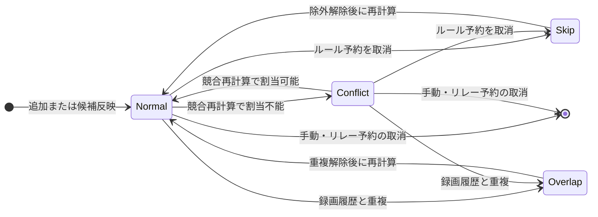
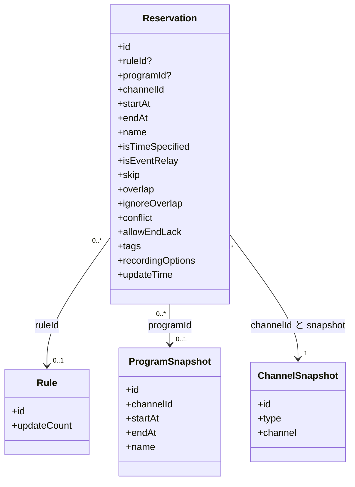
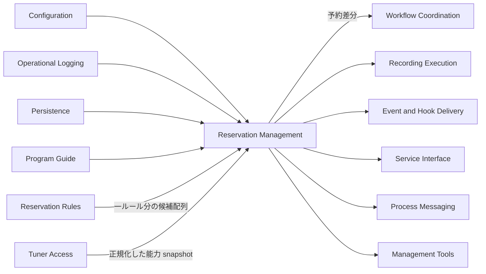
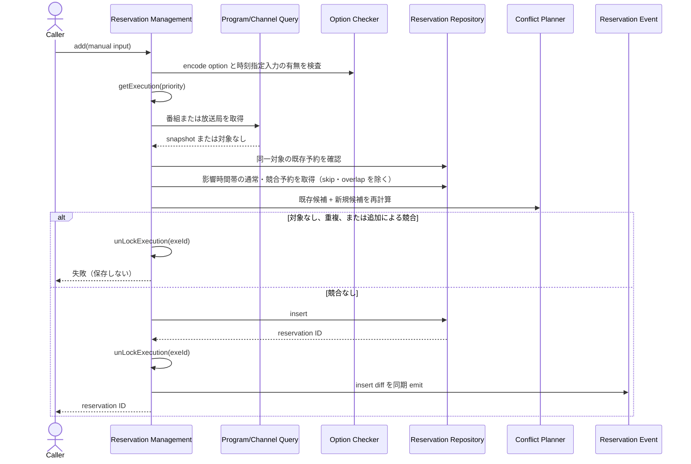
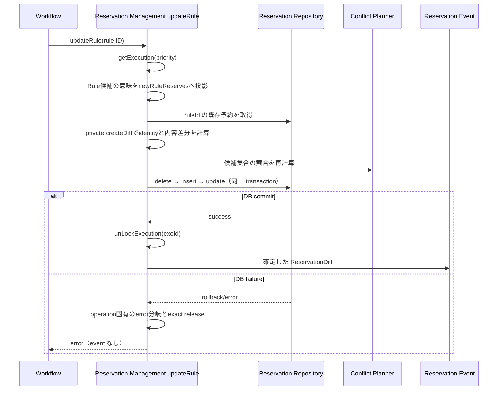
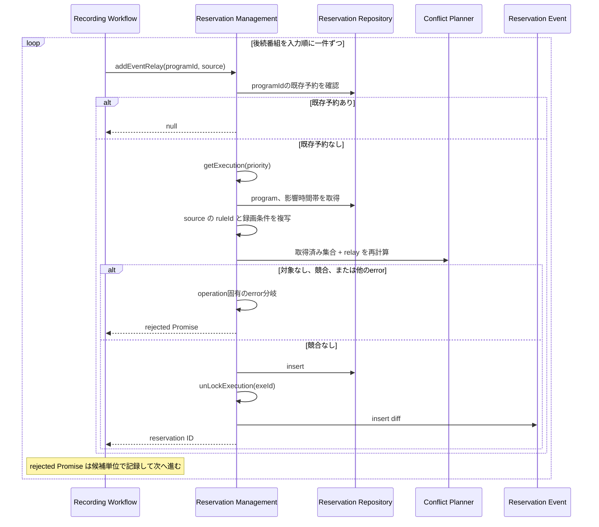
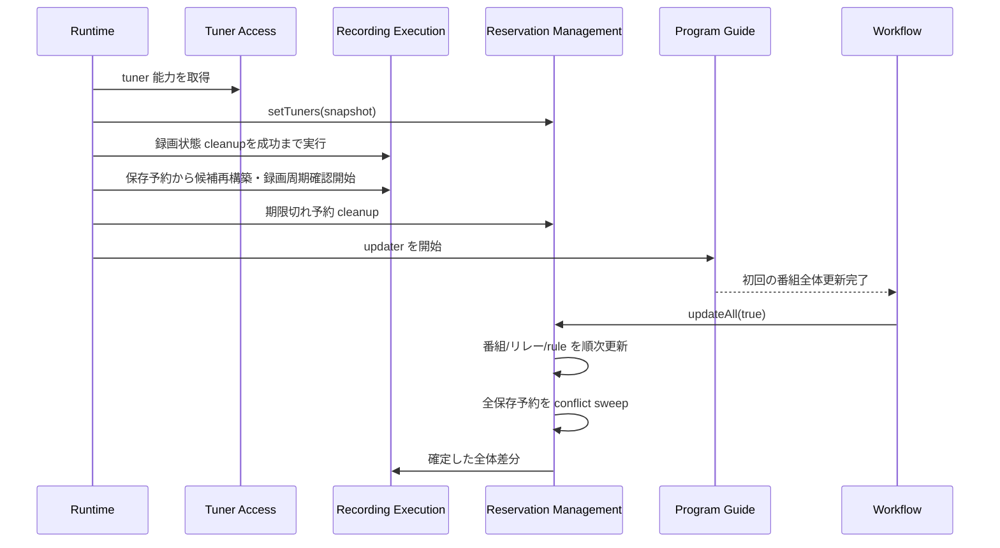
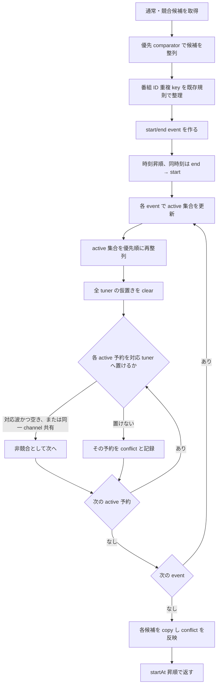

# 録画予約管理機能 設計

## 概要

録画予約管理機能は、番組指定手動予約、時刻指定手動予約、番組リレー予約、および自動予約を一つの予約集合として保存し、予約
の追加・編集・取消、状態変更、ルール候補との差分反映、チューナー競合の計画判定、参照、番組情報への追従、期限切れ整理、お
よび関係機能へ渡す予約差分を管理する。

本機能が管理するのは「録画すべき候補とその計画状態」であり、物理チューナーの選択や録画処理そのものではない。競合判定は保
存済みの生の放送時刻とチューナー能力を用いる事前計画であり、録画マージンを含めず、実際の録画成功を保証しない。

本設計は公開API契約、保存済み予約の意味、処理順序、および予約mutationの排他契約を定義する。本文の各節を現在のtarget
contractとする。また、横断 transaction、永続 queue、自動
retry、exactly-once、event replay、物理チューナー割当、および新しい IPC cancel 意味を追加しない。

### 目的

-   番組指定手動予約、時刻指定手動予約、番組リレー予約、および自動予約を保存・参照する。
-   予約の通常、除外、重複、および競合状態を管理し、録画候補を関係機能へ渡す。
-   自動予約ルールが作った候補を既存予約と照合し、追加・更新・削除へ反映する。
-   同時刻の予約をチューナー能力と既存の優先規則で計画判定する。
-   番組情報更新とサーバー起動後に、保存済み予約を再評価する。
-   database で確定した予約差分を process 内 event として通知する。

### 非目標

-   自動予約ルールの検索条件評価または候補時刻の再解釈
-   番組表の取得・保存、チューナーサーバー REST 通信、物理チューナー選択、録画・エンコード実行
-   録画マージン、録画ファイル名、録画ファイル削除、および HLS 資源の実行時処理
-   reservation mutation と downstream 処理をまたぐ一括 transaction または補償処理
-   既存契約にない deduplication、安定 tie-break、fair queue、domain retry、timeout、idempotency key、ack、再送の追加
-   公開APIのルート、status、field、optional 条件、または response body の変更

## 責任境界

### 本機能が所有する責任

-   一件の予約を識別し、その作成元、対象番組または指定時間帯、放送局、生の開始・終了時刻、および録画条件を保持する。
-   手動予約の入力検査、重複確認、競合確認、追加、編集、および取消を調整する。
-   一つの自動予約ルールについて、渡された候補集合と保存済み予約との差分を求めて反映する。
-   番組リレー予約を元予約の録画条件とルール関連を引き継いで作る。
-   `skip`、`overlap`、`conflict`、`ignoreOverlap` の既存の意味と変更規則を管理する。
-   保存済みの生の放送時刻、放送波、およびチューナー能力から、録画可能性を事前計画する。
-   全予約、状態別予約、ルール別予約、時間範囲別予約、および件数を問い合わせる。
-   番組情報またはルール候補の変化を保存済み予約へ反映し、期限切れ予約を整理する。
-   database で確定した追加・更新・削除を予約差分として process 内 consumer へ通知する。

### 境界外

| 責任                                                   | 所有機能                             | 本機能との境界                                                     |
| ------------------------------------------------------ | ------------------------------------ | ------------------------------------------------------------------ |
| 設定の読込、既定値補完、reload                         | `server-configuration`               | 予約入力検査と保存・エンコード条件の解釈に設定 snapshot を提供する |
| logger sink、level、rotation、flush                    | `server-operational-logging`         | 本機能は結果と error を system logger へ渡す                       |
| DB 接続、driver 差、repository retry、transaction 実装 | `server-persistence`                 | 型付き予約 query と差分更新を利用する                              |
| 番組・放送局の取得、保存、更新時刻                     | `server-program-guide`               | 番組指定予約の対象と変更後情報を提供する                           |
| ルール条件の評価、曜日・時刻の展開                     | `server-reservation-rules`           | 一ルール分の候補配列を、本機能が再解釈せず受け取る                 |
| Mirakurun/mirakc REST 通信と能力正規化                 | `server-tuner-access`                | 放送波と同一チャンネル共有を判定できる能力 snapshot を受け取る     |
| 録画履歴との一致判定                                   | `server-recorded-content`            | 自動予約候補の重複可能性をルール機能経由で受け取る                 |
| 起動、EPG 更新、ルール変更、リレー候補の順序調整       | `server-workflow-coordination`       | 本機能の再評価入口を呼び、差分の downstream 処理を調整する         |
| HTTP、OpenAPI、realtime、IPC carrier                   | service interface、process messaging | 既存の予約 operation と projection を公開する                      |
| 物理チューナー選択、録画開始・終了、録画マージン       | `server-recording-execution`         | 通常・競合の予約候補とその差分を利用する                           |
| 外部 hook と client 通知                               | `server-event-and-hook-delivery`     | process 内予約 event を受けて配送する                              |
| backup、restore、旧版移行                              | `server-management-tools`            | 保存済み予約 row を管理対象に含める                                |

依存方向は次で固定する。録画予約管理から workflow、公開 carrier、外部 hook、または録画実行の具象へ依存しない。

```text
Configuration / Logging / Persistence / Program Guide / Reservation Rules / Tuner Access
    -> Reservation Management
        -> Workflow / Recording Execution / Delivery / Service Interface / Process Messaging
```

## 予約の種類、状態、およびデータ所有

### 予約種類

予約種類は排他的な単一 enum として保存されない。`ruleId`、`isTimeSpecified`、`isEventRelay`、`programId` の組合せから、
業務上の 4 種類を読み分ける。特に時刻指定手動予約は `isTimeSpecified=true` かつ `isEventRelay=true` であ
り、`isEventRelay` 単独を番組リレー予約の判定に使ってはならない。

| 業務上の種類     | 識別条件                                                                     | 必須の対象                          | 作成元と更新                                                     |
| ---------------- | ---------------------------------------------------------------------------- | ----------------------------------- | ---------------------------------------------------------------- |
| 番組指定手動予約 | `ruleId=null`、`isTimeSpecified=false`、`isEventRelay=false`                 | `programId` と番組・放送局 snapshot | 公開/IPC の手動追加。番組更新時に番組 snapshot を追従する        |
| 時刻指定手動予約 | `ruleId=null`、`isTimeSpecified=true`、`isEventRelay=true`、`programId=null` | 放送局、開始、終了、利用者指定名    | 公開/IPC の手動追加。番組情報から時刻・放送局・名称を変更しない  |
| 番組リレー予約   | `isEventRelay=true` かつ `programId` あり                                    | 後続番組と元予約                    | 録画 workflow が追加する。元予約の `ruleId` と録画条件を継承する |
| 自動予約         | `ruleId` あり、`isEventRelay=false`                                          | ルールと候補                        | ルール候補との差分で再生成・更新する                             |

自動予約はさらに二つの下位候補形式を持つ。番組候補形式は `isTimeSpecified=false` かつ `programId` あり、曜日・時刻候補形
式は `isTimeSpecified=true` かつ `programId=null` で、放送局・開始・終了を持つ。これらは別の業務上予約種類ではなく、自動
予約の候補・identity 形式である。この分類は読み取り時の意味付けであり、新しい保存 field や schema discriminator を追加す
る設計ではない。

公開APIの `ReserveItem` は `ruleId`、`programId`、`isTimeSpecified` を投影し、既存公開形式で表現できる manual/rule と
program/time の種類を提供する。保存済み `isEventRelay` は投影せず、relay subtype を新しい公開 field として追加しない。
Requirement 7.4 の「予約種類」は、この既存公開 field で表現できる範囲を指す。

### 保存状態 flag

予約状態は排他的 enum ではなく、`isConflict`、`isSkip`、`isOverlap` の独立した保存 boolean で表す。`isIgnoreOverlap` は
重複状態を無視する利用者指定であり、表示分類そのものではない。database schema は複数の状態 flag が同時に `true` となるこ
とを禁止しないため、保存 flag、公開 query filter、lists/cnts 分類、および録画候補 predicate を同じ契約へ畳み込まない。

| flag              | 規定済み 意味                                 | 主な入口                         |
| ----------------- | --------------------------------------------- | -------------------------------- |
| `isConflict`      | 競合 sweep で tuner 能力へ仮置きできなかった  | 追加・差分・状態解除等の競合計算 |
| `isSkip`          | rule 由来・非リレー予約を録画対象から除外する。同じ番組の他 rule の予約（重複状態を含む）も作らない。解除は同じ番組の他 rule の除外も解除する | 取消 / 除外解除                  |
| `isOverlap`       | 録画履歴との重複として録画対象から除外する    | rule 候補 / 重複解除             |
| `isIgnoreOverlap` | 後の重複判定を無視する利用者指定              | 取消 / 重複解除                  |

### GET filter、lists/cnts precedence、および録画候補

`GET /reserves?type=<state>` の repository filter は排他的な exact flag 組合せを使う。`normal` は
`false/false/false`、`conflict` は `true/false/false`、`skip` は `false/true/false`、`overlap` は `false/false/true` だ
けを返す。複合 flag row は `type=all` には現れるが、状態別 filter のどれにも現れない。`ruleId` があればこの exact state
条件と AND で結合し、find-and-count の `total` も同じ条件へ従う。

一方、`GET /reserves/lists` と `GET /reserves/cnts` は各 row を `conflict > skip > overlap > normal` の precedence で一
分類へ入れる。録画候補 predicate は別に `isSkip || isOverlap` なら除外し、それ以外を含める。したがって `isConflict=true`
でも skip または overlap を同時に持つ row は public lists/cnts では conflict に分類されるが、録画候補にはならない。

| `isConflict` | `isSkip` | `isOverlap` | `GET /reserves` 状態 filter | lists/cnts | 録画候補 |
| ------------ | -------- | ----------- | --------------------------- | ---------- | -------- |
| false        | false    | false       | normal                      | normal     | 含む     |
| false        | false    | true        | overlap                     | overlap    | 除外     |
| false        | true     | false       | skip                        | skip       | 除外     |
| false        | true     | true        | なし                        | skip       | 除外     |
| true         | false    | false       | conflict                    | conflict   | 含む     |
| true         | false    | true        | なし                        | conflict   | 除外     |
| true         | true     | false       | なし                        | conflict   | 除外     |
| true         | true     | true        | なし                        | conflict   | 除外     |

競合 planner も `isSkip || isOverlap` の予約を tuner 仮置きから除外する。複合 flag の扱いは上表を 規定済み
characterization として固定するもので、保存 flag を排他化する望ましい保証ではない。



重複状態のルール予約を取り消す場合、row は重複状態のまま保持し、重複を無視する指定を解除する。上図は単一の主 flag を追う
代表遷移だけを示し、上表の複合 flag を禁止または正規化しない。

### データ所有



-   Reservation row が予約識別、種類 flag、状態 flag、番組・放送局 snapshot、生の放送時刻、録画条件、および `updateTime`
    の正本である。
-   番組と放送局の master は番組情報・番組表機能が所有する。Reservation は予約を再現・参照するために必要な snapshot を保
    持する。
-   Rule row と候補条件は自動予約ルール機能が所有する。本機能は `ruleId` と候補に付随する rule update count を差分照合に
    使う。
-   チューナー能力は保存せず、能力 snapshot を競合計算時に利用する。Reservation row に物理チューナー ID または割当結果を
    保存しない。
-   録画保存先、ファイル名形式、三つのエンコード条件と親保存先・ディレクトリ、元ファイル削除指定は予約に保存するが、パス
    生成とエンコード実行は別機能が所有する。

## 構成と依存関係

### 境界図



自動予約ルール機能と録画予約管理機能の論理的な境界は候補配列である。候補計算と差分反映を同じ coordinator 内で連続して実
行する場合も、条件評価は rules、identity・差分・状態・保存は reservation management の責任として扱う。これは責任の読み方
を定めるもので、新しい public API や永続 model を作るものではない。

### 依存契約

| 依存                       | 方向     | 重要度 | 利用 contract                                                                                              |
| -------------------------- | -------- | ------ | ---------------------------------------------------------------------------------------------------------- |
| Configuration snapshot     | Outbound | P0     | 保存・エンコード option の妥当性と log 抑制設定。constructor snapshot と操作時 snapshot が同一とは限らない |
| System logger              | Outbound | P1     | mutation、差分、個別失敗、cleanup の記録                                                                   |
| Reservation repository     | Outbound | P0     | 一件・一覧・時間範囲・program/rule 指定 query、差分 transaction                                            |
| Program・Channel query     | Outbound | P0     | 手動追加と番組変更追従に必要な master 情報                                                                 |
| Rule candidate port        | Inbound  | P0     | 一ルール分の番組候補または時間帯候補。検索条件を再解釈しない                                               |
| Tuner capability port      | Inbound  | P0     | 放送波と同一チャンネル共有を判断する正規化能力                                                             |
| Reservation event consumer | Outbound | P0     | database 確定後の optional insert/update/delete 差分を process 内 event で渡す                             |
| Query・mutation carrier    | Inbound  | P0     | 公開APIとIPC から既存 operation を呼ぶ                                                                     |

設定値は provider が返す deep-copy snapshot として扱う。予約 manager の構築時に得た設定と、各入力検査時に得る設定が異な
る可能性を契約上許容するため、reload 後の operation がどちらの snapshot を使うかは呼出境界ごとに test する。

## コンポーネントとインターフェース

### コンポーネント一覧

| Component                           | Intent                                                                                | Requirements                                  | 主な依存                                                                                | Contract            |
| ----------------------------------- | ------------------------------------------------------------------------------------- | --------------------------------------------- | --------------------------------------------------------------------------------------- | ------------------- |
| Reservation mutation coordinator    | 手動追加・編集・取消・状態解除を検査し、operation ごとの 規定済み mutation を確定する | 1.1-1.6, 2.1-2.13, 5.1-5.6                    | option checker、program/channel query、repository、必要な operation の conflict planner | Service             |
| Rule reservation reconciler         | 一ルール分の候補集合と保存済み予約の identity・内容差分を作る                         | 3.1-3.5, 5.1, 5.4, 8.1-8.2                    | rule candidate port、repository、conflict planner                                       | Batch               |
| Event relay reservation coordinator | 後続番組を元予約の条件で一件ずつ予約する                                              | 4.1-4.5                                       | program query、repository、conflict planner                                             | Workflow Service    |
| Conflict planner                    | 生の時間区間、放送波、同一チャンネル共有、優先規則から `conflict` を再計算する        | 5.3, 5.5-5.6, 6.1-6.8, 8.2                    | tuner capability、reservation query                                                     | Domain Service      |
| Reservation execution coordinator   | 予約mutationを優先度付きqueueへ登録し、取得後から解放まで一件ずつ安全に実行する       | 2.1-2.13, 3.1-3.5, 4.1-4.5, 5.1-5.6, 8.1-8.18 | process内execution queue                                                                | Service、State      |
| Reservation query service           | 一覧・詳細・時間範囲・状態別 ID と件数を既存 projection へ変換する                    | 7.1-7.7                                       | repository                                                                              | Query Service       |
| Program refresh coordinator         | 呼出しごとに番組指定手動、リレー、rule予約を一件ずつ更新し、最後に全予約を再計画する  | 8.1-8.3, 8.7-8.14                             | program query、rule reconciler、repository                                              | Batch               |
| Expired reservation cleaner         | 終了時刻を過ぎた予約を削除し、重なる残存予約の競合を同じ差分で再計算する              | 8.4-8.5                                       | repository、conflict planner                                                            | Maintenance Service |
| Reservation diff event port         | 確定した optional insert/update/delete を outbound process event として通知する       | 8.5-8.6                                       | workflow、recording、delivery consumer                                                  | Event               |

この分割は機能責任を示す論理構成である。複数の責任は一つの management model に置かれているため、class 分割済みとはみなさ
ない。実装を分割する場合も public/IPC wire と処理順序を変えない。

### 操作インターフェース

次は既存 operation を機能境界として表した概念 interface である。新しい公開 TypeScript package または wire contract を要
求しない。

```typescript
type ReservationExecutionId = number; // production: 1..Number.MAX_SAFE_INTEGER

interface ReservationExecutionCoordinator {
    getExecution(priority: number, timeoutMs?: number): Promise<ReservationExecutionId>;
    unLockExecution(id: ReservationExecutionId): void;
}

interface ReservationCommandService {
    add(option: ManualReservationInput): Promise<ReservationId>;
    edit(reservationId: ReservationId, option: EditManualReservationInput): Promise<void>;
    cancel(reservationId: ReservationId): Promise<void>;
    removeSkip(reservationId: ReservationId): Promise<void>;
    removeOverlap(reservationId: ReservationId): Promise<void>;
    addEventRelay(programId: ProgramId, source: Reservation): Promise<ReservationId | null>;
    update(reservationId: ReservationId, suppressLog: boolean): Promise<void>;
    updateRule(ruleId: RuleId, suppressLog: boolean): Promise<void>;
    updateAll(firstProgramGuideUpdate: boolean): Promise<void>;
    cleanup(): Promise<void>;
}

interface ReservationPlanningService {
    setTuners(tuners: readonly TunerCapability[]): void;
    recalculate(reservations: readonly Reservation[]): ReservationConflictChange[];
}

interface ReservationQueryService {
    get(reservationId: ReservationId): Promise<Reservation | null>;
    list(option: ReservationListOption): Promise<{ reservations: Reservation[]; total: number }>;
    listByTimeRange(startAt: EpochMilliseconds, endAt: EpochMilliseconds): Promise<Reservation[]>;
    countByState(): Promise<ReservationStateCounts>;
    countByRuleIds(ruleIds: readonly RuleId[], state: ReservationStateFilter): Promise<readonly RuleReservationCount[]>;
}
```

この概念 interface の名前と実装の名前は次のとおり対応する。本 design の `ignoreOverlap`・`skip`・`overlap`・`conflict` は、保存する field では `isIgnoreOverlap`・`isSkip`・`isOverlap`・`isConflict` である。

| 概念 interface での名前                                      | 実装での名前                                                                                   |
| ------------------------------------------------------------ | ---------------------------------------------------------------------------------------------- |
| `ReservationDiff`                                            | `IReserveUpdateValues`（event へ渡す差分）、`ReserveDiffData`（`ReservationManageModel` 内の作業用の型） |
| `applyDiff(diff)`                                            | `reserveDB.updateMany(diff)`                                                                   |
| `updateAll(firstProgramGuideUpdate)`                         | `updateAll(isFirstUpdate?)`                                                                    |
| `Reservation`、`ReservationId`                               | `Reserve`（`src/db/entities/Reserve.ts`）、`ReserveId`                                         |
| `suppressLog`                                                | `isSuppressLog`                                                                                |
| `ignoreOverlap`・`skip`・`overlap`・`conflict`               | `isIgnoreOverlap`・`isSkip`・`isOverlap`・`isConflict`                                         |

-   `getExecution` の待機期限は省略時60,000 msであり、取得後に行う情報読取またはmutationの処理時間上限ではない。
-   実行権の取得後には別の600,000 ms owner watchdogを開始する。通常の成功、失敗、同期例外、または早期returnが先なら
    `finally`でexact IDを解放する。watchdogが先なら取消不能なDB処理を終了済みとみなさず、exact IDを`overdue`として記録し
    て同じqueueの後続処理を開始しない。これは予約管理laneだけの監視境界であり、operator fatal gate、process終了、進行中
    の録画、配信、番組情報更新、保存先監視、または当該laneを使わない問い合わせの停止へ接続しない。
-   queueはpriority降順で要求を先にし、同じpriorityでは既に待っている要求の後ろへ追加する（同priority内FIFO）。entry IDは
    `1..Number.MAX_SAFE_INTEGER`の可搬な安全整数counterから割り当てる。最大値の次は1へwrapし、現在ownerと
    `waiting/granted/overdue` entryが使用中の候補を同期的に飛ばして、実際に未使用のIDだけを予約する。解放済み・期限切れ
    IDは再利用できる。全候補が使用中ならrequest objectをID未割当の`allocating`としてpriority降順、同priority受付順
    （同priority内FIFO）のallocation-waitへ置く。releaseまたは`waiting` entryの期限到達でIDが未使用になったときは、
    pollingなしでこの優先順から再走査し、最初の未使用IDを割り当てて`waiting`へ進める。受付時に開始した元の取得期限は
    allocation-wait中も延長せず、期限到達時はobject identityで除外して失敗させる。これは一時的な待機であり、固定長上限を
    恒久的な受付停止へ変換しない。時刻または乱数をID生成に使わない。production最大値は固定し、縮小maxの注入はtest
    harnessだけに許す。
-   一つのrequest lifecycleはID割当前の`allocating`、ID割当後の`waiting`、`granted`、`overdue`、`expired`、`released` か
    らなる。付与、期限到達、解放は同じrequestに対する最初の有効な状態遷移だけを採用する。期限切れ時はallocation-waitまた
    はexecution queueからreject前に除外し、後からIDや実行権を渡さない。有効遷移は
    `allocating→waiting→granted→released`、`granted→overdue→released`、`allocating|waiting→expired`だけである。
-   operationは実行権を取得してから、必要なdatabase read、競合計算、およびwriteを行う。情報読取前に実行権を解放して再取
    得する段階、保存状態のsnapshot/CAS、世代・fence、同一readの共有はない。
-   `unLockExecution(id)`は現在のlock IDと一致する未解放ownerだけを一回解放し、その後に次の有効なentryへ実行権を渡す。実
    行権を取得したoperationは成功、失敗、同期例外、および早期returnを覆う`finally`から同じIDを一回だけ解放する。非owner
    IDまたは二重解放は現在のownerを変更しない。
-   database を確定した通常の成功経路は `database 確定 → 実行権解放 → event` の順序を保つ。通常の失敗、同期例外、および
    早期returnも共通`finally`で解放する。owner watchdog後に元operationが確定した場合も、同じ確定結果から通常の
    catch/finally/event順序へ一回だけ進み、exact IDを解放して`overdue`を解除する。database readまたはmutationを再実行せ
    ず、別IDから後着結果を解放根拠にしない。
-   利用者起点の`add`、`edit`、`cancel`、`removeSkip`、`removeOverlap`、`addEventRelay`はcallごとに別の実行権要求と返却
    Promiseを持ち、同じ予約IDや同値入力でも一回へまとめない。
-   execution coordinatorのDI bindingはtransientである。reservation managerはencoding、録画path選択、配信sessionとは別の
    process内queueを持ち、機能間でpriorityや待機順を共有しない。

-   `add` は最初に encode option と時刻指定入力の有無を検査し、実行権取得後に番組指定または時刻指定を入力の既存
    discriminatorで判定する。対象確認、重複確認、競合入力取得、保存を同じ実行権の内側で行い、解放後にeventを発行する。共
    通 `IReserveOptionChecker` へ委譲する手動 option 検査は encode option だけで、保存先・tag・途中終了許可の妥当性を検
    査しない。追加では、この encode option の検査結果と、program ID がない追加で `timeSpecifiedOption` が存在するかの確認
    のどちらか一方でも失敗すれば、実行権取得前に `AddReservationOptionError` で失敗する。これらより先に、保存先内ディレク
    トリ（`saveOption.directory`）と各encode出力先ディレクトリ（`encodeOption.directory1`〜`directory3`）が録画保存先の外
    を指さないことを共通関数`isSubDirectoryInsideRoot()`で検査し、外を指す指定は実行権取得前に`InvalidSubDirectory`で失敗す
    る（`server-recording-execution`の設計6.7.2）。
-   `edit` は保存rowが番組指定手動、時刻指定手動、または手動由来の番組リレーのpredicateを満たすことをfield変更前に検査し、
    rule予約とrule由来の番組リレー予約を拒否する。
-   `edit`の入力・encode option検査は`getExecution`より前に完了する。不正入力は実行権取得0回、解放0回、DB read/write 0回
    で失敗する。実行権取得後のrow取得、manual predicate拒否、同期throw、repository reject、早期returnだけを共通
    `finally`でexact ID一回解放の対象にする。
-   `edit` は保存 row を直接更新し、conflict planner を呼ばず競合状態を再計算しない。編集項目は時間帯を変更しないため、
    この source behavior を編集後の一般的競合再計算保証へ読み替えない。
-   `cancel` は対象の種類と状態により row 削除または状態変更を選ぶ。
-   `addEventRelay` の 入力契約は `programId` と元 `Reservation`、結果は `Promise<ReservationId | null>` である。重複時
    だけ `null` を返し、番組取得、競合、DB 等の失敗は reject する。内部 program query adapter が `programId` を
    `Program` snapshot へ解決する。
-   `updateRule` は候補の業務意味を自動予約ルール機能に従わせ、同じreservation coordinator内でそれを`newRuleReserves`へ
    投影する。本機能はその配列のidentity、差分、state、競合、保存、およびeventを扱う。
-   IPC の `updateAll(isUntilComplete=false)` は public/IPC carrier から完了待ちされない経路がある。operation の受理と
    batch 完了を同じ意味にしない。
-   `updateAll`はcallごとに対象ID列を読み取り、三つのloopを別々に実行する。同時に呼ばれた`updateAll`を合流せず、各itemが
    予約用execution queueで実行権を取得するため、複数callのitemが境界ごとに入り交じる場合がある。
-   `setTuners` は起動時に一度だけ同期的に能力 snapshot と放送波状態を設定する。databaseの読取・保存、予約再計画、差分通
    知、および後続snapshotの動的反映は行わない。

### 予約候補と差分インターフェース

```typescript
interface ReservationDiff {
    insert?: Reservation[];
    update?: Reservation[];
    delete?: Reservation[];
    isSuppressLog: boolean;
}
```

-   自動予約ルール機能は候補の業務意味を所有する。実行時の候補から差分へのhandoffは、`updateRule()`が同じcoordinatorを
    取得したまま作る`newRuleReserves: Reserve[]`から、同じinstanceのprivate `createDiff()`を呼ぶ一点である。空配列は
    無効化・削除されたRuleの既存非リレー予約を削除する入力となる。
-   時刻ルールの放送局取得で個別失敗が起きた場合、取得できた放送局だけで作る`newRuleReserves`を全置換入力として扱う。
    完全性flagはなく、取得できなかった放送局の既存予約は削除差分になり得る。
-   番組候補 identity は `ruleId + programId`、時刻候補 identity は `ruleId + startAt + endAt + channel` である。本機能は
    このidentityで既存rowと対応付け、候補の検索条件や時刻を再評価しない。
-   この内部handoffのために別候補型、consumer port、reconcile API、test専用 adapter、追加のcomposition、database table、
    public serialization、IPC、またはHTTP contractを追加しない。
-   `ReservationDiff` は database へ適用する差分と、確定後に event consumer へ渡す差分で同じ三分類を使
    う。`insert`、`update`、`delete` はそれぞれ optional であり、型は一つ以上の分類が存在することを強制しない。event
    payload に durable sequence、ack、再送、または exactly-once の意味を持たせない。

候補の業務意味から`newRuleReserves`への投影は次の一意な対応を使う。

| Rule候補の業務意味                                         | `newRuleReserves`への投影                                                                                |
| --------------------------------------------------------- | --------------------------------------------------------------------------------------------------------- |
| Rule ID、内部更新count                                     | 同名の予約fieldへ保存する                                                                                 |
| 評価時刻                                                   | 予約の`updateTime`へ保存する                                                                              |
| 放送局、開始・終了                                         | 同名の対象・時間fieldへ保存する                                                                           |
| 番組候補の番組snapshot                                     | `programId`、`programUpdateTime`、名称、説明、拡張、ジャンル、映像、音声の同名fieldへ保存する             |
| 時間候補の番組なし、表示名、半角表示名                     | `isTimeSpecified=true`とし、番組fieldを持たない時刻指定予約へ保存する                                     |
| 途中終了許可、tags                                         | 途中終了許可とJSON文字列化したtagへ保存する                                                               |
| 保存先・encode条件                                         | 既存の保存先・ファイル名・最大3組のencode fieldへ投影する                                                 |
| 録画履歴照合による重複可能性                               | 番組候補の新規重複状態へ使う。既存同一identityが`isIgnoreOverlap=true`なら既存`isOverlap`を保持する       |

番組candidateは`isTimeSpecified=false`、時間candidateは`isTimeSpecified=true`とする。既存同一identityがある場合は
`isSkip`と`isIgnoreOverlap`を引き継ぐ。いずれかのRuleの予約が除外状態の番組は、他Ruleのcandidateを（重複状態を含めて）予約へ反映せず、保存済みの予約は差分で削除する。番組candidateの`isOverlap`は、`isIgnoreOverlap=true`なら既存値、それ以外は
`possibleDuplicate`を使う。時間candidateは新規時をfalseとし、既存同一identityでは既存`isOverlap`をそのまま引き継ぐ。
`isConflict`はcandidateから受け取らず、他予約とtuner能力を含む本機能の競合計画で決定する。

### 永続化・参照インターフェース

```typescript
interface ReservationRepository {
    insert(reservation: Reservation): Promise<ReservationId>;
    update(reservation: Reservation): Promise<void>;
    applyDiff(diff: ReservationDiff): Promise<void>;
    findById(reservationId: ReservationId): Promise<Reservation | null>;
    findAll(option: ReservationListOption): Promise<[Reservation[], number]>;
    findByProgramId(programId: ProgramId): Promise<Reservation[]>;
    findByRuleId(ruleId: RuleId): Promise<Reservation[]>;
    findByTimeRange(startAt: EpochMilliseconds, endAt: EpochMilliseconds): Promise<Reservation[]>;
    findExpired(before: EpochMilliseconds): Promise<Reservation[]>;
    findTimeSpecifiedManualIds(): Promise<ReservationId[]>;
    countByRuleIds(ruleIds: readonly RuleId[], state: ReservationStateFilter): Promise<readonly RuleReservationCount[]>;
}
```

-   `ReservationStateFilter`は自動予約ルール機能が所有する `'all' | 'normal' | 'conflict' | 'skip' | 'overlap'`の内部
    contractをそのまま使用し、公開queryの`type`を変更しない。
-   `applyDiff` は同じ database transaction 内で delete、insert、update の順に適用し、失敗時は database transaction を
    rollback する。
-   repository の通常操作には persistence 層の既存 retry が適用され得る。本機能はその上に domain retry を重ねない。
-   rollback は database の atomicity を表す。insert 前に process 内 object へ採番 ID が設定された場合、その object
    mutation まで rollback されるとはみなさない。
-   時間範囲 query は用途によって既存の端点条件が異なる。競合の最終判定は必ず本機能の半開区間 sweep で行い、query が返し
    た集合だけから端点の意味を推定しない。
-   一覧 projection は persistence entity をそのまま公開せず、公開APIの既存 field と optional 条件へ変換する。

## 処理フロー

### 手動予約の追加



#### 番組指定手動予約

1. `programId` から公開済み番組と放送局 snapshot を取得する。いずれかが存在しなければ追加しない。
2. 同じ `programId` を持つ予約が一件でも存在すれば追加しない。確認範囲は手動予約だけではなく、同じ番組の rule 予約または
   リレー予約も含む。
3. 番組の名称、説明、放送局、生の開始・終了時刻、および既存の番組属性を予約 snapshot へ複写する。
4. `ruleId=null`、`isTimeSpecified=false`、`isEventRelay=false` とし、録画条件を入力から設定する。
5. `hasSkip=false`、`hasOverlap=false` で得た既存の通常・競合予約へ新規予約を加えて競合を計算する。保存済み `isConflict`
   を除外条件にしないので、優先順が新規予約より上の既存の競合予約も、チューナーに入る区間ではチューナーを使うものとして
   数える。計算の結果、新規予約が競合になる場合と、保存済み `isConflict=false` の既存予約が競合になる場合は保存しない。保
   存済み `isConflict=true` の既存予約が競合のままであることは拒否の理由にしない。これにより、別の放送波の競合や、新規予
   約の開始時刻ちょうどに終わる競合のように、新規予約と関係の無い既存の競合では追加を拒否しない。時間帯の照会は
   `endAt >= 新規のstartAt` かつ `startAt < 新規のendAt` で、新規予約の開始時刻ちょうどに終わる予約も取得するが、競合の
   計算は同じ時刻の終了を開始より先に処理するので、その予約は新規予約と重ならない。
6. insert 成功後に reservation insert diff を emit する。

#### 時刻指定手動予約

1. `channelId` から放送局 snapshot を取得し、存在しなければ追加しない。
2. `startAt < endAt` であり、終了時刻が要求時点より後であることを保存前に検査する。成立しなければ追加しない。
3. 同じ `channelId + startAt + endAt` で `ruleId=null` の予約があれば追加しない。
4. 利用者指定名を保存し、`ruleId=null`、`programId=null`、`isTimeSpecified=true`、`isEventRelay=true` とする。
5. 番組指定と同じく、skip・overlap だけを除外した通常・競合予約の全体で競合事前確認を行う。
6. insert 成功後に reservation insert diff を emit する。

共通 option checker が手動入力について検査するのは encode option だけである。local checker は program ID がない追加につ
いて `timeSpecifiedOption` の存在も見る。追加ではこの二つのどちらか一方でも失敗すれば、実行権取得前に
`AddReservationOptionError` で失敗する（要件 2.13）。保存先、tag、途中終了許可を共通 checker が検査済みとも扱わない。

### 手動予約の編集

編集は入力とencode optionと保存先内ディレクトリを先に検査し、成立した場合だけ実行権を取得する。不正入力（保存先の外を指
すディレクトリを含む）では取得0回・解放0回・DB効果0件とし、保存先の外を指すディレクトリは`InvalidSubDirectory`で失敗す
る。
取得後に保存済みreservationを読み、その実行権を保持したまま次の規則で更新する。read前の解放、再取得、保存rowのCASは行わ
ない。

| 入力                   | 更新規則                                                                                      |
| ---------------------- | --------------------------------------------------------------------------------------------- |
| `allowEndLack`         | 入力値で更新する                                                                              |
| `tags`                 | 入力に含まれる場合だけ更新し、省略時は保存値を維持する                                        |
| 保存先 group あり      | 指定項目を設定し、group 内で省略された親保存先・ディレクトリ・形式を解除する                  |
| 保存先 group 全体なし  | 親保存先・ディレクトリ・形式をすべて解除する                                                  |
| encode group あり      | 指定された各 encode 条件を設定し、group 内で省略された mode・親保存先・ディレクトリを解除する |
| encode group 全体なし  | 三つの encode 条件を解除し、元ファイル削除を `false` にする                                   |
| 時刻指定手動予約の名称 | 保存済み利用者指定名を維持する                                                                |
| `updateTime`           | 編集を受理して保存する時点の clock 値へ更新する                                               |

編集は option 検査後に対象 row を取得し、次のexact predicateのいずれかだけを受理する。

-   番組指定手動予約: `ruleId === null && isTimeSpecified === false && isEventRelay === false && programId !== null`
-   時刻指定手動予約: `ruleId === null && isTimeSpecified === true && isEventRelay === true && programId === null`
-   手動由来の番組リレー予約: `ruleId === null && isTimeSpecified === false && isEventRelay === true && programId !== null`

Requirement 2.6 の「手動予約」は、上記三つの保存 field predicate を満たす row を指す。前の二つは手動追加が保存する row の
形である（時刻指定手動予約は追加時に`isEventRelay = true`で保存される）。手動由来の番組リレー予約は、手動予約の録画中に
番組が別の放送へ続くとき、親の手動予約の`ruleId`（`null`）と録画条件を写して作られる手動予約の続きである。番組更新でも
保存rowを基に番組情報だけを更新するため、編集した録画条件は維持される。一覧・詳細の公開形式は番組指定手動予約と区別しな
いため、利用者は番組指定手動予約と同じ入口から編集する。

番組自動予約、時刻自動予約、およびrule由来の番組リレー予約はfieldを変更せず拒否する。自動予約はRuleの再評価で候補から
作り直され、番組情報の更新、Ruleの更新回数の変化、または除外・競合・重複状態の変化で差分になった時点で、録画条件をRule
の設定で上書きされる（時刻自動予約は起動時の初回更新でも上書きされる）。編集を受理しても保たれないため、これらの録画条件
はRuleの編集で変える。rule由来の番組リレー予約はRuleの再評価の対象外だが、公開形式でRule IDを持ち、Ruleの予約として表示
され、編集の入口はRuleの編集である。手動予約の編集の対象には含めない。これらの拒否は`ReservationIsNotEditable`で失敗し、
入力・encode option不正の`ReservationEditError`と区別する（HTTP では409へ写す。`server-service-interface`の設計8.1）。受理した
rowのfieldと`updateTime`を変更し、`updateOnce`を完了し、排他を解放してから、そのrowだけを持つupdate diffをemitする。
conflict planner、時間範囲query、または競合再計算は呼ばない。入力・encode option不正は取得
前に拒否するため取得・解放とも0回である。取得後のrow read/reject/throw/early returnだけは共通`finally`からexact IDを一回
解放する。

### 取消、除外解除、および重複解除

取消は reservation の作成元と番組リレー flag により結果が異なる。

| 対象                                | 取消結果                                       | row      |
| ----------------------------------- | ---------------------------------------------- | -------- |
| 番組指定・時刻指定手動予約          | 削除                                           | 削除する |
| 番組リレー予約                      | 削除                                           | 削除する |
| rule 由来、非リレー、通常または競合 | `skip=true`、`conflict=false`                  | 保持する |
| rule 由来、非リレー、重複           | `overlap=true` を維持し、`ignoreOverlap=false` | 保持する |

取消は次の一順序で処理する。

1. 対象 row を再取得し、削除または状態変更を加えた新旧集合と、影響時間帯の残存予約から競合結果を計算する。
2. 一つの差分について database の delete / insert / update を commit する。
3. process 内排他を解放する。
4. 確定した一つの `ReservationDiff` を一回 emit する。

競合計算と database commit の間や、排他解放前に差分を emit しない。

-   rule 由来の取消で除外状態にした番組は、同じ差分で、同じ番組の他 rule の予約（重複状態を含む）も削除する。次の
    `updateRule`・`updateAll` を待たずに、解除できる行や有効な行が残らない。
-   除外解除は `skip=false` とし、対象と影響範囲の競合を再計算する。同じ番組の他 rule の除外状態の予約も一緒に解除する。
-   重複解除は `ignoreOverlap=true`、`overlap=false` とし、対象と影響範囲の競合を再計算する。
-   録画履歴との重複確認で rule 予約を重複とする場合は `overlap=true` にする。手動予約を同じ規則で重複状態へ移す設計では
    ない。
-   状態変更は row の削除とは別の update diff で通知する。

### 自動予約候補の差分反映



#### Identity

-   番組候補: `programId + ruleId`
-   時刻候補: `startAt + endAt + channel + ruleId`

identity が一致する既存予約と候補は内容を比較して update または変更なしとする。候補だけに存在するものを insert、既存だけ
に存在する非リレー予約を delete とする。リレー予約は元 rule との関連を持っていても通常の rule 候補置換で消さない。

#### 内容差分

番組候補は番組 snapshot、rule update count、録画条件、および重複可能性を比較する。時刻候補は時間帯、放送局、rule update
count、および録画条件を比較する。初回の番組全体置換では番組更新時刻の変化を反映し、初回の時刻 rule 更新では既存 rule
update count を差分扱いにして downstream 更新を発生させる。

無効化または削除された rule は候補配列が空になり、保存済みの非リレー rule 予約が削除候補となる。ruleId で得た row に終了
済みが含まれていれば、それも同じ差分で削除し得る。

候補配列を正本として扱うため、一部の時刻 rule 用 channel 取得に失敗して候補が欠落した場合でも、取得できた不完全な配列が
authoritative な全置換入力になり、失敗した channel の既存予約が削除され得る。処理は個別 error を log して継続するが、完
全性 flag、失敗 channel の既存予約だけを保護する仕組み、または完全な snapshot まで差分を保留する仕組みはない。

競合計算結果を保存差分へ変換するときは、`ruleId` の有無にかかわらず old/new の `isConflict`、`isSkip`、`isOverlap` を比
較し、時刻指定手動予約の conflict-only 変更も update diff へ含める。

### 番組リレー予約

番組リレー候補は録画 workflow が元予約と後続 `programId` を組にして本機能へ渡す。複数候補を受けた workflow は入力順に一
件ずつ `await` し、duplicate の `null` はそのまま次へ進み、rejection は候補単位で記録して次へ進む。結果収集、retry、また
は一括 transaction は行わない。



リレー予約は `programId` を入力として内部 program query adapter で番組 snapshot を解決する。元予約から `ruleId`、途中終
了許可、保存先、ファイル名形式、三つのエンコード条件、元ファイル削除、タグを引き継ぎ、後続番組の番組・放送局・時刻
snapshot を使う。同じ後続 `programId` の予約があれば追加せず `null` を返す。番組取得、競合、DB 等の failure は reject す
る。

複数候補を処理する `EventSetter` は入力順に各 Promise を `await` する。予約管理は実行権取得前に同じ後続`programId`の予約
を照会し、存在すれば`null`を返す。実行権取得後に番組、競合入力を読み取って保存するが、保存直前に同じ`programId`を再照会
しない。競合事前確認はskip・overlapだけを除外し、既存のconflict予約を含めて競合計画する。拒否の条件は手動追加と同じで、
新規予約が競合になる場合と、保存済みで競合でない既存予約が競合になる場合だけである。保存済みのconflict予約が競合のまま
であることでは拒否しない。rejectはworkflowが`event relay failed`としてlogに記録し、残候補へ進む。result collectionと自動retryは行わない。

### 番組情報更新と全体再評価

`update(reservationId)` は対象 reservation が参照する番組を使い、番組指定手動予約、番組リレー予約、または番組自動予約を
再評価する。保存済み番組が見つからない場合、その予約 row を削除せず変更なしで保持し、差分 event も発行しない。

`updateAll(firstProgramGuideUpdate)` はcallごとに次の集合を列挙して、記載順に一件ずつ処理する。全体を一つのtransactionま
たは排他区間にせず、同時に呼ばれた別の`updateAll`と合流しない。

1. `getManualIds({ hasTimeReserve: false })` が返す、番組指定手動予約と手動由来の番組リレー予約の ID
2. `getRuleEventRelayIds()` が返す、rule 由来の番組リレー予約の ID
3. 保存済み rule の ID

各itemは予約用execution queueから実行権を取得し、その実行権を保持したまま番組・rule・履歴・予約を読み、差分適用または処
理別の失敗箇所まで進む。現在itemのPromiseがsettleしてから10ms待って次のitemを開始し、全itemを同時に開始しない。個別item
のfailureはlogして次itemへ進む。read開始前のsnapshot、read中の実行権解放、再取得後のCAS、同一readの共有は行わない。

全itemを逐次settleした後だけ、保存済みの全予約を再読込し、skip・overlapを除く通常・競合予約を一回のconflict sweepへ渡
す。`ruleId=null`の時刻指定手動予約も比較対象に含め、conflict-onlyの変更をupdate diffとして生成する。開始時のID snapshot
後に発生したmutationと一つのtransactionを構成せず、途中まで成功した処理をrollbackしない。現在の一件間10 ms yieldは維持
し、並列数を指定する設定やeager fan-outへ置き換えない。

batch実行中に後続の`updateAll`要求を受けた場合も、そのcallは自身の対象ID列を読み取って別batchを開始する。各itemは同じ予
約用execution queueで一件ずつ実行権を得るため、二つのbatchがitem境界で交互に進む場合がある。各callのPromiseは自身のbatch
が終了した時点で個別にsettleする。

public/IPC の「予約情報の更新開始」は IPC の `updateAll(isUntilComplete=false)` の受理後に応答し、全 item の完了を待たな
い既存経路がある。その応答を更新完了通知として扱わない。

### 起動時の再評価



予約用の process 内排他 queue、実行中 operation、未配送 event は再起動時に復元しない。保存済み row が再評価の正本であ
る。

初回 `updateAll(true)` の最後に全保存予約を conflict sweep し、時刻指定手動予約を含む確定差分と保存済みの全予約（通常・競合・
skip・overlap を含む）の snapshot を録画実行へ渡す。これにより isolated/overlapping を問わず、保存済み予約から競合状態と録画候補を再構築する。

この snapshot は録画実行が録画候補と時刻指定手動予約の timer を組み直すための入力であり、予約の変更として扱わない。外部
連携（予約変更コマンドなど）へ渡す予約差分は、番組指定手動予約・番組リレー予約・rule ごとの更新が確定した差分だけであ
り、再構築のために全予約を送り直した分（`update` に全予約を入れた差分）の `update` は含めない。この差分の `insert` と
`delete` は、conflict sweep が確定した追加・削除として外部連携へ渡す。起動時の conflict sweep が競合状態だけを
変えた予約は、この送り直しに含まれて録画実行へ渡り、外部連携へは渡らない。送り直しによって、同じ予約について外部 command
が重ねて実行されることはない（rule ごとの更新は時間帯の重なる他の予約も再計算するため、同じ予約が複数の rule の差分に入る
ことはあり、その分は差分ごとに渡る）。

## 競合判定

### 時間区間と対象集合

競合計画は Reservation に保存された `startAt` と `endAt` をそのまま使う。録画開始前・終了後マージン、外部 command の準備
時間、実録画開始時刻、またはファイル処理時間は含めない。

時間区間は `[startAt, endAt)` の半開区間として扱う。同一時刻では終了 event を開始 event より先に処理するため、予約 A の
`endAt` と予約 B の `startAt` が等しい場合は競合しない。

repository の時間範囲候補 query には、終了端を含めて余分な row を返す用途がある。一覧用 query も両端を含む。これらは候補
集合の取得条件であり、最終的な競合意味は半開区間 sweep が決める。

`skip=true` または `overlap=true` の予約は録画候補から除外し、チューナーを消費しない。通常・競合予約は再計算対象とし、以
前の `conflict` 値を正本にせず計算結果で更新する。

### チャンネル共有と必要チューナー数

一つのチューナー能力は対応放送波の予約を受け入れる。すでにそのチューナーへ同時刻の予約を置いた場合、保存済み `channel`
文字列が同じ予約だけを追加で共有できる。したがって同一チャンネルの同時予約本数には、この計画上の追加上限を設けない。

計画に使うのは各チューナーの対応放送波と同一 `channel` だけである。チューナーの availability、fault、現在の busy 状態、
優先機、個体 ID、および実際の tuner process は考慮しない。利用可能な能力が一件もなければ、すべての通常候補を競合とする。

物理チューナーへの具体的な割当は一回の sweep 内の仮置きであり、結果には `conflict` だけを残す。どの物理チューナーを使う
かを Reservation row または event に保存しない。

### 優先順位

同時刻に競合する候補は次の comparator で並べ、先に扱う予約へ能力を仮置きする。

1. `ruleId=null` の手動予約を rule 関連予約より先にする。
2. 手動予約同士では `isTimeSpecified=true` を先にする。これにより時刻指定手動予約が番組指定手動予約より先になる。
3. 同じ手動種類では `updateTime` の小さい予約を先にする。
4. rule 関連予約同士では `ruleId` の小さい予約を先にする。
5. 上記が同じ場合、comparator は `0` を返す。reservation ID などの追加 tie-break はない。

手動予約の `updateTime` は作成時と編集の保存成功時に更新する。同じ手動種類では最終更新時刻が早い予約を先に扱う。同値時の
順序を安定 ID 順とみなさない。

番組 ID の重複を sweep 前に除外する既存処理がある。手動予約は `programId` だけを key とし、rule 予約は
`programId + conflict + overlap + skip` を key として、rule ID を key に含めない。ただし除外状態または重複状態の rule 予約は rule ID を
key に含める（後述）。その結果、同じ番組・同じ状態の複数の通常・競合の rule 予約のうち一件だけが sweep event に残り得る。この処理は候補差分の identity とは別であり、一般的な予約 dedupe 契約へ
拡張しない。

自動予約ルールの予約の除外は番組単位で扱う。除外状態の rule 予約がある番組については、他の rule の除外状態でない rule 予約（有効・
重複を問わず、番組リレー予約を除く）を、`updateRule`・`cancel` など予約の差分計算（`createDiff`）の入力から外し、保存済みのものは差分で削除する。`updateAll` は各 rule の `updateRule` でこの判定を行い、最後の競合再計算では行わない。`updateRule` は他の rule の除外状態の予約（重複状態と併存するものを含む）も読んでこの判定に使う。
除外状態の予約を持つ rule の削除・無効化では、その除外状態も残らず、次の `updateRule`・`updateAll` で同じ番組が他の rule の候補に戻る。
`removeSkip` は除外状態の解除も番組単位で行い、同じ番組の他 rule の除外状態の予約（番組リレー予約を除く）も一緒に解除する。解除した行のうち有効な予約は重複の畳み込みで一件になる。
手動予約と番組リレー予約は対象にしない。除外状態または重複状態の rule 予約は rule ID を key に含め、別 rule の同じ状態の予約を畳み込まずに残す。

### 判定アルゴリズム



各 event 時点で tuner 仮置きを全消去し、その時点の active 集合を最初から評価する。ある時点で一度でも割当不能となった予約
は結果 map に競合として残る。競合でないことは、その生の放送区間で能力上の仮置きが可能だったことだけを意味する。

予約追加、取消、除外解除、重複解除、rule 差分、番組更新、および cleanup は影響集合を planner へ渡す。`updateAll` と起動
時再評価は全保存予約を sweep する。手動 edit は予約の時刻・対象を変更しないため planner を呼ばない。

## 整合性、並行実行、および通知順序

### 排他制御

予約 mutation は process 内の execution coordinator に operation と優先度を登録し、実行権を取得してから対象予約、番組、
rule、競合対象を読み取り、database処理後の各operationの明示箇所まで同じ実行権を保持する。取消、除外解除、重複解除、編集
は追加・更新より高い既存優先値を持つ。同じpriorityのentryは受付順だが、queue全体の公平性やstarvation防止は保証しない。

execution coordinator の取得待ち期限は既定60秒である。期限切れ時は待機timerとlistenerを解除し、entryをqueueから除外また
は無効化してからcallerへerrorを返す。実行権付与と期限切れが競合した場合はentryの最初の状態遷移だけを採用し、期限切れを返
したentryを後からownerにしない。

productionのentry IDは`1..Number.MAX_SAFE_INTEGER`の安全整数counterから同期的に採番する。最大値の次は1へwrapし、
`waiting/granted/overdue`が保持する候補を飛ばして未使用IDを選ぶ。全候補使用中ならrequest objectをIDなしの `allocating`
priority降順、同priority受付順（同priority内FIFO）のqueueへ置き、release通知または`waiting` entryの期限到達でIDが空いた時
はpollingなしにこの優先順から再試行する。元の取得期限は維持し、期限到達requestはobject identityで除外する。testだけが縮小
maxを注入し、full→releaseまたはwaiting timeout→同priority FIFO先頭requestへのID割当と受付再開、および通常wrap時の最小未使用IDを決定的に検
証する。`unLockExecution`は現在の未解放ownerと一致するIDだけを一回解除し、allocation-waitを起こしてから期限切れentryを飛
ばし次の有効ownerへ進む。

各operationは取得後の実行権を保持したまま必要なreadとwriteを行う。read前に実行権を解放する、同じreadを共有する、保存状態
のsnapshotを作る、再取得時に世代・row stampを照合する、またはstale resultを一般的に拒否する仕組みはない。利用者operation
も内部再計算もこの順序に従い、取得時点から600秒のowner watchdogで監督する。

実行権を取得した各operationは、その後のdatabase read、同期検査、mutation、および早期returnを`try/finally`で囲み、同じID
を`finally`から一回だけ解放する。取得前に失敗したoperationは解放を行わない。database readが未完了の間は現在ownerが実行権
を保持する。600秒以内にreadが成功または失敗でsettleすれば通常の`finally`から後続entryへ進む。owner watchdogが先着した場
合はoperation stateを`overdue`へ一度だけ遷移させ、exact IDとunderlying Promiseを保持して同じqueueの後続operationを開始し
ない。後着settlementは通常のcatch/finally/event順序へ一回だけ進み、exact IDを解放してlaneを回復する。watchdog到達だけで
DB効果を失敗または成功と推測せず、DB処理を再実行しない。別domainの受付停止、operator fatal、またはprocess再起動へ接続し
ない。process自体が別理由で終了した場合はprocess内queueを復元せず、次回の既存triggerが保存済みDB状態から再評価する。

番組リレーの同一番組確認は実行権取得前に一回行い、実行権取得後の保存直前に再確認しない。そのため、同一後続番組の並行追加
を一件へ収束させる一般的な保証はない。

### database transaction

一ルール分の `ReservationDiff` は repository の一つの transaction で delete、insert、update の順に適用し、database error
時に rollback する。単一 row の追加・編集・取消は、それぞれの repository operation が確定単位である。

`updateAll`、複数の番組リレー候補、複数 rule、番組更新、予約 event の consumer、または別 database の変更を一つの
transaction にしない。途中で失敗した場合、すでに commit 済みの別 item は戻さず、処理可能な次 item を続ける経路がある。

database transaction 成功と downstream 成功を同一視しない。database rollback が process 内 object の採番 ID、log、または
外部 side effect を巻き戻すとはみなさない。

### 予約差分と event

mutation の観測順序は次である。

1. 変更対象と競合結果を決定する。
2. database insert/update/delete または差分 transaction を完了する。
3. process 内排他を解放する。
4. optional な insert/update/delete 配列を持つ、確定した一つの差分を reservation event へ一回同期 emit する。
5. consumer が client 通知、録画管理更新、外部 hook の enqueue を行う。

database 更新が失敗した場合は reservation event を emit しない。event は process-local `EventEmitter` による非 durable
通知であり、再起動後の replay、ack、再送、共通 sequence、または exactly-once delivery はない。

録画 workflow は差分から `isSkip || isOverlap` の予約を除き、それ以外を録画候補として扱う。差分 consumer は
`server-workflow-coordination` が定める順序で、画面通知、録画実行の同期 `acceptMutation(diff)`、予約 Hook 選択を開始す
る。`acceptMutation()` の同期 return は enqueue と wake 合流の受付を表し、録画候補の評価完了を表さない。reservation
mutation 成功は録画評価、client 配送、hook 配送の完了を保証しない。

### idempotency と retry

-   公開/IPC operation に idempotency key はなく、同じ request の再送を一般に同じ結果へ束縛しない。
-   番組指定手動と時刻指定手動には既存の対象重複確認があるが、これは全 mutation の idempotency ではない。
-   ルール候補は identity で既存 row と照合するが、入力配列内の重複を除く一般 dedupe ではない。
-   persistence 層の既存 retry 以外に、予約 domain の自動 retry を追加しない。
-   process 内 event、録画管理更新、および hook に本機能から retry や補償を行わない。

## 失敗、再起動、および期限切れ整理

| 場面                                    | 保存状態                          | 通知・継続                                                                       | 再起動後の扱い                                                             |
| --------------------------------------- | --------------------------------- | -------------------------------------------------------------------------------- | -------------------------------------------------------------------------- |
| 手動追加の対象なし・重複・競合          | 新規 row なし                     | caller へ失敗。reservation event なし                                            | 復元対象なし                                                               |
| 単一 mutation の DB 失敗                | commit なし                       | caller へ失敗。reservation event なし                                            | 保存済み row が正本                                                        |
| ルール差分 transaction 失敗             | delete/insert/update を rollback  | その rule は失敗。event なし                                                     | 次の全体再評価で保存済み row から再試行され得るが、自動 retry 契約ではない |
| `updateAll` の一 item 失敗              | 以前の item の commit は維持      | error を log して次 item へ進む                                                  | 次の trigger まで未反映が残り得る                                          |
| リレー候補一件の失敗                    | その候補の row なし               | workflow が次候補へ進む                                                          | 候補 queue は復元しない                                                    |
| event callback の同期 throw             | reservation commit は維持         | `ReserveEvent` の async wrapper が捕捉して log。rollback・再送なし               | event replay なし                                                          |
| event callback が返す Promise の reject | reservation commit は維持         | wrapper が `await` して捕捉・log。rollback・再送なし                             | event replay なし                                                          |
| 録画差分の同期受付後に評価が失敗        | reservation commit は維持         | recording controllerが失敗を記録し、reservation event callerへ後着失敗を返さない | event replayなし。次のmutationを受け付ける                                 |
| 番組が見つからない既存予約              | row を維持                        | 変更差分なし                                                                     | 後の番組更新で再評価され得る                                               |
| 実行権取得後の operation 失敗           | operationごとの確定済み範囲に従う | callerへ失敗。未確定eventは発行せず、`finally`で取得した実行権を一回解放する     | 次の有効な待機entryへ進む                                                  |
| 実行権取得待ちの期限切れ                | domain mutation を開始しない      | entryをqueueから除外または無効化してcallerへtimeout                              | 当該entryへ後から実行権を渡さず、次の有効な待機entryへ進む                 |
| operation中のdatabase readが未完了      | 保存状態を変更しない              | 現在operationが実行権を保持し、同じqueueの後続operationは待機                    | exact operationのsettlementまで                                            |
| 実行権取得後600秒でoperationが未確定    | 後着DB効果は確定結果に従う        | exact IDを`overdue`で保持し、同じqueueだけを保留。別domainは継続                 | 元operationのsettlementで通常経路を一回完了。process終了時はDBから再評価   |
| `updateAll`実行中の別要求               | 各callが別のID列を持つ            | 同じ要求でも合流せず、各itemが共通の予約用queueで実行権を取得                    | item境界で複数batchが入り交じる場合がある                                  |
| operation中に保存状態が変更された場合   | 実行権取得後のread結果を使用する  | snapshot、世代、row stampによる共通再検証は行わない                              | 各operationの現在のread・write順序に従う                                   |
| 既存repository/transaction reject       | operationごとの確定済み範囲に従う | そのoperationのcatchと実行権解放箇所に従う                                       | domain層から共通の自動retryを行わない                                      |

期限切れ整理は `endAt < cleanup 実行時刻` の予約を削除対象にする。`endAt == 実行時刻` は保持する。cleanup は削除対象とそ
の時間帯に重なる残存予約を同じ計画入力にし、expired row の delete と残存予約の conflict update を一つの
`ReservationDiff` へまとめて commit する。commit 後に排他を解放し、確定差分を一回 emit する。

既存 runtime で確認できる自動 caller は起動時 cleanup だけであり、予約機能内の周期 cleanup はない。IPC client と
function enum には `clean` が宣言されている一方、IPC server handler に対応 entry がないため、IPC 経由で cleanup できると
はみなさない。

再起動後は、tuner snapshot 設定、録画状態 cleanup、予約 cleanup、番組 updater 起動、初回番組全体更新、`updateAll(true)`
の順に保存済み row を再評価する。process 内 queue、未完了の手動 request、リレー候補、未配送 event、および仮の tuner 割当
は復元しない。

## 公開 API、IPC、および event 契約

### 公開API

公開 carrier の route、method、status、および body は次のとおりとする。ここでいう path は既存 API base からの相対 path で
ある。

| Operation      | Method / path                          | Success                               | Reservation contract                                                |
| -------------- | -------------------------------------- | ------------------------------------- | ------------------------------------------------------------------- |
| 予約一覧       | `GET /reserves`                        | `200`、`{ reserves, total }`          | `type`、`ruleId`、`offset`、`limit`、半角化指定で絞り込み・投影する |
| 手動予約追加   | `POST /reserves`                       | `201`、`{ reserveId }`                | 番組指定または時刻指定の既存入力を IPC mutation へ渡す              |
| 状態別 ID 一覧 | `GET /reserves/lists`                  | `200`                                 | 指定時間範囲の `normal/conflicts/skips/overlaps` 配列を返す         |
| 状態別件数     | `GET /reserves/cnts`                   | `200`                                 | `normal/conflicts/skips/overlaps` 件数を返す                        |
| 全体更新開始   | `POST /reserves/update`                | `200`、`{ code: 200 }`                | batch 完了ではなく開始受理として扱う                                |
| 予約詳細       | `GET /reserves/{reserveId}`            | `200` または `404`                    | 対象なしを `404` へ投影する                                         |
| 手動予約編集   | `PUT /reserves/{reserveId}`            | `201`、`{ code: 201, message: 'ok' }` | 既存編集入力を IPC mutation へ渡す。編集の対象でない予約は `409`、`{ code: 409, message: 'Conflict', errors: 'ReservationIsNotEditable' }` |
| 予約取消       | `DELETE /reserves/{reserveId}`         | `200`                                 | body は既存の `undefined` 結果を carrier が投影する。rule 予約の取消は同じ番組の他 rule の予約（重複状態を含む）も同じ差分で削除する |
| 除外解除       | `DELETE /reserves/{reserveId}/skip`    | `200`                                 | `skip` 解除と競合再計算。同じ番組の他 rule の除外も解除する         |
| 重複解除       | `DELETE /reserves/{reserveId}/overlap` | `200`                                 | `overlap` 解除、`ignoreOverlap` 設定、競合再計算                    |

予約詳細・一覧は、`ruleId`、`programId`、`isTimeSpecified`、状態 flag、番組/放送局、時刻、途中終了許可、タグ、保存先、
ファイル名形式、三つの encode mode、各 encode の親保存先、第一・第三 encode のディレクトリ、および元ファイル削除指定を既
存 optional 条件で返す。`isEventRelay` は公開APIに投影せず、予約種類は既存 field で表現できる manual/rule と
program/time の区別として提供する。

保存済み `encodeDirectory2` は公開APIの予約 item に含めない。projection は第二 encode の mode と親保存先を返し得るが、第
二 encode のディレクトリは返さず、第三 encode のディレクトリを返す。この非対称を修正済みの typo として正規化し
ない。

`GET /reserves` の状態 filter は exact exclusive flag 組合せで、`GET /reserves/lists` と `/cnts` は
`conflict > skip > overlap > normal` precedence である。複合 flag matrix は「GET filter、lists/cnts precedence、および録
画候補」節を正本とする。時間範囲一覧の既存 query は両端を含む。`ReserveLists` は runtime・API 型・OpenAPI
schema とも `normal`・`conflicts`・`skips`・`overlaps` を配列で返し、本機能から配列を scalar へ変更しない。

### process 間操作

IPC の reservation operation は次のとおりとする。

| Function             | Input                       | Completion semantics                                               |
| -------------------- | --------------------------- | ------------------------------------------------------------------ |
| `getBroadcastStatus` | なし                        | process 内に保持する broadcast status を返す                       |
| `add`                | manual option               | insert と reservation event 発行後に ID を返す                     |
| `update`             | reservation ID              | 対象の更新処理を待つ                                               |
| `updateRule`         | rule ID                     | 一ルール分の更新処理を待つ                                         |
| `updateAll`          | `isUntilComplete`           | `true` は batch 完了を待ち、`false` は呼出を開始して応答する       |
| `cancel`             | reservation ID              | 取消 mutation を待つ                                               |
| `removeSkip`         | reservation ID              | 除外解除を待つ                                                     |
| `removeOverlap`      | reservation ID              | 重複解除を待つ                                                     |
| `edit`               | reservation ID、edit option | 編集 mutation を待つ                                               |
| `clean`              | なし                        | client/enum 宣言のみで server handler がなく、利用可能とは扱わない |

IPC client の一般送信待機は既定 5 秒である。carrier timeout は server 側 domain operation を cancel せず、timeout 後に
mutation が完了する可能性がある。request ID による carrier 応答対応は、domain idempotency または mutation cancel を意味
しない。

IPC server の既存 argument 取得以上の、型・範囲・余剰 field の新しい一括 validation 層はこの設計で追加しない。公開
schema と domain checker が実際に検査する条件を test し、互換期間を定義しない。

### process 内 event と録画候補

reservation event は本機能から consumer へ向かう outbound port である。payload は optional な
`insert?`、`update?`、`delete?` の Reservation 配列と必須 `isSuppressLog` を持つ。型は少なくとも一分類があることを強制し
ない。mutation は競合計算、database commit、排他 unlock の後に、確定した一つの差分を `EventEmitter.emit()` へ一回渡す。

主な consumer は次である。

-   realtime client へ変更通知を送る。
-   録画管理へ差分を渡し、通常・競合予約を録画候補として追加・更新し、除外・重複・削除を timer 対象から外す。
-   外部 command 管理へ予約更新 hook を enqueue する。

consumer の実行完了、外部 hook 完了、録画 timer の設定完了は event 発行 caller の成功条件に含めない。event の順序は
process 内の emit 順に依存し、再起動をまたぐ順序、再送、または欠落回復を保証しない。

`ReserveEvent.setUpdated()` は登録 callback を async wrapper から `await` し、callback の同期 throw と callback が
return した rejected Promise を捕捉して log する。予約差分 callback は録画実行の同期 `acceptMutation(diff)` へenqueueを
依頼してからHook選択へ進む。録画側の後続評価failureはrecording controllerが記録し、reservation event wrapperへrejection
として返さない。realtime通知または外部commandの同期throwと、録画側の後着評価failureを同じfailure classとして扱わない。

録画マージンは録画 stream の作成時に適用し、競合計画には使わない。録画ファイル名の設定 fallback と path 生成、encode 実
行、および元ファイル削除も downstream の責任であり、本機能は予約ごとの override 値を保存・通知するだけである。

## 既知差と適用境界

この表は、仕様 case が確認する契約と、設計対象外とする既知差を区別する。

| ID                             | 要件または期待                                      | 確認できる実装特性                                                                            | 設計上の扱い                                                               |
| ------------------------------ | --------------------------------------------------- | --------------------------------------------------------------------------------------------- | -------------------------------------------------------------------------- |
| RELAY-RACE                     | 4.3: 同じ後続番組を重複追加しない                   | 排他前確認だけで並行 request が両方 insert へ進み得る                                         | 現在の並行実行上の制約として固定し、排他内再確認を追加しない               |
| ADD-CONFLICT-FILTER            | 2.5 / 4.5: 追加による新しい競合を事前確認する       | 既存 conflict row も評価集合に含め、新規または保存済み非 conflict row が競合になる場合だけ拒否 | 仕様 case が確認する。仕様は通常・競合を評価                               |
| CLEANUP-CONFLICT               | 6.7: 予約削除時に影響する競合を再計算する           | expired row の delete と同じ diff で残存 conflict を再計画する                                | 仕様 case が確認する。仕様は同じ diff で再計画                             |
| AGGREGATE-TIME-MANUAL          | 8.2: 全体更新後に時刻指定手動を含め競合を再計算する | time-manual の conflict-only 差分も落とさない                                                 | 仕様testが確認する。仕様は全予約 sweep                                     |
| RESTART-TIME-MANUAL            | 8.7: 起動時に保存済み予約を再計算する               | time-manual の timer / conflict を保存済み予約から復元する                                    | 仕様testが確認する。仕様は全 snapshot 再構築                               |
| CLEANUP-ENTRY                  | 8.4: 期限切れを整理する                             | 自動 caller は起動時のみ。IPC `clean` は client/enum にあるが server handler がない           | 周期 cleanup または IPC cleanup があるとしない                             |
| MANUAL-UPDATE-TIME             | 6.5: 同種手動予約は更新時刻が早い順                 | 手動編集で `updateTime` を更新する                                                            | 仕様 case が確認する。仕様は編集保存時刻へ更新                             |
| 時刻範囲検証                   | 2.2-2.3: 妥当な時刻指定予約                         | 終了が現在より後かに加え、`startAt < endAt` を保存前に検査する                                | 仕様 case が確認する。仕様は start < end かつ end > now を保存前に検査     |
| 第二 encode directory 投影欠落 | 7.4-7.5: 公開予約 projection                        | `encodeDirectory2` を返さず、第三 directory の条件・代入が重複する                            | 公開APIでの非公開を互換 contract とし、内部保存消失とは扱わない            |
| PUBLIC-RELAY-KIND              | 7.4: 指定した予約種類を既存公開形式で提供する       | `ReserveItem` は `isEventRelay` を投影しない                                                  | manual/rule と program/time の既存区別を契約とし、relay field を追加しない |
| mutation 排他解放              | 8.17: 取得済み実行権を全終了経路で一回解放する      | rule query reject、時刻rule生成例外などの全終了経路で排他を解放する                           | 仕様testが確認する。仕様は共通`try/finally`でexact release                 |
| EDIT-ENCODE-LOCK               | 2.6 / 8.17: 編集validationと実行権境界              | encode option不正は排他取得前に検出し、取得0・解放0で失敗する                                 | 仕様testが確認する。仕様は取得前validationで取得0・解放0                   |
| EDIT-RULE-ROW                  | 2.6-2.11: 手動予約の編集                            | rule 予約を変更前に拒否する                                                                   | 仕様 case が確認する。仕様は手動 predicate（手動由来リレーを含む）を満たさない row を変更前に拒否 |
| PARTIAL-RULE-SNAPSHOT          | 一ルール分候補の全置換                              | 一部 channel 取得失敗後も、取得できた候補部分集合を authoritative な入力として差分適用する    | 維持する契約。失敗 channel の既存予約も削除差分になり得る                  |
| EXECUTION-TIMEOUT              | 8.15: 排他待機の有限期限                            | 60秒timeout後はqueue entryを除外または無効化し、後からlockを保持しない                        | 仕様testが確認する。仕様はreject前にentryを除外または無効化                |
| EXECUTION-ID-COLLISION         | 8.16: process内で衝突しない実行ID                   | 実行IDは安全整数counterで割り当て、衝突しない                                                 | 仕様testが確認する。仕様は安全整数counterのwrap時も使用中IDを飛ばす        |
| DB-OBJECT-ROLLBACK             | 差分 transaction rollback                           | insert object へ設定した採番 ID は rollback で元に戻らない                                    | DB atomicity だけを保証範囲とする                                          |
| LIST-WIRE-ARRAY                | 状態別 ID 配列                                      | runtime・API 型・OpenAPI schema とも配列                                                      | 配列を維持し、scalar へ変更しない                                          |

### 公開放送波状態の責任境界

`broadcastStatus` 自体は本機能のRequirements 1から9の73 Acceptance Criteriaには含まれないが、機能横断ではすでに正式契約
である。 `server-process-messaging` Requirement 1.1 が利用可能な放送波の状態照会を管理側へ渡し、
`server-service-interface` Requirements 1.4 および 3.6 が公開設定の `broadcast` を維持する。本機能はその照会結果を提供す
るが、公開 wire と IPC 搬送の契約所有者にはならない。

| 項目 | 契約 |
| --- | --- |
| 責務境界 | 本機能は起動時 tuner 能力 snapshot から process 内の放送波状態を導出し、照会に返す **provider** である。公開設定 JSON の `broadcast` のキー名・型・意味の正本は `server-service-interface` が所有する |
| 状態所有者 | 起動時に一度設定された capability 由来の放送波状態。本機能は後続の動的 refresh や完全性 flag を新設しない |
| 入力 | 起動時の完全な tuner capability snapshot（`setTuners`）。状態照会自体に利用者引数はない |
| 出力 | 既存の公開設定 `broadcast` 値を変えずに提供する。本機能の Requirements 1から9へ broadcast 専用 AC を追加しない |
| 失敗 / no-op | 初期値がすべて `false` の状態へ、snapshot 内の tuner が扱う放送波だけを `true` にする。fail-closed や「全波未設定」専用の新しい公開エラーを導入しない |
| 資源寿命 | 状態は process 内の読取専用スナップショットであり、予約 mutation の実行権や DB transaction を伴わない |
| 外部不変条件 | 公開設定応答が `broadcast` を含むこと、およびその wire 上の意味を維持する。キー集合はGR/BS/CS/SKYと対等な放送種別が追加された場合（BS4K等）にのみ`server-service-interface`側の契約更新と揃えて広げてよく、本機能側の`setTuners`のfor-in走査は`broadcastStatus`の実際のkey集合に追従するため無変更で対応する。既存4 keyの型・意味は変更しない |

起動時に一度だけ完全な tuner snapshot を `setTuners()` へ渡し、同期処理の完了後に次の起動処理へ進む。初期値がすべて
`false` の `broadcastStatus`について、snapshot 内の tuner が扱う放送波を`true`にする。後続 snapshot を渡す caller は存在
せず、本機能は動的なtuner情報更新を提供しない。

### 確定した設計判断

Requirements 1から8の68 Acceptance Criteriaについて、実装上の対応先が未確認の項目はない。入力validationは取得前に行い、
取得した予約処理だけが実行権を保持したままreadとwriteを行い、その全終了経路を覆う`finally`でexact releaseする。期限切れ
requestは`allocating`または`waiting`からreject前に除外する。IDはproduction安全整数counterの最大値でwrapし、使用中値を飛
ばす。全ID使用中は元期限を保ったpriority降順、同priority受付順（同priority内FIFO）のallocation-waitとし、release通知
またはwaiting timeoutで最小未使用IDを割り当て受付を再開する。時刻 rule の部分 channel 集合はauthoritative な全置
換入力として維持し、fail-closed や完全性 flag は導入しない。公開 `broadcast` は起動時snapshotから同期的に導出する機能横
断契約として維持する。

### この設計を見直す必要がある変更

-   予約 entity、4 種類を表す flag、状態 flag、録画条件、または予約識別子の変更
-   自動予約の番組 / 曜日・時刻候補 identity、候補配列の全置換意味、または検索条件再解釈責任の変更
-   番組・放送局 projection、`isEventRelay` の public projection、番組更新時刻、rule update count、または録画履歴の重複
    意味の変更
-   状態別 GET filter、lists/cnts precedence、録画候補 predicate、または複合 boolean flag の正規化
-   チューナー能力 DTO、放送波、同一チャンネル共有、物理チューナー割当、または競合事前確認 query の変更
-   競合に使う時間区間、端点、録画マージン、優先順位、time-manual 差分比較、または tie の扱いの変更
-   予約操作の排他制御、repository transaction、retry、cleanup、または mutation 後 event の順序変更
-   起動時 cleanup、初回番組更新、全体再評価、`getManualIds()`、または録画実行へ渡す差分の順序変更
-   公開APIのルート、method、status、field 名、配列形状、optional 条件、または error projection の変更
-   IPC operation、応答時点、carrier timeout、process 内 event payload、callback wrapper、または detached consumer の変
    更
-   `encodeDirectory2` の非公開、時刻指定手動予約の flag 組合せ、更新時刻、または既知の実装差異を変更する修正

## テスト設計

### 正常系

テストは fake repository だけで完結する純粋な判定、実 database を使う repository/component、既存 public/IPC/event
carrier を通す integration の三層に分ける。時刻は注入した clock または固定 epoch で検証し、実時間待機を主要 assertion に
しない。

| ID     | Canonical scenario                       | 主な assertion                                                                                                                                                    |
| ------ | ---------------------------------------- | ----------------------------------------------------------------------------------------------------------------------------------------------------------------- |
| RM-T01 | 四つの業務上の予約種類を保存・再読込する | 4 種の flag/対象/録画条件、auto の program/time 下位形式、time manual の dual flag、manual-derived relay を含む `getManualIds()`、public relay discriminator 不在 |
| RM-T02 | 全状態 flag 組合せを録画候補へ投影する   | 8 組合せすべてで skip または overlap なら除外し、それ以外は採用する。保存 flag を排他化しない                                                                     |
| RM-T03 | 番組指定手動を追加する                   | 番組 snapshot、重複確認、通常・競合を含む事前確認、DB commit→unlock→event、返却 ID                                                                                |
| RM-T04 | 時刻指定手動を追加する                   | channel/time/name、終了境界、exact duplicate、dual flag、通常・競合を含む事前確認                                                                                 |
| RM-T05 | 手動予約を編集する                       | 入力validation→取得、6種類classifierで手動3種だけ受理、field更新、group省略、時刻指定名維持、`updateTime`更新、`updateOnce`→unlock→event                            |
| RM-T06 | 種類・状態別に取消と状態解除を行う       | manual/relay delete、rule skip（同じ番組の他 rule の予約は重複状態を含め同じ差分で削除）、overlap 維持、removeSkip（同じ番組の他 rule の除外も解除）/removeOverlap、競合再計算                                                                                |
| RM-T07 | 番組 rule 候補を差分反映する             | `ruleId+programId` identity、insert/update/delete、空候補、条件非再解釈、除外状態の予約がある番組の他 rule 候補（重複状態を含む）を作らず既存を削除、別 rule の除外を残す、除外が無い番組の別 rule の重複状態は畳み込まない、rule 削除・無効化で除外も消える、除外解除は同じ番組の他 rule の除外も解除し有効予約が一件に戻る |
| RM-T08 | 時刻 rule 候補を差分反映する             | `ruleId+start+end+channel` identity、録画条件、transaction 順、部分 channel failure                                                                               |
| RM-T09 | 複数の番組リレー候補を処理する           | `programId` 入力、元条件継承、排他前の重複事前確認一回、取得後の再確認なし、失敗記録後に入力順で続行                                                              |
| RM-T10 | 生の半開区間で競合計画する               | end==start は非競合、margin 非適用、同一 channel 共有、異 channel 消費、tuner なしは競合                                                                          |
| RM-T11 | 優先順位を適用する                       | manual > rule、time manual > program manual、updateTime 昇順、ruleId 昇順、完全 tie に追加 ID fallback なし                                                       |
| RM-T12 | 一覧・詳細・件数を投影する               | 8 flag 組合せの exclusive GET filter と lists/cnts precedence、rule filter、total、optional、404、relay 判別不能、`encodeDirectory2` 非公開                       |
| RM-T13 | 番組更新と全体更新を行う                 | callごとのID列挙、定めた順の一件ずつの更新、個別settlement後の続行、全予約sweep、複数batchの非合流とitem境界での交錯                                              |
| RM-T14 | 起動 sequence から予約を再評価する       | 起動順、全保存 row sweep、time-manual を含む snapshot の録画実行への再提示                                                                                        |
| RM-T15 | 期限切れを整理する                       | `endAt < now` delete、等号保持、重なる残存予約の再計画、単一 diff commit→unlock→event                                                                             |
| RM-T16 | mutation と event failure を分離する     | DB failureはeventなし、同期throw / returned rejectionはwrapper log、録画差分は同期受付後の評価failureをrecording側で記録                                          |
| RM-T17 | 公開APIとIPC を通す                      | method/status/body、updateAll の待機/非待機、IPC 5秒 timeout が domain cancel でないこと                                                                          |
| RM-T18 | 予約実行権の処理順序を維持する           | 実行権取得後のread・write、priorityと同priority受付順、利用者operation非合流                                                                                      |
| RM-T19 | 予約実行権の継続性を守る                 | allocating含む状態、元期限、full時priority降順・同priority FIFO、release/waiting timeout通知、wrap最小未使用ID、未取得解放0、取得後のexact release、後続進行      |
| RM-T20 | 実行権取得後の未確定を局所的に隔離する   | owner watchdog 600秒、exact ID保持、同じqueueの後続entry 0件、別domain継続、後着settlementによる一回の通常解放                                                    |

SQLite と MySQL の両 repository adapter で、identity query、時間範囲、一覧 filter、count、および `applyDiff` rollback を
同じ contract suite に通す。database driver の retry 回数そのものではなく、reservation 層が追加 retry を行わず
repository の成功・失敗を一度の domain 結果として扱うことを確認する。

### 境界・失敗系

-   番組なし、放送局なし、`startAt >= endAt`、終了時刻が現在と同じ/過去、同一番組、同一時刻指定をそれぞれ独立に検証す
    る。
-   手動編集は番組指定手動、時刻指定手動、および手動由来リレーを受理し、rule 予約と rule 由来リレーを field 更新前に拒否
    する。
-   番組指定手動、時刻指定手動、番組自動、時刻自動、手動由来リレー、rule由来リレーの6種類を表駆動し、exact predicateの
    3種（番組指定手動、時刻指定手動、手動由来リレー）だけを受理する。`isTimeSpecified`または`isEventRelay`単独で手動判定
    しない。
-   手動・リレー追加では skip・overlap だけを除外し、通常・競合予約を同じ評価集合へ含める。新規予約、または保存済みで競合
    でない既存予約が競合になる場合だけ拒否し、保存済みの競合予約が競合のままであること（別の放送波の競合、新規予約の開始
    時刻ちょうどに終わる競合を含む）では拒否しない。
-   同一開始、同一終了、完全包含、部分重複、隣接、異放送波、同一 channel、tuner 0件を固定 table で検証する。
-   8 通りの `conflict/skip/overlap` 複合 matrix を、GET filter、lists、cnts、planner、recording candidate の全 seam へ
    同じ fixture で通す。program/rule/time-manual の `conflict` が通常へ戻る diff を同じ planner 契約で検証する。
-   comparator が `0` を返す完全 tie を含め、存在しない reservation ID fallback または fairness を test へ持ち込まない。
-   ルール候補が空、保存済みだけ、候補だけ、内容変更、変更なし、無効/削除 rule、終了済み row を含む場合を検証する。
-   rule 差分の delete、insert、update の各段階へ failure を注入し、DB rollback と event 非発行を確認する。
-   番組更新中の一件失敗、時刻 rule の一部 channel query 失敗、missing program、event callback の同期 throw、returned
    rejected Promise、録画差分の同期受付後に発生する評価failureを独立に検証する。
-   編集の入力・encode option不正は`getExecution`、release、DB read/writeが各0回であることを確認する。rule query
    reject、時刻 rule の必要 field 欠落、編集の取得後row reject/manual predicate拒否、repository failure、および早期
    returnでは取得済みexact IDが`finally`から一回だけ解放され、次の有効なentryが進むことを確認する。
-   A が実行権を保持中に B の取得待ちを timeout させ、Aの解放後にBへ実行権が渡らずCが取得できることを確認する。付与と
    timeoutを同時に発火させても、一方の状態遷移だけが作用することをbarrierで検証する。
-   database readを保留し、その間は現在operationが実行権を保持して後続operationが待つことを確認する。read中の解放・再取
    得や同一readの共有を期待値にしない。600秒未満でsettleすれば`finally`から一回解放し、600秒watchdogが先着すれば
    operationを`overdue`としてexact IDを保持し、同じqueueの後続entryを開始しない一方、進行中録画、配信、番組更新、保存先
    監視、および当該laneを使わないqueryが継続することを確認する。元readをsettleした後はDB処理を再実行せず通常の
    catch/finally/event順序を一回だけ通り、exact IDを一回解放して後続entryが進むことを確認する。
-   `updateAll`実行中に同じ`firstProgramGuideUpdate`値の要求を重ね、各callがIDを列挙して別batchとなり、itemごとに予約用
    queueへ入ることを確認する。各call Promiseは自身のbatchで個別settleする。
-   同じ論理対象への利用者`add`、`edit`、`cancel`を重ね、各入力、queue entry、Promiseが別で、既存priorityと受付順に従っ
    て個別settleし、別callへ合流しないことを確認する。
-   process内で大量のIDを生成して重複と再利用がないこと、固定長整数の上限を理由に将来の受付を停止しないことを確認する。
-   時刻 rule の channel A は成功、B は reject、C は対象なしとし、A の候補だけが authoritative な全置換入力として適用さ
    れ、B/C の既存予約が削除差分になり得ることを確認する。全 channel 失敗時は空集合を同じ契約で扱う。
-   public detail の optional field、半角 projection、状態 filter と rule filter の組合せ、offset/limit と total を
    fixture で固定する。
-   process restart test では process 内 queue/event を作り直し、保存済み row 以外が復元されないことを確認する。

### characterization test

次の test は「望ましい」と認定するためではなく、実装の事実、および変更時の再検証境界を可視化する。挙動を変える変更では
characterization assertion を新しい仕様 assertion に置き換え、requirements/design も同時更新する。再検証
境界だけを記録する項目は、該当する変更 trigger を導入するときに関係仕様と一緒に更新する。

| ID     | 固定する事実                                                                          | test                                                                                                               |
| ------ | ------------------------------------------------------------------------------------- | ------------------------------------------------------------------------------------------------------------------ |
| RM-C02 | 番組リレーの重複 check は排他前だけで、並行 race を閉じない                           | `relay.spec.test.ts`の`[RM-C02]`                                                                                   |
| RM-C05 | cleanup の確認済み自動 caller は起動時だけで、IPC `clean` handler がない              | `test/server/process-messaging/validation.spec.test.ts`、`test/server/process-messaging/operation-routing.spec.test.ts`                    |
| RM-C06 | 手動編集で `updateTime` を更新する                                                    | `characterization.test.ts`の`[RM-C06/RM-2.3]`                                                                      |
| RM-C07 | 時刻指定手動追加は `startAt < endAt` を検査する                                       | `characterization.test.ts`の`[RM-C07/RM-2.3]`                                                                      |
| RM-C08 | 公開APIが保存済み `encodeDirectory2` を返さない                                       | `classification.imp.test.ts`の`[RM-1.3]`、`queries.spec.test.ts`の`[RM-7.5]`                                       |
| RM-C11 | edit は rule 予約を変更前に拒否する                                                | `characterization.test.ts`の`[RM-C11/RM-2.3]`                                                                      |
| RM-C12 | 一部 channel 取得失敗後も不完全候補集合を authoritative として差分適用し得る          | `time-specified-channel-lookup.imp.test.ts`（取得できた channel だけが候補になる範囲）                             |
| RM-C14 | 差分 rollback 後も process 内 insert object に採番 ID が残り得る                      | `reservation-persistence.integration.test.ts`の`[RM-T8.1][RM-3.3/RM-8.5] rolls each failed diff stage back without retrying it and retains only a generated insert ID on %s`                                                                    |
| RM-C16 | 手動・リレー追加は既存 conflict row を評価集合に含め、それが conflict のままであることだけでは拒否しない | `characterization.test.ts`の`[RM-C16/RM-2.3]`、`manual-mutations.spec.test.ts`・`relay.spec.test.ts`の`[RM-2.5]`・`[RM-4.5]`、`reservation-persistence.integration.test.ts`の`[RM-2.5/RM-4.5]` |
| RM-C17 | cleanup は期限切れ row の delete と重なる残存予約の競合再計画を一つの diff で行う     | `lifecycle-diff-concurrency.spec.test.ts`の`[RM-8.4]`                                                              |
| RM-C18 | 公開APIが `isEventRelay` を投影せず、番組リレー種類を他種類から判別できない           | `classification.imp.test.ts`の`[RM-1.3]`                                                                           |
| RM-C19 | relay rejection は log に記録して残候補へ進む                                         | `relay.spec.test.ts`の`[RM-4.4]`（残候補へ進む）、`../workflow-coordination/relay.spec.test.ts`の`[WC-4.3]`（log 記録）                                                                                |
| RM-C20 | 予約更新 event は録画候補へ同期 `acceptMutation` で渡し、detached な rejection を作らない | `reservation-event.integration.test.ts`の`[RM-T16] accepts a recording candidate synchronously and records its late evaluation failure at the recording boundary`                                                                          |

並行 test は barrier で二つのリレー追加を排他前の重複check後に揃え、両方がinsertへ進み得る現在のraceを偶然のtimingに依存
せず再現する。仕様testでは、排他leak、期限切れwaiter残存、および実行ID衝突が起きず安全に後続へ進むことを検証する。`updateAll()` は最初のruleのfailure settlement後に次のruleへ進み、重ねたcallを合流せず各callのID列と
Promiseを別々に扱うことを確認する。再起動testは録画executionのtimer状態をspyし、reservation eventが発行されたかだけで回
復を推定しない。

### Requirement 9 の検証層

Requirements 1から8の68 ACは、次節の`RM-1.1`から`RM-8.18`と同じ番号を持つ一意な `*.spec.test.ts` named case 68件を主test
とする。既存の`RM-T01`から`RM-T20`は複数ACを読むためのgrouped scenario索引であり、68件の棚卸しや主test件数を代替しな
い。Requirement 9は次の互いに独立した層で閉じ、自己参照する判定を作らない。

| 証跡key               | 具体的な内容                                                                                                                                                                                                                                                                                                                                                                | 成立条件                                                                                                                                  |
| --------------------- | --------------------------------------------------------------------------------------------------------------------------------------------------------------------------------------------------------------------------------------------------------------------------------------------------------------------------------------------------------------------------- | ----------------------------------------------------------------------------------------------------------------------------------------- |
| `SPEC-CASES-RM-9.1`     | `reservation-types.spec.test.ts`、`manual-mutations.spec.test.ts`、`rule-reconciliation.spec.test.ts`、`relay.spec.test.ts`、`state-transitions.spec.test.ts`、`conflict-planning.spec.test.ts`、`queries.spec.test.ts`、`lifecycle-diff-concurrency.spec.test.ts`に`RM-1.1`〜`RM-8.18`を一件ずつ置く                                                                       | 68件、欠落0、重複0、全件成功                                                                                                              |
| `IMP-CHAR-RM-9.2`     | `classification.imp.test.ts#all-reservation-kinds-and-eight-flag-combinations`、`candidate-identity.imp.test.ts#program-time-identity-and-diff-cancel`、`execution-coordinator.imp.test.ts#priority-timeout-wrap-unused-exact-release-overdue-late-settlement`、`characterization.test.ts#pre-fix-relay-race-lock-leaks-timeout-waiter-and-wire-gaps`                       | target契約と維持する既存事実を混在させず、値域・分岐・race・資源解放caseが全件成功                                                      |
| `MATRIX-RM-9.3` | 本節の73行、全必須列、ID、主test、N/A理由が揃う                                                                                                                                                                                                                                                                                            | 73行、欠落・重複・未分類・根拠なしN/Aが各0                                                                                                |
| `INT-CASES-RM-9.4`    | `reservation-persistence.integration.test.ts#sqlite-and-mysql-save-query-filter-count-and-diff-rollback`、`reservation-http.integration.test.ts#public-routes-status-body-and-projection`、`reservation-ipc.integration.test.ts#existing-handlers-wait-and-detached-update-all`、`reservation-event.integration.test.ts#rule-candidate-to-commit-unlock-diff-and-consumers` | SQLite/MySQL、HTTP、既存IPC、候補・差分・eventが全件成功。`clean`はserver handlerなし、filesystem/child processは業務境界なしとして非適用 |
| `RUNTIME-R9-RM-9.5`   | `server-application-runtime`所有の固定commandの機能test全件と、同Requirement 9 Acceptance Criterion 9のserver全体のC0/C1                                                                                                                                                                                                                                | 本機能のtest全件成功とserver全体のC0・C1の成立。未実行・失敗なら本機能は未完了                                            |

マトリクスの「主test・証跡」列は、対応する名前付きcaseまたはanchorが実在するtest fileを表す。実行は`npm run test:server:spec`・`test:server:imp`・
`test:server:integration`で行い、server全体のC0/C1の判定はRuntime Requirement 9 Acceptance Criterion 9だけが行う。`SPEC-CASES`、`IMP-CHAR`、`MATRIX`、`INT-CASES`のいずれもC0/C1の結果を生成したことにしない。

### 機能固有 Test Matrix

入力は`[null,空,0,1,最小,最大,範囲外,不正型,重複]`順で、`T`=直接、`C`=carrier、`N`=当該ACに入力なし。状態は `Q`=通常/競
合/除外/重複、`X`=allocating/waiting/granted/overdue/expired/released、`B`=batch、`R`=restart、`RE`=再入を表す。時間は
`端`=直前/到達/超過、`順`=順序、`衝`=race/同着/重複通知。cancelはR2/R4/R5の業務取消だけに適用し、取得済みoperationを中断
する共通cancelは非適用。stream/file/child processは本機能が所有せず、filesystemはDB adapter内部のため業務境界として非適
用である。主test欄のR1〜R8はすべて一意な`*.spec.test.ts` named caseである。

| ID      | 主test・証跡                                      | 種別     | 入力9             | 状態            | 時間     | 資源                            | 境界/failure                | assertion                                      |
| ------- | ------------------------------------------------- | -------- | ----------------- | --------------- | -------- | ------------------------------- | --------------------------- | ---------------------------------------------- |
| RM-1.1  | `reservation-types.spec.test.ts#RM-1.1`           | S        | N,N,N,T,T,N,N,N,T | Q               | 順       | DB                              | DB/種類混同                 | 4種類を区別保存 |
| RM-1.2  | `reservation-types.spec.test.ts#RM-1.2`           | S        | T,T,T,T,T,T,T,C,T | Q               | 順       | DB                              | DB/対象欠落                 | 局・時刻・対象を保持 |
| RM-1.3  | `reservation-types.spec.test.ts#RM-1.3`           | S        | T,T,T,T,T,T,T,C,T | Q               | 順       | DB                              | DB/option欠落               | 録画条件を保持 |
| RM-1.4  | `reservation-types.spec.test.ts#RM-1.4`           | S/I      | N,N,N,T,T,N,N,N,T | Q               | 順       | DB                              | DB/複合flag                 | 4状態と8組合せを非正規化 |
| RM-1.5  | `reservation-types.spec.test.ts#RM-1.5`           | S        | N,N,N,T,N,N,N,N,T | Q               | 順       | event                           | event/候補                  | normal/conflictを含む |
| RM-1.6  | `reservation-types.spec.test.ts#RM-1.6`           | S        | N,N,N,T,N,N,N,N,T | Q               | 順       | event                           | event/候補                  | skip/overlapを除く |
| RM-2.1  | `manual-mutations.spec.test.ts#RM-2.1`            | S/G      | T,T,T,T,T,N,T,C,T | Q/X             | 順       | DB/lock/event                   | HTTP・IPC/番組なし          | program manual一件 |
| RM-2.2  | `manual-mutations.spec.test.ts#RM-2.2`            | S/G      | T,T,T,T,T,T,T,C,T | Q/X             | 順       | DB/lock/event                   | HTTP・IPC/局なし            | time manual一件 |
| RM-2.3  | `manual-mutations.spec.test.ts#RM-2.3`            | S/I      | T,T,T,T,T,T,T,C,T | Q               | 端       | DB                              | DB/過去・逆区間             | 保存0件 |
| RM-2.4  | `manual-mutations.spec.test.ts#RM-2.4`            | S        | N,N,N,T,N,N,N,N,T | Q               | 衝       | DB                              | DB/同番組                   | 重複追加0件 |
| RM-2.5  | `manual-mutations.spec.test.ts#RM-2.5`            | S/I      | N,N,N,T,N,N,N,N,T | Q               | 衝       | DB/lock                         | DB/既存conflict             | 新規または非conflict既存がconflictなら保存0 |
| RM-2.6  | `manual-mutations.spec.test.ts#RM-2.6`            | S        | T,T,T,T,N,N,N,C,N | Q/X             | 順       | DB/lock                         | HTTP・IPC/非manual          | 不正入力は取得/解放0、取得後拒否は解放1 |
| RM-2.7  | `manual-mutations.spec.test.ts#RM-2.7`            | S        | T,T,T,T,N,N,N,C,N | Q               | 順       | DB                              | DB/group部分                | 省略field解除 |
| RM-2.8  | `manual-mutations.spec.test.ts#RM-2.8`            | S        | T,T,N,T,N,N,N,C,N | Q               | 順       | DB                              | DB/group全省略              | 保存先3項解除 |
| RM-2.9  | `manual-mutations.spec.test.ts#RM-2.9`            | S        | T,T,T,T,N,N,N,C,N | Q               | 順       | DB                              | DB/encode部分               | 省略encode解除 |
| RM-2.10 | `manual-mutations.spec.test.ts#RM-2.10`           | S        | T,T,N,T,N,N,N,C,N | Q               | 順       | DB                              | DB/encode全省略             | 全解除・削除false |
| RM-2.11 | `manual-mutations.spec.test.ts#RM-2.11`           | S        | T,T,N,T,N,N,N,C,N | Q               | 順       | DB                              | DB/名称入力                 | 保存名不変 |
| RM-2.12 | `manual-mutations.spec.test.ts#RM-2.12`           | S/G      | T,T,T,T,N,N,T,C,T | Q/X             | 順       | DB/lock/event                   | HTTP・IPC/なし              | manualを削除 |
| RM-2.13 | `manual-mutations.spec.test.ts#RM-2.13`           | S        | T,T,T,T,N,N,N,C,N | Q/X             | 順       | DB/lock/event                   | HTTP・IPC/不正encode・保存先外のdirectory | 取得0・解放0・保存0・event0。保存先内に収まるdirectoryは受理 |
| RM-3.1  | `rule-reconciliation.spec.test.ts#RM-3.1`         | S/G      | T,T,T,T,T,N,T,C,T | Q/B             | 順       | DB/lock                         | candidate/番組なし          | rule+program保存 |
| RM-3.2  | `rule-reconciliation.spec.test.ts#RM-3.2`         | S/G      | T,T,T,T,T,T,T,C,T | Q/B             | 順       | DB/lock                         | candidate/局なし            | rule+time保存 |
| RM-3.3  | `rule-reconciliation.spec.test.ts#RM-3.3`         | S/G      | N,T,T,T,T,N,N,N,T | Q/B             | 順       | DB tx/event                     | DB/各stage reject           | add/update/delete差分 |
| RM-3.4  | `rule-reconciliation.spec.test.ts#RM-3.4`         | S        | T,T,T,T,N,N,N,C,N | Q/B             | 順       | DB tx                           | candidate/無効削除          | 将来予約更新・削除 |
| RM-3.5  | `rule-reconciliation.spec.test.ts#RM-3.5`         | S        | T,T,T,T,T,N,T,C,T | Q               | 順       | N/A:純粋candidate handoff       | candidate/再解釈            | 入力をそのまま使用 |
| RM-4.1  | `relay.spec.test.ts#RM-4.1`                       | S/G      | T,T,T,T,T,N,T,C,T | Q/X             | 順       | DB/lock                         | event seam/番組なし         | relay追加を試行 |
| RM-4.2  | `relay.spec.test.ts#RM-4.2`                       | S        | T,T,T,T,N,N,N,C,N | Q               | 順       | DB                              | DB/親欠落                   | 親条件とrule継承 |
| RM-4.3  | `relay.spec.test.ts#RM-4.3`                       | S/C      | N,N,N,T,N,N,N,N,T | Q/X             | 衝       | DB/lock                         | DB/race                     | 排他前確認のみ、再確認0 |
| RM-4.4  | `relay.spec.test.ts#RM-4.4`                       | S        | N,T,T,T,N,N,N,N,T | B               | 順       | lock                            | workflow/一件reject         | 入力順逐次・残件継続 |
| RM-4.5  | `relay.spec.test.ts#RM-4.5`                       | S/I      | N,N,N,T,N,N,N,N,T | Q               | 衝       | DB/lock                         | DB/conflict                 | 保存0・reject |
| RM-5.1  | `state-transitions.spec.test.ts#RM-5.1`           | S        | N,N,N,T,N,N,N,N,T | Q               | 順       | DB/event                        | DB/種別                     | rule非relayを保持 |
| RM-5.2  | `state-transitions.spec.test.ts#RM-5.2`           | S        | N,N,N,T,N,N,N,N,T | Q               | 順       | DB/event                        | DB/種別                     | manual/relay削除 |
| RM-5.3  | `state-transitions.spec.test.ts#RM-5.3`           | S        | N,N,N,T,N,N,N,N,T | Q               | 順       | DB                              | DB/対象なし                 | skip解除・再計画 |
| RM-5.4  | `state-transitions.spec.test.ts#RM-5.4`           | S        | N,N,N,T,N,N,N,N,T | Q               | 順       | DB                              | candidate/履歴一致          | autoをoverlap |
| RM-5.5  | `state-transitions.spec.test.ts#RM-5.5`           | S        | N,N,N,T,N,N,N,N,T | Q               | 順       | DB                              | DB/対象なし                 | overlap解除・再計画 |
| RM-5.6  | `state-transitions.spec.test.ts#RM-5.6`           | S/I      | N,N,N,T,N,N,N,N,T | Q               | 衝       | DB/event                        | DB/競合結果変化             | normal/conflict更新 |
| RM-6.1  | `conflict-planning.spec.test.ts#RM-6.1`           | S/I      | N,N,T,T,T,T,T,C,T | Q               | 端       | N/A:純粋planner入力             | tuner/波なし                | 生時刻・波・能力 |
| RM-6.2  | `conflict-planning.spec.test.ts#RM-6.2`           | S/I      | T,T,T,T,N,N,N,C,T | Q               | 衝       | N/A:純粋planner入力             | tuner/異channel             | 同channel共有 |
| RM-6.3  | `conflict-planning.spec.test.ts#RM-6.3`           | S/I      | N,N,N,T,N,N,N,N,T | Q               | 衝       | N/A:純粋comparator入力          | planner/tie                 | manual優先 |
| RM-6.4  | `conflict-planning.spec.test.ts#RM-6.4`           | S/I      | N,N,N,T,N,N,N,N,T | Q               | 衝       | N/A:純粋comparator入力          | planner/tie                 | time manual優先 |
| RM-6.5  | `conflict-planning.spec.test.ts#RM-6.5`           | S/I      | N,N,T,T,T,T,N,C,T | Q               | 衝       | N/A:固定clock値のみ             | clock/同時刻                | updateTime昇順 |
| RM-6.6  | `conflict-planning.spec.test.ts#RM-6.6`           | S/I      | N,N,T,T,T,T,N,C,T | Q               | 衝       | N/A:純粋comparator入力          | planner/完全tie             | ruleId昇順・追加tieなし |
| RM-6.7  | `conflict-planning.spec.test.ts#RM-6.7`           | S/G      | N,T,T,T,N,N,N,N,T | Q/B             | 順       | DB/event                        | DB/予約変更                 | 対象triggerで再計画 |
| RM-6.8  | `conflict-planning.spec.test.ts#RM-6.8`           | S        | N,N,N,T,N,N,N,N,T | Q               | 順       | N/A:純粋planner出力             | tuner boundary              | 物理ID非保存・非保証 |
| RM-7.1  | `queries.spec.test.ts#RM-7.1`                     | S/G      | T,T,T,T,N,N,T,C,T | Q               | 順       | DB                              | HTTP/不正type               | 全件・4filter |
| RM-7.2  | `queries.spec.test.ts#RM-7.2`                     | S/G      | T,T,T,T,T,T,T,C,T | Q               | 順       | DB                              | HTTP/組合せ                 | rule+state AND |
| RM-7.3  | `queries.spec.test.ts#RM-7.3`                     | S/G      | T,T,T,T,T,T,T,C,T | Q               | 順       | DB                              | HTTP/offset limit           | page+total |
| RM-7.4  | `queries.spec.test.ts#RM-7.4`                     | S/G      | T,T,T,T,T,T,T,C,T | Q               | 順       | DB                              | HTTP/optional               | 既存projection exact |
| RM-7.5  | `queries.spec.test.ts#RM-7.5`                     | S/G      | N,N,N,T,N,N,N,N,T | Q               | 順       | DB                              | HTTP/保存値あり             | encodeDirectory2なし |
| RM-7.6  | `queries.spec.test.ts#RM-7.6`                     | S/I      | N,N,T,T,T,N,N,N,T | Q               | 順       | DB                              | HTTP/複合flag               | precedence ID/count |
| RM-7.7  | `queries.spec.test.ts#RM-7.7`                     | S/G      | T,T,T,T,N,N,T,C,N | Q               | 順       | DB                              | HTTP/対象なし               | null→404 |
| RM-8.1  | `lifecycle-diff-concurrency.spec.test.ts#RM-8.1`  | S        | N,T,T,T,N,N,N,N,T | B               | 順       | DB/lock                         | guide/一件失敗              | 3対象群再計算 |
| RM-8.2  | `lifecycle-diff-concurrency.spec.test.ts#RM-8.2`  | S        | N,T,T,T,N,N,N,N,T | B               | 順       | DB                              | guide/部分失敗              | time manual含む全sweep |
| RM-8.3  | `lifecycle-diff-concurrency.spec.test.ts#RM-8.3`  | S        | N,N,N,T,N,N,N,N,T | Q               | 順       | DB                              | guide/更新                  | time manual不変 |
| RM-8.4  | `lifecycle-diff-concurrency.spec.test.ts#RM-8.4`  | S/I      | N,N,T,T,T,T,T,C,T | Q               | 端       | DB tx                           | DB/cleanup reject           | endAt<nowだけ整理 |
| RM-8.5  | `lifecycle-diff-concurrency.spec.test.ts#RM-8.5`  | S/G      | N,T,T,T,N,N,N,N,T | Q/X             | 順       | DB/lock/event                   | DB/commit reject            | 確定差分一件 |
| RM-8.6  | `lifecycle-diff-concurrency.spec.test.ts#RM-8.6`  | S/G      | N,T,T,T,N,N,N,N,T | Q               | 順       | event                           | event/callback失敗          | normal/conflictを配送 |
| RM-8.7  | `lifecycle-diff-concurrency.spec.test.ts#RM-8.7`  | S/G      | N,T,T,T,N,N,N,N,T | R/Q             | 順       | DB/event                        | runtime/restart             | DBから再計算 |
| RM-8.8  | `lifecycle-diff-concurrency.spec.test.ts#RM-8.8`  | S/I      | N,N,N,T,N,N,N,N,T | X               | 順       | DB/lock                         | read reject                 | lock後にpost-check read |
| RM-8.9  | `lifecycle-diff-concurrency.spec.test.ts#RM-8.9`  | S/I      | N,T,T,T,N,N,N,N,T | X               | 順/衝    | lock                            | pending read                | priority・受付順待機 |
| RM-8.10 | `lifecycle-diff-concurrency.spec.test.ts#RM-8.10` | S/I      | N,N,N,T,N,N,N,N,T | X               | 順       | DB/lock                         | relay race                  | 保存直前再確認/CAS 0 |
| RM-8.11 | `lifecycle-diff-concurrency.spec.test.ts#RM-8.11` | S/I      | N,T,T,T,N,N,N,C,N | X               | 順       | DB/lock                         | read/write reject           | 処理別error・retry 0 |
| RM-8.12 | `lifecycle-diff-concurrency.spec.test.ts#RM-8.12` | S/I      | N,T,T,T,N,N,N,N,T | B/X             | 順       | lock                            | 一件failure                 | 一件ずつsettle |
| RM-8.13 | `lifecycle-diff-concurrency.spec.test.ts#RM-8.13` | S/I      | N,T,T,T,N,N,N,N,T | B/RE            | 順/衝    | lock                            | 同値batch                   | call別ID列・非合流 |
| RM-8.14 | `lifecycle-diff-concurrency.spec.test.ts#RM-8.14` | S/I      | T,T,T,T,N,N,T,C,T | X/RE            | 順/衝    | lock                            | add/edit/cancel競合         | 入力・Promise別 |
| RM-8.15 | `lifecycle-diff-concurrency.spec.test.ts#RM-8.15` | S/I      | N,N,T,T,T,T,T,C,T | X               | 端/衝    | timer/listener/lock             | timeout/grant同着           | expired除外・後grant 0 |
| RM-8.16 | `lifecycle-diff-concurrency.spec.test.ts#RM-8.16` | S/I      | N,N,T,T,T,T,T,C,T | X/RE            | 端/衝    | timer/listener/lock/counter     | wrap・全ID使用・release     | priority降順・同priority FIFOのallocation-wait、期限維持、解放後受付再開 |
| RM-8.17 | `lifecycle-diff-concurrency.spec.test.ts#RM-8.17` | S/I      | N,T,T,T,N,N,N,C,T | X/RE            | 衝       | lock                            | reject/throw/early return   | 未取得解放0、actual ownerだけ一回解放 |
| RM-8.18 | `lifecycle-diff-concurrency.spec.test.ts#RM-8.18` | S/I/G    | N,N,N,T,T,N,N,N,T | X/RE            | 端/衝    | timer/lock/DB/event             | 599999/600000/late          | overdue保持・別domain継続・再実行0 |
| RM-9.1  | `SPEC-CASES-RM-9.1`                                 | S        | N,N,N,N,N,N,N,N,N | 全              | 順       | case 一覧                       | test foundation/欠落重複    | 68主caseを一意に列挙 |
| RM-9.2  | `IMP-CHAR-RM-9.2`                                 | I/C      | T,T,T,T,T,T,T,T,T | Q/X/B/R/RE      | 端/順/衝 | DB tx/timer/listener/lock/event | DB/adapter/全分岐           | imp具体caseと、維持する既存事実を分離 |
| RM-9.3  | `MATRIX-RM-9.3`                             | M        | N,N,N,N,N,N,N,N,N | 全              | 端/順/衝 | 全資源分類                      | 全境界/N-A欠落              | 73行が揃う |
| RM-9.4  | `INT-CASES-RM-9.4`                                | G        | N,N,N,N,N,N,N,N,N | Q/X/B           | 順/衝    | DB tx/lock/event                | SQLite/MySQL/HTTP/IPC/event | rollback・wire・handler・一回event |
| RM-9.5  | `RUNTIME-R9-RM-9.5`                               | Q        | N,N,N,N,N,N,N,N,N | success/failure | 順       | test/coverage結果               | Runtime/未実行失敗          | 全件成功とC0/C1成立時だけ完了 |

## 要件トレーサビリティ

全73 Acceptance Criteriaを設計節、主testまたは独立証跡、および実装入口へ対応付ける。Requirements 1から8の68行は同じ番号
の`RM-N.M`を一意な`*.spec.test.ts`主testとし、Requirement 9は循環しない5証跡を主証跡とする。characterizationは仕様
testの期待値と分離する。

| AC   | 設計上の対応             | Test                                           | 状態・根拠                                                  |
| ---- | ------------------------ | ---------------------------------------------- | ----------------------------------------------------------- |
| 1.1  | 予約種類                 | RM-T01                                         | 4 業務種類と自動予約の program/time 下位候補形式            |
| 1.2  | 予約種類、データ所有     | RM-T01                                         | 番組/時刻 constructor と snapshot                           |
| 1.3  | データ所有、編集         | RM-T01, RM-T05                                 | 保存・encode option setter と projection                    |
| 1.4  | 保存状態 flag            | RM-T02, RM-T12                                 | 3 boolean は独立。8 組合せを排他化しない                    |
| 1.5  | 録画候補 predicate       | RM-T02, RM-T16                                 | `!skip && !overlap` を採用し conflict-only も含む           |
| 1.6  | 録画候補 predicate       | RM-T02, RM-T16                                 | skip または overlap なら conflict との複合でも除外          |
| 2.1  | 番組指定手動追加         | RM-T03                                         | program constructor と add                                  |
| 2.2  | 時刻指定手動追加         | RM-T04                                         | time constructor と add                                     |
| 2.3  | 手動追加 validation      | RM-T03, RM-T04, RM-C07                         | program/channel、`start < end`、`end > now` の境界          |
| 2.4  | 番組指定手動追加         | RM-T03                                         | `findProgramId` は同番組の全予約を対象                      |
| 2.5  | 手動追加 sequence        | RM-T03, RM-T04, RM-C16                         | 新規・既存の通常/競合予約を同じ事前確認へ含め、新規または通常の既存予約が競合になる場合だけ拒否 |
| 2.6  | 手動編集                 | RM-T05, RM-C06, RM-C11                         | manual predicate、allowEnd/tags、planner 非呼出し           |
| 2.7  | 手動編集                 | RM-T05                                         | 保存 group 内の省略 field を解除                            |
| 2.8  | 手動編集                 | RM-T05                                         | 保存 group 全体省略ですべて解除                             |
| 2.9  | 手動編集                 | RM-T05                                         | encode group 内の省略 field を解除                          |
| 2.10 | 手動編集                 | RM-T05                                         | encode group 全体省略で三条件解除・削除 false               |
| 2.11 | 手動編集                 | RM-T05, RM-C06                                 | 時刻指定名を維持                                            |
| 2.12 | 取消                     | RM-T06                                         | manual は row delete                                        |
| 2.13 | 手動追加・編集 validation | RM-T03                                         | 不正 encode option と保存先外のdirectory は取得前に拒否し、取得・保存・event 0 |
| 3.1  | ルール候補 contract      | RM-T07                                         | program candidate handoff                                   |
| 3.2  | ルール候補 contract      | RM-T08                                         | time candidate handoff                                      |
| 3.3  | 自動候補差分             | RM-T07, RM-T08                                 | identity/content diff と `applyDiff`                        |
| 3.4  | 自動候補差分             | RM-T07, RM-T08                                 | empty candidate は既存非リレーを削除                        |
| 3.5  | 責任境界、候補 interface | RM-T07, RM-T08                                 | rules の候補を再解釈しない                                  |
| 4.1  | 番組リレー flow          | RM-T09                                         | `programId` と元予約を受け、ReserveId または null を返す    |
| 4.2  | 番組リレー flow          | RM-T09                                         | source ruleId と全録画条件を複写                            |
| 4.3  | 番組リレー flow          | RM-T09, RM-C02                                 | 排他前の重複事前確認一回。保存直前再確認は行わない          |
| 4.4  | 番組リレー flow          | RM-T09, RM-C19                                 | 入力順 await、失敗記録、残候補続行                          |
| 4.5  | 番組リレー flow          | RM-T09, RM-C16                                 | 通常・競合予約を含む事前確認。新規または通常の既存予約が競合になる場合だけ拒否 |
| 5.1  | 取消、番組単位の除外     | RM-T06, RM-T07                                 | rule 非relay は skip、overlap row は保持。除外状態の rule 予約がある番組では他 rule の予約（重複状態を含む）を作らず既存を削除、別 rule の除外は畳み込まない、rule 削除・無効化で除外も消え次の反映で他 rule の候補に戻る |
| 5.2  | 取消                     | RM-T06                                         | manual/relay は delete                                      |
| 5.3  | 状態解除                 | RM-T06, RM-T07                                 | `skip=false` 後 conflict 再計算。同じ番組の他 rule の除外も解除し有効予約は一件 |
| 5.4  | 自動候補差分、状態       | RM-T07                                         | 録画履歴一致を overlap へ反映                               |
| 5.5  | 状態解除                 | RM-T06                                         | `ignoreOverlap=true`、overlap解除、再計算                   |
| 5.6  | 競合判定                 | RM-T06, RM-T10                                 | planner 結果を conflict へ反映                              |
| 6.1  | 時間区間、能力           | RM-T10                                         | 生の start/end、channel type、tuner types                   |
| 6.2  | channel 共有             | RM-T10                                         | 同一 `channel` を同じ tuner へ共有                          |
| 6.3  | 優先順位                 | RM-T11                                         | manual を rule より先に sort                                |
| 6.4  | 優先順位                 | RM-T11                                         | time manual を program manual より先に sort                 |
| 6.5  | 優先順位                 | RM-T11, RM-C06                                 | 編集保存時に更新する `updateTime` の昇順                    |
| 6.6  | 優先順位                 | RM-T11                                         | ruleId 昇順、完全 tie は comparator 0                       |
| 6.7  | 再計算 trigger           | RM-T03, RM-T06, RM-T08, RM-T15, RM-C17 | 予約変更、cleanup、全予約 sweep で再計画                    |
| 6.8  | 境界、競合判定           | RM-T10                                         | conflict bool のみ。物理 tuner ID 非保存                    |
| 7.1  | public query             | RM-T12                                         | 全件と 4 exact-exclusive state filters                      |
| 7.2  | public query             | RM-T12                                         | ruleId と exact state flag 条件を AND                       |
| 7.3  | public query             | RM-T12                                         | find-and-count の page と total                             |
| 7.4  | public projection        | RM-T01, RM-T12, RM-C18                         | 既存 field による manual/rule、program/time の種類          |
| 7.5  | public projection        | RM-T12, RM-C08                                 | `encodeDirectory2` を含めない                               |
| 7.6  | public projection        | RM-T02, RM-T12                                 | lists/cnts は 8 flag matrix を precedence で一分類          |
| 7.7  | public projection        | RM-T12                                         | repository null を public 404 へ投影                        |
| 8.1  | 番組更新                 | RM-T01, RM-T13                                 | manual-derived relay を含む manual IDs、rule relay/rule     |
| 8.2  | 全体再評価               | RM-T13, RM-T14                         | time manual を含む全予約 sweep                              |
| 8.3  | 番組更新                 | RM-T13                                         | time manual を program 追従集合から除外                     |
| 8.4  | cleanup                  | RM-T15, RM-C05, RM-C17                         | `endAt < now` の delete と残存予約の再計画                  |
| 8.5  | DB と event 順序         | RM-T06, RM-T15, RM-T16                         | conflict 計算→commit→unlock→optional 一差分 emit            |
| 8.6  | event consumer           | RM-T02, RM-T16, RM-C20                         | candidate predicate と、録画候補の後続評価の失敗を録画側で記録すること            |
| 8.7  | 起動時再評価             | RM-T14                                 | 全保存予約 snapshot から録画候補を再構築                    |
| 8.8  | 排他制御、read順序       | RM-T13, RM-T18                                 | 入力検査・relay重複事前確認後に実行権を取得し残りを処理     |
| 8.9  | 排他制御、待機順序       | RM-T18                                         | 実行中readの間も後続operationをpriority queueで待機         |
| 8.10 | 排他制御、読取時点       | RM-T18                                         | 取得前relay確認を保存直前に再実行せず共通CASも行わない      |
| 8.11 | 排他制御、失敗対応表     | RM-T18                                         | 共通CAS・自動retryなし、処理別errorと解放箇所               |
| 8.12 | 番組情報更新と全体再評価 | RM-T13, RM-T18                                 | 同じbatchを定めた順で一件ずつsettleし全対象を同時開始しない |
| 8.13 | 番組情報更新と全体再評価 | RM-T13                                         | 各callを別batchとして開始しitem境界で交錯し得る             |
| 8.14 | 利用者mutation、排他制御 | RM-T03, RM-T05, RM-T06, RM-T18                 | add/edit/cancelの入力・entry・Promiseを分離                 |
| 8.15 | 排他制御、待機期限       | RM-T19                                         | 期限切れentryを除外し後から実行権を渡さない                 |
| 8.16 | 排他制御、内部ID         | RM-T19                                         | full時はpriority降順・同priority FIFOでallocation-waitし、releaseまたはwaiting timeout後に未使用IDで再開 |
| 8.17 | 排他制御、解放           | RM-T19                                 | 取得後の全終了経路で同じ実行権を一回だけ解放                |
| 8.18 | 排他制御、owner watchdog | RM-T20                                         | 600秒未確定を同じqueueだけに隔離し後着確定で一回解放        |
| 9.1  | Requirement 9 の検証層   | `SPEC-CASES-RM-9.1`                              | R1-R8の一意な仕様主case 68件                               |
| 9.2  | Requirement 9 の検証層   | `IMP-CHAR-RM-9.2`                              | 値域・分岐・race・characterizationを具体caseで分離          |
| 9.3  | 機能固有 Test Matrix     | `MATRIX-RM-9.3`                          | 73行と必須分類が揃う                                        |
| 9.4  | Requirement 9 の検証層   | `INT-CASES-RM-9.4`                             | SQLite/MySQL、HTTP、既存IPC、candidate/diff/eventを結合     |
| 9.5  | Requirement 9 の検証層   | `RUNTIME-R9-RM-9.5`                            | server全体のC0/C1とtest全件成功を要求                      |

未分類のAcceptance Criteriaは0件である。形式traceは73行、Test Matrixは衝突しない`RM-N.M` 73行である。
characterizationは仕様testと分離し、上表の現在形の契約を実装・検証する。

## ソース対応表

この節は設計本文を source から探すための索引であり、source 構成そのものを機能仕様の主語にしない。行番号は補助情報であ
り、symbol 名と test された contract を正本とする。

### 実装構成

| 機能上の責任                     | 主な source                                                                                                                                                                 | Symbol / locator                                                                                                                                     | 設計節                                           |
| -------------------------------- | --------------------------------------------------------------------------------------------------------------------------------------------------------------------------- | ---------------------------------------------------------------------------------------------------------------------------------------------------- | ------------------------------------------------ |
| 予約 entity と保存 field         | `src/db/entities/Reserve.ts`                                                                                                                                                | `Reserve`                                                                                                                                            | 予約種類、状態、データ所有                       |
| 手動追加                         | `src/model/operator/reservation/ReservationManageModel.ts`                                                                                                                  | `add`、番組手動生成、時刻手動生成、option 設定                                                                               | 手動予約の追加                                   |
| 番組リレー                       | 同上                                                                                                                                                                        | `addEventRelay(programId, parentReserve)`、duplicate は null、成功は ReserveId、relay option 複写。競合事前確認は skip・overlap だけを除外し（`hasConflict: true`）、新規予約または保存済み非競合予約が競合になる場合だけ拒否する                | 番組リレー予約                                   |
| 手動編集                         | 同上                                                                                                                                                                        | `edit`。targetはoption検査を取得前へ移し、取得後は`updateOnce`までexact IDを保持。conflict planner / 時間範囲 queryなし                        | 手動予約の編集                                   |
| 取消・状態解除                   | 同上                                                                                                                                                                        | `cancel`、`removeSkip`、`removeOverlap`                                                                                            | 取消、除外解除、重複解除                         |
| 番組追従                         | 同上                                                                                                                                                                        | `update`、program copy、save/encode option                                                                                       | 番組情報更新                                     |
| ルール候補と差分                 | 同上                                                                                                                                                                        | `updateRule`、`newRuleReserves`、private `createDiff`、`createReservesDiff`、identity、比較                    | 同一coordinator内での候補意味から予約差分への反映 |
| 全体再評価                       | 同上                                                                                                                                                                        | `updateAll`、callごとの三つのID loopと一件間10 ms yield                                                                                        | 現在の逐次順、非合流、複数callのitem境界での交錯 |
| cleanup                          | 同上                                                                                                                                                                        | `cleanup`。期限切れ row の delete と、重なる残存予約の競合再計画を一つの diff にして `updateMany`→unlock→event                                                                 | 失敗、再起動、期限切れ整理                       |
| 競合 sweep・優先度               | 同上                                                                                                                                                                        | `createReserves`、`sortReserve`、program duplicate key                                                                             | 競合判定                                         |
| tuner snapshot・broadcast status | 同上                                                                                                                                                                        | `setTuners`、`getBroadcastStatus`                                                                                                            | 競合判定、公開設定・IPCへの既存状態提供          |
| tuner 仮置き                     | `src/model/operator/reservation/Tuner.ts`                                                                                                                                   | `Tuner.add`                                                                                                                                      | チャンネル共有と必要チューナー数                 |
| option 検査                      | `src/model/operator/ReserveOptionChecker.ts`、`ReservationManageModel.checkManualReserveOption()`                                                                           | 手動は共通 checker の `checkEncodeOption()` と、local の time option 存在判定。追加ではどちらか一方の失敗で拒否する                                                          | 手動予約の追加・編集                             |
| 排他 coordinator                 | `src/model/ExecutionManagementModel.ts`、`src/model/IExecutionManagementModel.ts`                                                                                           | number ID、allocating priority降順・同priority FIFO、production安全整数wrap、使用中skip、元期限、release/waiting timeout通知、期限切れ除外、owner一回解放 | 排他制御                                         |
| 排他 coordinator の DI scope     | `src/model/ModelContainerSetter.ts`                                                                                                                                         | transient bindingによりreservation singleton専用queueを構成し、他consumerとpriority・待機順を共有しない                                              | composition                                      |
| reservation repository           | `src/model/db/ReserveDB.ts`                                                                                                                                                 | `insertOnce`、`updateOnce`、`updateMany`                                                                                                             | database transaction                             |
| 予約 query                       | 同上                                                                                                                                                                        | `findAll` exact state filter、`findLists`、`findTimeRanges` flag 条件、`getManualIds`、relay IDs、rule count | 永続化・参照、公開API                            |
| API projection                   | `src/model/api/reserve/ReserveApiModel.ts`                                                                                                                                  | `toReserveItem` は `isEventRelay` 非投影、lists と counts は conflict→skip→overlap→normal、mutation                          | 公開API                                          |
| public 予約 route                | `src/model/service/api/reserves.ts`、`reserves/{reserveId}.ts`、`reserves/lists.ts`、`reserves/cnts.ts`、`reserves/update.ts`、`reserves/{reserveId}/skip.ts`、`overlap.ts` | 各 HTTP operation                                                                                                                                    | 公開API                                          |
| IPC client                       | `src/model/ipc/IPCClient.ts`                                                                                                                                                | reservation bindings、一般 send                                                                                                   | process 間操作                                   |
| IPC server                       | `src/model/ipc/IPCServer.ts`                                                                                                                                                | reservation handlers                                                                                                                       | process 間操作                                   |
| IPC function 定義                | `src/model/ipc/IPCMessageDefine.ts`                                                                                                                                         | `ReserveationFunctions`                                                                                                                              | process 間操作、cleanup gap                      |
| reservation event                | `src/model/event/IReserveEvent.ts`、`src/model/event/ReserveEvent.ts`                                                                                                       | optional `insert/update/delete`、`emitUpdated`、async wrapper が同期 throw / returned rejection を catch                                             | 予約差分と event                                 |
| event consumer・relay 順序       | `src/model/event/EventSetter.ts`                                                                                                                                            | reservation subscriberはUI通知→同期`acceptMutation`→Hookの順。relay failureはworkflowが記録して残候補へ進む                                          | event と録画候補、番組リレー                     |
| 録画候補への反映                 | `src/model/operator/recording/RecordingManageModel.ts`                                                                                                                      | `update`は同期`acceptMutation`のenqueue・wake合流へ委譲する                                                                                | process 内 event と録画候補                      |
| 起動 sequence                    | `src/index.ts`                                                                                                                                                              | tuner 設定、recording/reservation cleanup                                                                                         | 起動時の再評価                                   |

### 予約 field の source 対応

| 設計上の情報   | Entity / API field                                                                                      | 使用箇所                                    |
| -------------- | ------------------------------------------------------------------------------------------------------- | ------------------------------------------- |
| 作成元         | `ruleId`、`isTimeSpecified`、`isEventRelay`、`programId`                                                | 種類判定、取消、優先度、候補 identity       |
| 状態           | `isSkip`、`isOverlap`、`isConflict`、`isIgnoreOverlap`                                                  | recording candidate、公開分類、競合除外     |
| 対象           | `channelId`、`channelType`、`channel`、番組 snapshot field                                              | query、競合、公開 projection                |
| 生の時間区間   | `startAt`、`endAt`                                                                                      | 差分 identity、cleanup、半開区間 sweep      |
| 手動優先度     | `updateTime`                                                                                            | 同種手動予約の comparator                   |
| 保存条件       | `parentDirectoryName`、`directory`、`recordedFormat`                                                    | edit、公開 projection、recording downstream |
| encode 条件    | `encodeMode1..3`、`encodeParentDirectoryName1..3`、`encodeDirectory1..3`、`isDeleteOriginalAfterEncode` | edit、公開 projection、encode downstream    |
| その他録画条件 | `allowEndLack`、`tags`                                                                                  | edit、relay 複写、recording downstream      |
| rule 差分      | rule update count の保存 field                                                                          | candidate content 比較と初回更新            |

### Test 配置方針

| Test scope                   | 対象                                                                                  | 必須 fixture / seam                                             |
| ---------------------------- | ------------------------------------------------------------------------------------- | --------------------------------------------------------------- |
| Unit                         | 予約種類判定、状態分類、candidate identity、内容比較、半開区間 sweep、優先 comparator | 固定 epoch、tuner capability、plain Reservation                 |
| Component                    | 手動 mutation、rule reconciliation、relay、cleanup、DB→event 順                       | fake program/rule/tuner port、spy event、実 repository adapter  |
| Persistence contract         | SQLite/MySQL の query、filter、count、`applyDiff` rollback                            | 同一 seed data と failure injection                             |
| Carrier integration          | 公開APIの method/status/body、IPC wait semantics                                      | server composition、HTTP/IPC client、OpenAPI/runtime projection |
| Workflow integration         | 起動、初回 EPG、updateAll、recording candidate、relay input order                     | fake clock、restart harness、recording/event spies              |
| Adversarial characterization | race・lock leak・timeout、partial candidate、wire mismatch                     | barrier、deferred promise、failure injection                    |

`test/server`は`server-application-runtime` Designで確定した共有server test rootである。本設計は共通のVitest、production
compile境界、V8 coverage、root commandを再定義しない。次の表を本機能のcanonical locatorとし、`SPEC-CASES-RM-9.1`、
`IMP-CHAR-RM-9.2`、`INT-CASES-RM-9.4`は表の同名fileへ一対一で解決する。仕様は`*.spec.test.ts`、実装・characterizationは
`*.test.ts`、結合は`*.integration.test.ts` globに必ず含まれる。

| Test path                                                                        | 責任                                                                           |
| -------------------------------------------------------------------------------- | ------------------------------------------------------------------------------ |
| `test/server/reservation-management/reservation-types.spec.test.ts`              | RM-1.1〜RM-1.6                                                                 |
| `test/server/reservation-management/manual-mutations.spec.test.ts`               | RM-2.1〜RM-2.13                                                                |
| `test/server/reservation-management/rule-reconciliation.spec.test.ts`            | RM-3.1〜RM-3.5、RM-T07（RM-5.1・RM-5.3: 番組単位の除外と解除）                              |
| `test/server/reservation-management/relay.spec.test.ts`                          | RM-4.1〜RM-4.5                                                                 |
| `test/server/reservation-management/state-transitions.spec.test.ts`              | RM-5.1〜RM-5.6                                                                 |
| `test/server/reservation-management/conflict-planning.spec.test.ts`              | RM-6.1〜RM-6.8                                                                 |
| `test/server/reservation-management/queries.spec.test.ts`                        | RM-7.1〜RM-7.7                                                                 |
| `test/server/reservation-management/lifecycle-diff-concurrency.spec.test.ts`     | RM-8.1〜RM-8.18の公開contract・状態遷移                                         |
| `test/server/reservation-management/classification.imp.test.ts`                  | 予約種類、8状態flag、録画候補、public分類                                      |
| `test/server/reservation-management/candidate-identity.imp.test.ts`              | program/time identity、差分取消                                                |
| `test/server/reservation-management/execution-coordinator.imp.test.ts`           | private state、縮小max、ID、資源/race、exact release                            |
| `test/server/reservation-management/characterization.test.ts`                    | 更新時刻・時刻範囲・rule行拒否・競合行評価の契約（RM-C06・RM-C07・RM-C11・RM-C16） |
| `test/server/reservation-management/reservation-persistence.integration.test.ts` | SQLite/MySQL保存・query・filter・count・rollback、番組単位の除外と解除（RM-T07・RM-5.1・RM-5.3） |
| `test/server/reservation-management/reservation-http.integration.test.ts`        | 公開route、status、body、projection                                            |
| `test/server/reservation-management/reservation-ipc.integration.test.ts`         | 既存handler、待機意味、detached updateAll、clean N/A                           |
| `test/server/reservation-management/reservation-event.integration.test.ts`       | 実coordinator binding/lifecycleとevent consumer                                 |
| `test/server/reservation-management/recording-handoff.integration.test.ts`       | 本物の ReserveDB（sqlite）上の予約管理の操作（追加・編集・新規競合の追加拒否・tuner減少後の既存競合・無関係の追加成功・取消）を本物の ReserveEvent で本物の RecordingManageModel へ渡し、録画側の候補の写し（凍結、Reserve の instance でない）が DB の行と同じ値になること |
| `test/server/reservation-management/_harness.ts`                                 | 合成予約・model・SQLite/MySQL永続化の共通harness（`makeModel`・`makeReserve`・`createPersistence`） |

機能テスト名は上記 `RM-Txx` を参照し、`RM-Cxx` は characterization 表の ID である。表の「test」列にある実在の case 名で
test を参照し、同じ動作を別 layer で重複検証する場合も AC と canonical scenario への参照を残す。

## Primary production source ownership

本節は、本機能が主に所有する製品 source と、その owner-local test の置き場所を示す。次の primary source の動作、公開 API、
IPC wire、DB schema、設定、保存形式は変更しない。owner-local test locator は既存 test directory の範囲を示すものであり、
個別 source の characterization 網羅を主張しない。

| Primary source | Owner-local test locator | Cross-spec consumer |
| --- | --- | --- |
| `src/model/IExecutionManagementModel.ts` | `test/server/reservation-management/**/*.test.ts` | Encoding と Media Delivery は execution lock consumer。 |
| `src/model/ExecutionManagementModel.ts` | `test/server/reservation-management/**/*.test.ts` | Encoding と Media Delivery は execution lock consumer。 |
| `src/model/operator/IReserveOptionChecker.ts` | `test/server/reservation-management/**/*.test.ts` | Reservation Rules は component consumer。 |
| `src/model/operator/ReserveOptionChecker.ts` | `test/server/reservation-management/**/*.test.ts` | Reservation Rules は component consumer。 |
