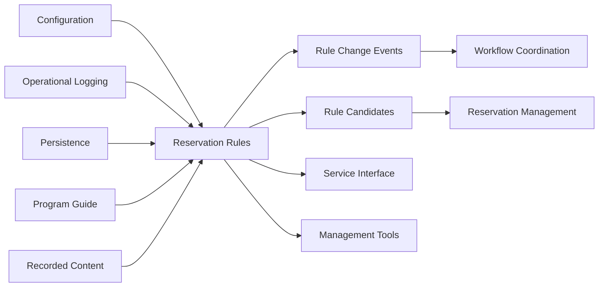
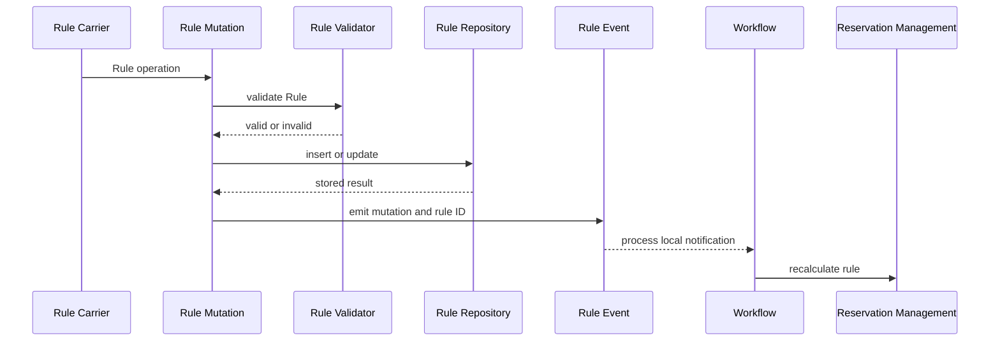
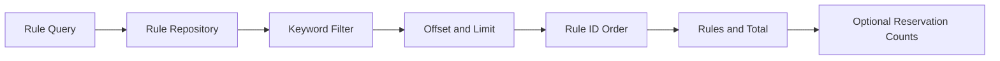
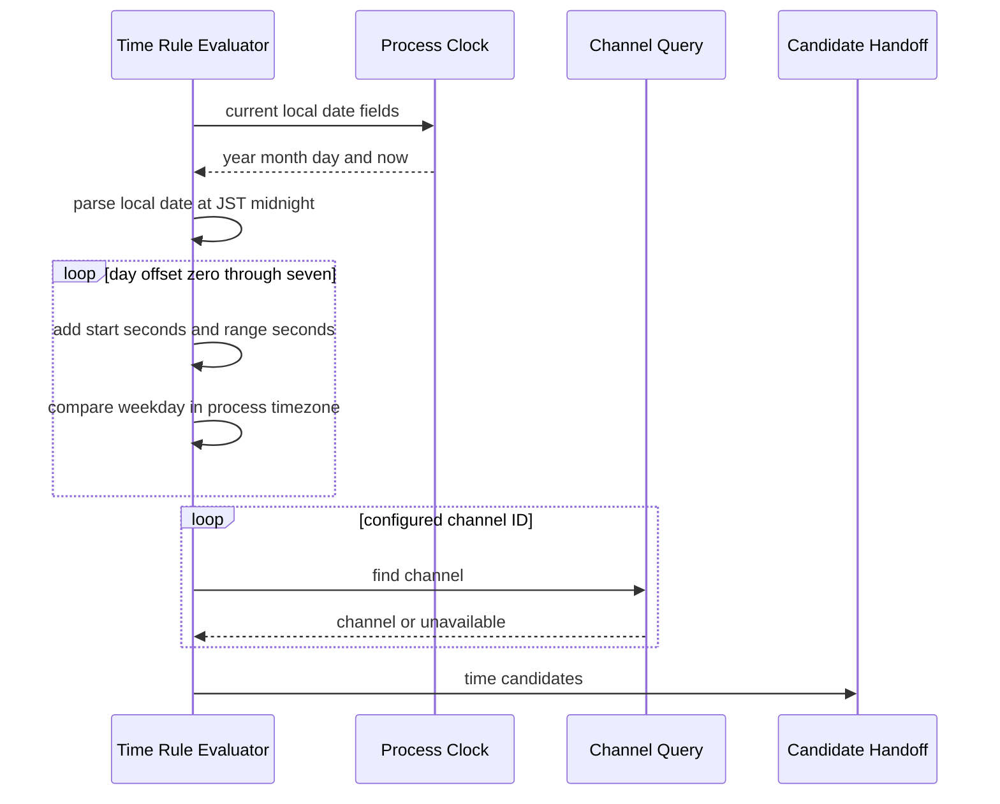
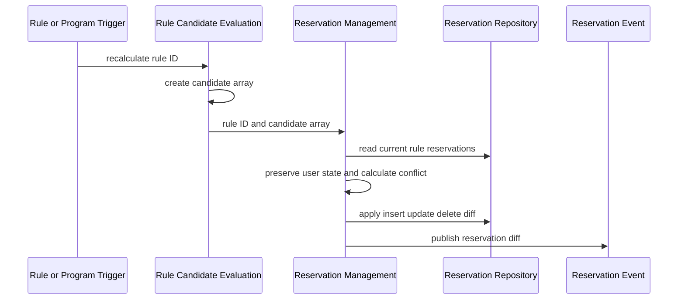

# 自動予約ルール機能 設計

## 概要

自動予約ルール機能は、番組検索条件または曜日・時刻条件と録画条件を一つの保存済みRuleとして管理し、現在の番組情報または指
定時間帯から予約候補を計算する。候補はルール識別、対象番組または時間帯、録画条件、および録画履歴との重複可能性を持ち、録
画予約管理機能へ引き渡される。

本機能の正本は保存済みRuleであり、候補は再計算可能なprocess内の値である。予約row、候補との差分、追加・更新・削除、競合、
除外、重複解除、および最終的な重複状態は録画予約管理機能が所有する。本設計は既存の実行時contractであるRule CRUD、検索意
味、曜日・時刻展開、通知、および公開API契約を維持し、新しい永続queue、version、横断transaction、自動retry、または
timezone正規化を追加しない。

### 目的

-   番組検索ルールと曜日・時刻指定ルールを区別して保存・参照する。
-   Ruleの条件と録画条件を検査し、成立する入力だけを保存する。
-   現在放送中または将来放送される番組から番組候補を作る。
-   番組情報がない場合も、曜日・時刻指定から8日分の時間帯候補を作る。
-   録画履歴との一致を候補の重複可能性として伝える。
-   Rule変更、番組情報更新、および起動後の準備を契機に候補を再計算する。
-   一件の再計算失敗が、処理可能なほかのRuleの再計算を止めない。

### 非目標

-   予約rowの保存、候補との差分適用、競合計画、除外、重複解除、および最終状態の決定
-   番組、放送局、録画履歴、設定file、またはdatabase connectionの所有
-   手動予約、番組リレー予約、録画実行、録画file、およびエンコード実行の管理
-   Rule変更と予約差分をまたぐ一括transactionまたは補償処理
-   durable event、ack、再送、永続queue、idempotency key、またはwire上の共通sequenceの追加
-   サーバー全体の起動順序、process間通信、HTTP carrier、認証、およびpublic error bodyの変更
-   process-local calendarと日本標準時を一つのtimezoneへ統一すること

## 責任境界

### 本機能が所有する責任

-   Rule種別、検索条件、曜日・時刻条件、録画条件、および有効状態の業務上の意味
-   Ruleの追加、変更、有効化、無効化、削除、およびそれらのdomain結果
-   Rule一覧、詳細、件数、および一Rule一件のkeyword候補のquery意味
-   番組検索Ruleから作る番組候補と、曜日・時刻指定Ruleから作る時間帯候補の意味
-   候補へ継承する録画条件と、録画履歴由来の重複可能性
-   Rule変更eventの種類、発行条件、およびrule ID payload
-   録画予約管理へ渡す候補配列全体を一Rule分の置換入力とするcontract

### 境界外

| 責任                                            | 所有機能                                             | 本機能との境界                                                                                     |
| ----------------------------------------------- | ---------------------------------------------------- | -------------------------------------------------------------------------------------------------- |
| 設定file読込、補完、reload                      | `server-configuration`                               | Rule検査時に録画保存先とencode modeの設定を参照する                                                |
| logger sink、level、rotation、flush             | `server-operational-logging`                         | 本機能は処理結果とerrorをsystem loggerへ渡す                                                       |
| DB接続、driver差、transaction、repository retry | `server-persistence`                                 | 本機能は型付きRule・Program query portを利用する                                                   |
| 番組の取得、保存projection、番組検索data        | `server-program-guide`                               | 本機能は保存済み番組へのRule検索結果を利用する                                                     |
| 録画履歴rowの追加、保持、削除                   | `server-recorded-content`                            | 本機能は番組候補に対する履歴一致結果だけを利用する                                                 |
| 予約row、差分適用、競合、除外、重複の最終判断   | `server-reservation-management`                      | 候補配列を既存予約と照合し、最終差分を決める。本機能の一覧projectionへ予約件数query portを実装する |
| 起動・番組更新・Rule変更の全体順序              | `server-workflow-coordination`                       | 本機能の再計算入口を呼び、後続配送を調整する                                                       |
| IPC、HTTP、realtime、hookの配送                 | process messaging、service interface、event delivery | 本機能のoperationとeventを既存carrierへ投影する                                                    |
| backup、restore、旧形式取込                     | `server-management-tools`                            | 保存済みRuleを管理対象として扱う                                                                   |

### 許可する依存

本機能が業務処理から直接利用できるのは、設定、運用log、永続化、番組情報、録画履歴、および一覧projection専用の予約件数
query portである。予約件数portは本機能が必要な入力・結果を定義し、録画予約管理が実装する。workflow、public
service、process messaging、外部通知、および管理toolはconsumerまたはcarrierであり、本機能からそれらの公開adapterへ依存し
ない。予約件数取得のために予約repository実装を直接importしない。

依存方向は次で固定する。

```text
Configuration / Logging / Persistence / Program Guide / Recorded Content
    -> Reservation Rules and Candidate Calculation
        -> Reservation Management / Workflow / Delivery / Public Service
```

### この設計を見直す必要がある変更

-   Rule、RuleSearchOption、RuleReserveOption、保存条件、encode条件、またはkeyword projectionのfield変更
-   Rule ID、番組候補、時間帯候補、またはcandidate identityの変更
-   番組Rule検索、録画履歴一致、databaseのcase-sensitive検索・regexp capabilityの変更
-   process timezone、候補基準日、8日展開、weekday bit、開始秒、録画秒数の変更
-   Rule変更eventのpayload、発行時点、配送、または候補再計算triggerの変更
-   録画予約管理との候補handoff、差分ownership、skip・duplicate・conflictの責任変更
-   公開APIのルート、method、status、content type、field名、optional条件、またはerror projectionの変更
-   起動後の初回番組更新とRule再計算の順序、またはshared server test基盤の変更

## 構成と依存関係

### 境界図



Rule mutationとRule queryは保存済みRuleを中心に構成する。candidate計算はRuleを番組候補または時間帯候補へ投影する
が、candidateを永続化しない。candidate計算と予約差分適用は同じcoordinator内に連続して存在するため、本設計はそのprocess内
seamを明示し、差分以降を録画予約管理の責任として扱う。新しいpublic APIや別の永続modelは作らない。

### 依存契約

| 依存                         | 方向     | 重要度 | 利用contract                                        |
| ---------------------------- | -------- | ------ | --------------------------------------------------- |
| 設定                         | Outbound | P0     | Rule検査時の録画保存先とencode mode集合             |
| system logger                | Outbound | P1     | mutation、query、candidate計算、個別failureの記録   |
| Rule repository              | Outbound | P0     | CRUD、ID検索、一覧、keyword一覧、全ID列挙           |
| Program Rule query           | Outbound | P0     | 条件に一致し、終了していない番組と重複可能性        |
| Channel query                | Outbound | P0     | 時間帯候補に必要な保存済み放送局                    |
| Recorded history semantics   | Outbound | P1     | 番組名、channel ID、終了時刻による履歴一致          |
| Rule change consumer         | Inbound  | P1     | rule IDを受け、画面通知・関連整理・再計算を調整する |
| 同一instance内candidate-to-diff handoff | Internal | P0     | `updateRule()`が`newRuleReserves: Reserve[]`をprivate `createDiff()`へ渡す |
| Rule query・mutation carrier | Inbound  | P0     | 既存IPCと公開API契約からoperationを呼ぶ             |

### 利用技術

| Layer     | Choice                         | Role                                           | 変更                          |
| --------- | ------------------------------ | ---------------------------------------------- | ----------------------------- |
| Backend   | TypeScript、Node.js            | Rule operation、event、candidate計算           | 新規libraryなし               |
| Data      | TypeORM経由のSQLite・MySQL     | Rule CRUD、Program検索、履歴一致               | schema・Migration変更なし     |
| Messaging | process内EventEmitter、既存IPC | Rule変更とoperation carrier                    | durable queue・再計算合流なし |
| Time      | JavaScript Date                | local calendar抽出、JST基準時刻、local weekday | normalization追加なし         |

## コンポーネントとインターフェース

### コンポーネント一覧

| Component                    | Intent                                                              | Requirements                    | Dependencies                                   | Contract       |
| ---------------------------- | ------------------------------------------------------------------- | ------------------------------- | ---------------------------------------------- | -------------- |
| Rule mutation coordinator    | Ruleを検査して追加・変更・状態変更・削除し、確定後にeventを発行する | 1.1-1.5, 4.3, 6.1, 7.1-7.4      | validator、Rule repository、logger、event port | Service、Event |
| Rule option validator        | 検索条件、重複回避条件、encode条件の既存妥当性を判定する            | 2.1-2.4, 3.1-3.3, 4.3, 5.1      | configuration                                  | Service        |
| Rule repository              | Ruleの保存projection、ID生成、一覧、件数、keyword queryを提供する   | 1.1-1.7, 4.1-4.2                | persistence                                    | Service、State |
| Rule query service           | 一覧、詳細、件数、予約件数付加、keyword候補をconsumerへ返す         | 1.6-1.7                         | Rule repository、reservation count query       | Service        |
| Reservation count query port | 一覧projectionに必要なRule別予約件数だけを取得する                  | 1.6                             | reservation management implementation          | Query Port     |
| Program candidate evaluator  | Rule検索結果を番組候補へ投影し、録画条件と重複可能性を付ける        | 2.1-2.7, 4.4, 5.1-5.4, 6.3, 6.5 | Program Rule query、history semantics          | Batch          |
| Time candidate evaluator     | local calendarとJST基準時刻から8日分の時間帯候補を作る              | 3.1-3.8, 4.4, 6.4-6.5           | Channel query、clock                           | Batch          |
| Rule change event port       | mutation種別とrule IDを関係機能へ通知する                           | 6.1, 7.1-7.4                    | workflow・delivery consumer                    | Event          |
| Candidate handoff seam       | 一Rule分を予約管理へ渡し、各全Rule再計算でID順に一件ずつ進める      | 5.3, 5.5, 6.1-6.13, 7.3, 7.5    | reservation management                         | Batch          |

### ルール変更インターフェース

```typescript
interface RuleMutationService {
    add(rule: AddRuleOption): Promise<RuleId>;
    update(rule: Rule): Promise<void>;
    enable(ruleId: RuleId): Promise<void>;
    disable(ruleId: RuleId): Promise<void>;
    delete(ruleId: RuleId): Promise<void>;
}
```

-   `add`は妥当性確認後にdatabase生成IDを返す。
-   `update`は対象存在を確認し、Rule全体を指定内容へ更新する。
-   `enable`と`disable`は保存済み状態を変更し、内部更新countを進める。同じ状態でもmutation coordinatorは変更eventを発行
    する。
-   `delete`はRule rowの削除成功後にrule IDを通知する。関連する将来予約と録画済み番組の整理はconsumerが行う。
-   複数Ruleを一度に削除する操作は提供しない。Ruleの削除は`delete`を一件ずつ呼ぶ（公開HTTPも`DELETE /api/rules/{ruleId}`の一件削除だけ）。

### ルール参照インターフェース

```typescript
interface RuleQueryService {
    get(ruleId: RuleId): Promise<Rule | null>;
    gets(option: GetRuleOption): Promise<{ rules: Rule[]; total: number }>;
    searchKeyword(option: GetRuleOption): Promise<RuleKeywordItem[]>;
}

interface RuleRepository {
    findId(ruleId: RuleId, withUpdateCount?: boolean): Promise<Rule | RuleWithUpdateCount | null>;
    findAll(option: GetRuleOption, withUpdateCount?: boolean): Promise<[Rule[], number]>;
    findKeyword(option: GetRuleOption): Promise<RuleKeywordItem[]>;
    getIds(): Promise<RuleId[]>;
}

interface RuleWithUpdateCount extends Rule {
    updateCnt: number;
}

type ReservationStateFilter = 'all' | 'normal' | 'conflict' | 'skip' | 'overlap';

interface IRuleReservationCountPort {
    countByRuleIds(ruleIds: readonly RuleId[], state: ReservationStateFilter): Promise<readonly RuleReservationCount[]>;
}

interface RuleReservationCount {
    ruleId: RuleId;
    count: number;
}
```

-   一覧は半角化したkeywordを空白で分割し、Rule内ではすべて一致するものを対象にする。ID昇順、offset、limit、および同じ
    query条件のtotalを返す。
-   `type`指定は一覧Ruleに対する予約件数の付加に利用され、Rule種別filterではない。公開queryの`type`は変更せず、内部port
    では同じ5値を`ReservationStateFilter`として扱う。
-   Rule query serviceが予約件数を必要とする場合だけ、page内のRule IDと予約状態filterを`IRuleReservationCountPort`へ渡
    す。返却されないRule IDには0件を投影する。portのcontractは本機能、provider実装は録画予約管理が所有し、既存の
    `IReserveDB`注入を通じて供給する。追加のcompositionは設けない。`RuleApiModel`は`IRuleReservationCountPort`を受ける。
    注入された`IReserveDB`が同portを実装していればそのまま使い、実装していなければ`countRuleIds()`から件数を数えるadapterに包む。
-   詳細の対象なしは`null`であり、public carrierが既存not-foundへ投影する。
-   keyword候補はRule ID昇順で、Rule種別によるfilterを行わない。各Ruleを一件ずつ返し、同じkeywordを集約しない。保存
    keywordがないRuleは空文字列を返す。

### 候補データの意味と同一 coordinator 内 handoff

自動予約ルール機能は、番組検索または曜日・時刻展開から得る候補の業務意味を所有する。番組候補はRule ID、内部更新count、
番組・放送局snapshot、開始・終了、録画条件、および録画履歴照合による重複可能性を持つ。時間候補はRule ID、内部更新count、
放送局、開始・終了、表示名、録画条件を持ち、番組情報を持たない。候補作成時刻は同じ再計算で作る予約の`updateTime`となる。
重複可能性は最終的な重複状態ではない。

録画条件は途中終了許可、tags、録画親保存先、保存先内directory、file名形式、最大3組のencode mode・親保存先・directory、
および成功後の元file削除指定を含む。未指定fieldに新しい省略値を補わず、保存済みRuleの有無を維持する。

現行のprocess内実装では、`ReservationManageModel.updateRule()`が同じreservation coordinatorを取得した後にRule、番組、
放送局、録画履歴、および既存予約を読み、候補の業務意味を`newRuleReserves: Reserve[]`へ投影する。この配列から同じinstance
のprivate `createDiff()`へ渡る一点だけが候補から予約差分への意味上のhandoffである。identity、skip、duplicate、conflict、
database更新、およびeventは録画予約管理が所有する。

このhandoffのために別候補型、consumer port、reconcile API、test専用 adapter、追加のcomposition、public serialization、
database table、またはcarrierを追加しない。

### ルール変更イベント契約

| mutation | 発行条件                | payload | 再計算の扱い                                      |
| -------- | ----------------------- | ------- | ------------------------------------------------- |
| added    | Rule insert後           | rule ID | 対象Ruleを`updateRule()`で再計算する              |
| updated  | Rule update後           | rule ID | 対象Ruleを`updateRule()`で再計算する              |
| enabled  | enable operation後      | rule ID | 対象Ruleを`updateRule()`で再計算する              |
| disabled | disable operation後     | rule ID | 空の`newRuleReserves`で対象Ruleを再計算する       |
| deleted  | Rule delete operation後 | rule ID | Rule不存在として既存予約の整理入力を再計算で作る |

eventはprocess内の非durable通知であり、ack、delivery guarantee、再送、順序番号を持たない。Rule mutationの成功はevent
consumerによる候補再計算の成功を含まず、candidate再計算failureでRule mutationをrollbackしない。

## データモデルと所有権

### ルール集約

Rule IDがaggregate identityであり、`isTimeSpecification`が番組検索Ruleと曜日・時刻指定Ruleを区別する。discriminatorを
public wireへ追加せず、既存booleanを維持する。

| group           | 保存内容                                                    | 規則                                                                          |
| --------------- | ----------------------------------------------------------- | ----------------------------------------------------------------------------- |
| identity        | ID、種別、内部更新count                                     | IDはdatabase生成。内部更新countはcandidate差分判定に利用しpublic Ruleから除く |
| keyword         | keyword、除外keyword、通常・半角値、case・regexp・対象field | 半角値は保存時に生成する                                                      |
| channel         | channel ID群またはGR・BS・CS・SKY・BS4K                     | 番組検索ではchannel ID指定と放送波指定を同時に有効化しない                    |
| program filters | genre、曜日・時間帯、free、duration、search period          | arrayは既存JSON textとして保存・復元する                                      |
| state           | enable、avoid duplicate、履歴照合期間、allow end lack、tags | 重複可能性はRule rowへ保存しない                                              |
| save            | 親保存先、directory、file名形式                             | 任意groupとして保持する                                                       |
| encode          | 最大3組のmode・親保存先・directory、元file削除              | mode名は検査時の設定に存在するものを受け付ける                                |

Rule mutation、Rule row、Rule event、およびcandidate/予約反映は別効果である。Rule rowと予約rowを一つのaggregateまたは
transactionにしない。

### プロセス内状態

| state                        | lifecycle                                     | ownership                                |
| ---------------------------- | --------------------------------------------- | ---------------------------------------- |
| 一Rule分の候補の業務意味     | Rule/Program/Channel/History読取から投影まで  | 自動予約ルール                            |
| `newRuleReserves`            | `updateRule()`内の投影からprivate差分計算まで | 録画予約管理                              |
| 既存Rule予約index            | 再計算中だけ                                  | 録画予約管理                              |
| Rule ID全件列                | 一括再計算中だけ                              | 本機能がrepositoryから取得               |
| Rule mutation queueと安全弁timer | process内だけ                             | mutation coordinatorの固定された実装特性 |
| reservation execution lock   | `updateRule()`から差分適用まで                | 録画予約管理                              |
| Rule event listener          | process lifetime                              | workflow・delivery composition           |

candidate、再計算途中位置、およびevent delivery位置を永続化しない。process再起動後は保存済みRuleを再読取して再計算する。

### 候補識別規則

-   番組candidateのRule内identityは`rule ID + program ID`である。
-   時間帯candidateのRule内identityは`rule ID + startAt + endAt + channel文字列`である。
-   この identity は予約管理が既存予約との対応を比較する key である。
-   異なるRuleが同じ番組または時間帯を選ぶ場合の予約統合、優先、競合、および最終的な重複排除は録画予約管理が所有する。

### データ所有権

| data                                   | 正本                         | 本機能の操作                                        |
| -------------------------------------- | ---------------------------- | --------------------------------------------------- |
| Rule                                   | Rule repository              | CRUD、query、候補の業務意味                         |
| Program・Channel                       | program guide/persistence    | read-only query                                     |
| Recorded history                       | recorded content/persistence | read-onlyの一致判定                                 |
| `newRuleReserves`                      | 録画予約管理のprocess内状態  | 候補の業務意味を投影し、差分後は保持しない          |
| Reservation・skip・duplicate・conflict | reservation management       | 読み書きしない。identityと最終判断は所有しない      |
| public Rule DTO                        | service interface projection | field意味を維持しcarrierを所有しない                |

## ルールの作成・参照・更新・削除ワークフロー

### 追加、変更、有効化、無効化



1. `add`と`update`は保存前に検索条件、重複回避条件、およびencode条件を検査する。
2. `update`は保存済みRuleの存在を先に確認する。
3. repository mutationが正常終了した後だけ対応eventを発行する。`add`のinsertがrejectした場合も、そのerrorを記録して再送
   出し、追加成功のlog、追加event、およびID返却を行わない。
4. candidate再計算はevent consumerの後続処理であり、mutation responseのtransactionには含めない。
5. enable/disableが保存済み状態と同じ場合、repositoryはrow変更を省略し得るが、operation成功eventは発行される。

### 削除

単一削除はRule rowのdelete後にrule IDを通知する。通知consumerは、録画済み番組のrule関連を解除し、録画予約管理へ削除済み
rule IDの再計算を依頼する。本機能は将来予約や録画済み番組を直接変更しない。

### 一覧、詳細、件数、キーワード候補



一覧とkeyword候補はRule ID昇順である。一覧keywordは半角化後の空白区切りtokenをすべて含むRuleを選ぶ。keyword候補は
program/timeの両Ruleを含み、同一keywordでもIDごとに別itemを返す。詳細はID一致の一件または`null`である。

## 候補計算と差分引渡しワークフロー

### 番組検索ルール

1. Ruleが存在し、有効で、時刻指定でない場合だけProgram Rule queryを実行する。
2. keyword、除外keyword、検索field、case、regexp、channel IDまたは放送波、genre、曜日・時間帯、free、duration、および
   search periodを保存済み条件のままqueryへ渡す。
3. queryは`endAt >= evaluation time`の保存済み番組を開始時刻順で返す。現在放送中の番組と将来番組を含む。
4. 録画履歴との重複回避が有効なら、履歴の番組名、channel ID、および終了時刻を用いて各番組へ重複可能性を付ける。
5. program ID、program更新時刻、channel、開始・終了時刻、Rule ID、内部更新count、録画条件、および重複可能性をprogram
   candidateへ写す。
6. 同じidentityの保存済み予約に利用者の重複解除状態がある場合、その最終状態の保持判断は録画予約管理に委ねる。

Program Rule queryまたは履歴一致を含むdatabase queryがrejectした場合、そのRuleのcandidate更新を失敗とし、空集合成功へ変
換しない。

### 曜日・時刻指定ルール



time Ruleはkeyword、channel ID配列、およびtime配列のfield存在を必須とする。配列が空でも受理する。各timeは0以上の開始秒、
正の録画秒数、およびweekday bitを持つ。weekday bitが0でも受理し、そのtimeからcandidateを作らない。

基準時刻は次の分離を維持する。

1. 現在時刻からserver processのlocal year、month、dayを取り出す。
2. その年月日の`00:00:00 +09:00`をday offset 0のepochとする。
3. day offset 0から7まで24時間ずつ加え、開始秒と録画秒数から`startAt`と`endAt`を作る。
4. weekday bitとの比較は、各`startAt`をprocess-localの`Date.getDay()`で評価する。
5. `endAt < evaluation time`のcandidateを除外する。録画時間が翌日以降へ続いてもweekdayは開始時刻側だけを見る。
6. 有効な各channelと各time slotの直積からcandidateを作る。対象時間帯のProgram存在確認は行わず、入力に同一channelまたは同
   一time slotが重複すると同一identityのcandidateを複数追加し得る。

この挙動を一貫した日本標準時calendarとは呼ばず、process timezoneを日本標準時へ強制しない。

### 予約差分への候補引渡し



handoffは一Rule分について、その評価で本機能が確定した authoritative なcandidate配列を表す。無効Rule、削除済みRule、また
は一致番組のない有効Ruleは空配列を渡し得る。時刻Ruleのchannel取得で個別失敗が起きた場合は、取得できたchannelだけを含む部
分集合もauthoritativeな全置換入力として渡す。完全性flagはなく、録画予約管理は現在のRule予約とcandidateを照合し、skip、利
用者によるduplicate解除、conflict、既存予約ID、および他Rule・手動予約への影響を含む差分を決める。本機能はその差分を再解
釈しない。

### 番組更新後と起動後の再計算

番組情報更新完了後の全Rule再計算は、発火ごとに録画予約管理の`updateAll()`を呼ぶ。各callは保存済みRule IDを読み取り、番組
指定手動予約と番組リレー予約の更新後に、Rule ID順で一Ruleずつ次のworkflowを実行する。

1. 一Ruleの処理が予約管理のexecution queueから実行権を取得する。
2. 実行権を保持したままRule、既存Rule予約、Program、Channel、録画履歴、および競合対象予約を順に読み取る。
3. candidateをprocess内で計算し、同じ実行権の内側で既存予約との差分と競合を求める。read開始前の実行権解放、同じreadの共
   有、再取得、世代・更新印のCASは行わない。
4. 既存予約transactionで差分を確定し、成功、失敗、同期例外、および早期returnを覆う共通`finally`からexact実行権を一回解放
   してからeventを発行する。実行権取得後の600秒owner watchdogが先着した場合はoperationを`overdue`として記録し、exact実行
   権と元Promiseを保持して同じ一括再計算の後続Ruleへ進まない。後着settlementは通常のcatch/finally/event順序を一回だけ完
   了してexact実行権を解放し、同じ候補計算またはDB処理を再実行しない。この期限をoperator fatalまたは別domainの停止へ接続
   しない。
5. handoffのsuccessまたはfailureがsettleした後に10ms待って次のRule IDへ進む。一Ruleのfailureは記録して後続Ruleを続ける。

一つの`updateAll()`内ではRule IDの受付とcandidate反映を逐次処理し、全Ruleを同時に開始しない。一Ruleのreadがpendingなら同
じcallの後続Ruleは開始せず、同じ予約管理queueの別operationも実行権を待つ。

全Rule再計算中に後続の全件再計算が発火した場合も、新しいcallは独立してRule IDを読み取る。同じ要求を一回へまとめるbatch
controllerや`rerunRequested`はなく、複数callのitemが予約管理queueの境界で入り交じる場合がある。process起動後の最初の番組
更新でも同じ`updateAll()`入口から時間Ruleを含む保存済みRuleを再計算する。

一括再計算の途中位置を保存せず、process再起動後に残りから再開しない。再起動時は保存済みRuleと現在のProgramから新しい再計
算を行う。

## アルゴリズム、状態、並行性、および冪等性

### 検証規則

| area            | accepted                                                             | rejected                                           |
| --------------- | -------------------------------------------------------------------- | -------------------------------------------------- |
| program keyword | keywordがある場合に一つ以上の対象fieldを選ぶ                         | keywordなしで対応flagだけ有効、または対象fieldなし |
| channel         | channel ID群、または放送波群                                         | channel ID群と放送波群の同時有効化                 |
| genre           | 標準範囲のgenreと任意subgenre                                        | 範囲外genre・subgenre                              |
| program time    | weekday bitを持つ既存hour条件                                        | weekday bitが0                                     |
| duration        | 0以上、両端指定時はmin以下max                                        | 負数、minがmaxより大きい                           |
| time Rule       | keyword・channel ID配列・time配列が存在し、各startが0以上、rangeが正 | 必須field欠落、負のstart、0以下のrange             |
| duplicate       | avoid duplicateと任意の照合期間                                      | avoid duplicate無効時の照合期間指定                |
| encode          | 設定済みmode、modeに対応するdirectory                                | 未設定mode、modeなしの対応directory                |
| sub directory   | 保存先内directory・encode出力先directoryが録画保存先の中に収まる     | 保存先の外へ出る指定（`..`、`/..`、NUL、Windowsで実行する場合のdrive指定・drive相対） |

time Ruleの空channel配列、空time配列、およびweekday bit 0は保存可能であり、candidate 0件になる。これらをvalidation error
へ変更しない。

sub directoryの検査は`server-recording-execution`の設計6.7.2の共通関数`isSubDirectoryInsideRoot()`を使い、他の検証規則
より先に評価する。外を指す指定は`add`・`update`を`InvalidSubDirectory`で拒否し、Rule row、変更event、および後続の候補
再計算を0件にする。保存先の中に収まる指定（`a/../b`、先頭の`/`）は保存する。

### データベース別検索

| capability             | SQLite                  | MySQL       | Rule result                                     |
| ---------------------- | ----------------------- | ----------- | ----------------------------------------------- |
| case-sensitive keyword | 無効                    | 利用可能    | persistence capabilityに従う                    |
| regexp                 | extension有効時だけ利用 | 利用可能    | 利用不可なら同じ入力を通常keyword検索として扱う |
| boolean                | driver変換              | native表現  | persistence projectionに従う                    |
| result order           | startAt昇順             | startAt昇順 | database間で同じprimary orderを使う             |

Ruleのregexp keywordは番組検索と同じ変換を受ける（全角の英数字・空白は半角へ、全角の記号は文字そのものとして照合し、半角の記号は
regexpとして働く。詳細はprogram-guideの検索queryに従う）。

本機能はdatabase差を隠す新しい検索engineを持たない。query parameter bindingとdriver capabilityは永続化機能のcontractを利
用する。

### 録画履歴照合

番組candidateの重複可能性は、保存番組の短縮名と履歴名の一致（[前]・[後]は末尾に残るため、前編と後編は一致しない）、同じchannel ID、および履歴終了時刻を用いる。照合期間が正な
ら現在時刻から指定日数内の履歴とcandidate終了時刻の範囲を用い、未指定または正でない場合は現在以前の履歴を対象にする。判
定結果はbooleanの可能性であり、予約の最終duplicate状態ではない。

### 並行処理と反復呼出し

| operation            | concurrency boundary                          | repeated call                              |
| -------------------- | --------------------------------------------- | ------------------------------------------ |
| add                  | mutation coordinatorのprocess-local実行管理   | 同じ入力でも新しいIDを作り得る             |
| update               | 対象確認後にRule全体update                    | 内部更新countとeventが再度進み得る         |
| enable・disable      | repositoryは同じ状態のrow変更を省略し得る     | coordinatorはeventを再度発行する           |
| delete               | 一Ruleずつrepository delete                   | 対象なしを専用成功結果へ区別しない         |
| candidate evaluation | 実行権取得後から差分適用まで一Rule単位で保持  | 同じRuleへの別triggerも独立した処理        |
| all-rule evaluation  | 各callでRule ID順、現在Ruleの完了後に次を開始 | 重複要求も別callとして列挙・実行           |

Rule mutation eventとcandidate再計算は一つのtransactionではない。candidate再計算は予約管理の実行権を取得してから必要な
readとwriteを行い、通常の共通`finally`まで保持する。600秒owner watchdogが先着しても解放せず`overdue`として同じIDと
Promiseを保持する。read結果の世代・更新印による一般的な再検証、同一readの共有、重複triggerの合流は行わない。新しいDB
列、Migration、永続version、public/IPC field、個別readの成功を捏造するtimeout、persistent queue、automatic retry、
cross-process deduplicationは追加しない。

### 実装特性

以下の2・3・4は一般化された望ましい保証ではない。正常contractのtestと分け、現行の特性としてcharacterization testで観
測する。1・5は現行の契約である。

1. Rule mutationのprocess-local実行管理は直列queueであり、重なった呼び出しを拒否せず、前段の成功・失敗に関わらず呼ばれた
   順に後段を実行する。queueの先頭が10秒（安全弁）経過しても確定しない場合はqueueの前進だけを行い、後続のmutationを実行
   させる。先頭のmutation自体は打ち切らず、確定した時点で元の呼び出し元にだけ結果を返す。この安全弁は他の呼び出し元から
   実行権を奪う手段ではない（実行権という排他状態自体を持たない）。
2. time Ruleはruntimeでkeywordを必須とする一方、共有public schemaではkeywordがoptionalとして表現される。runtimeの既存受
   理条件を維持し、schema上のoptionalをkeyword省略許可へ読み替えない。
3. keyword候補queryはRule種別filterを持たず、program/timeの両Ruleを返す。program Ruleだけへ狭めず、同じkeywordを一件へ集
   約しない。
4. time Ruleの基準年月日はprocess-local、midnightは日本標準時、weekday判定はprocess-localである。日本標準時以外では基準
   日とweekdayが異なるcalendarを参照し得るが、一貫したtimezoneへ正規化しない。
5. candidate更新がreservation execution lockを取得した後は、Rule repositoryの`findId` reject、保存済みtime entryのstart
   またはrange欠落による同期例外、および早期returnを含む全終了経路で`finally`から同じ実行権を一回解放する。read前の
   unlock、再取得、世代照合は追加せず、execution queueの安全な解放契約は`server-reservation-management`を正本とする。

## 失敗、再起動、および回復

### 失敗対応表

| failure                                | 本機能の結果                      | downstream・再試行                                                    |
| -------------------------------------- | --------------------------------- | --------------------------------------------------------------------- |
| Rule input invalid                     | 保存前にoperation reject          | event・candidateなし、自動retryなし                                   |
| Rule対象なし                           | updateはnot-found error           | public projectionはcarrier所有                                        |
| Rule insert/update/state/delete reject | operation reject                  | event・candidateなし。Rule・予約横断rollbackなし                      |
| Rule query reject                      | query operation reject            | 保存済みRuleを変更しない                                              |
| Program Rule query reject              | 対象Ruleのcandidate更新失敗       | 空candidate成功へ変換しない                                           |
| 履歴一致query reject                   | 対象Ruleのcandidate更新失敗       | 最終duplicateを変更しない                                             |
| time Ruleのchannel取得reject・対象なし | 該当channelを記録して続行         | 取得できたchannelの候補部分集合をauthoritativeな全置換入力として渡す  |
| candidateから予約差分適用reject        | Ruleは確定済み、candidate更新失敗 | reservation managementがerrorを所有                                   |
| candidate反映の実行権取得後failure     | 対象Ruleのcandidate更新失敗       | `finally`で取得した実行権を一回解放し、次の有効なentryへ進む          |
| candidate反映の実行権取得待ちtimeout   | mutationを開始せずcallerは失敗    | entryを除外または無効化し、後から実行権を渡さず次の有効なentryへ進む  |
| Rule関連readが未完了                   | 現在Ruleの処理がpending           | 実行権を保持し、同じqueueの別operationと同じbatchの次Ruleを待機させる |
| 実行権取得後600秒で候補再計算が未確定  | operationを`overdue`で保持        | 同じbatchの後続Ruleだけを保留し、別domainを継続。後着確定で一回解放   |
| Rule処理中に保存状態が変化した場合     | 取得済みread結果を処理する        | 世代・updateCnt・row stampによる共通の再検証は行わない                |
| 既存reservation transaction失敗        | 対象Ruleのcandidate更新失敗       | operation固有のerror処理とunlock箇所に従う                            |
| Rule event consumer failure            | Rule mutationの結果を変更しない   | listenerとcall siteの既存handlingに従いdurable retryなし              |
| all-rule evaluationの一件reject        | errorを記録                       | 当該Ruleのsettlement後にID順の次Ruleを続行                            |
| all-rule evaluation中の重複要求        | 別callとしてRule IDを列挙         | 同じ要求も合流せず、予約管理queueのitem境界で入り交じり得る           |

### 再起動時の意味

-   Rule rowはdatabaseから復元するが、candidate、再計算途中位置、mutation flag、execution queue、およびevent配送状態は復
    元しない。
-   起動後は現在の設定、保存済みProgram、Channel、履歴、およびRuleからcandidateを再計算する。
-   起動時candidate再計算のtrigger順序、番組更新完了待ち、および後続通知はapplication runtimeとworkflow coordinationが所
    有する。
-   再起動をfailure retryとして自動発動せず、一件のcandidate failureを次回再計算まで永続queueへ積まない。

### 後始末

本機能はcandidate計算後にprocess内配列を保持しない。Rule削除時の将来予約削除と録画済み番組rule関連解除はconsumerが所有す
る。shutdown時にevent、candidate、またはmutationをdrainするcontractを追加しない。

## 契約

### 設定契約

Rule検査はoperation時に設定管理から現在の設定を取得し、encode sectionの存在と指定mode名を確認する。録画親保存
先、directory、file名形式、およびencode出力先は既存fieldを保存する。本機能は設定reload、保存先path解決、encode実行、およ
び設定のpublic projectionを所有しない。

### 公開API契約

| operation          | existing result                                        |
| ------------------ | ------------------------------------------------------ |
| Rule一覧           | `{ rules, total }`、offset、limit、type、keyword query |
| Rule追加           | 生成rule IDを含む既存成功body                          |
| Rule詳細           | Ruleまたはnot-found                                    |
| Rule変更           | 既存成功code body                                      |
| Rule有効化・無効化 | 既存成功code body                                      |
| Rule削除           | 既存成功code body                                      |
| keyword候補        | `{ items: [{ id, keyword }] }`                         |

Rule追加でinsertが失敗した場合は、成功bodyを返さず、他のRule操作のdomain失敗と同じ既存のerror projection（status 500、
`code`、`message`、`errors`）で返す。このerrorはmutation coordinatorからIPCの応答、`RuleApiModel`、公開HTTP adapterへそのまま届く。

route、HTTP method、status、content type、request body、response key、optional field、およびerror bodyを変更しな
い。`isTimeSpecification`、`searchOption`、`reserveOption`、`saveOption`、`encodeOption`の既存shapeを維持し、time Rule専
用の新しいwire discriminatorを追加しない。

### イベントと配送契約

Rule event payloadはrule IDだけであり、Rule snapshot、candidate、reservation diff、version、timestamp、idempotency key、
またはdelivery acknowledgmentを追加しない。public realtime通知、IPC応答、hook、画面refresh、およびrecorded relation
cleanupの順序とfailure handlingは各consumerが所有する。

### セキュリティとプライバシー

-   Rule keyword、directory、file名形式、実番組名、実channel、および実履歴を設計fixtureや恒常logへ追加しない。
-   query値はpersistenceのparameter bindingへ渡し、keywordやID配列をcarrierからSQLへ直接連結しない。
-   新しいRule body、candidate配列、録画条件全体のproduction loggingを追加しない。既存error objectの内容をredaction済み
    と保証しない。
-   認証、認可、request size、CORS、およびpublic error詳細はservice interfaceの境界に残す。

## テスト戦略

### テスト層

| layer                  | scope                                                                          | evidence                                |
| ---------------------- | ------------------------------------------------------------------------------ | --------------------------------------- |
| unit                   | option validator、time展開、candidate projection、identity                     | pure fixtureとfake clock                |
| repository integration | Rule CRUD、JSON round-trip、list、total、keyword、Program Rule query、履歴一致 | SQLite・MySQL database fixture          |
| component integration  | mutation→event、Program/time candidate→handoff、個別failure継続                | 既存port注入とevent observer             |
| workflow integration   | Rule変更、番組更新、削除、起動後初回更新                                       | Rule・Program・reservationの合成fixture |
| public contract        | Rule routes、status、body key、optional field、keyword両種別                   | 公開契約 fixture 比較                   |
| characterization       | 現行の特性（time Rule keywordのschema/runtime差、keyword query、timezone split） | 正常contractと分離した明示test          |

### 主要テスト対応表

-   program/time Ruleの保存round-tripで種別、検索条件、録画条件、内部更新count、およびJSON arrayを確認する。
-   add、update、enable、disable、deleteについてDB効果、event件数、payloadを確認する。
    validation failureとadd・update・state・deleteのrepository failureではevent非発行を確認し、add insert failureでは
    保存失敗のerrorが呼出元へ返ることと、成功logの不在を確認する。
-   listのkeyword token AND、offset、limit、total、ID昇順、詳細対象なし、およびtype指定時の予約件数付加を確認する。
    `ReserveDB`実装の`IRuleReservationCountPort`でpage内IDとtype、欠落IDの0件投影を確認し、Rule query coreから予約repository
    を直接利用しない。
-   keyword候補でprogram/timeの両Rule、ID昇順、一Rule一件、同一keyword非集約、keywordなしの空文字列を確認する。
-   Program Ruleで包含・除外keyword、対象field、case、regexp、channel優先、放送
    波、genre、weekday/hour、free、duration、search period、endAt境界、startAt順を確認する。
-   SQLiteのregexp extension有無とcase-sensitive無効、MySQLのcase・regexpを別期待値で確認する。
-   録画履歴一致で短縮名、channel ID、期間指定、期間なし、およびquery failureを確認する。
-   time Ruleでempty times、empty channels、weekday 0、start 0、正のrange、翌日超過、8日展開、endAt境界、番組不存在を確
    認する。
-   process timezoneを日本標準時、UTC、および非日本標準時へ切り替え、local年月日→JST midnightとlocal weekdayの分離をfake
    clockで確認する。
-   candidate identity、録画条件継承、Rule更新count、program更新時刻を確認する。
-   candidate handoff後のinsert/update/delete、skip、duplicate解除、conflictはreservation management側のcontract testで
    確認し、本機能testで最終判断を再実装しない。
-   channel Aの取得成功、Bのreject、Cの対象なしを与え、Aだけを含む候補部分集合をauthoritativeな全置換入力としてhandoff
    し、B/Cの既存予約が削除差分になり得ることをreservation managementとのintegrationで確認する。全channel失敗時は空配列
    を同じ意味で渡す。
-   Rule/Program/Channel/履歴/予約readを保留し、現在Ruleが予約管理の実行権を保持したまま、同じbatchの後続Ruleと同じqueue
    の別operationを待機させることを確認する。read前の解放、再取得、同一readの共有、世代・更新印の再検証を期待値にしな
    い。
-   all-rule再計算はRule ID昇順で一件をsettleしてから次を開始し、一件failure後は後続を続けることを確認する。全Ruleのtask
    配列、固定concurrency、eager fan-out、完了順の入替えを期待しない。
-   all-rule再計算中に多数の同要求を入れ、各callがRuleを列挙して別batchとなり、item境界で入り交じり得ることを確認する。
    起動後初回再計算とprocess restart後も保存済みRuleから新しいcallとして始める。

### 発火・データソース・反映先対応

| trigger                      | data source               | Rule output                  | downstream reflection                        |
| ---------------------------- | ------------------------- | ---------------------------- | -------------------------------------------- |
| add・update・enable・disable | 保存済みRule              | rule ID event、対象candidate | reservation diff、画面・外部通知             |
| delete                       | 削除済みrule ID           | deleted event、空candidate   | 将来予約とrecorded relation整理              |
| program update completed     | 有効Rule、Program、履歴   | Ruleごとのcandidate          | reservation diff                             |
| server first preparation     | 保存済みRule、現在Program | 全Rule再計算                 | recording timer・競合再計算はreservation管理 |
| public list/detail           | Rule repository           | Rule DTO、total              | 公開APIの応答                                |
| keyword query                | 全Rule keyword            | ID順item                     | 公開APIの応答                                |

各integration scenarioはtrigger、query、candidate、handoff、予約差分eventまでを追跡する。Rule eventの発行だけから
candidate反映完了を推測しない。

### 実装特性の再現テスト

望ましいcontract testとは別suiteで、次を固定fixtureにより再現する。

-   mutation queueが呼ばれた順に1本ずつ実行し、前段の成功・失敗に関わらず後段を必ず実行すること、および10秒の安全弁が
    queueの前進だけを行い先頭のmutation自体は打ち切らないこと
-   time Rule keywordのruntime必須とpublic schema optionalの差
-   keyword候補に両Rule種別が含まれること
-   非日本標準時でのlocal date、JST midnight、local weekdayの分離

candidate反映のunlock未到達、timeout waiter残存、および実行ID衝突は、仕様testで全終了経路の一回解放、期限切れentryの除外、
および衝突しないIDとして検証する。

自動予約ルール機能はreservation managerが保持する同一execution coordinator instanceをcandidate handoffから利用する。
coordinatorのpriority、同priority受付順、衝突しないprocess-local ID、timeout entry除外、およびexact releaseは
reservation-managementのowner testで検証し、本機能はRule処理中の保持と一件failure後の後続動作をintegrationで確認する。

### 品質確認

-   Requirements 1から7の49 ACは、下記の配置にある相互に異なる`*.spec.test.ts` main caseへ一件ずつ対応する。
-   Requirement 8の5 ACは、仕様test、具体的な実装test、matrix、具体的な結合test、およびserver全体のC0・C1の判定へ
    別々に対応する。
-   公開API契約 fixtureに実運用値、credential、machine path、または実番組を含めない。
-   fake clockとprocess timezoneを用い、8日分のwall-clock待機を行わない。
-   SQLite・MySQL suiteでdriver差を明示し、一方の期待値を他方へ一般化しない。
-   known characterizationを無効化、保留、または望ましいassertionへ混在させない。

### Requirement 8の確認項目

次のpathが各層の確認項目の証跡である。

| 証跡ID               | 具体的な証跡                                                                                                                                                                                                                                                                                                                                                               |
| -------------------- | ------------------------------------------------------------------------------------------------------------------------------------------------------------------------------------------------------------------------------------------------------------------------------------------------------------------------------------------------------------------------------ |
| `SPEC-CASES-8.1` | `management.spec.test.ts`、`program-search.spec.test.ts`、`time-rule.spec.test.ts`、`recording-options.spec.test.ts`、`duplicate-history.spec.test.ts`、`candidate-recalculation.spec.test.ts`、`change-notification.spec.test.ts`にあるRR-1.1からRR-7.5の49 main case。欠落・重複0件とする                                                                           |
| `IMP-CASES-8.2`      | 直後の実装・characterization case 一覧に列挙する一意なanchor、入力、期待assertion。値域、timezone、候補projection、順序、DB分岐、10秒mutation timer、および確認済みsourceとの差を正常contractへ混在させず検証する                                                                                                                                                         |
| `MATRIX-8.3`   | 下記54行についてAC、主test/証跡、入力、状態、時間、資源、境界、failureの空欄・重複・未分類を0件とし、取消・再入・再起動の適用または非適用理由も揃える                                                                                                                                                                                                              |
| `INTEGRATION-8.4`    | `persistence.integration.test.ts`: SQLite/MySQL保存・検索・履歴照合、`public-http.integration.test.ts`: 公開HTTP adapter、`ipc-rule-operation.integration.test.ts`: IPC操作、`candidate-event.integration.test.ts`: transactionを所有する予約管理へのcandidate引渡し・commit/rollback・確定後event一回/失敗時0回。filesystem/child processは本機能が所有・利用しないため非適用 |
| `RUNTIME-R9-8.5`     | `server-application-runtime`所有の固定commandによる機能固有test全件と、同Requirement 9 Acceptance Criterion 9のserver全体のC0/C1。未実行、失敗、または未解決結果があれば本機能は未完了                                                                                                                                                    |

#### 実装・characterization case 一覧

次のanchorは主な実装・characterization caseであり、一つのcaseが値域・分岐・副作用・資源回収の期待結果を明示する。

| 一意なanchor                                           | 入力と期待assertion                                                                                                                                                                                                        |
| ---------------------------------------------------------- | -------------------------------------------------------------------------------------------------------------------------------------------------------------------------------------------------------------------------- |
| `rule-validation.test.ts#IMP-VAL-RULE-BOUNDARIES`          | null、空group、0、1、承認済み最小・最大、最大±1、範囲外、不正型を表駆動し、受理範囲だけがDBへ一回渡り、不正入力はDB call/event 0回となる                                                                                   |
| `time-expansion.test.ts#IMP-TIME-BOUNDARIES`               | start 0/1、range 1、承認済み最小・最大、範囲外、境界時刻、翌日跨ぎ、day offset 0/7、timezone別epochを固定し、候補数・startAt・endAt・開始曜日を完全一致させる                                                              |
| `candidate-identity.test.ts#IMP-CANDIDATE-PROJECTION`      | program/time candidateを与え、各identity、Rule ID、対象、および全録画条件のprojectionを確認する                                                                                                                            |
| `bulk-and-batch.test.ts#IMP-BULK-BATCH-ORDER`              | 0/1/複数/最大fixture件数、重複ID、中間failure、重複batchを与え、入力順・Rule ID順・個別failure後続・call非合流・Promise個別settlementをcall ledgerで確認する                                                               |
| `database-query.test.ts#IMP-DB-DIALECT-BRANCHES`           | SQLite/MySQLでkeyword 1件・最小/最大filter組合せ・空・範囲外を与え、bind値、case/regexp capability、primary order、driver別結果をassertし、一方のdialectを他方へ一般化しない                                               |
| `rule-mutation-timer.test.ts#IMP-MUTATION-TIMER-LIFECYCLE` | fake timerで実行中の各mutationに10秒timerを一回登録し、正常・validation失敗でtimerが残らないこと、10秒到達でqueueの前進を一回だけ行い先行mutationは打ち切らず後で確定することを確認する。caseごとにtimerをresetし、teardown後のpending timer/open handleを0件にする |
| `characterization.test.ts#CHAR-MUTATION-TIMER-REENTRY`     | 重なった2本目のmutationを拒否せずqueueの後ろで待たせ、1本目の確定後に実行を開始することと、10秒の安全弁timerが実行中のmutationにだけ一本登録され確定時にclearされること（待機中の後段はtimerを持たない）をfake timerで再現する。全timerをdrain/resetしteardown後pending timer 0件を確認する            |
| `characterization.test.ts#CHAR-TIME-KEYWORD-SCHEMA`        | public schemaのkeyword省略表現とruntime必須判定を別入力で固定し、schema optionalをruntime受理へ読み替えない                                                                                                                |
| `characterization.test.ts#CHAR-KEYWORD-BOTH-RULE-TYPES`    | program/time Ruleと同一keywordをseedし、種別filterなし、Rule ID順、一Rule一件、同一keyword非集約を固定する                                                                                                                 |
| `time-expansion.test.ts#CHAR-TIMEZONE-CALENDAR-SPLIT`    | 日本標準時・UTC・非日本標準時でprocess-local年月日、JST midnight、process-local weekdayが分離し得るepoch列を固定し、timezone正規化した期待値を置かない                                                                     |

上の一覧にない補助anchor（`implementation-inventory.test.ts`の`IMP-INPUT-*`・`IMP-M6-BATCH-RELEASE-EVENT`、`candidate-identity.test.ts`の`IMP-CANDIDATE-IDENTITY`、`database-query.test.ts`の`IMP-DB-DIALECT-MUTATION`、`imp/api-model-ipc-delegation.test.ts`の`IMP-API-IPC-DELEGATION`など）は各fileに置く。

### Test Matrix必須観点index

下表の短縮分類は全54行へ適用する。

-   入力: `I-ID`はnull・空・0・1・最大有効ID・範囲外・不正型・重複、`I-RULE`はnull・空group・0/1/最小/最大・範囲外・不正
    型、`I-QUERY`は省略・空・offset 0・limit 1/最大・範囲外、`I-TIME`はstart 0・range 1・境界時刻・翌日跨ぎ・範囲
    外、`I-TRIGGER`はpayloadなしまたは同一通知重複を検証する。
-   状態: `S-MUT`は開始前・進行中・成功・失敗、取消N/A（取消APIなし）、再入は独立call、restartは保存済みRuleのみ復元。内
    部mutation timerの再入はtarget contractと`CHAR-MUTATION-TIMER-REENTRY`を分ける。`S-QUERY`は開始前・成功・失敗、取消/
    再入/restart N/A（read-only単発）。`S-BATCH`は待機・実行中・成功・失敗・期限超過、取消N/A（取消contractなし）、再入
    は別batch、restartは新規再計算。`S-GATE`は未実行・成功・失敗で、取消・再入・restartは非適用。
-   時間: `T0`はdeadline/race N/A、`TC`はcalendar・境界時刻、`TQ`は入力順・ID順・同着・race、`TD`は600秒直前・到達・超
    過・late settlement・重複通知、`T10`はmutation timerの取得・10秒直前・到達・clear・再入を検証する。
-   資源: `R-DB`はrepository/DB接続を永続化機能が所有し、本機能はtransactionを所有しない。`R-LOCK`は予約管理所有の実行権
    とtransactionをexact一回解放/確定する。`R-MUT-TIMER`はRule mutation coordinatorが所有する10秒timerを取得・
    expiry/reset/clearし、重なったmutationの直列化と安全弁timerの前進をcharacterizationへ隔離してtest teardown後のpending timer/open handleを0
    件にする。`R-EVENT`はlistenerをcompositionがprocess lifetime所有する。stream、file、child processは本機能では非適用
    であり、timerは`R-LOCK`のwatchdogと`R-MUT-TIMER`だけが適用される。
-   境界: `B-DB`、`B-HTTP`、`B-IPC`、`B-EVENT`、`B-RM`を適用し、記載のないHTTP/IPC/DB/filesystem/process境界は非適用。
    filesystemとchild processは全行で非適用であり、processはIPCまたは外部runtime証跡を明記した行だけ適用する。

### 機能全体Test Matrix

全pathは`test/server/reservation-rules/`配下の配置である。`P:`は`*.spec.test.ts`の一意なmain case、 `E:`は
Requirement 8の層別の確認項目を表す。Rule mutationの10秒timerの取得・expiry・clearは`rule-mutation-timer.test.ts#IMP-MUTATION-TIMER-LIFECYCLE`が観測し、`T10`・`R-MUT-TIMER`を持つ行の`P:`のcaseはtimerの残存を個別にassertしない。

| ID      | 主test/証跡                                      | 入力          | 状態    | 時間      | 資源                    | 境界                                   | failure injectionと期待結果                                                                       |
| ------- | ------------------------------------------------ | ------------- | ------- | --------- | ----------------------- | -------------------------------------- | ------------------------------------------------------------------------------------------------- |
| RR-1.1  | P:`management.spec.test.ts#RR-1.1`               | I-RULE        | S-MUT   | T10       | R-DB/R-MUT-TIMER        | B-DB                                   | discriminator反転で別種別化しない                                                      |
| RR-1.2  | P:`management.spec.test.ts#RR-1.2`               | I-RULE        | S-MUT   | TQ/T10    | R-DB/R-MUT-TIMER        | B-DB/B-EVENT                           | insert rejectはerrorを呼出元へ返しevent 0回（`change-notification.spec.test.ts#RR-1.2`）                                        |
| RR-1.3  | P:`management.spec.test.ts#RR-1.3`               | I-RULE        | S-MUT   | TQ/T10    | R-DB/R-MUT-TIMER        | B-DB/B-EVENT                           | update失敗は旧値維持・event 0回                                                      |
| RR-1.4  | P:`management.spec.test.ts#RR-1.4`               | I-ID          | S-MUT   | TQ/T10    | R-DB/R-MUT-TIMER        | B-DB/B-EVENT                           | state更新失敗はevent 0回                                                             |
| RR-1.5  | P:`management.spec.test.ts#RR-1.5`               | I-ID          | S-MUT   | TQ/T10    | R-DB/R-MUT-TIMER        | B-DB/B-EVENT                           | delete失敗はrow維持・event 0回                                                       |
| RR-1.6  | P:`management.spec.test.ts#RR-1.6`               | I-QUERY       | S-QUERY | T0        | R-DB                    | B-DB                                   | query失敗を空結果へ変換しない                                                                     |
| RR-1.7  | P:`management.spec.test.ts#RR-1.7`               | I-QUERY       | S-QUERY | TQ        | R-DB                    | B-DB                                   | 同keywordを集約せずID順一Rule一件                                                                 |
| RR-2.1  | P:`program-search.spec.test.ts#RR-2.1`           | I-RULE        | S-QUERY | T0        | R-DB                    | B-DB                                   | 包含/除外bind欠落を候補差で検出                                                                   |
| RR-2.2  | P:`program-search.spec.test.ts#RR-2.2`           | I-RULE        | S-QUERY | T0        | R-DB                    | B-DB                                   | title/description/extended各flag反転を検出                                                        |
| RR-2.3  | P:`program-search.spec.test.ts#RR-2.3`           | I-RULE        | S-QUERY | T0        | R-DB                    | B-DB                                   | case/regexp分岐をDB別に検出                                                                       |
| RR-2.4  | P:`program-search.spec.test.ts#RR-2.4`           | I-RULE        | S-QUERY | TC        | R-DB                    | B-DB                                   | 各filter欠落・範囲外を独立検出                                                                    |
| RR-2.5  | P:`program-search.spec.test.ts#RR-2.5`           | I-RULE        | S-QUERY | TC        | R-DB                    | B-DB                                   | endAt直前/等号/過去の境界を検出                                                                   |
| RR-2.6  | P:`program-search.spec.test.ts#RR-2.6`           | I-RULE        | S-QUERY | T0        | R-DB                    | B-DB                                   | SQLite/MySQL結果を相互一般化しない                                                                |
| RR-2.7  | P:`program-search.spec.test.ts#RR-2.7`           | I-RULE        | S-BATCH | TQ        | R-LOCK                  | B-DB/B-RM                              | query rejectを対象Rule失敗として解放1回                                                           |
| RR-3.1  | P:`time-rule.spec.test.ts#RR-3.1`                | I-RULE        | S-MUT   | T10       | R-DB/R-MUT-TIMER        | B-DB                                   | keyword/channel/times欠落だけ拒否する                                                  |
| RR-3.2  | P:`time-rule.spec.test.ts#RR-3.2`                | I-TIME        | S-MUT   | TC/T10    | R-DB/R-MUT-TIMER        | B-DB                                   | start負数/range 0以下拒否、曜日0件受理                                               |
| RR-3.3  | P:`time-rule.spec.test.ts#RR-3.3`                | I-TIME        | S-BATCH | TC        | R-LOCK                  | B-RM                                   | empty times/week 0は候補0件成功                                                                   |
| RR-3.4  | P:`time-rule.spec.test.ts#RR-3.4`                | I-TIME        | S-BATCH | TC        | R-LOCK                  | B-RM                                   | timezone別local日/JST 0時/local曜日を固定                                                         |
| RR-3.5  | P:`time-rule.spec.test.ts#RR-3.5`                | I-TIME        | S-BATCH | TC        | R-LOCK                  | B-RM                                   | day offset 0/7を含み8以降を含めない                                                               |
| RR-3.6  | P:`time-rule.spec.test.ts#RR-3.6`                | I-TIME        | S-BATCH | TC        | R-LOCK                  | B-RM                                   | start/end算術の誤りをepochで検出                                                                  |
| RR-3.7  | P:`time-rule.spec.test.ts#RR-3.7`                | I-TIME        | S-BATCH | TC        | R-LOCK                  | B-RM                                   | Program 0件でもtime candidateを渡す                                                               |
| RR-3.8  | P:`time-rule.spec.test.ts#RR-3.8`                | I-TIME        | S-BATCH | TC        | R-LOCK                  | B-RM                                   | 翌日跨ぎでも開始日のweekdayだけを使用                                                             |
| RR-4.1  | P:`recording-options.spec.test.ts#RR-4.1`        | I-RULE        | S-MUT   | T10       | R-DB/R-MUT-TIMER        | B-DB/B-RM                              | save option各fieldの欠落・改変を検出                                                 |
| RR-4.2  | P:`recording-options.spec.test.ts#RR-4.2`        | I-RULE        | S-MUT   | T10       | R-DB/R-MUT-TIMER        | B-DB/B-RM                              | encode 1..3・削除flagの欠落・改変を検出                                              |
| RR-4.3  | P:`recording-options.spec.test.ts#RR-4.3`        | I-RULE        | S-MUT   | T10       | R-DB/R-MUT-TIMER        | B-DB                                   | validation failureは保存/event 0回                                                   |
| RR-4.4  | P:`recording-options.spec.test.ts#RR-4.4`        | I-RULE        | S-BATCH | T0        | R-LOCK                  | B-RM                                   | program/time双方へ保存済みoptionを同値継承                                                        |
| RR-5.1  | P:`duplicate-history.spec.test.ts#RR-5.1`        | I-RULE        | S-MUT   | TC/T10    | R-DB/R-MUT-TIMER        | B-DB                                   | avoid無効+期間の不正組合せを拒否する                                                   |
| RR-5.2  | P:`duplicate-history.spec.test.ts#RR-5.2`        | I-RULE        | S-BATCH | TC        | R-DB                    | B-DB                                   | 名前/channel/期間境界の一致を検出                                                                 |
| RR-5.3  | P:`duplicate-history.spec.test.ts#RR-5.3`        | I-RULE        | S-BATCH | T0        | R-LOCK                  | B-DB/B-RM                              | possibleDuplicateをhandoff payloadで確認                                                          |
| RR-5.4  | P:`duplicate-history.spec.test.ts#RR-5.4`        | I-RULE        | S-BATCH | TQ        | R-LOCK                  | B-DB/B-RM                              | history rejectを成功/空候補へ変換せず解放1回                                                      |
| RR-5.5  | P:`duplicate-history.spec.test.ts#RR-5.5`        | I-RULE        | S-BATCH | T0        | R-LOCK                  | B-RM                                   | 利用者解除・最終状態をRule側で上書きしない                                                        |
| RR-6.1  | P:`candidate-recalculation.spec.test.ts#RR-6.1`  | I-TRIGGER     | S-BATCH | TQ        | R-EVENT                 | B-EVENT/B-RM                           | 各mutation通知が対象Rule callを一件作る                                                           |
| RR-6.2  | P:`candidate-recalculation.spec.test.ts#RR-6.2`  | I-TRIGGER     | S-BATCH | TQ        | R-LOCK                  | B-DB/B-EVENT/B-RM                      | 更新完了ごとにDBから有効Ruleを列挙                                                                |
| RR-6.3  | P:`candidate-recalculation.spec.test.ts#RR-6.3`  | I-RULE        | S-BATCH | TC        | R-LOCK                  | B-DB/B-RM                              | query一致集合だけをhandoff                                                                        |
| RR-6.4  | P:`candidate-recalculation.spec.test.ts#RR-6.4`  | I-TIME        | S-BATCH | TC        | R-LOCK                  | B-RM                                   | 展開した時間帯集合だけをhandoff                                                                   |
| RR-6.5  | P:`candidate-recalculation.spec.test.ts#RR-6.5`  | I-RULE        | S-BATCH | T0        | R-LOCK                  | B-RM                                   | rule/target/options/possibleDuplicate全field                                                      |
| RR-6.6  | P:`candidate-recalculation.spec.test.ts#RR-6.6`  | I-RULE        | S-BATCH | T0        | R-LOCK                  | B-RM                                   | Rule側に最終差分判断を実装しない                                                                  |
| RR-6.7  | P:`candidate-recalculation.spec.test.ts#RR-6.7`  | I-ID          | S-BATCH | TQ        | R-LOCK                  | B-DB/B-RM                              | 中間failure settlement後に次IDを開始                                                              |
| RR-6.8  | P:`candidate-recalculation.spec.test.ts#RR-6.8`  | I-TRIGGER     | S-BATCH | TQ        | R-EVENT                 | B-EVENT/B-RM                           | 同一Rule重複通知を合流しない                                                                      |
| RR-6.9  | P:`candidate-recalculation.spec.test.ts#RR-6.9`  | I-TRIGGER     | S-BATCH | TQ        | R-LOCK                  | B-DB/B-EVENT/B-RM                      | 発火ごとにDBからIDを再読取する                                                                    |
| RR-6.10 | P:`candidate-recalculation.spec.test.ts#RR-6.10` | I-ID          | S-BATCH | TQ        | R-LOCK                  | B-DB/B-RM                              | lock後read・transaction確定/失敗まで保持                                                          |
| RR-6.11 | P:`candidate-recalculation.spec.test.ts#RR-6.11` | I-ID          | S-BATCH | TQ        | R-LOCK                  | B-RM                                   | ID順に一件settle後次、eager開始0件                                                                |
| RR-6.12 | P:`candidate-recalculation.spec.test.ts#RR-6.12` | I-TRIGGER     | S-BATCH | TQ        | R-LOCK                  | B-RM                                   | 各batch独立、item境界交錯、Promise個別settle                                                      |
| RR-6.13 | P:`candidate-recalculation.spec.test.ts#RR-6.13` | I-ID          | S-BATCH | TD        | R-LOCK                  | B-DB/B-RM                              | 600秒で非解放・後続0、late settleで解放/event一回                                                 |
| RR-7.1  | P:`change-notification.spec.test.ts#RR-7.1`      | I-TRIGGER     | S-MUT   | TQ/T10    | R-EVENT/R-MUT-TIMER     | B-EVENT                                | commit前/失敗時event 0、確定後1回                                                    |
| RR-7.2  | P:`change-notification.spec.test.ts#RR-7.2`      | I-ID          | S-MUT   | TQ/T10    | R-EVENT/R-MUT-TIMER     | B-EVENT                                | deleted payloadがexact IDで届く                                                          |
| RR-7.3  | P:`change-notification.spec.test.ts#RR-7.3`      | I-ID          | S-BATCH | TQ        | R-DB                    | B-DB/B-RM                              | 削除後再読取nullで空candidate                                                                     |
| RR-7.4  | P:`change-notification.spec.test.ts#RR-7.4`      | I-ID          | S-BATCH | TQ        | R-EVENT                 | B-EVENT                                | Rule exact-ID eventを一回提供し、recorded relation cleanupの実行確認はworkflow owner testへ委ねる |
| RR-7.5  | P:`change-notification.spec.test.ts#RR-7.5`      | I-TRIGGER     | S-BATCH | TQ        | R-DB                    | B-DB/B-EVENT/B-RM                      | restart後保存Ruleを再読取し有効Ruleを予約管理へ新規再計算                                         |
| RR-8.1  | E:`SPEC-CASES-8.1`                           | I-RULE        | S-GATE  | T0        | R-DB                    | B-DB/B-EVENT                           | 49 ACのmain case欠落・重複を0件にする                                                             |
| RR-8.2  | E:`IMP-CASES-8.2`                                | I-RULE/I-TIME | S-GATE  | TC/TQ/T10 | R-DB/R-LOCK/R-MUT-TIMER | B-DB/B-RM                              | 一意anchorで値域・timezone・候補projection・順序・DB分岐・timer lifecycleとcharacterizationを検証 |
| RR-8.3  | E:`MATRIX-8.3`                             | I-RULE        | S-GATE  | T10/TD    | R-LOCK/R-MUT-TIMER      | B-DB/B-RM                              | 54行と全分類の欠落・重複・空欄を0件にし、timer/lock回収とopen handle 0件を確認する                |
| RR-8.4  | E:`INTEGRATION-8.4`                              | I-RULE        | S-GATE  | TQ/TD     | R-DB/R-LOCK/R-EVENT     | B-DB/B-HTTP/B-IPC/B-RM/B-EVENT         | DB/HTTP/IPC/transaction/eventを実接続、filesystem/child process N/A                               |
| RR-8.5  | E:`RUNTIME-R9-8.5`                               | I-TRIGGER     | S-GATE  | T0        | R-DB/R-LOCK/R-EVENT     | B-DB/B-HTTP/B-IPC/B-RM/B-EVENT/process | 未実行・失敗なら未完了                                                              |

## 要件トレーサビリティ

各Acceptance Criterionは次の表にちょうど一行だけ持つ。R1からR7のpathは`*.spec.test.ts`のmain caseである。

| 要件 | 設計箇所                                           | 一意なmain caseまたは証跡                      |
| ---- | -------------------------------------------------- | ---------------------------------------------- |
| 1.1  | `ルール集約`                                       | `management.spec.test.ts#RR-1.1`               |
| 1.2  | `追加、変更、有効化、無効化`                       | `management.spec.test.ts#RR-1.2`               |
| 1.3  | `追加、変更、有効化、無効化`                       | `management.spec.test.ts#RR-1.3`               |
| 1.4  | `追加、変更、有効化、無効化`                       | `management.spec.test.ts#RR-1.4`               |
| 1.5  | `削除`                                             | `management.spec.test.ts#RR-1.5`               |
| 1.6  | `一覧、詳細、件数、キーワード候補`                 | `management.spec.test.ts#RR-1.6`               |
| 1.7  | `一覧、詳細、件数、キーワード候補`                 | `management.spec.test.ts#RR-1.7`               |
| 2.1  | `ルール集約`、`検証規則`                           | `program-search.spec.test.ts#RR-2.1`           |
| 2.2  | `検証規則`、`番組検索ルール`                       | `program-search.spec.test.ts#RR-2.2`           |
| 2.3  | `データベース別検索`                               | `program-search.spec.test.ts#RR-2.3`           |
| 2.4  | `番組検索ルール`                                   | `program-search.spec.test.ts#RR-2.4`           |
| 2.5  | `番組検索ルール`                                   | `program-search.spec.test.ts#RR-2.5`           |
| 2.6  | `データベース別検索`                               | `program-search.spec.test.ts#RR-2.6`           |
| 2.7  | `失敗対応表`                                       | `program-search.spec.test.ts#RR-2.7`           |
| 3.1  | `ルール集約`、`検証規則`                           | `time-rule.spec.test.ts#RR-3.1`                |
| 3.2  | `検証規則`                                         | `time-rule.spec.test.ts#RR-3.2`                |
| 3.3  | `曜日・時刻指定ルール`                             | `time-rule.spec.test.ts#RR-3.3`                |
| 3.4  | `曜日・時刻指定ルール`                             | `time-rule.spec.test.ts#RR-3.4`                |
| 3.5  | `曜日・時刻指定ルール`                             | `time-rule.spec.test.ts#RR-3.5`                |
| 3.6  | `曜日・時刻指定ルール`                             | `time-rule.spec.test.ts#RR-3.6`                |
| 3.7  | `候補データ契約`                                   | `time-rule.spec.test.ts#RR-3.7`                |
| 3.8  | `曜日・時刻指定ルール`                             | `time-rule.spec.test.ts#RR-3.8`                |
| 4.1  | `ルール集約`                                       | `recording-options.spec.test.ts#RR-4.1`        |
| 4.2  | `ルール集約`                                       | `recording-options.spec.test.ts#RR-4.2`        |
| 4.3  | `検証規則`                                         | `recording-options.spec.test.ts#RR-4.3`        |
| 4.4  | `候補データ契約`                                   | `recording-options.spec.test.ts#RR-4.4`        |
| 5.1  | `ルール集約`、`検証規則`                           | `duplicate-history.spec.test.ts#RR-5.1`        |
| 5.2  | `録画履歴照合`                                     | `duplicate-history.spec.test.ts#RR-5.2`        |
| 5.3  | `番組検索ルール`、`予約差分への候補引渡し`         | `duplicate-history.spec.test.ts#RR-5.3`        |
| 5.4  | `失敗対応表`                                       | `duplicate-history.spec.test.ts#RR-5.4`        |
| 5.5  | `境界外`                                           | `duplicate-history.spec.test.ts#RR-5.5`        |
| 6.1  | `ルール変更イベント契約`、`予約差分への候補引渡し` | `candidate-recalculation.spec.test.ts#RR-6.1`  |
| 6.2  | `番組更新後と起動後の再計算`                       | `candidate-recalculation.spec.test.ts#RR-6.2`  |
| 6.3  | `番組検索ルール`                                   | `candidate-recalculation.spec.test.ts#RR-6.3`  |
| 6.4  | `曜日・時刻指定ルール`                             | `candidate-recalculation.spec.test.ts#RR-6.4`  |
| 6.5  | `候補データ契約`                                   | `candidate-recalculation.spec.test.ts#RR-6.5`  |
| 6.6  | `境界外`、`予約差分への候補引渡し`                 | `candidate-recalculation.spec.test.ts#RR-6.6`  |
| 6.7  | `番組更新後と起動後の再計算`、`失敗対応表`         | `candidate-recalculation.spec.test.ts#RR-6.7`  |
| 6.8  | `番組更新後と起動後の再計算`                       | `candidate-recalculation.spec.test.ts#RR-6.8`  |
| 6.9  | `番組更新後と起動後の再計算`                       | `candidate-recalculation.spec.test.ts#RR-6.9`  |
| 6.10 | `番組更新後と起動後の再計算`、`失敗対応表`         | `candidate-recalculation.spec.test.ts#RR-6.10` |
| 6.11 | `番組更新後と起動後の再計算`                       | `candidate-recalculation.spec.test.ts#RR-6.11` |
| 6.12 | `番組更新後と起動後の再計算`                       | `candidate-recalculation.spec.test.ts#RR-6.12` |
| 6.13 | `番組更新後と起動後の再計算`、`失敗対応表`         | `candidate-recalculation.spec.test.ts#RR-6.13` |
| 7.1  | `ルール変更イベント契約`                           | `change-notification.spec.test.ts#RR-7.1`      |
| 7.2  | `ルール変更イベント契約`                           | `change-notification.spec.test.ts#RR-7.2`      |
| 7.3  | `削除`                                             | `change-notification.spec.test.ts#RR-7.3`      |
| 7.4  | `削除`、`ルール変更イベント契約`                   | `change-notification.spec.test.ts#RR-7.4`      |
| 7.5  | `再起動時の意味`                                   | `change-notification.spec.test.ts#RR-7.5`      |
| 8.1  | `Requirement 8の確認項目`                          | `SPEC-CASES-8.1`                           |
| 8.2  | `Requirement 8の確認項目`                          | `IMP-CASES-8.2`                                |
| 8.3  | `機能全体Test Matrix`                              | `MATRIX-8.3`                             |
| 8.4  | `Requirement 8の確認項目`                          | `INTEGRATION-8.4`                              |
| 8.5  | `Requirement 8の確認項目`                          | `RUNTIME-R9-8.5`                               |

## 仕様間で確定した境界と検証方法

### 確定した境界

-   起動直後は、application runtimeが依存資源と各機能を準備し、workflow coordinationが最初の番組更新完了後に全Rule再計算
    を開始する。本機能は保存済みRuleの列挙と候補計算を担当し、起動全体の順序は所有しない。
-   candidate計算と予約差分適用は同一source component内に連続していても、論理責任はcandidate handoffで分かれる。本設計は
    物理class分割を要求せず、Rule条件評価を本機能、予約差分・競合・保存を録画予約管理機能の責任として扱う。

### 確認方法

-   Rule・Program・RecordedHistory・Reservationの合成fixtureを使い、Rule mutationからreservation diffまでのruntime
    integrationを実行する。
-   process timezoneを切り替えた別processでtime Ruleのepochとweekdayを比較する。
-   公開APIの要求・応答fixtureを既存routeごとに比較する。
-   fake repositoryとfake execution coordinatorで、Rule read失敗後の一回解放、timeout entryの除外、および後続Ruleの進行
    を仕様testとして観測する。Rule readを600秒未確定にした場合はoperationを`overdue`としてexact実行権を保持し、同じbatch
    の後続Rule 0件となる一方、進行中録画、配信、番組更新、保存先監視、および当該実行権を使わないqueryが継続することを確
    認する。元readの後着settlementでは候補計算またはDB処理を再実行せず、通常の確定経路とexact実行権解放を一回だけ行って
    後続Ruleを再開する。後着lockを作らないことも同じ仕様testで確認する。

## 実装・テスト対応表

この節は前節までの機能contractをsourceとtest配置へ対応付ける最後のlocatorである。確認済みの契約、現行の特性
（characterization）、およびRequirement 6.7を成立させる排他の仕組みを対応付け、新しいpublic schemaを追加しない。

### ファイル構成

#### 本番コード配置

次のsource locatorは確認済みsourceへの入口であり、上位の機能contractに従属する。Responsibility欄は現行の実装の責務である。新しいsource配置を確定する
ものでもない。

| Component                             | source locator                                                                                                                                                                                                                                    | Responsibility                                                                                                                           |
| ------------------------------------- | ------------------------------------------------------------------------------------------------------------------------------------------------------------------------------------------------------------------------------------------------- | ---------------------------------------------------------------------------------------------------------------------------------------- |
| Rule mutation coordinator             | `src/model/operator/rule/RuleManageModel.ts`、`src/model/operator/rule/IRuleManageModel.ts`                                                                                                                                                       | CRUD、mutation event。重なった呼び出しをmutation queueで直列実行し、insertのreject経路をcharacterizeする                       |
| Rule option validator                 | `src/model/operator/ReserveOptionChecker.ts`、`src/model/operator/IReserveOptionChecker.ts`                                                                                                                                                       | 検索、time、duplicate、encode条件の既存検査を維持する                                                                                    |
| Rule repository                       | `src/model/db/RuleDB.ts`、`src/model/db/IRuleDB.ts`                                                                                                                                                                                               | Rule projection、CRUD、一覧、keyword、ID列挙を維持する                                                                                   |
| Rule entity                           | `src/db/entities/Rule.ts`                                                                                                                                                                                                                         | 既存column、JSON text、内部更新count、schemaを変更しない                                                                                 |
| Program Rule query                    | `src/model/db/ProgramDB.ts`、`src/model/db/IProgramDB.ts`                                                                                                                                                                                         | 条件query、現在以降filter、DB capability、履歴一致を維持する                                                                             |
| Recorded history ownership            | `src/model/db/RecordedHistoryDB.ts`、`src/model/db/IRecordedHistoryDB.ts`、`src/db/entities/RecordedHistory.ts`                                                                                                                                   | 履歴row ownershipをrecorded-contentに残し、Rule側は一致結果だけを利用する                                                                |
| Rule query facade                     | `src/model/api/rule/RuleApiModel.ts`、`src/model/api/rule/IRuleApiModel.ts`                                                                                                                                                                       | list、detail、count、keywordとmutation carrier接続を維持する                                                                             |
| 予約件数queryのport                   | `src/model/api/rule/RuleApiModel.ts`、`src/model/db/IReserveDB.ts`                                                                                                                                                                                | `type`指定時の`countRuleIds()`と0件projectionを維持し、既存`IReserveDB`注入から`IRuleReservationCountPort`を供給する                       |
| Rule event port                       | `src/model/event/RuleEvent.ts`、`src/model/event/IRuleEvent.ts`                                                                                                                                                                                   | added、updated、enabled、disabled、deletedのrule ID通知を維持する                                                                        |
| same-coordinator candidate-to-diff handoff | `src/model/operator/reservation/ReservationManageModel.ts`、`src/model/operator/reservation/IReservationManageModel.ts`                                                                                                                           | `updateRule()`がRule候補の業務意味を`newRuleReserves`へ投影し、同じinstanceのprivate `createDiff()`へ渡す。各一括再計算はRule ID順に一件ずつ実行権内でread・差分反映する |
| execution lock                        | `src/model/ExecutionManagementModel.ts`、`src/model/IExecutionManagementModel.ts`                                                                                                                                                                 | reservation manager専用queueのpriority、同priority受付順、衝突しないID、timeout entry除外、exact releaseを利用する                       |
| workflow composition                  | `src/model/event/EventSetter.ts`                                                                                                                                                                                                                  | Rule変更、番組更新、削除関連整理、candidate再計算の既存接続を維持する                                                                    |
| DI composition                        | `src/model/ModelContainerSetter.ts`                                                                                                                                                                                                               | execution coordinatorのtransient bindingによりreservation manager専用queueを構成し、他consumerとpriority・待機順を共有しない             |
| process messaging carrier             | `src/model/ipc/IPCClient.ts`、`src/model/ipc/IPCServer.ts`、`src/model/ipc/IIPCClient.ts`                                                                                                                                                         | Rule operationの既存envelopeを維持し、versionを追加しない                                                                                |
| public type and routes                | `api.d.ts`、`api.yml`、`src/model/service/api/rules.ts`、`src/model/service/api/rules/keyword.ts`、`src/model/service/api/rules/{ruleId}.ts`、`src/model/service/api/rules/{ruleId}/enable.ts`、`src/model/service/api/rules/{ruleId}/disable.ts` | 公開API契約を変更せず、time Rule keywordのschema/runtime差をcharacterizeする                                                             |
| time utility                          | `src/util/DateUtil.ts`                                                                                                                                                                                                                            | process-local formatとweekday利用を維持し、timezone normalizationを追加しない                                                            |

#### テスト配置

次がtestの配置である。

| test file                                                              | Responsibility                                                      |
| ---------------------------------------------------------------------- | ------------------------------------------------------------------- |
| `test/server/reservation-rules/management.spec.test.ts`                | Requirement 1の8 canonical main case                                |
| `test/server/reservation-rules/program-search.spec.test.ts`            | Requirement 2の7 canonical main case                                |
| `test/server/reservation-rules/time-rule.spec.test.ts`                 | Requirement 3の8 canonical main case                                |
| `test/server/reservation-rules/recording-options.spec.test.ts`         | Requirement 4の4 canonical main case                                |
| `test/server/reservation-rules/duplicate-history.spec.test.ts`         | Requirement 5の5 canonical main case                                |
| `test/server/reservation-rules/candidate-recalculation.spec.test.ts`   | Requirement 6の13 canonical main case                               |
| `test/server/reservation-rules/change-notification.spec.test.ts`       | Requirement 7の5 canonical main caseと、RR-1.2の補助case（insert rejectの再送出） |
| `test/server/reservation-rules/rule-validation.test.ts`                | null・空・0・範囲外・不正型、validation                             |
| `test/server/reservation-rules/time-expansion.test.ts`                 | 境界時刻、翌日跨ぎ、8日、timezone split                             |
| `test/server/reservation-rules/candidate-identity.test.ts`             | candidate identityと録画条件projection                              |
| `test/server/reservation-rules/bulk-and-batch.test.ts`                 | 入力順、ID順、個別failure継続、非合流、期限とlate settlement        |
| `test/server/reservation-rules/database-query.test.ts`                 | SQLite/MySQL query・dialect組立分岐                                 |
| `test/server/reservation-rules/rule-mutation-timer.test.ts`            | 10秒timerの取得・expiry・clear、teardown後open handle 0件     |
| `test/server/reservation-rules/persistence.integration.test.ts`        | SQLite/MySQLのRule保存・検索・履歴照合                              |
| `test/server/reservation-rules/public-http.integration.test.ts`        | 公開HTTP adapterのroute、method、status、body                       |
| `test/server/reservation-rules/ipc-rule-operation.integration.test.ts` | Rule操作IPC envelopeと応答                                          |
| `test/server/reservation-rules/candidate-event.integration.test.ts`    | 実在する予約件数port、`newRuleReserves`からprivate `createDiff()`へのhandoff、予約管理transaction、確定後event |
| `test/server/reservation-rules/characterization.test.ts`               | mutation queueの再入、time Rule keywordのschema/runtime差 |
| `test/server/reservation-rules/findrule-query-composition.imp.test.ts` | `ProgramDB.findRule`のquery組立のうち、他のfileで扱わない分岐        |
| `test/server/reservation-rules/imp/api-model-ipc-delegation.test.ts`   | `RuleApiModel`のIPC委譲と、明示した予約件数portの優先               |
| `test/server/reservation-rules/implementation-inventory.test.ts`       | `IMP-INPUT-*`の入力境界と`IMP-M6-BATCH-RELEASE-EVENT`               |
| `test/server/reservation-rules/rule-execution-lock.imp.test.ts`        | Rule mutation queueの直列実行と10秒の安全弁                         |
| `test/server/reservation-rules/update-findid-catch.imp.test.ts`        | updateの`findId` rejectでtimerを解除し、一度だけlogして再送出する   |
| `test/server/fixtures/reservation-rules/`                              | 実値を含まないRule、Program、Channel、History、Reservation合成fixture |
