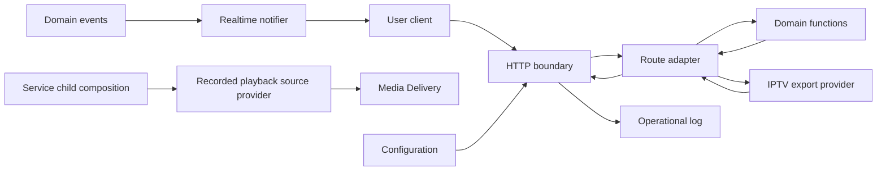
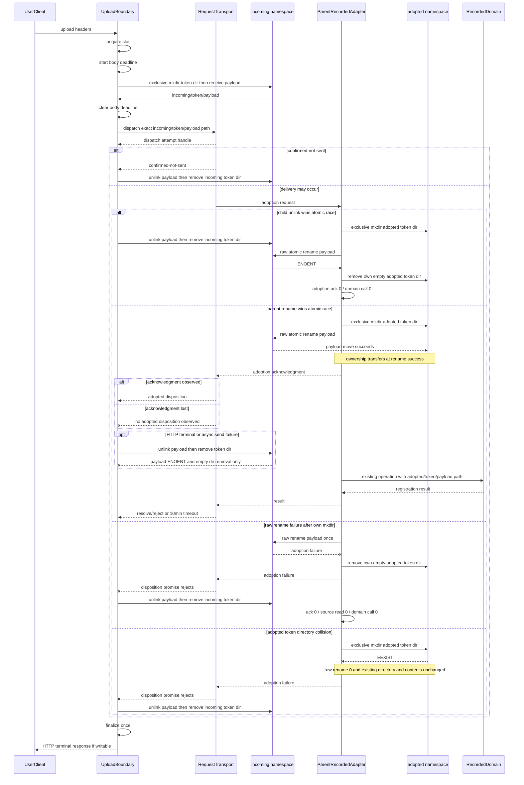
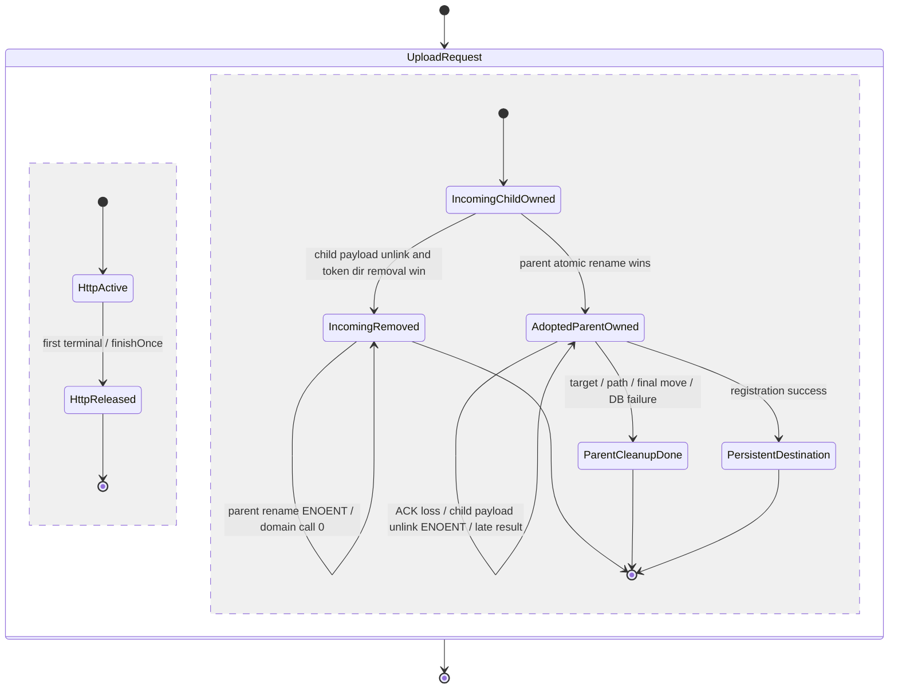
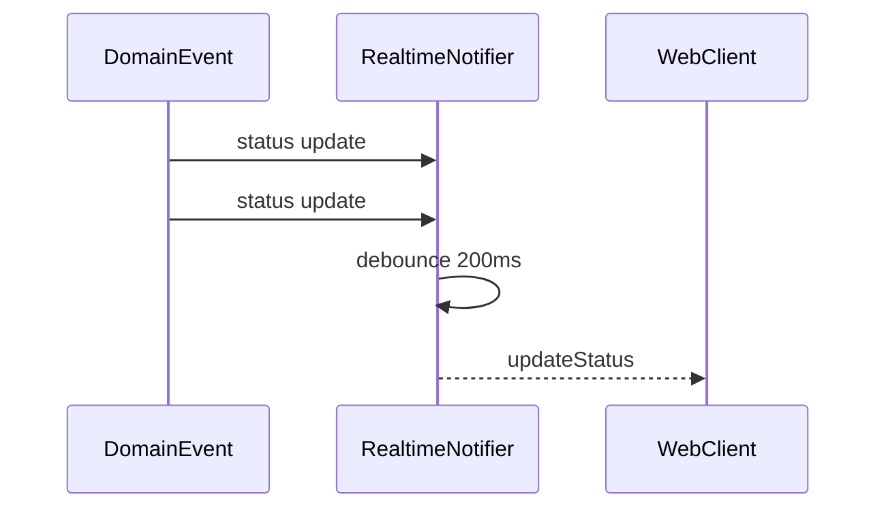

# Web・API・リアルタイム通知提供機能 設計

## 1. 目的

この機能は、EPGStation の Web 画面、公開 API、画像・映像、動画アップロード、API 文書、およびリアルタイム更新通知を利用者
へ提供する。HTTP 要求を受け付け、入力を確認し、予約・録画などを担当する機能へ処理を委譲し、その結果を公開契約に従って返
す。

この機能は通信の入口と出口を担当する。予約できるか、録画済み番組を削除できるか、どの番組を返すか等の業務判断は各担当機能
へ委ねる。

この機能は、予約・録画を管理する親プロセスから起動される独立したNode.js子プロセス内で動作する。本書ではこれを「Web・API
提供子プロセス」と呼ぶ。これはブラウザーで動作するWeb clientやfrontendを指す語ではない。

### 1.1 目標

-   Web 画面、静的ファイル、API 文書、および主要 API を同じ server から提供する。
-   公開 API の method、URL、入力、成功応答、エラー応答、および通知名を維持する。
-   HTTP・HTTPS、配信サブディレクトリ、および CORS 設定を反映する。
-   HLS の公開 path と配信用一時ファイルの公開範囲を維持する。
-   動画アップロードを既定3件まで並行して受け付け、他の Web・API 要求を妨げない。
-   状態変化を本文なしのリアルタイム通知としてまとめて配信する。

### 1.2 対象外

-   予約、録画、録画済み番組、エンコード、配信、容量管理、および IPTV 出力内容の業務判断
-   Web 画面の表示構成と操作設計
-   チューナーサーバーとの通信
-   server 全体の起動順、子 process 再起動判断、および停止順
-   公開 API に共通の新しい認証を追加すること
-   アップロードファイルの容量制限、同時受信 byte 制限、および永続的な受付状態
-   HLS の生成、stream ID の採番、エンコード process の終了、および配信終了時のファイル削除

## 2. 責任境界と依存関係

### 2.1 この機能が所有する責任

-   HTTP・HTTPS listener とリアルタイム通知 listener の提供
-   配信サブディレクトリを含む route 構成
-   Web 配布物、画像、サムネイル、配信用一時ファイル、および API 文書の公開
-   公開 API の入力確認、担当機能への委譲、および HTTP 応答への変換
-   共通 JSON、playlist、file、byte range、およびエラー応答
-   公開 URL の Host、通信方式、およびサブディレクトリの組立て
-   IPTV route の HTTP carrier と、要求由来の公開 URL builder の生成・注入
-   アップロードの同時実行枠、受信期限、`incoming/{uploadToken}/payload`の一時file所有、およびHTTP終了までのrequest
    lifecycle
-   状態更新通知とエンコード進捗通知の200ミリ秒集約
-   service child compositionで、EncodingとMedia Deliveryが要求する録画済みresource利用portを、Process Messagingの内部
    resource-use clientへ一回bindingすること
-   同じcompositionで、Encodingの待機中・実行中ID providerとMedia Deliveryのactive録画file配信ID providerを、Process
    Messagingのcurrent-generation snapshot handlerへ一回bindingすること
-   service child compositionで、録画済み番組管理機能が所有する録画ファイル再生source providerを、Media Deliveryの
    consumer portへ一回bindingすること
-   HTTP access log

### 2.2 境界外の責任

-   各 API が呼び出す業務機能が、検索、更新、削除、録画、および配信の可否と結果を決める。
-   サーバー内部のプロセス間通信機能が、管理側への型付き依頼、request ID、request固有reply対応付け、通常期限、late
    reply、10分のアップロード登録期限、二値upload dispatch disposition、atomic adoption後のacknowledgment、および録画済
    みresource利用leaseのidentity・期限・releaseと利用中snapshotのgeneration・期限・配送を担う。
-   サーバー設定管理機能が、`concurrentUploadNum` と `uploadReceiveTimeoutMs` の省略値、型・範囲の検証、および設定
    snapshot を担う。
-   映像配信・再生連携機能が HLS ファイルを生成し、配信終了時に整理する。
-   録画済み番組管理機能が、`incoming/{uploadToken}/payload`から`adopted/{uploadToken}/payload`へのatomic rename成功後の
    一時file/token directoryを所有し、保存先への移動、database登録、失敗時cleanup、および`adopted` recoveryを担う。
-   録画済み番組管理機能が、録画file・録画済み番組・実path・動画情報を解決し、TS/encodedと録画中/完了済みreaderを選択す
    る再生用source providerを所有する。Media Deliveryは解決済みsourceを採用して配信する。
-   IPTV 向けチャンネル一覧・番組表出力機能が M3U と XML の正確な byte、項目、空白、改行、並び順、および文書内 URL の配
    置を生成する。本機能は生成済み文書を再構成しない。

### 2.3 許可する依存と依存方向



依存方向は次のとおりとする。

1. HTTP route は公開 request を API model の入力へ変換する。
2. API model は担当 domain またはサーバー内部のプロセス間通信機能へ依存する。
3. domain は Express、HTTP response、Socket.IO、および upload middleware へ依存しない。
4. 共通 response helper は domain の状態を読み取らない。
5. リアルタイム通知は状態の再取得契機だけを伝え、変更内容を複製しない。
6. service child compositionはrecorded playback source providerをMedia Deliveryへ一回だけ渡し、providerのDB/path/reader
   解決またはMedia Deliveryのprocess/HLS/HTTP応答を再実装しない。

### 2.4 この設計を再確認する変更

-   公開 API の method、URL、入力、status、本文、header、または内容種類を変更する場合
-   `subDirectory`、HTTP・HTTPS、CORS、または接続元証明書の設定形式を変更する場合
-   HLS の公開相対 path、配信用一時ファイルの保存先、または静的配信 route を変更する場合
-   `concurrentUploadNum`、アップロード受信期限、登録期限、または実行枠の解放条件を変更する場合
-   EncodingまたはMedia Deliveryの録画済みresource利用port、Process Messagingのlease client、service child
    generation、snapshot provider/handler、またはrelease責任を変更する場合
-   録画ファイル再生source provider、Media Deliveryのconsumer port、またはsource採用後のreader ownershipを変更する場合
-   リアルタイム通知名、集約時間、path、port、または payload を変更する場合
-   API 文書生成方法、Express/OpenAPI middleware、Multer、または Socket.IO の主要版を変更する場合
-   共有 server test 基盤または最低対応 Node.js 版を変更する場合

## 3. 設計上の不変条件

-   公開request・response、status、エラー表現、HLS公開path、Socket.IO通知名、および認証条件を変更しない。
-   API文書はruntime responseと同じfield名・配列形を記載する。
-   uploadはbody受信前から最初のterminal decisionまで起動時snapshotの実行枠を所有し、要求単位で受信期限とsingle
    finalizerを管理する。一時fileは`incoming/{uploadToken}/payload`にある間はservice childが所有し、parentによる
    `adopted/{uploadToken}/payload`へのsame-filesystem atomic rename成功時だけrecorded ownerへ不可逆に移る。ACK受信と
    delivery可能性だけでは移転しない。
-   公開APIの業務判断は各担当機能へ委ね、HTTP境界で独自の可否を追加しない。

## 4. 機能構成

| コンポーネント              | 役割                                                                                                             | 主な依存                           |
| --------------------------- | ---------------------------------------------------------------------------------------------------------------- | ---------------------------------- |
| Service Composition         | middleware、route、静的配信、文書、HTTP・HTTPS、および通知 server を構成する。                                   | Configuration、Operational Log     |
| Static File Publisher       | Web 配布物、画像、サムネイル、配信用一時ファイルを決められた root から配信する。                                 | Filesystem                         |
| OpenAPI Request Boundary    | 公開入力を定義に従って確認し、route adapter へ渡す。                                                             | API Document、Route Adapter        |
| Route Adapter               | HTTP 入力を担当 API model へ渡し、結果を公開応答へ変換する。                                                     | Domain API Models、Response Writer |
| Response Writer             | JSON、playlist、file、range、download、および共通エラー応答を生成する。                                          | HTTP、Filesystem                   |
| Upload Admission Controller | 同時実行枠、body受信、受信期限、exact incoming payload/token directory cleanup、および一回だけの解放を管理する。 | Configuration、Multer、Filesystem  |
| Public URL Builder          | Host、HTTPS 判定、および配信サブディレクトリから外部向け URL を組み立てる。                                      | HTTP Request、Configuration        |
| IPTV Route Adapter          | OpenAPIがcoerceしたqueryを変更せずproviderへ写し、要求ごとのURL builderを注入する。                              | Public URL Builder、IPTV Provider  |
| Realtime Notifier           | 同種通知を200ミリ秒まとめ、接続中 client へ本文なしで送る。                                                      | Socket.IO                          |
| Listener Factory            | 設定に応じて HTTP、HTTPS、接続元証明書、および通知 port を開始する。                                             | Configuration、Node.js HTTP        |
| Recorded Use Port Binding   | EncodingとMedia Deliveryのconsumer portを同じPM resource-use clientへ一回bindingする。                           | Process Messaging、Domain Ports    |

## 5. 公開経路と機能

### 5.1 配信面

`<base>` は、`subDirectory` がなければ空、設定されていれば正規化済みの配信サブディレクトリを表す。

| 提供物                     | 公開経路             | 内容の取得元                       |
| -------------------------- | -------------------- | ---------------------------------- |
| Web 画面                   | `<base>/`            | frontend の production 配布物      |
| 組込画像                   | `<base>/img`         | server 配布物の画像 directory      |
| サムネイル                 | `<base>/thumbnail`   | 設定されたサムネイル保存先         |
| HLS 等の配信用一時ファイル | `<base>/streamfiles` | 設定された配信用一時ファイル保存先 |
| 公開 API                   | `<base>/api`         | OpenAPI route と担当 API model     |
| 機械可読 API 文書          | `<base>/api/docs`    | `api.yml` と runtime 情報          |
| API 説明画面               | `<base>/api-docs`    | 配布物が存在する場合の Swagger UI  |
| リアルタイム通知           | `<base>/socket.io`   | Socket.IO                          |

`subDirectory` は Web、API、文書、静的ファイル、およびリアルタイム通知へ一貫して適用する。

### 5.2 API の機能群

| 機能群         | 受け付ける能力                                                     | 結果を決める担当機能 |
| -------------- | ------------------------------------------------------------------ | -------------------- |
| 番組情報       | チャンネル、ロゴ、番組表、検索、放送中番組                         | 番組情報・番組表機能 |
| 予約           | 一覧、件数、詳細、追加、編集、取消、スキップ解除、重複解除、再計算 | 録画予約管理機能     |
| 自動予約ルール | 一覧、詳細、追加、編集、有効化、無効化、削除                       | 自動予約ルール機能   |
| 録画中         | 録画中一覧、録画タイマー再設定                                     | 予約録画実行機能     |
| 録画済み番組   | 番組、動画、ドロップログ、タグ、保護状態、サムネイルの参照と操作   | 各担当機能           |
| エンコード     | 追加、一覧、進捗確認、取消                                         | 録画ファイル変換機能 |
| ストレージ     | 録画保存先の容量参照                                               | 容量管理機能         |
| 映像配信       | ライブ・録画済み映像の開始、継続、停止、状態参照                   | 映像配信機能         |
| IPTV           | チャンネル一覧 M3U、電子番組表 XML                                 | IPTV 出力機能        |

Route Adapter は入力の carrier 変換だけを行い、担当機能の結果を独自に上書きしない。

予約の再計算（`POST /api/reserves/update`）は、予約の更新を手動で始める trigger である。更新の処理を開始した時点で 200 を返し、
更新の完了は待たない。開始後に更新が失敗したときの扱いは、この API の範囲外とする。

## 6. 公開 API 契約

### 6.1 維持する契約

すべての route について、次を現在の公開契約として維持する。

-   HTTP method と path
-   path、query、header、body、multipart にある既存入力の名前と位置
-   入力の必須性と既存の型変換
-   成功 status と必須 response body
-   response の内容種類と既存 header
-   route ごとの入力エラー、対象なし、競合、および内部エラーの status と本文

統一されていない route 別エラーを、この設計だけで共通形式へ変更しない。実際の route、`api.d.ts`、`api.yml` の整合を
contract test で固定する。

### 6.2 特に固定する互換点

| 契約                       | 設計                                                                                                         |
| -------------------------- | ------------------------------------------------------------------------------------------------------------ |
| 録画済み映像の stream 情報 | field 名 `viodeFileId` をそのまま返す。                                                                      |
| 予約一覧                   | `normal`、`conflicts`、`skips`、`overlaps` はすべて配列で返す。                                              |
| 予約 item の放送波         | 各 item に `channelType` を含める。                                                                          |
| ルール追加                 | `POST <base>/api/rules` と `POST <base>/api/rules/keyword` の両方を維持する。                                |
| 録画タイマー再設定         | `POST <base>/api/recording/resettimer` は body なしを受け付け、成功時に HTTP 200 と `{ code: 200 }` を返す。 |
| 公開設定                   | `broadcast` を含める。                                                                                       |
| リアルタイム通知           | `updateStatus` と `updateEncode` を本文なしで送る。                                                          |
| API 文書                   | 予約一覧の四項目を配列として記載し、stream 情報を `viodeFileId` として記載する。                             |

API 文書の二箇所の訂正は runtime response の変更ではない。文書を実際の応答へ合わせる。

予約 item の `channelType` は応答へ含める。`channelId` から channel 一覧を引いて放送波を得る引き当てを client 側に
持たせず、`api.yml` では required とする。

### 6.3 IPTV route adapter と provider port

IPTV の公開 route、入力位置、既定値、必須性、OpenAPI carrier 変換、および既存エラーは変更しない。

| route                              | adapter が provider へ渡す入力                                     | 成功応答                                                         |
| ---------------------------------- | ------------------------------------------------------------------ | ---------------------------------------------------------------- |
| `GET <base>/api/iptv/channel.m3u8` | 既存 `mode`、既存 `isHalfWidth`、要求ごとの `IptvPublicUrlBuilder` | HTTP 200、`application/x-mpegURL; charset="UTF-8"`、生成済み M3U |
| `GET <base>/api/iptv/epg.xml`      | 既存 `days`、既存 `isHalfWidth`                                    | HTTP 200、`application/xml; charset="UTF-8"`、生成済み XML       |

確認済みのExpress OpenAPI coercion middlewareはrouteより前にinteger queryへ`Math.floor(Number(input))`を一回適用する。そ
のためraw carrier `1.8`はrouteで`1`、`-1.2`は`-2`となり、routeはcoerce済み整数を再変換せずそのまま渡す。adapter
はOpenAPI middleware後のinteger carrierをproviderへそのまま渡し、二回目の`Math.floor`、数値化、または独自の丸めを追加し
ない。これはowner-approved `server-iptv-export` Requirements R1.9/R1.10のcanonical contractである。`mode`、
`days`、`isHalfWidth`の新しい値域、利用可能性検査、拒否、既定値、query aliasは追加しない。文書の対象選択、表記、文字置
換、並び順、空白、改行、および文書内URLの配置はIPTV providerが所有し、adapterは返された文字列をbyte変更せず応答本文へ渡
す。

```typescript
interface IptvPublicUrlBuilder {
    channelLogoUrl(channelId: number): string;
    liveM2tsUrl(channelId: number, mode: number): string;
}

interface IptvRequestContext {
    ensureActive(): void;
}

interface IptvChannelListInput {
    readonly isHalfWidth: boolean;
    readonly mode: number;
    readonly publicUrls: IptvPublicUrlBuilder;
}

interface IIPTVApiModel {
    getChannelList(input: IptvChannelListInput): Promise<string>;
    getEpg(days: number, isHalfWidth: boolean): Promise<string>;
    getEpgForRequest?(days: number, isHalfWidth: boolean, requestContext: IptvRequestContext): Promise<string>;
}
```

provider port は実装の `IIPTVApiModel` である。`getEpgForRequest` は任意実装で、`epg.xml` route は存在すれば `requestContext` を渡して呼び、無ければ `getEpg` を呼ぶ。`requestContext` による途中打ち切り（timeout・応答 close の検知）は `server-iptv-export` が所有する。

### 6.4 録画済み番組・個別動画削除の transport 境界

次の二つの child HTTP route は公開 contractを維持し、削除結果を決めず、既存のサーバー内部プロセス間通信経路へ型付き
operationとして委譲する。

| child route                               | path入力とchild側呼出し                                                                   | 既存PM/IPC operation                                                                                        | 成功・失敗応答                                          |
| ----------------------------------------- | ----------------------------------------------------------------------------------------- | ----------------------------------------------------------------------------------------------------------- | ------------------------------------------------------- |
| `DELETE <base>/api/recorded/{recordedId}` | 既存10進path変換後、service child deletion coordinatorの`deleteByUser(recordedId)`をawait | model `recorded`、function `delete`、args `{ recordedId }`、`void` / error reply、既存5,000ms期限           | 成功はHTTP 200と`{ code: 200 }`、失敗は既存HTTP 500本文 |
| `DELETE <base>/api/videos/{videoFileId}`  | 既存10進path変換後、typed individual-video deletion requestをawait                        | model `recorded`、function `deleteVideoFile`、args `{ videoFileId }`、`void` / error reply、既存5,000ms期限 | 成功はHTTP 200と`{ code: 200 }`、失敗は既存HTTP 500本文 |

番組全体削除では、child coordinatorが対象Encode取消を完了した後だけ、抽象
`ChildUserDeletionRequestPort.requestUserDeletion(recordedId)`を呼ぶ。service child composition adapterはこれを
`IPCRecordedManageModel.delete(recordedId)`へ写像する。個別動画削除は
`IPCRecordedManageModel.deleteVideoFile(videoFileId)`へ写像し、childで番組全体削除用のEncode取消を追加しない。

本機能が所有するのはroute carrier、typed operationの呼出し、Promise結果から既存HTTP応答への変換、およびchild側adapterの
compositionだけである。PMはrequest ID、request固有reply相手、既存期限、late reply、listener/timer解放を所有し、
`server-application-runtime`はparent handlerからworkflow parent coordinatorへのbindingとchild identityを所有する。
workflow/recorded/recording側が所有するprepared deletion、録画停止terminal barrier、resource lock、停止後の再読取、
exact-ID削除、個別削除から番組全体削除への判断を、本機能のroute、adapter、stateへ複製しない。

### 6.5 録画済みresource利用portのservice child composition

長期保存Encodeと録画file配信が容量不足削除と競合しないように、service child compositionは次の既存機能間contractを接続す
る。この接続は内部compositionであり、公開route、request、response、WebSocket、設定、DB schema、または利用者向けoperation
を追加しない。

```typescript
interface RecordedResourceUseClient {
    acquire(recordedId: number, kind: 'encoding' | 'delivery'): Promise<{ readonly token: object }>;
    release(token: object): Promise<void>;
}

interface IRecordedResourceUsePort {
    acquire(recordedId: number, kind: 'encoding'): Promise<{ readonly token: object }>;
    release(token: object): Promise<void>;
}

interface RecordedDeliveryUsePort {
    acquire(recordedId: number, kind: 'delivery'): Promise<{ release(): Promise<void> }>;
}

type EncodingRecordedUseSnapshot =
    | { readonly status: 'known'; readonly recordedIds: ReadonlySet<number> }
    | { readonly status: 'unknown' };

type DeliveryRecordedUseSnapshot =
    | { readonly status: 'known'; readonly recordedIds: ReadonlySet<number> }
    | { readonly status: 'unknown' };

interface IEncodingRecordedUseSnapshotProvider {
    getQueuedAndRunningRecordedIds(): EncodingRecordedUseSnapshot;
}

interface DeliveryRecordedUseSnapshotProvider {
    getActiveRecordedFileDeliveryIds(): DeliveryRecordedUseSnapshot;
}

interface ChildRecordedUseSnapshotHandler {
    getSnapshot():
        | { readonly status: 'known'; readonly recordedIds: readonly number[] }
        | { readonly status: 'unknown' };
}
```

`RecordedResourceUseClient`は`server-process-messaging`所有の正準clientである。service child compositionは同じinstance
をEncoding adapterとMedia Delivery adapterへ一回bindingする。Encoding adapterは`acquire`と`release`をそのまま委譲する。
Media Delivery adapterはPMから得たopaque tokenを、exact tokenのPM `release`を高々一回呼ぶ`release()`付きresourceへ包む。
adapter自身はrecorded IDの利用可否、容量削除可否、5秒期限、late reply、generation、request ID、retry、永続化、または
resource終端時点を決めない。

Encodingは識別番号、job、待機列、または追加通知を公開する前にportを取得し、同じexact tokenを待機中から実行・結果
settlement完了まで保持する。結果settlementへ到達したjobのexact releaseはEncoding Task 5.3が所有する。Media Deliveryは
recorded fileの最終再照会・open・response開始より前にowner Designどおりportを取得する。acquireの失敗・期限超過・状態不明
はowner domainへそのまま返し、service child compositionが成功へ変換、再試行、fallback、またはleaseなし実行を行わな
い。releaseの失敗もowner domainの確定済み結果を巻き戻さず、PM parent registryが同じrecorded IDの容量不足削除を安全側に遮
断する。

service child再起動時は新しいPM clientと二adapterを新しいprocessで一回構成し、前processのtoken、release closure、待機
request、またはdomain処理を復元しない。旧generation leaseの保持・late release・削除blockはPMとRuntimeのprovider契約であ
り、本機能が切断だけからresource終端を推測しない。

同じservice child compositionは、Encodingの`getQueuedAndRunningRecordedIds()`とMedia Deliveryの
`getActiveRecordedFileDeliveryIds()`をPM snapshot handlerへ一回bindingする。handlerは両providerをread-onlyで読み、両方
が`known`の場合だけSetで重複除去した和集合をserializableなreadonly `number[]`へ変換する。Encodingの待機列と実行中一覧を
どちらも含め、Media Deliveryはactiveな録画file配信だけを含み、live配信を含めない。一方でも`unknown`なら部分集合または空
集合を返さず`unknown`とする。Set、token、object参照をprocess間payloadへ含めない。

compositionはdomainのqueue/stream registryを変更、停止、取消、drain、待機、再試行せず、snapshotを永続化しない。PM
client/handlerのgeneration、request ID、通常5秒期限、late replyはPM ownerへ委譲する。新processは新しいprovider bindingだ
けを構成し、前generationのsnapshot、pending request、tokenを復元しない。snapshotは候補選別だけに使われ、同じPM clientへ
bindingしたleaseとparent側の権威的deletion gateを置換しない。

### 6.6 録画ファイル再生source providerのservice child composition

service child compositionは、録画済み番組管理機能が所有する`RecordedPlaybackSourceProvider`を一つ構成し、
Media Deliveryのrecorded stream consumer port（`RecordedDeliveryLeaseConsumer`）へ一回だけ渡す。この接続は`src/model/ModelContainerSetter.ts`の内部compositionであり、公開
route、request、response、WebSocket、設定、DB schema、IPC operation、HLS公開pathを追加または変更しない。

同じprovider instanceはrecorded IDだけを返す予備照会と、そのexpected IDを照合して全情報を再読取するopened source操作の両
方を提供する。compositionはその二操作の意味、source variantの選択、採用前/後のcleanup、またはMedia Deliveryのdirect
DB/path fallbackを実装・検証しない。providerの失敗を既存の配信開始失敗としてconsumerへそのまま渡し、binding層で成功、
retry、fallbackへ変換しない。

service child再起動時は新しいproviderとconsumer bindingだけを構成し、旧processのreader、source、stream、process、HLS成果
物、再生途中状態を復元しない。providerとMedia Deliveryは各々のowner taskで実装・testを所有し、本節のtaskはbindingとその
error handoffだけを所有する。

## 7. HLS と静的ファイル

### 7.1 HLS 公開 path

HLS を開始して得た `streamId` に対し、client から見える親 playlist の相対 path は次を維持する。

```text
./streamfiles/stream{streamId}.m3u8
```

`Static File Publisher` は `<base>/streamfiles` を設定済みの配信用一時ファイル保存先へ対応付ける。映像配信機能が同じ保存
先へ `stream{streamId}.m3u8` と関連ファイルを作成するため、追加の公開 URL 変換は行わない。

### 7.2 公開範囲

-   `<base>/streamfiles` は設定された一つの static root の内側だけを公開する。
-   要求されたファイルが存在しない場合、別の filesystem file を代わりに返さない。
-   `..`、符号化された区切り、または絶対 path 相当の要求で static root 外を返さない。
-   この機能は HLS ファイルの生成・削除時期を決めず、配信機能が作成したファイルだけを公開する。

## 8. 共通 HTTP 応答

### 8.1 JSON とエラー

-   正常な JSON 応答には既存の private/no-cache header を付ける。
-   API 定義に合わない入力は OpenAPI の既存入力エラー経路へ渡す。
-   予約・ルールの追加と編集、手動のエンコード追加を担当機能が`InvalidSubDirectory`（保存先内ディレクトリまたはエンコード出
    力先ディレクトリが録画保存先の外を指す）で拒否した場合は、内部失敗ではなく入力エラーとして HTTP 400 と
    `{ code: 400, message: 'Bad Request', errors: 'InvalidSubDirectory' }`を返す。共通の変換は`src/model/service/api.ts`の
    `responseOperationError`が行う。
-   予約の編集を録画予約管理機能が`ReservationIsNotEditable`（編集の対象ではない予約。自動予約とRule由来の番組リレー予約）
    で拒否した場合は、要求の形は正しく対象の予約の種類による拒否なので、HTTP 409 と
    `{ code: 409, message: 'Conflict', errors: 'ReservationIsNotEditable' }`を返す。変換は同じ`responseOperationError`が行う。
    機械可読な API 文書では、`PUT /reserves/{reserveId}`の応答に 409（本文は`Error`）を載せる。
-   `responseOperationError`は`InvalidSubDirectory`と`ReservationIsNotEditable`以外の失敗を、
    `responseServerError`と同じ HTTP 500 で返す。予約が無い（`ReservationIsNotFound`）編集と、入力・encode option不正
    （`ReservationEditError`）の編集も HTTP 500 である。どれも IPC 越しでもメッセージ文字列で判別できる。
-   内部処理の失敗は HTTP 500 と `code`、`message`、必要な場合だけ `errors` を持つ既存本文へ変換する。
-   すべての HTTP 要求を access log へ記録する。

### 8.2 内容種類

playlist、画像、ログ、映像、XML、および静的ファイルには用途に対応する既存の内容種類を付ける。download 指定では保存用の内
容種類とファイル名を `Content-Disposition` へ設定する。

### 8.3 単一 byte range

映像ファイルの単一rangeは、owner-approved R4.4/R4.5のcanonical範囲として、解釈後に次を満たす場合にHTTP 206とする。

```text
0 <= start <= end < fileSize
```

このcanonical範囲ではHTTP 206、`Content-Range: bytes {start}-{end}/{fileSize}`、 `Content-Length: {end - start + 1}`、お
よび閉区間の該当byte列を返す。解釈後の`start`が`fileSize`以上ならHTTP 416と `Content-Range: bytes */{fileSize}`を返
し、file streamを作らない。

既存helperにはcanonical ACだけでは結果を決められない境界があるため、推測で新しい正規化や拒否を定めない。次のexact
carrierは、`unittest/imp`（`IMP#SI-9.2/range-*`）と実HTTP characterization（`INT#SI-9.4/range-*`）の両方が固定している。
表の「実測」は、sourceからheader設定またはstream error後の最終wire結果を断定できなかったcaseについて、実HTTPで確定した
status、`Content-Range`、`Content-Length`、response byte列、およびhandle解放回数である。

| named case                     | exact `Range` carrier（8-byte fixture） | sourceで確定できる期待                                     | 実測                                         |
| ------------------------------ | --------------------------------------- | ---------------------------------------------------------- | -------------------------------------------- |
| `range-absent`                 | headerなし                              | 200、`Content-Range`なし、`Content-Length: 8`、全8 byte    | stream close一回                             |
| `range-empty`                  | `""`                                    | 200、`Content-Range`なし、`Content-Length: 8`、全8 byte    | stream close一回                             |
| `range-normal-closed`          | `bytes=2-5`                             | 206、`bytes 2-5/8`、length 4、該当4 byte                   | stream close一回                             |
| `range-open-ended`             | `bytes=3-`                              | 206、`bytes 3-7/8`、length 5、該当5 byte                   | stream close一回                             |
| `range-suffix`                 | `bytes=-3`                              | 206、`bytes 5-7/8`、length 3、末尾3 byte                   | stream close一回                             |
| `range-oversized-suffix`       | `bytes=-9`                              | 解釈後startが負となり、`createReadStream`が同期的にthrowする | HTTP 500（既存の内部エラー本文。`errors`はNodeの範囲外エラーのmessage）、streamは作られず解放0回 |
| `range-start-equals-end`       | `bytes=3-3`                             | 206、`bytes 3-3/8`、`Content-Length: 1`、該当1 byte（`3`） | stream close一回。同じ接続の次の応答も壊れない |
| `range-start-greater-than-end` | `bytes=5-3`                             | helperは206 headerを設定してstreamを作ろうとする | HTTP 500（既存の内部エラー本文）、streamは作られず解放0回 |
| `range-start-equals-file-size` | `bytes=8-`                              | 416、`bytes */8`、stream作成0、body 0 byte | wire `Content-Length: 0`、解放0回 |
| `range-end-equals-file-size`   | `bytes=2-8`                             | 416、`bytes */8`、stream作成0、body 0 byte | wire `Content-Length: 0`、解放0回 |
| `range-malformed`              | `bytes=abc-def`                         | 206、`bytes 0-7/8`、length 8、全8 byte                     | stream close一回                             |
| `range-multiple`               | `bytes=0-1,4-5`                         | 206、`bytes 0-1/8`、length 2、先頭2 byte                   | stream close一回                             |

streamを作るcaseは正常完了とclient closeの競合でも同じfile handleを最大一回だけ解放し、streamを作らないcaseは作成・解放
とも0回であることを確認する。実測の結果を現在の契約として記録しており、差分を隠すための期待値変更、新しい複数range対応、または公開API変更を行わない。

## 9. 公開 URL の組立て

外部再生先や playlist に埋め込む URL の組立ては次の順である。

1. 要求の `Host` を接続先として使用する。
2. 実際の要求が HTTPS、または `X-Forwarded-Proto` が HTTPS を示す場合は `https` を使用する。
3. それ以外は `http` を使用する。
4. `subDirectory` が設定されていれば Host の後へ含める。
5. 各 route の path と query を追加する。

`subDirectory` は設定済みの値または空である。Host が必要な route で Host を取得できない場合は、担当 provider
や DB を呼ぶ前に既存の route エラーへ確定する。`X-Forwarded-Proto` は確認済み実装どおり値が正確に HTTPS を示す場合だけ
HTTPS 判定へ使い、新しい proxy trust 設定は追加しない。

IPTV Route Adapter（`channel.m3u8.ts`）は Host・scheme・`subDirectory` から `IptvPublicUrlBuilder` を要求ごとに作り、 `channelLogoUrl(channelId)` を
`<scheme>://<host><base>/api/channels/{channelId}/logo`、 `liveM2tsUrl(channelId, mode)` を
`<scheme>://<host><base>/api/streams/live/{channelId}/m2ts?mode={mode}` として provider へ注入する。IPTV provider は
builder が返した URL を M3U の既存位置へ置き、URL 文字列を連結しない。

live/recorded の playlist と外部再生連携は、`ApiUtil`（`createM3U8PlayListStr`・`getHost`）が組み立てる。
公開 path、query、URL scheme、Host、subDirectory の通信内容は変更しない。この設計は Host の固定値や新しい公開routeを追加しない。

## 10. 動画アップロード

### 10.1 起動時設定

`concurrentUploadNum` は省略時3、`uploadReceiveTimeoutMs` は省略時300,000ミリ秒とする。サーバー設定管理機能が型と範囲を
検証し、Web・API提供子プロセスは起動時に二つの値を読み取って次の起動まで同じ値を使う。

```typescript
interface UploadRuntimeSettings {
    readonly concurrentUploadNum: number;
    readonly uploadReceiveTimeoutMs: number;
}
```

-   `concurrentUploadNum` が1以上の安全な整数でないか、`uploadReceiveTimeoutMs` が1以上2,147,483,647以下の整数でなけれ
    ば、HTTP listener を開始する前にWeb・API提供子プロセスの起動を失敗させる。
-   稼働中に設定ファイルが変更されても、現在の process の実行枠数を変更しない。
-   稼働中に設定ファイルが変更されても、現在の process の受信期限を変更しない。
-   二つの設定を公開設定、公開 request、公開 response、および API 文書へ追加しない。
-   child/parent compositionは`incoming`と`adopted`を`uploadTempDir`直下へ作成し、両directoryのfilesystem deviceが同じこ
    とをHTTP listener開始前に確認する。作成またはsame-filesystem確認に失敗した場合は起動を失敗させる。
-   設定された受信期限と登録IPC期限10分は別の連続しない期限であり、body受信成功時に前者を終了してから後者を開始する。
-   `uploadReceiveTimeoutMs` を HTTP/HTTPS listener 全体の `requestTimeout`、接続確立期限、header 期限、keep-alive 期
    限、または response 期限へ設定しない。upload 以外の request と、確立済み live/recorded media response の継続時間はこ
    の値の対象外である。

### 10.2 実行枠

Upload Admission Controller は process 内の使用中件数だけを保持する。次の `UploadAdmission`・`UploadRuntimeSettings`・`UploadTempOwnership` は責務を示す概念上の型で、実装にこの名前の型は無い（実行枠は `UploadAdmissionController`、設定は `Configuration` の `concurrentUploadNum`・`uploadReceiveTimeoutMs`、一時 file の所有は incoming／adopted の directory の別が担う）。`UploadRequestFinalizer` も概念上の型で、実装の終了処理は class の `finishOnce` が boolean を返す。

```typescript
interface UploadAdmission {
    tryAcquire(): UploadLease | null;
}

interface UploadLease {
    releaseOnce(): void;
}

interface UploadRequestFinalizer {
    finishOnce(reason: 'success' | 'failure' | 'abort' | 'receive-timeout' | 'registration-timeout'): void;
}

type UploadTempOwnership = 'incoming-service-child-owned' | 'adopted-parent-recorded-owner-owned';

type UploadedVideoDispatchDisposition =
    | {
          readonly kind: 'confirmed-not-sent';
          readonly error: Error;
      }
    | {
          readonly kind: 'adopted';
          readonly completion: Promise<void>;
      };

interface UploadedVideoDispatchAttempt {
    readonly disposition: Promise<UploadedVideoDispatchDisposition>;
}

interface UploadedVideoRegistrationPort {
    dispatch(option: UploadedVideoFileOption): UploadedVideoDispatchAttempt;
}
```

不変条件は次のとおりとする。

-   使用中件数は0以上 `concurrentUploadNum` 以下である。
-   実行枠は upload body を読む前、一時ファイル名を決める前に取得する。
-   取得済み request は body 受信、入力確認、登録待ちを通じ、success、failure、abort、受信期限、または登録IPC期限の最初
    の terminal decision まで一件として数える。
-   同じrequestの成功、失敗、timeout、`req.aborted`、`res.finish`、`res.close`が競合しても一回だけ解放する。
-   finalizerはHTTP response、listener、timer、body teardown、およびslotを一回だけ終端し、abort、10分期限、またはasync
    send failureではrequestのexact `incoming/{uploadToken}/payload`だけをunlinkOnceし、続いて空のexact token directoryだ
    けをremoveOnceする。payloadの`ENOENT`はparent rename先着を示すno-opである。
-   delivery可能性、attempt handle、またはACK受信をownership transferにしない。filesystem上の所在だけを正本とし、
    `incoming/{uploadToken}/payload`ならservice child、atomic rename後の`adopted/{uploadToken}/payload`ならparent
    recorded ownerがpayloadとtoken directoryを所有する。
-   正常なbody終了でも発生する`req.close`は、登録処理またはHTTP応答より前に枠を解放する条件として使用しない。
-   実行枠が満杯なら待機列へ入れず、その upload だけを body 受信前に既存の multipart error 経路で拒否する。
-   既定値3では、3件の受付中に来た4件目を拒否する。通常の Web・API、配信、通知は継続する。

### 10.3 受付データ

一件の upload request は次を受け付ける。

-   一件の動画ファイル
-   対象となる録画済み番組
-   保存先名と任意の保存先サブディレクトリ
-   表示名
-   ファイル種類

公開 multipart schema、成功 status、およびエラー表現を変更しない。ファイルの最小サイズ、最大サイズ、同時 upload 全体の
byte 上限を追加しない。

ファイル名の通常の `filename` parameterはUTF-8を既定として解釈する。`filename*` は明示されたcharsetで一回だけ解釈し、
両parameterがある場合は `filename*` を優先する。解釈済みの `originalname` を文字の見た目によって再decodeしないため、
ASCII、日本語、および入力名そのものとしての `é` を保つ。受信器の `defParamCharset: 'utf8'` で通常parameterの既定値だけを
指定し、extended parameterの解釈はmultipart parserへ委ねる（Requirement 6.19）。

`upload-lifecycle.test.ts` の実HTTP受信器testで、通常ASCII・通常UTF-8日本語・通常UTF-8のliteral `é`、extended UTF-8日本語・
extended UTF-8のliteral `é`・extended ISO-8859-1・通常名とextended名の優先順を確認する。実multerから得た `originalname` と
保存済みpayloadをassertし、HTTP終端後の受信器・実行枠・一時file・serverの回収まで確認する。

`uploadTempDir`の直下に、同じfilesystem上の内部namespaceを二つ置く。

```text
<uploadTempDir>/incoming/{uploadToken}/payload
<uploadTempDir>/adopted/{uploadToken}/payload
```

`uploadToken`はrequestごとに一意な内部名で、利用者のfile名、path、公開request、response、またはAPI文書へ露出しない。
service childは`incoming`直下へtoken directoryをexclusive作成し、その直下の固定名`payload`だけへbodyを書く。parentは受信
したfilePathがexact `incoming/{uploadToken}/payload` grammarであり、token directoryがnamespace直下、basenameが
`payload`、tokenが内部生成済みrequest tokenと一致することを、source open/stat/readより前に検証する。公開・IPC・domain
fieldは追加せず、既存filePath carrier内の内部pathだけを検証する。

parentは対応する`adopted/{uploadToken}` directoryをexclusive作成する。directory衝突ならraw renameを0回とし、既存
destination directoryとその内容をunlink、上書き、移動、cleanupしない。exclusive作成成功後だけ
`incoming/{uploadToken}/payload`から`adopted/{uploadToken}/payload`へraw `node:fs.rename`相当でsame-filesystem atomic
renameする。`src/util/FileUtil.ts`の`FileUtil.rename`はrename失敗時にdestinationをunlinkするため再利用しない。

rename前のgrammar不正、directory作成後のrename失敗、またはchild unlink先着では、parentは自分がexclusive作成した空の
`adopted/{uploadToken}` directoryだけをremoveし、incoming payload/token directoryのcleanupをchildへ残す。rename成功の瞬
間からparentだけがadopted payloadとtoken directoryを所有する。childはexact incoming payloadをunlinkし、空になったexact
incoming token directoryをremoveできるが、adopted payload/directoryへ触れない。

parentはrename成功後のadopted payload pathへ `UploadedVideoFileOption.filePath`を差し替えて既存`addUploadedVideoFile`
domain operationを呼ぶ。公開schema、operation signature、およびdomain resultは変更しない。

### 10.4 受信から登録までの sequence



処理順は次のとおりとする。

1. multipart middleware の入口で実行枠を取得する。
2. request-local finalizer を一件作り、`req.aborted`、`res.finish`、`res.close`、および body 受信期限を監視する。
   `req.close`は正常 body 完了でも発生し得るため、それ単独を枠解放条件にしない。
3. body receiver を開始する直前に受信 timer を開始し、設定された upload 一時保存先へ一件のファイルを受信する。
4. body 全体の受信完了または受信失敗 callback で受信 timer を解除し、multipart 入力を既存 OpenAPI schema で確認する。
5. `UploadedVideoRegistrationPort.dispatch`へexact `incoming/{uploadToken}/payload` pathを一回渡す。attempt handleの
   return、send callback、delivery可能性、およびACK受信ではownershipをtransferしない。
6. dispatch前失敗、`confirmed-not-sent`、abort、`res.close`、登録IPC期限、またはasync send failureでは、child finalizer
   がexact incoming payloadだけをunlinkOnceし、空のexact incoming token directoryだけをremoveOnceする。rename先着後の
   payload `ENOENT`はcleanup成功相当のno-opとし、`adopted` payload/directory、namespace全体、または別requestのpathを変更
   しない。
7. parent adapterはfilePathのexact grammarとtokenを確認し、対応する`adopted/{uploadToken}` directoryをexclusive作成す
   る。衝突時はraw rename 0で既存directory/contentを不変にする。作成成功後、domain callとsource open/stat/readより前に
   payloadだけをraw filesystem APIで一回same-filesystem atomic renameする。失敗時destinationをunlinkする
   `FileUtil.rename`は使わない。rename前失敗はparentが自分の空adopted token directoryだけをremoveし、rename成功の瞬間を
   唯一のownership transfer pointとする。
8. parentはrename成功後だけadoption acknowledgmentを返し、PMは観測できた場合だけ`adopted` dispositionをchildへ渡す。ACK
   loss、late ACK、またはchild restartでも、payloadがadopted token directoryにあればparent recorded owner、incoming
   token directoryにあればservice child ownerであり、ACKをownershipの正本にしない。
9. child unlinkとparent renameが競合した場合はfilesystemの先着一操作だけがsourceを取得する。unlink先着ならparent rename
   は`ENOENT`で失敗し、adoption acknowledgment、source read、domain callを各0回とする。rename先着ならchild unlinkは
   payload `ENOENT` no-opとなり、childは空のincoming token directoryだけをremoveし、parentだけがadopted payload/token
   directoryを処理・cleanupする。rename失敗ではparentが自分の空adopted token directoryだけをremoveし、destination
   directory衝突ではraw renameと既存destination変更を各0回とする。PMのdisposition promise rejectionを受けたchildがexact
   incoming payload/token directoryをcleanupする。
10. 録画済み番組管理機能は、対象録画済み番組不在、保存先・subdirectory・path解決失敗、final保存先へのrename/move失敗、ま
    たはDB登録失敗を一つのowner cleanup境界へ収束させる。move前の失敗はsourceを、move成功後の失敗はdestinationを最大一回
    unlinkし、成功時はdestinationを永続fileとして保持する。
11. 登録成功時は HTTP 200 と `{ code: 200, result: 'ok' }` を返す。
12. success、明示failure、abort、受信期限、または登録IPCの10分期限のうち先着理由でfinalizerを一回だけ実行する。finalizer
    は受信timer/listenerを解除し、必要ならrequest/body streamをteardownし、書込可能な場合だけ既存応答を一回確定し、実行
    枠を一回解放する。cleanupが必要ならexact incoming payloadのunlinkと空のtoken directory removeを一回ずつ試み、rename
    先着時のpayload `ENOENT`をno-opにする。
13. finalizer後のMulter callback、`res.finish`/`close`、IPC resolve/rejectは観測して未処理失敗を防ぐが、route、
    response、ownership、cleanup、timer、または枠を復活・二重実行しない。

### 10.5 受信期限

-   起動時に保持した`uploadReceiveTimeoutMs`の受信timerは、実行枠を取得した後、body receiverを呼ぶ直前に開始する。
-   timer は chunk 到着で延長せず、一件の body 受信全体へ適用する。
-   multipart callback が body 全体の成功または失敗へ確定した時点で受信 timer を解除する。入力確認、保存先への移動、登録
    IPC待ち、HTTP response送信、および他 route の response lifetimeへ延長しない。
-   期限が先に到達した場合は、その request の受信を止め、把握済みの一時ファイルを削除対象とし、応答可能なら既存の
    multipart error 経路へ渡す。
-   timer、要求中断、Multer callback が近接しても、request 単位の終了判定を一回だけ行う。遅れて来た callback から route
    や response を二重実行しない。
-   listener-global timeout は使用しないため、同時に進行する live stream、recorded stream、通常 file response、および
    upload 以外の API response は300,000ミリ秒を超えてもこの受信期限では終了しない。

### 10.6 登録 IPC

受信成功後の登録依頼はサーバー内部のプロセス間通信機能を利用し、応答待ち期限を10分とする。

-   PM transport adapterはrequest IDとreply waiterを同期予約し、正常にresolveするupload dispositionを
    `confirmed-not-sent`または`adopted`の二つだけにする。delivery可能性だけを`adopted`へ分類しない。
-   `confirmed-not-sent`はtransportがadoption request未送信を証明した場合だけのchild-cleanup dispositionである。childは
    exact incoming payloadをunlinkし、空のexact incoming token directoryだけをremoveする。
-   parentへdelivery済みでもatomic adoptionが成立しなかった場合はdisposition promiseをerrorでrejectする。
    `confirmed-not-sent`または`adopted`へ誤分類せず、childは同じexact incoming payload/token directory cleanupを行う。
-   `adopted`はparentのatomic rename成功後に発行したadoption acknowledgmentまたは後続resultからだけ確定する。ACK受信は
    rename成功の観測であってownership transfer pointではない。
-   delivery可否が曖昧なasync callback failure、abort、および10分期限ではdispositionを推測せず、childがexact incoming
    payload unlinkと空のtoken directory removeを試みる。parent renameとのatomic raceにより、file所在とownerが一意に決ま
    る。
-   disposition wrapperとadoption acknowledgmentはPM内部契約であり、公開HTTP schema、status、error、および既存
    `addUploadedVideoFile` domain operationを変更しない。
-   10分以内に成功した場合は既存の成功応答を返す。
-   担当機能が失敗した場合は既存の HTTP 500へ変換する。
-   10分を超えた場合も既存の HTTP 500へ変換する。
-   IPC期限超過時のincoming payload unlinkは未adopted依頼だけをdomain開始前に止める。すでに`adopted`へrenameされ開始済み
    の管理側処理を取り消さず、childはadopted payload/token directoryへ触れない。
-   期限後に到着した結果を HTTP 応答へ採用せず、実行枠も保持し続けない。

### 10.7 Upload 状態遷移



### 10.8 一時ファイル cleanup

一時fileのownerはfilesystem上のnamespaceで一意にする。HTTP finalizerとfile ownerは同一でなく、HTTP終端後もrename先着済み
のrecorded owner処理は継続し得る。

| 契機                                           | source所在                      | service childの動作                                       | parent recorded ownerの動作                                          |
| ---------------------------------------------- | ------------------------------- | --------------------------------------------------------- | -------------------------------------------------------------------- |
| multipart読取・入力確認・body期限・受信中abort | incoming token directory        | 受信停止、payload unlink、空token directory remove        | adoptedへ触れない                                                    |
| dispatch前失敗・`confirmed-not-sent`           | incoming token directory        | payload/空token directory cleanup、HTTP finalization      | domain call 0                                                        |
| abort・10分期限・async send failure            | incomingまたはrename済み        | exact incoming payloadと空token directoryだけcleanup      | atomic payload renameを一回だけ試行または完了済み                    |
| child unlink先着                               | payload removed                 | incoming token directoryをremove                          | renameは`ENOENT`、自分の空adopted directoryをremove、domain call 0   |
| parent rename先着                              | adopted token directory         | payload unlinkは`ENOENT`、空incoming directoryだけremove  | rename成功時からadopted payload/directoryの唯一のowner               |
| raw rename失敗                                 | incoming、parent作成adoptedは空 | failure後incoming payload/directoryをcleanup              | 自分の空adopted directoryだけremove、ack/source read/domain call 0   |
| adopted directory衝突                          | incoming、既存adoptedは不変     | failure後incoming payload/directoryをcleanup              | raw rename 0、既存destination変更0、ack/source read/domain call 0    |
| adoption ACK loss・late ACK                    | adopted token directory         | adoptedへ触れず、必要ならHTTPだけfinalize                 | domain処理とcleanupを継続                                            |
| target/path/final move前失敗                   | adopted token directory         | cleanup 0                                                 | exact adopted payloadと空token directoryをcleanup                    |
| final move後DB失敗                             | final destination               | cleanup 0                                                 | exact destinationをunlinkOnceし、空adopted token directoryをremove   |
| child restart                                  | stale incoming、隔離済みadopted | listener開始前にstale incoming token directoryだけcleanup | adoptedを列挙・変更せずparent cleanupから隔離                        |
| 登録成功                                       | final destination               | HTTP成功を可能なら一回確定、cleanup 0                     | destinationを永続fileとして保持し、空adopted token directoryをremove |

cleanup失敗は必ずログへ記録するが、別requestのfileやnamespace全体を削除しない。childのexact incoming payload/directory
cleanup、parentのexclusive adopted directory作成、atomic payload rename、自分の空directory cleanup、およびexact
adopted/final cleanupについて、対象path、先着結果、`ENOENT`/`EEXIST`、試行回数をtest seamで観測する。

### 10.9 再起動

-   実行枠と request 状態は process 内だけに保持する。
-   Web・API提供子プロセスの再起動時は`concurrentUploadNum`と`uploadReceiveTimeoutMs`を読み直し、使用中件数0から開始す
    る。
-   再起動前の実行枠、途中の body、途中の HTTP 応答を復元しない。
-   新childはHTTP listener開始前に`incoming` namespaceだけを列挙し、exact token directory grammarに従うstale `payload`と
    空token directoryを一件ずつcleanupする。`adopted` namespaceは列挙・変更せず、parent recorded ownerのrecovery責任を侵
    害しない。
-   old childから遅れて届いたparent renameとstartup cleanupが競合しても、atomic rename先着なら`incoming` cleanupは
    `ENOENT`、cleanup先着ならparent renameは`ENOENT`となる。後者ではadoption ack、source read、domain callを各0回とす
    る。

## 11. リアルタイム更新通知

### 11.1 配信

-   HTTP または HTTPS listener と同じ server、または設定された専用 port へ Socket.IO を接続する。
-   `subDirectory` がある場合は `<base>/socket.io` を使用する。
-   Socket.IO の接続元はすべて許可する。

### 11.2 集約

状態更新とエンコード進捗は別々の timer で扱う。



-   通常の状態更新は、最初の通知から200ミリ秒以内の同種通知を一つの `updateStatus` にまとめる。
-   エンコード進捗更新は、最初の通知から200ミリ秒以内の同種通知を一つの `updateEncode` にまとめる。
-   どちらも本文を付けない。Web client は必要な API を再取得する。
-   切断中の通知を保存せず、再接続後に再送しない。
-   各 delayed callback は対応する timer state を一回だけ `null` へ戻してから、構成済み Socket.IO destination を順に処理
    する。各 destination の `emit`/`send` 呼出しから同期的または直接観測可能な失敗が得られた場合は、その失敗を運用ログへ
    記録し、残りの destination を継続する。
-   Socket.IO が未 initialize（構成済み destination が 0 件）のまま delayed callback が走ったときは、timer state を戻した後で `must call SocketIoManageModel initialize` の例外を投げる。
-   送信失敗に対する retry、永続化、再接続後 replay、業務状態 rollback は0回であり、process fatal へ昇格しない。timer
    state の解放も一回だけである。Socket.IO が配送 acknowledgement を返さない非同期配送結果を、新しい成功・失敗契約へ変
    更しない。

この失敗隔離は `server-event-and-hook-delivery` が画面再取得契機を渡した後の provider obligation である。PM message、
domain event、hook command の配送・retry・永続化は本機能へ移さない。対応する具体的な evidence は
`SI-7.3`（`updateStatus`）と`SI-7.4`（`updateEncode`）であり、各 case は一 destination の失敗記録、後続 destination の継
続、timer reset一回、retry/persistence/replay/rollback/process-fatal effect 0を確認する。

## 12. HTTP・HTTPS と接続条件

### 12.1 Listener

| 設定                       | 動作                                                        |
| -------------------------- | ----------------------------------------------------------- |
| HTTP port                  | 指定 port で Express server を開始する。                    |
| HTTPS port、秘密鍵、証明書 | 指定内容で HTTPS server を開始する。                        |
| HTTPS の認証局証明書       | client 証明書を要求し、検証に成功した接続だけを受け付ける。 |
| 専用 Socket.IO port        | HTTP または HTTPS と同じ TLS 条件の別 listener を開始する。 |

HTTP と HTTPS の両方が設定されている場合は両方を提供する。

listener の接続確立、TLS handshake、header、idle keep-alive等に期限を設定する場合、その値と所有者は
`uploadReceiveTimeoutMs`から独立させる。接続確立後に開始した live/recorded media response の継続時間へ upload body の
300,000ミリ秒既定期限を適用せず、ongoing stream lifetime は本機能の upload deadline では上限を持たない。

### 12.2 CORS と認証

-   API の全接続元許可が有効な場合、Web と API の HTTP 応答で CORS をすべての接続元へ許可する。
-   リアルタイム通知はすべての接続元を許可する。
-   Web、API、画像、映像、API 文書、およびリアルタイム通知へ共通のアプリケーション認証を新設しない。
-   HTTPS の client 証明書検証は transport 条件であり、公開 API の body や schema を変更しない。

## 13. 失敗と観測

| 失敗                                | 外部動作                               | 内部動作                                                                   |
| ----------------------------------- | -------------------------------------- | -------------------------------------------------------------------------- |
| OpenAPI 入力不一致                  | 既存入力エラー                         | route の業務処理を開始しない。                                             |
| 保存先の外を指すディレクトリ指定    | HTTP 400（`errors`は`InvalidSubDirectory`） | 担当機能が拒否した結果をそのまま変換する。保存・event・実行権取得は発生しない。 |
| 編集の対象ではない予約の編集        | HTTP 409（`errors`は`ReservationIsNotEditable`） | 録画予約管理機能が拒否した結果をそのまま変換する。予約の変更・event は発生しない。 |
| 担当機能の失敗                      | route ごとの既存 HTTP 500本文          | エラーを system log へ記録する。                                           |
| static file 不在                    | 任意の代替ファイルを返さない。         | static root 外を探索しない。                                               |
| byte range 開始位置が file 末尾以後 | HTTP 416と file size                   | file stream を開始しない。                                                 |
| upload 実行枠満杯                   | body 前に既存 multipart error          | 受付済み upload と他 request は継続する。                                  |
| upload 受信失敗・期限・中断         | 可能な場合は既存エラー                 | 当該 request の一時ファイル cleanup を試みる。                             |
| upload登録IPC期限                   | 既存HTTP 500                           | exact incoming payload/空token directoryをcleanupし、adoptedには触れない。 |
| upload adoption rename失敗          | 既存HTTP 500または終端済み             | parentは自分の空adopted directoryだけcleanupし、childがincomingをcleanup。 |
| upload adoption ACK loss            | 期限時は既存HTTP 500                   | namespace所在をowner正本とし、`adopted` parent処理を継続する。             |
| cleanup 失敗                        | 既に選択した HTTP 結果を置き換えない。 | 対象 path とエラーを秘密情報方針に従って記録する。                         |
| Socket.IO client 不在               | 通知なし                               | 通知を保存しない。                                                         |
| delayed Socket.IO 送信失敗          | 当該通知の追加応答なし                 | 運用ログ、残りの送信継続、timer reset一回、fatal 0。                       |

HTTP の待ち受けを開始できなかった場合（`app.listen` の callback が受け取る error。ポート使用中の `EADDRINUSE` を含む）は、
「listening」を記録せず、原因を fatal として system log へ記録して同じ error を送出する。

Access log は全 HTTP 要求を記録する。system log は設定不正、API 内部失敗、upload 失敗、cleanup 失敗、listener 起動失敗を
記録する。公開 response やログへ認証情報を追加しない。

## 14. Test 戦略

本節の test は `test/server/service-interface/` に実装されている。locator や matrix の存在を、test の合格や coverage
の達成と読み替えない。

`server-application-runtime` Requirement 9 が提供する共有 `test/server` foundation を利用し、本機能は独自 runner、
test root、coverage command、Node.js matrix を作らない。Node.js 24 必須・Node.js 26
追加互換の固定 command と server 全体の C0/C1 判定は `server-application-runtime` Requirement 9 が所有する。

### 14.1 公開 API contract test

-   全 route の method、path、入力位置、必須性、成功 status、必須本文、内容種類、header、既存エラーを一覧化する。
-   `viodeFileId`、予約四配列、ルール追加二経路、body なしの録画タイマー再設定、`broadcast` を exact assertion する。
-   runtime response、`api.d.ts`、`api.yml` の field と配列形を比較する。
-   JSON no-cache、用途別内容種類、download header、HTTP 500本文を確認する。
-   `SI-4.4`/`SI-4.5`は8.3のnamed range caseのうちcanonicalなclosed rangeとstartがfile size以後のrangeを実fileで確認す
    る。
-   IPTV の二つの exact route、既存 query carrier、既存 status/Content-Type/error、および provider 引渡しを middleware
    を含む HTTP test で固定する。
-   IPTVは実Express OpenAPI middlewareを通すnamed `PC#SI-2.9/openapi-coercer-floors-before-route`でraw query
    `mode=-1.2`と`days=-1.2`がproviderへ`-2`として届くことを固定す
    る。`IMP#SI-9.2/iptv-adapter-forwards-coerced-integer-without-second-floor`はcoerce済み`-2`をadapterが変更せず渡
    し、adapter固有の`Math.floor`呼出しが0回であることを確認する。
-   IPTV M3U は provider が返した全 byte を snapshot 比較し、ASCII空白、U+3000、LF、末尾LF、logo/live URL の既存位置を
    adapter が変更しないことを確認する。XMLも provider の全 byteを変更せず返す。
-   `SI-2.5`は二つのDELETE route、path ID、PM typed operation、200本文、500本文を固定する。`SI-2.10`は番組全体削除だけ
    Encode取消後にoutbound requestへ進み、個別動画削除は既存PM operationへ直接委譲し、本機能のprepared/barrier/lock/
    exact-ID effectが0であることを確認する。`SI-9.4`はisolated child/PM adapterで両routeからparent coordinator operation
    までを接続し、request ID/reply identity/bindingはPM/Runtimeのtestで確認する。

### 14.2 Static と URL test

-   `subDirectory` あり・なしで Web、API、文書、画像、thumbnail、streamfiles、Socket.IO の path を確認する。
-   `./streamfiles/stream{streamId}.m3u8` が既存 static route から取得できる。
-   存在しない HLS file と path traversal が static root 外の file を返さない。
-   Host、HTTPS、`X-Forwarded-Proto`、`subDirectory` の組合せで外部 URL を確認する。
-   IPTV adapter が要求ごとの同一 builder を provider へ一回注入し、Service Interface と IPTV provider の二箇所で URL を
    連結しないことを確認する。

### 14.3 Upload unit test

-   `concurrentUploadNum`の省略値3・境界値・不正値と、`uploadReceiveTimeoutMs`の省略値300,000・境界値1と2,147,483,647・
    範囲外を設定機能との結合で確認する。
-   設定変更が起動済み process の枠数を変えない。
-   既定3枠で最初の3件を受け付け、4件目を body と一時ファイル作成前に拒否する。
-   `res.finish`、`res.close`、`req.aborted`、受信期限、Multer callbackが競合しても枠を一回だけ解放する。
-   正常body終了の`req.close`では枠を解放せず、登録IPCを含む最初のterminal decisionまで3並列上限へ含める。
-   受信 timer を body 前に開始し、受信成功・失敗で解除し、chunk ごとに延長しない。
-   ファイルサイズと合計 byte の拒否条件を追加していないことを middleware 設定で確認する。
-   listener の `requestTimeout` を `uploadReceiveTimeoutMs` へ設定しないことと、接続確立用 timeout が upload body 期限
    と独立していることを確認する。
-   `UP#SI-6.7/creates-unique-incoming-and-adopted-paths-on-one-filesystem`は内部tokenの一意性、
    `incoming/{uploadToken}/payload`と`adopted/{uploadToken}/payload`のexact grammar、token directoryのnamespace直下配
    置、filesystem device一致、不一致時listener 0、および公開/IPC/domain schemaへのtoken field追加0を確認する。
-   `UP#SI-6.9/transfers-only-on-parent-atomic-adoption-rename`はattempt return、send成功、delivery可能性、ACK受信で
    transferせず、parent rename成功時だけ`incoming-service-child-owned`から`adopted-parent-recorded-owner-owned`へ遷移
    し、その後にだけack/source read/domain callが起きることを確認する。
-   `UP#SI-6.12/child-unlink-wins-before-parent-adoption`はabort、10分期限、async send failureを別々に注入し、exact
    incoming payload unlinkとtoken directory removeを各一回、parent rename `ENOENT`、parent作成の空adopted directory
    remove一回、ack/source read/domain call各0回とする。
-   `UP#SI-6.12/parent-rename-wins-before-child-cleanup`はparent payload rename成功後のchild payload unlinkを`ENOENT`
    no-opとし、childは空incoming token directoryだけをremove、parentだけがexact adopted payload/token directoryをcleanup
    する。
-   `UP#SI-6.12/adoption-raw-rename-never-deletes-destination-on-failure`はadoption seamで`FileUtil.rename`呼出し0回、
    injected rename errorではexclusive adopted directory作成、raw rename、空directory removeを各一回、既存adopted token
    directory衝突ではraw rename 0回を確認する。後者ではsentinel directoryのpayload byte・inode・pathが不変であり、両方で
    既存destination変更0、child incoming payload/directory cleanup各一回、ack/source read/domain call各0回とする。
-   `UP#SI-6.14/ack-loss-does-not-change-filesystem-owner`はadoption ackを失わせてもpayloadがadopted token directoryにあ
    り、child payload unlinkがno-op、incoming directory remove一回、parent domain operation一回、HTTP
    listener/timer/response/slot解放一回であることを確認する。
-   `UP#SI-6.18/restart-cleans-only-stale-incoming`は新childがlistener開始前にstale incoming payload/token directoryを
    cleanupし、`adopted`のlist/unlink/rmdirを0回とする。

### 14.4 Upload 結合 test

-   一件のmultipart uploadがincoming token directoryのexclusive作成、固定`payload`受信、parent adopted token directoryの
    exclusive作成、payload atomic rename、adopted payloadから既存domain operation、HTTP 200本文まで到達し、ackがrename成
    功後だけ送られる。
-   読取失敗、入力不正、経路失敗、登録失敗、受信期限、abortごとに、その時点のownerだけが当該一時fileをcleanupすることを
    確認する。
-   登録 IPC が10分で期限超過し HTTP 500となり、遅延結果が response と枠を復活させない。
-   3件の低速 upload 中も通常 API が応答し、4件目 upload だけが拒否される。
-   process再起動後は前processのslot/requestを復元せず、listener開始前にstale incoming payload/token directoryだけを
    cleanupして空の3枠から開始し、`adopted`を列挙・変更しない。
-   `INT#SI-9.4/upload-ownership-abort-timeout-parent-stage-races`はabortと10分期限を、それぞれparentのtarget read
    前、atomic rename直後、source read後、final move後DB前、DB後reply前へ競合させる。rename前はunlink/renameの両先着順、
    rename後はchild incoming payload unlinkの`ENOENT` no-opと空incoming directory remove、parentのadopted payload/
    directoryまたはfinal cleanup一回をassertする。
-   同じintegrationでasync send failureとACK lossを注入する。unlink先着ではrename `ENOENT`とdomain call 0、rename先着で
    はACK有無にかかわらずchild payload unlink `ENOENT`、parent domain call一回とし、childによるadopted payload/directory
    変更とparentによるincoming payload/directory変更を各0回とする。
-   destination衝突scenarioではadopted namespace直下のexact token directoryへ別operationのsentinel payloadを置き、
    exclusive mkdir `EEXIST`、raw rename 0、sentinelのbyte・inode・path不変を確認する。別のraw rename failure scenarioで
    はparentがexclusive作成した空adopted token directoryだけをremoveする。両方で既存destination変更0、incoming
    payload/token directory cleanup各一回、ack/source read/domain call各0回とする。
-   child restartとold requestのparent renameを両順序で競合させ、startup cleanup先着ではdomain call 0、rename先着では
    adopted payload/token directoryが残りparentだけが処理することを確認する。
-   同じintegrationでtarget不在、path解決失敗、rename/move失敗、DB失敗を注入し、parentがmove前sourceまたはmove後
    destinationを一回だけcleanupし、HTTP finalizerの先着理由がparent ownershipを変更しないことを確認する。
-   `SI-6.8` の実 HTTP integration は制御可能な単調 clock で既定300,000ミリ秒を超える時点まで live M2TS と recorded
    media response をそれぞれ継続し、同時に stalled upload body だけが期限へ到達することを二つの scenario で確認する。
    media response の byte 継続、socket未破棄、upload stream teardown、timer/finalizer/枠の一回解放を assert し、実時間
    5分待機を test の正確性条件にしない。

### 14.5 Byte range characterization

-   `IMP#SI-9.2/range-*`と`INT#SI-9.4/range-*`は8.3の12 named caseを同じ8-byte fixtureで実行する。
-   各caseは最終status、`Content-Range`の値または不在、`Content-Length`の値または不在、実response byte列、
    `createReadStream`回数、およびfile handle解放回数を必須assertionにする。streamを作るcaseでは正常`end`とrequest
    `close`を競合させても解放一回、416等のstream非作成caseでは作成・解放0回を確認する。
-   sourceからwire結果を確定できないoversized suffix、`start > end`、および416のimplicit response
    lengthは、実行結果を現在の契約として固定する。malformedとmultipleは表に記載した現helperのsource結果をintegrationでも
    確認する。これらはR4.4/R4.5 canonical caseと区別する。
-   `start === end`はR4.4のcanonical範囲であり、`Content-Length: 1`と該当1 byteを返す。同じ接続へ続けた次の要求の応答が
    前の応答の余りで壊れないことも確認する。

### 14.6 Realtime と listener test

-   `updateStatus` と `updateEncode` を別々に200ミリ秒集約し、本文なしで配信する。
-   `SI-7.3` と `SI-7.4` は一つの destination の同期的・直接観測可能な送信失敗を注入し、運用ログ一回、残りのdestination
    継続、timer reset一回、retry/persistence/replay/rollback/process-fatal effect 0を別々に確認する。
-   切断中の通知が再接続後に再送されない。
-   HTTP、HTTPS、専用 Socket.IO port、client CA、CORS の設定組合せを fixture で確認する。
-   共通アプリケーション認証が暗黙に追加されていないことを代表 route で確認する。

### 14.7 録画済みresource利用portと再生source providerのcross-spec補足test

これは74個のcanonical ACを増やさず、Recording Execution、Encoding、Media Delivery、Process Messaging、およびRuntimeの結
合証拠を補強するtestである。

-   `test/server/service-interface/recorded-resource-use-binding.integration.test.ts`で、service child起動ごとに一つの
    `RecordedResourceUseClient`を構成し、EncodingとMedia Deliveryのadapterが同じinstanceへbindingされることを確認す
    る。
-   Encodingの`acquire`/`release`とMedia Deliveryの`acquire`/release closureが、exact recorded ID、kind、opaque tokenを
    変更せずPM clientへ一回だけ渡すことを確認する。
-   Encodingはacquire成功前にID、job、待機列、または追加通知を公開せず、成功後は同じtokenを待機中から結果settlement完了
    まで保持する。待機中取消は受付側、結果settlementへ到達したjobはEncoding Task 5.3がexact releaseを一回行い、実行開始
    時に二重acquireしないことを確認する。
-   acquireのreject・期限超過・状態不明でleaseなしのdomain処理を開始せず、release失敗を成功へ変換、再試行、または別token
    のreleaseへ置換しないことを確認する。
-   service child再起動時は新しいclientとadapterだけを構成し、旧generationのtoken、待機request、release closure、または
    domain処理を復元しないことを確認する。
-   同じtestでEncodingの待機中・実行中集合とMedia Deliveryのactive録画file配信集合を一回ずつ読み、両方known時だけ和集合
    をPM snapshot handlerへ返す。live配信、終了済み配信、別generationの結果を含めず、一方unknownなら部分集合・空集合へ
    fallbackしないことを確認する。
-   `test/server/service-interface/recorded-playback-source-binding.integration.test.ts`で、service childごとに一つの
    recorded playback source providerがMedia Delivery consumerへ一回だけbindingされることを確認する。providerが選ぶ
    direct input、録画中reader、完了済みreaderの意味、source handoff、direct DB/path fallback、source採用後cleanupは各
    owner testで確認する。本testでは同じprovider instanceの一回binding、provider failureの既存開始失敗への伝播、再起動時
    の新規bindingだけを確認する。

## 15. Traceability の正本

AC単位の対応は、重複する第二の一覧を持たず、19節の74行だけを正本とする。

## 16. 実装配置

### 16.1 機能配置

次は実装の配置と、各配置の単一の責任である。

| 配置                                                    | 単一の責任                                                                                                                                                                                                                         |
| ------------------------------------------------------- | ---------------------------------------------------------------------------------------------------------------------------------------------------------------------------------------------------------------------------------- |
| `src/model/service/ServiceServer.ts`                    | 起動snapshot、admission/body deadline、二namespace作成、listener前incoming token directory cleanupを構成する。                                                                                                                     |
| `src/model/service/upload/UploadAdmissionController.ts` | 実行枠、body timer、single finalizer、exact incoming payload/空token directory cleanup guardを管理する。                                                                                                                           |
| `src/model/service/api/videos/upload.ts`                | unique token directory/payload pathをPMへ渡し、terminal時はexact incoming ownershipだけをcleanupする。                                                                                                                             |
| `RecordedUploadAdoptionModel`とPM transport adapter     | grammar検証、exclusive adopted directory、raw payload rename、rename後ack、owner別directory cleanupを担う。                                                                                                                        |
| IPTV route adapter/public URL builder                   | Host、scheme、subDirectoryから要求ごとにtyped builderを作り、`IIPTVApiModel`へ注入する。                                                                                                                                            |
| recorded/video deletion route adapters                  | 二つのDELETE carrierをchild coordinatorまたはPM typed operationへ渡し、既存HTTP結果へ変換する。                                                                                                                                    |
| `src/model/ModelContainerSetter.ts`のservice child構成  | 同じPM resource-use clientを二domainへbindingし、二つのread-only snapshot providerをPM handlerへ一回bindingする。Recorded Contentのplayback source providerをMedia Delivery consumerへ一回bindingし、error handoffだけを接続する。 |
| `src/model/service/socketio/SocketIOManageModel.ts`     | 二つの200ms callbackでdestination単位の送信失敗を隔離し、timer stateを一回解放する。                                                                                                                                               |
| `api.yml`                                               | 予約一覧の四項目を配列へ訂正し、stream情報を`viodeFileId`へ訂正する。                                                                                                                                                              |
| 18.1の`test/server/service-interface/**`                | 69 canonical caseと5 evidence layerを分離して配置する。                                                                                                                                                                            |

### 16.2 設定配置

次の設定変更はサーバー設定管理機能が所有し、本機能は完成した snapshot を利用する。

| 配置                         | 依存する契約                                           |
| ---------------------------- | ------------------------------------------------------ |
| `src/model/IConfigFile.ts`   | 同時数と受信期限を内部設定として保持する。             |
| `src/model/Configuration.ts` | 二つの省略値と各許容範囲の検証を適用する。             |
| `docs/conf-manual.md`        | 二つの設定の用途、既定値、および再起動反映を説明する。 |

## 17. Source mapping

本節は設計要素と source の対応を示す。source の存在を、test の合格や coverage の達成と読み替えない。

| 設計要素 | Source locator | 責任 |
| ----------------------------------- | --- | --- |
| Service Composition | `src/model/service/ServiceServer.ts` の `init`、`initOpenApi`、`setStaticFiles`、`start` | middleware、OpenAPI、static、HTTP・HTTPS、Socket.IO の構成を確認できる。 |
| Static File Publisher | `src/model/service/ServiceServer.ts` の `setStaticFiles` | `/img`、`/thumbnail`、`/streamfiles`、frontend の static root を確認できる。 |
| HLS file 生成側 | `src/model/service/stream/base/StreamBaseModel.ts` と `LiveStreamBaseModel.ts`・`RecordedStreamBaseModel.ts` | `stream{streamId}.m3u8` を配信用一時保存先へ生成する既存接続を確認できる。 |
| API 文書 | `api.yml`、`src/model/service/ServiceServer.ts` の `getApiDocument` と `setSwaggerUI` | 機械可読文書、package version、server URL、Swagger UI を確認できる。 |
| 公開 route | `src/model/service/api/**` の operation module | 番組、予約、ルール、録画、録画済み、encode、storage、stream、IPTV の method・path・応答を確認できる。 |
| 公開型 | `api.d.ts` の `ReserveLists`、`VideoFileStreamInfoItem`、`Config` | 予約四配列、`viodeFileId`、`broadcast` の実際の型を確認できる。 |
| 公開 projection | `src/model/api/reserve/ReserveApiModel.ts`、`src/model/api/stream/StreamApiModel.ts`、`src/model/api/config/ConfigApiModel.ts` | 四配列、`viodeFileId`、`broadcast` を返す runtime 動作を確認できる。 |
| 共通 response | `src/model/service/api.ts` の `responseJSON`、`responseFile`、`responseServerError`、`isSecureProtocol` | no-cache、file/range/download、500本文、HTTPS 判定を確認できる。 |
| Byte range境界 | `src/model/service/api.ts`の`readRangeHeader`、`responseFile`、`sendResponse` | 8.3のsource確定分岐を確認でき、12 caseのwire結果とhandle解放回数は`IMP#SI-9.2`と`INT#SI-9.4`が固定している。 |
| 公開 URL | `src/model/api/ApiUtil.ts`、`src/model/api/video/VideoApiModel.ts`、`src/model/service/api/iptv/channel.m3u8.ts` | 動画の URL は model が Host、通信方式、`subDirectory` を連結する。IPTV の URL は route adapter（`channel.m3u8.ts`）が要求ごとに URL builder を作って `IPTVApiModel` へ渡す。 |
| Upload 受信 | `src/model/service/ServiceServer.ts` の `uploadFile`、`createUploadDir`、`cleanupStaleIncomingUploads` | `uploadTempDir`配下にincoming/adopted namespaceを作り、listener前に残存したincoming token directoryを整理する。受信は実行枠の取得、token directory、body timer、single finalizerを経る。 |
| Upload route | `src/model/service/api/videos/upload.ts` | 公開 multipart 入力、録画済み番組への登録、HTTP 200本文、HTTP 500を確認できる。 |
| Upload登録API model | `src/model/service/api/videos/upload.ts`、`IPCClient.uploadedVideoRegistrationPort`、`IPCServer`の`addUploadedVideoFile` | 10分期限、二値のdispatch disposition、pre-domain atomic adoption、rename後ackを持つ。 |
| Upload parent cleanup | `src/model/operator/recorded/RecordedManageModel.ts`の`addUploadedVideoFile`・`cleanAdoptedDirectory` | adopted namespaceから開始するowner境界を持ち、移動・登録の失敗時はadopted側のpayloadと空token directoryを整理する。 |
| Upload rename helper | `src/util/FileUtil.ts`の`rename` | raw `fs.rename`失敗時にdestinationをunlinkするため、atomic adoption adapterへ再利用できない。 |
| Upload 設定 | `src/model/IConfigFile.ts`、`src/model/Configuration.ts` | `IConfigFile`が`uploadTempDir`・`concurrentUploadNum`・`uploadReceiveTimeoutMs`を保持し、`Configuration`が省略値と範囲を検証する。 |
| Realtime Notifier | `src/model/service/socketio/SocketIOManageModel.ts` の `initialize`、`notifyClient`、`notifyUpdateEncodeProgress` | path、全 origin、二つの200ミリ秒 timer、本文なしeventを持ち、二つのcallbackはdestinationごとに失敗を`log.system.error`へ記録して後続を継続する。 |
| Process fatal observer | `src/model/service/ServiceExecutor.ts` の `uncaughtException`、`unhandledRejection` | callbackから漏れた失敗をfatal logに記録するため、送信箇所での運用失敗隔離を代替しない。 |
| Listener Factory | `src/model/service/ServiceServer.ts` の `start` | HTTP、HTTPS、任意 client CA、同一または別 Socket.IO portを確認でき、upload由来requestTimeoutはない。 |
| Ongoing media response | `src/model/service/api/streams/live/{channelId}/m2ts.ts`、`src/model/service/api/streams/recorded/{videoFileId}/mp4.ts`・`webm.ts`、`src/model/service/api/videos/{videoFileId}.ts` | stream pipeまたはfile streamのresponse lifetimeがupload body受信と別であることを確認できる。 |
| IPTV coercion/route/provider | `ServiceServer.initOpenApi`、`openapi-request-coercer` integer strategy、二つのIPTV route、`IIPTVApiModel`・`IPTVApiModel` | middlewareが`Math.floor(Number(input))`をroute前に一回適用し、routeが渡す値も`-1.2 -> -2`である。`channel.m3u8` routeは要求ごとに`IptvPublicUrlBuilder`を作って注入する。 |
| Whole recorded deletion transport | `src/model/service/api/recorded/{recordedId}.ts`の`del`、`RecordedApiModel.delete`、`IPCClient.setRecorded`、`IPCServer.getRecordedFunctions` | DELETE carrier、Encode取消後の`recorded.delete({ recordedId })`、200/500を確認できる。parent側は`ParentUserDeletionCoordinator`へ接続されている。 |
| Individual video deletion transport | `src/model/service/api/videos/{videoFileId}.ts`の`del`、`VideoApiModel.deleteVideoFile`、同じIPC client/server | DELETE carrier、`recorded.deleteVideoFile({ videoFileId })`、200/500を確認できる。child側Encode取消はない。 |
| Access log | `src/model/service/ServiceServer.ts` の `setLog` | Express request を access logger へ渡す middleware を確認できる。 |
| Upload lifecycle | `ServiceServer`、`UploadAdmissionController`、incoming/adopted token directory、`RecordedUploadAdoptionModel`とPM transport adapter | exact grammar、exclusive destination directory、raw payload rename、owner別empty-directory cleanupで一意性を守る。 |
| IPTV injection | IPTV route adapter、public URL builder、`IIPTVApiModel` port | builderを注入し、middlewareがcoerceしたintegerを二度丸めずproviderへ渡す。 |
| Byte range evidence | `IMP#SI-9.2/range-*`と`INT#SI-9.4/range-*` | 12 exact carrierのwire結果とfile handle解放をcharacterizationする。 |
| Deletion parent binding | child composition adapter、PM typed operations、Runtime parent composition external locator | whole/individual requestをparent coordinatorへ写像する。PMがidentity、Runtimeがbinding、workflow/recordedが削除algorithmを所有する。 |
| Recorded use port binding | `src/model/ModelContainerSetter.ts`のservice child compositionとcross-spec integration test | EncodingとMedia Deliveryのconsumer portを同じPM clientへ一回bindingし、二ownerのsnapshot providerをPM handlerへbindingする。 |
| Recorded playback source binding | `src/model/ModelContainerSetter.ts`のservice child compositionとcross-spec integration test | Recorded Content providerをMedia Delivery consumerへ一回bindingし、sourceの解決/採用/cleanupのowner境界を保持する。 |
| Realtime failure guard | `SocketIOManageModel`の二つのdelayed callback | destination単位の失敗記録・継続とtimer state一回解放、fatal 0を保つ。 |

`src/model/service/api/**` は route の読み込み directory であり、置いた file は`/api/docs`の`paths`へ現れる。このため、この
directory には operation module だけを置き、route から使う補助 module（IPTV 文書の期限管理など）は directory の外
（`src/model/api/**`）へ置く。`/api/docs`の`paths`は operation を持つ公開 path だけを列挙する。

## 18. 機能固有 Test Matrix

### 18.1 test の層と非循環性

Requirements 1から8の69 ACは69個のcanonical `unittest/spec` caseへ一対一に割り当てる。Requirement 9の5 ACはbehavior case
へ混ぜず、spec case 一覧、具体的`unittest/imp`結果、matrix、HTTP/IPC/filesystem/process integration、
server 全体の C0/C1 の5層に分ける。各層の locator は次のとおりである。locator は代表の file であり、同じ層の補助 file も `SI-` の ID を持つ。test 名は `PC#SI-x` の形ではなく、各 spec test の file 内にある `caseLocator` の表（ID と case の対応）から辿る。

| 略号  | locator                                                                   | 証拠                                                           |
| ----- | --------------------------------------------------------------------------------- | -------------------------------------------------------------- |
| `PC`  | `test/server/service-interface/public-contract.spec.test.ts`                      | R1-R5の公開route/static/HLS/response/public URL canonical case |
| `UP`  | `test/server/service-interface/upload.spec.test.ts`                               | R6のupload canonical case                                      |
| `RT`  | `test/server/service-interface/realtime.spec.test.ts`                             | R7のSocket.IO canonical case                                   |
| `LS`  | `test/server/service-interface/listener.spec.test.ts`                             | R8のHTTP/HTTPS/mTLS/CORS/no-auth canonical case                |
| `IMP` | `test/server/service-interface/imp/*.test.ts`                                     | 値域、分岐、状態、race、解放の具体的結果       |
| `INT` | `test/server/service-interface/integration/service-interface.integration.test.ts` | 実HTTP/HTTPS、IPC、filesystem、child restart境界               |
| `EXT` | `server-application-runtime`所有の固定commandと同Requirement 9 Acceptance Criterion 9 | server 全体の C0/C1                      |

`IMP`と`INT`は対応する
canonical contractを補強するが、新しいACや公開契約を作らない。DBを直接利用するrouteの業務結果は各domain ownerの責務であ
り、本機能の`INT`ではtyped provider/IPC adapterまでを接続し、DB transactionを取得しない理由を証拠へ残す。

C0/C1は実在するbranchだけを対象とし、存在しないsyntaxや到達不能branchをtest都合で追加しない。feature固有testは共有
coverage commandやthresholdを定義せず、判定・除外を`EXT`へ委ねる。

### 18.2 74行 matrix

`S`はcanonical `unittest/spec`、`I`は`unittest/imp`、`G`はintegration、`M`は本表そのもの、`Q`はRuntimeの品質判定である。入力
の`C`はHTTP carrier、`T`はsynthetic fixture、`B`は境界、`D`は重複・競合、`N`は呼出値なしを表す。`SI-9.1`は一覧と
case の突き合わせ、`SI-9.3`は本表そのもの、`SI-9.5`は共有 command による判定であり、専用の test file を持たない。

| Test ID | Req   | 主test・証拠 | 種別  | 入力・状態・時間                     | 資源・境界                    | failure             | 期待結果・assertion |
| ------- | ----- | ------------------- | ----- | ------------------------------------ | ----------------------------- | ------------------- | ------------------------------------------------- |
| SI-1.1  | R1.1  | `PC#SI-1.1`         | S/G   | C/T・通常                            | static/HTTP                   | file不在            | `<base>/`のWeb配布契約 |
| SI-1.2  | R1.2  | `PC#SI-1.2`         | S/G   | C/T・通常                            | image/thumbnail/streamfiles   | 不在                | 各既存公開rootと内容種類 |
| SI-1.3  | R1.3  | `PC#SI-1.3`         | S/G   | C/B・base有無                        | route/Socket.IO               | path不一致          | Web/API/docs/file/realtimeへ同じbase |
| SI-1.4  | R1.4  | `PC#SI-1.4`         | S     | C/T・応答                            | config projection/HTTP        | provider失敗        | 既存全fieldと`broadcast` |
| SI-1.5  | R1.5  | `PC#SI-1.5`         | S     | C/T・応答                            | package/HTTP                  | 読取失敗            | package version |
| SI-1.6  | R1.6  | `PC#SI-1.6`         | S/G   | C/T・応答                            | api.yml/HTTP                  | 読取失敗            | 機械可読文書 |
| SI-1.7  | R1.7  | `PC#SI-1.7`         | S/G   | C/B・配布物有無                      | Swagger static/HTTP           | asset不在           | 利用可能時だけ説明画面 |
| SI-1.8  | R1.8  | `PC#SI-1.8`         | S/G   | C/T・stream開始                      | playlist/filesystem           | file不在            | exact相対pathと既存static経路 |
| SI-1.9  | R1.9  | `PC#SI-1.9`         | S/G   | C/B・不在/traversal                  | static root/filesystem        | root外要求          | 任意filesystem fileを返さない |
| SI-2.1  | R2.1  | `PC#SI-2.1`         | S     | C/T・通常/失敗                       | program provider/HTTP         | owner失敗           | channel/logo/guide/search/on-air全route一覧 |
| SI-2.2  | R2.2  | `PC#SI-2.2`         | S     | C/T・通常/失敗                       | reservation provider/HTTP     | owner失敗           | 予約全操作の既存通信 |
| SI-2.3  | R2.3  | `PC#SI-2.3`         | S     | C/T・通常/失敗                       | rule provider/HTTP            | owner失敗           | rule全操作の既存通信 |
| SI-2.4  | R2.4  | `PC#SI-2.4`         | S     | C/T・通常/失敗                       | recording provider/HTTP       | owner失敗           | 録画中一覧とtimer再設定 |
| SI-2.5  | R2.5  | `PC#SI-2.5`         | S/G   | C/T・通常/削除失敗                   | recorded/thumbnail/PM         | owner/transport失敗 | 全通信+二DELETEのexact ID/operation/200/500 |
| SI-2.6  | R2.6  | `PC#SI-2.6`         | S     | C/T・通常/失敗                       | encoding provider/HTTP        | owner失敗           | encode追加/一覧/進捗/取消 |
| SI-2.7  | R2.7  | `PC#SI-2.7`         | S     | C/T・通常/失敗                       | storage provider/HTTP         | owner失敗           | 容量参照通信 |
| SI-2.8  | R2.8  | `PC#SI-2.8`         | S/G   | C/T・開始/継続/停止                  | media stream/HTTP             | stream失敗/close    | live/recorded全配信通信 |
| SI-2.9  | R2.9  | `PC#SI-2.9`         | S/I/G | C/B・raw正負小数/生成                | OpenAPI/IPTV provider/HTTP    | Host/provider失敗   | middleware floor一回、adapter floor 0、全byte |
| SI-2.10 | R2.10 | `PC#SI-2.10`        | S/I/G | C/T・owner結果                       | typed provider/PM             | owner/transport拒否 | carrier委譲、削除algorithm所有0 |
| SI-3.1  | R3.1  | `PC#SI-3.1`         | S/G   | C/T/B・全route                       | HTTP/PM 一覧                 | 差分                | 全公開通信と二DELETE transport exact |
| SI-3.2  | R3.2  | `PC#SI-3.2`         | S     | C/T・応答                            | stream projection             | なし                | `viodeFileId` exact |
| SI-3.3  | R3.3  | `PC#SI-3.3`         | S     | C/T/空・応答                         | reserve projection            | なし                | 四fieldが各array |
| SI-3.4  | R3.4  | `PC#SI-3.4`         | S/G   | C/T・二route                         | rule adapter/HTTP             | owner失敗           | 二つのPOSTを維持 |
| SI-3.5  | R3.5  | `PC#SI-3.5`         | S/G   | C/空body・成功                       | recording adapter/HTTP        | owner失敗           | 200とexact本文 |
| SI-3.6  | R3.6  | `PC#SI-3.6`         | S     | C/T・応答                            | config projection             | なし                | `broadcast`存在 |
| SI-3.7  | R3.7  | `RT#SI-3.7`         | S/G   | T・通知                              | Socket.IO                     | 送信失敗            | 二event名、payload argument 0 |
| SI-3.8  | R3.8  | `PC#SI-3.8`         | S     | T・文書生成                          | api.yml/runtime types         | schema差分          | 四arrayと`viodeFileId`一致 |
| SI-4.1  | R4.1  | `PC#SI-4.1`         | S/G   | C/B・不正入力・保存先外のdirectory   | OpenAPI/HTTP                  | validation          | 既存入力error。保存先外のdirectoryはHTTP 400（`IMP#SI-4.1`） |
| SI-4.2  | R4.2  | `PC#SI-4.2`         | S     | C/T・JSON成功                        | response headers              | なし                | 既存private/no-cache三header |
| SI-4.3  | R4.3  | `PC#SI-4.3`         | S/G   | C/T・各file                          | response/HTTP                 | file不在            | playlist/image/log/video既存Content-Type |
| SI-4.4  | R4.4  | `PC#SI-4.4`         | S/I/G | C/B・closed/単一byte/open/suffix     | file stream/filesystem        | read/close競合      | 206、header、exact bytes、handle一回 |
| SI-4.5  | R4.5  | `PC#SI-4.5`         | S/I/G | C/B・start/end=size                  | file/HTTP                     | unsatisfied         | 416、`bytes */size`、stream 0 |
| SI-4.6  | R4.6  | `PC#SI-4.6`         | S/G   | C/T・download                        | file/HTTP                     | read失敗            | 保存用Content-Typeとfilename |
| SI-4.7  | R4.7  | `PC#SI-4.7`         | S     | T・内部失敗・編集できない予約        | response writer               | exception           | 500、code/message/optional errors。編集できない予約はHTTP 409（`IMP#SI-4.7`） |
| SI-4.8  | R4.8  | `PC#SI-4.8`         | S/G   | C/T・全request                       | access log/HTTP               | logger失敗          | 既存access記録 |
| SI-5.1  | R5.1  | `PC#SI-5.1`         | S/I/G | C/T・URL生成                         | request context               | Host欠損            | request Host exact |
| SI-5.2  | R5.2  | `PC#SI-5.2`         | S/I/G | C/B・HTTP/HTTPS/forwarded            | request context               | 不正carrier         | 確認済みHTTPS判定 |
| SI-5.3  | R5.3  | `PC#SI-5.3`         | S/I/G | C/B・base有無                        | builder/HTTP                  | provider失敗        | URLへsubDirectory一回 |
| SI-6.1  | R6.1  | `UP#SI-6.1`         | S/G   | C/T・一file                          | multipart/HTTP                | 入力欠損            | 既存全fieldと一file |
| SI-6.2  | R6.2  | `UP#SI-6.2`         | S/I   | N/B・child start/reload              | config snapshot/process       | 読取失敗            | 3/300000、起動中不変 |
| SI-6.3  | R6.3  | `UP#SI-6.3`         | S/I   | B・起動前                            | config/listener               | 不正値              | safe integer/range、不正時listener 0 |
| SI-6.4  | R6.4  | `UP#SI-6.4`         | S/I/G | C/T・admission                       | slot/body/file                | full                | body/temp前acquire |
| SI-6.5  | R6.5  | `UP#SI-6.5`         | S/G   | C/D・3 active+4th                    | slot/HTTP                     | overload            | 4thだけ既存error、body/file 0 |
| SI-6.6  | R6.6  | `UP#SI-6.6`         | S/I   | T/D・receive/register/terminal       | slot/finalizer                | 全terminal          | terminalまで保持、先着一回 |
| SI-6.7  | R6.7  | `UP#SI-6.7`         | S/I/G | C/T・receiving/token                 | incoming/adopted filesystem   | write失敗           | unique token dir直下のpayload、公開露出0 |
| SI-6.8  | R6.8  | `UP#SI-6.8`         | S/I/G | C/B・直前/到達/>5分                  | body timer/media streams      | stalled body        | bodyだけdeadline、live/recorded継続 |
| SI-6.9  | R6.9  | `UP#SI-6.9`         | S/I/G | T・receive/adoption                  | IPC/two namespaces            | rename/ack失敗      | raw atomic rename後だけack/domain/transfer |
| SI-6.10 | R6.10 | `UP#SI-6.10`        | S/G   | T・register success                  | response/HTTP                 | late close          | 200とexact成功本文 |
| SI-6.11 | R6.11 | `UP#SI-6.11`        | S/I/G | B・10分到達/adopted有無              | IPC/timer/namespaces          | timeout/late        | 既存500、incoming owner cleanup、adopted変更0 |
| SI-6.12 | R6.12 | `UP#SI-6.12`        | S/I/G | T/D・unlink/rename両先着             | raw rename/two namespaces     | send/path/register  | owner一意、domain 0/1、rename失敗時dest非削除 |
| SI-6.13 | R6.13 | `UP#SI-6.13`        | S/I/G | C/D・timeout/abort/async failure     | payload rename/token dirs     | atomic race         | ownerのpayload/空token dirだけcleanup |
| SI-6.14 | R6.14 | `UP#SI-6.14`        | S/I/G | D・terminal/rename/ACK loss          | slot/timer/fs owner           | late result         | HTTP資源一回、namespace owner不変 |
| SI-6.15 | R6.15 | `UP#SI-6.15`        | S     | B・0/大容量/並列                     | multer config                 | 容量                | size/aggregate byte cap 0 |
| SI-6.16 | R6.16 | `UP#SI-6.16`        | S     | C/T・contract                        | OpenAPI/HTTP                  | 全既存error         | schema/status/error差分0 |
| SI-6.17 | R6.17 | `UP#SI-6.17`        | S     | N・文書/公開設定                     | config projection             | 漏出                | 二内部設定の公開field 0 |
| SI-6.18 | R6.18 | `UP#SI-6.18`        | S/I/G | N/D・restart/old rename              | child/slot/two namespaces     | stale/race          | incoming token dirs cleanup、adopted変更0 |
| SI-6.19 | R6.19 | `UP#SI-6.19`        | S/I   | UTF-8・ASCII・extended charset       | multipart/HTTP/file/PM carrier | 二重decode          | originalnameと登録fileName一致、payload不変 |
| SI-7.1  | R7.1  | `RT#SI-7.1`         | S/G   | T・listener start                    | HTTP/HTTPS/Socket.IO          | bind失敗            | 同一または専用port |
| SI-7.2  | R7.2  | `RT#SI-7.2`         | S/G   | C/B・base有無                        | Socket.IO path                | connect失敗         | `<base>/socket.io` |
| SI-7.3  | R7.3  | `RT#SI-7.3`         | S/I/G | T/D・200ms/emit failure              | status timer/destinations/log | 同期送信失敗        | 一集約、後続継続、reset一回、fatal 0 |
| SI-7.4  | R7.4  | `RT#SI-7.4`         | S/I/G | T/D・200ms/emit failure              | encode timer/destinations/log | 同期送信失敗        | 一集約、後続継続、reset一回、fatal 0 |
| SI-7.5  | R7.5  | `RT#SI-7.5`         | S/G   | T・二event                           | Socket.IO payload             | なし                | payload argument 0 |
| SI-7.6  | R7.6  | `RT#SI-7.6`         | S/I/G | T/D・disconnect/reconnect            | timer/socket                  | client不在          | persistence/replay/retry 0 |
| SI-8.1  | R8.1  | `LS#SI-8.1`         | S/G   | B・HTTP設定有無                      | listener/process              | bind失敗            | 設定portだけ開始、bind失敗は記録して例外送出 |
| SI-8.2  | R8.2  | `LS#SI-8.2`         | S/G   | B・HTTPS三設定                       | TLS listener/process          | なし（R8.2 は失敗時の挙動を定めない） | 設定HTTPS開始 |
| SI-8.3  | R8.3  | `LS#SI-8.3`         | S/G   | B・CA有無/証明書                     | TLS handshake                 | 無効client cert     | requestCert/rejectUnauthorized |
| SI-8.4  | R8.4  | `LS#SI-8.4`         | S/G   | C/B・CORS on/off                     | middleware/HTTP               | origin差            | on時Web/API全origin |
| SI-8.5  | R8.5  | `LS#SI-8.5`         | S/G   | C/T・Socket.IO接続                   | socket CORS                   | origin差            | 全origin許可 |
| SI-8.6  | R8.6  | `LS#SI-8.6`         | S/G   | C/T・代表全surface                   | middleware/HTTP/socket        | unauthorized相当    | 共通app auth追加0 |
| SI-9.1  | R9.1  | `PC/UP/RT/LS`の69 case | S   | N・case一覧                          | spec/case locators            | 欠落/重複           | 69 ACと69 canonical case一意対応 |
| SI-9.2  | R9.2  | `IMP#SI-9.2`        | I     | coercion/adoption race/range 12 case | value/raw fs/timer/listener   | invalid/race        | coercion、rename先着、dest非削除、range具体結果 |
| SI-9.3  | R9.3  | 本節の matrix       | M     | N・matrix                            | design matrix                 | 欠落/重複/空欄      | 74 IDと必須分類が揃う |
| SI-9.4  | R9.4  | `INT#SI-9.4`        | G     | C/T/B/D・range/adoption/restart      | HTTP/IPC/fs/process           | boundary/race       | wire range、ACK loss、owner一意、二DELETE接続 |
| SI-9.5  | R9.5  | `EXT#SI-9.5`        | Q     | N・品質判定                          | suite/C0/C1                   | 未実行/未解決       | feature全件+server全体のC0/C1成立まで未完了 |

## 19. Formal Requirements Traceability

次の74行だけをnumeric formal traceとする。R1からR8の69行はcanonical behavior case、R9の5行は独立したevidence/release
layerである。

| Requirement ID | 設計・主検証              |
| -------------- | ------------------------- |
| R1.1           | 5.1、SI-1.1               |
| R1.2           | 5.1・7、SI-1.2            |
| R1.3           | 5.1、SI-1.3               |
| R1.4           | 5.2・6.2、SI-1.4          |
| R1.5           | 5.1、SI-1.5               |
| R1.6           | 5.1・6.2、SI-1.6          |
| R1.7           | 5.1、SI-1.7               |
| R1.8           | 7.1、SI-1.8               |
| R1.9           | 7.2、SI-1.9               |
| R2.1           | 5.2、SI-2.1               |
| R2.2           | 5.2、SI-2.2               |
| R2.3           | 5.2、SI-2.3               |
| R2.4           | 5.2・6.2、SI-2.4          |
| R2.5           | 5.2・6.4、SI-2.5          |
| R2.6           | 5.2、SI-2.6               |
| R2.7           | 5.2、SI-2.7               |
| R2.8           | 5.2・12.1、SI-2.8         |
| R2.9           | 5.2・6.3・9、SI-2.9       |
| R2.10          | 2.3・5.2・6.4、SI-2.10    |
| R3.1           | 6.1・6.4、SI-3.1          |
| R3.2           | 6.2、SI-3.2               |
| R3.3           | 6.2、SI-3.3               |
| R3.4           | 6.2、SI-3.4               |
| R3.5           | 6.2、SI-3.5               |
| R3.6           | 6.2、SI-3.6               |
| R3.7           | 6.2・11.2、SI-3.7         |
| R3.8           | 6.2、SI-3.8               |
| R4.1           | 8.1、SI-4.1               |
| R4.2           | 8.1、SI-4.2               |
| R4.3           | 8.2、SI-4.3               |
| R4.4           | 8.3、SI-4.4               |
| R4.5           | 8.3、SI-4.5               |
| R4.6           | 8.2、SI-4.6               |
| R4.7           | 8.1・13、SI-4.7           |
| R4.8           | 2.1・13、SI-4.8           |
| R5.1           | 9、SI-5.1                 |
| R5.2           | 9、SI-5.2                 |
| R5.3           | 9、SI-5.3                 |
| R6.1           | 10.3、SI-6.1              |
| R6.2           | 10.1、SI-6.2              |
| R6.3           | 10.1、SI-6.3              |
| R6.4           | 10.2・10.4、SI-6.4        |
| R6.5           | 10.2、SI-6.5              |
| R6.6           | 10.2・10.4、SI-6.6        |
| R6.7           | 10.4・10.8、SI-6.7        |
| R6.8           | 10.1・10.5・12.1、SI-6.8  |
| R6.9           | 10.4・10.6、SI-6.9        |
| R6.10          | 10.4・10.6、SI-6.10       |
| R6.11          | 10.6、SI-6.11             |
| R6.12          | 10.8、SI-6.12             |
| R6.13          | 10.5・10.8、SI-6.13       |
| R6.14          | 10.2・10.4・10.7、SI-6.14 |
| R6.15          | 10.3、SI-6.15             |
| R6.16          | 10.3、SI-6.16             |
| R6.17          | 10.1、SI-6.17             |
| R6.18          | 10.9、SI-6.18             |
| R6.19          | 10.3、SI-6.19             |
| R7.1           | 11.1・12.1、SI-7.1        |
| R7.2           | 11.1、SI-7.2              |
| R7.3           | 11.2、SI-7.3              |
| R7.4           | 11.2、SI-7.4              |
| R7.5           | 11.2、SI-7.5              |
| R7.6           | 11.2、SI-7.6              |
| R8.1           | 12.1、SI-8.1              |
| R8.2           | 12.1、SI-8.2              |
| R8.3           | 12.1、SI-8.3              |
| R8.4           | 12.2、SI-8.4              |
| R8.5           | 11.1・12.2、SI-8.5        |
| R8.6           | 12.2、SI-8.6              |
| R9.1           | 14・18.1、SI-9.1          |
| R9.2           | 14・18.1、SI-9.2          |
| R9.3           | 18.2、SI-9.3              |
| R9.4           | 6.4・14・18.1、SI-9.4     |
| R9.5           | 14・18.1、SI-9.5          |

## Primary production source ownership

本節は、本機能が主に所有する製品 source と、その owner-local test の置き場所を示す。次の primary source の動作、公開 API、
IPC wire、DB schema、設定、保存形式は変更しない。owner-local test locator は既存 test directory の範囲を示すものであり、
個別 source の characterization 網羅を主張しない。

| Primary source | Owner-local test locator | Cross-spec consumer |
| --- | --- | --- |
| `src/model/service/IServiceServer.ts` | `test/server/service-interface/**/*.test.ts` | Application Runtime は compiled child entry (`src/index.ts`) 起動の consumer。 |
| `src/model/service/ServiceExecutor.ts` | `test/server/service-interface/**/*.test.ts` | Application Runtime は compiled child entry (`src/index.ts`) 起動の consumer。 |
| `src/model/service/ServiceServer.ts` | `test/server/service-interface/**/*.test.ts` | Application Runtime は compiled child entry (`src/index.ts`) 起動の consumer。 |
| `src/model/service/api.ts` | `test/server/service-interface/**/*.test.ts` | 公開 API の各 route が共通 response helper として利用する。 |
| `src/model/service/api/**`（`api/iptv/**` を除く 58 file の operation module） | `test/server/service-interface/**/*.test.ts` | IPTV Export は `api/iptv/**` を所有し、Service Interface は route composition consumer。 |
| `src/model/service/socketio/**`（`ISocketIOManageModel.ts`・`SocketIOManageModel.ts`） | `test/server/service-interface/**/*.test.ts` | Event and Hook Delivery は画面再取得契機を渡す側。 |
| `src/model/service/upload/UploadAdmissionController.ts` | `test/server/service-interface/**/*.test.ts` | Recorded Content は adopted 後の token directory の owner。 |
