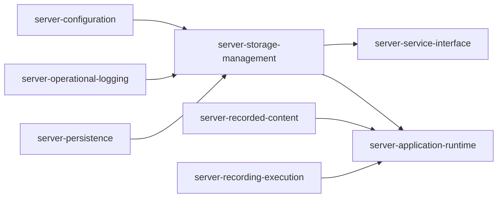
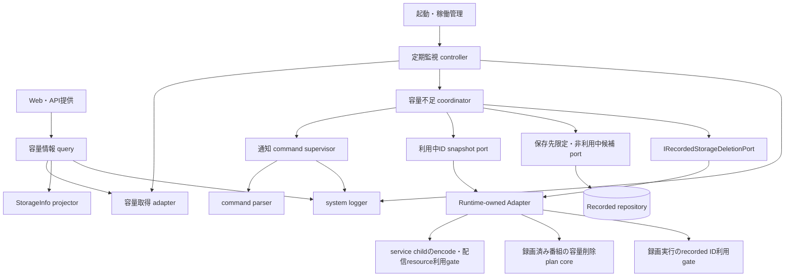
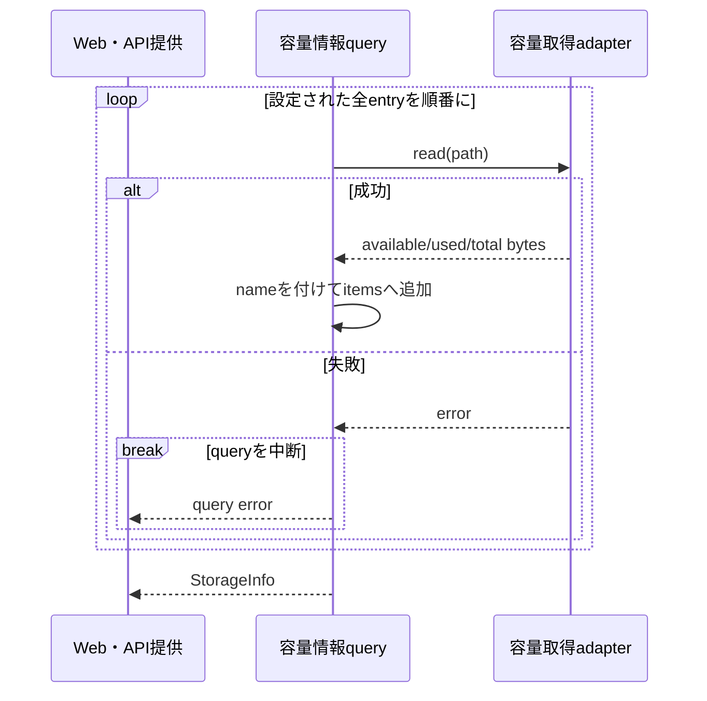
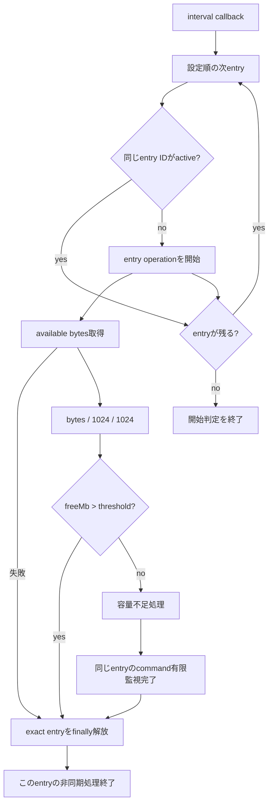
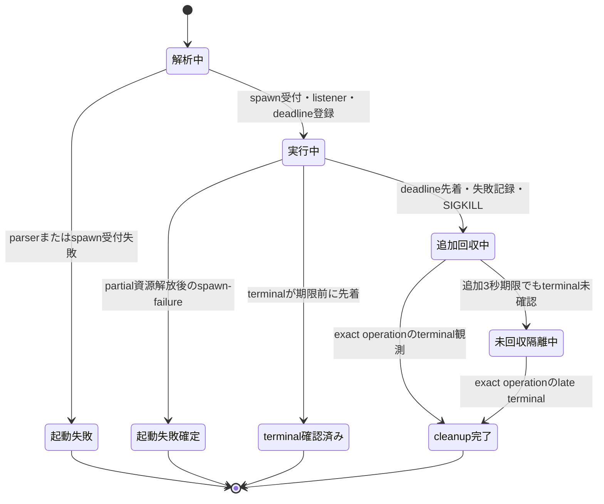
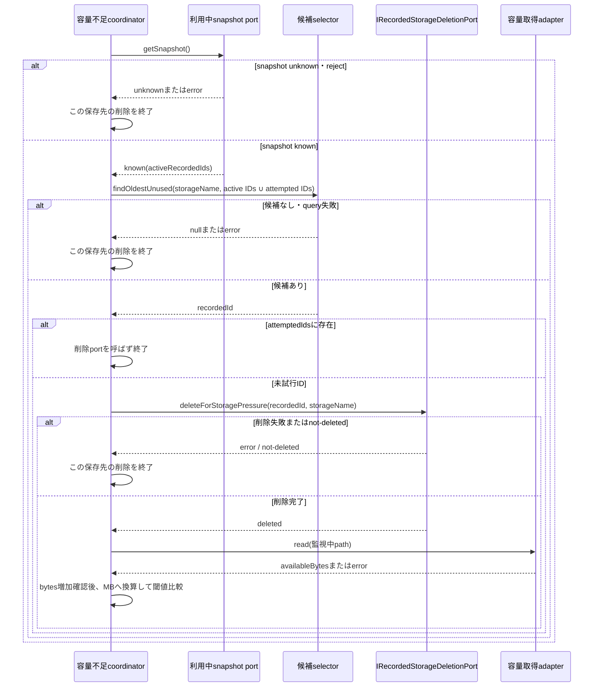

# 録画保存先の容量管理機能 設計

## 概要

録画保存先の容量管理機能は、設定された録画保存先ごとの総容量、使用量、空き容量を byte 単位で提供し、空き容量の下限が設定
された保存先を一定間隔で確認する。空き容量が設定値以下なら、通知用外部commandの起動を試み、自動削除が指定されている場合
は監視対象の保存先だけに録画fileを持ち、保護されず、録画・encode・配信に利用されていない録画済み番組を一件ずつ選び、本機
能が定義する`IRecordedStorageDeletionPort`へ削除を依頼する。

通知用commandには、設定providerが生値のまま保持する任意field `storageLimitCommandTimeoutMs`による正の有限な実行期限を適用す
る。省略時は`300_000` msとする。期限は一回のcommand起動からterminal観測までに適用し、期限到達時はSIGKILLを一回要求して失
敗として記録する。その後は追加3秒の停止強化を行い、terminal未確認ならその事実を記録してlogical observer、child
handle、registry ownership、および設定entry単位のownershipを`unreaped`として保持する。同じ設定entryから新しいcommandを起
動せず、別の設定entry、録画、配信、番組情報更新、およびWeb・APIは継続する。exact childのterminalを後から確認した場合だけ
同じoperation generationで追跡資源と設定entry ownershipを解放し、別operationのcallbackは作用させない。このcommandの完
了、失敗、期限超過は自動削除開始の条件にしない。

容量表示、監視開始順、容量不足判定、削除候補、削除後再判定、および停止の契約も本文の各節で定める。初回と削除後の判定はい
ずれもbyte値をMBへ換算する。削除後に対象保存先の空きbyteが増えない場合は反復を止め、別保存先または利用中resourceを削除し
ない。

### 目的と利用者

-   利用者が、設定された録画保存先ごとの容量を公開APIから確認できるようにする。
-   運用者が、保存先ごとの空き容量下限、監視間隔、通知用 command、および自動削除 action を設定できるようにする。
-   起動時に定期監視を開始し、明示的な停止要求を受けた場合は新しい監視回だけを停止できるようにする。
-   容量管理が選んだ録画済み番組IDを`IRecordedStorageDeletionPort`へ渡し、compositionされた削除を依頼できるように
    する。
-   長時間 terminal にならない通知用 command を有限時間で失敗確定し、停止試行後も追加3秒だけ監督する。終了を確認できない
    resourceは安全に解放せず、同じ保存先だけを`unreaped`として隔離する。

### 責任と境界

本機能が所有する責任は次のとおりである。

-   設定された録画保存先を設定 entry 単位で列挙し、容量 adapter の結果を public DTO へ投影すること
-   空き容量下限がある保存先の抽出、定期timer、設定entry単位の重複抑止、および設定順の開始判定
-   すべての空き容量値をMBとして比較し、容量不足時のcommandと削除actionを選ぶこと
-   command 文字列の解析依頼、起動、有限期限、停止試行、追加3秒までの監督、および起動失敗・期限超過・終了未確認の記録
-   監視対象の保存先だけに属する未保護・非利用中の録画済み番組を最古順で一件取得する候補選択契約
-   `IRecordedStorageDeletionPort`への排他的な削除依頼、削除後の空き容量再取得、単位統一、および進捗停止条件
-   定期監視 timer を解除し、進行中処理と command 監督を待たずに `stop()` を返すこと

次は本機能の責任外である。

-   録画保存先の選択、録画 file の書込み、保存先間の移動
-   録画済み番組に属する file、row、relation、event の具体的な削除効果
-   利用者削除用の encode 取消、録画停止、および削除 workflow
-   録画予約の保持判定、および録画、encode、配信中という利用状態と排他gateの管理
-   DB connection、repository 共通再試行、transaction、および migration
-   HTTP routing、認証、status code の一般規則、および public API の配送
-   サーバー全体の起動順、signal 処理、process 終了、および shutdown drain
-   サムネイル、配信用一時 file、変換途中 file の保存期限

本設計は、同一物理領域を指す異なるpathの完全な同一性判定、一監視回の固定削除件数上限、commandまたは削除の自動retry、別
commandへのfallback、監視停止時のcommand回収待ちを追加しない。同じpathを持つentryも、異なる閾値、action、commandを設定で
きる独立した設定entryとして、設定順に個別評価する。pathは容量取得と録画file所属のscopeにだけ用い、監視operationの同一性
には用いない。

## 他機能との依存関係

### 依存方向



矢印は契約の提供側から利用側を示す。production moduleのimport方向そのものを固定するものではない。候補選択の業務意味と三
つのconsumer port contractは本機能が定義し、データベース保存・検索機能が候補query adapter（`RecordedDB.findOldestUnused`）、
runtime compositionが`IRecordedStorageDeletionPort` adapter（`StoragePressureDeletionAdapter`）を実装している。本機能は
`IRecordedStorageDeletionPort.deleteForStoragePressure(recordedId, storageName)`だけを利用し、録画済み番組管理機能や録画
実行機能へ直接依存しない。

### 責任分担

| 相手機能                     | 本機能が受け取るもの                                                                                | 本機能が返すもの                                                | 相手側に残る責任                                                                                                                                 |
| ---------------------------- | --------------------------------------------------------------------------------------------------- | --------------------------------------------------------------- | ------------------------------------------------------------------------------------------------------------------------------------------------ |
| `server-configuration`       | component構築時の録画保存先、監視間隔、任意command期限fieldの生値を含むsnapshot、command parser | なし                                                            | YAML読込、共通補完、path正規化、snapshot、reload、command解析規則。期限fieldは生値のまま保持され、省略値・範囲・public非投影は本機能が所有する |
| `server-operational-logging` | process 内の system logger                                                                          | 定期容量確認、command、候補取得、削除の処理経過と失敗の記録要求 | sink、level filter、rotation、flush                                                                                                              |
| `server-persistence`         | 保存先限定・未保護・最古順候補query port adapter（`RecordedDB.findOldestUnused`）                                          | 条件を満たす候補一件のquery                                     | DB接続、row・relation、query実行、repository error。保存先名と除外IDをquery条件へ適用                                                    |
| `server-recorded-content`    | runtime側adapterから利用する副作用のない容量削除prepareとfinal delete contract              | consumer portへ渡した録画済み番組ID                             | lock内relation再読取、存在・保護・利用中確認、exact-ID resource選択・削除、全DB settlement、event効果                                    |
| `server-recording-execution` | runtime側adapterから利用するrecorded ID単位の録画利用gate contract                          | なし                                                            | active録画確認、deletion token保持中の同ID新規利用block、token解放。容量不足削除から録画を取消・停止しない                               |
| `server-service-interface`   | 容量情報取得要求                                                                                    | 既存 `StorageInfo` または error                                 | `/api/storages` の routing、HTTP response、認証、access log                                                                                      |
| `server-application-runtime` | `start()`の要求、typed利用中snapshotと`IRecordedStorageDeletionPort` adapter                         | 同期的な開始受付、`known(ids)` / `unknown`、容量削除result      | 録画・待機中/実行中Encode・録画file配信IDの安全側集約、副作用なしprepare→録画gate→service-child gate→lock内再読取・exact-ID deleteのcomposition  |

### cross-spec契約の所在

本機能が定義する`IStorageDeletionCandidatePort`、`IRecordedStorageDeletionPort`、`IStorageRecordedUseSnapshotPort`と、
`storageLimitCommandTimeoutMs`の生値は、次の実体が提供する。

1. `server-persistence`は、保存先名、利用中・試行済みID集合、`startAt ASC, id ASC`を受ける候補query（`RecordedDB.findOldestUnused`）を提供する。
2. `server-recorded-content`は、容量削除plan coreの入力、最終確認、exact-ID削除、settlement contract（副作用なしprepareとfinal delete）を提供する。
3. `server-application-runtime`は、録画・待機中/実行中Encode・録画file配信を集約する `known(ids) | unknown` snapshot（`StorageRecordedUseSnapshotAdapter`）、録画・service-child use gate、deletion port binding（`StoragePressureDeletionAdapter`）、副作用なしprepare→二つのgate→lock内final deleteのcompositionとintegration所有を提供する。
4. `server-configuration`は、optional `storageLimitCommandTimeoutMs`を生値のままsnapshotへ保持する。省略値、範囲、単位、適用範囲、public非投影は本Designの契約が定める。

### 設定 snapshot と反映時点

容量表示 component と定期監視 component は、それぞれが構築された process の設定 snapshot を一度保持する。設定 entry の
`name`、`path`、`limitThreshold`、`action`、`limitCmd`、`storageLimitCheckIntervalTime`、および
`storageLimitCommandTimeoutMs`は、構築済みcomponentへreloadで自動反映しない。新しい値の反映には該当componentまたは
processの再構築を要する。Web・API processと予約・録画processのsnapshotが同時に切り替わる保証はない。

```ts
interface StorageManagementSettings {
    recorded: Array<{
        name: string;
        path: string;
        limitThreshold?: number;
        action?: 'remove' | 'none';
        limitCmd?: string;
    }>;
    storageLimitCheckIntervalTime: number;
    storageLimitCommandTimeoutMs?: unknown; // 生値。StorageManageModelが構築時に検査する
}
```

| 設定                            | 単位                   | 省略時                  | 適用範囲・解釈                                                                                               |
| ------------------------------- | ---------------------- | ----------------------- | ------------------------------------------------------------------------------------------------------------ |
| `recorded[].limitThreshold`     | MB                     | 監視対象外              | 初回と削除後の容量判定で`availableBytes / 1024 / 1024`と比較する。既存値の型・範囲を本設計で新たに制限しない |
| `storageLimitCheckIntervalTime` | second                 | 設定管理の既存標準値 60 | 定期 timer の一間隔。component 構築後の各監視回に同じ値を使う                                                |
| `recorded[].limitCmd`           | command 文字列         | command なし            | 空き容量が下限以下の監視回で一回起動を試みる                                                                 |
| `recorded[].action`             | `remove` または `none` | 削除なし                | exact に `remove` の場合だけ自動削除へ進む                                                                   |
| `storageLimitCommandTimeoutMs`  | ms                     | `300_000`               | 一回の command spawn から terminal 観測まで                                                                  |

`storageLimitCommandTimeoutMs`は`Number.isSafeInteger(value) && 1 <= value && value <= 2_147_483_647`を満たさなければな
らない。0を無期限として扱わず、小数、`NaN`、`Infinity`、上限超過も受理しない。本機能は定期監視componentの構築時に省略値
と範囲を`commandTimeoutMs`へ正規化し、不正値はcommand起動前の設定errorとする。このfield、省略値、範囲、単位、適用範囲、
およびpublic非投影のうち、省略値と範囲の検査は`StorageManageModel`の構築時に行う。このfieldは`StorageApiModel`が返す値に含めない。設定providerは`Configuration`で生値を保持する。

このoptional fieldをpublic Configや`/api/storages` responseへ投影しない。fieldを省略した設定は同じ容量表示・監視・削除条
件で起動し、通知用commandだけが既定の有限期限を得る。

## アーキテクチャ、コンポーネント、および interface

### 論理構成



容量取得adapterはpathごとのbyte値だけを返し、同じ物理領域かどうかを判定しない。容量情報queryはすべての設定entryを列挙す
る。定期監視controllerは下限のあるentryだけを構築時に抽出し、各entryへ不変なsnapshot indexとopaqueなentry identityを組み
合わせた`StorageEntryId`を一つ割り当てる。容量不足coordinatorはcommandのterminalを待たず、同じ監視回で削除条件を評価す
る。

### component 一覧

| component                  | 責任                                                                                       | 主な入力                           | 出力・所有 state                               |
| -------------------------- | ------------------------------------------------------------------------------------------ | ---------------------------------- | ---------------------------------------------- |
| 容量情報 query             | 設定された全保存先を順に読み、public DTO を構築する                                        | 設定 snapshot、容量取得 port       | `StorageInfo` または error                     |
| 容量取得 adapter           | 一 path の総容量、使用量、空き容量を取得する                                               | 設定 path                          | byte 単位の `DiskUsage` または error           |
| 定期監視 controller        | 対象抽出、interval、設定entry単位の重複抑止、設定順の開始判定、停止を管理する              | 設定snapshot                       | timer handle、active entry ID集合              |
| 容量不足 coordinator       | 下限判定、command 起動、自動削除、再取得、停止条件を順序付ける                             | 保存先 entry、空き容量             | 一保存先の監視完了または局所終了               |
| 通知 command supervisor    | parser、`child_process.spawn`（`stdio: 'ignore'`、`env`未指定）、deadline、停止試行、late terminal cleanup を一 operation record で管理する（`StorageManageModel.launchCommand`と`activeCommands`） | command、正規化済み期限            | child handle、timer、listener、operation state |
| 利用中snapshot port        | 録画・待機中/実行中Encode・録画file配信の利用中IDを安全側に取得する                        | なし                               | `known(ids)`または`unknown`                    |
| 削除候補selector           | 対象保存先だけに属する未保護・非利用中の候補を開始時刻・ID順で一件取得する                 | 保存先名、利用中/試行済みID集合    | 録画済み番組ID、`null`、またはerror            |
| 容量削除port               | composition rootの排他的削除gateと安全削除を一件ずつawaitする                              | 録画済み番組ID、保存先名           | `deleted`、`not-deleted`、またはerror          |
| system log port            | 処理経過と局所失敗を用途別 logger へ渡す                                                   | message、error                     | logger 設定に従う記録                          |

### 機能portとconsumer contract

```ts
interface StorageInformationPort {
    getInfo(): Promise<StorageInfo>;
}

interface StorageMonitoringPort {
    // 起動時（`src/index.ts`の`runOperator`）に一回だけ呼ぶ。対象があればintervalを一つ登録する
    start(): void;
    // 保持中のintervalがあれば解除する
    stop(): void;
}

type StorageRecordedUseSnapshot =
    | { readonly status: 'known'; readonly recordedIds: ReadonlySet<RecordedId> }
    | { readonly status: 'unknown' };

interface IStorageRecordedUseSnapshotPort {
    getSnapshot(): Promise<StorageRecordedUseSnapshot>;
}

interface IStorageDeletionCandidatePort {
    findOldestUnused(request: {
        storageName: string;
        excludedRecordedIds: ReadonlySet<RecordedId>;
    }): Promise<RecordedId | null>;
}

interface IRecordedStorageDeletionPort {
    deleteForStoragePressure(recordedId: RecordedId, storageName: string): Promise<'deleted' | 'not-deleted'>;
}

interface StorageLimitCommandOperation {
    readonly observationDone: Promise<'terminal' | 'spawn-failure'>;
}
```

`IStorageRecordedUseSnapshotPort`は本機能が所有するconsumer portである。runtime adapterはRecording Executionの
active session registryと、service childのEncoding待機列・実行中一覧およびMedia Deliveryのactive録画file配信を読取り専用
で集約する。必要なprovider、child、generation、carrier応答の一つでも不在・不明・期限超過なら`unknown`を返す。本機能は
`unknown`を空集合へ変換せず、その監視回の削除loopをcandidate query前に終了する。

`IStorageDeletionCandidatePort`は本機能が所有するconsumer portである。persistence adapterは少な
くとも一件のvideo relationを持ち、すべてのvideo relationの`parentDirectoryName`が`storageName`と一致し、未保護で、利用
中・試行済みID集合に含まれない録画済み番組を`startAt ASC, id ASC`で一件返す。 `IRecordedStorageDeletionPort`も本機能が所
有するconsumer portである。runtime adapterは副作用のないprepare成功後、録画利用gateとservice
childのencode・配信利用gateを順に取得し、いずれかを取得できなければ`not-deleted`を返す。両gate取得後だけrecorded-content
のfinal deleteへ進み、全終了経路で取得済みgateを逆順に一回解放する。

本機能は `StorageDeletionPreparationToken`、`prepareStorageDeletion()`、`deletePreparedForStorage()`、`hasReservation()`、または録
画取消operationをimport・呼出しせず、利用者削除workflowやencode取消へも接続しない。したがってrecordingへの直接依存はな
く、`deleteForStoragePressure(recordedId, storageName)`の`deleted` / `not-deleted` / rejectだけを観測する。

通知commandの監督は`StorageManageModel`の`launchCommand`と`activeCommands`が担う。commandの解析、childの起動受付、terminal
observer、および期限timerの設定までを同期境界として扱う。解析または同期的な起動要求が失敗した場合はthrowできる。起動受付後はconfirmed terminalまたは
`spawn-failure`を表す`observationDone` Promiseを返す。容量不足coordinatorはこのPromiseを自動削除開始前には待たないが、同
じ設定entryを終えて次の監視回へ進む前には必ず待つ。SIGKILL後3秒でもterminal未確認なら`observationDone`をsettleせず、追跡
資源を保持したまま同じentry IDを`unreaped`として隔離する。exact childのterminalが後着した場合だけ通常cleanupへ進める。

supervisorは、processが生成されなかったこと（`spawn`通知より前の`error`）を確認し、作成したpartial handleとlistenerを
すべて解放した後にだけ`spawn-failure`をterminal negative outcomeとして一回確定する。その際にfailureを記録し、deadline、operation
registry、およびsupervisor所有参照を一回解放して`observationDone`を`spawn-failure`へsettleする。`error`はprocess終了を証
明しない非terminal通知、`terminal`は`close`相当のprocess終了とresource closure確認である。`spawn-failure`、deadline、
terminalのraceはoperation IDとstate gateで最初のterminal transitionだけを採用し、後着callbackによるSIGKILL、二重
settlement、二重解放を0件にする。

### 所有する data と resource

本機能は次を所有する。

-   component ごとに保持する録画保存先と監視設定の snapshot
-   最大一つの定期監視timer handle、設定snapshot entryごとの不変な
    `StorageEntryId`
-   entry IDごとのactive operation recordと、各active entryで起動した最大一つの通知command operation ID、state、deadline
    handle、child handle、terminal listener disposer
-   public response を構築中の `StorageItem[]`

録画済み番組 row、録画 file、thumbnail、drop log、tag relation、録画予約、encode job、配信 session、および
`StorageDeletionPreparationToken` は所有しない。candidate ID を削除 port へ渡した後、runtime adapter が token を operation-local に
保持し、削除効果と event は録画済み番組管理機能が所有する。

## 主要 workflow、状態、および timeline

### 容量情報の取得

容量情報 query は、構築時 snapshot の `recorded` を設定順に処理する。

1. 各 entry の `path` を容量取得 adapter へ渡す。
2. 成功した `available`、`used`、`total` を変換せず byte 値のまま受け取る。
3. entry の `name` を加えて `{ name, available, used, total }` を response 配列へ追加する。
4. 全 entry が成功したら `{ items }` を返す。

`limitThreshold`、`action`、`limitCmd`の有無は容量表示対象を減らさない。同じpathまたは同じ物理領域を指すentryも統合せ
ず、それぞれ一itemとして返す。一entryの容量取得が失敗した場合、そのerrorを別entryの容量値として代入しない。query
contractは全体をrejectし、途中まで作ったitemの部分responseは返さない。



### 定期監視の開始と一監視回

`start()`は起動時（`src/index.ts`の`runOperator`）に一回だけ呼ばれる。二回呼ぶ使い方はなく、二回目以降の呼び出しを無視する
仕組み（状態遷移）は持たない。snapshotの`recorded`はimmutable index付きで設定順に列挙し、各entryへcomponent内で一意な
opaque identityを割り当て、`{ snapshotIndex, identity }`を`StorageEntryId`とする。

`limitThreshold !== undefined`のentryだけを監視対象にする。対象が0件ならtimerを作らない。対象がある場合は
`storageLimitCheckIntervalTime * 1000`を一間隔とするintervalを一つ登録する。登録直後の即時確認は行わず、最初のcallbackは
一間隔後である。

interval callbackは対象entryを設定順に走査し、`StorageEntryId`でactive operationを調べる。同じentry IDが進行中ならその
entryだけをskipし、別entry IDは先行処理を待たずに開始する。二つのentryが同じpathを持っていても、それぞれの閾値、action、
commandを設定順に独立評価する。pathは各entryの容量readと録画file scopeにだけ渡す。開始した各entryは独立したPromise
continuationを持ち、容量read、利用中snapshot取得、候補query、削除port、再read、およびcommandの有限監視がsettleするまで同じentry IDをactiveに
保つ。

容量read、利用中snapshot取得、候補query、削除port、再readの各一段階へ600秒のwatchdogを設定する。この600秒は固定contractとして維持する。各段
階が600秒内に成功または失敗としてsettleすればwatchdogを解除して次段階または局所終了へ進む。watchdogが先ならentry
operationを`overdue`へ一回遷移させ、同じentry IDのactive ownershipとunderlying Promiseを解放済みと扱わず、後続段階と同じ
entryの後続監視を開始しない。watchdog後に元Promiseがsettleした場合は同じ監視回の通常の次段階または局所終了へ一回だけ進
み、exact entry IDを通常の`finally`で解放する。容量read、利用中snapshot取得、候補query、削除port、または再readを再実行しない。別entry ID、録
画、配信、番組情報更新、およびWeb・APIはwatchdog後も継続し、この局所期限をoperator fatalまたはprocess再起動へ接続しな
い。

各 entry では次の順序を維持する。

1. 空き容量 byte 値を取得する。失敗したら system/error を記録し、その entry を終えて次へ進む。
2. `freeMb = availableBytes / 1024 / 1024` とし、小数の切上げ・切捨てを加えず `limitThreshold` と比較する。
3. `freeMb > limitThreshold` なら、その entry の command と削除を開始しない。
4. `freeMb <= limitThreshold` なら、設定された容量不足処理へ進む。
5. そのentryでcommandを起動した場合は、自動削除を並行して進め、confirmed terminalまで同じentry IDのactive operationを保
   持する。
6. entry固有の処理が成功または失敗でsettleした場合だけ`finally`でそのentry IDを次回監視可能にする。`overdue`後も元処理の
   exact settlementだけが通常の`finally`へ進み、別operationの後着結果はownershipを解放しない。



### 容量不足時の通知 command

`limitCmd` がある場合、容量不足 coordinator は command の開始を記録し、設定管理機能の command parser へ文字列を渡
す。parser は shell を起動せず、半角 space の literal split、先頭要素の実行 file 化、`%NODE%`、`%ROOT%`、`%SPACE%` の既
存置換、空引数除去、および実行 file 存在確認を行う。quote、escape、environment 展開、glob、pipe、redirect を追加しない。

supervisor は `{ stdio: 'ignore' }` を指定し、`env` option を指定しない。これにより child は親 process の環境を Node.js
child process の既存規則で継承する。shell は指定しない。

一 command operation の deadline は、supervisor が一回の spawn 要求を受け付けた時点を `T0`、正規化済み期限を `D` とし
て、`T0 + D` から延長しない絶対期限とする。redirect、retry、段階的停止のために新しい期限を作らない。terminal observer は
child の `close` に相当する、process 終了と resource closure を確認した通知だけを terminal outcome へ正規化する。child
handle の `error` 通知だけを terminal とみなさない。



期限前にterminalを観測した場合はdeadlineを解除し、listenerとhandleをoperation registryから除く。spawn要求後に
supervisor所有のpartial資源の解放を終えた`spawn-failure`を受けた場合は、system/errorへ記録し、deadlineとregistryを一回解
放してnegative terminalへ確定する。`spawn-failure`とdeadlineまたはterminalがraceした場合、後着callbackは停止要求、結果変
更、settlement、資源解放を行わない。process生成後の`error`、停止要求のerror、または`exit`だけではterminal cleanupを完了
せず、confirmed terminalを待つ。正常終了または非0終了へ新しい業務結果やretry条件を追加しない。期限到達時にoperationが実
行中なら、stateを`期限超過監督中`へ一度だけ変更し、timeout failureをsystem/errorへ記録して、同じchild handleへ
`SIGKILL`を一回要求する。停止要求がthrowまたは`false`になってもtimeoutを成功へ変更せず、停止試行自体の失敗を追加記録す
る。

timeout時点から追加3秒の停止強化timerを一回だけ開始する。exact operation IDとexact childのterminalが先ならtimer、
listener、handle、registry entryを解放する。追加3秒期限が先なら終了未確認をsystem/errorへ一回記録し、listener、handle、
registry entry、entry ID ownershipを`unreaped`で保持し、`observationDone`をsettleしない。同じentry IDの後続監視は新しい
commandを起動せず、別entry ID、録画、配信、番組情報更新、およびWeb・APIを継続する。すでにevent queueへ入ったcallbackは
operation IDとgenerationを再確認し、別のoperation、後続監視回、別command observerへ作用させない。同じoperationへ二回目の
停止要求を行わない。経過時間だけからOS上のdirect childまたはdescendantの不存在を推測しない。exact childのterminalが後着
した場合だけtimer、listener、handle、registry entry、entry ID ownershipを通常cleanupで一回解放する。

容量不足 coordinator は spawn 受付と監督登録の後、command の terminal 通知を待たず直ちに `action` を評価する。parser ま
たは同期的 spawn 受付の失敗は記録して同じ評価へ進む。`action === 'remove'` なら command が実行中でも削除を開始し、後着の
起動 error、timeout、late terminal、および終了 code は、すでに始めた削除を取消・rollback しない。

一方、同じentryの削除処理または削除なしの評価が終わった後は、`observationDone`をawaitしてからそのentry IDを解放する。期
限到達から追加3秒までのlogical ownership中は同じentry IDの次回監視が新しい通知commandを起動できない。別entry IDの監視と
commandは独立して進める。confirmed terminalまたはterminal negative `spawn-failure`だけが通常のownership解放条件である。
追加3秒後もterminal未確認なら同じentry IDを`unreaped`として後続commandを重ねず、late terminalを待つ。process自体が別理由
で終了した場合は、旧processとその子孫の不在を確認した新processが設定snapshotから監視を再構築する。

### 自動削除

`action === 'remove'`の場合だけ自動削除へ進む。loopは初回容量判定で得た`availableBytes`と
`freeMb = availableBytes / 1024 / 1024`を保持し、試行済みID集合を空で開始する。

1. `freeMb <= limitThreshold`の間、処理経過を記録する。
2. `IStorageRecordedUseSnapshotPort.getSnapshot()`を呼ぶ。`unknown`またはrejectなら記録して、その監視回の削除loopを候補
   query前に終える。自動retryせず、利用中IDを空集合と推測しない。実装（`StorageRecordedUseSnapshotAdapter`）は、
   service-child snapshotの要求を`snapshotTimeoutMs`（5,000ms固定値）で`Promise.race`し、期限内にservice-childから応答
   が無ければその回だけ`unknown`として扱う。5秒timeoutはrecording側snapshotの取得（同期・例外時は`unknown`）には適用せ
   ず、service-child snapshot要求だけに掛かる。
3. `known(ids)`なら、録画・待機中/実行中encode・録画file配信のID集合と試行済みID集合の和集合を
   `IStorageDeletionCandidatePort.findOldestUnused({ storageName, excludedRecordedIds })`へ渡す。
4. query errorなら記録してそのentryの削除loopを終える。`null`でも候補なしを記録して終える。
5. 候補取得後、`attemptedIds.has(candidateId)`を削除port呼出しの直前に確認する。trueなら重複候補を記録してloopを終え、同
   じ候補への削除port呼出しを行わない。このguardは最初の候補選択後から適用する。
6. `candidateId`を試行済み集合へ追加し、
   `IRecordedStorageDeletionPort.deleteForStoragePressure(candidateId, storageName)`をawaitする。排他的利用gateを取得でき
   ない、最終確認で対象なし・保護中・保存先不一致となった場合の`not-deleted`、またはdelete rejectでは、そのentryのloopを
   終える。
7. `deleted`の場合だけ監視中entryの同じ`path`から空き容量byte値を再取得する。失敗したら記録してloopを終える。
8. `nextFreeMb = nextAvailableBytes / 1024 / 1024`として同じMB単位で閾値を比較する。
9. `nextAvailableBytes <= previousAvailableBytes`なら、対象保存先の空き容量が増えていないためloopを終える。
10. 空き容量が増えていてなお閾値以下なら、`previousAvailableBytes`と`freeMb`を更新し、100 ms後に次候補へ進む。



#### 候補選択

candidate adapterは次の条件を一つのquery contractとして適用する。

1. `isProtected = false`である。
2. 一件以上のvideo relationを持ち、全video relationの`parentDirectoryName`が監視中entryの`name`と一致する。別保存先にも
   video fileを持つ番組全体は候補にしない。
3. `known`として得た録画、待機中・実行中encode、録画file配信の利用中snapshot、および同じentryでの試行済みIDに含まれな
   い。snapshotが`unknown`ならquery自体を行わない。
4. `startAt ASC`、同値では`id ASC`の順で一件を返す。後続の`orderBy()`で先行sortを上書きしない。

利用中snapshotは候補query時の助言的な選別であり、削除直前の競合を単独では防がない。snapshot取得後の新規利用や停止もあり
得るため、runtime adapterは副作用のないprepare成功後に録画・encode・配信のdeletion gateを取得し、取得後は同じrecorded ID
への新しい利用開始を拒否する。gate取得前から利用中なら `not-deleted`とし、fileまたはDB効果を開始しない。service child不
在または利用状態を確認できない場合も安全側の `not-deleted`とする。

候補queryはこの節の保存先、保護、利用状態、試行済みID、`startAt ASC, id ASC`を一つのcontractとして実装する。加え
てconsumer自身が候補取得後に`attemptedIds`を再確認し、providerが同一IDを返しても削除portを二回呼ばない。

#### 録画済み番組削除との境界

容量管理は候補IDの選択、重複guard、および`IRecordedStorageDeletionPort`呼出しまでを所有する。runtime adapterは、IDとstorageNameの受領後に録画済み番組管理機能の
`prepareStorageDeletion(recordedId, storageName)`を先に呼ぶ。prepareは副作用を持たず、対象なし、保護中、録画中、または全
video relationがstorageNameに属さない場合は`not-deleted`を返す。

prepare成功後、adapterはrecording ownerの録画利用gate、parent registryが管理するservice childのencode・配信利用gateの順
にrecorded ID単位のdeletion tokenを取得する。既存利用がある、service childが存在しない、利用状態を確認できない、または新
規利用を遮断できない場合は`not-deleted`を返し、録画・encode・配信の取消やresource削除を開始しない。後段gateを取得できな
ければ取得済みgateだけを一回解放する。

両gate取得後、recorded ownerはrecorded ID単位のresource mutation lockを取得し、RecordedDBから存在、保護、録画状態、
relation、storage所属を再読取する。最終状態が不適格なら削除効果を開始せず`not-deleted`とする。適格なら最終readのexact
relation IDだけをplanへ固定し、selected video IDごとの効果時path read、exact-ID row delete、および開始した全DB
settlementを待って`deleted`を返す。`deleteRecordedId(recordedId)`のbulk row deleteを使わない。

二つのdeletion gateは新しい録画・encode・配信利用をfinal deleteの成功または失敗まで遮断し、runtime adapterが`finally`で
service child、recordingの逆順に各tokenを一回解放する。このsequenceとbindingはapplication runtime、resource再読取と
exact-ID削除はrecorded content、録画利用gateはrecording execution、encode・配信利用leaseは各owner Designが所有す
る。本機能はplanや個別owner portを認識せず、候補・監視path・空き容量・反復・停止条件をadapter側へ移さない。

利用者削除用のencode取消coordinatorと録画terminal barrierは容量不足削除へ適用しない。新しい公開wireまたはAPIを追加せず、
容量管理は`IRecordedStorageDeletionPort`の一メソッドだけを利用する。service childのresource use leaseに必要な内部process
messageはprocess messaging ownerの責任であり、本機能の業務IPCではない。

#### 削除後の再判定と進捗確認

初回と削除後はいずれもbyte値を`1024 * 1024`で割ったMB値とMB閾値を比較する。単位変換では丸めず、同じ浮動小数値の比較規則
を使う。削除後は閾値判定より先にraw byte値が前回より増えたことを確認する。

空きbyteが増えない場合は、別volumeの削除、unlink失敗、開放遅延等をこの機能から区別できないため、そのentryのloopを終了す
る。同じcandidate IDが再び返った場合は削除直前guardで停止し、同じIDへの削除port呼出しを一回に限定する。これらは自動retry
ではなく、一回の監視operationが無進捗の破壊的反復へ入らない停止条件である。

#### 候補選定基準

`findOldestUnused()`（`src/model/db/RecordedDB.ts`）は、削除対象を`storageName`に一致するvideo relationだけ
を持つ録画済み番組へ絞り込み、`excludedRecordedIds`（本節の利用中ID集合と試行済みID集合の和集合）に含まれるIDを除外す
る（`storageName`一致・利用中除外は本節と`### 機能portとconsumer contract`が規定する契約）。
`test/server/storage-management/candidate-selection.test.ts`のSM-4.1がstorage一致・利用中および試行済みID除外・
`startAt ASC, id ASC`の安定順序を固定する。

### 監視停止と並行性

`stop()`は、保持中の定期監視timerがあれば`clearInterval`し、次回callbackの開始を止めた時点で同期的に返る。対象0件でtimerを
持たないときは何もせず、open interval handleは0件になる。すでにcallbackが開始していれば、容量取得、設定順の後続entry、削除
候補query、削除依頼、削除後の容量取得を取消さず、完了も待たない。active entry ID集合をshutdown tokenとして使わな
い。`stop()`の呼び出し元は現状なく、`start()`と同様に二回以上呼ぶ使い方は想定しない。

通知 command の operation registry と deadline timer は定期監視 timer から独立する。`stop()` はこれらを clear、停止、成
功扱い、または待機しない。監視停止後に command deadline が到達した場合も supervisor は timeout failure を記録して停止を
試み、追加3秒の停止強化後も未確認ならその事実を記録し、同じentry IDのownershipを`unreaped`で保持する。terminalが先なら通
常cleanupを行う。

active operationは`StorageEntryId`ごとに一件である。前回の容量取得、削除、またはcommandの有限監視が続く間は同じentry ID
だけを次のinterval callbackでskipし、別entry IDは同じpathでも開始する。commandは同じentryの削除開始を止めないが、
`observationDone`まで同じentry IDを保持するため、そのentryで論理所有中の通知childは一つを超えない。終了未確認childの
ownershipを同じprocess内で解放しない。異なるentry ID間のglobal mutexは追加せず、一つのentryが`overdue`または`unreaped`
でも別entryの新しい監視業務を開始できる。

## algorithm、不変条件、および compatibility

### 不変条件

1. 容量表示は snapshot にあるすべての通常録画保存先 entry を設定順で対象にする。
2. public 容量値の `available`、`used`、`total` は容量 adapter が返した byte 値である。
3. 同一 path または同一物理領域を指す設定 entry を一つへ統合しない。
4. 定期監視対象は `limitThreshold !== undefined` の entry だけであり、対象 0 件なら interval を作らない。
5. `start()`は起動時に一回だけ呼ばれ、intervalを最大一つだけ登録する。
6. 最初の監視callbackはinterval一回分が経過した後であり、同じentry IDの進行中operationへ新しいoperationを重ねない。
7. 一回のcallbackは対象entryを設定順に開始判定し、先行entryの未完了またはfailureで別entry IDを止めない。同じpathの別
   entryも個別評価する。
8. 初回容量不足判定は `availableBytes / 1024 / 1024 <= limitThreshold` である。
9. 通知 command の terminal は自動削除開始条件ではない。
10. 一commandは一つのabsolute deadline、child handle、terminal observer、およびoperation stateを持つ。`spawn-failure`は
    supervisor所有のpartial資源解放後のterminal negative outcomeである。
11. timeoutは停止試行の成否にかかわらずfailureであり、SIGKILL後の追加3秒でterminal未確認ならその事実を記録し、observer、
    handle参照、および該当entry IDのregistry ownershipを`unreaped`で保持する。別entryと別domainは継続する。
12. `stop()` は定期 interval だけを解除し、進行中監視回と command supervision を待たない。
13. 削除候補 selection と loop は本機能、容量削除の接続順は runtime、保護・resource・削除効果は recorded content、予約保
    持・停止 semantics は recording execution が所有する。
14. 候補取得後は削除port呼出し直前に`attemptedIds`を再確認する。同一候補なら追加呼出し0件でloopを止める。
15. 削除後はbyte値の増加を確認し、MBへ換算して初回と同じ閾値比較を行う。無進捗ではloopを止める。

### command operation の競合

`spawn-failure`、terminal callback、deadline callbackは同じoperation stateを確認し、最初のterminal遷移だけを採用する。

-   `spawn-failure`が先着した場合はdeadlineとregistryを一回解放し、停止要求0件、後着terminal/deadlineの作用0件とする。
-   terminal が先着した場合は deadline を解除し、後着 deadline は停止要求も failure 記録も行わない。
-   deadlineが先着した場合はtimeout failureとSIGKILLを一回だけ行い、追加3秒までterminalを監督する。
-   terminal event が複数届いても、adapter または supervisor の gate が最初の一件だけを採用する。
-   停止要求が失敗してもoperationをrunning成功へ戻さず、追加3秒期限で未確認を記録して同じentry IDのownershipを
    `unreaped`で保持する。exact terminalの後着だけを一回の通常cleanupへ使う。

このgateはcommand operationだけに適用する。監視operationの重複はentry ID別active record、commandの蓄積防止は同じentryで
の`observationDone` awaitが担う。削除候補の試行済みID集合とruntime exclusive deletion gateは別責任である。

### public wire の互換性

既存の公開API契約を変更しない。

| 項目          | contract                                                                                                                                     |
| ------------- | -------------------------------------------------------------------------------------------------------------------------------------------- |
| endpoint      | `GET /api/storages`                                                                                                                          |
| 成功          | HTTP 200、`{ items: StorageItem[] }`                                                                                                         |
| `StorageItem` | `{ name: string, available: number, used: number, total: number }`                                                                           |
| 容量単位      | `available`、`used`、`total` は byte                                                                                                         |
| 順序と重複    | 設定順。同一物理領域を指す entry も個別 item                                                                                                 |
| query failure | 既存 service error mapping により HTTP 500、`{ code: 500, message: "Internal Server Error", errors?: string }`。部分成功 response は返さない |

`storageLimitCommandTimeoutMs`、監視状態、閾値、command、削除候補、command operation ID を response へ追加しな
い。route、field 名、配列形、status、既存 error carrier を変更しない。

### 明示する非保証

-   同じ物理容量を指す entry の値が同一時点の snapshot になること
-   容量取得と削除の間に filesystem 使用量が変化しないこと
-   command の成功、停止完了、子孫 process の終了、出力取得
-   command と同じ保存先の削除の相互排他。両者は並行し得る
-   異なる正規化pathが同じ物理volumeまたはsymlink先を指すことの完全な検出
-   一監視回の削除件数上限、容量下限までの回復
-   file 削除と DB 変更の transaction、rollback、再試行
-   `stop()` 後に進行中処理または command がなくなること

## failure、retry、cleanup、および shutdown

| 条件                                             | 監視・API への結果           | cleanup・後続                                                                                                           |
| ------------------------------------------------ | ---------------------------- | ----------------------------------------------------------------------------------------------------------------------- |
| 容量表示中の一 path 取得失敗                     | `getInfo()` を reject        | 別 entry の値として扱わず、service-interface が既存 500 response へ変換する。部分 response なし                         |
| 監視中の一 path 初回取得失敗                     | その entry の処理を終了      | system/error を記録し、次の設定 entry を続ける                                                                          |
| 空き容量が下限より大きい                         | 正常に entry を終了          | command、候補 query、削除を開始しない                                                                                   |
| command parse または同期 spawn 受付失敗          | command failure              | system/error を記録し、`action` の評価と必要な削除へ進む                                                                |
| spawn前の`error`による`spawn-failure`            | terminal command failure     | supervisor所有のpartial資源解放済みを確認し、deadline・registry・supervisor参照を一回解放してsettleする                  |
| process 生成後の `error` または `exit`           | 非 terminal 通知             | `close` 相当の confirmed terminal まで supervision を続ける                                                             |
| 期限前の正常終了または非 0 終了                  | confirmed terminal 観測      | deadline と supervision resource を解除する。新しい retry、fallback、削除条件を追加しない                               |
| command deadline 超過                            | timeout failure              | 同じchildへSIGKILLし、追加3秒後も未確認なら同じentry IDを`unreaped`で保持。別entry・別domainは継続                      |
| command 停止要求失敗                             | timeout のまま               | cleanup failureを記録し、追加3秒後は同じentry IDを`unreaped`で保持してexact terminalを待つ                              |
| capacity・利用中snapshot・candidate・delete・再readが600秒未確定 | entry operationを`overdue`化 | entry ID ownershipを保持して同じentryだけを保留し、元Promiseの後着確定で通常経路を一回完了                              |
| 削除候補 query failure                           | その entry の自動削除を終了  | 記録し、自動 retry しない                                                                                               |
| 削除候補なし                                     | その entry の自動削除を終了  | 候補なしを記録し、別選択規則へ fallback しない                                                                          |
| 容量削除gateが`not-deleted`                      | そのentryの自動削除を終了    | 利用中・確認不能・最終不適格を安全側に扱い、file/DB効果と容量再取得を開始しない                                         |
| `IRecordedStorageDeletionPort` rejection          | その entry の自動削除を終了  | prepare、録画gate、service-child gate、final deleteのどのfailureでも記録し、容量再取得・別候補retry・rollbackを行わない |
| 削除後の容量取得 failure                         | その entry の自動削除を終了  | 記録し、自動 retry しない                                                                                               |
| 削除後の空きbyteが増加しない                     | そのentryの自動削除を終了    | 無進捗を記録し、追加候補を削除しない                                                                                    |
| entry operationの想定外error                     | operationがerrorを記録       | exact entry IDを通常の`finally`で解放する。別entryのoperationへ作用させない                                             |
| `stop()`                                         | interval を解除して返る      | 進行中監視回を drain せず、command supervision は継続する                                                               |
| process 終了                                     | process lifecycle に従う     | 本機能独自の signal handler、全 command drain、強制回収 protocol を追加しない                                           |

容量取得、candidate query、削除、command の自動 retry、backoff、fallback、circuit breaker は追加しない。データベース保
存・検索機能が repository 内部で既に持つ共通再試行は同機能の契約に従い、本機能が外側でもう一度反復する理由にしない。

容量削除adapterの副作用なしprepare、録画gate、service-child gate、lock内final read・exact-ID deleteの順序とfailure伝播
は`server-application-runtime`、録画済み番組削除の部分失敗とevent発行条件は`server-recorded-content`が所有する。本機能
は`deleted`だけを削除依頼完了として扱い、物理byte解放を推測せず監視pathを実際に再取得する。再取得byte値の増加を確認して
からMBへ換算し、同じ閾値へ比較する。

## test 戦略

### test 配置

`test/server`は`server-application-runtime` Requirement 9が所有する共有server test rootである。本設計は共通のVitest、
production compile境界、V8 coverage、root commandを再定義せず、次の容量管理固有fileを置く。実行結果とcoverageは本機能が記録せず、`server-application-runtime`
が所有する共有commandで判定する。

| file                                                                            | 責任                                                                    |
| ------------------------------------------------------------------------------- | ----------------------------------------------------------------------- |
| `test/server/storage-management/storage-info.spec.test.ts`                      | 容量一覧、byte DTO、設定entry単位の順序・重複・失敗                     |
| `test/server/storage-management/monitoring.spec.test.ts`                        | 対象抽出、entry ID別single-flight、同path別entry、局所隔離              |
| `test/server/storage-management/command.spec.test.ts`                           | command起動、spawn-failure、期限、停止強化、late terminal、entry隔離    |
| `test/server/storage-management/auto-deletion.spec.test.ts`                     | 候補条件・順序、削除port、再取得、単位統一、進捗停止                    |
| `test/server/storage-management/stop.spec.test.ts`                              | interval停止、進行中処理とcommand監督の分離                             |
| `test/server/storage-management/monitoring-concurrency.test.ts`                 | 設定順、entry別active・overdue、同path別entry、start/stop、timer race   |
| `test/server/storage-management/command-supervision.test.ts`                    | child state、期限値の省略・最小・最大・不正、deadline、SIGKILL、3秒timer、listener・handleの一回解放 |
| `test/server/storage-management/candidate-selection.test.ts`                    | storage限定、閾値以上の保存先の録画と両方に跨る録画を候補にしない、startAt/id順、利用中・試行済み除外、0・1・複数候補 |
| `test/server/storage-management/deletion-progress.test.ts`                      | MB変換、閾値直前・一致・超過、deleted/not-deleted、byte増加、同一候補、失敗停止、100 ms順序 |
| `test/server/storage-management/storage-db.integration.test.ts`                 | temporary DBの候補ID・保存先名を削除portへ渡す境界                      |
| `test/server/storage-management/storage-http.integration.test.ts`               | `GET /api/storages`の200/500、byte、順序、重複entry                     |
| `test/server/storage-management/storage-filesystem.integration.test.ts`         | temporary directoryの容量取得、保存先entryとの識別、取得失敗            |
| `test/server/storage-management/storage-process.integration.test.ts`            | isolated childのbin/args、合成環境継承、期限、signal、terminal資源回収  |
| `test/server/application-runtime/storage-pressure-deletion.integration.test.ts` | prepare、録画・service-child gate、最終削除を接続するruntime所有test    |
| `test/server/storage-management/_storage-harness.ts`                            | 実path、実番組、実command、credentialを含まない合成設定・entity・child  |

上表に挙げない補助のimp test（`pressure-deletion-adapter.imp.test.ts`、`recorded-use-snapshot-adapter.test.ts`、
`snapshot-catch.imp.test.ts`、`snapshot-unknown.imp.test.ts`、`start-interval-catch.imp.test.ts`、`getfreesize-err.imp.test.ts`、
`free-size-success.imp.test.ts`、`storageapi-getinfo.imp.test.ts`）も`test/server/storage-management/`に置く。

runtime binding、副作用なしprepare、録画・service-child use gate、lock内再読取・exact-ID delete、および利用者削除
workflowを通らないことは、`server-application-runtime`が所有する容量削除adapter integration testで検証する。本機能はその
testを重複所有せず、storage固有fixtureとconsumer port contractを提供する。capacity・利用中snapshot・candidate・delete・再readの未確定ま
たはcommand未回収をexact entry IDへ隔離し、別entry、録画、配信、番組情報更新、およびWeb・APIへ波及させないことは、上表の
runtime合同integration testで検証する。

### 仕様 test

-   下限・action・command がない entry を含む全設定 entry を設定順で返し、同じ合成容量 adapter key を指す二 entry も二
    item になることを検証する。
-   `available`、`used`、`total` の exact key と byte 値、および public response に内部設定が混入しないことを検証する。
-   容量表示の一件 failure が別 item の容量へ代入されず、部分 response ではなく既存 500 wire になることを検証する。
-   監視対象0件ではinterval登録0回、対象ありでは最初の一間隔前に容量読取0回、一間隔後に設定順で読取ることをfake timerで
    検証する。`stop()`後にopen timer 0件も確認する。
-   保存先entry Aの容量readをdeferredにしてもB、Cの開始判定を設定順で行い、異なるentry IDなら開始することを検証する。次
    intervalではAだけをskipする。同じpathの二entryも異なる閾値/actionを個別評価し、両方を設定順に開始する。
-   initial byte 値の MB 換算について、下限超過、exact 下限、下限未満を検証する。
-   一保存先の容量 failure 後も次の保存先を処理し、command と削除を開始しないことを検証する。
-   commandを起動した直後もchild terminalをdeferredにしたまま同じentryの削除portが呼ばれる一方、同じentry IDの次interval
    だけは開始しないことを検証する。別entryは同じpathでも進み、terminal outcomeだけで元entryを解放する。
-   capacity read、利用中snapshot取得、candidate query、delete、post-delete readの各stageを599,999msでsettleした場合は通常経路を続け、
    600,000msまで未確定ならentry IDを`overdue`で保持して同じentryの後続を0件とし、別entryと別domainを継続する。元Promise
    の後着settlementでは同じ段階を再実行せず、通常の次段階または局所終了とexact key解放を一回だけ行う。
-   parser と同期 spawn failure 後も削除設定へ進み、failure が system logger へ渡ることを検証する。
-   candidate `null`、query reject、削除 reject、再取得 reject がそれぞれその保存先の削除 loop を終えることを検証する。
-   利用中snapshotが`known`ならrecording、待機中/実行中Encode、active録画file配信、試行済みIDの和集合をcandidate queryへ
    一回渡す。snapshotのprovider不在・不明・期限超過・rejectではcandidate queryと削除portを各0回とし、その監視回だけを終
    了する。次回監視での再評価を妨げる永続failure stateを作らない。
-   一件削除後に同じ監視pathを再取得し、raw byte増加を先に確認してからMBへ換算する。空き容量不増加でloopを終了する。同じ
    IDが返った場合は`attemptedIds` guardで削除port二回目を0件とし、増加しても閾値以下なら次候補へ進む。
-   `stop()` 後に次 callback が始まらず、進行中容量取得・削除を await せず、通知 command の期限監督が残ることを検証す
    る。

### command 期限 test

1. `storageLimitCommandTimeoutMs` の省略値 `300_000`、`1`、`2_147_483_647`、`0`、負数、小
   数、`NaN`、`Infinity`、`2_147_483_648` を component 構築境界で検証する。
2. `child_process`のmoduleのmockとfake timerを使い、spawn 受付時に一つの deadline と terminal listener が登録されることを検証する。
3. spawn前の`error`通知でsupervisor所有のpartial資源を解放した`spawn-failure`を起こし、failure記録、deadline・registry解放、 `observationDone`
   settlementを各一回検証する。deadline/terminalとのraceでは停止要求、二重settlement、二重解放0件とする。自動削除開始は
   この通知を待たない。
4. terminal を期限前に通知し、deadline 解除、停止要求 0 回、listener disposer と registry 解放各 1 回を検証する。
5. deadlineを先に通知し、timeout failure 1回、同じexact childへのSIGKILL 1回、追加3秒の停止強化timer 1件を検証する。
6. SIGKILLがthrowまたは`false`でもtimeout結果が変わらず、追加3秒期限でterminal未確認ならその事実を一回記録し、
   listener、handle参照、registry、entry ID ownershipを`unreaped`で保持し、別entryと別domainが継続することを検証する。
7. timeout後のexact terminal先着と停止強化期限先着を分ける。前者は追加3秒前に通常解放し、後者は`unreaped`を保持する。ど
   ちらも旧operation callbackを成功扱いへ変更せず、別command observerへ作用させない。後者のlate terminalだけが元keyを一
   回解放する。
8. commandのlogical ownership中は同じentryの削除だけが進み、同じentry IDの次callbackから別commandを起動しないこと、別
   entryのcommandは同じpathでも開始できること、およびterminal outcomeだけで元entryを解放することを検証する。
9. command 実行中に監視 `stop()` を呼び、interval は解除される一方、command deadline が到達して停止要求と late cleanup
   が行われることを検証する。
10. 最低サポートの Node.js 24 と追加検証対象の Node.js 26 では、秘密情報を持たない合成 child process を短い test 専用期
    限で起動し、親環境の合成 marker 継承、shell 非使用、timeout の停止試行、および terminal observer の回収を確認する。
    実 command path や実環境値を fixture・snapshot・log へ保存しない。

wall clock の 300 秒待機を test に使わない。deadline、interval、100 ms wait は fake timer で決定的に進
める。実 child integration でも製品省略値を使わず、test 専用の短い正値を設定する。

### cross-spec integration

-   candidate fixtureは対象保存先、別保存先、複数保存先にまたがるrecord、開始時刻とID順が異なるrecord、および録
    画・encode・配信中IDを用意する。全videoが対象保存先に属する未使用recordだけを`startAt, id`順で選び、試行済みIDを再選
    択しない。
-   storage側はfake `IRecordedStorageDeletionPort`へのcandidate ID / storageName受渡し、`deleted`後の同一path再取得、
    `not-deleted` / rejection後のloop停止だけを検証し、token、barrier、path / DB readの内部期待値を重複所有しない。
-   未確定I/Oを`overdue`、未回収commandを`unreaped`としてexact entry IDへ隔離し、同じentryの後続監視とchild起動を0件にす
    る一方、別entry、録画、配信、番組情報更新、およびWeb・APIが継続することを検証する。元Promiseの後着settlementまたは
    exact childのlate terminalだけが同じentryを一回解放し、別operationの後着callbackは作用させない。
-   recorded-content ownerのsuiteはcandidate取得後の保護・録画状態・relation・storage所属変更をlock内最終readで反映し、
    selected exact-IDごとのpath readとrow deleteを行うことを検証する。`deleteRecordedId(recordedId)`は0回、開始したDB
    mutationはevent前にすべてsettleし、録画・encode workflow portのcallは0件とする。
-   recording-execution ownerのsuiteはactive録画中にrecorded ID利用gateが`busy`、状態不明なら`unknown`を返し、deletion
    token保持中は同IDの新規録画利用を開始せず、解放後だけ再び取得できることを検証する。容量経路から録画取消と60秒
    terminal barrierを呼ばない。
-   encodingとmedia-delivery ownerのsuiteはrecorded resource利用前にservice-child leaseを取得し、terminalまで保持して一
    回解放することを検証する。parent registryはchild generationとrequest IDを識別し、不明状態を削除可能と推測しない。
-   application-runtime ownerのadapter suiteは副作用なしprepare→録画gate→service-child gate→lock内final deleteのcall
    ledgerを検証する。録画・encode・配信利用中、service child確認不能、prepare不適格、gate rejectionではfile / DB効果0件
    とし、全終了経路で取得済みgateを逆順に一回解放する。
-   容量不足削除から利用者用 encode 取消・録画停止 workflow が呼ばれず、新しい wire／API／IPC がないことも runtime
    composition suite で検証する。
-   同じruntime suiteは、Recording Executionのactive recorded IDと、service childから返るEncoding待機中/実行中ID・ Media
    Delivery active録画file配信IDの和集合を`known`としてstorageへ返すことを検証する。child不在、generation不一致、通常5
    秒期限、late reply、または各providerの`unknown`ではcandidate query前に停止し、空集合へ変換しない。
-   削除後のraw byte増加を確認してからMB閾値へ比較し、増加かつ閾値以下の場合だけ次loopへ進む。空き容量不増加、同じ
    candidate、canonical recorded row削除failureでは追加候補へ進まず、同じcandidateへの削除port呼出しを一回に限定する。

### quality gate と機密情報

-   Requirements 1から5の42 ACを、それぞれ一意な`*.spec.test.ts` named caseへ対応付ける。
-   implementation testはentry ID別active state、stop後のtimer解除、command state、timer race、failure分岐、candidate
    consumer guard、初回/削除後MB換算とbyte進捗確認を説明できるようにする。
-   外部 process、timer、filesystem、DB を含む integration test は deterministic な合成 adapter、temporary directory、合
    成 entity を使う。
-   fixture、snapshot、log assertion に実 URL、実番組名、実ユーザー名、実録画 path、実 command path、credential、親
    process の実 environment 値を含めない。
-   設計、test、fixture 更新後は `.kiro/steering/security.md` に従う secret scan を行う。

### Matrix記法と状態分類

次節を本機能唯一のTest Matrixとする。入力列は`[null, 空, 0, 1, 最小, 最大, 範囲外, 不正型, 重複]`の順で、`T`は直接case、
`C`はHTTPまたは設定carrierでの型確認、`N`はそのACが当該値を入力に持たないため非適用である。上限を定めない値の最大・範囲
外を`N`とし、新しい制約を追加しない。状態は`M`=監視の未開始・進行中・成功・失敗、`C`=commandの未開始・実行中・成功・失
敗・期限超過・未回収、`D`=削除の未開始・候補取得・削除中・削除済み・局所終了、`S`=停止前・停止後である。時間
は`間`=interval直前・到達・次回、`期`=期限直前・到達・超過・late settlement、`順`=呼出順、`衝`=race・同着・重複通知を示
す。

cancelは本機能に進行中operationを取り消すcontractがなく、`stop()`は新しいintervalだけを止めるため全47行で`CAN-NA`とす
る。restartはprocess-localなactive・overdue・unreaped stateを復元する要件がないため全47行で`RST-NA`とする。再入は
`RE-AP`と記したentry ID別single-flight、後着確定、command重複通知だけに適用し、その他は単発queryまたは一回の
監視結果なので`RE-NA`とする。resourceまたは外部境界の`—`は、DB transaction、stream、file、timer、listener、child
process、lock、DB、HTTP、IPC、filesystem、processのいずれも当該主testが直接所有・接続しないため非適用を表す。

### 機能固有Test Matrix

`種別`の`S`は`unittest/spec`主test、`I`は`unittest/imp`補助、`G`はintegration補助、`M`（本表）と`Q`（品質判定）はR6の行であ
る。Requirements 1から5の各`主test`は、一意な`*.spec.test.ts` named caseである。
`主test`の`file#SM-x.y`は、`it`名が`[SM-x.y]`で始まるcaseを指す（SM-3.5は`[SM-3.5-PARSE]`と`[SM-3.5-SPAWN]`）。実行結果とcoverageは本表に記録しない。

| ID      | 主test                              | 種別     | null・空・0・1・最小・最大・範囲外・不正型・重複 | 状態                              | 時間        | 資源                                    | 外部境界                                 | failure                          | 期待結果 |
| ------- | ----------------------------------- | -------- | ------------------------------------------------ | --------------------------------- | ----------- | --------------------------------------- | ---------------------------------------- | -------------------------------- | --------------------------------------------------------- |
| SM-1.1  | `storage-info.spec.test.ts#SM-1.1`  | S/G      | N,T,T,T,T,N,N,C,T                                | M                                 | 順          | —                                       | filesystem                               | 0件・容量取得失敗                | 全設定entryを設定順に読む |
| SM-1.2  | `storage-info.spec.test.ts#SM-1.2`  | S/G      | C,C,T,T,T,N,T,C,T                                | M                                 | 順          | —                                       | HTTP/filesystem                          | field欠落・取得失敗              | name/total/used/availableを返す |
| SM-1.3  | `storage-info.spec.test.ts#SM-1.3`  | S        | T,T,T,T,N,N,N,C,T                                | M                                 | 順          | —                                       | —                                        | 下限・action・command省略        | 省略entryも表示する |
| SM-1.4  | `storage-info.spec.test.ts#SM-1.4`  | S/G      | N,N,N,T,N,N,N,N,T                                | M                                 | 順          | —                                       | filesystem                               | 同じ物理領域・path重複           | 設定entryごとに別itemを返す |
| SM-1.5  | `storage-info.spec.test.ts#SM-1.5`  | S/G      | N,N,N,T,N,N,N,N,T                                | M                                 | 順          | —                                       | HTTP/filesystem                          | 一pathのread reject              | 他entry値へ誤代入せずquery全体を失敗 |
| SM-1.6  | `storage-info.spec.test.ts#SM-1.6`  | S/G      | N,N,T,T,T,T,N,N,T                                | M                                 | 順          | —                                       | HTTP/filesystem                          | 0・1・大きなbyte値               | 変換せずbyteで返す |
| SM-2.1  | `monitoring.spec.test.ts#SM-2.1`    | S/I      | T,T,T,T,T,N,N,C,T                                | M                                 | 間          | timer                                   | —                                        | 下限省略・複数entry              | 下限ありentryだけを対象化 |
| SM-2.2  | `monitoring.spec.test.ts#SM-2.2`    | S/I      | T,T,T,N,N,N,N,C,T                                | M/RE-NA                           | 間          | timer                                   | —                                        | 対象0件                          | interval登録0件、open timer 0件                           |
| SM-2.3  | `monitoring.spec.test.ts#SM-2.3`    | S/I      | N,N,N,T,T,N,T,C,N                                | M                                 | 間          | timer                                   | —                                        | 0秒・不正intervalは設定境界      | 一間隔前read 0件、到達後read 1件 |
| SM-2.4  | `monitoring.spec.test.ts#SM-2.4`    | S/I      | N,N,N,T,N,N,N,N,T                                | M/RE-AP                           | 間/衝       | timer/lock                              | filesystem                               | 同entry進行中・同path別entry     | 同entry IDだけskipし同path別entryを個別評価 |
| SM-2.5  | `monitoring.spec.test.ts#SM-2.5`    | S/I      | N,N,T,T,T,N,T,C,N                                | M                                 | 順          | —                                       | filesystem/process                       | freeMbが下限より大               | command・削除0件 |
| SM-2.6  | `monitoring.spec.test.ts#SM-2.6`    | S/I      | N,N,T,T,T,N,T,C,N                                | M/C/D                             | 順          | timer/child/lock                        | filesystem/process                       | 一致・下回る                     | 容量不足処理を開始 |
| SM-2.7  | `monitoring.spec.test.ts#SM-2.7`    | S/G      | N,N,N,T,N,N,N,N,T                                | M                                 | 順          | timer/lock                              | filesystem                               | 保存先A read reject              | Aだけ終了し確認可能なBを続行 |
| SM-2.8  | `monitoring.spec.test.ts#SM-2.8`    | S/I      | N,N,T,T,T,T,T,C,N                                | M                                 | 間          | timer                                   | filesystem                               | MB/second換算境界                | byte÷1024÷1024、second×1000 |
| SM-2.9  | `monitoring.spec.test.ts#SM-2.9`    | S/I      | N,N,N,T,N,N,N,N,T                                | M/RE-AP                           | 順/衝       | timer/lock                              | filesystem                               | 先行entry pending・同path        | 設定順に判定し開始可能な後続entryを開始 |
| SM-2.10 | `monitoring.spec.test.ts#SM-2.10`   | S/I      | N,N,N,T,N,N,N,N,T                                | M/C/D/RE-AP                       | 期/衝       | timer/listener/child/lock               | DB/filesystem/process                    | 各stage・command監視pending      | exact entry IDのactiveを保持 |
| SM-2.11 | `monitoring.spec.test.ts#SM-2.11`   | S/I      | N,N,N,T,N,N,N,N,T                                | M/RE-AP                           | 衝          | timer/listener/lock                     | —                                        | success/reject・重複settlement   | exact entry IDを一回解放し後続を受付 |
| SM-2.12 | `monitoring.spec.test.ts#SM-2.12`   | S/I/G    | N,N,N,T,N,N,N,N,T                                | M/RE-AP                           | 期/衝       | timer/lock                              | DB/filesystem                            | 599999/600000ms・late settle     | overdue保持、別entry/domain継続、stage再実行0・一回確定 |
| SM-3.1  | `command.spec.test.ts#SM-3.1`       | S/G      | T,T,N,T,N,N,N,C,T                                | C                                 | 順/衝       | child/listener/timer                    | process                                  | command省略・parse/spawn failure | 起動試行、spawn-failure時の資源一回解放 |
| SM-3.2  | `command.spec.test.ts#SM-3.2`       | S/I      | T,N,T,T,T,T,T,C,N                                | C                                 | 期          | timer/child/listener                    | process                                  | 省略・0・負・小数・非有限・超過  | 省略300000、正の有限期限だけ受理 |
| SM-3.3  | `command.spec.test.ts#SM-3.3`       | S/I/G    | N,N,N,T,N,N,N,N,T                                | C                                 | 期/衝       | timer/child/listener                    | process                                  | deadline先着                     | exact childへSIGKILL一回 |
| SM-3.4  | `command.spec.test.ts#SM-3.4`       | S/I      | N,N,N,T,N,N,N,N,T                                | C/D                               | 順/衝       | child/listener/lock                     | process                                  | terminal deferred                | terminalを待たず削除portを開始 |
| SM-3.5  | `command.spec.test.ts#SM-3.5`       | S/I      | T,T,N,T,N,N,N,C,T                                | C/D                               | 順/衝       | timer/listener                          | process                                  | parse reject・spawn-failure race | failure記録、削除評価、settle/解放各一回 |
| SM-3.6  | `command.spec.test.ts#SM-3.6`       | S        | T,T,N,T,N,N,N,C,N                                | C/M                               | 順          | child/listener/timer/lock               | process                                  | action省略・none                 | command起動後、有限監視の確定で監視回を終える |
| SM-3.7  | `command.spec.test.ts#SM-3.7`       | S/I/G    | T,T,N,T,N,N,N,C,T                                | C                                 | 順          | child                                   | process                                  | 空command・placeholder・空引数   | parser結果のbin/argsでshellなし起動 |
| SM-3.8  | `command.spec.test.ts#SM-3.8`       | S/G      | N,N,N,T,N,N,N,N,N                                | C                                 | 順          | child                                   | process                                  | 合成marker欠落                   | 親の合成環境変数を継承 |
| SM-3.9  | `command.spec.test.ts#SM-3.9`       | S/I/G    | N,N,N,T,N,N,N,N,T                                | C/RE-AP                           | 期/衝       | timer/listener/child/lock               | process                                  | kill失敗・3秒後terminalなし      | unreaped保持、同entry起動0、別entry/domain継続 |
| SM-3.10 | `command.spec.test.ts#SM-3.10`      | S/I      | N,N,N,T,N,N,N,N,T                                | C/RE-AP                           | 期/衝       | timer/listener/child                    | process                                  | kill後late terminal・重複通知    | timeoutを成功化せず旧callbackを他operationへ作用させない |
| SM-3.11 | `command.spec.test.ts#SM-3.11`      | S/I      | N,N,N,T,N,N,N,N,T                                | C/RE-AP                           | 間/期       | timer/listener/child/lock               | process                                  | 同entry次tick・同path別entry     | 同entryの新command 0、別entryは継続 |
| SM-4.1  | `auto-deletion.spec.test.ts#SM-4.1` | S/I/G    | T,T,T,T,T,N,N,C,T                                | D                                 | 順          | DB query                                | DB                                       | 0・1・複数・別storage・利用中    | storage限定、未保護・非利用中、startAt/id順で一件 |
| SM-4.2  | `auto-deletion.spec.test.ts#SM-4.2` | S/G      | N,N,N,T,N,N,N,C,T                                | D                                 | 順/衝       | lock                                    | runtime owner                            | 排他取得不能・状態変化           | adapterがprepareと二gateを満たす場合だけ削除効果へ進む |
| SM-4.3  | `auto-deletion.spec.test.ts#SM-4.3` | S/G      | N,N,N,T,N,N,N,N,T                                | D                                 | 順          | lock                                    | filesystem                               | delete reject/not-deleted        | `deleted`完了後だけ同一pathを再取得 |
| SM-4.4  | `auto-deletion.spec.test.ts#SM-4.4` | S/I      | N,N,T,T,T,N,T,C,N                                | D                                 | 順          | —                                       | filesystem                               | 閾値直前・一致・超過             | 初回byteをMBへ換算して比較 |
| SM-4.5  | `auto-deletion.spec.test.ts#SM-4.5` | S/I      | N,N,T,T,T,N,T,C,N                                | D                                 | 順          | —                                       | filesystem                               | 削除後の閾値直前・一致・超過     | 再取得byteもMBへ換算して比較 |
| SM-4.6  | `auto-deletion.spec.test.ts#SM-4.6` | S/I/G    | N,N,N,T,N,N,N,N,T                                | D                                 | 順          | DB query/lock                           | DB/filesystem/runtime owner              | query/delete/re-read reject      | 当該保存先loopを終了し追加削除0 |
| SM-4.7  | `auto-deletion.spec.test.ts#SM-4.7` | S/I/G    | T,T,T,N,N,N,N,N,T                                | D                                 | 順          | DB query                                | DB                                       | candidate `null`                 | 当該保存先loopを終了 |
| SM-4.8  | `auto-deletion.spec.test.ts#SM-4.8` | S/I      | N,N,T,T,T,N,N,N,T                                | D/RE-AP                           | 順/衝       | DB query/lock                           | DB/filesystem                            | byte不増加・同一ID再選択         | attempted guardで同IDの削除port二回目0、無進捗停止 |
| SM-4.9  | `auto-deletion.spec.test.ts#SM-4.9` | S/G      | N,N,N,T,N,N,N,N,T                                | D                                 | 順          | lock                                    | runtime owner                            | canonical row delete failure     | delete failureとして終了し同候補を再選択しない |
| SM-5.1  | `stop.spec.test.ts#SM-5.1`          | S/I      | N,N,T,T,N,N,N,N,T                                | S/RE-NA                           | 衝          | timer                                   | —                                        | 進行中callbackとstop             | interval一件をclear一回、open timer 0                     |
| SM-5.2  | `stop.spec.test.ts#SM-5.2`          | S/I      | N,N,N,T,N,N,N,N,T                                | S/RE-NA                           | 間/衝       | timer                                   | —                                        | callback同着                     | stop後の次回監視0件                                       |
| SM-5.3  | `stop.spec.test.ts#SM-5.3`          | S/I      | N,N,N,T,N,N,N,N,T                                | S/M/D                             | 衝          | timer/lock                              | filesystem/runtime owner                 | capacity/delete pending          | 完了を待たず同期的に返る |
| SM-5.4  | `stop.spec.test.ts#SM-5.4`          | S/I/G    | N,N,N,T,N,N,N,N,T                                | S/C                               | 期/衝       | timer/listener/child/lock               | process                                  | stop後deadline・late terminal    | intervalとcommand監督を分離し後者を一回解放 |
| SM-6.1  | `SPEC-CASES-SM-6.1`                   | S        | N,N,N,N,N,N,N,N,N                                | M/C/D/S                           | 順          | spec case 一覧                          | test foundation                          | case欠落・重複                   | SM-1.1〜SM-5.4の42 spec caseを一意に列挙 |
| SM-6.2  | `IMP-CASES-SM-6.2`                  | I        | T,T,T,T,T,T,T,T,T                                | M/C/D/RE-AP                       | 間/期/衝    | timer/listener/child/lock               | DB/filesystem/process                    | imp case欠落・失敗               | 具体的な値域・分岐caseを全件要求 |
| SM-6.3  | `MATRIX-SM-6.3`               | M        | N,N,N,N,N,N,N,N,N                                | M/C/D/S/CAN-NA/RE-NA/RE-AP/RST-NA | 間/期/順/衝 | DB query/file/timer/listener/child/lock | DB/HTTP/IPC/filesystem/process           | 分類・N/A理由欠落                | 47行と全必須列、資源解放、外部境界が揃う |
| SM-6.4  | `INT-CASES-SM-6.4`                  | G        | N,N,N,N,N,N,N,N,N                                | M/C/D                             | 順/期/衝    | DB/file/timer/listener/child/lock       | DB/HTTP/filesystem/process/runtime owner | integration欠落・失敗            | 具体的な4境界caseとruntime所有caseを要求、業務IPCは非適用 |
| SM-6.5  | `RUNTIME-R9-SM-6.5`                 | Q        | N,N,N,N,N,N,N,N,N                                | success/failure                   | 順          | test・coverage結果            | Runtime                       | 未実行・失敗       | 全件成功とC0・C1成立時だけ本機能を完了 |

### 結合境界とR6の確認項目

| 境界・証跡key         | concrete case                                                                                                                                                                                                                                                                                                                                                                                             | 成立条件・failure時の後始末                                                                                                                                                    |
| --------------------- | --------------------------------------------------------------------------------------------------------------------------------------------------------------------------------------------------------------------------------------------------------------------------------------------------------------------------------------------------------------------------------------------------------- | ------------------------------------------------------------------------------------------------------------------------------------------------------------------------------ |
| DB                    | `storage-db.integration.test.ts#candidate-id-storage-name-and-delete-result`                                                                                                                                                                                                                                                                                                                              | temporary DBで候補IDと保存先名をportへ渡し、`deleted`時だけ容量再取得、`not-deleted`時0件。query/connectionをharness規則で解放                                                 |
| HTTP                  | `storage-http.integration.test.ts#public-storage-list-and-read-failure`                                                                                                                                                                                                                                                                                                                                   | 公開adapterから200のexact DTOと一path失敗時500・部分responseなしを確認し、request/response listenerを一回解放                                                                  |
| filesystem            | `storage-filesystem.integration.test.ts#capacity-and-configured-entry-identity`                                                                                                                                                                                                                                                                                                                           | temporary directoryのbyte容量を設定entryへ対応付け、重複entryを統合せず、read失敗後にfile handleを残さずtemporary treeを回収                                                   |
| process               | `storage-process.integration.test.ts#spawn-environment-timeout-kill-and-late-terminal`                                                                                                                                                                                                                                                                                                                    | isolated childのbin/args・合成環境、期限、SIGKILL、3秒、late terminalを接続し、確定経路でtimer・listener・child参照を一回解放                                                  |
| runtime owner         | `test/server/application-runtime/storage-pressure-deletion.integration.test.ts#exclusive-prepare-and-final-delete`                                                                                                                                                                                                                                                                                        | DB候補ID・保存先名から副作用なしprepare、録画gate、service-child gate、lock内再読取、exact-ID deleteを接続する。全経路で取得済みgateを逆順に一回解放し、active利用を取消さない |
| IPC                   | 非適用。本機能portは同一process内でcompositionされ、新しい業務IPCを定義しない                                                                                                                                                                                                                                                                                                                             | serialization、peer、timeoutの契約を創作せず、runtime ownerのcomposition testを代替証跡にする                                                                                  |
| `SPEC-CASES-SM-6.1`     | MatrixのSM-1.1〜SM-5.4と、一意な`*.spec.test.ts` named case 42件                                                                                                                                                                                                                                                                                                                                          | 欠落・重複0件、42件全成功                                                                                                                                                      |
| `IMP-CASES-SM-6.2`    | `deletion-progress.test.ts#mb-conversion-and-threshold-before-at-and-above`、`monitoring-concurrency.test.ts#entry-identity-same-path-overdue-late-settlement`、`command-supervision.test.ts#spawn-failure-deadline-terminal-races-and-release`、`candidate-selection.test.ts#zero-one-order-storage-and-duplicates`、`deletion-progress.test.ts#attempted-id-guard-and-no-progress` | 全case成功                                                                                                      |
| `MATRIX-SM-6.3` | 47行の契約、種別、9入力区分、状態、cancel・再入・restart、時間、資源、外部境界、failure、期待結果                                                                                                                                                                                                                                                                                         | ID・主testの欠落/重複0件、未分類0件、N/A理由欠落0件                                                                                                                      |
| `INT-CASES-SM-6.4`    | 上記DB、HTTP、filesystem、process、runtime ownerの5 concrete case                                                                                                                                                                                                                                                                                                                                         | 全case成功、failure時のDB query、file、timer、listener、child、lock解放をassert。IPC非適用理由を保持                                                                           |
| `RUNTIME-R9-SM-6.5`   | `server-application-runtime`所有の固定commandによる機能固有test全件と、同Requirement 9 Acceptance Criterion 9のserver全体のC0/C1                                                                                                                                                                                                                                                                        | 機能固有test全件成功とserver全体のC0・C1成立。未実行または失敗なら本機能は未完了                                                                           |

## Requirements traceability

全47 Acceptance Criteriaを一行ずつ対応付ける。Requirements 1から5の各行は同じ番号の`SM-N.M`を `*.spec.test.ts`主testと
し、Requirement 6は同じ番号のspec case・実装・結合・品質判定を主証跡とする。

| AC      | 設計箇所                                   | 主な検証                                                  |
| ------- | ------------------------------------------ | --------------------------------------------------------- |
| R1.AC1  | 容量情報の取得                             | 全設定 entry の列挙                                       |
| R1.AC2  | 容量情報の取得、public wire の互換性       | name/total/used/available exact DTO                       |
| R1.AC3  | 容量情報の取得                             | 下限・action なし entry の表示                            |
| R1.AC4  | 容量情報の取得、不変条件                   | 同一容量を指す二 entry の二 item                          |
| R1.AC5  | 容量情報の取得、failure 表                 | 一 path error の非誤代入と query reject                   |
| R1.AC6  | 容量情報の取得、public wire の互換性       | byte 値の exact assertion                                 |
| R2.AC1  | 定期監視の開始と一監視回                   | `limitThreshold !== undefined` の対象抽出                 |
| R2.AC2  | 定期監視の開始と一監視回                   | 対象 0 件で interval 登録 0 回                            |
| R2.AC3  | 定期監視の開始と一監視回                   | 最初の一間隔前後の fake timer                             |
| R2.AC4  | 定期監視の開始と一監視回、監視停止と並行性 | 同じentry IDだけをskipし同path別entryも開始               |
| R2.AC5  | 定期監視の開始と一監視回                   | `freeMb > threshold` で command/delete 0 回               |
| R2.AC6  | 定期監視の開始と一監視回                   | exact/under threshold の容量不足処理                      |
| R2.AC7  | 定期監視の開始と一監視回、failure 表       | 一 path failure 後の次 entry 継続                         |
| R2.AC8  | 設定 snapshot、定期監視の開始と一監視回    | MB と second の換算値                                     |
| R2.AC9  | 定期監視の開始と一監視回                   | 設定順の開始判定とentry ID別独立開始                      |
| R2.AC10 | 定期監視の開始と一監視回                   | I/Oとcommand有限監視中のentry ID別active保持              |
| R2.AC11 | 定期監視の開始と一監視回                   | exact entryのfinallyによる一回解放                        |
| R2.AC12 | 定期監視の開始と一監視回、failure表        | 600秒未確定時のentry局所隔離・別domain継続・後着確定      |
| R3.AC1  | 容量不足時の通知 command                   | command 設定あり・容量不足の spawn 試行                   |
| R3.AC2  | 設定 snapshot、command operation の競合    | optional 正値と単一有限 deadline                          |
| R3.AC3  | 容量不足時の通知 command                   | deadline 先着時の停止試行一回                             |
| R3.AC4  | 容量不足時の通知 command、自動削除         | child terminal deferred 中の削除 port 呼出し              |
| R3.AC5  | 容量不足時の通知 command、failure 表       | parse失敗とterminal spawn-failure後の削除評価・一回解放   |
| R3.AC6  | 容量不足時の通知 command                   | `action !== 'remove'` の監視 entry 完了                   |
| R3.AC7  | 容量不足時の通知 command                   | command parser の bin/args contract                       |
| R3.AC8  | 容量不足時の通知 command                   | `env` 未指定と合成 marker 継承                            |
| R3.AC9  | 容量不足時の通知 command                   | SIGKILL後3秒の停止強化、未回収entry隔離、late terminal    |
| R3.AC10 | 容量不足時の通知 command                   | 旧operation callbackを後続監視へ適用しない                |
| R3.AC11 | 容量不足時の通知 command、監視停止と並行性 | 同じentryのchild起動0回、別entry独立                      |
| R4.AC1  | 自動削除、候補選択                         | storage限定・未保護・非利用中・startAt/id順query          |
| R4.AC2  | 自動削除、録画済み番組削除との境界         | `deleteForStoragePressure(recordedId, storageName)`       |
| R4.AC3  | 自動削除                                   | 一件 delete resolve 後の同一 path 再取得                  |
| R4.AC4  | 自動削除、削除後の再判定と進捗確認         | initial bytes-to-MB比較                                   |
| R4.AC5  | 自動削除、削除後の再判定と進捗確認         | post-delete bytes-to-MB比較                               |
| R4.AC6  | 自動削除、failure 表                       | query/delete/re-read rejection ごとの loop 終了           |
| R4.AC7  | 自動削除、failure 表                       | candidate `null` で loop 終了                             |
| R4.AC8  | 自動削除、削除後の再判定と進捗確認         | byte不増加とattempted ID再選択時の削除port二回目0         |
| R4.AC9  | 自動削除、録画済み番組削除との境界         | canonical recorded row failureをdelete failureとして停止  |
| R5.AC1  | 監視停止と並行性                           | stopで保持中のtimerを`clearInterval`し、open timer 0件    |
| R5.AC2  | 監視停止と並行性                           | stop後の次callback0回                                     |
| R5.AC3  | 監視停止と並行性                           | deferred capacity/delete を待たない同期 stop              |
| R5.AC4  | 監視停止と並行性、command operation の競合 | interval clear 後も command deadline と late cleanup 継続 |
| R6.AC1  | test配置、機能固有Test Matrix              | `SPEC-CASES-SM-6.1`で42件の仕様caseを一意に対応           |
| R6.AC2  | Matrix記法、R6の確認項目                         | `IMP-CASES-SM-6.2`の値域・分岐・race・資源解放case        |
| R6.AC3  | Matrix記法、機能固有Test Matrix            | `MATRIX-SM-6.3`で47行と必須列・N/A理由が揃う        |
| R6.AC4  | 結合境界とR6の確認項目                           | `INT-CASES-SM-6.4`のDB/HTTP/filesystem/process/runtime    |
| R6.AC5  | 結合境界とR6の確認項目                           | `RUNTIME-R9-SM-6.5`で本機能のtest全件成功とserver全体のC0・C1を要求 |

## 環境依存の検証境界と設計変更条件

内部のcapacity・利用中snapshot・candidate・delete・再read各段階のwatchdogは600秒を固定contractとして維持する。値を変更する場合は
Requirements、Design、test、設定を同じ変更単位で更新する。未確定I/Oを安全に解放せずentry ID単位で隔離する方針も維持す
る。次は保証へ昇格させず、実装・integration testで観測する。

-   Node.js 24 と 26、および対象 OS での child `error`、`exit`、`close` の順序と、停止要求後の terminal 到達
-   停止要求が `false` または throw した child、および terminal にならない child の process 終了時の最終回収範囲
-   `diskusage-ng` が symlink、mount point、同一物理領域を指す異なる path へ返す値と callback error
-   TypeORM または database backend 更新後に二回目の `orderBy()` が先行 sort を上書きする結果
-   recorded-content の部分失敗後に容量 adapter が観測する物理 byte 値

次の変更時は本設計と関係する owner spec を再検証する。

-   `recorded[]`、`limitThreshold`、`action`、`limitCmd`、監視間隔、`storageLimitCommandTimeoutMs` の設定
    schema、default、snapshot 時点
-   command parser の token、placeholder、実行 file 確認規則
-   Node.js child process API、command の起動・期限・停止処理、terminal event の変更
-   容量 adapter または `diskusage-ng` の更新
-   candidate query の保護条件、scope、sort、relation、利用状態条件の変更
-   `IStorageRecordedUseSnapshotPort`、`IRecordedStorageDeletionPort`、runtime adapter binding、録画・service-child use
    snapshot/gate、容量削除plan、lock内再読取・exact-ID削除の変更
-   `/api/storages` route、`StorageInfo`、`StorageItem`、error carrier の変更
-   application runtime の起動順、または将来の共通停止契約導入、共有 server test foundation、`test/server` の確定または
    変更

## 参照ソース対応表

この節は機能設計を実装入口およびcross-spec contractへ対応付ける従属locatorであり、前節までの契約、非保証、test oracleを
置き換えない。

| 設計要素                                    | 実装・仕様位置                                                                                                                                                                                                                                                                                                      | 主な symbol・根拠                                                                                                                                     |
| ------------------------------------------- | ------------------------------------------------------------------------------------------------------------------------------------------------------------------------------------------------------------------------------------------------------------------------------------------------------------------- | ----------------------------------------------------------------------------------------------------------------------------------------------------- |
| 容量監視、単位換算、command、自動削除、停止 | `src/model/operator/storage/StorageManageModel.ts`                                                                                                                                                                                                                                                                  | `start()`、`stop()`、設定順`for...of`、容量取得、command起動、候補取得、削除、100 ms waitの実装入口                                                   |
| 監視の開始・停止 port                       | `src/model/operator/storage/IStorageManageModel.ts`                                                                                                                                                                                                                                                                 | `start()`、`stop()`                                                                                                                                   |
| 容量情報 query と byte DTO                  | `src/model/api/storage/StorageApiModel.ts`、`src/model/api/storage/IStorageApiModel.ts`                                                                                                                                                                                                                             | `getInfo()`、`getDiskInfo()`                                                                                                                          |
| public route と error mapping               | `src/model/service/api/storages.ts`、`src/model/service/api.ts`、`src/model/service/ServiceServer.ts`                                                                                                                                                                                                               | `GET /api/storages`、HTTP 200/500、OpenAPI path binding                                                                                               |
| public schema                               | `api.d.ts`、`api.yml`                                                                                                                                                                                                                                                                                               | `DiskUsage`、`StorageItem`、`StorageInfo`、`Error`                                                                                                    |
| 設定型と optional 期限の保持                | `src/model/IConfigFile.ts`、`src/model/Configuration.ts`、`config/config.yml.template`                                                                                                                                                                                                                              | `RecordedDirInfo`、`storageLimitCheckIntervalTime`、optional `storageLimitCommandTimeoutMs` の保持。省略値と範囲は storage 側で正規化                 |
| command parser                              | `src/util/ProcessUtil.ts`                                                                                                                                                                                                                                                                                           | `parseCmdStr()`。supervisor（`StorageManageModel.launchCommand`）が起動・期限・停止要求と timeout 後の ownership を担う                                                   |
| child process 起動の実装入口                | `src/model/operator/storage/StorageManageModel.ts`                                                                                                                                                                                                                                                                  | `spawn(bin, args, { stdio: 'ignore' })`、`env` 未指定                                                                                                 |
| 容量 adapter dependency                     | `src/model/operator/storage/StorageManageModel.ts`、`src/model/api/storage/StorageApiModel.ts`、`package.json`、`package-lock.json`                                                                                                                                                                                 | `diskusage-ng` callback と `usage.available/used/total`                                                                                               |
| candidate consumer portとquery              | `src/model/db/IRecordedDB.ts`、`src/model/db/RecordedDB.ts`                                                                                                                                                                                                                                                         | 保存先名・除外ID・`startAt ASC, id ASC`を受けるquery portの実装入口                                                                                   |
| 利用中snapshot consumer port                | `.kiro/specs/server-application-runtime/design.md`、`.kiro/specs/server-process-messaging/design.md`、録画・Encode・配信の各owner Design                                                                                                                                                                            | `known(ids)` / `unknown`を取得し、`known`だけを試行済みIDと合成してcandidate queryへ渡す。`unknown`ではquery前に停止                                  |
| 容量削除consumer port                       | `src/model/operator/storage/StorageManageModel.ts`、`src/model/operator/recorded/RecordedManageModel.ts`、`src/model/operator/recording/RecordingManageModel.ts`、`src/model/operator/recording/RecorderModel.ts`、`src/model/api/video/VideoUtil.ts`、`src/model/db/VideoFileDB.ts`、`src/model/db/ThumbnailDB.ts` | 容量管理から具体的削除手順を分離し、runtime-owned `IRecordedStorageDeletionPort`へ接続する実装入口                                                     |
| 容量削除consumer portとruntime composition  | `.kiro/specs/server-application-runtime/design.md`                                                                                                                                                                                                                                                                  | `deleteForStoragePressure(recordedId, storageName)`、副作用なしprepare→録画gate→service-child gate→lock内final delete                                 |
| 録画済み番組の容量削除core                  | `.kiro/specs/server-recorded-content/design.md`                                                                                                                                                                                                                                                                     | `prepareStorageDeletion()`、lock内最終再読取、storage所属、exact-ID path / row、全DB settlement                                                       |
| 録画実行の容量削除contract                  | `.kiro/specs/server-application-runtime/design.md`の容量削除composition、`.kiro/specs/server-recording-execution/design.md`のrecorded ID利用gate                                                                                                                                                                    | active録画時の`busy`、不明時の`unknown`、token保持中の同ID新規利用blockと一回解放。容量不足削除から録画取消・terminal barrierを呼ばない               |
| 設定 snapshot と command parser owner       | `.kiro/specs/server-configuration/design.md`                                                                                                                                                                                                                                                                        | constructor snapshot、storage の再構築時反映、`ProcessUtil.parseCmdStr`                                                                                  |
| repository owner                            | `.kiro/specs/server-persistence/design.md`                                                                                                                                                                                                                                                                          | `IRecordedDB` query port、DB 接続・retry・relation ownership                                                                                          |
| system logger contract                      | `src/model/ILogger.ts`、`src/model/ILoggerModel.ts`、`.kiro/specs/server-operational-logging/design.md`                                                                                                                                                                                                             | system info/error、sink・level・rotation は logging owner                                                                                             |
| DI と singleton scope                       | `src/model/ModelContainerSetter.ts`                                                                                                                                                                                                                                                                                 | `IStorageManageModel`、`IStorageApiModel`、recorded DB/manage bindings。candidate port、利用中snapshot adapter、runtime-owned deletion adapterの binding |
| operator lifecycle 入口                     | `src/index.ts`                                                                                                                                                                                                                                                                                                      | `IStorageManageModel` 取得と `start()`。実装に `stop()` の明示 caller はない                                                                          |
| 既存 loop wait                              | `src/util/Util.ts`                                                                                                                                                                                                                                                                                                  | `sleep(100)`                                                                                                                                          |

## Primary production source ownership

本節は、本機能が主に所有する製品 source と、その owner-local test の置き場所を示す。次の primary source の動作、公開 API、
IPC wire、DB schema、設定、保存形式は変更しない。owner-local test locator は既存 test directory の範囲を示すものであり、
個別 source の characterization 網羅を主張しない。

| Primary source | Owner-local test locator | Cross-spec consumer |
| --- | --- | --- |
| `src/model/operator/storage/IStorageRecordedUseSnapshotPort.ts` | `test/server/storage-management/**/*.test.ts` | Runtime は pressure-deletion composition consumer。 |
| `src/model/operator/storage/StoragePressureDeletionAdapter.ts` | `test/server/storage-management/**/*.test.ts` | Runtime は pressure-deletion composition consumer。 |
| `src/model/operator/storage/StorageRecordedUseSnapshotAdapter.ts` | `test/server/storage-management/**/*.test.ts` | Runtime は pressure-deletion composition consumer。 |
