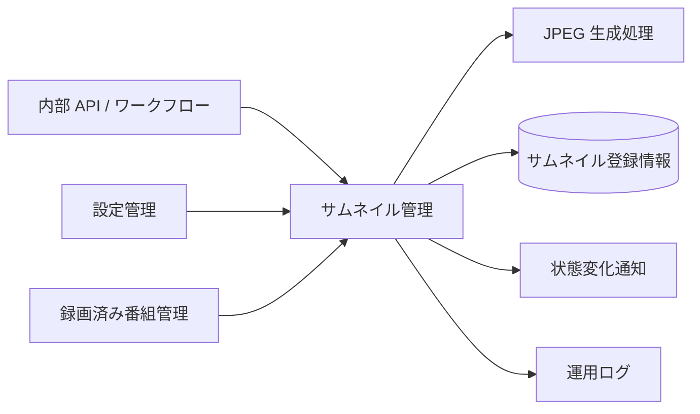
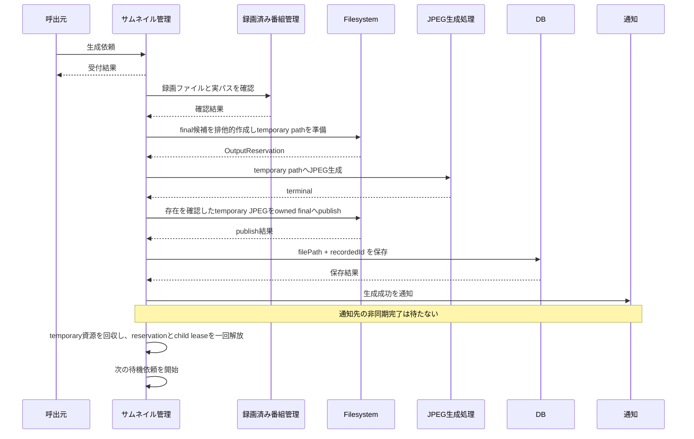
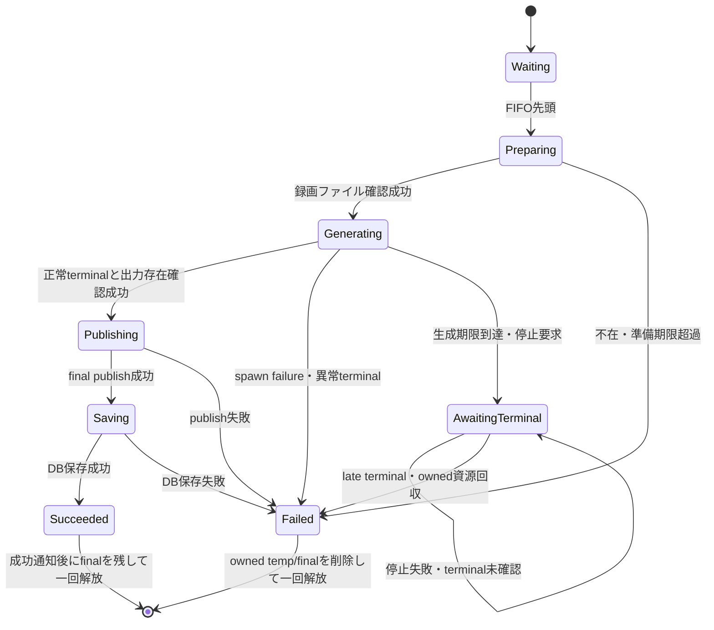

# 録画済み番組のサムネイル管理機能 設計

## 1. 目的と境界

本機能は、録画ファイルから JPEG サムネイルを一件ずつ生成し、生成画像を録画済み番組へ関連付ける。あわせて、登録済みサムネ
イルの取得・削除、不足画像の再生成、および DB のサムネイル登録情報と保存先の画像との不一致を整理する。

### 対象

-   生成依頼の受付、上限判定、FIFO の直列実行
-   録画ファイル確認、JPEG 生成、サムネイル登録情報のDB保存
-   生成・削除の完了通知
-   取得、個別削除、不足画像の再生成、クリーンアップ
-   失敗時の生成画像の後始末と、再起動時の未完了依頼の扱い

### 対象外

-   録画ファイルそのものの作成・削除
-   動画のエンコードと配信
-   通知先が行う非同期処理の完了管理
-   待機依頼または実行中依頼の永続化・復元

### 依存関係

| 依存先                           | 利用目的                                                     |
| -------------------------------- | ------------------------------------------------------------ |
| `server-configuration`           | 保存先、生成コマンド、画像サイズ、動画内位置、待機上限の取得 |
| `server-recorded-content`        | 録画済み番組、録画ファイル登録、実ファイル保存先の確認       |
| `server-persistence`             | サムネイル登録情報の保存・検索・削除                         |
| `server-operational-logging`     | 生成、削除、クリーンアップの失敗記録                         |
| `server-event-and-hook-delivery` | 生成・削除成功の通知                                         |

## 2. 機能構成

### 2.1 生成受付

生成受付は、現在実行中の一件とは別に、開始待ちの依頼数を管理する。待機上限 `thumbnailMaxPending` は機能開始時に一度だけ
取得し、稼働中の設定再読み込みでは変更しない。

-   省略値: 32
-   設定可能範囲: 1 以上 10,000 以下の整数（上限の根拠は `server-configuration` Design 3.1 節を正とする。値そのもの
    に `thumbnailMaxPending` 固有の算出根拠は無く、待機件数の際限ない増加を防ぐ安全弁である）
-   待機列: FIFO
-   実行数: live child は常に最大一件
-   重複依頼: 統合せず、別依頼として扱う
-   上限到達時: 新規依頼だけを既存のエラー応答経路で拒否する

受付成功は「待機列へ追加できた」ことだけを表し、画像生成完了を表さない。

`add(videoFileId): void`は、非同期処理へ進む前の同じ同期処理内で待機件数の確認と待機列への追加を行う。満杯なら同期的に既
存の過負荷errorをthrowし、IPC dispatcherとAPIの既存失敗応答経路へ伝える。`regenerate()`から複数件を追加する場合も一件ご
とに同じ`add()`を通し、上限へ達した対象だけを追加せず記録して、調査可能な別の番組を続ける。専用待機列はchild leaseを持
ち、先行childの非生存と資源確定を確認するまで次のchildを開始しない。

### 2.2 JPEG 生成・登録

待機列の先頭を次の順序で処理する。

1. 録画ファイル登録と実ファイル保存先を確認する。
2. サムネイル保存先を確認し、存在しなければ作成する。
3. 録画済み番組 ID を基にした候補 final path を `open(..., "wx")` で排他的に作成する。`EEXIST` なら連番候補へ進む。
4. request ごとに一意な temporary directory と temporary JPEG path を作り、final path とともに `OutputReservation` へ保
   持する。
5. 設定された動画内位置、画像サイズ、生成コマンドを使い、child は temporary JPEG だけへ出力する。
6. child の正常 terminal を確認し、temporary JPEG の存在を確認する。
7. temporary JPEG の内容を排他的に所有する final file へ copy/publish する。
8. final file の相対 `filePath` と `recordedId` をサムネイル登録情報として DB に保存する。
9. DB 保存成功後に生成完了通知を発行する。
10. temporary file と directory を回収して `OutputReservation` を final file を残して解放し、通知先の非同期処理完了を待たず次の待機依頼を開始する。

DB 保存結果が未解決の間は、同じ依頼を完了扱いにせず、次の生成依頼も開始しない。保存結果が返るまで成功または失敗を推測し
ない。child deadline で依頼を論理的な失敗へ確定した場合も、child lease は別に保持し、spawn failure または terminal に
よってchildがliveでないことを確認して資源を確定するまで次のchildを開始しない。

### 2.3 取得・個別削除

-   取得は、録画済み番組に関連付けられたサムネイル登録情報と JPEG の参照に必要な情報を返す。
-   個別削除は、指定した登録情報の存在を確認し、登録情報と対応 JPEG の削除を試みる。
-   JPEG 削除まで成功した場合だけ削除完了を通知する。
-   登録情報が存在しない場合、または JPEG を削除できない場合は失敗とする。

個別削除はサムネイル登録情報を先にDBから削除し、その後に対応JPEGを削除する。JPEG削除に失敗した場合、削除済みの登録情報を
自動復元せず、削除完了通知も発行しない。残ったJPEGは後の明示的なクリーンアップで未登録ファイルとして整理できる。

### 2.4 不足画像の再生成

再生成要求は、録画ファイルを持つ録画済み番組を順に調べる。

-   登録情報が指す JPEG がなければ、その登録情報の削除を試みる。
-   利用可能なサムネイルが一件もなく、録画ファイルがあれば、最初の録画ファイルを生成待機列へ追加する。
-   利用可能なサムネイルがあれば追加生成しない。
-   一件の調査に失敗しても、調査可能な別の番組を続ける。

再生成要求の完了は調査と待機列への追加までであり、追加した全 JPEG の生成完了までは待たない。

### 2.5 クリーンアップ

クリーンアップは、次の不一致を一件ずつ整理する。

-   登録情報はあるが JPEG がない: 登録情報を削除する。
-   保存先にファイルはあるが登録情報がない: その未登録ファイルを削除する。

未登録ファイルの削除候補は、列挙後に登録情報を取得し直して登録済みになったものと、active reservation の path を除く。管理する保存先の外へ
解決される entry（symlink への差し替えなど）は安全でないとして削除せず、記録して次へ進む。

一件の照合または削除に失敗しても、記録を残して他の対象を続ける。クリーンアップから生成依頼は作らない。

## 3. データとインターフェース

### 3.1 サムネイル登録情報

| 項目         | 意味                                         |
| ------------ | -------------------------------------------- |
| `id`         | サムネイル登録情報の識別子                   |
| `filePath`   | サムネイル保存先を基準とした JPEG の相対パス |
| `recordedId` | 関連付ける録画済み番組の識別子               |

画像自体はファイルとして保存し、DB には画像内容を格納しない。「サムネイル登録情報のDB保存」とは、`filePath` と
`recordedId` の関係を保存する処理を指す。

### 3.2 生成依頼

生成依頼は対象録画ファイルの識別子を持つ。待機列と実行中依頼はメモリー内だけに保持する。同じ識別子の依頼も独立した要素と
して保持する。

`OutputReservation` は request の識別（`requestId`）、reservation の識別（`reservationId`）、final の相対名と path、request固有の
temporary directory・file、publish 済みの印、および一回だけの解放状態を持つ内部情報である。child lease は専用待機列の job が
`GenerationRequest`（terminal の確認と業務 settlement の状態）の確定まで保持する。active reservationはメモリー内set
へ保持し、名前選択と明示的クリーンアップの双方から除外する。DBへ保存するのは従来どおりfinal相対`filePath`と
`recordedId`だけであり、reservation identity、temporary path、状態を公開path、DB schema、API、IPCへ追加しない。

### 3.3 設定

| 設定                  | 用途                                 | 反映時点                 |
| --------------------- | ------------------------------------ | ------------------------ |
| `thumbnail`           | JPEG 保存先                          | 機能が設定を取得した時点 |
| `thumbnailCmd`        | JPEG 生成コマンド                    | 機能が設定を取得した時点 |
| `thumbnailSize`       | 出力画像サイズ                       | 機能が設定を取得した時点 |
| `thumbnailPosition`   | 動画内の取得位置                     | 機能が設定を取得した時点 |
| `thumbnailMaxPending` | 生成待機件数上限。既定 32、1〜10,000 | 機能開始時               |

生成コマンド文字列は既存のコマンド解釈規則に従って実行対象と引数へ分ける。JPEG 生成処理には親プロセスの環境変数を引き継
ぐ。

開始準備とJPEG生成には次の内部定数を使用し、設定ファイル、公開設定、API、IPCへ追加しない。

| 名前                               | 値        | 起算点と完了点                                               |
| ---------------------------------- | --------- | ------------------------------------------------------------ |
| `PREPARATION_TIMEOUT_MS`           | 30,000ms  | FIFO先頭の処理開始から、録画ファイル登録と実パス確認完了まで |
| `processTimeoutMs()`               | 300,000ms | JPEG生成processのspawn直前から、終了状態を受け取るまで       |

## 4. 処理シーケンスと状態

### 4.1 生成シーケンス

### 4.2 一件の状態

### 4.3 ファイル名決定

標準名は録画済み番組 ID を基にした `.jpg` とする。候補final fileをfilesystemの排他的作成 `open(candidate, "wx")` でclaim
し、`EEXIST`なら同じ基底名へ連番を付けた次候補へ進む。存在確認と作成を分離しないため、同名raceでも一つのcandidateを二依
頼が所有しない。

childへはclaim済みfinal pathを渡さず、requestごとに一意なtemporary directory内のtemporary pathを渡す。正常terminal後に出
力の存在を確認し、temporary JPEGの内容をclaim済みfinal fileへcopy/publishする。active `OutputReservation` setにあるfinalと
temporary pathは名前選択およびクリーンアップの削除候補から除外する。

## 5. 期限、失敗、後始末、再起動

### 5.1 開始準備期限

録画ファイル登録と実パスの確認には一件の30秒absolute deadlineを適用する。期限へ達した依頼は失敗として先頭を解放する。期
限後に確認処理が完了しても、その依頼から JPEG 生成を開始しない。各依頼が処理中か完了済みかを示すメモリー内の状態で、遅れ
て完了した結果を無視する。確認成功からJPEG生成へ進む直前にもmonotonic clockで同じdeadlineを再確認する。

### 5.2 JPEG 生成期限

外部の JPEG 生成処理にはspawn直前から300秒のabsolute deadlineを適用する。期限へ達した場合は既存のプロセス停止方法で停止
を一回試み、依頼の業務結果を論理的な失敗へ一回だけ確定する。新しいsignal、停止強化、再試行は追加しない。終了コードが正常
でない場合も失敗とする。

開始準備期限と JPEG 生成期限は、無期限待機を防ぐ内部方針である。新しい公開設定項目や DB 監視期限は追加しない。

各生成依頼は一意なobject tokenと`settled`状態を持つ。正常終了、異常終了、`error`、期限到達のうち最初の結果だけが依頼を確
定する。業務結果のsettlementとchild leaseのfinalizationは別状態とする。期限到達後はtokenを失効させ、遅れて届く
`exit`、`close`、`error`からfinal publish、サムネイル登録情報のDB保存、成功通知、または別依頼のsettlementを開始しない。

deadline時の停止要求が成功を返した場合も、childが非liveになった証拠とはしない。spawn failure、またはlate `close`を含む
terminalによってchildが非liveであることを確認してから、owned temporary file・directoryとclaim済みfinal fileを削除し、
timer・listener・child参照・`OutputReservation`を一回だけ解放する。その時点で初めてgeneration slotを解放し、後続依頼を開
始できる。停止要求の失敗、`error`、`exit`だけではslotを解放せず、terminalを待つ。

terminalを確認できない場合は、live child最大一件を守るためサムネイル専用queueを停止したままにし、request identityと
reservation identityを`thumbnail deadline failed`・`thumbnail stop failed`の記録として残す。他のserver機能は専用queueを共有しないため継続する。この残留riskに自動回復、signal
escalation、または後続childの並行開始を追加しない。

### 5.3 失敗時の後始末

-   保存先を読み書きできない場合は外部処理を開始しない。
-   child はrequest固有temporary pathだけへ出力し、final pathへ直接書かせない。
-   JPEG 生成、出力存在確認、final publish、またはDB保存に失敗した場合、その`OutputReservation`が所有するtemporary
    file・directoryとfinal fileだけを削除する。
-   DB保存成功時はfinal fileを残し、temporary資源とreservationを一回だけ解放する。
-   deadline後のlate terminalでもowned資源だけを削除し、他依頼のtemporary/final fileを変更しない。
-   後始末の失敗を元の失敗で隠さず、双方をログへ記録する。
-   所有するtemporary JPEGのunlinkが`ENOENT`を返した場合は、未生成または既不存在で削除目的が達成済みのため、
    temporary fileの後始末故障として記録しない。生成・DB保存の元失敗は保持し、temporary directoryと必要なfinal fileの
    回収を継続する。`EISDIR`、権限エラー、codeを持たない例外など、`ENOENT`以外は同じrequest/reservation identityの
    後始末失敗として一回記録する。この扱いは`cleanupReservation`のowned temporary JPEGだけに限定し、汎用
    `FileUtil.unlink`、個別サムネイル削除、final fileの削除エラー契約は変更しない。
-   DB 保存成功前に生成完了通知を出さない。

DB保存失敗は`logReservationFailure('database', reservation, err)`が記録し、`thumbnail database failed:
requestId=<requestId>, reservationId=<reservationId>`とerr本体の2行になる（`test/server/thumbnail-management/imp/queue-lifecycle.test.ts`の
`[TM-IMP-COMMIT-FAILURE]`が固定）。DB保存は`settleSuccess`内で`publishOutput`成功直後に行われ、同じ非同期処理内で直前に
`create thumbnail: ${videoFileId}, ${reservation.finalPath}`という`videoFileId`付きinfo行を必ず記録してから保存を試み
る。そのため運用者は直前行の`videoFileId`とfinal pathで対応するDB保存失敗を追跡できる。
また、DB保存失敗直後に行うfinal file削除の失敗は`logReservationFailure('cleanup final file', ...)`が
`thumbnail cleanup final file failed: requestId=…`として記録する。DB保存失敗以外にもspawn、deadline、stop、publish、
一時file・directory・final fileの後始末失敗まで同じ`logReservationFailure`で一律記録する。直前info行との相関で運用上の
追跡可能性を維持しつつ、requestId／reservationIdベースの記録とし、videoFileIdは追加しない。
-   DB 保存処理が未解決である間は、成功・失敗を推測せず待機する。
-   クリーンアップはactive `OutputReservation` setのfinal/temporary path、列挙後に登録されたfile、管理する保存先の外へ解決されるentryを未登録fileとして削除しない。

### 5.4 再起動

待機列と実行中状態はメモリー内だけに存在する。プロセス再起動後は、再起動前の待機依頼を復元せず、実行中だった依頼も再開し
ない。再起動後に明示された再生成またはクリーンアップは、新しい要求として受け付ける。

## 6. 実装上の制約

-   FIFO と一件実行を、サムネイル管理単位の専用待機列で保証する。
-   待機数、実行中状態、child lease、active `OutputReservation`、期限後の遅延結果無視はメモリー内で完結させる。
-   待機上限の確認と追加は`add()`の同期処理内で不可分に行い、満杯errorを呼出元へthrowする。
-   final候補は`open(..., "wx")`で排他的にclaimし、child出力はrequest固有temporary pathへ隔離する。
-   一件の生成結果はobject tokenと`settled` guardで一回だけ確定し、child leaseはspawn failureまたはterminal確認後にだけ
    解放する。
-   final publish、DB insert、成功通知、owned資源cleanup、reservation解放はrequest identityごとにそれぞれ最大一回とす
    る。
-   `new Promise(async (resolve) => ...)` の形を使用しない。Promise executor は同期関数とし、非同期処理は事前に `await`
    するか、明示的な成功・失敗ハンドラーを接続する。
-   成功通知の発行関数は、登録済みリスナーの非同期完了を待つ契約にしない。

## 7. テスト設計と品質境界

### 7.1 所有権と配置

本機能は、サムネイル管理固有の artifact path、case 一覧、test oracle、fixture、assertion、および外部境界
scenarioの定義だけを所有する。実行結果、coverage結果は所有しない。共有runner、`test/server` root、固定command、V8 coverage、
Node.js 24/26 matrix、および server 全体の C0・C1 判定は、サーバー起動・稼働管理機能（`server-application-runtime`）の
Requirement 9 だけが所有する。本機能から共有command や coverage 判定を再定義しない。

以下の path は `test/server/thumbnail-management/` に実在する（`imp/*.test.ts` は `imp/` 配下の 6 test file と補助の `_thumbnail-harness.ts`）。
実行結果と coverage 結果は本機能が記録せず、共有 runner が所有する。

-   `test/server/thumbnail-management/spec/generation-admission.spec.test.ts`
-   `test/server/thumbnail-management/spec/jpeg-generation.spec.test.ts`
-   `test/server/thumbnail-management/spec/thumbnail-access-delete.spec.test.ts`
-   `test/server/thumbnail-management/spec/thumbnail-regeneration.spec.test.ts`
-   `test/server/thumbnail-management/spec/thumbnail-cleanup.spec.test.ts`
-   `test/server/thumbnail-management/spec/thumbnail-restart.spec.test.ts`
-   `test/server/thumbnail-management/imp/*.test.ts`
-   `test/server/thumbnail-management/integration/*.integration.test.ts`

Requirements 1 から 6 の 44 AC は、それぞれ同じ `TM-N.M` を名前に持つ一意な `*.spec.test.ts` case を主 test とする。R7
は仕様 case の重複 owner にならず、44 case の一覧、具体的な実装 case、49 行 matrix、具体的な結合
case、server 全体の C0・C1 判定をそれぞれ一つずつ参照する。

### 7.2 fixture と観測

-   fake timer、deferred Promise、call ledger、temporary directory、temporary DB、合成 JPEG child process を使う。
-   受付結果、queue の順序、process 数、DB row、JPEG、通知回数、timer・listener・child の解放を結果として assert する。
-   `null`、空、0、1、最小、最大、範囲外、不正型、重複を、入力を持つ契約へ割り当てる。設定 carrier が型を拒否する場合は
    `C`、入力自体を持たない契約は理由付き `N` とする。
-   待機、生成中、成功、失敗、restart、cancel 非適用、再入、期限直前・到達・超過、late result、同着、race、重複通知を
    deterministic に制御する。
-   fixture、snapshot、log assertion に実 URL、実番組名、実保存 path、実 command path、credential、親 process の実環境値
    を含めない。

### 7.3 状態・Matrix 記法

次節を本機能唯一の機能固有 Test Matrix とする。入力列は `[null, 空, 0, 1, 最小, 最大, 範囲外, 不正型, 重複]` の順で、`T`
は直接 test、`C` は設定・HTTP・IPC carrier での検証、 `N` は当該 AC がその値を入力に持たないため非適用を表す。

状態は `W`=待機前・待機中、`G`=生成前・生成中、`S`=成功、`F`=失敗、`RST`=再起動前後、`RE`=再入・重複 callback とする。
`CAN-NA` は実行中依頼を利用者が取り消す contract がないため cancel 非適用、`RE-NA` は単発処理で再入を扱わないことを示
す。時間は `順`=順序、`準`=準備期限直前・到達・超過、`生`=生成期限直前・到達・超過、`遅`=late result、`衝`=race・同着・
重複通知である。資源または境界の `N/A` は、列挙した資源・境界を主 test が直接所有または接続しないため非適用である。

### 7.5 機能固有 Test Matrix

`種別`の `S` は `unittest/spec` 主 test、`I` は `unittest/imp` 補助、`G` は integration 補助、`M`（本表）と `Q`（品質判定）は R7
固有の行である。`主 test` は path#case 名で実在する test を指し、case 名は `it` 名の `[TM-N.M]` 接頭辞に一致する。実行結果と coverage は
本表に記録せず、`server-application-runtime` が所有する共有 command で判定する。

| ID      | 主 test                                       | 種別     | null・空・0・1・最小・最大・範囲外・不正型・重複 | 状態                        | 時間           | 資源                                                        | 外部境界                       | failure・期待結果 |
| ------- | --------------------------------------------- | -------- | ------------------------------------------------ | --------------------------- | -------------- | ----------------------------------------------------------- | ------------------------------ | ------------------------------------------------------------------- |
| TM-1.1  | `generation-admission.spec.test.ts#TM-1.1`    | S/I      | N,N,T,T,T,T,T,C,T                                | W/G                         | 順/衝          | queue/lock                                                  | IPC                            | 上限内だけ不可分に追加し受理数が上限以下 |
| TM-1.2  | `generation-admission.spec.test.ts#TM-1.2`    | S/I      | N,N,N,T,T,T,N,N,T                                | W/G/S/F/RE                  | 順/生/遅/衝    | queue/child lease/listener                                  | process                        | FIFO、live child最大1。停止成功/失敗後もlate closeまで後続child 0 |
| TM-1.3  | `generation-admission.spec.test.ts#TM-1.3`    | S/I      | N,N,N,T,N,N,N,N,T                                | W/G/RE                      | 順/衝          | queue/OutputReservation/temp                                | filesystem/process             | 同じvideoFileIdも統合せず別の待機要素として二回処理し、同一recordedIdのfinalは`wx` claimで別名になる（claimはimpのoutput-reservationで検査） |
| TM-1.4  | `generation-admission.spec.test.ts#TM-1.4`    | S/I      | N,N,N,N,T,N,N,C,N                                | W                           | 順             | config snapshot                                             | configuration                  | 省略（未設定）で32、起動時に一回だけ保持。nullは設定読み込みで拒否（TM-1.5。nullはimpのadmission-limitsが検査する） |
| TM-1.5  | `generation-admission.spec.test.ts#TM-1.5`    | S/I      | T,T,T,T,T,T,T,T,N                                | F                           | 順             | N/A                                                         | configuration                  | 1〜10,000整数だけ起動し0・負・10,001・小数・文字列・非有限を拒否 |
| TM-1.6  | `generation-admission.spec.test.ts#TM-1.6`    | S/I      | N,N,N,T,T,T,N,N,T                                | W/RST                       | 順             | config snapshot                                             | configuration                  | 稼働中変更を無視し新instanceだけ新値を使用 |
| TM-1.7  | `generation-admission.spec.test.ts#TM-1.7`    | S/G      | N,N,T,T,T,T,T,C,T                                | W/F                         | 衝             | queue/lock                                                  | HTTP/IPC                       | 満杯時は新規だけ既存error、受付済み取消0 |
| TM-1.8  | `generation-admission.spec.test.ts#TM-1.8`    | S        | N,N,N,T,N,N,N,N,T                                | W/G                         | 順             | queue                                                       | HTTP/IPC                       | 受付応答時にDB row・JPEG・完了通知0 |
| TM-1.9  | `generation-admission.spec.test.ts#TM-1.9`    | S/I      | N,N,N,T,N,N,N,N,T                                | G/S/F/RE                    | 順/遅/衝       | queue/child lease/listener                                  | DB/process                     | 成功通知後はlistenerを待たず開始。child期限失敗はterminal後だけ開始 |
| TM-1.10 | `generation-admission.spec.test.ts#TM-1.10`   | S/I      | N,N,N,T,N,N,N,N,T                                | G/S/F                       | 順/遅          | queue/DB registration                                       | DB                             | サムネイル登録情報のDB保存未解決中は後続process 0 |
| TM-2.1  | `jpeg-generation.spec.test.ts#TM-2.1`         | S/I      | T,T,T,T,N,N,T,C,T                                | G/F                         | 順             | DB query/file                                               | DB/filesystem                  | video rowまたは実path不在でspawn 0 |
| TM-2.2  | `jpeg-generation.spec.test.ts#TM-2.2`         | S/I      | N,N,N,T,T,N,N,C,N                                | G                           | 準             | timer/queue                                                 | DB/filesystem                  | 正の有限30秒absolute deadline中は後続確認・生成0 |
| TM-2.3  | `jpeg-generation.spec.test.ts#TM-2.3`         | S/I      | N,N,N,T,T,N,T,N,T                                | F/RE                        | 準/遅/衝       | timer/queue                                                 | DB/filesystem/process          | 期限で一回失敗・解放、late確認からspawn・DB・通知0 |
| TM-2.4  | `jpeg-generation.spec.test.ts#TM-2.4`         | S/G      | T,T,N,T,N,N,N,C,N                                | G/S/F                       | 順             | directory                                                   | filesystem                     | ENOENT時だけ作成し作成失敗を伝播 |
| TM-2.5  | `jpeg-generation.spec.test.ts#TM-2.5`         | S/G      | T,T,T,T,N,N,T,C,N                                | F                           | 順             | directory/file                                              | filesystem/process             | 読書き不可ならspawn・DB・通知0 |
| TM-2.6  | `jpeg-generation.spec.test.ts#TM-2.6`         | S/I/G    | N,N,T,T,T,T,T,C,T                                | G                           | 順             | child/file                                                  | process/filesystem             | position・size・methodをexact argsへ一回反映 |
| TM-2.7  | `jpeg-generation.spec.test.ts#TM-2.7`         | S/I/G    | T,T,T,T,T,T,N,C,T                                | G/RE                        | 衝             | OutputReservation/temp/final/lock                           | filesystem                     | `wx` claim・EEXIST連番・同着別identity、final直書き0、cleanup除外 |
| TM-2.8  | `jpeg-generation.spec.test.ts#TM-2.8`         | S/I      | N,N,N,T,T,N,N,C,N                                | G                           | 生             | timer/child/listener                                        | process                        | 正の有限300秒deadlineをspawn直前から適用 |
| TM-2.9  | `jpeg-generation.spec.test.ts#TM-2.9`         | S/I/G    | N,N,N,T,N,N,T,N,T                                | G/F/RE                      | 生/遅/衝       | timer/child lease/listener/OutputReservation/temp/final     | process/filesystem             | stop成功/失敗でもlate closeまでslot保持、DB/通知0、owned cleanup1 |
| TM-2.10 | `jpeg-generation.spec.test.ts#TM-2.10`        | S/I/G    | N,N,N,T,N,N,N,C,T                                | G/S                         | 順             | DB registration/OutputReservation/temp/final                | DB/filesystem                  | 正常terminal・publish後だけ相対path+recordedIdを一回保存 |
| TM-2.11 | `jpeg-generation.spec.test.ts#TM-2.11`        | S/I      | N,N,N,T,N,N,N,N,T                                | S/RE                        | 順/衝          | listener                                                    | DB                             | DB確定後だけ生成完了通知1回 |
| TM-2.12 | `jpeg-generation.spec.test.ts#TM-2.12`        | S/I/G    | T,T,T,T,N,N,T,C,T                                | F/RE                        | 順/遅          | OutputReservation/temp/final                                | DB/filesystem/process          | 生成/publish/DB失敗時owned temp/finalだけ各1回削除・解放 |
| TM-2.13 | `jpeg-generation.spec.test.ts#TM-2.13`        | S/I      | T,T,N,T,N,N,T,C,T                                | G/F                         | 順             | child                                                       | process                        | commandをexact bin/argsへ分離し空・不正commandを成功にしない |
| TM-2.14 | `jpeg-generation.spec.test.ts#TM-2.14`        | S/I/G    | T,T,N,T,N,N,N,C,T                                | G                           | 順             | child                                                       | process                        | 合成markerを継承しsecret値を証拠化しない |
| TM-3.1  | `thumbnail-access-delete.spec.test.ts#TM-3.1` | S/G      | T,T,T,T,N,N,T,C,T                                | S/F                         | 順             | DB query/file                                               | DB/HTTP/filesystem             | 登録済みJPEGの参照path、not-foundは404 carrier |
| TM-3.2  | `thumbnail-access-delete.spec.test.ts#TM-3.2` | S/G      | T,T,T,T,N,N,T,C,T                                | F                           | 順             | DB query                                                    | DB/HTTP/IPC                    | 登録情報不在は削除失敗、unlink・通知0 |
| TM-3.3  | `thumbnail-access-delete.spec.test.ts#TM-3.3` | S/I/G    | N,N,N,T,N,N,N,C,T                                | S/F                         | 順             | DB registration/file                                        | DB/filesystem/IPC              | DB登録情報削除後に対応JPEG削除を試行 |
| TM-3.4  | `thumbnail-access-delete.spec.test.ts#TM-3.4` | S/I      | N,N,N,T,N,N,N,N,T                                | S/RE                        | 順/衝          | listener                                                    | DB/filesystem                  | DB・JPEG成功後だけ削除通知1回 |
| TM-3.5  | `thumbnail-access-delete.spec.test.ts#TM-3.5` | S/I/G    | N,N,N,T,N,N,T,C,T                                | F                           | 順             | DB registration/file                                        | DB/filesystem/HTTP             | unlink失敗を成功にせずDB復元0・通知0 |
| TM-4.1  | `thumbnail-regeneration.spec.test.ts#TM-4.1`  | S/I/G    | T,T,T,T,N,N,T,C,T                                | W/S/F                       | 順             | DB query/file                                               | DB/filesystem/IPC              | 録画fileあり番組とthumbnail登録を全件確認 |
| TM-4.2  | `thumbnail-regeneration.spec.test.ts#TM-4.2`  | S/I/G    | T,T,N,T,N,N,N,C,T                                | S/F                         | 順             | DB registration/file                                        | DB/filesystem                  | 欠落JPEGの登録情報だけ削除試行 |
| TM-4.3  | `thumbnail-regeneration.spec.test.ts#TM-4.3`  | S/I      | T,T,T,T,T,N,N,C,T                                | W                           | 順             | queue/DB query                                              | DB                             | 利用可能画像0・video1以上で先頭IDだけadd |
| TM-4.4  | `thumbnail-regeneration.spec.test.ts#TM-4.4`  | S/I      | N,N,N,T,N,N,N,N,T                                | S                           | 順             | DB query/file                                               | DB/filesystem                  | 利用可能画像1以上ならadd 0 |
| TM-4.5  | `thumbnail-regeneration.spec.test.ts#TM-4.5`  | S/G      | N,N,N,T,N,N,N,N,T                                | W/G                         | 順             | queue                                                       | HTTP/IPC                       | 調査とadd完了で応答し生成・DB保存を待たない |
| TM-4.6  | `thumbnail-regeneration.spec.test.ts#TM-4.6`  | S/I      | N,N,N,T,N,N,T,N,T                                | W/F                         | 順             | queue/DB query/file                                         | DB/filesystem                  | 一番組の照合・削除・満杯失敗後も他番組を継続 |
| TM-5.1  | `thumbnail-cleanup.spec.test.ts#TM-5.1`       | S/I/G    | T,T,T,T,N,N,T,C,T                                | S/F/RE                      | 順/衝          | DB query/file/OutputReservation                             | DB/filesystem/IPC              | DB登録と保存先fileを照合しactive reservationは削除候補外 |
| TM-5.2  | `thumbnail-cleanup.spec.test.ts#TM-5.2`       | S/I      | T,T,N,T,N,N,N,C,T                                | S/F                         | 順             | DB registration/file                                        | DB/filesystem                  | 欠落JPEGの登録情報だけ削除試行 |
| TM-5.3  | `thumbnail-cleanup.spec.test.ts#TM-5.3`       | S/I/G    | T,T,N,T,N,N,N,C,T                                | S/F/RE                      | 順/衝          | file/OutputReservation                                      | DB/filesystem                  | active final/temporary、列挙後に登録されたfile、管理rootの外へ解決されるentryは削除0 |
| TM-5.4  | `thumbnail-cleanup.spec.test.ts#TM-5.4`       | S/I      | N,N,N,T,N,N,T,N,T                                | S/F                         | 順             | DB registration/file                                        | DB/filesystem                  | 一件照合・削除失敗を記録し他対象継続 |
| TM-5.5  | `thumbnail-cleanup.spec.test.ts#TM-5.5`       | S/I      | N,N,T,T,N,N,N,N,T                                | S                           | 順             | queue                                                       | DB/filesystem                  | cleanupのadd・spawn・生成通知0 |
| TM-6.1  | `thumbnail-restart.spec.test.ts#TM-6.1`       | S/I      | N,N,T,T,N,N,N,N,T                                | W/G/RST                     | 順             | queue/child                                                 | process memory                 | 待機・生成中依頼の永続row/file/cursor 0 |
| TM-6.2  | `thumbnail-restart.spec.test.ts#TM-6.2`       | S/I      | N,N,T,T,N,N,N,N,T                                | W/RST                       | 順             | queue                                                       | process memory                 | 新instanceの旧待機復元0 |
| TM-6.3  | `thumbnail-restart.spec.test.ts#TM-6.3`       | S/I      | N,N,T,T,N,N,N,N,T                                | G/RST/RE                    | 遅/衝          | child/listener/reserved path                                | process/filesystem             | 旧実行を再開せずlate callbackが新instanceへ作用0 |
| TM-6.4  | `thumbnail-restart.spec.test.ts#TM-6.4`       | S/G      | N,N,N,T,N,N,N,N,T                                | RST/W                       | 順             | queue/DB query/file                                         | DB/HTTP/IPC/filesystem         | 再起動後の明示regenerate/cleanupを新規受付 |
| TM-7.1  | `spec/*.spec.test.ts`の44 named case#TM-7.1   | S        | N,N,N,N,N,N,N,N,N                                | W/G/S/F/RST/CAN-NA/RE       | 順             | case 一覧                                                   | test foundation                | 44 spec caseの一意性を定義 |
| TM-7.2  | `IMP-CASES-TM-7.2`                            | I        | T,T,T,T,T,T,T,T,T                                | W/G/S/F/RST/RE              | 準/生/遅/衝    | queue/timer/listener/child/DB registration/reservation/file | DB/filesystem/process          | concrete imp pathとassertion oracleを定義。重複IDはspecのTM-1.3が検査する |
| TM-7.3  | 本節の Matrix（7.5）#TM-7.3                   | M        | N,N,N,N,N,N,N,N,N                                | W/G/S/F/RST/CAN-NA/RE/RE-NA | 順/準/生/遅/衝 | matrix                                                      | test foundation                | 49行・全列・N/A理由・一意IDが揃う |
| TM-7.4  | `INT-CASES-TM-7.4`                            | G        | N,N,N,N,N,N,N,N,N                                | W/G/S/F/RST/RE              | 順/準/生/遅/衝 | DB connection/file/timer/listener/child/queue/reservation   | DB/HTTP/IPC/filesystem/process | 5境界のcaseとcleanup oracleを定義 |
| TM-7.5  | `RUNTIME-R9-TM-7.5`                           | Q        | N,N,N,N,N,N,N,N,N                                | S/F                         | 順             | test/coverage                                               | Runtime                        | 判定は`server-application-runtime` Requirement 9 AC9。失敗・未成立なら本機能は未完了 |

### 7.6 R7 の artifact と品質判定

| 証拠 key              | artifact・case 一覧                                                                                                                                                                                                                                                                                                                                                                                                                                                                | 本機能が定義する oracle・assertion                                                                                                                                                                                                            |
| --------------------- | ----------------------------------------------------------------------------------------------------------------------------------------------------------------------------------------------------------------------------------------------------------------------------------------------------------------------------------------------------------------------------------------------------------------------------------------------------------------------------------------------- | --------------------------------------------------------------------------------------------------------------------------------------------------------------------------------------------------------------------------------------------- |
| `SPEC-CASES-TM-7.1`     | `spec/*.spec.test.ts`。Matrix の TM-1.1〜TM-6.4 と6個の `*.spec.test.ts` file内のnamed case 44件 | AC欠落、重複割当、case名重複がないnamed caseの並びを定義する。実行結果は記録しない |
| `IMP-CASES-TM-7.2`    | `imp/admission-limits.test.ts#null-empty-zero-one-min-max-out-of-range-invalid-and-duplicate`、`imp/queue-lifecycle.test.ts#waiting-generating-success-failure-reentry-and-db-pending`、`imp/deadline-fences.test.ts#preparation-generation-stop-failure-late-close-and-callback-races`、`imp/output-reservation.test.ts#exclusive-claim-temporary-publish-cleanup-and-same-name-race`、`imp/maintenance-branches.test.ts#delete-regenerate-cleanup-restart-and-resource-release` | queue、timer、listener、child lease、サムネイル登録情報のDB保存、`OutputReservation`、temporary/final JPEGの取得・解放をexact countでassertし、対応付ける。実行結果は記録しない                                 |
| `MATRIX-TM-7.3` | 本節の Matrix（7.5） | TM-1.1〜TM-7.5の49行、全必須列、9入力区分、状態、cancel・再入・restart、時間、資源、外部境界、failure、期待結果について、ID・主testの欠落/重複、未分類、N/A理由欠落がない |
| `INT-CASES-TM-7.4`    | 下記DB、HTTP、IPC、filesystem、processの5 concrete case                                                                                                                                                                                                                                                                                                                                                                                                                                 | failure時のconnection、file、timer、listener、child lease、queue、reservationを一回解放し、他依頼のrow・JPEGを変更しないassertionを定義する。実行結果は記録しない                                                                             |
| `RUNTIME-R9-TM-7.5`   | `server-application-runtime`が所有する固定commandによる本機能固有test | 本機能の単体 test と結合 test が全成功し、`server-application-runtime` Requirement 9 Acceptance Criterion 9 の server 全体の C0・C1 が成立したときだけ完了と判定する。未実行または失敗なら本機能は未完了 |

### 7.7 結合境界

| 境界       | concrete case                                                                                                  | 検証内容と後始末                                                                                                                                                       |
| ---------- | -------------------------------------------------------------------------------------------------------------- | ---------------------------------------------------------------------------------------------------------------------------------------------------------------------- |
| DB         | `integration/thumbnail-db.integration.test.ts#insert-find-delete-and-db-failure-cleanup`                       | temporary DB で `filePath`・`recordedId` の insert/find/delete、未解決保存、保存失敗を接続し、connectionをharness規則で解放する                                        |
| HTTP       | `integration/thumbnail-http.integration.test.ts#get-add-delete-regenerate-cleanup-and-overload-error`          | 公開 adapter の生成・取得・削除・再生成・cleanup と not-found・満杯 error を exact status/body/file で確認し、request/response listenerを解放する                      |
| IPC        | `integration/thumbnail-ipc.integration.test.ts#serialize-add-delete-regenerate-cleanup-and-error`              | videoFileId/thumbnailId、操作種別、成功・失敗を peer 間で接続し、pending request と listener を一回解放する                                                            |
| filesystem | `integration/thumbnail-filesystem.integration.test.ts#exclusive-claim-temporary-publish-reconcile-and-cleanup` | temporary directoryで`wx` claim、EEXIST連番、childのtemporary出力、owned finalへのpublish、active reservationのcleanup除外、失敗時owned資源だけの一回回収をassertする  |
| process    | `integration/thumbnail-process.integration.test.ts#deadline-stop-failure-late-close-and-live-child-lease`      | isolated synthetic childで正常/異常/spawn failure、期限、停止成功/失敗、late closeを接続し、live child最大1、DB/通知最大1、close後だけのcleanup・lease解放をassertする |
| process（本物の ffmpeg） | `integration/thumbnail-real-ffmpeg.integration.test.ts` | 既定の`thumbnailCmd`と本物の ffmpeg で、合成の TS から実際の JPEG（指定の大きさ）を作り、公開・DB 登録・通知が node の script の代用と同じになること、読めない入力での ffmpeg の失敗が非 0 終了の扱いになることをassertする |

stream は画像生成・取得・削除の本機能 contract が readable/writable stream の所有移転を定義しないため非適用である。DB
transaction は本機能の一件 insert/delete adapter が transaction 境界を要求せず、共有 persistence の restore transaction
を再定義しないため非適用である。HTTP と IPC の route、wire、peer 管理は各 carrier owner が所有し、本機能は上記 adapter
接続結果だけを検証する。

## 8. Acceptance Criteria トレーサビリティ

全 Acceptance Criteria は `10 + 14 + 5 + 6 + 5 + 4 + 5 = 49` 件である。各行を一意な `TM-N.M` へ対応付け、R1〜R6 の 44行
は同じ ID の `*.spec.test.ts` case、R7 の5行は重複しない証拠 key を主検証とする。

| AC      | 設計上の対応先                      | 主検証              |
| ------- | ----------------------------------- | ------------------- |
| R1.AC1  | 2.1 同期 admission                  | TM-1.1              |
| R1.AC2  | 2.1 FIFO・一件実行                  | TM-1.2              |
| R1.AC3  | 2.1 重複依頼の独立性                | TM-1.3              |
| R1.AC4  | 2.1、3.3 起動 snapshot・既定32      | TM-1.4              |
| R1.AC5  | 2.1、3.3 1〜10,000整数              | TM-1.5              |
| R1.AC6  | 2.1 稼働中の上限固定                | TM-1.6              |
| R1.AC7  | 2.1 満杯時の新規依頼拒否            | TM-1.7              |
| R1.AC8  | 2.1 受付と完了の分離                | TM-1.8              |
| R1.AC9  | 2.2、4.1 通知後の次依頼開始         | TM-1.9              |
| R1.AC10 | 2.2、5.3 DB保存確定まで直列保持     | TM-1.10             |
| R2.AC1  | 2.2 録画file・実path確認            | TM-2.1              |
| R2.AC2  | 5.1 正の有限な準備期限              | TM-2.2              |
| R2.AC3  | 5.1 期限失敗・late確認抑止          | TM-2.3              |
| R2.AC4  | 2.2 保存先作成                      | TM-2.4              |
| R2.AC5  | 5.3 読書き不可時spawn禁止           | TM-2.5              |
| R2.AC6  | 2.2、3.3 生成条件                   | TM-2.6              |
| R2.AC7  | 4.3 同名回避・予約                  | TM-2.7              |
| R2.AC8  | 5.2 正の有限な生成期限              | TM-2.8              |
| R2.AC9  | 5.2 停止試行・late terminal抑止     | TM-2.9              |
| R2.AC10 | 2.2、3.1 サムネイル登録情報のDB保存 | TM-2.10             |
| R2.AC11 | 2.2 DB保存後の通知                  | TM-2.11             |
| R2.AC12 | 5.3 当該JPEGのcleanup・失敗記録     | TM-2.12             |
| R2.AC13 | 3.3 command分割                     | TM-2.13             |
| R2.AC14 | 3.3 親環境継承                      | TM-2.14             |
| R3.AC1  | 2.3 JPEG取得                        | TM-3.1              |
| R3.AC2  | 2.3 登録情報不在時の失敗            | TM-3.2              |
| R3.AC3  | 2.3 登録情報とJPEG削除              | TM-3.3              |
| R3.AC4  | 2.3 削除成功通知                    | TM-3.4              |
| R3.AC5  | 2.3 JPEG削除失敗                    | TM-3.5              |
| R4.AC1  | 2.4 録画file・登録情報確認          | TM-4.1              |
| R4.AC2  | 2.4 欠落JPEGの登録情報削除          | TM-4.2              |
| R4.AC3  | 2.4 最初の録画fileを追加            | TM-4.3              |
| R4.AC4  | 2.4 利用可能画像時の非追加          | TM-4.4              |
| R4.AC5  | 2.4 受付完了と生成完了の分離        | TM-4.5              |
| R4.AC6  | 2.4 一件失敗後の継続                | TM-4.6              |
| R5.AC1  | 2.5 DB・保存先照合                  | TM-5.1              |
| R5.AC2  | 2.5 欠落JPEGの登録情報削除          | TM-5.2              |
| R5.AC3  | 2.5 未登録file削除                  | TM-5.3              |
| R5.AC4  | 2.5 一件失敗後の継続                | TM-5.4              |
| R5.AC5  | 2.5 cleanupから生成しない           | TM-5.5              |
| R6.AC1  | 3.2、5.4 memory保持                 | TM-6.1              |
| R6.AC2  | 5.4 待機依頼を復元しない            | TM-6.2              |
| R6.AC3  | 5.4 実行中依頼を再開しない          | TM-6.3              |
| R6.AC4  | 5.4 再起動後の明示要求              | TM-6.4              |
| R7.AC1  | 7.1 spec case                       | SPEC-CASES-TM-7.1     |
| R7.AC2  | 7.2、7.6 concrete imp cases         | IMP-CASES-TM-7.2    |
| R7.AC3  | 7.3、7.5 matrix                    | MATRIX-TM-7.3 |
| R7.AC4  | 7.7 concrete integration cases      | INT-CASES-TM-7.4    |
| R7.AC5  | 7.1、7.6 server 全体の C0・C1       | RUNTIME-R9-TM-7.5   |

## 9. 不一致の分類と設計変更時の検証

本 Design は Requirements を実装 oracle とし、test が source または runtime evidence と一致しない場合は
`spec defect`、`implementation defect`、`test defect`、`approved change`、`unknown` のいずれかへ分類する。test を通すた
めだけに production を変更しない。

次を変更した場合は、影響する AC、Matrix、結合境界を再検証する。

-   `thumbnailMaxPending` の既定値・値域・起動 snapshot
-   queue、準備期限、生成期限、process terminal event、late callback guard
-   JPEG 命名、予約済み出力 path、cleanup 順序
-   サムネイル登録情報の DB schema・insert/delete/retry
-   HTTP/IPC carrier、生成・削除通知、録画済み番組・録画 file の relation
-   Node.js、TypeScript、Vitest/V8、build または test 実行環境

## 10. ソース対応

### 10.1 確認済み source locator

| 設計要素                           | source locator                                                                                                             | 確認できる責任                                         |
| ---------------------------------- | -------------------------------------------------------------------------------------------------------------------------- | ------------------------------------------------------ |
| 生成、削除、再生成、クリーンアップ | `src/model/operator/thumbnail/ThumbnailManageModel.ts`                                                                     | `add`、`create`、`delete`、`regenerate`、`fileCleanup` |
| サムネイル登録情報                 | `src/db/entities/Thumbnail.ts`                                                                                             | `filePath` と `recordedId` の関係                      |
| DB 操作                            | `src/model/db/ThumbnailDB.ts`                                                                                              | insert/find/delete と persistence retry 境界           |
| 成功・削除通知                     | `src/model/event/ThumbnailEvent.ts`                                                                                        | 同期 emit と非同期 listener error の隔離               |
| API adapter                        | `src/model/api/thumbnail/ThumbnailApiModel.ts`、`src/model/service/api/thumbnails.ts`、`src/model/service/api/thumbnails/` | 取得、生成、削除、再生成、cleanup の HTTP 接続         |
| IPC adapter                        | `src/model/ipc/IPCClient.ts`、`src/model/ipc/IPCServer.ts`                                                                 | operator process への生成、削除、再生成、cleanup 接続  |
| コマンド解釈                       | `src/util/ProcessUtil.ts`                                                                                                  | 実行対象・引数の分割と置換                             |
| 設定取得                           | `src/model/IConfigFile.ts`、`src/model/Configuration.ts`、`config/config.yml.template`                                     | サムネイル保存先、size、position、待機上限の設定入口（commandの既定値は`Configuration.DEFAULT_VALUE`） |

### 10.2 実装済みの要素

| 要素                                                                                       | 実装                                        | 状態                                     |
| ------------------------------------------------------------------------------------------ | ------------------------------------------- | ---------------------------------------- |
| `thumbnailMaxPending`の既定32・1〜10,000整数・起動snapshot                                 | 設定契約とサムネイル管理                    | 実装済（`Configuration`、`ThumbnailManageModel`） |
| サムネイル専用FIFO、atomic admission、child lease                                          | サムネイル管理                              | 実装済（`ThumbnailManageModel`）         |
| 30秒準備期限、300秒生成期限、late callback guard                                           | サムネイル管理                              | 実装済（`ThumbnailManageModel`）         |
| `OutputReservation`、`wx`排他claim、request固有temporary出力、owned final publish・cleanup | サムネイル管理とfilesystem adapter          | 実装済（`ThumbnailManageModel`）         |
| spec 44 case、imp、integration、matrix                                                     | `test/server/thumbnail-management/`         | test file あり。共有runnerは所有しない   |

source locatorは保守時の入口であり、file構成を責務境界または仕様そのものとして扱わない。
