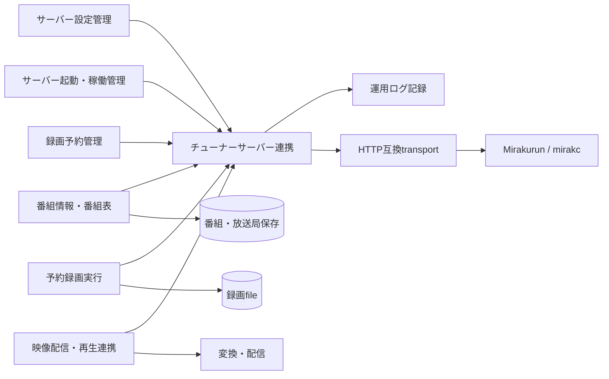
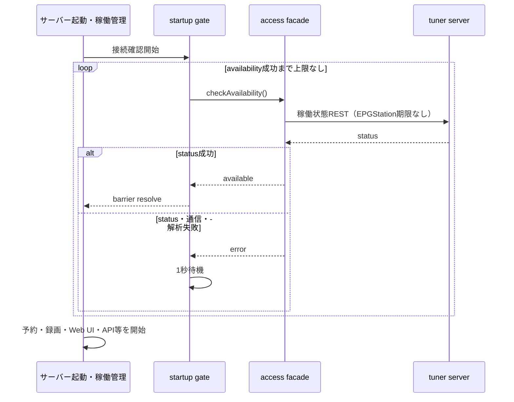
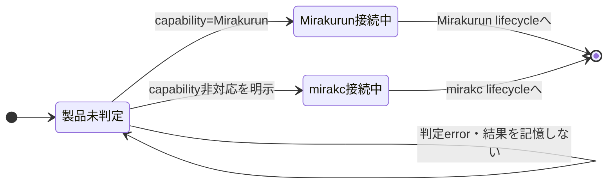
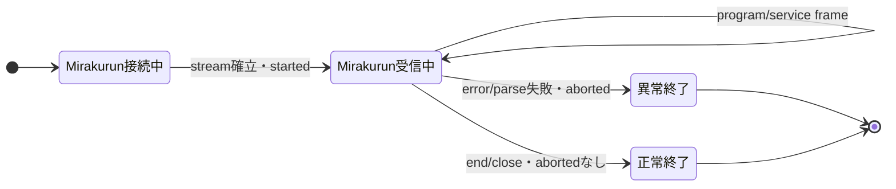
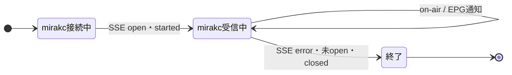
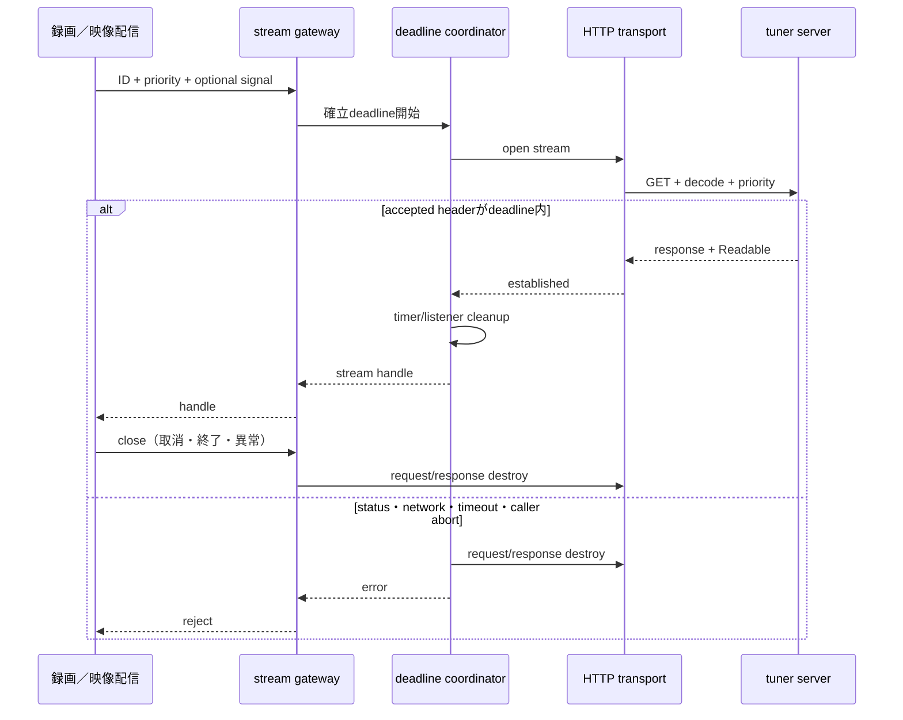

# チューナーサーバー連携機能 設計

## 概要

チューナーサーバー連携機能は、設定されたMirakurunまたはmirakcへHTTP互換transportで接続し、稼働状態、版、チューナー、放送
局、番組、ロゴ、変更通知、および放送ストリームをEPGStation所有の契約として提供する。

共通のREST・stream routeは静的に定義して直接呼び出し、Mirakurun専用client packageを実行時にも型境界にも要求しない。製品
差はpayload normalizerと変更通知adapterの内側で吸収し、予約、録画、番組表、配信へ製品固有型を渡さない。

本Designは、対応版契約、client package依存除去、直接API利用、製品非依存DTO、起動後の有限な一回要求、および有限なstream確
立時間を具体化する。起動時の稼働状態確認だけは一回ごとの要求にも待機全体にも EPGStation 独自の期限を追加しない。接続形
式、取得内容、変更通知差、優先度、stream破棄、保存しないこと、起動待機を維持し、再接続、再開、resource解放確認、永続化、
公開API契約、HTTPS・認証・proxy・TLS設定は追加しない。

## 能力

-   Mirakurun 3.8.0以降およびmirakc 3.1.10以降の公開APIを利用する。
-   対応範囲内の未知のpatch・minor・major版を、exact版の許可一覧にないことだけでは拒否しない。
-   HTTPとUnixドメインソケット上のHTTPを同じ操作portへ正式接続する。Windows名前付きパイプは既存parserとHTTP requestの
    `socketPath` optionによるbest-effortなcharacterizationとしてのみ保持し、Windows host OSをserver正式対応にしない。
-   稼働状態と版、チューナー、放送局、番組一覧、放送局別番組、個別番組、ロゴを正規化して返す。
-   Mirakurunの変更streamとmirakcのSSE通知を製品別adapterで扱い、mirakc通知後に必要となる放送局別番組は独立した
    normalized REST operationで取得できるようにする。
-   番組指定録画、放送局指定録画、ライブ視聴のTS streamを優先度付きで取得し、呼出元が破棄できるhandleを返す。
-   起動時の稼働状態確認を除く一回のREST要求と、録画・ライブstream確立へ有限deadlineを適用する。確立後の継続時間は制限し
    ない。
-   起動時の稼働状態確認には一回ごとの期限を設けず、失敗を返した場合だけ1秒待ち、成功するまで新しい確認を続ける。

最低対応版は互換testの下限であり、runtimeでexact版allowlistを管理するためのものではない。追加fieldは無視できる一方、利用
する必須fieldの欠落・型不一致は解析失敗とする。

## 責任境界

### 所有する責任

-   接続設定snapshotの解釈とtransport targetの生成
-   共通routeへの一回のHTTP要求、response status・body処理、stream確立
-   製品payloadからEPGStation所有DTOへの正規化
-   製品別変更通知protocolの選択とframe解析、および独立した放送局別番組取得operation
-   優先度のupstream headerへの反映
-   起動後の一回要求deadline、caller cancellation、request・responseのcleanup
-   一回・全体とも期限を設けない起動時の稼働状態確認loop
-   操作結果と異常の運用ログ要求

### 所有しない責任

-   取得した放送局、番組、ロゴの保存・cache・検索・削除
-   番組変更の集約、並べ替え、重複・欠落検出、全件同期、再接続時期
-   予約競合の算出、チューナー割当、録画開始・終了時刻、録画再試行
-   録画・ライブstreamの変換、配信、視聴session、途中位置からの再開
-   接続先による競合の受理・拒否・入替、および接続破棄後のresource解放完了確認
-   Mirakurun・mirakc processの起動、設定、監視、再起動
-   HTTPS、接続先専用のcredential、proxy、TLS証明書
-   公開APIのルート、status、body、content type、error projectionの変更

## 依存関係



| 相手機能               | この機能が受け取るもの                        | 相手機能に返すもの／残す判断                                     |
| ---------------------- | --------------------------------------------- | ---------------------------------------------------------------- |
| サーバー設定管理       | 接続先、優先度、起動後用optional deadline設定 | snapshotの読込・reload自体は設定管理に残す                       |
| 運用ログ記録           | 用途別logger                                  | 出力先、level、rotationはログ機能に残す                          |
| サーバー起動・稼働管理 | 起動barrier呼出し                             | 稼働状態確認成功。後続開始順はruntimeに残す                      |
| 番組情報・番組表       | 情報・変更・ロゴ要求                          | 正規化DTO、変更、画像、取得error。保存と再接続判断は番組表に残す |
| 録画予約管理           | チューナー照会                                | 対応放送波を含むチューナーDTO。割当判断は予約管理に残す          |
| 予約録画実行           | 番組／放送局ID、優先度、取消signal            | 破棄可能なstream handleまたは取得error                           |
| 映像配信・再生連携     | 放送局ID、優先度、終了signal                  | 破棄可能なstream handleまたは取得error                           |

公開APIの放送局ロゴでは、保存済み放送局が存在しない、または`hasLogoData`がfalseの場合だけ既存のnot-foundへ投影す
る。upstream要求のstatus、通信、解析、timeout errorはnot-foundへ変換せず、既存のserver error投影へ渡す。成功時の画像body
とcontent typeも変更しない。

## コンポーネント

| コンポーネント           | 責任                                                    | 主な入力                             | 主な出力・状態             |
| ------------------------ | ------------------------------------------------------- | ------------------------------------ | -------------------------- |
| access facade            | consumer向け単一port、operation単位の調整               | DTO要求、stream要求、change observer | DTO、画像、handle、error   |
| connection target parser | 接続文字列をHTTP・Unix socket・既存named pipeへ分解     | 設定snapshot                         | immutable transport target |
| HTTP transport           | request生成、header、body収集、stream確立、abort        | target、route template、deadline     | raw JSON／Buffer／Readable |
| REST gateway             | 共通routeとresponse種別を定義                           | operation parameter                  | raw payload                |
| payload normalizer       | required field検査と製品差吸収                          | unknown payload                      | EPGStation所有DTO          |
| product detector         | 変更通知adapterだけを選ぶcapability判定                 | server config capability response    | process内の判定済み製品    |
| Mirakurun change adapter | JSON event streamのframe解析                            | raw Readable、observer               | program／service change    |
| mirakc change adapter    | SSE解析と初期通知抑止                                   | SSE Readable、observer               | 更新対象service ID         |
| stream gateway           | 番組・放送局streamとpriorityを組み立てる                | ID、priority、signal                 | stream handle              |
| startup gate             | 期限なしの稼働状態確認と失敗後1秒待機を反復             | access facade、clock                 | 成功時のみresolve          |
| deadline coordinator     | 起動後のtimeoutとcaller cancellationを一つのabortへ合成 | operation、設定ms、signal            | first-terminal-winsの完了  |

access facade、transport、detectorはprocess内で共有する。connection targetとdeadline値はinstance生成時の設定snapshotから
作り、稼働中instanceへ設定reloadをpushしない。新snapshotは新instanceまたはprocess再起動後に利用する。

## インターフェース

```typescript
type TunerServerId = number;
type ProgramId = number;
type BroadcastType = 'GR' | 'BS' | 'CS' | 'SKY' | 'BS4K';

interface TunerServerAccess {
    checkAvailability(): Promise<void>;
    getStatus(options?: RequestOptions): Promise<TunerServerStatus>;
    getTuners(options?: RequestOptions): Promise<TunerInfo[]>;
    getServices(options?: RequestOptions): Promise<TunerService[]>;
    getPrograms(options?: RequestOptions): Promise<TunerProgram[]>;
    getProgramsByService(serviceId: TunerServerId, options?: RequestOptions): Promise<TunerProgram[]>;
    getProgram(programId: ProgramId, options?: RequestOptions): Promise<TunerProgram>;
    getLogo(serviceId: TunerServerId, options?: RequestOptions): Promise<Buffer>;
    openProgramStream(request: ProgramStreamRequest): Promise<TunerStreamHandle>;
    openServiceStream(request: ServiceStreamRequest): Promise<TunerStreamHandle>;
    openChangeFeed(observer: TunerChangeObserver, options?: RequestOptions): Promise<TunerChangeFeedHandle>;
}

interface RequestOptions {
    signal?: AbortSignal;
}

interface ProgramStreamRequest extends RequestOptions {
    programId: ProgramId;
    priority: number;
}

interface ServiceStreamRequest extends RequestOptions {
    serviceId: TunerServerId;
    priority: number;
}

interface TunerStreamHandle {
    readonly stream: NodeJS.ReadableStream;
    close(): void;
}

interface TunerChangeFeedHandle {
    readonly completion: Promise<void>;
    close(): void;
}

interface TunerChangeObserver {
    started(): void;
    changed(change: TunerChange): void;
    aborted(error: Error): void;
}
```

`close()`は冪等で、EPGStation側のrequestとresponseを破棄する。接続先resourceの解放完了を待つpromiseや共通resultは返さな
い。`stream`はNode.js標準のreadable契約であり、製品client classや製品packageの`IncomingMessage`型をconsumer条件にしな
い。

`openChangeFeed()`が返すhandleの`completion`は接続終了を表す。Mirakurunの通常`end`・`close`は終了理由errorでこのpromise
をrejectするが、`aborted()`を通信・解析errorと同じ形では呼ばない。この差は「現行の特性」節のとおり維持し、共通の切断通
知へ統一しない。

product detectorの結果はchange adapter選択だけに閉じ込める。status DTO、番組DTO、consumer interface、ログfieldへ製品
discriminatorを加えない。

## データ設計

### 接続target

```typescript
type ConnectionTarget =
    | { kind: 'http'; host: string; port: number; basePath: string }
    | { kind: 'unix'; socketPath: string; basePath: string }
    | { kind: 'named-pipe'; socketPath: string; basePath: string };
```

-   network URLは`http` scheme、host、port、base pathへ分解する。
-   percent-encodeされたsocketを持つ`http+unix`形式と、互換のためのlegacy Unix形式を受理し、socket pathとbase pathを分離
    する。
-   Windows named pipe形式は既存互換としてpipe全体を`socketPath`に保持する。これはparser・request optionのbest-effortな
    characterizationであり、Windows host OSの正式対応または実接続保証ではない。
-   base pathとroute templateはPOSIX separatorで一度だけ結合する。
-   HTTPS、userinfo、credential field、proxy、certificate optionはtargetへ持たせない。
-   設計書、fixture、ログへ実接続先やmachine固有pathを保存しない。

### 正規化DTO

```typescript
interface TunerServerStatus {
    available: true;
    version: {
        current: string;
        latest: string;
    };
}

interface TunerInfo {
    index: number;
    name: string;
    types: BroadcastType[];
    isAvailable: boolean;
    isRemote: boolean;
    isFree: boolean;
    isUsing: boolean;
    isFault: boolean;
}

interface TunerService {
    id: TunerServerId;
    serviceId: number;
    networkId: number;
    name: string;
    type: number;
    logoId?: number;
    hasLogoData?: boolean;
    remoteControlKeyId?: number;
    epgReady?: boolean;
    epgUpdatedAt?: number;
    channel?: {
        type: BroadcastType;
        channel: string;
        name?: string;
    };
}

interface TunerProgram {
    id: ProgramId;
    eventId: number;
    serviceId: number;
    networkId: number;
    startAt: number;
    duration: number;
    isFree: boolean;
    name?: string;
    description?: string;
    genres?: TunerProgramGenre[];
    video?: TunerProgramVideo;
    audios?: TunerProgramAudio[];
    series?: TunerProgramSeries;
    extended?: Readonly<Record<string, string>>;
    relatedItems?: TunerProgramRelatedItem[];
}

interface TunerProgramGenre {
    lv1: number;
    lv2?: number;
    un1?: number;
    un2?: number;
}

interface TunerProgramVideo {
    type: string;
    resolution: string;
    streamContent: number;
    componentType: number;
}

interface TunerProgramAudio {
    componentType: number;
    componentTag?: number;
    isMain?: boolean;
    samplingRate: number;
    langs: string[];
}

interface TunerProgramSeries {
    id: number;
    repeat: number;
    pattern: number;
    expiresAt: number;
    episode: number;
    lastEpisode: number;
    name: string;
}

interface TunerProgramRelatedItem {
    type: 'shared' | 'relay' | 'movement';
    networkId?: number;
    serviceId: number;
    eventId: number;
}

type TunerChange =
    | { kind: 'program'; operation: 'create' | 'update'; program: TunerProgram; time: number }
    | { kind: 'program'; operation: 'remove'; programId: ProgramId; time: number }
    | { kind: 'program'; operation: 'redefine'; from: ProgramId; to: ProgramId; time: number }
    | { kind: 'service'; operation: 'create' | 'update' | 'remove'; service: TunerService; time: number }
    | { kind: 'service-programs-updated'; serviceId: TunerServerId }
    | { kind: 'on-air-service'; serviceId: TunerServerId };
```

DTOはupstream schemaをimportして別名化するのではなく、EPGStationが所有するstructural contractである。配列と入れ子object
はnormalizerが新規生成し、raw response objectを共有しない。放送局・番組・ロゴをこの機能内で永続化またはcacheしない。

### 正規化規則

| 入力差・条件                             | 正規化結果                                                                                                                           |
| ---------------------------------------- | ------------------------------------------------------------------------------------------------------------------------------------ |
| status bodyの情報量が製品で異なる        | status要求の成功を`available: true`へ投影し、共通の版responseから`current`と`latest`を返す                                           |
| tunerの共通fieldと追加field              | 上記`TunerInfo`だけをcopyし、未知fieldはconsumerへ要求しない                                                                         |
| serviceのoptional field                  | 存在する値をcopyし、不在値は`undefined`のままにする。欠落をfalseや0へ変換しない                                                      |
| programの`audios`と単数`audio`差         | `audios`があればそれを正規化し、なければ単数値を1要素配列へ変換する。共通fieldを`TunerProgramAudio`へcopyし、単数fieldは外へ出さない |
| programの`extended`表現差                | descriptionとtextの組を`Record<string, string>`へ正規化する                                                                          |
| program／serviceの追加field              | required fieldの検査後に無視し、未知fieldだけを理由に拒否しない                                                                      |
| ID、時刻、duration                       | finiteなnumberとして検査し、文字列への暗黙変換や別ID体系への再採番をしない                                                           |
| required field欠落、JSON不正、非finite値 | operationの解析errorとして失敗し、部分DTOを返さない                                                                                  |
| serviceの`channel.type`、tunerの`types`要素がGR/BS/CS/SKY/BS4K以外の文字列（Mirakurunが`channels.yml`の`type`を検証せず返す任意の文字列を含む） | その値だけを理由に`getServices()`・`getTuners()`全体を解析失敗にしない。他の必須文字列fieldと同じ型検査（文字列であること）だけを適用し、値を変換・棄却せずそのまま`TunerService.channel.type`・`TunerInfo.types`へ通す（未知の1件を理由に全体を解析失敗にすると、tuner設定次第でservice・tuner一覧の取得そのものが機能しなくなるため）。保存側（`ChannelDB.getChannelTypeId`）はGR/BS/CS/SKY/BS4Kの5値に`channelTypeId`0/1/2/3/5を割り当て、それ以外を未知種別（`channelTypeId` 4）として、`channelType`列には文字列をそのまま保存する。BS4KはGR/BS/CS/SKYと対等な既知の放送種別として扱う（`server-persistence`design参照）。予約競合判定（`ReservationManageModel.setTuners`・`Tuner.add`）・APIでのBS4K公開（config/schedules/rule等）は`server-reservation-management`・`server-service-interface`等の各designで別途定める |
| serviceの`channel.type`、tunerの`types`要素が文字列でない、または欠落する場合 | 他の必須文字列field（`channel.channel`等）と同じ扱いとし、operationの解析errorとして失敗する（このfieldだけを特別に省略可能にしない） |

番組表向けの囲み文字変換、main program選別、保存用extended文字列化、削除・更新の集約は番組情報・番組表機能に残す。tuner
adapterはtransport表現だけを正規化する。

## lifecycle

### instance生成と共通REST

1. 設定snapshotからconnection targetと、起動後の要求へ使う2種類のdeadlineを生成する。
2. access facade、transport、normalizer、product detectorを単一instanceへ組み立てる。
3. `checkAvailability()`は稼働状態REST一回の成功だけを確認する。版RESTを呼ばず、deadlineとcaller signalを適用しない起動
   barrier専用operationとして使う。
4. `getStatus()`は稼働状態RESTと版RESTをそれぞれ有限deadlineで呼び、normalized statusを返す。
5. status、tuner、service、program、logoの各要求は製品判定を行わず、共通routeを直接呼ぶ。
6. raw responseを全量受信してからnormalizerを通し、成功DTOを返す。
7. product detectorはchange feed開始時にだけ遅延実行し、成功した判定だけをinstance内に記憶する。

最低対応版とそれ以降はcontract fixtureで検証する。runtimeで版文字列のexact allowlist、上限版、製品別の共通REST分岐を追加
しない。

### 起動barrier



1秒は失敗した一回要求がsettleした後から次の要求開始までの間隔である。一回の要求がpendingの間は待ち続け、1秒待機や次の要
求を並行して開始しない。一回の要求、総試行回数、総待機時間のいずれにもEPGStation独自の上限を設けない。接続先やOSの通信処
理がerrorを返した場合は、その結果を一回の失敗として扱う。

### change feed







consumerによる`close()`ではlistener、interval、request、responseを破棄する。通知済みchangeの保存・rollbackは行わな
い。feed終了後の再接続時刻は番組情報・番組表が決める。

### 録画・ライブstream

-   番組指定録画はprogram ID、放送局指定録画とライブ視聴はservice IDをrouteへ入れる。
-   いずれもdecode有効を要求し、呼出元が選んだpriorityを互換priority headerへ10進数で設定する。
-   accepted response headerを受け、readableをhandleへ格納した時点を「確立」とする。
-   確立後の`end`、`close`、`error`はreadableから呼出元へ伝わる。adapterは途中位置から再要求しない。
-   録画終了時刻timer、録画追従、配信process、視聴終了判定はconsumerに残す。

### ロゴ

番組情報・番組表が保存済み`hasLogoData`を確認し、exactにfalseの場合だけnot-foundとする。trueまたは`undefined`の場合
は`getLogo()`を呼び、`undefined`をロゴなしへ変換しない。adapterはresponseをBufferで返し、保存・memoizeしない。同じ
serviceへの次回要求も新しいREST要求となる。

## アルゴリズム

### connection target構築

1. 接続文字列を既存named pipe、Unix socket、network HTTPの順に分類する。named pipeはparser・request optionのbest-effort
   なcharacterizationに限定する。
2. Unix標準形式はsocket部分をpercent-decodeし、legacy形式は互換parserでsocketとbaseを分ける。
3. network形式は`http`だけを受理し、host、port、pathnameを取得する。
4. target base pathと固定route templateをjoinし、query parameterはURL encoderで生成する。
5. requestへ`EPGStation/<自身の版>`形式のUser-Agentを設定する。stream要求だけはcaller priorityを互換headerへ設定する。
6. 301–399とroot-relativeな`Location`の組だけは同じconnection targetで追跡し、absoluteまたはroot-relativeでな
   い`Location`はrejectする。redirect後の最終responseについて、共通RESTとstreamは200–202を成功候補とし、JSON operationは
   bodyを期待shapeへ解析する。

### User-Agent の綴り

全requestの`User-Agent`は`EPGStation/`で始まり、続けて自身の版を置く。`EPGStation`の綴りは大文字小文字を
含めてこのとおりとする。後続に追加の情報を付けてよい。

mirakcはこのheaderの前方一致でEPGStationを識別し、一致した場合だけ次の2つの動作を行う
（mirakcの`is_epgstation`（`mirakc-core/src/web/api/programs/mod.rs`）が`starts_with("EPGStation/")`で判定する。
大文字小文字を区別する）。

| endpoint | 一致時の動作 |
| --- | --- |
| `GET /api/programs/{id}` | on-air trackerがあるとき、EIT[p/f]のcurrent / nextで番組情報を差し替えて返す |
| `GET /api/programs/{id}/stream` | tracker未設定のserviceへ一時on-air trackerを起動する |

録画中の番組について開始時刻と長さの更新を取る経路がこれである。綴りが一致しないとEIT[schedule]の値だけが
返り、更新を取得できない。

Mirakurunはこのheaderで動作を変えない。

### チューナーサーバー REST API 契約

全requestはGETであり、bodyを送らない。共通routeにはEPGStationの`User-Agent`を付ける。`{id}`はfiniteなnumberとして検査し
てからpath segmentへencodeする。表の200–202はclientが受理するstatus範囲である。JSON operationはJSONとして解析で
き、response shapeがoperation契約に一致することを必要とする。表のmedia typeは接続先APIが返す期待値と診断情報であ
り、logo、TS stream、Mirakurun event stream、mirakc SSEはheaderのmedia typeが期待値と異なることだけを新しい拒否条件にし
ない。それぞれBufferまたはReadableを返し、対応するstream parserが内容を処理する。

| operation                | 製品                             | relative path template        | path・query・header                                                                  | 受理status・期待media type           | response                                                              |
| ------------------------ | -------------------------------- | ----------------------------- | ------------------------------------------------------------------------------------ | ------------------------------------ | --------------------------------------------------------------------- |
| availability／status     | 共通                             | `/api/status`                 | なし                                                                                 | 200–202、`application/json`          | JSON object。availabilityは成功だけを利用し、status取得時は正規化する |
| version                  | 共通                             | `/api/version`                | なし                                                                                 | 200–202、`application/json`          | `{ current, latest }`                                                 |
| tuners                   | 共通                             | `/api/tuners`                 | なし                                                                                 | 200–202、`application/json`          | tuner JSON array                                                      |
| services                 | 共通                             | `/api/services`               | なし                                                                                 | 200–202、`application/json`          | service JSON array                                                    |
| programs                 | 共通                             | `/api/programs`               | なし                                                                                 | 200–202、`application/json`          | program JSON array                                                    |
| program                  | 共通                             | `/api/programs/{id}`          | program ID                                                                           | 200–202、`application/json`          | program JSON object                                                   |
| logo                     | 共通                             | `/api/services/{id}/logo`     | tuner-server service ID                                                              | 200–202、`image/png`                 | binary image Buffer                                                   |
| program stream           | 共通                             | `/api/programs/{id}/stream`   | program ID、query `decode=1`、header `X-Mirakurun-Priority: <priority>`              | 200–202、`video/MP2T`                | TS Readable                                                           |
| service stream           | 共通                             | `/api/services/{id}/stream`   | tuner-server service ID、query `decode=1`、header `X-Mirakurun-Priority: <priority>` | 200–202、`video/MP2T`                | TS Readable                                                           |
| Mirakurun changes        | Mirakurun change adapter内       | `/api/events/stream`          | filter queryなし                                                                     | 200–202、`application/json`          | 継続JSON event stream                                                 |
| mirakc changes           | mirakc change adapter内          | `/events`                     | なし                                                                                 | 200、`text/event-stream`             | SSE stream                                                            |
| service programs         | mirakc通知後の独立REST operation | `/api/services/{id}/programs` | tuner-server service ID                                                              | 200–202、`application/json`          | program JSON array                                                    |
| product capability probe | product detector内               | `/api/config/server`          | なし                                                                                 | 最終200または最終404だけを判定に利用 | 200はJSON object、404はbodyを判定に使わない                           |

共通API routeは設定されたconnection targetのbaseへ結合する。mirakcの`/events`はconnection rootの製品固有routeであり、共
通REST gatewayへ公開しない。Mirakurun event streamとproduct probeも各change adapterまたはdetectorの内側に閉じ込
め、consumerへ製品routeを選ばせない。設定されたbase、検査済みID、`decode=1`以外の外部値からpath・queryを組み立てない。

### 製品capability判定

変更通知protocolの選択に限り、Mirakurunのserver-config capabilityをGETでprobeする。

| probe結果                                      | 判定・cache                |
| ---------------------------------------------- | -------------------------- |
| 200かつJSON objectが期待shapeを満たす          | Mirakurunとしてcache       |
| capabilityが存在しないことを示す404            | mirakcとしてcache          |
| network error、caller abort、timeout           | 判定せずerror。cacheしない |
| 200以外の2xx、3xx、404以外の4xx、5xx           | 判定せずerror。cacheしない |
| 200でも空body、JSON parse失敗、期待shape不成立 | 判定せずerror。cacheしない |

ここで期待shapeとは、JSON objectであり、`null`、配列、scalarではないことをいう。server-configのoptional fieldや未知field
の有無は製品判定条件にしない。

relative redirectがあれば、同じREST deadline内で追跡した最終responseの200または404を上表へ適用する。redirect回数の別上限
は追加せず、循環や応答停止も一回のREST deadlineで有限に終える。

次回`openChangeFeed()`は未判定なら新しいprobeを行う。判定値をstatusやDTOへ混入せず、共通RESTのroute選択にも使わない。

### Mirakurun変更stream

1. event streamを要求する。初期取得が失敗した場合はfeed開始をrejectし、observerの`started()`を呼ぶ前に元の取得errorをそ
   のまま伝播する（別errorへの置換や未取得resourceの参照は行わない）。このerror同一性は`change-feed.test.ts`が固定す
   る。
2. 確立後にobserverの`started()`を一度呼ぶ。
3. 開始frameを読み飛ばし、delimiterまでchunkを蓄積してJSON event列として解析する。
4. programとserviceだけを正規化して`changed()`へ渡す。それ以外のresource（`tuner`、およびMirakurun 4系が同じstreamへ流す`job`・`job_schedule`を含む）のeventは、`time`が有限な数であることだけを確認して渡さずに読み飛ばし、feedを閉じない。`resource`が文字列でないframe、およびprogram・serviceのframeで`type`または`data`が不正なものは、解析失敗とする。
5. stream `error`またはframe解析失敗では一度だけcleanupし、`aborted(error)`を呼んで`completion`をrejectする。
6. 通常`end`または`close`では一度だけcleanupし、終了理由errorで`completion`をrejectするが`aborted()`は呼ばない。

共通sequence番号、欠落検出、重複除去、eventの業務順序変更を加えない。

### mirakc変更通知

1. HTTPとUnix socketでは同じHTTP transportでSSEを開き、同じSSE frame parserを利用する。named pipeは既存parser・request
   optionのbest-effortなcharacterizationに限定し、SSE実接続を保証しない。
2. open時に`started()`を呼ぶ。1秒ごとの接続状態確認で、未openまたはclosedを終了errorにする。この製品固有確認は録画・ライ
   ブstream確立deadlineとは別である。
3. `onair.program-changed`はpayloadのservice IDを`on-air-service`として通知する。
4. `epg.programs-updated`は最初に受けた同種通知から1秒以内の通知を初期snapshotとして無視する。それ以降はservice IDを取得
   対象とする。
5. `epg.programs-updated`のservice IDを`service-programs-updated`として渡す。番組情報・番組表は通知を集約した後、必要な
   serviceごとに`getProgramsByService()`を呼び、共通REST deadline付きのnormalized programsを受け取る。
6. SSE通信・frame・payload解析の失敗はchange feedを終了してconsumerへ伝える。`getProgramsByService()`の失敗はそのREST
   operationだけをrejectし、SSE feedを閉じない。
7. 通知の集約、放送局別programs失敗後の再要求、保存、全件同期、SSE再接続は番組情報・番組表に残す。

### stream確立と破棄



response header受領後に最初のTS byteが来ない時間、idle時間、stream総継続時間をこのdeadlineで測らない。確立後の
timeout、heartbeat、resumeは追加しない。

## 失敗契約

| 場面                                     | この機能の結果                                    | retry・cleanup・外部投影                                                        |
| ---------------------------------------- | ------------------------------------------------- | ------------------------------------------------------------------------------- |
| connection target不正、禁止scheme        | instance生成error                                 | 要求を送らない。credentialや接続文字列をerrorへ含めない                         |
| REST network／非成功status／body解析失敗 | operation reject                                  | request・responseを破棄。個別要求を自動retryしない                              |
| DTO required field不正                   | operation reject                                  | 部分配列を返さない。unknown追加fieldは許容                                      |
| REST timeout                             | timeout categoryでreject                          | request・responseをabortし、timerとlistenerを解除                               |
| caller cancellation                      | cancellationとしてreject                          | timeoutへ変換せず、同じcleanupを実行                                            |
| 録画・ライブstream確立失敗               | 呼出元へreject                                    | tuner競合を再判断せず、自動retryしない                                          |
| 確立後stream `end`／`close`／`error`     | readableのterminal event                          | 自動resumeしない。consumerが録画・配信結果を決める                              |
| EPGStation側stream破棄                   | handleをidempotentにclose                         | upstream resource解放確認resultを作らない                                       |
| logo取得失敗・timeout                    | logo取得error                                     | not-foundへ変換せず、画像をcacheしない                                          |
| 起動availabilityがpending                | 呼出元もpending                                   | 一回の要求を打ち切らず、新しいrequestや1秒timerを開始しない                     |
| 起動availability失敗                     | 稼働状態REST一回の失敗後1秒待機                   | 版RESTを起動条件にせず、新しい稼働状態requestで無期限に再確認。後続を開始しない |
| Mirakurun change feed初期取得失敗        | feed開始をreject（元のerrorをそのまま伝播）       | error同一性を保つ                               |
| Mirakurun event通信・解析失敗            | `aborted()`後にcompletion reject                  | cleanupは一度だけ。再接続はconsumer判断                                         |
| Mirakurun event通常`end`／`close`        | 終了理由errorでcompletion reject、`aborted()`なし | 通信・解析失敗と同じ通知へ統一しない                                            |
| mirakc SSE通信・frame・payload失敗       | change feed completion reject                     | SSE interval、request、responseを破棄。再接続はconsumer判断                     |
| mirakc放送局別programs REST失敗          | `getProgramsByService()`だけをreject              | SSE feedを継続し、取得再試行・保存判断はconsumerに残す                          |

exactなerror messageやstackはfeature contractにせず、operation、error category、有限deadline値だけを内部errorへ持たせ
る。ログはoperation名、結果category、HTTP status、製品判定の成否を記録できるが、接続先、query中のID以外の機密
値、response bodyを記録しない。

### 現行の特性

1. Mirakurun change streamは通信`error`と解析失敗でabort通知を行う一方、通常`end`・`close`では取得処理を終了しても同じ通
   知を行わない。この差を固定し、本機能でも共通通知へ統一しない。望ましい一般則とは扱わない。

R3 AC3のtestは、初期取得失敗がfeed開始のrejectとして利用側へ伝わることを検証し、元のerrorのまま伝わること（error同一性）は`change-feed.test.ts`が固定する。

## 応答時間、取消、cleanup

### optional設定

| field                                        | 単位        | 省略時  | 適用範囲                                                                                                                                                                           |
| -------------------------------------------- | ----------- | ------- | ---------------------------------------------------------------------------------------------------------------------------------------------------------------------------------- |
| `tunerRestRequestTimeoutMs?: number`         | millisecond | `30000` | 起動時の`checkAvailability()`を除き、`getStatus()`のstatusとversion、tuners、services、programs、放送局別programs、個別program、logo、capability probe。各要求が独立した予算を持つ |
| `tunerStreamEstablishmentTimeoutMs?: number` | millisecond | `30000` | 番組指定録画、放送局指定録画、ライブ視聴のresponse header受領とreadable handle生成まで                                                                                             |

fieldをoptionalにするため、既存YAMLは変更せず起動できる。名前に単位を含め、0を「無制限」と解釈しない。指定値
は`Number.isSafeInteger(value)`かつ`1 <= value <= 2147483647`であることをaccess instance生成時に確認し、不正値は設定
errorにする。

30秒はlocal machineまたはLAN上の大きな番組一覧受信や起動後の個別要求へ猶予を持たせながら、一回のhung requestを有限に終え
るための初期値である。RESTとstream確立は意味と調整理由が異なるためfieldを分ける。同じ初期値でも、一方の運用調整を他方へ
波及させない。起動時の`checkAvailability()`はどちらのfieldも参照しない。

設定reloadは進行中requestのdeadlineを変更しない。同じaccess instanceも生成時snapshotを使い続け、新しい値は新instanceまた
はprocess再起動後に適用する。

### deadline規則

1. 起動時の`checkAvailability()`はrequest開始からstatus bodyの受信・解析までEPGStationのdeadlineを設定せず、成功または
   errorを返すまで待つ。
2. その他のRESTはrequest開始直前から、accepted statusの全bodyを受信し、content type解析とnormalizerが完了するまでを一つ
   のdeadlineとする。
3. relative redirectを追跡してもRESTまたはstream確立operationの同じabsolute deadlineを使い、hopごとに設定時間へ戻さな
   い。中間responseは次のrequest前に破棄し、redirectはfailure後の自動retryとは区別する。
4. 録画・ライブstreamはrequest開始直前からaccepted response headerとreadable取得までをdeadlineとし、handle返却直前に
   timerとtimeout用・caller用の外部signal listenerを解除する。
5. caller signalとtimeout用`AbortController`を合成し、最初のterminal reasonだけでpromiseをsettleする。caller abortを
   timeout errorへ上書きしない。
6. timeout時は未完了requestをdestroyし、response取得済みならresponseもdestroyする。成功、error、abort、timeoutの全経路で
   timerと外部signal listenerを解除する。
7. stream確立後はdeadline listenerを残さない。総継続時間、最初のbyte、idleへ一律timeoutを加えない。
8. 個別REST、録画stream、ライブstreamはblanket retryしない。起動barrierだけが失敗確定後の1秒待機を経て新しいstatus確認を
   行う。pending中は新しい確認を開始しない。
9. change feedの総接続時間を制限しない。mirakcの1秒open状態確認は製品protocolのcharacterizationであり、この2 fieldの
   scopeへ混ぜない。

競合するtimeout、network error、caller abort、response terminal eventでは、single-settle guardが後着eventを無視す
る。cleanup自体は冪等とし、request listenerから別のretryや業務eventを開始しない。

## セキュリティと互換性

-   tracked文書・test fixtureはplaceholder targetだけを使い、実URL、socket path、named pipe、credential、response dataを
    含めない。
-   HTTP request optionへauthorization、cookie、proxy agent、client certificate、CA、TLS optionを追加しない。
-   URL userinfoを受理せず、redirectは同じconnection targetのroot-relative pathだけを追跡する。absolute locationと別
    originはrejectする。
-   IDとqueryはencoderを通し、base pathやrouteへ文字列連結で未検査入力を挿入しない。
-   errorとログから接続先、header、bodyを除き、operationとstatus categoryだけで診断できるようにする。
-   公開応答 fixture を変更せず、内部 DTO 名や error class を wire へ出さない。
-   Mirakurun専用client packageを削除したinstall状態でbuild・testを通し、そのpackage由来型のimportをproduction boundary
    に残さない。

## テスト戦略

`test/server`は`server-application-runtime` Designで確定した共有server test rootである。本Designは共通のVitest、
production compile境界、V8 coverage、root commandを再定義せず、機能固有の`unittest/spec`、`unittest/imp`、integration、
fixtureを定義する。共有runner、C0・C1の判定は`server-application-runtime` Requirement 9へ委ね、本機能独自のcoverage閾値を設けない。

### concrete seam

| seam                             | testで差し替えるもの                                               | 主な観測                                                                                                     |
| -------------------------------- | ------------------------------------------------------------------ | ------------------------------------------------------------------------------------------------------------ |
| connection target parser         | placeholder HTTP／Unix標準・legacy／既存named pipe文字列           | target kind、socket、base join、禁止scheme。named pipeはbest-effortなparser・request option characterization |
| HTTP request factory             | synthetic response、Readable、request spy                          | method、path template、priority、status、destroy回数                                                         |
| monotonic clock・timer scheduler | fake clock                                                         | 起動時期限なし、30秒境界、失敗後1秒、timer cleanup、redirect共通deadline                                     |
| AbortController factory          | abort spy、caller signal                                           | first reason、listener解除、二重settle防止                                                                   |
| payload normalizer               | Mirakurun・mirakcの合成JSON                                        | common DTO、audio/extended差、追加field、required field失敗                                                  |
| product capability probe         | 最終200 object、最終404、その他status、network、timeout、parse失敗 | adapter選択、成功時だけcache、失敗後の再probe                                                                |
| change observer                  | event recorder                                                     | started、changed、abortedの順序と通常終了差                                                                  |
| stream consumer                  | recording／delivery stub                                           | handle受渡し、close、確立後terminal、再開なし                                                                |
| logger                           | in-memory sink                                                     | 操作categoryを記録し、target・bodyを記録しない                                                               |

### test層

-   `unittest/spec`はRequirements 1から7の53 ACを下記canonical locatorで一行ずつ固定し、R8.1の対応版・transport・共通
    DTO・change feed・stream・logo・deadline・startup barrierの外部契約を証明する。
-   implementation testはroute template、target parser、normalizer、product判定、deadline race、stream handle、Mirakurun
    の通常終了差を検証し、R8.2の内部値域と分岐を証明する。
-   Mirakurun初期event stream取得の失敗は、feed開始のrejectとして伝わることをcontract testの期待値にし、元の取得errorのまま
    伝わること（error同一性）は`change-feed.test.ts`が固定する。
-   integration testは合成HTTP serverとtemporary Unix socketでREST、SSE、event stream、録画・ライブstream、logo、abortを
    通す。named pipeは既存parser・request optionのbest-effortな`unittest/imp` characterizationに限定し、非Windowsのseam
    を実接続済みの証拠に数えない。Windows host OSはserver正式対応外のため、実接続の未実行・skip・failureを本機能の完了判定を妨げるものに数えない。各必須transportは成功、失敗、abort後に合成serverとsocket
    をcloseし、temporary Unix socket nodeをunlinkして残存しないことまで確認する。
-   consumer integrationは起動barrier、番組表の変更feed、録画とライブのpriority・close、ロゴの公開 projection を確認す
    る。
-   dependency testはMirakurun専用client packageなしでinstall/buildでき、production import graphにpackageとpackage API型
    が残らないことを確認する。
-   compatibility matrixはMirakurun 3.8.0、mirakc 3.1.10の契約fixtureに加え、未知の追加fieldとそれ以降の版文字列を通
    し、exact版allowlist拒否がないことを確認する。

test名の`[TA-n.m]`のn.mはtasks.mdのtask番号であり、AC番号ではない。ACからtestを辿るときは、`unittest/spec`が53 ACを一行ずつ
固定する`[TA-AC-<AC番号>]`、または下記のcanonical locatorの表を正とする。

通常の契約testは合成serverを使う。本物のserverとの比較integrationは隔離したDocker fixtureを使い、setupと全観測を
明示timeout付きのcase内で実行する。setup失敗を含めて`finally`でcontainer・network・一時fileを回収し、Docker command
自身にも期限とprocess groupの終了を設ける。stream fixtureはtest本体の`finally`で解放し、製品のfeedに総継続時間timeoutが
あるという前提を置かない。

### spec・imp契約matrix

| 対象                         | `unittest/spec`で固定する観測結果                                                                                                                            | `unittest/imp`で固定する内部値域・分岐                                                                                                   |
| ---------------------------- | ------------------------------------------------------------------------------------------------------------------------------------------------------------ | ---------------------------------------------------------------------------------------------------------------------------------------- |
| 対応版と共通結果             | 最低対応版とそれ以降の版文字列を許容し、status・tuner・service・programを同じEPGStation DTOで返す                                                            | required field欠落・不正型・非finite値を拒否し、未知fieldを許容する。`audios`／`audio`と`extended`の正規化分岐                           |
| connection targetと共通route | HTTPとUnix socketで同じoperation結果を返し、禁止された接続optionを公開しない。named pipeは既存parser・request optionのbest-effort characterizationに限定する | target分類、標準・legacy Unix形式、base path結合、ID encode、redirect、200–202境界、route、priority header。named pipe実接続は検証しない |
| RESTとlogo                   | 各operationのDTO／Buffer、個別失敗のreject、logo失敗をnot-foundへ変換しないこと、再要求で新しいHTTP requestを行う                                            | 空body、JSON不正、status、body全量受信、deadline、request・response・timer・listenerのcleanup                                            |
| product判定とchange feed     | Mirakurun／mirakcのstarted・changed・aborted・completion、およびMirakurun通常終了差を観測する                                                                | 最終200 object／最終404／その他status・network・timeout・parse、成功時だけのcache、frame分割、初期通知抑止、program・service以外のresourceの読み飛ばし、実装不整合                   |
| 録画・ライブstream           | ID・priorityを渡したReadable引渡し、確立失敗、冪等close、確立後terminal伝播、再開なし、総継続時間の上限なし                                                  | header受領とhandle生成の確立境界、deadline直前・到達・超過、abort race、late settlement、request・response destroy一回                   |
| startup barrier              | 成功前に後続を開始せず、失敗確定後1秒で新しい確認を開始し、一回pending・総試行・総待機へ上限を設けない                                                       | 失敗と1秒timerの順序、同時再入防止、pending中のrequest数、timer cleanup                                                                  |

### 状態・資源・失敗matrix

| lifecycle状態・契約             | 成功・失敗・競合                                                                                                                               | 所有資源と完了時assertion                                                                                                     |
| ------------------------------- | ---------------------------------------------------------------------------------------------------------------------------------------------- | ----------------------------------------------------------------------------------------------------------------------------- |
| 要求前                          | connection target・deadline設定のvalidation失敗ではHTTP要求を0回にする                                                                         | request、response、timer、listener、Readableを取得しない                                                                      |
| REST要求中                      | response成功、network error、非成功status、解析失敗、caller abort、timeoutを一回だけsettleする                                                 | 引渡し前request・responseを成功、失敗、abort、timeoutの各経路で一回だけ破棄し、timerとAbortSignal listenerを解除する          |
| stream確立中                    | header直前・deadline到達・超過、response・abort・timeoutの同着、後着responseを分類する                                                         | 成功時はdeadline用timer・listenerだけを解除してReadableをhandleへ移し、失敗時はrequest・取得済みresponseを一回だけ破棄する    |
| stream引渡し済み                | `end`・`close`・`error`をconsumerへ伝え、遅れて発火したtimeoutで確立結果を上書きしない                                                         | Readable所有権はconsumerへ移り、transportは総継続時間timerを保持しない。重複`close()`でもrequest・responseのdestroyは一回だけ |
| change feed接続・受信中         | started、重複通知、通信error、解析失敗、通常終了、caller closeの順序を製品別に分類する                                                         | parser listener、interval、request、responseを一回だけcleanupする。通知をdeduplicate、永続化、rollback、再接続しない          |
| product未判定・判定中・判定済み | 200 objectまたは404だけをcacheし、network・timeout・parse・その他status後は次回に再probeする                                                   | probeの中間responseを破棄し、失敗したpromise、timer、listenerを残さない                                                       |
| startup確認pending・失敗・成功  | pending中は並行確認なし、失敗settle後1秒、成功と遅延errorの競合で後続開始は一回だけ                                                            | 一回のstatus requestだけを所有し、失敗待機timerを次回開始時に回収する。成功後はretry timer・listenerを残さない                |
| 接続破棄後                      | EPGStation側close完了だけを観測し、接続先のチューナー資源解放完了を結果にしない                                                                | upstream資源解放確認用poll、listener、promiseを作らない。この確認はR8.3の明示的な非適用境界                                   |
| transport integration終了       | HTTP・Unix socketの成功、失敗、abortの各terminal結果を観測する。named pipeは既存parser・request optionのbest-effort characterizationに限定する | 合成serverとsocketをcloseし、temporary Unix socket nodeをunlinkする。後始末後にlistener、open handle、socket nodeを残さない   |

restartは新しいprocessと設定snapshotからinstanceを再生成する経路としてstartup barrierの再実行を確認する。access facade自
身の再接続・業務retry状態は所有しないため、個別REST、change feed、録画・ライブstreamの自動restart testは非適用とする。

### 必須Test Matrixの入力と外部境界

| 観点                         | testへの割当または非適用理由                                                                                                                                                    |
| ---------------------------- | ------------------------------------------------------------------------------------------------------------------------------------------------------------------------------- |
| `null`                       | probe bodyの`null`とJSON payloadのrequired object／fieldが`null`の解析失敗を`unittest/imp`で検証する                                                                            |
| 空                           | 空接続文字列、空body、空object、空配列を対象contractに応じて`unittest/imp`で検証し、空の正常一覧は成功結果として区別する                                                        |
| 0、1                         | deadlineは0拒否・1受理を検証する。IDとpriorityはcaller所有の0・1を代表値とし、routeとheaderへその値の10進表現を渡すことだけを検証する                                           |
| 最小・最大・範囲外           | deadlineは1、2147483647、その超過、非safe integer、非finite値を正式範囲どおり検証する。ID・priorityの最小・最大・範囲外はこのportが値域規則を所有しないため非適用               |
| 小数・負数・非safe・非finite | ID・priorityに新しい許容・拒否規則を定めることはcallerの値選択契約を変更するため非適用。代表値0・1の伝達以外を本機能のtest oracleにしない                                       |
| 不正型                       | connection target、deadline、status body、配列要素、event／SSE payloadの不正型を要求送信前errorまたは解析errorへ分類する。ID・priorityのruntime型validationは本portの非適用境界 |
| 重複                         | 重複changeは除去せず観測順に渡し、重複terminal eventは一回だけsettleし、重複`close()`は冪等であることをspec・imp両層で検証する                                                  |
| HTTP                         | 合成serverでREST、redirect、event stream、SSE、録画・ライブstream、logo、abort、request・response cleanupをintegrationする                                                      |
| Unix domain socket           | temporary socket上の合成HTTP serverでHTTPと同じoperation群を接続し、成功・失敗・abort後のserver close、socket close・unlink、node残存なしをintegrationする                      |
| Windows named pipe           | 既存parserとHTTP requestの`socketPath` optionをbest-effortにcharacterizeする。Windows host OSはserver正式対応外のため、temporary pipe実接続を必須integrationにしない            |
| DB transaction・DB境界       | 本機能はDBへ接続・保存・transactionを行わないため非適用                                                                                                                         |
| IPC                          | 本機能はprocess間messageを直接送受信しないため非適用                                                                                                                            |
| temporary Unix socket node   | transport integrationのtest資源として適用し、成功・失敗・abort後のunlinkと残存なしを検証する                                                                                    |
| 永続filesystem・file・lock   | logo、番組、放送局、streamを永続fileへ保存せずfile lockも取得しないため非適用。temporary socket nodeの後始末は直前行で別に扱う                                                  |
| child process・process境界   | Mirakurun・mirakcまたはconsumer processを起動・監督せずdirect childを持たないため非適用                                                                                         |

### transport integrationと互換確認

| 確認区分                                | 対象版・環境                                             | 証明する範囲                                                                                                                                                                                                                                                                                                 | 扱い                                                                                                                                                                                                                                                |
| --------------------------------------- | -------------------------------------------------------- | ------------------------------------------------------------------------------------------------------------------------------------------------------------------------------------------------------------------------------------------------------------------------------------------------------------ | -------------------------------------------------------------------------------------------------------------------------------------------------------------------------------------------------------------------------------------------------------------- |
| synthetic contract fixture              | Mirakurun 3.8.0、mirakc 3.1.10、および以降の版文字列     | version、required・追加field、共通DTO、route、change frame、SSE、logo、TS responseを固定し、最低対応契約を自動検証する                                                                                                                                                                                       | 必須。実製品binaryの動作証明とは扱わない                                                                                                                                                                                                                       |
| local transport integration             | 合成HTTP server、temporary Unix socket                   | transportごとのREST、redirect、change、stream確立、deadline、abort、closeとcleanupを接続する                                                                                                                                                                                                                 | 必須                                                                                                                                                                                                                                                           |
| named-pipe best-effort characterization | 既存parserとHTTP request option seam                     | target解釈と`socketPath` request optionの既存挙動をcharacterizeする                                                                                                                                                                                                                                          | Windows host OSはserver正式対応外。実接続の未実行・skip・failureは本機能の完了判定を妨げない                                                                                                                            |

### 機能固有suiteの結果の記録

`unittest/spec`、`unittest/imp`、integrationの各runについて、実行command、対象test件数、成功・失敗件数、skip・除外と理
由、未解決risk、およびserver・socket・stream・timer・listenerのcleanup結果を記録する。未実行testは成功件数へ含
めない。named pipe実接続の未実行・skip・failureはWindows host
OSがserver正式対応外であるため、本機能の完了判定を妨げない。

### 要件トレーサビリティ

| 要件 | canonical設計locator                                                   | 主な検証                                                                                                                                                                                                       |
| ---- | ---------------------------------------------------------------------- | -------------------------------------------------------------------------------------------------------------------------------------------------------------------------------------------------------------- |
| 1.1  | 能力、lifecycle                                                        | Mirakurun 3.8.0 contract fixture                                                                                                                                                                               |
| 1.2  | 能力、lifecycle                                                        | mirakc 3.1.10 contract fixture                                                                                                                                                                                 |
| 1.3  | 能力、正規化規則                                                       | 未知版・追加field受理test                                                                                                                                                                                      |
| 1.4  | 概要、セキュリティと互換性                                             | packageなしbuild・import graph test                                                                                                                                                                            |
| 1.5  | 概要、チューナーサーバー REST API 契約                                 | 固定route直接request test                                                                                                                                                                                      |
| 1.6  | 接続target、connection target構築                                      | network HTTP target test                                                                                                                                                                                       |
| 1.7  | 接続target、connection target構築                                      | Unix標準・legacy socket integration                                                                                                                                                                            |
| 1.8  | 接続target、connection target構築                                      | Windows named pipe parser・request optionのbest-effort characterization                                                                                                                                        |
| 1.9  | 責任境界、セキュリティと互換性                                         | 禁止scheme・option absence test                                                                                                                                                                                |
| 1.10 | User-Agentの綴り、チューナーサーバー REST API 契約 | `EPGStation/<自身の版>`形式のUser-Agent合成test |
| 1.11 | User-Agentの綴り | 製品名`EPGStation`の綴り固定test |
| 2.1  | 正規化DTO、instance生成と共通REST、チューナーサーバー REST API 契約    | statusとversion projection test                                                                                                                                                                                |
| 2.2  | 正規化DTO、正規化規則                                                  | tuner types・availability test                                                                                                                                                                                 |
| 2.3  | 正規化DTO、正規化規則                                                  | service list fixture test                                                                                                                                                                                      |
| 2.4  | インターフェース、正規化DTO                                            | program list fixture test                                                                                                                                                                                      |
| 2.5  | インターフェース、正規化DTO                                            | program ID route・DTO test                                                                                                                                                                                     |
| 2.6  | 正規化規則                                                             | audio・extended製品差matrix                                                                                                                                                                                    |
| 2.7  | インターフェース、正規化DTO                                            | public port type・import graph test                                                                                                                                                                            |
| 2.8  | 責任境界、データ設計                                                   | persistence/cache side-effect absence test                                                                                                                                                                     |
| 3.1  | Mirakurun変更stream、チューナーサーバー REST API 契約                  | program/service event stream test                                                                                                                                                                              |
| 3.2  | mirakc変更通知、チューナーサーバー REST API 契約                       | SSEと放送局別programs test                                                                                                                                                                                     |
| 3.3  | Mirakurun変更stream、mirakc変更通知、失敗契約                          | 初期取得reject・通信・parse error通知                                                                                                                                                            |
| 3.4  | change feed                                                            | end/closeでabortedなしtest                                                                                                                                                                                     |
| 3.5  | 責任境界、mirakc変更通知                                               | aggregate/save/sync/reconnect effect absence test                                                                                                                                                              |
| 3.6  | 正規化DTO、Mirakurun変更stream                                         | sequence追加なしshape test                                                                                                                                                                                     |
| 3.7  | change feed、deadline規則                                              | fake clockでfeed継続test                                                                                                                                                                                       |
| 3.8  | Mirakurun変更stream                                                   | program・service以外のresource（job、job_scheduleを含む）の読み飛ばし、内容不正の拒否test                                                                                                                                           |
| 4.1  | インターフェース、録画・ライブstream、チューナーサーバー REST API 契約 | program ID・priority request test                                                                                                                                                                              |
| 4.2  | インターフェース、録画・ライブstream、チューナーサーバー REST API 契約 | service ID・priority request test                                                                                                                                                                              |
| 4.3  | インターフェース、stream確立と破棄                                     | recordingへReadable受渡しtest                                                                                                                                                                                  |
| 4.4  | 失敗契約、応答時間                                                     | recording failure・30秒境界test                                                                                                                                                                                |
| 4.5  | インターフェース、stream確立と破棄                                     | recording close・idempotence test                                                                                                                                                                              |
| 4.6  | 録画・ライブstream、deadline規則                                       | 確立後長時間継続test                                                                                                                                                                                           |
| 4.7  | 録画・ライブstream、失敗契約                                           | terminal後request再発行なしtest                                                                                                                                                                                |
| 5.1  | インターフェース、録画・ライブstream、チューナーサーバー REST API 契約 | live service ID・priority test                                                                                                                                                                                 |
| 5.2  | インターフェース、stream確立と破棄                                     | deliveryへReadable受渡しtest                                                                                                                                                                                   |
| 5.3  | 失敗契約、応答時間                                                     | live failure・30秒境界test                                                                                                                                                                                     |
| 5.4  | インターフェース、stream確立と破棄                                     | live end/error時close test                                                                                                                                                                                     |
| 5.5  | 録画・ライブstream、deadline規則                                       | live確立後長時間継続test                                                                                                                                                                                       |
| 5.6  | 責任境界、失敗契約                                                     | upstream競合結果透過test                                                                                                                                                                                       |
| 5.7  | インターフェース、失敗契約                                             | close resultに解放確認なしtest                                                                                                                                                                                 |
| 6.1  | ロゴ、インターフェース、チューナーサーバー REST API 契約               | `hasLogoData=true／undefined`のlogo request test                                                                                                                                                               |
| 6.2  | ロゴ、正規化DTO                                                        | Buffer受渡し・public wire test                                                                                                                                                                                 |
| 6.3  | 失敗契約、応答時間                                                     | logo failure・timeout非404 test                                                                                                                                                                                |
| 6.4  | 責任境界、ロゴ                                                         | file・DB・memory cache absence test                                                                                                                                                                            |
| 6.5  | ロゴ                                                                   | 同一serviceの2回request test                                                                                                                                                                                   |
| 7.1  | optional設定、deadline規則                                             | 起動確認を除くREST operation別独立deadline matrix                                                                                                                                                              |
| 7.2  | optional設定、deadline規則                                             | recording・live確立deadline matrix                                                                                                                                                                             |
| 7.3  | 失敗契約、deadline規則                                                 | timeout reject・abort・cleanup test                                                                                                                                                                            |
| 7.4  | 失敗契約、deadline規則                                                 | 個別失敗後request回数不変test                                                                                                                                                                                  |
| 7.5  | 起動barrier、deadline規則                                              | availability failure settle後1秒の新status request test                                                                                                                                                        |
| 7.6  | 起動barrier                                                            | barrier前consumer未開始test                                                                                                                                                                                    |
| 7.7  | 起動barrier                                                            | 一回pending・試行回数・総待機の上限なしtest                                                                                                                                                                    |
| 8.1  | test層、spec・imp契約matrix                                            | Requirements 1から7の53 ACを`unittest/spec`で検証                                                                                                                                                              |
| 8.2  | spec・imp契約matrix、必須Test Matrixの入力と外部境界                   | target・route・status・normalizer・product・deadline分岐、ID・priority代表値の伝達                                                                                                                             |
| 8.3  | 状態・資源・失敗matrix                                                 | lifecycle、race、late settlement、所有権移転、transport test資源cleanup                                                                                                                                        |
| 8.4  | 必須Test Matrixの入力と外部境界、transport integrationと互換確認       | HTTP・Unix socketの実接続とtemporary資源の後始末。named pipeはbest-effort characterization                                                                                                                     |
| 8.5  | 機能固有suiteの結果の記録                                              | 固有suite成功と`server-application-runtime` Requirement 9 Acceptance Criterion 9のC0・C1                                                                                                                       |

### 実装・テスト配置

| test file                                                         | 責任                                                                                                              |
| ----------------------------------------------------------------- | ----------------------------------------------------------------------------------------------------------------- |
| `test/server/tuner-access/tuner-access.spec.test.ts`              | Requirements 1から7の53 ACのcanonical契約                                                                         |
| `test/server/tuner-access/implementation.test.ts`                 | target parser、route、DTO、package非依存、error分岐                                                               |
| `test/server/tuner-access/implementation-target.test.ts`          | legacy Unix形式のtarget解釈、request失敗のsanitize、status objectと最低・以降版の正規化                           |
| `test/server/tuner-access/implementation.posix.test.ts`           | named pipeのrequest option seam。platform境界のselectorが非Windowsだけで選択する                                  |
| `test/server/tuner-access/deadline.test.ts`                       | REST全body、stream確立、abort race、timer/listener cleanup                                                        |
| `test/server/tuner-access/product-detection.test.ts`              | redirect後の200 object／404、その他status、network、timeout、parseとcache matrix                                  |
| `test/server/tuner-access/change-feed.test.ts`                    | 両製品の通知、通常終了差、初期取得失敗の元error伝播                                                               |
| `test/server/tuner-access/transport.integration.test.ts`          | HTTP、Unix socketのrequest・stream                                                                                |
| `test/server/tuner-access/transport.win32.integration.test.ts`    | Windows上だけでtemporary named pipeへ接続する。必須integrationに数えない                                          |
| `test/server/tuner-access/compatibility.integration.test.ts`      | 最低版・以降版の互換fixture                                                                             |
| `test/server/tuner-access/consumers.integration.test.ts`          | startup、program guide、recording、live、logoの公開API                                                            |
| `test/server/tuner-access/real-tuner-server.integration.test.ts`  | 本物の Mirakurun・mirakc（Docker の公式 image、tuner 無し、外へ出られない network）に、合成の局・番組を入れて向け、`TunerServerAccessModel`・製品判定・変更通知の adapter が同じ値を読むこと、stream の確立が期限で打ち切られること、偽物の応答の形を本物が公開する schema（`/api/docs`）で検証した違い、変更通知を実 TCP の任意の byte 境界で届けても同じに読むこと |
| `test/server/tuner-access/real-http-conditions.integration.test.ts` | 実 HTTP で応答する tuner server に対し、最低版・以降版（未知の field を含む）の読み取り、本番の配線が送る全 request の User-Agent、製品固有の綴りを出さないこと、DB と file を増やさないこと、mirakc の変更通知を閉じた後に再接続しないこと、重複通知を観測順に渡すこと、30 秒を超える変更通知の維持、失敗した個別の要求を再試行しないこと、起動時の稼働確認の 1 秒間隔・回数と待機時間の無制限・後続の開始を許さないこと |
| `test/server/fixtures/tuner-access/`                              | 実endpoint・credential・実pathを含まない版別合成responseとstream fixture                                          |

仕様testは共有Runtimeの命名規則に合わせて`*.spec.test.ts`とし、実装testと`*.integration.test.ts`から機械的に分離できるよ
うにする。

## この設計を見直す必要がある変更

-   Mirakurunまたはmirakcの最低対応版、共通route、status、program、service、tuner、event、SSE schemaの変更
-   接続文字列形式、base path結合、priority header、relative redirect・response status規則の変更
-   optional deadline field、初期値、設定snapshot取得時点、Node.js timer・AbortSignal・HTTP semanticsの変更
-   番組表のchange集約・再接続、録画stream取得、ライブ配信、logoの公開 projection との境界変更
-   product capability probeと製品別change protocolの変更
-   Mirakurun専用client package、upstream API型、または類似wrapperの再導入
-   `test/server`、Node.js 24/26検証、共有server test foundationの変更

## 実装対応表

この節は設計契約を現行の実装位置へ対応付けるためのsource locatorであり、前節までの契約を置き換えない。

| 設計要素                                                                  | 実装位置                                                                                                                                                                         | 責任                                                                                               |
| ------------------------------------------------------------------------- | -------------------------------------------------------------------------------------------------------------------------------------------------------------------------------- | -------------------------------------------------------------------------------------------------- |
| client生成、HTTP／Unix／named pipe target、User-Agent                     | `src/model/tuner/TunerServerAccessModel.ts`、`src/model/tuner/transport/ConnectionTargetParser.ts`、`src/model/tuner/transport/TunerUserAgent.ts`                                | 接続先の解析とUser-Agentの構成、access facadeの組み立て                                            |
| 直接HTTPのstatus、priority、AbortSignal、relative redirect、stream        | `src/model/tuner/transport/TunerHttpTransport.ts`                                                                                                                                | EPGStation所有DTOを返す直接HTTP実装                                                                |
| 起動時の1秒・無上限確認                                                   | `src/model/ConnectionCheckModel.ts`、`src/index.ts`                                                                                                                              | startup gateから`TunerServerAccess.checkAvailability()`を利用                                      |
| product判定、Mirakurun event parser、mirakc SSE・放送局別programs、通知差 | `src/model/tuner/change/ProductDetector.ts`、`MirakurunChangeAdapter.ts`、`MirakcChangeAdapter.ts`                                                                               | 製品判定と、製品別adapterによる変更通知の正規化                                                    |
| 番組・放送局の保存、event集約、main program選別                           | `src/model/epgUpdater/EPGUpdateManageModel.ts`、`src/model/db/ProgramDB.ts`、`src/model/db/ChannelDB.ts`                                                                         | `server-program-guide`側が所有し、tuner portからnormalized DTOを受ける                             |
| 録画stream、priority、取消、時刻指定終了timer                             | `src/model/operator/recording/RecordingStreamCreator.ts`、`src/model/operator/recording/IRecordingStreamCreator.ts`、`src/model/operator/recording/RecorderModel.ts`             | program／service stream portを利用し、録画時刻timerはconsumerが持つ                                |
| live service stream、priority、終了時破棄                                 | `src/model/service/stream/base/LiveStreamBaseModel.ts`                                                                                                                           | service stream portとhandle closeを利用                                                            |
| logo有無判定、画像取得、public error投影                                  | `src/model/api/channel/ChannelApiModel.ts`、`src/model/api/channel/IChannelApiModel.ts`、`api.d.ts`                                                                              | DB判定後に`getLogo()`を呼び、公開API契約を維持                                                     |
| DTO型の境界                                                               | `src/model/db/IChannelDB.ts`、`src/model/db/IProgramDB.ts`、`src/model/operator/reservation/IReservationManageModel.ts`、`src/model/operator/recording/IRecordingManageModel.ts` | 共通の`src/model/tuner/types.ts`所有型を利用                                                       |
| DI scope                                                                  | `src/model/ModelContainerSetter.ts`                                                                                                                                              | `TunerServerAccess`をsingletonでbindし、transport、detector、adapterはその生成時に一度だけ組み立てる                                     |
| dependency                                                                | `package.json`、`package-lock.json`                                                                                                                                              | Mirakurun専用client packageに依存せず、direct HTTP実装を使う                                       |
| optional deadline設定                                                     | `src/model/IConfigFile.ts`、`src/model/Configuration.ts`、`config/config.yml.template`                                                                                           | 2 fieldをoptionalで持ち、access側で省略値と有限値validationを適用                                  |
