# 機能間連携機能 設計

## 概要

本機能は、番組情報、Rule、予約、録画、録画済み番組、Tag、Thumbnail、および Encode の状態変化を受け、EPGStation 全体とし
て必要な後続処理を選び、呼出条件と開始順序を調整する。各業務機能は自身の状態と判断を所有したまま、本機能へ確定した状態変
化を渡す。本機能は、予約再計算、録画待ち更新、Tag 関連付け、Thumbnail・Encode 受付、画面再取得通知、外部 Hook、および利
用者削除の前提処理を、要件で定めた順序で依頼する。

本機能は durable workflow engine ではない。一件の状態変化に対する共通 transaction、結果一覧、checkpoint、共通 retry、共
通 deduplication、または再起動後の途中再開を持たない。process-local event callback と各 deletion coordinator の Promise
continuation が一回の局所実行単位であり、await する依頼、完了を待たず開始する依頼、個別に失敗を吸収する依頼、依存する
domain operation の同期 throw でその依存系列へ到達しない境界、および UI / Hook handoff の失敗を宛先ごとに隔離して後続の
独立 destination へ進む境界を契約に含める。利用者削除では一つの continuation を process 間で移動させず、既存 IPC の前後
に別の局所実行を持つ。

予約差分の受渡しは `server-recording-execution` の時刻監視設計に従い、同期 `acceptMutation(diff)` で enqueue と wake 合
流を依頼する。新しい transaction、retry、結果集約、deduplication、永続 workflow、追加 queue、timeout、または public /
IPC contract は追加しない。

### 目的

-   確定した状態変化から必要な後続処理を選ぶ。
-   後続処理の呼出条件、開始順序、および await / detached 境界を明確にする。
-   録画完了後の予約整理、first video がある場合の Thumbnail・最大三件の Encode、Tag、Hook、画面通知を固定順で開始する。
-   番組リレー候補を入力順に一件ずつ予約管理へ渡す。
-   利用者削除では service child が Encode 取消後に抽象 deletion-request port へ依頼し、parent が事前確認、必要な録画停
    止 barrier、停止後の再読取、および確定した資源だけの削除を順に調整する。
-   一部だけ進行した場合に、どこまで完了し、何を巻き戻さず、どの後続へ進むかを明示する。
-   Requirement 1-7 の canonical behavior 72件と Requirement 8 の evidence layer 5件、合計77 Acceptance Criteria を
    component、workflow、failure、および test へ一対一で追跡する。

### 非目標

-   予約候補、競合、重複、除外、録画状態、保護状態、削除対象 file の業務判断を再実装すること
-   番組、予約、録画済み番組、Tag、Thumbnail、Encode の保存方式や transaction を変更すること
-   event 名、payload、登録方式、IPC wire、HTTP API、Socket.IO event、Hook command field または環境変数を変更すること
-   共通 transaction、rollback、compensation、saga、結果集約、checkpoint、retry、deduplication、idempotency key を追加す
    ること
-   listener、Hook、通知、Encode 受付、番組リレー候補の queue 上限や backpressure を追加すること
-   process restart 後に連携処理を途中段階から復元すること
-   配送先の ack、再送、接続回復、Hook 実行、外部 process lifecycle を所有すること
-   確認済みの不整合を、設計上の保証として扱うこと

## 責任境界

### 本機能が所有する責任

-   状態変化と後続業務操作の対応付け。
-   条件付き後続処理の選択と、同じ callback 内での呼出開始順序。
-   後続依頼を await するか、完了を待たず開始するか、局所 catch で失敗後も続けるかの境界。
-   録画開始・完了時の Tag 関連付けを一件ずつ進める順序。
-   録画完了時の予約整理、first video がある場合の Thumbnail・最大三件の Encode、Tag、Hook、画面通知の調整。
-   番組リレー候補を受取順に予約追加へ渡す調整。
-   起動時録画整理の成功後に、Recording ownerの`rebuildCandidatesAndStart()` combined stage、期限切れ予約整理、EPG
    supervisor開始をstop-on-first-failureで選ぶ論理continuation policy。
-   利用者削除における service child の Encode 取消 → child outbound deletion request と、parent inbound coordinator の
    `prepareUserDeletion` → 必要な録画停止 barrier → 停止後の再読取と `deletePrepared` という二段の全体順序。
-   既存 `recorded.deleteVideoFile(videoFileId)` handler から始まる parent 側の個別録画 file 削除と、録画中または最終
    file 判定後に fresh な番組全体削除 plan へ昇格する順序。
-   一件の失敗で後続を続ける位置と、依存するdomain operationの同期throwまたはawait rejectで終了する位置。UI / Hookの独立
    destination failureは局所記録して後続destinationを試みる。
-   連携全体を一つの成功・失敗へ集約せず、起点の確定済み状態を巻き戻さないこと。
-   process-localな単一event binding入口でproducer listenerを構成し、Event／Hook delivery所有の引数なし
    provider-registration入口を一回呼ぶこと。PMの型やportは受け取らない。Runtimeはこのevent binding入口を一回だけ呼ぶ。

### 隣接機能との境界

| 責任                                                 | 所有機能                         | 本機能との契約                                                                                                                                                                                                                                           |
| ---------------------------------------------------- | -------------------------------- | -------------------------------------------------------------------------------------------------------------------------------------------------------------------------------------------------------------------------------------------------------- |
| Event の emit、listener 登録、画面通知と Hook の配送 | `server-event-and-hook-delivery` | 本機能が選んだsemantic actionを既存`notifyClient()`と型付き外部command facadeへ渡す。引数なしprovider-registration入口を呼ぶが、その内部PM portとprovider bindingを所有しない                                                                            |
| 番組更新の成立と番組 data                            | `server-program-guide`           | 更新完了 event を受け、番組の正当性を再判定しない                                                                                                                                                                                                        |
| Rule の CRUD と候補作成                              | `server-reservation-rules`       | Rule ID と変更種別を受け、候補採否を再判定しない                                                                                                                                                                                                         |
| 予約再計算、追加、取消、番組リレー予約               | `server-reservation-management`  | `updateAll`、`updateRule`、`cancel`、`addEventRelay` を呼ぶ                                                                                                                                                                                              |
| 録画待ち、準備、録画、再試行、完了                   | `server-recording-execution`     | `rebuildCandidatesAndStart`の4状態・録画対象の3秒周期scheduler、予約差分受付、利用者削除の保持確認・取消要求、capacity用active-use gateを所有する                                                                                                        |
| 録画済み番組、file、Tag、保護、履歴、削除            | `server-recorded-content`        | 利用者削除の事前確認・停止後再読取と、capacityのprepared token・lock内最終再読取・exact-ID削除を所有する                                                                                                                                                 |
| Thumbnail 生成・削除                                 | `server-thumbnail-management`    | 録画 file ID を生成受付へ渡し、生成・削除 event を受ける                                                                                                                                                                                                 |
| Encode 受付・取消・完了                              | `server-encoding`                | 最大三件の受付、service child coordinator による利用者削除前の対象取消、完了結果を利用する                                                                                                                                                               |
| HTTP と利用者要求の受付、service child composition   | `server-service-interface`       | 利用者削除要求を child coordinator へ渡し、outbound port の既存 transport adapter を配線する。公開応答は所有しない                                                                                                                                       |
| 起動entryのlifecycle実行、child監視、composition     | `server-application-runtime`     | service監督受付後の単一`RuntimeStartupWorkflowPort`一回invoke、event binding入口の一回呼出し、stage別600秒observer wrapper、one-entry guard、EPG supervisor callbackを所有する。PM/Event providerへ直接依存せず、stage選択・順序は所有しない。 |
| Capacity-pressure deletion composition               | `server-application-runtime`     | prepare → recording gate → child gate → locked final deleteのcall順、result、逆順解放を所有し、Workflowと取消callを行わない。                                                                                                                  |
| Log sink、level、rotation、保持                      | `server-operational-logging`     | 確認できた失敗を既存 logger へ渡す                                                                                                                                                                                                                       |

domain outcome の schema と発行条件は producer domain が所有し、状態変化から跨域 command を選ぶ責任だけを本機能が所有す
る。delivery 機能は選択済みの通知と Hook を運ぶが、予約再計算、Tag、Thumbnail、Encode、削除の選択判断を所有しない。

### 依存方向

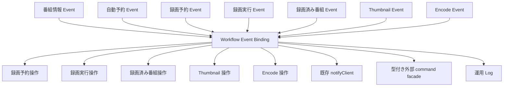

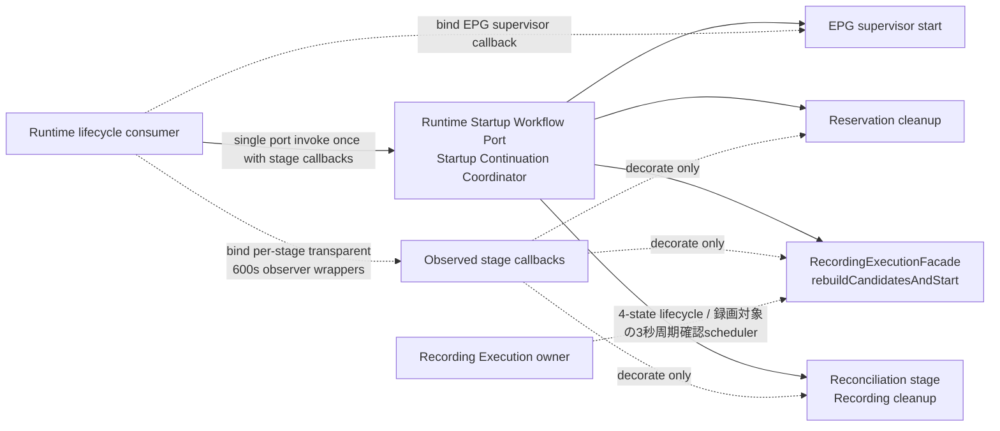

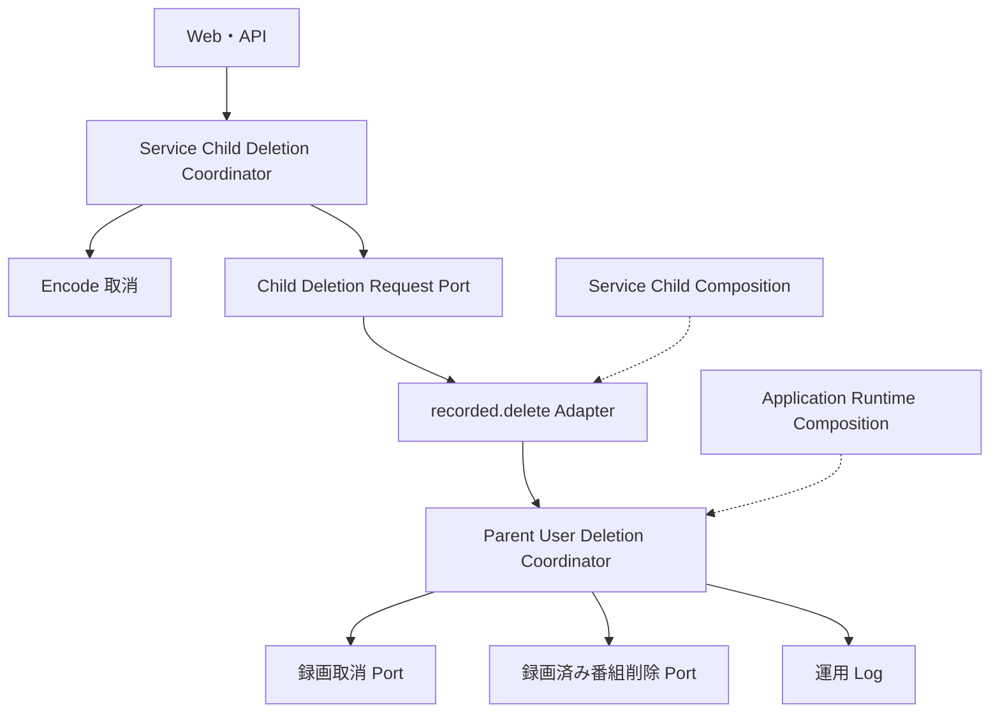

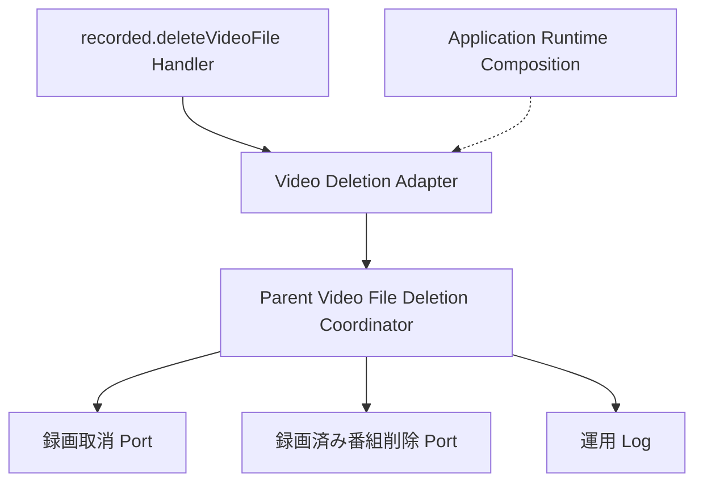

状態変化を受け取るevent portと、workflowが呼び出すaction portは別の依存である。同じ業務機能が両側に現れても、相互import
や循環依存を意味しない。削除coordinationは通常の状態変化flowと分け、service child側とparent側のadapter接続を別図で示す。

業務機能は workflow の具象 class、IPC、Socket.IO、Hook queue を参照しない。調整判断が
`EventSetter`、`RecordedApiModel.delete()`、`RecordedManageModel.delete()` に分散しているが、機能上の owner は本
specification である。利用者削除では `RecordedApiModel.delete()` の Encode 取消 → 既存 `recorded.delete` IPC を service
child 側 adapter の互換写像として維持し、既存 parent handler から parent inbound coordinator を呼ぶ。workflow core が所
有するのは child outbound deletion-request port、parent user deletion coordinator、および parent video file deletion
coordinator であり、IPC model、wire、client、server を import しない。既存 adapter は service child 側 composition owner
と application-runtime の parent 側 composition owner が配線する。parent 側では `RecordedManageModel.delete()` に同居す
る事前読取、録画停止barrier、停止後のrelation再読取、resource削除をprepared deletion port、録画停止port、deletion coreへ
分ける。停止前のresource選択を削除効果へ使わない。既存 `recorded.deleteVideoFile` handler は `videoFileId` を parent
video file coordinator へ渡す。public API、既存 IPC operation、event payload、外部観測条件、および順序を変えない。

### この設計を見直す必要がある変更

-   event 名、payload、listener 登録順、wrapper の `await callback()`、または `EventSetter.set()` の起動回数が変わる。
-   `RecordingManageModel` と workflow listener の登録順が変わる。
-   後続 port の呼出条件、呼出順、await / detached / catch が変わる。
-   Rule、予約、録画、録画済み番組、Tag、Thumbnail、Encode の interface signature または return type が変わる。
-   `notifyClient`、`setEncode`、recorded delete、bulk cleanup の process 間 operation が変わる。
-   Hook 種別、設定 field、queue、timeout、retry、または delivery failure の意味が変わる。
-   user deletion、容量不足削除、個別 video file 削除の経路が統合または分割される。
-   process restart、shutdown drain、listener 再登録、途中処理復元の方針が変わる。
-   `server-application-runtime`が所有する対応Node.js matrix上で`EventEmitter`、Promise rejection、child IPCの実行時特性
    が変わる。

## 構成と論理コンポーネント

### コンポーネント一覧

| Component                              | Intent                                                                        | Requirements                          | Dependencies                                    | Contract |
| -------------------------------------- | ----------------------------------------------------------------------------- | ------------------------------------- | ----------------------------------------------- | -------- |
| Workflow Event Binding                 | process-local event を対応する workflow operation へ接続する                  | 1.1-4.8, 6.1-6.7                      | event ports、各 coordinator                     | Adapter  |
| Program / Rule Coordinator             | 番組更新と Rule 変更後の予約再計算・関連解除を調整する                        | 1.1-1.11                              | recorded、reservation、delivery、log            | Service  |
| Reservation / Recording Coordinator    | 予約差分、録画準備、開始、失敗、再試行上限を調整する                          | 2.1-2.13                              | recording、reservation、tag、delivery           | Service  |
| Recording Completion Coordinator       | 録画完了後の予約整理、Thumbnail、Encode、Tag、通知を固定順に開始する          | 3.1-3.10                              | reservation、thumbnail、encoding、tag、delivery | Service  |
| Startup Reconciliation Operation       | 起動時録画整理段。Recordingの`cleanup()`をRuntimeが整理段callbackに束ね、項目failureの隔離はRecordingが行い、段全体のrejectはCoordinatorが`Failed(recording-reconciliation)`へ変換する | 7.8-7.9                               | recording、log                                  | Service  |
| Startup Continuation Coordinator       | `RuntimeStartupWorkflowPort`の実装。整理段を含む4段のcallbackを順に実行し、最初のfailureをtyped outcomeで返す | 7.8-7.10                              | Runtimeが渡す4段のcallback（`RuntimeStartupWorkflowInput`） | Service  |
| Event Relay Coordinator                | 候補を受取順に予約追加へ渡す                                                  | 4.1-4.3, 7.1-7.7                      | reservation、log                                | Service  |
| Recorded Change Coordinator            | upload、削除、file、保護、Tag、Thumbnail、Encode 完了後の action を選ぶ       | 4.4-4.8, 6.1-6.7                      | reservation、thumbnail、delivery                | Service  |
| Tag Relation Sequencer                 | 保存済み Tag 文字列を解釈し、関係を一件ずつ依頼する                           | 2.7-2.9, 3.5-3.8                      | recorded-tag、log                               | Service  |
| Service Child Deletion Coordinator     | Encode 取消完了後だけ抽象 deletion-request port へ依頼する                    | 5.1-5.2, 5.7                          | encode、child deletion request port             | Service  |
| Child Deletion Request Port            | service child から parent inbound coordinator への要求を抽象化する            | 5.2, 5.7, 5.10                        | 既存 adapter は composition owner が配線        | Port     |
| Parent Inbound Deletion Coordinator    | request受信後に事前確認、必要な録画停止barrier、停止後再読取と削除を調整する  | 5.2-5.12                              | prepared recorded deletion、recording           | Service  |
| Parent Video File Deletion Coordinator | 既存個別 file 要求を処理し、必要時だけ fresh な番組全体削除へ昇格する         | 5.3-5.6, 5.8-5.10                     | prepared video / recorded deletion、recording   | Service  |
| Delivery Provider Facades              | 通常の再取得通知と型付き外部commandを既存providerへ渡す                       | 1.10, 2.4-2.12, 3.8, 4.6-4.7, 6.1-6.7 | event-and-hook-delivery                         | External |

これらは機能上の論理責任である。主に `EventSetter`、service child の `RecordedApiModel.delete()`、parent の
recorded-delete / deleteVideoFile handler と `RecordedManageModel.delete()` / `deleteVideoFile()` に同居する。service
child、parent user deletion、parent video file deletion の coordinator は既存 IPC 境界と既存 process 配置を保ち、新しい
public service、event envelope、workflow database、queue、結果 object、または wire を追加しない。

### 論理 interface

```ts
type RuleChangeKind = 'Added' | 'Updated' | 'Enabled' | 'Disabled' | 'Deleted';

interface ProgramRuleWorkflow {
    onProgramGuideUpdated(): Promise<void>;
    onRuleChanged(kind: RuleChangeKind, ruleId: number): void;
}

interface ReservationRecordingWorkflow {
    onReservationChanged(diff: ReservationDiff): void;
    onPreparationStarted(reservation: Reservation): void;
    onPreparationCancelled(reservation: Reservation): void;
    onPreparationFailed(reservation: Reservation): void;
    onRecordingStarted(reservation: Reservation, recorded: RecordedProgram): Promise<void>;
    onRecordingFailed(reservation: Reservation, recorded: RecordedProgram | null): void;
    onRecordingRetryExhausted(reservation: Reservation): void;
}

interface RecordingCompletionWorkflow {
    onRecordingFinished(
        reservation: Reservation,
        recorded: RecordedProgram,
        needsReservationRemoval: boolean,
    ): Promise<void>;
    onRelayCandidates(candidates: ReadonlyArray<RelayCandidate>): Promise<void>;
}

type RuntimeStartupWorkflowStage =
    | 'recording-reconciliation'
    | 'recording-candidates-and-start'
    | 'expired-reservation-cleanup'
    | 'epg-supervisor-start';

type RuntimeStartupWorkflowOutcome =
    | { readonly kind: 'Succeeded'; readonly stage: 'epg-supervisor-start' }
    | { readonly kind: 'Failed'; readonly stage: RuntimeStartupWorkflowStage; readonly cause: unknown };

interface RuntimeStartupWorkflowInput {
    readonly runRecordingReconciliation: () => Promise<void>;
    readonly runRecordingCandidatesAndStart: () => Promise<void>;
    readonly runExpiredReservationCleanup: () => Promise<void>;
    readonly startEpgSupervisor: () => Promise<void>;
}

interface RuntimeStartupWorkflowPort {
    runAfterServiceSupervisionAccepted(input: RuntimeStartupWorkflowInput): Promise<RuntimeStartupWorkflowOutcome>;
}

interface ServiceChildUserDeletionCoordinator {
    deleteByUser(recordedId: number): Promise<void>;
}

interface ChildUserDeletionRequestPort {
    requestUserDeletion(recordedId: number): Promise<void>;
}

interface ParentUserDeletionCoordinator {
    deleteFromRequest(recordedId: number): Promise<void>;
}

interface ParentVideoFileDeletionCoordinator {
    deleteVideoFileFromRequest(videoFileId: number): Promise<void>;
}

// IPreparedRecordedDeletionProvider（prepareUserDeletion・deletePrepared）と
// IPreparedVideoFileDeletionProvider（prepareVideoFileDeletion・deletePreparedVideoFile）、および
// PreparedRecordedDeletionToken と PreparedVideoFileDeletionToken は
// server-recorded-content 所有の契約・opaque typeを参照し、ここでは構造を再定義しない。
type UserDeletionPreparation =
    | { readonly status: 'not-found' }
    | { readonly status: 'protected' }
    | {
          readonly status: 'prepared';
          readonly token: PreparedRecordedDeletionToken;
          readonly isRecording: boolean;
          readonly reserveId: number | null;
      };

type VideoFileDeletionPreparation =
    | { readonly status: 'not-found' }
    | { readonly status: 'protected' }
    | { readonly status: 'prepared'; readonly token: PreparedVideoFileDeletionToken }
    | { readonly status: 'whole-recorded-deletion-required'; readonly recordedId: number };

type VideoFileDeletionResult =
    | { readonly status: 'video-file-deleted' }
    | { readonly status: 'not-found' }
    | { readonly status: 'protected' }
    | { readonly status: 'whole-recorded-deletion-required'; readonly recordedId: number };

interface RecordingDeletionPort {
    hasReservation(reserveId: number): boolean;
    requestCancellationForDeletion(reserveId: number): Promise<void>;
}
```

上記は責任分割と test seam を示す論理 contract であり、新しい wire または公開 TypeScript API を要求しない。
`UserDeletionPreparation`、`VideoFileDeletionPreparation`、`VideoFileDeletionResult`、および二種類のprepared tokenは
`server-recorded-content`が所有する型をそのまま参照する。tokenはworkflowから内容を読めないopaque objectであり、relation
ID、path、DB entity、resource選択、またはlock handleをworkflowへ公開しない。`ChildUserDeletionRequestPort` は transport
非依存であり、workflow は IPC model / function / args / reply / timeout を型へ持ち込まない。service child coordinator は
Encoding とこの outbound port だけを持ち、parent user deletion coordinator は Recording と
`IPreparedRecordedDeletionProvider` だけを持つ。parent video file deletion coordinator は Recording、
`IPreparedVideoFileDeletionProvider`、`IPreparedRecordedDeletionProvider` を持つが Encoding を持たない。既存
`recorded.delete(recordedId)` への写像は service child composition、既存 parent handler から `deleteFromRequest()` への
写像は application-runtime parent composition が adapter として配線する。既存 `recorded.deleteVideoFile(videoFileId)`
handler も同じ parent composition owner が `deleteVideoFileFromRequest(videoFileId)` へ写像する。両 operation の既存
model、function、args、`void` / error reply、通常 5 秒を変更しない。

通知とHookについてworkflow独自のgeneric delivery interfaceは定義しない。画面再取得は既存
`IIPCServer.notifyClient(): void`、外部commandは既存`IExternalCommandManageModel`の型付きoperation
`addUpdateReseves(diff)`、`addRecordingPrepStartCmd(reserve)`、`addRecordingPrepRecFailedCmd(reserve)`、
`addRecordingStartCmd(recorded)`、`addRecordingFinishCmd(recorded)`、`addRecordingFailedCmd(recorded)`、
`addEncodingFinishCmd(info)`へadapter経由で渡す。commandの設定、環境、FIFO、timeout、signal、retry、順序internalsは
`server-event-and-hook-delivery`のprovider責務であり、本機能のclass、state、interfaceへ複製しない。

各coordinatorはprivateな`attemptUiHandoff(operation)`と`attemptTypedHookHandoff(operation)`相当のguardをhandoffごとに一
回適用する。実装はinline `try/catch`でもよく、共通delivery portまたはqueueを新設しない。guardは同期throwを記録して吸収す
る。operationがPromise-likeな結果を返してrejectを観測できる場合は直ちに局所handlerを接続して一回記録するがawaitしない。
その後、呼出順上の次の独立destinationを試みる。ack、retry、再送、rollbackはguardの責任に含めない。

`RuntimeStartupWorkflowPort`はWorkflowがRuntimeへ提供するinbound portである。Runtimeはservice child監督受付後にこのport
を一回invokeし、4段の実処理を`RuntimeStartupWorkflowInput`として渡す。実処理は、整理段が
`IRecordingManageModel.cleanup()`、combined recording stageが`rebuildCandidatesAndStart()`、期限切れ予約整理が
`IReservationManageModel.cleanup()`、EPG supervisor開始が既存のEPG更新executorの開始である。実装は
`StartupContinuationCoordinator`である。Coordinatorはconstructor引数を持たず、`runAfterServiceSupervisionAccepted(input)`の呼び出し時に渡された`input`の4段だけを使う。Coordinatorは次を論理順に行う。

1. 整理段`runRecordingReconciliation()`をawaitする。
2. 整理成功後だけ`runRecordingCandidatesAndStart()`（`RecordingExecutionFacade.rebuildCandidatesAndStart()`）をawaitする。
3. combined stage成功後だけ`runExpiredReservationCleanup()`をawaitする。
4. 期限切れ予約整理成功後だけ`startEpgSupervisor()`をawaitする。

Recording providerの正本contractでは、`rebuildCandidatesAndStart()`が保存済み予約一覧read、候補再構築、および録画対象を
確認する3秒周期schedulerの開始settlementを一つの`startPromise`で包む。providerは`NotStarted` / `Starting` / `Started` /
`Failed`の4状態を所有し、候補再構築成功後だけschedulerを開始する。Workflowはこの内部algorithm、start state、wake handle
を分割または再実装しない。`runRecordingCandidatesAndStart`はこの正本facadeから一operationだけをRuntimeが束ねたcallbackで
あり、`Promise<void>` signatureまたはsettlementを変更しない。

最終段（EPG supervisor開始）のresolveを`Succeeded`、各stage callbackの同期throwまたはrejectを対応stageの`Failed`へWorkflowが変換する。
最初の`Failed`をRuntimeへ返し、後続provider callを0件にする。Workflow内のretryは0回で、項目別共通結果一覧、永続result、
scheduler handle、generation stateは追加しない。

Runtimeはservice監督受付後に単一`RuntimeStartupWorkflowPort`を一回invokeし、startup compositionのgeneration / one-entry
guard、reconciliation・combined recording stage・期限切れ予約整理それぞれの600秒soft observer wrapperとstage
callback binding、およびEPG child supervisor callbackのbindingを所有する。Recording ownerはcombined stageの4状態lifecycleと録画対
象の3秒周期確認scheduler mechanicsを所有する。Workflowはtyped first-failureと4段の呼出順を所有
し、Runtimeは各stage callbackを自身では呼ばず、選択、順序付けしない。Runtime compositionがbindingする各observer adapterはraw
stage Promiseのsettlementに透過である。600秒到達はoverdueを記録するだけで`Failed`へ変換せず、元Promiseのlate
settlementをWorkflowへ一回渡す。observer自身は次stageを開始しない。

recorded-content の `prepareUserDeletion()` は relation 付き read をprovider内で行い、`not-found`、`protected`、または
`prepared`をtyped resultで返す。`prepared`だけがopaque token、録画状態、reserve IDを持つ。parent は後二値だけで必要な録
画停止barrierを判断し、`not-found`と`protected`では録画操作とfinal deletionを開始しない。barrier成功後、
`deletePrepared(token)` はrecorded ID単位のresource mutation lockを取得してRecordedDBから対象の存在、保護、relation、
resourceを読み直し、その時点のexact relation IDだけをprovider内部の最終削除計画へ固定する。prepare時のresource選択は
workflowへ渡さず、停止前snapshotを削除効果へ使わない。選択済みvideo IDの削除先rootは、効果時に親directory名から`VideoUtil.getParentDirPath`で解決し（一時録画先を含む）、
相対pathとともに管理削除（`server-recorded-content`の設計7.4）へ渡す。row削除も最終計画のexact ID単位で行う。planへworkflow IDまたは永続checkpointを追加せず、process-local lockの所有と
解放はrecorded-contentが担う。

recorded-content の `prepareVideoFileDeletion(videoFileId)` は`not-found`、`protected`、opaque token付き`prepared`、また
は `whole-recorded-deletion-required`を返す。`prepared`のtokenを `deletePreparedVideoFile(token)` へ渡した後も、file row
削除前の最終再読取で録画中または最後のfileになっていれば、個別効果を開始せず同じwhole-deletion decisionを返し得
る。parent video file deletion coordinatorはどちらのwhole decisionでも`prepareUserDeletion(recordedId)`をfreshに呼
び、typed `prepared`の場合だけ必要な削除専用terminal barrierを成功させ、そのopaque whole token
を`deletePrepared(token)`へ渡す。deletion coreはlock内で最終readを行う。この個別IPC経路にはservice childのEncode取消
barrierを追加しない。

### Component 関係

```mermaid
classDiagram
    class WorkflowEventBinding {
        +set() void
    }
    class EventDeliveryProviderRegistration {
        <<external event-owned port>>
        +registerProviders() void
    }
    class ProgramRuleWorkflow {
        <<interface>>
        +onProgramGuideUpdated() Promise~void~
        +onRuleChanged(kind, ruleId) void
    }
    class ReservationRecordingWorkflow {
        <<interface>>
        +onReservationChanged(diff) void
        +onRecordingStarted(reserve, recorded) Promise~void~
        +onRecordingFailed(reserve, recorded) void
    }
    class RecordingCompletionWorkflow {
        <<interface>>
        +onRecordingFinished(reserve, recorded, remove) Promise~void~
        +onRelayCandidates(candidates) Promise~void~
    }
    class RuntimeStartupWorkflowPort {
        <<interface>>
        +runAfterServiceSupervisionAccepted(input) Promise~RuntimeStartupWorkflowOutcome~
    }
    class RuntimeStartupWorkflowInput {
        <<interface>>
        +runRecordingReconciliation() Promise~void~
        +runRecordingCandidatesAndStart() Promise~void~
        +runExpiredReservationCleanup() Promise~void~
        +startEpgSupervisor() Promise~void~
    }
    class StartupContinuationCoordinator
    class ServiceChildUserDeletionCoordinator {
        <<interface>>
        +deleteByUser(recordedId) Promise~void~
    }
    class ChildUserDeletionRequestPort {
        <<interface>>
        +requestUserDeletion(recordedId) Promise~void~
    }
    class ParentUserDeletionCoordinator {
        <<interface>>
        +deleteFromRequest(recordedId) Promise~void~
    }
    class ParentVideoFileDeletionCoordinator {
        <<interface>>
        +deleteVideoFileFromRequest(videoFileId) Promise~void~
    }
    class IPreparedRecordedDeletionProvider {
        <<interface>>
        +prepareUserDeletion(recordedId) Promise~UserDeletionPreparation~
        +deletePrepared(token) Promise~void~
    }
    class IPreparedVideoFileDeletionProvider {
        <<interface>>
        +prepareVideoFileDeletion(videoFileId) Promise~VideoFileDeletionPreparation~
        +deletePreparedVideoFile(token) Promise~VideoFileDeletionResult~
    }
    class RecordingDeletionPort {
        <<interface>>
        +hasReservation(reserveId) boolean
        +requestCancellationForDeletion(reserveId) Promise~void~
    }
    class UserDeletionPreparation {
        <<external typed outcome>>
        +status
        +isRecording
        +reserveId
        +opaqueToken
    }
    class PreparedRecordedDeletionToken {
        <<external opaque token>>
    }
    class PreparedVideoFileDeletionToken {
        <<external opaque token>>
    }
    class TagRelationSequencer {
        +relate(recordedId, serializedTags) Promise~void~
    }
    class ExistingUiNotificationFacade {
        <<external>>
        +notifyClient() void
    }
    class ExistingExternalCommandFacade {
        <<external>>
        +addUpdateReseves(diff) void
        +addRecordingPrepStartCmd(reserve) void
        +addRecordingPrepRecFailedCmd(reserve) void
        +addRecordingStartCmd(recorded) void
        +addRecordingFinishCmd(recorded) void
        +addRecordingFailedCmd(recorded) void
        +addEncodingFinishCmd(info) void
    }
    class ReservationPort
    class RecordingPort
    class RecordedPort
    class ThumbnailPort
    class EncodingPort

    WorkflowEventBinding --> ProgramRuleWorkflow
    WorkflowEventBinding --> ReservationRecordingWorkflow
    WorkflowEventBinding --> RecordingCompletionWorkflow
    WorkflowEventBinding --> EventDeliveryProviderRegistration
    StartupContinuationCoordinator ..|> RuntimeStartupWorkflowPort
    StartupContinuationCoordinator --> RuntimeStartupWorkflowInput
    ProgramRuleWorkflow --> ReservationPort
    ProgramRuleWorkflow --> RecordedPort
    ReservationRecordingWorkflow --> RecordingPort
    ReservationRecordingWorkflow --> ReservationPort
    ReservationRecordingWorkflow --> TagRelationSequencer
    RecordingCompletionWorkflow --> ReservationPort
    RecordingCompletionWorkflow --> ThumbnailPort
    RecordingCompletionWorkflow --> EncodingPort
    RecordingCompletionWorkflow --> TagRelationSequencer
    ServiceChildUserDeletionCoordinator --> EncodingPort
    ServiceChildUserDeletionCoordinator --> ChildUserDeletionRequestPort
    ChildUserDeletionRequestPort ..> ParentUserDeletionCoordinator : existing adapter mapping
    ParentUserDeletionCoordinator --> IPreparedRecordedDeletionProvider
    ParentUserDeletionCoordinator --> RecordingDeletionPort
    ParentVideoFileDeletionCoordinator --> IPreparedVideoFileDeletionProvider
    ParentVideoFileDeletionCoordinator --> IPreparedRecordedDeletionProvider
    ParentVideoFileDeletionCoordinator --> RecordingDeletionPort
    IPreparedRecordedDeletionProvider --> UserDeletionPreparation
    UserDeletionPreparation --> PreparedRecordedDeletionToken
    IPreparedVideoFileDeletionProvider --> PreparedVideoFileDeletionToken
    ProgramRuleWorkflow --> ExistingUiNotificationFacade
    ReservationRecordingWorkflow --> ExistingUiNotificationFacade
    ReservationRecordingWorkflow --> ExistingExternalCommandFacade
    RecordingCompletionWorkflow --> ExistingUiNotificationFacade
    RecordingCompletionWorkflow --> ExistingExternalCommandFacade
```

### 所有 data と一時状態

| Data / state                                         | Owner                                        | 本機能での扱い                                                                         |
| ---------------------------------------------------- | -------------------------------------------- | -------------------------------------------------------------------------------------- |
| 番組、Rule、予約、録画済み番組、file、Tag、Thumbnail | 各 domain                                    | event payload または port 引数として一時参照する                                       |
| 予約差分                                             | 予約管理                                     | 同期 `acceptMutation` と Hook へ渡し、録画側で enqueue / wake を合流する               |
| 最初の番組更新 flag                                  | Program / Rule Coordinator の process memory | `true` から始まり、`updateAll(true)` 成功後だけ `false` にする                         |
| 一件の callback 進行位置                             | 永続 owner なし                              | stack と Promise continuation にだけ存在する                                           |
| Tag ID 配列                                          | Tag Relation Sequencer の局所変数            | 一回 parse し、順に関係追加へ渡して破棄する                                            |
| startup stage outcome                                | Reconciliation / Continuation Coordinator    | provider settlementを一段階の`Succeeded` / `Failed`へ変換しRuntime返却まで一時参照する |
| service child deletion の進行位置                    | Service Child Deletion Coordinator           | Encode 取消と既存 IPC await の Promise continuation にだけ存在する                     |
| 利用者削除 typed preparation / opaque token          | recorded-content                             | parent coordinator は状態・録画情報だけを読み、tokenをdeletion coreへ渡す              |
| parent deletion の進行位置                           | Parent Inbound Deletion Coordinator          | typed状態、opaque token、録画取消要求、coreのPromise continuationだけに存在            |
| 個別 file typed preparation / opaque token           | recorded-content                             | parent video file coordinator が個別削除またはwhole昇格まで一時参照する                |
| 既存 adapter の request ID / listener / timer        | transport composition adapter                | 各`send()` invocationから通常5秒またはrestartまでprocess-local                         |
| workflow result / checkpoint                         | 存在しない                                   | 共通結果、共通成功状態、再起動復元に利用しない                                         |

## Event 受付と実行モデル

### Process-local event contract

| Event adapter         | 入力                                                | 本機能が選ぶ主な後続                                     |
| --------------------- | --------------------------------------------------- | -------------------------------------------------------- |
| `EPGUpdateEvent`      | 更新完了                                            | 履歴整理、予約全体更新                                   |
| `RuleEvent`           | add / update / enable / disable / delete と Rule ID | 画面通知、対象 Rule 再計算、削除時の関連解除             |
| `ReserveEvent`        | insert? / update? / delete? / suppress-log diff     | 画面通知、録画待ち更新、予約 Hook                        |
| `RecordingEvent`      | prep、start、failure、retry-over、finish、relay     | 予約取消、Tag、Thumbnail、Encode、通知、Hook、relay 予約 |
| `RecordedEvent`       | 録画済み番組、video、upload、保護の変更             | 画面通知、upload Thumbnail、録画中削除後の予約取消       |
| `RecordedTagEvent`    | Tag と relation の変更                              | 画面通知                                                 |
| `ThumbnailEvent`      | add / delete                                        | 画面通知                                                 |
| `OperatorEncodeEvent` | Encode 完了結果                                     | Encode 完了 Hook                                         |

event payload の schema と発行条件は producer domain が所有する。本機能は共通
envelope、timestamp、sequence、clone、freeze、delivery ID を追加しない。

### Event wrapper の意味

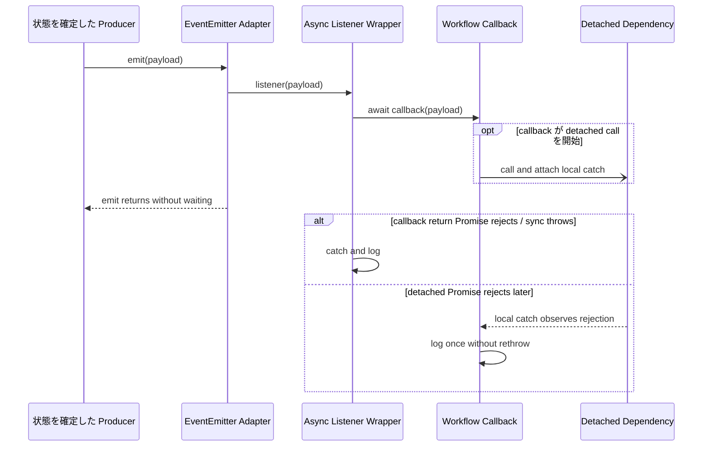

1. `emit()` は同じ JavaScript call stack で listener wrapper を登録順に呼ぶ。
2. wrapper は `try { await callback(...) } catch { log }` を実行するが、`emit()` は wrapper が返す Promise を待たない。
3. callback の同期部分は登録順に開始する。最初の `await` 後の完了順は保証しない。
4. callback 内で捕捉しなかった同期 throw は、同じ callback の後続 action へ到達せず wrapper が記録する。これは依存する
   domain operation の性質であり、UI / Hook handoff 境界には適用しない。
5. callback が返した Promise の reject は wrapper が記録する。
6. callback が return または await しない業務上の Promise には開始時に局所 `.catch(log)` を接続し、後発 reject を一回記
   録して wrapper 外の未処理 rejection へ漏らさない。
7. listener の成否は producer が確定した業務状態を巻き戻さない。
8. 同じ event の再発行は新しい callback を開始する。共通 deduplication を行わない。
9. 各 UI / Hook handoff は一呼出しずつ独立した guard で囲む。同期 throw を一回記録し、Promise-like な結果の
   rejectを観測できる場合は局所handlerで一回記録するがawaitしない。いずれも再throwせず、後続の独立destinationを試みる。
   retry、ack待ち、rollbackは追加しない。

### Recording listener の登録順

`RecordingManageModel` は構築時に内部 listener を登録し、その後 runtime が workflow binding を登録する。実装の登録順は次
である。

| Recording event       | listener 1: Recording 管理                              | listener 2: Workflow                             | 完了境界                                                     |
| --------------------- | ------------------------------------------------------- | ------------------------------------------------ | ------------------------------------------------------------ |
| preparation cancelled | recording index を同期削除                              | 画面通知、Hook                                   | index 削除後に workflow の同期部分を開始                     |
| preparation failed    | recording index を同期削除                              | 画面通知、予約取消、Hook                         | index 削除後に workflow を開始                               |
| recording failed      | index を同期削除し、件数照会後に再試行または retry-over | 画面通知、条件付き Hook                          | 件数照会後の処理と workflow の完了順は保証しない             |
| recording finished    | recording index を同期削除                              | 予約整理、Thumbnail、Encode、Tag、Hook、画面通知 | index 削除後に workflow を開始し、互いの非同期完了を待たない |

### 一回の連携実行状態

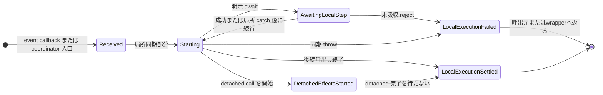

この状態は永続化しない。`LocalExecutionSettled` は downstream の業務完了を意味せず、要求済みの action が残っていてよい。
利用者削除では service child coordinator と parent inbound coordinator がそれぞれ別の state instance を持つ。両者を結ぶ
既存 transport adapter は進行状態やprepared tokenを運ばず、互換 wire 上の `recordedId` と reply だけを運ぶ。

## 番組情報と Rule の workflow

### 番組情報更新

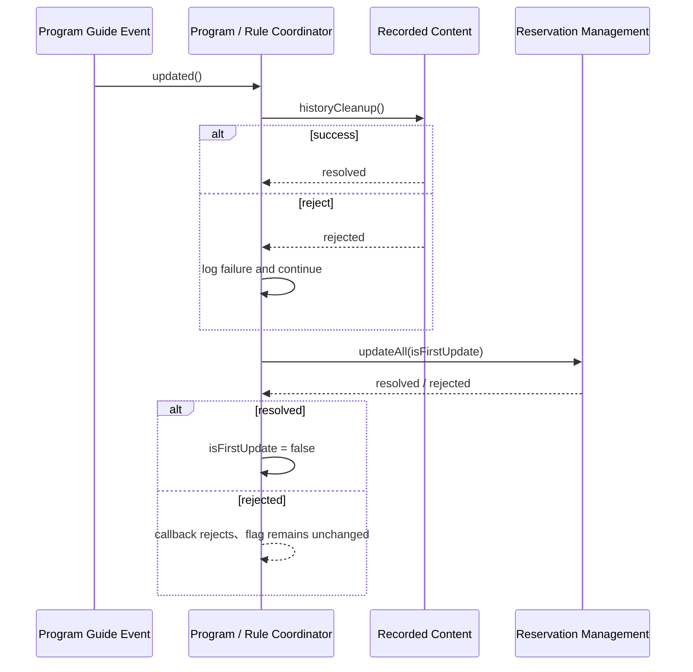

履歴整理は最初に await するが、失敗結果を問わず予約全体更新へ進む。予約全体更新は await し、番組指定手動予約、Rule によ
る番組リレー予約、および Rule 予約の更新を予約管理へ委ねる。初回 flag は予約全体更新の成功後だけ false になる。更新が失
敗した場合、次の番組更新も初回として渡し得る。

### Rule 変更

| Trigger                         | 開始順                                                         | Await / catch                                | 独立 failure の境界                                                              |
| ------------------------------- | -------------------------------------------------------------- | -------------------------------------------- | -------------------------------------------------------------------------------- |
| add / update / enable / disable | 画面再取得通知 → `updateRule(ruleId)`                          | update は detached、`.catch(log)`            | UI と update を各 guard。片方の同期 throw / 観測可能 reject でも他方を試行       |
| delete                          | 画面再取得通知 → `removeRuleId(ruleId)` → `updateRule(ruleId)` | 二つの Promise は detached、各 `.catch(log)` | UI、関連解除、再計算を各 guard。先行 failure を記録して残る独立 operation を試行 |

Rule 削除時の関連解除と予約再計算は、一つの transaction として扱わない。どちらかだけ成功してよく、先に始めた処理を取り消
さない。画面通知は最初に送るため、関連解除または予約再計算の完了後に二度目の通知を保証しない。候補採否、競合、重複は各
domain に残す。各 guard は同期 throw を記録し、返却結果の reject を観測できる場合は局所 handler へ接続する。失敗した
destination の retry、ack 待ち、または rollback は行わない。

## 予約変更と録画 lifecycle の workflow

### 予約差分

予約差分 callback の開始順は固定する。

1. 画面再取得通知を宛先別 guard から依頼する。
2. 録画実行の `acceptMutation(diff)` を独立 guard から同期呼出しし、差分 enqueue と wake 合流を依頼する。
3. 予約追加・更新・削除の Hook 選択を別の宛先 guard から配送機能へ渡す。

`acceptMutation()` は `server-recording-execution` が定める同期受付であり、差分の評価完了を待たない。insert、
update、delete の適用、世代更新、候補再評価、および burst 時の wake coalescing は録画実行側が所有し、後続評価の失敗も同
controller 内で記録する。したがって workflow callback に detached recording-update Promise はなく、受付 return 後に Hook
選択へ進む。Workflow callback は `recordingManage.update(diff)` を呼ばず、Recording ownerの後続評価 failure を観測しな
い。UI、`acceptMutation`、Hook は互いを成功条件にしない。 `notifyClient()`または`acceptMutation()`の同期throwを記録して
も後続の独立handoffを試み、UI / Hookの観測可能rejectも局所記録する。すでに受付済みの依頼を取り消さず、retryまたはack待ち
を追加しない。

### 録画準備、失敗、再試行上限

| Trigger                   | 開始順                                                       | Await / catch                     | Failure isolation                                              |
| ------------------------- | ------------------------------------------------------------ | --------------------------------- | -------------------------------------------------------------- |
| preparation started       | 画面通知 → preparation-start Hook                            | どちらも完了を待たない            | UI / Hookを各guardし、UI failure後もHookを試行                 |
| preparation cancelled     | 画面通知 → preparation-cancel/fail Hook                      | どちらも完了を待たない            | UI / Hookを各guardし、UI failure後もHookを試行                 |
| preparation failed        | 画面通知 → reservation cancel → preparation-cancel/fail Hook | cancel は detached、`.catch(log)` | 三operationを各guardし、先行failure後も残る独立operationを試行 |
| recording retry exhausted | reservation cancel                                           | detached、`.catch(log)`           | 同期throw / rejectを局所記録。先行作用を取消さない             |
| recording failed          | 画面通知 → recorded がある場合だけ failure Hook              | 完了を待たない                    | UI / 条件付きHookを各guardし、UI failure後も選択済みHookを試行 |

準備失敗は録画実行側の有限準備再試行が上限（時刻指定は回数、番組指定は予約終了時刻）へ達した後の event である。録画失敗後の再試行上限は録画管理 listener が発行
し、本機能は予約取消を依頼する。再試行回数、録画状態、および取消方法は本機能で決めない。各行の選択済み UI / Hook と、明
示的な成功依存を持たない reservation cancel は先行 destination の同期 throw または観測可能 reject にかかわらず一回ずつ試
行する。失敗は一回記録し、retry、ack 待ち、rollback を行わない。

#### 録画失敗時の finish と failure の時系列

録画 stream failure では、録画実行が `isNeedDeleteReservation = false` を設定して `recEnd()` を await する。録画済み番組
が存在すれば `recEnd()` は `finish(reserve, recorded, false)` を先に emit し、終了後に録画実行が録画済み番組を再取得して
`failure(reserve, recorded | null)` を emit する。二つを一つの event へ畳み込まない。次図は Tag が設定され、relation が
deferred になった場合を示す。

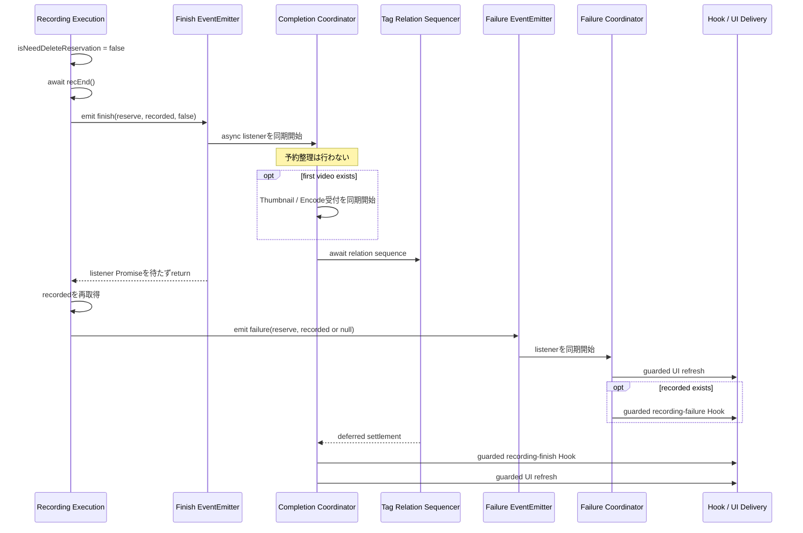

`EventEmitter.emit()` は async listener の完了を待たない。したがって finish listener の同期 prefix は failure emit より
先に開始するが、Tag relation が pending なら failure 側の UI と条件付き Hook が finish 側の Tag、finish Hook、最後の UI
を追い越し得る。Tag が先に完了する場合まで追越しを保証せず、両 event の外部配送完了順も保証しない。finish の false 指定
により予約整理は開始しないが、first video があれば Thumbnail と Encode は failure 通知より先に受付を開始し得る。

### 録画開始と Tag

録画開始時に予約の Tag 文字列が `null` でなければ、Tag Relation Sequencer を await する。Sequencer は文字列全体を一度
JSON parse する。parse に失敗した場合は入力と error を記録して終了し、個別 Tag を復元しない。parse できた配列は入力順に
一件ずつ `setRelation(tagId, recordedId)` へ渡し、各 reject を記録して次へ進む。Requirement 2.8 は、parse 成功後に識別で
きた一件の relation failure に限定する。配列全体を解釈できない aggregate parse failure は「一件を識別した後の失敗」では
なく、2.8 の残 Tag 続行保証へ含めない。

Tag 処理終了後、画面再取得通知、録画開始 Hook の順に依頼する。aggregate parse failure は sequencer 内で log 後に resolve
し、relation reject も個別に吸収する。これら以外に sequencer から未吸収 reject が返った場合は外側で fatal log へ記録して
吸収するため、画面通知と Hook へ進む。UI と Hook は別々に guard し、UI の同期 throw または観測可能 reject を一回記録した
後も Hook を試行する。Hook failure も記録して吸収し、retry、ack 待ち、rollback を行わない。

## 録画完了後 workflow

### 分岐と開始順

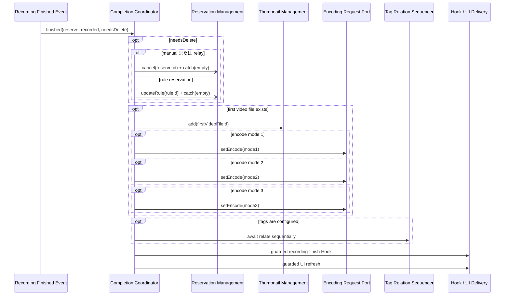

1. `needsDeleteReservation` が false なら予約整理を依頼しない。
2. true で `ruleId == null` または番組リレー予約なら予約取消を detached で開始する。
3. true の通常 Rule 予約なら重複状態再計算のため Rule 更新を detached で開始する。
4. 最初の video file が存在するときだけ Thumbnail を依頼する。
5. Encode 依頼は source video file ID を必須とする。最初の video file が存在する場合、その ID を共通 source とし、mode
   1、2、3 の順に、設定されている Encode を最大三件受け付ける。video file が存在しない場合は有効な依頼を構成できないた
   め、Encode を依頼しない。
6. 予約整理、Thumbnail、Encode の業務完了を待たず、Tag 処理へ進む。
7. Tag は録画開始時と同じ sequencer を await する。JSON parse 成功後に識別できた relation reject は記録して残りへ進む
   が、文字列全体の parse failure は記録して終了し、残 Tag を個別に続行しない。
8. 録画完了 Hook を宛先別 guard から enqueue し、その failure にかかわらず最後の画面再取得通知を別 guard から依頼する。

Requirement 3.4 は、録画ファイルが一件以上ある場合に最初の video file ID を共通 source として適用する。video file がない
場合は Thumbnail と Encode の依頼を行わず、Tag、Hook、画面通知へ進む。

Requirement 3.7 は、保存文字列を配列として解釈して個々の Tag を識別できた後の関連付け failure に適用する。一件の failure
を記録して残りへ進む。保存文字列全体を配列として解釈できない場合は個々の Tag を識別できないため、aggregate parse failure
を一回記録して Tag 処理を終了し、Hook と画面通知へ進む。

### 同期 failure の境界

予約取消とRule更新は各Promiseへ局所的な`.catch(log)`を接続してdetachedにするため、後発rejectを未処理rejectionへ漏らさ
ず、後続を止めない。失敗を理由にrollbackまたは自動retryを追加しない。Thumbnailの受付または`setEncode()`が同期throwした場
合、この明示的に依存するdomain call列のそれ以後へ到達しない。Tag後のHookとUIは互いに独立したdestinationとして各guardす
る。

| Failure 位置     | すでに開始済み      | 後続の扱い                                  |
| ---------------- | ------------------- | ------------------------------------------- |
| Thumbnail add    | 予約整理            | Encode 1-3、Tag、Hook、画面通知へ到達しない |
| Encode 1         | 予約整理、Thumbnail | Encode 2-3、Tag、Hook、画面通知へ到達しない |
| Encode 2         | 上記と Encode 1     | Encode 3、Tag、Hook、画面通知へ到達しない   |
| Encode 3         | 上記と Encode 1-2   | Tag、Hook、画面通知へ到達しない             |
| Hook handoff     | それ以前すべて      | failureを記録し、最後の画面通知を必ず試行   |
| 最後のUI handoff | それ以前すべて      | failureを記録してcallbackをsettle           |

event wrapper は同期 throw を記録するが、すでに確定した録画完了状態と開始済み action を取り消さない。三件の Encode を一
つの batch、transaction、または結果一覧として扱わない。UI / Hook guardは同期throwと観測可能rejectを各一回記録するだけ
で、retry、ack待ち、または他destinationのrollbackを追加しない。

## 番組リレー workflow

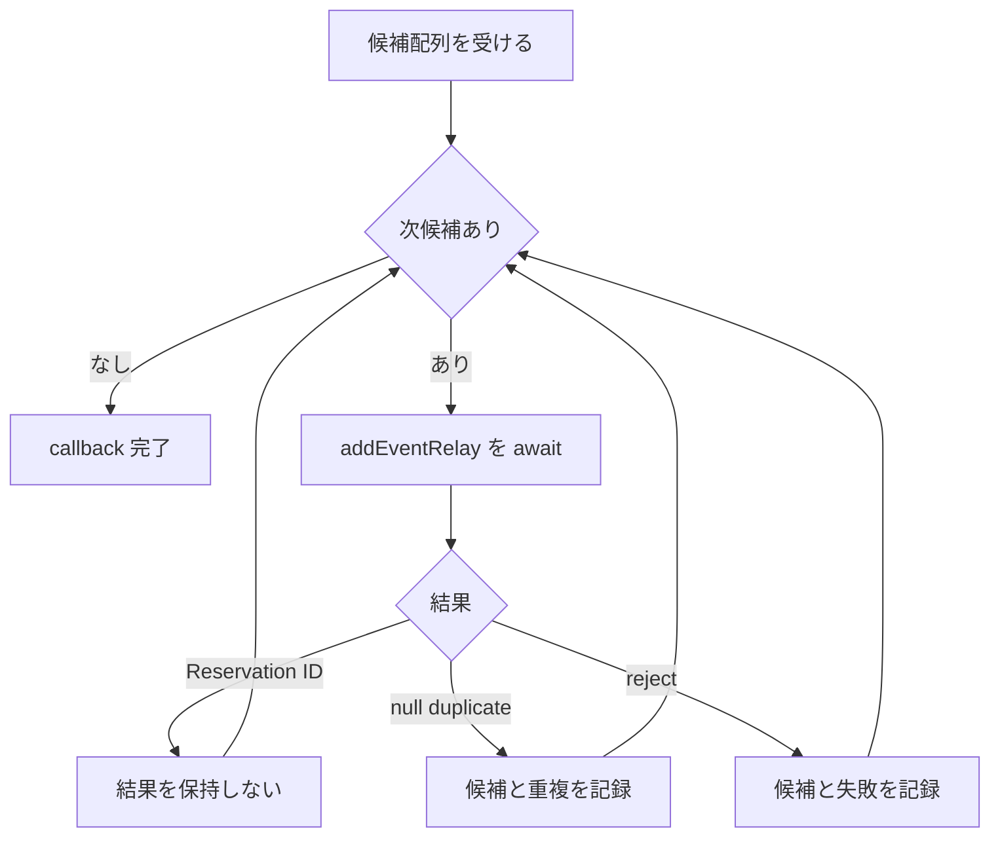

候補は配列順に一件ずつ処理し、一件の Promise settlement 後に次候補へ進む。予約管理は relay 元の `ruleId`、録画条件、保存
先、最大三件の Encode 設定、Tag 等を新しい予約へ複写する。

`addEventRelay()` は追加成功時に予約 ID、重複時に `null`、その他の失敗時に reject を返す。成功 ID と重複 `null` は結果一
覧へ保存しない。`null` は候補を特定できる情報と重複結果を、reject は候補と error を既存 logger へ一回記録し、どちらも残
候補の処理を続ける。retry、結果集約、公開応答変更は行わない。

## 録画済み番組変更と通知選択

| Trigger                                                      | 条件                           | 開始順（各独立handoffを個別guard）                           |
| ------------------------------------------------------------ | ------------------------------ | ------------------------------------------------------------ |
| Thumbnail added / deleted                                    | 常に                           | 画面通知                                                     |
| Recorded created                                             | 常に                           | 画面通知                                                     |
| video size updated / video added / video deleted             | 常に                           | 画面通知                                                     |
| uploaded video added                                         | 常に、Thumbnail 要否は payload | 画面通知 → 必要時 Thumbnail add                              |
| protect changed                                              | 常に                           | 画面通知                                                     |
| Tag created / updated / related / deleted / relation deleted | 常に                           | 画面通知                                                     |
| Recorded deleted                                             | 常に                           | 画面通知 → 録画中かつ reserve ID があれば reservation cancel |
| Encode finished                                              | 常に                           | Encode 完了 Hook                                             |

Recorded delete後のreservation cancelはdetachedとし、局所的な`.catch(log)`で失敗を一回記録する。削除eventは録画済み番組
管理が削除sequence後に発行するため、この取消は利用者削除前の録画取消要求ではなく、削除済み対象に対応する予約整理である。
取消失敗で削除済み状態をrollbackせず、自動retryしない。upload時のThumbnailとdelete後のreservation cancelは先行UIの成功に
依存しないため、UIの同期throwまたは観測可能rejectを記録した後も試行する。各UI / Hook handoffとこれらの独立domain callを
個別guardし、先行作用をrollbackせず、retryまたはack待ちを追加しない。

画面通知は種類付き payload を渡さない既存 `notifyClient()` 一種類であり、「通知種類の選択」は通知するか否かの選択として
実現する。画面側の 200 ms 集約、Socket.IO event、再取得、再接続は delivery / service-interface の責任である。

### 起動時整理後の通知境界

起動時整理の一項目で録画中状態解除、対応予約取得、file移動、またはfile size更新に失敗した場合、そのfailureをowner logger
へ記録するが、追加の画面通知またはHookへ変換しない。失敗した項目のためだけのUI refresh、起動時整理専用event、payload、合
流signalは存在しない。項目処理後の最終再読取が成功して録画済み情報を取得できた場合だけ、録画実行機能が既存の通常録画完了
eventを発行でき、本機能はその通常eventに対する既存のfinish Hook、画面再取得通知、予約、Thumbnail、Encode、Tagの選択を行
う。最終再読取が失敗または対象なしの場合に通知だけを補う経路は作らない。

録画中結果一覧を取得できた後、録画中状態解除、予約取得、file移動、file size更新のfailureは録画実行ownerが記録し、各失敗
箇所の分岐に従って次項目または同じ項目の残りのfile処理へ進む。これらのfailureでは通知provider callは零件である。最終再取
得がrejectした場合は整理段階全体を`Failed(recording-reconciliation)`として確定し、残りの項目へ進まずRuntimeへ返す。録画
中結果一覧を取得できない場合も同じoutcomeである。整理段（`Startup Reconciliation Operation`）はR7.8-7.9を所有し、固定間隔timerまた
は無制限retryを開始しない。

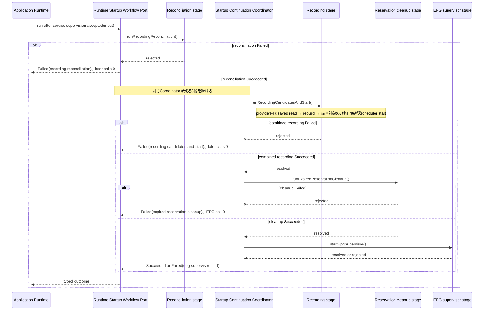

Continuationの各矢印は直前の`Succeeded`後だけ開始する。`runRecordingCandidatesAndStart()`（`rebuildCandidatesAndStart()`）がrejectした場合は期限切れ予約整理へ
進まない。Recording provider contractは、保存済み予約一覧取得または候補再構築failure時の3秒周期wakeを0件とし、再構築成功
後だけ同じ`startPromise`内でschedulerを開始する。期限切れ予約整理が失敗した場合はEPG supervisor開始をrequestしない。
各stageの同期throwまたはPromise rejectはWorkflowが対応stageの`Failed`へ変換し、最初のfailureをRuntimeへ返す。Workflowの
自動retryは全stageで0回で、成功済みstageをrollbackしない。

Runtimeはservice child監督受付後の単一`RuntimeStartupWorkflowPort`一回invocation、startup compositionのgeneration /
one-entry guard、三await stageそれぞれのsettlement透過な600秒soft observer wrapperとstage callback binding、およびEPG child
supervisor callbackを所有する。4段の呼出順とtyped first-failureはWorkflowが所有する。Recording
ownerはcombined stageの`NotStarted` / `Starting` / `Started` / `Failed` lifecycle、一つの`startPromise`、録画対象の3秒周
期scheduler mechanicsを所有する。
`test/server/application-runtime/startup-composition.integration.test.ts#case-7-10 and #failure-stop`と
`test/server/application-runtime/startup-composition.spec.test.ts#AR-6.8`は、
これらmechanicsとbindingを検証する。`test/server/recording-execution/startup.spec.test.ts#RE-7.6 and #RE-7.11`は
combined provider内部の4状態、Promise join、成功時だけの周期wakeを検証する。Workflow unit testはfake stage callbackのresolve /
rejectとcoordinatorのtyped outcomeをcall ledgerで照合し、論理順序、first-failure stop、retry 0を検証する。Runtimeの
timer、generation、child process algorithmまたはRecordingのscheduler algorithmを複製しない。

## 利用者による録画済み番組削除

### provider契約

削除安全性は、次のprovider間で同期して実装する契約である。本機能は
typed outcomeを順に調整するだけで、stream、writer、DB、filesystem、resource lock、容量候補、またはparent compositionを所
有しない。

| Provider / consumer            | Obligation                                                                                                                         | Evidence                                                                          |
| ------------------------------ | ------------------------------------------------------------------------------------------------------------------------------------------ | --------------------------------------------------------------------------------- |
| `server-recording-execution`   | 利用者削除にはterminal barrier resultを返す。capacity-pressureにはactive use gateを提供し、利用中の録画を取消・停止しない                  | `test/server/recording-execution/deletion-barrier.spec.test.ts`、`recorded-use.spec.test.ts` |
| `server-recorded-content`      | user prepared deletionと、capacity用prepared token、resource lock、lock内最終再読取、exact-ID削除を所有する                                | `test/server/recorded-content/delete.spec.test.ts`、`delete.integration.test.ts` |
| `server-storage-management`    | capacity-pressure consumerを利用者削除から分離し、容量候補、storage名、削除resultだけを扱う                                                | `test/server/storage-management/pressure-deletion-adapter.imp.test.ts` |
| `server-process-messaging`     | service child use leaseの通常5秒、listener / timer、request / reply identityを所有する                                                     | `test/server/process-messaging/correlation.spec.test.ts`、`imp/recorded-use-lifecycle-edges.test.ts` |
| `server-application-runtime`   | user / individual adapterを配線し、capacityではprepare → recording gate → child gate → locked final deleteの順、result、逆順解放を所有する | `test/server/application-runtime/user-whole-recorded-deletion.integration.test.ts`、`storage-pressure-deletion.integration.test.ts` |
| `server-workflow-coordination` | 利用者削除のEncode取消、typed preparation result、条件付きbarrier result、final deletion resultの開始順だけを調整する。capacityではcall 0  | `test/server/workflow-coordination/user-deletion.integration.test.ts`、`video-file-deletion.integration.test.ts` |

### 二段 coordinator と論理順序

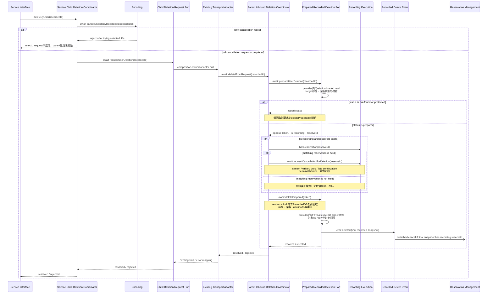

service child coordinator は Encoding と抽象 `ChildUserDeletionRequestPort` だけを参照する。Encode 管理は対象 Recorded
ID に一致する待機中・実行中 Encode ID を snapshot し、一件ずつ取消を await する。個別失敗を記録して残りを試し、一件でも
失敗した場合は最後に reject する。その reject 時は outbound request を送らず、parent coordinator を開始しない。取消済み
Encode は自動再開しない。

全 Encode 取消が完了した場合だけ、service child coordinator は `requestUserDeletion(recordedId)` を await する。service
child composition owner はこの outbound port を既存 `recorded.delete(recordedId)` transport へ、application-runtime の
parent composition owner は既存 handler を `deleteFromRequest(recordedId)` へ写像する。この adapter mapping は既存 IPC
model `recorded`、function `delete`、args `{ recordedId }`、`void` / error reply、通常 5 秒を維持し、新しい model、
function、args、reply、timeout を追加しない。workflow core はその IPC model / wire / client / handler を import しない。

parent coordinator は recorded-content の `prepareUserDeletion(recordedId)` を呼び、`not-found`または`protected`では
deletion effect前に終了し、`prepared`だけを後続へ進める。`prepared`から受け取るのはopaque token、録画状態、reserve IDだ
けであり、relationやresource選択を受け取らない。対象が録画中でreserve IDがあり、録画実行がその予約を保持するときだけ
`requestCancellationForDeletion(reserveId)`をawaitする。このoperationは、録画準備中の`CANCEL_EVENT`、録画stream終端、
writer close、drop処理停止、および対象へ作用するlate continuationのfenceを最大60秒で確認する削除専用terminal barrierへ写
像する。予約IDがない、または録画実行が保持しない場合は別の録画を推定して停止しない。barrierのrejectまたは期限超過では
`deletePrepared(token)`を開始せず、その後の削除failureでも録画やEncodeを自動再開しない。

最後にparent coordinatorが`deletePrepared(token)`をawaitする。recorded-contentはrecorded ID単位のresource mutation lock
を取得し、RecordedDBから対象の存在、保護状態、relation、resourceを再読取する。対象なしまたは保護中なら削除効果を開始せず
rejectする。最終読取で得たexact relation IDだけを削除計画へ固定し、selected video IDごとに効果時に親directory名から
`VideoUtil.getParentDirPath`で保存先rootを解決し（一時録画先を含む）、相対pathとともに管理削除へ渡す。thumbnail / video row removalはexact ID単位でsettleまでawaitし、
`deleteRecordedId(recordedId)`のbulk writeを使わない。deletion coreは録画状態管理port、録画停止port、Encode管理portを
importまたは呼出しせず、lockを全終了経路で解放する。

Thumbnail、video、drop logの実fileとrowの具体的な削除順、個別catch、保護判定は`server-recorded-content`が所有する。個別
unlink・DB failureの多くを記録して後続へ進むが、最終planに含めたDB mutationはすべてsettleしてから成功logとdelete eventへ
進む。本機能はresource効果を一つのtransactionまたはall-or-nothingへ読み替えない。

### 個別録画 file の parent coordinator と全体削除への昇格

既存 `recorded.deleteVideoFile` IPC handler は、application-runtime の parent composition owner が
`ParentVideoFileDeletionCoordinator.deleteVideoFileFromRequest(videoFileId)` へ写像する。wire は model `recorded`、
function `deleteVideoFile`、args `{ videoFileId }`、`void` / error reply、既存 timeout のままである。この要求は service
child user deletion coordinator を通らないため、個別 file 削除前の Encode 取消を追加しない。

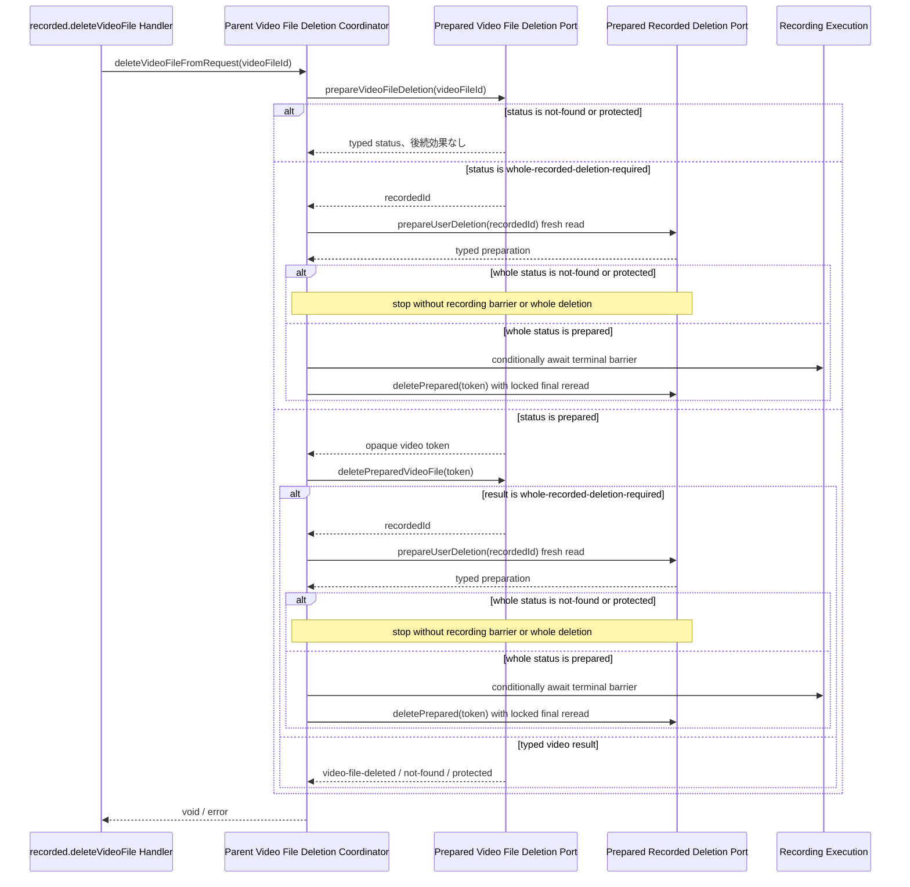

`whole-recorded-deletion-required` を受けた後の処理は、最初の個別prepareで返った場合と、個別final operationの再読取で
返った場合で同じである。coordinator は decision が持つ ID だけを使って`prepareUserDeletion(recordedId)` を fresh に呼
び、そのtyped `prepared`の録画状態とreserve IDに基づき条件付きterminal barrierを行う。成功後、 `deletePrepared(token)`が
resource lock内でさらに最終読取を行う。個別tokenや個別削除前の親snapshotをwhole tokenとして再利用しない。

個別削除では `prepareVideoFileDeletion()` の file / 親 read、`deletePreparedVideoFile()` の row 削除後の親再読取を許可す
る。whole 昇格後の `prepareUserDeletion()` はそれらとは別の fresh read である。fresh whole preparation が
`not-found`・`protected`なら停止要求と whole deletion を始めず error とし、個別 file がすでに削除済みであっても rollback
しない。個別削除 core と whole deletion core は Recording / Encoding を呼ばず、録画取消要求判断は parent coordinator だ
けが所有する。

### 現在の配置

`RecordedApiModel.delete()`は`ServiceChildUserDeletionCoordinator`でEncode取消をawaitした後、既存`recorded.delete` IPCを
呼ぶ。この二段構成とIPC境界を維持する。`RecordedManageModel.delete()`は一回のrelation付きentityを使い、terminalを待たず、
recorded ID単位のbulk row削除を行うため、利用者削除の経路からは呼ばれない。同メソッドは`videoFileCleanup()`の経路だけが
使う（recorded-contentが所有する）。

service child coordinatorはEncodingとabstract outbound portのcompositionとし、既存transportはchild側adapterとして配線す
る。parent側compositionは`IPCServer`の既存handlerからparent inbound coordinator（`ParentUserDeletionCoordinator`）を呼び、
同coordinatorが `prepareUserDeletion`
→ typed `prepared`だけの条件付きterminal barrier → `deletePrepared(token)`を所有する。`deletePrepared`はresource lock内
の最終RecordedDB read、exact-ID resource選択、exact-ID row delete、および全settlement待機を所有する。公開APIの要求・応
答、既存IPC model / function / args / reply、通常5秒を変えない。deletion core testでは録画・Encode portのimportとcallを
零件にし、child coordinator testとparent coordinator testを別seamとして検証する。

個別 video file 削除の既存 handler は`ParentVideoFileDeletionCoordinator`（`deleteVideoFileFromRequest`）を呼ぶ。同
coordinator は parent video file 削除用の prepared port と whole 削除用の prepared port を持ち、録画中・最終 file の
どちらも `whole-recorded-deletion-required` から fresh whole prepare へ接続する。既存 `videoFileId` wire と `void` /
error reply を変えず、個別経路へ service child Encode barrier を追加しない。`RecordedManageModel.deleteVideoFile()`は
`videoFileCleanup()`（整理）の経路だけが使う削除メソッドで、個別削除要求の経路からは呼ばれない。

### 利用者削除 IPC の timeout と restart

workflowが所有するのは、Encode取消成功後に既存carrierへ一回要求し、carrier側timeoutまたはrestartでも先行効果を
rollback・retry・dedupe・再送しないことだけである。通常5秒の依頼側timeout、listener / timer、`process.nextTick`
dispatch、request / reply identity、exact peerへのlate replyは`server-process-messaging`が所有する。service childのspawn
/ restartと、新しくspawnしたchildをcurrent peerとして一回だけ再登録する責任は`server-application-runtime`のchild
supervisionが所有する。

本Designはそのalgorithmを複製せず、
`test/server/process-messaging/peer-registry.spec.test.ts#PM-6.1 through #PM-6.6`
をlistener / timer / dispatch / request / reply identityの証拠とする。spawn / restartと新childのpeer再登録一回は
`test/server/application-runtime/service-child-supervision.spec.test.ts#AR-5.2 and #AR-5.3`
を証拠とする。workflow testはtransportをfake portに置き換え、timeoutまたはrestartでconsumer進行を喪失した後のremote
cancel、rollback、retry、replay、duplicate workflow effectを各0件として確認するだけに狭める。parent process再起動時は
prepared tokenとcontinuationを復元しない。Workflow assertionにはlistener / timer / request / reply identity、spawn /
restart、peer登録を含めない。

### 利用者削除と別経路

-   容量不足削除では storage management が候補と反復を所有し、録画済み番組 ID とstorage名を
    `IRecordedStorageDeletionPort.deleteForStoragePressure(recordedId, storageName)`へ渡す。Runtimeがbindingする
    capacity-pressure adapterは、recorded-contentの副作用なし
    `prepareStorageDeletion(recordedId, storageName)`、recordingの
    `RecordingRecordedUseGate.tryAcquireDeletion(recordedId)`、service childの
    `ServiceChildRecordedUseRegistry.tryAcquireDeletion(recordedId)`、recorded-contentのlock内最終再読取を含む
    `deletePreparedForStorage(token)`の順にだけ進む。gateのbusy / unknownはnot-deleted resultとし、file / DB削除と取消を
    行わない。取得済みgate tokenは逆順に一回解放する。
-   capacity-pressure adapterはWorkflowと利用者削除coordinatorを呼ばず、active recording、Encode、file deliveryを取消ま
    たは停止しない。利用中ならgateで削除を見送り、進行中の利用を介入せず継続させる。利用者による番組全体削除と、個別削除
    からwholeへ昇格する経路の削除専用terminal barrierは変更しない。
-   個別 video file 削除は parent video file coordinator が recorded-content の個別 operation を呼ぶ。録画中または最終
    file 判定では fresh な番組全体 plan へ昇格するが、service child の Encode 取消は通らない。
-   bulk file cleanup は利用者削除ではない。`RecordedApiModel.fileCleanup()` は video cleanup と drop-log cleanup を互い
    を待たずに同時に開始し（recorded-content R9.9）、`Promise.all` で結果をまとめる。両方が成功したときだけ resolve し、
    一方が拒否されると他方の完了を待たずにその error で reject する（他方の remote 処理は継続し得る）。一方の同期 throw
    または reject は他方の開始を止めない。`IPCClient.videoFileCleanup()` と `dropLogFileCleanup()` は各 request
    に独立した 600,000 ms の timer を持つ（`server-process-messaging` が所有する）。この値は workflow core の dependency
    または timeout 所有にはしない。workflow 側に aggregate timeout を追加しない。timeout 後も remote operation は継続し
    得る。
-   これら三経路を一つの共通削除 workflow へ統合しない。

容量候補・反復はstorageが所有する。Runtimeはadapterのbinding、上記call順、result写像、取得済みgate tokenの逆順解放を所有
する。recorded-contentはprepared token、resource mutation lock、lock内最終再読取、exact-ID削除を所有する。recordingは
active recordingの利用判定とgate token保持中の同一ID新規利用阻止を所有する。service child側の利用lease carrierにおける通
常5秒、listener / timer、request / reply identityはprocess messagingが所有し、service interface、Encoding、file delivery
のdomain consumerは利用開始前のlease取得と終了時の解放を所有する。本specificationはそのcross-spec境界を記録するだけで、
capacity-pressure adapter、recording / child use gate、またはlease carrierをworkflow component / portとして所有しない。
順序と非介入の外部証拠は
`test/server/application-runtime/storage-pressure-deletion.integration.test.ts#exclusive-prepare-and-final-delete`
とする。

## 通知と Hook の完了境界

workflowは画面再取得の要否と外部commandのsemantic operationだけを選び、既存`notifyClient()`と
`IExternalCommandManageModel`の型付きoperationへ渡す。`server-event-and-hook-delivery`は既存IPC、Socket.IO、command
FIFO、外部process lifecycleを所有する。

| Action      | 本機能が確認する完了                                                              | 本機能が確認しない完了                                           |
| ----------- | --------------------------------------------------------------------------------- | ---------------------------------------------------------------- |
| 画面通知    | `notifyClient()` の同期 return / throw。観測可能なPromise-like rejectは局所記録   | IPC delivery、service 受信、Socket.IO emit、browser 受信、再取得 |
| Hook        | 型付きfacade methodの同期 return / throw。観測可能なPromise-like rejectは局所記録 | queue開始、外部process終了、exit code、timeout                   |
| Encode 受付 | `setEncode()` の同期 return または同期 throw                                      | child 受信、queue 登録、Encode 開始・終了                        |

通知または Hook の失敗で、確定済みの番組、Rule、予約、録画、録画済み番組、Tag、Thumbnail、Encode 状態を巻き戻さな
い。Workflow は選択した UI / Hook handoff ごとに別の guard を置き、同期 throwを記録して吸収し、観測可能な
rejectへ局所handlerを接続して後続の独立destinationを試みる。Hook の受付・開始・終了を別の後続処理の成功条件にせず、配送
ack、retry、再送、rollbackを追加しない。

## Algorithm、不変条件、並行性

### 不変条件

1. 一件の event callback は、要件で定めた順序で後続 call を開始する。
2. 明示 `await` しない Promise の settlement は、callback の完了条件に含めない。
3. 明示的に依存する domain operation の未吸収同期 throw はその依存系列の後続 call を止めるが、起点状態と開始済み call を
   取り消さない。UI / Hook handoff の同期 throw または観測可能 reject は宛先別 guard が記録し、後続の独立 destination を
   止めない。
4. EPG 履歴整理失敗、Tag 一件失敗、Rule 削除の個別失敗など、局所 catch を持つ位置だけが失敗後の続行を保証する。
5. 録画完了時の Encode は first video がある場合だけ、mode 1、2、3 の順で最大三件を個別に開始する。Encode 指定があっても
   video 零件なら受付零件とし、Tag、Hook、画面通知へ進む。
6. parse 成功後の Tag relation と番組リレー候補は入力順に一件ずつ await する。Tag 全体 parse failure では残 Tag へ進まな
   いaggregate入力境界とし、Hookと画面通知へ進む。
7. 同じ状態変化の再受付に共通 deduplication を適用しない。
8. 一件の状態変化に対する共通 result、status、checkpoint、transaction を持たない。
9. downstream の成功を起点状態の成功条件へ追加しない。
10. 起動時録画整理の録画中結果一覧または最終再読取failureはRuntime consumerへstage failureを返す。列挙後の一項目failure
    は記録して要件どおり続行するが追加UI/Hook通知へ変換せず、成功した最終再読取だけが通常finish eventを発行できる。整理
    成功後はWorkflowがcombined `rebuildCandidatesAndStart()`、期限切れ予約整理、EPG supervisor開始依頼の論理順と
    stop-on-first-failureを所有する。Recording ownerはcombined provider内の保存予約read、rebuild、成功後だけの3秒周期
    scheduler開始、4状態lifecycleを所有する。Runtimeはservice監督受付後の単一port一回invoke、stage別の透過600秒observer
    wrapper binding、one-entry guard、EPG supervisor callbackを所有し、個別stageの選択・順序付けを行わない。
11. process restart 後に callback、service child deletion、parent inbound deletion、または既存 adapter request の途中位
    置を復元しない。
12. service child coordinator は Encode 取消完了後だけ child deletion request port を呼ぶ。
13. parent inbound coordinator はtyped preparationの`prepared`だけを後続へ進め、必要な削除専用terminal barrierの成功後だ
    けopaque tokenで`deletePrepared(token)`を呼ぶ。`not-found`と`protected`では録画操作とfinal deletionを開始しない。
14. 利用者削除はterminal barrier後にresource lock内でRecordedDBから存在・保護・relationを再確認し、最終計画のexact
    relation IDだけを削除する。recorded ID単位のbulk row deleteを使わない。
15. parent video file coordinator は個別削除の前に Encode 取消を行わず、recorded-content の internal decision に従う。
16. 個別削除が番組全体削除を要求した場合は、個別 token や親 snapshot を再利用せず fresh な
    `prepareUserDeletion(recordedId)` から whole deletion を開始する。
17. resource mutation lockは成功、failure、早期returnの全経路でexact ownerが一回解放し、取得待ちtimeoutを後から所有権へ
    昇格させない。

### 呼出順と failure matrix

| Workflow                       | Await                                                                           | Detached / void                            | 局所 catch                                         | 後続停止点                                                                             |
| ------------------------------ | ------------------------------------------------------------------------------- | ------------------------------------------ | -------------------------------------------------- | -------------------------------------------------------------------------------------- |
| EPG updated                    | history cleanup、updateAll                                                      | なし                                       | history cleanup は log catch                       | updateAll reject                                                                       |
| Rule add/update/enable/disable | なし                                                                            | UI、updateRule                             | 各guard。updateRule rejectはlog catch              | 独立destination間の停止なし                                                            |
| Rule delete                    | なし                                                                            | UI、removeRuleId、updateRule               | 各guard。二つのPromise rejectはlog catch           | 独立operation間の停止なし                                                              |
| Reservation diff               | なし                                                                            | UI、同期 `acceptMutation`、Hook            | 三guard。後続評価failureはrecording controller内   | 独立handoff間の停止なし。録画評価failureは後着しても伝播しない                         |
| Recording preparation          | なし                                                                            | UI、条件付きreservation cancel、Hook       | 各guard。cancel rejectはlog catch                  | 独立operation間の停止なし                                                              |
| Recording started              | Tag sequence                                                                    | UI、Hook                                   | Tag内外とUI / Hook各guard                          | UI / Hook間の停止なし                                                                  |
| Recording failed               | なし                                                                            | UI、条件付き Hook                          | UI / Hook各guard                                   | UI / Hook間の停止なし。finish Tag中なら追越し得る                                      |
| Recording finished             | Tag sequence                                                                    | reservation、Thumbnail、Encode、Hook、UI   | reservation、Tag、UI / Hook各guard                 | Thumbnail / Encode同期throw。Hook failure後もUIを試行                                  |
| Recorded changes               | なし                                                                            | UI、条件付きThumbnail / reservation、Hook  | 各guard。cancel rejectはlog catch                  | UI failure後も選択した独立operationを試行                                              |
| Relay candidates               | 各 addEventRelay                                                                | なし                                       | `null` / rejectを候補別に一回記録                  | callback 自体は候補ごとに続行                                                          |
| User deletion / service child  | Encode cancel、child deletion request の reply                                  | timeout 後も parent operation は継続し得る | Encode 内は個別 catch 後に集約 reject              | cancel reject で request 未送信。adapter reject で caller 終了                         |
| User deletion / parent         | typed prepare、条件付きterminal barrier、opaque tokenによるdeletePrepared       | delete event 後の reservation cancel       | cancelはlog catch。resource別catchはrecorded所有   | not-found / protectedと各await失敗ではfinal削除なし                                    |
| Video file deletion / parent   | typed prepare / token delete、必要時fresh whole prepare / cancellation / delete | timeout後もparent operationは継続し得る    | resource別catchはrecorded-content所有              | 各await失敗を伝播。whole昇格前の個別効果は0件                                          |
| Capacity-pressure deletion     | prepare、recording use gate、child use gate、lock内最終read・exact delete       | active recording / Encode / deliveryは継続 | busy / unknownをnot-deletedへ写像。tokenは逆順解放 | 各段成功後だけ次へ進む。Workflow / user deletion / cancellation call 0                 |
| Bulk cleanup                   | video cleanup と drop cleanup（同時に開始。両方成功で resolve、一方が拒否されると他方を待たず reject）                         | remote operation は timeout 後も継続し得る | 既存 adapter contract に従う                       | 一方の失敗は他方の開始を止めない。caller へは最初の reject を返す                      |
| Startup reconciliation         | 録画中一覧取得、項目処理、最終再読取                                            | 成功した最終再読取だけ通常の録画完了event  | 項目failureを記録し追加通知0。段階failureを返す    | reconciliation failureでcontinuation call 0                                            |
| Startup continuation           | `rebuildCandidatesAndStart`、期限切れ予約整理                                   | EPG supervisor依頼                         | provider throw / rejectを対応stageの`Failed`へ変換 | 最初の`Failed`後のstage call 0。録画対象の3秒周期確認schedulerはRecording provider内部 |

### 並行性

-   `EventEmitter.emit()` は各 listener wrapper を登録順に開始するが、非同期完了を直列化しない。
-   異なる event callback 間に共通 mutex、queue、transaction、順序保証はない。
-   Rule 削除の関連解除と再計算、録画完了の予約整理・Thumbnail・Encode、通知・Hook は互いに並行し得る。
-   Tag relation と relay 候補だけは、一回の callback 内で入力順に await する。
-   recording failure は finish(false) の同期 prefix 後に emit されるが、finish Tag が pending なら failure UI / Hook が
    追越し得る。
-   user deletion は service child で Encode 取消を barrier としてから outbound port を呼び、別 process の parent
    inbound coordinatorがtyped preparation、必要な録画terminal barrier、その成功後のopaque tokenによるdeletion coreを順
    に開始する。
-   deletion coreはrecorded ID単位のresource lock内でRecordedDBを再読取し、停止待ち中の保護・relation変更を反映する。
    selected videoの保存先rootはeffect時に最終読取のrelationが持つ親directory名から解決し、最終plan外のrowを削除しない。
-   individual video file deletion は parent process から直接始まり、個別 prepare / delete の許可 read と、whole
    decision 後の fresh whole prepare を別 read として扱う。service child Encode barrier と個別 / whole token の再利用は
    行わない。
-   detachedな業務Promiseは各要求の局所handlerで失敗を一回記録し、未処理rejectionへ漏らさない。共通のrollbackまたはretry
    handlerへは集約しない。

### Idempotency と再実行

本機能は idempotency key を発行せず、同じ event、Rule ID、予約 diff、録画完了、relay 候補、または利用者削除要求の重複を
共通に抑止しない。owner domain が対象なし、重複、保護、既存予約等を判定する場合はその結果に従う。同じ状態変化が再発行さ
れれば、画面通知、Hook、予約再計算、Tag、Thumbnail、Encode 等が再度依頼されることがある。

## Failure、rollback、retry、cleanup、restart

### Failure と rollback

-   一件の後続 failure は、各 workflow の局所 catch または停止点に従う。
-   UI / Hook handoff は各destinationを別guardで試行し、同期throwまたは観測可能rejectを記録しても後続の独立destinationを
    試みる。明示的に依存するdomain callだけがfailure matrixの停止点になり得る。
-   すでに開始した予約再計算、取消、Thumbnail、Encode、Tag、通知、Hook、file / row 削除を共通に取り消さない。
-   起点の状態変更を reverse mutation しない。
-   Rule 削除、録画完了、利用者削除、file cleanup を一つの database transaction にしない。
-   部分結果を成功一件または失敗一件へ集約しない。
-   compensation action を自動生成しない。

#### 利用者削除と carrier の failure matrix

| Failure / condition                                   | Caller / coordinator の結果                                 | 継続し得る effect                                          | 自動処置                                           |
| ----------------------------------------------------- | ----------------------------------------------------------- | ---------------------------------------------------------- | -------------------------------------------------- |
| Encode 取消の集約 reject                              | service child が outbound request を送らず caller を reject | 成功済みの個別 Encode 取消                                 | 再開・rollback・retry なし                         |
| `prepareUserDeletion` が `not-found` / `protected`    | parent coordinator が取消要求・削除を始めず既存errorへ写像  | 先行した Encode 取消                                       | Encode 再開・rollback なし                         |
| recording terminal barrier が rejectまたは期限超過    | parent coordinator が `deletePrepared` を始めずreject       | Encode取消、録画停止要求の部分effect                       | 録画再開・rollback・retryなし                      |
| `deletePrepared` の reject                            | parent coordinator が reject reply                          | Encode取消、取消要求settlement、resource別部分削除         | compensation なし                                  |
| 停止待ち中の保護・relation変更                        | lock内最終readの状態に従う                                  | 保護中なら削除効果なし。relation変更はprovider内planへ反映 | plan外rowを削除しない                              |
| 個別 prepare が whole decision を返す                 | fresh whole prepare へ進む                                  | 個別 file の削除効果なし                                   | Encode 取消なし。whole prepare failure は伝播      |
| 個別final再読取が録画中または最後のfileを確認         | 個別効果0件でfresh whole prepareへ進む                      | 個別 file / row の削除効果なし                             | fresh whole tokenで条件付き取消                    |
| fresh whole prepare / cancellation / delete の reject | parent video file coordinator が reject reply               | 先行した個別削除、取消要求、resource別部分削除             | compensation・Encode取消・retryなし                |
| carrier timeout / child restart                       | consumer側要求がsettleせずまたは進行を喪失                  | 送信済みならparent operationは継続し得る                   | workflowはremote cancel・rollback・retry・再送なし |
| parent restart during deletion                        | parent coordinator とprepared tokenの進行位置を喪失         | restart 前のEncode取消・録画取消要求・部分削除             | checkpoint 復元・途中再開・rollback なし           |
| listener / timer / request / reply identity           | PM provider resultに従う                                    | workflowはidentity stateを持たない                         | `PM-6.1`–`PM-6.6` external locatorで検証           |
| child spawn / restart / peer re-registration          | Runtime child supervisor resultに従う                       | workflowはchild generation stateを持たない                 | `AR-5.2` / `AR-5.3` external locatorで検証         |
| bulk video cleanup の error / timeout                 | caller を reject する。drop-log request は独立に開始済み    | remote video cleanup は継続・部分完了し得る                | resume・rollback・retry なし                       |

### Retry

本機能は共通retryを行わない。録画準備・録画のretry、Hook commandのtimeoutとretry方針、既存adapter timeout、domain
repository retryはそれぞれowner contractである。起動時録画整理、combined `rebuildCandidatesAndStart()`、期限切れ予約整
理、またはEPG supervisor開始受付の段階failureをRuntimeへ返し、この機能内で固定間隔の無制限retryを開始しない。service
child coordinator は Encode 取消 failure 後に outbound request を送らず、adapter failure / timeout 後に同じ request を再
送しない。parent inbound coordinator と parent video file coordinator も plan prepare、録画取消要求、delete failure を内
部 retryせず、timeout と restart 後にも remote cancel、rollback、再送を追加しない。

### Cleanup と shutdown

本機能固有の file、socket、child process、timer、queue、database connection は持たない。event callback、service child
coordinator、二つの parent deletion coordinator の局所値と Promise continuation は settlement 後に解放対象となる。既存
adapter の listener と timer の cleanup は composition 側の transport adapter が所有する。runtime shutdown 時に
in-flight callback、各 coordinator、detached Promise、Hook job、transport request、Encode を drain する共通 protocol は
設けない。

### Restart

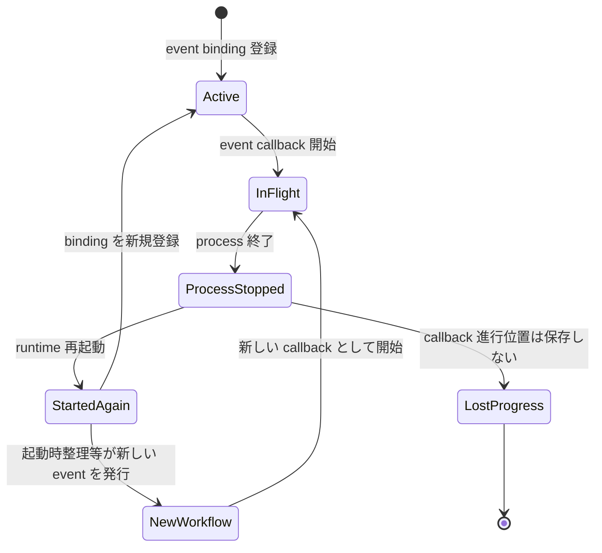

再起動前の callback がどの action まで開始したかを保存せず、次回起動時に途中位置から再開しない。録画実行の起動時整理が録
画完了 event を新たに発行した場合は、その event に対する新しい録画完了 workflow を先頭から開始する。これは旧 workflow の
checkpoint 復元ではない。

同じ singleton に `set()` を複数回呼ぶとlistenerとEvent／Hook delivery所有のprovider-registration setup呼出しが重複し得
る。RuntimeはWorkflow event binding入口を一回だけ呼ぶが、本機能は重複登録を自動排除しない。Event／Hook deliveryは注入済
みPM registration portとproviderを自機能内で登録し、WorkflowとRuntimeへPM型を公開しない。service child が Encode 取消中
または IPC送信前に終了すると child coordinator の進行位置を失い、parent operation は開始しない。adapter 応答待ち中に終了
するとchild coordinator と process-local pending request を失う一方、parent deletion operation は継続し得る。どちらも新
childへ request を復元・再送しない。parent process の終了ではcoordinator のprepared tokenと進行位置を失い、途中から再開
しない。

listener / timer、dispatch、request / reply identity、late replyは
`test/server/process-messaging/peer-registry.spec.test.ts#PM-6.1 through #PM-6.6`
に委譲する。service childのspawn / restartと新しくspawnしたchildのpeer再登録一回は
`test/server/application-runtime/service-child-supervision.spec.test.ts#AR-5.2 and #AR-5.3`
に委譲する。workflowはreplyの保存、世代ID、request復元、再送を追加せず、どちらのprovider内部観測もassertしない。

## Contract

### Event contract

-   payload は実装の entity、ID、diff、`recorded | null`、`needsReservationRemoval`、relay candidate 配列、Encode 完了情
    報を維持する。
-   callback の返却型は各 event interface の固定 signature を維持する。
-   producer は `emit()` の return を downstream 完了として扱わない。
-   listener が零件でも producer の業務状態を失敗へ変換しない。

### Domain port contract

| Port                       | 利用 operation                                                       | Result の扱い                                                                                                                          |
| -------------------------- | -------------------------------------------------------------------- | -------------------------------------------------------------------------------------------------------------------------------------- |
| Reservation                | `updateAll`、`updateRule`、`cancel`、`addEventRelay`                 | workflow ごとの await / detached / catch に従う                                                                                        |
| Runtime startup inbound    | `runAfterServiceSupervisionAccepted`                                 | Runtimeのservice監督受付後に単一portとして一回invokeされ、最終`Succeeded`または最初の`Failed`を返す                                    |
| Recording startup          | 正本`RecordingExecutionFacade.rebuildCandidatesAndStart`             | 整理成功後だけawait。resolve / rejectをcombined stage outcomeへ変換し、内部read / rebuild / 録画対象の3秒周期確認schedulerを分割しない |
| Reservation startup        | `runExpiredReservationCleanup`（Runtime が `IReservationManageModel.cleanup()` を束ねる） | combined recording stage成功後だけawaitし、failureならEPG supervisorをrequestしない                                                    |
| Program startup            | `startEpgSupervisor`（Runtime が `IEPGUpdateExecutorManageModel.execute()` を一回だけ呼ぶ callback） | 期限切れ予約整理成功後だけawaitし、typed outcomeをRuntimeへ返す                                                                        |
| Recording                  | `acceptMutation`、`hasReservation`、`requestCancellationForDeletion` | diffは同期enqueue。利用者・whole昇格削除時だけstream、writer、drop、late continuationのterminal barrierを最大60秒で確認                |
| Recorded                   | `historyCleanup`、`removeRuleId`                                     | 履歴失敗は吸収し、Rule 関連解除は detached                                                                                             |
| Child deletion request     | `requestUserDeletion(recordedId)`                                    | service child が Encode 取消後に await。transport は composition adapter が写像する                                                    |
| Prepared recorded deletion | `prepareUserDeletion`、`deletePrepared`                              | barrier後にlock内再読取し、effect時ID path readとexact-ID row deleteを行う                                                             |
| Prepared video deletion    | `prepareVideoFileDeletion`、`deletePreparedVideoFile`                | 個別 plan / whole decision と、deleted / whole decision を返す。録画・Encode port は呼ばない                                           |
| Recorded Tag               | `setRelation`                                                        | parse 成功後は入力順に await し、個別 reject を記録して続行                                                                            |
| Thumbnail                  | `add`                                                                | void 受付。録画完了の依存domain列では未吸収同期throwが明示した後続を止める                                                             |
| Encoding                   | `setEncode`、`cancelEncodeByRecordedId`                              | finish 時は同期受付、user deletion では最初の barrier として取消を await                                                               |
| UI / typed Hook facades    | `notifyClient`、既存の型付き外部command operation                    | 一handoffずつguardし、同期throw / 観測可能rejectを記録後も独立destinationへ進む。await / retry / ackなし                               |

### Public、IPC、DB、filesystem

-   公開APIのルート、method、要求、応答、error を変更しない。
-   workflow core は IPC model / wire を import しない。composition-owned adapter の互換性として、既存 model / function
    名、args、reply、timeout を変更しない。`recorded.delete` と `recorded.deleteVideoFile` は通常 5 秒、bulk video /
    drop の cleanup は各 600,000 ms である。
-   bulk cleanup 各 600,000 ms は adjacent transport adapter（`server-process-messaging`）が所有する値で、本機能は
    二 request を互いを待たずに同時に開始する条件だけを前提とする。
-   event 名と payload を変更しない。
-   新しい workflow table、column、migration、checkpoint row を追加しない。
-   file path、unlink、row deletion の規則を本機能で再定義しない。
-   user deletion の service child Encode取消 → outbound requestの既存adapter写像 → parent typed preparation → 必要な録
    画terminal barrier → lock内最終read → `deletePrepared(token)` の順序と公開wireを維持する。
-   individual video file deletion は既存 handler → parent coordinator → prepared video deletion とし、whole decision 後
    だけ fresh whole preparation → 条件付き取消要求 settlement → `deletePrepared(token)` へ進む。Encode 取消を追加しな
    い。

## Observability、security、privacy

### 観測性

既存 logger へ記録できる場合、状態変化種別と既存 ID を使う。新しい correlation ID、workflow ID、result ledger、metric
backend を追加しない。relayのduplicate `null`とrejectは候補別に一回記録する。history cleanup、Rule更新、予約取消を含む
detachedな業務Promiseのrejectも各要求の種類と既存IDで一回記録する。Encode指定があってもsource videoがない場合は依頼零
件、Tag aggregate parse failureは一回記録後にTag処理終了として観測する。各UI / Hook handoffの同期throwまたは観測可能
rejectはdestination種別と既存IDで一回記録し、後続の独立destinationを試行した事実をcall ledgerで観測する。配送ackや共通
result ledgerは追加しない。

ログに含めない値は、認証情報、API key、Hook secret、実 URL、database credential、放送 data、実利用者環境の private path
である。Tag parse failure の記録経路は生の保存文字列を含むため、この Design は redaction 済みと断定しない。

### Security と privacy

-   本機能は新しい外部入力面、network listener、filesystem 権限、process 起動を追加しない。
-   public 入力検証は service-interface、domain ID と保護判定は owner domain が行う。
-   Hook command、environment、spawn、timeout は event-and-hook-delivery が所有する。
-   test fixture は synthetic ID、番組名、path、event payload を使い、実 URL、実番組、実 file、credential を tracked
    file に含めない。
-   entity payload は process-local event と既存 IPC operation の範囲だけで扱い、新しい永続 audit record へ複製しない。

## Test strategy

### Test 配置

`test/server`は`server-application-runtime` Designで確定した共有server test rootである。本Designは共通のVitest、
production compile境界、V8 coverage、root commandを再定義しない。

| Test file                                                                   | 責任                                                                                                |
| --------------------------------------------------------------------------- | --------------------------------------------------------------------------------------------------- |
| `test/server/workflow-coordination/event-binding.spec.test.ts`              | event catalog、登録順、wrapper の同期 / 非同期境界                                                  |
| `test/server/workflow-coordination/program-rule.spec.test.ts`               | EPG 履歴整理、初回 flag、Rule 変更・削除順                                                          |
| `test/server/workflow-coordination/reservation-recording.spec.test.ts`      | diff、準備、開始、失敗、retry-over、Tag、finish / failure の時系列                                  |
| `test/server/workflow-coordination/recording-finish.spec.test.ts`           | manual / relay / Rule、video、Encode 1-3、Tag、Hook、UI、source・parse境界                          |
| `test/server/workflow-coordination/relay.spec.test.ts`                      | 入力順、success / null / reject、候補別記録と継続                                                   |
| `test/server/workflow-coordination/recorded-change.spec.test.ts`            | recorded / video / upload / protect / Tag / Thumbnail / Encode 通知選択                             |
| `test/server/workflow-coordination/imp/startup-reconciliation-failure.imp.test.ts` | 整理段failureの`Failed(recording-reconciliation)`と後続stage 0件                                    |
| `test/server/workflow-coordination/startup-continuation.spec.test.ts`       | combined recording stage→期限切れ予約整理→EPG supervisorのtyped順序・停止                           |
| `test/server/workflow-coordination/user-deletion.integration.test.ts`       | child Encode→outbound、typed prepare→barrier→opaque token→lock内再読取・exact-ID削除                |
| `test/server/workflow-coordination/video-file-deletion.integration.test.ts` | 個別typed outcome / token、fresh whole昇格、既存wire、Encode 0件                                    |
| `test/server/workflow-coordination/partial-failure.spec.test.ts`            | domain停止点、UI / Hook宛先別隔離、unhandled 0件、rollbackなし                                      |
| `test/server/workflow-coordination/user-deletion.spec.test.ts`              | service child / parent の deletion coordinator が注入 port だけに触れること                        |
| `test/server/workflow-coordination/architecture.spec.test.ts`               | UI handoff と Hook handoff の独立（一方の reject が他方を止めない）                                 |
| `test/server/workflow-coordination/provider-contracts.integration.test.ts`  | 実 provider との接続（予約・録画、Runtime 起動の typed outcome、既存 IPC wire）                     |
| `test/server/workflow-coordination/startup-workflow-entry-guard.integration.test.ts` | 起動 port が複数の service child 登録に対して一回だけ invoke されること                   |
| `test/server/workflow-coordination/real-program-rule.integration.test.ts` | 番組情報の更新後の整理と予約の更新、ルールの追加・変更・削除に伴う予約の再計算（実部品） |
| `test/server/workflow-coordination/real-reservation-recording.integration.test.ts` | 予約の追加・変更・削除・スキップと録画の準備・取消・再試行上限（実部品） |
| `test/server/workflow-coordination/real-recording-finish.integration.test.ts` | 録画完了後のサムネイル・エンコード依頼、タグの関連付け、コマンドと画面通知の選択（実部品） |
| `test/server/workflow-coordination/real-relay-recorded-change.integration.test.ts` | 番組の中継候補の予約と、録画済み番組の変更に伴うサムネイル依頼・予約取消（実部品） |
| `test/server/workflow-coordination/real-user-deletion.integration.test.ts` | 利用者による録画済み番組の削除。エンコードの取消、録画の終了待ち、録画側の判断への委譲（実部品） |
| `test/server/workflow-coordination/real-boundary-partial.integration.test.ts` | 画面通知と外部コマンドの境界。通知を集約せず、完了しない通知やコマンドが後続を止めないこと（実部品） |
| `test/server/workflow-coordination/real-world-teardown.integration.test.ts` | 実部品の配線の後始末。操作が起動した外部コマンドの終了を待ってから一時 directory を消すこと |
| `test/server/workflow-coordination/_real-workflow.ts` | 上の結合 test が共有する実部品の配線（補助 file） |
| `test/server/workflow-coordination/_real-encode.ts` | 実の子 process で動かすエンコードの配線（補助 file） |
| `test/server/workflow-coordination/imp/*.test.ts`                           | 実装の性質（`EventSetter` と `StartupContinuationCoordinator` の特性）                              |
| `test/server/workflow-coordination/restart.characterization.test.ts`        | timeout / restart時のconsumer進行喪失とremote cancel / rollback / retry / replay / duplicate効果各0 |
| `test/server/fixtures/workflow-coordination/`                               | synthetic entity、deferred port、call ledger、fake event adapter                                    |

上の `real-*.integration.test.ts` は、DB・録画・外部コマンドなどに実部品を使う。実部品が子 process を起動するのは、他機能の部品（外部コマンド、エンコード）を通すためであり、本機能が子 process を所有するわけではない。

### Unit / component tests

-   fake event、deferred Promise、同期 throw port、rejecting port を使い、実時間待機を行わない。
-   call ledger で各 trigger の呼出先、条件、同期開始順、await barrier、detached settlement を照合する。
-   EPG 履歴整理の resolve / reject と `updateAll` resolve / reject を直積し、初回 flag の更新位置を確認する。
-   Rule 五種、予約 diff 三種、録画 lifecycle、recorded / Tag / Thumbnail event 全種を table-driven に検証する。
-   history cleanup、Rule add/update/enable/disable/delete、preparation failure、recording retry-over、recording
    finish、recorded delete後整理の各detached業務Promiseをrejectさせる。各要求の局所handlerが失敗を一回記録し、後続開始
    順とrollbackなしを維持し、isolated processの`unhandledRejection`観測が0件であることを確認する。
-   録画中一覧取得成功後、録画中状態解除、予約取得、file移動、file size更新を項目ごとにfault injectionする。failureを一
    回記録し、定めた次項目または同項目の残fileへ進み、`notifyClient()`と全外部command facade callが零件であることを確認
    する。成功した最終再読取だけが既存通常finish eventを一回発行し、その通常eventからだけ既存finish workflowへ入ることを
    対照assertionにする。
-   録画中一覧取得または最終再読取をrejectさせ、rejected settlementをRuntime consumerへ一回返すことを確認する。本機能の
    continuation fake ledgerは全call零件、内部retry timerと再attemptも零件とする。
-   reconciliation成功後、combined `rebuildCandidatesAndStart()` → 期限切れ予約cleanup → EPG supervisor開始requestの論理
    順を`startup-continuation.spec.test.ts`のfake stage callback ledgerで確認する。各stageのresolve、同期throw、Promise
    rejectをtable-drivenにし、coordinatorが対応stageの`Succeeded` / `Failed`へ変換すること、最初のfailureをRuntime
    consumerへ一回返して後続callとretryを各0件にすることを確認する。
-   Runtimeのservice監督受付後における単一`RuntimeStartupWorkflowPort`一回invoke、stage別のsettlement透過な600秒soft
    observer wrapper binding、one-entry guard、およびEPG child supervisor callback bindingは
    `test/server/application-runtime/startup-composition.integration.test.ts#case-7-10 and #failure-stop`と
    `test/server/application-runtime/startup-composition.spec.test.ts#AR-6.8`で検証する。Runtime testは個別stageの選択・順序を所有せず、Workflow testはtyped first-failureとcombined → cleanup →
    EPGの選択を所有する。workflow unit testへtimer、generation、child process algorithmを複製しない。保存予約read、候補
    rebuild、成功後だけの録画対象の3秒周期確認scheduler start、4状態start lifecycle、同じPromiseへのjoinは
    `test/server/recording-execution/startup.spec.test.ts#RE-7.6 and #RE-7.11`へ
    委譲し、Workflow fakeでは内部callをassertしない。
-   Tag の null、空配列、正常配列、JSON aggregate parse failure、一件 relation reject、複数 reject を確認する。録画開始
    と録画完了のどちらも、parse 成功後の識別済み relation failure は残件続行、aggregate parse failure は個別 call 零件で
    Tag 処理終了を期待する。
-   録画完了は予約種別、削除要否、video 有無、Encode mode 1-3、Tag 有無を組合せる。source video がある場合はmode 1→2→3の
    指定順、Encode 指定あり・source video 零件ではEncode call 零件となり、Tag、Hook、画面通知へ進むcaseを独立して確認す
    る。
-   録画済み番組がある録画 stream failure では finish(false) emit を failure emit より先に確認する。Tag port を deferred
    にし、finish 側の Thumbnail / Encode 同期 call 後、Tag settlement 前に failure UI と failure Hook が開始し、Tag
    resolve 後に finish Hook、finish UI が続く call ledger を確認する。recorded ID がない case は finish event 零
    件、failure payload が null の case は failure Hook 零件で failure UI があることを分ける。
-   Thumbnailと各Encodeを一箇所ずつ同期throwさせ、明示的に依存する後続未到達と先行作用非取消を確認する。別caseで各UI /
    Hook handoffを同期throwまたは観測可能rejectにし、failure一回記録、後続の独立destination試行、unhandled rejection
    0、rollback / retry / ack 0を確認する。
-   relay は success、`null`、reject を同じ配列に混ぜ、逐次開始、候補別の一回記録、および残候補の継続を確認する。
-   予約 diff は UI → 同期 `acceptMutation(diff)` → Hook の call ledger を確認し、受付 return を評価完了として待たない。
    UIまたは`acceptMutation`の同期throw、UI / Hookの観測可能rejectでも残る独立handoffを一回試行する。burst の wake
    coalescing と後続評価 failure の内部記録は `server-recording-execution` owner test へ対応付ける。

### Integration / contract tests

-   event producer → wrapper → workflow fake ports の登録順と emitter の非待機を`server-application-runtime` Requirement 9
    が所有するNode.js matrix上で確認する。本機能からversion値またはmatrixを複製しない。
-   service child coordinator test は Encode 取消完了前の `ChildUserDeletionRequestPort` call 零件、取消成功後の一回の
    `requestUserDeletion(recordedId)`、取消集約 reject 時の request call 零件を検証する。adapter reject / timeout 後に
    Encode を再開せず、prepared deletion、recording port を child component へ渡さない。
-   parent inbound coordinator test は `prepareUserDeletion(recordedId)`の`not-found` / `protected` / `prepared`を分け、
    `prepared`の録画情報に基づく条件付き`requestCancellationForDeletion(reserveId)` → `deletePrepared(opaqueToken)` の
    call ledgerを検証する。前二状態、prepare reject、terminal barrier reject / 60秒期限超過ではdelete call零件、delete
    rejectでは先行effect非復元とする。relation/resourceがcoordinatorへ渡らないこと、Encoding portとtransport clientを
    componentへ渡さないことも確認する。
-   recording owner cross-spec testは、prep中の`CANCEL_EVENT`、active recordingのstream terminal、writer close、drop
    stop、late continuation fenceを最大60秒で待つことを確認する。managerのactive indexは停止中を表す状態でbarrier完了ま
    で保持し、barrier timeout後のlate callbackが別sessionを解放しないことを固定する。
-   parent video file coordinator test は `prepareVideoFileDeletion(videoFileId)` の`not-found` / `protected` /
    `prepared` / `whole-recorded-deletion-required`を分ける。前二状態ではfinal call零件、`prepared`ではopaque video
    tokenだけを`deletePreparedVideoFile()`へ渡す。結果が`video-file-deleted`ならwhole call 0件、final再読取によるwhole
    decisionなら個別file/row効果0件のままfresh `prepareUserDeletion(recordedId)`を一回とする。初回whole decisionでも同じ
    fresh prepare → typed `prepared`だけの条件付きterminal barrier → opaque tokenによるlock内最終read・exact-ID deleteと
    し、Encoding call は全case 0件とする。
-   Encode 一件失敗でも残対象を取消後に全体 reject し、outbound request、parent plan prepare、recording cancellation、
    `deletePrepared` を零回にする。
-   prepareの`not-found`・`protected`・`prepared`、録画保持あり/なし、terminal barrier中の保護・relation変更、file/DB部
    分失敗をrecorded-content owner testに対応付ける。barrier後にrecorded ID resource lockを一回取得し、RecordedDBの存
    在・保護・ relationを読み直すこと、provider内部のfinal planが選んだvideo IDごとに親directory名から`VideoUtil.getParentDirPath`で
    保存先rootを解決して管理削除へ渡すことを期待する。row欠落・root解決不能・管理削除の拒否のlog / continue、exact-ID row
    delete、plan外row非削除、全終了経路のlock解放を固定し、workflowへrelation/resourceを返さず、core fakeへ録画・Encode
    portを渡さず両call零件を確認する。
-   capacity-pressure削除は
    `test/server/application-runtime/storage-pressure-deletion.integration.test.ts#exclusive-prepare-and-final-delete`
    で、副作用なしprepare → recording use gate → child use gate → lock内最終read・exact-ID deleteの順を確認する。busy /
    unknownではnot-deleted、取得済みtokenは逆順に一回解放し、Workflow、利用者削除、録画取消、Encode取消、delivery停止を
    各0件とする。本機能のuser deletion testへcapacity用gateやlease carrierの内部assertionを複製しない。
-   user deletion testはservice childのEncode取消 → 既存`recorded.delete` IPC → parent handlerの同じIPC wireを保ち、
    parent handler後をtyped `prepareUserDeletion` → terminal barrier → opaque token → lock内再読取 → `deletePrepared(token)`
    の順で確認する。整理用の削除メソッド`RecordedManageModel.delete()`の一回read、terminal非待機、bulk row deletionの特性はrecorded-contentの
    整理用削除のtestが所有する。
-   公開APIの要求・応答と IPC model `recorded`、function `delete`、args `{ recordedId }`、`void` / error reply の
    adapter snapshot を固定する。新しい operation、field、reply envelope が零件で、workflow module の IPC model / wire
    import が零件であることを確認する。
-   個別 IPC は model `recorded`、function `deleteVideoFile`、args `{ videoFileId }`、`void` / error reply、既定 5 秒の
    adapter snapshot を固定する。handler が parent video file coordinator へ同じ ID を一回渡し、新しい field、reply
    envelope、service child Encode barrier が零件であることを確認する。
-   workflow consumer testはtimeout / restartによるconsumer進行喪失と、remote cancel、rollback、retry、replay、duplicate
    workflow effect各0だけを確認する。listener解放、timer、dispatch、request / reply identity、late replyは
    `test/server/process-messaging/peer-registry.spec.test.ts#PM-6.1 through #PM-6.6`
    に委譲する。service childのspawn / restartと新childのpeer再登録一回は
    `test/server/application-runtime/service-child-supervision.spec.test.ts#AR-5.2 and #AR-5.3`
    に委譲する。
-   bulk cleanup は video / drop の二 request を互いを待たずに同時に開始し、一方の失敗が他方の開始を止めないことを
    recorded-content の cleanup test が確認する。二 request が各 600,000 ms の別 timer であることは process messaging の
    deadline test が確認する。
-   UI / Hook は受付だけを workflow completion とし、各handoffの同期throw / 観測可能rejectを記録しても後続の独立
    destinationを試み、配送結果、ack、retryを待たないことをdelivery owner contractと突合する。
-   公開APIの要求・応答と IPC wire の snapshot は owner specification の test を参照し、本機能から新しい wire を期待しな
    い。

### C0 / C1 と結合境界

本機能は共有runner、coverage commandを作らない。共有runnerとserver全体のC0 / C1判定は
`server-application-runtime` Requirement 9 Acceptance Criterion 9だけが所有する。本機能は共有基盤へ以下の機能固有の確認を供給する。

| Layer       | Locator                                                                           | 設計                                                                                                                                                                                                       |
| ----------- | ----------------------------------------------------------------------------------------- | ---------------------------------------------------------------------------------------------------------------------------------------------------------------------------------------------------------- |
| C0          | `server-application-runtime` Requirement 9 Acceptance Criterion 9                         | workflow対象production statementを単体testだけで100%通過し、call、result、副作用、局所log、非rollbackをassertする。単なる行通過を証拠にしない                                                               |
| C1          | `server-application-runtime` Requirement 9 Acceptance Criterion 9                         | event種別、null/undefined、空/1/3/4件、success/reject、同期throw、条件付き通知、domain停止 / destination続行branchを100%にする                                                                             |
| integration | `test/server/workflow-coordination/provider-contracts.integration.test.ts`（`Runtime startup single-port typed outcomes`） | process messaging、event/hook delivery、recording、recorded-content、storage、Runtimeのexternal locatorとtyped outcomeのcall順を接続する                                                                   |

R8の機能固有test matrixは次の分類を持つ。`S`は`unittest/spec`、`I`は`unittest/imp`、`G`はintegration、`X`はexternal
な確認（他機能のtest）である。

| Contract群                            | 種別    | 入力・値域                                                            | 状態                                         | 時間・順序                                                   | 資源                                                      | 境界                                                                   |
| ------------------------------------- | ------- | --------------------------------------------------------------------- | -------------------------------------------- | ------------------------------------------------------------ | --------------------------------------------------------- | ---------------------------------------------------------------------- |
| event / Rule / reservation            | S/I     | event全種、diff insert/update/delete、duplicate                       | 受付、非待機、部分成功、失敗、再受付         | UI→mutation→command、宛先別failure隔離、後発reject           | listener、detached Promise                                | event、recording、delivery                                             |
| recording / Tag / finish              | S/I     | recorded null/有、Tag null/空/不正/複数、Encode 0/1/3/4               | prep、recording、finish、failure、retry-over | finish/failure追越し、Tag逐次、domain同期停止、UI / Hook隔離 | Promise、event listener                                   | recording、recorded、thumbnail、encoding、delivery                     |
| relay / partial failure               | S/I     | success/null/reject混在、duplicate候補                                | 部分成功、失敗、残候補                       | 入力順、各settlement後に次                                   | Promise                                                   | reservation、log                                                       |
| startup reconciliation / continuation | S/G/X   | 初期list失敗、項目failure、最終read、combined / cleanup / EPG outcome | startup、項目続行、stage failure/success     | Workflow combined→cleanup→EPG、first-failure stop            | DB result、Recording startPromise、Runtime observerは外部 | recording内部read/rebuild/3秒scheduler、reservation / program、Runtime |
| user / individual deletion            | S/I/G/X | 対象なし、保護、保持有無、relation変更、resource failure              | prepare、barrier、部分削除、restart          | Encode→request、prepare→terminal→final read、late remote     | lock、stream、writer、drop、DB/file                       | IPC consumer、recording/recorded providers                             |
| delivery / PM                         | S/G/X   | 通知要否、command種別、handoff throw/reject、carrier timeout/restart  | 受付、宛先別failure、consumer進行喪失        | 独立destination続行、rollback/retry/replay/duplicate 0       | provider所有queue/child/listener                          | typed facade、PM carrier、SI notifier                                  |
| HTTP                                  | N/A     | API受付を本機能で直接検証しない                                       | N/A                                          | N/A                                                          | N/A                                                       | `server-service-interface` owner testを外部参照                        |

### Characterization gate

次を望ましい保証へ読み替えず、実装の検出条件として残す。

-   reservation diff は同期 `acceptMutation(diff)` を独立 guard から呼び、Recording ownerの後続評価failureをWorkflowへ伝
    播しないこと。
-   Rule delete の画面通知が関連解除・再計算完了より先で、完了後の追加通知がないこと。
-   recording finish の Encode 同期 throw が残りの Encode、Tag、Hook、UI を止めること。
-   Tag JSON parse が全体一括で、aggregate parse failure 後に個別 Tag を処理しない入力境界。parse 成功後の一件 relation
    reject は記録して残りへ進む経路と分ける。
-   録画 failure より先に finish(false) の同期 prefix が始まり、deferred Tag 中は failure UI / Hook が finish 後段を追越
    し得ること。
-   service childのEncode取消 → 既存recorded-delete IPCというadapter mappingを維持しつつ、一回read、terminal非待機、
    bulk row deletionの旧`delete()`の特性を利用者削除の安全保証として使わないこと。
-   recordingの削除用barrierがprep `CANCEL_EVENT`、stream terminal、writer close、drop stop、late continuation fenceを最
    大60秒で確認し、未確認時に削除へ進まないこと。
-   既存 recorded-deleteVideoFile IPC が parent video file coordinator へ同じ ID を渡し、録画中・最終 file の decision
    後に fresh whole prepare を行い、個別経路では Encode 取消を行わないこと。
-   carrier timeoutがcaller側だけをsettleさせても、workflowがremote operationを取り消さないこと。具体的timeout、
    listener、timer、dispatchはPM providerのexternal characterizationとすること。
-   deletion event が全 resource 消失を証明しないこと。
-   restart後にevent callback、service child coordinator、parent inbound coordinatorの途中位置を復元しないこと。listener
    / timer / request / reply identityは`peer-registry.spec.test.ts#PM-6.1`から`#PM-6.6`、child spawn / restartと新child
    のpeer再登録一回は`service-child-supervision.spec.test.ts#AR-5.2`と`#AR-5.3`のexternal evidenceとすること。

### Acceptance gate

1. formal requirement traceが77行かつ一意で、Requirement 1-8の件数が11 / 13 / 10 / 8 / 12 / 7 / 11 / 5である。
2. feature test matrixが77個の一意な`WC-N.M`を持ち、R1-R7のcanonical test caseが72件、R8のevidence layerが5件である。
3. Requirements 3.4 の source video 条件、3.7 の aggregate parse と一件処理の境界、および 4.3 の候補別記録・継続を仕様
   testで確認する。各UI / Hook handoffの同期throw / 観測可能rejectを記録して後続の独立destinationを試みるcaseを全選択
   workflowへ対応付ける。
4. event全種とworkflow actionの対応に加え、service child Encode取消 → outbound portの既存adapter写像 → parent
   `prepareUserDeletion`のtyped `prepared` → 条件付きterminal barrier → opaque tokenによるlock内再読取 →
   `deletePrepared(token)`の二段順序、および個別typed prepare / token delete → whole decision時のfresh prepare → 同じ安
   全barrierと最終readをcall ledgerで確認する。`not-found` / `protected`ではbarrierとfinal deleteを各0件とする。
5. 新しい transaction、retry、result aggregation、deduplication、checkpoint、public / IPC operation・field が追加され
   ず、既存 delete / deleteVideoFile の model / function / args / reply / 通常 5 秒が維持されることを source review す
   る。
6. C0/C1とintegrationの機能固有の結果を`server-application-runtime` Requirement 9 Acceptance Criterion 9の判定へ渡し、
   fixtureとlog snapshotに秘密情報を含めない。共有runner、coverage commandは
   本機能に置かない。
7. 起動継続の論理順、typed outcome、first-failure後続0、retry 0をWorkflow fake stage callbackで検証する。Runtimeの単一port一回
   invoke、stage別透過600秒observer wrapper binding、one-entry guard、EPG supervisor callbackは外部locatorへ対応付け、
   Runtimeが個別stageを選択・順序付けしないことを固定する。combined recording providerの4状態、Promise join、保存予約
   read、rebuild、成功後だけの3秒scheduler startはRecording owner locatorへ対応付ける。
9. restart characterizationはconsumer進行喪失とremote cancel / rollback / retry / replay / duplicate workflow effect各0
   に限定する。listener / timer / request / reply identityをPM providerの`PM-6.1`から`PM-6.6`、spawn / restartと新child
   のpeer再登録一回をRuntime child supervisionの`AR-5.2`と`AR-5.3`へ委譲する。

## 確定した設計前提、実装差異、および検証境界

### 設計前提

-   runtime は operator process の singleton workflow binding を通常一回だけ開始する。
-   event payload は producer domain が確定済みの既存 entity / ID / diff である。
-   公開インターフェースと通信 schema は変更しない。workflow core は transport を抽象 port とし、service child と parent
    の composition adapter が既存 `recorded.delete` / `recorded.deleteVideoFile` IPC へ写像する。private prepared
    deletion seam は adjacent recorded-content Design、timeout は既存 adapter compatibility を参照する。
-   UI 通知、Hook、Encode 受付の同期 return は delivery 完了を意味しない。UI / Hookはhandoffごとにguardし、failureを別の
    独立destinationの成功条件にしない。
-   server test foundation は fake timer、deferred Promise、isolated process test を実行できる seam を提供する。

### 契約境界と既知制約

-   relay の duplicate `null` と reject は候補別に一回記録する。
-   予約差分では `EventSetter` が同期 `acceptMutation(diff)` を呼び、Recording owner が enqueue / wake coalescing と後続
    評価failureを所有する。
-   Encode 指定があっても source video 零件なら Thumbnail と全 Encode 受付は零件となり、後続の Tag、Hook、画面通知へ進
    む。
-   Tag JSON aggregate parse failure は文字列全体の解釈失敗として一回記録し、個別 Tag の関連付けを行わず後続へ進む。
-   Rule add / update / enable / disableの`updateRule`はdetachedで、各要求へ局所`.catch(log)`を接続する。
-   preparation failureのreservation cancelはdetachedで、各要求へ局所`.catch(log)`を接続する。
-   recorded delete後のreservation cancelはdetachedで、開始順を維持して局所`.catch(log)`を接続する。
-   Requirement 2.8 は parse 成功後に識別できた一件の relation failure に限定し、aggregate parse failure と区別する。
-   recording finish の Thumbnail / Encode 同期 throw は残後続を止める。
-   recording stream failure は finish(false) を先に emit する。finish listener が Tag を await している間に failure UI
    / Hook が finish 後段を追越し得る。
-   service child Encode取消 → 既存IPCはcomposition adapterの写像として維持する。parentの事前readは
    `prepareUserDeletion`、録画terminal barrierはparent coordinator、lock内最終readとresource削除は`deletePrepared(token)`
    が行う。workflowへrelation/resourceを公開せず、deletion core自身は録画・Encode portを持たない。
-   個別 file 削除は既存 handlerからparent video file coordinatorへ写像し、typed preparation、opaque token、または
    whole decisionを扱う。whole decision後はfresh whole prepareを行い、service-child Encode取消を追加しない。
-   carrier timeout / restartでもworkflowはremote cancel、rollback、retry、再送を追加しない。listener / timer、
    dispatch、request / reply identityはPM provider、child spawn / restartと新childのpeer再登録一回はRuntime child
    supervisionのexternal evidenceであり、本機能に複製しない。
-   bulk cleanup は adjacent transport adapter が video / drop の各 request に 600,000 ms を適用し、aggregate timeout を
    持たない。この参照は workflow core dependency を作らない。
-   capacity-pressure削除はRuntimeが副作用なしprepare → recording use gate → child use gate → lock内最終read・exact-ID
    deleteの順、result、token逆順解放を所有し、Workflowと利用者削除を呼ばない。active recording、Encode、deliveryは取
    消・停止せず、busy / unknownならnot-deletedとする。
-   Recorded deleteの最終planに含めたThumbnail row削除はdelete eventより前にsettleする。
-   delete event後のreservation cancelはdetachedであり、局所`.catch(log)`でrejectを観測する。
-   callback 進行位置、detached request、Hook、通知結果を再起動後に復元しない。

### 実装境界の検証項目

-   `server-application-runtime` Requirement 9のNode.js matrixでasync event listener、同期adapter send failure、
    detached業務Promiseの局所catchを観測するtest harness。
-   service child coordinatorのEncoding / outbound port compositionと、service child / application-runtimeが既存
    transport adapterを介して二つのparent deletion coordinator、prepared whole / video deletion portへ接続する
    seam。
-   runtime-owned capacity-pressure adapterがstorage candidate / loop、recorded prepared storage deletion、recording use
    gate、child use registryを接続し、Workflow / user deletion / cancellation callを各0件とするcross-spec seam。
-   `server-event-and-hook-delivery`と確認済み`IExternalCommandManageModel` sourceが提供する`notifyClient()`と型付き
    semantic command operation。generic enqueue interfaceは追加しない。
-   adjacent transport adapter の bulk cleanup 各 600,000 ms でも、video / drop の二 request が互いを待たずに開始される
    API-level sequence が維持されること。

これらは本 Design の順序、rollback なし、再起動非復元を保留にする未決定ではない。異なる behavior を採用するときは、該当
Requirements、Design、test、実装を同じ変更単位で更新する。

## Formal numeric requirements trace

この表の第一列をformal requirement IDとする。R1-R7のcanonical behavior 72件とR8のevidence layer 5件を一度ずつ列挙し、省
略、重複、合成IDを認めない。

| AC   | 設計要素                                                                                           | 主な検証                                      |
| ---- | -------------------------------------------------------------------------------------------------- | --------------------------------------------- |
| 1.1  | 番組情報更新で履歴整理を最初に await                                                               | program-rule: history call order              |
| 1.2  | 履歴整理rejectを局所記録して予約更新へ続行                                                         | program-rule: history reject                  |
| 1.3  | `updateAll` が手動・relay 予約更新を所有 domain へ渡す                                             | program-rule: updateAll contract              |
| 1.4  | 同じ `updateAll` で Rule 予約再評価を依頼                                                          | program-rule: active Rule fixture             |
| 1.5  | 初回 flag を `updateAll` へ渡し成功後だけ false                                                    | program-rule: first / later / reject          |
| 1.6  | Rule add / update / enable / disable で `updateRule`                                               | program-rule: Rule kind table                 |
| 1.7  | Rule delete で後続予約の `updateRule`                                                              | program-rule: delete call ledger              |
| 1.8  | Rule delete で recorded relation 解除を別起動                                                      | program-rule: removeRuleId call               |
| 1.9  | 二依頼を detached・個別 catch、rollback なし                                                       | partial-failure: one-side reject              |
| 1.10 | Rule 五種で画面再取得通知を選択し、UI failure後も独立Rule operationを試行                          | program-rule: UI destination isolation        |
| 1.11 | 候補・競合・重複判断を owner domain に残す                                                         | port contract / no decision test              |
| 2.1  | reservation insert diff を同期 `acceptMutation` へ渡す                                             | reservation-recording: insert enqueue         |
| 2.2  | reservation update diff を同じ同期 port へ渡す                                                     | reservation-recording: update enqueue         |
| 2.3  | reservation delete diff を同じ同期 port へ渡す                                                     | reservation-recording: delete enqueue         |
| 2.4  | UI → `acceptMutation` → Hook の同期開始順と各独立handoffのfailure隔離                              | event-binding ledger、destination guard       |
| 2.5  | prep start / cancel / failure の UI・Hook 選択と宛先別続行                                         | reservation-recording: prep guard table       |
| 2.6  | prep failure / recording retry-over で予約取消                                                     | reservation-recording: cancel table           |
| 2.7  | recording start で保存 Tag を一件ずつ依頼                                                          | reservation-recording: Tag order              |
| 2.8  | parse 成功後の識別済み relation reject を記録して残 Tag を続行                                     | reservation-recording: one reject             |
| 2.9  | Tag 処理後に UI → start Hook。UI failureでもHookを試行                                             | reservation-recording: barrier / UI guard     |
| 2.10 | finish(false) 後の recording failure でguarded UI。Tag 中は追越し可                                | reservation-recording: deferred Tag           |
| 2.11 | recorded がある失敗だけguarded Hook。UI failure後も試行しfinish後段より先行し得る                  | reservation-recording: non-null isolation     |
| 2.12 | recorded が null の失敗は Hook なし                                                                | reservation-recording: null                   |
| 2.13 | 録画状態・遷移判断を recording owner に残す                                                        | port contract / no state test                 |
| 3.1  | manual / relay finish の条件付き予約取消                                                           | recording-finish: reservation kinds           |
| 3.2  | Rule finish の条件付き Rule 再計算                                                                 | recording-finish: Rule kind                   |
| 3.3  | first video がある場合だけ Thumbnail                                                               | recording-finish: video matrix                |
| 3.4  | source video がある場合に最初のfileを使い指定順で最大三件。source 零件では依頼零件                 | recording-finish: source-video matrix         |
| 3.5  | finish の Tag を一件ずつ依頼                                                                       | recording-finish: Tag order                   |
| 3.6  | reservation / Thumbnail / Encode 完了を待たず Tag へ進む                                           | recording-finish: deferred ports              |
| 3.7  | aggregate parse 成功後の個別relation failureを記録して残Tagを続行。全体parse失敗は別境界           | recording-finish: parse / relation            |
| 3.8  | Tag 後に finish Hook → UI。Hook failureでもUIを試行                                                | recording-finish: final destination guards    |
| 3.9  | 依存domain同期throw以前の作用を取消さず、明示した後続停止                                          | partial-failure: domain throw matrix          |
| 3.10 | 後処理 failure で録画完了を取消さない                                                              | partial-failure: origin immutable             |
| 4.1  | relay candidate を受取順に逐次 await                                                               | relay: deferred ordering                      |
| 4.2  | 親予約設定を reservation owner へ渡す                                                              | relay: inherited option contract              |
| 4.3  | duplicate `null` と reject を候補別に記録して残候補を続ける                                        | relay: result logging and continuation        |
| 4.4  | upload payload が要求した場合だけ、UI failureにかかわらずThumbnailを試行                           | recorded-change: upload isolation matrix      |
| 4.5  | recorded delete event 後、UI failureにかかわらず条件付き予約取消を試行                             | recorded-change: recording snapshot guard     |
| 4.6  | recorded / file / protect / Tag / Rule / Thumbnail のguarded UI選択                                | recorded-change event guard table             |
| 4.7  | Encode finish でguarded完了Hook                                                                    | recorded-change: encode finish guard          |
| 4.8  | Encode result・元 file・利用状態を変更しない                                                       | no domain mutation test                       |
| 5.1  | service child coordinator が最初に Encode 取消を await                                             | user-deletion: child first barrier            |
| 5.2  | Encode 取消成功後だけ outbound deletion request を送る                                             | user-deletion: abstract outbound boundary     |
| 5.3  | parentがtyped preparation、存在・保護判定、opaque token発行をrecorded-contentへ委譲                | recorded typed-preparation contract           |
| 5.4  | parent coordinatorが録画対象・予約保持確認時だけ削除用terminal barrierをawait                      | user-deletion: parent active match            |
| 5.5  | 確認不能時に別録画を推定して取消要求しない                                                         | user-deletion: missing relation               |
| 5.6  | parentが必要なterminal barrier成功後にrecorded-contentの削除coreへ委譲                             | recorded terminal deletion contract           |
| 5.7  | Encode 取消後の IPC / parent failure で Encode を再開しない                                        | user-deletion: cross-process failure          |
| 5.8  | parentの録画terminal barrier成功後にcoreが失敗しても録画を再開しない                               | user-deletion: parent delete fault            |
| 5.9  | 一 resource failure で既削除を rollback しない                                                     | recorded fault injection                      |
| 5.10 | child / parent を抽象 port で分け、保護・resource 判断と plan を recorded owner に残す             | dependency inversion review                   |
| 5.11 | capacity-pressureをprepare→recording gate→child gate→locked final deleteへ分け、利用中へ介入しない | external exclusive-use / workflow call 0 test |
| 5.12 | terminal barrier後に存在・保護・relationを再読取し、停止前planを削除効果へ使わない                 | locked final-plan test                        |
| 6.1  | producerが発行した状態変化eventごとに画面向け再取得通知の要否を選択                                | event-binding UI table                        |
| 6.2  | 予約・録画・Encode の semantic Hook を選択                                                         | event-binding Hook table                      |
| 6.3  | UI 集約・送信・再送・回復を delivery へ委譲                                                        | delivery owner contract                       |
| 6.4  | Hook 項目・環境・順序・期限・失敗を delivery へ委譲                                                | delivery owner contract                       |
| 6.5  | UI 受付 / 送信を後続業務完了にしない                                                               | deferred notification test                    |
| 6.6  | Hook 受付 / 開始 / 終了を全体完了にしない                                                          | deferred Hook test                            |
| 6.7  | UI / Hook failureを宛先別記録し、独立destinationを続けて起点状態をrollbackしない                   | partial-failure destination isolation         |
| 7.1  | 状態変化全体を共通 transaction にしない                                                            | no transaction review                         |
| 7.2  | 共通完了状態・結果一覧を持たない                                                                   | no result registry review                     |
| 7.3  | 独立destinationを続け、明示的依存domainだけworkflow停止点に従う                                    | complete failure matrix                       |
| 7.4  | 再受付時に共通 dedupe なし                                                                         | duplicate emit test                           |
| 7.5  | restart 後の callback / child / parent deletion 進行を復元しない                                   | restart / late-reply characterization         |
| 7.6  | 共通規則の自動 retry なし                                                                          | no retry review                               |
| 7.7  | 後続 failure で確定した起点状態を変更しない                                                        | origin immutable test                         |
| 7.8  | 起動時項目failureを記録して追加通知へ変換せず規定の残処理を続け、成功最終readだけ通常finish        | startup failure/no-notification contrast      |
| 7.9  | 整理reject時combined call 0。combined内saved read failure時3秒wake・cleanup・EPG 0                 | reconciliation + Recording provider contract  |
| 7.10 | Workflowはcombined success→予約整理→EPGを所有し、provider内でrebuild成功後だけ3秒周期開始          | continuation + Recording / Runtime evidence   |
| 7.11 | detached業務rejectを各要求で局所記録し、process fatalへ漏らさない                                  | rejected ports・unhandled 0件test             |
| 8.1  | R1-R7の状態、選択、順序、部分失敗、通知、削除、restart非復元を仕様testで検証                       | canonical behavior cases 72                   |
| 8.2  | event、状態、Tag、Encode数、同期throw、非同期rejectの値域・分岐を実装testで検証                    | C0/C1 and value/branch evidence               |
| 8.3  | 受付、非待機、部分成功、failure、restart、追越し、late remote、barrierをmatrix化                   | state/time/resource matrix evidence           |
| 8.4  | 既存IPC consumer、recorded DB/filesystem providerを結合し、HTTP非適用とowner境界を残す             | provider integration          |
| 8.5  | 機能test全件とserver全体のC0/C1が未成立なら未完了                                          | Runtime Requirement 9 Acceptance Criterion 9  |

## Feature test matrix

Requirement 1-7の行はcanonical test case 72件、Requirement 8の行はevidence layer 5件である。R8をcanonical behavior件数
へ加算しない。

canonical 72行のlocator規約は次のとおりとする。product contractは変更しない。

- 既存の `[WC-N.M]` は当該Acceptance Criteriaに関係するtestを示す非一意のreference tagとして維持する。
- 各WC codeについて正本となる主testに一件だけ `[PRIMARY WC-N.M]` を付与する。PRIMARYはrepo全体で厳密に1件。
- 同じtest titleへ複数のPRIMARY codeを付与してよい（例: it.eachで複数ACを同時に検証するcase）。
- `Status`列は`PRIMARY`（主testが1件ある）、`REVIEW`（自動testを持たずレビューで確認する）、`evidence-layer`
  （PRIMARYを持たない証跡層）のいずれかである。`Primary owner leaf`列には主testを持つfileを記す。
- `Secondary [WC-N.M] refs`列は、PRIMARYが付いた同じcodeについて、別のit()/it.eachにも非PRIMARYの`[WC-N.M]`参照が存在
  するかを示す（複数存在してよいが、PRIMARYの代替にはならない）。
- `WC-4.2`（AC「一件の番組リレー候補を処理するとき、リレー元の予約設定を引き継いだ予約追加を依頼する」）のPRIMARYは
  `relay.spec.test.ts`の`[PRIMARY WC-4.3]`と同じtest（「records duplicate and rejected candidates once, then
  starts each later candidate in input order」）にある。同testは3候補それぞれについて
  `addEventRelay`が`[programId, candidate.parentReserve]`で呼ばれたことを`toEqual`で直接assertしており、
  「一件ずつ、リレー元の予約設定（parentReserve）を引き継いで予約追加を依頼する」というAC4.2の観測対象そのものを
  candidate単位で固定している。
- `WC-6.2`（外部コマンドの種類選択）と`WC-6.4`（外部コマンドへ渡す項目・環境・順序・時間制限・失敗処理を独自定義しない）
  のPRIMARYは`recorded-change.spec.test.ts`の`[PRIMARY WC-4.7]`と同じtest（「records a rejected encode-completion
  Hook without selecting a refresh handoff」）にある。同testは`addEncodingFinishCmd`が受信した
  payloadをそのまま（変形なしで）1回だけ呼ばれたことと、rejectしても`error`ログ1件のみで再試行や独自の失敗処理が
  無いことを直接assertしている。ただしAC6.2は「予約、録画、またはエンコード」の三分岐が対象であり、このtestは
  エンコード分岐のみを検証する。予約・録画分岐の外部コマンド選択は`reservation-recording.spec.test.ts`や
  `recording-finish.spec.test.ts`（別laneの所有ファイル）のWC-2.x/WC-3.x PRIMARY testで別途検証されている。
  このPRIMARYの検証範囲はエンコード分岐に限定される。
- `WC-6.5`（画面通知の受付・送信を後続業務の完了として扱わない）のPRIMARYは`recorded-change.spec.test.ts`の
  `[PRIMARY WC-4.5]`と同じtest（「attempts the conditional reservation cancellation after rejected refresh and
  cancellation handoffs」）にある。同testは`notifyClient`がrejectしても`reservationManage.cancel`
  が同じ引数で独立して実行されることを直接assertしており、画面通知の成否が後続の実業務（予約取消）を左右しない
  ことを示す。
- `WC-6.3`（画面向け通知の集約・送信・再送・切断回復を独自定義しない）と`WC-6.6`（外部コマンドの受付・開始・終了
  を後続業務全体の完了として扱わない）のPRIMARYは`event-binding.spec.test.ts`にある。`WC-6.3`は同一harnessで
  2件の確定した保護状態変更を発行し、`notifyClient`が集約されずそれぞれ空引数で独立に1回ずつ呼ばれ、rejectしても
  再送されない（呼出回数が変更件数と一致する）ことを直接assertする。`WC-6.6`は`addRecordingFinishCmd`を無期限
  pendingにしたまま`setFinishRecording`ハンドラ自体がresolveすること、および`reservationManage.cancel`と
  `notifyClient`が外部コマンドの決着を待たずに実行済みであることを直接assertする。両testはAC文言が要求する
  観測対象（集約なし・再送なし・後続業務の非ゲート）をそのままassertion対象とする。
- `WC-1.1`、`WC-2.13`、`WC-4.1`、`WC-5.5`、`WC-5.7`のPRIMARYは`unittest/imp`層（`imp/workflow-characteristics.test.ts`）
  に置かれている。この5 codeのPRIMARYを`unittest/spec`層へ移設することは、本tableのPrimary owner leafの対象外とする。
- `WC-6.1`のPRIMARYは`event-binding.spec.test.ts`のtrigger別it.each（`$key selects destination "$destination"`）
  である。EventSetterが登録する31 triggerそれぞれについて`ipc.notifyClient()`が呼ばれるか否かを個別にassertし、
  AC6.1（画面向け再取得通知の種類選択）が求めるtrigger単位の選択をtrigger個別に直接検証する。EventSetterが実際に
  登録したtriggerの集合と表の集合の一致、および表内重複の不在は、同ファイルの非PRIMARY`[WC-6.1]` test
  （「matches the triggers EventSetter actually registered, with no duplicates」）が固定する。手書きの一覧に
  並ぶ31 triggerそれぞれが1回ずつ登録されることは、同ファイルの別の非PRIMARY`[WC-6.1]` test（「registers every
  supported workflow trigger exactly once」）が固定する。
- `WC-4.1`のPRIMARYは`imp/workflow-characteristics.test.ts`にある。`WC-4.2`と`WC-4.3`のPRIMARYは、番組リレー候補処理
  という共通の題材を持つ`relay.spec.test.ts`の同一testにあり、`WC-4.2`は同ファイルの既存`[PRIMARY WC-4.3]`testへ
  付与されている（詳細は本節冒頭の一覧を参照）。
- `WC-5.11`（「容量不足自動削除をWorkflowのuser deletion経路へ含めない」というWorkflow自身の境界制約）は、
  設計上の依存方向であり自動testを持たず、Workflow sourceのimportをレビューで確認する。Runtime側の
  `test/server/application-runtime/storage-pressure-deletion.integration.test.ts`（`[AR-4.2]`規約）は別feature所有
  であり、本tableの対象外とする。
- `WC-2.4`のPRIMARYは`reservation-recording.spec.test.ts`のit.each「starts UI, recording acceptance, and the
  reservation Hook in order for %s」であり、insert/update/deleteすべてで`notifyClient`（UI）と`addUpdateReseves`
  （Hook）の両方を明示的にassertする。AC2.4「予約が追加、変更、または削除されたとき shall 対応する画面通知と設定済み
  外部コマンドを選択する」への適合度が高い。同ファイルの失敗経路test（「records one synchronous recording-acceptance
  failure and still starts the Hook once」、`addUpdateReseves`を1回だけassertし`notifyClient`は未assert）には
  非PRIMARYの`[WC-2.4]`参照だけを付す。
- `WC-3.8`のPRIMARYは`recording-finish.spec.test.ts`の「starts detached completion actions before sequentially
  awaiting Tags and final delivery」testであり、Tag関連付け（`tag:701`/`tag:702`）のsettle前に
  `addRecordingFinishCmd`（Hook）と`notifyClient`（UI）が未呼出であることを明示的にassertした上でsettle後の呼出を
  確認する。AC3.8「録画完了時のタグ処理を終えたとき shall 録画完了の画面通知と設定済み外部コマンドを選択する」の
  「タグ処理を終えたとき」という条件そのものを検証している点で適合度が高い。同ファイルのit.each「selects only the
  required reservation cleanup when %s」（Tag未設定シナリオ、hook/uiの呼出順だけを確認）には非PRIMARYの
  `[WC-3.8]`参照だけを付す。
- `WC-7.3`はAC「続けるか、その失敗位置で後続依頼を終了するか」の二択のうち、現PRIMARY（`partial-failure.spec.test.ts`
  の「rejects without requesting parent deletion when the aggregated Encode cancellation rejects」）はEncode取消
  rejectによる終了側だけを検証する。継続側は`recording-finish.spec.test.ts`の「records a rejected Tag
  relation, continues its sequence, and still attempts Hook then UI」（`[WC-7.3]`参照tag付き）が検証している。
  同ファイル`partial-failure.spec.test.ts`の「keeps the transport-agnostic deletion request idle until Encode
  cancellation settles」（`[WC-5.1][WC-5.2]`）は`cancellation.resolve()`して待つ純粋な成功経路であり、失敗を
  一件も起こさないため継続側の根拠にはならない。PRIMARYはWC codeにつきrepo全体で
  厳密に1件という制約のため、二択の両方を単一PRIMARYへ統合できない。継続側は上記の通り
  `recording-finish.spec.test.ts`の非PRIMARY`[WC-7.3]`参照によって別途検証されている。
- `WC-7.1`（状態変化全体を共通transactionにしない）のPRIMARYは、`partial-failure.spec.test.ts`の
  `[PRIMARY WC-5.8][PRIMARY WC-5.9]`と同じtest「propagates a final deletion rejection without retrying, rolling
  back, or restarting」にある。同testは`recording.requestCancellationForDeletion`という先に完了した
  副作用がある状態で、後段の`deletion.deletePrepared`が失敗しても`deletion.rollback`と`recording.restart`が
  一度も呼ばれないことを明示的にassertしており、これは一つの状態変化に対する後続処理全体を単一transactionとして
  確定・巻き戻ししないという一般原則の直接的な証拠である。
- `WC-7.2`（後続処理全体の共通完了状態・結果一覧を持たない）のPRIMARYは`partial-failure.spec.test.ts`のtestに
  ある。`ParentVideoFileDeletionCoordinator`は個別file削除の
  典型的なescalation判定（`whole-recorded-deletion-required`という型付き結果）と、その後のwhole deletion完了を
  経て`deleteVideoFileFromRequest`をawaitするが、公開contractは常に`Promise<void>`へ解決し、内部で生じた区別可能な
  複数の型付き結果（escalation判定、whole deletion完了）を一切外部へ返さない。同testはこの二つの型付き結果が
  存在するシナリオで最終的に`undefined`へ解決することを明示的にassertし、共通の完了状態や結果一覧を保持しないことを
  直接検証する。
- `WC-7.4`（同じ状態変化の再受付時に共通dedupeを行わない）のPRIMARYは`partial-failure.spec.test.ts`のtestに
  ある。同testは`ServiceChildUserDeletionCoordinator.deleteByUser`を同じ
  recordedIdで二回連続して呼び出し、Encode取消とoutbound削除要求の両方が二回とも（抑制されず）実行されることを
  明示的にassertする。
- `WC-7.5`（再起動後に途中段階から自動再開することを保証しない）は、
  `restart.characterization.test.ts`の既存untagged test「does not restore an in-flight callback or replay its
  event in a fresh process」が実質的に検証している。同testは`src/model/event/EPGUpdateEvent.ts`を直接importし、
  `setUpdated(callback)`/`emitUpdated()`という実production APIを使う。これは`EventSetter.set()`が
  `epgUpdateEvent.setUpdated`へ渡すcallback（historyCleanup後にupdateAllを呼ぶ、Requirement 1の後続処理本体）と
  同一の登録境界であり、WC-1.1/WC-1.2等の後続処理が機能間連携機能自身の中で開始される実際のcallback登録
  primitiveそのものである。同test
  は実際の子processを`pending`モードで起動しin-flight callbackを未解決のまま終了させ、別の新しいprocess（再起動を
  模擬）が同じcallback登録状態を持たない（`process:idle`のみでcallbackが再生されない）ことをexecFileで実証してお
  り、`fresh-emit`モードで同じ登録機構が新規processでは正常に動作することも示すことで、`no-emit`の非再生が機構の
  欠陥ではなく再起動非復元という契約そのものであることを裏付ける。EventEmitterベースの登録はprocess内memory限りで
  永続化を持たないため、callback本体の内容に関わらずこの構造的性質は同一であり、「サーバー再起動後に途中段階から
  自動再開しない」というACの直接的なruntime証跡である。`[PRIMARY WC-7.5]`は同testに付き、
  owner leafは`restart.characterization.test.ts`である。
- `WC-5.6`（続けるときサムネイル・録画ファイル・ドロップログ・録画済み番組の削除をrecorded-content管理へ委ねる）の
  PRIMARYは、`user-deletion.integration.test.ts`の`[PRIMARY WC-5.6]`である（`[PRIMARY WC-5.4]`・`[PRIMARY WC-5.12]`と
  同じtest「keeps IPCServer final deletion idle until its composed recording terminal barrier settles」）。同testは
  terminal barrierが解決した後にIPC境界を越えた`domains.recorded.deletePrepared`（recorded-content管理を表す
  実際のdomain object）がtoken付きで一度だけ呼ばれることを明示的にassertしており、これは「録画済み番組の削除を
  続けるとき」に実際の削除実行をrecorded-content管理へ委譲するという契約の直接的な証拠である。

| Case    | Formal AC | Status  | Primary owner leaf | Test type | Secondary `[WC-N.M]` refs |
| ------- | --------- | ------- | ------------------------------------------ | --------- | -------------------------- |
| WC-1.1  | 1.1       | PRIMARY | `test/server/workflow-coordination/imp/workflow-characteristics.test.ts` — `it()` title contains `[PRIMARY WC-1.1]` ("does not begin reservation refresh before history cleanup settles") | unittest/imp | no |
| WC-1.2  | 1.2       | PRIMARY | `test/server/workflow-coordination/program-rule.spec.test.ts` — `it()` title contains `[PRIMARY WC-1.2]` ("awaits history cleanup before updateAll when %s") | unittest/spec | no |
| WC-1.3  | 1.3       | PRIMARY | `test/server/workflow-coordination/program-rule.spec.test.ts` — `it()` title contains `[PRIMARY WC-1.3]` ("awaits history cleanup before updateAll when %s") | unittest/spec | no |
| WC-1.4  | 1.4       | PRIMARY | `test/server/workflow-coordination/program-rule.spec.test.ts` — `it()` title contains `[PRIMARY WC-1.4]` ("awaits history cleanup before updateAll when %s") | unittest/spec | no |
| WC-1.5  | 1.5       | PRIMARY | `test/server/workflow-coordination/program-rule.spec.test.ts` — `it()` title contains `[PRIMARY WC-1.5]` ("awaits history cleanup before updateAll when %s") | unittest/spec | no |
| WC-1.6  | 1.6       | PRIMARY | `test/server/workflow-coordination/program-rule.spec.test.ts` — `it()` title contains `[PRIMARY WC-1.6]` ("starts the selected destinations in order when a Rule is %s") | unittest/spec | yes |
| WC-1.7  | 1.7       | PRIMARY | `test/server/workflow-coordination/program-rule.spec.test.ts` — `it()` title contains `[PRIMARY WC-1.7]` ("starts the selected destinations in order when a Rule is %s") | unittest/spec | no |
| WC-1.8  | 1.8       | PRIMARY | `test/server/workflow-coordination/program-rule.spec.test.ts` — `it()` title contains `[PRIMARY WC-1.8]` ("records each detached Rule failure while later independent Rule work still starts once") | unittest/spec | no |
| WC-1.9  | 1.9       | PRIMARY | `test/server/workflow-coordination/program-rule.spec.test.ts` — `it()` title contains `[PRIMARY WC-1.9]` ("records each detached Rule failure while later independent Rule work still starts once") | unittest/spec | no |
| WC-1.10 | 1.10      | PRIMARY | `test/server/workflow-coordination/program-rule.spec.test.ts` — `it()` title contains `[PRIMARY WC-1.10]` ("starts the selected destinations in order when a Rule is %s") | unittest/spec | no |
| WC-1.11 | 1.11      | PRIMARY | `test/server/workflow-coordination/program-rule.spec.test.ts` — `it()` title contains `[PRIMARY WC-1.11]` ("forwards only the Rule identifier to reservation management without judging candidates, conflicts, or duplicate programs") | unittest/spec | no |
| WC-2.1  | 2.1       | PRIMARY | `test/server/workflow-coordination/reservation-recording.spec.test.ts` — `it()` title contains `[PRIMARY WC-2.1]` ("starts UI, recording acceptance, and the reservation Hook in order for %s") | unittest/spec | yes |
| WC-2.2  | 2.2       | PRIMARY | `test/server/workflow-coordination/reservation-recording.spec.test.ts` — `it()` title contains `[PRIMARY WC-2.2]` ("starts UI, recording acceptance, and the reservation Hook in order for %s") | unittest/spec | yes |
| WC-2.3  | 2.3       | PRIMARY | `test/server/workflow-coordination/reservation-recording.spec.test.ts` — `it()` title contains `[PRIMARY WC-2.3]` ("starts UI, recording acceptance, and the reservation Hook in order for %s") | unittest/spec | yes |
| WC-2.4  | 2.4       | PRIMARY | `test/server/workflow-coordination/reservation-recording.spec.test.ts` — `it()` title contains `[PRIMARY WC-2.4]` ("starts UI, recording acceptance, and the reservation Hook in order for %s") | unittest/spec | yes |
| WC-2.5  | 2.5       | PRIMARY | `test/server/workflow-coordination/reservation-recording.spec.test.ts` — `it()` title contains `[PRIMARY WC-2.5]` ("starts the selected lifecycle actions in order for %s") | unittest/spec | yes |
| WC-2.6  | 2.6       | PRIMARY | `test/server/workflow-coordination/reservation-recording.spec.test.ts` — `it()` title contains `[PRIMARY WC-2.6]` ("absorbs a rejected retry-over cancellation without selecting delivery actions") | unittest/spec | yes |
| WC-2.7  | 2.7       | PRIMARY | `test/server/workflow-coordination/reservation-recording.spec.test.ts` — `it()` title contains `[PRIMARY WC-2.7]` ("completes start delivery after %s") | unittest/spec | yes |
| WC-2.8  | 2.8       | PRIMARY | `test/server/workflow-coordination/reservation-recording.spec.test.ts` — `it()` title contains `[PRIMARY WC-2.8]` ("records one rejected Tag relation, continues the remaining input order, then starts delivery") | unittest/spec | yes |
| WC-2.9  | 2.9       | PRIMARY | `test/server/workflow-coordination/reservation-recording.spec.test.ts` — `it()` title contains `[PRIMARY WC-2.9]` ("completes start delivery after %s") | unittest/spec | yes |
| WC-2.10 | 2.10      | PRIMARY | `test/server/workflow-coordination/reservation-recording.spec.test.ts` — `it()` title contains `[PRIMARY WC-2.10]` ("selects refresh and the expected failure Hook count for %s") | unittest/spec | yes |
| WC-2.11 | 2.11      | PRIMARY | `test/server/workflow-coordination/reservation-recording.spec.test.ts` — `it()` title contains `[PRIMARY WC-2.11]` ("selects refresh and the expected failure Hook count for %s") | unittest/spec | yes |
| WC-2.12 | 2.12      | PRIMARY | `test/server/workflow-coordination/reservation-recording.spec.test.ts` — `it()` title contains `[PRIMARY WC-2.12]` ("selects refresh and the expected failure Hook count for %s") | unittest/spec | no |
| WC-2.13 | 2.13      | PRIMARY | `test/server/workflow-coordination/imp/workflow-characteristics.test.ts` — `it()` title contains `[PRIMARY WC-2.13]` ("leaves lifecycle state and retry decisions with the recording owner") | unittest/imp | no |
| WC-3.1  | 3.1       | PRIMARY | `test/server/workflow-coordination/recording-finish.spec.test.ts` — `it()` title contains `[PRIMARY WC-3.1]` ("selects only the required reservation cleanup when %s") | unittest/spec | yes |
| WC-3.2  | 3.2       | PRIMARY | `test/server/workflow-coordination/recording-finish.spec.test.ts` — `it()` title contains `[PRIMARY WC-3.2]` ("selects only the required reservation cleanup when %s") | unittest/spec | yes |
| WC-3.3  | 3.3       | PRIMARY | `test/server/workflow-coordination/recording-finish.spec.test.ts` — `it()` title contains `[PRIMARY WC-3.3]` ("starts Thumbnail and at most the three existing Encode slots for %s") | unittest/spec | no |
| WC-3.4  | 3.4       | PRIMARY | `test/server/workflow-coordination/recording-finish.spec.test.ts` — `it()` title contains `[PRIMARY WC-3.4]` ("starts Thumbnail and at most the three existing Encode slots for %s") | unittest/spec | no |
| WC-3.5  | 3.5       | PRIMARY | `test/server/workflow-coordination/recording-finish.spec.test.ts` — `it()` title contains `[PRIMARY WC-3.5]` ("starts detached completion actions before sequentially awaiting Tags and final delivery") | unittest/spec | no |
| WC-3.6  | 3.6       | PRIMARY | `test/server/workflow-coordination/recording-finish.spec.test.ts` — `it()` title contains `[PRIMARY WC-3.6]` ("starts detached completion actions before sequentially awaiting Tags and final delivery") | unittest/spec | yes |
| WC-3.7  | 3.7       | PRIMARY | `test/server/workflow-coordination/recording-finish.spec.test.ts` — `it()` title contains `[PRIMARY WC-3.7]` ("records a rejected Tag relation, continues its sequence, and still attempts Hook then UI") | unittest/spec | yes |
| WC-3.8  | 3.8       | PRIMARY | `test/server/workflow-coordination/recording-finish.spec.test.ts` — `it()` title contains `[PRIMARY WC-3.8]` ("starts detached completion actions before sequentially awaiting Tags and final delivery") | unittest/spec | yes |
| WC-3.9  | 3.9       | PRIMARY | `test/server/workflow-coordination/recording-finish.spec.test.ts` — `it()` title contains `[PRIMARY WC-3.9]` ("records a synchronous %s failure without rolling back its prior completion prefix") | unittest/spec | yes |
| WC-3.10 | 3.10      | PRIMARY | `test/server/workflow-coordination/recording-finish.spec.test.ts` — `it()` title contains `[PRIMARY WC-3.10]` ("records a synchronous %s failure without rolling back its prior completion prefix") | unittest/spec | no |
| WC-4.1  | 4.1       | PRIMARY | `test/server/workflow-coordination/imp/workflow-characteristics.test.ts` — `it()` title contains `[PRIMARY WC-4.1]` ("waits for each relay candidate settlement before starting the next candidate") | unittest/imp | no |
| WC-4.2  | 4.2       | PRIMARY | `test/server/workflow-coordination/relay.spec.test.ts` — `it()` title contains `[PRIMARY WC-4.2]` ("records duplicate and rejected candidates once, then starts each later candidate in input order") | unittest/spec | no |
| WC-4.3  | 4.3       | PRIMARY | `test/server/workflow-coordination/relay.spec.test.ts` — `it()` title contains `[PRIMARY WC-4.3]` ("records duplicate and rejected candidates once, then starts each later candidate in input order") | unittest/spec | yes |
| WC-4.4  | 4.4       | PRIMARY | `test/server/workflow-coordination/recorded-change.spec.test.ts` — `it()` title contains `[PRIMARY WC-4.4]` ("starts the requested upload thumbnail even when the refresh handoff throws") | unittest/spec | yes |
| WC-4.5  | 4.5       | PRIMARY | `test/server/workflow-coordination/recorded-change.spec.test.ts` — `it()` title contains `[PRIMARY WC-4.5]` ("attempts the conditional reservation cancellation after rejected refresh and cancellation handoffs") | unittest/spec | no |
| WC-4.6  | 4.6       | PRIMARY | `test/server/workflow-coordination/recorded-change.spec.test.ts` — `it()` title contains `[PRIMARY WC-4.6]` ("selects one refresh handoff when %s") | unittest/spec | no |
| WC-4.7  | 4.7       | PRIMARY | `test/server/workflow-coordination/recorded-change.spec.test.ts` — `it()` title contains `[PRIMARY WC-4.7]` ("records a rejected encode-completion Hook without selecting a refresh handoff") | unittest/spec | no |
| WC-4.8  | 4.8       | PRIMARY | `test/server/workflow-coordination/recorded-change.spec.test.ts` — `it()` title contains `[PRIMARY WC-4.8]` ("delegates encode completion to the configured command without directly changing encode reflection, file deletion, or conversion state") | unittest/spec | no |
| WC-5.1  | 5.1       | PRIMARY | `test/server/workflow-coordination/user-deletion.integration.test.ts` — `it()` title contains `[PRIMARY WC-5.1]` ("waits for every matching actual Encode cancellation before crossing the parent boundary once") | integration | yes |
| WC-5.2  | 5.2       | PRIMARY | `test/server/workflow-coordination/user-deletion.integration.test.ts` — `it()` title contains `[PRIMARY WC-5.2]` ("waits for every matching actual Encode cancellation before crossing the parent boundary once") | integration | yes |
| WC-5.3  | 5.3       | PRIMARY | `test/server/workflow-coordination/partial-failure.spec.test.ts` — `it()` title contains `[PRIMARY WC-5.3]` ("propagates a preparation %s without starting a terminal barrier, delete, rollback, or retry") | unittest/spec | yes |
| WC-5.4  | 5.4       | PRIMARY | `test/server/workflow-coordination/user-deletion.integration.test.ts` — `it()` title contains `[PRIMARY WC-5.4]` ("keeps IPCServer final deletion idle until its composed recording terminal barrier settles") | integration | yes |
| WC-5.5  | 5.5       | PRIMARY | `test/server/workflow-coordination/imp/workflow-characteristics.test.ts` — `it()` title contains `[PRIMARY WC-5.5]` ("passes the same opaque token to final deletion for %s") | unittest/imp | yes |
| WC-5.6  | 5.6       | PRIMARY | `test/server/workflow-coordination/user-deletion.integration.test.ts` — `it()` title contains `[PRIMARY WC-5.6]` ("keeps IPCServer final deletion idle until its composed recording terminal barrier settles") | integration | yes |
| WC-5.7  | 5.7       | PRIMARY | `test/server/workflow-coordination/imp/workflow-characteristics.test.ts` — `it()` title contains `[PRIMARY WC-5.7]` ("propagates one rejected recorded.delete adapter request without retrying") | unittest/imp | yes |
| WC-5.8  | 5.8       | PRIMARY | `test/server/workflow-coordination/partial-failure.spec.test.ts` — `it()` title contains `[PRIMARY WC-5.8]` ("propagates a final deletion rejection without retrying, rolling back, or restarting") | unittest/spec | no |
| WC-5.9  | 5.9       | PRIMARY | `test/server/workflow-coordination/partial-failure.spec.test.ts` — `it()` title contains `[PRIMARY WC-5.9]` ("propagates a final deletion rejection without retrying, rolling back, or restarting") | unittest/spec | no |
| WC-5.10 | 5.10      | PRIMARY | `test/server/workflow-coordination/user-deletion.spec.test.ts` — `it()` title contains `[PRIMARY WC-5.10]` ("hands the prepared opaque token to final deletion and performs no other operation for %s")。recorded-content が準備した token をそのまま渡し、保護判定・file選択・tag解除・thumbnail削除・同時実行制御を独自に再定義しないことを確認する。port以外への操作が無いことは call ledger で確認する。imp の `workflow-characteristics.test.ts` の `[WC-5.10]` と同 spec の他の `[WC-5.10]` case は非PRIMARYの参照である。source に再定義が無いことはレビューで確認する | unittest/spec | yes |
| WC-5.11 | 5.11      | REVIEW  | 本設計の依存方向（capacity-pressureのadapter、gate、lease carrierをWorkflowに置かない）。Workflow sourceのimportをレビューで確認する | review | no |
| WC-5.12 | 5.12      | PRIMARY | `test/server/workflow-coordination/user-deletion.integration.test.ts` — `it()` title contains `[PRIMARY WC-5.12]` ("keeps IPCServer final deletion idle until its composed recording terminal barrier settles") | integration | yes |
| WC-6.1  | 6.1       | PRIMARY | `test/server/workflow-coordination/event-binding.spec.test.ts` — `it()` title contains `[PRIMARY WC-6.1]` ("$key selects destination \"$destination\"") | unittest/spec | yes |
| WC-6.2  | 6.2       | PRIMARY | `test/server/workflow-coordination/recorded-change.spec.test.ts` — `it()` title contains `[PRIMARY WC-6.2]` ("records a rejected encode-completion Hook without selecting a refresh handoff") | unittest/spec | no |
| WC-6.3  | 6.3       | PRIMARY | `test/server/workflow-coordination/event-binding.spec.test.ts` — `it()` title contains `[PRIMARY WC-6.3]` ("sends one bare, unaggregated notification per confirmed change and never resends after a rejected send") | unittest/spec | no |
| WC-6.4  | 6.4       | PRIMARY | `test/server/workflow-coordination/recorded-change.spec.test.ts` — `it()` title contains `[PRIMARY WC-6.4]` ("records a rejected encode-completion Hook without selecting a refresh handoff") | unittest/spec | no |
| WC-6.5  | 6.5       | PRIMARY | `test/server/workflow-coordination/recorded-change.spec.test.ts` — `it()` title contains `[PRIMARY WC-6.5]` ("attempts the conditional reservation cancellation after rejected refresh and cancellation handoffs") | unittest/spec | no |
| WC-6.6  | 6.6       | PRIMARY | `test/server/workflow-coordination/event-binding.spec.test.ts` — `it()` title contains `[PRIMARY WC-6.6]` ("completes the recording-finish handoff and its notification without waiting for the external command to settle") | unittest/spec | no |
| WC-6.7  | 6.7       | PRIMARY | `test/server/workflow-coordination/architecture.spec.test.ts` — `it()` title contains `[PRIMARY WC-6.7]` ("isolates a rejected UI handoff from the independently selected semantic Hook without retrying either") | unittest/spec | no |
| WC-7.1  | 7.1       | PRIMARY | `test/server/workflow-coordination/partial-failure.spec.test.ts` — `it()` title contains `[PRIMARY WC-7.1]` ("propagates a final deletion rejection without retrying, rolling back, or restarting") | unittest/spec | yes |
| WC-7.2  | 7.2       | PRIMARY | `test/server/workflow-coordination/partial-failure.spec.test.ts` — `it()` title contains `[PRIMARY WC-7.2]` ("resolves to a bare undefined instead of a shared completion status or result list even though the escalation decision and final whole deletion are distinct typed outcomes") | unittest/spec | yes |
| WC-7.3  | 7.3       | PRIMARY | `test/server/workflow-coordination/partial-failure.spec.test.ts` — `it()` title contains `[PRIMARY WC-7.3]` ("rejects without requesting parent deletion when the aggregated Encode cancellation rejects") | unittest/spec | yes |
| WC-7.4  | 7.4       | PRIMARY | `test/server/workflow-coordination/partial-failure.spec.test.ts` — `it()` title contains `[PRIMARY WC-7.4]` ("dispatches Encode cancellation and the outbound deletion request again when the same recordedId is received a second time") | unittest/spec | yes |
| WC-7.5  | 7.5       | PRIMARY | `test/server/workflow-coordination/restart.characterization.test.ts` — `it()` title contains `[PRIMARY WC-7.5]` ("does not restore an in-flight callback or replay its event in a fresh process") | unittest/imp | yes |
| WC-7.6  | 7.6       | PRIMARY | `test/server/workflow-coordination/partial-failure.spec.test.ts` — `it()` title contains `[PRIMARY WC-7.6]` ("propagates a direct deletion rejection without retrying or escalating it to whole deletion") | unittest/spec | yes |
| WC-7.7  | 7.7       | PRIMARY | `test/server/workflow-coordination/recording-finish.spec.test.ts` — `it()` title contains `[PRIMARY WC-7.7]` ("records a synchronous %s failure without rolling back its prior completion prefix") | unittest/spec | yes |
| WC-7.8  | 7.8       | PRIMARY | `test/server/workflow-coordination/event-binding.spec.test.ts` — `it()` title contains `[PRIMARY WC-7.8]` ("keeps a startup file failure within Recording, then sends only the final successful row through the normal finish handoff") | unittest/spec | no |
| WC-7.9  | 7.9       | PRIMARY | `test/server/workflow-coordination/provider-contracts.integration.test.ts` — `it()` title contains `[PRIMARY WC-7.9]` ("converts a recording reconciliation %s into the single port typed first-failure without invoking the remaining three stages") | integration | yes |
| WC-7.10 | 7.10      | PRIMARY | `test/server/workflow-coordination/startup-continuation.spec.test.ts` — `it()` title contains `[PRIMARY WC-7.10]` ("awaits the combined recording stage, then reservation cleanup, then EPG supervisor request") | unittest/spec | yes |
| WC-7.11 | 7.11      | PRIMARY | `test/server/workflow-coordination/recording-finish.spec.test.ts` — `it()` title contains `[PRIMARY WC-7.11]` ("records a rejected Tag relation, continues its sequence, and still attempts Hook then UI") | unittest/spec | yes |
| WC-8.1  | 8.1       | evidence-layer | `test/server/workflow-coordination/*.spec.test.ts`の spec 層 PRIMARY case 59件（canonical 72行から、imp 6件・integration 6件・review 1件を除く） | unittest/spec | N/A（PRIMARY を持たない evidence layer） |
| WC-8.2  | 8.2       | evidence-layer | `test/server/workflow-coordination/imp/*.test.ts`の実装・characterization case | unittest/imp | N/A（PRIMARY を持たない evidence layer） |
| WC-8.3  | 8.3       | evidence-layer | 本設計の「Feature test matrix」の状態・時間・資源の分類 | review | N/A（PRIMARY を持たない evidence layer） |
| WC-8.4  | 8.4       | evidence-layer | `test/server/workflow-coordination/provider-contracts.integration.test.ts` | integration | N/A（PRIMARY を持たない evidence layer） |
| WC-8.5  | 8.5       | evidence-layer | `server-application-runtime` Requirement 9 Acceptance Criterion 9 | review | N/A（PRIMARY を持たない evidence layer） |

## Source mapping と実装対応

この節は前節までの機能 contract を実装入口へ対応付ける最後の locator であり、source 構成を機能仕様の代わりにしない。

### Source mapping

| Design element                               | Source locator                                                                                                                                                              | 実装の根拠                                                                                                    |
| -------------------------------------------- | --------------------------------------------------------------------------------------------------------------------------------------------------------------------------- | ------------------------------------------------------------------------------------------------------------- |
| workflow binding 全体 | `src/model/event/EventSetter.ts`（`EventSetter.set()`） | event 登録、条件、呼出順、await / detached、Tag sequencer |
| EPG wrapper | `src/model/event/EPGUpdateEvent.ts` | emit、通常 / one-shot listener、callback catch |
| Rule wrapper | `src/model/event/RuleEvent.ts` | 五 event と async wrapper |
| Reservation diff wrapper | `src/model/event/ReserveEvent.ts` | diff event と callback catch |
| Recording wrapper | `src/model/event/RecordingEvent.ts` | lifecycle / relay event、複数 listener |
| Recorded wrapper | `src/model/event/RecordedEvent.ts` | recorded / video / upload / protect event |
| Tag wrapper | `src/model/event/RecordedTagEvent.ts` | Tag / relation event |
| Thumbnail wrapper | `src/model/event/ThumbnailEvent.ts` | add / delete event |
| Encode completion wrapper | `src/model/event/OperatorEncodeEvent.ts` | operator 側完了 event |
| runtime binding | `src/index.ts`（`IEventSetter`の`set()`呼出し） | singleton event setter の一回 `set()` |
| destination failure isolation | `src/model/event/EventSetter.ts`（`attemptDestination`） | UI / Hookを宛先ごとにguardし、同期throw / 観測可能rejectを一回記録して後続の独立destinationを試行する |
| destination isolation (delivery) | `.kiro/specs/server-event-and-hook-delivery/design.md` の「配送先ごとの failure isolation」 | UI / Hookを各guardし、同期throw / 観測可能rejectを記録後も独立destinationを試行 |
| reservation mutation handoff | `src/model/event/EventSetter.ts`（`EventSetter.set()`の予約情報更新callback） | UI→同期`acceptMutation`→Hook。評価を待たず、失敗は Recording owner が記録 |
| detached 業務 Promise の局所 log | `src/model/event/EventSetter.ts`（Rule、準備失敗、relay、recorded delete の各callback） | Rule、prep cancel、relay、delete後cancelのrejectを局所log handlerで一回記録する |
| startup composition | `src/index.ts`（`createObservedStartupWorkflowInput`、`runStartupWorkflow`） | 録画cleanup→combined recording stage→予約cleanup→EPGの4段を、Runtimeが600秒observerを被せたcallbackとして`RuntimeStartupWorkflowPort`へ渡す |
| startup ordinary finish evidence | `src/model/operator/recording/RecordingManageModel.ts`（`cleanup()`） | 成功した最終再読取だけ既存finish eventを発行。failure専用UI signalは存在しない |
| ordinary finish downstream evidence | `src/model/event/EventSetter.ts`（`EventSetter.set()`の録画完了callback） | 通常finish eventだけが予約、Thumbnail、Encode、Tag、finish command、UI通知を選択 |
| Recording combined startup provider | `.kiro/specs/server-recording-execution/design.md`の「6.1 起動と候補再構築」、`test/server/recording-execution/startup.spec.test.ts#RE-7.6,#RE-7.11` | `rebuildCandidatesAndStart()`のread→rebuild→録画対象の3秒周期確認scheduler、4状態、一Promise |
| Workflow startup continuation | `src/model/workflow/StartupContinuationCoordinator.ts` | combined recording success→予約整理success→EPGの論理順、typed outcome、first-failure stop |
| Runtime startup integration | `test/server/application-runtime/startup-composition.integration.test.ts#case-7-10, #failure-stop; startup-composition.spec.test.ts#AR-6.8` | 単一port一回invoke、stage別透過600秒observer binding、one-entry guard、EPG supervisor callback。stage選択なし |
| recording listener 登録順 | `src/model/operator/recording/RecordingManageModel.ts`（constructor） | constructor 内部 listener が workflow より先 |
| reservation diff consumer | `src/model/event/EventSetter.ts`（予約情報更新callback）、`src/model/operator/recording/RecordingManageModel.ts`（`acceptMutation`、`update`） | EventSetter は同期 `acceptMutation`。`update()` は互換用に idle / session tail を待機 |
| reservation diff contract | `.kiro/specs/server-recording-execution/design.md` の「予約差分の取込み」 | 同期 `acceptMutation` enqueue、wake coalescing、内部失敗記録 |
| recording failure producer | `src/model/operator/recording/RecorderModel.ts`（`recFailed`、`recEnd`、`finalizeRecording`） | flag false → finish emit → recorded 再取得 → failure emit |
| finish / failure emitter | `src/model/event/RecordingEvent.ts` | `emit()` は async listener の完了を待たない |
| recording finish / Tag callback | `src/model/event/EventSetter.ts`（`EventSetter.set()`の録画完了callback、`setTag`） | failure UI、video 条件内 Encode、Tag 全体 parse |
| reservation port | `src/model/operator/reservation/IReservationManageModel.ts` | `addEventRelay`、`updateRule`、`updateAll`、`cancel` |
| relay 実装 | `src/model/operator/reservation/ReservationManageModel.ts`（`addEventRelay`） | success ID、duplicate null、親設定複写 |
| recorded port | `src/model/operator/recorded/IRecordedManageModel.ts` | delete、履歴、cleanup、Rule 関連解除 |
| cleanup recorded delete | `src/model/operator/recorded/RecordedManageModel.ts`（`delete`） | 一回read、terminal非待機、停止後再読取なし、bulk row削除。利用者削除の経路では使わず、`videoFileCleanup()`（整理）の経路だけが使う削除 |
| user / whole recording terminal barrier | `src/model/operator/recording/RecordingManageModel.ts`（`cancelForDeletion`）、`src/model/operator/recording/RecorderModel.ts`（`stopForDeletion`、`whenDeletionTerminal`、`DELETION_STOP_TIMEOUT_MS`） | 利用者削除の取消入口と最大60秒のterminal barrier。capacityには適用しない |
| selected video file root resolver | `src/model/api/video/VideoUtil.ts`（`getParentDirPath`） | 最終読取の relation が持つ親 directory 名から保存先 root（一時録画先を含む）を解決する。ID ごとの VideoFileDB read はしない |
| recorded-resource exact row deletion | `src/model/db/VideoFileDB.ts`（`deleteOnce`）、`src/model/db/ThumbnailDB.ts`（`deleteOnce`） | 最終planのexact ID単位delete。recordedId bulk deleteを使わない |
| cleanup video file delete | `src/model/operator/recorded/RecordedManageModel.ts`（`deleteVideoFile`） | 整理用の個別削除（file / 親 read、ID resolver 再読取、row後の親再読取、最終file分岐）。個別削除要求の経路では使わず、`videoFileCleanup()`の経路だけが使う |
| recorded file cleanup | `src/model/operator/recorded/RecordedManageModel.ts`（`videoFileCleanup`、`dropLogFileCleanup`） | video / drop の独立 cleanup |
| service child deletion entry | `src/model/api/recorded/RecordedApiModel.ts`（`delete`、`fileCleanup`） | Encode 取消 → 既存 IPC delete。video / drop cleanup は互いを待たず同時に開始 |
| encode cancel port | `src/model/service/encode/IEncodeManageModel.ts` | Recorded ID 単位取消 |
| encode cancel implementation | `src/model/service/encode/EncodeManageModel.ts`（`cancelEncodeByRecordedId`） | 対象 snapshot、逐次取消、個別 catch 後の reject |
| Tag relation port | `src/model/operator/recordedTag/IRecordedTagManadeModel.ts` | 一件の relation operation |
| Thumbnail port | `src/model/operator/thumbnail/IThumbnailManageModel.ts` | void add と async delete / cleanup |
| process notification / Encode port | `src/model/ipc/IIPCServer.ts`、`src/model/ipc/IPCServer.ts`（`notifyClient`、`setEncode`） | `notifyClient` / `setEncode` の同期境界 |
| existing deletion adapter wire evidence | `src/model/ipc/IPCMessageDefine.ts`、`src/model/ipc/IIPCClient.ts` | model `recorded`、function `delete` / `deleteVideoFile`、args と reply envelope |
| existing transport wire | `src/model/ipc/IPCClient.ts`、`src/model/ipc/IPCServer.ts` | 既存二要求のconsumer写像だけを確認。tracker / registration algorithmはworkflow所有外 |
| process messaging provider contract | `test/server/process-messaging/peer-registry.spec.test.ts#PM-6.1 through #PM-6.6` | listener / timer / dispatch、request / reply identity、late replyのprovider証拠 |
| Runtime child supervision contract | `test/server/application-runtime/service-child-supervision.spec.test.ts#AR-5.2 and #AR-5.3` | child spawn / restartと新childのpeer再登録一回のprovider証拠 |
| prepared user deletion owner contract | `.kiro/specs/server-recorded-content/design.md` の 4.6 節 | typed prepare → terminal barrier → opaque token → lock内再読取 → exact-ID `deletePrepared` |
| prepared individual deletion contract | `.kiro/specs/server-recorded-content/design.md` の 4.6 節 | typed outcome / opaque token、whole decision、fresh whole prepare |
| cleanup adapter compatibility evidence       | `.kiro/specs/server-process-messaging/design.md` の「応答待ち期限」                                                                                                         | video / drop 各 600,000 ms、aggregate deadline なし                                                           |
| typed external command facade | `src/model/operator/externalCommand/IExternalCommandManageModel.ts` | 予約、準備、録画、Encode完了の既存semantic operation。generic enqueueは追加しない |
| Hook enqueue | `src/model/operator/externalCommand/ExternalCommandManageModel.ts` | 設定済み種別だけを共有 queue へ追加 |
| capacity-pressure exclusive deletion | `test/server/application-runtime/storage-pressure-deletion.integration.test.ts#exclusive-prepare-and-final-delete` | prepare→recording gate→child gate→locked final delete、busy非介入、Workflow / cancellation call 0 |

### Logical responsibility mapping

| Logical component                        | 実装の配置                                                                | 実装の制約                                                                                       |
| ---------------------------------------- | ------------------------------------------------------------------------- | -------------------------------------------------------------------------------------------------- |
| Workflow Event Binding                   | `EventSetter.set()`                                                       | event 名、payload、登録順、同期 / 非同期境界を維持。先頭でEvent／Hook delivery所有の`OperatorEncodeEventBinding.setup()`を一回呼ぶ |
| Program / Rule Coordinator               | `EventSetter` の EPG / Rule callback                                      | 履歴 → updateAll、通知 → Rule action順を維持し、独立destinationを各guardする                       |
| Reservation / Recording Coordinator      | `EventSetter` の reserve callback と recording port                       | UI → 同期`acceptMutation` → Hookを各guard                                                          |
| Recording Completion Coordinator         | `EventSetter` の finish callback                                          | source video零件・Tag parse・domain停止点とHook failure後のUI試行を実装する                        |
| Event Relay Coordinator                  | `EventSetter` の relay callback                                           | null / reject を候補別に記録し、結果集約や retry を追加しない                                      |
| Recorded Change Coordinator              | `EventSetter` の recorded / Tag / Thumbnail / encode callback             | 通知条件を維持し、UI failure後も独立Thumbnail / cancelを試行                                       |
| Startup Reconciliation Operation         | `IRecordingManageModel.cleanup()`（Runtime が整理段 callback に束ねる）   | 項目failureを記録して追加通知0、成功最終readだけ通常finish。段全体のrejectは Coordinator が `Failed` へ変換 |
| Startup Continuation Coordinator         | `StartupContinuationCoordinator`                                          | 整理→combined recording stage→予約整理→EPGの論理順、typed変換、first-failure stopを所有           |
| Recording combined startup provider      | `RecordingExecutionFacade.rebuildCandidatesAndStart()`                    | 保存予約read、rebuild、成功後だけ録画対象の3秒周期確認scheduler、4状態と一Promiseを所有            |
| Runtime startup mechanics                | `src/index.ts` と Runtime の外部 test                                     | 単一port一回invoke、stage別透過600秒observer binding、one-entry guard、EPG callback。stage選択なし |
| Service Child Deletion Coordinator       | `ServiceChildUserDeletionCoordinator`（`RecordedApiModel.delete()` が生成）| Encode 取消 → abstract outbound port。transport model / wire を import しない                      |
| Parent Inbound Deletion Coordinator      | `ParentUserDeletionCoordinator`（`IPCServer` の既存 handler から呼ぶ）    | prepare → terminal barrier → lock内再読取・exact-ID delete。Encoding / transport clientなし        |
| Parent Video File Deletion Coordinator   | `ParentVideoFileDeletionCoordinator`（既存 `deleteVideoFile` handler から呼ぶ） | typed individual outcome / opaque tokenまたはfresh whole escalation。Encodingを参照しない          |
| Existing transport adapters              | `IPCClient.recorded.delete()` / `deleteVideoFile()`、`IPCServer` handlers | composition owners が outbound / inbound へ写像し、workflow dependency にしない                    |
| Cleanup recorded delete                  | `RecordedManageModel.delete()`                                            | 一回read・terminal非待機・bulk deleteの整理用の削除。利用者削除の経路では使わない                    |
| Cleanup video file delete                | `RecordedManageModel.deleteVideoFile()`                                   | 整理用の個別削除。個別削除要求の経路では使わない（`videoFileCleanup()` が使う）                      |

内部 class / file の抽出を行う場合は、上表の論理責任を seam として利用できる。ただし、この Design は抽出そのものを要求さ
れた振る舞いとせず、公開 surface、event、外部観測順、failure semantics を変更しない。利用者削除は adjacent
recorded-content Design で確定した private prepared deletion seam に合わせ、service child は Encoding と abstract
outbound port だけを参照する。service child composition owner が既存 client adapter を、application-runtime parent
composition ownerが既存二handler adapterと二つのparent coordinatorを配線する。parent側は事前readから必要なterminal
barrier を判断し、typed `prepared`のopaque tokenだけを成功後の`deletePrepared(token)`へ渡す。recorded-contentはlock内で
最終readしてexact-ID planをprovider内部で確定する。個別whole decision後はfresh whole preparationを行い、workflow module
にtransport importを追加しない。

### Test mapping

| Test scope          | Source seam                                                           | 必須確認                                                                      |
| ------------------- | --------------------------------------------------------------------- | ----------------------------------------------------------------------------- |
| event contract      | 各 `*Event` / `I*Event`                                               | 登録順、emit非待機、returned reject catch、detached業務rejectの局所catch      |
| workflow selection  | `EventSetter`                                                         | 全 trigger、条件、call order、await / detached / catch                        |
| destination failure | EventSetter、UI / typed Hook facades                      | 各handoffのthrow / reject記録、後続独立destination、retry / ack / rollback 0  |
| EPG / Rule          | EventSetter、reservation / recorded ports                             | first flag、履歴 failure、Rule delete 部分進行                                |
| recording finish    | EventSetter、RecorderModel、thumbnail / IPC / Tag / delivery ports    | video 零件、parse gap、deferred Tag 中の failure 追越し                       |
| relay               | EventSetter、`addEventRelay`                                          | sequential、ID結果非保持、null / reject候補別記録                             |
| startup             | 4段 callback fake、Recording / Runtime external locators              | typed変換、combined→cleanup→EPG、provider内部schedulerとRuntime mechanics分離 |
| user deletion       | child / parent coordinator、prepared deletion、existing adapter       | Encode → request / prepare → terminal barrier → lock内再読取・exact delete    |
| video file deletion | parent coordinator、prepared video / whole deletion、existing adapter | direct / whole decision、fresh prepare、Encode 0件、wire 不変                 |
| encode完了の受け口  | `EventSetter.set()`、`OperatorEncodeEventBinding`                     | `set()`一回でregistration一回、PM経由のencode完了が`addEncodingFinishCmd`へ一回届く |
| capacity pressure   | Runtime / Recorded / Recording / child-use external locators          | prepare→recording gate→child gate→locked final delete、busy非介入、Workflow 0 |
| restart             | workflow consumer、PM `PM-6.1`–`PM-6.6`、Runtime `AR-5.2` / `AR-5.3`  | consumer進行喪失、PM identity、Runtime spawn / restart・peer再登録一回        |
| privacy             | fixture / log snapshot                                                | credential、実 URL、実番組、private path なし                                 |

## Primary production source ownership

本節は、本機能が主に所有する製品 source と、その owner-local test の置き場所を示す。次の primary source の動作、公開 API、
IPC wire、DB schema、設定、保存形式は変更しない。owner-local test locator は既存 test directory の範囲を示すものであり、
個別 source の characterization 網羅を主張しない。

| Primary source | Owner-local test locator | Cross-spec consumer |
| --- | --- | --- |
| `src/model/workflow/ParentUserDeletionCoordinator.ts` | `test/server/workflow-coordination/**/*.test.ts` | — |
| `src/model/workflow/RuntimeStartupWorkflowPort.ts` | `test/server/workflow-coordination/**/*.test.ts` | Application Runtime は startup composition consumer。 |
| `src/model/workflow/ServiceChildUserDeletionCoordinator.ts` | `test/server/workflow-coordination/**/*.test.ts` | — |
