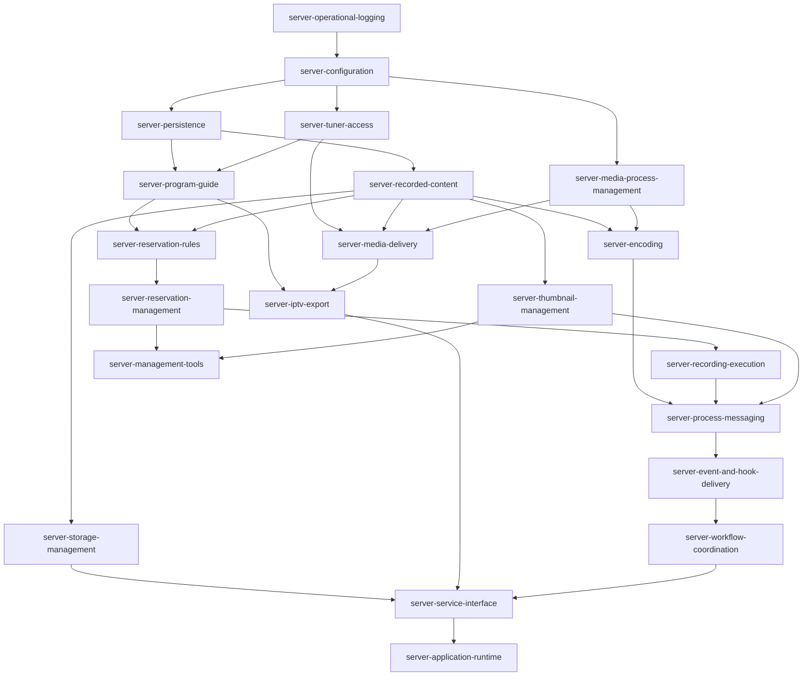

# EPGStation 機能仕様インデックス

## Overview

この文書は、EPGStationの機能仕様の所在、責務、依存関係、整備状態を管理する索引である。機能ごとの要求と設計は`.kiro/specs/frontend-*`および`.kiro/specs/server-*`を正本とし、この文書へ詳細仕様を重複記載しない。

checkboxは仕様整備状態を表す。`[x]`はrequirements / design / tasksが整備されていること、`[ ]`は未整備または整備中であることを示す。実装変更時は該当specと本索引を同じ変更単位で更新する。

server仕様書の構成原則は`.kiro/steering/server-specification.md`、server testの共通方針は`.kiro/steering/server-testing.md`、client testの方針は`.kiro/steering/testing.md`に従う。

## Server capability hierarchy

この階層は「どの機能をどこから読むか」を示すナビゲーションであり、source directoryやprocess配置をspec境界にしない。機能間の依存方向は次節の依存DAGを正本とする。

```mermaid
flowchart TB
    ROOT[EPGStation Server]
    RC[Runtime and coordination]
    SR[Scheduling and recording]
    CM[Recorded content and media]
    IO[External interface and operations]
    PF[Platform capabilities]

    ROOT --> RC
    ROOT --> SR
    ROOT --> CM
    ROOT --> IO
    ROOT --> PF

    RC --> AR[server-application-runtime]
    RC --> WF[server-workflow-coordination]
    RC --> EH[server-event-and-hook-delivery]

    SR --> PG[server-program-guide]
    SR --> RM[server-reservation-management]
    SR --> RR[server-reservation-rules]
    SR --> RE[server-recording-execution]

    CM --> CD[server-recorded-content]
    CM --> SM[server-storage-management]
    CM --> TM[server-thumbnail-management]
    CM --> EN[server-encoding]
    CM --> MD[server-media-delivery]
    CM --> IE[server-iptv-export]

    IO --> SI[server-service-interface]
    IO --> MT[server-management-tools]

    PF --> CF[server-configuration]
    PF --> OL[server-operational-logging]
    PF --> PM[server-process-messaging]
    PF --> PS[server-persistence]
    PF --> TA[server-tuner-access]
    PF --> MP[server-media-process-management]
```

## Dependency Graph

### Server dependency levels

| Level | Specs |
| --- | --- |
| 1 | `server-operational-logging` |
| 2 | `server-configuration` |
| 3 | `server-media-process-management`, `server-persistence`, `server-tuner-access` |
| 4 | `server-program-guide`, `server-recorded-content` |
| 5 | `server-encoding`, `server-media-delivery`, `server-reservation-rules`, `server-storage-management`, `server-thumbnail-management` |
| 6 | `server-iptv-export`, `server-reservation-management` |
| 7 | `server-management-tools`, `server-recording-execution` |
| 8 | `server-process-messaging` |
| 9 | `server-event-and-hook-delivery` |
| 10 | `server-workflow-coordination` |
| 11 | `server-service-interface` |
| 12 | `server-application-runtime` |

下図は直接依存113辺から推移辺を除いた依存DAGである。各specの完全な直接依存と被利用関係は、それぞれの`requirements.md`にある境界コンテキストを正本とし、直後の一覧は読む順序を示す索引とする。

## Specs (dependency order)

### Frontend specifications

-   [x] `frontend-settings-storage`: frontend localStorage 設定契約、default、保存/一時値/reset、欠損 field backfill、隣接 workflow storage key 。Dependencies: none.
-   [x] `frontend-app-shell`: 共通 shell、title bar、navigation drawer、selected item、theme/reconnect/version 表示。Dependencies: `frontend-settings-storage`.
-   [x] `frontend-settings-screen`: `/settings` 画面 UI、保存/reset/leave 動作、theme preview、navigation 再生成要求。Dependencies: `frontend-settings-storage`, `frontend-app-shell`.
-   [x] `frontend-guide`: Guide route、query、fetch、grid、dialog、stream handoff、responsive、Guide 固有 localStorage 参照。Dependencies: `frontend-settings-storage`, `frontend-app-shell`.
-   [x] `frontend-dashboard`: Dashboard summary、more link、recording/recorded/reserves 表示、responsive/theme 。Dependencies: `frontend-settings-storage`, `frontend-app-shell`.
-   [x] `frontend-onair`: On Air list/tab、program dialog、live stream dialog、live watch handoff 。Dependencies: `frontend-settings-storage`, `frontend-app-shell`.
-   [x] `frontend-recorded`: Recorded list、detail、watch、streaming、upload への主要 workflow 境界。Dependencies: `frontend-settings-storage`, `frontend-app-shell`.
-   [x] `frontend-reserves`: Reserves list、Manual Reserve、delete/unskip/unoverlap、manual add/edit 。Dependencies: `frontend-settings-storage`, `frontend-app-shell`.
-   [x] `frontend-search-rule`: Search と Rule の route/query、form mapping、rule add/edit/list action、bulk action 。Dependencies: `frontend-settings-storage`, `frontend-app-shell`.
-   [x] `frontend-recording-encode`: Recording list、Encode running/waiting list、single/bulk cancel、edit mode 。Dependencies: `frontend-settings-storage`, `frontend-app-shell`.
-   [x] `frontend-storages-upload`: Storages usage view と Recorded Upload flow 。Dependencies: `frontend-settings-storage`, `frontend-app-shell`.
-   [x] `frontend-video-playback`: live/recorded direct/streaming playback、platform constraints、player setting、subtitle handling 。Dependencies: `frontend-settings-storage`, `frontend-app-shell`.

### Server specifications

-   [x] `server-operational-logging`: サーバーの動作、利用者からの要求、警告、異常を、運用目的に応じた出力先と重要度で記録する。Dependencies: none.
-   [x] `server-configuration`: サーバー設定を読み込み、内容を検証・補完して各機能へ提供し、変更時の再読み込みを管理する。Dependencies: `server-operational-logging`.
-   [x] `server-media-process-management`: 映像変換と視聴処理が共有する実行枠を管理し、優先度に応じた開始・中断・終了を調整する。Dependencies: `server-configuration`, `server-operational-logging`.
-   [x] `server-persistence`: 番組、予約、録画済み番組などの情報を、選択したデータベースへ一貫して保存・検索・更新する。Dependencies: `server-configuration`, `server-operational-logging`.
-   [x] `server-tuner-access`: Mirakurunまたはmirakcから放送局・番組・チューナー情報と放送ストリームを取得し、接続状態の変化を扱う。Dependencies: `server-configuration`, `server-operational-logging`.
-   [x] `server-program-guide`: 放送局と番組情報を取得・更新し、番組表、検索、放送中番組、チャンネルロゴを提供する。Dependencies: `server-configuration`, `server-operational-logging`, `server-persistence`, `server-tuner-access`.
-   [x] `server-recorded-content`: 録画済み番組、録画ファイル、ドロップ情報、タグ、保護状態を管理し、登録・参照・削除・アップロードを提供する。Dependencies: `server-configuration`, `server-operational-logging`, `server-persistence`.
-   [x] `server-encoding`: 録画ファイルの変換要求を順番に実行し、進捗・取消・完了状態と生成されたファイルを管理する。Dependencies: `server-configuration`, `server-operational-logging`, `server-recorded-content`, `server-media-process-management`.
-   [x] `server-media-delivery`: ライブ放送と録画済み番組を直接または変換して配信し、視聴の開始から終了までと外部プレーヤー連携を管理する。Dependencies: `server-configuration`, `server-operational-logging`, `server-tuner-access`, `server-recorded-content`, `server-media-process-management`.
-   [x] `server-reservation-rules`: 検索条件と録画条件から自動予約ルールを管理し、該当番組を選んで重複しない予約候補を作成する。Dependencies: `server-configuration`, `server-operational-logging`, `server-program-guide`, `server-recorded-content`, `server-persistence`.
-   [x] `server-storage-management`: 録画保存先の空き容量を監視し、設定した条件に従って削除可能な録画済み番組の整理を要求する。Dependencies: `server-configuration`, `server-operational-logging`, `server-persistence`, `server-recorded-content`.
-   [x] `server-thumbnail-management`: 録画済み番組のサムネイルを生成・再生成し、番組情報や録画ファイルと対応付けて整理する。Dependencies: `server-configuration`, `server-operational-logging`, `server-persistence`, `server-recorded-content`.
-   [x] `server-iptv-export`: IPTVクライアント向けにチャンネル一覧と番組表を出力し、視聴用URLと番組情報を対応付ける。Dependencies: `server-configuration`, `server-operational-logging`, `server-persistence`, `server-program-guide`, `server-media-delivery`.
-   [x] `server-reservation-management`: 番組予約と時刻指定予約を管理し、利用可能なチューナー能力をもとに重複・競合・スキップ状態と放送波別の録画可否を判定する。Dependencies: `server-configuration`, `server-operational-logging`, `server-program-guide`, `server-tuner-access`, `server-reservation-rules`, `server-persistence`.
-   [x] `server-management-tools`: サーバーデータのバックアップ、復元、旧バージョンからの移行を実行し、形式の違いや途中失敗を扱う。Dependencies: `server-configuration`, `server-operational-logging`, `server-persistence`, `server-reservation-management`, `server-reservation-rules`, `server-recorded-content`, `server-thumbnail-management`.
-   [x] `server-recording-execution`: 予約時刻に合わせて録画を準備・開始・終了し、失敗時の再試行と録画結果の引き渡しを管理する。Dependencies: `server-configuration`, `server-operational-logging`, `server-reservation-management`, `server-program-guide`, `server-tuner-access`, `server-recorded-content`.
-   [x] `server-process-messaging`: 分かれて動作するサーバー機能の間で、要求、結果、状態変化を対応付けて安全に受け渡す。Dependencies: `server-operational-logging`, `server-encoding`, `server-recorded-content`, `server-recording-execution`, `server-reservation-management`, `server-reservation-rules`, `server-thumbnail-management`.
-   [x] `server-event-and-hook-delivery`: 番組、予約、録画、変換などの状態変化を、関係するサーバー機能、画面、外部コマンドへ届ける。Dependencies: `server-configuration`, `server-operational-logging`, `server-process-messaging`, `server-program-guide`, `server-reservation-rules`, `server-reservation-management`, `server-recording-execution`, `server-recorded-content`, `server-thumbnail-management`, `server-encoding`.
-   [x] `server-workflow-coordination`: 番組情報、予約、録画、録画済み番組の変化に応じて必要な後続処理を選び、実行順序と失敗時の扱いを調整する。Dependencies: `server-operational-logging`, `server-program-guide`, `server-reservation-management`, `server-reservation-rules`, `server-recording-execution`, `server-recorded-content`, `server-thumbnail-management`, `server-encoding`, `server-event-and-hook-delivery`.
-   [x] `server-service-interface`: Web UI、API、アップロード、映像配信の入口とリアルタイム通知を提供し、利用者からの要求を各サーバー機能へ受け渡す。Dependencies: `server-configuration`, `server-operational-logging`, `server-process-messaging`, `server-program-guide`, `server-reservation-management`, `server-reservation-rules`, `server-recording-execution`, `server-recorded-content`, `server-thumbnail-management`, `server-encoding`, `server-storage-management`, `server-media-delivery`, `server-iptv-export`, `server-event-and-hook-delivery`, `server-workflow-coordination`.
-   [x] `server-application-runtime`: サーバー全体を決められた順序で起動・監視・終了し、通常利用と保守作業の切り替えを管理する。Dependencies: `server-configuration`, `server-operational-logging`, `server-tuner-access`, `server-persistence`, `server-process-messaging`, `server-workflow-coordination`, `server-reservation-management`, `server-recording-execution`, `server-recorded-content`, `server-storage-management`, `server-service-interface`, `server-program-guide`.
